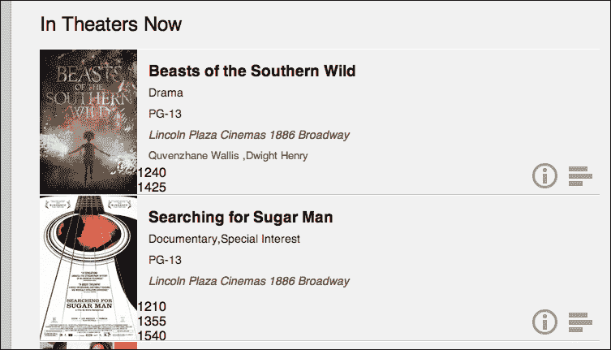
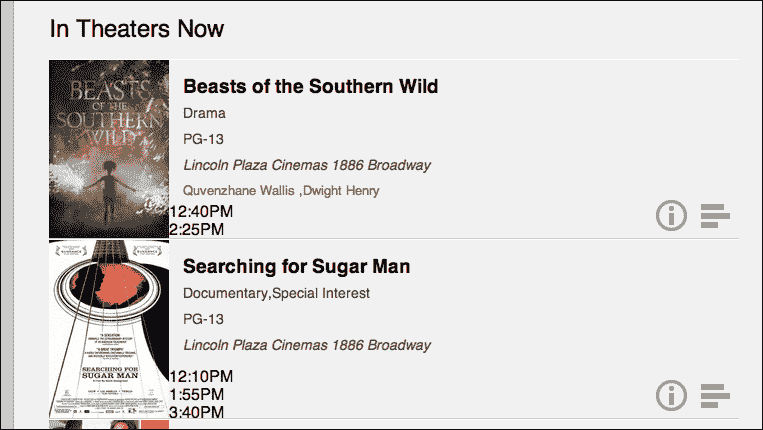
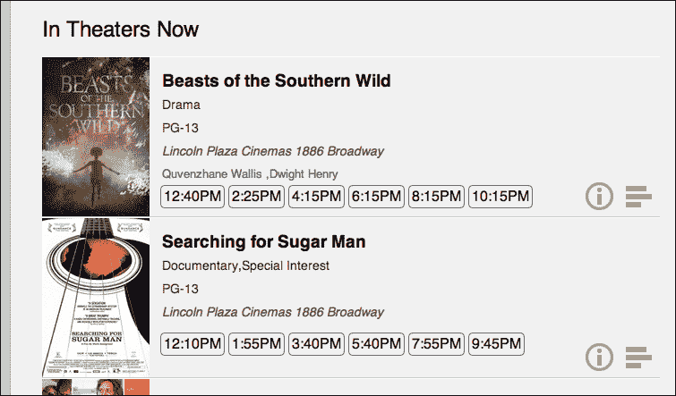
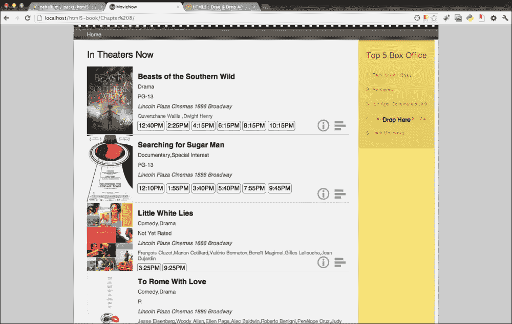
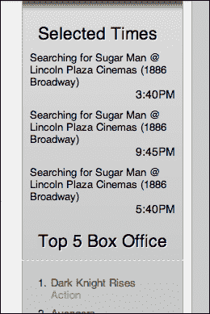

# 第八章。应用：通过拖放选择 UI

尽管拖放功能自 1999 年微软在 Internet Explorer 5.0 中实现以来就已经存在，但 HTML5 以一种更标准的方式将其推向前台。该规范定义了一组 API、事件处理程序和标记，用于将拖放功能（DnD）添加到您的企业应用程序中。为了演示这一点，我们将在 MovieNow 企业应用程序中实现将电影放映时间拖放到预演区域的功能，以指示用户感兴趣观看的电影。

本章涵盖的主要主题是：

+   添加放映时间

+   样式化放映时间

+   真是糟糕

+   放下它

# 添加放映时间

我们暂时从第四章*应用：通过地理位置获取电影*中移除了放映时间，以腾出空间放置电影数据、剧情简介、预告片和评分。现在我们将重新添加放映时间。为此，我们将通过在`movienow.geolocation.js`中的`displayShowtimes`方法中插入一个`div`标签来包含放映时间，并遍历我们之前构建的`movie`对象中包含的放映时间数组。注意我们如何包含一个`data-movie`属性，其中包含影院 ID、电影 ID 和放映时间。我们这样做是为了保存一些关于放映时间的数据，以便在以后我们需要知道放映时间属于哪部电影和哪个影院时使用。

我们将把以下代码片段插入到`displayShowtimes`方法中：

```js
movieHTML+='<div class="showtimes">';
if (typeof movie.showtime == 'string') movie.showtime = Array(movie.showtime);
for(var i=0; i<movie.showtime.length; i++) {
if (movie.showtime[i]) movieHTML+='<div class="showtime" draggable="true" title="'+movie.title+' @ '+movie.theater.title+' ('+movie.theater.address+')" data-movie= "'+movie.theater.id+':'+movie.id+':'+movie.showtime[i]+'">'+that.formatTime(movie.showtime[i])+'</div> ';
}
movieHTML+='</div>';
```

完整的方法应如下所示：

```js
this.displayShowtimes = function(movies) {
  var movie = null;
  var html = '<ul>';
  for (var item in movies.items) {
    movie = movies.items[item];
    var movieDesc='';
    if (movie.synopsis) movieDesc=(movie.synopsis.length>200)?movie.synopsis.substr(0,200)+"...": movie.synopsis;
    var movieHTML='<li itemscope itemtype="http://schema.org/Movie">';
    movieHTML+='';
    movieHTML+='<section class="main-info">';
    movieHTML+='<input type="button" class="charting-button" />';
    movieHTML+='<input type="button" class="details-button" />';
    movieHTML+='<h3 itemprop="name">'+movie.title+'</h3>';
    movieHTML+='<p class="details genre" itemprop="genre">'+Array(movie.genre).join(', ')+'</p>';
    movieHTML+='<p class="details">'+movie.mpaaRating+'</p>';
    movieHTML+='<p class="theater">'+movie.theater.title+" "+movie.theater.address+'</p>';
    movieHTML+='<p class="actors">'+Array(movie.selectedStar).join(', ')+'</p>';
    movieHTML+='<div class="showtimes">';
 if (typeof movie.showtime == 'string') movie.showtime = Array(movie.showtime);
 for(var i=0; i<movie.showtime.length; i++) {
 if (movie.showtime[i]) movieHTML+='<div class="showtime" draggable="true" title="'+movie.title+' @ '+movie.theater.title+' ('+movie.theater.address+')" data-movie="'+movie.theater.id+':'+movie.id+':'+movie.showtime[i]+'">'+movie.showtime[i]+'</div> ';
 }
 movieHTML+='</div>';
    movieHTML+='</section>';
    movieHTML+='<section class="description">';
    movieHTML+='<h3 itemprop="name">'+movie.title+'</h3>';
    movieHTML+='<p>'+movieDesc+'</p>';
    movieHTML+='</section>';  
    movieHTML+='<section class="charting">';
    movieHTML+='<h3 itemprop="name">'+movie.title+'</h3>';
    movieHTML+='<p><canvas data-feed= "MetaCritic:'+movie.avgMetaCriticRating+",EditorBoost:"+movie.editorBoost+",User Rating:"+movie.avgUserRating+'"></canvas></p>';
    movieHTML+='</section>';                     
    movieHTML+='</li>';
    html+=movieHTML;
  }
  html+= '</ul>';
  $('#movies-near-me').html(html);
  $("#movies-near-me li .details-button").click(that.showDetails);
  $("#movies-near-me li .description, #movies-near-me li .charting").click(function(){$(this).parent().removeClass("open")});
  $("#movies-near-me li .charting-button").click(that.showCharts);
  init();
};
```

如果您在网页浏览器中预览此更改，您应该看到以下类似的内容：



# 样式化放映时间

当然，原始的放映时间数据看起来并不像我们传统上看时间的方式。我们需要格式化时间，以确保我们的用户正确理解数据。

为了实现这一点，我们将修改以下`displayShowtimes`中的以下行：

```js
if (movie.showtime[i]) movieHTML+='<div class="showtime" title="'+movie.title+' @ '+movie.theater.title+' ('+movie.theater.address+')" data-movie= "'+movie.theater.id+':'+movie.id+':'+movie.showtime[i]+'">'+movie.showtime[i]+'</div> ';
```

我们将使用即将编写的`formatTime`方法包装放映时间的显示。更改之前的行，使其看起来类似于以下行：

```js
if (movie.showtime[i]) movieHTML+='<div class="showtime" title="'+movie.title+' @ '+movie.theater.title+' ('+movie.theater.address+')" data-movie= "'+movie.theater.id+':'+movie.id+':'+movie.showtime[i]+'">'+that.formatTime(movie.showtime[i])+'</div> ';
```

然后，我们可以添加以下方法来格式化时间。此方法接收传递给它的字符串，获取小时的第一两个字符，分钟的相邻两个字符，然后解释并修改小时数据，将其从 24 小时制改为 12 小时制。

```js
this.formatTime = function(time) {
  var hh = time.substr(0,2);
  var mm = time.substr(2,2);
  var period = 'AM';
  hh = parseInt(hh, 10);
  if (hh >= 12) period = 'PM';
  if (hh > 12) hh -= 12;
  return hh+':'+mm+period;
};
```

此更改的预览应类似于以下截图：



为了使放映时间更加美观，我们在`styles.css`中添加以下样式：

```js
.showtimes {
  float:left;
  margin-left:10px;
}
.showtimes .showtime {
  float:left;
  padding:3px;
  margin:0 2px;
  border:1px solid #666;
  -moz-border-radius:5px;
  border-radius:5px;
  cursor:move;
}
```

我们将放映时间浮动到左侧，以便它们水平排列，并在它们周围添加一个边框，以便与其他内容区分开来。最后，我们将光标设置为移动，这样当您将鼠标悬停在它们上时，鼠标指针会变为操作系统中的移动图标，以指示放映时间是一个可移动的对象。

刷新预览应显示如下内容：



# 真是件麻烦事

在 HTML5 中使某个元素可拖动的第一步是将 `draggable` 属性附加到该元素。这会向浏览器发出信号，创建一个元素幽灵图像，当用户触发鼠标按下事件时，该图像将出现并跟随鼠标指针，从而实现“拖动”元素，并在鼠标按钮释放时消失。

在 `displayShowtimes` 中更改此行，其中我们显示放映时间：

```js
if (movie.showtime[i]) movieHTML+='<div class="showtime" title="'+movie.title+' @ '+movie.theater.title+' ('+movie.theater.address+')" data-movie= "'+movie.theater.id+':'+movie.id+':'+movie.showtime[i]+'">'+that.formatTime(movie.showtime[i])+'</div> ';
```

现在应包括 `draggable="true"` 属性：

```js
if (movie.showtime[i]) movieHTML+='<div class="showtime" draggable="true" title="'+movie.title+' @ '+movie.theater.title+' ('+movie.theater.address+')" data-movie= "'+movie.theater.id+':'+movie.id+':'+movie.showtime[i]+'">'+that.formatTime(movie.showtime[i])+'</div> ';
```

接下来，将以下 CSS 样式添加到 `styles.css`。

```js
[draggable=true] {
  -moz-user-select:none;
  -khtml-user-select:none;
  -webkit-user-select:none;
  user-select:none;
  -khtml-user-drag:element;
  -webkit-user-drag:element;
}
```

### 注意

前缀 `-khtml` 是用于旧版 Safari 的。

由于浏览器在用户点击并拖动时的默认行为是选择文本高亮，我们需要覆盖此行为。之前给出的样式是针对不同浏览器的简写，以防止这种行为。

### 注意

对于 Internet Explorer，我们需要一个 JavaScript 解决方案来覆盖拖动的默认选择行为，因为没有等效功能。我们将在实现拖放行为时介绍这一点。

最后，我们需要一些 JavaScript 来处理拖动时触发的事件。为了开始，我们需要创建一个新的 JavaScript 文件。我们将称之为 `movienow.draganddrop.js` 并将其放置在 `js` 文件夹中。我们还需要在 `index.html` 中添加对这个新文件的引用。在关闭 `body` 标签之前添加以下内容：

```js
<script src="img/movienow.draganddrop.js"></script>
```

`index.html` 中的脚本标签应类似于以下代码片段：

```js
	<script src="img/ios-orientationchange-fix.js"></script>
	<script src="img/jquery-1.8.0.min.js"></script>
	<script src="img/jquery.xdomainajax.js"></script>
	<script src="img/three.js"></script>
	<script src="img/movienow.draganddrop.js"></script>
	<script src="img/movienow.charts.js"></script>
	<script src="img/movienow.geolocation.js"></script>
	<script src="img/movienow.js"></script>
</body>
```

## 使用 JavaScript 处理拖动

在 `movienow.draganddrop.js` 中，我们将首先创建一个简单的对象：

```js
var movienow = movienow || {};
movienow.draganddrop = (function(){
    var that = this;
})();
```

在该对象中，我们将添加一个 `init` 方法，当放映时间加载到页面时执行。看看以下代码：

```js
this.init = function() {
  var dragItems = $('[draggable=true]');
  for (var i=0; i<dragItems.length; i++) {
    $(dragItems[i])[0].addEventListener('dragstart', function(event){
      return false;
    });
    $(dragItems[i])[0].addEventListener('dragend', function(event) {
      return false;
    });
  }
}
```

`init` 方法使用 `jQuery` 查找所有可拖动元素，即具有 `draggable="true"` 属性和值的元素。然后它遍历可拖动元素的集合，并为 `dragstart` 和 `dragend` 事件添加事件监听器。当可拖动元素被拖动时，会触发 dragstart 事件。所有事件监听器依次被调用。在这种情况下，我们只是什么也不做并返回 `false`，但稍后我们将做一些更有趣的事情。

### 注意

**拖动事件**

`dragstart` – 当可拖动元素开始被拖动时触发

`drag` – 当鼠标移动且可拖动元素正在被拖动时触发

`dragend` – 当可拖动元素被放下（当用户释放鼠标按钮时）时触发

`dragenter` – 当目标元素中拖入一个拖动元素时触发

`dragover` – 当鼠标在拖动元素内部移动时，会触发目标元素

`dragleave` – 当目标元素中拖出拖动元素时触发

`drop` – 当目标元素中释放拖动元素时触发

最后，当电影数据加载时，我们需要调用 `init` 方法。在 `movienow.geolocation.js` 中的 `displayShowtimes` 方法，我们需要将以下行作为方法的最后一行结束：

```js
init();
```

在我们继续之前，我们需要添加以下内容以适应 Internet Explorer。由于 Internet Explorer 没有使用 CSS 覆盖拖动默认选择行为的方法，我们需要使用 JavaScript 实现。在这种情况下，我们处理 `selectstart` 事件，并在它被触发时向浏览器指示我们正在拖放：

```js
$(dragItems).bind('selectstart', function() {
	this.dragDrop(); return false;
});
```

我们的 `init` 方法现在应该看起来像以下这样：

```js
this.init = function() {
  var dragItems = $('[draggable=true]');
  for (var i=0; i<dragItems.length; i++) {
    $(dragItems[i])[0].addEventListener('dragstart', function(event){
      return false;
    });
    $(dragItems[i])[0].addEventListener('dragend', function(event) {
      return false;
    });
  }
  $(dragItems).bind('selectstart', function() {
    this.dragDrop(); return false;
  });
}
```

# 放下它

既然我们可以拖动东西，让我们看看如何放下它们，当它们被放下时做一些有用的事情。首先，我们需要一个放置元素的地方。对于放映时间，我们将在页面右侧创建一个区域来放置元素。一旦元素被放置在那里，它们将显示在 **Top 5 Box Office** 部分之上。

让我们在 `index.html` 中的 `aside` 标签内添加几个 `div` 标签。我们将它们命名为 `dropzone` 和 `dropstage`。将以下行添加到 `aside` 标签的开头：

```js
<div id="dropzone">Drop Here</div>
<div id="dropstage">
  <h2>Selected Times</h2>
</div>
```

`aside` 标签的开头应该看起来像以下代码：

```js
<aside>
  <div id="dropzone">Drop Here</div>
 <div id="dropstage">
 <h2>Selected Times</h2>
 </div>
  <h2>Top 5 Box Office</h2>
```

现在我们有了一个放置元素的地方，以及一个放置元素的地方，一旦它们被放下，让我们专注于 `dropzone`。这是我们放置元素的区域。将以下样式添加到 `styles.css`：

```js
#dropzone {
  border:1px solid #ffb73d;
  width:198px;
  height:auto;
  min-height:100%;
  text-align:center;
  z-index:2;
  position:absolute;
  margin-top:-28px;
  padding-top:200px;
  background: rgb(215, 215, 0);
  background: rgba(255, 215, 0, 0.5);
  filter:progid:DXImageTransform.Microsoft.gradient(startColorstr=#80FFD700, endColorstr=#80FFD700);
  -ms-filter: "progid:DXImageTransform.Microsoft.gradient(startColorstr=#80FFD700, endColorstr=#80FFD700)";
}
```

### 小贴士

注意，`filter:progid` 和 `progid` 是针对 Internet Explorer 的特定功能。

这应该添加一个覆盖右侧的黄色框。你的预览应该看起来像以下截图：



## 切换放置区域

让我们重新审视 `movienow.draganddrop.js`。记住，我们为拖动开始和拖动结束添加了事件监听器。让我们使用这些来在拖动时隐藏和显示放置区域。

将以下内容添加到 `dragstart` 事件监听器：

```js
$('#dropzone').show();
```

将以下内容添加到 `dragend` 事件监听器：

```js
$('#dropzone').hide();
```

事件监听器应该看起来像以下代码片段：

```js
$(dragItems[i])[0].addEventListener('dragstart', function(event){
  $('#dropzone').show();
  return false;
});
$(dragItems[i])[0].addEventListener('dragend', function(event) {
  $('#dropzone').hide();
  return false;
});
```

默认隐藏放置区域，向 `#dropzone` 样式添加以下行：

```js
display:none;
```

到目前为止，当你预览时，放置区域应该只在拖动放映时间时出现。

## 转移一些数据

我们开始理解拖放机制。然而，为了使我们的拖动功能更有趣，我们需要将一些数据附加到可拖动的元素上，这样一旦放下，我们就有一些有趣的东西可以展示。为了简单起见，让我们转移元素本身。为此，我们设置 `event` 对象的 `dataTransfer` 属性。`event` 对象允许我们跟踪页面上的事件并管理它们的数据。它是所有事件监听器的参数。

将以下行添加到 `dragstart` 事件监听器：

```js
event.dataTransfer.setData('Text', this.outerHTML);
```

`dragstart` 事件监听器应该看起来像以下代码：

```js
$(dragItems[i])[0].addEventListener('dragstart', function(event){
  $('#dropzone').show();
  event.dataTransfer.setData('Text', this.outerHTML);
  return false;
});
```

我们还需要在拖放区域添加一些事件监听器，以便当元素被放置在其上时，我们可以让它做一些有趣的事情。在这种情况下，我们将在拖放阶段显示它。

将以下内容添加到`movienow.draganddrop.js`中的`init`方法：

```js
$('#dropzone')[0].addEventListener('drop', function(event) {0event.stopPropagation();
  if (event.preventDefault) event.preventDefault();
  $('#dropstage').append(event.dataTransfer.getData('Text')).show();
  return false;
});
$('#dropzone')[0].addEventListener('dragover', function(event) {
  if (event.preventDefault) event.preventDefault();
  return false;
});
$('#dropzone')[0].addEventListener('dragenter', function(event) {
  if (event.preventDefault) event.preventDefault();
  return false;
});
```

`drop`事件是核心。这是处理元素被拖放时发生的事情的地方。请注意，我们从`dragstart`中获取存储的数据并将其附加到`dropstage`的`div`标签上。我们还必须在`drop`、`dragover`和`dragenter`事件上停止传播、防止默认行为并返回`false`，以防止浏览器浏览到该元素。

## 显示结果

现在我们已经完成了拖动的框架，我们希望显示电影数据以及放映时间和风格，以更好地展示。我们首先通过向`event`对象添加更多数据来实现这一点。

将以下行添加到拖动开始事件监听器中，以便我们可以捕获电影标题、剧院标题以及时间数据作为单独的数据点：

```js
event.dataTransfer.setData('Title', $(this)[0].title);
event.dataTransfer.setData('Time', $(this).html());
```

事件监听器应类似于以下代码片段：

```js
$(dragItems[i])[0].addEventListener('dragstart', function(event){
  $('#dropzone').show();
  event.dataTransfer.setData('Text', this.outerHTML);
  event.dataTransfer.setData('Title', $(this)[0].title);
  event.dataTransfer.setData('Time', $(this).html());
  return false;
});
```

在拖放区域的`drop`事件监听器中，修改以下行：

```js
$('#dropstage').append(event.dataTransfer.getData('Text')).show();
```

我们需要构建一些 HTML 以插入到 DOM 对象中。将`Title`和`Time`数据点取出来并相应地显示：

```js
var html='<div class="selected-time">';
html+='<div class="title">'+event.dataTransfer.getData('Title')+'</div>';
html+='<div class="time">'+event.dataTransfer.getData('Time')+'</div>';
html+='</div>';
$('#dropstage').append(html).show();
```

整个`drop`事件监听器应类似于以下代码片段：

```js
$('#dropzone')[0].addEventListener('drop', function(event) {
  if (event.stopPropagation) event.stopPropagation();
  if (event.preventDefault) event.preventDefault();
  var html='<div class="selected-time">';
  html+='<div class="title">'+event.dataTransfer.getData('Title')+'</div>';
  html+='<div class="time">'+event.dataTransfer.getData('Time')+'</div>';
  html+='</div>';
  $('#dropstage').append(html).show();
  return false;
});
```

最后，我们需要为拖放阶段设置样式，以便当放映时间被拖放到它上面时，它们看起来是可展示的。将以下内容添加到`styles.css`中，以适当地显示选定时间的数据和拖放阶段：

```js
.selected-time {
  float:left;
  margin-bottom:10px;
}
.selected-time .title {
  font-size:.8em;
  padding:0 10px;
}
.selected-time .time {
  font-size:.9em;
  clear:both;
  float:right;
  padding-right:10px;
}
#dropstage {
  display:none;
  float:left;
  width:100%;
  padding-bottom: 5px;
  margin-bottom: 5px;
}
#dropstage h2 {
  border:0;
}
```

注意到`#dropstage`上的`display`被设置为`none`。`drop`事件监听器实际上显示了这一部分，以便它仅在存在拖放项时显示。我们还需要调整`aside h2`的样式，以便**Top 5 Box Office**文本不会换行。为此，只需添加以下代码：

```js
clear:both;
```

现在拖放阶段已经设置了样式，当我们将其拖放到拖放区域时，应该能够适当地显示我们的放映时间。试一试。



# 摘要

在本章中，我们介绍了如何通过标记它们来设置可拖动项。我们介绍了拖放和与之相关的事件的机制。此外，我们还介绍了如何将这些内容组合起来，为您的 HTML5 企业应用程序实现一些有趣的功能。

在下一章中，我们将讨论 HTML5 表单。我们将使用它们来提交关于特定放映时间的推文到 Twitter。
