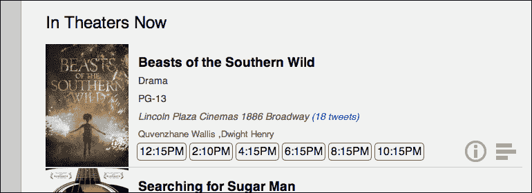
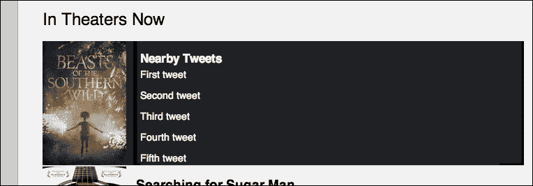

# 第十章：应用：通过 Web Workers 消费推文

到目前为止，JavaScript 一直是单线程的。对于运行缓慢或耗时的过程，页面上的所有内容都可能因为等待某个任务完成而突然停止。到目前为止，你可以使用 AJAX 甚至`setTimeout`来委托任务；然而，这些解决方案都不允许真正的并行执行，处理状态变得相当混乱。

为了弥补这一不足，HTML5 规范引入了 Web Workers。Web Workers 允许你创建非用户导向的后台线程，它们可以同时运行。它们通常用于计算密集型任务。然而，对于我们的 MovieNow 企业应用，我们将使用 Web Workers 来查找剧院附近的推文并显示它们。尽管不一定计算密集，但 Web Workers 在更新页面上的多个元素状态时非常有用，而不会打断整体的用户体验（请注意，通常只有一个 UI 渲染线程）。

在本章中，我们将涵盖：

+   获取数据

+   捕获地理编码

+   网页工作线程的结构

+   使用 Web Workers 获取附近的推文

+   更新事件监听器

+   推文的样式

# 获取数据

为了开始，让我们创建一个查询 Twitter REST API 并返回指定地理编码附近推文的端点。在应用程序的根目录下创建一个名为`nearbytweets.php`的 PHP 文件。打开它并粘贴以下代码：

```js
<?php 
  $latitude = $_GET['latitude'];
  $longitude = $_GET['longitude'];
  if (strpos($latitude, '.') == false) {
    $latitude = substr($latitude, 0, -4) . '.' . substr($latitude, -4);
  }
  if (strpos($longitude, '.') == false) {
    $longitude = substr($longitude, 0, -4) . '.' . substr($longitude, -4);
  }
  $tweets = file_get_contents('http://search.twitter.com/search.json?include_entities=true&result_type=mixed&geocode=' . $latitude . ',' . $longitude . ',0.25mi'); 
    echo $tweets;
?>
```

这是一个简单的页面，它接受两个参数：纬度和经度。然后它查询 Twitter REST API 1.1，如[`dev.twitter.com/docs/api/1.1`](https://dev.twitter.com/docs/api/1.1)中定义的。它返回包含来自指定纬度和经度 0.25 英里范围内的推文的 JSON 数据。

# 捕获地理编码

现在我们有了获取数据的地方，我们需要捕获每个剧院的纬度和经度以发送到我们的新端点。在`movienow.geolocation.js`中，我们将进行一些小的修改。在`displayShowtimes`方法中，我们需要调整剧院名称的显示位置。具体来说，我们需要输入纬度和经度并将它们添加到一个新的`data`属性中。这允许我们稍后使用这些数据。

更改以下行：

```js
movieHTML+='<p class="theater">'+movie.theater.title+" "+movie.theater.address+'</p>';
```

更改为：

```js
movieHTML+='<p class="theater" data-location= "'+movie.theater.latitude+','+movie.theater.longitude+'">'+movie.theater.title+" "+movie.theater.address+'</p>';
```

接下来，我们将在`js`文件夹中创建一个名为`movienow.nearbytweets.js`的新 JavaScript 文件。在`index.php`中，我们将添加对新 JavaScript 文件的引用：

```js
<script src="img/ios-orientationchange-fix.js"></script>
<script src="img/jquery-1.8.0.min.js"></script>
<script src="img/jquery.xdomainajax.js"></script>
<script src="img/three.js"></script>
<script src="img/movienow.nearbytweets.js"></script>
<script src="img/movienow.tweet.js"></script>
<script src="img/movienow.draganddrop.js"></script>
<script src="img/movienow.charts.js"></script>
<script src="img/movienow.geolocation.js"></script>
<script src="img/movienow.js"></script>
```

在`movienow.nearbytweets.js`中，我们将从一些模板代码开始。向`movienow`中设置`nearbytweets`命名空间添加以下代码：

```js
var movienow = movienow || {};
movienow.nearbytweets = (function(){
  var that = this;
})();
```

# 网页工作线程的结构

要真正理解 Web Workers，可以想象一个在家工作的业务，其中家庭被发送包含促销材料和信封的包裹。每个家庭都需要将促销材料装入信封，密封信封，并将包裹作为包裹送回原始业务。在家工作的家庭对业务的内部情况一无所知。他们只知道他们被给予了一个包裹，他们必须对包裹进行处理，并且他们必须将包裹送回。

Web Workers 在一个隔离的线程中运行，它们对调用它们的页面状态一无所知。它们只是接收一条消息，对这条消息进行处理，然后返回一条消息。调用程序指定了一个事件监听器，当 Web Worker 返回消息时，该监听器会做出响应。

Web Workers 有两种类型。它们是：

+   **专用 Web Workers**：有时它们也被称为 Web Workers。它们只能通过创建它们的脚本访问，尽管可以使用消息端口与其他上下文进行通信。

+   **共享 Web Workers**：它们有名称并且共享全局作用域，因此任何在同一源运行的脚本都可以获取此类工作者的引用。

在这种情况下，我们将使用专用 Web Workers。Web Workers 通常在单独的 JavaScript 文件中定义。要创建一个 Web Worker，你只需实例化它：

```js
var worker = new Worker('mywebworker.js');
```

一旦创建，你可以通过使用 `postMessage` 方法与 Web Worker 进行通信：

```js
worker.postMessage('Hi worker!');
```

要从 Web Worker 接收通信，只需定义一个基于 `onmessage` 事件触发的事件监听器：

```js
worker.addEventListener('message', function(e) {
  console.log(e.data);
}, false);
```

Web Worker 可以定义为以下内容：

```js
self.addEventListener('message', function(e) {
  self.postMessage(e.data);
}, false);
```

它基本上定义了一个用于接收消息的事件监听器。随着消息的到来，它执行附加到消息事件的函数，并通过使用 `postMessage` 方法返回它，这与它的调用方式非常相似。客户端的事件监听器被调用，然后大家继续各自的道路。

如果 Web Worker 中发生错误，可以通过监听 Web Worker 上的错误事件来处理异常：

```js
worker.addEventListener('error', function(e) {
  console.log(e.message);
}, false);
```

需要注意的是，Web Worker 处于一个沙盒中。它根本不访问页面的状态。相反，它接收到的任何内容都将始终是发送内容的副本。事件引用的 JavaScript 库不可用。实际上，DOM、`window`、`document` 和 `parent` 对象都不可用，因此在 Web Worker 中无法进行任何 DOM 操作或读取，也无法使用 `window` 对象。你是一个完全独立的家庭。

然而，你可以使用 `navigator` 对象，利用 `XMLHttpRequest` 对象，并启动其他 Web Workers。

### 小贴士

嵌套工作者必须托管在与父文档相同的源中。此外，嵌套工作者的 URI 是相对于父工作者的位置解析的，而不是拥有文档的位置。

你还可以使用 `importScripts` 方法导入脚本，以及使用 `setTimeout` 和 `setInterval`。

# 使用 Web Workers 获取附近的推文

在 `movienow.nearbytweets.js` 中，我们将定义几个方法。首先，让我们定义一个获取推文的入口点方法：

```js
this.getTweets = function() {};
```

添加此方法后，我们可以在 `movienow.geolocation.js` 的 `displayShowtimes` 方法的最后调用它：

```js
  $("#movies-near-me li .charting-button").click(that.showCharts);
  init();
  getTweets();
};
```

到目前为止，一切顺利，但我们还没有做任何事情。让我们在 `movienow.nearbytweets.js` 中添加一个新的方法，名为 `getTweetsByTheater`：

```js
this.getTweetsByTheater = function(theater) {};
```

新的 `getTweetsByTheater` 方法将接受一个 "theater" 元素并获取其推文。在这种情况下，我们所说的 "theater" 元素是指 `movienow.geolocation.js` 中定义的 `theater` 类的 `div` 标签。然后我们将通过简单的 jQuery 调用从 `getTweets` 方法中调用它。如下增强 `getTweets`：

```js
this.getTweets = function() {
  $('.theater').each(function() {
    that.getTweetsByTheater(this);
  });
};
```

现在让我们进入脚本的核心部分。我们将实例化我们的 Web Worker。让我们首先添加 Web Worker 机制的框架。将以下内容添加到 `getTweetsByTheater` 方法中：

```js
var worker = new Worker('js/movienow.worker.js');
worker.addEventListener('message', function(e) {
}, false);
worker.postMessage();
```

为了完成框架，我们将在 `js` 文件夹中添加一个新的 JavaScript 文件，名为 `movienow.worker.js`。将以下代码片段添加到其中：

```js
self.addEventListener('message', function(e) {
}, false);
```

现在我们已经设置了 Web Worker 的初始框架，让我们从传递给 `getTweetsByTheater` 的剧院对象中提取地理编码，并将其传递给 Web Worker。我们将使用之前在 `movienow.geolocation.js` 中添加的 `data-location` 属性并解析出纬度和经度。用以下代码替换 `worker.postMessage()` 调用的框架：

```js
var geocode = $(theater).attr('data-location');
var latitude = geocode.split(',')[0];
var longitude = geocode.split(',')[1];
worker.postMessage({
  'latitude': latitude,
  'longitude': longitude 
});
```

现在我们将经纬度传递给 Web Worker，让我们更新它以调用本章开头实现的该服务。将以下内容添加到 `movienow.worker.js` 的事件监听器主体中：

```js
var url = '../nearbytweets.php';
var data = 'latitude='+e.data.latitude+'&longitude='+e.data.longitude;
var xhr = new XMLHttpRequest();
xhr.open('GET', url + '?' + data, true);
xhr.send(null);
xhr.onreadystatechange = function() {
  if (xhr.readyState == 4) {
    if (xhr.status == 200 || xhr.status ==0) {
      self.postMessage(xhr.responseText);
    } else {
      throw xhr.status + xhr.responseText;
    }
  } 
}
```

注意，我们正在使用 `XMLHttpRequest`。通常，我们会使用 jQuery 的 `ajax` 方法来执行此类调用。然而，由于 jQuery 依赖于 DOM，并且——如您所回忆的那样——在这个上下文中 DOM 不可用，所以我们不能使用它。相反，我们必须直接调用该对象并发出请求。一旦发出 AJAX 请求并触发 `onreadystatechange` 事件，负载将通过 `self.postMessage()` 返回给客户端。

完整的 `movienow.worker.js` 代码应类似于以下代码片段：

```js
self.addEventListener('message', function(e) {
  var url = '../nearbytweets.php';
  var data = 'latitude='+e.data.latitude+'&longitude='+e.data.longitude;
  var xhr = new XMLHttpRequest();
  xhr.open('GET', url + '?' + data, true);
  xhr.send(null);
  xhr.onreadystatechange = function() {
    if (xhr.readyState == 4) {
      if (xhr.status == 200 || xhr.status ==0) {
        self.postMessage(xhr.responseText);
      } else {
        throw xhr.status + xhr.responseText;
      }
    } 
  }
}, false);
```

### 小贴士

可以在不创建单独的 worker 文件的情况下实现 Web Workers。您可以在以下位置查看有关实现此技术的教程：[`www.html5rocks.com/en/tutorials/workers/basics/#toc-inlineworkers`](http://www.html5rocks.com/en/tutorials/workers/basics/#toc-inlineworkers)

# 更新事件监听器

返回到 `movienow.nearbytweets.js`，我们可以更新事件监听器以接收 Web Worker 返回的 JSON 对象。如果您查看我们将添加到事件监听器主体的以下代码，您将看到我们获取返回的数据并遍历结果集以捕获每条推文的文本：

```js
var data = objectifyJSON(e.data);
var nearbyTweets = '';
for (var i=0; i<data.results.length; i++) {
  nearbyTweets += '<li>'+data.results[i].text+'</li>';
}
var tweetCounter = (data.results.length==1) ? data.results.length+" tweet" : data.results.length+" tweets";
$(theater)
  .append(' <span class="tweet-count">('+ tweetCounter +')</span>')
  .parents('li').append('<section class="nearby-tweets"><h3>Nearby Tweets</h3><ul>'+nearbyTweets+'</ul></section>')
  .find('.tweet-count').click(that.showNearbyTweets)
  .parents('li').find('.nearby-tweets').click(that.hideNearbyTweets);
```

### 注意

记住我们在之前的章节中在 `movienow.geolocation.js` 内定义了 `objectifyJSON` 函数。如果传入的参数是对象，它返回相同的输入；如果它是一个字符串，它解析内容并返回一个对象。

在这里我们做了两件事。首先，我们在剧院名称旁边添加了一个推文计数（注意我们验证推文数量以添加单数 **tweet** 或复数 **tweets** 标签）。其次，我们添加了一个包含推文无序列表的 `section` 元素。目标是点击推文计数并显示推文。此外，我们还需要向 `nearbytweets` 对象添加两个更多的方法来显示和隐藏推文：

```js
this.showNearbyTweets = function(event) {
  $(event.target).parents('li').addClass('nearby-tweets').addClass('open');
};
this.hideNearbyTweets = function(event) {
  $(this).parents('li').removeClass('open');
};
```

完整的 `movienow.nearbytweets.js` 代码应如下所示：

```js
movienow.nearbytweets = (function(){
    var that = this;
    this.getTweets = function() {
      $('.theater').each(function() {
        that.getTweetsByTheater(this);
      });
    };
  this.showNearbyTweets = function(event) {
    $(event.target).parents('li').addClass('nearby-tweets').addClass('open');
  };
  this.hideNearbyTweets = function(event) {
    $(this).parents('li').removeClass('open');
  };
    this.getTweetsByTheater = function(theater) {
      var worker = new Worker('js/movienow.worker.js');
    worker.addEventListener('message', function(e) {
      var data = objectifyJSON(e.data);
      var nearbyTweets = '';
      for (var i=0; i<data.results.length; i++) {
        nearbyTweets += '<li>'+data.results[i].text+'</li>';
      }
      var tweetCounter = (data.results.length==1) ? data.results.length+" tweet" : data.results.length+" tweets";
        $(theater)
        .append(' <span class="tweet-count">('+ tweetCounter +')</span>')
        .parents('li').append('<section class="nearby-tweets"><h3>Nearby Tweets</h3><ul>'+nearbyTweets+'</ul></section>')
        .find('.tweet-count').click(that.showNearbyTweets)
        .parents('li').find('.nearby-tweets').click(that.hideNearbyTweets);
    }, false);
    var geocode = $(theater).attr('data-location');
    var latitude = geocode.split(',')[0];
    var longitude = geocode.split(',')[1];
    worker.postMessage({
      'latitude': latitude,
      'longitude': longitude 
    });
    };
})();
```

在我们继续之前，我们需要对 `movienow.geolocation.js` 进行一次修改。因为我们正在模仿信息和评分按钮的行为，我们需要确保我们与附近的推文部分一起隐藏和显示这些内容。

通过更改以下行来更改 `showCharts` 方法：

```js
that.charts($(event.target).parent().parent().removeClass("desc").addClass("open").find("canvas")[0], "3DChart");
```

我们将其改为：

```js
that.charts($(event.target).parent().parent().removeClass("desc").addClass("open").removeClass('nearby-tweets').find("canvas")[0], "3DChart");
```

通过更改以下行来更改 `showDetails` 方法：

```js
$(event.target).parent().parent().addClass("desc").addClass("open");
```

改为：

```js
$(event.target).parent().parent().addClass("desc").addClass("open").removeClass('nearby-tweets');
```

# 为推文添加样式

现在已经为检索和加载附近的推文设置了机制，我们需要添加一些样式来使一切看起来完整。首先，我们需要为新附近的推文部分添加与描述和图表部分相同的处理。我们将通过修改 `styles.css` 中的以下行来实现这一点。

寻找以下行：

```js
#movies-near-me li,#movies-near-me li section.main-info,#movies-near-me li section.description,#movies-near-me li section.charting{
```

通过添加 `nearby-tweets` 选择器来更改：

```js
#movies-near-me li,#movies-near-me li section.main-info,#movies-near-me li section.description,#movies-near-me li section.charting,#movies-near-me li section.nearby-tweets{
```

同样，寻找以下行：

```js
#movies-near-me li section.description,#movies-near-me li section.charting{
```

通过添加 `nearby-tweets` 选择器来更改：

```js
#movies-near-me li section.description,#movies-near-me li section.charting,#movies-near-me li section.nearby-tweets{
```

现在将以下代码添加到 `styles.css`：

```js
.tweet-count {
  cursor:pointer;
  color:#0000cd;
}
#movies-near-me li section.nearby-tweets,#movies-near-me li.nearby-tweets section.description,#movies-near-me li.nearby-tweets section.charting {
  display:none;
}
#movies-near-me li.nearby-tweets section.nearby-tweets {
  display:block;
}
#movies-near-me li section.nearby-tweets {
  overflow:scroll;
  padding-left:10px;
}
#movies-near-me li section.nearby-tweets h3 {
  padding: 10px 0 3px 0;
}
#movies-near-me li section.nearby-tweets li {
  height:auto;
  border:0;
  margin-bottom:10px;
}
```

在样式就绪后，我们可以通过预览我们的更改来测试我们的行为。当数据加载时，您应该看到以下内容：



注意剧院名称旁边的 **(18 tweets)**。这是 Web Worker 的成果。如果您点击它，您应该看到以下内容：



如果一切顺利，附近的推文部分应该会打开，显示在剧院位置附近发布的最新推文。

# 摘要

我们探讨了 Web Worker 的结构，如何设置它，以及它如何在不影响用户体验的情况下解决问题。虽然这是一个虚构的例子，但我们逐步展示了如何使用 Web Workers 根据剧院的地理编码获取附近的推文。

Web Workers 的实际应用案例包括：

+   应该不会阻塞一般企业应用流程的处理器密集型计算

+   自动纠错和语法高亮

+   将图片发布到消息队列

+   使用并发 AJAX 请求并行处理数据

在下一章中，我们将探讨调试应用程序。我们将介绍我们可用的工具，以便深入了解并找出我们的企业应用程序中正在发生的事情。我们还将介绍一些使用代理来嗅探问题的强大技术。
