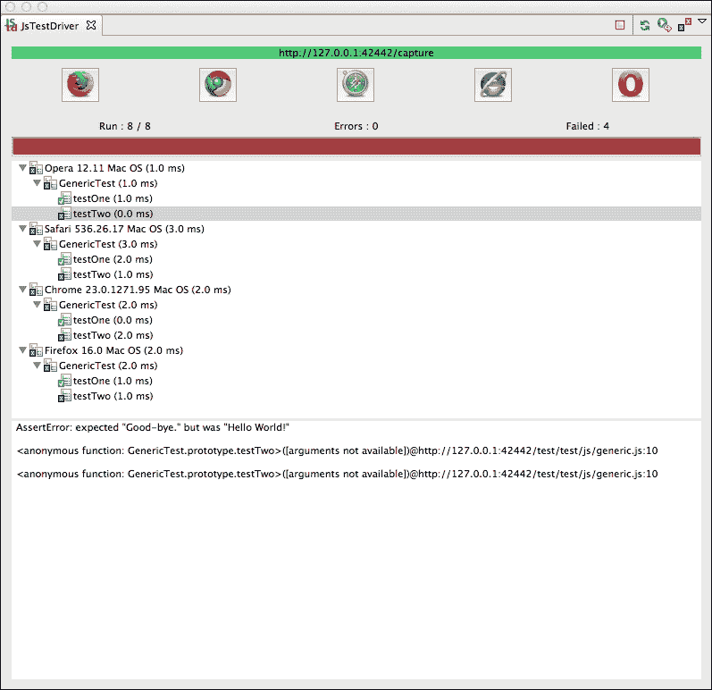
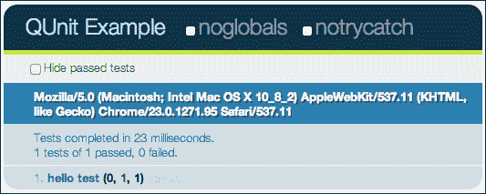
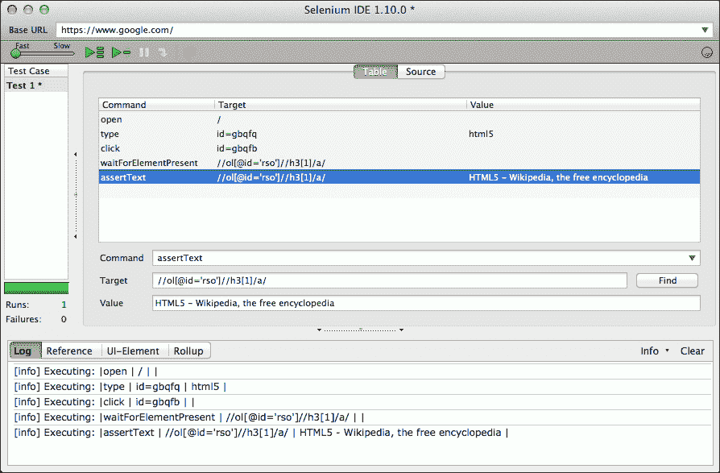
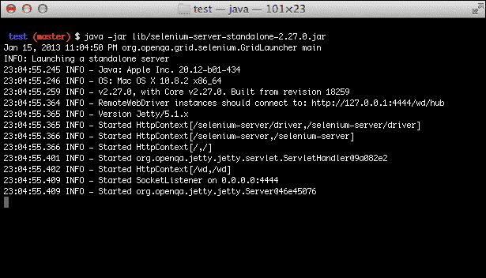
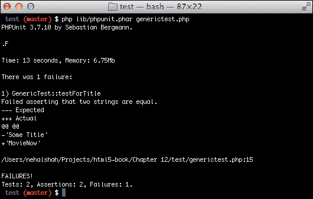

# 第十二章. 完成工作：测试您的应用

尽管测试的主题可能涵盖整本书，实际上也确实有许多关于这个主题的书籍，但我们将提供一个测试 HTML5 企业应用的框架，以及一系列有说服力的主题概要，这些主题将作为进一步研究的起点。不同的测试工具都带有它们自己的特定习语；我们将涵盖这些习语背后的概念。

本章将涵盖以下内容：

+   单元测试

+   功能测试

+   浏览器测试

+   持续集成

# 测试类型

测试可以在许多不同的层面上进行。从代码级别到集成，甚至测试企业应用程序面向用户的实现中的单个功能，都有许多工具和技术可以测试您的应用程序。特别是，我们将涵盖以下内容：

+   单元测试

+   功能测试

+   浏览器测试

### 小贴士

**黑盒与白盒测试**

测试通常在黑盒测试与白盒测试的背景下讨论。这是一个有用的隐喻，有助于理解不同层次的测试。在黑盒测试中，您将您的应用程序视为一个黑盒，对其内部一无所知——通常是从系统用户的角度来看。您只需执行应用程序的功能，并测试预期的结果是否与实际结果相符。白盒测试与黑盒测试的不同之处在于，您事先了解应用程序的内部结构，因此可以直接定位故障并测试特定条件。在这种情况下，您只需向系统的特定部分输入数据，并测试预期的输出是否与实际输出相符。

# 单元测试

测试的第一级是在代码级别。当您在测试特定的和单个代码单元是否达到其声明的目标时，您正在进行单元测试。单元测试通常与测试驱动开发一起讨论，这是一种先编写单元测试，然后编写通过这些测试所需的最少代码的实践。对您的代码有一套单元测试并采用测试驱动流程——如果做得正确——可以使您的代码保持专注，并有助于确保企业应用程序的稳定性。

通常，单元测试是在代码库中的单独文件夹中设置的。每个测试用例由以下部分组成：

+   设置构建测试条件，以便在测试代码或模块

+   测试中的代码或模块的实例化和调用

+   验证返回的结果

## 设置您的单元测试

您通常从设置测试数据开始。例如，如果您正在测试需要认证账户的代码片段，您可能需要考虑创建一组企业应用的测试用户。建议您的测试数据与测试相关联，这样您的测试就不会依赖于系统处于特定状态。

## 调用您的目标

一旦你设置了测试数据和测试代码需要运行的条件，你就可以调用它了。这可以简单到调用一个方法。

模拟是单元测试时需要理解的一个重要概念。考虑一个业务逻辑模块的单元测试集，该模块依赖于某些外部应用程序编程接口（API）。现在想象一下，如果 API 崩溃了，测试将失败。虽然得到一个指示，表明你依赖的 API 存在问题是很不错的，但因为这个原因而失败的单元测试是误导性的，因为单元测试的目标是测试业务逻辑，而不是你依赖的外部资源。这就是模拟对象出现的地方。模拟对象是复制资源接口的存根。它们被设置为在正常条件下总是返回外部资源会返回的相同数据。这样，你就可以将测试隔离到正在测试的代码单元。

模拟使用了一种称为依赖注入或控制反转的模式。当然，你正在测试的代码可能依赖于外部资源。然而，你将如何用模拟资源替换它？易于单元测试的代码允许你在调用它时传入或“注入”这些依赖。

依赖注入是一种设计模式，其中依赖于外部资源的代码将这种依赖传递给它，从而将你的代码与这种依赖解耦。以下代码片段难以测试，因为依赖被封装在正在测试的函数中。我们陷入了僵局。

```js
var doSomething = function() {
  var api = getApi();
  //A bunch of code
  api.call();
}
var testOfDoSomething = function() {
  var mockApi = getMockApi();
  //What do I do now???
}
```

以下新的代码片段使用依赖注入通过实例化依赖并将其传递给正在测试的函数来绕过问题：

```js
var doSomething = function(api) {
  //A bunch of code
  api.call();
}
var testOfDoSomething = function() {
  var mockApi = getMockApi();
  doSomething(mockApi);
}
```

### 注意

通常，这不仅是单元测试的良好实践，而且对于保持代码干净和易于管理也是好的。一旦实例化依赖，并在需要的地方注入它，如果需要，就更容易更改该依赖。有许多模拟框架可用，包括 JavaScript 的 JsMockito ([`jsmockito.org/`](http://jsmockito.org/)) 和 PHP 的 Mockery ([`github.com/padraic/mockery`](https://github.com/padraic/mockery))。

## 验证结果

一旦你调用了正在测试的代码，你需要捕获结果并验证它们。验证以断言的形式出现。每个单元测试框架都附带自己的断言方法集，但概念是相同的：取一个结果并测试它是否符合预期。你可以断言两个事物是否相等。你可以断言两个事物是否不相等。你可以断言结果是否是有效的数字或字符串。你可以断言一个值是否大于另一个值。一般想法是，你正在测试实际数据是否符合你的假设。断言通常会上升到框架的报告模块，并以通过或失败的测试列表的形式体现。

## 框架和工具

在过去几年中，出现了许多辅助 JavaScript 单元测试的工具。以下是对一些显著的框架和工具的简要概述，这些工具用于对 JavaScript 代码进行单元测试。

### JsTestDriver

JsTestDriver 是一个由 Google 构建的用于单元测试的框架。它有一个在机器上的多浏览器上运行的服务器，并允许你在 Eclipse IDE 中执行测试用例。



这张截图显示了 JsTestDriver 的结果。当运行时，它执行所有配置为运行的测试，并显示结果。

有关 JsTestDriver 的更多信息，请参阅 [`code.google.com/p/js-test-driver/`](http://code.google.com/p/js-test-driver/)。

### QUnit

QUnit 是由 jQuery 闻名的人物 John Resig 创建的 JavaScript 单元测试框架。要使用它，你需要创建一个测试 harness 网页，并将 QUnit 库作为脚本引用包含在内。甚至还有一个托管版本的库。一旦包含，你只需要调用测试方法，传入一个函数和一组断言。然后它将生成一份漂亮的报告。



虽然 QUnit 没有依赖项，可以测试标准 JavaScript 代码，但它围绕 jQuery 展开。有关 QUnit 的更多信息，请参阅 [`qunitjs.com/`](http://qunitjs.com/)。

### Sinon.JS

通常与 QUnit 配合使用，Sinon.JS 引入了监视的概念，其中它记录函数调用、传入的参数、返回值，甚至 `this` 对象的值。你还可以创建假对象，如假服务器和假定时器，以确保你的代码在隔离环境中进行测试，并且测试尽可能快地运行。这在需要执行假 AJAX 请求时尤其有用。

有关 Sinon.JS 的更多信息，请参阅 [`sinonjs.org/`](http://sinonjs.org/)。

### Jasmine

Jasmine 是一个基于行为驱动开发概念进行测试的框架。它与测试驱动开发非常相似，通过引入领域驱动设计原则来扩展它，并试图将单元测试框架回归到面向用户的行为和业务价值。Jasmine 以及其他基于行为驱动的框架使用尽可能多的英语来构建测试用例——称为规范——以便在生成报告时，其阅读起来比传统的单元测试报告更自然。

有关 Jasmine 的更多信息，请参阅 [`pivotal.github.com/jasmine/`](http://pivotal.github.com/jasmine/)。

# 功能测试

Selenium 已经成为网站功能测试的代名词。它的浏览器自动化功能允许你在你喜欢的网络浏览器中记录测试用例，并在多个浏览器上运行它们。当你拥有这些工具时，你可以自动化你的浏览器测试，将它们与你的构建和持续集成服务器集成，并在需要时同时运行以获得更快的测试结果。

Selenium 包含 Selenium IDE，这是一个用于记录和运行 Selenium 脚本的实用工具。作为一个 Firefox 插件构建，它允许你在 Firefox 中加载和点击网页来创建 Selenium 测试用例。你可以轻松地记录你在浏览器中的操作并回放它们。然后你可以添加测试来确定实际行为是否与预期行为匹配。这对于快速创建 Web 应用的简单测试用例非常有用。有关安装信息，请参阅 [`seleniumhq.org/docs/02_selenium_ide.html`](http://seleniumhq.org/docs/02_selenium_ide.html)。

以下截图显示了 Selenium IDE。点击右侧的红色圆形图形以开始记录，然后在浏览器窗口中浏览到 [`google.com`](http://google.com) 并搜索 "html5"。点击红色圆形图形以停止记录。然后你可以添加断言来测试页面的某些属性是否与预期匹配。在这种情况下，我们正在断言搜索结果中第一个链接的文本是 HTML5 的维基百科页面。当我们运行测试时，我们看到它通过了（当然，如果 Google 上 "html5" 的搜索结果发生变化，那么这个特定的测试将失败）。



Selenium 包含 WebDriver，这是一个 API，允许你本地或远程原生地驱动浏览器。结合其自动化功能，WebDriver 可以在多台远程机器上的浏览器上运行测试，以实现更大的规模。

对于我们的 MovieNow 应用程序，我们将通过以下组件设置功能测试：

+   Selenium 独立服务器

+   来自 Facebook 的 php-webdriver 连接器

+   PHPUnit

## Selenium 独立服务器

Selenium 独立服务器将请求路由到 HTML5 应用程序。为了运行测试，它需要启动。它可以部署在任何地方，但默认情况下，它可以通过 `http://localhost:4444/wd/hub` 访问。你可以在 [`code.google.com/p/selenium/downloads/list`](http://code.google.com/p/selenium/downloads/list) 下载独立服务器的最新版本，或者你可以启动 `test/lib` 文件夹中包含的示例代码中的版本。要启动服务器，请在命令行中执行以下行（你需要在你的机器上安装 Java）：

```js
java -jar lib/selenium-server-standalone-#.jar
```

在这里，`#` 表示版本号。

你应该会看到类似以下的内容：



在这一点上，它正在监听连接。当你运行测试时，你将在这里看到日志消息。请保持此窗口打开。

## 来自 Facebook 的 php-webdriver 连接器

php-webdriver 连接器作为 WebDriver 在 PHP 中的库。它允许您使用所有主要网络浏览器的驱动程序以及 HtmlUnit 来创建和检查网络请求。因此，它允许您针对任何网络浏览器创建测试用例。您可以在 [`github.com/facebook/php-webdriver`](https://github.com/facebook/php-webdriver) 下载它。我们已将文件包含在 `webdriver` 文件夹中。

## PHPUnit

PHPUnit 是一个单元测试框架，它为我们提供了运行测试所需的构造。它具有构建和验证测试用例所需的管道。任何单元测试框架都可以与 Selenium 一起工作；我们选择了 PHPUnit，因为它轻量级且与 PHP 工作良好。您可以通过多种方式下载和安装 PHPUnit（有关安装的更多信息，您可以访问 [`www.phpunit.de/manual/current/en/installation.html`](http://www.phpunit.de/manual/current/en/installation.html)）。我们已将 `phpunit.phar` 文件包含在 `test/lib` 文件夹中，以便您方便使用。您可以通过在命令行中执行以下操作来简单地运行它：

```js
php lib/phpunit.phar <your test suite>.php
```

首先，我们将向 `test` 文件夹添加一些 PHP 文件。第一个文件是 `webtest.php`。创建此文件并添加以下代码：

```js
<?php
require_once "webdriver/__init__.php";

class WebTest extends PHPUnit_Framework_TestCase {
    protected $_session;
    protected $_web_driver;

    public function __construct() {
      parent::__construct();
      $_web_driver = new WebDriver();
      $this->_session = $_web_driver->session('firefox');
    }

    public function __destruct() {
        $this->_session->close();
        unset($this->_session);
    }
} 
?>
```

`WebTest` 类通过 php-webdriver 连接器将 WebDriver 集成到 PHPUnit 中。这将成为我们所有测试用例的基类。如您所见，它以以下内容开始：

```js
require_once "webdriver/__init__.php";
```

这是对 php-webdriver 文件夹中的 `__init__.php` 的引用。这引入了 WebDriver 所需的所有类。在构造函数中，`WebTest` 初始化所有测试用例中使用的驱动程序和会话对象。在析构函数中，它清理其连接。

现在我们已经设置好了一切，我们可以创建我们的第一个功能测试。将名为 `generictest.php` 的文件添加到 `test` 文件夹中。我们将导入 `WebTest` 并扩展该类，如下所示：

```js
<?php
require_once "webtest.php";

class GenericTest extends WebTest {
}
?>
```

在 `GenericTest` 类内部，添加以下测试用例：

```js
public function testForData() {
  $this->_session->open('http://localhost/html5-book/Chapter%2010/');
  sleep(5); //Wait for AJAX data to load
  $result = $this->_session->element("id", "movies-near-me")->text();
  //May need to change settings to always allow sharing of location
  $this->assertGreaterThan(0, strlen($result));
}
```

我们将打开到我们应用程序的连接（您可以将 URL 更改为您运行 HTML5 应用程序的地方），等待 5 秒以加载初始 AJAX，然后测试 `movies-near-me` div 是否已填充数据。

要运行此测试，请转到命令行并执行以下行：

```js
chmod +x lib/phpunit.phar
php lib/phpunit.phar generictest.php

```

您应该会看到以下内容：


这表示测试已通过。恭喜！现在让我们看看它失败的情况。添加以下测试用例：

```js
public function testForTitle() {
  $this->_session->open('http://localhost/html5-book/Chapter%2010/');
  $result = $this->_session->title();
  $this->assertEquals('Some Title', $result);
}
```

重新运行 PHPUnit，您应该会看到类似以下的内容：



如您所见，它预期的是 `'Some Title'`，但实际上找到的是 `'MovieNow'`。现在我们已经让您开始了，我们将让您创建自己的测试。有关使用 PHPUnit 可以做出的不同断言的指南，请参阅 [`www.phpunit.de/manual/3.7/en/index.html`](http://www.phpunit.de/manual/3.7/en/index.html)。

更多关于 Selenium 的信息可以在 [`seleniumhq.org/`](http://seleniumhq.org/) 找到。

# 浏览器测试

在前面章节中关于浏览器兼容性的讨论中，对 HTML5 企业应用程序的测试必须涉及在不同网络浏览器上实际查看应用程序。幸运的是，许多网络浏览器都提供了适用于多个平台的版本。Google Chrome、Mozilla Firefox 和 Opera 都有适用于 Windows、Mac OSX 以及 Ubuntu 等 Linux 变种的版本，可以轻松安装。Safari 有适用于 Windows 和 Mac OSX 的版本，并且有方法通过一些调整在 Linux 上安装。

然而，Internet Explorer 只能在 Windows 上运行。一种绕过这种限制的方法是安装虚拟化软件。虚拟化允许您在宿主操作系统内虚拟运行整个操作系统。它允许您在 Mac OSX 上运行 Windows 应用程序或在 Windows 上运行 Linux 应用程序。包括 VirtualBox、VMWare Fusion、Parallels 和 Virtual PC 在内的许多虚拟化软件包都很有名。

### 小贴士

尽管 Virtual PC 只运行在 Windows 上，但微软确实提供了一套预包装的虚拟硬盘，包括用于测试目的的特定版本的 Internet Explorer。有关详细信息，请参阅以下 URL：[`www.microsoft.com/en-us/download/details.aspx?id=11575`](http://www.microsoft.com/en-us/download/details.aspx?id=11575)。

另一种常见的测试兼容性的方法是使用基于网络的浏览器虚拟化。有许多服务，如 BrowserStack ([`www.browserstack.com/`](http://www.browserstack.com/))、CrossBrowserTesting ([`crossbrowsertesting.com/`](http://crossbrowsertesting.com/)) 和 Sauce Labs ([`saucelabs.com/`](https://saucelabs.com/))，提供了一种服务，您可以通过输入一个 URL，在多种网络浏览器和平台上（包括移动设备）虚拟地查看其渲染效果。其中许多服务甚至可以通过代理工作，让您查看、测试和调试在本地机器上运行的网络应用程序。

# 持续集成

在任何测试解决方案中，创建和部署您的构建以及以自动化方式运行测试都是非常重要的。像 Hudson、Jenkins、CruiseControl 和 TeamCity 这样的持续集成解决方案可以帮助您实现这一点。它们合并来自多个开发者的代码，并运行一系列自动化功能，从部署模块到运行测试。它们可以按计划运行，也可以通过事件触发，例如通过 post-commit 钩子将代码提交到代码库。

# 摘要

在本章中，我们涵盖了多种测试类型，包括单元测试、功能测试和浏览器测试。对于每种测试类型，都有许多工具可以帮助你确保你的企业应用程序以稳定的方式运行，其中大部分我们已经介绍，只有少数例外。因为你的应用程序代码的每一分钟更改都有可能使其不稳定，我们必须假设每一次更改都可能导致不稳定。为了确保你的企业应用程序保持稳定并且缺陷最小，拥有一个包含从单元到功能的丰富测试套件的测试策略，并结合运行这些测试的持续集成服务器是至关重要的。当然，必须权衡编写和执行测试所需的时间与编写生产代码所需的时间，但长期维护成本的节省可以使这种投资变得值得。

在下一章中，我们将介绍确保你的企业应用程序以最佳性能运行的技巧，包括对性能分析技术的讨论。
