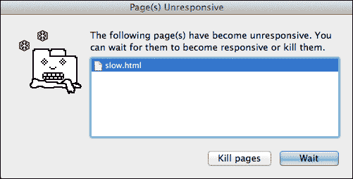
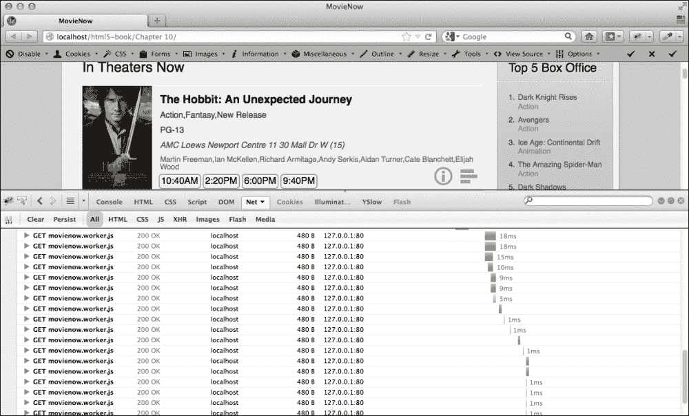
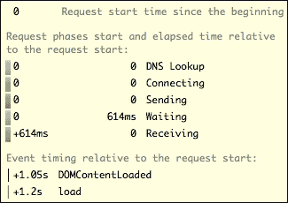
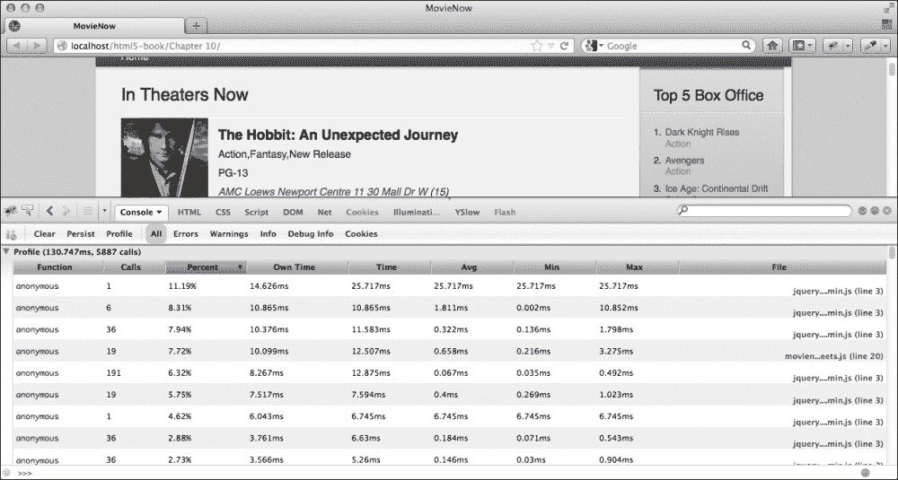

# 第十三章. 完成工作：性能

我们将结束讨论性能，这是有充分理由的。虽然在你开发企业应用时考虑性能很重要，但你可能会最终优化那些后来没有表现出任何性能问题的东西。这通常被称为过早优化，最终可能会浪费很多时间。尽管理解开发过程中每个决策的性能影响是一个好习惯，但网络性能优化不应被视为最终目标；相反，它是一个持续的调整，以改善并达到我们企业应用可接受的速度。我们的真正目标是构建我们的应用，并确保它正确运行，然后，如果必要，提高响应时间。

在本章中，我们将涵盖：

+   网络性能优化（WPO）

+   遵循标准

+   优化图像

+   优化 CSS

+   JavaScript 性能考虑

+   其他页面性能考虑

+   性能分析

# 网络性能优化（WPO）

由于 HTML5 企业应用有许多不同的组成部分，考虑你正在优化的部分很重要。总的来说，你的 HTML5 企业应用将包括 HTML、图像以及 CSS 和 JavaScript 代码，并且有方法可以优化这三者。

# 遵循标准

HTML 被设计成一种宽容的语言；也就是说，语法错误不是通过使页面崩溃和引起无尽的调试噩梦来处理的，而是以一种更优雅的方式处理。渲染引擎试图确定标记的意图，并据此布局页面。本质上，它会跌跌撞撞，但最终还能保持平衡。当然，没有障碍的赛跑比有障碍的赛跑要快。此外，不同的网络浏览器将以不同的方式从这些错误中恢复，导致当你的 HTML5 企业应用在不同浏览器中查看时，结果不一致。这就是为什么向浏览器提供干净、符合标准标记的重要性。

### 小贴士

尽管遵循标准是我们开始优化的良好基础，但在某些情况下，这可能会导致更冗长的代码（增加解析时间）。此外，HTML5 与之前的版本不同，它还不是一项完成的标准，应被视为一种指导而非一套规则。

幸运的是，有许多工具可以帮助你验证你的标记。负责制定 Web 标准的机构 **World Wide Web Consortium**（**W3C**）有自己的验证工具，可以在 [`validator.w3.org/`](http://validator.w3.org/) 找到。还有像 HTML Lint ([`lint.brihten.com/html/`](http://lint.brihten.com/html/)) 和 HTML Tidy ([`infohound.net/tidy/`](http://infohound.net/tidy/)) 这样的工具可以帮助你清理你的标记。验证你的标记是一个好习惯，以确保你的企业应用程序运行快速且一致。

# 优化图像

如今，大多数网站都嵌入图像，而这些图像往往是性能问题的主要来源。由于带宽有限和图像文件的大尺寸，你的企业应用程序可能实际上运行得相当快，但会迫使用户等待大图像传输到他们的浏览器。在将图像用于 Web 应用程序之前，优化你的图像是至关重要的。

对于网络优化，有两个考虑因素：大小和类型。关于大小，虽然可以在 `img` 标签中设置图像的宽度和高度维度，但将单个大图像用于需要不同尺寸的 Web 应用程序的不同目的是一种常见的错误。例如，在显示缩略图时，仅使用 `img` 标签属性缩小较大图像是一种不良做法。相反，你应该为不同的目的创建图像的不同变体或版本。

### 小贴士

在 `img` 标签上指定 `width` 和 `height` 属性让浏览器知道在图像实际下载之前为图像分配多少空间，从而避免布局变化和 UI 中的不希望出现的“跳跃”。请注意，这在很大程度上与将内容层和表示层分离的最佳实践相矛盾。

关于图像类型，在网络上确实有三种常用的图像格式：GIF、JPEG 和 PNG。这些格式基于不同的压缩算法，用于非常不同的目的。GIF 图像针对低色阶图像进行了优化。它们支持 256 种颜色，是无损和交错式的，这意味着它们是分层渲染的，而不是一次性渲染（当你下载和渲染它们时，从模糊到清晰）。它们非常适合基于低色阶的标志和网站图形。JPEG 图像非常适合高分辨率照片，因为它们支持高达 1600 万色的颜色调色板。PNG 图像可以支持 256、24 位或 32 位色阶的图像格式，具有可选的透明度，这是一种非常灵活且高度压缩的无损格式，比 GIF 具有更好的透明度和压缩性能。PNG 算法是为了作为 GIF 压缩格式的开放替代品而创建的，其原始创造者 Unisys 在 1995 年宣布将执行其对该算法的专利权。

### 小贴士

Internet Explorer 6 及之前的版本不支持基于 HTML 标准的 PNG 透明度；相反，必须使用专有过滤器。例如，`filter:progid:DXImageTransform.Microsoft.AlphaImageLoader(src='image.png' ,sizingMethod='crop');`。

# 优化 CSS

优化 CSS 的最佳方式是减小文件大小。你可以做很多事情来实现这一点。你可以通过将样式放在一行中来减少空白。

实现以下代码行：

```js
body {background-color:#fff;color:#000;font-size:1.0em;font-family:Arial;}
```

而不是这样：

```js
body 
{
  background-color:#ffffff;
  color:#000000;
  font-size:1.0em;
  font-family:Arial;
}
```

你可以为许多规则使用缩写。

实现以下代码行：

```js
p {margin:10px 20px;}
```

而不是这样：

```js
p
{
  margin-top: 10px;
  margin-right: 20px;
  margin-bottom: 10px;
  margin-left: 20px;
}
```

最好尽可能地将相似样式分组在一起，并在必要时合并重复的样式。

实现以下代码行：

```js
p, ul {color:#efefef;}
```

而不是这样：

```js
p {color:#efefef;}
ul {color:#efefef;}
```

### 小贴士

如果你决定不遵循这些建议以保持可读性，或者即使遵循了这些建议，也始终可以对你的代码进行压缩（正如我们在以下章节中解释的）。

另一个选择是使用动态样式表语言，如**Less** ([`lesscss.org`](http://lesscss.org))。Less 扩展了基本的 CSS 功能，允许我们使用更复杂和优雅的结构，这些结构在编译过程中将被转换为标准的 CSS。

使用常规 CSS，你需要重复使用常见的属性，如颜色：

```js
p{color:#efefef}
div.box{border:1px solid #efefef}
```

使用 Less，你可以定义一个变量`@active-color`，然后在你的样式中使用它，这样你只需要更改这些变量的值就可以更改多个属性的颜色的值：

```js
@active-color:#efefef;
p{color:@active-color }
div.box{border:1px solid @active-color}
```

你甚至可以创建嵌套结构，如下所示：

```js
@active-color:#efefef;
.content{
  div.box{border:1px solid @active-color}
  p{color:@active-color }
}
```

编译后，这将转换为以下内容：

```js
.content div.box{border:1px solid @active-color}
.content p{color:@active-color }
```

# JavaScript 性能考虑

虽然编写 JavaScript 可能会充满危险，因为它很容易引入运行缓慢的代码，但记住一些简单的指南可以帮助你的企业级应用避免运行得太慢。



首先，遍历 DOM 可能很昂贵。你想要最小化调用`document.getElementById`和，更糟糕的是，`document.getElementsByTagName`的次数。将 DOM 元素的引用捕获到变量中并使用该变量可以节省对 DOM 的昂贵调用。

所以，而不是实现以下代码：

```js
document.getElementsById("elementId").setAttribute("data-position", 1);
document.getElementsById("elementId").setAttribute("data-position", 1);
```

或者使用 jQuery 实现其等效功能：

```js
$("#elementId").attr("data-position", 1);
$("#elementId").attr("data-position", 1);
```

你可以实现以下代码：

```js
var element= document.getElementsById("elementId");
element.setAttribute("data-position", 1);
element.setAttribute("data-position", 1);
```

或者你可以使用 jQuery 实现其等效功能：

```js
var element= $("#elementId");
element.attr("data-position", 1);
element.attr("data-position", 1);
```

其次，避免使用`with()`和`for-in`这样的结构。

第三，记住数组可能会很慢。遍历数组——特别是深层数组——可能会很昂贵。如果你多次从数组中提取相同的元素，最好先将其捕获到变量中。也就是说，而不是以下代码：

```js
var array=[1,2,3,4,5];
console.log(array[3]+2);
console.log(array[3]*3);
```

或者这样：

```js
var array=[1,2,3,4,5];
var elementSelected=array[3];
console.log(elementSelected+2);
console.log(elementSelected*3);
```

第四，数组并不像 DOM 集合那样慢。遍历`document.getElementsByTagName('p')`比捕获结果到数组并遍历它要慢得多。

最后，改变 DOM 元素的类比改变样式要便宜。最好定义多个 CSS 类并在它们之间切换，而不是直接改变元素的风格。

因此，而不是以下代码：

```js
domObject.style.display="none";
```

或者它的 jQuery 版本：

```js
$(domObject).css(display, "none");
```

你可以实现以下代码：

```js
domObject.setAttribute("class", "hideClass");
```

或者这样：

```js
$(domObject.attr("class","hideClass");
```

你也可以使用一个名为 **jsPerf** 的工具来基准测试你的 JavaScript ([`jsperf.com/`](http://jsperf.com/))。它提供了一种创建 JavaScript 代码片段测试用例的方法，以便你可以基准测试它们的性能。如果你想知道哪个更快，`document.getElementsByTagName` 还是 `document.getElementsByClassName`，这个工具将允许你在浏览器上测试你的理论。此外，它还允许你分享你的测试用例，这样其他人就可以在不同的浏览器上测试，为你提供跨各种浏览器和平台的统计数据。

# 额外的页面性能考虑因素

企业应用程序可以由许多文件组成，包括 HTML、CSS、JavaScript 和图像。尽管为了可维护性，将 CSS 和 JavaScript 文件分离出来是合适的。在部署你的代码时，合并和压缩你的文件会导致更好的性能。**压缩**是一种代码压缩技术，其中移除了所有不必要的字符，同时保留行为。有许多工具可以为你完成这项工作，包括以下这些：

+   JSMin ([`www.crockford.com/javascript/jsmin.html`](http://www.crockford.com/javascript/jsmin.html))

+   打包器 ([`dean.edwards.name/packer/`](http://dean.edwards.name/packer/))

+   YUI 压缩工具 ([`developer.yahoo.com/yui/compressor/`](http://developer.yahoo.com/yui/compressor/))

在减少文件大小、最小化请求以及总体上尽可能少使用带宽的方面，CSS Sprites 的使用已经变得很普遍，其中应用程序的所有静态图形元素都被组合成单个图像，其中的一部分使用 CSS 显示。这样，只需要下载一次一个图像，而不是多个。

## 服务器端考虑因素

企业应用程序通常包含许多静态资源，这些资源在每次页面请求时都会从服务器下载。由于这会在服务器上产生大量的不必要流量，一种减轻负担的方法是使用内容分发网络或 CDN。CDN 允许你在优化的服务器网络上镜像你的页面，以便快速交付静态资源。你可以在 Akamai、Edgecast 或 Cloudflare 等 CDN 上放置你的静态资源，以及使用流行的库的 CDN 托管版本。Google 在其 CDN ([`developers.google.com/speed/libraries/`](https://developers.google.com/speed/libraries/)) 上托管了多个公共库，如 jQuery，同样 cdnjs ([`cdnjs.com/`](http://cdnjs.com/)) 也是如此。

许多网络服务器，如 Apache，可以被指示在发送给浏览器之前压缩它们发送的内容。如果您能够做到，在您的响应中添加一个设置为 `gzip` 的 `Content-Encoding` 标头可以减少数据传输量高达 70%。

在您的企业应用程序中考虑缓存是很重要的。如果相同的请求被反复提出，并且响应始终相同或很少更改，则在后续请求时缓存响应并返回。浏览器通过 `Cache-Control` 标头和 `Expires` 标头固有地支持这一点。虽然 `Expires` 告诉浏览器在页面缓存中保留内容的时间，但 `Cache-Control` 提供了一组规则，用于何时保留缓存以及何时使缓存无效。一些有用的参数包括以下内容：

+   `max-age`: 这表示在内容应该刷新之前的最长时间

+   `public`: 这表示即使内容需要认证，该内容也是可缓存的

+   `private`: 这表示内容可以按用户基础进行缓存

+   `no-cache`: 这表示内容可以被缓存，但在每次请求时都应该刷新

+   `no-store`: 这表示不应将内容保存在缓存中

+   `must-revalidate`: 这表示浏览器在提供缓存版本之前必须先与服务器进行验证

缓存不仅有助于提高响应时间，还能减轻服务器负载并减少网络流量。

Yahoo! 提供了一系列有用的指南，以确保页面性能。虽然许多这些主题已经有所涉及，但鼓励您亲自查看[`developer.yahoo.com/performance/`](http://developer.yahoo.com/performance/)上的指南。

# 性能分析

即使遵循所有最佳性能规则，您可能仍然会遇到加载缓慢的应用程序。当这种情况发生时，您需要擅长评估加载时间和分析您的应用程序。幸运的是，有许多工具可以帮助定位瓶颈；这些工具将在接下来的章节中解释。

## 加载时间

所有主要浏览器都包含一个网络标签，可以图形化显示浏览器与其接触的服务器之间的所有请求和响应。Firefox 将 **Net** 标签作为 Firebug 插件的一部分，如下面的屏幕截图所示：



它显示一组条形图，表示随时间变化的每个请求的加载时间。在这里，您可以看到网页逐部分加载，包括它首先加载 HTML，然后请求辅助资产：图像文件、CSS 文件、JavaScript 文件，甚至后续的 AJAX 请求。正如您在下面的屏幕截图中所见，当您悬停在每根条形图上时，您将看到有关该请求的统计数据，包括 DNS 查询、连接时间、发送请求的时间、等待时间和接收响应的时间等。



当尝试调试性能问题时，这尤其有帮助，因为它会非常清楚地告诉你缓慢的原因是由于连接问题还是页面加载问题，例如 HTML 是如何构建和解析的。了解这些更详细的细节有助于大大揭示并消除瓶颈。

除了基于浏览器的工具来评估加载时间外，还有外部服务允许你评估加载时间。特别是，Pingdom ([`tools.pingdom.com/fpt/`](http://tools.pingdom.com/fpt/)) 提供了一个你可以用来定期测试你的 Web 应用程序加载时间的服务。它提供了一个类似的图表来确定你的瓶颈在哪里。其他替代方案包括以下：

+   Google Speed ([`developers.google.com/speed/`](https://developers.google.com/speed/))

+   YSlow ([`developer.yahoo.com/yslow/`](http://developer.yahoo.com/yslow/))

+   Gomez([`www.gomez.com/website-performance-test/`](http://www.gomez.com/website-performance-test/))

## 性能分析器

性能分析器是评估性能的另一种方式。通常，它们按执行时间顺序列出 JavaScript 调用，这有助于确定运行缓慢的函数。一些浏览器，如 Google Chrome 和 Safari，包括 CSS 选择器性能分析器，它列出了运行最慢的 CSS 选择器。

Firefox 在其 Firebug 插件中集成了性能分析器。点击**控制台**标签，然后点击**分析**。



在 Google Chrome 的**开发者工具**中，你会找到一个**配置文件**标签页。

Safari 提供了一个**工具**标签页。

在 Internet Explorer 9 的开发者工具中同样提供了性能分析器。点击**性能分析器**然后点击**开始分析**按钮开始使用。

性能分析器通常会列出运行最慢的函数，它们被调用的次数以及执行所需的时间。它们通常将执行时间分为两个类别。有些人称之为独占时间，而其他人称之为自时间或拥有时间。这是在函数内部执行的时间，不包括从该函数内部调用的其他函数的执行时间。另一个类别被称为包含时间、总时间或只是时间。这是包括从该函数内部调用的函数在内的函数执行时间。

# 摘要

我们已经讨论了在多个不同层面上确保企业应用程序性能的方法。有确保浏览器能理解的干净 HTML 的方法，也有确保最优 CSS 和 JavaScript 的方法。有减少页面占用空间、减少请求数量和减轻浏览器负担的方法。虽然这些方法各自都很重要，但真正的性能提升并不总是显而易见的，直到你将它们全部结合起来。

我们已经构建了我们的示例应用，MovieNow，包括构建任何企业应用的重要步骤；从使用语义标签定义有意义的结构，到使用 CSS3 进行样式和动画设计，展示了新的和令人兴奋的功能，如 2D 画布和 WebGL、地理位置、视频、音频、拖放和 Web Workers。我们实践了使用真实世界的 API，如 Twitter，并回顾了一系列工具和库，以促进开发、测试和性能改进的过程。

我们鼓励你继续阅读有关新网络技术的文章。正如我们所说，现在有许多开发者正在创建不仅新的企业应用，还有新的库、技术、工具和思维范式，这些都可以重新定义我们所知道的互联网。

最后，我们希望您像我们一样享受这段旅程，并且这本书的初始指南能引导您走向许多成功的 HTML5 项目。
