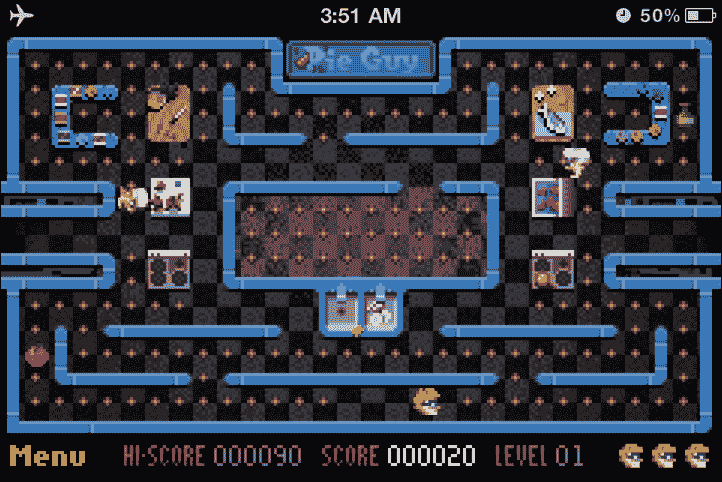
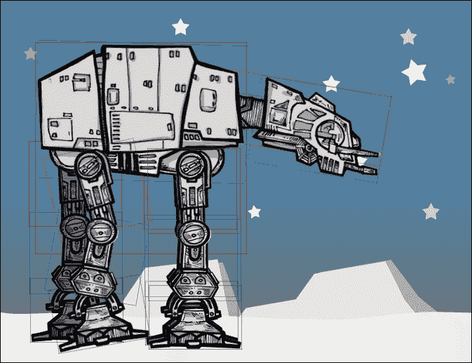
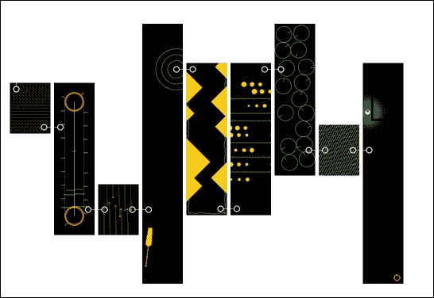
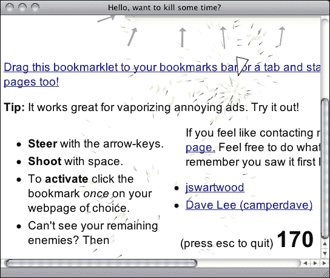
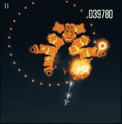
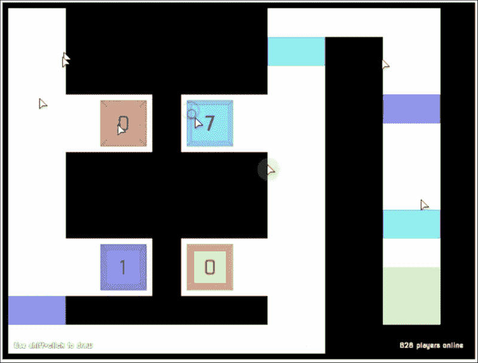
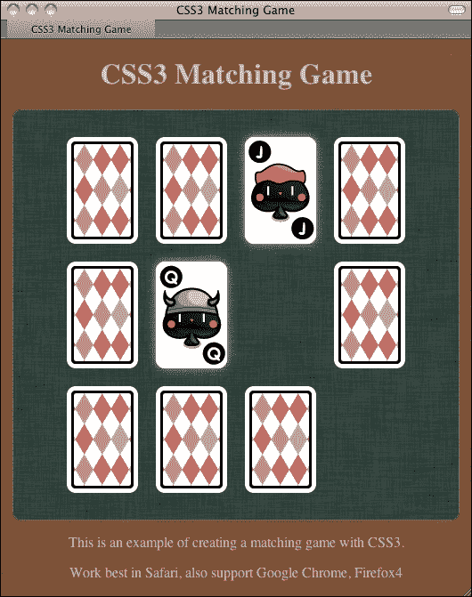

# 第一章. HTML5 游戏介绍

*超文本标记语言，HTML，在过去几十年中一直在塑造互联网。它定义了网页中内容的结构以及相关页面之间的链接。HTML 从版本 2 发展到 HTML 4，再到 XHTML 1.1。多亏了网络应用程序和社交网络应用程序，我们现在进入了 HTML5 时代。*

***层叠样式表** (**CSS**) 定义了网页的视觉呈现方式。它为所有 HTML 元素及其状态（如悬停和激活）的样式进行定义。

*JavaScript 是网页的逻辑控制器。它使网页变得动态，并提供页面与用户之间的客户端交互。它通过 **文档对象模型** (**DOM**) 访问 HTML。它通过它们的 API 控制新的 HTML 特性。*

大多数桌面和移动设备都配备了现代网络浏览器。这些最新的网络技术为我们带来了新的游戏市场——HTML5 游戏。借助这些技术的强大功能，我们可以使用 HTML5 元素、CSS3 属性和 JavaScript 设计可在大多数浏览器和移动设备上玩的游戏。

在本章中，我们将涵盖以下主题：

+   探索 HTML5 的新特性

+   讨论是什么让我们对 HTML5 和 CSS3 如此兴奋

+   预览后续章节中将要构建的游戏

+   准备开发环境

那么，让我们开始吧。

# 探索 HTML5 的新特性

HTML5 和 CSS3 引入了许多新特性。在动手创建游戏之前，让我们先概述一下这些新特性，看看我们如何利用它们来创建游戏。

## Canvas

**Canvas** 是一个 HTML5 元素，在低级别上提供绘制形状和位图操作功能。我们可以将 Canvas 元素想象成一个动态的图像标签。传统的 `` 标签显示一个静态图像。这个图像在加载后通常是静态的。我们可以将 `` 标签更改为另一个图像源或应用样式到图像上，但我们不能修改图像的位图上下文本身。

另一方面，Canvas 类似于客户端动态的 `` 标签。我们可以在其中加载图像，绘制形状，并使用 JavaScript 与之交互。

Canvas 在 HTML5 游戏开发中扮演着重要的角色。这是我们本书的主要关注领域之一。

## 音频

背景音乐和音效是游戏设计中的基本元素。HTML5 通过 `audio` 标签提供了原生的音频支持。多亏了这个特性，我们不需要专有的 Flash Player 来在我们的 HTML5 游戏中播放音效。然而，在网络上使用 Web Audio 也有一些限制。我们将在第六章 添加音效到您的游戏中讨论 `audio` 标签的使用。

## 触摸事件

除了传统的键盘和鼠标事件外，我们还可以使用触摸事件来处理单点和多点触摸事件。我们可以设计一个适用于移动设备的触摸游戏。我们还可以通过观察触摸模式来处理手势。

## GeoLocation

**GeoLocation** 允许网页检索用户的计算机的经纬度。例如，谷歌的 Ingress 游戏就利用 GeoLocation 允许玩家在他们的真实城市中玩游戏。几年前，当每个人都在使用台式机上网时，这个功能可能并不那么有用。我们不需要很多需要用户道路准确位置的事情。我们可以通过分析 IP 地址来获取大致的位置。

现在，越来越多的用户使用功能强大的智能手机上网。WebKit 和其他现代移动浏览器都在每个人的口袋里。GeoLocation 允许我们设计可以与位置输入一起使用的移动应用程序和游戏。

## WebGL

WebGL 通过在网页浏览器中提供一组 3D 图形 API 来扩展 Canvas 元素。这些 API 遵循 OpenGL ES 2.0 标准。WebGL 为 HTML5 游戏提供了一个强大的 GPG 加速的 3D 渲染 API。一些 3D 游戏引擎支持 WebGL 的导出，包括流行的 Unity 引擎。我们可以期待看到更多使用 WebGL 等待发布的 HTML5 3D 游戏。

使用 WebGL 创建游戏的技术与使用 Canvas 的技术相当不同。在 WebGL 中创建游戏需要处理 3D 模型并使用类似于 OpenGL 的 API。因此，本书不会讨论 WebGL 游戏开发。

由于 GPU 渲染支持，WebGL 的性能优于 2D Canvas。一些库允许游戏使用 Canvas 2D 绘图 API，并且工具通过在 WebGL 上绘制来渲染画布以获得性能提升。Pixi.js ([`www.pixijs.com`](http://www.pixijs.com))、EaselJS ([`blog.createjs.com/webgl-support-easeljs/`](http://blog.createjs.com/webgl-support-easeljs/)) 和 WebGL-2D ([`github.com/corbanbrook/webgl-2d`](https://github.com/corbanbrook/webgl-2d)) 是其中的一些工具。

## WebSocket

WebSocket 是 HTML5 规范的一部分，用于将网页连接到 socket 服务器。它为我们提供了一个浏览器和服务器之间的持久连接。这意味着客户端不需要在短时间内轮询服务器以获取新数据。每当有数据更新时，服务器都会将更新推送到浏览器。这个特性的一个好处是，游戏玩家可以几乎实时地相互交互。当一个玩家做了某事并向服务器发送数据时，我们可以向单个玩家发送更新以创建一对一的实时页面播放，或者我们可以迭代服务器中的所有连接，向每个连接的浏览器发送事件以确认玩家刚刚做了什么。这为构建多人 HTML5 游戏创造了可能性。

## Local storage

HTML5 为网络浏览器提供了一种持久数据存储解决方案。

Local Storage 持久存储键值对数据。在浏览器终止后，数据仍然存在。此外，数据不限于只能由创建它的浏览器访问。它对所有具有相同域的浏览器实例都是可用的。多亏了 Local Storage，我们可以在网络浏览器中轻松地本地保存游戏状态，如进度和获得的成就。

浏览器上的另一个数据库是 IndexedDB。它也是键值对，但它允许存储对象并使用条件查询数据。

## 离线应用程序

通常，我们需要网络连接来浏览网页。有时，我们可以浏览缓存的离线网页。这些缓存的离线网页通常很快就会过期。随着 HTML5 引入的下一个离线应用程序，我们可以声明我们的缓存清单。这是一个将要存储以供未来无网络连接时访问的文件列表。

使用缓存清单，我们可以将所有游戏图形、游戏控制 JavaScript 文件、CSS 样式表和 HTML 文件本地存储。我们还可以将我们的 HTML5 游戏打包为桌面或移动设备上的离线游戏。玩家甚至可以在飞行模式下玩游戏。以下来自 Pie Guy 游戏（[`mrgan.com/pieguy`](http://mrgan.com/pieguy)）的截图显示了在没有网络连接的 iPhone 上玩 HTML5 游戏；注意表示离线状态的飞机符号：



# 发现 CSS3 中的新特性

CSS 是表示层，HTML 是内容层。它定义了 HTML 的外观。当我们使用 HTML5 创建游戏时，我们不能忽视 CSS，尤其是基于 DOM 的游戏。我们可能纯粹使用 JavaScript 通过 Canvas 元素创建和设计游戏。然而，当我们创建基于 DOM 的 HTML5 游戏时，我们需要 CSS。因此，让我们看看 CSS3 中有什么新特性，以及我们如何使用这些新特性来创建游戏。

与直接在 Canvas 的绘图板上绘制和交互不同，新的 CSS3 属性让我们能够以不同的方式对 DOM 进行动画处理。这使得制作更复杂的基于 DOM 的浏览器游戏成为可能。

## CSS3 过渡

传统上，当我们对一个元素应用新的样式时，样式会立即改变。CSS3 过渡在目标元素的样式变化过程中渲染中间样式。例如，在这里，我们有一个蓝色盒子，当我们进行鼠标悬停时，我们想将其变为深蓝色。我们可以通过以下代码片段来实现：

**HTML**:

```js
<a href="#" class="box"></a>
```

**CSS**:

```js
a.box {
  display: block;
  width: 100px;
  height: 100px;
  background: blue;
}
a.box:hover {
  background: darkblue;
}
```

当我们进行鼠标悬停时，盒子会立即变为深蓝色。应用 CSS3 过渡后，我们可以为特定持续时间和缓动值进行样式插值：

```js
a.box {
  transition: all 0.5s ease-out;
}
```

### 小贴士

**下载示例代码**

对于您购买的所有 Packt Publishing 书籍，您可以从您的账户下载示例代码文件，账户地址为 [`www.packtpub.com`](http://www.packtpub.com)。如果您在其他地方购买了这本书，您可以访问 [`www.packtpub.com/support`](http://www.packtpub.com/support) 并注册，以便将文件直接通过电子邮件发送给您。

在过去，我们需要 JavaScript 来计算和渲染中间样式；这比使用 CSS3 过渡要慢得多，因为浏览器原生地使效果发生。

### 注意

由于一些 CSS3 规范仍在草案阶段且尚未固定，不同浏览器供应商的实现可能与 W3C 规范存在一些细微差异。因此，浏览器供应商倾向于使用供应商前缀来实现他们的 CSS3 属性，以防止冲突。

Safari 使用 `-webkit-` 前缀。Opera 使用 `-o-` 前缀。Firefox 使用 `-moz-` 前缀，IE 使用 `-ms-` 前缀。Chrome 以前使用 `-webkit-`，但现在在切换到 Blink 引擎后不再使用任何前缀。现在声明 CSS3 属性（如 flex）变得有些复杂，因为需要为多个浏览器编写多行相同的规则。我们可以期待在属性规范固定后，前缀将被删除。

为了使本书中的代码更简洁，我将使用非供应商前缀来表示本书中所有的属性。我建议您使用基于 JavaScript 的库来自动为不同浏览器添加所需的供应商前缀。Prefix-Free 库([`leaverou.github.io/prefixfree/`](http://leaverou.github.io/prefixfree/))就是其中之一。

或者，如果您正在使用预处理器，编译过程也可能为您添加必要的供应商前缀。

## CSS3 转换

CSS3 转换允许我们缩放元素、旋转它们以及平移它们的位置。CSS3 转换分为二维和三维。通过结合变换原点、三维旋转和平移，我们可以在三维空间中动画化二维图形。

## CSS3 动画

CSS3 过渡是一种动画类型。它声明了元素两种样式之间的缓动动画。

CSS3 动画在动画方面更进一步。我们可以定义动画的关键帧。每个关键帧包含一组在任何特定时刻应该改变的性质。它就像一系列应用于目标元素的 CSS3 过渡，按顺序应用。

AT-AT 行走者([`anthonycalzadilla.com/css3-ATAT/index-bones.html`](http://anthonycalzadilla.com/css3-ATAT/index-bones.html))展示了使用 CSS3 动画关键帧、变换和过渡创建骨骼动画的精彩示例。这将在以下图中展示：



# 创建 HTML5 游戏的好处

我们已经探讨了 HTML5 和 CSS3 的一些新功能。有了这些功能，我们可以在浏览器上创建 HTML5 游戏。但为什么我们需要这样做？创建 HTML5 游戏有什么好处？

## 自由和开放标准

网络标准是开放和免费的。相比之下，第三方工具通常是专有的，并且需要付费。随着公司关注点的变化，它们的支持可能会下降。HTML5 的标准化和开放性确保我们将拥有支持它的浏览器。

## 支持多平台

由于现代浏览器内置了对所有 HTML5 特性的支持，我们不需要用户预先安装任何第三方插件来播放任何文件。这些插件并不标准。它们通常需要额外的插件安装，你可能无法安装。例如，全球数以百万计的 Apple iOS 设备在其移动 Safari 中不支持第三方插件，例如 Flash Player。无论原因如何，Apple 不允许 Flash Player 在其移动 Safari 上运行，相反，他们浏览器中拥有的是 HTML5 和相关网络标准。我们可以通过创建针对移动设备优化的 HTML5 游戏来触及这部分用户基础。

## 特定场景下的原生应用程序渲染性能

当我们在 Canvas 中编写游戏代码时，有一些渲染引擎可以将我们的 Canvas 绘图代码转换为 OpenGL，从而在原生移动设备上渲染。这意味着尽管我们仍在为网页浏览器编写游戏，但我们的游戏可以通过原生应用程序 OpenGL 渲染在移动设备上获得优势。**Ejecta** ([`impactjs.com/ejecta`](http://impactjs.com/ejecta)) 和 **CocoonJS** ([`ludei.com/cocoonjs`](http://ludei.com/cocoonjs)) 是这样的两个引擎。

## 打破常规浏览器游戏的界限

在传统的游戏设计中，我们在一个边界框内构建游戏。我们在电视上玩视频游戏。我们在带有矩形边界的网页浏览器中玩 Flash 游戏。

通过发挥创意，我们不再受限于矩形游戏舞台。我们可以利用页面上的所有元素来享受乐趣。

Twitch ([`reas.com/twitch/`](http://reas.com/twitch/)) 是一个来自 Chrome Experiments 的游戏。它是一系列迷你游戏，玩家需要将球从起点运送到终点。有趣的是，每个迷你游戏都是一个小的浏览器窗口。当球到达该迷你游戏的终点时，它会被转移到新创建的迷你游戏浏览器中继续旅程。以下截图显示了 Twitch 的整个地图以及各个独立的网页浏览器：



## 构建 HTML5 游戏

多亏了 HTML5 和 CSS3 的新特性，我们现在可以在浏览器中创建整个游戏。我们可以控制 DOM 中的每一个元素。我们可以使用 CSS3 对每个文档对象进行动画处理。我们有 Canvas 来动态绘制事物并与它们交互。我们有音频元素来处理背景音乐和音效。我们还拥有本地存储来保存游戏数据，以及 WebSocket 来创建实时多人游戏。大多数现代浏览器已经支持这些特性。现在是时候构建 HTML5 游戏了。

# 其他人在用 HTML5 做什么

这是一个很好的机会，通过观看使用不同技术制作的 HTML5 游戏，来研究不同 HTML5 游戏的性能。

## 可口可乐的 Ahh 活动

可口可乐曾推出一项名为**Ahh**([`ahh.com`](http://ahh.com))的活动，其中包含许多互动小游戏。这些互动结合了多种技术，包括画布和设备旋转。大多数游戏在桌面和移动设备上都能很好地运行。


## 以小行星风格的收藏夹

来自瑞典的网页设计师 Erik 创建了一个有趣的收藏夹。这是一个适用于任何网页的小行星风格游戏。是的，任何网页！它展示了与任何网页交互的一种不寻常的方式。它在你阅读的网站上创建了一个飞机。然后你可以使用箭头键驾驶飞机，并使用空格键开火。有趣的是，子弹会摧毁页面上的 HTML 元素。你的目标是摧毁你选择的网页上的所有东西。这个收藏夹是打破常规浏览器游戏边界的另一个例子。它告诉我们，在设计 HTML5 游戏时，我们可以跳出思维定势。

以下截图显示了飞机正在摧毁网页上的内容：



这个收藏夹可以在[`kickassapp.com`](http://kickassapp.com)安装。你甚至可以设计你控制的宇宙飞船。

## X-Type

以 Canvas 为基础的游戏引擎 Impact 的制作者，为包括网络浏览器、iOS 和 Wii U 在内的不同平台创建了这个 X-Type([`phoboslab.org/xtype/`](http://phoboslab.org/xtype/))射击游戏。以下截图显示了游戏在 iPhone 上运行得非常流畅。



## Cursors.io

Cursors.io ([`cursors.io`](http://cursors.io)) 展示了一个设计精良的实时多人游戏。每个用户控制一个匿名的鼠标光标，通过将光标移动到绿色出口来穿越游戏的各个关卡。游戏的乐趣在于玩家必须帮助他人前进到下一级。有一些开关，某些光标点击它们来解锁门。匿名玩家必须承担起帮助他人的角色。有人会取代你的位置，这样你就可以前进到下一级。帮助你的人越多，你在游戏中成功的几率就越高。如果只有少数玩家在玩，而你无法体验游戏，我已以 12 倍速录制了我的游戏画面（在[`vimeo.com/109414542`](http://vimeo.com/109414542)），让你一窥这个多人游戏是如何运作的。以下截图展示了这一过程：



### 注意

我们将在第八章中讨论构建多人游戏，*使用 WebSocket 构建多人绘画猜谜游戏*。

# 本书将要创建的内容

在接下来的章节中，我们将构建六个游戏。我们首先将创建一个基于 DOM 的乒乓球游戏，可以在同一台机器上由两名玩家玩。然后，我们将使用 CSS3 动画创建一个记忆匹配游戏。接下来，我们将使用 Canvas 创建一个解谜游戏。稍后，我们将构建一个包含音频元素的音乐游戏。然后，我们将使用 WebSocket 创建一个多人绘画猜谜游戏。最后，我们将使用 Box2D JavaScript 端口创建一个物理赛车游戏的原型。以下截图显示了我们在第三章中将要构建的记忆匹配游戏，*使用 CSS3 构建卡牌匹配游戏*。你可以在[`makzan.net/html5-games/card-matching/`](http://makzan.net/html5-games/card-matching/)上玩这个游戏。



# 准备开发环境

开发 HTML5 游戏的环境与设计网站类似。我们需要网络浏览器和一款优秀的文本编辑器。哪款文本编辑器好是一个永无止境的争论。每种文本编辑器都有其自身的优势，所以只需选择你最喜欢的一款。我个人推荐具有多个光标的文本编辑器，例如 Sublime Text 或 Brackets。对于浏览器，我们需要支持最新 HTML5 和 CSS3 规范的现代浏览器，并为我们提供方便的调试工具。

现在互联网上有几种现代浏览器可供选择。它们是 Apple Safari ([`apple.com/safari/`](http://apple.com/safari/))、Google Chrome ([`www.google.com/chrome/`](http://www.google.com/chrome/))、Mozilla Firefox ([`mozilla.com/firefox/`](http://mozilla.com/firefox/))和 Opera ([`opera.com`](http://opera.com))。这些浏览器支持本书中将要讨论的大多数特性。我个人使用 Chrome，因为它拥有强大的内置开发者工具。强大的开发者工具使其在网页和游戏开发者中非常受欢迎。

我们还需要安卓手机和 iPad/iPhone 来测试移动设备上的游戏。模拟器也可能有效，但使用真实设备进行测试可以得到更接近现实使用的测试结果。

# 摘要

在本章中，我们学习了关于 HTML5 游戏的基本信息。

具体来说，我们涵盖了 HTML5 和 CSS3 的新特性。我们在后续章节中向您展示了我们将使用哪些技术来创建游戏——Canvas、音频、CSS 动画以及更多新特性被引入。我们将有许多新特性可以探索。我们讨论了为什么我们要创建 HTML5 游戏——我们希望满足网络标准，适应移动设备，并打破游戏的界限。我们审视了几种使用不同技术创建的现有 HTML5 游戏，我们也将使用这些技术。在我们自己创建游戏之前，您可以测试这些游戏。我们还预览了书中将要构建的游戏。最后，我们准备好了我们的开发环境。

现在我们对 HTML5 游戏有了背景信息，我们准备在下一章创建我们的第一个基于 DOM、由 JavaScript 驱动的游戏。
