# 第三章. 使用 CSS3 构建卡牌匹配游戏

*CSS3 引入了许多令人兴奋的特性。在本章中，我们将探索并使用其中的一些特性来创建卡牌匹配游戏。CSS3 决定了游戏对象的外观和动画，而 jQuery 库帮助我们定义游戏逻辑。*

在本章中，我们将：

+   使用动画转换玩牌

+   使用新的 CSS3 属性翻转玩牌

+   创建整个记忆匹配游戏

+   在我们的游戏中嵌入自定义的 Web 字体

您可以通过以下 URL 尝试卡牌匹配游戏，以一窥本章我们将实现的内容：

[`makzan.net/html5-games/card-matching/`](http://makzan.net/html5-games/card-matching/)

因此，让我们开始吧。

# 使用 CSS3 过渡移动游戏对象

在第一章 *介绍 HTML5 游戏* 中，当我们概述新的 CSS3 特性时，我们瞥见了 CSS3 的过渡和转换模块。我们经常希望通过平滑属性来动画化游戏对象。过渡是为此目的设计的 CSS 属性。假设我们在网页上有一个玩牌，并想在五秒内将其移动到另一个位置。我们不得不使用 JavaScript 设置计时器并编写自己的函数来每隔几毫秒改变位置。通过使用`transition`属性，我们只需要指定起始和结束样式以及持续时间。浏览器优化输出并完成所有缓和和中间动画。

让我们看看一些示例来理解这一点。

# 行动时间 – 移动玩牌

在这个例子中，我们将把两张玩牌放置在网页上，并将它们转换到不同的位置、缩放和旋转。我们将通过设置过渡来缓动转换：

1.  要做到这一点，创建一个新的项目文件夹，其结构如下。`css3transition.css`和`index.html`文件目前是空的，我们将在稍后添加代码。`jquery-2.1.3.min.js`文件是我们之前章节中使用的 jQuery 库。

    ```js
    index.html
    js/
      js/jquery-2.1.3.js
    css/
      css/css3transition.css
    images/
    ```

1.  在这个例子中，我们使用了两个玩牌图形图像。它们是`AK.png`和`AQ.png`。这些图像可在代码包中找到，或者您可以从书籍资产网站上下载它们：[`mak.la/book-assets/`](http://mak.la/book-assets/)。

1.  将两张牌图像放入`images`文件夹中。

1.  下一步是编写带有两个卡牌 DIV 元素的 HTML 代码。当页面加载时，我们将对这些两个卡牌元素应用 CSS 过渡样式：

    ```js
    <!DOCTYPE html>
    <html lang="en">
    <head>
      <meta charset="utf-8">
      <title>Getting Familiar with CSS3 Transition</title>
      <link rel="stylesheet" href="css/css3transition.css" />
    </head>
    <body>
      <header>
        <h1>Getting Familiar with CSS3 Transition</h1>
      </header>

      <section id="game">
        <div id="cards">
          <div id="card1" class="card cardAK"></div>
          <div id="card2" class="card cardAQ"></div>
        </div> <!-- #cards -->
      </section> <!-- #game -->
      <footer>
        <p>This is an example of transitioning cards.</p>
      </footer>
    <script src="img/jquery-2.1.3.min.js"></script>
    <script>
    $(function(){
      $("#card1").addClass("move-and-scale");
      $("#card2").addClass("rotate-right");
    });
    </script>
    </body>
    </html>
    ```

1.  是时候通过 CSS 定义玩牌的视觉样式了。这包括基本的 CSS 2.1 属性和 CSS3 的新属性。在以下代码中，新的 CSS3 属性被突出显示：

    ```js
    body {
      background: LIGHTGREY;
    }
    /* defines styles for each card */
    .card {
      width: 80px;
      height: 120px;
      margin: 20px;
      position: absolute;
     transition: all 1s linear;
    }

    /* set the card to corresponding playing card graphics */
    .cardAK {
      background: url(../images/AK.png);
    }
    .cardAQ {
      background: url(../images/AQ.png);
    }
    /* rotate the applied DOM element 90 degree */
    .rotate-right {
     transform: rotate3d(0, 0, 1, 90deg);
    }

    /* move and scale up the applied DOM element */
    .move-and-scale {
     transform: translate3d(150px, 150px, 0) scale3d(1.5, 1.5, 1);
    }
    ```

1.  让我们保存所有文件并在浏览器中打开`index.html`文件。两张牌应该像以下截图所示那样动画化：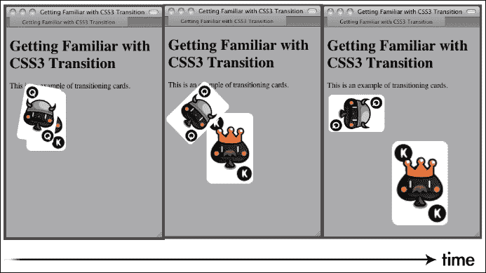

## *发生了什么？*

我们通过使用 CSS3 过渡来插值 `transform` 属性，创建了两个动画效果。

下面是 CSS transform 的用法：

```js
transform: transform-function1 transform-function2;
```

`transform` 属性的参数是函数。有两组函数：2D 和 3D 变换函数。**CSS transform** 函数旨在移动、缩放、旋转和倾斜目标 DOM 元素。以下部分展示了变换函数的用法。

## 2D 变换函数

2D `rotate` 函数在给定的正参数上顺时针旋转元素，在给定的负参数上逆时针旋转元素：

```js
rotate(angle)
```

`translate` 函数通过给定的 *x* 和 *y* 位移来移动元素：

```js
translate (tx, ty)
```

我们可以通过调用 `translateX` 和 `translateY` 函数独立地平移 *x* 或 *y* 轴，如下所示：

```js
translateX(number)
translateY(number)
```

`scale` 函数通过给定的 `sx` 和 `sy` 向量来缩放元素。如果我们只传递第一个参数，那么 `sy` 将与 `sx` 具有相同的值：

```js
scale(sx, sy)
```

此外，我们可以独立地缩放 *x* 和 *y* 轴，如下所示：

```js
scaleX(number)
scaleY(number)
```

## 3D 变换函数

3D 旋转函数通过给定的 [x, y, z] 单位向量在 3D 空间中旋转元素。例如，我们可以通过使用 `rotate3d(0,` `1,` `0,` `60deg)` 来旋转 *y* 轴 60 度：

```js
rotate3d(x, y, z, angle)
```

我们也可以通过调用以下便捷函数仅旋转一个轴：

```js
rotateX(angle)
rotateY(angle)
rotateZ(angle)
```

与 2D `translate` 函数类似，`translate3d` 允许我们在三个轴上移动元素：

```js
translate3d(tx, ty, tz)
translateX(tx)
translateY(ty)
translateZ(tz)
```

此外，`scale3d` 在 3D 空间中缩放元素：

```js
scale3d(sx, sy, sz)
scaleX(sx)
scaleY(sy)
scaleZ(sz)
```

我们刚才讨论的 `transform` 函数是常见的，我们将多次使用它们。还有一些其他未讨论的 `transform` 函数，它们是 `matrix`、`skew` 和 `perspective`。

如果你想找到最新的 CSS 变换工作规范，你可以访问 W3C CSS 变换模块网站：[`www.w3.org/TR/css3-3d-transforms/`](http://www.w3.org/TR/css3-3d-transforms/)。

## 使用 CSS3 过渡插值样式

CSS3 中有大量新特性。过渡模块是其中之一，它对游戏设计影响最大。

什么是 **CSS3 过渡**？W3C 用一句话解释它：

> *CSS 过渡允许 CSS 值在指定的时间内平滑地改变。*

通常，当我们更改元素的任何属性时，属性会立即更新到新值。过渡会减慢变化过程。它在给定的时间内创建从旧值到新值的平滑过渡。

下面是 `transition` 属性的用法：

```js
transition: property_name duration timing_function delay
```

下表解释了在 `transition` 属性中使用的每个参数：

| 参数 | 定义 |
| --- | --- |
| `property_name` | 这是应用过渡的属性名称。它可以设置为 `all`。 |
| `duration` | 这表示过渡所需要的时间。 |
| `timing_function` | `timing`函数定义了起始值和结束值之间的插值。默认值是`ease`。通常，我们会使用`ease`、`ease-in`、`ease-out`和`linear`。 |
| `delay` | `delay`参数将过渡的开始延迟给定秒数。 |

我们可以在一行中放置多个`transition`属性。例如，以下代码在 0.3 秒内过渡不透明度，在 0.5 秒内过渡背景颜色：

```js
transition: opacity 0.3s, background-color 0.5s
```

我们也可以通过以下属性单独定义每个过渡属性：

```js
transition-property, transition-duration, transition-timing-function and transition-delay
```

### 小贴士

**CSS3 模块**

根据 W3C 的说法，CSS3 与 CSS 2.1 不同，因为 CSS 2.1 只有一个规范。CSS3 被划分为不同的模块。每个模块都是单独审查的。例如，有一个过渡模块、2D/3D 转换模块和弹性盒子布局模块。

将规范划分为模块的原因是因为 CSS3 各部分的进展速度并不相同。一些 CSS3 特性相对稳定，例如边框半径，而一些尚未稳定。将整个规范划分为不同的部分允许浏览器厂商支持稳定的模块。在这种情况下，进展缓慢的特性不会减慢整个规范的进展。CSS3 规范的目标是标准化网络设计中最常见的视觉用法，而这个模块符合这一目标。

## 尝试一下英雄

我们已经对扑克牌进行了平移、缩放和旋转。那么我们尝试在示例中更改不同的值如何？`rotate3d`函数中有三个轴。如果我们旋转其他轴会发生什么？通过自己实验代码来熟悉转换和过渡模块。

# 创建翻牌效果

想象一下，我们现在不仅要在周围移动扑克牌，还想翻转卡片元素，就像我们翻转一张真实的扑克牌一样。通过使用`rotation` `transform`函数，现在可以创建翻牌效果。

# 行动时间 - 使用 CSS3 翻转卡片

我们将开始一个新的项目，并在点击扑克牌时创建翻牌效果：

1.  让我们继续使用之前的代码示例。

1.  现在卡片包含两个面：正面和背面。在 HTML 代码的`body`标签中替换以下代码：

    ```js
    <section id="game">
      <div id="cards">
        <div class="card">
          <div class="face front"></div>
          <div class="face back cardAK"></div>
        </div> <!-- .card -->
        <div class="card">
          <div class="face front"></div>
          <div class="face back cardAQ"></div>
        </div> <!-- .card -->
      </div> <!-- #cards -->
    </section> <!-- #game -->
    <script src="img/jquery-2.1.3.min.js"></script>
    ```

1.  然后，在`css`文件夹中创建一个新的`css3flip.css`文件来测试翻转效果。

1.  在`index.html`文件中，将 CSS 外部链接更改为`css3flip.css`文件：

    ```js
    <link rel="stylesheet" href="css/css3flip.css" />
    ```

1.  现在，让我们向`css3flip.css`添加样式：

    ```js
    #game {
      background: #9c9;
      padding: 5px;
    }
    /* Define the 3D perspective view and dimension of each card. */
    .card {
      perspective: 600px;
      width: 80px;
      height: 120px;
    }
    ```

1.  每张卡片都有两个面。我们将逐渐旋转卡片的面。因此，我们通过 CSS3 的`transition`属性定义面的过渡。我们还隐藏了背面可见性。我们稍后会看到这个属性的详细内容：

    ```js
    .face {
      border-radius: 10px;
      width: 100%;
      height: 100%;
      position: absolute;
      transition: all .3s;
     backface-visibility: hidden;
    }
    ```

1.  现在，是时候为每个单独的面添加样式了。正面比背面有更高的 z-index：

    ```js
    .front {
      background: #966;
    }
    .back {
      background: #eaa;
      transform: rotate3d(0,1,0,-180deg);
    }
    ```

1.  当我们翻转卡片时，我们将正面旋转到背面，将背面旋转到正面。我们还交换了正面和背面的 z-index：

    ```js
    .card-flipped .front {
      transform: rotate3d(0,1,0,180deg);
    }
    .card-flipped .back {
      transform: rotate3d(0,1,0,0deg);
    }
    .cardAK {
      background: url(../images/AK.png);
    }
    .cardAQ {
      background: url(../images/AQ.png);
    }
    ```

1.  接下来，我们将在加载 jQuery 库后添加逻辑，以便在点击卡片时切换卡片翻转状态：

    ```js
    <script>
    (function($){
      $(function(){
        $("#cards").children().each(function(index) {
          // listen the click event on each card DIV element.
          $(this).click(function() {
            // add the class "card-flipped".
            // the browser will animate the styles 
            // between current state and card-flipped state.
            $(this).toggleClass("card-flipped");
          });
        });
      });
    })(jQuery);
    </script>
    ```

1.  样式和脚本现在都已准备好。让我们保存所有文件，并在我们的网页浏览器中预览。点击玩牌来翻转它，再点击一次来翻转回来。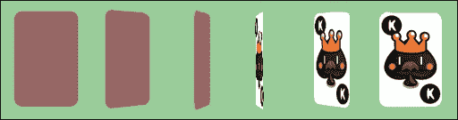

## *发生了什么？*

我们创建了一个可以通过鼠标点击切换的卡片翻转效果。你可以在[`makzan.net/html5-games/simple-card-flip/`](http://makzan.net/html5-games/simple-card-flip/)上尝试该示例。

该示例使用了多个 CSS 转换属性和 JavaScript 来处理鼠标点击事件。

## 使用 jQuery 的 toggleClass 函数切换类

当鼠标点击卡片时，我们将`card-flipped`类应用到卡片元素上。在第二次点击时，我们希望移除应用的`card-flipped`样式，以便卡片再次翻转。这被称为**切换类**样式。

jQuery 提供了一个方便的函数`toggleClass`，可以根据类是否应用来自动添加或移除类。

要使用该函数，我们只需将想要切换的类作为参数传递。

例如，以下代码为 ID 为`card1`的元素添加或移除`card-flipped`类：

```js
$("#card1").toggleClass("card-flipped");
```

`toggleClass`函数可以同时接受多个类的切换指令。我们可以传入多个类名，并用空格分隔它们。以下是一个同时切换两个类的示例：

```js
$("#card1").toggleClass("card-flipped scale-up");
```

## 介绍 CSS 的 perspective 属性

CSS3 让我们能够在 3D 空间中呈现元素，并且我们已经能够将元素在 3D 空间中转换。`perspective`属性定义了 3D 视角视图的外观。你可以将值视为你观察对象时的距离。你越靠近，观察对象上的透视扭曲就越多。

以下两个 3D 立方体演示了不同的视角值如何改变元素的视角：

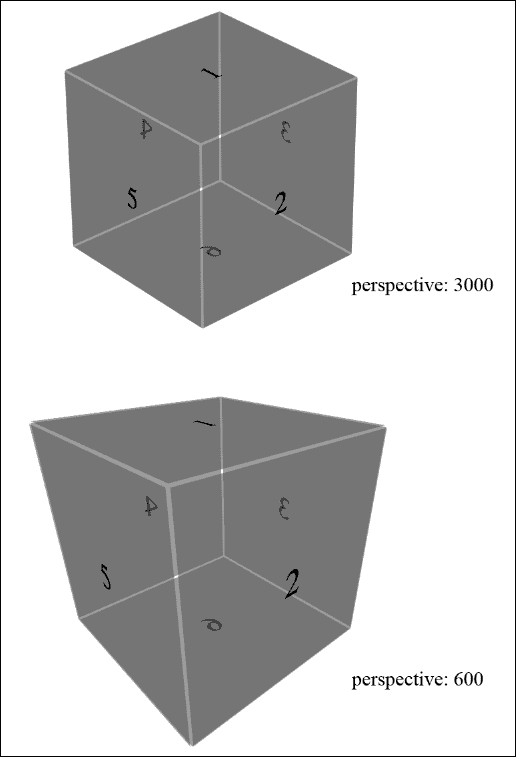

## 尝试一下

立方体是通过将六个面放在一起并应用每个面的 3D 转换来创建的。它使用了我们讨论过的技术。尝试创建一个立方体并实验一下`perspective`属性。

以下网页对创建 CSS3 立方体的过程进行了全面解释，并说明了如何使用键盘控制立方体的旋转：

[`paulrhayes.com/experiments/cube-3d/`](http://paulrhayes.com/experiments/cube-3d/)

## 介绍 backface-visibility 属性

在`backface-visibility`属性被引入之前，页面上的所有元素都向访客展示了它们的正面。实际上，元素的前面或背面没有概念，因为展示正面是唯一的选择。当 CSS3 引入了三轴旋转时，我们可以旋转一个元素，使其面朝后。试着看看你的手掌，然后旋转你的手腕，你的手掌转动，你看到了手掌的背面。旋转的元素也会发生这种情况。

CSS3 引入了一个名为`backface-visibility`的属性来定义我们是否可以看到元素的背面。默认情况下，它是可见的。以下图示展示了`backface-visibility`属性的两种不同行为：

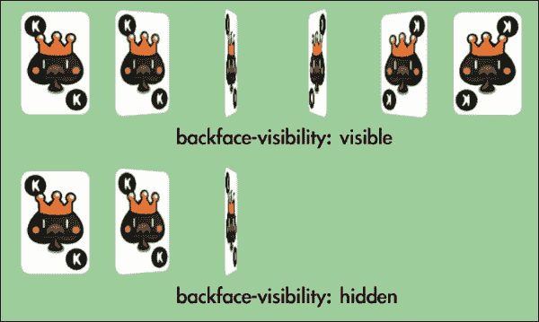

### 注意

你可以在其官方 Webkit 博客上阅读有关 CSS 3D 变换中不同属性和函数的更详细的信息：[`webkit.org/blog/386/3d-transforms/`](http://webkit.org/blog/386/3d-transforms/)。

# 创建一个卡牌匹配记忆游戏

我们已经学习了一些基本的 CSS 技术。现在，让我们使用这些技术来制作一个游戏。我们将制作一个卡牌游戏。这个卡牌游戏将使用变换来翻转卡片，使用过渡来移动卡片，使用 JavaScript 来处理逻辑，以及使用一个新的 HTML5 特性，称为**自定义数据属性**来存储自定义数据。不用担心，我们将逐步讨论每个组件。

## 下载牌的精灵图

在卡牌翻转示例中，我们使用了两张不同牌的图形。现在，我们将为整副牌准备图形。虽然我们在匹配游戏中只会使用六张牌，但我们仍会准备整副牌，这样我们就可以在其他可能创建的卡牌游戏中重用这些图形。

一副牌中有 52 张牌，我们还有一个用于背面的图形。与其使用 53 个单独的文件，不如将单独的图形放入一个大的精灵图文件中。精灵图是一种图形技术，它将一个图形的纹理加载到内存中，并为每个游戏组件显示图形的一部分。

使用大精灵图而不是单独的图像文件的一个好处是我们可以减少 HTTP 请求的数量。当浏览器加载网页时，它会创建一个新的 HTTP 请求来加载每个外部资源，包括 JavaScript 文件、CSS 文件和图像。为每个分离的小文件建立新的 HTTP 请求需要相当多的时间。将图形组合到一个文件中，大大减少了请求的数量，从而提高了游戏在浏览器中加载时的响应速度。

将图形放在一个文件中的另一个好处是避免文件格式标题的开销并减少 HTTP 请求的数量。加载包含 53 个图像的精灵图的时间比加载 53 个不同图像（每个文件都有文件标题）的时间要快。

以下一副扑克牌的图形是在 Adobe Illustrator 中绘制并对齐的。您可以从[`mak.la/deck.png`](http://mak.la/deck.png)下载它。

### 注意

您可以使用 Instant Sprite Generator ([`instantsprite.com`](http://instantsprite.com))创建自己的精灵图集。在[`css-tricks.com/css-sprites/`](http://css-tricks.com/css-sprites/)上的文章详细解释了为什么以及如何创建和使用 CSS 精灵图集。

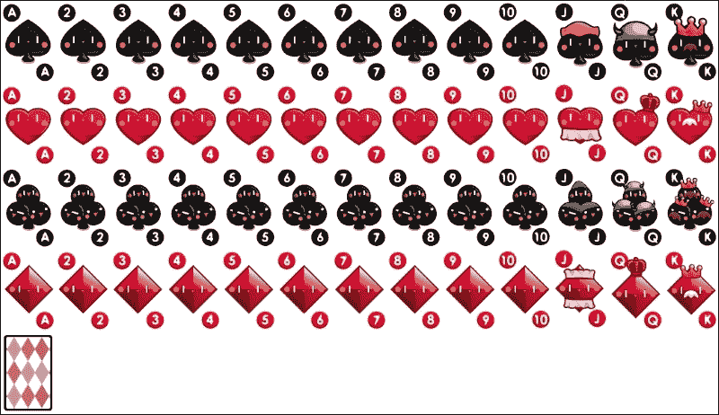

## 设置游戏环境

一旦图形准备就绪，我们需要设置一个静态页面，其中包含准备好的并放置在游戏区域中的游戏对象。这样，稍后添加游戏逻辑和交互就更容易了：

# 行动时间 - 准备卡片匹配游戏

在向我们的匹配游戏添加复杂的游戏逻辑之前，让我们准备 HTML 游戏结构和所有 CSS 样式：

1.  让我们继续我们的项目。在`js`文件夹内创建一个名为`matchgame.js`的新文件。

1.  将`index.html`文件替换为以下 HTML 代码：

    ```js
    <!DOCTYPE html>
    <html lang="en">
    <head>
      <meta charset=utf-8>
      <title>CSS3 Matching Game</title>
      <link rel="stylesheet" href="css/matchgame.css" />
    </head>
    <body>
      <header>
        <h1>CSS3 Matching Game</h1>
      </header>

      <section id="game">
        <div id="cards"> 
          <div class="card">
            <div class="face front"></div>
            <div class="face back"></div>
          </div> <!-- .card -->
        </div> <!-- #cards -->
      </section> <!-- #game -->

      <footer>
        <p>This is an example of creating a matching game with CSS3.</p>
      </footer>

    <script src="img/jquery-2.1.3.min.js"></script>
    <script src="img/matchgame.js"></script>
    </body>
    </html>
    ```

1.  为了使游戏更具吸引力，我准备了游戏桌和页面的背景图像。这些图形资产可以在代码示例包中找到。背景图像是可选的，它们不会影响游戏玩法和匹配游戏的逻辑。

1.  我们还将扑克牌的精灵图集图形放入图像文件夹。然后，我们将从[`mak.la/deck.png`](http://mak.la/deck.png)下载`deck.png`文件，并将其保存在图像文件夹中。

1.  为我们的游戏创建一个专门的 CSS 文件，命名为`matchgame.css`，并将其放入`css`文件夹中。

1.  现在，在我们编写任何逻辑之前，让我们为匹配游戏添加样式。打开`matchgame.css`并添加以下 body 样式：

    ```js
    body {
      text-align: center;
      background: BROWN url(../images/bg.jpg);
    }
    ```

1.  我们将继续为`game`元素添加样式。这将游戏的主要区域：

    ```js
    #game {
      border-radius: 10px;
      border: 1px solid GRAY;
      background: DARKGREEN url(../images/table.jpg);
      width: 500px;
      height: 460px;
      margin: 0 auto;
      display: flex;
      justify-content: center;
      align-items: center;
    }
    ```

1.  我们将所有卡片元素放入一个名为`cards`的父 DOM 中。通过这样做，我们可以轻松地将所有卡片在游戏区域中居中：

    ```js
    #cards {
      position: relative;
      width: 380px;
      height: 400px;
    }
    ```

1.  对于每张卡片，我们定义一个`perspective`属性来给它一个视觉深度效果：

    ```js
    .card {
      perspective: 600px;
      width: 80px;
      height: 120px;
      position: absolute;
      transition: all .3s;
    }
    ```

1.  每张卡片有两个面。背面将在稍后旋转，我们将定义过渡属性来动画化样式变化。我们还想确保背面是隐藏的：

    ```js
    .face {
      border-radius: 10px;
      width: 100%;
      height: 100%;
      position: absolute;
      transition-property: opacity, transform, box-shadow;
      transition-duration: .3s;

      backface-visibility: hidden;
    }
    ```

1.  现在，我们将设置正面和背面的样式。它们几乎与翻牌示例相同，除了我们现在为它们提供背景图像和阴影盒：

    ```js
    .front {
      background: GRAY url(../images/deck.png) 0 -480px;
    }
    .back {
      background: LIGHTGREY url(../images/deck.png);
      transform: rotate3d(0,1,0,-180deg);
    }
    .card:hover .face, .card-flipped .face {
      box-shadow: 0 0 10px #aaa;
    }
    .card-flipped .front {
      transform: rotate3d(0,1,0,180deg);
    }
    .card-flipped .back {
      transform: rotate3d(0,1,0,0deg);
    }
    ```

1.  当任何卡片被移除时，我们希望它淡出。因此，我们声明一个具有 0 不透明度的`card-removed`类：

    ```js
    .card-removed {
      opacity: 0;
    }
    ```

1.  为了从扑克牌图集的精灵图中显示不同的扑克牌图形，我们将卡片的背景裁剪到不同的背景位置：

    ```js
    .cardAJ {background-position: -800px 0;}
    .cardAQ {background-position: -880px 0;}
    .cardAK {background-position: -960px 0;}
    .cardBJ {background-position: -800px -120px;}
    .cardBQ {background-position: -880px -120px;}
    .cardBK {background-position: -960px -120px;}
    .cardCJ {background-position: -800px -240px;}
    .cardCQ {background-position: -880px -240px;}
    .cardCK {background-position: -960px -240px;}
    .cardDJ {background-position: -800px -360px;}
    .cardDQ {background-position: -880px -360px;}
    .cardDK {background-position: -960px -360px;}
    ```

1.  我们已经定义了很多 CSS 样式。现在是时候为 JavaScript 的逻辑编写代码了。我们将打开`js/matchgame.js`文件，并在其中放入以下代码：

    ```js
    $(function(){
      // clone 12 copies of the card
      for(var i=0; i<11; i++){
        $(".card:first-child").clone().appendTo("#cards");
      }
      // initialize each card's position
      $("#cards").children().each(function(index) {
        // align the cards to be 4x3 ourselves.
        var x = ($(this).width() + 20) * (index % 4);
        var y = ($(this).height() + 20) * Math.floor(index / 4);
        $(this).css("transform", "translateX(" + x + "px) translateY(" + y + "px)");
      });
    });
    ```

1.  现在，我们将保存所有文件并在浏览器中预览游戏。游戏应该样式良好，并且应该有 12 张卡片出现在中央。然而，我们目前还不能点击卡片，因为我们还没有为卡片设置任何交互逻辑。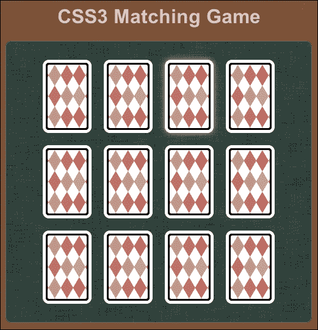

## *发生了什么？*

我们在 HTML 中创建了游戏结构，并应用了样式到 HTML 元素上。您可以在 [`makzan.net/html5-games/card-matching-wip-step1/`](http://makzan.net/html5-games/card-matching-wip-step1/) 找到当前进度下游戏的运行示例。

当网页加载并准备就绪后，我们也使用了 jQuery 在游戏区域创建 12 张卡片。翻动和移除卡片的效果样式也已准备就绪，稍后将通过游戏逻辑应用到卡片上。

由于我们为每个卡片使用绝对定位，因此需要我们自己将卡片对齐成 4x3 的瓷砖。在 JavaScript 逻辑中，我们通过循环遍历每个卡片，通过计算循环索引来对齐它：

```js
$("#cards").children().each(function(index) {
  // align the cards to be 4x3 ourselves.
  var x = ($(this).width() + 20) * (index % 4);
  var y = ($(this).height() + 20) * Math.floor(index / 4);
  $(this).css("transform", "translateX(" + x + "px) translateY(" + y + "px)");
});
```

JavaScript 中的 % 符号是 **取模运算符**，它返回除法后的余数。余数用于在循环卡片时获取列数。以下图表显示了索引号与行/列之间的关系：

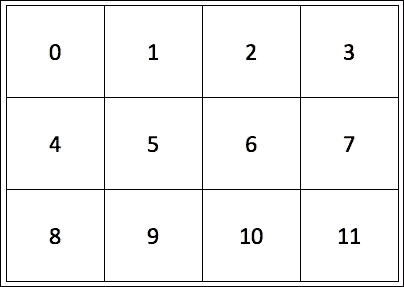

另一方面，除法用于获取行数，这样我们就可以将卡片定位在相应的行上。

以索引 3 为例；3 % 4 等于 3。因此，索引 3 的卡片位于第三列。而 3 / 4 等于 0，所以它位于第一行。

让我们选择另一个数字来看看公式是如何工作的。让我们看看索引 8；8 % 4 等于 0，它位于第一列。8 / 4 等于 2，所以它位于第三行。

## 使用 jQuery 克隆 DOM 元素

在我们的 HTML 结构中，我们只有一个卡片，而在结果中我们有 12 张卡片。这是因为我们使用了 jQuery 中的 `clone` 函数来克隆卡片元素。在克隆目标元素后，我们调用了 `appendTo` 函数将克隆的卡片元素作为子元素添加到卡片元素中：

```js
$(".card:first-child").clone().appendTo("#cards");
```

## 使用子元素过滤器在 jQuery 中选择元素的第一个子元素

当我们选择卡片元素并克隆它时，我们使用了以下选择器：

```js
$(".card:first-child")
```

`:first-child` 过滤器是一个 **子元素过滤器**，它选择给定父元素的第一个子元素。

除了 `:first-child`，我们还可以通过使用 `:last-child` 来选择最后一个子元素。

### 注意

您也可以在 jQuery 文档中检查其他与子元素相关的选择器：[`api.jquery.com/category/selectors/child-filter-selectors/`](http://api.jquery.com/category/selectors/child-filter-selectors/)。

## 垂直对齐 DOM 元素

我们将卡片 DIV 放在游戏元素的中央。**CSS3 弹性盒布局模块**引入了一种简单的方法来实现 **垂直居中对齐**，如下所示：

```js
display: flex;
justify-content: center;
align-items: center;
```

弹性盒子模块定义了容器中有额外空间时元素的排列。我们可以通过使用 CSS2 属性`display`，并设置为`box`值，以及一个新的 CSS3 属性值，将元素设置为灵活盒子容器的特定行为。

`justify-content`和`align-items`是两个属性，用于定义如何对齐以及水平和垂直方向上如何使用额外的空闲空间。我们可以通过将这两个属性都设置为`center`来居中元素。

垂直对齐只是弹性盒子布局模块的一部分。在网页设计中制作布局时，它非常强大。你可以在 W3C 模块页面（[`www.w3.org/TR/css3-flexbox/`](http://www.w3.org/TR/css3-flexbox/））或 CSS3 技巧网站上找到更多关于该模块的信息（[http://css-tricks.com/snippets/css/a-guide-to-flexbox/](http://css-tricks.com/snippets/css/a-guide-to-flexbox/））。

## 使用 CSS 精灵和背景位置

CSS 精灵表是一个包含许多单独图形的大图像。大精灵表图像被应用于元素的背景图像。我们可以通过将背景位置移动到固定宽度和高度的元素中，来裁剪出每个图形。

我们牌组的图像包含总共 53 个图形。为了更容易地演示背景位置，让我们假设我们有一个包含三张牌图像的图像，如下面的截图所示：

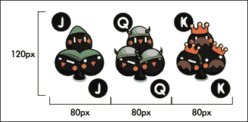

在 CSS 样式表中，我们将卡片元素设置为宽度 80 像素和高度 120 像素，并将背景图像设置为大牌组图像。如果我们想要左上角的图形，我们将背景位置中*x*轴和*y*轴的值都设置为 0。如果我们想要第二个图形，我们将背景图像向左移动 80 像素。这意味着将 X 位置设置为`-80px`，Y 位置设置为 0。由于我们有一个固定的宽度和高度，只有裁剪的 80 x 120 区域显示了背景图像。以下截图中的矩形显示了可查看区域：

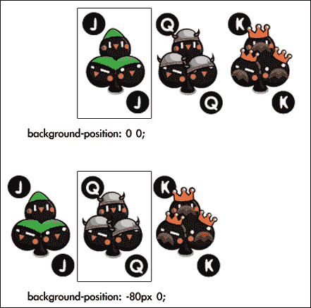

# 将游戏逻辑添加到匹配游戏中

现在让我们想象一下，我们手中拿着一副真实的牌，并设置匹配游戏。

我们首先在我们的手中洗牌，然后将每张牌背面朝上放在桌子上。为了使游戏更容易进行，我们将牌排列成 4 x 3 的数组。现在，游戏已经设置好了，我们准备开始玩。

我们拿起一张牌并翻转它使其正面朝上。我们再拿起一张牌并使其向上。之后，我们有两种可能的行为。如果两张牌的图案相同，我们就拿走这两张牌。否则，我们将它们放回背面朝下，就像我们从未触摸过它们一样。游戏继续进行，直到我们配对所有的牌。

在我们心中有了这个逐步场景之后，代码流程将更加清晰。实际上，这个例子中的代码与我们用真实牌玩的过程完全相同。我们只需要将人类语言替换成 JavaScript 代码。

# 行动时间 – 向配对游戏添加游戏逻辑

在上一个示例中，我们已经准备好了游戏环境，并决定游戏逻辑应该与玩一副真实的牌相同。现在是时候编写 JavaScript 逻辑了：

1.  让我们从我们最后的配对游戏示例开始。我们已经设置了 CSS，现在，是时候在 `js/matchgame.js` 文件中添加游戏逻辑了。

1.  游戏是要匹配一副扑克牌的配对。我们现在有 12 张牌，所以我们需要六对扑克牌。将以下代码放入 `js/matchgame.js` 文件中。数组声明了六对卡片模式：

    ```js
    var matchingGame = {};
    matchingGame.deck = [
      'cardAK', 'cardAK',
      'cardAQ', 'cardAQ',
      'cardAJ', 'cardAJ',
      'cardBK', 'cardBK',
      'cardBQ', 'cardBQ',
      'cardBJ', 'cardBJ',
    ];
    ```

1.  我们在上一章的 jQuery 的 `ready` 函数中排列了卡片。现在我们需要在 `ready` 函数中准备和初始化更多的代码。为此，将 `ready` 函数更改为以下代码。更改后的代码在此处突出显示：

    ```js
    $(function(){
     matchingGame.deck.sort(shuffle);

      for(var i=0;i<11;i++){
        $(".card:first-child").clone().appendTo("#cards");
      }

      $("#cards").children().each(function(index) {
        var x = ($(this).width() + 20) * (index % 4);
        var y = ($(this).height() + 20) * Math.floor(index / 4);
        $(this).css("transform", "translateX(" + x + "px) translateY(" + y + "px)");

     // get a pattern from the shuffled deck
     var pattern = matchingGame.deck.pop();

     // visually apply the pattern on the card's back side.
     $(this).find(".back").addClass(pattern);

     // embed the pattern data into the DOM element.
     $(this).attr("data-pattern",pattern);

     // listen the click event on each card DIV element.
     $(this).click(selectCard);
      });
    });
    ```

1.  与玩一副真实的牌类似，我们首先想做的事情是洗牌。为此，我们需要在 JavaScript 文件中添加以下 `shuffle` 函数：

    ```js
    function shuffle() {
      return 0.5 - Math.random();
    }
    ```

1.  当我们点击卡片时，我们翻转它并安排检查函数。因此，我们必须将以下代码附加到 JavaScript 文件中：

    ```js
    function selectCard() {
      // we do nothing if there are already two card flipped.
      if ($(".card-flipped").size() > 1) {
        return;
      }
      $(this).addClass("card-flipped");
      // check the pattern of both flipped card 0.7s later.
      if ($(".card-flipped").size() === 2) {
        setTimeout(checkPattern,700);
      }
    }
    ```

1.  当两张卡片被打开时，以下函数被执行。它控制我们是否移除卡片或将其翻转回来：

    ```js
    function checkPattern() {
      if (isMatchPattern()) {
        $(".card-flipped").removeClass("card-flipped").addClass("card-removed");
        $(".card-removed").bind("transitionend",removeTookCards);
      } else {
        $(".card-flipped").removeClass("card-flipped");
      }
    }
    ```

1.  现在是模式检查函数的时间。以下函数访问打开卡片的自定义模式属性，并将它们进行比较，看它们是否属于同一模式：

    ```js
    function isMatchPattern() {
      var cards = $(".card-flipped");
      var pattern = $(cards[0]).data("pattern");
      var anotherPattern = $(cards[1]).data("pattern");
      return (pattern === anotherPattern);
    }
    ```

1.  匹配的卡片淡出后，我们执行以下函数来移除卡片：

    ```js
    function removeTookCards() {
      $(".card-removed").remove();
    }
    ```

1.  游戏逻辑现在准备好了。让我们在浏览器中打开游戏的 HTML 文件并玩游戏。记得检查 **开发者工具** 中的控制台窗口，看看是否有任何错误。

以下截图显示了 CSS3 卡片配对游戏：

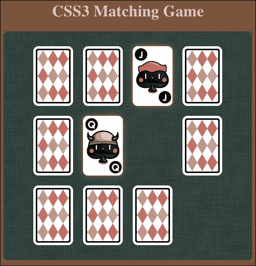

## *发生了什么？*

我们已经编写了 CSS3 配对游戏的逻辑。这个逻辑为扑克牌添加了鼠标点击交互，并控制了模式检查的流程。你可以尝试游戏并查看完整的源代码在 [`makzan.net/html5-games/card-matching-wip-step2/`](http://makzan.net/html5-games/card-matching-wip-step2/)。

## CSS 过渡结束后执行代码

游戏结束后，我们移除了配对的卡片。我们可以通过使用 `transitionend` 事件来安排在过渡结束后执行一个函数。以下来自我们代码示例的代码片段给配对的卡片添加了一个 `card-removed` 类以启动过渡。然后，它将 `transitionend` 事件绑定到移除卡片，包括 DOM，之后：

```js
$(".card-flipped").removeClass("card-flipped").addClass("card-removed");
$(".card-removed").bind("transitionend", removeTookCards);
```

## 翻转卡片后的代码执行延迟

游戏逻辑流程的设计方式与玩真实牌组相同。一个很大的不同之处在于我们使用了几个`setTimeout`函数来延迟代码的执行。当点击第二张牌时，我们通过以下代码示例片段安排`checkPattern`函数在 0.7 秒后执行：

```js
if ($(".card-flipped").size() == 2) {
  setTimeout(checkPattern, 700);
}
```

我们延迟函数调用的原因是为了给玩家留出时间来记住牌型。

## 在 JavaScript 中随机化数组

JavaScript 中没有内置的数组随机化函数。我们必须自己编写。幸运的是，我们可以从内置的数组排序函数中获得帮助。

下面是`sort`函数的用法：

```js
sort(compare_function);
```

`sort`函数接受一个可选参数：

| 参数 | 定义 | 讨论 |
| --- | --- | --- |
| `compare_function` | 一个定义数组排序顺序的函数。`compare_function`需要两个参数。 | `sort`函数通过使用`compare`函数比较数组中的两个元素。因此，`compare`函数需要两个参数。当`compare`函数返回任何大于 0 的值时，它将第一个参数放在比第二个参数低的索引处。当返回值小于 0 时，它将第二个参数放在比第一个参数低的索引处。 |

这里的技巧是我们使用了返回介于-0.5 和 0.5 之间的随机数的`compare`函数：

```js
anArray.sort(shuffle);
function shuffle(a, b) {
  return 0.5 - Math.random();
}
```

通过在`compare`函数中返回一个随机数，`sort`函数以不一致的方式对相同的数组进行排序。换句话说，我们洗牌。

### 注意

来自 Mozilla 开发者网络的以下链接提供了关于使用`sort`函数的详细解释，包括示例：

[`developer.mozilla.org/en/JavaScript/Reference/Global_Objects/Array/sort`](https://developer.mozilla.org/en/JavaScript/Reference/Global_Objects/Array/sort)

## 使用 HTML5 自定义数据属性存储内部自定义数据

我们可以通过使用**自定义数据属性**在 DOM 元素中存储自定义数据。我们可以使用`data-`前缀创建一个自定义属性名，并为其分配一个值。

例如，我们可以在以下代码中将自定义数据嵌入到列表元素中：

```js
<ul id="games">
  <li data-chapter="2" data-difficulty="easy">Ping-Pong</li>
  <li data-chapter="3" data-difficulty="medium">Matching Game</li>
</ul>
```

这是 HTML5 规范中提出的新功能。根据 W3C 的说法，自定义数据属性旨在存储私有于页面或应用程序的自定义数据，对于这些数据没有更适合的属性或元素。

W3C 还指出，这个自定义数据属性“旨在由网站的脚本使用，而不是一个通用的扩展机制，用于公开可用的元数据。”

我们正在编写匹配游戏，并将我们自己的数据嵌入到牌元素中；因此，自定义数据属性非常适合我们的使用。

我们使用自定义属性在每张牌中存储牌型，以便我们可以通过比较模式值来检查 JavaScript 中翻开的牌是否匹配。此外，模式还用于将玩牌样式化为相应的图形：

```js
$(this).find(".back").addClass(pattern);
$(this).attr("data-pattern",pattern);
```

## 突击测验

Q1. 根据 W3C 关于自定义数据属性的指南，以下哪个陈述是正确的？

1.  我们可以创建一个 `data-link` 属性来存储 `css` 标签的链接。

1.  我们可以访问第三方游戏门户网站中的自定义数据属性。

1.  我们可以在每个玩家的 DOM 元素中存储 `data-score` 属性，以在我们的网页中排序排名。

1.  我们可以在每个玩家的 DOM 元素中创建一个 `ranking` 属性来存储排名数据。

## 使用 jQuery 访问自定义数据属性

在匹配游戏示例中，我们使用了 jQuery 库中的 `attr` 函数来访问我们的自定义数据：

```js
pattern = $(this).attr("data-pattern");
```

`attr` 函数返回给定属性名的值。例如，我们可以通过调用以下代码来获取所有 `a` 标签中的链接：

```js
$("a").attr("href");
```

对于 HTML5 自定义数据属性，jQuery 为我们提供了一个额外的函数来访问 HTML5 自定义数据属性。这个函数就是 `data` 函数。

`data` 函数是为了将自定义数据嵌入到 HTML 元素的 jQuery 对象中而设计的。它是在 HTML5 自定义数据属性之前设计的。

这里是 `data` 函数的使用方法：

```js
.data(key)
.data(key,value)
```

`data` 函数接受两种类型的函数：

| 函数类型 | 参数定义 | 讨论 |
| --- | --- | --- |
| `.data(key)` | `key` 参数是一个字符串，用于命名数据条目。 | 当只提供 `key` 参数时，`data` 函数读取与 jQuery 对象关联的数据，并返回相应的值。在最近的 jQuery 更新中，此函数扩展以支持 HTML5 自定义数据属性。 |
| `.data(key, value)` | `key` 参数是一个字符串，用于命名数据条目。`value` 参数是要与 jQuery 对象关联的数据。 | 当同时提供 `key` 和 `value` 参数时，`data` 函数将新的数据条目设置到 jQuery 对象中。`value` 参数可以是任何 JavaScript 类型，包括数组和对象。 |

为了支持 HTML5 自定义数据属性，jQuery 扩展了 `data` 函数，使其能够访问在 HTML 代码中定义的自定义数据。

现在，让我们看看我们如何使用 `data` 函数。考虑以下 HTML 代码中的一行：

```js
<div id="target" data-custom-name="HTML5 Games"></div>
```

现在，使用前面的代码行，我们可以通过在 jQuery 中调用 `data` 函数来访问 `data-custom-name` 属性：

```js
$("#target").data("customName")
```

这将返回 "HTML5 Games"。

### 注意

请记住，`attr` 方法总是会返回一个字符串值。然而，`data` 方法会尝试将 HTML 字符串值转换为 JavaScript 值，例如数字或布尔值。

## 快速问答

Q1. 给定以下 HTML 代码，哪些 jQuery 语句读取自定义分数数据并以整数格式返回 100？

```js
<div id="game" data-score="100"></div>
```

1.  `$("#game").attr("data-score");`

1.  `$("#game").attr("score");`

1.  `$("#game").data("data-score");`

1.  `$("#game").data("score");`

## 尝试一下英雄

我们已经创建了 CSS3 匹配游戏。那么，这里缺少了什么？游戏逻辑没有检查游戏是否结束。当游戏结束时，尝试添加“你赢了！”的文本。你还可以通过使用本章讨论的技术来动画化文本。

## 制作其他扑克牌游戏

这种 CSS3 扑克牌方法适合创建卡片游戏。卡片有两面，适合翻动。过渡特性适合移动卡片。有了移动和翻动，我们只需定义游戏规则，就能充分利用卡片游戏。

## 尝试一下英雄

你能使用扑克牌图形和翻动技术来创建另一个游戏吗？比如扑克？

# 将网络字体嵌入到我们的游戏中

多年来，我们一直在使用有限的字体来设计网页。我们无法使用我们想要的任何字体，因为浏览器从访客的本地机器加载字体，我们无法控制或确保访客拥有我们想要的字体。

尽管我们可以将**网络字体**嵌入到 Internet Explorer 5 中，但格式有限，我们必须等待浏览器厂商支持嵌入最常见的 TrueType 字体格式。

想象一下，我们可以通过嵌入不同风格的网络字体来控制游戏的情绪。然后我们可以用我们想要的字体设计游戏，并更多地控制游戏的吸引力。让我们尝试将网络字体嵌入到我们的记忆匹配游戏中。

# 开始行动——从 Google 字体目录嵌入字体

**Google Fonts**目录是一个提供免费使用网络字体的网络字体服务。我们将嵌入从 Google Fonts 目录选择的网络字体：

1.  前往[`google.com/fonts`](http://google.com/fonts)的 Google 字体目录网站。

1.  在字体目录中，有一个列表，列出了在开源许可下可用的网络字体，可以免费使用。

1.  选择其中一个，然后点击字体名称以进入下一步。在这个例子中，我使用了**Droid Serif**。

1.  在你点击字体后，字体目录会显示关于该字体的详细信息。在这里，我们可以执行几个操作，例如预览字体、选择变体，最重要的是，获取字体嵌入代码。

1.  在 MAC 上，点击**获取代码**标签，你会看到以下截图；这显示了如何将此字体嵌入到我们的网页中的指南。或者，在 Windows 上，你可以点击**使用**标签，你会找到获取代码的说明：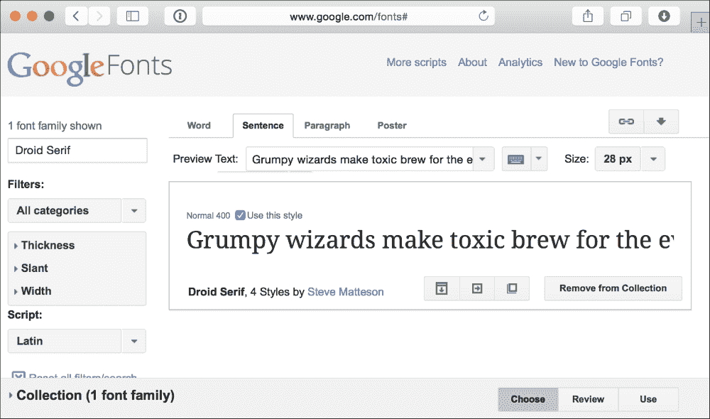

1.  复制 Google 提供的`link`标签，并将其粘贴到 HTML 代码中。这应该放在任何其他样式定义之前：

    ```js
    <link href='http://fonts.googleapis.com/css?family=Droid+Serif:regular,bold&subset=latin' rel='stylesheet' type='text/css'>
    ```

1.  现在，我们可以使用字体来设置我们的文本样式。将 body 的字体家族属性设置为以下代码：

    ```js
    body {
      font-family: 'Droid Serif', Arial, serif;
    }
    ```

1.  保存所有文件并打开`index.html`文件。浏览器将从谷歌服务器下载字体并将其嵌入到网页中。请注意字体；它们应该被加载并渲染为我们所选的谷歌字体。嵌入谷歌字体目录中的字体 - 行动时间

## *发生了什么？*

我们刚刚使用一个不常见的网络字体来设计我们的游戏。该字体由谷歌字体目录托管并交付。

除了使用字体目录外，我们还可以通过使用`@font face`来嵌入我们的字体文件。以下链接提供了一个嵌入字体的安全方法：

[`www.fontspring.com/blog/the-new-bulletproof-font-face-syntax`](http://www.fontspring.com/blog/the-new-bulletproof-font-face-syntax)

### 小贴士

**在嵌入字体之前检查字体许可**

通常，字体许可并不涵盖其在网页上的使用。在嵌入字体之前，请务必检查许可。谷歌字体目录中列出的所有字体都受开源许可协议的约束，可以在任何网站上使用。您可以在[`www.google.com/fonts/attribution`](https://www.google.com/fonts/attribution)查看目录中列出的单个字体的许可。

## 选择不同的字体交付服务

谷歌字体目录只是字体交付服务之一。Typekit ([`typekit.com`](http://typekit.com)) 和 Fontdeck ([`fontdeck.com`](http://fontdeck.com)) 是另外两种提供数百种高质量字体的字体服务，这些服务通过年度订阅计划提供。

# 摘要

在本章中，你学习了如何使用 CSS3 的不同新特性来创建游戏。

具体来说，我们介绍了如何构建一个基于 CSS3 样式和动画的卡牌游戏。你学习了如何通过使用过渡模块来转换和动画化游戏对象。我们可以通过透视深度错觉来翻转卡片。我们还从在线字体交付服务中嵌入网络字体。

现在你已经了解了在 CSS3 特性的帮助下创建基于 DOM 的 HTML5 游戏，我们将探讨另一种方法——使用新的`canvas`标签和绘图 API——在下一章中创建 HTML5 游戏。
