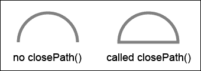
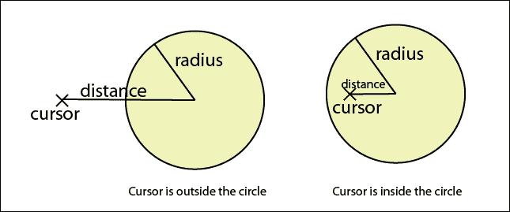

# 第四章：使用 Canvas 和绘图 API 构建 Untangle 游戏

*HTML5 中的一个新亮点特性是`canvas`元素。我们可以将其视为一个动态区域，在其中我们可以使用脚本绘制图形和形状。*

*网站上的图像已经静态了好几年。有动画 GIF，但它们不能与访客交互。Canvas 是动态的。我们在 Canvas 中绘制和修改上下文，通过 JavaScript 绘图 API 动态地绘制。我们还可以向 Canvas 添加交互，从而制作游戏。*

在前两章中，我们讨论了基于 DOM 的游戏开发，使用了 CSS3 和一些 HTML5 特性。在接下来的两章中，我们将专注于使用新的 HTML5 特性来创建游戏。在本章中，我们将探讨一个核心特性，Canvas，以及一些基本的绘图技术。

在本章中，我们将涵盖以下主题：

+   介绍 HTML5 `canvas`元素

+   在 Canvas 中绘制圆形

+   在`canvas`元素中绘制线条

+   使用鼠标事件与 Canvas 中绘制的对象交互

+   检测线段交点

+   在触摸设备上支持拖放功能

Untangle 谜题游戏是一款玩家被给予一些线条连接的圆形的游戏。这些线条可能相交，玩家需要拖动圆形，以便没有线条再相交。

以下截图预览了我们将通过本章实现的那个游戏：


您也可以在以下 URL 尝试游戏：

[`makzan.net/html5-games/untangle-wip-dragging/`](http://makzan.net/html5-games/untangle-wip-dragging/)

因此，让我们从头开始制作我们的 Canvas 游戏。

# 介绍 HTML5 `canvas`元素

W3C 社区表示，`canvas`元素和绘图函数如下：

> *一个分辨率相关的位图 Canvas，可以用于实时渲染图表、游戏图形或其他视觉图像。*

`canvas`元素包含绘图上下文，实际的图形和形状是通过 JavaScript 绘图 API 绘制的。使用`canvas`与常规 HTML DOM 元素之间有一个关键区别。Canvas 是即时模式，而 DOM 是保留模式。我们使用元素和属性描述 DOM 树，浏览器为我们渲染和跟踪对象。在 Canvas 中，我们必须自己管理所有属性和渲染。浏览器不会保留我们绘制的相关信息。它只保留绘制的像素数据。

# 在 Canvas 中绘制圆形

让我们从 Canvas 的基本形状——圆形开始我们的绘图。

# 行动时间——在 Canvas 中绘制彩色圆形

1.  首先，让我们为示例设置新的环境。即一个包含`canvas`元素、一个 jQuery 库以帮助我们进行 JavaScript 编程、一个包含实际绘图逻辑的 JavaScript 文件以及一个样式表的 HTML 文件：

    ```js
    index.html
    js/
      js/jquery-2.1.3.js
      js/untangle.js
      js/untangle.drawing.js
      js/untangle.data.js
      js/untangle.input.js
    css/
      css/untangle.css
    images/
    ```

1.  将以下 HTML 代码放入`index.html`文件中。这是一个包含`canvas`元素的基本 HTML 文档：

    ```js
    <!DOCTYPE html>
    <html lang="en">
    <head>
      <meta charset="utf-8">
      <title>Drawing Circles in Canvas</title>
      <link rel="stylesheet" href="css/untangle.css">
    </head>
    <body>
      <header>
        <h1>Drawing in Canvas</h1>
      </header>  

      <canvas id="game" width="768" height="400">
        This is an interactive game with circles and lines connecting them.
      </canvas>

    <script src="img/jquery-2.1.3.min.js"></script>
    <script src="img/untangle.data.js"></script>
    <script src="img/untangle.drawing.js"></script>
    <script src="img/untangle.input.js"></script>
    <script src="img/untangle.js"></script>
    </body>
    </html>
    ```

1.  使用 CSS 在`untangle.css`中设置 Canvas 的背景颜色：

    ```js
    canvas {
      background: grey;
    }
    ```

1.  在`untangle.js` JavaScript 文件中，我们放置了一个 jQuery `document` `ready`函数并在其中绘制了一个颜色圆圈：

    ```js
    $(document).ready(function(){
      var canvas = document.getElementById("game");  
      var ctx = canvas.getContext("2d");
      ctx.fillStyle = "GOLD";
      ctx.beginPath();
      ctx.arc(100, 100, 50, 0, Math.PI*2, true); 
      ctx.closePath();
      ctx.fill();
    });
    ```

1.  在网络浏览器中打开`index.html`文件，我们将得到以下截图：

## *发生了什么？*

我们刚刚创建了一个简单的**Canvas 上下文**，上面有圆圈。对于`canvas`元素本身并没有很多设置。我们设置了 Canvas 的宽度和高度，就像我们固定了真实绘制纸张的尺寸一样。此外，我们还为 Canvas 分配了一个 ID 属性，以便在 JavaScript 中更容易引用：

```js
<canvas id="game" width="768" height="400">
  This is an interactive game with circles and lines connecting them.
</canvas>
```

## 当网络浏览器不支持 Canvas 时，添加回退内容

并非每个网络浏览器都支持`canvas`元素。`canvas`元素提供了一个简单的方法来提供**回退内容**，如果浏览器不支持`canvas`元素。该内容同时也为任何屏幕阅读器提供了有意义的信息。`canvas`元素打开和关闭标签内的任何内容都是回退内容。如果浏览器支持该元素，则此内容将被隐藏。在回退内容中提供有用信息是一种良好的做法。例如，如果`canvas`标签的目的是动态图片，我们可能考虑在那里放置一个``替代元素。或者，我们也可以提供一些链接到现代网络浏览器，以便访客可以轻松升级他们的浏览器。

## Canvas 上下文

当我们在 Canvas 中绘制时，实际上是在调用**canvas 渲染上下文**的绘图 API。你可以将 Canvas 和上下文的关系想象为 Canvas 是框架，上下文是真正的绘图表面。目前，我们有`2d`、`webgl`和`webgl2`作为上下文选项。在我们的例子中，我们将通过调用`getContext("2d")`使用 2D 绘图 API。

```js
var canvas = document.getElementById("game");  
var ctx = canvas.getContext("2d");
```

## 使用 Canvas 弧线函数绘制圆和形状

没有绘制圆的函数。Canvas 绘图 API 提供了一个绘制不同弧线（包括圆）的函数。`arc`函数接受以下参数：

| 参数 | 讨论 |
| --- | --- |
| `X` | 弧在*x*轴上的中心点。 |
| `Y` | 弧在*y*轴上的中心点。 |
| `radius` | 半径是中心点和弧线周界的距离。在绘制圆时，较大的半径意味着较大的圆。 |
| `startAngle` | 起始点是弧度。它定义了在圆周上开始绘制弧线的位置。 |
| `endAngle` | 结束点是弧度。弧线从起始角度的位置绘制到这个结束角度。 |
| `counter-clockwise` | 这是一个布尔值，指示从 `startingAngle` 到 `endingAngle` 的弧是按顺时针还是逆时针方向绘制的。这是一个可选参数，默认值为 `false`。 |

## 将角度转换为弧度

`arc` 函数中使用的角度参数是以 **弧度** 为单位的，而不是以 **度** 为单位。如果你熟悉度数角度，你可能需要在将值放入弧度函数之前将度数转换为弧度。我们可以使用以下公式来转换角度单位：

```js
radians = π/180 x degrees
```

## 在画布中执行路径绘制

当我们调用 `arc` 函数或其他路径绘制函数时，我们并不是立即在画布中绘制路径。相反，我们将它添加到路径列表中。这些路径将不会绘制，直到我们执行绘制命令。

有两个绘图执行命令：一个用于填充路径，另一个用于绘制轮廓。

我们通过调用 `fill` 函数来填充路径，通过调用 `stroke` 函数来绘制路径的轮廓，我们将在绘制线条时使用它：

```js
ctx.fill();
```

## 为每种样式开始路径

`fill` 和 `stroke` 函数用于填充和绘制画布中的路径，但不会清除路径列表。以下是一个代码片段示例。在用红色填充我们的圆之后，我们添加其他圆并用绿色填充它们。代码的结果是两个圆都被绿色填充，而不是只有新的圆被绿色填充：

```js
var canvas = document.getElementById('game');  
var ctx = canvas.getContext('2d');
ctx.fillStyle = "red";
ctx.arc(100, 100, 50, 0, Math.PI*2, true); 
ctx.fill();

ctx.arc(210, 100, 50, 0, Math.PI*2, true);
ctx.fillStyle = "green";
ctx.fill();
```

这是因为，在调用第二个 `fill` 命令时，画布中的路径列表包含两个圆。因此，`fill` 命令用绿色填充了两个圆，并覆盖了红色圆的颜色。

为了解决这个问题，我们想要确保每次绘制新形状之前都调用 `beginPath`。

`beginPath` 函数清空路径列表，所以下次我们调用 `fill` 和 `stroke` 命令时，它们将只应用于最后一个 `beginPath` 之后的所有路径。

## 尝试一下英雄

我们刚刚讨论了一个代码片段，我们原本打算绘制两个圆：一个红色，一个绿色。代码最终绘制了两个绿色的圆。我们如何向代码中添加一个 `beginPath` 命令，以便正确地绘制一个红色圆和一个绿色圆？

## 闭合路径

`closePath` 函数将从最新路径的最后一个点到路径的第一个点绘制一条直线。这被称为闭合路径。如果我们只是要填充路径而不绘制轮廓线，`closePath` 函数不会影响结果。以下截图比较了在半圆上调用 `closePath` 和不调用 `closePath` 的结果：



## 突击测验

Q1. 如果我们只想填充颜色而不绘制轮廓线，我们是否需要在绘制的形状上使用 `closePath` 函数？

1.  是的，我们需要使用 `closePath` 函数。

1.  不，使用`closePath`函数并不重要。

## 将圆形绘制封装在函数中

绘制圆形是一个我们将大量使用的常见函数。现在创建一个绘制圆形的函数，而不是输入几行代码会更好。

# 将圆形绘制代码放入函数中的行动时间

让我们编写一个函数来绘制圆形，然后在画布上绘制一些圆形。我们将把代码放在不同的文件中，以使代码更简单：

1.  在我们的代码编辑器中打开`untangle.drawing.js`文件，并输入以下代码：

    ```js
    if (untangleGame === undefined) {
      var untangleGame = {};
    }

    untangleGame.drawCircle = function(x, y, radius) {
      var ctx = untangleGame.ctx;
      ctx.fillStyle = "GOLD";
      ctx.beginPath();
      ctx.arc(x, y, radius, 0, Math.PI*2, true);
      ctx.closePath();
      ctx.fill();
    };
    ```

1.  打开`untangle.data.js`文件，并将以下代码放入其中：

    ```js
    if (untangleGame === undefined) {
      var untangleGame = {};
    }

    untangleGame.createRandomCircles = function(width, height) {
      // randomly draw 5 circles
      var circlesCount = 5;
      var circleRadius = 10;
      for (var i=0;i<circlesCount;i++) {
        var x = Math.random()*width;
        var y = Math.random()*height;
        untangleGame.drawCircle(x, y, circleRadius);
      }
    };
    ```

1.  然后打开`untangle.js`文件。用以下代码替换 JavaScript 文件中的原始代码：

    ```js
    if (untangleGame === undefined) {
      var untangleGame = {};
    }

    // Entry point
    $(document).ready(function(){
      var canvas = document.getElementById("game");
      untangleGame.ctx = canvas.getContext("2d");

      var width = canvas.width;
      var height = canvas.height;

      untangleGame.createRandomCircles(width, height);

    }); 
    ```

1.  在网页浏览器中打开 HTML 文件以查看结果：

## *刚才发生了什么？*

绘制圆形的代码在页面加载并准备好后执行。我们使用循环在画布的随机位置绘制几个圆形。

## 将代码分割成文件

我们正在将代码放入不同的文件。目前，有`untangle.js`、`untangle.drawing.js`和`untangle.data.js`文件。`untangle.js`是游戏的入口点。然后我们将与上下文绘制相关的逻辑放入`untangle.drawing.js`，将与数据处理相关的逻辑放入`untangle.data.js`文件。

我们使用`untangleGame`对象作为跨所有文件访问的全局对象。在每个 JavaScript 文件的开头，我们有以下代码来创建此对象（如果它不存在的话）：

```js
if (untangleGame === undefined) {
  var untangleGame = {};
}
```

## 在 JavaScript 中生成随机数

在游戏开发中，我们经常使用`random`函数。我们可能想要随机召唤一个怪物让玩家战斗，我们可能想要在玩家取得进展时随机掉落奖励，或者我们可能想要一个随机数作为掷骰子的结果。在这段代码中，我们将圆形随机放置在画布上。

要在 JavaScript 中生成随机数，我们使用`Math.random()`函数。`random`函数没有参数。它总是返回一个介于 0 和 1 之间的浮点数。这个数等于或大于 0 且小于 1。使用`random`函数有两种常见方式。一种是在给定范围内生成随机数。另一种是生成真或假值。

| 用法 | 代码 | 讨论 |
| --- | --- | --- |
| 在 A 和 B 之间获取一个随机整数 | `Math.floor(Math.random()*B)+A` | `Math.floor()`函数截断给定数字的小数点。以`Math.floor(Math.random()*10)+5`为例。`Math.random()`返回一个介于 0 到 0.9999…之间的十进制数。`Math.random()*10`是一个介于 0 到 9.9999…之间的十进制数。`Math.floor(Math.random()*10)`是一个介于 0 到 9 之间的整数。最后，`Math.floor(Math.random()*10)` `+` `5`是一个介于 5 到 14 之间的整数。 |
| 获取一个随机的布尔值 | `(Math.random() > 0.495)` | `(Math.random() > 0.495)` 表示 50%的`false`和 50%的`true`。我们可以进一步调整真假比例。`(Math.random() > 0.7)` 表示大约 70%的`false`和 30%的`true`。 |

## 保存圆的位置

当我们在开发基于 DOM 的游戏时，例如我们在前几章中构建的游戏，我们通常将游戏对象放入 DIV 元素中，并在代码逻辑中稍后访问它们。在基于 Canvas 的游戏开发中则不同。

为了在 Canvas 中绘制游戏对象后访问它们，我们需要自己记住它们的状态。假设现在我们想知道画了多少个圆以及它们的位置，我们需要一个数组来存储它们的位置。

# 行动时间 - 保存圆的位置

1.  在文本编辑器中打开`untangle.data.js`文件。

1.  在 JavaScript 文件中添加以下`circle`对象定义代码：

    ```js
    untangleGame.Circle = function(x,y,radius){
      this.x = x;
      this.y = y;
      this.radius = radius;
    }
    ```

1.  现在我们需要一个数组来存储圆的位置。向`untangleGame`对象中添加一个新数组：

    ```js
    untangleGame.circles = [];
    ```

1.  当在 Canvas 中绘制每个圆时，我们在`circles`数组中保存圆的位置。在`createRandomCircles`函数中调用`drawCircle`函数之前，添加以下行：

    ```js
    untangleGame.circles.push(new untangleGame.Circle(x,y,circleRadius));
    ```

1.  步骤完成后，我们应该在`untangle.data.js`文件中有以下代码：

    ```js
    if (untangleGame === undefined) {
      var untangleGame = {};
    }

    untangleGame.circles = [];

    untangleGame.Circle = function(x,y,radius){
      this.x = x;
      this.y = y;
      this.radius = radius;
    };

    untangleGame.createRandomCircles = function(width, height) {
      // randomly draw 5 circles
      var circlesCount = 5;
      var circleRadius = 10;
      for (var i=0;i<circlesCount;i++) {
        var x = Math.random()*width;
        var y = Math.random()*height;
        untangleGame.circles.push(new untangleGame.Circle(x,y,circleRadius));
        untangleGame.drawCircle(x, y, circleRadius);
      }
    };
    ```

1.  现在我们可以测试网页中的代码。在 Canvas 中绘制随机圆时，此代码与上一个示例之间没有视觉上的差异。这是因为我们保存了圆，但没有更改任何影响外观的代码。我们只是确保它看起来相同，没有新的错误。

## *发生了什么？*

我们保存了每个圆的位置和半径。这是因为 Canvas 绘制是即时模式。我们无法直接访问 Canvas 中绘制的对象，因为没有这样的信息。所有线条和形状都作为像素绘制在 Canvas 上，我们无法将线条或形状作为单独的对象访问。想象一下我们在真正的画布上作画。我们无法只是移动油画中的房子，同样，我们也不能直接操作`canvas`元素中绘制的任何项目。

## 在 JavaScript 中定义基本类定义

我们可以在 JavaScript 中使用**面向对象编程**。我们可以定义一些用于我们的对象结构。`Circle`对象为我们提供了一个数据结构，使我们能够轻松地存储*x*和*y*位置以及半径。

定义了`Circle`对象后，我们可以使用以下代码创建一个新的`Circle`实例，并使用*x*、*y*和半径值：

```js
var circle1 = new Circle(100, 200, 10);
```

### 注意

对于 JavaScript 中面向对象编程的更详细用法，请查看以下链接的 Mozilla 开发者中心：

[`developer.mozilla.org/en/Introduction_to_Object-Oriented_JavaScript`](https://developer.mozilla.org/en/Introduction_to_Object-Oriented_JavaScript)

## 尝试一下英雄

我们在 Canvas 上随机画了几个圆。它们具有相同的样式和大小。我们随机画圆的大小怎么样？用不同的颜色填充圆？尝试修改代码，然后玩玩绘图 API。

# 在 Canvas 上画线

现在我们这里有几个圆，那么我们如何用线连接它们？让我们在每个圆之间画一条直线。

# 动手时间 - 在每个圆之间画直线

1.  打开我们在圆绘制示例中刚刚使用的`index.html`文件。

1.  将 h1 中的文字从**在 Canvas 上画圆**改为**在 Canvas 上画线**。

1.  打开`untangle.data.js` JavaScript 文件。

1.  我们定义一个`Line`类来存储我们需要的每条线的相关信息：

    ```js
    untangleGame.Line = function(startPoint, endPoint, thickness) {
      this.startPoint = startPoint;
      this.endPoint = endPoint;
      this.thickness = thickness;
    }
    ```

1.  保存文件并切换到`untangle.drawing.js`文件。

1.  我们需要两个额外的变量。在 JavaScript 文件中添加以下行：

    ```js
    untangleGame.thinLineThickness = 1;
    untangleGame.lines = [];
    ```

1.  我们在`untangle.drawing.js`文件中现有的`drawCircle`函数之后添加以下`drawLine`函数。

    ```js
    untangleGame.drawLine = function(ctx, x1, y1, x2, y2, thickness) {    
      ctx.beginPath();
      ctx.moveTo(x1,y1);
      ctx.lineTo(x2,y2);
      ctx.lineWidth = thickness;
      ctx.strokeStyle = "#cfc";
      ctx.stroke();
    }
    ```

1.  然后我们定义一个新的函数，它遍历圆列表并在每对圆之间画一条线。在 JavaScript 文件中添加以下代码：

    ```js
    untangleGame.connectCircles = function() {
      // connect the circles to each other with lines
      untangleGame.lines.length = 0;
      for (var i=0;i< untangleGame.circles.length;i++) {
        var startPoint = untangleGame.circles[i];
        for(var j=0;j<i;j++) {
          var endPoint = untangleGame.circles[j];
          untangleGame.drawLine(startPoint.x, startPoint.y, endPoint.x,
          endPoint.y, 1);
          untangleGame.lines.push(new untangleGame.Line(startPoint, endPoint,
          untangleGame.thinLineThickness));
        }
      }
    };
    ```

1.  最后，我们打开`untangle.js`文件，并在调用`untangleGame.createRandomCircles`函数之后，在 jQuery 文档`ready`函数的末尾添加以下代码：

    ```js
    untangleGame.connectCircles();
    ```

1.  在网页浏览器中测试代码。我们应该看到有线条连接到每个随机放置的圆：

## *发生了什么？*

我们通过连接每个生成的圆增强了我们的代码。你可以在以下 URL 找到一个工作示例：

[`makzan.net/html5-games/untangle-wip-connect-lines/`](http://makzan.net/html5-games/untangle-wip-connect-lines/)

与我们保存圆位置的方式类似，我们有一个数组来保存我们绘制的每条线段。我们声明一个线段类定义来存储线段的一些基本信息。也就是说，我们保存起点和终点以及线的粗细。

## 介绍线条绘制 API

有一些绘图 API 可以用来绘制和样式化线条：

| 线条绘制函数 | 讨论 |
| --- | --- |
| `moveTo` | `moveTo`函数就像我们手里拿着笔，在纸上移动它，但不碰触纸面。 |
| `lineTo` | 这个函数就像把笔放在纸上，然后画一条直线到目标点。 |
| `lineWidth` | `lineWidth`函数设置我们之后绘制的线条的粗细。 |
| `stroke` | `stroke`函数用于执行绘图。我们设置一个包含`moveTo`、`lineTo`或样式函数的集合，并最终调用`stroke`函数在 Canvas 上执行。 |

我们通常使用`moveTo`和`lineTo`对来绘制线条。就像在现实世界中一样，我们在纸上移动我们的笔到线条的起点并放下笔来绘制线条。然后，继续绘制另一条线条或移动到另一个位置再绘制。这正是我们在画布上绘制线条的流程。

### 注意

我们刚刚演示了如何绘制一条简单的线条。我们可以为画布中的线条设置不同的样式。有关线条样式的更多详细信息，请参阅 W3C 的样式指南[`www.w3.org/TR/2dcontext/#line-styles`](http://www.w3.org/TR/2dcontext/#line-styles)和 Mozilla 开发者中心的教程[`developer.mozilla.org/en-US/docs/Web/API/Canvas_API/Tutorial/Applying_styles_and_colors`](https://developer.mozilla.org/en-US/docs/Web/API/Canvas_API/Tutorial/Applying_styles_and_colors)。

# 使用鼠标事件与画布中绘制的对象交互

到目前为止，我们已经展示了我们可以根据我们的逻辑动态地在画布中绘制形状。游戏开发中缺少的一部分是输入。

现在，想象一下我们可以在画布上拖动圆圈，并且连接的线条会跟随圆圈移动。在本节中，我们将向画布添加鼠标事件以使我们的圆圈**可拖动**。

# 行动时间 – 在画布中拖动圆圈

1.  让我们继续使用之前的代码。打开`html5games.untangle.js`文件。

1.  我们需要一个函数来清除画布上的所有绘制内容。将以下函数添加到`untangle.drawing.js`文件的末尾：

    ```js
    untangleGame.clear = function() {
      var ctx = untangleGame.ctx;
      ctx.clearRect(0,0,ctx.canvas.width,ctx.canvas.height);
    };
    ```

1.  我们还需要两个额外的函数来绘制所有已知的圆圈和线条。将以下代码添加到`untangle.drawing.js`文件中：

    ```js
    untangleGame.drawAllLines = function(){
      // draw all remembered lines
      for(var i=0;i<untangleGame.lines.length;i++) {
        var line = untangleGame.lines[i];
        var startPoint = line.startPoint;
        var endPoint = line.endPoint;
        var thickness = line.thickness;
        untangleGame.drawLine(startPoint.x, startPoint.y, endPoint.x,
        endPoint.y, thickness);
      }
    };

    untangleGame.drawAllCircles = function() {
      // draw all remembered circles
      for(var i=0;i<untangleGame.circles.length;i++) {
        var circle = untangleGame.circles[i];
        untangleGame.drawCircle(circle.x, circle.y, circle.radius);
      }
    };
    ```

1.  我们已经完成了`untangle.drawing.js`文件。让我们切换到`untangle.js`文件。在 jQuery 文档就绪函数内部，在函数结束之前，我们添加以下代码，它创建了一个游戏循环以持续绘制圆圈和线条：

    ```js
    // set up an interval to loop the game loop
    setInterval(gameloop, 30);

    function gameloop() {
      // clear the Canvas before re-drawing.
      untangleGame.clear();
      untangleGame.drawAllLines();
      untangleGame.drawAllCircles();
    }
    ```

1.  在继续实现输入处理代码之前，让我们将以下代码添加到`untangle.js`文件中的 jQuery 文档就绪函数中，该代码调用我们将定义的`handleInput`函数：

    ```js
    untangleGame.handleInput();
    ```

1.  是时候实现我们的输入处理逻辑了。切换到`untangle.input.js`文件，并将以下代码添加到文件中：

    ```js
    if (untangleGame === undefined) {
      var untangleGame = {};
    }

    untangleGame.handleInput = function(){
      // Add Mouse Event Listener to canvas
      // we find if the mouse down position is on any circle
      // and set that circle as target dragging circle.
      $("#game").bind("mousedown", function(e) {
        var canvasPosition = $(this).offset();
        var mouseX = e.pageX - canvasPosition.left;
        var mouseY = e.pageY - canvasPosition.top;

        for(var i=0;i<untangleGame.circles.length;i++) {
          var circleX = untangleGame.circles[i].x;
          var circleY = untangleGame.circles[i].y;
          var radius = untangleGame.circles[i].radius;
          if (Math.pow(mouseX-circleX,2) + Math.pow(mouseY-circleY,2) < Math.pow(radius,2)) {
            untangleGame.targetCircleIndex = i;
            break;
          }
        }
      });

      // we move the target dragging circle 
      // when the mouse is moving
      $("#game").bind("mousemove", function(e) {
        if (untangleGame.targetCircleIndex !== undefined) {
          var canvasPosition = $(this).offset();
          var mouseX = e.pageX - canvasPosition.left;
          var mouseY = e.pageY - canvasPosition.top;
          var circle = untangleGame.circles[untangleGame.targetCircleIndex];
          circle.x = mouseX;
          circle.y = mouseY;
        }
        untangleGame.connectCircles();
      });

      // We clear the dragging circle data when mouse is up
      $("#game").bind("mouseup", function(e) {
        untangleGame.targetCircleIndex = undefined;
      });
    };
    ```

1.  在网页浏览器中打开`index.html`。应该有五个圆圈，它们通过线条连接。尝试拖动圆圈。被拖动的圆圈将跟随鼠标光标移动，并且连接的线条也会随之移动。

## **发生了什么？**

我们已经设置了三个鼠标事件监听器。它们是鼠标按下、移动和抬起事件。我们还创建了游戏循环，它根据圆圈的新位置更新画布绘制。您可以在以下位置查看示例的当前进度：[`makzan.net/html5-games/untangle-wip-dragging-basic/`](http://makzan.net/html5-games/untangle-wip-dragging-basic/)。

## 在画布中的圆圈上检测鼠标事件

在讨论了基于 DOM 的开发和基于 Canvas 的开发之间的区别后，我们无法直接监听在画布中绘制的任何形状的鼠标事件。不存在这样的事情。我们无法监听在画布中绘制的任何形状的事件。我们只能获取 `canvas` 元素的鼠标事件，并计算 Canvas 的相对位置。然后根据鼠标的位置更改游戏对象的状态，最后在画布上重新绘制。

*我们如何知道我们点击的是圆？* 我们可以使用 **点在圆内** 的公式。这是检查圆的中心点和鼠标位置之间的距离。当距离小于圆的半径时，鼠标点击圆。我们使用这个公式来获取两点之间的距离：*距离 = (x2-x1)² + (y2-y1)²*。

以下图表显示，当中心点和鼠标光标之间的距离小于半径时，光标位于圆内：



我们使用的以下代码解释了如何在鼠标按下事件处理程序中应用距离检查，以确定鼠标光标是否在圆内：

```js
if (Math.pow(mouseX-circleX,2) + Math.pow(mouseY-circleY,2) < Math.pow(radius,2)) {
  untangleGame.targetCircleIndex = i;
  break;
}
```

### 注意

请注意，`Math.pow` 是一个昂贵的函数，可能在某些场景中损害性能。如果性能是一个关注点，我们可能使用边界框碰撞检测，这在第二章中有所介绍，*基于 DOM 的游戏开发入门*。

当我们知道鼠标光标正在按下画布中的圆时，我们将其标记为目标圆，以便在鼠标移动事件中拖动。在鼠标移动事件处理程序中，我们将目标拖动圆的位置更新为最新的光标位置。当鼠标抬起时，我们清除目标圆的引用。

## 快速问答

Q1. 我们能否直接访问在画布中已经绘制的形状？

1.  是的

1.  不可以

Q2. 我们可以使用哪种方法来检查一个点是否在圆内？

1.  点的坐标小于圆心的坐标。

1.  点和圆心之间的距离小于圆的半径。

1.  点的 *x* 坐标小于圆的半径。

1.  点和圆心之间的距离大于圆的半径。

## 游戏循环

在第二章，*基于 DOM 的游戏开发入门*中，我们讨论了 **游戏循环** 方法。在乒乓球游戏中，游戏循环处理键盘输入并更新基于 DOM 的游戏对象的位置。

在这里，游戏循环被用来重新绘制画布以展示后续的游戏状态。如果我们改变状态后不重新绘制画布，比如圆的位置，我们就看不到它。

## 清除画布

当我们拖动圆时，我们会重新绘制 Canvas。问题是 Canvas 上已经绘制的形状不会自动消失。我们将继续向 Canvas 添加新的路径，最终搞乱 Canvas 上的所有东西。以下截图是如果我们不断拖动圆而不在每次重新绘制时清除 Canvas 会发生的情况：


由于我们已经将所有游戏状态保存在 JavaScript 中，我们可以安全地清除整个 Canvas，并使用最新的游戏状态绘制更新的线和圆。要清除 Canvas，我们使用 Canvas 绘图 API 提供的 `clearRect` 函数。`clearRect` 函数通过提供一个矩形裁剪区域来清除矩形区域。它接受以下参数作为裁剪区域：

```js
context.clearRect(x, y, width, height)
```

| 参数 | 定义 |
| --- | --- |
| `x` | 矩形裁剪区域的左上角点，位于 *x* 轴上。 |
| `y` | 矩形裁剪区域的左上角点，位于 *y* 轴上。 |
| `width` | 矩形区域的宽度。 |
| `height` | 矩形区域的宽度。 |

`x` 和 `y` 值设置要清除的区域左上角的位置。`width` 和 `height` 值定义要清除的区域大小。要清除整个 Canvas，我们可以将 (0,0) 作为左上角位置，并将 Canvas 的宽度和高度提供给 `clearRect` 函数。以下代码清除整个 Canvas 上绘制的所有内容：

```js
ctx.clearRect(0, 0, ctx.canvas.width, ctx.canvas.height);
```

## 快速问答

Q1. 我们能否使用 `clearRect` 函数清除 Canvas 的一部分？

1.  是

1.  否

Q2. 以下代码是否清除绘制在 Canvas 上的内容？

```js
ctx.clearRect(0, 0, ctx.canvas.width, 0);
```

1.  是

1.  否

# 在 Canvas 中检测线段相交

在 Canvas 中，我们有可拖动的圆和连接的线。有些线段相交，有些则不相交。现在想象一下，我们想要区分相交的线段。我们需要一些数学公式来检查它们，然后加粗那些相交的线段。

# 行动时间 – 区分相交的线段

让我们增加相交线段的粗细，以便在 Canvas 中区分它们

1.  在文本编辑器中打开 `untangle.drawing.js` 文件。

1.  我们有 `thinLineThickness` 变量作为默认线粗细。我们添加以下代码来定义粗体线的粗细：

    ```js
    untangleGame.boldLineThickness = 5;
    ```

1.  打开 `untangle.data.js` 文件。我们创建一个函数来检查给定的两条线是否相交。将以下函数添加到 JavaScript 文件的末尾：

    ```js
    untangleGame.isIntersect = function(line1, line2) {
      // convert line1 to general form of line: Ax+By = C
      var a1 = line1.endPoint.y - line1.startPoint.y;
      var b1 = line1\. startPoint.x - line1.endPoint.x;
      var c1 = a1 * line1.startPoint.x + b1 * line1.startPoint.y;

      // convert line2 to general form of line: Ax+By = C
      var a2 = line2.endPoint.y - line2.startPoint.y;
      var b2 = line2\. startPoint.x - line2.endPoint.x;
      var c2 = a2 * line2.startPoint.x + b2 * line2.startPoint.y;

      // calculate the intersection point    
      var d = a1*b2 - a2*b1;

      // parallel when d is 0
      if (d === 0) {
        return false;
      }

      // solve the interception point at (x, y)
      var x = (b2*c1 - b1*c2) / d;
      var y = (a1*c2 - a2*c1) / d;

      // check if the interception point is on both line segments
      if ((isInBetween(line1.startPoint.x, x, line1.endPoint.x) || isInBetween(line1.startPoint.y, y, line1.endPoint.y)) &&
         (isInBetween(line2.startPoint.x, x, line2.endPoint.x) || isInBetween(line2.startPoint.y, y, line2.endPoint.y))) {
          return true;
        }

        // by default the given lines is not intersected.
        return false;
    };

    // return true if b is between a and c,
    // we exclude the result when a==b or b==c
    untangleGame.isInBetween = function(a, b, c) {
      // return false if b is almost equal to a or c.
      // this is to eliminate some floating point when
      // two value is equal to each other 
      // but different with 0.00000...0001
      if (Math.abs(a-b) < 0.000001 || Math.abs(b-c) < 0.000001) {
        return false;
      }

      // true when b is in between a and c
      return (a < b && b < c) || (c < b && b < a);
    };
    ```

1.  让我们继续 `untangle.data.js` 文件。我们定义以下函数来检查我们的线段是否相交，并用粗体标记该线段。将以下新函数追加到文件末尾：

    ```js
    untangle.updateLineIntersection = function() {
      // checking lines intersection and bold those lines.
      for (var i=0;i<untangleGame.lines.length;i++) {
        for(var j=0;j<i;j++) {
          var line1 = untangleGame.lines[i];
          var line2 = untangleGame.lines[j];

          // we check if two lines are intersected, 
          // and bold the line if they are.
          if (isIntersect(line1, line2)) {
            line1.thickness = untangleGame.boldLineThickness;
            line2.thickness = untangleGame.boldLineThickness;
          }              
        }
      }
    }
    ```

1.  最后，我们在两个地方更新线段相交。打开 `untangle.js` 文件。在 jQuery 文档就绪函数中添加以下代码行，可能是在游戏循环函数之前：

    `untangleGame.updateLineIntersection();`

1.  然后，打开 `untangle.input.js` 文件，并在鼠标移动事件处理程序中添加相同的代码。

1.  是时候在网页浏览器中测试交点了。当在 Canvas 中查看圆和线时，有交点的线应该比没有交点的线更粗。尝试拖动圆来改变交点关系，线将变细或变粗。

## *发生了什么？*

我们已经在我们现有的圆拖动示例中添加了一些检查线段交点的代码。线段交点代码涉及一些数学公式来获取两条直线的**交点**，并检查该点是否在我们提供的线段内。您可以在以下位置查看示例的当前进度：[`makzan.net/html5-games/untangle-wip-intersected-lines/`](http://makzan.net/html5-games/untangle-wip-intersected-lines/)。

让我们看看数学元素，看看它是如何工作的。

## 判断两条线段是否相交

根据我们从几何学中学到的交点方程，给定两条通用形式的直线，我们可以得到交点。

什么是**通用形式**？在我们的代码中，我们有一个线段的起点和终点在 *x* 和 *y* 坐标中。这是一个**线段**，因为它只是数学中线的一部分。直线的通用形式表示为 `Ax` `+` `By` `=` `C`。

以下图表以通用形式解释了直线上的线段：


我们可以通过以下方程将点 1 在**x1**、**y1**和点 2 在**x2**、**y2**的线段转换为通用形式：

```js
A = y2-y1
B = x1-x2
C = A * x1 + B * y2
```

现在我们有一个直线方程 `AX+BY` `=` `C`，其中 `A`、`B`、`C` 是已知的，而 `X` 和 `Y` 是未知的。

我们正在检查两条直线是否相交。我们可以将两条直线都转换为通用形式，并得到两个直线方程：

```js
Line 1: A1X+B1Y = C1
Line 2: A2X+B2Y = C2
```

通过将两个通用形式方程组合起来，`X` 和 `Y` 是两个未知变量。然后我们可以解这两个方程，得到 *x* 和 *y* 的交点。

如果 `A1` `*` `B2` `-` `A2` `*` `B1` 为零，则两条直线平行，没有交点。否则，我们可以使用以下方程得到交点：

```js
X = (B2 * C1 – B1 * C2) / (A1 * B2 – A2 * B1)
Y = (A1 * C2 – A2 * C1) / (A1 * B2 – A2 * B1)
```

这些通用形式的交点仅表明两条直线不平行，并且将在某一点相交。这并不保证交点位于两条线段上。

以下图表显示了交点和给定线段可能的两种结果。在左图中，交点不在两个线段之间；在这种情况下，两个线段没有相交。在右图中，点位于两个线段之间，因此这两个线段相交：


因此，我们需要另一个名为`isInBetween`的函数来确定提供的值是否在起始值和结束值之间。然后我们使用这个函数来检查方程的交点是否在我们检查的两个线段之间。

在得到线段交点的结果后，我们画一条粗线来指示那些相交的线。

# 为平板电脑添加触摸支持

拖放是平板电脑和移动设备中触摸设备的常见手势。目前，我们的游戏不支持这些触摸设备。我们想在本文档的这一节中为我们的游戏添加触摸支持。

# 行动时间 – 添加触摸输入支持

让我们的平板用户通过以下步骤拖放我们的圆圈：

1.  默认情况下，iOS 设备中的`canvas`元素有一个选区高亮显示。我们想要去掉这个高亮部分，以使拖动交互更平滑。请将以下 CSS 规则添加到`canvas` CSS 中。请注意，我们在这里使用`webkit`供应商前缀，因为这个规则在撰写本书时是特定于`webkit`的：

    ```js
    canvas {
      /* for iOS devices */
      -webkit-tap-highlight-color: transparent;
    }
    ```

1.  打开`untangle.input.js`文件。我们在上一步中在 Canvas 上绑定了鼠标事件。现在我们添加了对触摸事件的支持。我们使用了`MouseEvent.pageX`和`pageY`来计算鼠标位置。对于触摸设备，可能会有多个触摸。我们修改了我们的代码来添加触摸支持：

    ```js
    $("#game").bind("mousedown touchstart", function(e) {
      // disable default drag to scroll behavior
      e.preventDefault();

      // touch or mouse position
      var touch = e.originalEvent.touches && e.originalEvent.touches[0];
      var pageX = (touch||e).pageX;
      var pageY = (touch||e).pageY;

      var canvasPosition = $(this).offset();
      var mouseX = pageX - canvasPosition.left;
      var mouseY = pageY - canvasPosition.top;

      // existing code goes here.

    }
    ```

1.  我们类似地修改了`mousemove`事件。我们绑定了`mousemove`和`touchmove`事件，并计算触摸位置：

    ```js
    $("#game").bind("mousemove touchmove", function(e) {
      // disable default drag to scroll behavior
      e.preventDefault();

      // touch or mouse position
      var touch = e.originalEvent.touches && e.originalEvent.touches[0];
      var pageX = (touch||e).pageX;
      var pageY = (touch||e).pageY;

      var canvasPosition = $(this).offset();
      var mouseX = pageX - canvasPosition.left;
      var mouseY = pageY - canvasPosition.top;

      // existing code goes here.    
    }
    ```

1.  对于原始的`mouseup`事件处理器，我们添加了`touchend`处理：

    ```js
    $("#game").bind("mouseup touchend", function(e) {
     // existing code goes here.
    }
    ```

## *发生了什么？*

我们刚刚为 untangle 游戏添加了触摸支持。你可以在以下位置找到代码和示例：[`makzan.net/html5-games/untangle-wip-dragging/`](http://makzan.net/html5-games/untangle-wip-dragging/)。

在 CSS 中，我们通过将`-webkit-tap-highlight-color`设置为透明来禁用默认的点击高亮。我们需要使用供应商前缀`-webkit-`，因为这个规则仅适用于 WebKit，特别是为他们的触摸设备特别设计的。

## 处理触摸

我们使用以下代码获取`touch`事件对象：

```js
var touch = e.originalEvent.touches && e.originalEvent.touches[0];
```

触摸数组包含屏幕上所有的当前触摸。由于我们在 jQuery 中处理触摸事件，我们需要访问`originalEvent`来访问触摸，因为这些是浏览器原生事件，而不是 jQuery 事件。

在这个游戏中，我们只关心一个触摸，这就是为什么我们只检查`touches[0]`参数。在使用数组表示法之前，我们也确认了`originalEvent.touches`存在，否则，在非触摸设备上浏览器会抛出错误。

然后我们访问`touch`对象或鼠标事件对象的`pageX`属性。如果`touch`对象存在，JavaScript 使用`touch.pageX`。否则，JavaScript 使用鼠标事件的`pageX`属性：

```js
var pageX = (touch||e).pageX;
```

## 鼠标移动和触摸移动

我们为`mousedown`/`touchstart`、`mousemove`/`touchmove`和`mouseup`/`touchend`事件重用了相同的逻辑。通常`mousedown`和`touchstart`在拖拽开始时具有非常相似的逻辑。`mouseup`和`touchend`事件在拖拽结束时也具有相似的逻辑。然而，`mousemove`和`touchmove`事件却有一个细微的差别。在带有鼠标输入的桌面设备上，`mousemove`事件总是在鼠标移动时触发，无论鼠标按钮是否按下。这就是为什么我们需要使用一个变量`targetCircleIndex`来确定按钮是否被按下，然后在鼠标移动时选择一个特定的圆。另一方面，`touchmove`事件仅在手指实际按下屏幕并拖拽时发生。这种差异有时可能会影响我们处理逻辑的不同方式。

# 摘要

你在本章中学习了关于使用新的 HTML5 `canvas`元素和绘图 API 绘制形状和创建交互的很多知识。

具体来说，你学会了在画布上绘制圆形和线条。我们添加了与画布中绘制的路径相关的鼠标事件和触摸拖拽交互。我们借助数学公式来确定线条的交点。我们将复杂的代码逻辑分离到不同的文件中，以便代码可维护。我们将逻辑分为数据、绘制和输入。

现在你已经了解了画布中的基本绘图函数和绘图 API，你准备好学习一些 Canvas 中的高级绘图技术了。在下一章中，我们将通过继续代码示例来创建一个解谜游戏。你还将学习更多 Canvas 绘图技术，例如绘制文本、绘制图像和创建多个绘图层。
