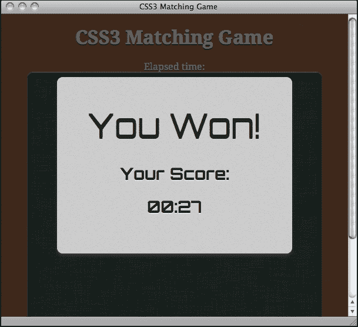

# 第七章。保存游戏进度

*本地存储是 HTML5 的新规范。它允许网站在浏览器中本地存储信息，并在以后访问存储的数据。这对于游戏开发来说是一个有用的功能，因为我们可以用它作为内存槽，在网页浏览器中本地保存任何游戏数据。*

我们将在我们在第三章中构建的 CSS3 卡片匹配游戏中添加存储游戏数据的功能。除了存储和加载游戏数据外，我们还将使用纯 CSS3 样式通知玩家，当他们打破纪录时，会出现一个漂亮的 3D 丝带。

在本章中，我们将涵盖以下主题：

+   使用 HTML5 本地存储存储数据

+   在本地存储中保存对象

+   当玩家打破新纪录时，通过漂亮的丝带效果通知他们

+   保存整个游戏进度

您可以在以下链接尝试最终游戏：[`makzan.net/html5-games/card-matching/`](http://makzan.net/html5-games/card-matching/).

以下截图显示了本章我们将创建的最终结果：


那么，让我们开始吧。

# 使用 HTML5 本地存储存储数据

记得我们在第三章中制作的 CSS3 卡片匹配游戏吗？想象一下，我们现在已经发布了我们的游戏，玩家们正在尽力在游戏中表现良好。

我们想显示玩家是否比上次玩得更好或更差。我们将保存最新的分数，并通过比较分数来通知玩家他们这次是否表现得更好。

我们可能想要这样做的原因是，当玩家表现更好时，它会给玩家一种自豪感，他们可能会沉迷于我们的游戏，试图获得更高的分数，这对我们来说是有益的。

## 创建游戏结束对话框

在实际将任何内容保存到本地存储之前，我们需要一个游戏结束屏幕。我们在前面的章节中制作了一些游戏。我们制作了乒乓球游戏、卡片匹配游戏、解谜游戏和音乐游戏。在这些游戏中，我们没有创建任何游戏结束屏幕。想象一下，我们现在正在玩我们在第三章中构建的 CSS3 卡片匹配游戏，*使用 CSS3 制作卡片匹配游戏*。我们成功匹配并移除了所有卡片。一旦完成游戏，屏幕就会弹出并显示完成游戏所需的时间。

# 行动时间 – 创建一个基于已玩时间的游戏结束对话框

我们将继续使用我们在第三章中制作的卡片匹配游戏的代码，*使用 CSS3 制作卡片匹配游戏*。执行以下步骤：

1.  打开 CSS3 匹配游戏文件夹作为我们的工作目录。

1.  从以下 URL 下载背景图片（我们将将其用作弹出窗口的背景）：[`mak.la/book-assets`](http://mak.la/book-assets)

1.  将图片放在`images`文件夹中。

1.  在任何文本编辑器中打开`index.html`。

1.  我们需要一个字体用于游戏结束弹出窗口。将以下字体嵌入 CSS 添加到`head`部分：

    ```js
    <link href="http://fonts.googleapis.com/css?family=Orbitron:400,700" rel="stylesheet" type="text/css">
    ```

1.  在`game`部分之前，我们添加一个名为`timer`的`div`来显示经过的游戏时间。此外，我们添加一个新的`popup`部分，包含弹出对话框的 HTML 标记：

    ```js
    <div id="timer">
     Elapsed time: <span id="elapsed-time">00:00</span>
    </div>
    <section id="game">
       <div id="cards">
          <div class="card">
             <div class="face front"></div>
             <div class="face back"></div>
          </div> <!-- .card -->
       </div> <!-- #cards -->
    </section> <!-- #game -->

    <section id="popup" class="hide">
     <div id="popup-bg">
     </div>
     <div id="popup-box">
     <div id="popup-box-content">
     <h1>You Won!</h1>
     <p>Your Score:</p>
     <p><span class='score'>13</span></p>
     </div>
     </div>
    </section>

    ```

1.  现在我们将转到样式表。因为它只是用于样式，还没有与我们的逻辑相关联，所以我们可以简单地从代码示例包中的`01-gameover-dialog`复制`matchgame.css`文件。

1.  是时候编辑游戏的逻辑部分了。在编辑器中打开`matchgame.js`文件。

1.  在 jQuery 的`ready`函数中，我们需要一个变量来存储游戏的经过时间。然后，我们创建一个计时器来每秒计算游戏时间，如下所示：

    ```js
    $(document).ready(function(){
       ...
      // reset the elapsed time to 0.
      matchingGame.elapsedTime = 0;

      // start the timer
      matchingGame.timer = setInterval(countTimer, 1000);
    }
    ```

1.  接下来，我们添加一个`countTimer`函数，它将每秒执行一次。它以分钟和秒的格式显示经过的秒数：

    ```js
    function countTimer() {
      matchingGame.elapsedTime++;

      // calculate the minutes and seconds from elapsed time
      var minute = Math.floor(matchingGame.elapsedTime / 60);
      var second = matchingGame.elapsedTime % 60;

      // add padding 0 if minute and second is less than 10
      if (minute < 10) minute = "0" + minute;
      if (second < 10) second = "0" + second;

      // display the elapsed time
      $("#elapsed-time").html(minute+":"+second);
    }
    ```

1.  在我们之前编写的`removeTookCards`函数中，添加以下高亮显示的代码，在移除所有卡片后执行游戏结束逻辑：

    ```js
    function removeTookCards() {
      $(".card-removed").remove();

      // check whether all cards are removed and show game over
      if ($(".card").length === 0) {
        gameover();
      }
    }
    ```

1.  最后，我们创建以下`gameover`函数。它停止计时器，在游戏结束弹出窗口中显示经过时间，并最终显示弹出窗口：

    ```js
    function gameover() {
      // stop the timer
      clearInterval(matchingGame.timer);

      // set the score in the game over popup
      $(".score").html($("#elapsed-time").html());

      // show the game over popup
      $("#popup").removeClass("hide");
    }
    ```

1.  现在，保存所有文件，并在浏览器中打开游戏。尝试完成卡片匹配游戏，游戏结束屏幕将弹出，如下面的截图所示：

## *刚才发生了什么？*

我们使用 CSS3 过渡动画来显示游戏结束弹出窗口。我们通过玩家完成游戏所用的时间来衡量分数。

### 计时

我们使用时间间隔来计算经过时间。我们提供一个间隔，例如 1 秒，浏览器将在提供的间隔执行我们的逻辑。在逻辑内部，我们计算经过的秒数。我们需要记住，`setInterval`不能保证逻辑在给定的时间间隔精确执行。它是一个近似值。如果您需要更精确的经过时间，您可以从开始时间减去时间戳。

## 在浏览器中保存分数

想象一下，我们现在将要显示玩家上次玩得有多好。游戏结束屏幕包括作为最后得分的经过时间以及当前游戏得分。玩家可以比较这次和上次的表现。

# 行动时间 – 保存游戏分数

1.  首先，我们需要在`popup`部分添加一些标记来显示最后得分。在`index.html`中的`popup-box`中添加以下 HTML。更改的代码已高亮显示：

    ```js
    <section id="popup" class="hide">
      <div id="popup-bg">
      </div>
      <div id="popup-box">
        <div id="popup-box-content">
          <h1>You Won!</h1>
          <p>Your Score:</p>
          <p><span class='score'>13</span></p>
          <p>
     <small>Last Score: <span class='last-score'>20</span>
     </small>
     </p>
        </div>
      </div>
    </section>
    ```

1.  然后，我们打开`matchgame.js`来修改`gameover`函数中的某些游戏逻辑。

1.  在 `gameover` 函数中添加以下突出显示的代码。它从本地存储中加载保存的分数，并将其显示为上次的游戏分数。然后，我们将当前分数保存在本地存储中：

    ```js
    function gameover() {
      // stop the timer
      clearInterval(matchingGame.timer);

      // display the elapsed time in the game over popup
      $(".score").html($("#elapsed-time").html());

      // load the saved last score from local storage
     var lastElapsedTime = localStorage.getItem("last-elapsed-time");

     // convert the elapsed seconds
     //into minute:second format
     // calculate the minutes and seconds
     // from elapsed time
     var minute = Math.floor(lastElapsedTime / 60);
     var second = lastElapsedTime % 60;

     // add padding 0
     if (minute < 10) minute = "0" + minute;
     if (second < 10) second = "0" + second;

     // display the last elapsed time in game over popup
     $(".last-score").html(minute+":"+second);

     // save the score in local storage
     localStorage.setItem("last-elapsed-time", matchingGame.elapsedTime);

      // show the game over popup
      $("#popup").removeClass("hide");
    }
    ```

1.  现在是时候保存所有文件并在浏览器中测试游戏了。当你第一次完成游戏时，最后得分应该是 `00:00`。然后，尝试第二次完成游戏。游戏结束弹窗将显示你上次玩游戏时经过的时间。以下截图显示了带有当前和上次得分的游戏结束界面：

## *发生了什么？*

我们刚刚构建了一个基本的计分系统，该系统比较玩家的分数和他们的上次分数。

## 使用本地存储存储和加载数据

我们可以通过使用 `localStorage` 对象的 `setItem` 函数来存储数据，如下所示：

```js
localStorage.setItem(key, value);
```

以下表格显示了该函数的用法：

| 参数 | 定义 | 描述 |
| --- | --- | --- |
| `key` | 键是用于识别条目的记录名称 | 键是一个字符串，每个记录都有一个唯一的键。向现有键写入新值将覆盖旧值。 |
| `value` | 值是要存储的数据 | 这可以是任何数据，但最终存储的是字符串。我们将在稍后讨论这一点。 |

在我们的示例中，我们使用键 `last-elapsed-item` 通过以下代码将游戏经过的时间保存为分数：

```js
localStorage.setItem("last-elapsed-time", matchingGame.elapsedTime);
```

与 `setItem` 相辅相成，我们可以通过以下方式使用 `getItem` 函数获取存储的数据：

```js
localStorage.getItem(key);
```

该函数返回给定键的存储值。当尝试获取不存在的键时，它返回 `null`。这可以用来检查我们是否为特定键存储了任何数据。

## 本地存储保存字符串值

本地存储以键值对的形式存储数据。键和值都是字符串。如果我们保存数字、布尔值或任何非字符串类型，则浏览器在保存时将值转换为字符串。在稍后的部分，我们将使用 JSON 对对象和数组进行转换。

通常，当我们从本地存储中加载保存的值时会出现问题。无论我们保存的类型是什么，加载的值都是一个字符串。在使用之前，我们需要显式地将值解析为正确的类型。

例如，如果我们将浮点数保存到本地存储中，则在加载时需要使用 `parseFloat` 函数。以下代码片段显示了如何使用 `parseFloat` 来检索存储的浮点数：

```js
var score = 13.234;

localStorage.setItem("game-score",score);
// result: stored "13.234".

var gameScore = localStorage.getItem("game-score");
// result: get "13.234" into gameScore;

gameScore = parseFloat(gameScore);
// result: 13.234 floating value
```

在前面的代码片段中，如果我们忘记将 `gameScore` 从字符串转换为浮点数，则操作可能是不正确的。例如，如果我们不使用 `parseFloat` 函数将 `gameScore` 增加 1，则结果将是 **13.2341** 而不是 **14.234**。因此，请确保将本地存储中的值转换为正确的类型。

### 小贴士

**本地存储的大小限制**

通过`localStorage`存储的数据在各个域上都有大小限制。这个大小限制在不同的浏览器中可能略有不同。通常，大小限制是 5MB。如果超过限制，则在将键值设置到`localStorage`时，浏览器会抛出`QUOTA_EXCEEDED_ERR`异常。

## 将本地存储对象视为关联数组

除了使用`setItem`和`getItem`函数外，我们还可以将`localStorage`对象视为关联数组，并使用方括号访问存储条目。例如，考虑以下代码行：

```js
localStorage.setItem("last-elapsed-time", elapsedTime);
var lastElapsedTime = localStorage.getItem("last-elapsed-time");
```

我们可以用以下代码替换前面的代码块，并将`localStorage`作为数组访问：

```js
localStorage["last-elapsed-time"] = elapsedTime;
var lastElapsedTime = localStorage["last-elapsed-time"];
```

# 在本地存储中保存对象

现在，假设我们不仅保存分数，还保存创建排名时的日期和时间。我们可以为得分和游戏时的日期时间保存两个单独的键，或者将两个值打包到一个对象中并存储在本地存储中。

我们将所有游戏数据打包到一个对象中并存储。

# 行动时间 – 将时间与分数一起保存

执行以下步骤：

1.  首先，从我们的 CSS3 卡片匹配游戏中打开`index.html`文件。

1.  将 HTML 标记替换为最后得分，使用以下 HTML（它在游戏结束弹出窗口中显示得分和日期时间）：

    ```js
    <p>
      <small>Last Score: <span class='last-score'>0</span><br>
        Saved on: <span class='saved-time'></span>
      </small>
    </p>
    ```

1.  HTML 标记现在已准备好。我们将继续进行游戏逻辑。在文本编辑器中打开`html5games.matchgame.js`文件。

1.  我们将修改`gameover`函数。将以下高亮代码添加到`gameover`函数中。它获取游戏结束时当前日期和时间，并将格式化的日期和时间与经过的时间一起打包到本地存储中：

    ```js
    function gameover() {
       // stop the timer
       clearInterval(matchingGame.timer);

       // display the elapsed time in the game over popup
       $(".score").html($("#elapsed-time"));

       // load the saved last score and save time from local storage
     var lastScore = localStorage.getItem("last-score");

     // check if there is no saved record
     lastScoreObj = JSON.parse(lastScore);
     if (lastScoreObj === null) {
     // create an empty record if there is no saved record
     lastScoreObj = {"savedTime": "no record", "score": 0};
     }
     var lastElapsedTime = lastScoreObj.score;

       // convert the elapsed seconds into minute:second format
       // calculate the minutes and seconds from elapsed time
       var minute = Math.floor(lastElapsedTime / 60);
       var second = lastElapsedTime % 60;

       // add padding 0 if minute and second is less than 10
       if (minute < 10) minute = "0" + minute;
       if (second < 10) second = "0" + second;

       // display the last elapsed time in game over popup
       $(".last-score").html(minute+":"+second);

       // display the saved time of last score
     var savedTime = lastScoreObj.savedTime;
     $(".saved-time").html(savedTime);

     // get the current datetime
     var currentTime = new Date();

     // convert date time to string
     var now = currentTime.toLocaleString();

     //construct the object of datetime and game score
     var obj = { "savedTime": now, "score": matchingGame.elapsedTime};

     // save the score into local storage
     localStorage.setItem("last-score", JSON.stringify(obj));
       // show the game over popup
       $("#popup").removeClass("hide");
    }
    ```

1.  我们将保存文件并在网页浏览器中打开游戏。

1.  当我们第一次完成游戏时，我们将得到一个类似于以下截图的屏幕，它将显示我们的游戏得分和状态，表明没有之前的记录：

1.  现在尝试重新加载页面并再次玩游戏。当我们第二次完成游戏时，游戏结束对话框将显示我们的保存记录。以下截图显示了它应该看起来像什么：

## *发生了什么？*

我们在 JavaScript 中使用了`Date`对象来获取游戏结束时当前日期和时间。此外，我们将游戏结束的日期和时间以及游戏经过的时间打包到一个对象中，并将其保存在本地存储中。保存的对象被编码为 JSON 字符串。它还会从存储中加载最后保存的日期和时间以及游戏经过的时间，并将其从字符串解析回 JavaScript 对象。

## 在 JavaScript 中获取当前日期和时间

JavaScript 中的`Date`对象用于处理日期和时间。当我们从`Date`对象创建一个实例时，默认情况下它存储当前日期和时间。我们可以通过使用`toLocaleString`方法来获取字符串表示形式。

除了字符串表示形式，我们还可以操作日期对象中的每个组件。以下表格列出了`Date`对象中一些获取日期和时间的有用函数：

| 函数 | 描述 |
| --- | --- |
| `getFullYear` | 返回四位数的年份 |
| `getMonth` | 返回整数月份，从 0 开始（1 月是 0，12 月是 11） |
| `getDate` | 返回月份中的天数，从 1 开始 |
| `getDay` | 返回星期几，从 0 开始（星期天是 0，星期六是 6） |
| `getHours` | 返回小时，从 0 到 23 |
| `getMinutes` | 返回分钟 |
| `getSeconds` | 返回秒数 |
| `getMilliseconds` | 返回三位数的毫秒数 |
| `getTime` | 返回自 1970 年 1 月 1 日 00:00 以来的毫秒数 |

### 注意

Mozilla 开发者网络提供了关于使用`Date`对象的详细参考，请参阅：[`developer.mozilla.org/en/JavaScript/Reference/Global_Objects/Date`](https://developer.mozilla.org/en/JavaScript/Reference/Global_Objects/Date)。

## 使用原生的 JSON 将对象编码为字符串

我们在第四章 *使用 Canvas 和绘图 API 构建 Untangle 游戏* 中使用了 JSON 来表示游戏关卡数据。

JSON 是一种机器友好的对象表示法格式，易于解析和生成。在这个例子中，我们将最终经过的时间和日期时间打包到一个对象中。然后，我们将对象编码为 JSON。现代网络浏览器都内置了对 JSON 的原生支持。我们可以通过使用以下`stringify`函数轻松地将任何 JavaScript 对象编码为 JSON：

```js
JSON.stringify(anyObject);
```

通常，我们只为`stringify`函数的第一个参数使用。这是我们打算编码为字符串的对象。以下代码片段演示了编码 JavaScript 对象的结果：

```js
var jsObj = {};
jsObj.testArray = [1,2,3,4,5];
jsObj.name = 'CSS3 Matching Game';
jsObj.date = '8 May, 2011';
JSON.stringify(jsObj);
// result: {"testArray":[1,2,3,4,5],"name":"CSS3 Matching Game","date":"8 May, 2011"}
```

### 注意

`stringify`方法可以很好地解析具有数据结构的对象到字符串。然而，它不能将任何对象转换为字符串。例如，如果我们尝试将 DOM 元素传递给它，它将返回一个错误。如果我们传递一个`Date`对象，它将返回表示日期的字符串。否则，它将丢弃解析对象的全部方法定义。

## 从 JSON 字符串加载存储的对象

**JSON**的完整形式是**JavaScript** **对象** **表示法**。从名称中，我们知道它使用 JavaScript 的语法来表示对象。因此，将 JSON 格式的字符串解析回 JavaScript 对象非常容易。

以下代码片段展示了我们如何使用 JSON 对象中的解析函数：

```js
JSON.parse(jsonFormattedString);
```

我们可以在**Web Inspector**中打开控制台来测试 JSON JavaScript 函数。以下截图显示了当我们对对象进行编码并解析时运行我们刚才讨论的代码片段的结果：


## 在控制台窗口中检查本地存储

在我们将某些内容保存到本地存储之后，我们可能想在编写加载部分之前知道确切保存了什么。我们可以通过使用**Web Inspector**中的存储面板来检查我们保存的内容。它列出了同一域名下的所有保存的键值对。以下截图显示我们有一个**last-score**键，其值为**{"savedTime":"23/2/2011 19:27:02","score":23}**。

该值是我们用来将对象编码为 JSON 的`JSON.stringify`函数的结果。您也可以尝试直接在本地存储中保存对象：


### 注意

除了`localStorage`之外，还有其他未讨论的存储方法。**IndexedDB**是另一个选项。查看以下链接以获取更多详细信息：[`developer.mozilla.org/en/IndexedDB`](https://developer.mozilla.org/en/IndexedDB)。

# 当玩家打破新纪录时，通过漂亮的横幅效果通知玩家

想象一下，我们想要通过通知玩家他们与上次得分相比打破了新纪录来鼓励他们。我们想在横幅上显示`New` `Record`文本。多亏了新的 CSS3 属性，我们可以在 CSS 中完全创建横幅效果。

# Time for action – creating a ribbon in CSS3

我们将创建一个新的纪录横幅，并在玩家打破上次得分时显示它。所以，执行以下步骤：

1.  首先，打开`index.html`，我们将添加横幅 HTML 标记。

1.  在`popup-box`之后和`popup-box-content`之前添加以下高亮的 HTML 代码：

    ```js
    <div id="popup-box">
      <div class="ribbon hide">
        <div class="ribbon-body">
          <span>New Record</span>
        </div>
        <div class="triangle"></div>
      </div>
      <div id="popup-box-content">
      ...
    ```

1.  接下来，我们需要关注样式表。整个横幅效果都是在 CSS 中完成的。在文本编辑器中打开`matchgame.css`文件。

1.  在`popup-box`的样式表中，我们需要给它添加一个相对定位。我们这样做如下：

    ```js
    #popup-box {
      position: relative;
    }
    ```

1.  然后，我们需要在 CSS 文件中添加以下样式，以创建横幅效果：

    ```js
    .ribbon.hide {
      display: none;
    }
    .ribbon {
      float: left;
      position: absolute;
      left: -7px;
      top: 165px;
      z-index: 0;

      font-size: .5em;
      text-transform: uppercase;
      text-align: right;
    }

    .ribbon-body {
      height: 14px;
      background: #ca3d33;
      padding: 6px;
      z-index: 100;
      box-shadow: 2px 2px 0 rgba(150,120,70,.4);
      border-radius: 0 5px 5px 0;

      color: #fff;
      text-shadow: 0px 1px 1px rgba(0,0,0,.3);
    }

    .triangle {
      position: relative;
      height: 0px;
      width: 0;
      left: -5px;
      top: -32px;
      border-style: solid;
      border-width: 6px;
      border-color: transparent #882011 transparent transparent;
      z-index: -1;
    }
    ```

1.  最后，我们需要稍微修改一下游戏结束的逻辑。打开`html5games.matchgame.js`文件，定位到`gameover`函数。

1.  将以下代码添加到`gameover`函数中，该函数比较当前得分与最后得分以确定新纪录：

    ```js
    if (lastElapsedTime === 0 || matchingGame.elapsedTime < lastElapsedTime) {
       $(".ribbon").removeClass("hide");
    }
    ```

1.  我们将在网页浏览器中测试这款游戏。尝试慢慢完成一个游戏，然后快速完成另一个游戏。当你打破最后得分时，游戏结束弹窗会显示一个漂亮的**NEW** **RECORD**横幅，如下面的截图所示：

## *发生了什么？*

我们刚刚使用纯 CSS3 样式创建了一个带绶带效果，并借助 JavaScript 来显示和隐藏它。绶带由一个三角形和覆盖其上的矩形组成，如下面的截图所示：


现在，我们如何在 CSS 中创建一个三角形？我们可以通过将宽度和高度都设置为`0`并只绘制一个边框来创建一个三角形。三角形的尺寸由边框宽度决定。以下是我们用于新记录绶带的三角形 CSS 代码：

```js
.triangle {
   position: relative;
   height: 0px;
   width: 0;
   left: -5px;
   top: -32px;
   border-style: solid;
   border-width: 6px;
   border-color: transparent #882011 transparent transparent;
   z-index: -1;
}
```

### 注意

以下 PVM Garage 网站提供了关于纯 CSS3 绶带使用的详细说明：

[如何仅使用 CSS3 创建深度和漂亮的 3D 绶带](http://www.pvmgarage.com/2010/01/how-to-create-depth-and-nice-3d-ribbons-only-using-css3/)

## 尝试一下英雄 - 只保存和比较最快的时间

每次游戏结束时，它会将最后得分与当前得分进行比较。然后，它保存当前得分。那么，将代码更改为保存最高分，并在打破最高分时显示新的记录绶带怎么样？

# 保存整个游戏进度

我们通过添加游戏结束屏幕和存储最后游戏记录来增强了我们的 CSS3 牌匹配游戏。想象一下，玩家正在游戏中，意外关闭了网络浏览器。一旦玩家再次打开游戏，游戏将从开始处重新开始，玩家正在玩的游戏就会丢失。使用本地存储，我们可以将整个游戏数据编码为 JSON 并存储起来。这样，玩家可以在以后继续他们的游戏。

我们将把游戏数据打包成一个对象，并每秒将其保存在本地存储中。

# 行动时间 - 在本地存储中保存所有必要游戏数据

我们将继续使用我们的 CSS3 牌匹配游戏：

1.  打开`matchgame.js`JavaScript 文件。

1.  在声明`matchingGame`变量之后，在 JavaScript 文件顶部添加以下代码。此代码创建一个名为`savingObject`的对象来保存牌组数组、移除的牌和当前已过时间：

    ```js
    matchingGame.savingObject = {};

    matchingGame.savingObject.deck = [];

    // array to store which card is removed by their index.
    matchingGame.savingObject.removedCards = [];

    // store the counting elapsed time.
    matchingGame.savingObject.currentElapsedTime = 0;
    ```

1.  在 jQuery `ready`函数中，添加以下突出显示的代码。它将牌组的顺序克隆到`savingObject`中。此外，它还为 DOM 中的每张牌分配一个索引：

    ```js
    $(document).ready(function(){
       // existing code goes here.

       // shuffling the deck
       matchingGame.deck.sort(shuffle);

       // copying the deck into saving object.
     matchingGame.savingObject.deck = matchingGame.deck.slice();

       // clone 12 copies of the card DOM
       for(var i=0;i<11;i++){
          $(".card:first-child").clone().appendTo("#cards");
       }

       // existing code goes here.

    // embed the pattern data into the DOM element.
    $(this).attr("data-pattern",pattern);

    // save the index into the DOM element,
    //so we know which is the next card.
    $(this).attr("data-card-index",index);
    ...
    ```

1.  我们有一个`countTimer`函数，每秒执行一次。我们在`countTimer`函数中添加以下突出显示的代码。它在`savingObject`中保存当前已过时间，并将对象保存在本地存储中：

    ```js
    function countTimer() {
       matchingGame.elapsedTime++;

       // save the current elapsed time in savingObject.
     matchingGame.savingObject.currentElapsedTime = matchingGame.elapsedTime;
       ...
       // save the game progress
     saveSavingObject();
    }
    ```

1.  当玩家找到匹配的牌对时，游戏会移除牌。我们在`removeTookCards`函数中将原始的`$(".card-removed").remove();`代码替换为以下突出显示的代码。它在`savingObject`中记住哪些牌被移除：

    ```js
    function removeTookCards() {
       // add each removed card into the array
     // which stores the removed cards
     $(".card-removed").each(function(){
     matchingGame.savingObject.removedCards.push($(this).data("card-index"));
     $(this).remove();
     });

       // check whether all cards are removed and show game over
       if ($(".card").length === 0) {
          gameover();
       }
    }
    ```

1.  游戏结束时，我们必须从本地存储中删除保存的游戏数据。在`gameover`函数的末尾添加以下代码：

    ```js
    function gameover() {
       // existing code goes here.

       //at last, we clear the saved savingObject
       localStorage.removeItem("savingObject");
    }
    ```

1.  最后，我们使用一个函数将`savingObject`保存在本地存储中：

    ```js
    function saveSavingObject() {
        // save the encoded saving object in local storage
        localStorage["savingObject"] = JSON.stringify(matchingGame.savingObject);
    }
    ```

1.  我们已经修改了很多代码，现在是时候在网页浏览器中测试游戏了。游戏运行后，尝试清除几对匹配的卡片。然后，打开**Web Inspector**中的存储面板。本地存储应包含类似于以下截图中的条目：

    这是一个带有`savingObject`键和包含长字符串的 JSON 格式的值的记录。该 JSON 字符串包含洗好的牌组、移除的卡片和当前已过的时间

## *发生了什么？*

我们已经将所有必要的游戏数据输入到一个名为`savingObject`的对象中。这个`savingObject`包含了我们稍后重新创建游戏所需的所有信息。它包括卡片的顺序、移除的卡片和当前已过的时间。我们将在下一节中实现游戏恢复逻辑。

最后，我们每秒将`savingObject`保存到`localStorage`中。该对象使用我们在本章前面使用的`stringify`函数进行编码。

## 从本地存储中删除记录

游戏结束后，我们需要删除保存的记录。否则，新游戏将无法开始。本地存储提供了一个`removeItem`函数来删除特定的记录。以下是使用该函数删除具有给定键的记录的方法：

```js
localStorage.removeItem(key);
```

### 小贴士

如果你想删除所有存储的记录，则可以使用`localStorage.clear()`函数。

## 在 JavaScript 中克隆数组

我们在`savingObject`中克隆了洗好的牌组，这样我们就可以在游戏恢复时使用牌组的顺序来重新创建卡片。然而，我们不能通过将数组赋值给另一个变量来复制数组。以下代码未能将数组`a`复制到数组`b`中：

```js
var a = [1,2,3,4,5];
var b = a;
a.pop();
// result:
// a: [1,2,3,4]
// b: [1,2,3,4]
```

`slice`函数提供了一个简单的方法来克隆只包含原始类型元素的数组，例如整数数组或字符串数组。只要数组中不包含另一个数组或对象作为元素，我们就可以使用`slice`函数来克隆数组。以下代码成功地将数组`a`复制到`b`中：

```js
var a = [1,2,3,4,5];
var b = a.slice();
a.pop();
// result:
// a: [1,2,3,4]
// b: [1,2,3,4,5]
```

`slice`函数通常用于通过从现有数组中选择一系列元素来创建一个新数组。当使用不带任何参数的`slice`函数时，它会克隆整个数组。Mozilla 开发者网络提供了关于`slice`函数的详细信息，请参阅：[`developer.mozilla.org/en/JavaScript/Reference/Global_Objects/Array/slice`](https://developer.mozilla.org/en/JavaScript/Reference/Global_Objects/Array/slice)。

## 恢复游戏进度

我们已经保存了游戏进度，但尚未编写恢复游戏的逻辑。所以，让我们继续到恢复部分。

# 行动时间 – 从本地存储恢复游戏

执行以下步骤：

1.  打开`matchgame.js`JavaScript 文件。

1.  在 jQuery 文档的`ready`函数中，我们使用了上一局游戏中保存的牌组顺序，而不是重新洗牌。在 jQuery 的`ready`函数中添加以下高亮代码：

    ```js
    $(document).ready(function(){
      // reset the elapsed time to 0.
      matchingGame.elapsedTime = 0;

      // start the timer
      matchingGame.timer = setInterval(countTimer, 1000);

    // shuffling the deck
      matchingGame.deck.sort(shuffle);

      // re-create the saved deck
     var savedObject = savedSavingObject();
     if (savedObject !== undefined) {
     matchingGame.deck = savedObject.deck;
     }

    // copying the deck into saving object.
      matchingGame.savingObject.deck = matchingGame.deck.slice();
    });
    ```

1.  仍然在 jQuery 文档的`ready`函数中，我们将以下高亮代码添加到函数的末尾。它移除了在保存的数据中被标记为已删除的任何卡片。我们还从保存的值中恢复了保存的已过时间：

    ```js
    $(document).ready(function(){
    // existing card creation code goes here.

     // removed cards that were removed in savedObject.
     if (savedObject !== undefined) {
     matchingGame.savingObject.removedCards = savedObject.removedCards;
     // find those cards and remove them.
     for(var i in matchingGame.savingObject.removedCards) {
     $(".card[data-card-index="+matchingGame.savingObject.removedCards[i]+"]").remove();
     }
     }

     // reset the elapsed time to 0.
     matchingGame.elapsedTime = 0;

     // restore the saved elapsed time
     if (savedObject !== undefined) {
     matchingGame.elapsedTime = savedObject.currentElapsedTime;
     matchingGame.savingObject.currentElapsedTime = savedObject.currentElapsedTime;
     }
    });
    ```

1.  最后，我们创建以下函数来从本地存储中检索`savingObject`：

    ```js
    // Returns the saved savingObject from the local storage.
    function savedSavingObject() {
       // returns the saved saving object from local storage
       var savingObject = localStorage["savingObject"];
       if (savingObject !== undefined) {
          savingObject = JSON.parse(savingObject);
       }
       return savingObject;
    }
    ```

1.  保存所有文件，并在网络浏览器中打开游戏。尝试通过移除几对匹配的卡片来玩游戏。然后，关闭浏览器窗口并再次打开游戏。游戏应该从我们关闭窗口时的状态恢复，如下面的截图所示：

## *发生了什么？*

我们通过解析整个游戏状态的保存 JSON 字符串完成了游戏的加载部分。

然后，我们从加载的对象`savingObject`中恢复了已过时间和牌组的顺序。恢复这两个属性只是变量赋值的问题。难点在于重新创建移除卡片的过程。在游戏保存部分，我们使用一个**自定义**的**数据**属性`data-card-index`为每个卡片的 DOM 分配了一个索引。我们在保存游戏时存储了每个被移除卡片的索引，这样我们就可以知道在加载游戏时哪些卡片被移除了。然后，当游戏设置时，我们可以移除这些卡片。以下代码在 jQuery 游戏的`ready`函数中移除卡片：

```js
if (savedObject !== undefined) {
   matchingGame.savingObject.removedCards = savedObject.removedCards;
   // find those cards and remove them.
   for(var i in matchingGame.savingObject.removedCards) {
      $(".card[data-card-index="+matchingGame.savingObject.removedCards[i]+"]").remove();
   }
}
```

### 提示

**使用存储事件跟踪存储变化**

有时候，我们可能想要监听`localStorage`中的变化。我们可以通过监听`storage`事件来实现。当`localStorage`中的任何内容发生变化时，都会触发这个事件。以下来自**深入 HTML5**的链接提供了关于如何使用该事件的详细讨论：[`diveintohtml5.org/storage.html#storage-event`](http://diveintohtml5.org/storage.html#storage-event)。

## 小测验 – 使用本地存储

Q1. 考虑以下每个陈述是否正确：

1.  我们可以直接在本地存储中保存和恢复对象数据。

1.  我们可以通过将对象编码成字符串来在本地存储中保存对象的数据。

1.  我们可以使用`localStorage["hello"] = "world"`来在本地存储中保存键为"hello"的值为"world"。

# 缓存游戏以实现离线访问

我们可以通过使用 AppCache 清单文档来启用离线缓存。当页面首次从互联网加载后，其相关文件将被缓存到设备中，用户即使在离线模式（如飞行模式）下也可以加载页面并玩游戏。

# 开始行动时间 – 添加 AppCache 清单

执行以下步骤将游戏离线化：

1.  在`index.html`文件中，我们添加一个`manifest`属性：

    ```js
    <html lang="en" manifest="game.appcache">
    ```

1.  然后，我们创建一个名为`game.appcache`的文件，内容如下：

    ```js
    CACHE MANIFEST
    # 2015-03-01:v3

    CACHE:
    index.html
    css/matchgame.css
    images/bg.jpg
    images/deck.png
    images/popup_bg.jpg
    images/table.jpg
    js/jquery-1.11.2.min.js
    js/html5games.matchgame.js

    # Resources that require the user to be online.
    NETWORK:
    *
    ```

1.  为了测试缓存，我们需要将游戏在线托管。将项目文件夹上传到网络服务器，然后打开游戏并检查控制台，我们应该会看到浏览器下载或使用 AppCache 资源的消息，如下面的截图所示：

## *发生了什么？*

我们刚刚将一个 AppCache 清单文件添加到了我们的 `index.html` 文件中。现在一旦游戏加载完成，它就可以在离线和飞行模式下工作。

## AppCache 文件

AppCache 文件是一个纯文本文件。它以 `CACHE MANIFEST` 开头。有两个部分：缓存和网络。我们通过在 AppCache 文件中使用带有 `CACHE:` 和 `NETWORK:` 的行来指定它们。可以为未缓存的文件提供可选的回退部分，用于回退资源。

在缓存部分，我们逐行指定我们想要缓存的文件。我们需要明确指定每个文件。在网络部分，我们指定如果文件未在缓存部分列出，则应该访问网络的文件。如果我们没有指定文件，即使有互联网连接，浏览器也不会获取非缓存的文件。大多数情况下，通配符（`*`）适用并且工作得很好。

任何以 `#` 开头的行都是注释。我们通常使用一行注释来指定缓存文件的版本。原因是浏览器一旦缓存了资源，它就不会更新缓存的文件，直到清单文件本身发生变化。因此，注释行可以强制浏览器更新缓存的资源。

### 注意

HTML5Rocks 有以下文章提供了更多关于使用 AppCache 文件的信息，包括使用 JavaScript 处理缓存的事件。查看它：[`www.html5rocks.com/en/tutorials/appcache/beginner/`](http://www.html5rocks.com/en/tutorials/appcache/beginner/)。

# 摘要

在本章中，你学习了如何在网页浏览器中使用本地存储来保存游戏数据。具体来说，我们在键值对本地存储中保存和检索了基本数据。我们将对象编码为 JSON 格式的字符串，并将字符串解析回 JavaScript 对象。我们保存了整个游戏进度，这样即使游戏进行到中途也能继续。我们还通过使用 AppCache 将游戏离线化。从视觉上看，我们使用纯 CSS3 样式创建了一个漂亮的 3D 条带作为新的成就徽章。

现在你已经学习了如何通过使用本地存储来改进我们之前的游戏，你准备好进入下一章了，在那里你将学习一个名为 **WebSockets** 的高级功能，我们可以使用它来实现玩家之间的实时交互。
