# 第十章：部署 HTML5 游戏

*我们在本书中创建了几款 HTML5 游戏。在本章中，我们讨论了几种方法，通过这些方法我们可以部署我们的游戏，让其他人能够玩到它们。*

在本章中，你将学习以下主题：

+   将游戏部署到网页。

+   将游戏作为移动网页应用程序部署。

+   将游戏封装成 OS X 应用程序。

+   将游戏部署到应用商店。

部署 HTML5 游戏有不同的渠道。我们可以在普通网页上发布游戏，或者将其作为移动网页应用程序部署。否则，我们还可以在 Chrome 网络商店部署游戏。对于原生应用程序商店，根据游戏类型我们有不同的选择。我们选择桌面或移动应用程序商店来部署我们的游戏。对于桌面游戏，我们可以将其部署到 Mac App Store 或 Windows Store。对于移动设备游戏，我们可以将它们部署到 iOS 应用商店和 Android 应用商店。

将 HTML5 游戏直接部署到应用程序商店的最直接方法是通过目标平台提供的 Web View 组件来托管 HTML 文件和相关资源。

# 准备部署材料

在部署游戏时，我们通常需要准备商店列表。这意味着我们需要制作应用程序图标、几个截图和游戏描述。某些商店可能可选地接受简短的游戏玩法视频。

# 将游戏放在网上

服务器的需求取决于我们在游戏中使用的技术。对于只涉及客户端 HTML、CSS 和 JavaScript 的游戏，我们可以使用任何网络托管，包括静态网站托管服务。通常，这些静态托管服务允许你轻松地通过 ZIP 文件或通过云存储（如 Dropbox）上传网站。

Amazon S3 也是托管静态网站的一个经济实惠的选择。例如，我的 HTML5 游戏托管在 S3 上，使用 **Amazon CloudFront** 作为内容分发网络 (CDN) 以提升缓存和加载性能。你可以在 [`makzan.net/html5-games-list/`](http://makzan.net/html5-games-list/) 查看 HTML5 游戏网站。

另一种流行的免费托管静态网站的方式是通过 GitHub 页面。GitHub 是一个托管 Git 仓库的服务，并为每个仓库提供静态网站托管功能。你可以在他们的指南中了解更多信息：[`help.github.com/categories/github-pages-basics/`](https://help.github.com/categories/github-pages-basics/)。

### 注意

本章中提到的某些服务要求你使用 Git 版本控制系统将代码推送到他们的服务器。Git 是一个代码版本控制系统。你可以通过在线资源 [`git-scm.com/book/`](http://git-scm.com/book/) 了解更多。

# 托管 node.js 服务器

对于需要服务器的游戏，例如多人游戏，我们需要托管游戏服务器。以我们的画猜游戏为例；我们需要一个支持运行 Node.js 服务器的托管服务。要获取支持运行 Node.js 的托管服务列表，请访问：[`github.com/joyent/node/wiki/Node-Hosting`](https://github.com/joyent/node/wiki/Node-Hosting)。

其中一些，如 Heroku，在低使用量时是免费的，当您的应用程序变得流行并需要使用更多服务器资源时，您将开始收费。这种定价模式对我们来说在以不支付高昂的服务器租赁费用的情况下测试游戏是很好的。

# 将移动网页应用部署在首页

通过配置几个 `meta` 标签，我们可以使游戏能够在移动设备的首页上安装。

# 行动时间 – 为移动网页应用添加 meta 标签

我们将以音频游戏为例开始。让我们执行以下步骤：

1.  在代码编辑器中打开 `index.html` 文件。

1.  在头部部分添加以下代码。

    ```js
    <meta name="apple-mobile-web-app-capable" content="yes">
    <meta name="apple-mobile-web-app-status-bar-style" content="black">
    <link rel="apple-touch-icon" href="game-icon.png">
    <link rel="apple-touch-startup-image" href="launch-screen.png">
    ```

1.  在 iOS 设备或模拟器上测试游戏。为此，请尝试点击 **分享** 按钮，然后选择 **添加到主屏幕**。您应该看到游戏图标和名称。继续将游戏添加到主屏幕。

1.  然后，从首页打开游戏。它将以全屏模式打开。

1.  双击首页按钮以启用应用程序切换屏幕。您将能够看到应用程序有自己的位置，类似于原生安装的应用程序。

    ### 注意

    如果您在 Mac 上进行开发，您可以使用 Apple 免费开发 IDE Xcode 中的 iOS 模拟器。只需将 HTML 文件拖入模拟器，您就可以在移动 Safari 中测试您的游戏。

## *发生了什么？*

我们添加了几个被移动操作系统识别的 `meta` 标签，特别是 iOS。移动网页应用的概念是在 2007 年第一代 iPhone 发布时引入的。我们告诉系统我们的网页浏览器能够像应用程序一样显示。然后，系统从用户的角度使网页非常类似于应用程序。

默认图标大小为 60 x 60。我们还可以通过指定 iPhone 和 iPad 的每个维度来提供像素完美的图标：

```js
<link rel="apple-touch-icon" href="default-icon-60x60.png">
<link rel="apple-touch-icon" sizes="76x76" href="icon-ipad.png">
<link rel="apple-touch-icon" sizes="120x120" href="icon-iphone-retina.png">
<link rel="apple-touch-icon" sizes="152x152" href="icon-ipad-retina.png">
```

# 将 HTML5 游戏构建成 Mac OS X 应用程序

在本节中，我将向您展示我们如何使用 Web View 包装 HTML5 游戏并将其构建成原生应用程序。本节包括在不同开发环境中的其他编程语言的代码。

# 行动时间——将 HTML5 游戏放入 Mac 应用程序

按照 Mac Xcode 中的步骤进行操作。我们需要一台 Mac 和 Apple Xcode 来创建 Mac OS X 应用程序。如果您还没有安装，请从 Mac App Store 下载 Xcode。

### 注意

即使您没有 Mac，您也可以看看我们如何将 Web View 与应用程序包装在一起。概念比本节中的步骤更重要。

1.  启动 Xcode 并创建一个新项目。在**OS X**下选择**Cocoa Application**：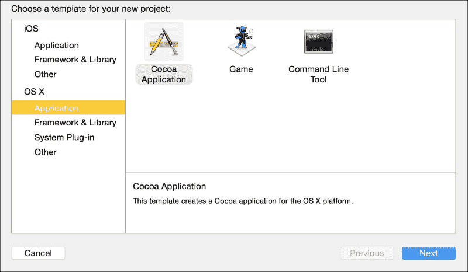

1.  在选项视图中，将游戏名称作为**产品名称**。**组织名称**可以是你的名字或公司的名字。使用反向域名作为**组织标识符**。选择**Objective-C**作为此代码示例。我们保留其他选项的默认值。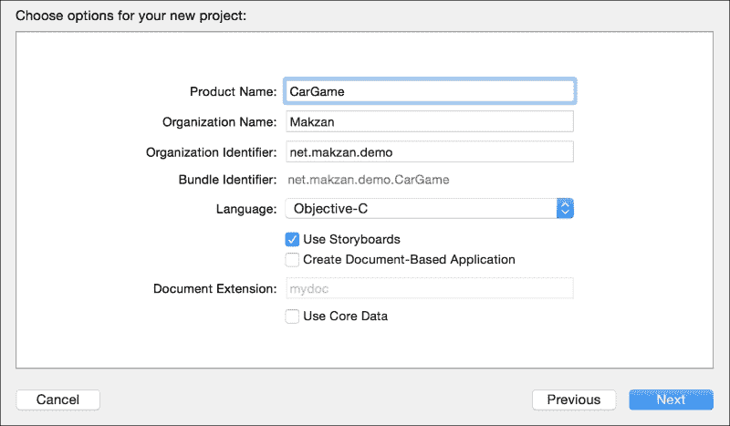

1.  从左侧面板打开`Main.storyboard`文件。在右下角面板中，选择第三个标签（如下面的截图所示，以蓝色突出显示）。将**Web View**组件拖入窗口视图。当你将其拖放到视图中时，Web View 应变为全宽和高：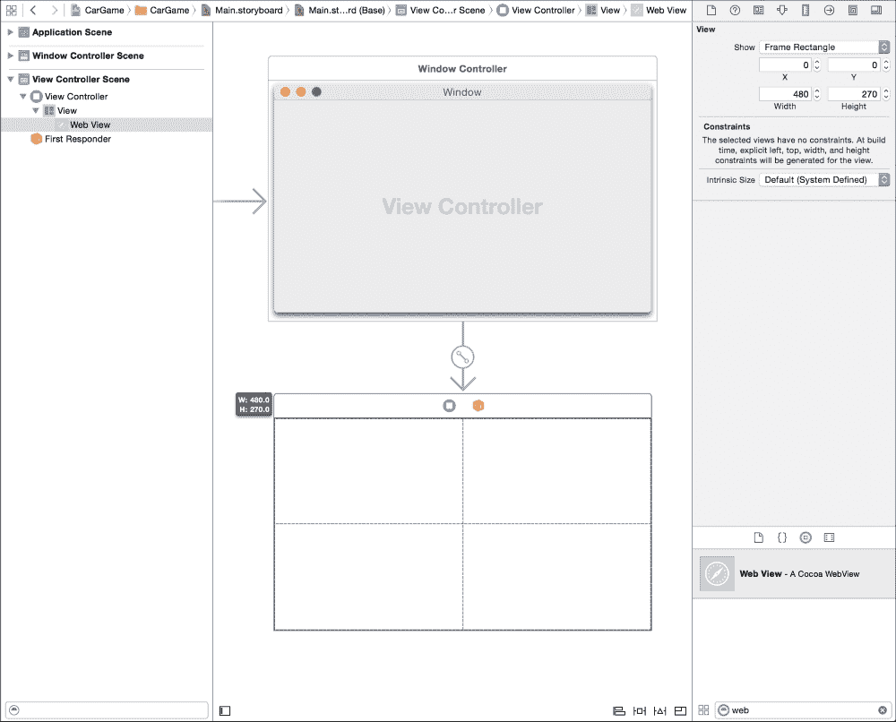

1.  在窗口底部，有几个图标可以配置你如何处理应用窗口的调整大小。保持**Web View**选中状态，然后选择出现的第二个图标，如图所示。点击顶部**0**输入旁边的四个间距图标，将它们变成实心红色线条：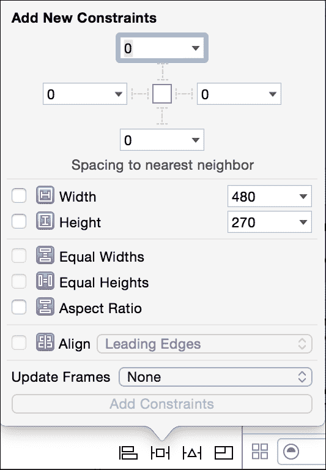

1.  在顶部选择四个间距后，点击**添加约束**按钮。这告诉 Web View 在窗口调整大小时保持所有四个边缘之间的**0**间距。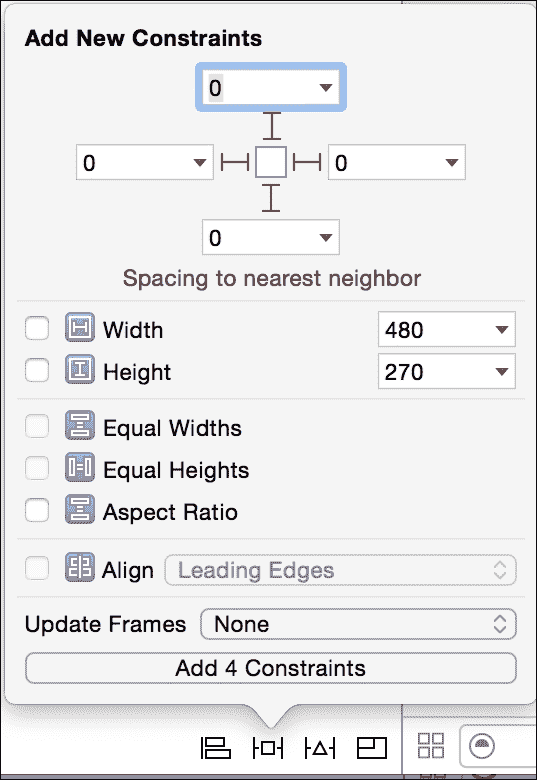

1.  然后，我们将窗口大小设置为适合我们的游戏。为此，选择窗口。在右上角面板中，选择第五个标签。然后，我们将窗口的大小设置为正好 1,300 px 宽和 600 px 高：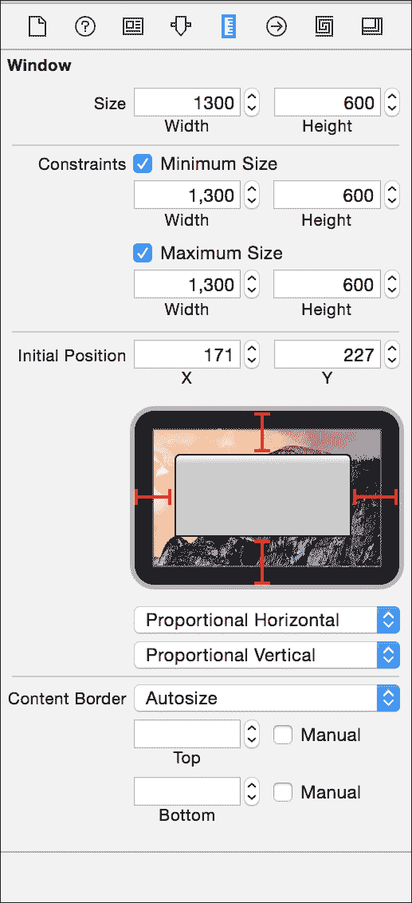

1.  然后，我们在**视图**菜单中启用**显示辅助编辑器**选项。保持左侧的`Main.storyboard`选项，并在右侧面板中打开`ViewController.h`文件。

1.  在左侧面板中，识别**Web View**组件。右键单击组件并将其拖动到`ViewController.h`文件中的界面部分。这允许我们为组件命名以便将来参考。将 Web View 组件命名为`gameWebView`：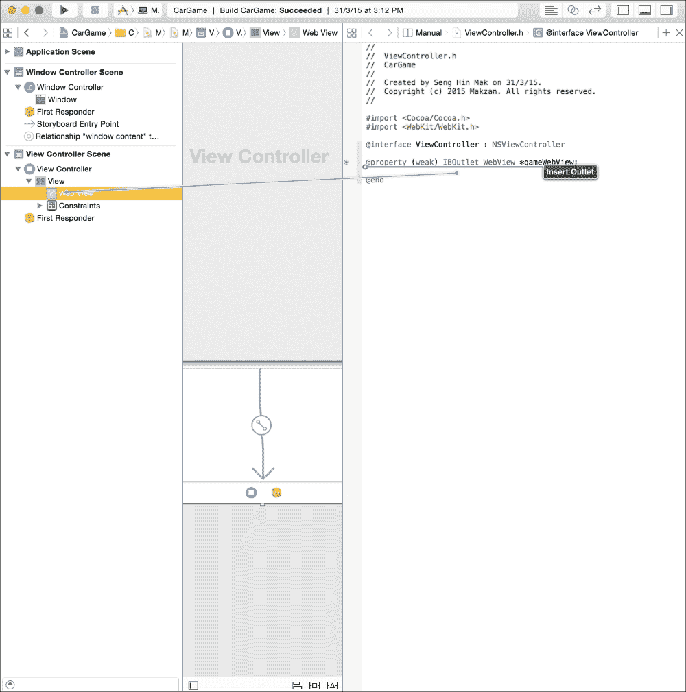

1.  我们现在已经配置了视图。让我们继续到代码部分。我们使用了 WebKit 框架的一部分 WebView 组件。我们需要将其包含在项目中。为此，在左侧面板中选择**CarGame**项目。在**通用**标签下的**链接框架和库**部分中，点击加号图标以添加 WebKit 框架：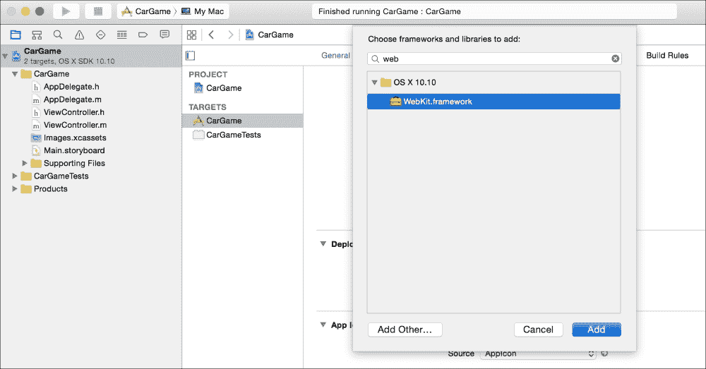

1.  现在，我们应该在**链接框架和库**部分看到`WebKit.framework`：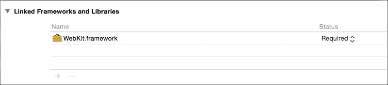

1.  点击`ViewController.m`文件，并在`viewDidLoad`函数中放入以下代码：

    ```js
    NSURL *url = [NSURL URLWithString:@"http://makzan.net/html5-games/car-game/"];
    NSURLRequest *request = [NSURLRequest requestWithURL:url];
    [[self.gameWebView mainFrame] loadRequest:request];
    ```

1.  现在，你的`ViewController.m`文件应该看起来像下面的截图：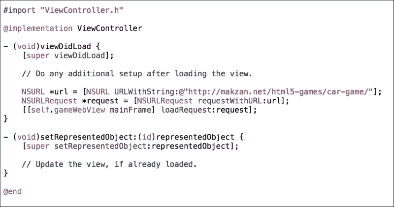

1.  最后，点击以下截图所示的 Xcode 左上角的**播放**按钮：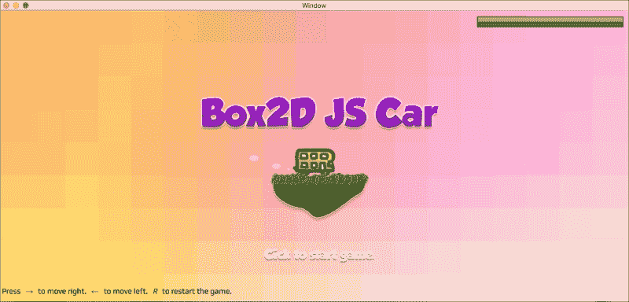

    点击播放按钮后，应用程序将构建并打开一个窗口，显示我们的赛车游戏，如下面的截图所示：

    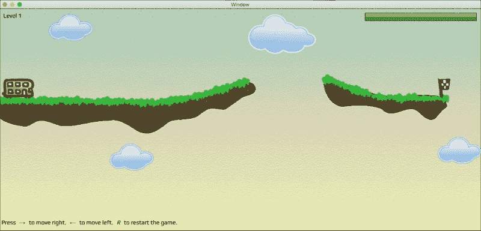

## *发生了什么？*

我们只是使用 WebView 组件将我们的游戏包装在一个本地应用程序中。我们使用 Xcode 和 Objective-C 来演示包装 WebView 背后的场景。实际上，你可以在其他语言和平台上应用相同的技巧，例如在 iOS 中使用 Swift，甚至使用 Windows 平台上的 WebView 组件构建 Windows 应用程序。

# 使用 WebView 将 HTML5 游戏构建成移动应用

我们简要了解了将游戏包装在 WebView 中的工作原理。它与将 WebView 包装在移动应用中非常相似。例如，在 iOS 中，我们使用 Xcode 创建一个 iPhone 或 iPad 项目，并在默认视图中添加一个 WebView。在 WebView 内部，我们通过在 Mac 应用部分中使用类似的技术来加载 HTML 文件。

对于 Android 应用，我们可以使用 Android Studio。Android 使用不同的编程语言；它使用 Java，但概念是相同的。我们在主视图中创建一个 WebView 组件，并通过 URL 加载我们的 HTML5 游戏。

请注意，我们需要一个证书才能将 iOS 应用部署到应用商店。为了获得证书，我们需要加入苹果开发者计划，该计划需要支付年度费用。对于 Mac 应用，我们可以自行分发游戏，或者使用 Mac 开发者证书将其部署到 Mac App Store。

# 使用 PhoneGap 构建

另一个选项是将 Web 应用构建成 Android 和 iPhone 应用——通过使用 PhoneGap 构建服务。该服务允许你上传一个包含 Web 游戏的 ZIP 文件。然后，它使用 WebView 来显示 HTML，类似于我们之前的 WebView 示例。

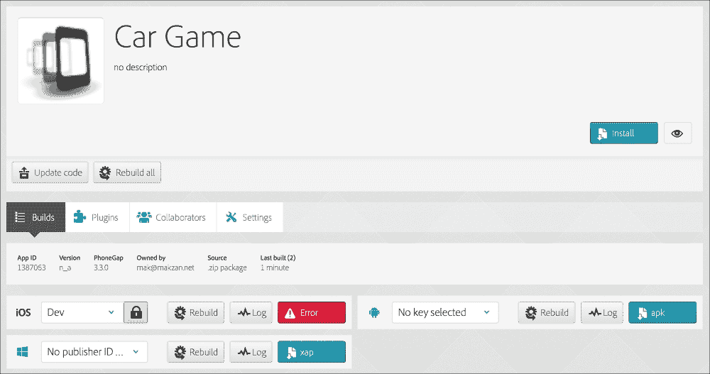

不同之处在于 PhoneGap 通过其 JavaScript API 提供了几个硬件资源。由于我们的游戏没有使用任何 PhoneGap API，它几乎与我们自己包装 WebView 并使用 PhoneGap 构建的结果相同。

如果你没有任何本地编程经验，PhoneGap 或类似的云构建服务是一个不错的选择。如果你对本地开发环境感到舒适，我更喜欢自己包装 WebView。这为我们未来的开发提供了更多的灵活性，以防我们需要混合本地和 WebView 来制作混合应用程序。

### 注意

除了 PhoneGap 构建之外，还有其他服务试图将 HTML5 游戏放入原生应用平台。CocoonJS ([`www.ludei.com/cocoonjs/`](https://www.ludei.com/cocoonjs/)) 是为此目的的另一个平台。CocoonJS 试图将 canvas 绘图 API 转换为操作系统的 OpenGL 命令，以获得更高的性能。

# 应用商店的审查流程

每个部署渠道都有不同的审查流程。例如，苹果通常在允许其应用商店上架之前，需要 1 到 4 周的时间来审查应用程序。另一方面，谷歌通常需要几个小时来审查 Play Store 中的应用程序。如果你是新手，通常需要额外一周的时间来熟悉其配置工具。所以，如果你需要在截止日期前将游戏推上应用商店，比如客户项目，请提前 4 周做好准备。

### 注意

我们没有详细介绍将游戏上传到应用商店的过程，因为它们的配置和商店列表可能会随时间变化。重要的是要准备好所有材料和目标构建。所有材料准备就绪后，上传和为每个商店配置不应成为负担。

# 摘要

在本章中，我们学习了将游戏发布到不同平台的方法。具体来说，我们讨论了静态网站托管服务来部署我们的 HTML5 游戏。我们列出了运行 node.js 的服务器。我们更新了我们的代码，使其与主页面的 Web 应用兼容。我们尝试将我们的 HTML5 游戏放入 Xcode 的 Web View 中。我们还讨论了移动应用的构建及其审查流程。

我们在九个章节中讨论了使用 CSS3 和 JavaScript 制作 HTML5 游戏的不同方面。我们学习了如何在 DOM 中构建传统的乒乓球游戏，在 CSS3 中构建匹配卡片游戏，以及使用 Canvas 构建解谜游戏。然后，我们探讨了如何向游戏中添加声音，并围绕它创建了一个迷你钢琴音乐游戏。接下来，我们讨论了通过使用本地存储来保存和加载游戏状态。我们还使用 WebSockets 构建了一个实时多人游戏的画图猜谜游戏。然后，在本章中，我们创建了一个带有物理引擎的赛车游戏。最后，我们讨论了如何将我们的 HTML5 游戏部署到不同的平台。

在整本书中，我们构建了不同类型的游戏，并学习了制作 HTML5 游戏所需的一些基本技术。下一步是继续并部署你自己的游戏。为了帮助你开发自己的游戏，有一些资源可能会有所帮助。以下列表提供了 HTML5 游戏开发的一些有用链接：

+   通用 HTML5:

    +   HTML5 游戏开发 ([`www.html5gamedevelopment.com/`](http://www.html5gamedevelopment.com/))

    +   HTML5 Rocks ([`www.html5rocks.com/`](http://www.html5rocks.com/))

+   HTML5 游戏引擎

    +   ImpactJS ([`impactjs.com/`](http://impactjs.com/))

    +   CreateJS ([`createjs.com/`](http://createjs.com/))

    +   Phaser ([`phaser.io/`](http://phaser.io/))

+   游戏精灵和纹理

    +   失落的花园 ([`lunar.lostgarden.com/labels/free%20game%20graphics.html`](http://lunar.lostgarden.com/labels/free%20game%20graphics.html))

    +   HasGraphics 图像、纹理和瓦片集 ([`hasgraphics.com/category/sprites/`](http://hasgraphics.com/category/sprites/))

    +   细腻图案 ([`subtlepatterns.com`](http://subtlepatterns.com))
