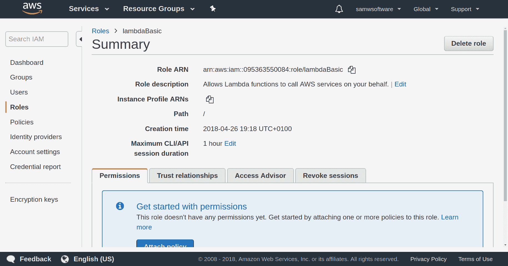

# AWS 和 Amazon CLI 入门

**亚马逊网络服务**（**AWS**）是亚马逊为开发者提供的所有工具和服务的集合。提供了大量的服务，从服务器托管到机器学习，从游戏流媒体到数字营销。每个服务都设计得非常好，能够完成一项任务，但最大的好处是每个服务之间协作得非常好。

在本章中，我们将创建一个 AWS 账户并探索 AWS 控制台。一旦我们设置了账户，我们将了解 Lambda 函数，创建我们自己的一个。这将从一个非常简单的 Lambda 开始，但随着我们继续阅读本书的其余部分，我们将增加其功能。

本章的下一段将讨论我们可以编辑 Lambdas 的不同方法以及每种方法的优缺点。

最后的部分将介绍如何使用 AWS CLI、构建脚本和 Git 创建一个出色的本地开发环境。到本章结束时，我们将拥有一个本地环境，我们可以轻松地部署我们的 Lambda，而无需进入 AWS，并且可以将所有工作备份到远程 Git 仓库。

本章将涵盖以下内容：

+   创建和配置 AWS 账户

+   在 AWS 控制台中创建 Lambda

+   编辑 Lambdas 的三种方法

+   使用 AWS CLI、构建脚本和 Git 创建一个出色的本地开发环境

# 技术要求

在本章中，我们将创建几个 Lambda 以及创建一个构建脚本。

所有代码都可以在 [`bit.ly/chatbot-ch2`](http://bit.ly/chatbot-ch2) 找到。

# 创建账户

要访问所有这些服务，您需要创建一个免费的 AWS 开发者账户。访问 [aws.amazon.com](https://aws.amazon.com/) 并点击创建免费账户。要创建账户，您需要遵循注册流程。这个过程非常彻底，需要您输入付款详情并接收自动电话呼叫。这个过程是为了验证您是一个真正的用户。

一旦您创建了 AWS 账户，您就可以通过 Amazon 控制台（[console.aws.amazon.com](https://console.aws.amazon.com/)）访问所有服务。控制台页面上有大量有用的信息。构建解决方案和学习构建是关于如何使用一些服务的教程和信息。

# 设置您的区域

对于这本书，您需要将您的区域设置为弗吉尼亚州北部或爱尔兰。Lex 目前（2018 年 4 月）在这两个区域可用。

AWS 有一个概念，即区域，这些区域是全球各地亚马逊的云服务中心的位置。对于大多数应用程序，每个区域都与所有其他区域分开。将服务部署到它们将被使用的位置附近是最佳实践。如果您的客户位于美国西海岸，那么选择北加州或俄勒冈州将是最佳选择，而选择爱尔兰则不是很好的选择。每次他们使用您的产品时，他们的数据都必须绕地球半圈再回来。

对于区域，还有一个考虑因素，那就是并非每个区域都是平等的。一些区域有更大的工作容量，而一些区域甚至没有所有服务。

# 在 AWS 中导航

在 AWS 中导航已被设计得尽可能简单。在每一页的顶部都有一个横幅，其中包含控制台主页的链接、包含所有可用服务的下拉菜单、账户和位置设置以及支持菜单：


AWS 菜单和服务下拉菜单

在 AWS 期间，您将大量使用主页链接和服务下拉菜单这两个选项。当您正在编辑 Lambda 并需要检查 DynamoDB 中的表名，或者您正在为 EC2 创建 API 网关时，您将频繁地在服务之间切换。

您还可以使用图钉图标将您最喜欢的服务固定到您的横幅上。这使得在您最常用的服务之间切换变得更加快捷。

# 创建 Lambda

AWS Lambda 函数非常出色！它们是托管在 AWS 上的函数，可以通过许多不同的方式触发。Lambda 函数是*无服务器*的，这意味着您不需要运行服务器就可以使用它们。这使得设置和使用变得更加快速和简单。

AWS Lambda 最好的部分之一是您只为 Lambda 函数运行的时间付费。有什么东西每小时只运行一次，只持续两秒钟？您每天只需支付 48 秒！与全天候运行的 AWS EC2 服务器或您自己的私有服务器相比，这简直是疯狂。

今天，我们将创建一个 Lambda 函数，并查看三种最佳的工作代码方式。

一旦您设置了 AWS 账户，就有几种方法可以创建一个新的 Lambda 函数。我们将从使用 AWS 控制台开始。

# AWS 控制台

在 AWS 控制台中，您可以在服务 | 计算 | Lambda 中找到 AWS Lambda，这将带您进入 Lambda 控制台：


AWS 计算服务

如果这是您第一次使用 Lambda，您将看到这个界面。点击创建函数按钮开始设置您的第一个函数。

您将进入设置页面，在那里您可以配置函数的一些方面（名称、运行时、角色）。您可以从蓝图或无服务器应用程序仓库创建 Lambda，但在这个例子中，我们将从零开始选择作者。

# 设置 Lambda

输入您函数的名称（这必须对您的用户或子账户是唯一的），选择您的运行时（我们将使用 Node.js 8.10），并选择“从模板创建新角色”。给这个新角色一个相关的名称，例如`lambdaBasic`或`NoPolicyRol`，并留空策略模板。当我们创建更复杂的 Lambda 时，我们必须创建具有策略和权限的角色：


带有新角色的新 Lambda

# 编写您的 Lambda 函数代码

一旦您创建了 Lambda，您将被发送到 Lambda 管理控制台中的函数编辑器。这个页面上有很多事情，但我们专注于标题为“函数代码”的部分。

当您首次创建 Lambda 时，它已经包含了一个非常基本的函数。这很好，因为它为您构建函数提供了一个起点。由于我们使用 Node.js 8.10 作为我们的运行时，将有一个名为`event`的单个参数，然后我们将返回我们的答案。

作为基本示例，我们将创建一个 Lambda，它接受您的姓名和年龄，并告诉您您的最大心率是多少。这可以比我们即将要做的方式更高效，但这更多的是作为一种在 Lambda 中演示一些技术的方法。

首先，我们将使用`console.log`输出事件并提取`name`和`age`。我将使用 ES6 解构，但您也可以使用常规变量声明来完成此操作：

```js
exports.handler = async (event) => {
   console.log(event);
   let { name, age } = event;
    // same as => let name = event.name; let age = event.age
    return 'Hello from Lambda!'
};

```

现在我们已经从事件中获得了`name`和`age`，我们可以将它们传递到一个将它们转换为字符串的函数中：

```js
const createString = (name, age) => {
  return `Hi ${name}, you are ${age} years old.`;
};

```

如果您之前没有见过这种字符串，它们被称为**模板字符串**，它们比之前的字符串连接更整洁。反引号开始和结束字符串，您可以使用`${data}`插入数据。

现在，我们可以将`'Hello from Lambda!'`更改为`createString(name, age)`，我们的函数将返回我们的新字符串：

```js
exports.handler = async (event) => {
   console.log(event);
   let { name, age } = event;
    // same as => let name = event.name; let age = event.age
    return createString(name, age);
};
```

确保通过点击 Lambda 工具栏右上角的醒目橙色“保存”按钮来保存您的更改：


Lambda 工具栏

要测试这一点，我们可以在 Lambda 工具栏中点击“测试”。

当我们点击“测试”时，会弹出一个“配置测试事件”窗口。我们可以使用它来决定在事件有效负载中发送什么。给您的测试起个名字，然后我们可以配置我们的数据。对于这个 Lambda，这非常简单，只是一个具有`"name"`和`"age"`键的对象。这是我的：

```js
{
  "name": "Sam",
   "age": "24"
}

```

您可以将您的值设置为任何您想要的，然后点击配置屏幕底部的“保存”。现在，测试按钮左侧的下拉菜单已更改为您的新的测试名称。要运行测试，只需点击测试按钮：


Lambda 结果

如果你的响应仍然是 `'Hello from Lambda!'`，那么请确保你已经保存了你的函数并再次运行测试。正如你所见，我得到了“Hi Sam, you are 24 years old.”的响应，这正是我们预期的。此外，我们还得到了一个 RequestID 和函数日志。记得我们之前在代码中添加了那个`console.log(event)`吗？你现在可以看到，对象`{ name: 'Sam', age: '24' }`已经被记录下来。如果你想查看更多的日志或之前 Lambda 调用的日志，它们都存储在 CloudWatch 中。要访问 CloudWatch，你可以在服务中搜索它，或者通过在 Lambda 控制台顶部选择“监控”然后点击“在 CloudWatch 中查看日志”来访问。

在“监控”中也有一些有趣的图表，可以告诉你你的函数工作得有多好：


在 CloudWatch 中查看日志

Lambda 函数可以像我们这样做，创建在一个文件中，但它们也可以与多个文件一起工作。当你的 Lambda 执行非常复杂的任务时，你可以将每个部分拆分到自己的文件中，以改善组织和可读性。

我们将创建一个名为`hr.js`的新文件，并在其中创建并导出另一个函数。这个函数将根据你的年龄计算你的最大心率。通过在文件夹菜单中右键单击并选择“新建文件”来创建新文件，并将其命名为`hr.js`。打开该文件，我们将创建一个`calculateHR`函数：

```js
module.exports = {
    calculateHR: (age) => {
        return 220 - age;
    }
}

```

现在，回到我们的`index.js`文件，我们需要导入我们的`hr.js`文件并调用`calculateHR`函数：

```js
const HR = require('./hr');
exports.handler = async (event) => {
   console.log(event);
    let { name, age } = event;
    return createString(name, age);
};
const createString = (name, age) => {
 return `Hi ${name}, you are ${age} years old and have a maximum heart rate of ${HR.calculateHR(age)}.`;
};
```

当我们再次运行最后的测试时，我们得到了一个新的响应：`"Hi Sam, you are 24 years old and have a maximum heart rate of 196."`。这本来可以做得更加有效，但这样做更多的是为了向你展示一些你可以在 Lambda 函数中编写代码的方式。

# 触发 Lambda

在你的第一个 Lambda 中，我们测试它的方式是通过触发一个测试。为了使 Lambda 更有用，我们需要能够从不同的地方触发它。

在 Lambda 控制台顶部附近，有一个“设计器”部分。这个部分允许你更改 Lambda 与其他服务交互的方式，因此也影响用户。在部分的左侧是一个“添加触发器”菜单，其中包含一系列选项。每个选项都是一个可以设置以触发函数的系统服务。这些并不是触发 Lambda 的所有方式，我们将在未来使用其他方法。

对我们来说，最重要的是 API 网关和 Alexa 技能套件，但其他触发器对其他项目也非常有用。API 网关是将 Lambda 暴露给外部世界的方式。你创建一个 API 端点，任何人都可以访问该端点，数据将由你的 Lambda 处理。我们将在第七章发布您的聊天机器人到 Facebook、Slack、Twilio 和 HTTP 中创建一个 API。Alexa 技能套件是用于构建 Alexa 技能的服务，这些技能也可以触发 Lambda，我们将在下一章中这样做。

# 与 Lambda 一起工作的方法

Lambda 的一大优点是你可以选择如何编写和编辑它们。主要有三种方法可以实现：

+   Lambda 控制台

+   Cloud9

+   在你的本地机器上

我将涵盖所有三种方法，并讨论每种方法的优缺点。

# 方法 1 – Lambda 控制台

这就是我们创建的第一个 Lambda 函数的方式。在 Lambda 控制台中，我们有一个基本的编辑器。它基于 Cloud9 IDE，非常适合简单的 Lambda 函数。

**优点：**

+   它是一个好的编辑器

+   你可以通过你的 AWS 控制台从任何电脑访问它

**缺点：**

+   它似乎不是很稳定。有时它不允许你保存，所以你必须将所有的工作复制到本地文件，重新加载页面，然后将工作复制回来。我希望这个问题很快就能得到解决！

+   它没有命令行界面。这意味着你不能仅使用这种方法安装 `npm` 软件包。

+   你需要互联网访问才能在 Lambda 上工作。

# 方法 2 – Cloud9 编辑器

亚马逊最近收购了 Cloud9，一个在线开发平台。它运行了一个与 AWS 平台集成的非常基础的 Ubuntu 版本。

在 AWS 控制台中搜索 `Cloud9`，进入页面，然后选择创建环境。从这里你可以给你的环境命名，然后进入下一步。

这里你可以选择你想在这个环境中运行什么。很棒的是，t2.micro 是免费层可用的，所以如果你在免费层，你可以使用这种方法而不必支付任何费用。我从未需要比 t2.micro 更强大的东西。

完成设置过程，你将进入你新的 Cloud9 环境！

这很酷，因为你可以从你的 Cloud9 环境内部访问所有的 Lambda 函数。点击 AWS 资源，在远程函数下，你会找到所有的函数。点击你想要编辑的 Lambda 函数，然后点击上面的下载图标将其导入到你的环境中：


访问远程 Lambda

一旦完成，它就会像你在本地工作一样。

完成后，只需从本地列表中选择你一直在工作的函数，然后点击上传按钮。几秒钟内，所有更改都会生效。

**优点：**

+   再次强调，这一切都是远程的，所以您不需要担心忘记提交工作或保存到 U 盘，如果您在多台机器上工作。

+   访问您的函数并重新上传它们非常简单。这是这种方法中最好的部分。

+   您现在拥有一个集成的终端，允许您安装 `npm` 软件包并使用终端完成所有其他您想做的事情。

**缺点**：

+   它仍然存在与 Lambda 控制台编辑器相同的不稳定问题。我多次尝试保存函数但未能成功，不得不复制到本地，刷新，然后重新复制到 Cloud 9。这会很快变得非常烦人。

+   您需要互联网连接来处理您的 Lambda。

# 方法 3 – 本地编辑

我将稍微改变一下做法。我会列出基本使用的优缺点，然后向您展示如何使其变得更好。

**优点**：

+   本地编辑是大多数开发者将采用的工作方式。我们可以使用我们喜欢的 IDE、扩展和配色方案。

+   它很稳定（只要您的电脑是稳定的）。

+   您可以在没有互联网连接的情况下处理您的 Lambda。

**缺点**：

+   没有花哨的按钮来获取和上传您的工作到 AWS。

+   您的工作是本地的，因此拥有多个用户或同时在多个设备上工作会更复杂。

为了使这种方法成为完美的系统，我们将利用 Amazon CLI 和 Git。设置我们所需的一切大约需要 15 分钟！

# 创建最佳本地开发环境

正如我们已经看到的，本地编写 Lambda 有一些非常出色的方面，这就是为什么我们将在这本书中一直使用它。我们将选择一个 IDE，安装 NodeJS 和 NPM，然后在为 Lambda 设置文件夹结构之前。最后，我们将使用 AWS CLI 和 Git 创建一些工具，以消除本地工作的正常缺点。

# 选择 IDE

您使用哪个 IDE 取决于个人喜好；市面上有一些非常出色的 IDE，包括 Atom、Komodo 和 Brackets。如果您已经有了个人偏好的 IDE，那么您可以使用它，但所有示例都将使用 **Visual Studio Code** （**VS Code**）。

VS Code 是由微软开发的开源 IDE，适用于 macOS、Linux 和 Windows。它内置了对 JavaScript、Node 和 TypeScript 的支持，并且您可以从扩展库中安装扩展。这些扩展是使用 VS Code 的最大优势之一，因为它们允许您对您的体验进行大量自定义。从彩色缩进来代码检查，从更好的图标到自动格式化器。它们从“有点有趣”到“使您的生活变得容易得多”不等。

除了扩展之外，VS Code 还具有更多出色的功能，如集成终端、Git 集成和内置调试器。如果您之前没有尝试过，我建议您尝试一周，看看它与您当前选择的 IDE 相比如何。

要安装 VS Code，只需访问[code.visualstudio.com](https://code.visualstudio.com/)并下载适合你操作系统的版本。

# 安装 Node 和 NPM

Node 是允许我们在服务器上运行 JavaScript 代码的运行时。在过去的几年中，它获得了巨大的青睐，几乎在技术领域的每个行业中都在运行应用程序。它也是可以在 Lambda 函数中选择的一种运行时。

除了 Node 之外，我们还获得了**Node 包管理器**（`npm`），这是世界上最大的开源库生态系统。这对我们来说是个好消息，我们将在本书中用到其中的一些包。

要安装 Node 和`npm`，你可以从[nodejs.org](https://nodejs.org/)下载安装包，或者通过包管理器进行安装。确保你安装至少版本 8.11.1，因为我们将在我们的工作中使用*async/await*，这至少需要版本 8。一旦安装了所有东西，你可以通过输入`node -v`来测试它是否正常工作；你应该得到类似`v8.11.1`的结果。你还可以通过输入`npm -v`来测试`npm`。

# 文件夹结构

为了正确组织所有的 Lambdas，将它们都存储在单个文件夹中是个好主意。这将允许一个脚本创建和更新所有的 Lambdas。在这个主文件夹内，拥有包含 Lambdas 组的子文件夹绝对是个好主意。你可以非常快速地构建大量的 Lambdas。

# 设置 AWS CLI

为了将我们的工作直接上传到 AWS，我们可以使用 AWS CLI。这允许我们从命令行管理我们的 AWS 服务并创建脚本来自动化常见任务。对我们来说，最重要的 CLI 命令是那些允许我们创建和更新 Lambdas 的命令。通过自动脚本，我们现在能够快速轻松地创建和部署 Lambdas，解决了*本地编辑*的第一个限制。

要使用 AWS CLI，我们首先需要设置它。你可以在终端中输入`npm install -g aws-cli`来安装它。

现在我们需要为我们的 CLI 设置一个用户。登录到你的 AWS 控制台并导航到或搜索`IAM`。点击添加用户，这样我们就可以为 CLI 设置一个用户。你需要为用户命名，所以选择像`cli-user`这样的名字，这样它就很容易被识别。选择程序访问，这将允许我们远程代表用户操作，然后点击下一步：权限。

在权限屏幕上，选择直接附加现有策略并选择 AdministratorAccess。这将允许你通过 CLI 做任何你想做的事情。如果你想的话，可以为此用户设置更严格的政策，或者如果你正在将账户访问权限授予另一个人。

在你最终看到访问密钥之前，还有一个屏幕。复制你的访问密钥并打开一个终端。运行命令`aws configure`，它将要求你提供四件事：

```js
AWS Access Key ID [None]: "Your Access Key ID
"AWS Secret Access Key [None]: "Your Secret Access Key"
Default region name [eu-west-1]:
Default output format [json]:
```

前两个可以在用户创建的最后页面找到。第三个必须是之前选择的区域（`eu-west-1` 或 `us-east-1`），最后一个可以保留为默认值。

# 使用 AWS CLI 创建 Lambda

现在我们已经设置了 CLI，我们可以使用它来使我们的生活更加轻松。要创建一个新的函数，你需要有一个包含一个 `index.js` 文件并包含基本 Lambda 代码的文件夹。在终端中进入该文件夹，现在你可以运行这些命令：

```js
zip ./index.zip *
aws lambda create-function \
 --function-name your-function-name \
--runtime nodejs8.10 \
--role your-lambda-role \
 --handler index.handler \
 --zip-file fileb://index.zip
```

将 `your-lambda-role` 替换为你之前创建的角色 ARN。你可以通过回到 AWS 中的 `IAM` 服务并选择 `Roles`，然后点击你的 Lambda 角色来找到它：



查找您的角色 ARN

当你运行这个脚本时，它将返回一个包含有关新创建的 Lambda 的信息的 JSON 块。

如果你编辑你的 `index.js` 代码并想要更新 Lambda，那么你需要运行三个命令：

```js
rm index.zip
zip ./index.zip *
aws lambda update-function-code \
--function-name your-function-name \
--zip-file fileb://index.zip
```

使用这些脚本，你现在可以在本地编写代码并将其部署到 AWS。这很好，但它可以改进，这正是我们接下来要做的。

# AWS CLI 构建脚本

这些 CLI 命令很好，但每次你想上传新的 Lambda 版本时都要全部输入一遍，这会变得很烦人。我们将使用一个构建脚本来自动化这些命令并添加一些额外功能。

这个脚本将是一个 bash 脚本，所以如果你正在运行 macOS 或 Linux，那么它将原生工作。如果你在 Windows 上，那么你需要在你的机器上安装一个 bash 终端。

为了使这个脚本正常工作，你需要有一个如以下截图所示的文件夹结构。每个 Lambda 都有一个包含相关文件的文件夹：


文件夹结构

我们将创建一个脚本，它不仅运行基本的 AWS CLI 命令，还进行额外的检查，运行 `npm install`，并输出有关进度的详细信息。这个脚本将通过运行 `./build lambda-folder` 来执行。

在你的 `lambdas` 文件夹中创建一个名为 `build.sh` 的新文件。或者，你可以从 [`bit.ly/chatbot-ch2`](http://bit.ly/chatbot-ch2) 下载此文件，并按照说明查看它是如何工作的。

首先，我们将检查命令中是否恰好传递了一个参数。`"$#"` 表示参数的数量，`-ne 1` 表示不等于 1：

```js
if [ "$#" -ne 1 ]; then
echo "Usage : ./build.sh lambdaName";
 exit 1;
fi
```

接下来，我们需要进入所选 Lambda 的文件夹并检查该文件夹是否存在：

```js
lambda=${1%/}; // # Removes trailing slashes
echo "Deploying $lambda";
cd $lambda;
if [ $? -eq 0 ]; then
 echo "...."
else
echo "Couldn't cd to directory $lambda. You may have mis-spelled the lambda/directory name";
exit 1
fi
```

我们不希望在确保安装了所有依赖项之前上传 Lambda，所以我们确保运行 `npm install` 并检查它是否成功：

```js
echo "npm installing...";
npm install
if [$? -eq 0 ]; then
    echo "done";
else
    echo "npm install failed";
    exit 1;
fi
```

设置步骤的最后一步是检查 `aws-cli` 是否已安装：

```js
echo "Checking that aws-cli is installed"
which aws
if [ $? -eq 0 ]; then
 echo "aws-cli is installed, continuing..."
else
echo "You need aws-cli to deploy this lambda. Google 'aws-cli install'"
exit 1
fi
```

一切设置妥当后，我们可以创建新的 ZIP 文件。在创建新的`.zip`文件之前，我们将删除旧的文件。这次创建新文件比以前稍微复杂一些。我们排除了`.git`、`.sh`和`.zip`文件，以及排除`test`文件夹和`node_modules/aws-sdk`文件。我们可以排除`aws-sdk`，因为它已经安装在了所有 Lambda 函数上，而且我们不希望上传 Git 文件、bash 脚本或其他`.zip`文件：

```js
echo "removing old zip"
rm archive.zip;
echo "creating a new zip file"
zip archive.zip * -r -x .git/\* \*.sh tests/\* node_modules/aws-sdk/\* \*.zip

```

现在，我们剩下的唯一任务是将其上传到 AWS。我们希望尽可能简化这个过程，所以我们将尝试创建一个新的函数。如果创建过程中出现错误，我们将尝试更新该函数。这可以作为一个*get*操作然后是*create*或*update*操作，但*create*操作失败实际上比*get*操作更快：

```js
echo "Uploading $lambda to $region";
aws lambda create-function --function-name $lambda --runtime nodejs8.10 --role arn:aws:iam::095363550084:role/service-role/Dynamo --handler index.handler --zip-file fileb://index.zip --publish
if [ $? -eq 0 ]; then
  echo "!! Create successful !!"
   exit 1;
fi
aws lambda update-function-code --function-name $lambda --zip-file fileb://archive.zip --publish
if [ $? -eq 0 ]; then
echo "!! Update successful !!"
else
echo "Upload failed"
echo "If the error was a 400, check that there are no slashes in your lambda name"
 echo "Lambda name = $lambda"
exit 1;
fi
```

要使脚本可执行，我们需要更改文件的权限。为此，我们运行`chmod +x ./build.sh`。

现在，你只需要导航到 Lambda 函数所在的主文件夹，并运行`./build.sh example-lambda`。如果你有嵌套在组中的 Lambdas 文件夹，那么进入组文件夹并运行`../build.sh lambda-in-group`。

如果你想，你可以将构建脚本移动到你的主目录中，使其执行命令为`~/build.sh lambda-function`，这仅在你在单独的文件夹或高度嵌套的文件夹中有 Lambdas 时才有用。

这个脚本可以被修改和扩展，以包括特定区域的上传、批量上传多个 Lambda 函数、Git 集成以及更多功能。

# Git

阅读这篇文档的很多人可能已经使用 Git 了。这有原因——它使生活变得更简单。为所有 Lambda 函数创建一个 Git 仓库是与开发团队或个人在多台机器上协作的绝佳方式。

在你的系统上安装 Git 的方式取决于你的操作系统。Linux 用户可以通过命令行安装 Git，macOS 用户可以使用 Homebrew 或下载安装，Windows 用户必须通过下载安装 Git。有关如何为你的系统安装的详细信息，可在[git-scm.com](https://git-scm.com/)上找到。

一旦安装了 Git，在终端导航到你的 Lambda 文件夹。当你在该文件夹内时，运行`git init`以创建一个空仓库。当你用 VS Code 打开 Lambda 文件夹时，现在你会在 Git 符号上看到一个悬停的数字。这意味着自你上次 Git 提交以来，你已经编辑了这么多文件。

将更改提交到 Git 就像是对文件夹中所有工作的快照并保存它。这很有用，因为它允许你看到你的工作是如何随时间变化的。要提交你的工作（进行快照），你有两种选择。

你可以使用 VS Code 的 Git 集成来创建提交。点击带有数字悬停的 Git 符号。当你点击它时，它会打开更改菜单，显示自你上次提交以来你更改的所有文件，或者如果你这是第一次提交，显示所有文件。要提交更改的工作，请在顶部的消息框中输入一条消息，然后点击上面的勾号：


使用 VS Code 集成进行 Git 提交

如果你想要使用命令行，你需要输入`git add *`将所有更改的文件添加到你即将进行的提交中。然后输入`git commit -m "我的第一次 git 提交！"`。引号之间的文本是你的提交信息。

在这两种情况下，你的提交信息应该描述你在这次提交中做出的更改。你的第一次提交可能将是“创建我的第一个函数”。

Git 的另一个巨大优势是你可以轻松创建远程 Git 仓库。这些数据中心将存储你的 Git 提交，这样你就可以从世界任何地方访问它们。主要两个是 GitHub 和 Bitbucket，但还有很多。它们都有免费版本，但 GitHub 只有公共仓库是免费的，所以任何人都可以看到你的工作。

一旦你注册了账户并创建了一个仓库，你将获得一个用于它的 URL。在你的终端中，导航到你的文件夹并运行`git add remote origin <your url>`。这意味着你可以从你的本地机器发送工作到你的在线仓库。只需输入`git push origin master`将你的最新提交发送到你的在线仓库。获取它们同样简单；只需输入`git pull origin master`，你的本地代码将更新以添加你在仓库中做出的任何更改。

这对于团队来说非常棒，因为它允许你们每个人在自己的机器上工作，但又能获取到彼此的更改。

# 本地开发设置

总结你的新本地开发设置，你拥有以下内容：

+   强大的 IDE - VS Code

+   由 Amazon CLI 驱动的构建脚本用于创建和更新函数

+   使用 Git 远程存储你的工作并允许更轻松的团队合作

# 摘要

在本章中，我们学习了亚马逊网络服务并创建了一个账户，这使我们能够访问所有这些服务。

我们使用 Lambda 控制台创建了我们的第一个 Lambda 函数，并将其升级为使用多个函数、模板字符串和从其他文件中引入代码。

接下来，我们讨论了创建 Lambda 的三个主要方法，即 Lambda 控制台、Cloud9 和本地开发。我们还探讨了每种方法的优缺点。

最后，我们使用了 AWS-CLI 和 Git 来使我们的本地开发设置更加强大。我们使用的构建脚本允许我们创建和更新 Lambda 函数，而无需进入 AWS。

在下一章中，我们将学习如何使用 Alexa 技能套件构建我们的第一个 Alexa 技能。

# 问题

1.  列出创建和编辑 Lambda 函数的三个主要方法。

1.  AWS 代表什么？

1.  基本本地开发设置的两个主要局限性是什么？

1.  我们使用哪些工具来改进我们的本地开发设置？
