# 将您的 Alexa 技能连接到外部 API

在本章中，我们将扩展我们在上一章中学到的基本知识，以改进 Alexa 的功能性和用户体验。我们将通过学习使用外部 API 与其他人提供的服务进行交互来增加功能。然后，我们将通过让我们的聊天机器人记住现有对话以及使用**语音合成标记语言**（**SSML**）来控制 Alexa 与用户交谈的方式来增加用户体验。

为了让我们能够学习这一点，我们将为 Alexa 构建一个天气技能。您将能够要求全球 200,000 个城市当前或五天的天气预报。

本章将涵盖以下主题：

+   访问和交互外部 API

+   使用会话属性存储会话内存

+   使用 SSML 控制 Alexa 与用户交谈的方式

# 技术要求

在本章中，我们将为我们的技能创建一个 Lambda 函数，并使用我们在第二章中讨论的本地开发设置来部署它，即*AWS 和 Amazon CLI 入门*。

我们将使用**Open Weather Map API**根据用户请求获取天气数据。我们将通过创建账户和获取 API 密钥的过程。

我们将使用 Postman 来测试我们将要向 Open Weather Map API 发出的请求。这是一个跨平台的应用程序，可以在[getpostman.com](https://www.getpostman.com/)上安装。

本章所需的所有代码都可以在[`bit.ly/chatbot-ch4`](http://bit.ly/chatbot-ch4)找到。

# 外部 API

**应用程序编程接口**（**API**）是一个您可以发送请求的接口，它将给您一个响应。这些用于让其他人控制您的软件的部分，无论是从 API 数据库获取信息、更改用户的设置，还是让 API 发送文本。

它们是开发者的非常强大的工具，为您提供比您自己收集或构建更多的数据和服务的访问权限。

外部 API 不必由他人构建。如果您有一个希望从聊天机器人访问的系统，您可以添加 API 访问，或者可能已经为它构建了一个 API。使用 API 来分离代码或公司的部分可以是一个允许并改进模块化的好方法。

# Open Weather Map API

Open Weather Map API 是一个非常强大的 API，让您能够获取全球 200,000 个城市的当前天气以及天气预报。最好的部分是，有一个免费层，允许您每分钟进行 60 次关于当前天气和五天预报的请求。这使得我们能够开发一个使用真实世界数据而不需要订阅月费费用的 Alexa 技能。

要访问此 API，我们需要创建一个账户以获取 API 密钥。访问[OpenWeatherMap.org](https://home.openweathermap.org)，然后在页面右上角点击“注册”。输入您的详细信息，阅读条款和条件，然后注册。接下来，您将被提示说明您使用 API 的原因。没有“Alexa”选项，因此您可以选择移动应用开发，因为这最接近我们的实际使用。

现在您已登录，您可以访问您的 API 密钥。在您向 API 发出的任何请求中都会使用此密钥，以便它可以检查您是否有权发出请求。导航到 API 密钥，找到您账户的默认密钥。我们将在此项目中使用该密钥，以确保您可以再次找到它：

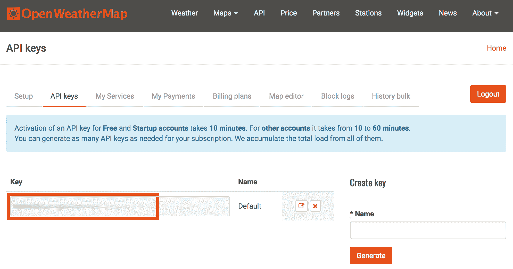

OpenWeatherMap API 密钥

使用我们的 API 密钥，我们现在可以查看我们可以发出的请求。在 API 页面上，有一个不同 API 的列表，但我们有权访问的是当前天气数据和 5 天/3 小时预报。在每个部分下方都有一个按钮可以进入 API 文档，我们将查看当前天气数据的 API 文档。

在 Current weather data API 上有三种方式请求数据：调用一个地点的当前天气数据，调用多个城市的当前天气数据，以及批量下载。我们每次只会获取一个地点的数据。

在“调用一个地点的当前天气数据”部分中，也有几种不同的方式来选择区域。您可以提供城市名称、城市 ID、地理坐标或 ZIP 代码。用户将告诉我们一个城市名称，因此使用这些数据最有意义。

有两种方式可以通过城市名称获取当前天气数据：

```js
https://api.openweathermap.org/data/2.5/weather?q={city name}
https://api.openweathermap.org/data/2.5/weather?q={city name},{country code}
```

每当我们调用这些端点中的任何一个时，我们都会以预定义的格式获得响应。了解数据将如何返回，这样我们就可以在我们的技能内部正确处理它。网页上的 API 响应部分提供了响应示例，以及一个功能列表，每个功能都有简短描述。这是一个请求可能返回的响应示例：

```js
{
    "city": {
        "id":1851632,
        "name":"Shuzenji",
        "coord": { "lon":138.933334, "lat":34.966671 },
        "country": "JP",
        "cod":"200",
        "message":0.0045,
        "cnt":38,
        "list":[{
            "dt":1406106000,
            "main":{
                "temp":298.77,
                "temp_min":298.77,
                "temp_max":298.774,
                "pressure":1005.93,
                "sea_level":1018.18,
                "grnd_level":1005.93,
                "humidity":87,
                "temp_kf":0.26},
            "weather":[{"id":804,"main":"Clouds","description":"overcast clouds","icon":"04d"}],
            "clouds":{"all":88},
            "wind":{"speed":5.71,"deg":229.501},
            "sys":{"pod":"d"},
            "dt_txt":"2014-07-23 09:00:00"
        }]
    }
}
```

# 创建我们的天气技能

创建天气技能将遵循我们之前创建的技能相同的步骤。这是一个在创建任何新的 Alexa 技能时都值得遵循的绝佳流程。为了回顾这个过程，它如下所示：

+   从完美的对话中创建对话流程

+   在 Alexa Skills Kit 上创建技能，包括所有意图、槽位和表述

+   创建 Lambda 来处理请求

+   测试技能

+   提升技能

# 对话流程设计

用户将与该技能进行的对话大多数都很简单。用户真正可以询问的只有两件事：位置和预报数据。以下是一个完美的对话示例：

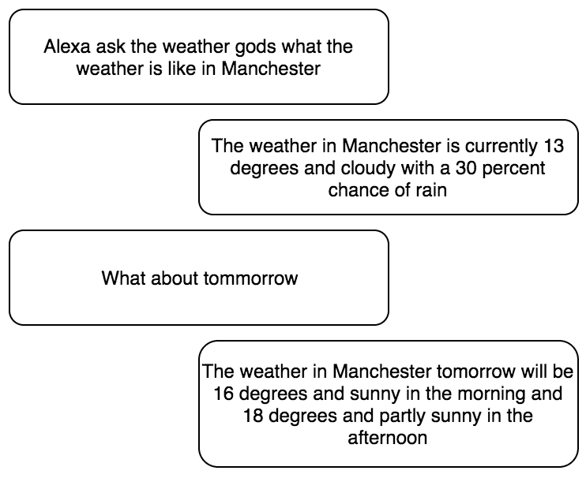

天气对话

这个对话的有趣之处在于两个问题都很相似。{位置} {日期}的天气怎么样？

这意味着我们可以用单个意图来处理它们。这个意图需要检查他们是否提供了位置和日期，然后使用这两个东西来调用 API。这个意图的流程图将如下所示：

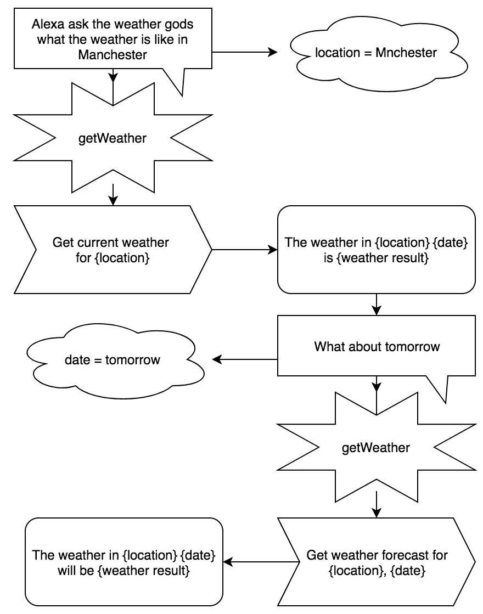

天气流程图

与我们之前工作过的流程相比，这个流程的不同之处在于用户可以在一次对话中多次通过一个意图，通常带有不同的槽位值。我们可以为“当前天气”、“天气变化日期”和“天气变化位置”构建单独的意图，但它们都会做类似的事情。

# 在 Alexa Skills Kit 上创建技能

我们需要开始使用 Alexa Skills Kit 开发者控制台。点击创建技能按钮，给你的技能命名，并选择自定义作为技能类型。

每次我们创建一个新技能时，我们首先添加一个调用短语。

在创建技能时立即执行意味着你不会忘记稍后填充它。你可以在发布技能之前随时更改短语。

接下来，我们需要创建我们的`getWeather`意图。添加一个名为`getWeather`的新自定义意图，然后我们可以开始填充意图。

用户将使用许多不同的语句来触发这个意图。我们还将学习如何从用户语句中填充槽位。首先，将我们的两个槽位添加到意图中，“位置”和“日期”。位置槽位的类型可以是 AMAZON.US_CITY，数据可以是 AMAZON.DATE。如果你想在你所在地区获得更好的城市识别，可以选择`GB_CITY`、`AT_CITY`、`DE_CITY`或`EUROPE_CITY`：

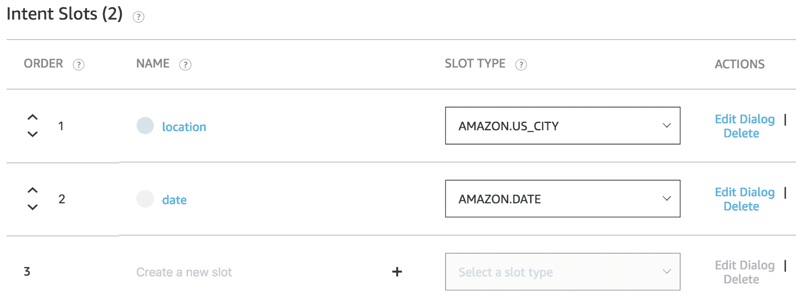

意图槽位

创建好槽位后，我们可以创建我们的语句。这些语句将不同于我们的常规语句，因为我们需要在同一时间填充槽位。这可以通过一个如“伦敦的天气怎么样”这样的语句来演示。我们试图填充的槽位是一个值为“伦敦”的“位置”。为了捕获这个槽位，我们可以使用花括号方法，其中意图变为“伦敦的天气怎么样{位置}”。这意味着在花括号“{位置}”处输入的任何值都将被捕获并存储在位置槽中。

这也可以用于其他类似的语句。“明天怎么样”变为“关于{日期}”，而一个“纽约明天的天气怎么样”的语句变为“{日期}在{位置}的天气怎么样”。从初始语句中捕获槽位的功能非常强大，因为它意味着我们不必询问用户每个槽位的值。提出一系列这样的问题会导致非常不自然的对话。以下是一些示例样本语句：

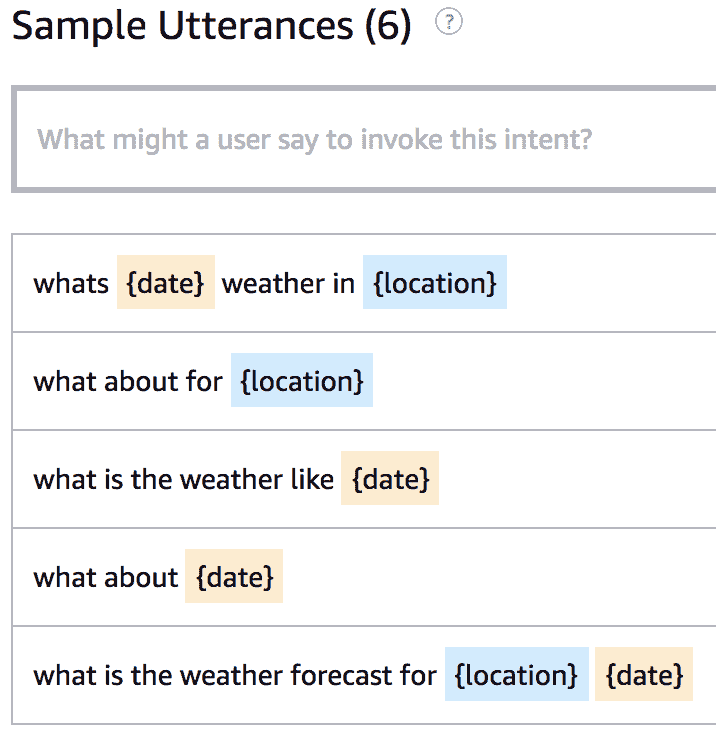

获取天气语句

在完成意图槽位和话语之后，我们可以在创建处理请求的 Lambda 之前，从端点部分获取技能 ID。

# 构建 Lambda 处理请求

要创建我们的 Lambda 函数，我们可以在`Lambdas`文件夹内创建一个新的文件夹，并将其命名为`weatherGods`。在这个文件夹内，我们可以创建一个`index.js`文件，在其中我们将创建我们的处理程序。首先，从本章代码库中的`boilerplate Lambda`文件夹中复制文本。我们还需要运行`npm init`，以便我们稍后可以安装`npm`包。

在开始编写主要代码之前，我们需要修改我们的`LaunchRequestHandler`。这可以通过更改`speechText`变量来完成。对于这个技能，我们可以输入一个响应消息“你可以向天气之神询问你所在城市的天气或天气预报”。这会提示用户说出一个将触发`getWeather`意图的短语。

现在我们可以开始编写逻辑，以获取用户想要的天气信息。我们需要创建另一个处理程序来处理`getWeather`请求：

```js
const GetWeatherHandler = {
    canHandle(handlerInput) {
        return handlerInput.requestEnvelope.request.type === 'IntentRequest' &&
            handlerInput.requestEnvelope.request.intent.name === 'getWeather';
    },
    handle(handlerInput) {}
}
```

在我们能够获取天气之前，我们需要检查我们是否有位置和日期的值。如果我们没有这两个值中的任何一个，我们需要获取它们：

```js
const { slots } = this.event.request.intent;
let { location, date } = slots;
location = location.value || null;
date = date.value || null;

if (!location) { 
    let slotToElicit = 'location';
    let speechOutput = 'Where do you desire to know the weather';
    return handlerInput.responseBuilder
        .speak(speechOutput)
        .addElicitSlotDirective(slotToElicit)
        .getResponse();
}
if (!date){
    date = Date.now()
}
```

你可能会注意到，缺失的位置和日期被处理得不同。如果位置缺失，我们会要求用户提供位置。如果我们缺少日期，我们将日期设置为`Date.now()`。这是一个设计选择，因为它感觉更自然地说“洛杉矶的天气怎么样？”而不是“洛杉矶现在的天气怎么样？”。正是这样的小细节使得与优秀的聊天机器人交谈变得如此愉快。

我们知道我们有一个位置和一个日期，因此可以继续编写其余的逻辑。有了位置和日期，我们可以向 Open Weather Maps API 发起请求。

# 发起 API 请求

发起 API 请求包括在 URL 上使用`GET`、`PUT`、`POST`或`DELETE`方法，并附带一些可选数据。一个设计良好的 API 将设计成在 URL 中包含大部分关于请求的信息。这意味着我们将根据用户的选择更改 URL。

对于 Open Weather Maps API，我们需要发送请求的 URL 结构如下：

+   对于当前天气：[`api.openweathermap.org/data/2.5/weather?q={$city},us`](https://api.openweathermap.org/data/2.5/weather?q=%7B%24city%7D,us)

+   对于五天预报：[`api.openweathermap.org/data/2.5/forecast?q=${city},us`](https://api.openweathermap.org/data/2.5/forecast?q=%24%7Bcity%7D,us)

不幸的是，API 需要我们定义一个国家代码。在这个例子中，我们应该使用*US*，因为我们选择了 US_CITY 作为我们的槽类型。如果你选择了不同的槽类型，请确保输入你国家的`ISO 3166`代码。

要向这些 URL 发出请求，我们需要使用一个请求库。Node 内置了一个`HTTP`标准库可以用来发出请求，但还有一些其他库可以使我们的生活更加简单。我们将使用的一个库叫做`axios`。使用`axios`而不是标准`HTTP`库有两个主要原因：

+   它更加用户友好

+   它是基于**承诺**的，因此你可以控制数据流

要使用`axios`发出请求，我们首先需要安装它并在代码中引入。导航到你的`weatherGods` Lambda 文件夹，运行`npm install --save axios`并在`index.js`文件的顶部添加`const axios = require('axios');`。

现在发出请求可以简单到只需在任何想要发出请求的地方添加这一行代码：

```js
axios.get(*URL*)
```

对于我们的请求，我们还需要传递我们的 API 密钥。对于 Open Weather Maps API，我们需要在 URL 的末尾添加查询字符串`appid=${process.env.API_KEY}`。

我们将 API 密钥存储在环境变量中，这样它就不会被提交到源代码控制（GIT），否则其他人可以访问它。它们可以在你的 Lambda 控制台中访问和更改。要存储环境变量，请在 Lambda 控制台中向下滚动到**环境变量**并输入你想要存储的键和值：

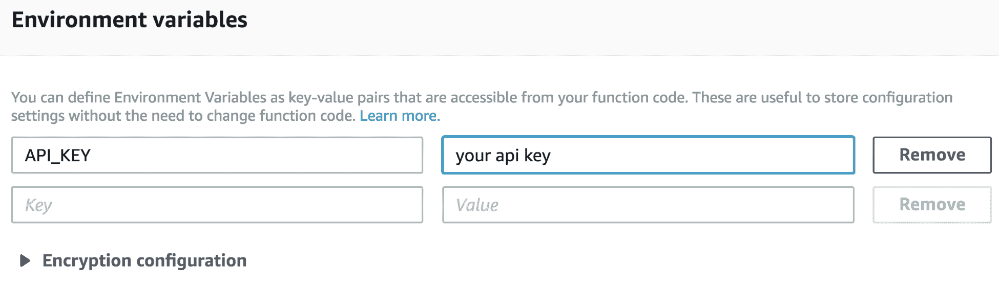

环境变量

当我们发出请求时，我们无法访问结果。从承诺中获取结果有几种不同的方法，但我们将使用`async`和`await`来使我们的代码尽可能干净和易于阅读。为了使`async`和`await`工作，我们需要稍微修改我们的处理函数。在我们声明输入值的地方，我们需要声明这个函数是一个`async`函数。我们还需要检查我们的 Lambda 是否运行在支持`async`函数的 node 8.10 上。如果你使用的是我们在第二章中创建的构建脚本，*使用 AWS 和 Amazon CLI 入门*，那么我们所有的函数都是自动使用 node 8.10 设置的，但你总是可以通过查看 Lambda 控制台上的运行时来检查。我们通过在方法名前添加`async`来使我们的处理方法异步：

```js
async handle(handlerInput) {}
```

要使用`async`和`await`从承诺中获取结果，我们需要在承诺前加上`await`。这意味着代码的其余部分将不会开始运行，直到承诺返回：

```js
let result = await promise();
```

现在我们已经对`axios`和`async`/`await`进行了快速介绍，我们可以开始编写我们将要发出的请求。因为我们有针对**当前天气**和**天气预报**的不同 URL，我们需要检查所选日期是否是当前日期，或者他们是否在寻找预报。

比较日期是一个令人惊讶的复杂任务，因此我们将使用一个 `npm` 包来使它更容易。这个包叫做 `moment`，它是一个专为与日期一起使用而制作的包。使用 `npm install --save moment` 在我们的 Lambda 中安装它，然后通过在 `index.js` 文件的顶部添加 `const moment = require('moment'); moment().format();` 来将其引入 Lambda。

在 `handler` 中，我们可以添加以下检查：

```js
let isToday = moment(date).isSame(Date.now(), 'day');

if (isToday) {
    // lookup todays weather
} else {
    // lookup forecast
}
```

接下来，我们需要添加我们将要向 `openWeatherMaps` 发出的请求。我们从 `axios` 收到的响应包含了请求的所有信息。因为我们只关心返回的数据，所以我们可以解构响应并重命名数据。解构允许我们从对象中选择一个键并将其命名为其他名称：

```js
let { key: newKeyName } = { key: 'this is some data' };
```

我们可以使用这种解构来将当前天气数据和预报数据重命名为不同的名称，以避免未来的混淆：

```js
if (isToday) {
    let { data: weatherResponse } = await axios.get(`https://api.openweathermap.org/data/2.5/weather?q=${location},us&&appid=${process.env.API_KEY}');
} else {
    let { data: forecastResponse } = await axios.get(`https://api.openweathermap.org/data/2.5/forecast?q=${location},us&&appid=${process.env.API_KEY}`);
}
```

对于这些请求的响应，我们需要提取我们想要发送给用户的信息。为此，我们需要知道我们将要接收的数据和我们想要的数据。

检查你将收到的确切数据的一个很好的方法是向 API 发送测试请求。制作 API 请求的一个很好的工具是 [Postman](https://www.getpostman.com/)，因为它允许你发送 `GET`、`PUT`、`POST` 和 `DELETE` 请求并查看结果。为了测试我们的 API 请求，我们可以打开 Postman 并将 `https://api.openweathermap.org/data/2.5/weather?q={$location},us,&APPID=${API_KEY}` 放入请求栏。在发送请求之前，只需将 `${location}` 改为测试城市，将 `${API_KEY}` 改为我们生成的 Open Weather Map 网站上的 API 密钥。它看起来可能像这样：`https://api.openweathermap.org/data/2.5/weather?q=manchester,us,&APPID=12345678`。

从这个请求中，我们将得到一个类似以下的结果：

```js
{
    "coord": {
        "lon": -71.45,
        "lat": 43
    },
    "weather": [
        {
            "id": 500,
            "main": "Rain",
            "description": "light rain",
            "icon": "10n"
        },
        {
            "id": 701,
            "main": "Mist",
            "description": "mist",
            "icon": "50n"
        }
    ],
    "base": "stations",
    "main": {
        "temp": 283.98,
        "pressure": 1016,
        "humidity": 93,
        "temp_min": 282.15,
        "temp_max": 285.15
    },
    "visibility": 16093,
    "wind": {
        "speed": 1.21,
        "deg": 197
    },
    "clouds": {
        "all": 90
    },
    "dt": 1526794800,
    "sys": {
        "type": 1,
        "id": 1944,
        "message": 0.0032,
        "country": "US",
        "sunrise": 1526807853,
        "sunset": 1526861265
    },
    "id": 5089178,
    "name": "Manchester",
    "cod": 200
}
```

从这些数据中，我们可能想要告诉用户的信息将来自天气和主要部分，其余的数据对我们来说不太相关。为了删除这些信息，我们可以再次使用解构：

```js
let { weather, main: { temp, humidity } } = weatherResponse;
```

我们需要对预报请求做同样的事情。数据是不同的，因此我们需要进行一些额外的处理来提取我们想要的数据：

```js
let { list } = forecastResponse;
let usefulForecast = list.map(weatherPeriod => {
    let { dt_txt, weather, main: { temp, humidity } } = weatherPeriod;
    return  { dt_txt, weather, temp, humidity }
});
```

现在，我们已经有了未来五天每三小时的预报数据。这些数据量太大，以至于很难告诉用户，即使他们只询问一天的数据。为了减少数据量，我们可以将预报减少到 9:00 和 18:00 各一个。我们可以使用 `usefulForecast` 数组上的过滤器，使得 `dt_txt` 必须以 `09:00:00` 或 `18:00:00` 结尾：

```js
let reducedForecast = usefulForecast.filter(weatherPeriod => {
    let time = weatherPeriod.dt_txt.slice(-8);
    return time === '09:00:00' || time === '18:00:00';
});
```

现在，我们可以得到用户请求的那天的两个预报。我们可以再次使用 `moment` 来比较结果和用户选择的日期：

```js
let dayForecast = reducedForecast.filter(forecast => {
    return moment(date).isSame(forecast.dt_txt, 'day');
});
```

现在我们应该有一个包含两个预报的数组，这些预报包含了用户询问的那天的 9:00 和 18:00 的天气、温度和湿度。

使用当前天气和预报的数据，我们可以开始创建用户响应。我们将从一个当前天气请求开始。我们可以使用模板字符串来简化格式化。你可以根据需要修改措辞或结构，只要使用正确的变量即可：

```js
let speechText = `The weather in ${location} has ${weatherString} with a temperature of ${formattedTemp} and a humidity of ${humidity} percent`;
```

你可能已经注意到我们使用了两个尚未定义的变量。让我们来看看。

`weatherString` 需要从当前正在发生的天气类型数组中构建。为了处理这些，我们可以创建一个新的函数，该函数接受 `weather` 数组并返回一个更易于人类/Amazon Alexa 读取的字符串。这个函数应该放在 `handlers` 对象之外作为一个新的函数声明：

```js
const formatWeatherString = weather => {
    if (weather.length === 1) return weather[0].description
    return weather.slice( 0, -1 ).map( item => item.description ).join(', ') + ' and ' + weather.slice(-1)[0].description;
}
```

如果只有一种天气类型，此函数返回描述。当有多个天气类型时，在类型之间插入逗号，除了最后一个，它使用 `and` 来添加。这将创建如 *破碎的云，小雨和雾* 这样的字符串。

接下来，我们需要将温度转换为大多数人都能理解的尺度。我们给出的温度是开尔文，所以我们需要将其转换为摄氏度或华氏度。我已经提供了这两个函数，但我们只需要在 Lambda 中使用一个：

```js
const tempC = temp => Math.floor(temp - 273.15) + ' degrees Celsius ';

const tempF = temp => Math.floor(9/5 *(temp - 273) + 32) + ' Fahrenheit';
```

在我们的 `getWeather` 处理程序内部，我们现在可以向 `isToday` 块中添加对这些函数的调用。你可以取消注释你不想使用的温度函数：

```js
let weatherString = formatWeatherString(weather);
let formattedTemp = tempC(temp);
// let formattedTemp = tempF(temp);
```

现在我们已经拥有了创建将传递给用户的 `speechText` 变量的所有必要信息，我们需要为预报数据遵循类似的步骤集。我们可以从一个我们想要构建的短语开始，这个短语比第一个更长更复杂：

```js
let speechText = ` The weather in ${location} ${date} will have ${weatherString[0]} with a temperature of ${formattedTemp[0]} and a humidity of ${humidity[0]} percent, whilst in the afternoon it will have ${weatherString[1]} with a temperature of ${formattedTemp[1]} and a humidity of ${humidity[1]} percent`
```

为了填充这些变量，我们需要在 `dayForecast` 数组的两个元素上使用 `formatWeatherString()` 和 `tempC()` 函数。如果你想使用华氏度，可以将 `tempC()` 替换为 `tempF()`：

```js
let weatherString = dayForecast.map(forecast => formatWeatherString(forecast.weather));
let formattedTemp = dayForecast.map(forecast => tempC(forecast.temp));
let humidity = dayForecast.map(forecast => forecast.humidity);
```

这将把早晨的预报放入数组的第一个索引中，正如我们在 `speechText` 字符串中所要求的。

现在我们已经有了当前天气和预报的字符串响应，我们需要告诉用户：

```js
return handlerInput.responseBuilder
    .speak(speechText)
    .getResponse();
```

保存此函数后，我们就准备好部署这个 Lambda。使用我们的构建脚本，这通过进入主 Lambda 文件夹并运行 `./build.sh weatherGods` 来完成。

# 最终设置和测试

在创建并上传 Lambda 之后，我们可以完成设置的最后一步，然后测试我们的技能。在技能开始工作之前，我们需要做两件事：

+   将 Alexa 技能套件添加为 Lambda 的触发器

+   将 Lambda ARN 添加到技能端点

我们之前已经做过两次，所以这只是一个简要的指南。打开 Lambda 控制台并导航到 `weatherGods` Lambda。在设计部分，添加 Alexa 技能套件作为触发器，然后添加技能 ID 到配置窗口中，并保存 Lambda。复制 Lambda 的 ARN 并导航到 Alexa 技能套件开发者控制台，在那里我们可以进入 `WeatherGods` 技能并将 Lambda ARN 添加到技能端点。

现在技能的设置已经完成，我们可以开始测试它。在 Alexa 技能套件控制台中，确保你处于 `WeatherGods` 技能，并且技能构建清单上的所有项目都已完整。如果你有任何缺失，请返回并完成该部分：

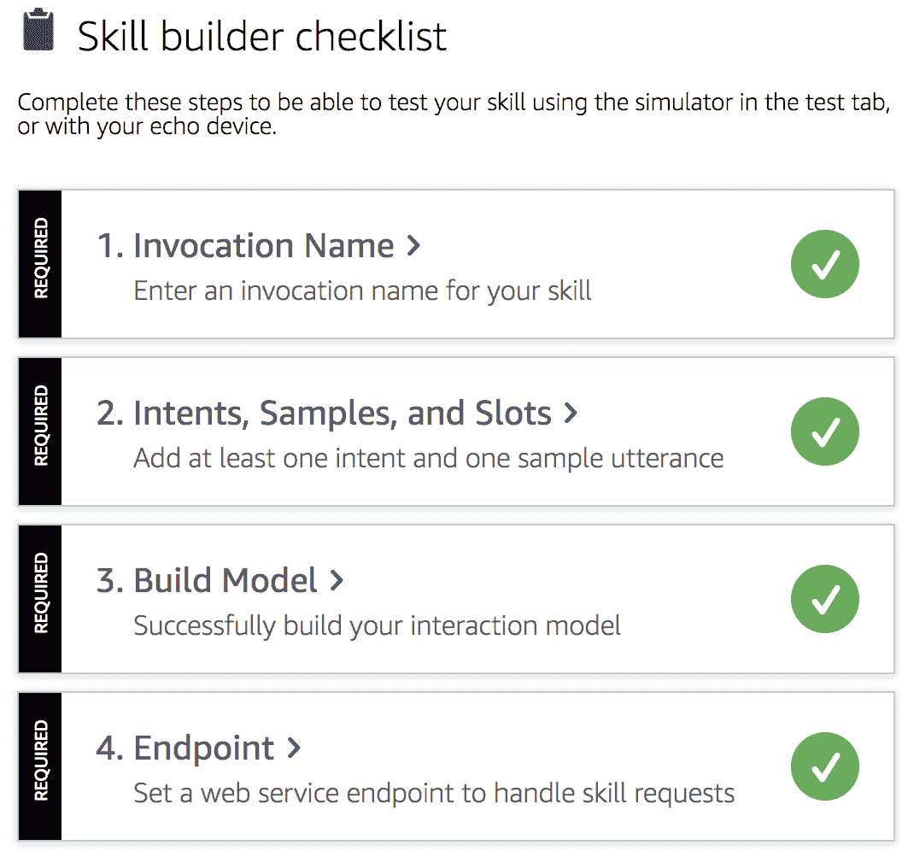

技能构建清单

现在，我们可以进入测试选项卡并尝试这个技能。我们可以启动这个技能，然后请求预报，我们应该被告知给定城市的预报：

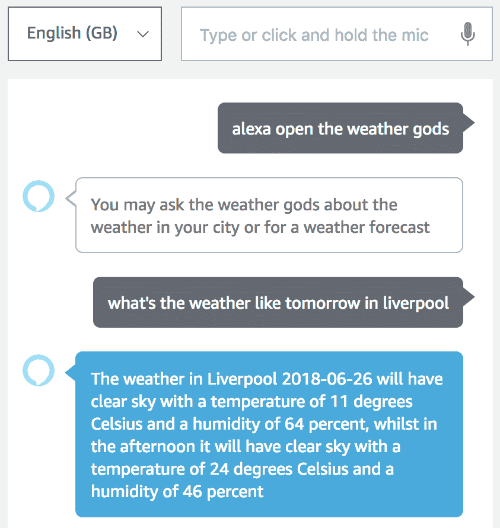

城市天气预报

这是一个尝试不同方式询问相同内容并扩展意图表述的好地方。

# 提升用户体验

虽然我们这个技能的第一个版本运行良好，但在几个关键部分可以进行改进。

+   处理错误

+   会话内存

+   SSML

# 处理我们的 API 调用错误

当我们最初设置这个函数时，我们没有为我们的 API 调用包含任何错误处理。有可能 API 或我们的调用发生了一些导致它失败的事情。这可能是大量的事情，例如断开的互联网连接、不正确的请求、未知的位置、过期的 API 密钥或 API 崩溃。

为了处理这个问题，我们需要修改我们的技能向 Open Weather Maps API 发送请求的方式。使用纯 `async` 和 `await` 的一种限制是我们无法判断请求是否成功或失败。有两种处理方法：

1.  你可以使用 `try…catch` 块来捕获发生的任何错误。我们这样做的方式是将 `isToday` 块内的所有内容包裹在一个 `try` 块中，然后有一个 `catch` 告诉用户我们无法处理这个请求。

1.  你可以将请求传递给一个返回 `[error, result]` 数组的函数。如果没有发生错误，那么它将是 `null`，因此我们可以根据这个事实进行逻辑处理。

这两种方法都适用，但它们最好在不同的情境中使用。

第一个 `try…catch` 方法用于捕获代码中的错误。我们可以通过将大部分逻辑包裹在一个单独的 `try…catch` 中来利用这一点：

```js
try {
    if (isToday) {
        ...
    } else {
        ...
    }
} catch (err) {
    console.log('err', err);
    return handlerInput.responseBuilder
        .speak(`My powers are weak and I couldn't get the weather right now.`)
        .getResponse();
}
```

保持错误信息轻松愉快通常是个好主意，因为用户不太可能感到烦恼。

第二种方法通常用于当你想要捕获特定承诺错误时。我们需要创建一个新的函数，该函数接受一个承诺并返回错误和结果状态。这个函数通常被称为 `to`：

```js
const to = promise => promise.then(res => [null, res]).catch(err => [err, null]);
```

如果这个函数得到一个解决的承诺，它将错误作为`null`返回并返回结果。但如果发生错误，它将返回一个错误和一个`null`结果。由于一个称为**错误优先编程**的标准设计，错误总是位于第一个位置。

这种方法非常适合在非常具体的位置捕获错误，无论是要不同地处理它还是仅仅在那个点记录更多信息。我们可以在当前天气请求上使用这个方法，给出一个稍微不同的响应：

```js
let [error, response] = await to(axios.get(`https://api.openweathermap.org/data/2.5/weather?q=${location},us&appid=${process.env.API_KEY}`));
if (error) {
 console.log('error getting weather', error.response);
    let errorSpeech = `We couldn't get the weather for ${location} but you can try again later`;
    return handlerInput.responseBuilder
        .speak(errorSpeech)
        .getResponse();
}
let { data: weatherResponse } = response;
```

我们可以用来处理错误的最后一个工具是为整个 Alexa 技能提供一个错误处理器。我们可以创建另一个处理器，当我们的代码中发生未捕获的错误时会被调用。这可能是我们返回了不正确的响应，有一个未定义的变量，或者是一个未捕获的承诺拒绝。

因为我们希望每次发生错误时都调用这个函数，所以我们的`canHandle`函数总是返回 true。然后处理器会接收到`handlerInput`，还会接收到一个`error`变量。我们可以`console.log`出错误的响应，然后向用户发送错误消息：

```js
const ErrorHandler = {
    canHandle() {
        return true;
    },
    handle(handlerInput, error) {
        console.log(`Error handled: ${error.message}`);

        return handlerInput.responseBuilder
            .speak(`Sorry, I can't understand the command. Please say again.`)
            .getResponse();
    },
};
```

要将此处理器应用于我们的技能，我们可以在`Alexa.SkillBuilders`中的`.addRequestHandlers`之后添加`.addErrorHandlers(ErrorHandler)`。

有了这些措施，如果我们的代码或向 Open Weather Map API 发出请求时出现错误，我们的技能将工作得更好。你应该始终在 API 调用周围有一些错误处理过程，因为你永远不知道它们何时可能会出错。

# 会话内存

目前有一件事不起作用，那就是询问后续问题。从最初的完美对话中，我们必须跟随问题，例如*明天怎么样**？*和*在迈阿密怎么样？*这些问题使用关于先前请求的知识来填充日期或位置。拥有能够在交互之间记住某些信息的技能意味着它可以以更人性化的方式进行交互。我们做出的交互中很少有完全不依赖于先前信息的。

为了在交互之间保持信息，我们有**会话属性**的概念。这些是附加到会话上的键值对，而不仅仅是单个交互。一旦 Alexa 认为她已经完成了任务，她就会关闭会话。在 Alexa 中，设置和检索会话属性也非常简单。获取会话属性就像调用以下代码一样简单：

```js
let sessionAttributes = handlerInput.attributesManager.getSessionAttributes();
```

这意味着我们可以访问我们之前存储在会话属性中的值。要存储值在会话属性中，我们可以将一个对象传递给`.setSessionAttributes`：

```js
handlerInput.attributesManager.setSessionAttributes(sessionAttributes);
```

我们需要做的最后一件事是告诉 Alexa 会话还没有结束。我们通过在响应构建器中的`.getResponse()`之前添加`.withShouldEndSession(false)`来实现这一点，当我们想要保持会话属性时。

如果用户在设定的时间内没有做出回应，会话仍然会被关闭：

```js
return handlerInput.responseBuilder
   .speak(speechText)
   .withShouldEndSession(false)
   .getResponse();
```

我们可以使用这个强大的工具来存储成功请求的日期和位置，然后使用它们来填充用户未填充的位置或日期槽位。

我们需要做的第一件事是从存储中获取会话属性。然后我们可以使用这些值来填充`日期`和`位置`变量。如果我们从槽位中没有获取到值，我们尝试会话属性；否则，我们将它们设置为`null`。然后我们将本地的`sessionAttributes`变量设置为等于我们的`日期`和`位置`。这意味着来自槽位的新值会覆盖现有的会话属性值：

```js
let sessionAttributes = handlerInput.attributesManager.getSessionAttributes();
location = location.value || sessionAttributes.location || null;
date = date.value || sessionAttributes.date || null;
sessionAttributes = { location, date };
```

我们已经更改了本地会话属性，但还没有在会话中设置它们。我们留到即将响应用户之前再进行设置。我们选择不立即保存，因为如果用户提供了无效的槽位，它就会被存储。如果我们就在发送消息之前存储它，那么我们就知道 API 调用已经成功：

```js
let speechText = `The weather in ${location} has ${weatherString} with a temperature of ${formattedTemp} and a humidity of ${humidity} percent`;
handlerInput.attributesManager.setSessionAttributes(sessionAttributes);
return handlerInput.responseBuilder
```

同样，我们需要在返回预报消息之前添加`handlerInput.attributesManager.setSessionAttributes(sessionAttributes);`。

这个例子很好地使用了会话属性，但它可以用于更多的事情。它可以用来存储特定意图的信息、之前的对话主题或关于用户的信息。

有一个需要注意的事项是，会话属性只存在于与用户的对话会话期间。如果你想从一个会话保持属性到另一个会话，你可以使用持久属性，但这需要配置你的技能与**持久化适配器**。更多详细信息可以在本章末尾找到。

# SSML

当你向用户发送响应时，你可能不希望 Alexa 以她通常的方式说出它。Alexa 已经很智能了，可以处理标点符号，在句末提高音调并在句点后暂停，但如果你想要更大的控制权呢？

SSML 是语音合成的标准标记语言，Alexa 支持 SSML 的一个子集，允许使用 13 个不同的标签。这些标签允许你指定文本的朗读方式。这意味着你可以在你的语音中添加`<break time="2s">`来添加两秒的停顿，使用`<emphasis level="moderate">要强调的文本</emphasis>`来强调语音的某个部分，或者使用`<prosody rate="slow" pitch="-2st">`来改变语音的音调和速度，`</prosody>`。

有很多方法可以改变 Alexa 说话的方式，所有这些都可以在 Alexa SSML 参考页面上找到（[`developer.amazon.com/docs/custom-skills/speech-synthesis-markup-language-ssml-reference.html#emphasis`](https://developer.amazon.com/docs/custom-skills/speech-synthesis-markup-language-ssml-reference.html#emphasis))。

我们对用户说的语音已经被 Alexa 对标点符号和问题的处理处理得很好。这意味着我们现有的消息中，我们用 SSML 改进的并不多。为了给我们一些总是需要额外语音控制的东西，我们将添加一个新的意图——`tellAJoke`。如果你曾经听到有人把一个笑话讲砸了，那么你就知道笑话需要适当的语调、速度和时机。

我们需要在 Alexa 技能套件控制台中添加`tellAJoke`意图，然后添加一些语音，但这次我们不需要任何槽位。

保存并构建模型后，我们可以回到我们的代码来处理这个新的意图：

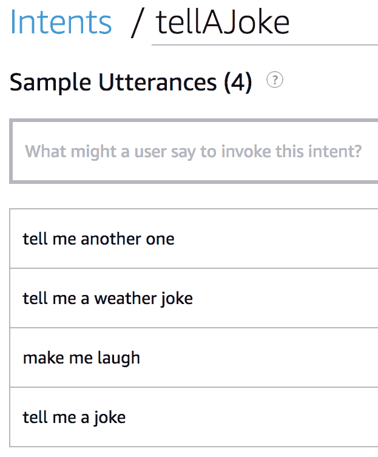

添加讲笑话的意图

这个意图的处理程序非常简单。它需要做的只是从笑话数组中随机获取一个笑话并告诉用户。我们使用`Math.floor(Math.random() * 3);`来获取一个小于 3 的随机整数。如果你想添加更多的笑话，只需将`3`改为你拥有的笑话数量：

```js
const JokeHandler = {
    canHandle(handlerInput) {
        return handlerInput.requestEnvelope.request.type === 'IntentRequest' &&
            handlerInput.requestEnvelope.request.intent.name === 'tellAJoke';
    },
    async handle(handlerInput) {
        let random = Math.floor(Math.random() * 3);
        let joke = jokes[random];
        return handlerInput.responseBuilder
            .speak(joke)
            .getResponse();
    }
};
```

更有趣的部分是创造笑话。我们需要先创建一个名为`jokes`的变量，它是一个数组。在这个数组中，我们可以放入一些与天气相关的笑话。我已经添加了前三个，但请随意添加你自己的（并移除我那些不太有趣的笑话）：

```js
let jokes = [
    `Where do snowmen keep their money? In a snow bank.`,
    `As we waited for a bus in the frosty weather, the woman next to me mentioned that she makes a lot of mistakes when texting in the cold. I nodded knowingly. It’s the early signs of typothermia.`,
    `Don’t knock the weather. If it didn’t change once in a while, nine tenths of the people couldn’t start a conversation.`
];
```

如果我们现在发布这个技能，那些笑话会比预期得更糟糕。我们首先想要修复的是时间。在笑点前添加断句标签可以使笑话变得更好：

```js
let jokes = [
    `Where do snowmen keep their money? <break time="2s" /> In a snow bank.`,
    `As we waited for a bus in the frosty weather, the woman next to me mentioned that she makes a lot of mistakes when texting in the cold. I nodded knowingly. <break time="1s" /> It’s the early signs of typothermia.`,
   `Don’t knock the weather. <break time="1s" /> If it didn’t change once in a while, nine tenths of the people couldn’t start a conversation.`
];
```

精确的时间可能并不完美，但它们已经比之前好得多。讲好笑话的另一个关键是你在某些词上所加的强调。在 Alexa 中为语音部分添加强调是通过将这些词包裹在`emphasis`标签中实现的：

```js
`This sentence uses both <emphasis level="strong">increased</emphasis> and <emphasis level="reduced">decreased</emphasis> emphasis`;
```

在我们的笑话中添加`emphasis`标签，我们得到这个：

```js
let jokes = [
    `Where do snowmen keep their money? <break time="2s" /> In a <emphasis> snow bank </emphasis>`,
    `As we waited for a bus in the frosty weather, the woman next to me mentioned that she makes a lot of mistakes when texting in the cold. I nodded knowingly. <break time="1s" /> It’s the early signs of <emphasis> typothermia </emphasis>`,
```

```js
    `Don’t knock the weather. <break time="1s" /> If it didn’t change once in a while, nine tenths of the people <emphasis> couldn’t start a conversation</emphasis>`
];
```

当使用`emphasis`标签但没有提供级别时，默认使用*中等*级别。

有很多其他的 SSML 标签可以用来改变 Alexa 说响应的方式，它们可以在 Alexa SSML 页面找到（[`developer.amazon.com/docs/custom-skills/speech-synthesis-markup-language-ssml-reference.html`](https://developer.amazon.com/docs/custom-skills/speech-synthesis-markup-language-ssml-reference.html))。

# 测试

现在我们已经将这些更改添加到我们的 Lambda 中，我们可以构建并测试它。

测试 API 错误发生时会发生什么相当困难，但我们可以测试会话属性和 SSML。

会话属性可以通过询问后续问题来测试，我们期望从上一个问题中存储了一些数据。我们可以询问一个地点的预报，然后询问一个新的地点。日期应该已经保存在会话属性中，所以我们应该得到新地点的预报而不是当前天气。然后我们可以询问今天的天气，新的地点应该已经被保存，所以我们不应该被提示输入地点：

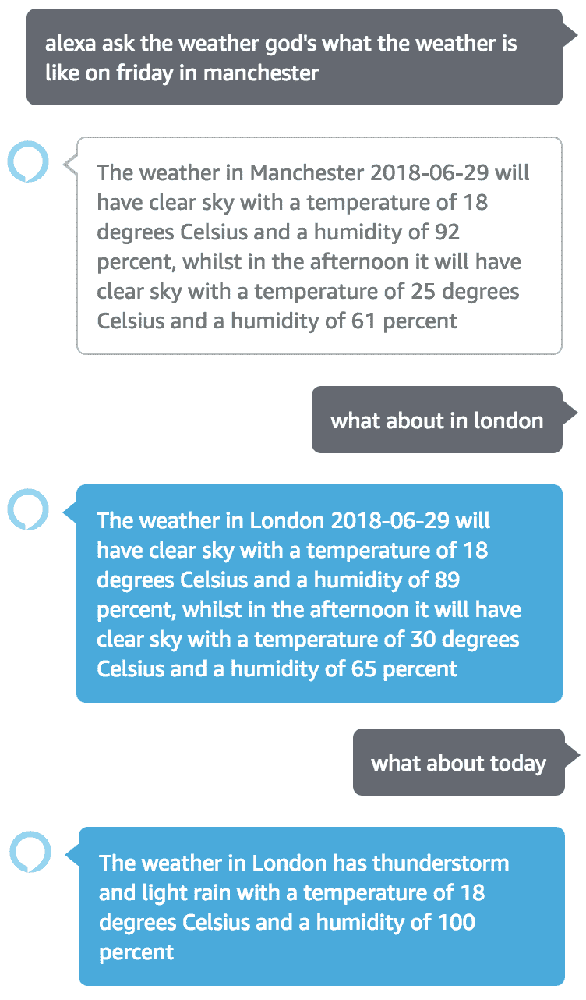

会话属性测试

我们也可以通过请求一个笑话来测试 SSML。你收到的笑话应该包含我们添加的停顿，可能还有一些强调。当你自己测试时，你将能够清楚地听到这些：

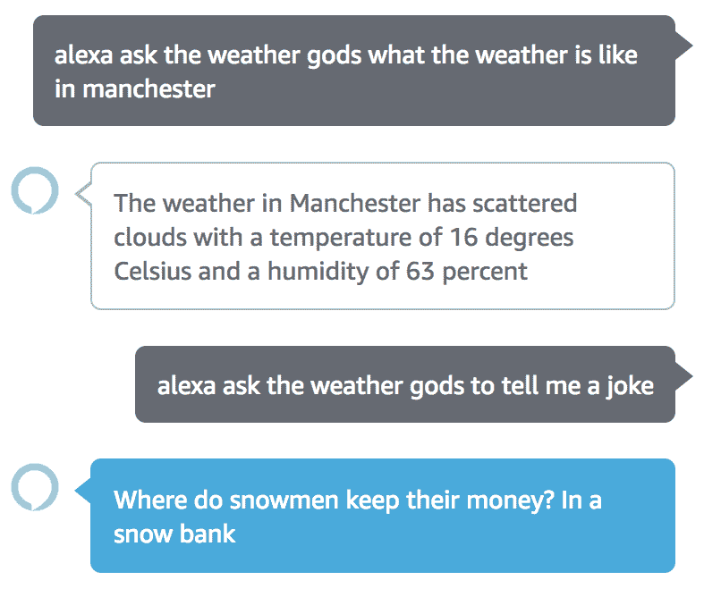

笑话

# 摘要

在本章中，我们介绍了如何使用外部 API 来增加聊天机器人可用的信息，从而让你能够创建更强大的技能。

然后，我们探讨了如何让用户体验更加愉快。我们采取了以下三种方式：

+   我们使用错误处理来减少用户请求不工作时产生的挫败感。

+   我们使用会话内存来记住关于对话的细节，这样我们就可以稍后使用它们。这阻止了我们每次用户没有提供所有信息时重复和提示用户。

+   我们使用 SSML 来修改 Alexa 说出我们响应的方式，使句子听起来更人性化。我们还使用 SSML 使笑话更有趣，但它可以用来强调要点或改变说话的语气。

# 问题

1.  什么是 API？

1.  Axios 与标准 HTTP 请求库有何不同？

1.  处理 `async` 和 `await` 错误的两种常见方法是什么？

1.  我们如何在会话属性中存储 *颜色*？

1.  可以在会话属性中存储哪些类型的数据？

1.  为什么你会使用 SSML？

# 进一步阅读

如果你想了解 *持久属性*，你可以在 ASK SDK 文档中阅读它们（[`ask-sdk-for-nodejs.readthedocs.io/en/latest/Managing-Attributes.html`](https://ask-sdk-for-nodejs.readthedocs.io/en/latest/Managing-Attributes.html)）。

要查看 Alexa 支持的完整 SSML 标签列表，请访问 Alexa SSML 参考页面（[`developer.amazon.com/docs/custom-skills/speech-synthesis-markup-language-ssml-reference.html`](https://developer.amazon.com/docs/custom-skills/speech-synthesis-markup-language-ssml-reference.html)）。

如果你想了解不同的 SSML 标签如何改变文本的朗读方式，请查看 Google SSML 参考页面（[`developers.google.com/actions/reference/ssml`](https://developers.google.com/actions/reference/ssml)）。它包含许多 SSML 的工作示例，但你不能编辑它们。
