# 构建您的第一个 Amazon Lex 聊天机器人

前两章仅关注 Amazon Alexa 和构建 Alexa 技能。接下来的三章将教你如何使用 Amazon Lex 构建聊天机器人。在本章中，我们将学习如何构建和测试一个 Lex 聊天机器人，然后我们将通过集成 S3 来提高难度。

Amazon Lex 与 Amazon Alexa 非常相似，但主要区别在于 Lex 被设计成主要用于文本交互。这意味着你可以使用 Lex 来为 Facebook messenger 机器人提供动力，为 Slack 添加功能，甚至向用户发送短信。这并不会阻止你使用 Lex 进行语音交互，并且它可以用来在 Amazon Alexa 生态系统之外构建基于语音的聊天机器人。

本章将涵盖以下主题：

+   使用槽和内置响应创建 Lex 聊天机器人

+   使用 Lambda 实现 FAQ 聊天机器人

+   从 S3 存储中检索答案

# 技术要求

在本章中，我们将为我们的技能创建一个 Lambda 函数，并使用我们在第二章，*AWS 和 Amazon CLI 入门*中创建的本地开发设置来创建和部署它。

本章所需的所有代码和数据都可以在[`bit.ly/chatbot-ch5`](http://bit.ly/chatbot-ch5)找到。

# 创建一个 Amazon Lex 聊天机器人

创建一个 Lex 聊天机器人与创建一个 Alexa 技能的过程非常相似。我们需要创建带有表述的意图，我们可以在这些意图上设置带有槽类型的槽，然后我们可以构建一个对用户的响应。尽管 Lex 和 Alexa 非常相似，但它们之间有一些关键的区别，我们将在本章中探讨。

# 设置聊天机器人

要开始创建我们的第一个 Lex 聊天机器人，我们需要打开 AWS 控制台并搜索“Lex”。一旦进入 Lex 页面，点击“开始”以进入机器人设置页面。您将看到使用三个样本机器人之一或创建自定义机器人的选项。我们将创建一个自定义机器人，因此请选择该选项。其他三个选项是样本机器人。这些机器人被构建来展示您可以使用 Lex 聊天机器人实现的应用程序：

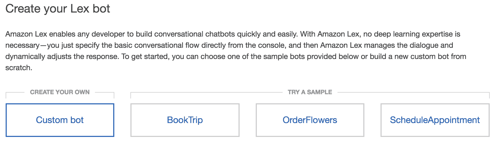

机器人创建选项

在选择了自定义机器人后，我们可以为我们的机器人命名并设置一些其他设置。所有这些设置都可以稍后编辑，因此我们可以从一些默认设置开始。

为您的聊天机器人选择一个声音。如果您想为基于语音的聊天机器人设置 Lex 机器人，这将使用该声音。由于我们将仅使用 Lex 进行基于文本的交互，我们可以选择“无”。我们将构建一个基于文本的应用程序，但您仍然应该选择一个声音，以便您可以进行语音测试。

最后两部分是设置超时；我们可以使用默认的 5 分钟，并选择“否”回答 COPPA 问题。如果你想创建一个与儿童交谈的聊天机器人，勾选“是”将阻止 Lex 存储任何对话，以符合儿童在线隐私保护法。现在我们已经完成了设置，我们可以点击“创建”。这将带我们到 Lex 仪表板：

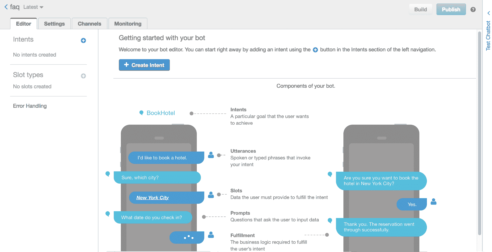

Lex 仪表板

创建 Lex 聊天机器人的组件和过程与创建 Alexa 技能的过程非常相似。它们都有意图、话语、槽位和槽位类型，其中大多数的创建几乎与在 Alexa 中的创建相同。

# 创建意图

我们首先想做的事情是创建意图。与 Alexa 不同，我们有创建意图、导入意图或搜索现有意图的选项。由于这是我们 Lex 中的第一个意图，我们需要创建意图。我们将被提示为新意图输入一个名称；我们应该将我们的第一个意图命名为`sayHello`：

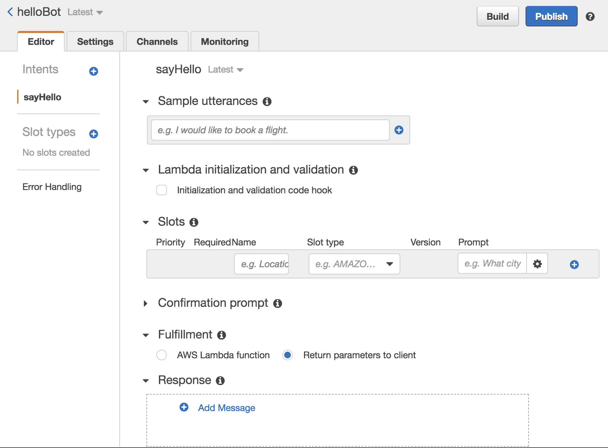

意图屏幕

首先，我们需要添加话语，以便用户可以触发意图。我们可以添加`hi`、`hey`和`hello`这些话语。这些话语不区分大小写，添加逗号和句号等标点符号是不必要的，尽管可以接受撇号。

Lex 与 Alexa 之间最大的不同之一是我们可以在不需要 Lambda 的情况下发送响应。滚动到页面底部，你会看到满足和响应部分。满足部分让你决定是否将此意图发送到 Lambda。目前，我们将保持将此选项设置为返回参数给客户端。

在响应部分，我们可以告诉 Lex 向用户发送什么信息。点击“添加消息”按钮，将出现一个消息块。在文本区域，我们可以输入我们想要发送给用户的响应。添加一个响应短语，例如`Hi there`，然后按*Enter*。与话语不同，响应是区分大小写的，可以包含你想要的任何标点符号：

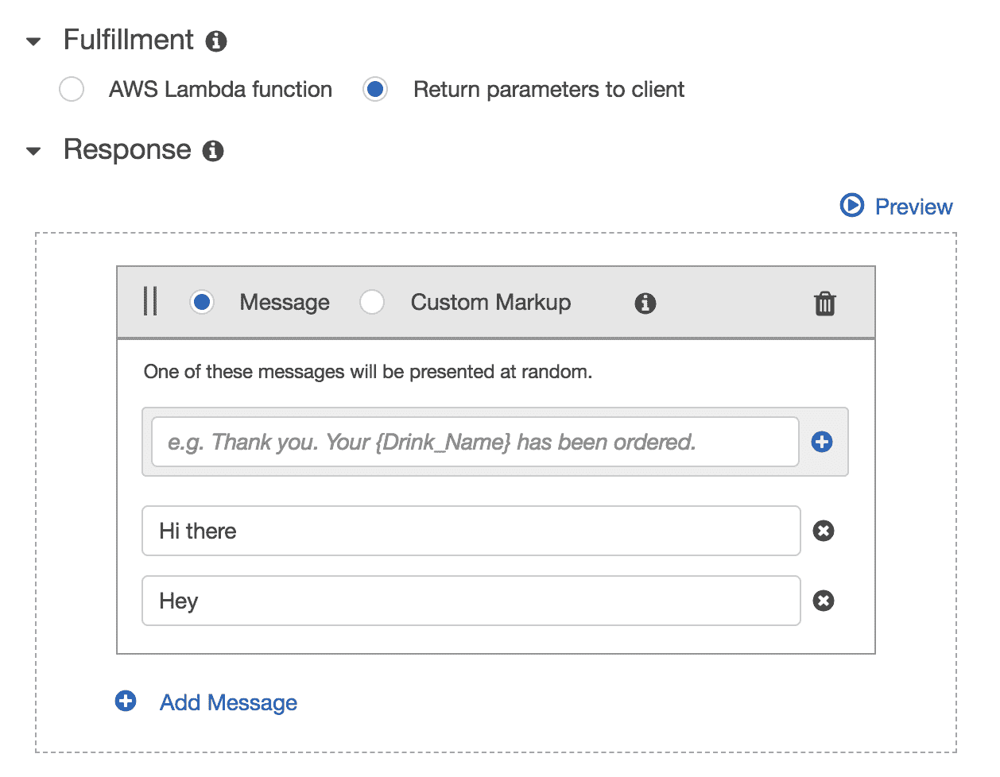

满足和响应

我们实际上可以添加多个响应消息，Lex 会随机选择其中之一。这使得与聊天机器人的多次互动感觉更自然，更不机械。

完成话语和响应后，我们可以通过意图底部的“保存意图”按钮保存意图。一旦保存，我们就可以构建我们的聊天机器人。

构建聊天机器人需要将你的意图中的所有话语添加到语言模型中。点击屏幕右上角的“构建”按钮，等待系统将聊天机器人组合起来。

# 测试你的聊天机器人

当 Lex 完成构建后，您将收到通知，屏幕右侧将打开一个新的测试机器人部分。这是一个基本的文本聊天界面，您可以在这里尝试您的机器人。尝试在聊天中输入“嗨”，您应该得到“嗨，”或“嘿：”的响应。

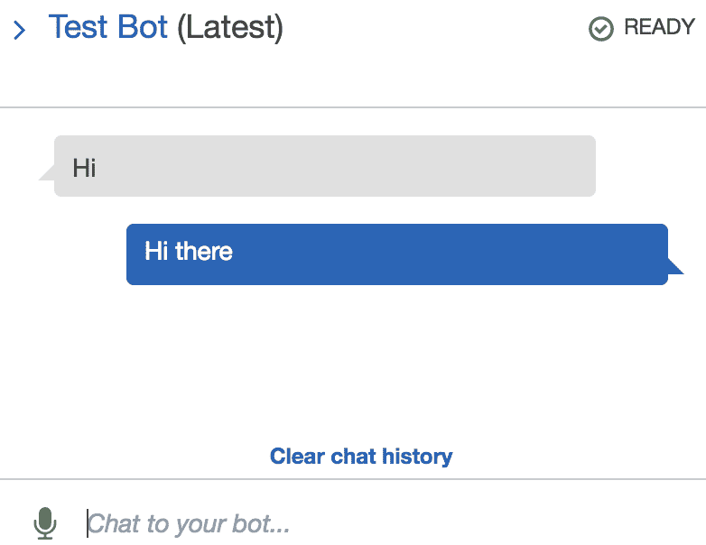

初始测试

如果没有，请检查您是否已添加了话语和响应，并重新构建聊天机器人。

您也可以通过与其对话来测试您的机器人。点击麦克风符号，说出“你好”，然后再次点击麦克风。您应该能看到您说的话，并获得语音响应以及文本响应。如果您收到关于未选择声音的错误，请转到设置 | 通用并更改输出声音。

# 发布您的机器人

使用一个工作聊天机器人，我们可以发布机器人。点击发布按钮会弹出一个窗口，我们可以选择要发布的别名。这在您想测试机器人新版本是否完全功能而不替换现有实时版本时很有用。您可以创建一个开发或测试别名，而不会覆盖现有的生产机器人：

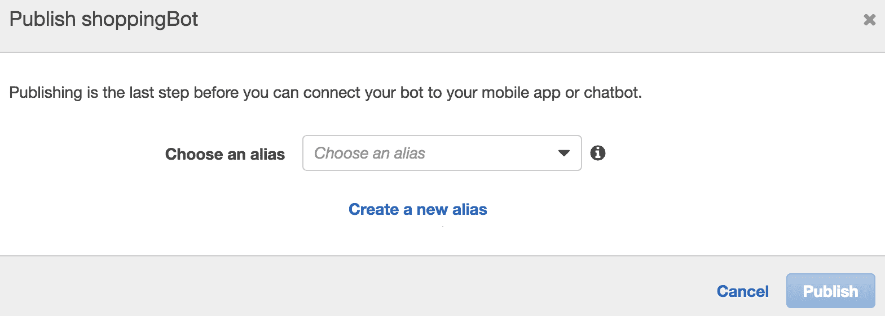

发布您的机器人

一旦发布完成，您就可以从其他服务访问这个新的别名。

# 使用槽位

正如我们与 Alexa 所看到的那样，有一个固定的响应是可以的，但使用槽位来自定义交互会更好。进入 sayHello 意图界面，向下滚动到槽位。这与 Alexa 中的槽位配置相同。

给您想要获取的槽位起一个名字；在这种情况下，我们可以要求他们提供他们的名字，所以我们称这个槽位为`usersName`。我们必须选择一个槽位类型，我们可以选择 GB_FIRST_NAME 或 US_FIRST_NAME。最后一件我们需要做的事情是配置提示。输入一个将引导他们输入名字的问题，例如“你叫什么名字？”。要添加这个槽位，我们需要点击行末的蓝色加号按钮。

当我们看到创建的新行时，我们可以检查是否勾选了“必需”复选框，这样 Lex 就知道要询问用户这个槽位：

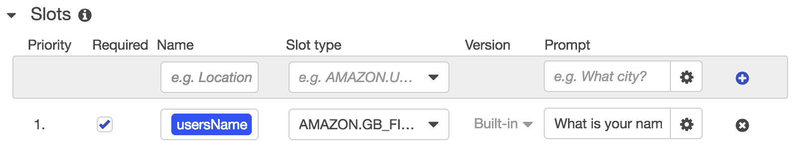

槽位创建

现在我们有了槽位，我们需要在我们的响应中使用答案。要将槽位添加到响应中，我们可以将槽位名称用大括号括起来。这意味着我们的响应变为“嗨，{usersName}”。

我们现在可以再次保存这个意图并重新构建聊天机器人。现在我们得到一个稍微长一点的对话：

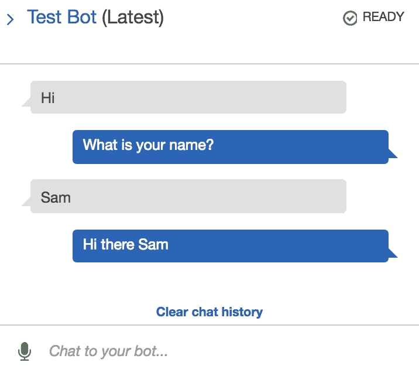

测试带名字

# 创建一个 FAQ 聊天机器人

现在我们已经学会了如何制作 Lex 聊天机器人，我们可以开始构建一些更可能在现实世界中看到的机器人。FAQ 聊天机器人越来越受欢迎；它们相对简单易创建，是向网站或 Facebook 群组介绍聊天机器人的好方法。

要开始创建 FAQ 聊天机器人，我们需要找到一个 FAQ 页面作为基础。现在大多数公司网站都有 FAQ 页面，所以你可以找到一个你感兴趣公司的 FAQ 页面，或者跟随我在 CircleLoop（[circleloop.com](https://www.circleloop.com/)）上的操作。这个网站被选中是因为我在那里工作，并且它将问题分为三组。如果你只是练习，你可以使用任何网站，但如果你想发布你的聊天机器人，请请求公司的许可。你永远不知道，他们最终可能会为此支付你费用！

CircleLoop 也很好，因为它总共有 24 个问题，这是一个很好的数量——太多的话会花费很长时间，Lex 可能会混淆类似的问题。

# 设置 Lex

正如我们在本章的前半部分所做的那样，我们需要创建一个新的 Lex 聊天机器人。在 Lex 控制台页面上，将有一个所有 Lex 聊天机器人的列表，在其上方将有一个创建按钮。

按照之前的过程，选择自定义机器人，给你的聊天机器人命名，选择声音，选择五分钟的超时时间，并对于 COPPA 问题选择*否*。如果你正在制作一个为 13 岁以下儿童设计的聊天机器人，你应该研究 COPPA 并根据你的答案进行修改。

# 收集数据

本节的所有数据文件都可在`data`文件夹中的[`bit.ly/chatbot-ch5`](https://bit.ly/chatbot-ch5)找到，但如果你使用的是自己的公司，你必须按照你公司的常见问题解答（FAQ）流程进行。

在我们开始创建意图之前，我们需要获取我们将要使用的数据。前往你选择的常见问题解答（FAQ）页面，并打开一个名为`faq-setup.json`的新文件。

此文件将包含一组意图和答案，格式如下：

```js
{
     "intentName1": "This is the answer to question 1",
     "intentName2": "You do this by selecting 'A' and then pressing 'START'"
     ...
 }
```

意图名称应该是描述问题所询问内容的唯一字符串。例如，如果你问“公司在哪里？”你可能将意图命名为`companyLocation`。

遍历网站中“设置与使用 CircleLoop”部分的全部问题。为“用户与数字”和“其他问题”部分使用新文件重复此过程。你应该最终得到包含网站上所有答案的三个 JSON 文件。以下是`faq-setup.json`文件中的一个部分：

```js
{
    "howItWorks": "CircleLoop is a cloud-based business phone system, which allows ... settings.",
    "technicalKnowledge": "No. We’ve made it really easy with our simple apps. As long as ... and you’re ready to go.",
    ...
    "sevenDayTrial": "Full user privileges, including the ability to add users ... during your trial period."
}
```

我们现在将这三个文件上传到 S3 存储桶，以便我们的 Lambda 函数可以访问它们。在你的 AWS 控制台中，导航到 S3 并点击创建存储桶。给你的存储桶起一个独特的名字并继续配置。对于这个项目，我们不需要为此存储桶添加任何额外的权限：

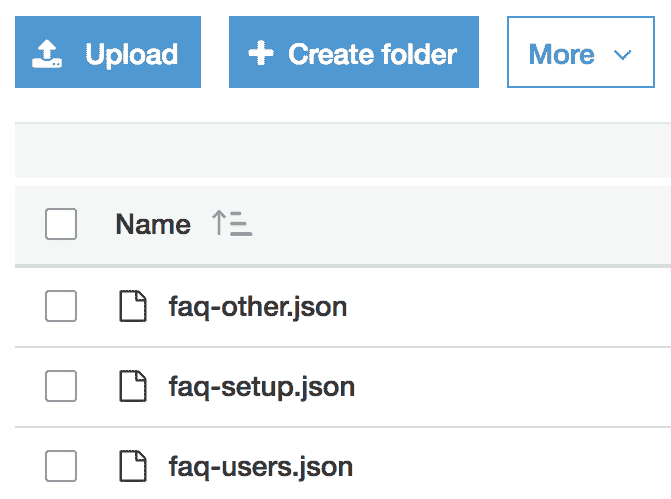

上传文件

现在我们已经创建了存储桶，我们可以上传我们的 FAQ 文件。点击进入你刚创建的存储桶，然后点击上传按钮。同样，我们不需要从默认设置更改任何权限。

# 创建意图

一旦我们创建并上传了 JSON 文件，我们需要创建意图以匹配它们。检查您的 JSON 文件，并为每一行创建一个新的意图。意图名称必须与 JSON 文件对象中的键完全相同。然后，您可以使用 FAQ 页面的问题作为该意图的第一个表述：

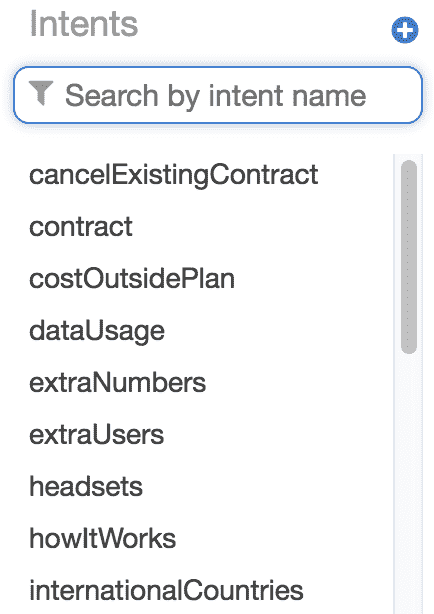

意图

到此过程结束时，你应该有与你的 JSON 文件中的行数一样多的意图。然后你应该为每个意图添加更多的表述。这些新的表述应该是相同问题的其他表述方式。扩展表述列表增加了用户获得正确答案的机会。

# 创建 Lambda 处理器

现在我们有了意图——捕捉用户的表述——我们需要创建发送给用户的响应。因为我们有三个文件，所以我们可以创建三个 Lambda。

每个 Lambda 将处理一个部分的问题。

在您的主 Lambda 文件夹中创建三个文件夹，分别命名为 `CL-setup`、`CL-users` 和 `CL-other`。在每个文件夹中创建一个 `index.js` 文件。打开 `CL-setup` 中的 `index.js` 文件，我们可以开始编写处理器，从一个空的处理器开始：

```js
exports.handler = async event => {
};
```

首先，我们需要找出哪个意图触发了 Lambda。Lex 收到的数据结构与 Alexa 收到的数据结构略有不同：

```js
let intentName = event.currentIntent.name;
```

现在我们有了意图名称，我们需要向 S3 发送请求以获取包含答案的文件。正如我们在第三章，*创建您的第一个 Alexa 技能*中所做的那样，我们首先需要在 AWS 中要求并创建一个新的 S3 实例。在文件顶部，在 `exports.handler` 之前添加此代码：

```js
const AWS = require('aws-sdk');
const s3 = new AWS.S3();
```

要向 S3 发送请求，我们需要传递一些查询参数。这是一个包含我们的对象所在的 `Bucket` 和我们想要的对象的 `Key` 的对象。

由于我们使用的是 Node 8.10 和 `async` 函数，我们需要返回一个承诺值。这意味着我们需要创建一个新的 `Promise` 并然后解析和拒绝我们的结果。回到我们的处理器函数中，我们可以添加此代码。与第三章，*创建您的第一个 Alexa 技能*不同，我们可以为这个 Lambda 将 `Key` 设置为一个固定的值 `faq-setup.json`，因为这个 Lambda 只会被 *设置和使用 CircleLoop* 部分的问题调用：

```js
var params = {
    Bucket: 'cl-faq',
    Key: `faq-setup.json`
};

return new Promise((resolve, reject) => {
    // do something
    resolve(success);
    reject(failure);
})
```

我们可以将我们的 `s3.getObject()` 代码放在这个 `Promise` 中，以便在 `handleS3Data()` 被解析时执行，在 `handleS3Error()` 被拒绝时执行：

```js
return new Promise((resolve, reject) => {
    s3.getObject(params, function(err, data) {
        if (err) { // an error occurred
            reject(handleS3Error(err));
        } else { // successful response
            console.log(data);
            resolve(handleS3Data(data, intentName));
        }
    });
})
```

我们现在需要创建两个用于 S3 响应的处理程序。这些函数可以在处理器之后创建：

```js
const handleS3Error = err => {
}

const handleS3Data = (data, intentName) => {
}
```

我们将首先创建数据处理器。在这里，我们首先需要解析数据的主体。这是因为它以 *buffer* 的形式下来，在我们能够处理它之前需要将其转换为 JSON：

```js
let body = JSON.parse(data.Body);
```

在 JSON 格式的数据中，我们现在可以检查`intentName`是否是对象中的一个键。如果不是，我们需要返回`handleS3Error`函数来发送错误消息给用户：

```js
if (!body[intentName]){
    return handleS3Error(`Intent name ${intentName} was not present in faq-setup.json`);
}
```

在`handleS3Error`中，我们可以`console.log`错误并创建一个错误响应字符串。这应该告诉用户发生了错误，并要求他们尝试再问一个问题：

```js
console.log('error of: ', err);
let errResponse = `Unfortunately I don't know how to answer that. Is there anything else I can help you with?`;
```

# 创建响应

在 Lex 中创建响应的方式与在 Alexa 中创建的方式非常不同。在 Lex 中，需要遵循一个对象结构：

```js
sessionAttributes: {},
dialogAction: {
    type: '',
    fulfillmentState: '',
    slots: {},
    slotToElicit: '',
    message: { contentType: 'PlainText', content:  ''};
}
```

因为这是一段我们可能会多次使用的代码，我们可以为每种类型创建函数。这里是一个用于完成对话流程最后阶段的函数。这个函数可以被添加到`index.js`文件的底部：

```js
const lexClose = ({ message, sessionAttributes = {}, fulfillmentState = "Fulfilled"}) => {
    return {
        sessionAttributes,
        dialogAction: {
            type: 'Close',
            fulfillmentState,
            message: { contentType: 'PlainText', content: message }
        }
    }
}
```

这个函数使用默认值`sessionAttributes`和`fulfillmentState`，因为我们大多数情况下不会设置它们，但如果我们想设置的话，这也是好的。

使用这个新函数，我们现在可以在我们的处理函数中创建响应。在我们的`handleS3Data`函数内部，我们可以返回这个`lexClose`函数，将文件中的答案作为消息：

```js
return lexClose({ message: body[intentName] });
```

我们还需要在文件底部创建一个`lexElicitIntent`函数，以便当我们告诉用户再问一个问题的时候使用。这告诉 Lex 它应该期待一个意图表述作为其下一条消息：

```js
const lexElicitIntent = ({ message, sessionAttributes = {} } ) => {
    return {
        sessionAttributes,
        dialogAction: {
            type: 'ElicitIntent',
            message: { contentType: 'PlainText', content: message }
        },
    };
}
```

然后，这个`lexElicitIntent`可以在`handleS3Error`函数的末尾返回，告诉用户再问一个问题：

```js
return lexElicitIntent({ message: errResponse });
```

这个文件可以被复制到其他两个文件夹中。我们只需要更改 params 对象中的`key`和错误控制台日志中的文本以及响应。做出这些更改后，我们可以使用我们的构建脚本来部署我们的三个 Lambdas。

部署了所有三个 Lambdas 之后，我们需要确保它们的角色包括访问 S3 存储桶的权限。在每一个 Lambdas 中，向下滚动到角色部分，我们应该能看到 lambdaBasic 的角色。我们应该在第三章，*创建您的第一个 Alexa 技能*中更新了这一点，但我们应该再次检查。导航到 IAM 服务并确保 lambdaBasic 有 S3 读取权限。如果没有，那么将 AmazonS3ReadOnlyAcess 附加到这个角色上。

# Lambda 满足

我们可以使用 Lambdas 来创建我们意图的响应。这比仅仅有一个文本响应给我们更多的控制。Lex 的伟大之处在于每个意图都可以有自己的 Lambda 处理程序，或者多个意图可以共享一个 Lambda。

部署了三个 Lambdas 之后，我们可以使用它们来满足意图。我们将把所有关于设置的意图都共享给`CL-setup` Lambda，所有关于用户和数字的意图都共享给`CL-users` Lambda，所有其他问题都共享给`CL-other` Lambda。

打开你的 Lambda 控制台并进入你的 FAQ 聊天机器人。打开一个意图并滚动到满足部分。

有两种选择：

+   AWS Lambda 函数

+   返回参数给客户端

由于我们已经创建了 Lambdas，我们可以选择 AWS Lambda 函数，这为我们打开了更多的菜单项供我们选择。主要的一个是 Lambda 下拉菜单，我们可以从中选择哪个 Lambda 会在意图满足时被触发：

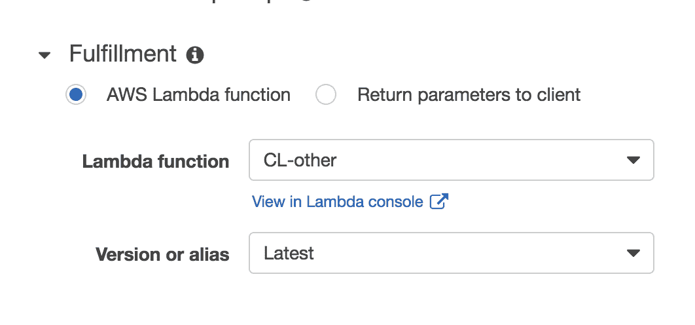

Intent fulfillment options

选择 Lambda 之后，我们需要保存意图并继续下一个意图。这需要在聊天机器人中的每个意图上完成，确保将正确的意图发送到正确的 Lambda。

# Building and testing

当所有意图都指向一个 fulfillment Lambda 时，我们可以构建我们的聊天机器人，然后测试它。点击屏幕右上角的构建按钮，等待构建过程停止。这可能需要几分钟，当构建过程结束时，*测试*部分将打开。

要测试我们的聊天机器人，输入一个问题，你应该会收到正确的答案：

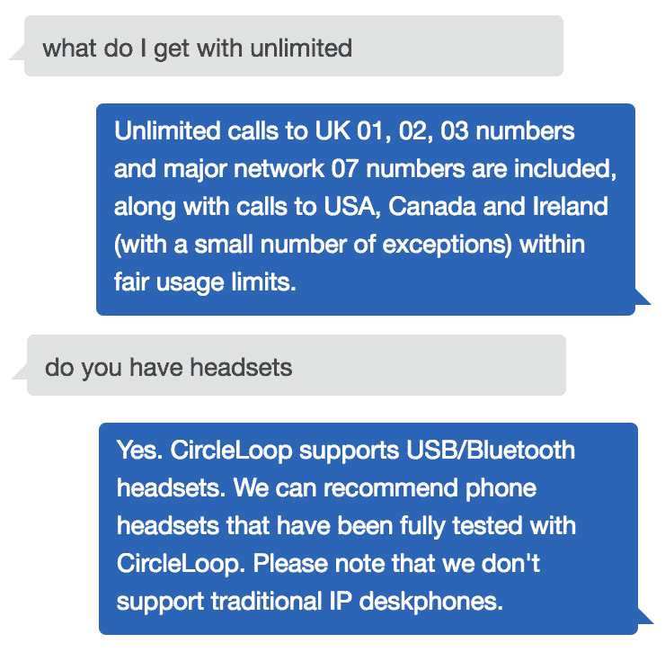

FAQ tests

如果你没有得到正确的答案，或者完全没有得到错误，那么有几个地方需要检查：

+   查看 Lambda 日志并检查是否调用了正确的 Lambda。你也应该能看到一个包含错误信息的日志，这可以帮助你定位错误。

+   检查 Lambda 是否有权限访问 S3 存储桶。

+   请参考本书末尾的 Lambda 调试指南。

# Lex responses

我们刚刚看到了 Lex 可以返回的两种不同类型的响应。目前 Lex 可以处理五种不同类型的响应：

+   `elicitSlot`

+   `` `elicitIntent` ``

+   `confirmIntent`

+   `close`

+   `delegate`

这些都可以在`All-Lex-Responses.js`文件中的[`bit.ly/chatbot-ch5`](http://bit.ly/chatbot-ch5)找到。然后你可以将它们复制到你的未来项目中。

# elicitSlot

当你对 slot 值进行检查并发现其中一个值不正确时，`elicitSlot`响应类型非常有用。然后你可以要求用户重新输入该 slot 的值，并确保 Lex 将其存储在正确的 slot 中。

要调用`elicitSlot`，你需要传递一个消息、slots（一个包含所有 slots 和当前值的对象）、`slotToElicit`值和`intentName`：

```js
const lexElicitSlot = ({ sessionAttributes = {}, message, intentName, slotToElicit, slots }) => {
     return {
         sessionAttributes,
         dialogAction: {
             type: 'ElicitSlot',
             intentName,
             slots,
             slotToElicit,
             message: { contentType: 'PlainText', content: message }
         },
     };
 }
```

如果我们在 Lex 中重新构建了汽车助手机器人，当验证 slot 值时，我们会使用`lexElicitSlot`函数。如果有一个 slot 值不正确，我们会像这样调用这个函数：

```js
return lexElicitSlot({
     intentName: 'whichCar',
     slotToElicit: 'size',
     slots: {
         size: null,
         cost: 'value',
         doors: 5,
         gears: null
     }
 })
```

# elicitIntent

我们已经看到了这个 Lex 响应，它接受消息和会话属性。这通常用于继续对话或以新的意图重新开始：

```js
const lexElicitIntent = ({ message, sessionAttributes = {} } ) => {
    return {
        sessionAttributes,
        dialogAction: {
            type: 'ElicitIntent',
            message: { contentType: 'PlainText', content: message }
        },
    };
}
```

# confirmIntent

当你想询问用户是否想要做某事时，会使用`confirmIntent`响应。这可以在 FAQ 机器人的末尾使用，例如询问`Would you like to sign up?`，这将是一个`confirmIntent`响应，用于*signUp*意图。你需要传递`message`、`intentName`和该意图的`slots`。任何你不想预先填充的 slots 应该有一个值为`null`：

```js
const lexConfirmIntent = ({ sessionAttributes = {}, intentName, slots, message }) => {
    return {
        sessionAttributes,
        dialogAction: {
            type: 'ConfirmIntent',
            intentName,
            slots,
            message: { contentType: 'PlainText', content: message }
        },
    };
}
```

# close

这是 Lex 最简单且最常用的响应。您需要传递的唯一东西是 `message`：

```js
const lexClose = ({ sessionAttributes = {}, fulfillmentState = 'Fulfilled', message }) => {
     return {
         sessionAttributes,
         dialogAction: {
             type: 'Close',
             fulfillmentState,
             message: { contentType: 'PlainText', content: message }
         },
     };
 }
```

# 委派

`delegate` 响应是您希望 Lex 决定向用户发送什么内容的地方。这通常用于您已验证输入并且希望 Lex 请求下一个槽位或进入满足阶段。它只需要一个包含当前意图所有槽位的 `slots` 对象：

```js
const lexDelegate = ({ sessionAttributes = {}, slots }) => { 
    return { 
        sessionAttributes, 
        dialogAction: { type: 'Delegate', slots, }
    }; 
}
```

# 摘要

本章是 Amazon Lex 的介绍。你已经了解到 Lex 和 Alexa 在形式和功能上非常相似，但在构建方式和工作方式上存在一些差异。

我们现在可以创建一个具有意图、槽位和硬编码响应的 Lex 聊天机器人。然后我们可以通过创建 Lambda 来处理意图满足来增加其功能。Lex 相比于 Alexa 的一个优点是我们可以使用多个 Lambda 来处理不同的意图。为了帮助我们更容易地响应 Lex，我们创建了一个将值映射到正确响应格式的 `Lex` 类。

我们使用这些技能构建了一个从 S3 获取数据并用于生成响应的常见问题解答聊天机器人。

在下一章中，我们将利用本章所学，通过向聊天机器人添加数据库来构建在它之上。我们将使用 DynamoDB 存储有关聊天信息，使我们能够进行更真实的聊天机器人对话。

# 问题

1.  你能否在不使用 Lambda 的情况下创建一个 Lex 聊天机器人？

1.  你如何在 Lex 的响应中包含一个槽位？

1.  Lex 与 Alexa 在使用 Lambda 方面有何不同？

1.  Lex 处理多少种响应类型？

1.  你能全部列举出来吗？

1.  获取 S3 数据的函数名称是什么？
