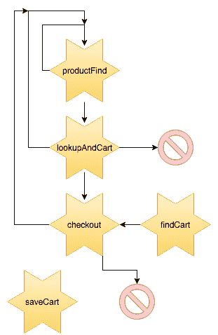
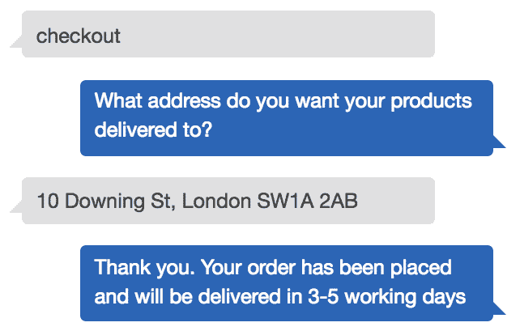

# 将 Lex Bot 连接到 DynamoDB

在阅读上一章后，我们知道如何创建 Lex 聊天机器人。现在我们可以开始构建一个引导用户通过更复杂流程的聊天机器人。设计和构建更大的聊天机器人更接近你可能会做的事情，我们将探讨最佳的设计和设置方法。

我们将使用我们的聊天机器人从 S3 获取数据，以及从 DynamoDB 表中获取和写入数据。这使我们能够持久化关于用户选择和流程进度的信息。

本章将涵盖以下主题：

+   为更大、更复杂的聊天机器人创建流程图

+   创建一个 Lex 聊天机器人来涵盖所有意图和流程

+   从 S3 存储桶中检索数据并在其上执行逻辑

+   创建一个 Dynamo 表并使用它来存储和检索信息

# 技术要求

在本章中，我们将为我们的技能创建一个 Lambda 函数，并使用我们在第二章 入门 AWS 和 Amazon CLI 中创建的本地开发设置来创建和部署它。

本章所需的全部代码和数据可以在 [`bit.ly/chatbot-ch6`](http://bit.ly/chatbot-ch6) 找到。

# 设计流程

在上一章中我们构建的 FAQ 聊天机器人不需要设计任何流程，因为一切都是简单的问题和答案。这个聊天机器人将更加复杂，具有多个流程，其中一些将引导到其他意图和流程。

# 完美的对话

和往常一样，我们可以从完美的对话开始构建流程图。这次的不同之处在于我们将有几个不同的对话。我们将有一些从询问库存到进行购买，其他一些在结账前停止，还有一些人甚至不会将任何东西添加到他们的购物车中。这些都是我们需要设计和构建的流程。

从头到尾进行对话是一个好主意。这里有一个这样的对话示例：


完整流程对话

我们还可以创建其他涉及流程一部分的对话。用户可以在他们的购物车中添加一些商品然后保存以备后用，而另一些用户在结账前会想要询问他们的购物车中有何物品。你可能已经看到，这些对话中的一些会有重叠。随着我们继续到流程图，这一点将变得更加明显。

# 流程图

由于这是一个大而复杂的对话，我们将把流程分成几个部分。这将使创建和可视化更容易。

完整对话的第一部分以及库存检查对话可以用来创建一个 `productFind` 流程图：


productFind 流程图

正如你所见，这里有一些逻辑与我们在第三章中使用的逻辑相似，在第三章中，我们讨论了如何创建你的第一个 Alexa 技能，即创建你的第一个 Alexa 技能。在这个流程结束时，我们知道用户在询问什么产品。

你可能在这个流程中注意到了一个新的符号。这个符号与`intentTrigger`类似，但这是用于启动另一个流程的。将整个流程分解成可以相互调用的较小块是保持图表组织最佳的方式：


启动另一个流程

现在我们知道用户在询问什么产品，我们可以创建一个检查库存并询问他们是否想将其添加到购物车的流程。这从请求 S3 开始，如果有库存并且他们想要，我们就将其添加到他们的 Dynamo 购物车中：


库存和购物车

这次对话的最后阶段是检查。这是获取一些关于用户的信息，以便我们可以下订单。这通常包括接受信用卡支付，但我们将不会在这个聊天机器人中这样做：


检查

我们将对话分解成多个较小的流程图的原因是，每个流程只做一件事情。这意味着我们可以将不同的流程连接起来。如果我们有一个知道项目 ID 的用户呢？我们可以让他们跳过`productFind`流程，直接从`lookupAndCart`流程开始。

当我们考虑其他一些对话时，我们最终会在主流程图中得到一个流程的网状结构：



主流程图

这个主流程图显示了每个子流程如何连接在一起，以映射任何对话。这个对话网使得聊天机器人能够以一种比老式聊天机器人更人性化的方式处理用户，老式聊天机器人只有一个用户必须遵循的路径。

# 构建聊天机器人

在所有子流程图和主流程图的基础上，我们可以开始构建聊天机器人。拥有这些子流程的另一个好处是，它们与意图非常相似。

在我们开始创建意图之前，我们需要设置我们的 Lex 机器人。在 Lex 控制台中，点击创建，然后按照第五章中描述的步骤创建自定义机器人，即*构建你的第一个 Amazon Lex 聊天机器人*。

# 产品查找

我们将从最常见的对话开始——查找产品。首先，我们将创建一个新的意图，称为`productFind`。

这个意图将处理想要将产品添加到购物车或只是检查库存水平的用户，因此我们需要提供表示这种意图的话语。我们还需要处理用户的话语，例如，“我想买一件新夹克”和“你们有库存的中号蓝色衬衫吗？”

为了捕获话语中的槽位值，我们可以在槽位名称周围使用花括号：


productFind 的表述

在创建了一些表述之后，我们需要创建槽位和槽位类型。对于`productFind`意图，我们需要相当多的槽位：`type`、`size`、`color`、`length`和`itemNumber`。前四个槽位是显而易见的，但`itemNumber`则不那么明显。

我们想包含一个项目编号槽位，这样如果客户想要购买他们已经拥有的产品，他们就不需要通过较长的问答式产品查找流程。这些小事情正是区分优秀机器人与卓越机器人的关键。

接下来，我们需要为每个槽位选择一个槽位类型。对于前四个槽位，我们需要创建自定义槽位：

+   **类型**：我们将销售三种类型的服装：衬衫、夹克和裤子（长裤）。

点击槽位类型旁边的+号并选择创建槽位类型。给你的槽位起一个像`clothingType`这样的名字，并选择限制到槽位值和同义词。在槽位类型命名时相对具体是一个好主意，因为你不能有两个同名槽位类型。

我们现在可以添加衬衫、夹克和裤子的值。然后我们需要添加用户可能会输入的同义词。例如，他们可能会用`blouse`、`top`或`t-shirt`代替`shirt`。对于`trousers`，他们可能会说`a pair of trousers`、`pants`或`a pair of pants`。将所有值的同义词都扩展到你想不出更多为止。

+   **尺寸**：尺寸的创建过程将与*类型*非常相似，具有*大*、*中*和*小*等值。如果这是一个真正的零售商，你会有更多的尺寸选项，并且可能基于物品类型提供尺寸选项。

确保为每个颜色值包含一些同义词。我们可以使用 AMAZON.Color 来表示颜色，但这将允许通过数百种颜色——为了使我们的工作更简单，我们将使用五种颜色。

创建一个包含*黑色*、*白色*、*红色*、*粉色*和*蓝色*等颜色的自定义槽位类型。你可以添加颜色的同义词，但更有可能他们只是说了一个我们不支持的色彩。

`长度`：长度的值有`long`、`standard`和`short`。确保添加任何你能想到的同义词，例如`medium`和`normal`作为标准的同义词。

+   **项目编号**：我们不需要为订单编号创建新的槽位类型，因为我们可以使用 AMAZON.NUMBER。如果我们想使用项目编号，例如*SH429178*，其中我们使用数字和字母，我们就必须使用自定义槽位类型：


完成的槽位

我们需要将所有槽位改为非必需。这是因为如果用户通过项目编号请求物品，我们不希望询问他们想要什么尺寸和颜色，因为物品已经有尺寸和颜色了。

# 创建 Lambda

处理此意图的 Lambda 需要做几件事情：

+   需要检查是否有项目编号或者所有正确的槽位都已填写。

+   然后它需要获取我们的 S3 库存数据并检查请求商品的库存水平。

+   如果有库存，它会询问用户是否想要将其添加到购物车。如果没有库存，它会告诉用户，并询问他们是否想要寻找另一个产品。

首先在`Lambdas`中创建一个名为`productFind`的新文件夹，并在其中创建一个`index.js`文件。`index.js`文件可以以我们的默认 Node 8.10 处理程序开始，并将事件传递给`handleProductFind`函数：

```js
exports.handler = async (event) => {
    return handleProductFind(event);
}
```

在`handleProductFind`函数内部，我们首先检查槽位值。首先检查的是`itemNumber`，因为如果这个槽位存在，我们就不需要检查其他任何槽位。之后，我们检查类型、尺寸和颜色，最后如果类型是`trousers`，再检查长度：

```js
const handleProductFind = event => {
    let { slots } = event.currentIntent;
    let { itemNumber, type, size, colour, length } = slots;

    if (itemNumber) return getItem(slots);
    // No item number so using normal product find
    if (!type) {
        let message = 'Are you looking for a shirt, jacket or trousers?';
        let intentName = 'productFind';
        let slotToElicit = 'type';
        return Lex.elicitSlot({ message, intentName, slotToElicit, slots })
    }
    ...
}
```

我们可以复制用于类型检查的代码，并重复用于`size`、`color`和`length`槽位，只需为每个测试更改`message`和`slotToElicit`。对于`length`检查，还需要进一步修改，以便它也检查`type`是否为`trousers`：

```js
if ( !length && type === 'trousers' ){ ... }
```

在最后的检查之后，我们可以调用一个函数来获取用户通过选择所选择的商品。我们需要传递槽位，以便我们可以根据用户的选择过滤商品：

```js
return getItem(slots);
```

在我们的`getItem()`函数中，我们需要做三件事：获取数据、过滤出与用户答案匹配的商品，并创建响应。

为了从 S3 获取所有库存数据，我们将创建一个`getStock()`函数。这将与之前我们发出的 S3 请求相同。然后我们可以将其作为`getItem()`函数的第一部分调用：

```js
const getStock = () => {
    var params = {
        Bucket: 'shopping-stock',
        Key: `stock.json`
    };

    return new Promise((resolve, reject) => {
        s3.getObject(params, function(err, data) {
            if (err) { // an error occurred
                reject(err)
            } else { // successful response
                resolve(JSON.parse(data.Body).stock)
            }
        });
    })
}
```

我们还需要引入`aws-sdk`并创建一个`s3`实例。在你的文件夹中运行`npm install --save aws-sdk`。将此代码放在文件顶部：

```js
const AWS = require('aws-sdk');
const s3 = new AWS.sS()'
```

现在我们有了数据，我们需要过滤出正确的商品。数组有一个非常有用的函数叫做`.find`。这个函数将遍历数组中的每个商品，并对该商品执行一些代码。这将会一直发生，直到一个商品返回`true`，此时函数返回满足条件的商品。如果没有商品满足条件，则返回`undefined`。

我们可以使用这个方法来获取用户想要的商品。我们希望如果所有槽位的值与商品上的值匹配，或者`itemNumber`匹配，则返回`true`。我们还需要确保如果类型是`trousers`，则长度也要匹配：

```js
let matching = stock.find(item =>
    itemNumber === item.itemNumber ||
    type == item.type &&
    size == item.size &&
    colour == item.colour &&
    (item.length == length || item.type != 'trousers'));
```

之后，我们预计将只有一个商品。如果没有，要么是我们创建函数的方式不正确，要么是数据有误。无论如何，我们需要告诉用户我们没有找到他们正在寻找的商品：

```js
if (!matching) {
    let message = `Unfortunately we couldn't find the item you were looking for`;
    return Lex.Close({ message })
}
```

如果我们找到了一个商品，但没有库存，那么我们可以告诉用户，并询问他们是否想要寻找另一个产品。这意味着我们将使用`confirmIntent` Lex 响应。此响应需要一个`intentName`、一个`message`以及包含所有具有值或`null`的槽位的`slots`对象：

```js
if (matching.stock < 1) {
    let message = `Unfortunately we don't have anything matching your request in stock. Would you like to search again?`;
    let intentName = 'productFind';
    slots = { type: null, size: null, colour: null, length: null, itemNumber: null };
    return Lex.confirmIntent({ intentName, slots, message })
}
```

如果我们找到了产品并且有库存，那么我们需要告诉用户我们有多少库存。我们必须处理的一个棘手问题是类型的复数形式。如果我们找到多个 *shirt*，它们被称为 *shirts*；当用户选择了 *trousers* 时，我们可能有一 *pair of trousers* 或多 *pairs of trousers*。为了避免使消息字符串变得过于复杂，我们可以创建一个函数，该函数接受类型和库存并返回正确的单位名称：

```js
const units = (type, stock) => {
    if (type === 'trousers') {
        return `pair${stock !== 1 ? 's': ''} of trousers`
    }
    return `${type}${stock !== 1 ? 's': ''}`;
}
```

这意味着我们可以为用户创建一个更整洁的消息。我们将询问的消息将是他们是否想要将此项目添加到他们的购物篮中。我们可以使用另一个具有 `intentName` 为 `addToBasket` 且槽位设置为 `matching.itemNumber` 的 `confirmIntent` 响应：

```js
let message = `There are ${matching.stock} ${matching.colour} ${units(matching.type, matching.stock)} in stock. Would you like to add one to your basket?`;
let intentName = 'addToBasket';
slots = { itemNumber: matching.itemNumber };
return Lex.confirmIntent({ intentName, slots, message });
```

在整个 Lambda 中，我们使用了大量的 `Lex.something` 响应。这些是 `Lex` 类上的方法。为了使这些方法工作，我们需要创建一个名为 `Lex` 的新类，它包含我们在上一章中讨论的所有 Lex 响应。

创建一个名为 `LexResponses.js` 的新文件，然后我们在其中创建我们的类：

```js
module.exports = class Lex {
    ElicitSlot({ sessionAttributes = {}, message, intentName, slotToElicit, slots }) { ... }
    Close({ message, sessionAttributes = {}, fulfillmentState = "Fulfilled" }) { ... }
    ElicitIntent({ message, sessionAttributes = {} }) { ... }
    confirmIntent({ sessionAttributes = {}, intentName, slots, message }) { ... }
    delegate({ sessionAttributes = {}, slots }) { ... }
}
```

我们从这些方法返回的对象可以在上一章的末尾找到，或者完整的 `LexResponses.js` 文件可以在 [bit.ly/chatbot-ch6](http://bit.ly/chatbot-ch6) 找到。

然后，我们需要在这个文件中引入这个类并创建这个类的新实例。在 `productFind`/`index.js` 文件的顶部，添加这两行代码。第一行在第二行创建这个类的新实例之前，从我们的 `LexResponses` 文件中引入我们的 `Lex` 类：

```js
const lex = require('./LexResponses);
const Lex = new lex();
```

在这个 Lambda 的早期，我们写道，如果没有库存，我们将使用 `confirmIntent` 询问用户是否想要使用 `confirmIntent` 查找另一个订单。这个 `confirmIntent` 响应将调用我们的同一个 Lambda，但调用格式会有所不同。我们需要寻找这些不同的请求并相应地处理它们。

如果 Lambda 被调用为 `confirmIntent`，则 `event.currentIntent.confirmationStatus` 将有一个值为 `Confirmed` 或 `Denied`。如果用户拒绝问题（说“不”），则我们可以给他们一个告别消息并关闭消息。如果他们确认，我们可以让流程继续到 `handleProductFind()` 函数。以下代码需要在 `exports.handler` 函数中 `handleProductFind()` 函数之前添加：

```js
if (event.currentIntent && event.currentIntent.confirmationStatus) {
    let confirmationStatus = event.currentIntent.confirmationStatus;
    if (confirmationStatus == "Denied"){
        console.log('got denied status');
        let message = `Thank you for shopping with us today. Have a nice day`
        return Lex.close({message})
    }
    if (confirmationStatus == 'Confirmed'){
        console.log('got confirmed status');
    }
}
```

# 创建数据

为这个 Lambda 创建数据并不困难，但需要生成大量的数据。需要为每种颜色、尺寸和物品类型的组合以及每条需要短、标准或长长度的裤子创建一个记录。每一行都需要在一个带有 **stock** 键的数组中。

您可以下载完成的文件数据在 [bit.ly/chatbot-ch6](http://bit.ly/chatbot-ch6)。这个文件需要放入一个名为 `shopping-stock` 的新存储桶中，以便我们的 Lambda 可以访问它。正如前几章所述，我们不需要更改存储桶或文件的任何权限。

# Lambda 测试

要测试这个 Lambda，我们可以创建一些测试。这些测试应该测试所有场景：

+   所有正常槽位都已填写

+   只有 `itemNumber` 槽位已填写

+   缺少槽位值

+   `Denied` 确认状态

+   `Confirmed` 确认状态

我们需要使用四个测试来覆盖所有这些场景，因为我们可以在任何槽位填写场景中使用 `Confirmed` 进行测试。

在 Lex 控制台中，导航到 `productFind` Lambda，然后在页面顶部点击配置测试事件。我们可以测试的第一个测试事件是缺少槽位值。我们实际上可以不提供任何槽位值，并期望 Lambda 会要求我们选择衬衫、夹克或裤子。这是第一个测试的输入。为此测试命名并点击保存。当你点击测试时，你应该得到我们期望的成功响应格式：

```js
{
    "currentIntent": {
        "slots": {
            "type": null,
            "size": null,
            "colour": null,
            "length": null,
            "itemNumber": null
        }
    }
}
```

接下来，我们可以在一个测试中测试 `Confirmed` 确认状态以及所有槽位都已填写。点击下拉菜单并选择再次配置测试事件。这个测试对象现在在 `currentIntent` 对象上也有 `confirmationStatus`：

```js
{
    "currentIntent": {
        "slots": {
            "type": "shirt",
            "size": "medium",
            "colour": "blue",
            "length": null,
            "itemNumber": null
        },
        "confirmationStatus": "Confirmed"
    }
}
```

可以创建类似的测试来测试 `Denied` 请求和 `itemNumber` 请求。测试的确切代码可以在 `productFind` 代码文件夹中的 `tests` 文件中找到。

# 完成意图

现在我们有一个 Lambda 来实现这个意图，我们需要回到 Lex 并确保我们的意图正在触发这个 Lambda。正如 第五章，*构建您的第一个 Amazon Lex 聊天机器人*，滚动到意图的满足部分并选择 Lambda 满足。从下拉菜单中，我们可以选择我们新的 `productFind` Lambda。

保存意图，我们就可以继续下一步了。

# 添加到购物车

这个意图是一个简单的意图。如果用户说 `Yes` 添加项目到购物车，那么它就会将项目添加到 Dynamo 中的购物车，并询问他们是否想要结账或添加另一个项目。如果用户说 `No` 添加项目到购物车，那么它会询问用户是否想要寻找另一个产品。

在 Lex 中，我们需要创建一个名为 `addToCart` 的新意图，它有一个名为 `itemNumber` 的单个槽位。这个 `itemNumber` 槽位可以被设置为具有 AMAZON.NUMBER 槽位类型，因为我们已经使用简单的数字作为我们的项目编号。

正如我们在上一个 Lambda 中所做的那样，我们需要将此槽设置为 *非必需的*。如果我们要求槽，而用户在没有槽的情况下启动了意图，他们将被要求输入商品编号。大多数人不会通过商品编号来识别商品，因此他们不知道该输入什么。如果他们输入任何无效的内容，Lex 将会重新提示他们输入商品编号，直到他们猜对或者失败三次。我们希望能够检查是否存在商品编号，并在没有商品编号的情况下将他们发送到 `productFind`。

# 创建 Lambda

要启动此 Lambda，请在 `Lambda` 目录中创建一个名为 `addToCart` 的文件夹，并在其中创建一个 `index.js` 文件。在您的文件夹中，我们需要运行 `npm install --save aws-sdk` 以确保我们有权访问 AWS。我们像往常一样，从默认的 node 8.10 函数开始，在这个函数的开始，我们需要做两件事：检查是否存在 `Denied` 确认状态，并调用 `handleAddToCart` 函数。

如果确认状态是 `denied`，我们可以使用 `Lex.confirmIntent` 询问用户是否想要寻找另一个产品。我们已经编程了 `productFind` Lambda 来处理 `confirmIntent` 触发，所以它应该已经正常工作：

```js
exports.handler = async (event) => {
    if (event.currentIntent && event.currentIntent.confirmationStatus === "Denied"){
        let message = `Would you like to find another product?`;
        let intentName = 'productFind';
        let slots = { type: null, size: null, colour: null, length: null, itemNumber: null };
        return Lex.confirmIntent({ intentName, slots, message })
    }
    return handleAddToCart(event);
}
```

由于我们正在使用与 `productFind` 中相同的 `Lex.confirmIntent` 函数，我们需要将 `LexResponses.js` 文件复制到这个文件夹中，并将此代码添加到文件的顶部：

```js
const lex = require('./LexResponses');
const Lex = new lex();
```

确认状态处理完毕后，我们可以专注于将商品添加到购物车中。我们需要创建 `handleAddToCart` 函数；这个函数需要做的第一件事是检查我们是否有 `itemNumber`。这个检查将与我们的 `productFind` Lambda 开始时的检查非常相似，只是缺少 `itemNumber` 将在 `productFind` 上触发 `confirmIntent`：

```js
const handleAddToCart = async event => {
    let { slots } = event.currentIntent;
    let { itemNumber } = slots;

    if (!itemNumber) {
        let message = `You need to select a product before adding it to a cart. Would you like to find another product?`;
        let intentName = 'productFind';
        slots = { type: null, size: null, colour: null, length: null, itemNumber: null };
        return Lex.confirmIntent({ intentName, slots, message })
    }
}
```

如果有商品编号，那么我们需要将商品添加到用户的购物车中。接下来，我们将创建一个新的类，称为 `DB`，这样我们就可以发出请求，但现在我们可以假设这些方法存在。

要将商品添加到用户的购物车中，我们需要检查用户是否已经有了购物车。如果没有，请求将出错，我们需要为他们创建一个新的购物车。我们正在使用与我们在 第四章 中讨论的相同的 *to* 错误捕获方法，即 *将您的 Alexa 技能连接到外部 API*，用于错误处理。

`shopping-cart` 表将包含四个键：

+   ID 是会话 ID 的字符串

+   商品列表是一个 `itemNumbers` 的列表

+   `name` 是您可以给您的购物车起的名字以保存它

+   TTL 是数据的 *生存时间*

TTL 用于在设定的时间自动删除记录。这有助于保持数据库的清洁，并且当您必须处理数据保护时非常有用。

我们可以尝试使用`DB.get`从数据库中获取一个记录，我们将在本节稍后创建它。如果它返回一个值，我们可以将其用作现有购物车。如果没有`cartUser`，我们将创建一个默认购物车。为了确保名称是唯一的，我们将使用 UUID（通用唯一标识符），将`name`设置为`uuidv4()`：

```js
let [err, cartUser] = await to(DB.get('ID', event.userId, 'shopping-cart'));
if (!cartUser) {
    cartUser = { ID: event.userId, Items: [], name: uuidv4(), TTL: 0 }
}
```

为了让这个功能正常工作，我们需要在 Lambda 文件夹中运行`npm install --save uuid`。然后我们需要在`index.js`文件的顶部包含这一行：

```js
const uuidv4 = require('uuid/v4');
```

现在我们为新的和现有的购物车都有一个`cartUser`的值。为了更新这个购物车行，我们可以使用`spread`操作符。这个操作符接受一个对象或数组，并将值扩展到新的对象或数组中。任何在扩展之后的值可以覆盖`spread`中的值：

```js
let updatedCart = { ...cartUser, Items: [...cartUser.Items, itemNumber], TTL: Date.now() + 7 * 24 * 60 * 60 * 1000 };
```

这行代码将之前的购物车，添加一个新的项目编号到`Items`列表，并将*生存时间*更改为从现在开始的`7`天。

在更新了购物车之后，我们需要将其写入表中。如果写入表时发生错误，我们需要使用`Lex.close`告诉用户：

```js
let [writeErr, res] = await to(DB.write(event.userId, updatedCart, 'shopping-cart'));
if (writeErr) {
    let message = `Unfortunately we've had an error on our system and we can't add this to your cart.`
    return Lex.close({ message });
}
```

如果将项目添加到购物车成功，我们可以询问用户他们是否想要添加另一个产品、结账或保存购物车。与询问他们是否想要寻找另一个产品或添加此项目到购物车不同，这不是一个*是/否*问题。他们应该回答“我想结账”、“我想保存我的购物车”或“我想添加另一个项目”，我们将这些设置为`checkout`、`saveCart`和`productFind`意图的示例话语。

因为我们试图找出用户想要使用哪个意图，我们可以向 Lex 发送一个`elicitIntent`响应：

```js
let message = `Would you like to checkout, add another item to your cart or save your cart for later?`;
return Lex.elicitIntent({ message });
```

# DynamoDB

如我们之前所述，我们将使用 DynamoDB 来存储购物车信息。我们将有两个 Dynamo 表，一个用于当前购物车，另一个用于已下订单。为了创建这些表，我们需要进入 AWS 控制台并导航到`DynamoDB`服务：


DynamoDB 控制台页面

点击创建表以开始创建一个新表。我们需要为我们的表命名并选择一个主键。我们将第一个表命名为`shopping-cart`并将主键设置为`ID`。主键是我们将能够用来查找记录的值，并且将`ID`用作主键的名称是最佳实践：


表创建

当我们点击创建按钮时，我们将被带到主 DynamoDB 控制台页面。这个页面上有大量信息，但我们只需要看到我们的`shopping-cart`表在表列表中。当你刚刚创建表时，它旁边可能有一个加载指示器，因为创建过程正在完成。

在创建了表之后，我们需要编写一些代码，使我们能够与之交互。因为我们将在多个意图和 Lambda 中使用 Dynamo，所以创建可重用代码是一个好习惯。为此，我们将创建一个 `DB` 类，它提供从数据库获取、写入、更新和删除记录的方法。在我们的 `addToCart` 文件夹中创建一个名为 `DB.js` 的新文件，然后我们将在其中创建一个新的类：

```js
module.exports = class DB {};
```

为了让我们能够访问 Dynamo 表，AWS 提供给我们一个 DynamoDB 文档客户端。要创建 `documentClient`，我们需要传递一个包含区域的配置对象。这段代码可以放在我们的 `DB` 文件顶部。

确保将您的区域更改为您的表所在的位置。这应该是 `eu-west-1` 或 `us-east-1`。如果您不确定，请访问您的 AWS 控制台并检查您的位置设置。爱尔兰是 `eu-west-1`，美国东部（弗吉尼亚北部）是 `us-east-1`：

```js
const AWS = require('aws-sdk');
let documentClient = new AWS.DynamoDB.DocumentClient({
    'region': 'eu-west-1'
});
```

现在我们已经创建了 `documentClient` 变量，我们可以回到我们的类中创建我们的方法。我们将要创建的第一个方法是 `write`。要将数据写入表，我们需要三样东西：行 ID、我们想要写入的数据和表名。

为了提高这个类的可用性，我们将返回一个 `Promise`。在这个 `Promise` 中，我们首先需要检查 `ID`、`data` 和 `table`。如果它们中的任何一个缺失，或者如果 `ID` 或 `table` 不是字符串，我们需要抛出一个错误：

```js
write(ID, data, table) {
    return new Promise((resolve, reject) => {
        if (!ID) throw 'An ID is needed';
        if (typeof ID !== 'string') throw `the id must be a string and not ${ID}`
        if (!data) throw "data is needed";
        if (!table) throw 'table name is needed';
        if (typeof table !== 'string') throw `the table must be a string and not ${table}`;
    })
}
```

如果 `ID`、`data` 和 `table` 都正确，我们就可以将数据写入表。要将数据写入表，我们需要将请求传递到特定的格式。`Item` 需要包含所有数据，并添加一个具有我们传递的行 ID 值的 `ID` 字段：

```js
let params = {
    TableName: table,
    Item: { ...data, ID: ID }
};
```

然后，这个 `params` 对象可以被传递到 `documentClient.put()` 方法中，该方法还接受一个 `callback` 函数。我们在解决数据或拒绝错误之前，在控制台中输出错误或响应中的数据：

```js
documentClient.put(params, function(err, result) {
    if (err) {
        console.log("Err in writeForCall writing messages to dynamo:", err);
        console.log(params);
        return reject(err);
    }
    console.log('wrote data to table ', table)
    return resolve({ ...result.Attributes, ...params.Item });
});
```

在创建这个类的同时，我们将创建 `get`、`update` 和 `delete` 方法。

`get` 与 `write` 非常相似，只需要 `key`、`value` 和 `table`。我们不是传递我们想要写入的项目，而是传递我们想要匹配的键。这个 `key-value` 对需要在 `params` 中设置：

```js
get(key, value, table) {
    if (!table) throw 'table needed';
    if (typeof key !== 'string') throw `key was not string and was ${JSON.stringify(key)} on table ${table}`;
    if (typeof value !== 'string') throw `value was not string and was ${JSON.stringify(value)} on table ${table}`;
    return new Promise((resolve, reject) => {
        let params = {
            TableName: table,
            Key: { [key]: value }
        };
        documentClient.get(params, function(err, data) {
            if (err) {
                console.log(`There was an error fetching the data for ${key} ${value} on table ${table}`, err);
                return reject(err);
            }
            //TODO check only one Item.
            return resolve(data.Item);
        });
    });
}
```

`get` 在根据主索引获取项目时按预期工作，但如果我们想根据第二个值获取项目怎么办？我们不能使用 `documentClient.get()`，因此我们需要创建一个新的函数 `getDifferent`。这个函数使用 `documentClient.query()` 而不是 `documentClient.get()`：

```js
 getDifferent(key, value, table) {
     if (!table) throw 'table needed';
     if (typeof key !== 'string') throw `key was not string and was ${JSON.stringify(key)} on table ${table}`;
     if (typeof value !== 'string') throw `value was not string and was ${JSON.stringify(value)} on table ${table}`;
     if (!table) 'table needs to be users, sessions, or routes.'
     return new Promise((resolve, reject) => {
         var params = {
             TableName : table,
             IndexName : `${key}-index`,
             KeyConditionExpression : `${key} = :value`, 
             ExpressionAttributeValues : {
                 ':value' : value 
             }
         };

         documentClient.query(params, function(err, data) {
             if (err) {
                 console.error("Unable to read item. Error JSON:", JSON.stringify(err));
                 reject(err);
             } else {
                 console.log("GetItem succeeded:", JSON.stringify(data.Items));
                 resolve(data.Items);
             }
         });
     })
 }
```

`delete` 几乎与 `get` 相同，主要区别在于我们调用 `documentClient.delete`：

```js
delete(ID, table) {
    if (!table) throw 'table needed';
    if (typeof ID !== 'string') throw `ID was not string and was ${JSON.stringify(ID)} on table ${table}`;
    console.log("dynamo deleting record ID", ID, 'from table ', table);
    let params = {
        TableName: table,
        Key: { 'ID': ID  }
    };

    return new Promise((resolve, reject) => {
        documentClient.delete(params, function(err, data) {
            if (err) {
                reject(err);
            } else {
                resolve(data);
            }
        });
    });
}
```

我们需要创建的最后一个方法是 `update`。这是一个非常简单的函数，因为它只是使用其他方法来完成大部分工作。它获取 `ID` 的数据，然后使用新的键和值添加或更改后写回：

```js
async update(ID, table, key, value) {
    let data = await this.get(ID, table);
    return this.write(ID, { ...data, [key]: value }, table);
}
```

现在我们已经完成了 `DB` 类，我们需要将其导入到我们的 Lambda 中并创建一个新的实例。在 `addToCart` 文件夹中的 `index.js` 文件顶部，我们可以添加这些行：

```js
const db = require('./DB');
const DB = new db();
```

我们的 Lambda 需要处理 Dynamo 以及 S3；我们需要给这些 Lambda 授予它们执行这些操作所需的权限。

打开 AWS 控制台并导航到 AIM。在左侧菜单中的角色下，找到我们在 第二章 中创建的角色，*AWS 和 Amazon CLI 入门*。我们将向此角色添加 Dynamo 权限。

# 添加 Dynamo 权限

现在我们 Lambda 正在与 Dynamo 和 S3 一起工作，我们需要更新我们用于构建 Lambda 的角色权限。导航到 `IAM` 服务并选择我们在 第二章 中创建的 `lambdaBasic` 角色，*AWS 和 Amazon CLI 入门*。点击附加策略并搜索 Dynamo。

我们需要添加 `AmazonDynamoDBFullAccess`。这会给 Lambda 授予读取和写入 Dynamo 的权限：


添加 DynamoDB 策略

# 测试

在我们运行任何测试之前，我们需要构建和部署我们的 Lambda。使用我们在 第二章 中创建的构建脚本，*AWS 和 Amazon CLI 入门*，我们可以运行 `./build.sh addToCart` 来构建和部署我们的新 Lambda。

完成这些后，我们可以导航到我们的 Lambda 控制台并选择我们的新 `addToCart` Lambda。在测试旁边，我们可以点击配置测试事件。

对于这个 Lambda，我们需要测试一些事情：

+   一个 `Denied` 确认状态

+   一个 `Confirmed` 确认状态

+   一个没有 `itemNumber` 的触发器

+   向新购物车添加一个项目

+   向现有购物车添加一个项目

一个 `Denied` 触发器是最容易测试的。你应该会得到一个询问“你想要找到另一个产品吗？”的响应：

```js
{ "currentIntent": { "confirmationStatus": "Denied" } }
```

我们可以在一个测试中测试一个 `Confirmed` 确认状态和一个没有 `itemNumber` 的触发器。我们应该能够到达 `handleAddToCart` 函数，然后得到一个响应告诉我们需要选择一个产品并询问我们是否想要找到一个：

```js
{
    "currentIntent": {
        "confirmationStatus": "Confirmed",
        "slots": {
            "itemNumber": null
        }
    }
}
```

添加项目到新购物车和现有购物车的测试将是相同的；你只需要运行测试两次。第一次，不会有任何现有订单。第二次，会有。每次你想测试一个新的购物车时，你都需要更改 `ID` 值：

```js
{
    "currentIntent": {
        "slots": {
            "itemNumber": 1034
        }
    },
    "userId": "123-sdf-654-hjk2"
}
```

两次，你都应该得到一个询问“你想要结账还是添加另一个项目到你的篮子里？”的响应。

我们最后需要做的是将这个经过测试的 Lambda 添加为意图的处理程序。导航到 Lex 聊天机器人和 `addToCart` 意图。在页面的履行部分，我们可以将履行方式更改为 Lambda 履行，并选择我们新的 `addToCart` Lambda 来履行它。

# 结账

当用户想要结账时，我们将进行简化的结账流程。我们只需询问他们的邮寄地址，并告诉他们我们将送货时收取款项。幕后，我们将把他们的购物车移动到一个新的 `shopping-orders` 表中。

首先，我们需要在 Lex 中创建一个新的意图，命名为 `checkout`。我们可以添加诸如 `我想结账`、`我可以结账吗` 以及仅仅是 `结账` 这样的语句。你可以添加更多你期望用户可能回复的语句，例如 `您想要结账还是添加另一个商品到您的购物篮中？`。

我们可以使用事件中的 *userId* 访问他们的购物车，所以我们需要的其他信息只是他们的 `deliveryAddress` – 因此我们需要将其添加为一个槽位。此槽位的槽位类型可以设置为 AMAZON.PostalAddress，我们可以添加提示 `您希望将产品送到哪个地址？`。我们可以设置此槽位为必填，这意味着每次此意图被触发时，我们应已经拥有送货地址：


结账槽位

# 创建 Lambda

设置好意图后，我们可以创建 Lambda。创建一个名为 `checkout` 的新文件夹，并添加一个 `index.js` 文件。在你的文件夹中，我们需要运行 `npm install --save aws-sdk`。我们将从 node 8.10 处理器开始，使用 `confirmationStatus` 检查拒绝状态。我们可能希望在将来使用 `confirmIntent` 触发此意图：

```js
exports.handler = async (event) => {
    if (event.currentIntent && event.currentIntent.confirmationStatus === "Denied") {
        let message = `Would you like to find another product?`;
        let intentName = 'productFind';
        slots = { type: null, size: null, colour: null, length: null, itemNumber: null };
        return Lex.confirmIntent({ intentName, slots, message })
    }
    return handleCheckout(event);
}
```

我们已经再次使用了 `Lex`，因此我们需要将我们的 `LexResponse.js` 文件复制到这个文件夹中，并在文件顶部使用我们的设置代码：

```js
const lex = require('./LexResponses');
const Lex = new lex();
```

现在，我们可以进入 Lambda 的主体部分，使用我们的 `handleCheckout` 函数。我们首先将检查 `deliveryAddress` 槽位中是否有值。如果没有，我们将使用 `elicitSlot` 请求它：

```js
const handleCheckout = async event => {
    let { slots } = event.currentIntent;
    let { deliveryAddress } = slots;

    if (!deliveryAddress) {
        let message = `What address would you like this order delivered to?`;
        let intentName = 'checkout';
        slots = { deliveryAddress: null };
        let slotToElicit = 'deliveryAddress';
        return Lex.elicitSlot({message, intentName, slots, slotToElicit});
    }
}
```

一旦我们知道我们有送货地址，我们可以将他们的购物车转换成订单。为此，我们将获取他们的购物车，然后将其放入一个带有他们的送货地址和订单日期的 `shopping-orders` 表中。

在我们可以创建代码之前，我们需要在 DynamoDB 中设置一个新的表。导航到 AWS 中的 Dynamo 控制台，点击创建表。将我们的新表命名为 `shopping-orders` 并将其主键设置为 `ID`。

在我们的 Lambda 代码中，我们现在可以创建放置订单的逻辑。首先我们需要获取购物车，然后删除该购物车。如果发生错误，我们需要告诉用户，并询问我们是否可以提供其他帮助：

```js
let [cartErr, cart] = await to(DB.get("ID", event.userId, 'shopping-cart'));
if (!cart){
    console.log('no cart');
    let message = `We couldn't find your cart. Is there anything else I can help you with`;
    return Lex.elicitIntent({ message });
}
```

如果我们成功获取了购物车，我们可以删除购物车，创建一个新的 `orders` 对象，并将其写入我们的 `shopping-orders` 表。我们删除购物车是因为我们预计不会下订单并且仍然保留购物车中的所有商品：

```js
let order = { Items: cart.Items, address: deliveryAddress, date: Date.now() };
let ID = uuidv4();
```

我们再次使用 `uuidv4()` 生成一个随机 ID。这意味着我们还需要运行 `npm install --save uuid` 并在文件顶部包含 `const uuidv4 = require('uuid/v4');`。

我们将使用`try`/`catch`来处理这个问题，因为它允许我们在单个处理程序中同时执行这两个请求并处理任何错误。如果抛出错误，那么我们的代码可能有问题，我们不希望用户再次经历这个过程。因此，我们将告诉他们出现了错误，他们的订单无法下单：

```js
try {
    await to(DB.write(ID, order, 'shopping-orders'));
    await to(DB.delete(event.userId, 'shopping-cart'));
} catch (err) {
    console.log('error deleting the cart or writing the order', cartErr)
    let message = `I'm sorry, there was a system error so your order hasn't been placed.`;
    return Lex.close({ message });
}
```

如果没有错误，我们可以告诉用户他们的订单已成功下单：

```js
let message = `Thank you. Your order has been placed and will be delivered in 3-5 working days`;
return Lex.close({ message });
```

在完成所有意图路径后，我们可以使用我们的构建脚本来构建和部署我们的 Lambda，以便在测试之前。导航到您的`Lambdas`文件夹，并运行以下代码：

```js
./build.sh checkout
```

# 测试

使用这个 Lambda，有几个场景需要测试：

+   确认意图

+   拒绝意图

+   没有送货地址

+   用户没有购物车可以结账

+   用户有购物车

一个`Denied`意图应该询问我们是否想要找到一个新产品：

```js
{ "currentIntent": { "confirmationStatus": "Denied" } }
```

`Confirmed`意图和没有送货地址可以一起测试。我们预计状态对流程没有影响，并且响应会要求我们提供送货地址：

```js
{
    "currentIntent": {
        "confirmationStatus": "Confirmed",
        "slots": { "deliveryAddress": null}
    }
}
```

要测试没有购物车的用户，我们可以调用 Lambda，并使用一个永远不会下订单的`userId`。我们可以选择一个普通单词，因为这个单词永远不会在 Lex 中用作`userID`：

```js
{
 "currentIntent": {
 "confirmationStatus": "None",
 "slots": { "deliveryAddress": "123 imaginary street, fake town, madeupsville"}
 },
 "userId": "fakeUser"
}
```

从这个测试中，我们应该被告知“我们找不到您的购物车。”然后询问我们是否想要找到一个产品。

最后一种情况是成功的订单下单。这需要更多的工作，因为我们需要找到一个有效的购物车。为此，我们可以进入 AWS 并导航到 Dynamo。选择`shopping-orders`表，然后我们可以点击“Items”标签。这允许我们直接查看表中的项目，以便我们可以找到一个有效的购物车 ID。复制任何 ID，并将其粘贴为下一个测试用例中的值：

```js
{
    "currentIntent": {
        "confirmationStatus": "None",
        "slots": { "deliveryAddress": "123 imaginary street, fake town, madeupsville"}
    },
    "userId": ## paste your ID here
}
```

从这个测试中，我们期望得到一个响应，告诉我们我们已经成功下单。我们还可以在我们的`shopping-orders`表中检查是否有新的行。在运行此测试时，我们需要使用有效的购物车 ID。不幸的是，当我们创建订单时，我们会删除旧的购物车，这意味着 ID 不再有效，因此我们需要为每个测试获取一个新的 ID。

与迄今为止的所有 Lambda 和意图一样，最后我们需要做的是将这个经过测试的 Lambda 添加为意图的处理程序。导航到 Lex 聊天机器人，然后转到结账意图。在页面的“Fulfillment”部分，我们可以将履行方式更改为 Lambda 履行，并选择我们新的结账 Lambda 来履行。

# 保存我们的购物车

到目前为止，我们已经创建了完美对话的流程，即用户找到一到多个产品，将它们添加到购物车，然后立即结账。这是好的，但很多人会将东西添加到购物车，离开，然后回来结账。

我们需要创建一个意图，让用户保存他们的购物车，稍后回来结账。大多数购物网站都会有登录系统或使用 Web 缓存将购物车保存到用户，但我们将通过一个*唯一的名称*来保存购物车。

在我们这个聊天机器人的 Lex 控制台中，我们可以添加一个新的`saveCart`意图。在`addToCart`意图的末尾，我们询问用户他们是否想要`添加另一个产品、保存购物车`或`结账`。我们需要处理用户可能说的保存购物车的用语。添加诸如`保存我的购物车`和`我想将我的购物车保存起来以后再用`之类的用语。

`cart`和`basket`这两个词在意义上非常相似，所以为它们中的每一个添加一些用语：


saveCart 样本用语

对于这个意图，我们只需要一个槽位。添加一个名为`cartName`的槽位，槽位类型为 AMAZON.Musician，提示为`你希望将你的购物车保存为什么名字？`。使用 Musician 类型的槽位可能看起来很奇怪，但这个槽位类型允许接受任何值，从而使用户能够将购物车命名为他们想要的任何名字。我们可以将`cartName`槽位设置为必需的，因为我们总是需要一个名字来保存购物车。

# 创建 Lambda

在`Lambdas`文件夹中创建一个新的文件夹，命名为`saveCart`，并在其中创建一个`index.js`文件。在`index.js`文件中，我们将像往常一样，从 node 8.10 的异步处理程序开始。我们知道我们将使用 Lex 响应和访问 dynamo，因此我们添加这些文件并将它们引入到我们的`index.js`中：

```js
const lex = require('./LexResponses');
const Lex = new lex();
const db = require('./DB');
const DB = new db();

exports.handler = async (event) => {
    return handleSaveCart(event);
}
```

由于我们将使用 Dynamo，我们需要确保通过运行`npm install --save aws-sdk`来安装`aws-sdk`。

使用这个意图，我们永远不会对它执行`confirmIntent`，因此我们不需要处理任何确认状态。这意味着我们处理程序中唯一的函数是`handleSaveCart(event)`函数。

在`handleSaveCart`函数内部，我们需要从事件中获取`userID`和`slots`。然后我们可以从槽位中获取`cartName`：

```js
const handleSaveCart = async event => {
    let { slots } = event.currentIntent;
    let { cartName } = slots;
}
```

我们首先需要检查是否存在`cartName`，因为总是需要。这个函数永远不会被调用，因为`cartName`槽位是必需的，但总是更安全地将它放在那里：

```js
if (!cartName) {
    let message = `You need to save your cart with a name. What do you want to call it?`;
    let intentName = 'saveCart';
    slots = { cartName: null };
    let slotToElicit = 'cartName';
    return Lex.elicitSlot({ intentName, slotToElicit, slots, message });
}
```

现在我们有一个有效的购物车名称，我们首先需要查看用户是否有可以结账的购物车。如果没有，我们就询问他们是否想要向他们的购物车中添加商品：

```js
let [err, cart] = await to(DB.get('ID', event.userId, 'shopping-cart'));
if (err || !cart || !cart.Items) {
    let message = `You don't have a cart. Would you like to find a product?`;
    let intentName = 'productFind';
    slots = { type: null, size: null, colour: null, length: null, itemNumber: null };
    return Lex.confirmIntent({ intentName, slots, message });
}
```

接下来，我们可以检查是否已经存在具有该名称的购物车。为此，我们可以尝试获取具有该名称的购物车。如果我们找不到具有该名称的购物车，这意味着我们在保存时不会覆盖另一个购物车。如果我们找到了具有该名称的购物车，那么我们需要要求用户提供一个新的购物车名称：

```js
let [getCartErr, getCarts] = await to(DB.getDifferent('cartName', cartName, 'shopping-cart'));
if (!getCarts || !getCarts[0] ) {
    // No cart with that name so we can save the current cart to this name
    return addNameToCart(cart, cartName);
}
let message = `Unfortunately you can't use that name. Please choose another name.`;
let intentName = 'saveCart';
let slotToElicit = 'cartName';
slots = { cartName: null };
return Lex.elicitSlot({ intentName, slots, slotToElicit, message });
```

为了使用该购物车名称保存他们的购物车，我们返回一个函数来将名称添加到购物车中。这个函数首先将购物车名称设置为传入的槽位值：

```js
const addNameToCart = async (cart, cartName) => {
    cart.cartName = cartName;
}
```

现在我们可以继续这个函数，通过将购物车写回表中。如果有错误，我们告诉用户我们无法保存他们的购物车，否则我们告诉他们已经保存，并说明下次如何访问它：

```js
let [err, res] = await to(DB.write(cart.ID, cart, 'shopping-cart'));
if (err) {
    console.log('err writing cart with name', err);
    let message = `Unfortunately we cant save your cart`;
    return Lex.close({ message });
}
let message = `Your cart has been saved. Type "find my cart" next time and enter "${cartName}" to get this cart.`;
return Lex.close({ message });
```

和往常一样，确保运行构建脚本来部署你的 Lambda。

# Dynamo 更改

在这个 Lambda 中，我们使用`cartName`而不是`ID`进行`DB.get`。为了使这正常工作，我们需要按`cartName`索引我们的表。为键创建索引允许我们按值进行搜索。这也是为什么我们将购物车的默认名称设置为`uuidv4()`的原因。因为我们可以通过名称进行搜索，所以它需要是唯一的。

导航到 AWS 中的 Dynamo 服务并选择`shopping-cart`表。在这个部分的顶部有一行标签，我们将选择*Indexes*并点击创建索引。这将在一个弹出窗口中打开，我们需要输入我们想要索引的键，在这种情况下，是`cartName`。点击创建索引，索引将开始创建：


二级索引

当这个创建过程完成时，我们将能够通过`cartName`在这个表上执行`getDifferent`请求。

# 测试

测试我们的`saveCart`意图只需要处理四种情况：*没有购物车名称，没有要保存的购物车，购物车名称已被占用*，以及*保存购物车*。

当没有购物车名称时进行测试非常简单。我们期望这会要求我们为我们的购物车提供一个名称：

```js
{
    "currentIntent": {
        "slots": {
            "cartName": null
        }
    }
}
```

要测试在没有购物车时保存，我们可以使用一个无意义的`userId`，因为不可能有他们的购物车。现在我们需要传递一个有效的`cartName`，以便通过第一个检查：

```js
{
    "currentIntent": {
        "slots": {
            "cartName": "personalShopping"
        }
    },
    "userId": "asdasdasdasdasd"
}
```

我们将不得不以不同的顺序测试最后两个。我们首先测试成功保存购物车。为此，我们需要一个带有购物车的`userId`。我们可以通过进入我们的 Dynamo 控制台并查看`shopping-cart`表上的“Items”标签来找到它。选择那里的任何 ID 并将其复制到测试对象中的`userId`值。

我们期望这次会成功，并且下次会被告知如何获取我们的购物车：

```js
{
    "currentIntent": {
        "slots": {
            "cartName": "testCartSave"
        }
    },
    "userId": ## valid userId
}
```

现在我们已经保存了一个购物车，我们可以尝试用相同的名字保存另一个不同的购物车。我们必须为这次测试找到一个新的`ID`，但其余的请求保持不变。

这次，我们应该被告知我们不能使用那个购物车名称，并尝试一个不同的名称：

```js
{
    "currentIntent": {
        "slots": {
            "cartName": "testCartSave"
        }
    },
    "userId": ## another valid userId
}
```

当所有的测试都按预期响应时，返回到这个机器人的 Lex 控制台，并将*saveCart*意图的履行改为`saveCart` Lambda。

# 获取已保存的购物车

现在用户可以保存他们的购物车了，我们需要给他们一个方法来获取他们保存的购物车。然后我们可以更改购物车，使其与他们的`userId`匹配，然后他们可以继续添加更多项目或结账。

在 Lex 中创建一个新的`getSavedCart`意图，我们只将询问他们保存的购物车的`cartName`。正如我们在`saveCart`意图中所做的那样，我们可以将`cartName`槽位类型设置为 AMAZON.Musician 以允许任何值通过。我们还可以将此槽位设置为必填，并有一个提示：“你保存购物车时用的名字是什么？”

与迄今为止的其他意图不同，我们可以允许用户将`cartName`作为语句的一部分输入。这是通过在语句中包含带有大括号的槽名称来完成的。这可以用于诸如`"我想获取购物车 { cartName }"`之类的语句。

除了包含`cartName`的语句之外，我们还将有正常的语句，例如`"我想获取我的已保存购物车"`或`"获取我的购物车"`。这个语句将使 Lex 提示用户输入`cartName`，使用我们提供的提示：


getSavedCart 的语句

# 创建 Lambda

我们首先在我们的`Lambdas`目录中创建一个`getSavedCart`文件夹，并在其中创建一个`index.js`文件，并将我们的`DB.js`和`LexResponses.js`文件从先前的 Lambda 中复制过来。我们的`index.js`文件将像往常一样开始，导入并初始化我们的`DB`和`Lex`类，并使用 node 8.10 处理器。我们需要确保在我们的文件夹中运行`npm install --save aws-sdk`。在这个意图上我们永远不会做确认意图，所以我们只需要处理一个`getSavedCart`事件：

```js
const lex = require('./LexResponses');
const Lex = new lex();
const db = require('./DB');
const DB = new db();

exports.handler = async (event) => {
    return handleGetSavedCart(event);
}
```

在我们的 Lambda 中，我们首先需要获取我们的`userId`、`slots`以及`cartName`槽。然后我们可以检查我们是否有`cartName`，如果没有，我们可以询问用户：

```js
const handleGetSavedCart = event => {
    let { userId, currentIntent: { slots } } = event;
    let { cartName } = slots;

    if (!cartName) {
        let message = `What name did you save your cart as?`;
        let intentName = 'getSavedCart';
        let slotToElicit = 'cartName';
        let slots = { cartName: null };
        return Lex.elicitSlot({ intentName, slots, slotToElicit, message });
    }
}
```

现在我们知道我们有`cartName`，我们可以尝试获取具有该名称的购物车。如果我们无法获取具有该名称的购物车，那么我们需要询问他们是否想要尝试另一个名称或开始一个新的购物车。这将必须是一个`elicitIntent`，因为他们可能选择两个意图中的任何一个：

```js
let [err, carts] = await to(DB.getDifferent('cartName', cartName, 'shopping-cart'));
if (err || !carts || !carts[0]) {
        let message = `We couldn't find a cart with that name. Would you like to try another name or start a new cart?`;
        return Lex.elicitIntent({message});
    }
```

为了使这个`elicitIntent`起作用，我们还需要将`try another name`的语句添加到`getSavedCart`中，并将`start a new cart`添加到`productFind`意图中。

`DB.getDifferent`获取一个匹配的购物车数组，这就是为什么我们在错误处理器之后寻找`carts[0]`。我们还需要通过添加以下行来提取我们的购物车：

```js
let cart = carts[0];
```

如果我们找到了名为`cartName`的购物车，那么我们需要做两件事。我们需要为当前`userId`创建一个包含这些商品的购物车，然后我们需要删除旧的购物车。如果我们不删除旧的购物车，将会有两个同名购物车。

我们可以通过更改 ID 并更新旧购物车的 TTL 来创建新的购物车。我们还需要存储旧购物车的 ID，以便我们也可以删除它：

```js
let cart = carts[0];
let oldCartID = cart.ID;
let newCart = { ...cart, ID: userId, TTL: Date.now() + 7 * 24 * 60 * 60 * 1000 };
```

当我们创建新的购物车并删除旧的购物车时，我们可以将它们都包裹在`try`/`catch`中，并以相同的方式处理任何错误。如果有任何错误，我们需要告诉用户我们无法恢复他们的购物车，并询问他们是否想要开始一个新的购物车。这可以在`productFind`意图上的`confirmIntent`中完成，这将让他们再次从流程的开始处开始。

如果没有错误，我们可以告诉他们我们已经获取了他们的购物车，并询问他们是否想要结账或获取另一个商品：

```js
try {
    await DB.write(userId, newCart, 'shopping-cart');
    await DB.delete(oldCartID, 'shopping-cart');
} catch (createErr) {
    let message = `Unfortunately we couldn't recover your cart. Would you like to create a new cart?`;
    let intentName = 'productFind';
    let slots = { type: null, size: null, colour: null, length: null, itemNumber: null };
    return Lex.confirmIntent({ intentName, slots, message });
}

let message = `We have got your cart for you. Would you like to checkout or add another product?`;
return Lex.elicitIntent({ message });
```

这就是这个 Lambda 的结束，所以现在我们可以使用我们的脚本构建和部署，然后继续测试它。

# 测试

为了测试这个，我们需要测试三件事：

+   没有指定`cartName`

+   一个不存在的`cartName`

+   成功获取他们的购物车

测试没有购物车名称非常简单。我们期望得到一个要求输入购物车名称的响应：

```js
{
    "currentIntent": {
        "slots": {
            "cartName": null
        }
    }
}
```

为了测试一个不存在的购物车名称，我们需要使用一个别人不太可能使用的名称。我们期望的响应会说找不到具有该名称的购物车：

```js
{
    "currentIntent": {
        "slots": {
            "cartName": "nonsense"
        }
    }
}
```

最后的测试需要我们再次查看 Dynamo 表。这次，我们正在寻找一个具有有效名称的订单。如果我们完成了`saveCart`的测试，我们应该有一个名为`testCartSave`的购物车。这个请求应该得到一个响应，表示找到了购物车，并询问他们是否想要结账或寻找另一个产品：

```js
{
    "currentIntent": {
        "slots": {
            "cartName": "testCartSave"
        }
    }
}
```

一旦所有这些测试都通过，我们就可以将这个 Lambda 添加为我们的`getSavedCart`意图的履行方法。

# 我的购物车里有啥？

这是本章我们将要创建的最后一个意图。当用户询问他们购物车里的内容时，我们将给他们一个总结。这涉及到获取他们的购物车并将他们的项目编号与 S3 中的数据匹配起来。

当我们在 Lex 中创建这个意图时，我们不需要任何槽位——我们需要的唯一信息是他们的`userId`。话语将是关于他们购物车里的内容的问题，例如“我的购物车里有啥”和“我在篮子里有多少”。

# 创建 Lambda

我们在我们的 Lambda 目录中创建一个新的名为`whatsInMyCart`的文件夹，并在其中创建一个`index.js`文件，同时将`DB.js`和`LexResponses.js`复制到这个文件夹中。

这个函数将需要访问 Dynamo 以访问购物车，并访问 S3 以获取产品数据。我们通过在`index.js`文件中引入`DB.js`、`LexResponses.js`和`aws-sdk`，然后创建新的`DB`、`Lex`和`S3`类实例来开始`index.js`文件。我们没有对这个意图的任何确认，所以我们可以直接返回一个`handleWhatsInMyCart`函数：

```js
const lex = require('./LexResponses');
const Lex = new lex();
const db = require('./DB');
const DB = new db();
const AWS = require('aws-sdk');
const s3 = new AWS.S3();

exports.handler = async (event) => {
    return handleWhatsInMyCart(event);
}
```

当用户触发这个意图时，我们首先需要做的是获取他们的购物车。如果他们没有购物车，那么我们需要提醒他们他们可以恢复一个已保存的购物车或向现有的购物车添加新项目：

```js
const handleWhatsInMyCart = async event => {
    let [err, cart] = await to(DB.get('ID', event.userId, 'shopping-cart'));
    if (err || !cart || cart.Items.length == 0) {
        let message = `You don't appear to have a cart. If you have saved a cart then you can recover it by typing "Get my cart", or you can say "I want to buy something"`;
        return Lex.elicitIntent({ message });
    }
}
```

如果他们确实有一个购物车，那么我们可以将购物车中的商品重新格式化为更易于管理的格式。商品添加到购物车的方式是，相同商品的多个实例在数组中只是单独的项目。我们可以使用一些数组逻辑将此转换为以项目编号为键的对象，这些键指向包含数量的对象。此代码遍历每个项目，如果我们已经将该项目添加到`items`对象中，则将数量加 1。如果是该商品的第一个单位，则将数量设置为 1：

```js
let items = {};
cart.Items.map(item => {
    items[item] = (items[item] && items[item].quantity) ? { quantity: items[item].quantity + 1 } : { quantity: 1 };
});
```

对于我们的项目对象，我们需要将其映射到项目描述。为此，我们需要 S3 中的数据。我们可以将我们在`productFind`中使用的相同的`getStock()`函数复制到这个 Lambda 中。如果有错误或我们没有收到产品列表，我们需要告诉用户我们遇到了问题：

```js
const [s3Err, products] = await to(getStock());
if (s3Err || !products) {
    let message = `Unfortunately our system has had an error.`;
    Lex.close({ message });
}
```

我们有我们的项目对象和所有产品。我们可以使用这个来扩展 `items` 对象中的数据。为此，我们可以映射每个 `products`，如果 `itemNumber` 在我们的 `items` 对象中，我们就将那些详细信息添加到那个项目的数据中：

```js
products.forEach(product => {
    if (items[product.itemNumber]){
        items[product.itemNumber] = { ...product, ...items[product.itemNumber]};
    }
});
```

我们有一个包含所有所需数据的对象。我们可以映射这个对象并创建一个描述项目和数量的字符串。我们可以使用 `Object.values()` 方法，它将一个对象转换成一个包含值的数组。以下是一个示例：

```js
let data = {
    name: { firstName: 'Tom', lastName: 'Jones' },
    age: 25,
    height: '178 cm'
};

console.log(Object.values(data));
// [ { firstName: 'Tom', lastName: 'Jones' }, 25 , '178cm' ]
```

我们可以用这个来获取每个项目的数据以创建 `itemStrings`，例如 `2 blue jackets` 或 `1 long, black pair of trousers`。我们可以使用在 `productFind` 中创建的 `units()` 函数来处理单位和裤子：

```js
let itemStrings = Object.values(items).map(item => {
    let { type, size, colour, length, quantity } = item;
    return `${quantity} ${size}, ${length ? `${length}, ` : ''}${colour} ${units(type, quantity)}`;
});
```

我们现在可以将这个项目字符串数组合并成一个购物车总结。如果只有一个项目，我们只需说出这个项目。如果有两个项目，我们需要在它们之间添加 `and`，并且需要用逗号分隔三个或更多项目：

```js
let message = `You have ${itemStrings.slice(0,-1).join(', ')}${itemStrings.length > 1 ? ` and `: ""}${itemStrings.pop()} in your cart. Would you like to checkout, save your cart or add another item?`;
```

消息创建完成后，我们剩下要做的就是返回我们的 `Lex` 响应，这将是一个 `elicitIntent` 响应：

```js
return Lex.elicitIntent({ message });
```

Lambda 函数完成后，我们需要构建和部署它，然后继续测试。

# 测试

在这个 Lambda 中，我们只需要测试两种情况：

+   没有购物车

+   成功的购物车查找

要测试没有购物车的情况，我们可以提供一个不存在的 `userId`。我们应该得到一个响应告诉我们找不到我们的购物车：

```js
{
    "userId": "nonsense"
}
```

要测试成功的购物车查找，我们需要进入我们的 Dynamo 表并找到一个包含项目的购物车。我们应该得到一个描述购物车内项目的格式良好的句子，并会被问及我们是否想要结账、保存或添加另一个项目：

```js
{
    "userId": ## valid userID
}
```

测试完成后，我们可以进入 Lex 机器人并更改 `whatsInMyCart` 意图的履行方式为我们的 `whatsInMyCart` Lambda。

# 测试整个机器人

现在我们已经创建了所有的 Lambda 函数并测试了它们都能正常工作，我们可以将它们全部整合起来并构建我们的聊天机器人。在 Lex 控制台中为这个聊天机器人，逐个检查每个意图，确保它们都使用正确的 Lambda 函数来实现，然后我们可以在页面顶部点击“构建”。

一旦构建完成，我们就可以开始测试它。我们可以从查找一个产品开始。输入 `I want to buy a shirt` 会启动 `productFind` 意图流程，然后我们可以找到找到的项目库存水平：


测试 productFind

当我们看到一个产品时，我们也应该被问及是否想要将其添加到我们的购物车中。无论我们的回答如何，我们随后都应该被问及是否想要结账、添加另一个项目或保存购物车。我们需要尝试这些方法中的每一种，从添加另一个项目开始：


向购物车添加另一个项目

如预期，我们被发送到`productFind`流程的起点。在经历了该流程但未将新项目添加到购物车后，我们现在可以测试保存购物车。当我们到达产品查找的终点时，我们可以表示我们想要保存购物车。当我们提供购物车名称时，我们会被告知我们的购物车已被保存：


测试 saveCart

为了测试恢复购物车，我们可以在 Lex 中清除聊天并请求`get my saved cart`。我们应该被要求输入购物车名称，如果找到，它将为我们恢复：


测试 getSavedCart

现在我们已经恢复了我们的保存的购物车，我们可能想检查我们放进去的东西。我们只需要说`what is in my cart`，我们就应该得到我们产品的摘要。由于我们只添加了第一个产品，我们应该只有一个项目：


测试 whatsInMyCart

最后要测试的是结账。在我们的篮子里至少有一件商品的情况下，我们可以请求结账。我们应该被要求提供地址，然后被告知我们的订单已下单：



测试 checkout

在测试了所有这些之后，我们已经完成了我们的购物聊天机器人。如果你在这些测试中遇到了任何问题，请返回并确保你的所有代码都是正确的，并且 Lex 已经正确设置。如果你遇到进一步的问题，这本书的末尾有一组调试技巧。

# 摘要

本章涵盖了大量的内容。我们首先设计了一个复杂的聊天机器人流程，其中包含多个子流程。然后我们将这些流程构建成一组意图，使用户能够完成整个流程，或者只完成部分流程并在以后返回。这意味着我们需要直接从其他意图触发意图，预先填充一些槽位，并使用*确认意图*从一个意图切换到另一个意图。我们还学习了如何使用 DynamoDB 表来存储和检索有关用户进度的数据。

# 问题

1.  复杂流程和简单流程之间的主要区别是什么？

1.  我们如何使复杂的流程图更容易理解？

1.  Lex 有哪五种满足类型？

1.  我们可以使用 AWS SDK 的哪个部分来访问 DynamoDB 表？

# 进一步阅读

如果你想了解更多关于与 Dynamo 交互的不同方式，我建议查看 DocumentClient 文档。你可以学习如何实现扫描、查询和批量处理。你可以在[`docs.aws.amazon.com/AWSJavaScriptSDK/latest/AWS/DynamoDB/DocumentClient.html`](https://docs.aws.amazon.com/AWSJavaScriptSDK/latest/AWS/DynamoDB/DocumentClient.html)阅读该文档。
