# 第七章：将您的聊天机器人发布到 Facebook、Slack、Twilio 和 HTTP

我们已经学习了如何使用 Amazon Lex 构建各种聊天机器人，但目前，其他人无法访问它们。在本章中，我们将学习如何将我们的聊天机器人部署到 Facebook、Slack 和 Twilio。我们还将学习如何将 Lex 与我们的前端集成，并创建一个 HTTP 端点，以实现更灵活的集成。

本章将涵盖以下主题：

+   将 Lex 聊天机器人部署到 Facebook Messenger、Slack 和 Twilio

+   创建一个 HTTP 端点以实现更灵活的集成

+   为我们的聊天机器人构建前端

# 技术要求

在本章中，我们将创建一个 Lambda 函数来为我们的 HTTP 端点提供动力，并且我们将使用我们在第二章，*使用 AWS 和 Amazon CLI 入门*中创建的本地开发环境来创建和部署它。

我们还将使用 Facebook 和 Slack，所以你需要有一个账户。如果你还没有，你可以免费创建账户。

本章所需的所有代码和数据都可以在[bit.ly/chatbot-ch7](http://bit.ly/chatbot-ch7)找到。

# 集成

在构建了一个聊天机器人之后，你希望用户能够找到并使用它。许多用户已经拥有 Facebook 或 Slack，并且他们肯定有一个手机号码。能够通过这些现有的通信方式使用我们的聊天机器人，使得用户使用起来更加容易和自然。

为了允许聊天机器人进入他们的系统，Facebook、Slack 和 Twilio 创建了集成方法。这使得通过每个平台发送的消息都能到达我们的聊天机器人，使得我们的聊天机器人看起来像是系统的一部分。

Amazon Lex 使得我们与 Facebook、Slack、Twilio 和 Kik 的集成变得非常容易，在幕后隐藏了很多复杂的数据格式化。要访问 Lex 的集成，请点击“渠道”标签，你将可以选择配置 Facebook、Kik、Slack 或 Twilio SMS。

# Facebook Messenger

截至 2018 年 4 月，Facebook Messenger 有 13 亿月活跃用户，并且这个数字每月都在增长。这是一个巨大的用户群，我们可以从中获取。

除了庞大的用户群之外，还有另一个非常适合聊天机器人开发者的特性。当你为一家公司、组织或其他任何东西创建一个 Facebook 页面时，它都有一个 Messenger 账户。这是为了让用户能够给公司发消息，但这意味着 Facebook 上的每家公司都可以从拥有聊天机器人中受益。这是一个巨大的目标市场。

要访问这些渠道，我们可以在 Lex 编辑器中点击“渠道”。我们可以先选择 Facebook 作为渠道，然后为这个渠道命名并添加描述。接下来，我们可以选择我们想要部署的别名。确保你已经将聊天机器人发布到一个别名，然后我们可以在下拉菜单中选择其中一个：

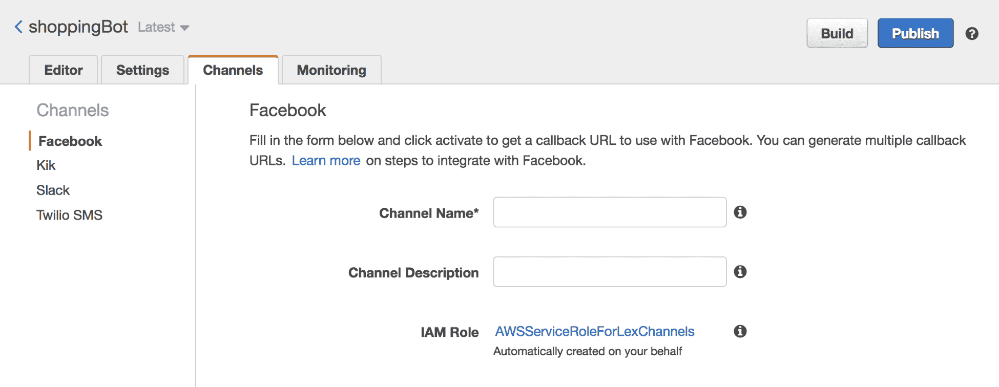

Lex 控制台中的渠道

我们现在能做的最后一件事是选择一个验证令牌。这是一个字符串，我们稍后会用它来帮助将 Facebook 连接到我们的 Lex 聊天机器人。这可以是您喜欢的任何字母和数字的字符串。

页面访问令牌和应用密钥是在创建 Facebook 应用后我们将获得的两个值，所以我们将接下来做这件事。

# 创建并连接 Facebook Messenger 应用

要将聊天机器人集成到 Facebook Messenger 中，我们首先需要创建一个 Facebook 应用。要开始，请访问[`developers.facebook.com/`](https://developers.facebook.com/)并点击“登录”。如果是您的第一个 Facebook 应用，那么您需要将此开发者账户链接到您的个人账户。登录后，您可以创建您的第一个应用。点击“我的应用”然后选择“创建新应用”。这将打开一个弹出窗口，我们可以命名该应用。

此应用名称不会显示给用户；它仅由 Facebook 页面管理员看到：

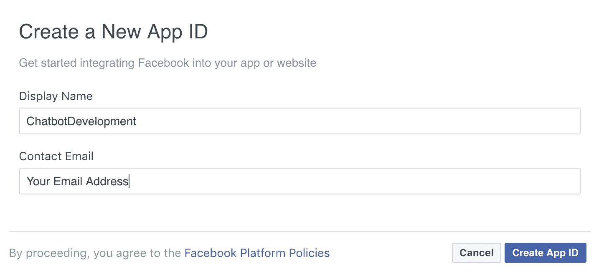

创建您的 Facebook 应用

Facebook 应用可以用于执行大量任务，但我们想构建一个聊天机器人，因此我们需要在“Messenger”下点击“设置”。

您现在应该在一个标题为“Messenger 平台”的页面上，在左侧，您应该看到“Messenger”在“产品”下。我们首先需要做的是创建一个令牌，这样 Lex 就可以访问这个应用。要生成令牌，我们可以进入“令牌生成”部分并点击“选择页面”下拉菜单：

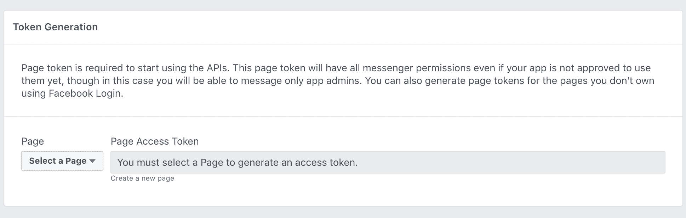

生成您的页面令牌

如果您不是任何 Facebook 页面的管理员，那么您将不得不创建一个。在 Facebook 本身，您可以快速轻松地创建一个用于假店铺的页面，或者只是创建一个作为开发者的个人页面。

当您选择页面时，将生成一个令牌。这可以复制并粘贴到 Lex 通道配置中的“页面访问令牌”字段中。

我们还需要获取的是应用密钥，我们可以在应用的“设置 | 基本设置”页面下找到：

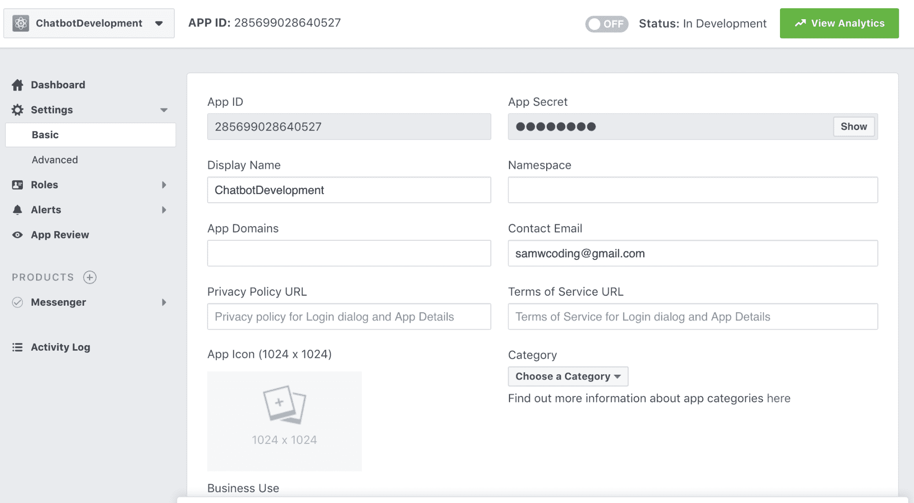

获取应用凭据

现在通道的所有细节都已完成，我们可以点击“激活”，我们将获得一个新的回调 URL。复制此 URL 并返回到我们的 Facebook 应用屏幕。返回到左侧菜单中的“Messenger 配置 | 设置”，然后滚动到“Webhooks”。Webhooks 是 Facebook 将通过它发送消息到我们的 Lex 聊天机器人的方式。

点击“设置 Webhooks”以打开一个弹出窗口，我们可以将我们从 Lex 获得的 URL 粘贴为“回调 URL”，然后是我们在 Lex 通道设置中指定的“验证令牌”。我们还需要订阅“消息”、“消息回调和”消息选择”。这些选项是选择 Facebook 将发送给 Lex 的消息类型：

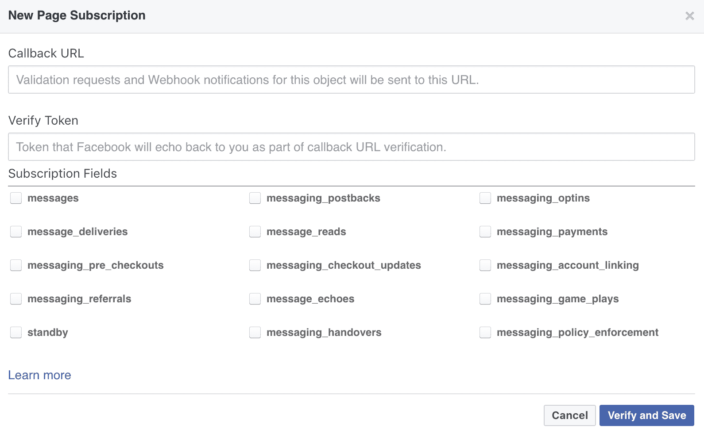

Facebook Webhook 选项

点击验证和保存将会向 Lex 发送一个请求，并期望返回正确的验证令牌。通常，你将需要设置该端点，但 Lex 会处理所有这些。

我们最后需要设置的 Webhook 是选择我们可以订阅的页面。在 Webhooks 部分中，有一个“选择页面”下拉菜单，你需要设置并点击订阅。

现在，聊天机器人应该已经在你的页面上，但它只能由你自己和其他你添加到应用中的人访问。添加更多人进行测试或工作可以在左侧的“角色”菜单中完成。

在这个阶段，你可以通过访问你的 Facebook 页面并发送消息来测试你的聊天机器人。Lex 应该会接收到消息，并发送正确的响应，就像它在 Lex 控制台中做的那样。

在你可以设置你的新应用上线之前，你需要请求 Facebook 允许你进行页面消息发送。这需要在“消息者设置”页面底部滚动，并将 pages_messaging 添加到提交中。此时，你可能会被要求完成一些额外的事情，例如添加应用图标、设置隐私政策 URL 和类别：

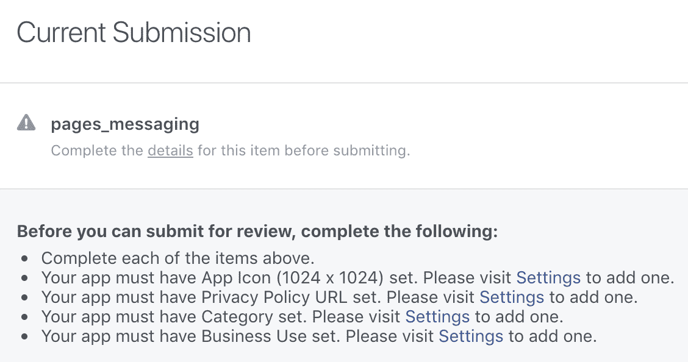

提交要求

完成这些后，你可以提交你的应用以供审查。你将被要求提供示例命令及其自动响应。确保在提交之前测试过这些命令，因为验证一个应用可能需要长达一周的时间，所以第一次就做对是关键。

Facebook 最近更新了其政策，现在要激活你的聊天机器人，你需要有一个经过批准的 Facebook 商业账户。这涉及到注册你的商业详情并提供一些证明材料。

一旦你的应用和连接的商业账户得到验证，你就可以从“关闭”切换到“开启”，并允许每个人开始向你的聊天机器人发送消息。

# Slack

Slack 是一个在软件开发者和科技公司中非常受欢迎的即时通讯平台，并且完全支持聊天机器人。

正如我们处理 Facebook 一样，我们需要选择一个频道名称和别名，如果你愿意的话，还可以提供频道描述。

# 创建和连接 Slack 应用

要开始设置我们的 Slack 应用，我们需要登录到 Slack API ([`api.slack.com/`](https://api.slack.com/))。一旦我们登录，我们就可以创建一个新的应用：

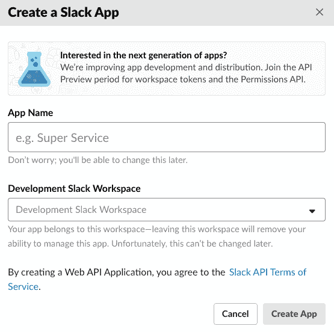

创建 Slack 应用

接下来，我们可以设置应用的功能，对我们来说就是配置聊天机器人功能。我们需要为我们的应用提供一个**显示名称**和**默认用户名**，并将“始终开启”切换设置为**开启**。这意味着聊天机器人将始终显示为在线状态。

设置好之后，我们现在可以进入左侧菜单中的“基本信息”，在那里我们可以获取客户端 ID、客户端密钥和验证令牌，我们可以将这些粘贴到我们的 Lex 频道配置中。

当您激活 Lex 频道时，您应该会得到一个 Postback URL 和 OAuth URL。Postback URL 是监听来自 Slack 的消息的 URL，OAuth URL 用于验证您的聊天机器人。

使用 OAuth URL，我们可以回到[api.Slack.com](https://api.slack.com/)，并导航到我们的应用。从这里，我们可以导航到左侧菜单中的 OAuth & Permissions，并点击添加新的重定向 URL。现在我们可以粘贴从 Lex 获取的 OAuth URL：

我们还需要设置此应用将获得的权限范围。在 Scopes 部分，我们可以通过选择“选择权限范围”下拉菜单来添加权限。我们需要添加“发送消息作为...”（chat:write:bot）和“访问有关您工作空间的信息”（team: read），然后保存更改：

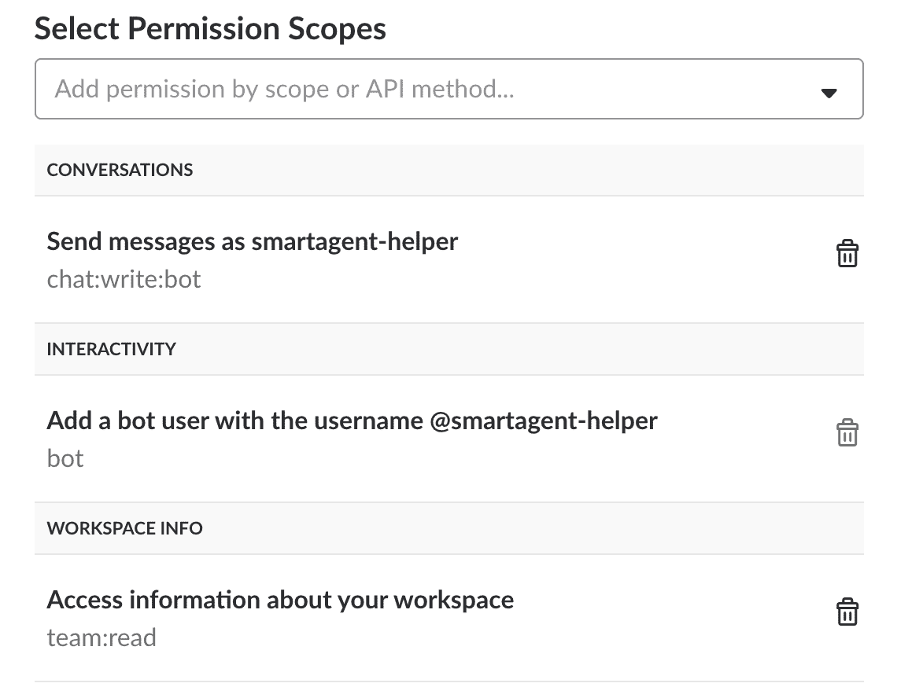

Slack 权限

下一步是允许 Lex 通过点击左侧菜单中的“交互组件”并开启**交互性**来与我们的 Slack 应用交互。然后我们可以设置请求 URL 为我们从 Lex 激活中获得的 Postback URL。

最后一步是启用事件订阅，它可以在左侧菜单中找到。开启它，并将我们的 Postback URL 作为请求 URL 粘贴，然后点击添加工作空间事件。向下滚动直到您看到 message.im，并添加它，然后保存更改。

要将我们的应用安装到您的 Slack 频道，我们需要进入“管理分发”并点击“添加到 Slack”。您应该会被重定向到您的 Slack 团队，并且应该在我们的直接消息中看到我们的聊天机器人。如果您看不到它，您可以使用**+**图标搜索它。

您现在可以通过 Slack 向聊天机器人发送消息，并且应该收到我们在 Lex 控制台中测试时得到的相同响应。

# Twilio

**Twilio**是一个平台，允许您使用短信、电话和视频通话与用户互动。我们将使用它来允许用户通过短信文本消息与我们的聊天机器人互动。

就像我们处理前两个集成一样，我们可以给频道起一个*名称*并*选择一个别名*。Account SID 和 Authentication Token 需要从 Twilio 获取，所以我们现在就要这么做。

# 创建和连接 Twilio

要开始，我们需要访问[www.twilio.com](https://www.twilio.com/)并注册或登录。登录后，在左侧菜单中进入设置，在 API 凭证下，您将看到 ACCOUNT SID 和 AUTH TOKEN。这些可以复制并粘贴到 Lex 频道设置中，然后我们可以点击激活。复制生成的端点 URL，然后返回到 Twilio 控制台。

在控制台中，我们需要进入可编程短信，并开始获取一个可以发送短信的号码：

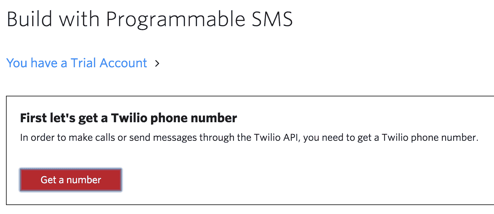

获取号码

我们将获得一个随机电话号码，我们可以选择这个号码或者搜索一个不同的号码：

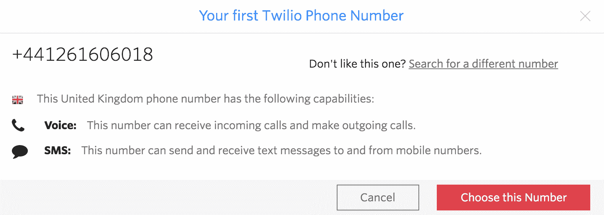

选择号码

现在我们有了可以使用的电话号码，我们可以从左侧菜单中选择消息服务。然后我们可以为我们的 Lex 聊天机器人添加一个服务。这个服务将允许我们接收文本消息，并在回复 Lex 响应之前将它们传递给我们的 Lex 聊天机器人。给这个服务起一个名字，并确保将用例设置为聊天机器人/交互式双向：

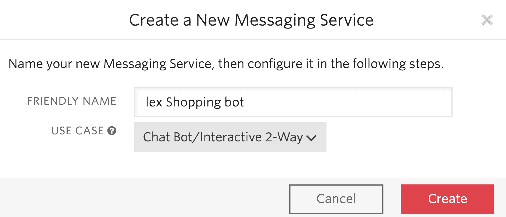

创建新服务

你应该被发送到“号码”子菜单，在那里我们可以向此服务添加一个现有号码。这选择了我们的聊天机器人将使用的号码。选择我们之前选择的号码，并将其添加到服务中。

在服务上设置了号码后，我们可以转到配置，添加我们从 Lex 获得的端点 URL。我们希望能够接收传入的消息，因此点击“处理传入消息”复选框，并将我们的 URL 粘贴到“请求 URL”框中。保存此服务，我们只剩下最后一件事要做：让我们的短信聊天机器人工作：

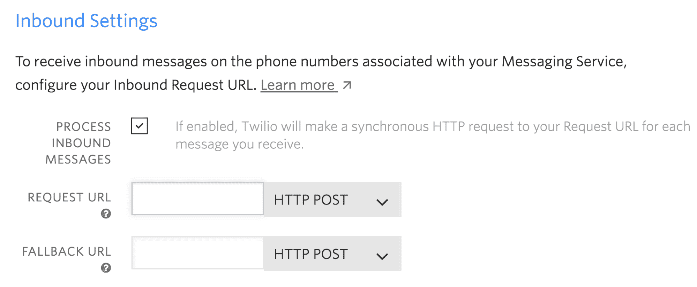

传入设置

我们需要做的最后一件事是允许我们的 Twilio 向我们所在地区的号码发送短信。在消息服务中，转到设置，然后是地理权限。这是一个所有可用的国家位置的列表；我们需要激活我们的地区，以便我们可以测试它。

搜索你的国家，通过勾选复选框来激活它。你可以激活你喜欢的任何地区。

你现在可以通过向为这项服务选择的号码发送文本来测试你的聊天机器人：

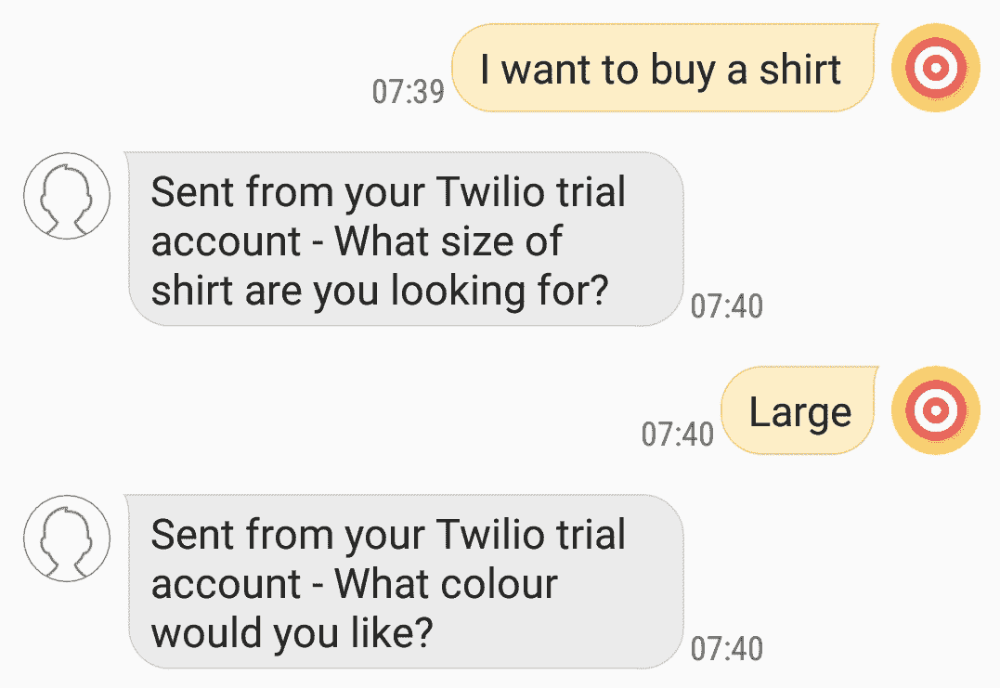

发送聊天机器人短信

如果你想要去掉来自 Twilio 试用账户的“发送自”消息，那么你需要升级。

# HTTP 端点

Lex 使得将我们的聊天机器人集成到 Facebook、Slack 和 Twilio 变得非常容易，这真是太好了，但我们可能还希望我们的聊天机器人能够集成到没有内置集成的其他服务中。为此，我们可以为向我们的 Lex 聊天机器人发送消息创建一个 API 端点。

与 AWS 合作，我们很幸运，他们允许你使用 Lambdas 和 API 网关创建一个 API。这意味着我们不需要运行服务器，这意味着我们工作量更少。

# 创建 Lambda

我们首先在我们的 Lambdas 仓库中创建一个名为`lex-shopping-api`的新文件夹，并在其中创建一个`index.js`文件。在这个文件中，我们可以首先导出一个处理程序，该处理程序检查事件是否为`POST`请求，并调用`sendToLex`来生成回复。然后，这个回复被传递到`done`，它格式化数据，以便可以返回给 API 网关：

```js
exports.handler = async (event) => {
    if (event.httpMethod === "POST") {
        let reply = await sendToLex(event);
        return done(reply);
    }
};
```

我们现在需要创建`sendToLex`函数。这个函数首先需要做的事情是将事件体映射到 Lex 所需的格式。我们将在稍后创建这个`mapMessageToLex`函数：

```js
const sendToLex = async event => {
    console.log('event', event);
    let messageForLex = mapMessageToLex(JSON.parse(event.body));
}
```

此消息现在需要发送到 Lex。亚马逊通过创建 Lex 运行时使其变得简单，该运行时允许您向 Lex 聊天机器人发送消息。要访问 Lex 运行时，我们需要在`lex-shopping-api`文件夹中运行`npm init`和`npm install --save aws-sdk`来安装`aws-sdk`。然后我们可以在文件顶部添加此代码来引入它并创建 Lex 运行时类的新实例：

```js
const AWS = require('aws-sdk');
const lexruntime = new AWS.LexRuntime();
```

要向 Lex 发送消息，我们需要调用`lexruntime.postText()`，传递`messageForLex`和处理程序回调。我们可以将整个操作包裹在一个`new Promise`中，以更好地控制`async`流程：

```js
let lexPromise = new Promise((resolve, reject) => {
    lexruntime.postText(messageForLex, (err, data) => {
        if (err) {
            reject(err);
        } else {
            resolve(data);
        }
    })
});
```

我们现在可以使用错误处理程序`await` `lexPromise`以获取响应或错误。如果有错误，则可以返回该错误；如果收到响应，则可以将`res`设置为包含消息的对象：

```js
let [err, res] = await to(lexPromise);
if (err) {
    return { err }
}
console.log('lex response', res);
return { res: { message: res.message } }
```

这些返回值将一路返回以填充我们处理程序中的回复变量。这被传递给`done`，因此我们现在需要创建这个函数。API 网关期望以特定的格式获取响应，因此这个函数返回该格式：

```js
const done = ({ err, res }) => {
    console.log('res', res);
    console.log('error', err);
    return {
        statusCode: err ? '404' : '200',
        body: err ? JSON.stringify({ error: err }) : JSON.stringify(res),
        headers: {
            'Content-Type': 'application/json',
            'Access-Control-Allow-Methods': '*',
            'Access-Control-Allow-Origin': '*'
        },
    };
}
```

我们需要创建的最后一个函数是`mapMessageToLex`。Lex 运行时要求它得到一个包含`botAlias`、`botName`、`inputText`、`userId`和`sessionAttributes`的对象，因此我们将消息映射到这个格式。如果您想为不同的机器人创建 API，那么您只需要更改`botName`和`botAlias`：

```js
const mapMessageToLex = message => {
    return {
        botAlias: 'prod',
        botName: 'shoppingBot',
        inputText: message.text,
        userId: message.sessionID,
        sessionAttributes: {}
    };
}
```

# 测试

为了测试这个 Lambda 是否正常工作，我们可以在其上运行一些测试。需要传递给这个 Lambda 的唯一值是`body`和`httpMethod`。因为`body`是一个字符串，所以我们需要转义引号：

```js
{
    "body": "{\"text\":\"I want to buy a shirt\", \"sessionID\": \"abc123\"}",
    "httpMethod": "POST"
}
```

运行此测试应该得到 API 网关期望的这种格式的响应：

```js
{
    "statusCode": "200",
    "body": "{\"message\":\"What size of shirt are you looking for?\"}",
    "headers": {
        "Content-Type": "application/json",
        "Access-Control-Allow-Methods": "*",
        "Access-Control-Allow-Origin": "*"
    }
}
```

# 连接 API 网关

API 网关是一项服务，允许我们创建可以接受所有正常 API 请求方法的 URL。首先，前往 AWS 中的 API 网关服务并点击开始。

在创建我们的第一个 API 时，我们应该选择新建 API，然后我们可以为此 API 命名和描述，然后点击创建 API：

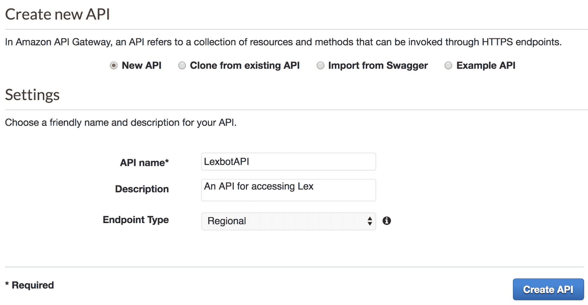

新 API

您现在应该处于 API 的配置页面，但目前还没有创建任何端点。点击操作下拉菜单并选择创建资源。这样做允许您将所有 Lex 聊天机器人的 API 放在类似的 URL 上：

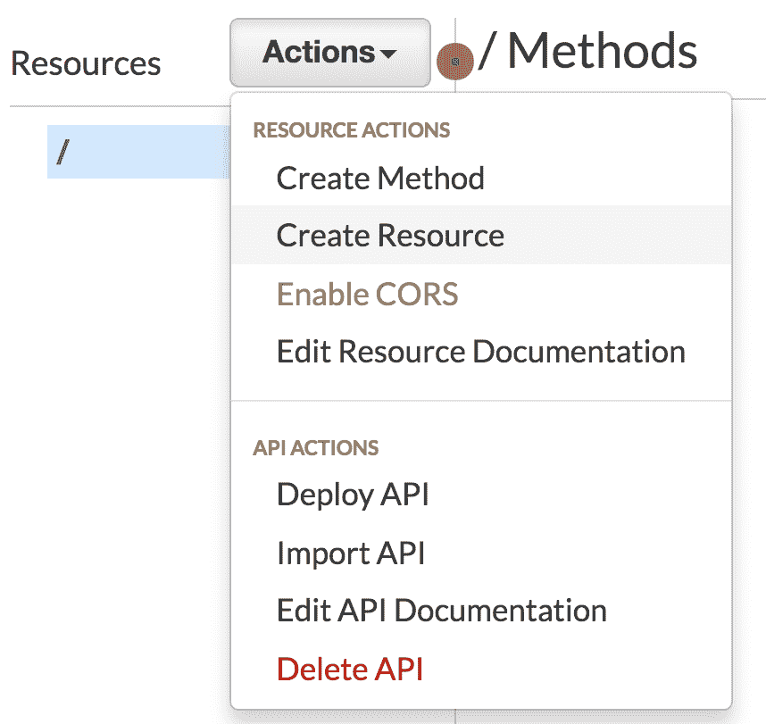

创建资源

将资源命名为`shopping-bot`并点击创建资源：

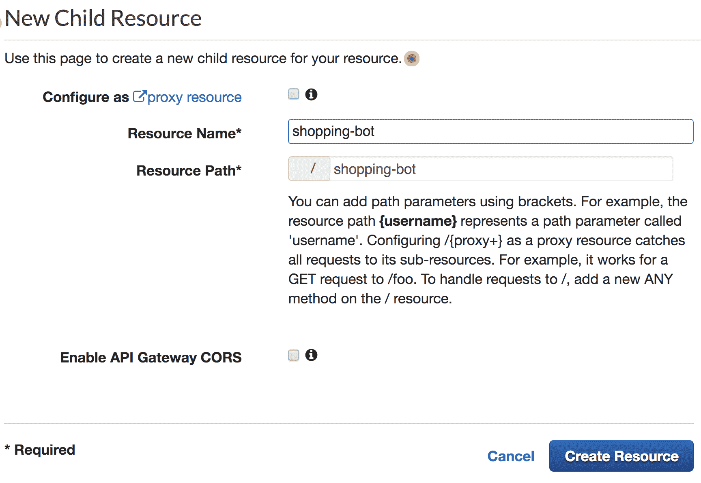

新资源

现在我们已经创建了一个资源，我们可以向其附加一个方法。在我们的 Lambda 中，我们检查`httpMethod`是否为`POST`，因此我们需要创建一个`POST`方法。点击我们的`shopping-bot`资源，然后点击操作 | 创建方法：

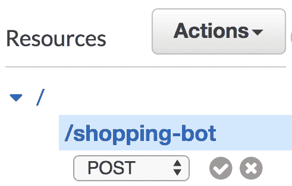

新方法

这将打开方法设置窗口，有很多人配置方法的方式，但我们将调用我们的 API Lambda。确保集成类型是 Lambda Function，并且已勾选 Use Lambda Proxy integration。这确保了所有请求数据都通过代理转发到 Lambda。

在方法设置中的下一件事是选择我们的`lex-shopping-api`作为 Lambda 函数，并保存方法：

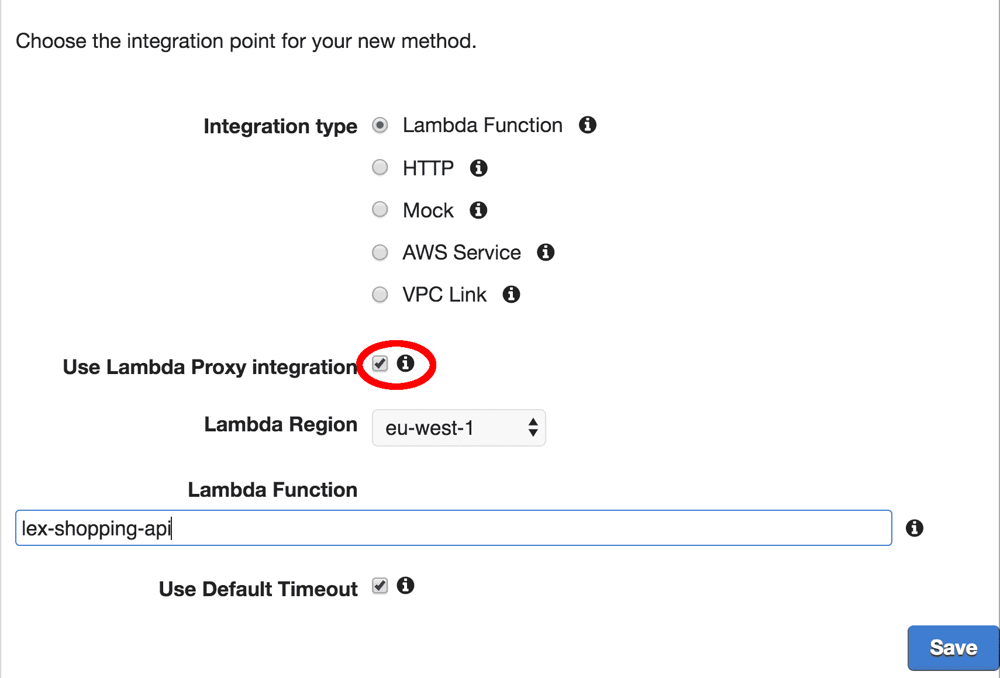

方法设置

最后，我们需要在我们的 API 中添加**跨源资源共享**（**CORS**）。这允许我们从不同的互联网浏览器访问我们的 API。在下一节构建此 API 的前端时，这将非常重要。选择我们的 shopping-bot 资源，然后我们可以点击 Actions | Enable CORS。我们可以保留所有设置默认，并点击 Enable CORS，替换现有的 CORS 头部，确认我们想要替换现有值：

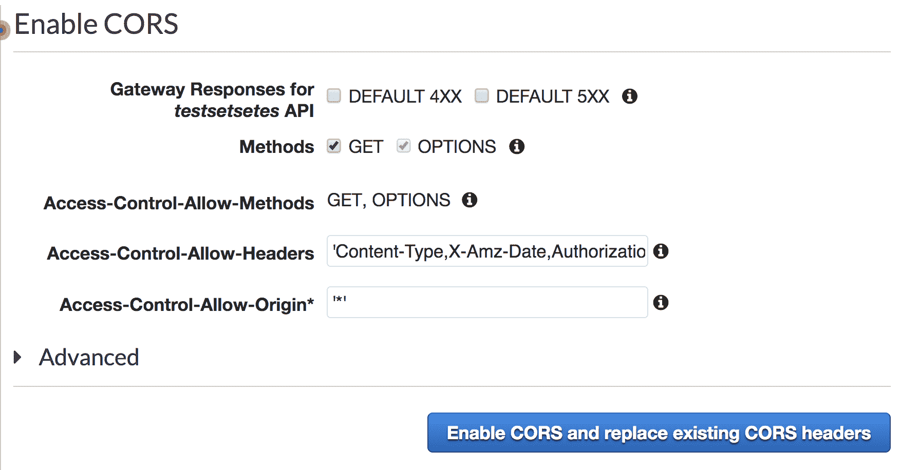

添加 CORS

# 测试

我们现在可以通过选择 POST 方法并点击 TEST 来测试我们的 Lambda 是否被正确调用：


方法 TEST

在这个屏幕上，我们可以设置查询字符串、头部和请求体。我们不需要发送任何查询字符串或头部，因此我们可以直接滚动到请求体部分。正如我们应该从 Lambda 的测试中记住的那样，我们只需要在体中传递`text`和`sessionID`，所以这就是我们可以作为请求体放入的内容：

```js
{
    "text":"I want to buy a shirt",
    "sessionID": "abc123"
}
```

当我们点击 Test 时，API Gateway 会将我们的请求发送到我们的 Lambda。我们的 Lambda 会将它发送到我们的 Lex 聊天机器人，并将响应发送回来。我们的响应体应该返回如下：

```js
{
    "message": "What size of shirt are you looking for?"
}
```

# 构建 API

最后要做的事情是构建我们的 API。在我们处于 API 上时，我们可以选择 Actions | Deploy API。由于这是我们第一次部署此 API，我们需要创建一个新的阶段。给你的阶段起一个名字和描述，你还可以在点击 Deploy 之前添加一个部署描述：

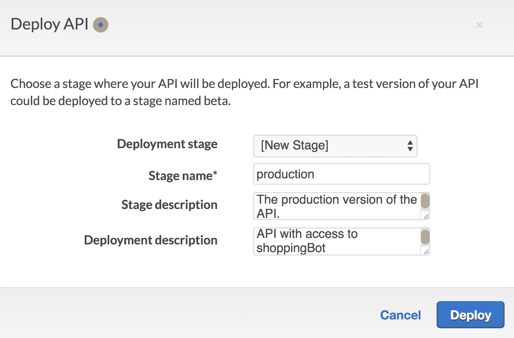

创建一个阶段

当你的 API 部署时，你会得到一个用于它的 URL，它将是`https://{unique-code}.execute-api.eu-west-1.amazonaws.com/{stage-name}`。为了访问我们制作的端点，我们需要在末尾添加`/shopping-bot`。例如，`https://acffds-4fnf8x-se54fws-s34d.execute-api.eu-west-1.amazonaws.com/production/shopping-bot`。这意味着你现在可以使用这个 API 将 Lex 集成到更广泛的系统中。

# 网页用户界面

拥有自己的聊天机器人界面允许用户通过访问网页来访问它，但我们也可以将其集成到其他网站中，甚至为我们的聊天机器人创建移动应用。我们可以使用我们创建的 API 来轻松访问聊天机器人，而无需公开我们的 AWS 凭证。

# HTML

首先，我们需要一个 HTML 页面来构建。我们需要开始的是三个组件：一个消息区域、一个输入框和一个发送按钮。创建一个包含`index.html`文件的文件夹，并将此代码添加到该文件中：

```js
<!DOCTYPE html>
<html lang="en">
<head>
    <link rel="stylesheet" href="./style.css">
</head>
<body>
    <div id="messageArea"></div>
    <div id="inputDivs">
        <input type="text" id="textInput">
        <button id="sendButton">Send</button>
    </div>
</body>
<script src="img/axios.min.js"></script>
<script src="img/script.js"></script>
</html>
```

这是一个简单的 HTML 文件，在标题中有一个 CSS 链接，这样我们就可以样式化我们的页面、消息区域、输入框和按钮，以及两个脚本。其中第一个脚本导入`axios`，这样我们就可以轻松地发出请求，第二个是我们的脚本。

由于我们已经包含了`style.css`和`script.js`文件，我们应该在我们的文件夹中创建这些文件。

# 创建我们的脚本

这个 UI 的所有功能都需要在这个脚本文件中处理。当所有 HTML 加载完成后，我们需要监听用户点击发送按钮。当发生这种情况时，我们需要从输入框获取文本并将其作为已发送消息写入，然后再将其发送到我们的 API。当我们的 API 回复时，我们可以将响应作为接收到的消息添加。

首先，我们需要确保文档已完全加载。我们可以检查文档是否已准备好，如果没有，则等待`DOMContentLoaded`事件：

```js
if (document.readyState === 'complete') {
    start();
} else {
    document.addEventListener("DOMContentLoaded", start())
}
```

现在我们可以创建`start`函数并设置 API URL 和会话 ID。我们可以使用`Math.random()`技术生成一个随机的 16 位数字作为`sessionID`：

```js
function start() {
    const URL = 'YOUR-API-URL/production/shopping-bot';
    // create unique code for this session
    const sessionID = Math.random().toString().slice(-16);
}
```

在`start()`函数中，我们还需要使用`document.querySelector`访问消息区域、文本输入框和发送按钮：

```js
let messageArea = document.querySelector('#messageArea');
let textArea = document.querySelector('#textInput');
let sendButton = document.querySelector('#sendButton');
```

接下来是`sendButton`，我们可以为用户点击发送时附加一个监听器。这将首先获取文本输入框的值。如果没有文本，则可以从函数中返回空值：

```js
sendButton.addEventListener('click', async e => {
    let text = textArea.value;
    console.log(text);
    if (!text) return;
}
```

如果有文本，则我们可以继续创建一个`sendElement`并将其添加到消息区域。我们需要确保为元素添加`sendMessage`和`message`类，以便我们稍后进行样式化：

```js
// Add to sent messages
let sendElement = document.createElement('div');
sendElement.classList.add('sendMessage');
sendElement.classList.add('message');
sendElement.appendChild(document.createTextNode(text));
messageArea.appendChild(sendElement);
```

接下来，我们必须将消息发送到我们的 API。我们可以使用在 HTML 文件中导入的`axios`，通过`text`和`sessionID`作为正文传递。我们需要确保从我们的 Lambdas 函数中复制函数以进行错误处理：

```js
// send to the API
let [err, response] = await to(axios.post(URL, { text, sessionID }));
```

如果响应中存在错误，则可以将消息设置为道歉；否则，它将是`response.data.message`：

```js
let responseMessage;
if (err) {
    responseMessage = 'Sorry I appear to have had an error';
} else {
    responseMessage = response.data.message;
}
```

最后一件要做的事情是将接收到的消息添加到消息区域，以便用户可以看到它。别忘了添加`receivedMessage`和`message`类以便稍后进行样式化：

```js
// adding the response to received messages
let receiveElement = document.createElement('div');
receiveElement.classList.add('receivedMessage');
receiveElement.classList.add('message');
receiveElement.appendChild(document.createTextNode(responseMessage));
messageArea.appendChild(receiveElement);
```

如果我们在浏览器中打开 HTML 文档，现在我们应该能够输入并发送消息到我们的 Lex 聊天机器人：

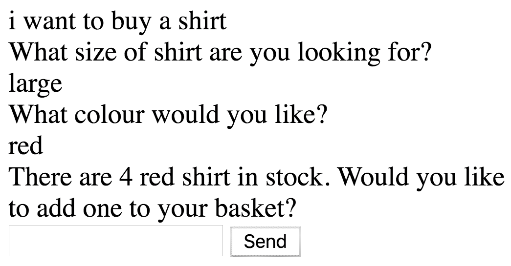

基本消息功能

# 前端样式化

我们创建了一个很棒的网页，允许用户与聊天机器人交谈，但，目前，它看起来很糟糕。我们可以通过使用我们的 CSS 文件来修复这个问题。在构建聊天时，我们一直在向元素添加类和 ID。这意味着我们可以设置这些类和 ID 的样式来美化整个聊天窗口。首先要做的是设置消息区域的大小。我们还可以添加一个浅色背景并将溢出设置为滚动：

```js
#messageArea {
    height: 93vh;
    max-width: 450px;
    background: #eee;
    overflow-y: scroll;
}
```

接下来，我们可以美化消息。我们向`message`类添加了常见的样式，如`padding`、`margin`和`max-width`，而`alignment`、`background`和`border-radius`则在每个消息类型中定义：

```js
.message {
    padding: 3%;
    margin: 2%;
    position: relative;
    max-width: 70%;
}
.sendMessage {
    right: -20%;
    background: blue;
    color: white;
    border-radius: 16px 16px 8px 16px
}
.receivedMessage {
    background: #bbb;
    left: 0;
    border-radius: 16px 16px 16px 8px;
}
```

最后要美化的部分是输入文本框和发送按钮。我们可以在容器`div`上使用`display: flex`，并在文本输入上使用`flex-grow: 2`，使其填充按钮留下的宽度。我们可以通过不同的边框和背景来美化按钮：

```js
#inputDivs {
    width: 450px;
    display: flex;
}
#textInput {
    font-size: 15px;
    flex-grow: 2;
}
#sendButton {
    font-size: 15px;
    border: 0px solid lightskyblue;
    background: lightskyblue;
    border-radius: 8px;
    padding: 8px;
    margin-left: 8px;
}
```

这比我们之前使用的纯文本提供了更好的用户体验。这就是你可以花时间定制你的界面外观，使其完全符合你想要的样子。

您甚至可以将此样式调整为与公司的品牌颜色相匹配：

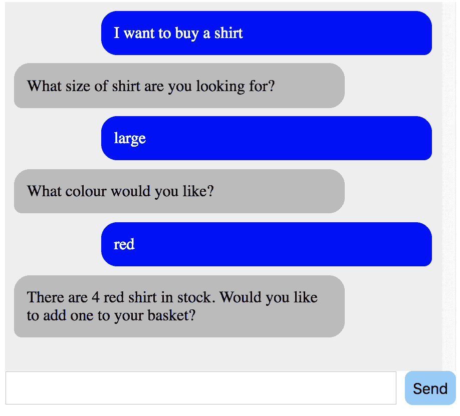

美化后的聊天

# 摘要

在这一章中，我们学习了如何创建集成，使用户能够从 Facebook Messenger、Slack 和 Twilio 访问我们的聊天机器人。

我们还学会了如何创建一个 API，以便将我们的聊天机器人集成到亚马逊目前不支持的其他服务中。这个 API 使用 Lambda 函数来处理通过 API Gateway 发送的请求。

然后，我们使用这个 API 为我们的聊天机器人创建了一个前端网页。我们编写了一个简单的 HTML 文档，然后使用脚本与 API 通信并将消息添加到页面中。我们最后做的事情是为页面添加样式，使其看起来像真正的消息平台。

# 问题

1.  为什么我们要将聊天机器人集成到其他平台和服务中？

1.  你可以使用哪些服务来创建一个 API？

1.  在 API 工作之前，我们需要添加哪两个东西？

1.  为了使我们的 API 公开，我们需要最后做什么？

1.  请命名我们聊天机器人网页的三个部分。

1.  加载的脚本文件应该首先做什么？
