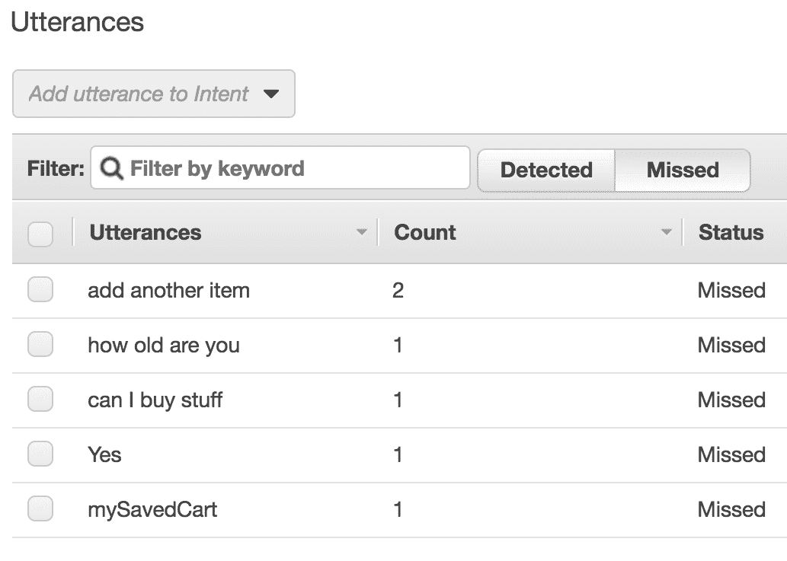

# 提升您的聊天机器人的用户体验

在学习了如何创建 Alexa 技能和 Lex 聊天机器人之后，我们现在将学习如何提升用户体验。这非常重要，因为为 Lex 聊天机器人添加图片或为 Alexa 提供更好的语音模型，都会对用户是否享受与聊天机器人的互动产生巨大影响。添加这些功能也将使您的聊天机器人从基本的纯文本聊天机器人中脱颖而出。

本章将涵盖以下主题：

+   将响应卡片添加到 Lex 聊天机器人中

+   使用短语槽位为 Alexa 技能创建更精细的语音模型

+   使用 Amazon Lex 的语音监测来细化交互模型

# 技术要求

在本章中，我们将修改现有的 Lambda 函数，因此我们将使用我们创建的本地开发环境来部署它们第二章，*AWS 和 Amazon CLI 入门*。

本章所需的所有代码和数据都可以在[`bit.ly/chatbot-ch8`](http://bit.ly/chatbot-ch8)找到。

# Amazon Lex 中的响应卡片

卡片通过集成按钮、图片等，为您提供了比纯文本消息更丰富的对话体验。卡片可用于多种用途，例如显示产品信息、让消息接收者从预定的选项集中选择，以及显示搜索结果。如果您将卡片集成到 Slack 或 Facebook 中，它们将显示在这些平台上：


Facebook 中的示例卡片

# 创建卡片

要创建卡片，我们需要更改发送回 Lex 的响应格式。这意味着我们需要通过传递`responseCard`属性来更改`LexResponses`中的函数。然后我们可以将这个`responseCard`添加到`dialogAction`对象中。如果我们没有传递响应卡片参数，我们仍然希望函数能够工作，因此我们将其默认设置为`null`：

```js
elicitIntent({ message, sessionAttributes = {}, responseCard = null }) {
  return {
    sessionAttributes,
    dialogAction: {
      type: 'ElicitIntent',
      message: { contentType: 'PlainText', content: message },
      responseCard
    },
  };
}
```

这需要对`elicitSlot`、`close`、`elicitIntent`和`confirmIntent`进行操作，但不包括`delegate`，因为该功能不会发送消息。

要添加响应卡片，我们需要确保响应也处于正确的格式。为了使这个过程更简单，我们可以在`LexResponses`内部创建一个新的函数，称为`createCardFormat`。这将接受卡片的一个属性，即包含`title`、`subtitle`、`imageUrl`、`linkUrl`和`buttons`的对象数组：

```js
createCardFormat(cards) {
 return {
   version: 1,
   contentType: "application/vnd.amazonaws.card.generic",
   genericAttachments: cards.map(({ title, subtitle, imageUrl, linkUrl, buttons }) => {
     return {
       title,
       subtitle,
       imageUrl,
       attachmentLinkUrl: linkUrl,
       buttons: buttons.map(({ text, value }) => {
         return { text, value };
       })
     };
   })
 }
}
```

# 在聊天中使用卡片

使用我们修改后的`LexResponses`类，我们现在可以开始向现有的 Lex Lambda 中添加卡片。一个明显的使用卡片的地方是在购物应用中显示基于用户搜索找到的商品。这意味着我们将修改我们的`productFind` Lambda。

在我们创建的消息中告诉用户我们有多少库存的商品（`productFind`/`index.js`的第 77 行）之后，我们可以创建我们的第一个卡片。

这将是一个带有项目标题的单个卡片，库存的副标题，图像，以及“添加到购物车”和“现在不”按钮：

```js
let responseCard = Lex.createCardFormat([{
    title: `${size}, ${colour}${type === 'trousers' ? ', ' + length : ''}${type}`,
    subTitle: `${item.stock} in stock`,
    imageUrl: item.imageUrl,
    buttons: [
        { text: 'Add to Cart', value: 'Yes' },
        { text: 'Not Now', value: 'No' }]
    }
]);
```

如你所见，我们正在给按钮赋予与文本不同的值。这使得我们收到的响应可以与用户点击的按钮不同。

你可能已经注意到我们使用 `item.imageURL` 添加了一个图像，但这个图像在我们的原始数据中并不存在。我们需要遍历并添加到库存数据中的每个项目。幸运的是，我们可以使用相同的图像来处理不同尺寸的衣物。带有图像的库存数据可在 [bit.ly/chatbot-ch8](http://bit.ly/chatbot-ch8) 下载。

当我们部署这些更改时，我们可以在 Lex 聊天窗口中测试它们。我们可以通过正常的 `productFind` 流程，直到我们看到选定的产品。当我们被告知库存数量时，我们还会看到一个显示信息的卡片：


聊天卡片

如果我们从前几章中设置了 Facebook 或 Slack 集成，那么我们的新卡片也应该在那里工作。Lex 会进行很多聪明的逻辑转换，将卡片转换为每个平台所需的正确格式，然后在回复中使用它们。需要注意的是，Facebook 会将图像裁剪为 1:1.9 的比例，所以考虑到这一点选择你的图像是个好主意：


Facebook 卡片

# Alexa 搜索查询

当你知道用户将要说的响应类型时，Alexa 是很棒的，但如果他们询问你意料之外的东西呢？即使使用自定义槽位类型也可能有限制，这可能导致用户的请求被错误处理。幸运的是，亚马逊引入了搜索查询槽位类型。

这种用于 Alexa 的槽位类型旨在能够接受更广泛的值范围，以便您能够处理更多请求。

我们将在现有的天气之神技能中添加一个新的意图，该意图使用搜索查询槽位类型，允许用户在某个城市中搜索地点。我们将使用 Google Maps API 来提供后端支持。

前往你的 Alexa 开发者控制台并打开 `WeatherGods` 技能。添加一个名为 `searchIntent` 的新意图，我们可以从创建我们将要使用的不同槽位开始。创建两个槽位，一个名为 `query`，另一个名为 `city`。我们的查询槽位可以指定为 AMAZON.SearchQuery，我们的城市槽位将是 AMAZON.US_CITY：


搜索槽位

完成槽位后，我们可以开始填充话语。不幸的是，我们不能在包含另一个槽位的话语中有一个搜索查询槽位，所以我们将不得不一次填充一个槽位。我们应该允许用户询问一个城市或提出一个查询以启动意图：


搜索查询的话语

现在我们已经完成了槽位和语句的设置，我们可以修改现有的 `weatherGods` Lambda 来处理新的意图。在您的编辑器中找到 Lambda，打开 `index.js` 文件，进入 `handlers` 对象。

在 `handlers` 对象内部，我们需要添加一个新的处理器，称为 `searchIntent`。这个处理器将首先获取城市和查询槽位值，并检查它们是否存在。如果它们不存在，我们将要求用户告诉我们缺失的信息。我们首先检查 `cityValue`，这样当我们请求查询时可以指定城市：

```js
const SearchHandler = {
    canHandle(handlerInput) {
        return handlerInput.requestEnvelope.request.type === 'IntentRequest' &&
            handlerInput.requestEnvelope.request.intent.name === 'searchIntent';
    },
    async handle(handlerInput) {
        const { slots } = handlerInput.requestEnvelope.request.intent;
        let { city, query } = slots;
        let cityValue = city.value;
        let queryValue = query.value;
        if (!cityValue) {
            let slotToElicit = 'city';
            let speechOutput = `What city are you looking in?`;
            return handlerInput.responseBuilder
                .speak(speechOutput)
                .addElicitSlotDirective(slotToElicit)
                .getResponse();
        }
        if (!queryValue) {
            let slotToElicit = 'query';
            let speechOutput = `What are you looking for in ${cityValue}`;
            return handlerInput.responseBuilder
                .speak(speechOutput)
                .addElicitSlotDirective(slotToElicit)
                .getResponse();
        }
    }
}
```

如果我们既有城市值又有查询值，那么我们可以使用这些值来向 Google 地图 API 发送请求。

# Google Cloud Platform

要使用 Google Maps API，我们需要设置一个 Google Cloud Platform 开发者账户。我们可以通过访问 [cloud.google.com](https://cloud.google.com/) 并点击“免费试用”来获取一个账户。您需要登录到一个 Google 账户，确认条款和条件，然后输入支付信息。不用担心；您在开始时将获得 300 美元的免费信用额度，所以您不会很快收到账单。

首先，我们需要通过点击左上角的“选择项目”并选择“新建项目”来创建一个项目。现在我们可以将我们的新项目命名为 `WeatherGodsAPI` 并点击“创建”。

在我们的项目创建后，我们需要检查它是否已选中页面左上角，然后我们就可以开始设置这个项目了。在搜索框中，我们可以搜索`Places API`并为此项目启用它：


Places API

一旦在这个项目中启用了 Places API，我们需要生成一个 API 密钥，以便我们能够从我们的 Lambda 中访问它。点击“凭证”，然后从“创建凭证”下拉菜单中选择“API 密钥”：


创建 API 密钥

您需要复制这个 API 密钥，因为我们将在我们的 Lambda 中使用它。

# 继续构建 Lambda

现在我们有一个可以用来调用 Google Places API 的 API 密钥。复制它并打开您的 Lambda 在 Lambda 控制台中。向下滚动到环境变量，创建一个键为 GOOGLE_API_KEY 的新变量，并将 API 密钥粘贴为值。确保不要删除其他 API 密钥，它是为 `openWeatherMaps` 使用的：


存储环境变量

将我们的 Google API 密钥存储为环境变量后，我们可以创建我们将要发送给 Google 的请求。API 请求 URL 的格式如下：

```js
https://maps.googleapis.com/maps/api/place/findplacefromtext/json?input={YOUR SEARCH}&inputtype=textquery&fields=formatted_address,name&key={YOUR API KEY}
```

为了让我们自己更容易操作，我们可以将这个文档的大部分内容存储为常量，甚至包括 Google API 密钥。在我们的 `index.js` 文件中，我们可以在文件顶部添加这些常量：

```js
const GOOGLE_API_KEY = process.env.GOOGLE_API_KEY;
const googleURL = 'https://maps.googleapis.com/maps/api/place/findplacefromtext/json?input=';
const queryString = '&inputtype=textquery&fields=formatted_address,name&key=';
```

在这些常量可访问的情况下，我们唯一需要生成的是我们的搜索。为此，我们可以将 `queryValue` 和 `cityValue` 转换为一个搜索短语。这可以通过将 `{queryValue}` 和 `{cityValue}` 组合成一个基本句子来完成。因为我们将其插入到 URL 中，所以需要使用 `%20` 而不是空格，然后我们可以构建我们的请求：

```js
let completeURL = googleURL + [queryValue, 'in', cityValue].join('%20') + queryString + GOOGLE_API_KEY;
```

构建了请求 URL 后，我们可以向 Google 发送请求。为了捕捉任何错误，我们可以使用我们的 `to` 方法，然后检查是否存在错误以及是否存在 `response.data` 字段。如果我们没有得到预期的结果，我们可以告诉用户我们找不到该信息：

```js
if (err || !res || !res.data) {
    let apology = `unfortunately I couldn't find that for you`;
    return handlerInput.responseBuilder
        .speak(apology)
        .getResponse();
}
```

如果我们的请求成功返回了一些数据，那么我们可以为用户构建一个响应。首先，我们可以告诉他们在该城市中有多少个查询，然后我们可以列出这些地点的名称：

```js
let data = res.data;
let info = `There's ${data.candidates.length} ${query.value}${data.candidates.length === 1 ? "" : 's'} in ${city.value}.
${data.candidates.map(candidate => `the ${candidate.name}`)}`;
return handlerInput.responseBuilder
    .speak(info)
    .withShouldEndSession(false)
    .getResponse();
```

我们现在已经完成了更新的 Lambda，可以使用第二章，《AWS 和 Amazon CLI 入门》中的构建脚本将其部署到 AWS。

# 重新构建技能并测试

在 Alexa 控制台中，我们可以检查修改后的技能，并确保保存它并重新构建。构建完成后，我们可以点击“测试”来尝试它。您可以测试我们在第四章，《将您的 Alexa 技能连接到外部 API》中构建的旧意图，并且它们应该像以前一样工作，但我们真正想测试的是我们的新意图。

您现在可以向天气之神询问曼彻斯特有什么，并说明您正在寻找一个天主教堂，您的技能将向 Google 查询曼彻斯特的天主教教堂。它应该告诉您有一个叫做索尔福德大教堂的教堂。

虽然这很好，但我们本可以使用自定义槽类型并列出用户可能询问的大量内容。这正是搜索查询真正有用之处：它们可以处理远不那么常见的请求。我们可以询问曼彻斯特的圣保罗小学，我们会得到一个结果。我们不可能创建一个足够大的自定义槽来包含每个学校的名称：


测试搜索查询

# Lex 语句监控

当您创建意图并生成语句列表时，您尽力涵盖用户可能说的所有内容。不幸的是，人们经常想出一些独特的方式来表达您未曾想到的内容。在这种情况下，用户将从 Lex 获得一个“我不理解”的消息。这显然不利于提供良好的用户体验。

幸运的是，Lex 内置了监控功能，允许您查看用户所说的语句。要访问这些语句，我们需要点击 Lex 中的“监控”标签。Lex 语句存储在特定的聊天机器人版本中，因此我们需要从聊天机器人名称旁边的下拉菜单中选择一个值。

现在你应该有一个显示 Lex 使用情况的图表屏幕。这可能很有用，但我们正在寻找左侧菜单中的话语表：


话语监控

现在，你应该看到一个带有中心切换按钮的表格，用于检测/未检测。检测到的话语可以用来查看大多数用户是如何与聊天机器人互动的。这可以帮助你确定哪些领域可以开发以改善你的聊天机器人，以适应你最大部分的受众。

如果你没有看到任何话语，那么你需要检查几件事情。你需要确保在聊天机器人的常规设置中，COPPA 设置为否。接下来，你应该尝试更改聊天机器人的版本（位于聊天机器人名称旁边），因为话语保存到特定的版本。如果话语在 24 小时到 15 天之间，它们会出现在这些表格中。如果你仍然没有看到任何话语，那么你可能只需要等待直到你有这个范围内的话语。

当用户说了 Lex 无法匹配到你的示例话语时，话语监控非常有用。未识别话语给你一个列表，其中包含所有发生这种情况的话语。尽管其中一些可能是胡言乱语或打字错误，但其中一些可能是有效的、你可能没有考虑过的话语：



未识别话语

在查看未识别意图时，你可能会意识到用户输入了一个你没有想到的话语。你可以通过选择未识别话语，然后从位于表格上方下拉菜单中选择意图，轻松地将这个话语添加到意图中。这样可以节省手动复制和粘贴话语到意图中的时间。

一旦你将所有有效的未识别话语移动到正确意图中，你需要确保构建和部署你的更新版聊天机器人。

# 摘要

在本章中，我们探讨了三种改善 Alexa 技能和 Lex 聊天机器人用户体验的方法。

我们首先在 Lex 聊天中创建卡片，以增加提供给用户的视觉信息。这些卡片是使你的 Lex 聊天机器人区别于仅基于文本的聊天机器人的好方法。

然后，我们转向 Alexa，在那里我们学习了搜索查询槽位。这种槽位类型允许用户输入比使用自定义槽位类型更多的值来填充槽位。

我们最后学会使用的工具来改善用户体验是*话语监控*。看到你的用户真正对聊天机器人说了什么，可以帮助你增加每个意图的示例话语。这导致了一个能够成功处理更广泛用户话语的聊天机器人。

所有这些都会提供更多信息或减少聊天机器人无法处理用户请求的可能性。

在最后一章中，我们将讨论一些继续学习最佳方法。我们还将讨论聊天机器人的未来以及它们将如何成为我们日常生活的一部分。

# 问题

1.  在 Lex 对话中使用卡片的好处是什么？

1.  你需要在 Lex 卡片中使用图片吗？

1.  为什么你会选择使用搜索查询槽位类型而不是默认或自定义槽位类型？

1.  你能否从用户语句中填充搜索查询槽位？

1.  你如何找出哪些 Lex 语句没有匹配到意图？
