# 第一章：介绍 Aurelia

如果您出生于 80 年代或 90 年代，毫无疑问，您是互联网演变的见证者。最初的网页仅由白色屏幕上的黑色文本组成；他们所写的一切都是纯 HTML 格式，实际上是非常静态的。几年后，第一个 CSS 为网络添加了一些颜色，经过一些不成功的尝试后，JavaScript 终于出现了。

从其首次出现以来，JavaScript 在这些年里不断改进并适应构建下一代网页。许多公司，如 Microsoft，参与了这种语言的演变，增加了功能并提高了其知名度。这种新的脚本语言允许开发者提高客户体验和应用性能，在短时间内，开始出现第一个 JavaScript 框架，使 JavaScript 成为网络开发的新的摇滚明星。

所有这些听起来都很棒，但是，它是否一直像我们今天拥有的强类型语言那样出色？嗯，不是的。第一个 JavaScript 版本是由 *Brendan Eich* 在 1995 年为 *Netscape Navigator* 创建的，当时命名为 *Mocha*，然后是 *LiveScript*，最终命名为 JavaScript。

让我们更深入地了解这种强大语言的特性以及它是如何成为最常用于应用开发的语言的。

在本章中，我们将探讨以下主题：

+   JavaScript 基础

+   ECMAScript 标准

+   设置我们的环境

+   Aurelia 框架

+   Aurelia 命令行

+   示例应用的概述

# JavaScript 基础

JavaScript 是一种编程语言，用于通过在您的网页浏览器端（通常称为客户端）执行代码来为您的网页添加自定义行为。因此，这使我们能够创建丰富的动态项目，例如游戏，当用户按下某些按钮时执行自定义代码，对我们的网页元素应用动态效果，表单数据验证等等。

作为单一语言的 JavaScript 非常灵活，有一个庞大的开发者社区在编写和解锁额外的功能，大公司正在开发新的库，当然，我们作为有能力的开发者准备获取所有这些功能，使网络变得精彩。

JavaScript 有几个基本特征：

+   动态类型

+   面向对象

+   函数式

+   原型化

+   事件处理

# 动态类型

在大多数脚本语言中，类型与值相关联，而不是与变量本身相关联。这意味着什么？JavaScript 和其他如 Python 等称为 **弱类型** 的语言不需要指定我们将使用哪种数据类型存储在变量中。JavaScript 有许多方法来确保对象的正确类型，包括 *鸭子类型*。

为什么是鸭子？

嗯，James Whitcomb 对其进行了幽默的推断，解释了关于它的演绎思维——“如果它看起来像鸭子，游泳像鸭子，叫声像鸭子，那么它可能就是一只鸭子”

让我们来看一个例子：

```js
1\.  var age = 26;
2\.  age = "twenty-six";
3\.  age = false;
```

在前面的代码中，定义的变量接受任何数据类型，因为数据类型将在运行时评估，所以，例如，第 `1` 行的 `age` 变量将是一个整数，在第 `2` 行将变成字符串，最后是布尔值。听起来很复杂吗？别担心，把变量想象成一个没有标签的空瓶子。你可以放任何你想要的东西，饼干、牛奶或盐。你会在瓶子里放什么？根据你的需求，如果你想做早餐，牛奶可能是更好的选择。唯一你必须记住的是，记住这个瓶子里装的是什么！我们不愿意把盐和甜味混淆。

如果我们需要确保值属于某些特定类型，我们可以使用 `typeof` 操作符来检索给定变量的数据类型。让我们看看它们：

+   `typeof "Diego"`：这将返回 `string`

+   `typeof false`：这将返回 `boolean`

+   `typeof "Diego" == boolean`：这将返回 `false`

`typeof` 操作符非常有用，但请记住，它只给出基本类型（`number`、`string`、`boolean` 或 `object`）。与 Java 中的类似操作符 `instanceof` 不同，`typeof` 不会返回对象类型。

# 面向对象

JavaScript 对象基于关联数组，通过包含原型进行了改进。属性和值可以在运行时更改。创建对象的另一种常见方式是使用 **JavaScript 对象表示法**（**JSON**）或使用函数。

让我们看看由 JavaScript 代码创建的对象的外观及其 JSON 表示形式：

```js
// Let's create the person object
function Person(first, last, age) {
    this.firstName = first;
    this.lastName = last;
    this.age = age;
}
var diego = new Person("Diego", "Arguelles", 27);

//JSON representation of the same object
{
    firstName: "Diego",
    lastName: "Arguelles",
    age: 27
}
```

# 函数式

函数是一个包含自身的对象。它们有属性、方法，并且可以包含内部函数。这是一种在应用程序的多个地方重用功能的方法；你只需要写函数名，而不是所有代码，就像以下示例：

```js
function sum(numberA, numberB){
    return numberA + numberB
}
sum(4,5) //9
sum(5,2) //7
sum(sum(5,1),9) //15

```

# 原型化

JavaScript 使用原型而不是类来实现继承。仅使用原型就可以模拟所有面向对象（OOP）的特性：

```js
function Person(first, last, age) {
    this.firstName = first;
    this.lastName = last;
    this.age = age;
}

var diego = new Person('Diego', 'Arguelles', 26)
diego.nationality = 'Peruvian'
console.log(diego) 
// Person {firstName: "Diego", lastName: "Arguelles", age: 26, nationality: "Peruvian"}

Person.prototype.career = 'Engineering'
console.log(diego.career) // Engineering
```

话虽如此，原型究竟是什么？与对象不同，一个原型没有封闭的结构。在对象中，我们定义标准属性，我们只是有这些属性来工作，因为 JavaScript 并非完全是一种面向对象的语言，我们有添加、删除或根据需要更改原型属性和值的优势。

我们可以在运行时修改原型属性。请注意，即使你可以修改任何原型，你也应该只修改自己的。如果你修改标准原型（例如，数组原型），你将在应用程序中遇到非常奇怪的错误。

# 事件处理

事件允许你在网页上添加真正的交互。JavaScript 允许你在 HTML 页面上附加事件处理器，并在它们被触发时执行自定义代码。例如，给定的代码将在用户点击网页主体时显示一个警告：

```js
document.querySelector('body').onclick = function() {
    alert('You clicked the page body!!!');
}
```

# ECMAScript 标准

在最初，一些公司，如 Microsoft，试图开发他们自己的 JavaScript 实现，在这种情况下，1996 年为 Internet Explorer 3.0 开发的 JScript。为了定义一个标准，Netscape 将 JavaScript 提交给**欧洲计算机制造商协会**（**ECMA**），这是一个信息和通信系统的标准化组织。

ECMA-262 的第一版于 1997 年 6 月由 ECMA 全体会议采纳。自那时起，该语言标准的多个版本已经发布。*ECMAScript* 这个名字是参与语言标准化工作的组织之间的一种折衷，特别是 Netscape 和 Microsoft，他们的争议主导了早期的标准会议。

所以，经过所有这些标准化过程和文件工作，我们到底在用什么呢？ECMAScript、JScript、ActionScript 还是 JavaScript？它们是相同的吗？基本上不是。标准化后，ECMAScript 被定义为主要的语言，而 JavaScript、JScript 和 ActionScript 是这种语言的方言，当然，JavaScript 是最知名和最常用的。

目前，大多数浏览器都支持 ECMAScript 版本 5，该版本于 2011 年发布。为这个版本管理的特性如下所示：

+   新的数组方法支持

+   日期管理支持

+   JSON 支持

到目前为止，我们已经看到了纯 ES5 语法，非常冗长，有时与其他功能高度耦合，如果我们计划开发大型应用程序，它可能变得难以维护。

谢天谢地，我们再也不必处理这种语法了。**ECMAScript 6**（**ES6**）版本带来了许多简化代码开发和理解的改变。

# ES 6

这个版本带来了语言语法的重大变化。让我们回顾一下新特性，并与 ES5 语法进行比较。

在 ES5 中，为了在 JavaScript 中创建一个近似的对象表示，我们通常输入如下内容：

```js
function Person(name, age) {
    this.name = name;
    this.age   = age;
}
Person.prototype.sayHi = function() {
    return 'Hi, my name is ' + this.name + ' and i have ' + this.age + ' years old';
}

var Erikson = new Person('Erikson', 26);
Erikson.sayHi(); // 'Hi, my name is Erikson and i have 26 years old'

```

如果我们想要改进我们的代码，也许我们可以进行一些重构，如下所示：

```js
function Person(name, age) {
    this.name = name;
    this.age   = age;

    this.sayHi = function () {
        return 'Hi, my name is ' + this.name + ' and i have ' + this.age + ' years old';
    }
}
```

这就是现在在 JavaScript 上如何进行**面向对象编程**（**OOP**），但对于有 Java 或 PHP 等先前经验的程序员来说，这种语法结果可能有点难以理解，因为他们不是处理真实对象，而是直接处理原型。ES6 引入了一种新的语法来声明对象：

```js
class Person {

    // Contructor define properties for our object representartion
    constructor(name, age) {
        this.name = name;
        this.age = age;
    }
    // Class method
    sayHi() {
        return 'Hi, my name is ' + this.name + ' and i have ' + this.age + ' years old';
    }
}
var Erikson = new Person('Erikson', 26);
Erikson.sayHi() // Hi , my name is Erikson and I have 26 years old
```

如你所见，现在的语法更加易读易懂，我们可以从另一个类扩展，就像其他语言，例如 Java：

```js
class Developer extends Person {

    constructor(name, age, role){
        super(name, age)
        this.role = role;
    }
    sayHi(){
        return super.sayHi() + ' and i am a ' + this.role
    }
}
var Erikson = new Person('Erikson', 26, 'Javascript developer');
Erikson.sayHi() // 'Hi, my name is Erikson and i have 26 years old and i am a Javascript developer'
```

当然，我们也可以使用封装原则来操作我们的对象属性。类似于 Java，我们可以定义修改器方法来获取属性值或将某些值设置到属性中：

```js
class Person {

    constructor(name, age) {
        this.name = name;
        this.age = age;
    }
    get checkName() {
        return this.name;
    }
    set giveName(newName) {
        this.name = newName;
    }
}
var Erikson = new Person('Erikson', 26);
Erikson.checkName() // returns Erikson
Erikson.giveName('Hazis')
Erikson.checkName() // returns Hazis
```

虽然有这些方法，但这并不能避免你仍然可以使用 JavaScript 的原生语法在运行时更改值或添加属性的事实。你仍然能够执行以下操作：

```js
Erikson.name = 'Diego'
Erikson.name // Returns Diego
```

就像其他语言一样，ES6 允许使用静态修饰符使用静态方法：

```js
class Example {
    static returnMessage(){
        return 'From static method'
    }
}
let staticMessage = Example.returnMessage() // From static method
```

你注意到什么了吗？在最后一个例子中，我们使用了`let`而不是`var`来声明一个变量。ES6 有两种新的变量定义方式：`let`是`var`的直接替代，而`const`将用于声明常量。我们是否还可以使用`var`而不是新的 ES6 声明语法？是的，但让我们想象一下，你是一位经验丰富的开发者，并且有两位实习生在你的监督下。在你的代码中，你可以定义如下内容：

```js
var PI = 3.1416
```

当然，我们也不希望这个值因任何原因而改变。由于这仍然是一个`var`，任何初级开发者都可以直接或间接地（通过方法调用、赋值错误、错误的比较语法等）更改该值，因此我们可能会在我们的应用中遇到错误。为了防止这类情况，`const`将是一个更准确的变量修饰符。

ES6 仅仅改进了对象的声明语法吗？不。此刻，我们只关注我们的类定义语法，因为它将是所有应用的核心，就像面向对象编程一样。现在，我们将检查其他改进，我们非常确信你会在日常工作中发现这些改进非常有用。

一个非常重要的注意事项：你必须知道，与其他代码语言不同，在 JavaScript 中，你可以定义`const MY_ARRAY = []`，并且你仍然能够执行`MY_ARRAY.push(3)`。`const`前缀只会避免覆盖，所以你不能做`MY_ARRAY = [1,2]`

# 箭头函数

你需要遍历数组的元素；通常，你会写如下内容：

```js
var data = ['Ronaldo', 'Messi', 'Maradona'];
data.forEach(function (elem) {
    console.log(elem)
});
```

使用箭头函数，你可以重构你的代码，并编写如下内容：

```js
var data = ['Ronaldo', 'Messi', 'Maradona'];
data.forEach(elem => {
    console.log(elem);
});
```

箭头（`=>`）操作符在一行中定义一个函数，使我们的代码更易读和有序。首先，你需要声明输入；箭头会将这些参数发送到由操作符定义的函数体：

```js
// We could transform this
let sum = function(num) {
    return num + num;
};
// Into just this
let sum = (num) => num + num;
```

# 字符串插值

你还记得那些需要使用`+`操作符连接字符串的时候吗？这不再必要了。例如，以下代码使用`+`操作符连接`string1`和`string2`：

```js
let string1 = "JavaScript";
let string2 = "awesome";
let string3 = string1 + " " + string2
```

现在，让我们看看插值如何帮助我们编写更简单的代码：

```js
let string1 = "JavaScript";
let string2 = "awesome";
let string3 = `${string1} ${string2}`
```

# 解构赋值

我们有一种新的方法来为对象和数组赋值。让我们看看一些例子：

```js
var [a, b] = ["hello", "world"];
console.log(a); // "hello"
console.log(b); // "world"

var obj = { name: "Diego", lastName: "Arguelles" };
var { name, lastName } = obj;
console.log(name); // "Diego"

var foo = function() {
    return ["175", "75"];
};
var [height, weight] = foo();
console.log(height); //175
console.log(weight); //75
```

# 设置我们的环境

到目前为止，我们已经准备好开始用 JavaScript 语言编写我们的第一个函数和方法。我们知道如何处理新的 ES6 语法，以及我们如何使用所有这些新特性来改进我们的应用。让我们设置我们的环境并安装 Node.js。

# 安装 Node.js

要开始使用 NPM，你需要先下载 Node.js。Node 是一个异步事件驱动的 JavaScript 运行时环境。它不是一种新的语言或新的语法；它只是你可以在其中编写 JavaScript 代码的平台，而 Node.js 将使用谷歌的 V8 JavaScript 引擎来执行它。

如果你使用 OS X 或 Windows，最佳安装 Node.js 的方式是使用 Node.js 下载页面上的安装程序之一。

如果你使用 Linux，你可以使用你的包管理器或查看下载页面，以查看是否有与你的系统兼容的更新版本。

要检查你是否安装了之前的版本，请运行以下命令：

```js
$ node –v
```

# Node 包管理器

**Node 包管理器**（**NPM**）是一个完整的工具，旨在帮助开发者共享、维护和重用打包在包中的 JavaScript 代码，以便其他开发者可以在自己的应用程序中重用。NPM 由三个不同的组件组成：

+   NPM 网站

+   NPM 仓库

+   NPM 命令行工具

# NPM 网站

这个网站作为用户发现包的主要工具；你会找到类似以下的内容：

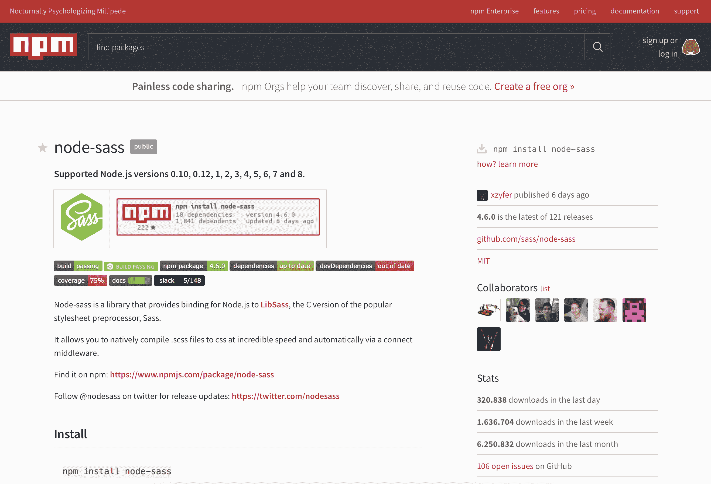

这个页面描述了你想要下载的包的所有功能，关于它的简要文档，GitHub 网址以及将其导入项目的说明。

# NPM 仓库

它是关于每个包的信息的大型数据库。官方公共 NPM 仓库位于 [`registry.npmjs.org/`](https://registry.npmjs.org/)。它由 CouchDB 数据库提供支持，其中有一个公共镜像位于 [`skimdb.npmjs.com/registry`](https://skimdb.npmjs.com/registry)。

# NPM CLI

一个用于与仓库交互的命令行工具，允许开发者发布或下载包。

一旦你将代码下载到你的机器上，NPM 将使检查是否有更新可用以及下载这些更改变得非常容易。超过两个可重用的代码块被称为包。那只是一个包含一个或多个文件的目录，以及一个名为 `package.json` 的文件，其中包含有关该包的所有元数据。

# 常见的 NPM 操作

与所有命令行工具一样，了解 NPM 提供的选项非常重要。NPM CLI 是一个强大的工具，将帮助我们完成项目的开发周期。

# 更新 NPM

第一步已经完成！我们已经在我们的机器上安装了 Node 运行时，可以执行我们的 `.js` 文件，所以我们需要开始工作的最后一件事就是 NPM。Node 默认安装了 NPM，但 NPM 的更新频率比 Node 更高，因此我们可以通过执行以下命令来检查我们的 NPM CLI 的更新情况：

```js
$ npm install npm@latest -g
```

# 安装 NPM 包

NPM 已安装和配置；现在是时候开始工作了。有两种方式可以安装 NPM 包。我们的选择将取决于我们如何使用该包。选项如下：

+   **全局安装：**将给定的包作为我们的命令行工具的一部分全局安装

+   **本地安装：**将给定的包安装到我们的应用程序上下文中，使其仅在我们自己的应用程序中使用

在这个前提下，输入以下命令来安装一个新的包：

```js
$ npm install <package-name>
```

此指令将创建一个名为 `node_modules` 的文件夹，我们将在此文件夹中下载所有需要的包。我们可以确保已下载包，进入文件夹并检查是否存在一个与我们的包名相似的文件夹。运行以下命令以列出项目中安装的所有包：

```js
$ ls node_modules
```

# 版本

如果未指定包版本，我们将获取最新版本。要安装特定版本，我们需要在 `install` 命令中添加以下内容：

```js
npm install <package-name>@<version>
```

# package.json 文件

我们知道如何下载一个包并将其导入到我们的项目中。然而，我们通常需要不止一个包，并且需要特定的版本。我们是否需要记住它们以便每次设置项目时都手动下载？不，现在是创建 `package.json` 文件的时候了。

此文件不仅用于映射我们的依赖项；它必须包含我们项目的所有元数据，并作为快速文档，说明项目依赖于哪些包。至少，`package.json` 应包含以下内容：

+   **名称**：项目名称，全部小写，没有空格（如果需要，可以使用下划线）

+   **版本**：以 x.x.x 的形式

我们可以手动创建此文件，但 NPM 允许我们通过执行以下命令自动创建：

```js
$ npm init
```

上述命令将提示您一系列问题，这些问题将出现在您的 `package.json` 文件中。如果您不想在未提示任何问题的情况下接受默认值，请运行相同的命令，并在末尾添加一个 `--yes` 标志：

```js
$ npm init --yes
```

然后，您将得到一个如下的 `package.json` 文件：

```js
{
  "name": "my_package",
  "version": "1.0.0",
  "description": "",
  "main": "index.js",
  "scripts": {
    "test": "echo \"Error: no test specified\" && exit 1"
  },
  "repository": {
    "type": "git",
    "url": "https://github.com/package_owner/my_package.git"
  },
  "keywords": [],
  "author": "",
  "license": "ISC",
  "bugs": {
    "url": "https://github.com/package_owner/my_package/issues"
  },
  "homepage": "https://github.com/package_owner/my_package"
}
```

# 依赖项和 devDependencies

您现在已安装了所有依赖项。您开始工作，在开发过程中，您可能需要其他依赖项来改进您的代码。您只需运行 NPM CLI 来获取新的依赖项，但这不会出现在您的 `package.json` 文件中！这可能会非常危险，因为如果您没有项目所需的库或依赖项的列表，当您想在不同的机器上运行它时，您的代码将失败，因为依赖项未安装在该机器上。

我们可以通过添加 `–-save` 或 `–-save-dev` 标志来确保新包名将被添加到我们的依赖项列表中。第一个将包名添加到 `package.json` 文件的依赖项部分。这意味着依赖项是应用程序本身的强制性依赖项，应在运行或部署应用程序之前安装。另一方面，我们有 devDependencies 部分，其中将只包含用于我们开发过程的依赖项：

```js
$ npm install <package_name> --save
```

现在，我们已经准备好开始开发 JavaScript 应用程序了。在下一节中，您将使用 NPM 安装创建新 Aurelia 项目所需的 Aurelia 命令行工具，但让我们继续探索 Aurelia 框架。

# Aurelia 框架

在我们开始使用 Aurelia 并学习这个令人惊叹的框架之前，了解为什么你应该选择 Aurelia 而不是其他流行的框架是很重要的。为此，让我们详细探讨一下什么是 JavaScript 框架以及 Aurelia 中存在的关键区别性因素。

# 什么是 JavaScript 框架？

在上一节中，我们回顾了所有关于 JavaScript 的疑虑以及我们如何使用 NPM 和 Yarn 来组织我们的包。现在，是时候回顾一些将提高我们的开发体验的工具了；是时候讨论框架了。

框架可以被描述为一组工具和方法，这些工具和方法被组织起来以解决项目开发中的常见问题。这些解决方案是通用的；每个解决方案都在不同的环境中进行了测试，并允许你重用这些功能以节省时间和成本。

因此，根据前面的解释，我们可以将 JavaScript 框架定义为一组组件和库（在大多数情况下，相互依赖）的集合，以满足浏览器客户端应用程序的需求。这些需求是什么？让我们检查一些最通用的需求：

+   路由

+   数据发送功能和检索（XMLHttpRequest）

+   正确管理 DOM

+   在分离的功能中管理和组织你的代码

+   定义应用程序的标准数据流

+   定义某些功能的生命周期

# 为什么使用 JavaScript 框架？

通常，JavaScript 框架将帮助我们完成以下工作：

+   组织你的代码

+   以可维护和有序的方式构建结构

+   实现关注点的分离

+   实现针对最常见问题的测试解决方案

+   在任何开发者都可以遵循的基础结构上工作

更具体地说，JavaScript 框架特别有助于那些大部分业务逻辑将在客户端执行的应用程序——路由、模板化、首次模型验证、表格构建和分页——几乎是你过去可能用于服务器的任何东西，但现在没有额外的 HTTP 调用所造成的延迟和开销。

# JavaScript 框架比较

一个问题通常有不止一个解决方案，JavaScript 开发者都知道这一点。在 2010 年之前，开发者们在日常工作中实现功能的选择非常有限。在那个时代最受欢迎的选项是 jQuery，现在仍然被广泛使用。虽然 jQuery 并不是一个坏的选择，但它有一个很大的弱点。例如，如果你的项目增长和你的业务代码变得更加复杂，jQuery 将会非常难以维护，你的关注点将会混合，你可能会陷入最常见的反模式之一——**意大利面条式代码**。

2010 年，谷歌发布了一个最受欢迎的 JavaScript 框架——Angular。与 jQuery 不同，Angular 提供了一套完整的工具和一种新的组织 JavaScript 代码的方式，引入了模块、组件、路由和模板等新概念。在 Angular 之后，出现了许多 JavaScript 框架；其中一些因为赞助公司的支持而变得非常流行，例如 Facebook 的 React.js，一些因为社区的采用而获得了名声，例如 Meteor 和 Vue，还有一些在邻里中真正崭新。

作为创新的本质，Angular 2 项目的其中一位主要工程师开发了一个名为 Aurelia 的新颖框架，该框架在市场上仅仅三年时间，就已经成为了邻里的新摇滚明星。

# 为什么选择 Aurelia？

在我们当前日常工作的过去几年里，我们参与了各种各样的 JavaScript 框架；最受欢迎的始终是 Angular，但我们了解到流行并不等同于质量。为了理解的目的，我们将检查现在最常用的几个框架，然后与我们的战斗马 Aurelia 进行一些比较。

# Angular

该基于组件的框架使用 TypeScript 作为主要（且唯一）的 JavaScript 平台。Angular 是一个为所有**单页应用（SPA**）目的设计的库的完整超集，非常适合从头开始开发应用程序。你可以链接你的模板和你的`TypeScript`代码，这样你的`HTML`就会根据代码中的值更新，并准备好对用户操作做出反应。你需要了解这个框架的三个基本概念——指令、模块和组件。每个概念都涉及另一个，你需要将每个组件注册到一个模块中，使其可用。JavaScript 也有自己的模块系统来管理 JavaScript 对象的集合。它与 Angular 的模块系统完全不同且无关。Angular 有自己定义服务类、路由、双向数据绑定、HTTP 请求等的实现，这使得这个框架非常重量级。

# 技术信息

+   **大小**：698 Kb

+   **标准兼容性**：ES 2016（TypeScript）

+   **不兼容**：NG2 标记和 Dart

+   **互操作性**：平均

# 依赖注入

依赖注入框架需要更多的配置。与 Aurelia 相比，Angular 要求你指定 HTML `选择器`和`模板`，增加了文件复杂性。Aurelia 将根据名称策略检测模板：

```js
@Injectable()
class Ticket { /* */ }

@Component({
  selector: 'ticket',
  providers: [Ticket],
  template: `...`
}) //Configuration code mixed with business class
export class Sale {
    constructor(private ticket: Ticket) {}

    public activate() {
        // do something...
        this.ticket.toast("Sale processed!");
    }
}
```

# 组件封装

Angular 组件需要更明确的配置，并且在模板中有些（在某些情况下令人困惑）字符。你可以将模板放在单独的文件中，或者对于更简单的组件，你可以将模板内联包含：

```js
/* product-list.component.ts */
@Component({
    selector: 'product-list',
    template: `<div><product-detail *ngFor="let thing of things" [product]="product" /></div>`
})
export class ProductList {
    public products: Product[];
}
```

# React.js

与 Angular 不同，React.js 是一个可以与任何 JavaScript 项目集成的库。它用于处理 Web 应用的视图层并构建可重用的 UI 组件。React 也是基于组件的，但它将 HTML 代码混合在 JavaScript 文件中，以 JSX 格式。JSX 是一种与 XML 格式非常相似的 React 语法，因为你可以管理你的视图层并添加一些行为，通过定义一些属性作为组件的状态或属性。听起来有点复杂？是的，你需要学习 JSX 是如何工作的，并阅读一些关于这个工具的新概念。

React.js 有一个很棒的功能——服务器端渲染。这意味着什么？常见的 JavaScript 框架让渲染工作在客户端进行，所以浏览器需要解释你的 JavaScript 文件并将其转换为纯 HTML 文件。这取决于页面上将显示多少数据，可能需要一些时间。使用 React.js，你可以配置你的服务器在服务器端处理所有这些页面，所以浏览器只需要调用正确的 HTML 文件，当然，加载时间会更短。

与 Angular 类似，React.js 为你提供了一套完整的库来实现动态路由、数据绑定、HTTP 请求以及其他 React 实现库，如 Inferno.js，具有更强大和优化的渲染算法。

一个非常重要的注意事项！Aurelia 现在有一个自己的服务器端渲染插件。你可以在那里找到更多信息：[`aurelia.io/docs/ssr/introduction/`](https://aurelia.io/docs/ssr/introduction/)

# 技术信息

+   **大小**：156 KB 或带插件 167 KB

+   **标准合规性**：ES 2015

+   **不合规**：JSX

+   **互操作性**：高摩擦

# 依赖注入

React.js 中没有这样的依赖注入概念。

# 组件封装

一个组件就是一个 JS 类。你想要在你的组件中包含另一个组件吗？只需导入它：

```js
import {ProductDetail} from "./ProductDetail";

interface Props {
    products: Product[];
}
export class ProductList extends React.Component<Props, undefined> {
    render() {
        return <div>
            {this.props.products.map(th => <ProductDetail key={th.id} product={th} />)}
        </div>
    }
}
```

# Aurelia

Aurelia 是由 Angular 2 项目团队成员之一创建的新 JavaScript 框架。与 Angular 不同，Aurelia 由一组库组成，这些库通过定义良好的接口协同工作，使其完全模块化。这意味着一个 Web 应用只需要包含它需要的依赖项，而不是完整的包。

Aurelia 的 API 被精心设计，以便自然地被今天和明天最有用的 Web 编程语言所消费。Aurelia 支持 ES5、ES2015、ES2016 和 TypeScript，这些都非常有用，并为你提供了高度的灵活性。

此外，使用 ES6 编写 Web 应用并不是什么新鲜事。实际上，有许多解决方案可以让你使用 ES6 编写 Angular 应用（你需要手动配置它，并且它不包括在默认的 Angular 配置中）。

你无需担心特殊的框架概念或语法；Aurelia 是一个*约定优于配置*的框架，鼓励你在开发应用程序时使用良好的实践，并且它允许开发者只关注业务代码。

# 技术信息

+   **大小**：最小 252 kb，带标准插件为 302 kb

+   **标准兼容性**：HTML、ES 2016、Web Components（包括 Shadow DOM）

+   **互操作性**：非常互操作

# 依赖注入

你所需的一切就是 `@autoinject` 注解。JS/HTML 映射将由框架自动执行：

```js
class Ticket { /* class code, properties, methods... */ }

@inject
export class Sale {
    constructor( ticket ) {}

    public activate() {
        // do something...
        this.ticket.toast("Sale processed!");
    }
}
```

对于 `Typescript` 用户，注解名称非常相似。使用 `@autoinject` 而不是 `@inject`，并且不要忘记在构造函数中指定对象的可见性和类型：`constructor(private ticket : Ticket)`

# 组件封装

组件封装使用一个看起来或多或少像你曾经使用过的任何其他 Web 模板语言的单独模板文件。按照惯例，如果你的组件类在 `hello.ts` 中，那么它的模板就在 `hello.html` 中，你的组件将是 `<hello/>`：

```js
<!-- product-list.html -->
<template>
    <require from="product-detail"/>
    <div>
        <product-detail repeat.for="product of products" product.bind="product"/>
    </div>
</template>
/* producty-list.js */
export class ProductList {
    public products[];
}
```

每个 JavaScript 框架都有其自己的工作方式，我们可以探索每个框架的更多功能，但 Aurelia 有其独特之处——你无需远离学习框架的工作方式，在极端情况下，以它们自己的方式/语法进行开发。使用 Aurelia，你将感觉像是在编写纯 JavaScript 和 HTML 代码，高度可维护、可扩展，并且只关注你的业务目标。

现在是时候开始使用 Aurelia 了。所以，让我们探索 Aurelia 命令行，开始我们的旅程。继续阅读！

# Aurelia 命令行工具

创建 Aurelia 项目有许多方法。对于本书，我们将使用官方的 Aurelia 命令行工具，它由 Aurelia 团队支持。尽管有其他选项可以配置你的 Aurelia 应用程序，例如 Webpack 和 JSPM，但我们认为 CLI 功能强大，将帮助我们节省宝贵的配置应用程序骨架和构建工具的时间。

在本节中，我们将详细探讨 CLI 的功能，并且你会自己信服这确实是我们的冒险的最佳选择。在本节之后，你将成为使用 Aurelia CLI 的专家。

# 安装

如果你在上一节中已经安装了 Node.js，那么安装 CLI 并不是什么大问题。我们只需要打开你最喜欢的终端，并执行以下命令；如果你使用的是基于 Unix 的操作系统，记得如果你有权限问题，在命令前添加 `sudo`：

```js
npm install -g aurelia-cli
```

之前的命令将安装 Aurelia CLI 作为全局的可执行命令行工具。这允许我们使用 `au` 命令，就像使用操作系统的终端中的任何其他命令一样，例如 `dir` 命令。

安装完成后，执行以下命令：

```js
au help
```

这应该返回以下输出，显示 CLI 帮助。正如你所见，这个命令有两个主要选项：

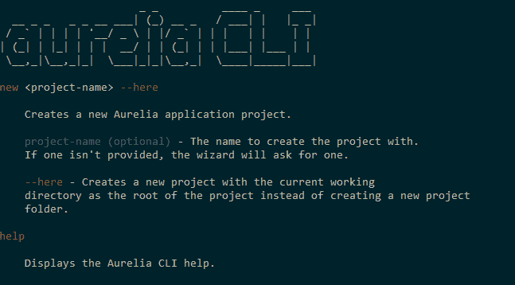

现在我们确信它按预期工作，让我们学习如何充分利用它。

# 创建新应用程序

这是最重要的选项之一。正如其名称所示，它将通过三个步骤创建一个具有良好定义的应用程序文件夹结构和所有初始配置文件的新 Aurelia 应用程序。

执行以下命令，并将 `my-app` 替换为你的应用程序名称：

```js
au new my-app
```

当 Aurelia CLI 向导运行时，我们将选择以下选项来创建我们的应用程序：

1.  选择 `1` 以选择 ECMAScript 新一代语言

1.  选择 `1` 以创建项目

1.  选择 `1` 以安装依赖项

一旦你回答了最后一个问题，CLI 将会安装所有依赖，一旦一切完成，你将在你的终端窗口看到以下输出：

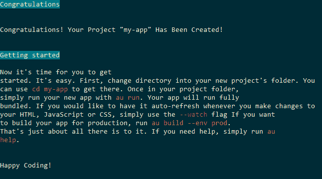

# 运行我们的应用程序

接下来，我们将查看运行选项。此选项允许我们运行应用程序，并提供一个选项，通过指定 `--watch` 选项来创建一个生产性开发环境，该选项配置了一个监视器来检测源代码中的更改并自动更新浏览器。这个酷炫的功能被称为浏览器同步或自动刷新。

`run` 命令还允许我们指定我们想要执行应用程序的环境；这些是默认环境：`dev`、`stage` 和 `prod`。默认情况下，CLI 将使用 `dev` 环境运行我们的应用程序。使用 `--env` 标志来更改它。

每个环境究竟意味着什么？在软件开发中，通常当你编写应用程序时，你会在本地开发环境中测试你的代码（`dev`）。一旦你认为它已经完成，你将其发送到质量保证区域进行测试，这些测试不会在你的机器上执行，因此你需要导出你的应用程序并将其部署到另一台服务器上，这将被称为 `test` 环境。最后，一旦 QA 人员批准，你的代码将部署到真实世界的环境（`prod`）。当然，这是一个非常基本的范围，你将在其他公司找到更多环境，如 UAT（用户验收测试）。

例如，让我们进入我们的应用程序（使用 `cd` 命令）并执行以下命令：

```js
cd my-app
au run --watch --env prod
```

以下是在两个 URL 中可以看到我们的应用程序正在运行并运行的输出：

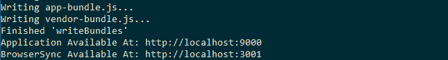

在你喜欢的网络浏览器中打开 `http://localhost:9000` URL，你应该会看到以下内容：

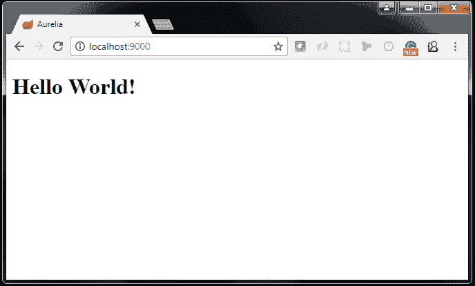

注意控制台中的最后两行。这些行告诉你应用程序正在哪个端口上运行，这可能会根据你的操作系统和可用的端口而有所不同。

现在，让我们测试一下自动刷新功能，记住这个功能是通过在 `au run` 命令中添加 `--watch` 选项来启用的。

打开位于`src`文件夹中的`app.js`文件，将`'Hello World!'`字符串更改为`'Hola Mundo!'`：

```js
export class App {
  constructor() {
    this.message = 'Hola Mundo!';
  }
}
```

保存它并回到您的浏览器；CLI 将检测您在`app.js`文件中做出的更改，并将自动刷新您的浏览器。

为了更高效，您可以使用两个显示器——一个用于在浏览器中运行应用程序，另一个用于源代码编辑器。

# 测试我们的应用程序

当然，测试是所有开发者都需要掌握的重要技能。我们有一个完整的章节来讨论测试，并讨论 TDD、单元测试和端到端测试。

测试命令带有`--watch`和`--env`标志。使用 watch 选项告诉 CLI 检测`test`文件夹中的更改并再次执行测试。

为了运行测试，CLI 使用 Karma，这是一个配置为使用 Jasmine 测试框架来编写所有应该保存在`test`文件夹中的测试文件的测试运行器技术。

例如，前面的命令将运行位于`test/unit`文件夹中的`app.sec.js`文件：

```js
au test --watch --env stage
```

以下是一个测试成功执行后的输出结果：


# 构建我们的应用程序

现在是部署我们的应用程序的时候了，但在我们这样做之前，我们需要压缩和精简我们的 Aurelia 代码。Aurelia CLI 为我们提供了构建选项，以生成包含所有应用程序代码的、准备就绪的部署文件。

由于您可能想要为不同的环境（`dev`、`stage`或`prod`）构建应用程序，这个构建选项还带有`--env`标志。例如，在您的项目中执行以下命令：

```js
au build --env prod
```

以下是一个`my-app`项目的示例输出：


如输出所示，生成了两个主要文件：`app-bundle.js`，其中包含我们的应用程序逻辑，以及`vendor-bundle.js`，其中包含第三方依赖项。这两个文件被生成到我们的根应用程序文件夹中的`scripts`文件夹。

如果您想运行您的应用程序并检查您最近创建的打包文件是否一切正常，让我们使用`npm`安装`http-server`模块。在您的终端中运行以下命令：

```js
npm install -g http-server
```

现在，在您的应用程序根文件夹中创建一个`dist`文件夹，并将`index.html`页面和包含我们的打包文件的`scripts`文件夹复制进去。

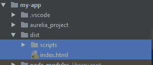

对于最后一步，在终端中进入`dist`文件夹，并运行以下命令：

```js
cd dist
http-server 
```

使用`cd`命令在您的终端中导航到您的文件夹。

此命令将暴露一些四个 URL，其中 Web 服务器正在运行；复制第一个 URL 并在您的网络浏览器中打开它，您应该会看到您的应用程序正在运行：

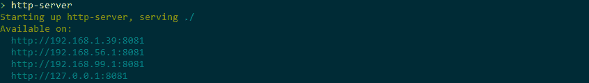

# 生成自定义资源

Aurelia，像许多 JavaScript 框架一样，允许你创建可重用的组件，这有助于你避免编写重复的代码，在应用程序的多个部分中重用你的组件，并且可以将它们作为插件导出以在其他项目中重用。

Aurelia 允许你使用以下模板生成可重用的代码片段：

+   组件

+   自定义元素

+   自定义属性

+   绑定行为

+   值转换器

这些模板都位于我们的项目根目录中的`aurelia_project/generators`文件夹中。例如，以下命令生成一个自定义 Aurelia 元素：

```js
au generate element my-reusable-element
```

根据您选择的**类型**，源代码将在`src/resources/{type}`文件夹中生成。

每个类型将在接下来的章节中进行讨论，所以如果你不理解它们之间的区别，请不要感到难过。继续阅读，我的朋友！ :)

# 世界杯应用程序概述

现在是时候讨论我们将一起构建的应用程序了。当然，除了我们用 Aurelia 编写的 Web 应用程序外，我们还需要一个后端服务来持久化我们的数据。对于后端服务，我们将使用 Node.js 和 Express 框架来构建一个健壮的 API，以及 MongoDB 作为我们的非关系型数据存储。以下图表解释了我们的世界杯项目架构：

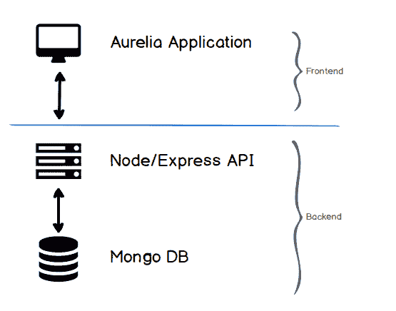

这是一个非常简单的架构；Aurelia 应用程序直接与 Node API 通信，Node API 与数据库通信，该数据库是一个 MongoDB 数据库，使用一个非常流行的开源库 Mongoose。这会变得更好；继续阅读！

# 探索应用程序特性

我们将要开发的应用程序是足球世界杯应用程序。我们将使用一个名为 Materialize 的出色 UI 框架，默认情况下，它将帮助我们创建一个响应式 Web 应用程序，因此我们的用户可以在他们的移动和桌面浏览器中打开这个应用程序，并拥有可适应的用户界面。

尽管这是一个简单的应用程序，但我们将涵盖 Aurelia 在真实生产应用程序中最重要的一些概念。我们将随着书籍的进展来改进这个应用程序。以下是我们将为这个应用程序开发的特性列表：

+   比赛资源管理器

+   团队资源管理器

+   新闻

+   管理员门户

+   社交认证

因此，让我们开始探索这个应用程序提供给用户的功能。

# 比赛资源管理器

这个特性与整个竞赛中的比赛相关。用户将能够执行以下操作：

+   列出比赛活动

+   创建新的比赛，需要管理员权限

# 列出比赛

用户将看到以卡片形式表示的比赛列表。向用户展示一个日历来导航并查看按天安排的比赛。原型如下所示：

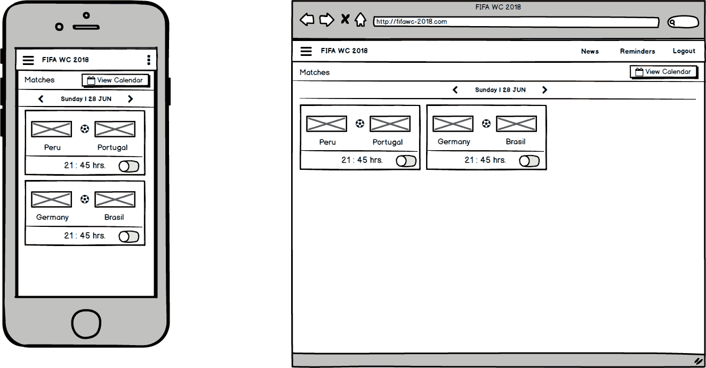

# 创建新的比赛

要创建新的比赛，需要一个管理员账户。一旦用户认证成功，他们可以通过选择队伍和时间来安排新的比赛。原型如下所示：


# 团队资源管理器

这个功能与整个比赛中的比赛相关。用户将能够执行以下操作：

+   列出团队

+   创建一个新的团队，这需要管理员权限

# 列出团队

用户将看到以卡片形式表示的团队列表。原型如下：

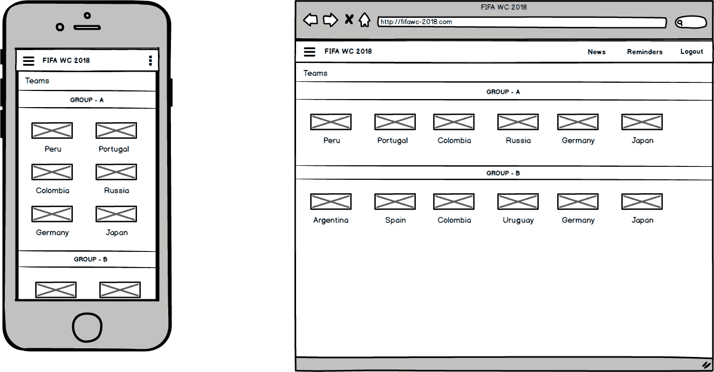

# 创建一个新的团队

要创建一个新的团队，需要一个管理员账户。一旦用户验证通过，他们就可以创建一个新的团队。原型如下：

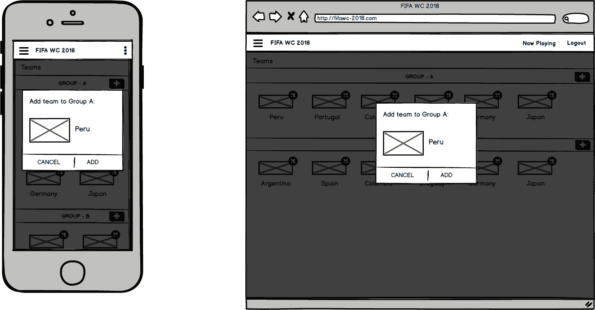

# 新闻

这个功能与新闻相关。用户将能够执行以下操作：

+   列出新闻

+   创建一个新的项目，这需要管理员权限

# 列出新闻

用户将看到以卡片形式表示的新闻列表。原型如下：


# 创建一个新的

要创建一个新的团队，需要一个管理员账户。一旦用户验证通过，他们就可以创建一个新的团队。原型如下：

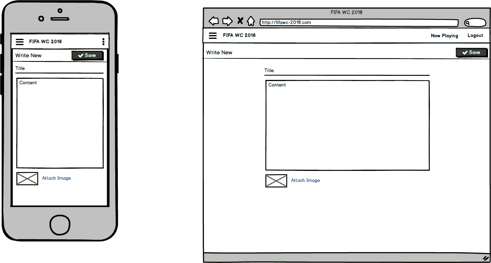

# 社交认证

用户将能够使用他们的 Google 或 Facebook 账户登录。原型如下：


既然我们已经对我们的开发应用程序有了想法，让我们继续创建初始应用程序项目。

# 创建我们的应用程序

让我们开始创建我们的应用程序。如果您还记得我们关于 Aurelia CLI 的最后一节，我们需要再次使用它来创建一个新的应用程序，所以打开您最喜欢的终端工具并执行以下命令：

```js
au new worldcup-app
```

在终端中输入以下输入：

1.  选择`3`以定义此项目的自定义选项

1.  第一个选项：`您想使用哪个模块加载器/打包器？ RequireJS（默认）`

1.  第二个选项：`您想使用哪个转译器？ : Babel（默认）`

1.  第三个选项：`您想如何设置模板？ : 默认（无标记处理。）`

1.  第四个选项：`您想使用什么 CSS 处理器？`在这种情况下，我们将选择`Sass`（`3`）

1.  第五个选项：`您想配置单元测试吗？`当然，我们将标记为`是（默认）`

1.  第六个选项：`您的默认代码编辑器是什么？`我们使用 WebStorm，但您可以选择您最熟悉的。

现在，您将在控制台上看到您应用程序的主要结构：

```js
Project Configuration
    Name: worldcup-app
    Platform: Web
    Bundler: Aurelia-CLI
    Loader: RequireJS
    Transpiler: Babel
    Markup Processor: None
    CSS Processor: Sass
    Unit Test Runner: Karma
    Editor: WebStorm
```

1.  最后，选择`1`以创建项目并安装项目依赖项

这是一个自定义设置。我们的项目将由以下功能组成：

+   **RequireJS**：广为人知的文件和模块加载器，具有良好的浏览器支持。另一个选项可以是 SystemJS 和 Webpack。

+   **Babel**：Babel 是目前最常用的*转译*工具之一。`转译器`是一种将 JavaScript ES6 语法或更高版本的代码转换为 ES5 代码的工具。为什么？因为大多数浏览器还没有很好地支持最新的 JavaScript 版本。

+   **标记处理**：它加载我们的模块并创建最终文件，这些文件将被浏览器解释。在这个阶段，我们不会使用自定义的标记处理。

+   **SASS**：一个很好的预处理器 CSS 库，我们将在下一章中更详细地回顾它。

+   **Karma**：一个 JavaScript 测试库。我们将在第三章 *测试和调试* 中更详细地讨论它。

+   **WebStorm**：一个非常适合 JavaScript 开发的 IDE。虽然它不是免费的，但如果你有来自你大学或机构的官方教育邮箱，你可以获得一年的学生许可证。

一切准备就绪后，用你最喜欢的编辑器打开 `worldcup-app` 文件夹。

我们知道 Webpack 是一个非常出色的模块加载器，但出于学习目的，我们更愿意在整个这本书中使用 RequireJS，因为它更简单，并让我们更好地解释如何手动配置我们将在这本书中使用的每个工具和库。

# 项目结构

Aurelia CLI 将生成带有其基本结构的源代码，其中所有配置都已就绪，可以开始编写应用程序的源代码。

以下截图显示了根应用程序文件夹：

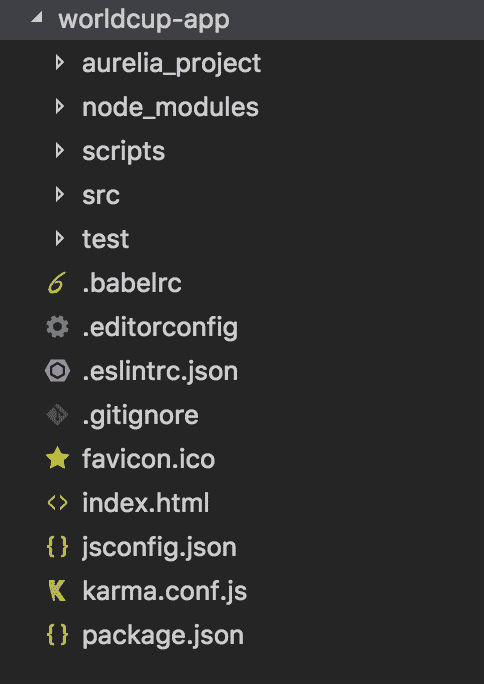

让我们开始讨论 `aurelia_project` 文件夹，它包含主要的 `aurelia.json` 配置文件，其中包含所有关于依赖项、错误处理、构建目标、加载器、测试运行时工具（如 Karma）、测试框架等设置。你将经常修改此文件以指定应用程序需要使用的新依赖项。

`aurelia_folder` 中的下一个元素是 `environments` 文件夹，其中包含三个文件：`dev.json`、`stage.json` 和 `prod.json`。这些文件包含的值取决于你正在运行的环境。你还记得运行选项中的 `--env` 标志吗？CLI 将使用这些文件之一来配置我们应用程序的环境值。

剩下的两个文件夹是 `generators` 和 `tasks`。它们分别用于生成 Aurelia 自定义可重用组件和声明 gulp 任务。

`scripts` 文件夹包含执行 `au build` 命令后生成的捆绑包。

如你所猜，`src` 文件夹包含我们的应用程序源代码，接着是 `test` 文件夹，其中包含测试我们项目的源代码。

# 引导过程

就像许多 JavaScript 框架（如 Angular 和 React）一样，Aurelia 需要 `index.html` 页面中的一个位置来挂载应用程序。这个位置被称为入口点。打开 `index.html` 文件，你应该会看到以下代码类似的内容：

```js
<!DOCTYPE html>
<html>
  <head>
    <meta charset="utf-8">
    <title>Aurelia</title>
    <meta name="viewport" content="width=device-width, initial-scale=1">
  </head>

  <body aurelia-app="main">
    <script src="img/vendor-bundle.js" data-main="aurelia-bootstrapper"></script>
  </body>
</html>
```

Aurelia 需要一个 HTML 元素来加载我们的应用程序。默认情况下，应用程序是在`body`元素中加载的；我们知道这一点是因为这个元素使用了`aurelia-app`属性，该属性用于指定包含我们应用程序所有配置的主 JavaScript 脚本文件，正如你所注意到的，默认情况下，Aurelia 被配置为使用`main`文件。以下`main.js`文件的内容：

```js
import environment from './environment';

export function configure(aurelia) {
  aurelia.use
    .standardConfiguration()
    .feature('resources');

  if (environment.debug) {
    aurelia.use.developmentLogging();
  }

  if (environment.testing) {
    aurelia.use.plugin('aurelia-testing');
  }

  aurelia.start().then(() => aurelia.setRoot());
}
```

让我们分析这个文件；第一行从根文件夹中的`environment.js`文件导入环境变量。当您指定`--flag` `{env}`选项时，CLI 会在`aurelia_project`文件夹中查找`{env}.json`文件，并将其内容复制到`environment.js`文件中。

此文件还导出单个**`configure`**函数，该函数接收一个参数，即`aurelia`对象，您可以使用它来覆盖默认配置并在应用程序启动之前添加任何代码。例如，您可以告诉 Aurelia 您希望声明组件为全局（功能），配置国际化以管理不同语言等。

一旦配置了`aurelia`对象，代码的最后一行将把我们的应用程序渲染到具有`aurelia-app`属性的根 HTML 元素中，在`index.html`页面中。默认情况下，它将`app.js`组件渲染到根元素中。当然，我们可以通过传递您希望渲染的元素作为第一个参数，以及您希望渲染应用程序的 HTML 元素作为第二个参数来覆盖默认值：

```js
 aurelia.start().then(() => aurelia.setRoot('my-component', document.getElementById('my-div')));
```

我们将在过程中修改这个文件；需要记住的最重要的事情是，这个文件在应用程序渲染之前被处理，除了`Aurelia.json`文件外，这是第二个最重要的文件。以下图表解释了引导过程：

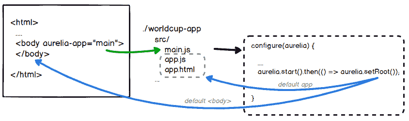

现在您已经了解了引导过程是如何工作的。让我们了解如何创建可重用的组件。

# 理解组件

在最后一节中，我们了解到 Aurelia 需要一个组件作为我们整个应用程序的根组件，默认情况下，它是应用程序组件。现在让我们来探索这个组件。

**组件**由两个文件组成，第一个是用 JavaScript 编写的，包含组件的视图模型，第二个是用 HTML 编写的标记模板。它们必须具有相同的文件名，以帮助视图模型解析其视图模板。组件的视图模型是一个 JavaScript 文件，它导出一个包含组件属性和函数的类。例如，这是`app.js`组件的内容：

```js
export class App {
  constructor() {
    this.message = 'Hello World!';
  }
}
```

`App`类声明了一个构造函数，用于初始化`message`属性。属性可以在`constructor`中声明，也可以在它之外定义。考虑以下示例：

```js
export class App {
  message = 'Hello World!';
}
```

当你声明简单的类，如 **Plain Old CLR Objects** （**POCO**），现在它实现的功能不仅仅是获取和设置其属性值时，使用外部属性声明风格。

要使用在 `app.js` 视图模型中定义的属性，我们需要一个具有相同文件名的 HTML 模板。打开 `app.html` 文件以查看其内容：

```js
<template>
  <h1>${message}</h1>
</template>
```

首先要注意的是，在视图模型中声明的 `message` 属性是存在的，但为了绑定值，我们必须使用 `${}` 字符串插值运算符。最后，当 Aurelia 在网页中渲染组件时，`${message}` 声明将被 `'Hello World!'` 替换。

我们可以通过添加可以从模板中调用的函数来扩展我们的组件。例如，让我们声明 `changeMessage()` 函数：

```js
export class App {

  constructor() {
    this.message = 'Hello World!';
  }

  changeMessage() {
 this.message = 'World-Cup App';
 }

}
```

从前面的代码中，你可以看到声明一个函数是多么简单；我们使用与 `constructor` 声明相同的语法。如果你想使用在 `App` 类中声明的属性，你必须使用 `this` 保留字来访问任何属性或函数。

现在是时候调用我们的 `changeMessage` 函数了。首先，我们将在 `app.html` 文件中的模板中创建一个按钮，并声明一个触发器到按钮的 `click` 事件。打开 `app.html` 文件并应用以下更改：

```js
<template>
  <h1>${message}</h1>
  <button click.trigger="changeMessage()">Change</button>
</template>
```

这里要注意的第一件事是我们没有使用默认的 HTML `onclick` 事件；相反，我们使用没有 `on` 开头的 `click` 事件。这个约定仅用于 Aurelia 模板引擎。因此，我们说我们想要通过将此函数绑定到 `click` 事件来调用 `changeMessage()` 函数，使用 `trigger` 绑定机制。

通过在终端中执行 `au run` 命令来启动你的应用程序，并测试一下。当你点击“更改”按钮时，你应该看到消息从 `'Hello World!'` 更改为 `'World-Cup' App'`。`h1` HTML 元素发生了变化，因为我们之前已经将 `${message}` 属性声明并绑定到其内容中。

绑定是一个我们在下一章中将更详细地讨论的大概念。所以，继续阅读吧，朋友，这才刚刚开始。

# 摘要

在本章中，你学习了 Aurelia 与其他流行框架的不同之处；我们将 Aurelia 与 ReactJS 和 Angular 进行了比较。我们看到 Aurelia 更轻量级，性能更好，但最重要的是，Aurelia 基于 ECMAScript 6 标准。因此，与其学习一个框架，不如使用 Aurelia 学习一个国际标准。

此外，我们还安装了 NodeJS 和 NPM；这两项开源技术非常重要，因为 Aurelia 需要它们来设置我们的开发环境并安装我们的依赖项。

我们详细探讨了 Aurelia 命令行工具，深入了解了它的功能，现在你对它已经很熟悉了，并且能够创建、启动、测试和构建你的应用程序。

最后，我们讨论了我们将要构建的示例应用——一个令人惊叹的 FIFA 世界杯单页应用。你也学习了 Aurelia 组件是什么，并了解了它们如何将视图模型和模板分别拆分为两个单独的文件，这两个文件必须使用相同的文件名，分别带有 `.js` 和 `.html` 扩展名。

在下一章中，你将学习如何通过在我们的应用中安装和配置 Google Material Design 插件来为我们的应用添加样式和颜色。享受下一章吧！
