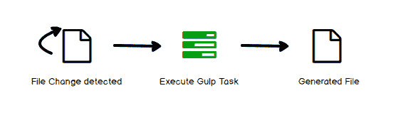
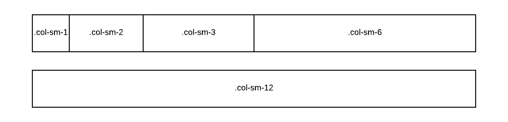
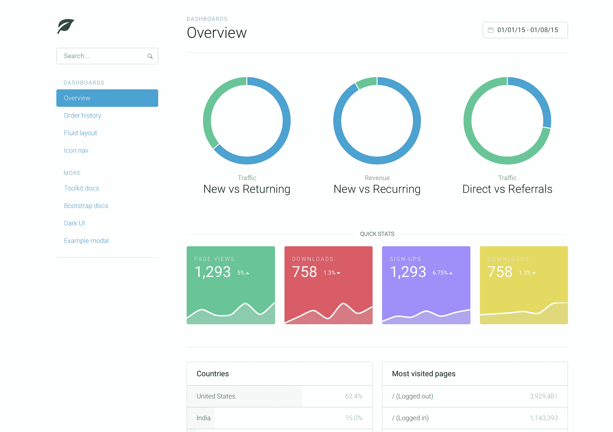
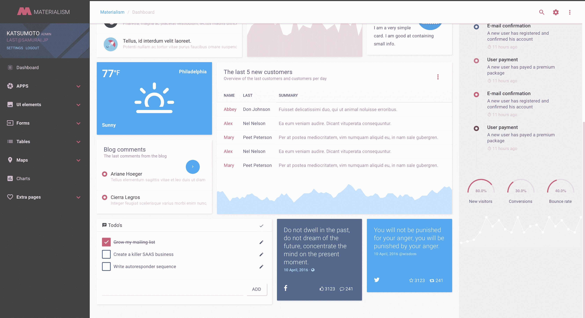
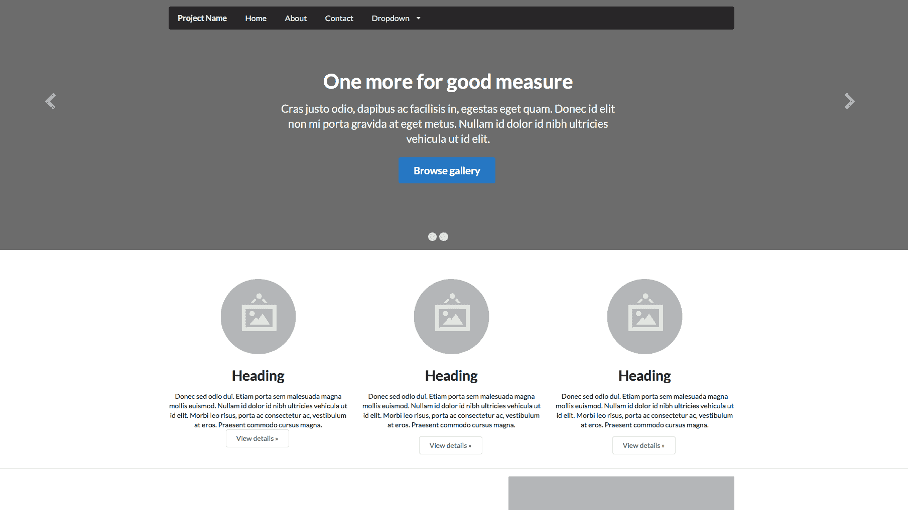
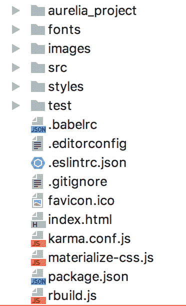

# 第二章：用户界面样式化

我们现在有一个正在运行的爱瑞利亚（Aurelia）应用程序，并且了解了 JavaScript 编程的所有基本原理。我们的“Hello World！”消息出现在屏幕上，但你难道不觉得它有点简单和静态吗？在这一章中，我们将探讨如何使用现代工具如 SASS 和 LESS 为我们的应用程序添加样式。我们还将讨论目前使用的一些最重要的样式库，如 Bootstrap、Semantic UI 和 Material Design。最后，利用我们之前的学习，让我们通过配置项目以使用 Aurelia-Materialize 插件，使我们的应用程序看起来酷炫、神奇且吸引人。我们将为此目的使用的一些工具包括：

+   CSS 预处理器：SASS，LESS

+   任务自动化工具：Gulp

+   CSS 库：Bootstrap，Material Design，Semantic UI

听起来很激动人心吗？我们知道是的，首先我们需要开始谈论 CSS，你之前听说过吗？不用担心，我们将以简明而一致的方式解释它。只是 CSS 并不那么神奇，所以我们将向你介绍一些工具，让你的样式表变得神奇！工具如 SASS 和 LESS 对于这些目的非常有用，但每次我们需要使用它时，都需要运行一些命令，所以我们还将讨论任务自动化工具。不再需要手动重复命令！最后，我们不需要重新发明轮子。我们有 CSS 库，包含不同的设计模板，每个模板都针对不同的概念和目的。最后但同样重要的是，我们将练习使用所有这些神奇的工具来配置我们之前创建的应用程序，使我们的开发过程更加友好和有趣。我们相信你一定会觉得这一章非常有趣和有用，所以让我们开始吧！

# 谈论 CSS

基本上，CSS 是一种描述某些 HTML 文件（也可以用于 XML）样式的语言结构，定义了它应该如何显示。这种结构允许开发者管理一个或多个网页上的行为；对某些 CSS 元素所做的任何更改都将反映在所有与之链接的 HTML 元素上。

# 它是如何工作的？

CSS 基于规则。这些规则定义在 `.css` 文件上，称为 **样式表**。样式表可以由一个或多个规则组成，应用于一个 HTML 或 XML 文档；规则有两个部分：选择器和声明：

```js
h4 { color : red}
```

`h4` 元素是选择器，`{ color : red }` 是声明。

选择器充当文档和样式之间的链接，指定将受到该声明影响的元素。语句是规则的一部分，说明了效果将是什么。在之前的例子中，选择器 `h4` 指示所有 `h4` 元素都将受到声明的影响，该声明指出颜色属性将具有网络值（红色）对于文档或链接到该样式表的文档中的所有 `h4` 元素。

我们有三种方式将我们的样式表与 HTML 文件链接。

第一种方法是使用`<link>`元素，在 HTML 文件的`<head>`部分。我们只需要指定我们的样式表的绝对或相对路径/URL，以便将其导入我们的网页：

```js
<!DOCTYPE html>
<html lang="en">
<head>
 <title>Aurelia is Awesome</title>
 <link rel="stylesheet" type="text/css" href="http://www.w3.org/css/officeFloats.css" />
</head>
<body>
.
.
</body>
</html>
```

接下来，我们可以使用 HTML 文件的`<style>`元素，通常也在`<head>`部分。它将在我们的文件被应用程序调用时加载：

```js
<!DOCTYPE html>
<html lang="en">
<head>
    <style type="text/css">
        body {
 padding-left: 11em;
 font-family: Georgia, "Times New Roman", serif;
 color: red;
 background-color: #d8da3d;
 }
 h1 {
 font-family: Helvetica, Geneva, Arial, sans-serif;
 }
    </style>
</head>
<body>
 <!--Here the styles will be applied-->
</body>
</html>
```

或者，我们可以直接使用`style`标志来样式化 HTML：

```js
<!DOCTYPE html>
<html lang="en">
<head>
    <!--Nothing here-->
</head>
<body>
    <h1 style="color: blue">Aurelia is awesome!</h1>
</body>
</html>
```

准备给我们的应用程序添加一些酷炫的样式了吗？这仅仅是开始！

# 探索 SASS 和 LESS

我们正在复习一些最基础的 CSS 概念，只是为了刷新我们对构成样式表的语法和元素的认知。在现实世界中，一个样式表可能包含超过 20 个属于一个 HTML 页面的类；在极端情况下，这些类可能有一百个或更多。在这些情况下，你可能觉得 CSS 语法非常原始，不是自动解释的，在某些情况下还不完整。在大系统中实现继承很困难，而且随着时间的推移，维护起来也可能变得很困难。

你可以采用不同的方法来编写更好的 CSS 代码，你可以为每个网页定义不同的类，然后在一个单独的 CSS 文件中导入它们，或者你可能可以定义父类并将继承应用于子元素，但在两种情况下，你都需要处理可维护性问题。

正是因为为了编写更好的 CSS 代码，有效地重用代码，并添加一些额外的方法使其更具动态性和对任何开发者都更容易理解，CSS 预处理器成为任何开发者非常常用的工具，提高了他们的生产力，并极大地减少了我们样式表中的代码量。

如我们所预期，每个 CSS 预处理器都有自己的语法，不太不同，也不难学习。它们都支持经典 CSS；额外功能将在我们继续使用目前最常用的两个工具——SASS 和 LESS 时进行解释。

# 变量

想象一下，你正在为公司编写网页代码；你定义样式表，当然，你有一个字体标准颜色用于所有标题、正文等。你正在编写你的 CSS 类和注释，你需要重复相同的颜色值在多个类定义中。好吧，复制和粘贴整个文件中的相同值并不那么困难。你最终将那个网页展示给用户体验设计师，哦，惊喜！那个红色不需要那么深。你需要更正为新颜色代码。这意味着什么？你需要深入到你的样式表中，手动更改每个颜色值为新值。

就像其他编程语言一样，使用 CSS 预处理器，我们可以定义变量，以便在样式表中重复使用它们，避免重复相同的值，并在我们需要调整或更改该值时节省时间。让我们看一个例子：

SASS 语法：

```js
$my-height: 160px;

div {
  height: $my-height;
}
```

然后，LESS 语法：

```js
@my-height: 160px;

div {
  font-size: @my-height;
}
```

它们非常相似，对吧？让我们探索其他功能！

# 嵌套

在纯 CSS 中嵌套元素是一个糟糕的交易。它们不友好，难以阅读，并让我们写很多重复的代码。使用 CSS 预处理器，你将为任何开发者提供更友好的阅读体验；代码自动解释 CSS 正在做什么以及类是如何继承的。看看这个魔法：

使用 SASS 语法：

```js
$my-link-color: #FF0000;
$my-link-hover: #00FFFF;

ul {
  margin: 0;

  li {
    float: left;
  }

  a {
    color: $my-link-color;

    &:hover {
      color: $my-link-hover;
    }
  }
}
```

在 LESS 中使用相同的方法：

```js
@my-link-color: #FF0000;
@my-link-hover: #00FF00;

ul {
  margin: 0;

  li {
    float: left;
  }

  a {
    color: @my-link-color;

    &:hover {
      color: @my-link-hover;
    }
  }
}
```

你需要知道的一件事是，浏览器不会直接解释 SASS 或 LESS 语法。你需要将你的代码转换为正常的 CSS 语法，那么该如何操作呢？在 SASS 的情况下，只需输入以下命令：

```js
$ sass --watch app/sass:public/stylesheets
```

它们都导出了相同的 CSS 输出：

```js
ul { margin: 0; }
ul li { float: left; }
ul a { color: #999; }
ul a:hover { color: #229ed3; }
```

如你所见，CSS 预处理器为我们提供了更友好的可读性和快速理解代码正在做什么的能力。

# 扩展

有时候，你定义了具有共同定义的各种类。使用 `@extend` 特性，你可以定义一个公共类，并让其他类从它扩展，而不是在每个类中复制相同的代码：

SASS 示例：

```js
.block { margin: 25px 58px; }

p {
  @extend .block;
  border: 3px solid #00FF00;
}

ol {
  @extend .block;
  color: #FF0000;
  text-transform: lowercase;
}
```

LESS:

```js
.block { margin: 25px 58px; }

p {
  &:extend(.block);
  border: 3px solid #00FF00;
}

ol {
  &:extend(.block);
  color: #FF0000;
  text-transform: lowercase;
}
```

CSS 输出：

```js
.block, p, ul, ol { margin: 10px 5px; }

p { border: 1px solid #eee; }
ul, ol { color: #333; text-transform: uppercase; }
```

# 如果/否则语句

哦，请，这真是一个非常酷的特性！有了这个特性，你将能够根据确定的条件以响应式的方式控制你页面的外观。

SASS 示例：

```js
@if lightness($my-color) > 90% {
  background-color: #FF0000;
}

@else {
  background-color: #00FF00;
}
```

在 LESS 中，情况并不相同。你需要使用 CSS 守卫：

```js
.mixin (@my-color) when (lightness(@my-color) >80%) {
  background-color: #00FF00;
}
.mixin (@my-color) when (lightness(@my-color) =< 80%) {
  background-color: #FF0000;
}
```

这些并不是所有预处理器功能，但在这个时候，它们已经足够我们开始我们的 FIFA 世界杯应用程序的开发工作了！

# 使用 Gulp 自动化任务

在上一节中，我们学习了如何使用 CSS 预处理器以及如何将 SASS/LESS 代码编译成纯 CSS 以供浏览器解释。请注意，每次你进行更改时，你都需要重新编译整个文件，这意味着你需要输入相同的命令并执行相同的工作一次、两次以及多次。是的，这真的很无聊。幸运的是，我们有任务自动化工具。这意味着什么？其他工具会为我们做这些脏活。

# 理解 Gulp

Gulp 是一个基于 JavaScript 的开源任务运行器，它使用代码覆盖配置的方法来定义其任务。这些可能包括以下内容：

+   打包和压缩库和样式表

+   保存文件时刷新浏览器

+   快速运行单元测试

+   运行代码分析

+   LESS/SASS 到 CSS 编译

+   将修改后的文件复制到输出目录

这个工具使用了 Node.js 的流模块；首先，我们需要定义什么是流。它可以被定义为一个允许在一个文件上读取数据并通过管道方法将其传输到另一个地方的工具。Gulp.js 的主要特性是它不会像其他自动化工具那样将文件/文件夹写入硬盘，这是一个很好的特性，因为我们可以配置多个任务，而不会影响我们的计算机性能。

# Gulp.js 是如何工作的？

正如我们之前所说的，Gulp 不会在硬盘上写入任何内容。因此，所有操作都是在文件系统级别执行的。它观察预先配置的文件以检查任何更改（读取），在编辑之后，它将重写与另一个文件链接的编译内容，或者执行一些预配置的命令。



# 安装 Gulp

Gulp 在 Windows、Linux 和 macOS 上可用。在任何这些操作系统上的安装过程都非常相似，唯一的区别是在基于 UNIX 的平台你需要以管理员身份运行安装命令。你需要在你的 PC 上已经安装了 Node 和 NPM。要安装，请输入以下命令：

```js
$ npm install –g gulp
```

让我们在安装过程完成后等待几分钟，然后验证一切是否正常：

```js
$ gulp –v

CLI Version 3.9.0
```

就这些！我们现在已经安装了 Gulp 并准备好自动化任务了！

首先，你需要确保你的 Web 项目已经配置好导入`npm`模块；如果不存在`package.json`文件，你必须使用`npm init`命令创建一个。要开始使用 Gulp，只需输入以下命令：

```js
$ npm install --save-dev gulp
```

这将在你的项目本地安装 gulp 节点模块。记住，`--save-dev`标志让`npm`更新其`package.json`文件中的`devDependencies`部分，以便仅在开发时解析。

下一步是创建`gulpfile`。此文件将作为清单来定义我们想要执行的任务。所有这些都应该定义在这个文件中；让我们通过一个示例来了解：

```js
// gulpfile.js
var gulp = require('gulp');

gulp.task('hello-world', function(){
    console.log('hello world');
});
```

`require`是一个 Node 函数，用于添加对模块的引用。由于我们正在引用 gulp 模块，因此我们可以使用这种任务自动化方法。

现在，当我们从命令行运行`gulp hello-world`命令时，任务自动化工具将在`gulpfile`中搜索与名称匹配的任务并执行它。

Gulp 提供了三个主要任务方法：

+   `gulp.task`：用于定义一个带有名称、数组依赖项和执行函数的新任务

+   `gulp.src`：它设置源文件所在的文件夹

+   `gulp.dest`：它设置构建文件将被放置的目标文件夹

Gulp 可以被配置来执行任何任务，例如图像转换、JavaScript 文件转译、连接和大小写处理。让我们看看一些更高级的示例。

# JavaScript 任务

我们将配置一个自动任务，将我们创建的 SCSS 文件转换为 CSS。此代码可以在任何带有 gulp 依赖项预配置的 Web 项目中实现（当然）：

```js
$ npm install gulp-sass --save-dev
```

`gulp-sass`是 Gulp 的一个用于处理 SASS 文件的定制插件。

在将`npm`模块导入我们的项目后，让我们在`gulpfile`中引用它们：

```js
var gulp = require('gulp');
var sass = require('gulp-sass');
```

然后，我们需要创建一个新的任务。让我们称它为`process-styles`：

```js
// SCSS processing
gulp.task('process-styles', function() {gulp.src('sass/**/*.scss')
        .pipe(sass().on('error', sass.logError))
        .pipe(gulp.dest('./css/'));});
```

注意，我们使用 `pipe()` 方法在 `.src()` 和 `.dest()` 部分之间调用任何额外的插件。代码非常直观，我们只是传递 `gulp` `task` 将要查找的文件转换的路由，然后配置一个错误行为，如果发生错误，以及如果一切正常，我们只需指定我们生成的文件的路由。

# 自动化任务

到目前为止，我们已经将一些任务压缩到一个单独的文件中。所有这些压缩将在我们运行 `gulp` 命令时执行。我们可以将预配置的任务组合成一个单独的命令。假设我们已经有三个定义好的任务：`process-styles`、`other-task` 和 `some-other-task`。现在我们只需将这些任务定义到一个新的任务中：

```js
// run all tasks
gulp.task('run', ['process-styles', 'other-task', 'some-other-task']);
```

保存并按 *Enter* 键，在命令行中输入 `gulp run` 命令来执行所有定义的任务。

那很好，但我们仍然需要手动输入命令。鲁佩尔施蒂尔金，这并不在协议中！别担心，我们为你准备了一个最后的惊喜——`gulp.watch()`。使用这个方法，你可以监视你的源文件，并在检测到变化时执行一些任务。让我们将 `watch` 任务配置到我们的 `gulpfile` 中：

```js
// watch for changes in code
gulp.task('watch', function() {
  // some example tasks
  // detect image changes
  gulp.watch(folder.src + 'img/**/*', ['images-task']);

  // detect html changes
  gulp.watch(folder.src + 'html/**/*', ['html-task']);

  // detect javascript changes
  gulp.watch(folder.src + 'js/**/*', ['js-task']);

  // detect css changes <--- Our created task
  gulp.watch(folder.src + 'scss/**/*', ['process-styles']);
  .
  .
  .
  // And so many task as we need to watch! 

});
```

最后，而不是手动运行 `gulp` `watch` 任务，让我们配置一个默认任务：

```js
gulp.task('default', ['run', 'watch']);
```

保存后，只需在终端中运行 `gulp` 命令。你会注意到一个 `gulp` 监视器总是在检查预配置的文件是否发生了任何变化！当然，它包括所有你的 `.scss` 文件！现在你可以更改和添加新的样式，并且可以自动在浏览器中看到反映，无需你自己执行任何命令。如果你想终止这个监视过程，只需按 *Ctrl* + *C* 来中止监视并返回到命令行。现在你真的有一个强大的任务自动化工具配置好了，并且准备使用！Aurelia CLI 预配置了 `gulp` `task` 活动，但了解其背后的工作原理非常重要；此外，如果你认为需要，你还可以修改此配置并添加自定义行为。

# 探索 CSS 框架

我们准备好开始编写我们的第一个 HTML 元素，并为应用程序添加样式。有一些常见元素可以在多个应用程序中重复使用：表格、网格、输入标签、选择等。我们可以定义自己的，但你应该记住，所有这些元素都需要标准化，并且从头开始定义可能是一项艰巨的任务。今天，我们有许多 HTML 库和模板来开始开发我们的视图层，并添加自定义行为以满足我们的需求。让我们探索最常用的 HTML、JS 和 CSS 库。

# Bootstrap

Bootstrap 是最受欢迎和最完整的前端库之一。它由 HTML 模板、预定义的 CSS 类和 JavaScript 文件组成，为每个组件添加更动态的行为。由 Twitter 的 Mark Otto 和 Jacob Thornton 创建，并于 2011 年 8 月作为开源项目发布，Bootstrap 是第一个提供自定义元素和网格系统的库之一，用于设计响应式网页。响应式是什么意思？响应式网页设计是关于创建能够自动调整以在各种设备上看起来都很好的网站，从小型手机到大型桌面。

网格是这个框架最重要的方面。它定义了布局创建的基础。Bootstrap 根据屏幕宽度实现了五个层级或比例。根据您的需要，在超小、小、中、大或超大设备上自定义列的大小。对于从小型设备到大型设备都相同的网格，请使用`.col`和`.col-*`类。当您需要一个特定大小的列时，指定一个编号类；否则，请随意坚持使用`.col`。让我们看看一个小屏幕的例子：



在这里，请记住以下几点：

+   `.col-sm-1`将适合屏幕宽度的 1/12

+   `.col-sm-2`将适合屏幕宽度的 1/6

+   `.col-sm-4`将适合屏幕宽度的 1/3

+   `.col-sm-6`将适合屏幕宽度的 1/2

+   `.col-sm-12`将适合整个屏幕宽度

同样，Bootstrap 包括大量预配置的类来简化我们 HTML 元素的排列，使我们的 Web 应用看起来有序且吸引人。我们真正喜欢 Bootstrap 的另一件事是其高度的可定制性。我们可以转换所有组件，添加自定义行为或样式，而不会与现有库产生任何冲突。一些元素定制的先进设计可能看起来像这样：



不关心目的，Bootstrap 是为了提供针对任何可能业务需求的高度可定制解决方案而创建的。让我们探索更多库！

# 材料设计

由谷歌提供支持，材料设计不仅仅是 CSS/JS 库。它是一个基于形状、阴影和转化的完整设计哲学。材料设计基于三个主要原则。

# 材料是隐喻

将你周围的所有空间视为一个运动系统。你可以触摸它，你可以感受它，并观察当你互动时它如何改变它们的方面。平面表面、纸张和颜色在我们的日常生活中很常见，Material 使用这些属性为最终用户创建一个直观且熟悉的界面，提供一大套动画而不违反物理规则。

# 粗体、图形和有意为之

令人愉悦的视觉体验，Material Design 不会侵扰或具有侵略性。它通过颜色、比例和空白空间实现基于意义的层次结构，邀请用户与网页界面互动。

# 动画赋予意义

动画尊重并强化了用户作为主要推动者的地位。主要用户操作是引发运动的转折点，从而改变整个设计。动作和反应规则，有助于集中注意力和保持连续性。

正如我们之前所说，Material 不是一个库，但许多库都是基于 Material 的，而目前最常用的之一是 Materialize。这个库提供了与其他库相同的功能，例如网格系统、预构建组件和自定义行为，不同之处在于所有这些都是在遵循 Material Design 原则的基础上创建的。让我们看看使用 Materialize 开发的网页示例：



正如你所见，Material 接口简单、干净、一目了然。

# Semantic UI

邻居中新来的家伙，Semantic 带来了基于模式、手风琴元素、3D 变换、评分等功能的大量独特新特性。

"Semantic 通过创建 UI 的共享词汇来赋予设计师和开发者力量。"

- Semantic UI 团队

为什么选择 *Semantic*？因为它提供了听起来非常自然的类名，而不是随机的类名，当然，它还描述了 CSS 类对 HTML 元素所执行的操作。

让我们看看实现与其他前端库的不同；在 Bootstrap 中，CSS 类的名称对人类阅读非常友好：

```js
<div data-role="header">
    <a href="#"
       class="ui-btn-left ui-btn ui-btn-inline ui-mini ui-corner-all ui-btn-icon-left ui-icon-delete">Cancel</a>
    <h1>My App</h1>
    <button class="ui-btn-right ui-btn ui-btn-b ui-btn-inline ui-mini ui-corner-all ui-btn-icon-right ui-icon-check">
        Save
    </button>
</div>
```

使用 Semantic UI 库，类使用人类语言。这非常友好！编码更像是在写常规文本：

```js
<div class="ui stackable inverted divided equal height stackable grid">
```

Semantic UI 提供了许多主题，并且它们很容易配置。例如，以下截图显示了使用 Semantic UI 开发的网页：



你可以在 [`semantic-ui.com`](https://semantic-ui.com) 上了解更多关于这个出色库的信息。

所提到的库都是基于移动优先的。这意味着什么？让我们继续探索！

# 移动优先方法

移动优先是一种相对较新的网页设计方式，它通过始终从小型屏幕设备（如手机或平板电脑）开始，促进响应式设计。当你开始设计时，你必须对产品将在哪里显示有一个清晰的想法。

现在，是时候选择一个前端库来开始创建我们的第一个项目组件了。在我们看来，Material Design 可以给最终用户带来更自然的感觉，在移动设备上看起来也很棒（Android UI 基于 Material）。Bootstrap 也是一个不错的选择，在小屏幕上仍然看起来像普通的网页。对于 Semantic UI 也是如此，但这个库有过渡和动画，我们将会非常怀念。所以，让我们开始使用 Materialize 库配置我们的项目。

# 使用 Aurelia-Materialize 配置我们的项目

正如我们在上一节中提到的，Material Design 不是一个库。然而，许多库都是基于 Material 理念的，因此我们将选择 Materialize CSS。它们的组件看起来非常自然，最好的部分是 Aurelia 有自己的这个库的实现，称为 Aurelia-Materialize，这将极大地便利我们在开发过程和集成中的工作。

让我们打开我们创建的 FIFA 世界杯应用程序，并将终端设置在根目录；然后我们需要安装一些依赖项。按照以下顺序执行以下命令：

+   `$ au install jquery`

+   `$ au install tslib`

+   `$ au install materialize-amd`

+   `$ au install aurelia-materialize-bridge`

在我们的 `index.html` 文件中，让我们包含要导入到我们项目中的 Material Design 图标：

`<link href="https://fonts.googleapis.com/icon?family=Material+Icons" rel="stylesheet">`

接下来，在我们的 `main.js` 文件中，我们需要配置我们的新插件：

`aurelia.use.plugin('aurelia-materialize-bridge', b => b.useAll().preventWavesAttach());`

`b => b.useAll()` 脚本允许我们将所有 Aurelia-materialize 组件加载到我们的项目中。如果您只需要其中的一些，您可以按照以下方式指定每个组件：

```js
.plugin('aurelia-materialize-bridge', bridge => {
    bridge
        .useButton()
        .useCollapsible()
        .useModal()    
        .useTabs()   
        .useWaves().preventWavesAttach();
});

```

然后，我们需要将生成的 `.css` 文件添加到 `index.html` 文件中：

`<link rel="stylesheet" href="styles/css/materialize.min.css">`

由于我们在上一章中已经安装了 Aurelia CLI，我们正在使用这个功能来获取新的依赖项。请确保您至少有 `0.32.0` 版本。

您已完成！我们终于准备好开始开发我们的生成、配置和运行中的 Web 应用程序了。

到目前为止，您的应用程序文件夹应包含以下（或类似）的项目结构：



如果您正在使用 `Aurelia-CLI` 的早期版本（`0.33.1`），请阅读以下建议：

+   在 `aurelia.json` 文件的 `vendor-bundle.js` 配置的 `prepend` 部分添加 `node_modules/jquery/dist/jquery.js`，并从依赖项部分移除 `jquery`。

+   在 `aurelia.json` 文件的 `vendor-bundle.js` 配置的 `prepend` 部分的末尾添加 `node_modules/materialize-amd/dist/js/materialize.amd.js`，并从依赖项部分移除 `materialize-amd` 配置。

# 摘要

在本章中，我们学习了如何使用 CSS 来样式化我们的 Aurelia 应用程序。我们还探讨了两个最流行的 CSS 预处理器——LESS 和 SASS。我们看到了这些预处理器如何帮助我们使用变量和扩展来开发更强大的样式表。

我们探讨了如何使用 Gulp 自动化任务。Aurelia CLI 使用 Gulp 来执行所有与之相关的任务。

最后，我们探讨了不同的 CSS 框架，并配置了 Google 的 Material Design 框架。我们使用 Material Design 创建了示例应用程序，并利用了最常见的 UI 元素。

在下一章中，我们将看到如何通过在我们的开发过程中采用测试驱动开发（Test-Driven-Development）来在我们的代码中应用测试。继续阅读！
