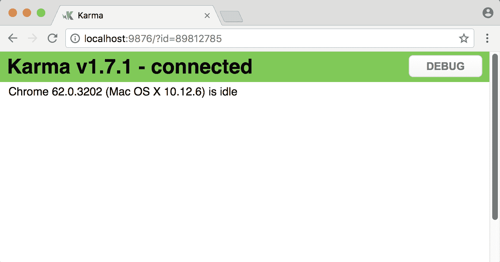
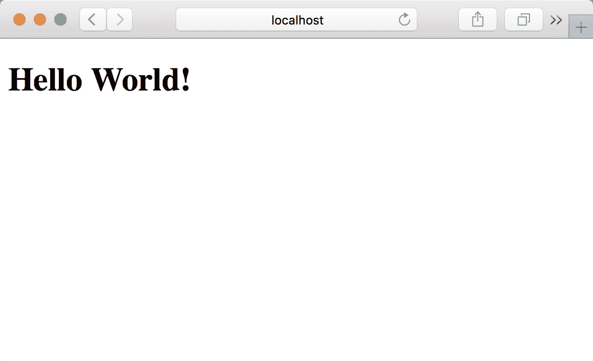
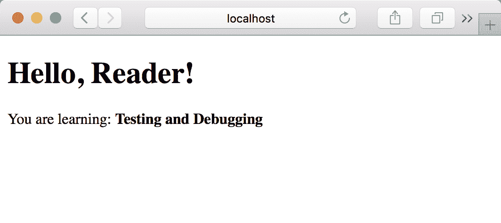
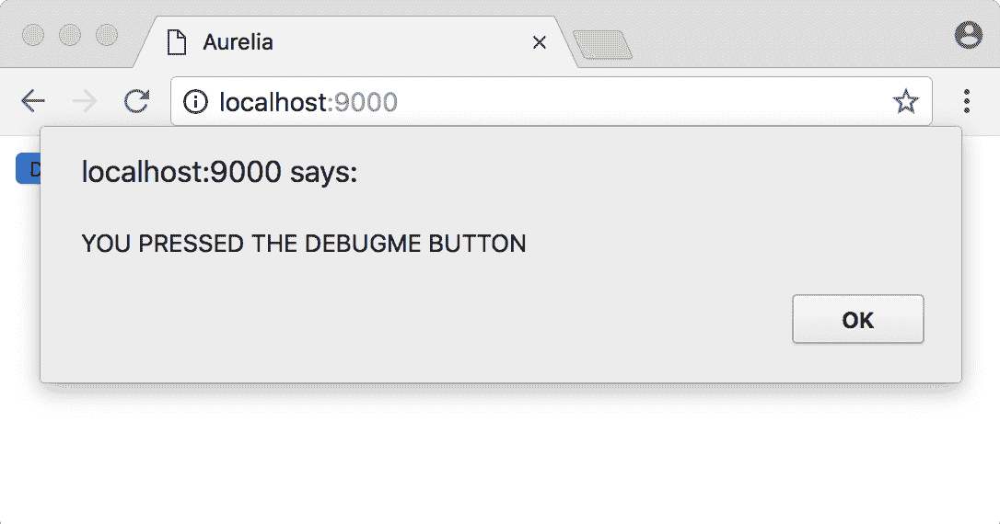
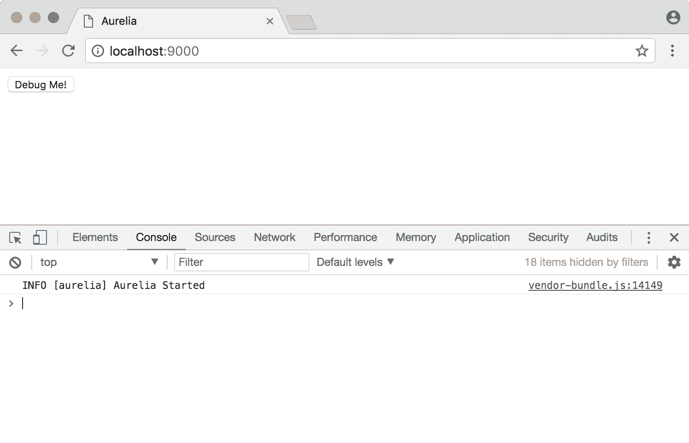

# 测试和调试

测试是开发过程中最重要的阶段之一。无论您正在处理哪种类型的项目，如果您想交付高质量的应用程序并让用户满意，测试是关键。

想象一下，如果您的最喜欢的出租车应用程序让您的司机带您去错误的地方，或者您的行程价格比预期的高？这个尴尬的错误无疑会引发一系列灾难性事件，损害应用程序的声誉，更糟糕的是，公司的声誉。

学习如何测试我们的 Aurelia 应用程序以及如何正确应用**测试驱动开发**（**TDD**）方法将提高您应用程序的质量，避免尴尬的错误，让您的用户更满意，并使您成为一名更好的开发者。因此，在本章中，我们将涵盖以下主题：

+   测试的好处

+   TDD

+   Aurelia 测试框架

+   练习测试

+   调试我们的代码

# 测试的好处

将*测试*纳入我们的开发流程，在项目的每一层都带来了许多好处。在我们开始编写测试应用程序的代码之前，让我们回顾一下良好的测试为以下方面带来的好处：

+   开发团队

+   项目

+   组织

+   用户

# 对于开发团队

如果您在一个有多名成员的团队中工作，您可能经历过这样的时刻：一名成员推送了一些更改，而应用程序没有按预期工作。不仅如此，如果团队没有避免破坏性更改的机制，其他人可能导致的代码冲突可能会降低我们应用程序的质量。

应用测试机制可以帮助我们避免代码中的潜在错误。建议您为应用程序的所有组件编写测试脚本。代码覆盖率百分比是开发团队为应用程序编写测试程度的指标。建议达到 100%的覆盖率；这样，您可以确保每次有人更改代码时，您不会破坏他人的代码。

# 对于项目

如果您在一个*敏捷*团队中工作，您可能熟悉两周或一个月的冲刺。当您在敏捷团队中工作时，尽可能自动化是非常重要的，自动化测试阶段将帮助您的团队快速交付成果。

无需人工干预的自动化测试要求您的团队在应用程序的所有阶段编写测试，例如以下这些：

+   单元测试

+   集成测试

+   UI 测试

+   端到端测试

对于 Aurelia 应用程序，您将学习如何编写单元测试脚本和端到端测试。编写测试并自动化它们将提高我们团队的开发速度。

# 对于组织

保护您所在组织的声誉非常重要。尽可能多地测试我们组织的项目将提高其声誉并使其更加可靠。

有许多情况，大公司因为软件故障而损失了大量资金。如果这些应用程序在发布给用户之前进行了测试，所有这些错误本可以避免。因此，理解良好测试的重要性对于组织的各个方面至关重要。

# 对于用户来说

没有什么比向用户交付不能满足他们需求的应用程序更糟糕的了，更糟糕的是，应用程序充满了错误，质量普遍较差。仔细思考你向用户交付的内容。你编写的代码越多，你的用户就越满意。

# 测试驱动开发

这是一种改变开发者测试其应用程序代码方式的发展方法。以前，开发者实现了他们应用程序的所有业务逻辑，一旦一切都编码完成，他们就会编写测试。

编写测试脚本不是一件容易的任务；想象一下编写你应用程序所有业务逻辑所需的时间，以及你必须为所有可能的场景编写测试的事实，这需要你对系统本身的很多知识，而且如果你是唯一维护代码的开发者，复杂性只会增加。然而，幸运的是，有一个更好的方法来测试事物。TDD 由三个简单阶段组成：


总是记住这三个颜色：红色、绿色和蓝色；它们代表 TDD 周期。处于红色阶段意味着你已经写下了你的代码应该做什么，但功能尚未实现，测试将失败。处于蓝色阶段，意味着你已经实现了代码，测试现在通过没有任何问题，但代码可能需要重构。最后，处于绿色阶段意味着代码和测试都已实现并通过，代码格式良好，任何开发者都容易阅读。

让我们通过编写一个简单的示例来详细说明每个步骤，以便更接近地观察 TDD 阶段。

# 让我们的代码失败

重要的是要知道，我们在这个阶段不会使用任何测试框架。本节的主要目标是了解 TDD 是如何工作的；在本章的后续部分，我们将对测试技术进行全面的介绍。

我们将使用 TDD 创建一个名为`sum`的附加函数，该函数将返回作为参数传递的两个数字的总和。首先，使用你选择的编辑器，创建一个名为`testing.js`的新文件，并添加以下代码：

```js
const assert = require('assert');

function add(n1, n2) {
  return 0;
}
```

首先，我们导入`assert`模块以使用其`equal`函数。`equal`函数期望三个参数：

+   当前要分析的价值或表达式

+   预期值

+   当当前值和预期值不相等时应该抛出的消息

如果断言*失败*，程序将被*终止*，你将在你的终端中看到断言失败的原因。

一旦我们导入了我们的`assert`模块，我们就继续创建我们的`add`函数。然而，这个函数不执行任何操作；这是因为我们的意图是首先编写测试并使其失败，然后我们将在下一个点中实现逻辑本身。在同一个`testing.js`文件中，在`add`函数下方添加以下代码，并添加测试用例：

```js
let result = add(5, 5);
assert.equal( result, 10, "Should be 10");

console.log("Test passed!!");
```

现在我们有了测试用例，它将比较当前值——`add(5, 5)`存放在结果变量中——与预期值——`10`，如果它们不相等，将显示`Should be 10`错误消息，并且由于程序已经完成，下一个表达式——`console.log`——将不会执行。

是时候执行我们的测试了。使用你的终端，进入你创建`testing.js`文件的文件夹，并执行以下命令：

```js
$ node testing.js
```

如果一切出错，你应该看到以下输出：

```js
assert.js:81
  throw new assert.AssertionError({
  ^
AssertionError: Should be 10
    ...
```

好吧！现在是我们实现代码并通过测试的时候了。

# 实现代码

现在，让我们在`add`函数中实现代码。我们将声明一个`result`变量到函数中，用于存放传递给它的两个参数之间的加法运算。打开`testing.js`文件并应用以下更改：

```js

const assert = require('assert');

function add(n1, n2) {

  const result = n1 + n2;

 return result;

}

var result = add(5, 5);
assert.equal(result, 10, "Should be 10");

console.log("Test passed!!");
```

现在我们已经实现了`add`函数的逻辑，下次我们运行测试时，我们期望`assertion.equal`函数不会失败，并且会显示`Test passed!!`消息。让我们试试看。执行以下命令：

```js
$ node testing.js
 Test passed!!
```

正如你所见，测试通过了，现在显示`Test passed!!`消息。通过使用这种先编写测试然后实现的策略，我们可以 100%确信我们的应用程序正在做它应该做的事情。

让我们遵循最后一步来完成我们的 TDD 流程。

# 重构我们的代码

到目前为止，一切正常；我们已经编写了测试和实现，代码正在做我们期望的事情，看起来似乎没有剩下什么要做的。但是，作为一个好的开发者，我们应该寻找使我们的代码更易于阅读并减少代码行数的方法。此外，重构阶段用于更改一些奇怪的变量名，如果需要，还可以添加注释到我们的代码中。

打开你的`testing.js`文件，应用以下更改以使其更易于阅读：

```js
var assert = require('assert');

function add(n1, n2) {
  return n1 + n2;
}

assert.equal(add(5, 5), 10, "Should be 10");

console.log("Test passed!!");
```

第一个更改是在`add`函数中。由于这是一个简单的加法操作，声明一个`result`变量是不必要的，因此我们返回加法结果在`return`函数中，使其更易于阅读。

最后，我们将`add(5, 5)`调用的结果传递给`assert.equal`函数，这样更容易知道你正在尝试测试什么。

正如你所见，TDD 易于实现但稍微有点难于采用；我们（作者们 :D）鼓励你在工作中采用并使用它。这将使你的生活更轻松，并帮助你成为一个更好的程序员，知道如何交付高质量的软件。

现在是时候看看 Aurelia 能提供什么了。继续阅读！

# Aurelia 测试框架

Aurelia 由其他开源测试技术支持，这些技术共同帮助我们设置一个非常高效的开发环境。了解这些技术的根本原理将给我们一个清晰的思路，了解事情是如何运作的，并将为你提供解决未来可能出现的任何问题的知识。

在我们编写第一个 Aurelia 测试之前，让我们了解一下 JasmineJS 和 KarmaJS，这些是 JavaScript 生态系统为我们提供的最棒的测试框架，并且让我们使用 TDD 部分中实现的示例来了解如何使用 Jasmine 语法和断言辅助函数编写测试脚本。

# 学习 JasmineJS

如其网站详细说明，Jasmine 是一个用于测试 JavaScript 代码的行为驱动开发框架：它不依赖于任何其他 JavaScript 框架，它不需要 DOM，并且它有一个干净、明显的语法，这样你可以轻松编写测试。Jasmine 是一个易于学习的框架，它自带断言函数，因此我们不需要安装任何额外的断言库，例如 Chai。让我们开始安装它并探索构建块——套件和测试用例。

# 安装和配置

我们将使用 NPM 工具安装 Jasmine。打开你喜欢的终端并执行以下命令：

```js
$ npm install jasmine --global
```

上述指令将 Jasmine 作为可执行程序安装，你可以在终端的任何文件夹中调用它。我们通过在`npm install`命令中使用`--global`标志来实现这一点。

一旦 Jasmine 安装完成，我们需要创建我们的项目示例骨架来练习使用 Jasmine。为此，我们需要做以下几步：

1.  创建一个名为`practice-jasmine`的新文件夹

1.  通过执行`jasmine init`命令初始化一个新的 Jasmine 项目

1.  编写我们的测试脚本

因此，步骤清晰后，打开你的终端并执行以下命令：

```js
$ mkdir practice-jasmine
$ cd practice-jasmine
$ jasmine init
```

一旦执行了`jasmine init`命令，它将为我们的项目创建以下文件夹结构：

```js
└───spec 
    └───support
      └───jasmine.json

```

你可以通过安装`tree`程序并在`practice-jasmine`文件夹中执行`tree`命令来获取上述树状列表。

如你在项目文件夹的根目录中看到的，有一个`spec`文件夹，我们将在这里保存所有的测试脚本。在`spec`文件夹中，有一个`support`文件夹，其中为我们创建了一个`jasmine.json`文件。此文件包含 Jasmine 将用于查找我们的测试脚本并执行它们的全部配置。使用你选择的编辑器打开`jasmine.json`文件：

```js
{
  "spec_dir": "spec",
  "spec_files": [
    "**/*[sS]pec.js"
  ],
  "helpers": [
    "helpers/**/*.js"
  ],
  "stopSpecOnExpectationFailure": false,
  "random": true
}
```

在此文件中需要考虑的重要属性是`spec_dir`，它指向包含我们的测试脚本的文件夹，以及`spec_files`，它声明一个正则表达式，告诉 Jasmine，以`spec.js`或`Spec.js`结尾的文件必须被视为测试脚本，并且必须被处理。

为了验证一切配置正确，在`practice-jasmine`根目录中执行以下命令：

```js
$ jasmine 
Started

No specs found
Finished in 0.002 seconds
```

你应该看到显示消息`No specs found`，这意味着因为我们还没有编写任何测试，Jasmine 无法处理任何测试用例。此外，你还可以看到 Jasmine 执行你的测试所需的时间。

# 测试套件

遵循最佳实践，你必须将相似的可分组测试分开。例如，在我们的应用程序中，我们将编写代码来管理足球比赛和球队信息。比赛和球队是不同的领域，因此，我们应该将相关的比赛测试分组在一个套件中，并为球队重复同样的操作。

在我们创建了`add`函数的示例之后，我们可能正在为计算器应用程序实现这个函数，所以让我们以此为例来理解 Jasmine。在`specs`文件夹中创建`calculator.spec.js`文件，并编写以下代码：

```js
describe("Calculator", function() {

   ...

});
```

我们已经创建了测试套件；为此，我们使用了`describe`函数，并将套件名称作为第一个参数传递，在这个例子中是`Calculator`，作为第二个参数，我们传递一个函数，该函数将包含我们的测试用例代码。

# 测试用例

为了编写我们应用程序的测试，我们需要考虑所有可能场景的测试用例。对于我们的计算器示例，我们将为四个主要算术运算——加法、乘法、减法和除法创建测试用例。测试用例是通过`it`函数创建的，如下所示：

```js
describe("Calculator", function() {

   it("should return the addition ", function() {
 ...
 });

   it("should return the substraction ", function() {
 ...
 });

   it("should return the multiplication ", function() {
 ...
 })

   it("should return the division ", function() {
 ...
 })

});
```

在我们继续我们的旅程之前，我们应该有一些可以测试的内容。所以让我们创建一个`Calculator`对象来测试。在同一个`calculator.spec.js`文件中，在套件声明之前，添加以下代码，如下所示：

```js
var Calculator = {
 add: function(n1, n2) {
 return n1 + n2;
 },
 substract: function(n1, n2) {
 return n1 - n2;
 },
 multiply: function(n1, n2) {
 return n1 * n2;
 },
 divide: function(n1, n2) {
 return n1 / n2;
 }
}

describe("Calculator", function() {
...
```

现在我们有了可以测试的内容，让我们了解一下如何在测试文件中编写断言。

# 期望

我们通过编写期望来测试我们代码的功能，这些期望不会超过我们对代码的正确实现所持有的简单假设。在我们正在工作的文件中，应用以下更改：

```js
...

describe("Calculator", function() {

   it("should return the addition ", function() {
       expect(Calculator.add(1, 2)).toEqual(3);
   });

   it("should return the substraction ", function() {
       expect(Calculator.substract(1, 2)).toEqual(-1);
   });

   it("should return the multiplication ", function() {
       expect(Calculator.multiply(1, 2)).toEqual(2);
   })

    it("should return the division ", function() {
       expect(Calculator.divide(1, 2)).toEqual(0.5);
   })

});
```

我们已经创建了我们对代码的期望。例如，对于加法测试用例，我们期望`add(1, 2)`的结果返回`3`。我们使用辅助函数指定匹配操作，例如`toEqual`函数，正如其名称所示，如果调用加法函数的结果与期望值相同，则不会抛出任何异常。

现在我们已经完全实现了测试脚本，让我们执行它并看看控制台会显示什么。运行以下命令：

```js
$ jasmine 
Started
....

4 specs, 0 failures
Finished in 0.006 seconds
```

现在显示的输出是找到了`4 specs`并成功执行，没有失败。现在是时候看看如果我们强制测试用例失败会发生什么了。替换加法测试用例中的以下期望语句：

```js
...

it("should return the addition ", function() {
       expect(Calculator.add(1, 2)).toEqual(30);
});

...
```

一旦应用了更改，运行以下命令使我们的测试失败：

```js
$ jasmine 

Started 
F... 

Failures: 
1) Calculator should return the addition 
 Message: 
 Expected 3 to equal 30\. 
 Stack: 
 Error: Expected 3 to equal 30\. 
 ...

4 specs, 1 failure 
Finished in 0.011 seconds 
```

让我们分析输出。首先要注意的是以下 `F...` 字符串，这意味着第一个测试失败了，其他 3 个（点）是正确的。你也可以阅读 `Expected 3 to equal 30` 的消息，了解我们的测试失败的原因，最后是测试摘要，显示找到了 `4 个规范` 但只发生了 `1 个失败`。

这个测试的输出显示在 `F...` 字符串的开头失败的测试。这可能是开始或另一个顺序。这是因为 `jasmine.json` 文件中的随机属性被配置为 true，这意味着随机执行。如果你想要顺序执行你的测试，将随机属性更改为 false。

你已经看到了使用 Jasmine 框架测试我们的代码是多么容易。当然，你必须更多地了解它；我们真的想教你关于 Jasmine 的所有内容，但这超出了本书的范围。我们建议你访问官方网站 [`jasmine.github.io/`](https://jasmine.github.io/)。

# 学习 KarmaJS

我们已经探索了 Jasmine，它基本上是一个由酷炫的语法和函数支持的测试框架，帮助我们编写应用程序的测试脚本；为了执行我们的测试，我们必须手动执行它们并等待直到完成，才能看到有多少测试通过，有多少测试失败。

Karma 是一个测试运行器。测试运行器是一个配置为查找我们的应用程序测试脚本、自动执行测试并导出测试结果的工具。因为我们正在使用 Aurelia 创建 Web 组件，我们需要在不同的浏览器中测试我们的应用程序，不同的浏览器有不同的特性，而由于 Web 浏览器在许多方面都不同，我们需要一种方法来测试我们的 Web 应用程序在所有可能的浏览器中，以确保我们的用户不会遇到任何与我们的应用程序相关的问题。

Karma 能够使用任何测试框架来实施测试。因为我们已经学习了 Jasmine，我们将使用它来编写我们的测试脚本，并且我们将使用 Karma 来拾取测试文件，执行它们，并导出结果。以下展示了流程：


我们将在本章后面看到 KarmaJS 的强大功能；只需记住，Aurelia 使用 Karma 作为其测试运行器，用于所有使用 Aurelia CLI 创建的项目，正如第一章 *介绍 Aurelia* 中讨论的那样。

# 安装 karma

我们将使用 NPM 安装 Karma 和其他依赖项。让我们开始创建一个名为 `practice-karma` 的练习文件夹并初始化我们的项目。运行以下命令：

```js
$ mkdir practice-karma
$ cd practice-karma
$ npm init
```

我们使用 `npm init` 来创建一个新的模块；这将提示你一系列问题，并创建一个类似于以下的 `package.json` 文件：

```js
{
  "name": "practice-karma",
  "version": "1.0.0",
  "description": "",
  "main": "index.js",
  "scripts": {
    "test": "echo \"Error: no test specified\" && exit 1"
  },
  "keywords": [],
  "author": "",
  "license": "ISC"
}
```

到目前为止，你应该有以下的文件夹结构：

```js
practice-karma/
└── package.json
```

现在是时候安装 Karma 和我们使用 Karma 和 Jasmine 所需的依赖项了。在 `practice-karma` 文件夹中，运行以下命令：

```js
$ npm install karma karma-jasmine jasmine-core karma-chrome-launcher --save-dev
```

前面的命令将安装使用 Karma 和 Jasmine 所需的依赖项，并将依赖项添加到我们的 `package.json` 文件中的 `devDependencies` 属性。打开您的 `package.json` 文件，您应该看到类似以下的内容：

```js
{
  "name": "practice-karma",
  "version": "1.0.0",
  ...
  "devDependencies": {
 "jasmine-core": "².8.0",
 "karma": "¹.7.1",
 "karma-chrome-launcher": "².2.0",
 "karma-jasmine": "¹.1.1"
 }
}
```

由于我们必须使用 `--save-dev` 标志，所以依赖项列在 `devDependencies` 属性中；如果您使用 `--save` 代替，它将在 `dependencies` 属性中列出依赖项。

# Karma 配置

现在 Karma 已经安装，我们需要配置以下内容：

+   Jasmine 作为测试工具

+   包含应用代码的文件夹

+   网络浏览器启动器

+   报告器

设置所有前面的参数可能是一个非常耗时的工作，因此我们将使用 Karma 可执行文件来自动配置一切。在 `practice-karma` 文件夹中，运行以下命令：

```js
$ karma init
```

这将提示您一系列问题；只需按回车键接受所有默认配置，一旦完成所有操作，就会创建一个 `karma.conf.js` 文件：

```js
module.exports = function(config) {
  config.set({
    basePath: '',
    frameworks: ['jasmine'],
    files: [
 ],
    exclude: [
    ],
    preprocessors: {
    },
    reporters: ['progress'],
    port: 9876,
    colors: true,
    logLevel: config.LOG_INFO,
    autoWatch: true,
    browsers: ['Chrome'],
    singleRun: false,
    concurrency: Infinity
  })
}
```

我们需要指定用于测试过程中要使用的文件的模式。为此，将以下更改应用到 `files: []` 属性：

```js
...
files: [
   'specs/*.spec.js'
],
...
```

现在我们已经指定了所有以 `.spec.js` 结尾的文件都将由 karma 处理。让我们创建一个 `specs` 文件夹，并在其中创建一个 `calculator.spec.js` 文件：

```js
$ mkdir specs
$ touch calculator.spec.js
```

您的项目结构应该类似于以下内容：

```js
.
└── node_modules
├── package.json
├── karma.spec.js
└── specs
    └── calculator.spec.js
```

现在是时候通过创建一个测试示例来测试一下了。

# 测试示例

对于 Calculator 应用程序示例，让我们在根项目文件夹中创建一个 `src` 文件夹，并在其中创建 `calculator.js` 文件：

```js
$ mkdir src
$ touch src/calculator.js
```

如您所见，我们没有在 `specs/` 文件夹中保存 `calculator.js` 文件，因此我们需要配置 karma 来加载 `src/` 文件夹中的文件。在 `karma.conf.js` 文件中应用以下更改：

```js
...
files: [
      'specs/*.spec.js',
      'src/*.js'
],
...
```

现在，Karma 将在测试运行时加载 `specs` 和 `src` 文件夹中的所有文件。

让我们实现 `calculator.js` 文件的代码。使用您选择的编辑器打开 `src/calculator.js` 文件，并应用以下代码：

```js
window.Calculator = {

  add: function(n1, n2) {
    return n1 + n2;
  },

  multiply: function(n1, n2) {
    return n1 * n2;
  }

}
```

如果您想使一个变量在全局范围内可访问，只需将其创建为 window 对象的一个属性。在这种情况下，我们使 `Calculator` 对象 **全局化**。

现在，让我们编写我们的测试用例。打开 `specs/calculator.spec.js` 文件，并应用以下代码：

```js
describe("Calculator Tests", function() {

  it("should return 10", function() {

    expect(window.Calculator.add(5, 5)).toBe(10);

  });

});
```

如果您注意到我们正在使用 Jasmine 测试框架来编写测试，那么前面的代码应该对您来说很熟悉。现在我们已经设置好一切并实现了代码，让我们继续通过启动测试来继续操作。

# 启动测试运行器

现在我们有了测试代码和 Calculator 对象，是时候启动 Karma 来执行我们的测试了。打开命令行，在 `practice-karma` 根目录下，执行以下命令：

```js
./node_modules/karma/.bin/karma start karma.conf.js
```

前面的命令将输出大量日志，同时在你的 Chrome 浏览器中打开一个新窗口并执行最近启动的网页中的测试。这个页面是在 Chrome 中打开的，因为它在 `karma.conf.js` 中进行了配置。考虑以下示例：

```js
$ ./node_modules/karma/bin/karma start karma.conf.js

10 12 2017 12:12:43.049:WARN [karma]: No captured browser, open http://localhost:9876/
10 12 2017 12:12:43.059:INFO [karma]: Karma v1.7.1 server started at http://0.0.0.0:9876/
10 12 2017 12:12:43.060:INFO [launcher]: Launching browser Chrome with unlimited concurrency
10 12 2017 12:12:43.086:INFO [launcher]: Starting browser Chrome
10 12 2017 12:12:44.628:INFO [Chrome 62.0.3202 (Mac OS X 10.12.6)]: Connected on socket 8n0My3AYk-xKfu9sAAAA with id 38155723
Chrome 62.0.3202 (Mac OS X 10.12.6): Executed 1 of 1 SUCCESS (0 secs / 0.002 secChrome 62.0.3202 (Mac OS X 10.12.6): Executed 1 of 1 SUCCESS (0.007 secs / 0.002 secs)
```

注意到最后几行，我们的测试以成功的结果执行。启动的网页看起来类似于以下：



如你所注意到的，运行前面的命令可能太长而难以记住；为了使我们的生活更简单，让我们配置 `package.json` 文件以配置 `test` 脚本来为我们执行此命令。打开 `package.json` 文件并应用以下更改：

```js
{
  "name": "practice-karma",
  ...
  "scripts": {
    "test": "./node_modules/karma/bin/karma start karma.conf.js"
  },
  "keywords": [],
  "author": "",
  "license": "ISC",
  "devDependencies": {
   ...
  }
}
```

一旦配置完成，执行以下命令以运行测试：

```js
$ npm test
```

就这样。使用 Karma 和 Jasmine 将为我们提供编写稳健测试所需的所有工具，这两种技术不仅限于 Web 开发。你可以在任何 JavaScript 项目中使用它们，例如用 Node.js 编写的后端。因此，现在是时候看看一个真实的 Aurelia 组件的例子了。继续阅读！

# 测试 Aurelia 组件

为了看到真实的测试示例，我们将创建一个简单的应用程序。这个应用程序将仅仅问候用户并显示当前正在学习的话题。这两项数据，用户名和话题，将被持久化为可绑定实体，我们将称这个组件为 `info-box`。我们将开发一个类似于以下模拟的应用程序：


# 编码应用程序

我们将使用 Aurelia CLI 生成我们的 Aurelia 应用程序。Aurelia 配置项目以与 Karma 测试运行器和 Jasmine 测试框架一起工作，并使用 Chrome 作为默认的 Web 浏览器。

# 创建应用程序

为了创建我们的应用程序，打开你的终端，在首选的工作目录中运行以下命令并接受默认设置：

```js
$ au new aurelia-testapp
```

前面的命令将创建一个名为 `aurelia-testapp` 的新目录；让我们进入这个文件夹，通过运行以下命令启动应用程序：

```js
$ cd aurelia-testapp
$ au run --watch

...
Finished 'writeBundles'
Application Available At: http://localhost:9000
BrowserSync Available At: http://localhost:3001 
```

前面的命令将在开发服务器启动和 Aurelia 启动时输出大量日志。转到 `http://localhost:9000`；你应该会看到以下类似的内容：



# 创建我们的组件

为了创建我们的 `info-box` 组件，我们将使用 Aurelia CLI。停止运行中的应用程序并执行以下命令。这将要求你输入目标文件夹；按 *Enter* 使用 `src` 作为默认值：

```js
$ au generate component info-box

What sub-folder would you like to add it to?
If it doesn't exist it will be created for you.

Default folder is the source folder (src).

[.]>
Created info-box in the 'src' folder
```

此命令将创建两个文件，这两个文件共同定义了 `info-box` 组件；这些文件如下所示：

+   `info-box.js`：包含组件的视图模型

+   `info-box.html`：包含 HTML 视图模板

让我们实现我们的 `info-box` 组件。

# 实现 info-box 视图模型

打开 `info-box.js` 文件并应用以下更改以声明 `username` 和 `topic` 属性：

```js
export class InfoBox { 
  constructor() {
    this.username = 'Reader';
 this.topic = 'Testing and Debugging';
  }
}
```

# 实现信息框视图 HTML 模板

打开`info-box.js`文件，并应用以下更改以将属性绑定到 HTML 模板：

```js
<template>
  <h1>Hello, ${username}!</h1>
  <p>You are learning: <b>${topic} </b></p>
</template>
```

# 渲染信息框组件

为了加载和渲染我们的组件，我们需要将其导入到应用程序组件中。打开`app.html`文件，并应用以下更改：

```js
<template>
  <require from="info-box"></require> 
  <info-box></info-box>
</template>
```

首先，我们导入`info-box`组件，然后使用`<info-box>`标签语法使用它。完成更改后，通过运行`au run --watch`命令再次启动应用程序：



# 编写测试

在我们开始编写测试之前，让我们清理`test`文件夹，通过从`unit`文件夹中删除`app.spec.js`文件。完成后，你应该有一个类似的文件夹结构：

```js
.
├── aurelia-karma.js
└── unit
    └── setup.js
```

在`unit`文件夹中创建`info-box.spec.js`文件，并添加以下代码：

```js
 import {StageComponent} from 'aurelia-testing';
 import {bootstrap} from 'aurelia-bootstrapper';

 describe('Info-Box', () => {

   it('should render the username and topic', () => {

   });
 });
```

首先，我们从 Aurelia 框架导入两个我们将用于初始化`info-box`组件的对象。然后，我们声明我们的`Info-Box`测试套件，并声明一个测试用例。

注意我们使用的是特殊语法；我们使用`() => {}` ECMAScript 语法，而不是`function() {}`。为了对组件进行单元测试，我们需要执行以下步骤：

1.  引入组件

1.  测试组件

# 引入组件

我们需要创建组件，以便 Jasmine 可以使用它来应用测试。在`info-box.spec.js`文件中应用以下更改：

```js
 import {StageComponent} from 'aurelia-testing';
 import {bootstrap} from 'aurelia-bootstrapper';

 describe('Info-Box', () => {

   it('should render the username and topic', done => {

     let component = StageComponent
 .withResources('info-box')
 .inView('<info-box></info-box>');

     component
 .create(bootstrap);

   });

 });
```

在我们引入组件之前，必须先创建它。我们使用`StageComponent`对象来实例化一个 Aurelia 组件；通过将组件名称作为`withResources`函数的参数来指定组件。最后，在`inView`函数中使用`<info-box>`元素来指定一个视图。

一旦我们定义了组件的骨架，我们就调用它的`create`函数并传递`bootstrap`对象。`bootstrap`对象包含在第一章“介绍 Aurelia”中讨论的`main.js`文件中指定的默认配置。

# 测试组件

现在我们已经创建了组件，我们需要对其进行测试。为此，我们依赖于传递给测试函数的`done`回调，以通知 Jasmine 测试已完成。如果我们不指定`done`参数，我们的测试将不会执行，因为我们在一个承诺中执行断言，如果我们不调用它，我们将得到超时错误，因为 Jasmine 将无法知道我们的测试何时完成。让我们对`info-box.spec.js`文件应用以下更改：

```js
 import {StageComponent} from 'aurelia-testing';
 import {bootstrap} from 'aurelia-bootstrapper';

 describe('Info-Box', () => {

   it('should render the username and topic', done => {
     let component = StageComponent
               .withResources('info-box') 
               .inView('<info-box></info-box>');

     component
     .create(bootstrap)
     .then(() => {

 const h1 = component.element.querySelector('h1').innerHTML;
 const pa = component.element.querySelector('p').innerHTML;

 expect(h1).toBe('Hello, Reader!');
 expect(pa).toBe('You are learning: <b>Testing and Debugging </b>'); 
 done();

 })
 .catch(e => console.log(e.toString()));
   });
 });
```

你应该知道，如果你使用 Webpack，你可能需要从`aurelia-pal`模块中导入`PLATFORM`，以便按如下方式加载`info-box`资源——`.withResourceS(PLATFORM.moduleName('info-box'))`。有关 Webpack 的更多考虑，请访问官方网站[`aurelia.io/docs/build-systems/webpack`](https://aurelia.io/docs/build-systems/webpack)。

在 `then` 函数中，我们将使用 `component.element.querySelector` 函数访问 HTML 元素的回调传递给 `info-box` 组件，并使用元素的 `innerHTML` 属性来访问元素的值。

接下来，我们通过预期值比较元素的值，当所有 `expect` 语句执行完毕后，我们调用 `done()` 函数来告诉 Jasmine 我们已经完成了这个测试用例。

最后，一个 `catch` 回调被传递以打印测试过程中检测到的任何错误。一旦一切完成，请在您的终端中运行以下命令：

```js
$ au karma
```

如果一切顺利，Chrome 网络浏览器应该已经打开，您应该在终端窗口中看到以下输出：

```js
...
Starting 'karma'...
...
Chrome 62.0.3202 (Mac OS X 10.12.6): Executed 1 of 1 SUCCESS (0 secs / 0.105 secChrome 62.0.3202 (Mac OS X 10.12.6): Executed 1 of 1 SUCCESS (0.109 secs / 0.105 secs)
Finished 'karma'
```

就这些！现在您已经知道如何测试 Aurelia 组件了。一个小挑战是，在 TDD 循环中应用所学的所有内容。祝您玩得开心！

# 调试我们的代码

调试工具对于开发者来说至关重要。无论您使用的是哪种编程语言或框架，或者您是在前端还是后端项目中工作，调试都将始终存在于您的开发过程中。

现在，网络浏览器不仅仅只是服务器页面、缓存内容、保存收藏夹等等。它们是完整的网络开发工具，提供了调试我们的代码和应用程序性能的强大工具。

让我们看看我们如何使用我们最喜欢的网络浏览器来调试我们的代码。我们将以 Chrome 开发者工具为例。

# 重构我们的应用程序

首先，我们需要启动我们的应用程序并在网络浏览器中打开它。让我们使用我们的 `aurelia-testapp`*：

```js
$ cd aurelia-testapp
$ au run --watch
```

应用程序运行起来后，转到 `http://localhost:9000` 来查看应用程序。我们将添加一个按钮，当按钮被按下时，我们将调试一些示例代码。打开 `info-box.html` 文件并应用以下更改：

```js
<template>

  <button click.trigger="debugme()"> Debug Me!</button>

</template>
```

打开 `info-box.js` 文件并应用以下更改：

```js
export class InfoBox { 

  debugme() {

 alert("YOU PRESSED THE DEBUGME BUTTON")

 }

}
```

返回您的浏览器应用程序，点击 Debug Me! 按钮，您应该在屏幕上看到以下内容：



# 使用 Chrome 开发者工具进行调试

我们需要打开 Chrome 开发者工具。为此，请转到菜单中的视图 | 开发者 | 开发者工具选项，或者按 *F12*。您应该看到如下内容：



在此窗口打开的情况下，让我们对我们的 `info-box` 文件进行一些更改，以告诉浏览器我们想要停止并调试我们的代码：

```js
export class InfoBox { 

  debugme() {

    debugger;

    alert("YOU PRESSED THE DEBUGME BUTTON")

  }

}
```

返回您的应用程序并点击 Debug Me! 按钮。`debugger;` 指令将停止浏览器执行并进入浏览器调试模式：


您可以使用开发者工具选项来导航您的代码，分析变量值，添加断点等。我个人更喜欢以这种方式调试我的代码。您可以使用 Node.js 命令行或其他类型的调试来尝试调试代码。调试工具将根据您正在工作的浏览器而有所不同。

现在我们已经做好了准备，并且知道如何样式化和测试 Aurelia 应用程序，是时候学习如何创建出色的 Aurelia 组件了。继续阅读！

# 摘要

在本章中，我们探讨了良好的测试给我们的公司、团队、产品和用户带来的好处。良好的测试将始终使我们的产品更好，让我们的用户更满意。

我们学习了如何将 TDD 应用到我们的软件开发过程中，以及它对我们应用程序质量的重要性和影响。您应该始终记住，TDD 由三个彩色阶段组成：红色阶段，使您的测试失败；蓝色阶段，使您的测试通过；最后是绿色阶段，重构和清理您的代码。

我们还了解了 Aurelia 用于开发的测试技术，并学习了如何独立使用它们。Jasmine 是测试框架，Karma 用作测试运行器。

我们使用 Aurelia 组件的真实测试示例进行了练习，并探索了一些调试选项。

现在我们已经做好了准备，并且知道如何样式化和测试 Aurelia 应用程序，是时候成为创建 Aurelia 组件的真正专家了。所以，继续阅读！
