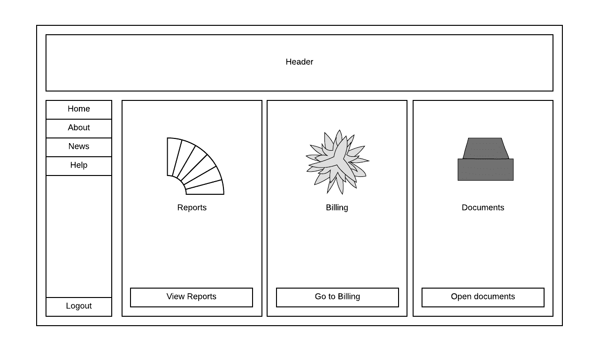
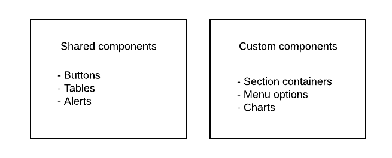
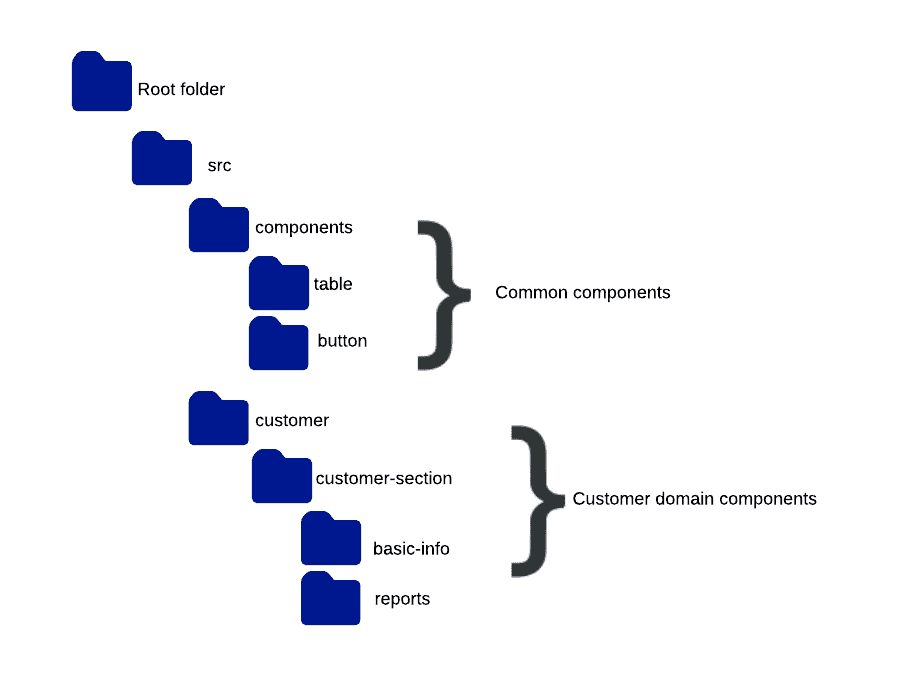
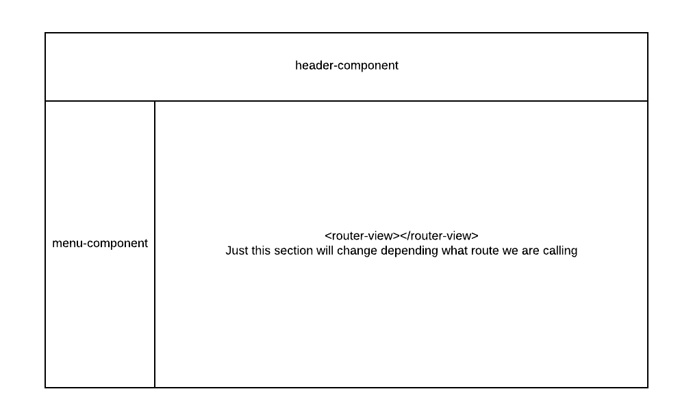
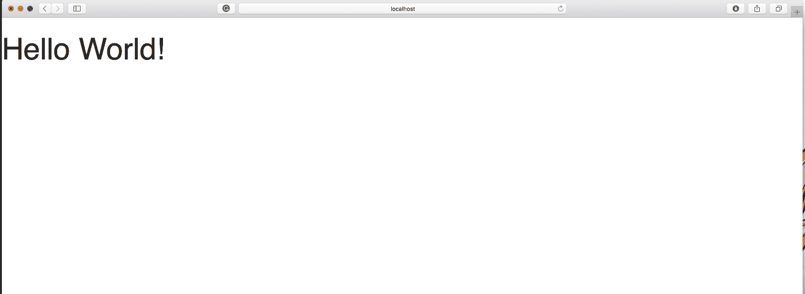
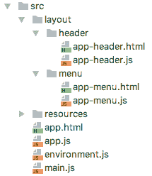
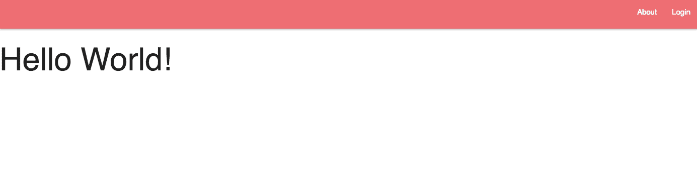
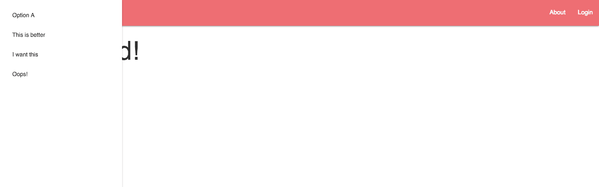
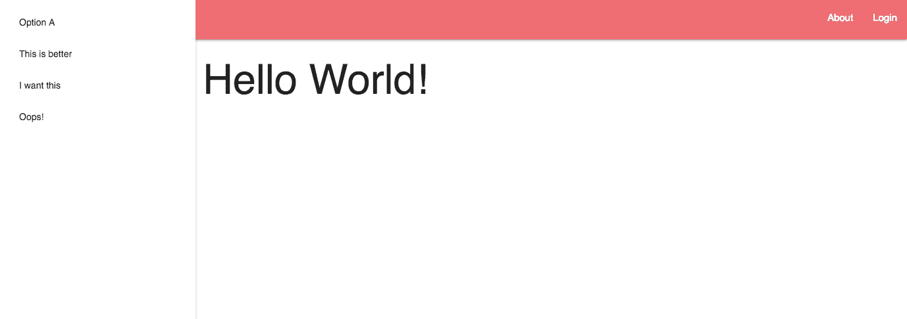
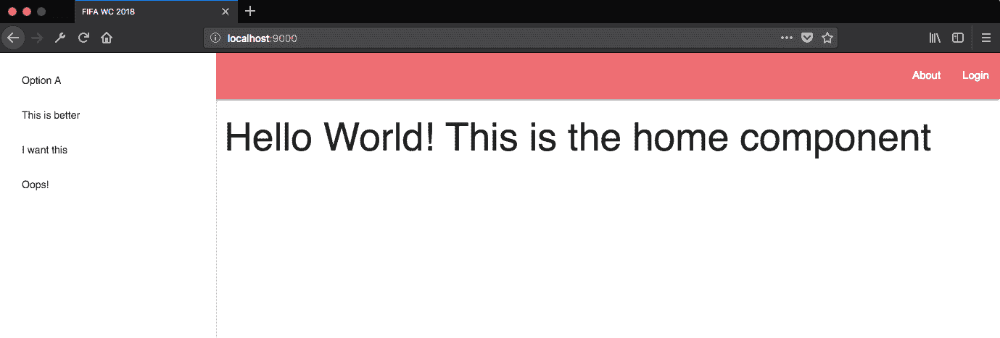

# 第四章：创建组件和模板

欢迎来到这本书的第二部分，并祝贺您来到这里！现在您已经了解了 JavaScript 编程的基本原则和技术，是时候深入了解了 Aurelia 这个奇妙框架提供的优势。本章的起点将是理解什么是组件以及我们如何通过应用程序中发生的事件来管理其生命周期。然后，我们将探讨依赖注入，这是一种由大多数流行框架（如 Java EE、Spring 和 Aurelia）使用的知名设计模式！我们的主要重点是解释我们如何管理我们的 DOM 并动态地在屏幕上显示数据，配置路由以访问应用程序中的某些功能，当然，当然，在我们的 FIFA 世界杯应用程序中应用所学的所有内容。本章将涵盖许多非常有用的概念，其中一些是：

+   创建组件

+   依赖注入模式

+   组件的生命周期/事件

+   数据绑定

+   Aurelia 路由器

+   测试组件

让我们开始吧！

# 乐高组件

大多数现代前端 JavaScript 框架都提供了一些对基于组件的开发的支持。这是网络开发方向上一个极其重要的步骤。组件提供了一种编写小型部分的方法，这些部分具有一致的 API，可以轻松地作为更大屏幕、应用程序或系统的一部分进行编排。想象一下每个组件就像一个乐高积木——你可以在任何地方使用它，并且它将保持相同的形状和行为。

组件可以是一个 HTML 部分，一段 JavaScript 代码，一个服务，等等。任何可重用的部分都应该被视为一个组件。

# 一个小难题

让我们练习一下如何思考，并将一个应用程序抽象成几个组件。以下是一些带有一些部分的网页模板：



现在，是时候思考了。

有多少部分是相似的？

+   按钮非常相似；只是文本/颜色可以改变

+   菜单选项可以是一个可重用的单个组件

+   主页部分是相同的；只是内容不同

+   标题可以与应用程序的主要部分解耦

你认为哪些部分可以在应用程序页面之间重用，看看：

+   主页部分可以用作其他选项的容器

+   按钮可以在所有应用程序部分之间共享

最后，但同样重要的是，当你提交时，你认为你需要刷新整个页面，还是只是某些部分？

更好的选择可能是只刷新真正需要刷新的部分。每个部分可以独立管理它们的数据及其检索方式。

当然，所有这些答案都取决于应用程序的业务规则，但原则始终相同。如果您发现应用程序中的一些部分可以独立于其他部分重用、重新加载、管理和维护，您应该将其解耦为单个组件。

一旦你定义了你的应用程序哪些部分将是组件，就是组织的时候了。你必须确定哪些组件将仅用于特定页面（可能是一个购物车页面的 Item 组件），有多少个将在整个应用程序中共享（一个在许多应用程序报告中使用的通用表格），最后，将它们按分离的组组织：



现在，为每个组件创建一个文件夹；你应该记住，如果一个组件将是另一个组件的*父组件*，那么*子组件*文件夹应该创建在父组件内部，以指定所有权。始终记住，作为一个程序员，你的主要目标是让你的代码对其他开发者来说易于阅读和理解——这是一个好的质量指标！



到目前为止，我们已经为我们的组件创建了文件夹结构。Aurelia 组件基本上由两个文件组成：HTML 模板，称为**视图**，渲染到 DOM 中。`.js`文件，称为**视图模型**，使用 ES Next 编写，并定义了行为并提供视图所需的数据。模板引擎，以及我们在以下章节中将详细解释的**依赖注入**（**DI**），负责创建和强制组件的可预测生命周期。一旦组件被实例化，Aurelia 的数据绑定将这两部分连接起来，允许视图模型中的更改反映在视图中，反之亦然。这种关注点的分离使我们能够与设计师合作并提高我们的产品质量。让我们以一个组件为例来创建一个组件：

```js
/**card-component.js**/

export class CardComponent {

  cardTitle;

  constructor(){
    this.cardTitle = 'Card component example'
  }

}

<!--card-component.html-->

<template>
  <div class="card" >

    <div class="card-header">
      <h2>${cardTitle}</h2>
    </div>
    <div class="card-body">
    </div>

  </div>
</template>
```

你应该记住一些关于命名组件的良好实践：

+   使用破折号来命名你的组件。例如，`<my-component>`和`<my-other-component>`是有效的名称语法，而`<my_component>`、`<myComponent>`和`<my_other_component>`则不是。你必须保持这种表示法，因为 HTML 解析器会在自定义元素和常规元素之间进行区分。

+   你不能注册一个已经存在的标签。

+   自定义元素不是自闭合的。只有原生的 HTML 属性允许这个特性。确保你写上闭合标签（`<my-component></my-component>`）。

我们的第一个组件已经创建，硬编码，并且可以正常工作。等等…`.html`模板是如何知道我的`.js`文件是正确的，用于检索数据的呢？Aurelia 遵循一个原则：约定优于配置。这意味着什么？如果我们为两个文件使用相同的名称，框架会自动将管理`.html`模板的 JavaScript 文件映射过来，我们不需要编写任何配置代码（与其他框架不同）。现在，是时候将其集成到我们的主页面上了。

我们只需要用`<require>`标签导入文件名。出于其他原因，这个标签将位于页面的顶部部分。然后，我们只需调用组件：

```js
<!--main-template.html-->

<template>
 <require from="./components/card-component"></require> //Remember to add the close tag

 <div class="main-content">
     <card-component></card-component>
 </div>

</template>
```

启动你的应用程序，你将看到你的组件正在运行。在这种情况下，我们只定义了一个从`.js`文件渲染到模板的单个属性。这是一个非常基本的例子，所以不要担心，动作即将到来！

# 学习 DI 的工作原理

DI 基于控制反转模式。让我们来解释一下。

想象一下，如果我们创建一个没有 Aurelia 的 Web 应用程序。你将不得不手动实现类似的东西：

1.  加载/实例化一个视图模型

1.  加载/实例化一个视图

1.  将视图绑定到视图模型

1.  将视图添加到 DOM 中

1.  处理用户点击链接。

1.  解析 URL 散列，确定要加载/实例化的视图模型，检查当前视图是否可以停用，等等

1.  重复使用

再次，并且很多次。如果没有 Aurelia，你将实现控制应用程序生命周期的逻辑，而不是你的应用程序业务逻辑和功能。

现在，让我们使用 Aurelia 创建一个。你不会在应用程序级别上编写任何配置代码，因为框架会为你完成这项工作。相反，你将专注于编写视图、视图模型、行为和路由，这些将体现你应用程序的定制逻辑和外观。Aurelia 反转了控制，处理应用程序生命周期，同时允许你定义自己的应用程序功能和行为。如何？通过生命周期钩子。

生命周期钩子是附加到视图模型上的可选方法。Aurelia 的路由器和模板引擎将在适当的时间调用这些方法，允许你控制特定的生命周期步骤。

我们将在接下来的章节中深入探讨所有这些方法；目前，我们只关注**控制反转**（**IoC**）和 DI 功能。

Aurelia 使用 IoC 模式来减少构建应用程序所需的工作。你可以在应用程序启动/结束时使用可覆盖的约定和钩子来指定和控制它们。

DI 使用相同的模式来解决依赖项。依赖项是一个可以使用的对象，或者更具体地说，是一个服务。使用这种模式，你使该服务成为客户端对象状态的一部分，因为你传递了整个服务，而不是允许客户端构建或找到服务。

DI 需要一个注入器。这个注入器负责提供和构建服务对象，并在客户端的状态中定义它。客户端不允许直接调用注入器的代码。它只等待所有依赖项都得到满足。

两个模块是 Aurelia 中 DI 模式应用的关键推动者：

+   **依赖注入**：一个可扩展且非常轻量级的 JavaScript DI 容器

+   **元数据**：提供了一种在多种语言和格式中访问类型、注释和来源元数据的一致方式

为了说明 DI 是如何工作的，让我们定义一个典型的带有一些外部服务注入的视图模型类。代码应该像这样：

```js
import CustomerService from './services/customer-service'

@inject(CustomerService)
export class CustomerComponent {

  constructor(customerService){
    this.customerService = customerService
  }

}
```

现在，让我们分析一下代码。这个视图模型是如何在运行时创建的？

Aurelia 负责每个元素的创建顺序，但它是如何工作的呢？首先，Aurelia 使用 DI 容器来实例化所有视图模型。正如我们之前所说的，客户端对象不会实例化或定位自己的依赖项。它们依赖于 Aurelia 作为构造函数参数提供依赖项。

这些依赖是如何被发现的？

在面向对象的语言（如 Java）中，DI 容器可以通过类型识别每个依赖项。在 Aurelia 的情况下，依赖项的实现是通过构造函数参数顺序列表确定的。在 JavaScript 中，我们可以将有关我们的组件或应用程序的各种信息作为元数据存储。我们没有机会定义基于类型的构造函数来定义我们的对象。为了处理这种情况，我们必须将此信息嵌入到类本身上，作为*元数据*。

我们可以使用装饰器为我们的类添加一个定制的构造函数签名，基于将被 Aurelia 的 DI 容器消费的类型。这正是注解`@inject`（`CustomerService`）在视图模型文件中所执行的操作。如果你是 TypeScript 用户，你可以使用`emitDecoratorMetadata`标志，它用于添加构造函数信息到我们的类中。只需将`@autoInject()`装饰器添加到你的类中；在这种情况下，构造函数参数类型是不需要的。

以这种方式编写的视图模型易于测试和模块化。你可以将一个大类拆分成小组件，并将它们注入以实现目标。记住，大类的维护很困难，并且很容易依赖于反模式*意大利面代码*。

依赖项解析是一个递归过程。让我们解释一下——我们的客户视图模型依赖于`CustomerService`文件。当 DI 容器实例化`CustomerComponent`类时，它首先需要检索`CustomerService`实例或如果容器中不存在，则实例化一个。`CustomerService`可能有自己的依赖项，DI 容器将递归解析直到完整的依赖链被识别。

你可以拥有你需要的任何数量的注入依赖项。只需确保注入装饰器和构造函数相互匹配。

如果你没有使用 Babel 或 TypeScript 装饰器支持，你可以通过类中的静态方法提供注入元数据：

```js
import {CustomerService} from 'backend/customer-service';
import {CommonAlerts} from 'resources/dialogs/common-dialogs';
import {EventAggregator} from 'aurelia-event-aggregator';

export class CustomerProfileScreen {

  static inject() { return [CustomerService, CommonAlerts, EventAggregator]; }

  constructor(customerService, alerts, ea) {
    this.customerService = customerService;
    this.alerts = alerts;
    this.ea = ea;
  }

}
```

支持静态方法和属性。注入装饰器只是自动设置静态属性。为什么使用它？只是为了使我们的语法更加优雅和易于理解。

# 管理组件的生命周期

正如我们之前所说的，Aurelia 提供了非常完整的生命周期事件方法来定制和改进我们应用程序的行为。以下是一个包含这些方法的列表：

```js
export class ComponentLifecycleExample {

  retrievedData;

  constructor(service) {
    // Create and initialize your class object here...
    this.service = service;
  }

  created(owningView, myView) {
    // Invoked once the component is created...
  }

  bind(bindingContext, overrideContext) {
    // Invoked once the databinding is activated...
  }

  attached(argument) {
    // Invoked once the component is attached to the DOM...
    this.retrievedData = this.service.getData();
  }

  detached(argument) {
    // Invoked when component is detached from the dom
    this.retrievedData = null;
  }

  unbind(argument) {
    // Invoked when component is unbound...
  }

}
```

让我们探索脚本中呈现的每个方法：

**`constructor()`**: 这是第一个被调用的方法。它用于设置所有视图模型依赖项和其实例化所需的所有值。

`constructor` 方法可以用来实例化和初始化组件的属性，它们不一定需要预先声明：

```js
constructor(){
  this.customerName = 'Default name'
  this.placeholderText = 'Insert customer name here'
}
```

此外，你也可以使用类方法来初始化变量：

```js
constructor(){
  this.date = this.getCurrentDate()
}

getCurrentDate(){
  //Method implementation
}
```

`created(owningView, myView)`: 接下来，会调用 `created` 方法。在这个时候，视图已经被创建，属于视图模型；它们与控制器相连。这个回调将接收 `(owningView)` 组件内部声明的视图。如果组件本身有视图，它将作为第二个参数传递，`(myView)`。

`bind(bindingContext, overrideContext)`: 在此时，绑定已经开始。如果视图模型有覆盖的 `bind()` 回调，它将在此时被调用。第一个参数代表组件的绑定上下文。第二个参数用于添加额外的上下文属性。

`attached()`: 当组件准备好使用时执行 `attached` 回调。这意味着它已经被实例化，并且其属性已经正确设置和计算。

如果你使用注入的服务方法，这个方法非常适合检索数据或设置属性。你可以配置不同的方式来加载数据，为用户显示加载警报，并提高用户体验。让我们看一个快速示例：

```js
export class ComponentExample {

  dataList

  constructor(){
    // Constructor's code
  }

  attached(){
    this.showLoader(true);
    this.service.retrieveAllData()
                .then( data => {
                   this.dataList = data.getBody()
                   this.showLoader(false)
                   this.showAlert('Data retrieved correctly!!!')
                })
                .catch( error => {
                  console.log(error)
                  this.showLoader(false)
                  this.showAlert('Oops! We have some errors retrieving data!')
                })

  }

}
```

正如你所见，我们可以定义回退警报或方法来确保我们正确地处理错误（如果需要的话）。

`detached()`: 当组件将从 DOM 中移除时调用。与前面的方法不同，此方法在应用程序启动时不会执行。

与前面的例子一样，我们可以定义这个方法来恢复数据到之前的状态，删除本地存储数据等。

`unbind()`: 当组件被解绑时调用。

你应该记住，这些生命周期回调函数都是可选的。只需覆盖你真正需要的部分。执行顺序与前面提到的列表顺序相同。

# 使用 Aurelia 管理事件

我们之前解释了如何在组件生命周期中覆盖和捕获确定的事件和方法，但如果我们想在用户点击某个按钮或移动鼠标到一个部分时执行我们自己的方法，该怎么办？我们将开始 *委托* 事件。

事件委托的概念是一个有用的概念，其中事件处理器被附加到单个元素上，而不是 DOM 上的多个元素。这意味着什么？内存效率。它通过利用大多数 DOM 事件的 *冒泡* 特性，极大地减少了事件订阅的数量。

另一方面，我们有触发概念。类似但不相同。当你需要订阅不冒泡的事件（如 blur、focus、load 和 unload）时，你应该使用触发绑定。

一些例子如下所示：

+   你需要禁用一个按钮、输入或其他元素

+   元素的内容由其他元素组成（可重用组件）

用代码来说，可以这样解释：

```js
<select change.delegate="myEventCallback($event)" ></select>
```

在你的视图模型中，你应该实现一个带有正确数量参数的方法，这样每次 `<select>` 元素发生变化时，事件就会被委托到你的自定义函数来处理它：

```js
export class TriggerAndDelegateExample {

  myEventCallback(event){
    console.log(event)
  }

}
```

现在，让我们`trigger`相同的方法：

```js
<div class="option-container" focus.trigger="myEventCallback($event)"></div>
```

注意，我们正在使用`trigger`绑定来捕获一个非冒泡事件。

在你的日常工作中，可能`delegate`和`trigger`就足够用来管理事件，但有些情况下，你需要了解一些更高级的功能来处理它们。想象一下，你正在集成第三方插件并需要与之交互内容。通常，`trigger`或`delegate`应该可以完成工作，但情况并非如此。

让我们来看一个例子：

```js
<div class='my-plugin-container' click.delegate='onClickPluginContainer()'>
      <plugin-element></plugin-element>
</div>
```

但为什么？记住，你正在处理一个第三方插件，所以这将独立于`container`组件来管理其事件。也就是说，内部插件将在任何点击事件上调用`event.stopPropagation()`。

那在这种情况下我们能做什么呢？别担心，你还有一个选择——`capture`命令：

```js
<div class='my-plugin-container' click.capture='onClickPluginContainer()'>
  <plugin-element></plugin-element>
</div>
```

现在，方法将正确执行。再次强调，最重要的问题，为什么？这是因为有了`capture`命令，无论在容器内部是否调用`event.stopPropagation()`，`onClickPluginContainer()`事件都会发生。

现在，在这个时候，你可能想知道“所以……我应该使用哪个命令？哪一个更好？”答案是简单的——这取决于你的需求。我们建议你使用`delegate`，因为这会提高你的应用程序性能。然后，只有在事件需要这样做的情况下才使用`trigger`，最后，如果你将处理第三方插件或你无法控制的元素，请使用`capture`，但请记住，这最后一个不是常用的，而且这不是你通常与浏览器事件一起工作的方式。

你可以在官方文档中找到更多关于委托和触发的信息：[`aurelia.io/docs/binding/delegate-vs-trigger/`](https://aurelia.io/docs/binding/delegate-vs-trigger/)

# 数据绑定

Aurelia 有自己的数据绑定系统。让我们用一个例子来解释这一点。

你知道你需要为每个 Aurelia 组件定义一个视图和一个视图模型文件。绑定是将视图模型数据反映到视图中的过程，反之亦然。正如我们之前所说的，Aurelia 最美丽的特性之一是双向绑定框架，所以你不必担心视图或视图模型上的数据更新。

Aurelia 支持 HTML 和 SVG 属性到 JavaScript 表达式的绑定。绑定属性声明由三个部分组成：

```js
attribute.commamnd = "expression"
```

让我们解释每一个：

`attribute`：指的是我们将应用到绑定的 HTML/SVG 属性。例如，一个输入标签可以定义以下属性：

```js
<input  value="someValue" id="inputId"  />
```

`value`和`id`将是我们可以引用的属性。

`command`：在这里，你将使用 Aurelia 的一个绑定命令：

+   **一次性**：数据单向流动，从视图模型到视图，仅此一次。

+   **到视图**/**单向**：数据单向流动，从视图模型到视图。

+   **从视图到视图模型**：数据单向流动，从视图到视图模型。

+   **双向**：默认行为，数据从视图模型流向视图，反之亦然。

+   **绑定**：自动选择绑定模式。它为表单控件使用双向绑定，为几乎所有其他内容使用到视图绑定。

让我们使用之前定义的相同输入元素作为例子：

```js
<input  value.from-view="userInputValue" id.bind="editableId"  />
<input  value.one-time="defaultInputValue" id.one-way="generatedId"  />
```

第一个`input`元素使用`from-view`命令绑定用户在`input`元素中输入的任何内容，但这个值不能更改，也不能从`view-model`反映到`view`中。`id`属性使用双向绑定，因此这个`id`可以在视图层更新，并在视图模型中反映。第二个只绑定一次`value`属性，然后任何对这个值的更新都将被忽略。在`id`属性的情况下，它是由`view-model`文件生成的，并且从`view`的任何修改都不会反映到`view-model`中。

`expression`：最后一部分。通常是一个 JavaScript 表达式，用于反映`view-model`属性、计算属性等。再次，让我们使用相同的`input`元素作为例子：

```js
<input  value.from-view="modelValue" id.bind="formName + randomNumber"  />
```

`value`属性只是将**`modelValue`**属性反映到视图中。`id`属性执行一个操作，将视图模型中生成的随机数附加到一个预定义属性中，并使用它作为单个值进行绑定。

就像事件管理部分，可能存在一些情况，你需要使用更高级的功能来获得预期的结果。通常，在开发自定义元素/属性时，你可能需要处理具有`@bindable`属性的情景。这些属性期望一个函数的引用，因此只需使用`call`绑定命令来声明并传递一个函数给`bindable`属性。对于这个用例，`call`命令比`bind`命令更优越，因为它会在正确的上下文中执行函数，确保它符合你的预期：

```js
  <custom-element go.call="doSomething()"></custom-element>

```

`go`是`@bindable`属性，`doSomething()`是你的`view-model`函数。

你可以为你的应用程序添加的一个额外功能是字符串插值。这些表达式允许将表达式的结果与文本进行混合。展示这一功能最好的方式是举一个例子。这里有两个带有数据绑定`textcontent`的`span`元素：

```js
    <span textcontent.bind="'Hello' + name"></span>

    <span>Hello ${name}</span>
```

到目前为止，我们已经了解了 Aurelia 绑定引擎的基本概念。现在，让我们以更高级的方式使用这个伟大的功能来改进我们的应用程序！

在第二章“美化用户界面”中，我们探讨了向我们的应用程序添加 CSS 的一些方法，使其看起来更出色。然而，在你的日常工作中，你可能会遇到一些常见情况，这会让你“混合”一些功能。

这里有一个例子：

您正在编写一个仪表板页面，根据用户状态（活跃，非活跃），提交按钮应该看起来色彩丰富，或者只是禁用，具有不同的形状。

您可以使用字符串插值或`.bind/.one-time`来绑定元素的`class`属性：

```js
<template>
  <button class="btn ${isActive ? 'btn-active' : 'blocked-btn'} submit"></button>
  <button class.bind="isActive ? 'btn-active' : 'blocked-btn'"></button>
  <button class.one-time="isActive ? 'btn-active' : 'blocked-btn'"></button>
</template>
```

使用三元运算，您可以告诉视图应该渲染哪个类。让我们分析第一个：

+   `isActive`指的是在视图中定义的一个布尔属性。

+   `?`是三元运算符。如果条件为`true`，则使用第一个参数，在这种情况下，是`'btn-active'`类。

+   `:`代表条件的`else`部分。如果它评估为`false`，则使用`:`后面的第二个参数。

Aurelia 允许您使用外部 JavaScript 库。在其绑定系统中，它只支持在绑定表达式中添加或删除指定的类。

这样，其他代码添加的类（例如，`classList.add(...)`）不会被移除。这种行为意味着会有轻微的成本，只有在基准测试或一些关键情况（如大列表的迭代）中才能感觉到。可以通过直接绑定到元素的`className`属性来替换默认行为，使用`class-name.bind="...."`，或者使用`class-name.one-time="..."`可能是一个更好的选择；这样会更快。

与类类似，您可以直接将样式属性绑定到 DOM 中。请记住，直接在元素中定义样式是正确的，但使用类，您可以给元素添加更多标准化，并使维护变得容易。像其他 HTML 属性一样，您可以使用`style.bind`从您的`view-model`中检索`style`定义。

例如，让我们定义一个样式数组：

```js
export class StyleExample {
  constructor() {
    this.styleAsString = 'color: red; background-color: blue';

    this.styleAsObject = {
      color: 'red',
      'background-color': 'blue'
    };
  }
}
```

然后，在`view`文件中，我们只需要绑定预定义的属性：

```js
<template>
      <div style.bind="styleAsString"></div>
      <div style.bind="styleAsObject"></div>
</template>
```

您也可以使用字符串插值：

```js
<div style="width: ${width}px; height: ${height}px;"></div>
```

然而，如果您需要与 Internet Explorer 和 Edge 兼容，这种语法将是非法的。在这种情况下，您必须使用`css`属性：

```js
<div css="width: ${width}px; height: ${height}px;"></div>
```

# 绑定计算属性

有时在访问属性时返回一个动态计算值（后处理值）是可取的，或者您可能希望反映内部变量的状态，而不需要使用显式的方法调用。在 JavaScript 中，这可以通过使用 getter 函数来实现：

```js
export class Developer {
  firstName = 'Erikson';
  lastName = 'Murrugarra';

  get fullName() {
    return `${this.firstName} ${this.lastName}`;
  }
}
```

这里没有技巧，你只需要绑定`fullName`属性。绑定系统将分析属性以及我们如何引用一个函数；在渲染计算值之前，它将处理所需的信息。这也被称为**脏检查**；它将不断观察某些属性是否更改其值，如果它对计算元素有影响，它将被重新评估和重新处理。听起来像是同一方法的多次执行？是的，你的 getter 函数将被调用很多次，大约每 120 毫秒一次。这不是问题，但如果我们有大量的计算属性或如果我们的 getter 函数稍微复杂一些，你应该考虑向绑定系统指示你想要观察哪些属性；在这个时候，避免了脏检查。这就是`@computedFrom`装饰器发挥作用的地方：

```js
import {computedFrom} from 'aurelia-framework';

export class Developer {
  firstName = 'Erikson';
  lastName = 'Murrugarra';

  @computedFrom('firstName', 'lastName')
  get fullName() {
    return `${this.firstName} ${this.lastName}`;
  }
}
```

`@computedFrom`将告诉绑定系统哪些属性需要被观察。当这些表达式发生变化时，绑定系统将重新评估属性（执行 getter）。这消除了脏检查的需要，并可以提高性能。

# 值转换器

正如我们在接触这个主题之前所解释的，Aurelia 中的用户界面元素由两个文件组成：视图和视图模型对。视图是用纯 HTML 编写的，并渲染到 DOM 中。视图模型是用 JavaScript 编写的，为视图提供数据和行为。Aurelia 通过其强大的数据绑定引擎将这两个文件链接在一起，作为一个单一元素，允许视图模型中的更改反映在视图中，反之亦然。有时，视图模型显示的数据对于在 UI 中显示来说不是很好或难以理解。处理日期和数值是最常见的场景：

```js
export class Example {

  constructor() {
    this.showRawData();
  }

  showRawData() {
    this.currentDate = new Date(); 
    this.someNumber = Math.random() * 1000000000;
  }

}
```

我们的视图应该看起来像这样：

```js
<template>
      ${currentDate} <br/>
      ${someNumber}
</template>
```

这段代码将给我们当前的日期和一些随机数；嗯，这正是我们期望的，这也是可以接受的，但让我们看看这些数据是如何显示的：

```js
Sun Dec 31 2017 18:04:45 GMT-0500 (-05)
936693540.3380567
```

这对于用户阅读来说肯定是不友好的。解决这个问题的酷解决方案可以是计算格式化的值并将它们作为`view-model`文件的属性公开。这是一个有效的方法，但请记住，我们正在给模型添加额外的属性和方法；这可能会在将来变得有些混乱，尤其是在需要保持格式化值与原始属性值同步时。幸运的是，Aurelia 有一个功能可以帮助我们处理这些情况。

最常见的选项是创建值转换器，将模型数据转换为视图可读的格式。到目前为止一切正常，但如果需要视图转换值以发送到`view-model`可接受的格式呢？

Aurelia 值转换器与其他语言的值转换器相当相似，例如 XAML。令人高兴的是，Aurelia 带来了一些显著的改进：

+   Aurelia 的 `ValueConverter` 接口使用两个方法：`toView` 和 `fromView`。这些方法定义了数据流动的方向。

+   Aurelia 值转换器方法可以接受多个参数。

+   Aurelia 允许你在一个属性中使用多个值转换器，只需使用管道（`|`）即可。

让我们通过一个例子来看看如何将我们的日期属性转换为更友好的可读值：

```js
import moment from 'moment';

export class DateFormatValueConverter {

  toView(value) {
    return moment(value).format('M/D/YYYY h:mm:ss a');
  }

}
```

我们的 `view-model` 文件不会改变：

```js
export class Example {

  constructor() {
    this.showRawData();
  }

  showRawData() {
    this.currentDate = new Date(); 
    this.someNumber = Math.random() * 1000000000;
  }

}
```

然而，我们的 `view-model` 文件在此时看起来会相当不同：

```js
<template>
    <require from="./date-format"></require>
    ${currentDate | dateFormat} <br/> 
    ${someNumber} 
</template>
```

使用这个值转换器，我们将在屏幕上看到这个值：

```js
12/31/2017 6:25:05 pm
```

这看起来好多了。再次，是时候提出更重要的问题——为什么？让我们检查我们做了什么。首先，我们创建了一个名为 `DateFormatValueConverter` 的值转换器类并实现了 `toView` 方法。Aurelia 将执行此方法并将模型值应用于屏幕上的数据之前。在转换用途上，我们使用了 MomentJS。接下来，我们已更新了 `view` 文件并添加了 `<require>` 标签以将我们的值转换器类导入将使用它的视图。

当框架处理资源时，它会检查类的元数据以确定资源类型（自定义元素、自定义属性、值转换器等）。元数据不是必需的，实际上，我们的值转换器没有暴露任何。如果你好奇，你必须注意一点——我们使用了 `ValueConverter` 后缀来命名我们的转换器类。再次，为什么？这是因为你必须记住 Aurelia 的一个基础是约定优于配置。这样，以 `ValueConverter` 结尾的名称将被假定为值转换器。

现在，我们将展示一个更高级的例子。让我们对我们的类转换器应用一些更改：

```js
import moment from 'moment';

export class DateFormatValueConverter {

  toView(value, format) {
    return moment(value).format(format);
  }

}
```

`view-model` 文件仍然是相同的。现在，我们的模板文件将再次发生变化：

```js
<template>
      <require from="./date-format"></require>

      ${currentDate | dateFormat:'M/D/YYYY h:mm:ss a'} <br/>
      ${currentDate | dateFormat:'MMMM Mo YYYY'} <br/>
      ${currentDate | dateFormat:'h:mm:ss a'} <br/>
</template>
```

现在，我们可以使用相同的值转换器类以不同的格式渲染数据，以满足我们的视图需求。

毫无疑问，我们已经涵盖了 Aurelia 绑定行为的一些最重要的功能，但，当然，还有更多方法和命令我们将在实践中看到。目前，我们准备过渡到另一个重要概念——路由。

# 路由和资源

路由是网络应用程序最重要的部分之一。我们的应用程序已经部署在 `http://localhost:9000`，但现在是时候开始定义我们资源的名称和地址了。首先，我们需要定义什么是资源。从概念上讲，资源是单个对象或元素相关的所有相关数据。例如，一个人资源可以具有姓名、地址、生日等字段。因此，扩展这一点，资源也可以是一系列人员。我们将深入讨论你的资源应该如何命名、组织以及调用，但在此刻，你只需要知道基础知识。在网络应用程序中，每个资源都有自己的地址。让我们看一个例子：

我们有一个带有一些联系人的地址簿：

+   `http://localhost:9000/` 是服务器 URL，所有资源的基路径。通常与主页/欢迎页面相关，或者你首先定义的用户视图。页面有一个按钮可以查看所有我们的联系信息。

+   `http://locahost:9000/persons` 是与人员列表资源相关的 URL。在这里，我们将展示我们的通讯录中的人员列表。你可以选择一个来查看其联系详情。

+   `http://locahost:9000/persons/p001` 将指向具有 `p001` ID 的人员。在这里，我们将能够看到其详情。如果你把这个 URL 给另一个用户，他们应该能够看到与你相同的数据，因为这个 URL 属于单一的联系——`p001`。

+   `http://locahost:9000/persons?search=p001` 略有不同。想象一下，我们的联系列表由超过 500 人组成。你不认为用户通过 ID、姓名或最通用的参数来搜索他们会更方便吗？在这里，我们使用查询参数来表示我们的搜索条件；当然，我们仍在与我们的朋友 `p001` 一起工作。

现在，让我们配置我们的应用程序，使其为路由准备就绪。

到目前为止，我们已经在我们的应用程序中创建了一些组件。如果没有，不要担心，我们将在本章的最后部分有足够的时间来练习这一点。

现在，让我们向我们的 `app.js` 文件中添加一些代码。请记住，这个文件应该位于我们应用程序的基 `src` 文件夹中，因为现在它将代表我们所有应用程序的基本路由：

```js
export class App {
  configureRouter(config, router) {
    this.router = router;
    config.title = 'Aurelia';
    config.map([
      { route: ['', 'home'],       name: 'home',       moduleId: 'home/index' },
      { route: 'users',            name: 'users',      moduleId: 'users/index', nav: true,           title: 'Users' },
      { route: 'users/:id/detail', name: 'userDetail', moduleId: 'users/detail' },
      { route: 'files/*path',      name: 'files',      moduleId: 'files/index', nav: false,    title: 'Files', href:'#files' }
    ]);
  }
}
```

让我们分析用于定义我们的路由的属性和方法：

+   `configureRouter(config, router)` 是框架在应用启动时将在基本 `view-model` 中评估的保留方法。参数引用自 `aurelia-router` 包中的 `Router` 和 `RouterConfiguration`。如果它们没有提供，框架将自动注入它们。

+   `this.router = router` 是对路由元素的引用，仅为了让我们能够从视图层（`app.html`）访问它，从而允许我们动态地构建导航菜单。

+   `config.title` 指的是在浏览器窗口中显示的应用程序标题。技术上，它应用于 HTML 文档 `<head>` 中的 `<title>` 元素。

+   `config.map()` 向路由器添加路由。尽管之前只展示了 `route`、`name`、`moduleId`、`href` 和 `nav`，但还可以在 `route` 中包含其他属性。`route` 的接口名称为 `RouteConfig`。你也可以使用 `config.mapRoute()` 来添加单个 `route`。

+   `route` 是与传入的 URL 片段匹配的模式。它可以是字符串或字符串数组。`route` 可以包含参数化路由或通配符。

现在，让我们分析我们创建的路由：

+   在第一个 `route` 元素中，第一个标志 `route` 正在引用基本路径 (`''`) 和 `home` 路径。如果我们直接访问 `http//:localhost:9000/` 或 `http//:localhost:9000/home`，应用程序将显示相同的页面。`name` 标志是 URL 标识符，可以直接从一个链接或 `href` 元素中调用。最后，我们需要通过 `route` 引用我们引用的文件；在这种情况下，组件位于 `home/index`，并将通过 `moduleId` 标志表示。

+   第二个 URL 引用了 `users` 资源，但它有一些变化。`nav` 标志可以是布尔值或数字属性。当设置为 true 时，路由将被包含在路由器的导航模型中。当指定为数字时，该值将用于排序路由；这使得创建动态菜单或类似元素变得更容易。最后，`title` 标志将显示附加到浏览器窗口页面标题中的页面标题。

+   第三种情况略有不同。我们可以在路由中间看到一个奇怪的参数，即 `:id`。这意味着 URL 签名的一部分将是动态的，你还记得我们的人 `p001` 吗？`:id` 参数将用于表示 `p001` 代码，并使该资源的 URL 独一无二。此外，在 `view-model` 文件中，我们将能够消费该参数并检索与其相关的数据。

+   最后，我们看到 `'files/*path'`。通配符路由用于匹配路径的其余部分。`href` 标志是一个条件性可选属性。如果没有定义，则使用 `route`。如果 `route` 有段，则 `href` 是必需的，就像在文件的情况下一样，因为路由器不知道如何填充模式中参数化的部分。

可能会有一些情况，你需要一些额外的功能来处理它们。

例如，大小写敏感的路由；Aurelia 也解决了这个问题：

```js
config.map([
          { route: ['', 'home'], name: 'home',  moduleId: 'home/index' },
          { route: 'users',      name: 'users', moduleId: 'users/index', nav: true, title: 'Users', caseSensitive: true }
]);
```

在这些情况下将使用 `caseSensitive` 标志。

另一种非常常见的情况是未知路由；Aurelia 有一种很好的处理方式：

```js
config.map([
          { route: ['', 'home'], name: 'home',  moduleId: 'home/index' },
          { route: 'users',      name: 'users', moduleId: 'users/index', nav: true, title: 'Users' }
        ]);

config.mapUnknownRoutes('not-found');
```

`config.mapUnknownRoutes()` 方法将引用 `'not-found'` 组件模块。另一种方式是将其表示为一个函数：

```js
const handleUnknownRoutes = (instruction) => {
      return { route: 'not-found', moduleId: 'not-found' };
}

config.mapUnknownRoutes(handleUnknownRoutes);
```

其他常见场景可能是重定向路由。这很简单——你只需要添加 `redirect` 标志并指定你想要显示的模块的引用：

```js
config.map([
      { route: '', redirect: 'home' },
      { route: 'home', name: 'home', moduleId: 'home/index' }
]);
```

到目前为止，我们知道如何在 `view-model` 层面上配置路由，但视图呢？别担心，这将是我们的下一个主题。

所有这些配置都是在 `app.js` 文件中完成的，所以现在我们需要转到我们的 `app.html` 文件。在将路由属性添加到模板之前，你必须考虑一些事情。

通常，大多数 Web 应用程序使用基本布局。这可以由页眉、侧边菜单和视图内容组成。也就是说，唯一需要由路由器刷新和重新加载的元素是视图内容；页眉和菜单在整个应用程序中始终相同，因此我们需要在容器内部定义我们的路由元素；让我们看看代码：

```js
<template>
  <div class="header">
    <header-component></header-component>
  </div>
  <div class="menu">
    <menu-component></menu-component>
  </div>
  <div class="main-content">
    <router-view></router-view>
  </div>
</template>
```

`<router-view></router-view>`是 Aurelia 路由器将用来渲染我们配置为路由的组件的 HTML 标志。图形表示如下：



到目前为止，一切正常。然而，这是一个非常基础的途径；让我们探索一些高级方法来使我们的布局更加灵活和可配置。我们知道在 HTML 中定义的`router-view`元素总是与其父视图的视图模型中定义的路由配置方法中引用的一个或多个视图相关联。

要在`router-view` HTML 元素上指定布局，我们使用以下属性：

+   `layout-view`：通过文件名（带路径）指定要使用的布局视图

+   `layout-model`：指定传递给视图模型激活函数的模型参数

+   `layout-view-model`：指定与布局视图一起使用的`moduleId`

为了解释这一点，我们将实现一个完全与我们的`app.html`文件解耦的自定义布局页面：

```js
<template>
      <div>
        <router-view layout-view="layout.html"></router-view>
      </div>
</template>
```

我们正在引用一个名为`layout.html`的文件。这个文件将包含我们的基本布局分布：

```js
<template>
      <div class="left-content">
        <slot name="left-content"></slot>
      </div>
      <div class="right-content">
        <slot name="right-content"></slot>
      </div>
</template>
```

此外，请注意`<slot>`标签。这是一个将布局的一部分与引用其名称的视图的一部分关联的机制；在这种情况下，让我们创建一个具有自定义布局的`home`组件：

```js
<template>
      <div slot="left-content">
        <home-header></home-header> 
      </div> 
      <div slot="right-content">
         <home-menu></home-menu> 
      </div>
</template>
```

在声明的槽之外的内容将不会被渲染。我们只剩下一个任务要做——配置路由：

```js
config.map([
          { route: '', name: 'home', moduleId: 'home' }
]);
```

我们只需要声明路由并将其引用到主模块。布局将*读取*定义在其中的槽标签，并将渲染到主模板中。这样我们就可以根据我们访问的应用程序的路由来定制布局，一个用例可能有自定义菜单选项，同时显示某些路由。

为了让我们的路由器准备好工作，我们还需要覆盖一个东西——回退路由。想象一下，如果你的应用程序基于角色，如果用户不允许访问某些资源，他们应该被重定向到上一个位置。如果没有上一个位置怎么办？回退路由就派上用场了！

让代码展示它的魔力：

```js
export class App {
      configureRouter(config, router) {
        this.router = router;
        config.title = 'Example';
        config.map([
          { route: ['', 'home'], name: 'home',  moduleId: 'home/index' },
          { route: 'users',      name: 'users', moduleId: 'users/index', nav: true, title: 'Users' }
        ]);

        config.fallbackRoute('users');
}
```

现在你已经了解了关于 Aurelia 路由器及其如何配置以改进应用程序的最重要特性。我们几乎准备好开始创建我们的 FIFA WC App 组件了。在上一章中，我们学习了测试、TDD 和调试。现在，是时候应用所学概念并测试我们的组件了。让我们编码！

# 测试我们的组件

测试是开发软件应用程序时最重要的步骤之一。在这个阶段，我们准备好开始创建组件、定义绑定行为和配置我们的路由。一切正常，但我们如何确保我们的组件按预期工作？在标记组件为完成并准备好进行 QA/生产环境之前，我们需要测试每个组件。

使用 Aurelia 的组件测试器，你将能够以隔离的方式测试你的组件，就像在一个迷你 Aurelia 应用程序中一样。在测试组件时应该做什么？评估预期数据，并通过生命周期断言数据绑定和行为。

首先，我们需要安装`aurelia-testing`包：

```js
 npm install aurelia-testing
```

这个库基于流行的 BDD JavaScript 测试框架 Jasmine，它提供了测试结构和断言。如果你使用 Aurelia CLI 生成了你的应用程序，Jasmine 应该已经包含在内。

安装完成后，你可以开始编写你的第一个单元测试。我们将从一个简单的组件开始，该组件返回客户名称。

首先，让我们定义我们的`View`模板：

```js
<template>
      <div class="custName">${custName}</div>
</template>
```

在`ViewModel`文件中：

```js
import {bindable} from 'aurelia-framework';

    export class CustomerComponent {
      @bindable custName;
}
```

我们组件应该可以工作。让我们验证一下。我们需要创建我们的测试文件：

```js
import {StageComponent} from 'aurelia-testing';
import {bootstrap} from 'aurelia-bootstrapper';

describe('CustomerComponent', () => {
  let component;

  beforeEach(() => {
    component = StageComponent
      .withResources('customer-component')
      .inView('<customer-component cust-name.bind="custName"></customer-component>')
      .boundTo({ custName: 'Diego' });
  });

  it('should render first name', done => {
    component.create(bootstrap).then(() => {
      const nameElement = document.querySelector('.custName');
      expect(nameElement.innerHTML).toBe('Diego');
      done();
    }).catch(e => { console.log(e.toString()) });
  });

  afterEach(() => {
    component.dispose();
  });
});
```

好的，看起来没问题；它应该会通过。我们在做什么？

首先，我们从`aurelia-testing`导入`StageComponent`：

```js
import {StageComponent} from 'aurelia-testing';
```

`StageComponent`只是创建了一个新的`ComponentTester`类的实例，该类执行所有工作。接下来，`StageComponent`工厂将设置组件：

```js
    component = StageComponent
      .withResources('src/customer-component')
      .inView('<customer-component cust-name.bind="custName"></customer-component>')
      .boundTo({ custName: 'Diego' });
```

`StageComponent`有一个属性—`withResources()`—它允许你使用流畅的 API 开始设置。类方法`withResources`非常有用，可以指定你将使用和注册哪些资源。如果你需要多个单一资源，只需使用一个字符串数组来注册所有这些资源。然后，`inView`方法允许我们提供我们需要运行的 HTML 代码。这是一个标准视图，你可以定义属性和其他内容，就像在我们的应用程序的真实组件中一样。最后，`boundTo`方法提供了一个测试`viewModel`，其中包含了在`inView`中配置的预定义数据。

在这个第一部分，设置是通过 Jasmine 的`beforeEach()`方法执行的，以便在存在多个测试的情况下重用相同的设置：

```js
component.create(bootstrap).then(() => {
      const nameElement = document.querySelector('.custName');
      expect(nameElement.innerHTML).toBe('Diego');
      done();
    }).catch(e => { console.log(e.toString()) });
```

接下来，我们进入测试本身，即`create()`方法。`create()`方法将启动一切，并引导迷你 Aurelia 应用程序（它接收从之前导入的`aurelia-bootstrapper`库中导入的`bootstrap`组件）；这个方法将使用`standardConfiguration`配置测试，将提供的资源注册为全局资源，启动应用程序，并最终渲染你的组件，这样你就可以断言预期的行为。在这种情况下，我们想要确保我们的`custName`属性在 HTML 中正确渲染，通过选择具有其类名的 div 标签。我们使用`document.querySelector('.custName')`来获取元素值并断言其`innerHTML`是`Diego`。接下来，我们调用 Jasmine 的`done`函数来告诉 Jasmine 测试已完成。调用`done`是必要的，因为`create`方法异步返回一个`Promise`。如果测试引发某些错误，`catch()`方法将被触发，并在控制台打印错误日志：

```js
component.dispose();
```

最后，我们在我们的`ComponentTester`实例上调用`dispose`。这将清理 DOM，以便我们的下一个测试从一个干净的文档开始。

我们的第一项测试已经完成，猜猜看……它通过了！这是一个非常基础的例子，但我们已经学会了组件测试的基本部分以及如何将其包含在我们的应用程序中。现在，让我们探索更多高级功能。

# 测试组件生命周期

我们需要确保我们的数据按预期检索，同样，我们还需要断言我们的组件行为也进行得很好。为此，我们可以告诉创建的组件我们将手动处理生命周期方法；你会发现代码非常直观：

```js
import {StageComponent} from 'aurelia-testing';
import {bootstrap} from 'aurelia-bootstrapper';

describe('CustomerComponent', () => {
  let component;

  beforeEach(() => {
    component = StageComponent
      .withResources('src/customer-component')
      .inView('<customer-component cust-name.bind="custName"></customer-component>')
      .boundTo({ custName: 'Diego' });
  });

  it('can manually handle life cycle', done => {
    let nameElement;

    component.manuallyHandleLifecycle().create()
      .then(() => {
        nameElement = document.querySelector('.custName');
        expect(nameElement.innerHTML).toBe(' ');
      })
      .then(() => component.bind())
      .then(() => {
        expect(nameElement.innerHTML).toBe('Foo bind');
      })
      .then(() => component.attached())
      .then(() => {
        expect(nameElement.innerHTML).toBe('Foo attached');
      })
      .then(() => component.detached())
      .then(() => component.unbind())
      .then(() => {
        expect(component.viewModel.custName).toBe(null);
      })
      .then(() => component.bind({ custName: 'Bar' }))
      .then(() => {
        expect(nameElement.innerHTML).toBe('Bar bind');
      })
      .then(() => component.attached())
      .then(() => {
        expect(nameElement.innerHTML).toBe('Bar attached');
      })
      .then(done)
      .catch(done);
  });

  afterEach(() => {
    component.dispose();
  });

});
```

导入的库仍然是相同的，我们组件元素的`create()`方法将启动应用程序，并为我们提供一个简单的方式来检查我们的生命周期方法响应；只需确保你按照它们执行的顺序调用它们。

那些依赖于外部服务的组件怎么办？别担心，你只需要在测试代码中添加一些额外的行，并创建一个模拟服务的类。

首先，我们的 Mock 类：

```js
export class MockService {
      firstName;

      getFirstName() { return Promise.resolve(this.firstName);
}
```

我们的自测类将看起来像这样：

```js
describe('MyComponent', () => {
      let component;
      let service = new MockService(); //Our created Mock

      beforeEach(() => {
        service.firstName = undefined; 

        component = StageComponent
          .withResources('src/component')
          .inView('<component></component>');

        component.bootstrap(aurelia => {
          aurelia.use.standardConfiguration();
          aurelia.container.registerInstance(Service, service); //Register our mock service instance to the current container instance
        });
      });

      it('should render first name', done => {
        service.firstName = 'Diego';

        component.create(bootstrap).then(() => {
          const nameElement = document.querySelector('.first-name');
          expect(nameElement.innerHTML).toBe('Diego');

          done();
        });
      });

      afterEach(() => {
        component.dispose();
      });
});
```

首先，我们声明我们的 mock 服务为一个全局变量。这将用于将其注入到 Aurelia 的容器上下文中；这样，组件就不会检测到真实服务类和我们的模拟服务之间的任何差异。还有一点你应该注意，在`beforeEach()`方法级别，我们将`firstName`属性声明为`undefined`；这只是为了使其可重用和可定制，以便根据每个测试的自身需求进行。记住，这个方法会为每个单元测试独立执行。

如果我需要定义一个更复杂的视图，评估我的组件的容器呢？很简单，你可以使用模板字面量：

```js
import {StageComponent} from 'aurelia-testing';
import {bootstrap} from 'aurelia-bootstrapper';

describe('MyAttribute', () => {
  let component;

  beforeEach(() => {
    //Literal HTML syntax
    let view = `
          <div class="row">
            <div class="col-xs-12">
              <div my-attribute.bind="color">Diego</div>
            </div>
          </div>
        `;
    component = StageComponent
      .withResources('src/my-attribute')
      .inView(view)
      .boundTo(viewModel);
  });
  //...
});
```

你觉得怎么样？很简单，对吧？那很好！现在，我们已经完全准备好进入本章的精华部分；让我们将一切付诸实践！

# 是时候练习了！

是时候开始编码了！在这个时候，我们的应用程序已经创建并运行，预先配置为使用 SASS 作为 CSS 预处理器，并与 Aurelia Materialize 库集成，以遵循 Material Design 的良好设计实践。现在我们需要定义我们的布局。在此时，它将非常基础，并且随着应用程序的增长，我们开发的组件可以被改进和重构。

首先，我们需要访问我们的根文件夹应用程序；一旦进入，我们只需输入以下命令：

```js
au run --watch 
```

接下来，我们打开我们最喜欢的浏览器窗口，它应该看起来像这样：



现在，让我们创建我们的主布局。在`src`文件夹内，我们将创建一个名为 layout 的文件夹。在这个文件夹内，我们将创建两个子文件夹：header 和 menu：

+   `./src > layout > header >`：在这里，我们将创建一个用于视图的 HTML 文件和一个用于视图模型的 JS 文件。这两个文件都叫做`app-header`

+   `./src > layout > menu >`：与头部相同，这两个文件都将被命名为`app-menu`

我们的文件夹结构应该看起来像这样：



首先，我们将创建`app-header`组件。让我们打开 HTML 文件并创建我们的`navbar`头部。就在这一点上，我们将看到 Aurelia Materialize 的功能：

```js
<template>
  <md-navbar>
    <div class="margin-content">

      <ul class="hide-on-med-and-down right">
        <li md-waves><a href="#about">About</a></li>
        <li md-waves><a href="#map">Login</a></li>
      </ul>

    </div>
  </md-navbar>
</template>
```

`<md-navbar>`标签指的是 Aurelia Materialize 的`navbar`元素。这非常有帮助，因为组件已经创建好了；我们只需要调用它们，并开始定义我们希望向用户展示的方式。我们在此处不会创建任何 CSS 类。在我们的`nav-bar`中，我们正在创建两个导航选项，只是为了看看在浏览器上的样子。

我们的第一个组件创建完成后，是时候将其与主页面`app.html`进行整合了。首先，我们需要使用`<require>`标签调用创建的组件：

```js
<require from="./layout/header/app-header"></require>
```

然后，我们只需要通过其文件名调用创建的组件：

```js
<app-header></app-header>
```

现在，只需重新加载浏览器窗口，...就出现了一个错误！在这种情况下该怎么办？发生了什么？我们的好朋友，控制台，会告诉我们真相：

```js
DEBUG [templating] importing resources for app.html Array [ "materialize-css/css/materialize.css", "layout/header/app-header" ]
vendor-bundle.js:14222:8 TypeError: target is undefined[Learn More]
```

让我们关注每行的最后部分。首先，错误发生在 Aurelia 引导程序导入和配置我们创建的组件时。最后一条消息告诉我们错误的原因：`undefined` `target`。

考虑几分钟，可能会发生什么？我们知道你有足够的知识来告诉我们错误是什么。

准备好了吗？如果你注意的话，我们最近创建的`app-header.js`的`view-model`文件是完全空的。所以我们有视图，但这个视图没有指向任何东西，`target`是未定义的！为了解决这个错误，我们只需要声明组件名称并导出它：

```js
export class AppHeader {

}
```

现在，让我们重新加载我们的浏览器：



太棒了，对吧？放松，这只是开始。现在，是时候创建我们的菜单了。

我们选择的 Materialize 组件是固定的`sidenav`。然而，为了将其集成到我们的应用程序中，我们将合并到目前为止学到的某些技术和概念。首先，让我们编写我们的组件：

```js
<template>

  <md-sidenav view-model.ref="sideNav" md-fixed="true" md-edge="left">
    <ul>
      <li md-waves><a>Option A</a></li>
      <li md-waves><a>This is better</a></li>
      <li md-waves><a>I want this</a></li>
      <li md-waves><a>Oops!</a></li>
    </ul>
  </md-sidenav>

</template>
```

类似地，使用`<require>`标签，我们将将其导入到我们的`app.html`文件中。如果我们只是调用`sidenav`菜单，我们将得到以下结果：



当然，我们不想隐藏我们的主要应用程序内容！是时候开始使用 CSS 来让`app-menu`为我们的团队服务了。

首先，让我们在我们的`app.html`页面上添加一些容器顺序。它应该是这样的：

```js
<template>
  <require from="materialize-css/css/materialize.css"></require>
  <require from="./layout/header/app-header"></require>
  <require from="./layout/menu/app-menu"></require>

  <app-header></app-header>

  <main>

    <div class="row">

      <div class="col s12 m12 l12">
        <h1>${message}</h1>
      </div>

    </div>

    <app-menu></app-menu>

  </main>

</template>
```

我们只是将主要的内容，在这种情况下，消息属性，放入一个填充整个屏幕的容器中，无论分辨率如何。

如果我们运行应用程序，我们仍然会看到相同的结果。我们需要对我们的`sidenav`组件应用一些自定义 CSS 修改。是时候开始使用 SASS 了！

我们在依赖路径上有了 SASS，并且它已经准备好在我们的应用程序中使用，但让我们添加一些修改，以便使我们的文件分布对我们来说更容易理解。

前往`aurelia_project`文件夹，打开名为`process-css.js`的任务。

如果您还记得上一章中的 Gulp 任务自动化，您会发现代码非常熟悉。我们只需要添加一行：

```js
export default function processCSS() {
  return gulp.src(project.cssProcessor.source)
    .pipe(sourcemaps.init())
    .pipe(sass().on('error', sass.logError))
    .pipe(gulp.dest('./')) //THIS LINE
    .pipe(build.bundle());
}
```

为什么这一行？我们想看到生成的 CSS 文件在我们的项目中，并从我们的`index.html`文件中导入它。再次问为什么？因为它直接在浏览器中使用此文件，如果需要修改或维护样式表，您的样式修改和调试将更容易。

然后，让我们创建我们的`styles`文件夹。这个文件夹应该直接位于我们的`src`文件夹中。它是否可以位于不同的位置？当然，但我们建议您首先检查您的`aurelia.json`文件。

如果您搜索`cssProcessor`任务，您将找到这个：

```js
"cssProcessor": {
  "id": "sass",
  "displayName": "Sass",
  "fileExtension": ".scss",
  "source": "src/**/*.scss"
},
```

源属性指示我们的 scss 文件将位于哪个级别，并且默认情况下它们在哪里？是的，`src/*whatever*/*.scss`位置。您可以修改它，但就我们当前的目的而言，我们不需要。

然后，在我们的文件夹内，让我们创建我们的第一个名为`_mainlayout.scss`的`.scss`文件。记住，`_`前缀是为了指示这个样式表将作为另一个样式表的一部分使用。我们只需要添加以下代码：

```js

header, main, footer {
  padding-left: 300px;
}

md-navbar[md-fixed="true"] nav {
  padding-right: 300px;
}

md-sidenav {
  div {
    collapsible-body {
    }
    padding: 0;
  }
}
```

我们只是告诉我们的`header`和应用程序主体保持距离我们的应用程序菜单 300 像素。现在，是时候重新加载我们的浏览器了：



我们的基础布局完成了！猜猜看？是的，是时候添加路由了！

让我们将`app.js`文件的欢迎信息解耦。创建一个主页组件来渲染自定义消息；我们称之为`app-home`。现在，在您的`app.html`文件中的`<h2>`标签处，放置`<router-view>`标签。

在应用`view-model`文件中，删除`constructor`方法；这次我们不会使用它。然后，只需添加以下代码：

```js
configureRouter(config, router) {
  this.router = router;
  config.title = 'FIFA WC 2018';
  config.map([
    { route: ['', 'home'],       name: 'home',       moduleId: 'home/app-home' },
  ]);
}
```

现在，让我们重新加载我们的浏览器。注意窗口标题；现在它反映了我们的应用名称！



为了练习目的，我们现在就完成了！如果你注意到了，我们正在将许多关注点混合在我们的应用的一些基本方法中。现在，让我们给我们的代码添加额外的价值。你还记得我们硬编码的菜单选项吗？你不认为它应该是动态的吗？是的，我们正在讨论为我们的练习添加动态绑定！你在等什么，打开你的`app-menu`视图和`view-model`！

让我们在`view-model`层创建一个字符串数组。我们将使用在图片中使用的相同选项：

```js
export class AppMenu {

  menuOptions = [
    'Option A',
    'This is better',
    'I want this',
    'Oops!',
  ]

}
```

接下来，是魔法时刻。`repeat`命令将为我们做脏活。好吧，我们知道我们之前没有提到它；你还记得我们说在实现真实应用时我们将回顾许多新关注点吗？这是其中之一：

```js
<template>

  <md-sidenav view-model.ref="sideNav" md-fixed="true" md-edge="left">
    <ul>

      <li repeat.for="option of menuOptions" md-waves><a>${option}</a></li>

    </ul>
  </md-sidenav>

</template>
```

这非常简单。现在我们真的完成了。我们的 FIFA WC 2018 应用已经准备好开始编写我们的业务服务和组件了！还有一件事悬而未决，那就是测试部分。我们不会在练习中涵盖它，因为在下一章中，我们将找到为我们的应用创建的一些更复杂的组件，并且我们将很高兴将测试应用到实际组件上。

# 摘要

你对 Aurelia 的了解现在真是令人惊叹！我们想要涵盖与组件创建和如何将你的业务场景抽象为一个数字应用相关的各个方面。你了解到每个组件都是整体的一部分，是可重用的，并允许你分离你的应用关注点。由于组件是你的应用的一个独立部分，它管理自己的生命周期；Aurelia 允许我们完全控制并配置事件，例如数据加载或组件销毁时的某些自定义行为。另一个非常有趣的事情是我们可以创建我们自己的事件，并且我们可以从视图层触发它们。

此外，你必须记住一个组件可以继承自其他组件，并且它们都有属性。记住 Aurelia 是一个双向绑定框架，所以所有这些属性都在视图和视图模型文件之间同步。我们还学习了如何实现值转换器和一些其他绑定行为来提高我们的应用性能并减少代码量，使我们的应用更轻量级和易于维护。一旦我们的组件创建完成，并且我们有我们的应用场景，就是时候通过动态路由将它们全部链接起来，定义用户工作流程并将动态属性传递给每个模板。最后但同样重要的是，我们了解了如何测试我们的应用组件，确保它们的功能性和生命周期行为。

您可以开始创建组件并探索 Aurelia Materialize 的库来定制您的应用程序。在随后的章节中，您会发现我们的应用程序非常先进，但请放心，我们不会解释我们没有解释过的内容。继续练习！
