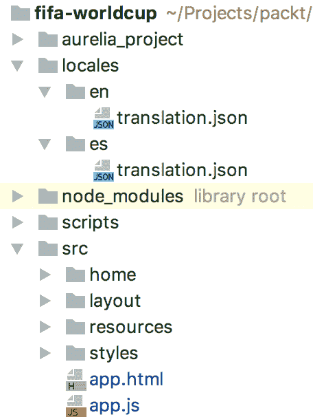

# Aurelia 的高级功能

恭喜！终于，我们到了这里。欢迎来到本书第二部分的最后一章！在这个时候，我们真的确信你知道如何规划和开发，现在我们将添加一些酷炫的功能，使我们的应用程序更加有趣和可扩展。也许你在想如何共享一些属性或触发所有组件的事件，或者使你的应用程序对不同国家讲不同语言的人可理解。好吧，国际化是一个你将在本章中遇到的好概念。如果你需要执行转换日期、数字或货币的操作呢？好吧，这类情况（以及更多）在真实的应用程序中非常常见，所以你需要准备好处理它。你知道吗？我们有好消息！Aurelia 为每种情况（以及更多）都准备好了出色的解决方案。在本章中，你将学习以下主题：

+   事件聚合器

+   国际化

+   记录

+   Aurelia 对话框

+   值转换器

+   自定义绑定行为

+   验证器

+   自定义属性

+   计算属性

让我们从这个精彩的章节开始；我保证你会发现它非常有用和有趣。我们保证。

# 订阅和发布事件 – 事件聚合器来拯救！

在我们当前的应用程序中，我们有不同的组件和视图。其中一些需要从服务器检索数据，其他一些只需要处理为其他组件提供的数据，还有一些只是帮助我们的用户界面更加优雅和易于理解。好吧，到目前为止一切看起来都很好。请注意，到目前为止，我们的应用程序支持不同类型的处理——数据加载、转换以及如何显示。每一项都意味着不同的性能成本，因此可能比其他情况花费更长的时间。话虽如此，让我们描述一个常见的场景——用户进入我们的应用程序并导航到显示本月所有比赛的页面。有大量的数据需要检索，你需要计算今天和比赛日期之间的时间（针对每一个）。

所有这些操作的成本剩余时间将取决于服务器返回的数据量，所以你需要记住——当你设计一个应用程序时，要考虑到最极端的情况。

回到我们的应用程序案例，我们可以找到两种情况：

+   最方便的情况是用户知道应用程序正在检索数据，并耐心地等待页面完全加载。老实说，根据我们的经验，这种场景代表了数字应用程序中常见用户行为的 5%。

+   第二个且最可能的情况是一个没有耐心的用户，他们认为自己的互联网连接丢失，不断地刷新页面，或者按下某个按钮，或者更糟糕的是，永远离开我们的应用程序。

我们需要采取行动告诉用户“嘿！我正在处理某事，请稍等！”同时，阻止任何可以触发事件导致更多等待时间的按钮。我们确信你知道答案，那就是著名的加载条图标。


我们有两种实现它的方法：

+   在每个视图/组件上放置一个加载条图标，并在其中管理其行为

+   在我们的主应用程序模板中只放置一个加载条图标，并从其他组件调用它

可能你会想知道，我如何从一个子组件调用另一个事件？好吧，当然，没有 Aurelia，这可能是一个困难的任务，但幸运的是，情况不会是这样。Aurelia 附带了一个令人难以置信的、易于学习和理解的功能——事件聚合器。

就像选择使用任何东西一样，使用事件聚合器模块的决定应该由你的应用程序需求来决定。在大多数情况下，它是为了处理*横切关注点*。

让我们概述一下什么是横切关注点。

如果有一些方法应该在应用程序/组件的生命周期中的某个事件被触发，并且与它没有任何关系，我们就是在谈论横切关注点。一些通用的例子如下所示：

+   应用程序加载

+   会话验证

+   记录

# 配置事件聚合器

事件聚合器类不难理解。令人难以置信的是，它只有三个公开的方法。像任何其他 Aurelia 模块一样，你只需要在使用它之前将其导入并注入到你的视图模型中：

```js
import { inject } from 'aurelia-framework';
import { EventAggregator } from 'aurelia-event-aggregator';

@inject(EventAggregator)
export class ExampleClass {
    constructor(EventAggregator) {
        this.ea = EventAggregator;
    }
}
```

现在，让我们详细探索事件聚合器的方法。

# publish(event, data)

此方法允许你触发事件。记住，我们的`EventAggregator`将被放置在某个父组件中，所以你知道哪些组件将订阅它。因此，由于这个原因，这个方法没有特定的目标；它们只是触发到空间的事件，不管是否有零个或多个订阅者。

第一个参数是事件名称。你可以为这个选择任何名字，因为这是你的自定义事件。它将被用作标识符，以便从应用程序的外部组件调用它。在这种情况下，你可以使用`EventAggregator`来配置我们的加载条，所以按照它来命名是正确的。我们将称之为`dataRetrievingEvent`。

第二个参数是你想要传递给事件的数据（例如提供一些数据），这是完全可选的。大多数情况下，它将是一个数组或数据对象。如果你愿意，甚至可以传递一个字符串值。然而，并不是所有事件都需要接收新数据。

我们将使用我们的`EventAggregator`类定义变量来调用此方法：

```js
this.ea.publish('dataRetrievingEvent', {message: 'Loading...don't close the window!' 
```

这非常简单。我们已经配置并准备好了我们的第一个自定义事件，可以从应用程序中的任何组件调用它。

# subscribe(event, callbackFunction)

如果我们在第一个方法中发布了一个事件，现在就是时候监听它了。第一个参数是我们想要订阅的事件名称，第二个参数是一个回调函数，可以用来获取事件发布者发送的值。这些数据可以是一个简单的字符串，或者，就像在我们的例子中，是一个对象。

就像前面的例子一样，我们可以在我们的组件中通过`EventAggregator`类实例访问这个方法：

```js
let subscription = this.ea.subscribe('dataRetrievingEvent', response => {
    console.log(response);
    // This should yield: Object {message: "Loading...don't close the window!"}
});
```

我们定义了一个`subscriber`对象，这基本上是一个方法调用。这个对象将直接引用订阅的事件，并允许我们直接执行一个名为`dispose`的子函数。这个函数用于删除现有的订阅，通常用于我们的组件被销毁时。请记住，即使事件聚合器是一个很棒的功能，也会付出一点性能上的代价，所以不要滥用它。

这里有一个示例，当视图模型被分离时，订阅会被移除：

```js
import { inject } from 'aurelia-framework';
import { EventAggregator } from 'aurelia-event-aggregator';

@inject(EventAggregator)
export class ExampleClass {
    constructor(EventAggregator) {
        this.ea = EventAggregator;
    }

    attached() {
        this.subscriber = this.ea.subscribe('dataRetrievingEvent', response => {
            console.log(response.message);
        });
    }

    detached() {
        this.subscriber.dispose();
    }
}
```

这是一个垃圾回收措施，确保您的应用程序不会使用它不再需要的资源。

# subscribeOnce(event, callbackFunction)

这种方法与`subscribe()`方法完全相同，但只有一个区别——一旦回调被触发，它会自动取消订阅事件。也许在某些情况下，您会发现一些只需要*一次性*订阅的情况，比如我们的加载条。这个例子与`subscribe()`方法的例子非常相似：

```js
attached() {
     this.subscriber = this.ea.subscribeOnce('dataRetrievingEvent', response => {
         console.log(response.message);
     });
}
```

我们确信您会发现这个功能非常有用。这只是开始！让我们探索其他令人惊叹的 API！

# 为我们的应用程序添加更多语言——国际化！

对于每个 Web 应用程序来说，国际化是更有趣（和有用）的功能之一。我们正在开发一个用于 2018 年俄罗斯 FIFA 世界杯的应用程序，因此，基于这一点，如果我们的应用程序能够支持全球所有用户的多种语言，那就太棒了。

为了这个目的，我们将使用官方的`aurelia-i18n`插件；这将用于获取当前应用程序的位置。这个插件基于`i18next`库，具有一些非常有趣的特性，如下列所示：

+   翻译加载器

+   语言检测

+   产品本地化

+   灵活性和可扩展性

最后一个是最重要的功能。考虑到可扩展性，您只需一个配置文件就可以为较小的项目实现国际化，如果您需要在较大的项目上实现它，只需创建多个翻译文件并根据用户的需求加载它们。

# 安装和配置

根据您选择的构建工具来创建和配置您的应用程序，您会发现许多安装和准备`aurelia-i18n`插件的方法。到目前为止，我们已经使用了 Aurelia CLI，但让我们探索一下如果我们选择了不同的选项，如何配置它，还记得吗？

+   Webpack

+   JSPM

+   Aurelia CLI

# 对于 Webpack 用户

我们需要从`npm`仓库检索插件，所以只需输入以下命令以获取最新版本：

```js
 npm install aurelia-i18n --save
```

它将下载并保存插件到您的项目依赖项中。正如我们之前所说的，`aurelia-i18n`基于`i18n`框架，因此您应该安装一个后端插件。其中最著名的是`i18next-xhr-backend`，一个简单的用于浏览器的`i18next`后端。它是如何工作的？简单，使用`XHR`，它将从某些后端服务器加载资源。是的，您的翻译文件！如果您想使用内置的`aurelia-loader`后端，即 Aurelia 用来获取资源的相同插件，那么可以忽略下一步。

您现在知道该怎么做。

```js
npm install i18next i18next-xhr-backend --save
```

我们几乎准备好了。在您的 Webpack 配置文件中，您必须在项目的 Aurelia 捆绑列表（在 Aurelia 部分）中添加`aurelia-i18n`。

```js
const coreBundles = {
    bootstrap: [/* many options here */],
    aurelia: [
      /* many options here too*/
      'aurelia-i18n' // add aurelia-i18n to the array
    ]
  }
```

# JSPM 用户

与前两步类似，但我们将使用 JSPM 而不是已知的 NPM。首先，我们将下载`aurelia-i18n`插件：

```js
 jspm install aurelia-i18n
```

对于后端，请输入以下内容：

```js
jspm install npm:i18next-xhr-backend
```

由于我们将使用内置的`aurelia-i18n-loader`，因此我们不需要添加任何额外的配置。

# Aurelia CLI 用户

与我们在 Webpack 用户部分解释的几乎相同，我们需要从`npm`仓库检索`aurelia-i18n`插件和后端服务器：

```js
npm install aurelia-i18n --save
npm install i18next i18next-xhr-backend --save
```

现在，我们需要告诉我们的项目我们有一些新的依赖项需要配置。打开您的 Aurelia 配置文件（`aurelia.json`），查找`dependencies`部分。您必须添加以下条目：

```js
{
    "name": "i18next",
    "path": "../node_modules/i18next/dist/umd",
    "main": "i18next"
  },
  {
    "name": "aurelia-i18n",
    "path": "../node_modules/aurelia-i18n/dist/amd",
    "main": "aurelia-i18n"
  },
  {
    "name": "i18next-xhr-backend",
    "path": "../node_modules/i18next-xhr-backend/dist/umd",
    "main": "i18nextXHRBackend"
  }
```

如果您的应用程序是使用`Aurelia CLI 0.33.1`创建的，您可以省略此最后一步。

最后，我们完成了插件的配置。现在，让我们将其配置到我们的应用程序中！

# 配置和定义我们的第一个翻译文件

我们的应用程序已准备好开始使用`i18n`框架。有一些步骤需要准备插件，让我们来探索它们。

我们需要做的第一件事是定位我们的`index.html`文件。它应该位于我们的主要根应用程序文件夹中。确保您的`<body>`部分与以下相同：

```js
 <body aurelia-app="main">
      /* Some content */
 </body>
```

如果您是`Webpack`用户，请定位`index.js`文件而不是`index.html`。

然后，在您的根应用程序位置，创建一个名为`locales`的文件夹。它将用于存储所有位置文件。为要支持的语言创建一个文件夹。然后，在每个文件夹内部，创建一个名为`translation.json`的文件。此文件将包含所有您的文本翻译结构，具体取决于您的应用程序。

您的应用程序文件夹结构必须如下所示：



`i18next`基于预定义的事务文件模式工作。查看以下我们的 en-EN 事务文件示例：

```js
 {
    "welcome": "Welcome to FIFA WC 18!",
    "user_male": "Mr.",
    "user_female": "Mss.",
    "time_remaining": "Time Remaining : {{time}}"
  }
```

现在，一个用于 es-ES 语言支持：

```js
 {
    "welcome": "Bienvenido a FIFA WC 18!",
    "user_male": "Sr.",
    "user_female": "Sra.",
    "time_remaining": "Tiempo pendiente : {{time}}"
  }
```

所以这些只是为了示例目的，并且非常有用，可以帮助你理解这个插件的工作方式。现在，是时候配置插件后端了。你还记得我们创建的 `src/main.js` 文件来定义我们的配置函数吗？好吧，现在是打开这个文件并添加一些新配置的时候了。如果你还没有创建这个文件，这是一个很好的时机去做这件事。

对于选择 `i18next-xhr-backend` 支持的人来说，首先，打开 `main.js` 文件并找到 Aurelia 的配置部分。在文件的第一行，你必须导入以下文件：

```js
import {I18N, TCustomAttribute} from 'aurelia-i18n';
import Backend from 'i18next-xhr-backend'; 
```

然后，创建一个新的插件管道：

```js
aurelia.use
  .standardConfiguration()
  .plugin('aurelia-materialize-bridge', b => b.useAll())
  .plugin()/* <<<<  You must create a new plugin pipe*/
  .feature('resources');
```

现在，在新的插件管道内部，添加以下配置：

```js
.plugin('aurelia-i18n', (instance) => {
            let aliases = ['t', 'i18n'];
            TCustomAttribute.configureAliases(aliases);
            instance.i18next.use(Backend);

            return instance.setup({
              backend: {                                  
                loadPath: './locales/{{lng}}/{{ns}}.json',
              },
              attributes: aliases,
              lng : 'es',
              fallbackLng : 'en',
              debug : false
            });
});
```

让我们简单解释一下我们在该文件中做了什么。

首先，我们需要配置我们的 `i18n` 别名，所以只需在简单的字符串数组中声明它们，并将它们作为参数传递给静态的 `configureAliases()` 方法。这将把定义的值映射到 `<html>` 标签中，以调用正确的值。现在可能听起来有点令人困惑，但别担心，你很快就能看到整个画面：

```js
let aliases = ['t', 'i18n'];
TCustomAttribute.configureAliases(aliases);
```

接下来，我们将导入的后端插件（`i18next-xhr-backend`）注册到我们的 `aurelia-i18n` 实例中：

```js
instance.i18next.use(Backend);
```

最后，我们需要添加一些配置。这完全基于 `i18n` 配置文档，所以你可以在 [`i18next.com/docs/options`](https://www.i18next.com/configuration-options.html) 找到更多关于这方面的信息。那个 `promise` 配置必须返回；正因为如此，我们在 `instance.setup()` 声明之前添加了 `return` 语句：

```js
backend: {  // <-- configure backend
   loadPath: './locales/{{lng}}/{{ns}}.json', // <-- Our location files path
},
```

最后的选项用于映射后备语言、默认语言等：

```js
attributes: aliases, <<-- Predefined aliases
lng : 'es', // <<-- Default language to use (overrides language detection).
fallbackLng : 'en',// <<-- Language to use is current location language is not available
debug : false // <<-- Log info level in console output
```

我们已经准备好开始使用这个插件了。做得好！

如果你是一个 Webpack 用户，别忘了在插件名称前加上 PLATFORM 前缀。例如：  `.plugin(PLATFORM.moduleName('aurelia-i18n'), (instance) => {......});`

# 使用插件 – 多语言支持！

要开始使用我们的文件，你必须告诉你的 `ViewModel` 组件使用哪种语言。我们将在构造函数方法中执行此操作；查看以下示例：

```js
import {I18N} from 'aurelia-i18n';
import { inject } from 'aurelia-dependency-injection';

@inject(I18n) export class WelcomePageComponent { constructor(i18n) { this.i18n = i18n; this.i18n
 .setLocale('es-ES')
 .then( () => {}); } ... }
```

如果你想获取活动区域设置，很简单，将配置文件修改如下：

```js
import {I18N} from 'aurelia-i18n';

@inject(I18n)
export class WelcomePageComponent {
     constructor(i18n) {
       this.i18n = i18n;
     }
      ...
}
```

与 `setLocale()` 类似，我们还有 `getLocale()` 方法。你可以通过输入以下内容来检索活动区域设置：

```js
console.log(this.i18n.getLocale());
```

现在，在 HTML 文件中，我们只需要调用我们的翻译别名来映射我们在 `translation.json` 文件中定义的属性：

```js
<h2 t="welcome">Welcome to FIFA WX 18</h2>
```

可选地，我们能够使用我们的第二个别名来映射值：

```js
<h2 i18n="welcome">Welcome to FIFA WX 18</h2>
```

现在，你已经准备好开始为你的应用程序添加多语言支持了！使用这个插件还有很多其他高级提示可以帮助你获得最佳效果。我们将在下一个示例中展示其中之一。

想象一下，你需要在你翻译文件中映射`<html>`标签。这是可能的吗？是的。想象一下，你需要渲染一些长的测试（例如产品描述），并且需要加粗一些单词，比如价格或折扣。我们需要做什么？非常简单，只需添加你需要的 HTML 标签：

```js
"time_remaining": "Time remaining : <b>{{time}}</b>"
```

现在，让我们在我们的`View`文件中使用它：

```js
<label t="time_remaining">Time remaining : {{time}}</label>
```

如果你查看你的窗口，你会看到类似`&lt;b&gt;bold&lt;/b&gt;`的东西，不要害怕，这是正常的。这是因为我们没有设置正确的标记来正确解释我们的 HTML 标签。你必须知道，有四个主要属性可以添加自定义行为到我们的翻译文件变量：

+   `[text]`: 默认属性，将标签值转义为纯文本

+   `[html]`: 告诉我们的翻译文件“嘿，这包含 HTML 标签，将其渲染为它们！”

+   `[append]`: 将翻译添加到元素中已存在的当前内容（允许 HTML）

+   `[prepend]`: 将翻译添加到元素中已存在的当前内容之前（允许 HTML）

这个属性必须在我们翻译标识符键之前。你知道接下来要做什么：

```js
<label t="[html]time_remaining">Time remaining : {{time}}</label>
```

太棒了？是的，确实如此。至于其他更高级的功能，我们非常确信你会喜欢`i18n`提供的所有选项。这就是这一章的全部内容吗？当然不是。让我们继续探索！

# 跟踪方法调用和用户行为——日志记录

作为开发者，你知道了解你的应用程序正在发生什么非常重要。一些关于用户点击、事件触发或错误消息的信息，有一个好的日志工具在你身边告诉你应用程序是否正常（或者真的很糟糕）是良好的实践。通常，开发者使用常见的`console.log()`语句，当它部署到 UAT 或生产环境时，他们会注释掉所有这些行。

Aurelia 知道这个功能有多重要，猜猜看——是的，它为此目的有自己的插件。让我们来探索一下！

# 配置你的日志管理器

默认情况下，Aurelia 已经在他们的依赖项中有了日志 API，所以你在这个时候不需要运行任何`npm`命令。当然，如果由于某种原因该库缺失，你知道如何处理它。

首先，我们需要创建一个文件来配置我们的日志级别。在`resources`文件夹中，创建一个名为`custom-log-appender.js`的文件。这个名字完全可选；你可以以最方便的方式命名它。

首先，让我们配置所有我们的日志级别：

```js
export class CustomLogAppender {

  constructor(){}
  debug(logger, message, ...rest){
    console.debug(`DEBUG [${logger.id}] ${message}`, ...rest);
  }
  info(logger, message, ...rest){
    console.info(`INFO [${logger.id}] ${message}`, ...rest);
  }
  warn(logger, message, ...rest){
    console.warn(`WARN [${logger.id}] ${message}`, ...rest); 
  }
  error(logger, message, ...rest){
    console.error(`ERROR [${logger.id}] ${message}`, ...rest);
  }
}
```

我们几乎准备好了。现在，打开主配置文件（`main.js`）并从 Aurelia 导入日志依赖项：

```js
import {LogManager} from 'aurelia-framework';
```

此外，导入我们最近创建的`CustomLogAppender`：

```js
import {CustomLogAppender} from './resources/custom-log-appender';
```

现在，使用你创建的`CustomLogAppender`配置 Aurelia 的`LogManager`：

```js
LogManager.addAppender(new CustomLogAppender());
LogManager.setLevel(LogManager.logLevel.debug);
```

查找`configure()`函数。只需添加一行：

```js
export function configure(aurelia) {
  aurelia.use
    .standardConfiguration()
    .developmentLogging() // <-- Logging activated for development env!
    .plugin('aurelia-animator-css');
```

注意，这种配置将适用于所有环境（dev、test、prod）。通常，日志记录在开发阶段最常用于检测错误，所以让我们对之前的配置做一些改进：

首先，让我们创建一个名为 `environment.js` 的文件。这个文件将包含我们的当前激活环境：

```js
//environment.js
export default {
  debug: true,
  testing: false
};
```

然后，我们需要将此文件导入我们的 `src/main.js` 文件：

```js
import environment from './environment';

export function configure(aurelia) {
 aurelia.use
     .standardConfiguration()
     .plugin('aurelia-anumator-css');

if (environment.debug) { 
     aurelia.use.developmentLogging();
}
    .
    .
    .
}
```

你已经准备好开始使用日志记录器了！让我们打开一个 `ViewModel` 文件，开始记录内部发生的事情：

```js
import {LogManager} from 'aurelia-framework';
let logger = LogManager.getLogger('homePage');
logger.debug('me');

export class HomePage() {
    activate(){
       logger.debug(“Enter to home page!!!”);
    }
}
```

这非常简单且非常有用。当然，我们还有更多特殊功能要展示给你。继续阅读吧！

# 模态配置 - Aurelia 对话框来拯救！

每个应用程序都需要向最终用户展示不同类型的信息。这些信息需要显示在单个页面上吗？不一定。最终用户非常熟悉 bootstrap 对话框（通常称为 `Modal`），这是一个自定义的 JavaScript `alert()` 元素。它更加优雅，更易于添加自定义行为，现在它可以用来显示警报信息，你也可以配置整个表单或确认对话框。在我们的 FIFA 世界杯应用程序中，`Aurelia-materialize` 插件已经为模态组件配置了这个功能，但让我们探索它是如何工作的以及我们如何可以改进它。让我们开始吧！

# 获取 Aurelia-dialog 插件

如果你使用的是 JSPM 管理器，请输入以下命令：

```js
jspm install aurelia-dialog
```

否则，对于 `Webpack` / `Aurelia CLI` 用户，使用已知的 `npm install` 命令：

```js
 npm install aurelia-dialog --save
```

记得将这个依赖项保存到你的 `项目依赖项` 部分。这非常重要，因为它将在最终应用程序构建中使用。

现在，让我们告诉我们的应用程序我们有一个新的插件。像之前看到的其他插件一样，打开你的 Aurelia 配置文件 (`aurelia.json`) 并添加一个新的插件部分：

```js
{
    dependencies: [
    // Some content here
      {
        "name": "aurelia-dialog",
        "path": "../node_modules/aurelia-dialog/dist/amd",
        "main": "aurelia-dialog"
      }
    // Some content here too
    ]
  }
```

我们已经配置了我们的 `index.html` 文件以使用手动引导；如果没有，请确保它有一个包含 `aurelia-app="main"` 标签的 `<body>` 元素：

```js
<body aurelia-app="main">
</body>
```

在你的应用程序配置文件 (`main.js`) 中，添加一个新的 `plugin()` 条目：

```js
export function configure(aurelia) {
    aurelia.use
      .standardConfiguration()
      .developmentLogging()
      .plugin('aurelia-dialog'); // <<-- Add this plugin!
```

此外，如果你想给你的 `modal` 添加更定制的行为，你可以在 `plugin()` 管道中实现一些配置。可选地，你可以按照以下方式配置 `aurelia-dialog` 插件：

```js
.plugin(PLATFORM.moduleName('aurelia-dialog'), config => { // <<-- PLATFORM.moduleName is mandatory if you are using webpack
        config.useDefaults();
        config.settings.lock = true;
        config.settings.centerHorizontalOnly = false;
        config.settings.startingZIndex = 5;
        config.settings.keyboard = true;
});
```

你已经准备好了！现在，是时候倾听我们的插件了！

# 将对话框组件添加到我们的应用程序中

让我们为我们的应用程序创建一个 `UserRegister` 模态。这看起来可能像这样：

```js
import { inject } from 'aurelia-framework'
import { DialogController } from 'aurelia-dialog'

@inject(DialogController)
export class UserForm {
  user = { firstName: '',    
           lastName: '',
           age: 0
 };

  activate(user){
    user = user;
  }
}
```

这现在非常简单。记住，这个组件将是模态本身。模态是在主要内容之上显示的，所以现在我们将配置这个行为到我们的 `Home` 组件中。注意这个部分；它有点棘手，但我们确信你会觉得实现起来很容易。

首先，让我们从我们最近导入的 `aurelia-dialog` 插件中导入 `DialogService`：

```js
import {DialogService} from 'aurelia-dialog';
```

此外，让我们导入我们最近创建的 `UserForm` 组件：

```js
import {UserForm} from './user-form';
```

现在，让我们配置对话框行为：

```js
export class HomeComponent {
  static inject = [DialogService]; // <<-- Same as use the @inject annotation

  user = { firstName: 'Diego', lastName: 'Arguelles', age: 26 }

  constructor(dialogService) {
    this.dialogService = dialogService; <<-- We need to inject the service into our component
  }

  openModal(){
    this.dialogService.open({ viewModel: UserForm, model: this.user}).whenClosed(response => {
      if (!response.wasCancelled) {
        console.log('good - ', response.output);
      } else {
        console.log('bad');
      }
    });
  }
}
```

此外，`<template>` 文件需要包含一个 `<button>` 来触发 `openModal()` 方法：

```js
<template>
   <button click.trigger = "openModal()">New user</button>
<template>
```

让我们解释一下 `openModal()` 方法：

首先，我们需要打开模态框。我们将为最近创建的用户对象设置一些默认值。此方法将返回一个 `promise` 对象。为什么？很简单，有了这个 `promise`，我们就能处理模态框内部触发的任何事件：

```js
this.dialogService.open({ viewModel: UserForm, model: this.user}).then();
```

在 `then()` 语句内部，我们的 `promise` 将被定义为以下方式：

```js
response => {
    //We will get the response value returned by the modal
    if (!response.wasCancelled) { 
        console.log('All OK - ', response.output); //Should output the recently created user info
    } else { 
        console.log('Something get wrong!'); 
    } console.log(response.output);
}
```

现在，让我们看看我们的 `<template>` 文件：

```js
<template>
   <ux-dialog>
      <ai-dialog-body>
         <h2>User registration</h2>
         <input placeholder="User name" model.bind="user.firstName" />
         <input placeholder="User last name" model.bind="user.lastName" />
         <input placeholder="User age" model.bind="user.age" /> 
      </ai-dialog-body> 
      <ai-dialog-footer> 
         <button click.trigger = "controller.cancel()">Cancel</button> 
         <button click.trigger = "controller.ok(message)">Ok</button> 
      </ai-dialog-footer> 
   </ux-dialog> 
</template>
```

当然，我们可以自定义模态框的显示方式。例如，bootstrap 默认在模态框背景中添加 50% 的不透明度。为了得到相同的结果，将此 CSS 类包含在现有的或新的样式表中。根据你使用的 CSS 预处理器，如果需要，不要忘记导入：

```js
ai-dialog-overlay.active {
      background-color: black;
      opacity: .5;
}
```

记住，我们正在覆盖来自 Aurelia 对话的现有类，所以你不需要在 `<html>` 组件中指定此类。

现在，你准备好使用动态对话框为你的应用程序添加更友好的行为。

# 动态值转换器 - 更少的代码，更多的功能

正如我们在本章开头所说的，我们的应用程序应该对全球所有用户都可用。你可以完全自由地根据你自己的目的来建模应用程序。也许你想实现需要付费才能访问的付费功能，因此你需要用用户的货币来表示成本。另一件好事是有一个自定义格式的日期，或者简单地添加一些数字转换、小数四舍五入等等。

你已经知道如何将 Aurelia `View` 和 `ViewModel` 组件之间的值绑定和插值。现在我们将看到如何改进数据绑定。加油！

# 问题 - 数据没有按照我们的需求暴露

我们可能遇到的一个常见问题是日期格式化。在其他代码语言，如 Java 中，你有一个像 `SimpleDateFormat` 这样的实用工具类，它将 `Date()` 对象转换为更友好的可读格式。在 JavaScript 中，我们有几个库来做这个工作，但它们并不容易调用。让我们看一个例子。

你在 `ViewModel` 组件中获取当前日期；然后，你将这个值传递到 `View` 层：

```js
export class Example {
      constructor() {
        this.changeDate();
        setInterval(() => this.changeDate(), 3000); //<<-- This method will be executed each 3 seconds
      }

      changeDate() {
        this.currentDate = new Date(); //<<-- Get the current date
      }
}
```

在我们的 `View` 文件中，我们将 `currentDate` 的值映射为要显示的内容：

```js
<template>
      ${currentDate}
</template>
```

当你运行示例时，你将在屏幕上看到以下输出：

```js
Sun Feb 25 2018 14:06:37 GMT-0300 (-03) 
```

好的，我们可以做得更好；现在是时候调用我们的值转换器了，但究竟什么是值转换器？Aurelia 文档解释得很好：

"值转换器是一个类，其责任是将视图模型值转换为适合在视图中显示的值，反之亦然。"

话虽如此，让我们为了示例目的创建一个值转换器文件。由于我们正在处理 `Date()` 值，我们将使用 `moment` 插件。

如果你没有在依赖树中找到它，只需从 `npm` 存储库导入它：

```js
npm install moment --save 
```

然后，首先，在我们的值转换器文件中导入这个库：

```js
import moment from 'moment';

export class DateFormatValueConverter {
     toView(value) {
       return moment(value).format('M/D/YYYY h:mm:ss a');
     }
}
```

好的，现在让我们解释一下它是如何工作的：

+   你知道 Aurelia 是一个基于约定的配置框架。换句话说，如果你以`ValueConverter`结尾命名这个类，框架将使用这个类作为自定义值转换器，而无需任何更多配置。

+   `toView()`方法是从 Aurelia 的`ValueConverter`接口继承的。它定义了数据流向的方向，如果是从`ViewModel`到`View`，或者相反，你有`fromView()`方法。

+   这些值转换方法可以接收多个参数。

现在，我们只需要像导入其他依赖项一样在我们的`View`文件中导入这个值转换器，使用`<require>`标签：

```js
<template>
      <require from="./date-format"></require> <<-- Path to your value converter
```

现在，我们需要将转换器添加到我们的绑定语法中：

```js
<template>
      <require from="./date-format"></require>
      ${currentDate | dateFormat} <br/> <<-- Name mapped for our value converter
</template>
```

现在，刷新你的浏览器窗口：

```js
2/25/2018 2:25:36 pm
```

好多了，对吧？嗯，同样的动态也可以应用到数字格式转换器、货币等。让我们使例子更复杂一些——如果我们需要在整个应用程序中显示多种日期格式怎么办？我们应该为每个需要的格式定义一个值转换器文件吗？这是一个有效的选项，但不是最有效的方法。你还记得我们说过值转换器接口方法可以接收多个参数吗？那么，如果我们把日期格式也作为参数发送会怎样呢？让我们尝试看看会发生什么：

```js
toView(value, format) {
        return moment(value).format(format);
}
```

如果没有提供，你可以指定一个默认格式：`toView(value, format = 'M/D/YYYY'){ ... }`

很好，我们的格式化器现在接受`format`模式作为参数。这不是 Aurelia 的魔法；这是因为我们正在使用一个很好的 JavaScript 库`moment.js`，它允许我们执行这类操作。

现在，在我们的`View`文件中，我们可以添加我们需要的任何时间格式：

```js

${currentDate | dateFormat:'h:mm:ss a'} <br/>
${currentDate | dateFormat:'M/D/YYYY h:mm:ss a'} <br/>
${currentDate | dateFormat:'MMMM Mo YYYY'} <br/>
```

现在，看看你的浏览器窗口：

```js
2:33:11 pm 
2/25/2018 2:33:11 pm 
February 2nd 2018 
```

非常好。现在，让我们看看一个更复杂但更常见用法的例子——数组排序。

你知道如何从一个后端服务检索数据；通常，这些数据作为`array`对象检索，并在`View`文件中显示为列表。这都很好，但如果我们需要根据某些属性对这些值进行排序怎么办？看看代码示例：

```js
export class ArraySortingValueConverter {
      toView(array, config) {
        let sorter = (config.direction || 'ascending') === 'ascending' ? 1 : -1;
        return array.sort((a, b) => {
          return (a[config.propertyName] - b[config.propertyName]) * sorter;
        });
      }
}
```

我们在做什么？让我们来解释一下。

我们接收两个参数，一个是数组，另一个是配置属性。配置属性是一个包含两个值的对象：`config.direction`，它可以取这两个选项之一：升序或任何其他字符串。根据这个，排序器可以按递增的值`1`或按递减的`-1`进行降序排序。然后，在返回语句中，我们使用数组本身的排序函数，并将匿名函数作为参数发送，用于比较配置对象中映射的`config.propertyName`值。

这是我们从某些后端服务检索数据的方式：

```js
import {HttpClient} from 'aurelia-http-client';

export class Example {
      users = [];
      activate() {
        return new HttpClient()
          .get('https://api.ourorganization.com/users')
          .then(response => this.users = response.content);
      }
}
```

目前还没有什么奇怪的地方。现在，让我们检查一下`View`文件：

```js
<template>
      <require from="./array-sort"></require> <<-- Import your value converter

      <div class="row">
        <div class="col-sm-3" repeat.for="user of users | arraySorting: { propertyName: 'code', direction: 'descending' }">
            ${user.firstName}
          </a>
        </div>
      </div>
</template>
```

这很美。我们不需要添加任何 JavaScript 函数或奇怪的配置来开始使用这个非常有用的功能。

# 将自定义行为绑定到我们的应用程序

让我们继续探索 Aurelia 的特殊功能。在上一个部分中，我们看到了值转换器，并且很难不将这个功能与 Aurelia 框架的绑定引擎联系起来。也许你认为这两个功能有很多共同之处，好吧，实际上并不是很多。让我们开始解释绑定引擎是如何工作的。

Aurelia 框架中的视图资源可以分为四个类别：

+   值转换器

+   自定义属性

+   自定义元素

+   绑定行为

我们将只关注最后一个。这并不是因为其他的不重要，而是因为我们首先了解它是如何工作的，然后再探索其他类别会更好。不用担心，值转换器已经涵盖了，你将对这两个功能之间的区别有一个更清晰的认识。

值转换器在`View`和`ViewModel`（或反之）之间充当着桥梁拦截器的角色。绑定行为超越了这一点——它在整个组件生命周期中完全访问绑定实例。这使得我们可以修改绑定行为，例如修改绑定节流时间，或者添加对值更新的自定义。

记住，Aurelia 是一个双向绑定框架，所以你不需要担心`View`和`ViewModel`之间的数据同步。这是如何完成的？Aurelia 有一个预定义的节流机制，默认情况下每 200 毫秒更新一次值。可以更新吗？是的，Aurelia 让我们可以自由地根据我们的需求管理这个值。类似于`value-converters`的语法，我们需要在需要的地方调用绑定行为，即在`<template>`文件中：

```js
    <input type="text" value.bind="query & throttle:850">
```

你注意到`&`符号了吗？这是与已涵盖的值转换器的第一个区别。当我们需要定义一个绑定行为时，我们使用`&`通配符告诉框架。还有一点你必须注意，我们可以向绑定行为发送参数。只需在行为声明后添加`:`符号并发送值即可。是否可以发送多个参数？是的。如何？看看例子：

```js
<input type="text" value.bind="query & customBehavior:arg1:arg2:arg3">
```

此外，你可以在一个元素中声明多个行为：

```js
${value | upperCase & throttle:800 & anotherBehavior:arg1:arg2}
```

同样，你可以在`View`和`ViewModel`之间定义更新时间间隔；你还有一个有趣的绑定行为称为**防抖**。我们可以将这个行为与*节流*放在同一类别中，但区别在于它不是计算更新时间，而是在指定的时间间隔内没有变化时，防止绑定更新。

你可能会觉得这个功能更有用；让我们通过一个实际用例来解释它。

在我们的 FIFA 世界杯应用程序中，最被需求的功能之一可能是一个搜索输入，更具体地说，是一个自动完成。你已经知道自动完成组件应该根据用户的输入值检索数据。当你开发这个功能时，最大的问题是“我们应该在何时触发自动完成的`searchByKey()`方法？在每次按键时？当输入长度大于`2`或`3`时？”。真的，这是一个难题；你的应用性能直接受到影响。

这是思考*防抖*的好时机。与其每次用户输入值时都触发`searchByKey()`方法，不如在用户输入搜索键后的一段时间内触发它：

```js
<input type="text" value.bind="teamCountry & debounce:1000">
```

你还可以使用其他非常有用的绑定行为，比如`oneTime`。默认情况下，Aurelia 将预配置的双向绑定设置到每个`ViewModel`属性上。最大的问题是“我们是否真的需要在组件的每个属性上激活双向绑定？”大多数情况下，答案是“不”。这就是`oneTime`出现并成为我们的性能优化伙伴的地方。真的，它对应用性能有直接影响吗？是的。为了启用双重绑定，Aurelia 需要实现多个观察者来寻找组件属性中的任何变化。使用`oneTime`，我们只需告诉应用——将这个属性映射到我的视图并忘记它：

```js
 <span>${score & oneTime}</span>
```

当然，还有许多更多的预定义绑定行为可以探索，但如果你记得，我们在第一个例子中使用了定义为`customBehavior`的一个绑定行为。你注意到这一点了吗？猜猜看，Aurelia 允许你定义自己的绑定行为，现在是时候学习了。

与自定义值转换器类似，你可以创建自定义绑定行为。查看以下示例：

```js
export class DynamicExpressionBindingBehavior {  

  bind(binding, source, rawExpression) {
    console.log('Binding : '+rawExpression)
  }

  unbind(binding, source) {
    console.log('Unbinding ')
  }
}
```

就像最后的例子一样，让我们解释一下代码在做什么。

首先，你必须知道，与值转换器中的`toView()`和`fromView()`方法类似，自定义绑定行为需要实现两个方法：`bind(binding, src, expressions...)`和`unbind(binding, src)`。

在`bind()`方法中，我们正在操作作为参数传递的用户输入值。你必须知道的是，在`bind()`方法中，前两个参数是由 Aurelia 发送的。其他参数可以是一个或多个自定义参数；在这种情况下，`rawExpresions`。

`unbind()`方法只是确保当我们的数据处理结束时，我们的绑定行为返回到正常状态。

看起来很简单？是的，例子看起来很简单，但实际实现会更难理解。别担心，Aurelia 框架通常提供的预定义绑定行为集合对于每个应用程序的目的来说已经足够了。

# 提高我们的应用程序表单 – 验证器

我们知道 Aurelia 的绑定引擎是如何工作的。我们也知道如何拦截和自定义绑定行为。我们还知道如何根据我们的需求在`View`-`ViewModel`层之间转换数据。只是还有一些事情悬而未决，`aurelia-validation`插件就是其中之一。当你需要用户提供的数据时，你必须预期任何情况。用户不了解你的应用。他会做任何他想做的事情，你需要为此做好准备。你需要确保用户提供的数据至少是后端服务期望的正确格式。你需要过滤正确的值，并向用户发送警报，告诉他们哪些值是错误的以及如何修复它们。我们经常需要站在用户的角度思考。软件开发不仅仅是编程，不仅仅是创建表单和存储/检索数据。我们需要使我们的应用具有容错性，就像我们之前说的那样，总是考虑最坏的情况。只需想象一下——你正在开发一个需要执行某些计算的应用。你有三个输入：`a`、`b`和`c`；你需要计算总和。听起来很简单，对吧？我们有两个用户输入了以下内容：

```js
User 1 : value for a)33; b)23; c)32
```

你按下提交按钮，得到正确的总和——`88`。很好，应用完成了它的目的。让我们看看第二个用户会输入什么：

```js
User 2: value for a)49 b)34j c)12
```

正如你所见，最后一个用户错误地按下了`j`字符。它会依赖于应用错误吗？不。我们的操作将会执行，JavaScript 不是一种强类型语言，所以它会以以下方式操作：

```js
49 + "34j" + 12 = "4934j12"
```

用户将看到这个值，我们确信他们永远不会再次使用你的应用。

# 准备战斗——获取验证插件

就像我们可能安装的其他插件一样，安装和配置步骤非常相似。如果你是第一次执行此操作，只需执行以下步骤：

如果你使用 NPM 作为包管理器，使用以下方法：

```js
npm install aurelia-validation --save
```

或者，如果你是 JSPM 用户，使用以下方法：

```js
jspm install aurelia-validation
```

现在，打开我们配置应用插件的`main.js`文件。在`configure()`函数中，添加新的插件：

```js
export function configure(aurelia) {
    aurelia.use
      .standardConfiguration()
      .developmentLogging()
      .plugin('aurelia-validation'); // <<-- Add this plugin!
```

最后，打开你的`aurelia.json`文件并添加以下插件声明：

```js
    {
      "name": "aurelia-validation",
      "path": "../node_modules/aurelia-validation/dist/amd",
      "main": "aurelia-validation"
    }
```

我们准备好了。让我们开始吧！

# 第一步——定义我们的规则

Aurelia 验证插件基于标准规则。我们需要使用`ValidationRules`类定义我们自己的规则集。这个类有一些静态方法，接收我们的值并验证输入值是否符合我们的要求。此外，一个验证规则必须有一个预定义的格式。我们将解释的第一个方法是`ensure()`：

```js
 ValidationRules.ensure('myValidatedProperty')
```

此方法接受一个参数，即我们想要验证的属性名。此外，如果你正在验证一个对象，你可以传递匿名函数作为参数：

```js
 ValidationRules.ensure(u => u.firstName)
```

我们将要解释的第二种方法是 `displayName()`。这不是必需的，但如果需要在验证信息中以一种预定义的格式显示此属性，则很有用；考虑以下示例：

```js
 ValidationRules.ensure(u => u.firstName).displayName('User name')
Error message: The user name is required.
```

最后，我们需要定义将应用于该字段的规则集；以下是一些最常用的规则：

+   `required()` 阻止用户提交空或空白值

+   `matches(regex)` 帮助我们确保输入值符合预定义的格式，这在日期字段中很常见

+   `email()` 是确保电子邮件格式正确的一种简单方法

+   `minLength(length)` 和 `maxLength(length)` 验证字符串属性的长度

如果我们的用户名不能为空，验证规则将是这样的：

```js
    ValidationRules.ensure('u => u.firstName').displayName('First name')
        .required().withMessage(`\${$firstName} cannot be blank.`);
```

你注意到有什么不同吗？是的，我们正在使用 `withMessage()` 方法来自定义我们的验证错误信息。事情变得更有趣了。

如果您需要这些验证规则仅适用于一个对象，请不要担心，Aurelia 已经解决了这个问题。您需要标记您想要应用规则的对象；示例是自解释的：

```js
   // User.js class inside our models folder
    export class User {
      firstName = '';
      lastName = '';
    }

   export const UserRules = ValidationRules
      .ensure('firstName').required()
      .ensure('lastName').required()
      .on(User);
```

我们几乎准备好了。现在，我们需要使用最近创建的验证规则来配置我们的表单控制器：

```js
import { inject, NewInstance } from 'aurelia-dependency-injection';
import { ValidationController } from 'aurelia-validation';
import { User, UserRules } from '../models/User'

@inject(NewInstance.of(ValidationController))
export class UserRegisterForm {
    constructor(userValidationController) {
      this.user = new User(); // 1
      this.formValidator = userValidationController; //2
      this.formValidator.addObject(this.user, UserRules); //3
    }
}
```

你可能想知道为什么我们需要这个 `NewInstance.of()` 语句？嗯，对于每个我们应用的验证规则，我们需要一个单独的控制器来验证它。所以，通过这个语句，我们只是确保创建了一个新的 `ValidationController` 实例。

现在让我们解释一下构造函数方法内部发生的事情：

+   第 1 行：我们正在创建一个新的 `User` 对象实例，以便在我们的表单中使用其属性。

+   第 2 行：我们将新的 `ValidatorController` 实例分配给我们的 `formValidator` 对象。

+   第 3 行：我们告诉 `formValidator`，评估的对象是我们的用户实例，并将使用导入的 `UserRules`。

配置我们的 `formValidator` 的另一种方法是定义 `validate()` 方法内部的属性和规则：

```js
formValidator.validate({ object: user, propertyName: 'firstName', rules: myRules });
```

在我们的 `submit()` 方法中，我们只需要添加以下内容：

```js
formValidator.validate()
      .then(result => {
        if (result.valid) {
        // validation succeeded
      } else {
```

```js
        // validation failed
      }
});
```

最后，我们需要告诉我们的模板验证器将被放置在哪里：

```js
    <input type="text" value.bind="user.firstName & validate">

    <input type="text" value.bind="user.lastName & validate">
```

第一个值将被传递给 `ensure()` 函数作为参数。嘿，等一下！我们需要指定错误信息将放置的位置！嗯，这真的很简单，我们会实现一个错误列表如下：

```js
<form>
      <ul if.bind="formValidator.errors">
        <li repeat.for="error of formValidator.errors">
          ${error.message}
        </li>
      </ul>
</form>
```

或者，如果您想在错误的 `input` 元素旁边显示消息，您可以使用 `<span>` 标签和其他非常有趣的自定义属性：`validation-errors`

```js
<div validation-errors.bind="firstNameErrors"> 
    <label for="firstName">First Name</label>
    <input type="text" class="form-control" id="firstName"
               placeholder="First Name"
               value.bind="user.firstName & validate">
    <span class="help-block" repeat.for="errorInfo of firstNameErrors">
       ${errorInfo.error.message}
    </span>
</div>
```

`validation-errors` 属性包含有关指定元素（在这种情况下为 `firstNameErrors`）的所有验证错误。

现在，开始在您的应用程序表单中添加验证规则吧！下一节见！

# 操作 DOM – 自定义属性

我们几乎完成了 Aurelia 最常用的高级功能。现在，是时候探索属于绑定引擎插件的其它类别了——自定义属性究竟是什么？让我们用一种非常简单的方式来解释——你知道 `HTML` 标签，例如 `<div>`、`<input>` 和 `<span>`。你也知道每个元素都有属性，如 `class`、`type` 和 `style`。现在，我们可以添加更多属性来使元素更可定制，并添加更高级的行为。让我们看一个例子。

我们也看到了值转换器，但你难道不认为如果我们为任何元素实现一个自定义属性来执行这个操作会非常酷吗？考虑一下这个：

```js
<label datetime=”format:YYYY-MM-DD HH:mm”>${match.date}</label>
```

此外，`match.date` 将是一个简单的 `Date()` JavaScript 对象，没有任何格式。为什么我们需要完成这个？请注意，我们确信，到这一点，了解基本的绑定概念，你会发现它非常容易。

首先，创建一个类来配置你的 `customAttribute`：

```js
import {customAttribute, bindable, inject} from 'aurelia-framework';
import moment from 'moment';

@inject(Element, moment); <<-- We already know how moment js works
@customAttribute('datetime'); <<-- The attribute name to refer it
@bindable('format'); <<-- The property we pass as parameter
export class Datetime {

    constructor(element, moment) {
        this.element = element;
        this.moment = moment;
    }

    bind() {
        this.element.innerHTML = moment(this.element.innerHTML).format(this.format);
    }
}
```

`Element` 正在做什么？很简单——它帮助我们指向我们想要应用自定义属性的正确元素。接下来，我们只需要将我们的文件调用到所需的模板中。

定义自定义属性的另一种非常有趣的方法是使用已知的约定优于配置功能：

```js
import {bindable, inject} from 'aurelia-framework';
import moment from 'moment';

@inject(Element, moment);
export class DatetimeCustomAttribute {

    @bindable format; // <<-- The value property can also be placed inside the class declaration

    constructor(element, moment) {
        this.element = element;
        this.moment = moment;
    }

    bind() {
        this.element.innerHTML = moment(this.element.innerHTML).format(this.format);
    }
}
```

现在，在我们的 `View` 文件中：

```js
<require from="./datetime"></require>
<label datetime="format:YYYY-MM-DD HH:mm">${match.date}</label>
```

如果我们需要这个自定义属性对所有我的应用程序组件都可用怎么办？好消息是——你可以在应用程序配置文件（`main.js`）中将它配置为全局资源。

识别 `configure` 方法并添加一个指向我们最近创建的自定义属性的全局资源：

```js
export function configure(aurelia) {
    aurelia.globalResources(
        "./datetime"
    )
}
```

到目前为止，你必须觉得这些功能非常容易学习，这是因为你了解更多帮助理解框架工作原理的高级功能。最后一节再见！

# 理解计算属性的工作原理

欢迎来到本章的最后一节！你可以认为自己是一个具有强大前端技术知识的全栈程序员。如果你注意到，Aurelia 用于实现不同功能的理念是基于每个网络应用都需要处理的常见问题，无论它使用的是哪个框架。此外，作为开源工具，不同的插件基于其他工具，这些工具实际上支持其他框架插件，如 Angular。

现在，我们将解释的最后一个特性是关于计算属性。我们可以用一句话来总结它：

计算属性是在 `ViewModel` 层通过 JavaScript 函数预先处理的属性。

让我们看看一个非常简单的实际应用——你正在开发一个页面，该页面将 `${firstName}` 和 `${lastName}` 作为单个值——`${completeName}` 显示。

一个常见的解决方案是创建一个 JavaScript 函数来连接这两个值并将其映射到 `ViewModel` 属性。这是有效的，但 Aurelia 提供了一个更好的解决方案——`aurelia-computed` 插件。这个插件提高了数据绑定计算属性的性能。

你还记得我们在第一章中提到的`getter`/`setter`函数吗？现在是时候使用它们了。

此插件使用 Aurelia 的 JavaScript 解析器来解析属性的 getter 函数体，并检查结果以进行可观察性检查。如果 getter 函数是可观察的，则返回一个专门的观察者给 Aurelia 的绑定系统。当 getter 函数访问的属性发生变化时，观察者会发布更改事件。

让我们看看一个例子：

```js
// "firstName" and "lastName" will be observed.
get completeName() {
  return `${this.firstName} ${this.lastName}`;
}
```

目前还没有什么特别之处。这个函数正在使用`dirty-checking`来绑定`completeName`计算属性。

为什么是脏的？这是因为观察者策略不会等待用于检索`completeName`属性的两个值所做的任何更改。这意味着 getter 函数将在你的组件生命周期中多次执行。我们应该将其视为一个问题吗？实际上不是，但如果你的应用程序变得更大，并且你有许多计算属性，你的性能可能会直接受到影响。那么，Aurelia 的解决方案是什么？只是一个注解——`@computedFrom`：

```js
import {computedFrom} from 'aurelia-framework';

    export class User {
      firstName = 'Diego';
      lastName = 'Arguelles';

      @computedFrom('firstName', 'lastName')
      get completeName() {
        return `${this.firstName} ${this.lastName}`;
      }
    }
```

Aurelia 的绑定系统会观察指定的属性，并在任何属性发生变化时重新评估绑定。`aurelia-computed`插件简单地自动化依赖识别，并且能够支持更复杂的场景，例如观察属性路径。

此功能的另一个常见用途是检索当前登录用户的数据。我们可以定义一个布尔属性来告诉我们组件用户是否已登录，并根据此信息显示真实用户名或只是`访客`：

```js
// "isLoggedIn", "user" and "user.userName" will be observed.
@computedFrom('userName')
get userName() {
  return this.isLoggedIn ? this.userName : '(Visitor)';
}
```

# 摘要

当然，这是一章非常广泛的章节。我们建议对认为更重要的主题进行第二次阅读，正如之前所说，记住如果你想对每个解释的功能有一个完整的理解，你必须进行研究并做概念验证，以获得最佳选项和体验。由于我们应用程序的性质，FIFA 世界杯是一个全球性事件，因此你需要使其对所有国家都可用，`i18n`帮助我们非常容易地处理国际化。如果你需要在组件之间共享属性或触发事件，`EventAggregator`是最佳选择。Aurelia 提供了一系列非常实用的绑定行为，使你的代码更加整洁、易于理解和维护。值转换器、验证器、计算属性只是允许开发者减少代码的几个绑定行为。记住，许多这些功能依赖于第三方库，所以不要忘记下载它们并将它们配置到你的项目包中。

我们真的确信这一章是最有趣的...直到现在！下一章见！
