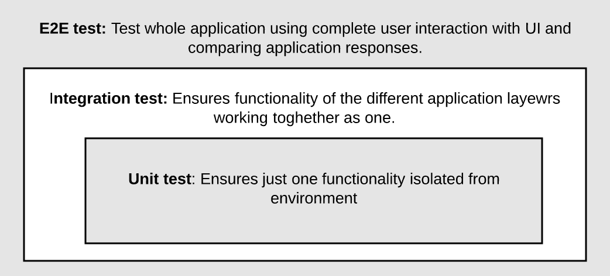
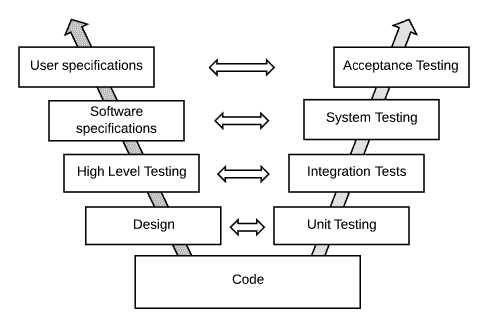
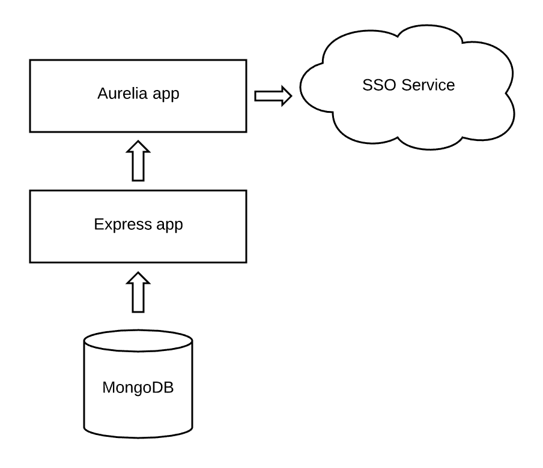
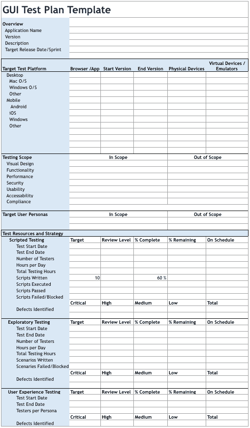
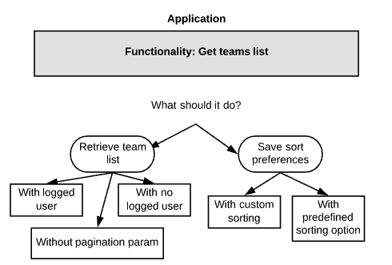
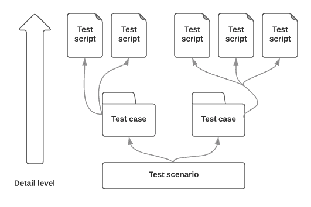
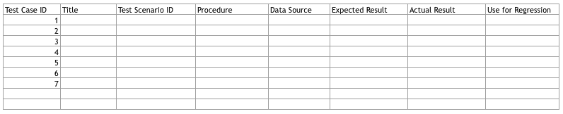

# 第九章：运行端到端测试

恭喜！你只需再迈出一小步，就能成为一名全栈应用开发者！目前，我们将停止讨论 Aurelia；你了解这个框架，并且对 JavaScript 作为编程语言的工作原理有很高的了解。现在，是时候扩展我们对全栈应用开发的了解。我们的 FIFA WC 2018 应用正在本地主机上运行，并且已经实现了一些单元测试。这足以确保它在 QA 或生产环境中工作吗？当然，不够。

单元测试非常重要，但它只能确保单个服务的正确功能。我们如何确保所有我们的应用程序（数据库、后端、前端以及任何其他外部服务）作为一个单一应用程序正确工作？这就是本章我们将学习的内容。

测试是当今所有开发者高度需求的一项技能。为什么？因为编程不再仅仅是编写代码，为了确保它在你的个人电脑上工作，你需要编写确保这种功能的代码，并且能够自动化测试过程以创建持续交付管道。

我们可以将测试阶段分为四个不同的级别，我们将在本章中逐一介绍。看看下面的图片：



我们可以将这些层称为基本测试。一旦我们覆盖了所有三个层，我们就可以提交和推送我们的代码。这样就结束了？不。我们还有更高级的测试层，这些测试应该使用完全独立于我们应用程序的工具来执行：

+   **系统测试**确保我们所有的业务用例都得到解决和满足。它就像黑盒测试，我们不知道每个方法或操作是如何执行的；我们只关心输入和输出。这种测试从前端层开始，模拟常见的用户操作，并期望一些已经通过后端 API 和外部服务处理过的数据。你必须知道系统测试可以在你的持续集成周期中自动化。

+   **验收测试**由真实最终用户执行。他们确保你的系统将支持所有用户交互，评估时间、性能，以及一个非常重要的方面——你的应用程序的用户体验。通常，这种测试首先由产品所有者在称为**用户验收测试**（UAT）的外部环境中执行。

因此，我们可以总结测试阶段如下所示：



我们将通过本章介绍每个测试阶段。我们已经在第四章的最后一节“创建组件和模板”中回顾了单元测试，这对于确保单个组件的功能很有用，但我们如何评估组件与其他外部服务之间的完整交互呢？是时候更进一步，学习集成测试了。但仅仅更进一步对我们来说还不够，所以让我们更深入地评估每个 Web 应用都非常重要但经常被忽视的一个方面：我们可以确保应用功能，但最终用户使用起来简单吗？UI 测试将给我们答案。最后，让我们为每个暴露给客户端消费的端点添加一些酷炫的文档，即使它是 Web 或移动端。我们将向您展示 Swagger 是如何工作的，以及它如何生成关于您的 API 的易于阅读的文档。本章涵盖的主题包括：

+   集成测试

+   UI 测试

+   API 测试 - Swagger

不要跳过这一章；测试是应用开发生命周期中非常重要的一个部分。准备好了吗？开始吧！

# 集成测试 - 多个服务，一个应用

我们已经测试了所有功能。我们知道我们的服务运行正确，但我们的数据库连接和 SSO 呢？你能确认这些服务/依赖项运行正确吗？

集成测试通过验证系统的正确行为在应用开发周期中发挥着重要作用。让我们探索我们当前的应用架构：



集成测试确保我们不同应用层之间的正确交互，在本例中，包括数据库连接、SSO 服务和前端应用。

为什么你应该做集成测试？好吧，如果还不清楚，这里有几个需要考虑的原因：

+   容易与**持续集成**（**CI**）周期中的日常构建集成。你的进度可以在任何时间进行测试。

+   在开发/测试/用户验收测试/生产环境中易于测试。这很简单，就像运行你的应用一样。

+   与端到端测试相比，测试运行得更快。

+   允许你检测系统级问题。服务之间的通信、数据库连接等。

现在，让我们向现有的 Express 应用添加一些集成测试。

# 配置应用以进行集成测试

你唯一需要的前提是 Node 运行环境正确运行。在 JavaScript 中，我们有几个工具可以用来进行集成测试，例如以下这些：

+   **SuperTest**：其最佳特性是强大的文档；易于理解和实现，你只需写几行代码就可以开始测试你的应用。

+   **Mocha**：一个简单的 JavaScript 测试框架。它可以在浏览器或 Node 环境中执行。由于 Mocha 基于 JavaScript，它可以执行异步测试并生成非常有用的报告。

我们将使用这两个工具一起进行测试。

使用 SuperTest，你可以获得以下优势：

+   你可以模拟多个用户交互，存储不同的凭证（令牌）以在用户之间切换。

+   你不需要担心删除或添加模拟数据。SuperTest 将执行清理或添加数据到你的存储的操作。

+   最有用的功能——所有这些测试都可以自动化并集成到你的 CI 流水线中。

SuperTest 对于提高生产力非常有帮助；它还提供了一种自然的方式来编写和测试你的代码；它非常直观且易于阅读。让我们来看看如何快速设置它来处理用户检索数据。

你在哪里可以运行 SuperTest 测试？基本上，你可以在任何你想要的服务器上运行它们。无论你是部署在本地 `dev` 服务器还是云提供商，SuperTests 都可以从它们中的任何一个执行，但你必须知道——SuperTest 包含它自己的 Express 服务器。这个服务器不应该一直运行，但使用一些外部工具如 nodemon，你可以在每次我们有所更改并需要测试时自动重启你的服务器。如果你不想运行所有测试，Mocha 的唯一指定器也是一个不错的解决方案。

首先，我们需要下载我们的依赖项：

```js
npm i supertest mocha chai -s
```

Chai 允许我们选择以下前缀中的任何一个：`should`、`expect` 或 `assert`。就像其他测试工具一样，它们在这里也都可用。

我们已经有了我们的 `server.js` 文件，所以你不需要在那里添加任何代码。是的，你不需要运行任何服务器，这是 SuperTest 最美的优势之一！

记住，我们的测试文件应该与应用程序文件分开。接下来，使用 `touch tests.spec.js` 命令创建你的 `tests` 文件，然后让我们添加一些代码：

```js
const app = require('./server');
const chai = require('chai');
const request = require('supertest');

var expect = chai.expect;

describe('API Tests', () => {
  it('should return football teams', function(done) {
    request(app)
      .get('/teams')
      .end(function(err, res) {
        expect(res.statusCode).to.equal(200);
        done();
      });
  });
});
```

让我们解释一下代码在做什么。

我们正在导入我们的服务器、Chai 和 SuperTest。SuperTest 包含它自己的 `.expect()`，但我们正在使用 Chai 的语法。代码设置了一组 `API 测试` 并创建了一个测试来检查 `/teams` 端点是否返回状态码 200（OK）。请注意，`done()` 函数对于声明我们的异步测试已完成非常重要。当然，这是一个非常高级的测试，我们可以添加更多的断言，例如评估响应的内容等。为了说明目的，这个例子非常简单易懂，可以了解 SuperTest 的工作方式。

现在，让我们看看它是否工作。运行以下命令：

```js
npm test
```

你应该得到这个：

```js
> npm test

> integration-tests@1.0.0 test /Projects/worldcup-app
> mocha '**/*.spec.js'

  API tests
     should return football teams

  1 passing (41ms)
```

确保你已经在 `package.json` 文件的脚本部分正确配置了 `test` 命令。

# 模拟外部依赖项

好的，你可以编写一些集成测试。这够了吗？还不够。让我们再想想。我们真的需要连接到外部服务吗？如果它们宕机了怎么办？当然，我们的测试会失败，但不是因为某些应用程序错误。为了避免这种情况，我们将使用模拟（Mocks）。

模拟是一种技术，用于模拟某些对象/服务/组件，并在被调用时返回预定义的响应。我们不会连接到真实的服务，所以我们将使用 `sinon.mock` 为我们的 Teams 架构创建一个模拟模型，并测试预期的结果：

```js
// Test will pass if we get all teams
        it("should return football teams",(done) => {
            var TeamMock = sinon.mock(Team);
            var expectedResult = {status: true, team: []};
            TeamMock.expects('find').yields(null, expectedResult);
            Team.find(function (err, result) {
                TeamMock.verify(); //Verifies the team and throws an exception if it's not met 
                TeamMock.restore(); //Restore the fake created to his initial state
                expect(result.status).to.be.true;
                done();
            });
        });
```

到目前为止一切正常。现在，让我们评估测试的另一个非常重要的方面，代码覆盖率。

确保在你的项目中下载了 `sinon` 并将其导入到当前的测试文件中，以便示例工作，就像你可能需要的任何外部模型一样。你可以在 [`sinonjs.org`](http://sinonjs.org) 找到更多关于 `sinon` 的信息。

# 计算代码覆盖率

由于我们的集成测试已经编写并运行，我们还有一件事要做。如果能看到我们的测试在测试覆盖率方面与我们的应用的关系，那将是一件很棒的事情。

让我们给应用添加代码覆盖率！

**Istanbul** 是一个非常著名的 JavaScript 代码覆盖率工具，它通过模块加载器钩子计算不同的指标，如语句质量、代码行数、函数使用和分支覆盖率，在运行测试时添加覆盖率，为我们提供有关应用程序的实时信息。它支持所有类型的 JavaScript 覆盖率用例，从单元测试到功能测试和浏览器测试。最好的部分是它具有可扩展性。

幸运的是，我们只需要安装 Istanbul 和 `nyc`（这是 `istanbul` 的命令行客户端）。我们只需这样做：

```js
npm install istanbul --save-dev
npm install nyc --save-dev
```

然后，我们修改我们的 `package.json` 文件。这是为了向我们的 `script` 对象中添加带有覆盖率的测试：

```js
"test-coverage": "nyc mocha ./spec.js"
```

然后，运行以下命令：

```js
npm run test-coverage
```

你应该能够在控制台中看到你应用程序的覆盖率摘要。

# 我们的应用是否符合我们的业务需求？UI 测试

不要混淆，我们不会测试前端应用程序的功能。这已经通过我们的单元测试进行了测试，那么真正的 UI 测试是什么？嗯，这是一个非常长的讨论。我们可以配置多个测试套件，以便在任何时候执行，这将确保我们的端到端测试符合已经编写的业务需求。我们这是什么意思？单元和集成测试不能评估完整应用程序的所有区域，特别是与工作流程和可用性相关的区域。基本上，我们所有的自动化测试只能验证存在的代码。它们不能评估可能缺失的功能或与应用程序视觉元素相关的问题，以及我们的产品使用起来有多容易。这是 GUI 测试的真实价值，它从用户的角度而不是开发者的实际观点进行操作。通过从用户的角度分析应用程序，GUI 测试可以为项目团队提供足够的信息，以决定应用程序是否可以部署，或者我们需要重新组织一些功能以满足用户需求。

所以，这么说来，我是否总是需要一个手动验证功能的人？是的，也不是。这个主题真的很难以解释，因为可以引用不同的观点，在某些情况下，甚至可能相互矛盾。对于这些情况，我们将在下一节中关注一些非常有用的测试技术。

# 脚本测试

就像它的名字一样，基于软件测试人员编写的预脚本进行脚本测试，以检测应用程序是否在那一刻遗漏了某些功能。例如，一个脚本执行登录、保存一些数据，然后从另一个屏幕检索它。脚本定义了测试人员将用于评估每个屏幕的预定义数据以及预期的输出。然后，测试人员分析结果，并向应用程序开发团队报告发现的任何缺陷。脚本测试可以由人工手动执行，也可以通过 CI 工具支持测试自动化。

优点在于，你可以将工作分配给你的最有经验的开发者来编写脚本，以及初级开发者来运行脚本和分析数据，从而进行维护和学习业务需求。

缺点在于，如果你的用户界面频繁更改，维护起来会很困难。这种测试与你的业务代码高度耦合，因此如果业务代码发生变化，整个测试也应该随之改变。

# 探索性测试

在这种测试中，我们不会使用任何自动化脚本。这强制测试人员以普通用户的方式使用应用程序，并评估设计、我们的产品对最终用户来说有多容易、用户体验如何、替代工作流程等方面。测试人员可以识别与这些方面相关的任何失败，并向开发人员提供有价值的反馈。

由于解释性测试不使用脚本，仍然需要进行预先规划。在现实情况下，通常在基于会话的探索性测试中，测试团队为计划中的测试设定目标，并定义一个时间框架来在重点区域进行探索性测试。所有这些信息都包含在一个称为测试宪章的文档中。探索性测试的会话和结果在报告中记录，并在与整个团队的日常会议中审查。

优点在于，测试人员有更多的时间专注于实际的测试，因为准备测试用例和查看无聊的文档所需的时间减少了，这成为了一个不断挑战，即寻找更多问题和增加他们的业务知识。

这种测试的另一个缺点是它不是自动可执行的，当然也不能重复执行作为回归测试。此外，你可能需要具有深入理解你的业务需求的测试人员，而这通常很难找到。此外，在实时场景中，尝试通过探索性测试覆盖整个应用程序可能是不切实际的，因为我们不会找到足够了解产品所需知识的测试人员。

# 用户体验测试

在用户体验测试中，实际最终用户（或用户代表）评估应用程序的易用性、视觉外观以及满足其需求的能力。用户将在一个称为 UAT 的隔离环境中探索所有应用程序，该环境可以配置在本地服务器或某些云服务提供商上。您必须记住，产品部署的位置无关紧要，它应该代表与您的生产环境相同的条件。

不要将用户体验测试（UX）与用户验收测试（UAT）混淆。UAT 是一个测试级别，它验证给定的应用程序是否满足需求，仅关注业务用例。例如，在 UAT 中，您可以确保您的检索团队按钮工作正常并返回格式良好的正确数据。所以，这还不够吗？当然不够，因为您还不知道按钮是否放置得当，或者从最终用户的角度来看是否难以找到。

好的，现在我们了解了这种测试是如何工作的，我们应该应用哪一种？关于测试的所有决策都应该旨在最大化产品对最终用户的价值，即使是通过检测错误或意外功能，并确保功能性和可用性。为了实现这一目标，在实时情况下，我们需要结合所有不同类型的测试技术，这些技术在此期间已审查。

# 规划我们的测试——真理的时刻

规划是任何项目的非常重要的阶段，这也不例外。在开始编写用例之前，拥有一个识别可用于测试的资源并优先考虑要测试的应用程序区域的测试计划非常重要。有了这些信息，测试团队将能够创建测试场景、测试用例和测试脚本，并在测试宪章中记录。

这是我们测试计划应包含的结构示例：

+   每个测试的明确日期

+   需要的测试人员

+   需要的资源，如服务器、环境、工具和云服务提供商，必须正确配置以开始测试

+   目标应用程序环境，例如不同的屏幕分辨率、移动设备和支持的浏览器

+   要测试的用户工作流程/导航

+   将要使用的测试技术，包括脚本测试、探索性测试和用户体验测试

+   测试目标，包括验收标准以确定测试是否通过或失败

此外，我们还可以根据我们的需求添加更多部分：



测试计划可以是文本文档、Excel 表格或测试管理工具，用于开发测试计划以支持分析和报告。有许多工具可供选择，其中一些可以下载到您的私有服务器，而另一些则可在云服务提供商上使用。

我们的 GUI 测试计划不应被视为完整的系统测试计划。您还可以考虑其他方面，如负载测试、安全性、备份、容错和恢复。

完成了，我们有了我们的计划！接下来是什么？确定我们的测试优先级。例如，首先，我们需要确保以下内容：

+   视觉设计

+   安全性

+   用户体验

+   合规性

+   功能性

+   性能

现在，是时候将其表示为整个团队都能理解的心智图，并执行所需的测试。查看以下示例：



当我们在 Web 应用程序中导航时，最常见的测试区域是这些：

+   与大多数常用浏览器不同版本的兼容性

+   用户点击浏览器中的后退或刷新按钮时的行为

+   用户使用书签或浏览器历史记录返回页面后的行为

+   用户同时在 UAT 上打开多个浏览器窗口时的行为

# 定义常见场景

我们可以将测试场景定义为描述应用程序如何在特定实际情况下使用的简要声明，例如，“用户将能够使用有效的用户名和密码登录。”通常，测试场景是从开发文档（如需求或用户故事）中编写的，每个场景都有完成该任务所需的可接受标准。如果这些文档尚未创建，产品负责人应该编写它们，并定义不同的场景和可接受标准，以标记产品已完成。

场景是有用的，因为它们可以指导探索性测试，对 GUI 事件有一个良好的理解，而不限制测试团队遵循特定的程序。由于创建测试场景比编写完整的测试用例要快得多，因此场景在敏捷环境中被广泛使用。

如果在脚本测试中使用场景，它们可以作为编写测试用例的基础。

例如，前面提到的*登录场景*可以包含以下 GUI 事件的测试用例：

+   用户输入有效的用户名和密码

+   用户输入无效的用户名

+   用户输入有效的用户名但无效的密码

+   用户尝试重置密码

+   用户反复点击提交按钮



# 编写测试用例

通常，这份文档会从对要测试的 GUI 事件的简要描述开始，我们仍将使用登录尝试的例子。我们应该指定测试执行的条件和步骤。最后，我们需要评估测试的预期结果，并定义确定测试成功或失败的可接受标准。

你必须记住一些考虑因素，例如以下列出的：

+   用户界面变化的频率

+   当最终用户在应用程序中导航时，他们将有多少自由度

+   如果你有的测试人员经验较少，他们可能需要更详细的程序

应包含哪些内容？这是个好问题。类似于我们的规划模板，我们需要将我们的可接受标准组织在一个文档中，以便我们可以检查和保存每个测试用例的演变。以下是一个非常基本的例子：



确保你为测试用例分离了测试数据非常重要。大多数情况下，问题是由项目中的验证错误产生的，因此开发团队必须知道哪些参数导致了这个错误。始终记住，应用程序开发是一个团队工作，所以你必须为你的同事提供所有便利，以获得最佳产品。

# 组织我们的测试 - 创建脚本

这是我们的测试中最详细的部分。在这里，我们将定义执行我们的测试的步骤和程序。创建足够的测试脚本以验证用户将通过 UAT 采取的路径。

总是记得记录输入数据和预期输出；当我们必须处理意外事件时，这将非常重要。

# 使用 Swagger 进行 API 测试

在最后一节中，我们专注于从前端开始对整个应用程序的端到端测试，但我们的 API 本身呢？记住，一个 API 可以用于服务许多客户端类型，如网页或移动。所以，你不认为确保这个功能独立于整个应用程序生命周期会很好吗？当然，我们知道你同意，我们心中有一个非常棒的解决方案来实现这个目标——Swagger。

Swagger 是一个规范和一组编写 RESTful API 的优秀工具。根据他们自己的网页定义：

"Swagger 是 OpenAPI 规范 (OAS) 的世界最大 API 开发者工具框架，它使整个 API 生命周期（从设计、文档到测试和部署）的开发成为可能。"

在 Swagger 的工具组中，我们可以找到以下工具：

+   Swagger Editor：这个工具将允许我们实时查看更新的文档。

+   Swagger Codegen：一个模板驱动的引擎，用于生成交互式文档。

+   Swagger UI：允许可视化 RESTful API，并检查输入和响应。因此，*Swagger UI* 从现有的 JSON 或 YAML 文档中创建交互式文档。

# 安装 Swagger

让我们开始获取我们最重要的依赖项，Swagger。记住，我们将使用 NPM 下载 Swagger，因为我们将在 ExpressJS API 上使用它。Swagger 根据您需要记录的平台有自己的实现。

有两种非常著名的 Swagger 实现可以与 ExpressJS 应用程序集成：

+   `swagger-node-express`

+   `swagger-ui-express`

`swagger-node-express` 是官方的 *Swagger* 模块，用于 *Node*。这个库的一些有趣（和不那么有趣）的特性如下：

+   Swagger API 的官方发行版。我们得到了一个积极致力于产品开发的组织的全面支持。

+   它是开源的。

+   附带 *Swagger Editor* 和 Swagger Codegen。

+   *Swagger UI* 需要插入到我们添加文档的代码中。

+   由于文档相当匮乏，你需要阅读一些不同库的源代码来学习和理解用于配置 Swagger 的每个参数。

`swagger-ui-express`由社区支持，另一个优秀的开源选项。它是如何工作的？这个库为你的 Express.js 应用程序添加了一个中间件，该中间件提供与你的 Swagger 文档绑定的 Swagger UI。配置起来非常简单；你需要做的只是添加一个路由来托管 Swagger UI，无需手动复制任何内容。文档非常好，我们认为你需要的一切都应该在那里。

由于这个工具的功能性和简单性，我们决定使用这个库而不是其他任何选项来实现我们记录应用程序的主要目标。

要开始，我们需要将这个库添加到我们的当前项目中：

```js
npm install -save swagger-ui-express
```

一旦将库添加到我们的项目中，我们需要配置一个路由来托管 Swagger UI。此外，我们还需要加载我们应用程序的 Swagger API 定义。在我们的应用程序中，Swagger API 定义是一个包含我们应用程序信息的 JSON 对象的单一文件。

要创建 Swagger API 定义，我们使用了 Swagger Editor。记住，你可以自由地使用 JSON 或 YAML 标记。让我们看看同一定义在不同格式下的示例：

在 JSON 中，操作如下：

```js
{
    "swagger": "2.0",
    "info": {
        "version": "1.0.0",
        "title": "WorldCup API",
        "description": "A simple API to learn how to write FIFAWC Specification"
    },
    "schemes": [
        "http"
    ],
    "host": "localhost:3000",
    "basePath": "/",
    "paths": {
        "/teams": {
            "get": {
                "summary": "Gets team list",
                "description": "Returns a list containing all teams of the WorldCup.",
                "responses": {
                    "200": {
                        "description": "A list of Teams",
                        "schema": {
                            "type": "array",
                            "items": {
                                "teams": {
                                    "country": {
                                        "type": "string"
                                    },
                                    "trainer": {
                                        "type": "string"
                                    }
                                }
                            }
                        }
                    }
                }
            }
        }
    }
}
```

在 YAML 中：

```js
swagger: "2.0"

info:
  version: 1.0.0
  title: WorldCup API
  description: A simple API to learn how to write FIFAWC Specification

schemes:
  - https
host: simple.api
basePath: /doc

paths:
  /teams:
    get:
      summary: Gets teams list
      description: Returns a list containing all Teams of the WorldCup.
      responses:
        200:
          description: A list of Teams
          schema:
            type: array
            items:
              properties:
                country:
                  type: string
                trainer:
                  type: string

```

两者都非常易于阅读。

即使我们的规范文件是可以用任何文本编辑器编辑的文本，但现在我们有许多专门的工具来实现这一点，给我们提供了一些有用的功能，如语法验证、格式、自动完成参数等。编写规范文件的最佳选项是 Swagger Editor（是的，它自己的工具），一组强大的静态文件，允许你使用 YAML 语法编写和验证 Swagger 规范，并查看你的文件渲染后的样子。

创建的 Swagger API 定义将作为 JSON 对象存储在我们的应用程序的`swagger.json`文件中。此时，我们的设置脚本应该看起来像这样：

```js
const swaggerUi = require('swagger-ui-express')
const swaggerDocument = require('./swagger.json'); //Our specification file

app.use('/api-docs', swaggerUi.serve, swaggerUi.setup(swaggerDocument));
```

如你所见，第一个中间件是设置我们的 Swagger 服务器。这个中间件将返回托管 Swagger UI 所需的静态文件。第二个中间件是我们的设置函数，它将设置 Swagger UI 以使用我们在`json/yml`文件中预定义的用户参数。

当然，我们的文档 URL 是 `http://localhost:3000/api-docs`。

# 摘要

你现在只需一步就能获得关于全栈应用程序及其相关内容的最大知识。正如我们之前所说，最重要的部分之一，也是区分程序员和全栈应用程序开发者的关键，是测试。这一章旨在易于理解，并在你的日常工作中高度适用，为你提供应用测试中最现代的概念和工具。

你需要记住，集成测试是确保所有组件协同工作良好的保证过程，例如第三方系统、外部数据库和异步进程。根据你使用的平台，你将拥有一个完整的生态系统来完成这项任务，并从你的应用程序中获得最佳价值。最好的部分是你可以在这个层面自动化所有测试，使你的部署过程更安全。有一件事你不能使用脚本进行测试，那就是应用程序的可用性。你需要真实的人类来与你的产品互动，在这个层面，不同的 UI 测试技术会提供帮助。记住，当你需要将产品推向市场时，用户体验是一个重要的差异化因素。

最后，所有不同的测试都需要被记录下来，以便其他开发者可以使用它们来改进你应用程序的更多功能。Swagger 是一个非常棒且简单的工具，可以生成详细的文档并与你的团队共享。

现在我们已经完全覆盖了测试阶段！你知道现在是时候了... 让我们部署吧！下一章见！
