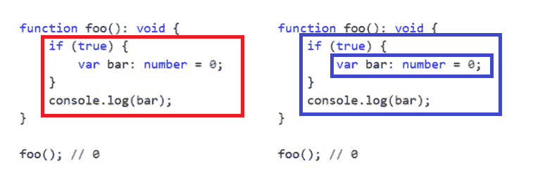

# 掌握函数

在第一章<q>《函数式编程基础</q>中，我们学习了函数式编程的一些最基本的概念。函数是任何 TypeScript 应用程序的基本构建块之一，它们足够强大，以至于需要整章内容来探讨它们的潜力。

在本章中，我们将掌握函数的使用方法。本章首先快速回顾了多个基本概念，然后转向一些不太常见的函数特性和用例：

+   **函数类型**：

    +   函数声明和函数表达式

    +   命名和匿名函数

+   **处理参数**：

    +   带有可选参数的函数

    +   带有默认参数的函数

    +   带有剩余参数的函数

    +   函数重载

    +   专用重载签名

+   函数作用域

+   立即调用的函数

+   标签函数和标签模板

# 函数类型

我们已经知道，可以通过使用可选的类型注解显式地声明应用程序中元素的类型：

```js
function greetNamed(name: string): string {
    return 'Hi! ${name}';
}
```

在前面的函数中，我们指定了参数`name`（`string`）的类型及其返回类型（`string`）。有时，我们需要指定函数的类型，而不是指定其组件（参数或返回值）的类型。让我们看一个例子：

```js
let greetUnnamed: (name: string) => string;

greetUnnamed = function(name: string): string {
 return 'Hi! ${name}';
};
```

在前面的例子中，我们声明了`greetUnnamed`变量及其类型。`greetUnnamed`类型是一个函数类型，它接受一个名为`name`的字符串变量作为其唯一参数，并在调用后返回一个字符串。在声明变量之后，分配给它的函数的类型必须与变量类型相等。

我们也可以在相同的行中声明`greetUnnamed`类型并将其分配给一个函数，而不是像上一个例子那样在两行中分别声明：

```js
let greetUnnamed: (name: string) => string = function(name: string): string {
    return 'Hi! ${name}';
};
```

就像在先前的例子中一样，前面的代码片段也声明了一个变量`greetUnnamed`及其类型。`greetUnnamed`是一个函数类型，它接受一个名为`name`的字符串变量作为其唯一参数，并在调用后返回一个字符串。我们将在声明变量的同一行中分配一个函数给这个变量。分配的函数的类型必须与变量类型匹配。

在前面的例子中，我们声明了`greetUnnamed`变量的类型，并将其值设为一个函数。函数的类型可以从分配的函数中推断出来，因此没有必要添加冗余的类型注解。我们这样做是为了便于你理解这一部分，但重要的是要提到，添加冗余的类型注解可能会使我们的代码更难阅读，并且被认为是一种不良实践。

# 命名和匿名函数

正如 JavaScript 一样，TypeScript 函数可以创建为命名函数或匿名函数，这使我们能够为应用程序选择最合适的方法，无论是我们在 API 中构建函数列表，还是传递给另一个函数的单次函数：

```js
// named function
function greet(name?: string): string {
  if(name){
    return "Hi! " + name;
  } else {
    return "Hi!";
  }
}

// anonymous function
let greet = function(name?: string): string {
  if (name) {
    return "Hi! " + name;
  } else {
    return "Hi!";
  }
}
```

正如前一个代码片段所示，在 TypeScript 中，我们可以给每个参数以及函数本身添加类型，然后添加`return`类型。TypeScript 可以通过查看`return`语句来推断`return`类型，因此我们也可以在许多情况下省略它。

对于使用`return`类型后跟`=>`运算符且不使用`function`关键字的函数，存在一种替代语法：

```js
let greet = (name: string): string => {
    if(name){
      return "Hi! " + name;
    }
    else
    {
      return "Hi";
    }
};
```

现在我们已经了解了这种替代语法，我们可以回到之前的例子，其中我们将匿名函数赋值给`greet`变量。现在我们可以给`greet`变量添加类型注解，以匹配`匿名`函数签名：

```js
let greet: (name: string) => string = function(name: string): 
string {
    if (name) {
      return "Hi! " + name;
    } else {
      return "Hi!";
    }
};
```

请记住，箭头函数（`=>`）语法改变了与类一起使用时`this`运算符的工作方式。我们将在接下来的章节中了解更多关于这一点。

之前的代码片段展示了如何使用类型注解来强制一个变量成为一个具有特定签名的函数。这类注解在我们对`callback`（作为另一个函数参数使用的函数）进行注解时常用：

```js
function add(
    a: number,
    b: number,
    callback: (result: number) => void
) {
    callback(a + b);
}
```

在前一个例子中，我们正在声明一个名为`add`的函数，它接受两个数字和一个作为函数的`callback`。类型注解将强制`callback`返回`void`并仅接受一个数字作为其唯一参数。

# 函数声明和函数表达式

在上一节中，我们介绍了声明带有（命名函数）或没有（未命名或匿名函数）显式指定其名称的函数的可能性，但我们没有提到我们也在使用两种不同类型的函数。

在下面的示例中，命名函数`greetNamed`是一个**函数声明**，而`greetUnnamed`是一个**函数表达式**。目前，请忽略前两行，它们包含两个`console.log`语句：

```js
console.log(greetNamed("John")); // OK
console.log(greetUnnamed("John")); // Error

function greetNamed(name: string): string {
    return 'Hi! ${name}';
}

let greetUnnamed = function(name: string): string {
    return 'Hi! ${name}';
};
```

我们可能会认为前述函数是相同的，但它们的行为不同。JavaScript 解释器可以在解析过程中评估函数声明。另一方面，`function`表达式是赋值语句的一部分，只有在赋值完成后才会被评估。

这些函数行为不同的主要原因是称为变量**提升**的过程。我们将在本章后面的*函数作用域和提升*部分了解更多关于变量提升过程的内容。

幸运的是，TypeScript 编译器可以检测到这个错误并在编译时抛出错误。然而，如果我们将前面的 TypeScript 代码片段编译成 JavaScript，忽略编译错误，并在网页浏览器中尝试执行它，我们会观察到第一个`console.log`调用是有效的。这是因为 JavaScript 了解声明函数，可以在程序执行之前解析它。

然而，第二个警告语句将抛出异常，以表明`greetUnnamed`不是一个函数。异常抛出是因为`greetUnnamed`的赋值必须在函数评估之前完成。

# 处理函数参数

在本节中，我们将学习如何在多种场景下处理函数参数，包括`可选`参数、`默认`参数和`剩余`参数。

# 函数参数中的尾随逗号

尾随逗号是用于函数最后一个参数之后的逗号。在函数的最后一个参数之后使用逗号可能很有用，因为当我们通过添加额外的参数修改现有函数时，很容易忘记添加逗号。

例如，以下函数只接受一个参数，并且没有使用尾随逗号：

```js
function greetWithoutTralingCommas(
    name: string
): string {
    return 'Hi! ${name}';
}
```

在初始实现之后的一段时间，我们可能需要向之前的函数添加一个参数。一个常见的错误是在声明新参数时忘记在第一个参数后添加逗号：

```js
function updatedGreetWithoutTralingCommas(
    name: string
    surname: string, // Error
): string {
    return 'Hi! ${name} ${surname}';
}
```

在函数的第一个版本中使用尾随逗号可能有助于我们防止这种常见的错误：

```js
function greetWithTralingCommas(
    name: string,
): string {
    return 'Hi! ${name}';
}
```

使用尾随逗号可以消除在添加新参数时忘记逗号的可能：

```js
function updatedGreetWithTralingCommas(
    name: string,
    surname: string,
): string {
    return 'Hi! ${name} ${surname}';
}
```

TypeScript 会抛出错误，如果我们忘记添加逗号，因此尾随逗号不像在处理 JavaScript 时那样必要。尾随逗号是可选的，但许多 JavaScript 和 TypeScript 工程师认为使用它们是良好的实践。

# 带有可选参数的函数

与 JavaScript 不同，如果我们尝试调用一个函数而没有提供其签名声明的确切参数数量和类型，TypeScript 编译器将抛出错误。让我们通过一个代码示例来演示这一点：

```js
function add(foo: number, bar: number, foobar: number): number {
    return foo + bar + foobar;
}
```

前面的函数被命名为`add`，将接受三个数字作为参数，分别命名为`foo`、`bar`和`foobar`。如果我们尝试调用此函数而不提供恰好三个数字，我们将得到一个编译错误，表明提供的参数与函数的签名不匹配：

```js
add(); // Error, expected 3 arguments, but got 0.
add(2, 2); // Error, expected 3 arguments, but got 2.
add(2, 2, 2); // OK, returns 6
```

有时候我们可能希望能够在不提供所有参数的情况下调用函数。TypeScript 通过在函数中提供可选参数来帮助我们增加函数的灵活性并克服此类场景。

我们可以通过在参数名称后附加字符 `?` 来告诉 TypeScript 编译器我们希望函数的参数是可选的。让我们更新前面的函数，将必需参数 `foobar` 转换为可选参数：

```js
function add(foo: number, bar: number, foobar?: number): number {
    let result = foo + bar;
    if (foobar !== undefined) {
        result += foobar;
    }
    return result;
}
```

注意我们如何将 `foobar` 参数名称更改为 `foobar?` 并在函数内部检查 `foobar` 类型，以确定参数是否作为参数传递给函数。在实施这些更改后，TypeScript 编译器将允许我们在向函数提供两个或三个参数时无错误地调用它：

```js
add(); // Error, expected 2-3 arguments, but got 0.
add(2, 2); // OK, returns 4
add(2, 2, 2); // OK, returns 6
```

重要的是要注意，可选参数必须始终位于函数参数列表中的必需参数之后。

# 带有默认参数的函数

当一个函数有一些可选参数时，我们必须检查是否向函数传递了参数（就像我们在上一个示例中所做的那样），以防止潜在的错误。

有许多场景，在未提供参数时为参数提供默认值比将其作为可选参数更有用。让我们使用内联 `if` 结构重写前面的 `add` 函数（来自上一节）：

```js
function add(foo: number, bar: number, foobar?: number): number {
    return foo + bar + (foobar !== undefined ? foobar : 0);
}
```

前面的函数没有问题，但我们可以通过为 `foobar` 参数提供一个默认值来提高其可读性，而不是使用可选参数：

```js
function add(foo: number, bar: number, foobar: number = 0): number {
    return foo + bar + foobar;
}
```

要表示一个 `function` 参数是可选的，我们需要在声明函数签名时使用 `=` 运算符提供一个默认值。在编译前面的示例后，TypeScript 编译器将在 JavaScript 输出中生成一个 `if` 语句，以设置 `foobar` 参数的默认值，如果它没有作为参数传递给 `function`：

```js
function add(foo, bar, foobar) {
    if (foobar === void 0) { foobar = 0; }
    return foo + bar + foobar;
}
```

这很好，因为 TypeScript 编译器为我们生成了防止潜在运行时错误的代码。

TypeScript 编译器使用 `void 0` 参数来检查一个变量是否等于 `undefined`。虽然大多数开发者使用 `undefined` 变量来进行这种检查，但大多数编译器使用 `void 0`，因为它始终评估为 `undefined`。与 `undefined` 进行比较的安全性较低，因为其值可能已被修改，如下面的代码片段所示：

```js
function test() {
     var undefined = 2; // 2
     console.log(undefined === 2); // true
 }
```

就像可选参数一样，默认参数必须始终位于函数参数列表中的任何必需参数之后。

# 带有剩余参数的函数

我们已经学习了如何使用可选和默认参数来增加调用函数的方式。让我们再次回到前面的例子：

```js
function add(foo: number, bar: number, foobar: number = 0): number {
    return foo + bar + foobar;
}
```

我们已经学习了如何使用两个或三个参数调用 `add` 函数，但如果我们想允许其他开发者向我们的函数传递四个或五个参数怎么办？我们可能需要添加两个额外的 `default` 或 `optional` 参数。如果我们想允许他们传递所需的所有参数怎么办？解决这种可能场景的方法是使用 `rest` 参数。`rest` 参数语法允许我们将不定数量的参数表示为数组：

```js
function add(...foo: number[]): number {
    let result = 0;
    for (let i = 0; i < foo.length; i++) {
        result += foo[i];
    }
    return result;

}
```

如前述代码片段所示，我们将 `function` 参数 `foo`、`bar` 和 `foobar` 替换为名为 `foo` 的单个参数。请注意，参数 `foo` 的名称前面有一个省略号（一组三个点，而不是实际的省略号字符）。`rest` 参数必须是数组类型，否则我们将得到编译错误。现在我们可以使用所需数量的参数调用 `add` 函数：

```js
add(); // 0
add(2); // 2
add(2, 2); // 4
add(2, 2, 2); // 6
add(2, 2, 2, 2); // 8
add(2, 2, 2, 2, 2); // 10
add(2, 2, 2, 2, 2, 2); // 12
```

虽然在理论最大参数数量上没有具体限制，但当然存在实际限制。这些限制完全取决于实现，并且很可能也取决于我们如何调用函数。

JavaScript 函数有一个内置对象，称为 `arguments` 对象。此对象作为名为 `arguments` 的局部变量可用。`arguments` 变量包含一个对象，类似于数组，其中包含函数被调用时使用的参数。

`arguments` 对象暴露了标准数组提供的一些方法和属性，但并非全部。有关其特性的更多信息，请参阅完整参考文档 [`developer.mozilla.org/en-US/docs/Web/JavaScript/Reference/Functions/arguments`](https://developer.mozilla.org/en-US/docs/Web/JavaScript/Reference/Functions/arguments)。

如果我们检查 JavaScript 输出，我们会注意到 TypeScript 会迭代 `arguments` 对象，将值添加到 `foo` 变量中：

```js
function add() {
    var foo = [];
    for (var _i = 0; _i < arguments.length; _i++) {
        foo[_i - 0] = arguments[_i];
    }
    var result = 0;
    for (var i = 0; i < foo.length; i++) {
        result += foo[i];
    }
    return result;
}
```

我们可以争论这是对函数参数的额外、不必要的迭代。尽管很难想象这种进一步的迭代会成为性能问题，但如果您认为这可能会影响您应用程序的性能，您可能希望考虑避免使用 `rest` 参数，而是将数组作为函数的唯一参数：

```js
function add(foo: number[]): number {
    let result = 0;
    for (let i = 0; i < foo.length; i++) {
        result += foo[i];
    }
    return result;
}
```

前面的函数仅接受一个数字数组作为其唯一参数。调用 API 将与 `rest` 参数略有不同，但我们将有效地避免对函数参数列表的额外迭代：

```js
add(); // Error, expected 1 argument, but got 0.
add(2); // Error, '2' is not assignable to parameter of type 'number[]'.
add(2, 2); // Error, expected 1 argument, but got 2.
add(2, 2, 2); // Error, expected 1 argument, but got 3.
add([]); // returns 0
add([2]); // returns 2
add([2, 2]); // returns 4
add([2, 2, 2]); // returns 6
```

下表总结了本节中我们探索的与参数相关的功能：

| **名称** | **操作符** | **描述** |
| --- | --- | --- |
| 末尾逗号 | `,` | 用于便于在以后的时间向现有函数添加额外的参数。 |
| 可选参数 | `?` | 用于描述可选参数。当参数缺失时，参数的值是 `undefined`。 |
| 默认参数 | `=` | 用于描述可选参数。当参数缺失时，参数的值采用默认值。 |
| 可变参数 | `...` | 用于描述具有未知数量参数的函数。 |

在下一节中，我们将学习关于函数重载的内容。

# 函数重载

函数，或方法，重载是创建具有相同名称但参数数量或类型不同的多个方法的能力。在 TypeScript 中，我们可以通过指定函数的所有函数签名（称为**重载签名**），然后是一个签名（称为**实现签名**）来重载一个函数。让我们看一个例子：

```js
function test(name: string): string; // overloaded signature
function test(age: number): string; // overloaded signature
function test(single: boolean): string; // overloaded signature
function test(value: (string|number|boolean)): string { // implementation signature
    switch (typeof value) {
        case "string":
            return 'My name is ${value}.';
        case "number":
            return 'I'm ${value} years old.';
        case "boolean":
            return value ? "I'm single." : "I'm not single.";
        default:
            throw new Error("Invalid Operation!");
    }
}
```

如前所述的示例所示，我们通过添加一个仅接受 `string` 作为其唯一参数的签名、另一个接受 `number` 的函数和一个最终接受 `Boolean` 作为其唯一参数的签名，三次重载了函数 test。重要的是要注意，所有函数签名都必须兼容；因此，例如，如果一个签名试图返回 `number` 而另一个试图返回 `string`，我们将得到编译错误：

```js
function test(name: string): string;
function test(age: number): number; // Error
function test(single: boolean): string;
function test(value: (string|number|boolean)): string {
    switch (typeof value) {
        case "string":
            return 'My name is ${value}.';
        case "number":
            return 'I'm ${value} years old.';
        case "boolean":
            return value ? "I'm single." : "I'm not single.";
        default:
            throw new Error("Invalid Operation!");
    }
}
```

请注意，这种限制可以通过使用专门的重载签名来克服，正如我们将在下一节中学习的那样。

实现签名必须与所有重载签名兼容，始终位于列表的末尾，并接受任何或联合类型作为其参数的类型。

通过提供与重载签名中声明的类型不匹配的参数来调用函数将导致编译错误：

```js
test("Remo"); // returns "My name is Remo."
test(29); // returns "I'm 29 years old.";
test(false); // returns "I'm not single.";
test({ custom: "custom" }); // Error
```

# 专门的过载签名

我们可以使用专门的签名创建具有相同名称和参数数量但不同返回类型的多个方法。要创建专门的签名，我们必须使用字符串来指示函数参数的类型。字符串字面量用于识别调用了哪个函数重载：

```js
interface Document {
    createElement(tagName: "div"): HTMLDivElement; // specialized
    createElement(tagName: "span"): HTMLSpanElement; // specialized
    createElement(tagName: "canvas"): HTMLCanvasElement; // specialized
    createElement(tagName: string): HTMLElement; // non-specialized
}
```

在前面的示例中，我们为名为 `createElement` 的函数声明了三个**专门的过载签名**和一个**非专门的签名**。

当我们在对象中声明一个专门的签名时，它必须至少可分配给该对象中的一个非专门的签名。这可以从前面的示例中观察到，因为 `createElement` 属性属于一个包含三个专门签名的类型，所有这些签名都可以分配给该类型中的非专门签名。

在编写重载声明时，我们必须将非专门的签名放在最后。

# 函数作用域和提升

低级语言，如 C 语言，具有低级内存管理功能。在具有更高抽象级别的编程语言中，如 TypeScript，变量创建时分配值，不再使用时自动从内存中清除。清理内存的过程称为**垃圾回收**，由 JavaScript 运行时的垃圾回收器执行。

垃圾回收器做得很好，但认为它总能防止我们面对内存泄漏是错误的。垃圾回收器会在变量超出作用域时从内存中清除变量。为了理解变量的生命周期，了解 TypeScript 的作用域工作方式非常重要。

一些编程语言使用程序源代码的结构来确定我们引用的是哪个变量（**词法作用域**），而另一些则使用程序调用栈的运行时状态来确定我们引用的是哪个变量（**动态作用域**）。大多数现代编程语言使用词法作用域（包括 TypeScript）。词法作用域通常比动态作用域更容易为人类和分析工具所理解。

在大多数词法作用域编程语言中，变量作用域限定在块内（由花括号 `{}` 分隔的代码部分），但在 TypeScript（和 JavaScript）中，变量作用域限定在函数内，如下面的代码片段所示：

```js
function foo(): void {
    if (true) {
        var bar: number = 0;
    }
    console.log(bar);
}

foo(); // 0
```

前面的名为`foo`的函数包含一个`if`结构。我们在`if`语句内部声明了一个名为`bar`的数值变量，后来我们尝试使用`log`函数来显示`bar`变量的值。

我们可能会认为前面的代码示例在第五行会抛出错误，因为当调用`log`函数时`bar`变量应该超出作用域。然而，如果我们调用`foo`函数，`log`函数将能够无错误地显示变量`bar`，因为函数内部的所有变量都将处于整个函数体的作用域内，即使它们位于另一个代码块内（除了函数块）。

下图显示了函数级别的词法作用域（左侧），以及块级别的词法作用域（右侧）。如图所示，只有一个函数，但有两个块：



前面的代码片段可能看起来有些令人困惑，但一旦我们知道在运行时，所有变量声明都会在函数执行之前移动到函数的顶部，这种行为就很容易理解了。这种行为被称为**提升**。

TypeScript 被编译成 JavaScript 然后执行——这意味着 TypeScript 应用程序在运行时是一个 JavaScript 应用程序，因此，当我们提到 TypeScript 运行时，我们实际上是在谈论 JavaScript 运行时。我们将在第四章*，运行时——事件循环和 this 操作符*和第五章*，运行时——闭包和原型*中深入探讨运行时。

在执行前面的代码片段之前，运行时会将`bar`变量的声明移动到我们的函数顶部：

```js
function foo() {
    var bar;
    if (true) {
        bar = 0;
    }
    console.log(bar);
}

foo(); // 0
```

这解释了为什么可以在声明变量之前使用它。让我们看一个例子：

```js
function foo(): void {
    bar = 0;
    var bar: number;
    console.log(bar);
}

foo(); // 0
```

在前面的代码片段中，我们声明了一个函数`foo`，并在其主体中，我们将值`0`赋给名为`bar`的变量。此时，该变量尚未声明。在第二行，我们声明了`bar`变量及其类型。在最后一行，我们使用`alert`函数显示`bar`变量的值。

由于在函数内部（除了另一个函数）声明变量（相当于在函数顶部声明它），所以`foo`函数在运行时会转换为以下形式：

```js
function foo(): void {
    var bar: number;
    bar = 0;
    console.log(bar);
}

foo(); // 0
```

具有诸如 Java 或 C#等具有块作用域的编程语言背景的开发者不习惯函数作用域，这是 JavaScript 最被批评的特性之一。ECMAScript 6 规范的开发负责人对此有所了解，因此他们引入了关键字`let`和`const`。

`let`关键字允许我们将变量的作用域设置为块（`if`、`while`、`for`等），而不是函数。我们可以更新本节中的第一个示例来展示`let`关键字是如何工作的：

```js
function foo(): void {
    if (true) {
        let bar: number = 0;
        bar = 1;
    }
    console.log(bar); // Error
}
```

现在，`bar`变量使用`let`关键字声明，因此它只能在`if`块内部访问。变量不会被提升到`foo`函数的顶部，并且不能在`if`语句外部通过`alert`函数访问。

虽然使用`const`定义的变量遵循与使用`let`声明的变量相同的范围规则，但它们不能被重新赋值：

```js
function foo(): void {
    if (true) {
        const bar: number = 0;
        bar = 1; // Error
    }
    alert(bar); // Error
}
```

如果我们尝试编译前面的代码片段，我们会得到一个错误，因为`bar`变量在`if`语句外部不可访问（就像我们使用`let`关键字时一样），当我们尝试给`bar`变量赋新值时，会引发新的错误。第二个错误是由于一旦变量已经被初始化，就无法给常量变量赋新值。

使用`const`关键字声明的变量不能重新赋值，但不是不可变的。当我们说一个变量是不可变的，我们的意思是它不能被修改。我们将在第九章*，函数式响应式编程*中了解更多关于不可变性的内容。

# 立即调用的函数

**立即调用的函数表达式**（**IIFE**）是一种设计模式，它使用函数作用域来创建词法作用域。IIFE 可以用来避免在块内部提升变量，或者防止我们污染全局作用域，例如：

```js
let bar = 0; // global

(function() {
    let foo: number = 0; // In scope of this function
    bar = 1; // Access global scope
    console.log(bar); // 1
    console.log(foo); // 0
})();

console.log(bar); // 1
console.log(foo); // Error
```

在前面的例子中，我们用 IIFE 包裹了一个变量的声明（`foo`）。`foo`变量的作用域限定在 IIFE 函数内，且在全局作用域中不可用，这也解释了为什么在最后一行尝试访问它时会出错。

`bar`变量是全局的。因此，它可以从 IIFE 函数内部和外部访问。

我们也可以将变量传递给 IIFE，以更好地控制其作用域之外的变量创建：

```js
let bar = 0; // global
let topScope = window;

(function(global: any) {
    let foo: number = 0; // In scope of this function
    console.log(global.bar); // 0
    global.bar = 1; // Access global scope
    console.log(global.bar); // 1
    console.log(foo); // 0
})(topScope);

console.log(bar); // 1
console.log(foo); // Error
```

此外，IIFE 可以帮助我们在允许公共访问方法的同时，保留函数内部定义的变量的隐私。让我们看一个例子：

```js
class Counter {
    private _i: number;
    public constructor() {
        this._i = 0;
    }
    public get(): number {
        return this._i;
    }
    public set(val: number): void {
        this._i = val;
    }
    public increment(): void {
        this._i++;
    }
}

let counter = new Counter();
console.log(counter.get()); // 0
counter.set(2);
console.log(counter.get()); // 2
counter.increment();
console.log(counter.get()); // 3
console.log(counter._i); // Error: Property '_i' is private
```

我们定义了一个名为`Counter`的类，它有一个名为`_i`的私有数值属性。该类还有获取和设置`_i`私有属性值的方法。

按照惯例，TypeScript 和 JavaScript 开发者通常使用以下划线字符（`_`）开头的名称来命名私有变量。

我们还创建了一个`Counter`类的实例，并调用了`set`、`get`和`increment`方法来观察一切是否按预期工作。如果我们尝试在一个`Counter`实例中访问`_i`属性，我们会得到一个错误，因为该变量是私有的。

如果我们编译前面的 TypeScript 代码（仅类定义）并检查生成的 JavaScript 代码，我们将看到以下内容：

```js
var Counter = (function() {
    function Counter() {
        this._i = 0;
    }

    Counter.prototype.get = function() {
        return this._i;
    };

    Counter.prototype.set = function(val) {
        this._i = val;
    };

    Counter.prototype.increment = function() {
        this._i++;
    };

    return Counter;
})();
```

此生成的 JavaScript 代码在大多数场景下将完美运行，但如果我们在浏览器中执行它并尝试创建一个`Counter`实例并访问其属性`_i`，我们不会得到任何错误，因为 TypeScript 不会为我们生成运行时的私有属性。偶尔，我们需要以某种方式编写我们的类，使得某些属性在运行时是私有的，例如，如果我们发布一个将被 JavaScript 开发者使用的库。

我们也可以使用 IIFE 同时允许公共访问方法，同时保留函数内部定义的变量的隐私：

```js
var Counter = (function() {
    var _i: number = 0;
    function Counter() {
        //
    }
    Counter.prototype.get = function() {
        return _i;
    };
    Counter.prototype.set = function(val: number) {
        _i = val;
    };
    Counter.prototype.increment = function() {
        _i++;
    };
    return Counter;
})();
```

在前面的例子中，一切几乎与 TypeScript 生成的 JavaScript 相同，只是变量`_i`现在是一个`Counter`闭包中的对象，而不是`Counter`类的属性。

闭包是引用独立（自由）变量的函数。换句话说，闭包中定义的函数会记住其创建时的环境（作用域内的变量）。我们将在第五章*，运行时 – 闭包和原型*中了解更多关于闭包的内容。

如果我们在浏览器中运行生成的 JavaScript 输出并直接调用`_i`属性，我们会注意到该属性在运行时现在是私有的：

```js
let counter = new Counter();
console.log(counter.get()); // 0
counter.set(2);
console.log(counter.get()); // 2
counter.increment();
console.log(counter.get()); // 3
console.log(counter._i); // undefined
```

在某些情况下，我们需要对作用域和闭包有精确的控制，我们的代码最终会看起来更像 JavaScript。如果我们编写应用程序组件（类、模块等）以便由其他 TypeScript 组件使用，我们很少需要担心实现运行时私有属性。我们将在第四章*运行时 – 事件循环和 this 操作符*和第五章*运行时 – 闭包和原型*中深入探讨 TypeScript 的运行时。

# 标签函数和带标签的模板

在 TypeScript 中，我们可以使用如下模板字符串：

```js
let name = "remo";
let surname = "jansen";
let html = '<h1>${name} ${surname}</h1>';
```

我们可以使用模板字符串创建一种特殊类型的函数，称为**标签函数**。

我们可以使用`tag`函数来扩展或修改模板字符串的标准行为。当我们将`tag`函数应用于模板字符串时，模板字符串就变成了一个带标签的模板。

我们将实现一个名为`htmlEscape`的`tag`函数。要使用`tag`函数，我们必须使用该函数的名称，后跟一个模板字符串：

```js
let html = htmlEscape '<h1>${name} ${surname}</h1>';
```

一个`tag`模板必须返回一个字符串并接受以下参数：

+   一个`TemplateStringsArray`，它包含模板字符串中的所有静态字面量（如前例中的`<h1>`和`</h1>`），作为第一个参数传递。

`TemplateStringsArray`类型由`lib.d.ts`文件声明。`lib.d.ts`文件包含原生 JavaScript 和浏览器 API 的类型声明。

+   一个`rest`参数作为第二个参数传递。`rest`参数包含模板字符串中的所有值（前例中的姓名和姓氏）。

`tag`函数的签名如下所示：

```js
tag(literals: TemplateStringsArray, ...placeholders: any[]): string;
```

让我们实现`htmlEscape`标签函数：

```js
function htmlEscape(literals: TemplateStringsArray, ...placeholders: any[]) {
    let result = "";
    for (let i = 0; i < placeholders.length; i++) {
        result += literals[i];
        result += placeholders[i]
            .replace(/&/g, "&amp;")
            .replace(/"/g, "&quot;")
            .replace(/"/g, "'")
            .replace(/</g, "&lt;")
            .replace(/>/g, "&gt;");
    }
    result += literals[literals.length - 1];
    return result;
}
```

我们可以如下调用该函数：

```js
let html = htmlEscape '<h1>${name} ${surname}</h1>';
```

模板字符串包含值和字面量。`htmlEscape`函数遍历它们，并确保在值中转义 HTML 代码，以避免可能的代码注入攻击。

使用标签函数的主要好处是它允许我们创建自定义的模板字符串处理器。

# 摘要

在本章中，我们学习了关于函数的很多知识。我们学习了不同类型的函数，如命名函数和匿名函数，以及函数声明和函数表达式。我们还学习了如何声明不同类型的函数签名，以及如何在多种场景下处理函数参数。

在下一章中，我们将学习异步编程技术。我们将了解为什么函数在 TypeScript 和 JavaScript 异步编程模型中扮演着非常基础的角色。
