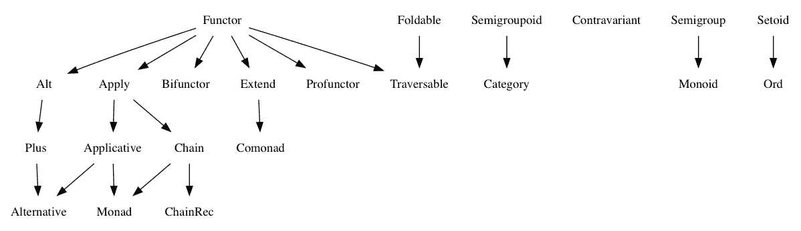

# 第七章：类别论

在上一章中，我们学习了函数、异步编程以及运行时和函数式编程的原则和技术，包括纯函数和函数组合。

在本章中，我们将重点关注类别论和代数数据类型。我们将学习以下概念：

+   类别论

+   代数数据类型

+   函子

+   应用

+   可能

+   要么

+   摩纳哥

# 类别论

函数式编程因其数学背景而以难以学习和理解而闻名。函数式编程语言和设计模式受到源自不同数学领域的概念的影响。然而，我们可以将**类别论**作为最重要的一个影响因素。我们可以将类别论视为集合论的一种替代。它定义了一系列称为**代数数据类型**的数据结构或对象的背后理论。

代数数据类型有很多，理解它们必须实现的全部属性和规则需要大量的时间和努力。以下图表展示了某些最常见代数数据类型之间的关系：



图表中的箭头表示给定的代数数据类型必须实现某些其他代数数据类型的规范。例如，**Monad** 类型必须实现 **Applicative** 和 **Chain** 类型的规范。

开源项目 fantasy-land 声明了一些代数数据类型的规范。开源项目 ramda-fantasy 以与 Ramda 兼容的方式实现了这些规范，Ramda 是一个流行的函数式编程库，我们将在本书的后续部分探讨。

代数数据类型规范可以以多种方式实现。例如，`Functor` 规范可以通过 `Maybe` 或 `Either` 数据类型实现。这两种类型都实现了 `Functor` 规范，但也可以实现其他规范，如 `Monad` 或 `Applicative` 规范。

以下表格描述了在 fantasy-ramda 项目中，哪些规范（列在顶部行）由代数数据类型实现（左侧行）：

| **名称** | **Setoid** | **Semigroup** | **Functor** | **Applicative** | **Monad** | **Foldable** | **ChainRec** |
| --- | --- | --- | --- | --- | --- | --- | --- |
| **要么** |        | ✘ |            |           |           | ✘ |                 |
| **Future** | ✘ | ✘ |            |           |           | ✘ |                 |
| **Identity** |        | ✘ |            |           |           | ✘ |                 |
| **IO** | ✘ | ✘ |            |           |           | ✘ |                 |
| **Maybe** |        |          |            |           |           |              |                 |
| **Reader** | ✘ | ✘ |            |           |           | ✘ | ✘ |
| **Tuple** |        |          |            | ✘ | ✘ | ✘ | ✘ |
| **State** | ✘ | ✘ |            |           |           | ✘ |                 |

理解范畴论领域以及所有这些数据类型和规范超出了本书的范围。然而，在本章中，我们将学习关于两种最常见的代数数据类型的基础知识：`Functors` 和 `Monads`。

请参考 [`github.com/fantasyland/fantasy-land`](https://github.com/fantasyland/fantasy-land) 上的 fantasy-land 项目和 [`github.com/ramda/ramda-fantasy`](https://github.com/ramda/ramda-fantasy) 上的 fantasy-ramda 项目，以了解更多关于代数数据类型的信息。

# Functors

`Functor` 类型有两个主要特征：

+   它包含一个值

+   它实现了一个名为 `map` 的方法

以下代码片段声明了一个名为 `Container` 的类。这个类可以被视为一个 `Functor`：

```js
class Container<T> {

    private _value: T;

    public constructor(val: T) {
        this._value = val;
    }

    public map<TMap>(fn: (val: T) => TMap) {
        return new Container<TMap>(fn(this._value));
    }

}
```

我们可以这样使用容器：

```js
const double = (x: number) => x + x;
const container = new Container(3);
const container2 = container.map(double);
console.log(container2); // { _value: 6 }
```

到目前为止，你可能认为 `Functor` 类型不是很实用，因为我们已经实现了最基本版本。接下来的两个部分实现了两个称为 `Maybe` 和 `Either` 的 `Functor`。这两个 `Functor` 要有用得多，并将证明 `Functors` 是一个强大的工具。然而，在我们能够实现 `Maybe` 和 `Either` 类型之前，我们需要了解 `Applicative` 类型。

# Applicative

`Applicative` 是一个实现了名为 `of` 的方法的 `Functor`。然而，`Applicative` 不仅仅是一个 `Functor` 类型；它也是一个 `Apply` 类型。为了使一个类型成为 `Apply` 的实现，它必须实现一个名为 `ap` 的方法，该方法接受一个作为参数的包装函数的 `Functor`。

以下代码片段实现了一个 `Applicative`，因此它有一个 `of`、一个 `map` 和一个 `ap` 方法：

```js
class Container<T> {

    public static of<TVal>(val: TVal) {
        return new Container(val);
    }

    private _value!: T;

    public constructor(val: T) {
        this._value = val;
    }

    public map<TMap>(fn: (val: T) => TMap) {
        return new Container<TMap>(fn(this._value));
    }

    public ap<TMap>(c: Container<(val: T) => TMap>) {
        return c.map(fn => this.map(fn));
    }

}
```

我们可以使用 `Applicative` 来包装一个数字和一个函数，如下所示：

```js
const double = (x: number) => x + x;
const numberContainer = Container.of(3);
const functionContainer = Container.of(double);
```

我们可以使用 `map` 方法使用映射函数映射 `Functor` 包装的值：

```js
numberContainer.map(double); // Returns Container<number> with value 6
```

或者，我们可以使用 `ap` 函数来执行相同的操作，使用一个包装函数的 `Functor` 而不是函数：

```js
numberContainer.ap(functionContainer); // Container<number> with value 6
```

请注意，整个示例包含在配套源代码中。

# Maybe

以下 `Maybe` 数据类型是一个 `Functor` 和一个 `Applicative`，这意味着它包含一个值并实现了 `map` 方法。与前面实现的 `Functor` 的主要区别在于所包含的值是可选的：

```js
class MayBe<T> {

    public static of<TVal>(val?: TVal) {
        return new MayBe(val);
    }

    private _value!: T;

    public constructor(val?: T) {
        if (val) {
            this._value = val;
        }
    }

    public isNothing() {
        return (this._value === null || this._value === undefined);
    }

    public map<TMap>(fn: (val: T) => TMap) {
        if (this.isNothing()) {
            return new MayBe<TMap>();
        } else {
            return new MayBe<TMap>(fn(this._value));
        }
    }

    public ap<TMap>(c: MayBe<(val: T) => TMap>) {
        return c.map(fn => this.map(fn));
    }

}
```

如前所述的 `map` 方法实现中我们可以看到，映射函数仅在 `Maybe` 数据类型包含值时才被应用。

为了演示如何使用 `Maybe` 类型以及为什么它是有用的，我们将声明一个函数来从 [www.reddit.com](http://www.reddit.com) 获取最新的 TypeScript 新闻，如下所示：

```js
interface New {
    subreddit: string;
    id: string;
    title: string;
    score: number;
    over_18: boolean;
    url: string;
    author: string;
    ups: number;
    num_comments: number;
    created_utc: number;
}

interface Response {
    kind: string;
    data: {
        modhash: string;
        whitelist_status: boolean|null;
        children: Array<{ kind: string, data: New }>;
        after: string|null;
        before: string|null;
    };
}

async function fetchNews() {
    return new Promise<MayBe<Response>>((resolve, reject) => {
        const url = "https://www.reddit.com/r/typescript/new.json";
        fetch(url)
            .then((response) => {
                return response.json();
            }).then((json) => {
                resolve(new MayBe(json));
            }).catch(() => {
                resolve(new MayBe());
            });
    });
}
```

前面的代码片段使用 `fetch` API 发送 HTTP 请求。这是一个异步操作，这也解释了为什么代码片段创建了一个 `Promise` 实例。当操作成功完成时，响应作为包含值的 `Maybe` 实例返回。当操作未成功完成时，返回一个空的 `Maybe` 实例。

以下代码片段演示了如何使用 `fetchNews` 函数：

```js
(async () => {

    const maybeOfResponse = await fetchNews();

    const maybeOfNews = maybeOfResponse
        .map(r => r.data)
        .map(d => d.children)
        .map(children => children.map(c => c.data));

    maybeOfNews.map((news) => {
        news.forEach((n) => console.log(`${n.title} - ${n.url}`));
        return news;
    });

})();
```

前面的代码片段使用 `fetchNews` 函数从 Reddit 获取有关 TypeScript 的帖子列表。如果请求成功完成，`fetchNews` 函数将返回一个包装在 `MayBe` 实例中的 HTTP 响应。然后我们使用 `map` 方法来找到响应中的帖子列表。使用 `MayBe` 实例的好处是，只有当实际有响应时，映射逻辑才会执行，所以我们不需要担心潜在的 `null` 或 `undefined` 错误。

请注意，前面的示例使用了一些浏览器 API，这意味着我们需要在`tsconfig.json`文件中的`lib`字段中添加`dom`。我们还使用了`async`关键字，这需要`lib`中的 es6。这将防止出现类似于“无法找到名称 fetch”的编译错误。

请注意，整个示例都包含在配套的源代码中。

# 或者

`Either`代数数据类型是`Just`和`Nothing`类型的并集：

```js
type Either<T1, T2> = Just<T1> | Nothing<T2>;
```

`Just`类型是一个用于表示非空值的`Functor`：

```js
class Nothing<T> {

    public static of<TVal>(val?: TVal) {
        return new Nothing(val);
    }

    private _value: T|undefined;

    public constructor(val?: T) {
        this._value = val;
    }

    public map<TMap>(fn: (val: T) => TMap) {
        if (this._value !== undefined) {
            return new Nothing<TMap>(fn(this._value));
        } else {
            return new Nothing<TMap>(this._value as any);
        }
    }

}
```

`Nothing`类型表示值的缺失：

```js
class Just<T> {

    public static of<TVal>(val: TVal) {
        return new Just(val);
    }

    private _value: T;

    public constructor(val: T) {
        this._value = val;
    }

    public map<TMap>(fn: (val: T) => TMap) {
        return new Just<TMap>(fn(this._value));
    }

}
```

以下代码片段是我们之前章节中声明的`fetchNews`函数的实现。这次的主要区别是，如果 HTTP 请求成功完成，我们将返回一个`Just`实例，如果 HTTP 请求未成功完成，我们将返回一个`Nothing`实例：

```js
interface New {
    subreddit: string;
    id: string;
    title: string;
    score: number;
    over_18: boolean;
    url: string;
    author: string;
    ups: number;
    num_comments: number;
    created_utc: number;
}

interface Response {
    kind: string;
    data: {
        modhash: string;
        whitelist_status: boolean|null;
        children: Array<{ kind: string, data: New }>;
        after: string|null;
        before: string|null;
    };
}

async function fetchNews() {
    return new Promise<Either<Response, Error>>((resolve, reject) => {

        const url = "https://www.reddit.com/r/typescript/new.json";

        fetch(url)
            .then((response) => {
                return response.json();
            }).then((json) => {
                resolve(new Just(json));
            }).catch((e) => {
                resolve(new Nothing(e));
            });

    });
}
```

如果我们尝试在一个`Either`实例上使用`map`，我们将得到一个编译错误：

```js
(async () => {

    const maybeOfResponse = await fetchNews();

    maybeOfResponse.map(r => r.message);
    // Error:
    // Cannot invoke an expression whose type lacks a call signature.
    // Type
    // (<TMap>(fn: (val: Response) => TMap) => Just<TMap>) |
    // (<TMap>(fn: (val: Error) => TMap) => Nothin<TMap>'
    // has no compatible call signatures.

})();
```

我们可以使用类型守卫来确保在请求失败时访问一个`Nothing`实例，在请求成功完成且无错误时访问一个`Just`实例：

```js
(async () => {

    const maybeOfResponse = await fetchNews();

    if (maybeOfResponse instanceof Nothing) {

        maybeOfResponse
            .map(r => r.message)
            .map(msg => {
                console.log(`Error: ${msg}`);
                return msg;
            });

    } else {

        const maybeOfNews = maybeOfResponse.map(r => r.data)
            .map(d => d.children)
            .map(children => children.map(c => c.data));

        maybeOfNews.map((news) => {
            news.forEach((n) => console.log(`${n.title} - ${n.url}`));
            return news;
        });

    }

})();
```

使用`Either`的好处是编译器强制我们使用类型守卫。这意味着使用`Either`可以在处理潜在失败的 I/O 操作（如 HTTP 请求）时提高类型安全性。

请注意，整个示例都包含在配套的源代码中。

# 模态

我们将通过学习模态来结束我们对代数数据类型的介绍。`Monad`是一个`Functor`，但它还实现了`Applicative`和`Chain`规范。

我们可以通过添加两个额外的方法`join`和`chain`将之前声明的`Maybe`数据类型转换为`Monad`：

```js
class MayBe<T> {

    public static of<TVal>(val?: TVal) {
        return new MayBe(val);
    }

    private _value!: T;

    public constructor(val?: T) {
        if (val) {
            this._value = val;
        }
    }

    public isNothing() {
        return (this._value === null || this._value === undefined);
    }

    public map<TMap>(fn: (val: T) => TMap) {
        if (this.isNothing()) {
            return new MayBe<TMap>();
        } else {
            return new MayBe<TMap>(fn(this._value));
        }
    }

    public ap<TMap>(c: MayBe<(val: T) => TMap>) {
        return c.map(fn => this.map(fn));
    }

    public join() {
        return this.isNothing() ? Nothing.of(this._value) : this._value;
    }

    public chain<TMap>(fn: (val: T) => TMap) {
        return this.map(fn).join();
    }

}
```

`Maybe`数据类型已经是一个`Functor`和`Applicative`，但现在它也是一个`Monad`。以下代码片段展示了我们如何使用它：

```js
let maybeOfNumber = MayBe.of(5);
maybeOfNumber.map((a) => a * 2);
// MayBe { value: 10 }

maybeOfNumber.join();
// 5

maybeOfNumber.chain((a) => a * 2);
// 10

let maybeOfMaybeOfNumber = MayBe.of(MayBe.of(5));
// MayBe { value: MayBe { value: 5 } }

maybeOfMaybeOfNumber.map((a) => a.map(v => v * 2));
// MayBe { value: MayBe { value: 10 } }

maybeOfMaybeOfNumber.join();
// MayBe { value: 5 }

maybeOfMaybeOfNumber.chain((a) => a.map(v => v * 2));
// MayBe { value: 10 }
```

上述代码片段展示了`join`和`chain`方法的工作原理。正如你所见，当我们在一个`Functor`的`Functor`中，并且想要访问包含的值时，它们非常有用。`chain`方法只是`join`和`map`两个操作的简化一步。

请注意，整个示例都包含在配套的源代码中。

# 摘要

在本章中，我们了解了许多代数数据类型，包括`Functor`、`Nothing`、`Just`、`Maybe`、`Either`和`Monad`数据类型。我们学习了这些类型如何帮助我们确保代码正确处理某些错误。

在下一章中，我们将学习其他函数式编程结构，称为 Optics，以及两种新的强大技术：懒评估和不可变性。
