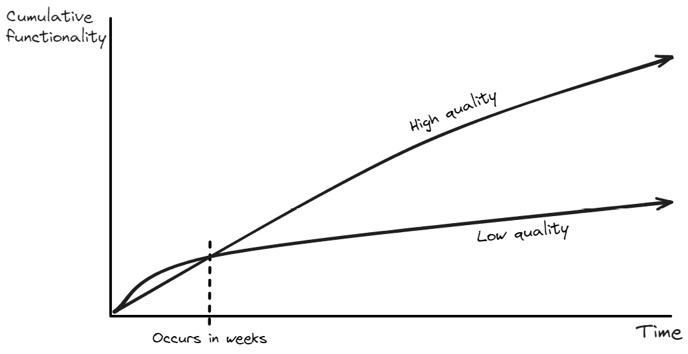
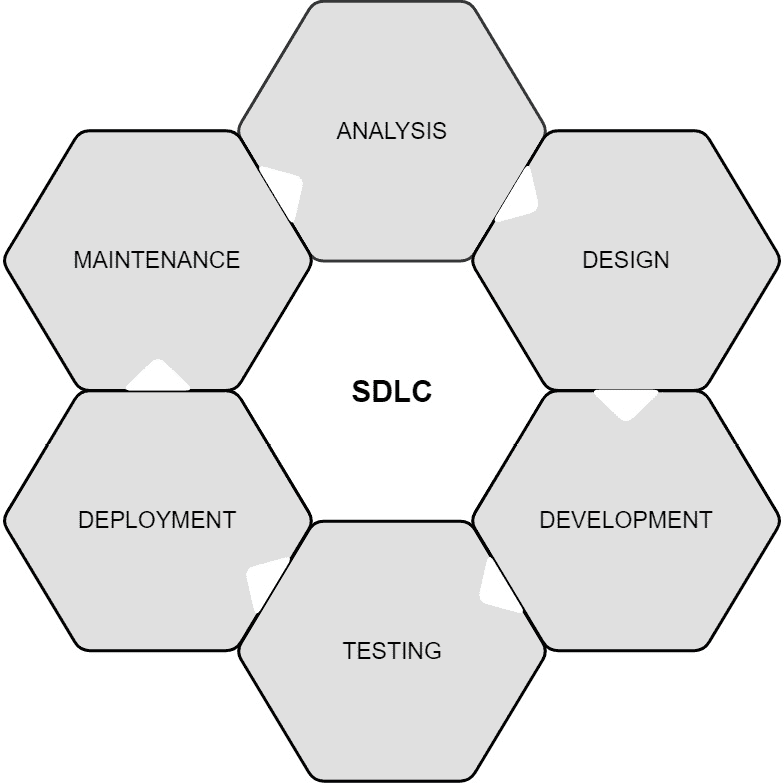
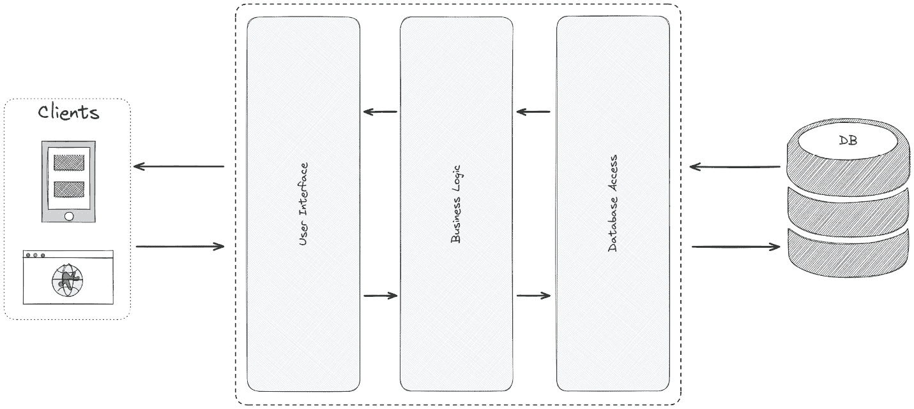
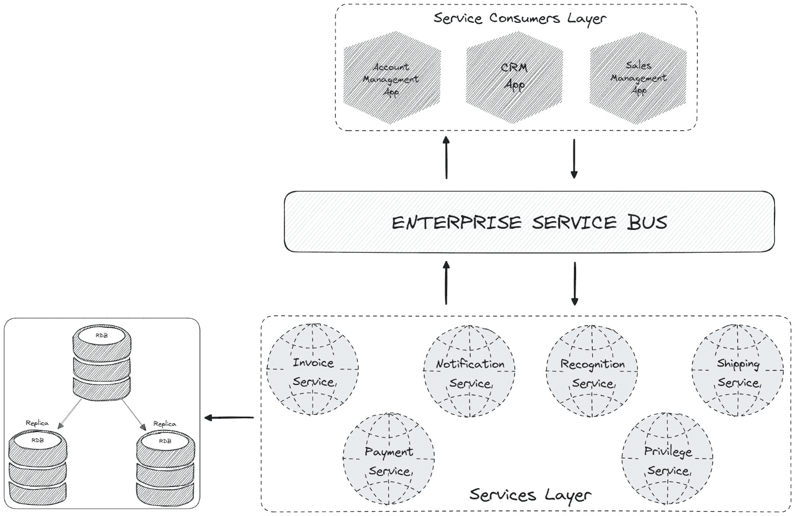
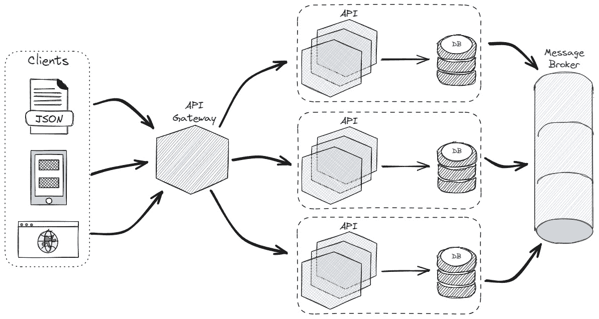

# 1

# 微服务简介

作为人类，我们都会经历各种发展阶段。随着我们达到每个阶段，即使当时看起来是最好的，我们后来会意识到我们还有很长的路要走。每个时期都有其问题，根据其大小和性质，它们需要不同的解决方案。

我们人类倾向于简化事物。这就是为什么我们围绕问题和相应的解决方案来构建我们的生活。寻找问题的解决方案一直是我们的主要目标，这也许是因为我们生存的本能。

如果我们将每块软件视为一个个体，它们也有需要解决的问题。根据问题的规模和形状，软件具有不同的结构，我们称之为**架构**。问题的规模和性质直接影响软件的架构。我们使用的这些架构方法之一就是微服务。

**微服务**在构建可扩展的分布式应用程序、响应现代问题方面非常重要。当作为开发者被大多数大型公司面试时，这也是一个事实上的要求。我们今天使用的绝大多数技术都试图默认支持微服务开发。因此，在现代 IT 世界中，没有微服务知识的软件工程师并不理想。

从本章开始，我们将深入微服务的世界。在进入实践部分之前，我们将构建坚实的理论知识。

首先，我们将回顾并尝试理解在微服务之前有哪些流行的方法。微服务很重要，但理解应用它们的必要性更为重要。

在本章中，我们将涵盖以下主题：

+   介绍微服务

+   探索单体方法

+   什么是面向服务的架构？

+   SOA 与微服务之间的区别

+   微服务的优势

+   微服务的缺点

# 介绍微服务

微服务架构将应用程序分解为松散耦合、独立部署的服务，这些服务拥有自己的数据并通过轻量级协议进行通信。它将大型应用程序分解为更小、自包含的业务能力，从而实现更快的开发、更容易的扩展和更好的容错性。微服务通过允许团队独立构建、测试和部署功能，实现了持续交付和敏捷开发。你可以想象一个应用程序就像一个乐团，其中每个微服务都是一位演奏自己部分的乐手，但与其他人完美和谐，共同创作出美妙的交响乐。

我们刚才提到的是一种*银弹*，但正如你所知，没有什么是免费的，也没有一种适合所有问题的解决方案。微服务也是如此。

我们作为软件开发者，喜欢学习新的趋势并尝试将它们应用到实践中。但当我们深入了解细节后，我们理解每个趋势只是旧知识的封装。在将任何架构应用到软件之前，进行仔细的计划、讨论、协作和分析总是更好的。

## 向微服务迈进

创建软件不仅仅是学习一门编程语言并将其语法元素应用到代码中，以构建事物。这就像拿着锤子和钉子；拥有它们并不意味着你是一个熟练的建造者。同样，拥有所有工具并不意味着你是一个优秀的软件开发者。

当你开始创建一个基本的 `hello world` 类型应用程序时，它仍然只是那样——*基本的*。然而，重要的是要理解，这样的简单应用程序并不值得付费。如果你想让你的应用程序具有价值，它必须解决有形的现实世界挑战——简而言之，它应该具有商业价值。增加更多的商业价值也会带来复杂性。在大多数情况下，更多的商业意味着更多的复杂性。过了一段时间，你会发现，你开始处理的不再是业务，而是你的业务带给应用程序的复杂性。

在导航复杂性时，我们的目标是将其分解成更小、可维护、可扩展和可重用的组件。只有这样做，我们才能有效地处理复杂性和未来的变化。在编程中，唯一真正的常数是需要拥抱变化，这一原则不仅在创建应用程序的过程中保持不变，而且在整个过程中都保持不变。

这种不断的变化迫使我们必须不仅掌握选定的编程语言，还要了解业务领域。自然地，这导致我们采取以设计为导向的思维模式。如果没有对业务的良好了解，几乎不可能开发出有价值的软件。

尽管我们为了学习一门语言而编写的简单应用程序可能看似无用，但当我们连接这些点时，我们就更接近真理。难道我们的一生不都是在寻找真理吗？很快，你就会意识到满足客户业务需求的软件才是重要的软件，它反映了真理。

如果你开始开发过程而没有仔细分析和设计，你将在整个开发过程中付出更高的代价。你越早开始设计和分析，你遇到更大问题的可能性就越小。我们称我们的第一个没有经过适当分析和设计的应用程序为**一团糟**，它使用*意大利面驱动的开发*：

在软件设计中，短语“一团糟”用来引起人们对**反模式**或产生不良结果的**设计方法**的关注。让我们更深入地理解这个短语。

## 理解一团糟

大泥球（big ball of mud）的主要问题在于缺乏结构和组织。代码库中缺乏模块化和明确的问题分离，导致了一个复杂的相互连接的文件和函数网络。想象一下一栋房子，它只是一堆没有墙壁或其他区分特征的杂乱无章的房间和材料。因为里面的一切都是相互连接的，对某一部分的改动可能会对其他部分产生灾难性的影响。这就像在一件糟糕定制的毛衣上拉扯一根松散的线——你冒着整件衣服都散架的风险。同样，代码片段散布在整个代码库中，这在进行维护时会导致低效。

由于缺乏结构和文档，维护代码库和添加新功能对开发者来说具有挑战性。想象一下试图在一个没有布局或标签的房子中导航；这几乎是不可行的。

由于它们紧密耦合，某一区域的改动可能会无意中干扰看似无关的组件。由于其脆弱性，软件容易出错和回退。想象一下用薄弱、相互连接的支撑构建的房子，即使是微小的外部力量也可能造成严重损害。

大泥球可能一开始看起来是小型简单项目中的正确选择，但随着项目的增长和发展，其复杂性会迅速增加。为了保证长期的可维护性、可扩展性和开发者满意度，这种设计方法必须不惜一切代价避免。

猜猜看？我已经知道你已经经历过这个阶段——使用大泥球尝试并失败的阶段。这些困难帮助你学到了更多，而不是从成功中学习。

每个困难都教会我们一些东西，对吧？直到我生命中的某一年，我总是对我的生活感到感激。但随着时间的推移，我意识到正是那些困难塑造了我。在我改变思维方式之后，我开始感谢生活中的困难和那些让我受苦的人。如果你能回到过去，移除生活中的困难，相信我，你也会移除你现在的自己。困难使你变得更强大，让你成为一个坚强的人。

人类是一种很少听取建议的生物。我们必须陷入麻烦——我们必须尝试麻烦。我知道本节中提到的关于大泥球的缺点，只有经历过这种困难的人才能理解。最终，我们都是通过实验来学习的。

作为一名软件新手开发者，在某个时候尝试一下大泥球是有益的。你会很快发现，虽然它提供了一个快速的开始，但它的效率会随着时间的推移而下降。

让我们尝试总结一下大泥球的缺点：

+   **未计划且混乱**：大泥球的出现是设计不佳和编码技术的结果，而不是一个故意的架构决策。

+   **紧密耦合**：代码紧密相连；对某一部分的修改可能会在无关区域产生意外的效果。

+   **理解和维护困难**：代码库混乱且缺乏文档，使得开发者难以理解和修改。

+   **易出错且脆弱**：代码库导致修改时出现不可预测的错误和回归。在泥球式系统中，一切紧密相连，就像一团乱糟糟的电线。这使得当你改变一个部分时，很难知道会发生什么，就像试图在混乱的电线中修复一根松动的电线。这很容易导致意外问题和东西损坏，就像在混乱的电线中造成短路，使得长期开发和维护系统变得更加困难。

+   **降低开发者生产力**：你花费更多的时间在维护代码库上，而不是专注于新功能。

+   **有限的扩展和增长**：僵化的代码结构使得引入新功能或适应变化变得困难：

图 1.1：泥球式软件的质量图

当编写程序时，我们会发现它在短时间内就变成了问题而不是解决方案（见*图 1.1*）。前面的图表跟踪了项目随时间的发展。时间在底部（X 轴）上，添加的功能在旁边（Y 轴）上。

在没有明确计划的情况下开始一个项目，例如使用泥球式方法，一开始可能看起来很简单。想象一下用积木搭建——不需要指令，你可以快速组合东西。但对于这些项目，随着它们的功能越来越多（Y 轴值越高），整体质量就会下降（变得更差）。

在短期内（几周内），设计良好的项目和泥球式项目可能看起来很相似。但时间久了，混乱项目的质量就会下降。

总体来说，虽然泥球式方法一开始可能看起来更快，但从长远来看，它最终会带来更多问题。这就像走捷径，现在可能节省了时间，但后来却导致更大的问题。

随着时间的推移，我们的代码变成泥球式的一个因素是缺乏规划和组织。规划和组织结构是我们构建微服务架构时通常使用的属性。

## 理解软件开发过程

开发过程不仅涵盖编码——它还涉及业务、沟通、讨论、分析、设计和部署。让我们把这些称为软件开发过程的**属性**（见*图 1.2*）。软件开发远不止是编写代码行。虽然编码当然是一个重要的部分，但它只是拼图中的一块。正因为如此，理解业务的核心需求和目标是至关重要的：

图 1.2：软件开发生命周期

以下列表提供了对软件开发过程的全面洞察：

+   解决特定问题和从商业景观的角度思考是推动软件开发的动力。为了创建既相关又有意义的软件解决方案，开发者必须对市场动态、行业和用户需求有深刻的理解。

+   有效的协作和透明的沟通是每个阶段成功的基石。开发者与包括业务分析师、设计师、测试人员和客户在内的各种利益相关者进行互动。清晰的沟通确保每个人都对目标、需求和项目里程碑保持一致。

+   讨论想法、障碍和潜在解决方案非常重要。有效的头脑风暴会议、代码审查和细致的用户反馈都有助于提高软件质量。开放沟通使问题解决更加高效。

+   对需求、用户行为模式和数据分析进行彻底分析是至关重要的。为了创建一个稳固的软件设计策略，开发者必须仔细分析现有解决方案，识别用户需求，并分解复杂问题。

+   软件的架构、功能性和用户界面必须经过仔细考虑。经过精心设计的软件易于使用、有效且易于维护。友好的用户体验是开发者和设计师之间紧密合作的结果。

+   严格的测试程序对于保证软件的功能性、可靠性和符合用户期望至关重要。不同的测试方法针对不同的领域，如性能基准和核心功能。

+   确保最终用户能够访问软件是最后一步。这通常被称为**部署**。这包括设置基础设施、采取严格的预防措施，并在需要时提供全面的用户培训，以优化可用性和采用率。

现在我们已经了解了软件开发过程，让我们更深入地探讨单体软件开发方法。

# 探索单体方法

假设我们有一个单一代码库的电子商务网站，这个网站是几年前开发的。随着时间的推移，功能和功能被随机添加，导致代码混乱，包含重复内容，难以维护，且难以调试。以下是一个建议的过渡方案，以便您使您的应用程序响应或重新活跃起来：

+   **分析应用程序的当前状态**: 您需要识别影响开发效率和用户体验的关键痛点。尝试将问题分解成更小的部分。试图一次性覆盖所有内容将导致您遇到更多困难。关注更大代码库中的特定模块或功能，进行初步重构。您需要了解应用程序中的依赖关系、重复和复杂性。

+   **沟通和协作规划**: 下一步是确定改进领域并就共同架构原则达成一致。强调分阶段的方法，从小型、隔离的模块开始，在继续前进之前展示进度。

+   **选择单体架构**: 决定哪种架构风格和模式（分层、分层、MVC、MVVM 等）最适合您在特定环境中的需求。

+   **从小处着手，逐步迭代**: 设定小目标并应用迭代开发。

+   **进行改进**: 消除代码重复，清理乱麻代码（用于描述无结构且难以理解的编程代码的术语），并改进文档。

+   **应用**: 在每个重构步骤之后，最好应用单元测试、集成测试和回归测试，以确保代码功能并识别应用程序中的潜在回归。

+   **反馈**: 在整个过程中收集开发人员和用户的反馈，以适应和改进方法。

欢迎来到单体世界！但单体是什么概念呢？

图 1.3: 单体架构

许多在线文章深入探讨了单体架构的细节，但很少涉及更广泛的概念，即单体方法。这并不奇怪，因为这种架构具有明确的特征。我们喜欢具体，作为开发者，我们很少是理论爱好者。然而，重要的是要记住，单体方法涵盖了更广泛的选择。

**单体方法**是一个更广泛的概念，指的是将软件作为一个单一、自包含的单元进行构建的一般方式。它可以使用各种架构实现，而不仅仅是我们所知的传统单体架构。它强调简单性、快速开发和紧密集成。单体方法是架构无关的，这意味着可以使用各种架构风格或模式实现，甚至可以在没有任何特定架构框架的情况下实现，只要保持将组件合并为单一单元的核心原则。

另一方面，**单体架构**（见*图 1.3*）是一种特定的软件架构，其中从 UI 到业务逻辑到数据访问，所有内容都被构建为一个单一、紧密耦合的单元。它通常使用单个代码库、编程语言和数据库。

单体架构指的是用于实现单体方法的特定架构设计或模式。它包括单体系统的所有技术选择和结构设计，包括模块的排列、组件之间的交互以及数据管理过程。

单体方法本身并不指定特定的架构。然而，某些架构风格和模式与单体方法更自然地一致，并更有效地支持它，比其他方法更有效。例如，分层架构、MVC 架构和 N 层架构。单体方法也可以在不严格遵循特定架构的情况下实现，特别是对于小型项目。这里的关键特征是保持单一的代码库和部署单元。无论你选择结构化风格还是更有机的方法，核心原则保持不变：构建一个统一的软件单元。理解这种区别迫使你在导航软件架构的广阔世界中做出明智的决定。因此，虽然单体方法促进了软件作为一个统一实体的开发，但单体架构决定了这种统一是如何实现和维持的。了解这种差异使你能够带着知识和信心在软件架构的广阔世界中导航。

虽然单体方法并非没有缺点，但它为某些类型的项目提供了几个优点。以下列出了这些优点：

+   **简洁与速度**：单体架构通过将整个系统整合到一个单一的代码库中，实现了更快的开发和部署周期，减少了管理多个服务带来的开销。

+   **可维护性和控制**：所有内容都在一个地方，使得管理、控制应用性能以及维护和保障系统的方式更加统一。

+   **性能和成本**：这种架构提供了降低复杂性的优势，导致基础设施成本降低，并优化了具有简单要求的应用的性能。

+   **额外优势**：它为简单的项目提供了实际的优势，使得管理和应用操作更加容易，尤其是对于小型团队来说。

即使单体方法有诸如速度和简单性等好处，但并非所有项目都能从中受益。为了确定单体方法是否适合你的项目，请考虑以下一般性指南：

+   **简单且定义明确的应用**：单体架构在具有明确范围和少量功能的应用中表现良好。简单的移动应用、内部工具和基本的电子商务网站是一些例子。

+   **快速产品发布和想法测试**：这是由单体架构的敏捷性实现的，如果你的项目需要快速的开发周期或频繁的原型制作，这将非常有用。

+   **小型团队和有限的经验**：最初，对于缺乏分布式系统或微服务经验的团队来说，管理和维护单体可能更容易。

+   **紧密的数据耦合和一致性**：对于依赖于多个功能之间一致数据的应用程序，单体架构具有优势。它保证了整个应用程序的数据完整性，并简化了数据管理。

+   **有限的可扩展性需求**：在没有扩展微服务的麻烦的情况下，如果您的应用程序预期用户流量稳定且增长预期适中，单体架构可能能够满足您的可扩展性需求。

最佳架构取决于您特定应用程序的需求。在这里，您必须考虑诸如可扩展性、复杂性、技术需求以及开发团队结构等因素。正如我们之前提到的，软件开发中没有一种适合所有情况的解决方案。

虽然单体方法有其优点，但它并不适合每个应用程序。在以下方面，最好不要使用单体：

+   构建高度可扩展的应用程序

+   具有不断演变的功能、模块化和独立部署的应用程序

+   如果您的应用程序需要集成不同的技术或框架，也称为异构技术

+   如果高可用性和弹性至关重要，并且您的系统的一个重要属性是容错性

+   如果不同的团队负责不同的功能——也就是说，如果团队之间有独立开发和部署

+   当您拥有大型团队和分布式开发

除了其优缺点之外，单体通常是一个适合入门的架构，但并非构建更好应用程序的唯一架构。我们还有另一个首选架构，称为**面向服务的架构**（**SOA**），我们计划从下一页开始深入了解。

# 什么是面向服务的架构？

单体架构将所有组件/元素——包括用户界面和数据访问——统一到一个代码库中，促进了简单性和快速开发。尽管并非不可能，但将不同的技术结合到*一个系统*中可能难以维护，有时甚至不可行。在没有当代方法如功能标志和蓝绿部署的情况下，每次您想要更新单体应用程序时，都必须部署整个应用程序。在组织和顺利交付应用程序方面存在困难，这可能会搞乱其发布。

另一方面，SOA（见*图 1**.4*）侧重于模块化和重用，将功能分解为相互通信的独立服务，这些服务通过**应用程序编程** **接口**（**API**s）进行通信。

SOA 可以被定义为多个较小且通常粒度较粗的服务，每个服务都有特定的功能。这种模块化提供了诸如灵活性和可扩展性等优势。SOA 中的服务可以独立部署和扩展，这意味着您可以更新或扩展一个服务而不会影响其他服务。这是 SOA 的一个关键优势。

从单体到 SOA 的类比可以这样描述：您有一个做所有事情的大方法/函数（类似于单体）。过了一段时间，您的功能的一些其他部分被需要，以便这些功能可以被重用。而不是复制它，您将这个巨大的方法分解成可重用的部分（类似于 SOA）。在这种情况下，方法调用将成为我们的 API 调用：

图 1.4：面向服务方法概述

考虑多个应用程序（如图*图 1.4* – 账户管理、CRM 和销售管理）需要共享公共功能。而不是为每个应用程序复制它们，我们提供面向服务的方法。乍一看，它们可能看起来是*完美*粒度的服务，但我们的重点是仅仅*共享*支持扩展和重用的公共行为。

为了封装通信复杂性，我们可能会使用服务总线，这允许我们编写额外的逻辑并将复杂性移动到应用程序的外部，该应用程序充当调解者。这是我们应在应用程序中使用架构调解器的迹象之一。

想象一下，在一个程序中存在两个函数，其中一个直接调用另一个。在 SOA 中，每个函数都成为一个独立的服务，通过定义的接口进行通信。这使它们能够独立部署、更新，甚至由不同的团队进行开发。

想象一下用乐高积木而不是单体块来构建。这就是 SOA 的本质：将应用程序分解为可重用、独立的、专注于特定任务的服务。而不是硬编码的连接，它们通过标准协议（如**REST**或**SOAP**）进行通信，使它们具有平台无关性和适应性。

SOA 提供了许多优势，可以显著提高您组织 IT 基础设施的灵活性、敏捷性和效率。让我们来发现它的关键好处：

+   **业务敏捷性**：SOA 支持快速开发和部署，帮助企业快速适应市场变化，并使软件与不断发展的业务目标保持一致。

+   **技术优势**：SOA 提供了灵活性和可扩展性，允许在不干扰整体功能的情况下，更容易地集成、升级和跨系统重用组件。

+   **运营优势**：SOA 通过减少维护开销和提高系统可靠性来简化操作，同时通过集中式管理增强安全性。

虽然 SOA 有许多优势，但也有缺点：

+   **增强的复杂性**：SOA 通过要求独立服务之间的仔细协调、需要熟练的人员以及详细的发展、测试和维护规划，引入了更多的复杂性。

+   **性能可能存在的问题**：SOA 可能会由于基于网络的交互而引入延迟，在确保服务之间安全高效通信时增加复杂性。

+   **其他困难**：SOA 具有高昂的前期成本，需要熟练的专业人员，这使得维护服务协调、管理责任和确保系统演变过程中的平滑集成具有挑战性。

SOA 是迈向微服务的一步。微服务的许多核心思想都来自 SOA。

在本章的最后部分，我们将了解微服务架构的益处和挑战。

# SOA 和微服务之间的区别

微服务架构简化了构建分布式、灵活和可扩展的软件。它不是使用一个单体系统，而是将应用程序划分为小型、独立的微服务，每个微服务专注于特定的任务。这些服务通过简单的接口进行通信，允许独立部署和易于集成。在正确设计微服务时，我们得到松散耦合、可重用、可扩展且易于维护的应用程序。

当比较微服务和 SOA 时，它们在概念上可能看起来很相似。SOA 和微服务架构都是用于构建分布式系统的架构风格，但它们有一些关键的区别。让我们来比较一下：

+   **范围和粒度**：SOA 中的服务就像包含多个功能的大盒子，这些功能旨在在不同的应用程序之间重用。微服务就像小型、专业的工具，每个工具都专注于应用程序中的一个特定任务或功能。

+   **通信协议**：SOA 中的服务主要使用严格的协议进行通信，例如**SOAP**、**XML-RPC**、**WSDL**和**UDDI**。微服务更倾向于使用轻量级协议，如**RESTful HTTP**或消息队列，以实现更灵活的通信。

+   **技术堆栈**：SOA 可以与不同的技术和平台协同工作。微服务通常使用容器化工具，如**Docker**，以及编排工具，如**Kubernetes**，以实现更简单的部署和管理。

+   **依赖管理**：SOA 中的服务可能具有复杂的依赖关系，需要仔细协调。微服务追求松散耦合，减少服务之间的依赖关系，以简化开发和部署。

+   **部署和扩展**：在 SOA 中，服务通常在服务级别进行集中部署和扩展。微服务是独立部署的，允许单独扩展并更好地利用资源。

+   **组织影响**：一旦实施了 SOA，可能需要重大的组织变化以进行协调和管理。微服务通过给予小型、跨学科团队控制其服务的自主权来促进管理的去中心化。

在微服务方面，*方法*和*架构*之间的区别非常重要。

微服务方法全部关乎我们在设计软件时的思维方式。这就像拥有一种心态或哲学，即把大而复杂的系统分解成更小、更容易处理的部件。每个部分都专注于一项特定任务。这有点抽象，并强调诸如**模块化**（允许简单替换）、**可伸缩性**（允许增加工作量）和**灵活性**（允许适应变化）等概念：

图 1.5：微服务架构

每种方法都有其优点和缺点。没有什么是完美的。从微服务的角度来看，让我们来谈谈微服务的优缺点。

# 微服务的优点

在本节中，我们将探讨许多使微服务成为软件开发重要部分的原因：

+   **可伸缩性**：可以根据需求独立扩展每个微服务，确保资源分配到需要的地方，以实现最佳性能和成本效益。

+   **灵活性和敏捷性**：团队可以同时处理不同的服务，从而加快开发速度并使更新更容易。对业务不断变化的需求和市场的适应能力是敏捷性的关键。

+   **故障隔离**：由于它们的独立性，如果一个微服务失败，它并不一定会影响其他服务。这种隔离通过最小化停机时间来提高系统可靠性。

+   **技术多样性**：由于微服务，可以在单个应用程序中使用多种编程语言和技术。团队被鼓励通过为每个服务选择最佳工具来探索和发挥创造力。

+   **易于维护和更新**：与庞大的单体程序相比，较小的服务更容易理解、管理和更新。由于对某一服务的修改不会无意中影响其他服务，因此风险降低。

+   **可扩展的开发团队**：得益于微服务，小型、跨职能团队现在可以拥有独立的服务。这种配置促进了创造力，加速了决策过程，并提高了责任感。

+   **提高容错性**：微服务使得在服务级别实现冗余和故障转移技术变得更加简单。这增加了系统承受挫折的能力。

+   **改进的部署实践**：**持续集成**和**持续部署**（**CI/CD**）这两种当代部署技术与**微服务**架构完美结合。通过为每个服务的自动化部署管道简化发布流程，可以缩短上市时间。

+   **资源利用改进**：通过细粒度扩展，可以根据每个服务的独特需求进行资源分配，从而最大化资源效率并降低成本。

+   **鼓励合作**：通过微服务鼓励开发和运维团队之间的合作，使得实施 DevOps 原则变得更加容易。在服务层面，可以通过反馈循环、自动化和监控来提高整体质量和效率。

+   **处理庞大且复杂的系统**：微服务可以帮助你简化庞大且复杂的应用程序，因为你可以将它们分解成更小、更易于管理的部分。

+   **处理大量用户**：由于微服务允许你单独扩展每个组件以有效处理负载，因此它们非常适合经历高流量或拥有大量用户的应用程序。

+   **需要频繁更新或添加新功能**：微服务允许你通过更改单个组件而不影响整个应用程序来迅速响应变化的需求。

+   **使用不同的技术**：微服务允许你为应用程序的不同部分使用不同的工具和编程语言，以便为每个任务选择最佳选项。

+   **由多个团队构建**：如果你的应用程序由许多不同的团队共同开发，微服务允许每个团队专注于自己的部分，而不会相互干扰。

+   **需要持续运行**：微服务有助于你的应用程序保持运行状态，即使某个部分失败也是如此。这是因为每个部分都是独立的。因此，一个区域的问题不会导致整个系统崩溃。

+   **适用于云环境**：由于微服务设计得与云技术良好配合，因此它们非常适合在云中运行的应用程序。此外，容器和编排器等工具使得在云中管理它们变得更加容易。

总结来说，微服务提供了一种现代、灵活的软件开发方法，使企业能够快速创新、有效增长，并能更快地将高质量的软件产品推向市场。然而，不要试图将它们用于你创建的每一种应用程序。

尽管微服务提供了许多优点，但你应该意识到它们也带来了一些额外的复杂性，例如需要管理多个移动组件以及服务之间需要更多的通信。

# 微服务的缺点

在本章中，我们了解到软件开发中存在各种架构的主要原因是没有单一真理的迹象，并且根据需求，架构可能有所不同。设计中的每一种方法都有其缺点，在应用任何架构之前，您应该仔细分析和理解它们。

这里是微服务的一些重要缺点：

+   **开发中的复杂性增加**：将系统拆分为更小的服务可能导致开发、部署和测试的复杂性增加。

+   **服务间通信**：管理微服务之间的通信可能会变得复杂，需要仔细设计和实现 API 和协议。

+   **基础设施复杂性**：管理和部署大量微服务可能会引入运营开销，包括需要复杂的编排和监控工具。

+   **基础设施成本**：管理多个服务和相关基础设施的开销可能导致成本增加，尤其是在托管和运营费用方面。

+   **安全问题**：服务数量越多，攻击面就越大，可能增加安全风险。

+   **通信安全**：确保微服务之间的通信安全需要额外的关注，以防止未经授权的访问。

+   **协调和通信**：团队需要有效协调，以确保一个服务的更改不会对其他服务产生不利影响。

+   **数据一致性**：在微服务之间保持一致性可能具有挑战性，尤其是在处理分布式数据库时。确保数据完整性和一致性成为一个复杂任务。

+   **团队专长**：开发者需要在特定微服务的领域和技术堆栈方面都有专长，这可能会限制任务分配的灵活性。

因此，我们应该根据我们团队的专长、我们应用程序的需求以及我们组织对转变的准备情况，仔细考虑微服务是否是我们项目的正确选择。

# 摘要

本章向您介绍了微服务。我们讨论了缺乏适当设计和分析的编码，这导致我们陷入了一个大泥球。没有清晰的架构就像在海洋中间没有地图一样。

我们的第一步是从单体开始。我们讨论了单体方法的优缺点，并试图理解方法和架构之间的差异。

现在，应用程序的需求更加广泛和复杂，总是试图使用单体方法来处理它们可能不是一个好的解决方案。为了向架构中添加“分布式”等重要属性，我们在讨论其优缺点时考虑了 SOA。

我们最终的目标是微服务。我们为其提供了一个明确的定义，并试图了解使用它们的优缺点。

微服务给我们的生活带来了许多有趣的挑战，其中之一就是通信问题。将大问题分解成小块是好的，但要在这些小块之间建立适当的通信并不容易。当你准备好了，翻到下一章，和我一起探索这个问题。
