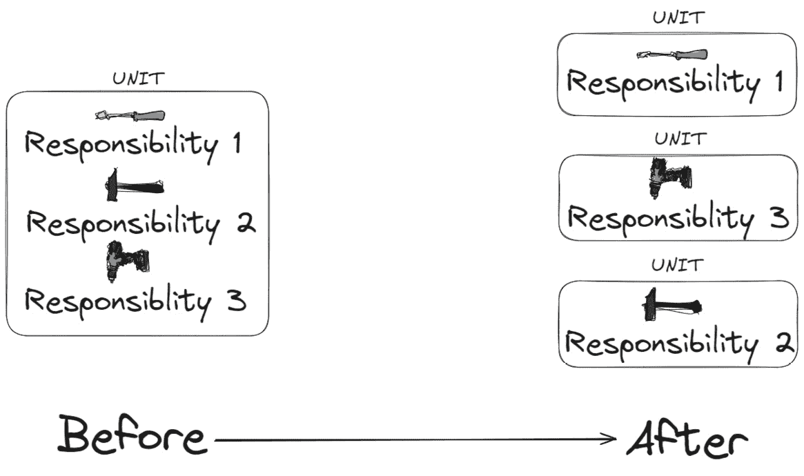
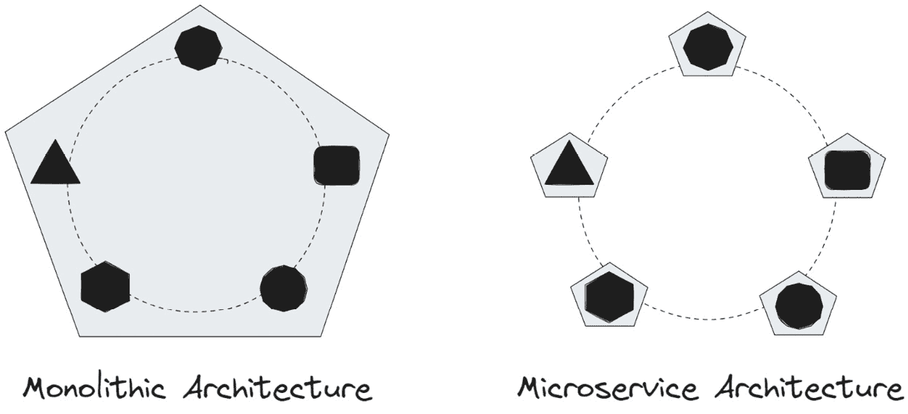
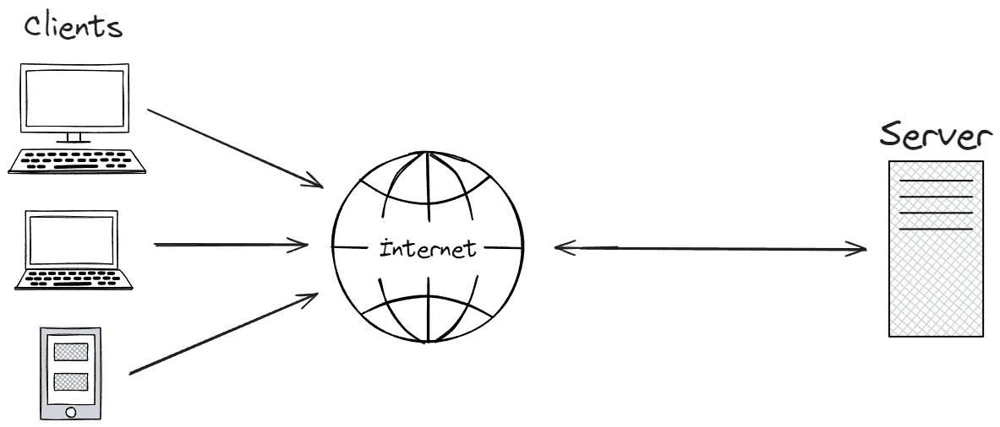
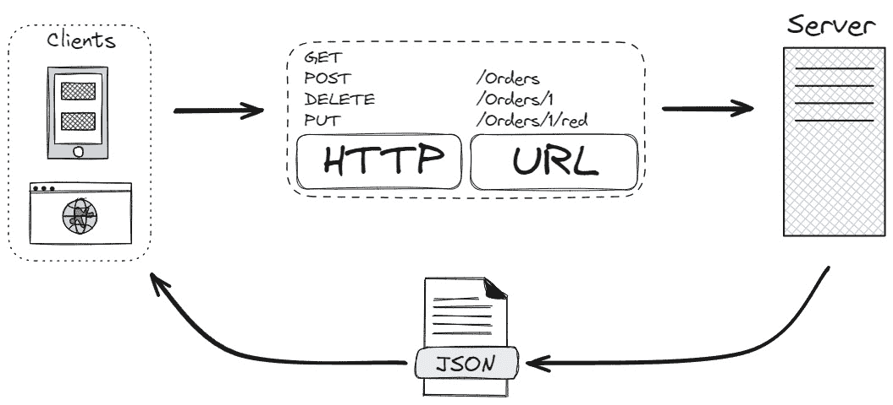
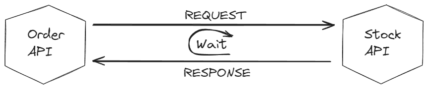
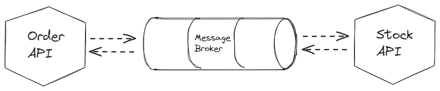
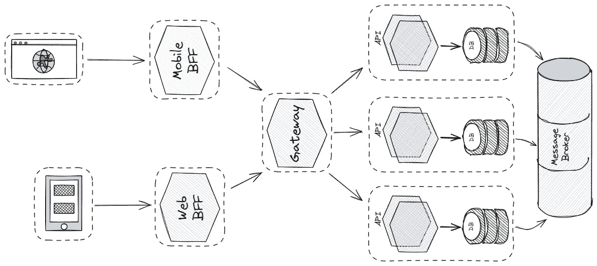
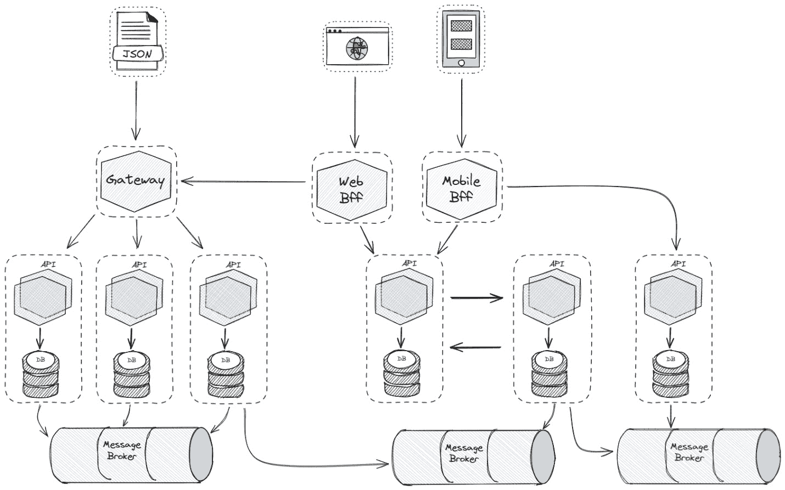

# 第二章：深入了解微服务内部结构

微服务不仅仅是将大型应用程序拆分成更小、更易于管理的部分。它们还引入了挑战，其中之一就是服务之间的通信。我们在上一章讨论的单一架构应用程序，其元素之间的通信相对简单直接。然而，在微服务架构中，服务之间存在物理隔离。尽管我们希望微服务是独立的，以及易于重用、维护和扩展，但使它们能够有效通信成为一个主要挑战。

有效的微服务通信对于架构的整体成功至关重要。它使服务能够交换数据、协调行动并触发事件。如果微服务不能有效通信，它们就像孤岛一样，阻止应用程序正常工作并使其运行缓慢。精心设计的通信模式确保微服务能够有效地协作以提供所需的功能。这种通信策略还促进了松散耦合，这意味着一个服务的更改对其他服务的影响最小，从而使应用程序更具弹性和易于维护。

本章旨在为下一章的实践章节奠定坚实的基础，并提供关于微服务通信的全面信息。对微服务通信的深入了解将帮助您构建可靠、一致、可扩展和容错性强的微服务应用程序。

在本章中，我们将更深入地讨论以下主题：

+   微服务通信技术

+   同步微服务通信

+   异步微服务通信

+   重要的通信模式

## 巩固通信

随着应用程序的增长，管理其复杂性变得越来越具有挑战性。为了应对这一挑战，开发者依赖于最佳实践、设计模式和各种方法。在传统的软件开发中，抽象、封装和分解等技术帮助我们处理复杂性。

微服务架构通过**关注点分离**（**SOC**）原则提供了一种强大的解决方案来应对复杂性。这个原则将复杂系统分解成更小的独立部分，每个部分都有明确的职责。想象一个单一架构应用程序就像一座山；微服务允许我们通过边界上下文将其分解成更小、更易于管理的山丘。然而，这种自由是以某种方式确定如何建立微服务之间通信为代价的。当然，这并不像单一架构方法那样简单，因为那时所有内容都在一个代码库中。创建单体元素之间的连接就像调用任何方法一样简单。

解释单体和微服务之间关系的最佳方式是利用**S.O.L.I.D**原则的前两个原则，即**单一职责原则**（**SRP**）和**开放封闭原则**（**OCP**），作为隐喻。

SRP 的核心原则是将大问题分解为更小、更专注的单元，这与微服务方法相一致。我们将大图分解为更小、更易管理的模块，每个模块都有明确的职责和变更原因。这反映了 SRP 将类和模块拆分为可管理部分的目标。



图 2.1：应用 SRP

SRP 背后的主要思想是 SoC，这在微服务架构中也得到了采用。它提倡根据功能将系统划分为独立的部分。这提高了可维护性，降低了复杂性，并允许独立开发和部署每个部分。

从隐喻的角度来看，SRP 的抽象思想是将大模块分解为更小的模块（见图 2.2），这与我们将单体分解为称为微服务的较小服务时得到的结果相似。



图 2.2：单体架构到微服务架构

将单体应用程序拆分后的最终结果是微服务；在这个比较中，它们是软件实体。使它们易于扩展意味着有一个团队在处理它们。这个团队能够扩展和修改它们，而不依赖于其他团队或模块。服务之间的松散耦合使我们能够独立工作。

然而，这里有一个问题：*通信*。与一个单体类相比，多个较小的实体需要依赖通信才能作为一个整体运行。虽然 SRP 创建了独立的子系统，但它没有解决它们之间通信的挑战。事实上，SRP 本身也可能导致这种复杂性。SRP 可能会让你拥有多个较小的子系统，但并没有解决它们之间的通信问题。

这就是 OCP 发挥作用的地方。OCP 指出，软件应该易于扩展但不易于修改。从隐喻的角度来看，在微服务的背景下，这意味着设计灵活且适应未来变化的通信机制，而无需修改现有服务。

当一个微服务（我们将它称为*微服务 A*）从另一个微服务（我们将它称为*微服务 B*）请求某些资源时，它不需要了解微服务 B 的内部结构。作为交换，微服务 B 可能使用与微服务 A 相同的端点但不同实现形式，而无需通知微服务 A。

# 微服务通信技术

与微服务最大的通信挑战是建立它们之间可靠和可扩展的连接。我们使用不同的技术来处理微服务通信。值得一提的是，有多种技术可以实现微服务之间的适当通信。然而，在本章中，我们只会关注最流行和我们认为最重要的技术。让我们一起来探索这些技术。

## API 简介

在软件开发中，**应用程序编程接口**（**APIs**）是帮助我们避免重复做同样任务的重要工具。API 保护我们免受工作环境和专业领域的复杂性，使我们更容易管理复杂的过程并忽略详细的领域知识。它们封装了复杂性，使得理解底层实现细节变得不必要。API 本身是黑盒，只提供所需的信息。这意味着我们不必担心琐碎的技术细节，可以专注于使用提供的接口与环境交互。例如，当我们使用框架时，我们看到所有的 DLL（包）都是 API，它们为我们提供了所需的函数。

基于网络的 API 只是 API 的一种类型。它用于帮助不同的程序通过标准网络规则和方法在互联网上共享信息。通常，这些 API 被视为 REST API 或**简单对象访问协议**（**SOAP**）服务，并依赖于客户端-服务器架构。这允许在网站或服务等各种在线资源之间建立连接，有助于构建像微服务或仅仅是在共享数据方面的大型系统。



图 2.3：客户端-服务器架构

我们在这里讨论了 REST，但它究竟意味着什么？让我们在下一节中讨论这个问题。

## REST 究竟是什么？

**表示状态转换**（**REST**）是一种用于构建通过 HTTP 协议松散连接的应用程序的架构风格。需要注意的是，REST 主要是一种设计方法，而不是严格的架构模式。当我考虑架构风格和模式之间的区别时，我总是感知到抽象和实现。

建筑风格定义了一套组织和构建系统结构的原理和指南。它提供了一个高级抽象，说明了不同组件应该如何相互交互和通信。建筑风格是设计软件系统的广泛、概念性的方法。

另一方面，建筑模式是对重复出现的建筑问题的一种特定解决方案。它是一个可重用的设计蓝图或模板，描述了在给定的建筑风格中如何解决特定设计问题。它为实施风格的特定方面提供了一个具体的蓝图。

许多人称 REST 为协议。然而，REST 本身不是一个标准化的协议，尽管它今天通常使用网络标准来实现。虽然它通常与 HTTP 相关，但它并不仅限于这个协议；REST 也可以与其他协议一起工作。

简而言之，将 REST 视为系统通信的蓝图。它概述了客户端（如网页浏览器）如何从服务器请求信息，以及服务器如何响应，可能改变客户端的状态。

REST 的核心思想是资源、表示、状态和传输。当客户端从服务器请求资源时，服务器会发送该资源的表示，这本质上是一个副本。如果资源的状态后来发生变化，客户端可以再次请求它以获取最新版本。将此资源从服务器发送到客户端的过程是 REST 的传输部分。



图 2.4：REST 概述

那么，为什么 REST 很重要？

+   它将客户端和服务器分开，打破了它们对彼此的直接依赖。

+   它是**平台无关的**，这意味着它不受任何特定系统的限制。

+   它是**语言无关的**。无论你是在用 PHP、C#、Node.js 还是任何其他语言编码，你都可以实现 REST 服务。

+   它对数据格式灵活，支持 XML 和 JSON 等多种格式。

+   它促进了分布式系统的构建，使组件可以分布在不同的位置。

+   它提供了可发现性，使得识别和访问资源变得容易。

+   它使用简单，简化了服务集成的过程。

+   它利用 **HTTP 缓存**，通过在本地存储频繁访问的数据来提高性能。

基于这种理解，让我们来看看 REST 的一些约束。

### 有哪些 REST 限制？

一个服务遵循 REST 原则的关键指标在于它遵循的约束。REST 遵循六个约束，其中五个是强制性的。

+   `students` 是资源。

+   **通过表示操作资源**：如果客户端可以修改资源，则应在返回的表示中包含有关如何操作的数据。

+   **自我描述的消息**: 每个请求都应该包含所有必要的信息，这些信息通常通过 HTTP 头部传递。

+   **超媒体作为应用状态引擎**（**HATEOAS**）：请求应提供文档，使客户端能够轻松发现其他资源。

+   **客户端-服务器约束**：这种约束将客户端和服务器分开。在这里，客户端和服务器促进数据交换。它们独立发展，并且对彼此的架构一无所知。

基于 REST 的最流行实现称为**RESTful 服务**。RESTful 服务高度依赖于 REST 原则。但这并不意味着使用 RESTful 服务创建工具就一定能确保您最终得到基于 REST 的服务。您应该学习和应用这些原则，使您的 API 更加**RESTful**。

将 RESTful API 视为微服务的一种通用语言。一个服务可以向另一个服务发送 HTTP 请求（例如`获取用户数据`），并获取所需的信息。这使事情变得简单，避免了服务需要理解彼此内部工作的情况。

RESTful API 在微服务之间充当信使，确保它们即使作为独立的组件也能顺利协同工作。

### RESTful API 是如何工作的？

想象一下在线存储的信息，如图片、文本或数据。这些信息就像是一种资源。当应用程序需要这种资源时，它会发送一个消息，称为请求，向服务器请求它。将请求视为一种礼貌地请求某物的途径。

为了确保服务器理解请求，应用程序遵循一系列指令，就像食谱一样。这些指令被称为文档，由服务器创建者提供。

根据信息的敏感程度，服务器可能会检查应用程序的身份，类似于进入安全场所前检查您的身份证件。这被称为身份验证。一旦服务器收到并理解了请求，它就会处理它并找到所需的信息。然后服务器将响应发送回应用程序。

## 基于 HTTP 的 REST 实现

开发者通常使用一种称为 HTTP 的特殊网络通信语言来构建 RESTful API，这种语言类似于与网站交谈的语言。在这种语言中，有一些特殊的词汇称为**HTTP 方法**，它们告诉服务器如何处理信息（资源）。让我们在接下来的几个小节中一起发现最常用的 HTTP 方法。

### GET

当我们作为开发者想要请求给定资源的表示而不更改它时，我们使用 GET 方法。

HTTP GET 方法是服务器检索特定资源而不对其进行修改的请求。这就像说“请给我这个信息。”

这里是如何工作的分解：

1.  你（客户端，比如你的网络浏览器）使用 GET 方法向服务器发送请求。这个请求就像一条消息，请求你想要的资源。

1.  网站接收请求，并由于 GET 方法而理解了你的请求。

1.  网站找到你请求的信息，并以响应的形式将其发送给你。这个响应可能包括文本、图像或其他数据。

想象一下，请求朋友在他们的手机上给你看一张照片。你不会只是抢过来；你会礼貌地请求看它。同样，GET 方法允许你礼貌地从网站获取信息。

重要的是要注意，GET 方法用于检索信息，不应用于更改或修改网站上的任何内容。想象一下，从图书馆借书，而不是在书上写东西。

### POST

POST 方法用于在服务器上创建资源。

将 POST 方法想象成一种安全地向网站（服务器）发送信息的方法。这就像填写一个表单并点击 *提交* 来发送你的数据。

这里是如何工作的：

1.  你（客户端）填写一个表单，包含你想要发送的信息（如你的名字和电子邮件）。

1.  你的工具（通常是浏览器）使用 POST 方法向网站（服务器）发送请求。这个请求包括你在表单中输入的信息。

1.  网站接收请求，并由于 POST 方法而理解了信息。

1.  服务器处理你发送的信息，这可能涉及创建账户、存储评论或发送电子邮件等操作。

1.  网站可能会然后发送一个响应给你，比如确认消息或一个新页面来查看。

想象一下，向朋友发送包裹。你不会只是把它放在他们的门口；你会打包并通过可靠的快递服务发送。同样，POST 方法允许你安全地向网站发送信息。

记住，POST 方法主要用于发送和加工信息，而不仅仅是查看信息。与用于检索信息的 GET 不同，POST 通常会在服务器上触发操作。

### PUT

我们使用 HTTP PUT 方法来更新服务器上的现有信息。

将 PUT 想象成一种小心地更新网站（服务器）上现有信息的方法。这就像仔细修订文档或更新你的个人资料详情。

这里是如何工作的分解：

1.  你（客户端，比如你的网络浏览器）准备更新的信息，例如更改你的个人资料图片或文档中的编辑文本。

1.  您的浏览器使用 PUT 方法向网站（服务器）发送请求。此请求包含您准备好的更新信息。

1.  网站（服务器）通过 PUT 方法接收请求并理解需要更新的内容。

1.  服务器仔细地将您发送的更新版本替换现有的信息。这类似于仔细替换书中的修订版页面。

1.  网站可能会随后向您发送响应，例如确认消息或更新的信息本身。

记住使用 PUT 需要谨慎和准确，因为它直接修改现有信息。想象一下，就像仔细编辑文档一样；犯错误可能会导致更改或丢失重要信息。

PUT 方法通常用于您确切知道需要更新的信息，并且希望完全替换它。它不用于检索信息（如 GET）或创建新信息（如 POST）。

### DELETE

HTTP DELETE 方法就像数字橡皮擦，仔细地从服务器中删除特定的信息。您可以将其想象为从您的购物清单中删除单个项目，而其余部分保持不变。

下面是如何工作的：

1.  您（客户端），就像您的网络浏览器一样，决定删除某些特定内容，例如旧照片或过时的文章。

1.  您的浏览器向服务器发送 DELETE 请求，精确指出您想要删除的特定项目。这就像在您的购物清单上指明项目一样。

1.  服务器通过 DELETE 方法接收请求并理解其意图。

1.  服务器仔细地从其存储中移除指定的项目，类似于在您的清单上划掉项目。

服务器可能会回复一个确认消息，让您知道删除操作已成功完成，或者简单地保持沉默。

您应该记住使用 DELETE 就像使用橡皮擦一样：它是永久的。一旦某物被删除，通常就会永久消失。因此，在发送 DELETE 请求之前，请确保您确实想要删除该项目。

DELETE 与其他方法不同。与用于获取信息的 GET（或用于创建新信息的 POST）不同，DELETE 专门用于删除某些内容。

在 DELETE 请求中保持精确很重要，因为它们针对特定项目，并且无法轻易撤销。

### PATCH

PATCH 方法类似于服务器上信息的修补工具。它与 PUT 方法类似，但 PATCH 允许您更新信息的一部分，例如编辑文档的特定部分而不改变整个文档。

想象一下，您有一个包含面包、牛奶和鸡蛋等项目的购物清单。您意识到您需要更多的牛奶，但其他一切都很正常。您不必重写整个清单，可以使用 PATCH 仅更新牛奶的数量。这样，清单的其余部分保持不变。

下面是分解：

1.  您（用户）决定更改某个特定部分，例如在线更新商品的价格。

1.  您向服务器发送一个 PATCH 请求，指出您想要修改的确切部分，例如在我们的例子中是价格。

1.  服务器因为 PATCH 方法理解了请求。

1.  服务器仔细地只更新了选定的部分，其余部分保持不变，类似于只编辑文档的一个部分。

1.  服务器可能会发送确认信息，或者简单地显示更新后的信息。

注意，PATCH 是一种用于进行针对性更新的方法，仅修改资源的具体部分。当您只想更改某个特定部分时，保持其余部分不变，这使其比完全重写（如使用 PUT 方法）更灵活和高效。

现在我们已经了解了 HTTP 动词，让我们继续讨论 HTTP 状态码。

## HTTP 响应状态码

HTTP 使用客户端-服务器架构。发送请求总是以响应结束。根据请求，您可能会得到不同的响应状态码，这些状态码表示操作的结果。

HTTP 状态码是服务器对您的请求成功或失败的反应。这些代码被组织成五个主要组：

+   信息响应（`100` – `199`）

+   成功响应（`200` – `299`）

+   重定向消息（`300` – `399`）

+   客户端错误响应（`400` – `499`）

+   服务器错误响应（`500` – `599`）

让我们来看看最常用的 HTTP 响应状态码：

+   `2`):

    +   **200 OK**：这是您可以得到的最好的消息！这意味着服务器理解了您的请求并完成了您的要求。

    +   **201 已创建**：这个代码表示您的请求导致创建了新的东西，比如新的文档或账户。

+   `3`):

    +   **301 永久移动**：这告诉您请求的项目已经永久移动到新的位置。服务器通常会提供新的地址。

    +   **302 找到**：这个代码表示请求的项目暂时位于新的位置。服务器还提供了新的地址。

+   `4`):

    +   **404 未找到**：这是一个常见的代码，表示服务器找不到您请求的项目，就像图书馆里丢失的一本书一样。

    +   **401 未授权**：这个代码表示您无权访问请求的项目，就像试图进入一个锁着的房间一样。

    +   **403 禁止访问**：这个代码表示您有权限，但没有权限访问特定的项目，就像有钥匙但被禁止进入特定的房间一样。

    +   **413 请求实体过大**：这个代码表示您在请求中发送的数据对于服务器来说太大，就像试图把太多的书塞进一个小盒子一样。

    +   **429 请求过多**：这个代码表示您在短时间内发出了过多的请求，就像试图一次性借阅太多的书一样。

+   `5`):

    +   **500 内部服务器错误**：这个代码意味着计算机遇到了内部问题，无法满足你的请求，就像图书馆遇到技术问题一样。

    +   **503 服务不可用**：这个代码表示计算机因维护或过载而暂时不可用，就像图书馆因翻修而关闭一样。

记住，这只是几个例子，但理解它们可以帮助你解码网站上的信息，并更顺畅地在网上导航。

## GraphQL 简介

我们现在设计和处理 API 的两种主要方式是使用 REST 和**GraphQL**。

通常，当开发者开始他们的 API 开发之旅时，他们首先从创建一个 REST API 开始。然而，随着他们深入了解具体细节，他们意识到 REST 方法并不总是适用于所有情况。这时，GraphQL 就介入以帮助 REST 不适合的情况。

尽管 Facebook 早在 2012 年就开始在真实项目中使用 GraphQL（当时称为 SuperGraph），但它直到 2016 年才向公众分享。

现在，GraphQL 已经成为设计和交互 API 的首选方法，在受欢迎程度上超过了 REST。

采用 GraphQL 的主要原因是为了解决当应用的移动和桌面版本都使用相同的 API（特别是 REST API）时出现的问题。比如说你正在用手机上的网站。桌面版本可以处理更多的数据，因此从服务器接收的数据集更全面。与桌面版本不同，移动应用由于网络连接缓慢和计算能力有限，对数据的使用有限制，这使得处理大量数据集变得不可能。

这里有一个 REST 响应的例子，它包含过多的数据，而我们需要的信息只是其中的一部分：

```js
{
  "user": {
    "id": 5,
    "name": "username",
    "surname": "surname",
    "rank": 56,
    "email": "example@gmail.com",
    "profilephoto": "....................."
  }
}
```

因此，当首次加载用户数据时，我们只需要在移动版本中这部分数据。正因为如此，基于资源的（使用 REST）数据分发似乎是一个理想的设计选择。由于大多数桌面用户互联网可用性没有问题，所以从不同资源接收数据并将它们显示为单一信息没有问题。

为了确保我们只获取所需的信息，我们根据其**ID**过滤数据。这样做，我们进行了一种同步操作。

然而，我们并不是在建议一个理想的移动数据检索解决方案。相反，我们提出要么为移动设备开发一个专门的 API，要么通过采用替代的 RESTGraphQL 方法来实现一个更灵活和动态的资源获取机制。GraphQL 提供了一种更高效的 API 交互和设计方法，尤其是在考虑移动和其他资源受限设备时。最初旨在用于移动应用，GraphQL 已经发展成为一种支持跨各种平台动态和有效数据交换的技术。与传统 REST API 设计不同，GraphQL 允许在单个查询中从多个资源同步检索信息，从而消除了按资源逐个获取数据的需求。

除了在移动开发中的应用外，GraphQL 现在在微服务设计中得到了广泛的应用，进一步展示了其多功能性和在现代软件开发实践中的广泛应用。

在实际应用 REST 和 GraphQL 时，理解它们之间的区别非常重要。让我们定义这两种强大通信技术之间的主要区别：

+   与桌面应用相比，移动应用需要更精简和高效的数据。常用于桌面的 REST API 对于移动应用来说可能会显得庞大。GraphQL 通过让您仅请求应用所需的具体数据来解决这一问题，避免了不必要的下载，同时减少了过度获取和不足获取。

+   REST 通过关注单个信息片段，如*用户*或帖子来工作。要获取相关细节，例如特定用户的帖子信息，您需要为每个片段单独发出请求。这可能会感觉比较慢，因为您必须等待一个请求完成才能发出下一个请求。简而言之，REST API 通常为每个访问点提供一组信息。相比之下，GraphQL 允许您从单个点请求各种数据组合，使其更加灵活和适应性强。

+   在 REST 中，从多个来源收集信息需要单独的请求，这有时会导致延迟。然而，GraphQL 允许您一次性从多个来源获取数据，并将其作为一个单一单元呈现给用户。这减少了请求的数量，使您的应用感觉更加流畅。

+   更新 REST API 通常需要对其进行版本控制，以避免破坏现有应用。GraphQL 通过允许在不要求应用端进行更改的情况下添加功能，避免了这种复杂性，使得保持内容更新变得更加容易。

+   与专注于管理特定数据片段的 REST 不同，GraphQL 是考虑到移动和前端体验而构建的。这意味着它允许您做以下事情：

    +   仅获取您的应用所需的数据，减少传输的信息量（较小的有效载荷大小）

    +   通过一次性获取所有内容来避免不必要的请求，使您的应用更快、更高效

+   REST API 由于其结构固定而难以应对频繁的变化。想象一个可以接收许多不同指令或以各种格式提供答案的端点。这可能会对 REST 产生问题。然而，GraphQL 处理这些情况要好得多。

+   在微服务架构中，每个服务管理自己的数据，GraphQL 发挥了作用。它允许你在单个请求中结合来自多个服务的信息，将其作为单一统一的数据块呈现给用户。这使得构建和管理复杂应用程序变得更加容易。

+   当开发单页或原生移动应用时，GraphQL 的“只提供用户所需的信息”和“专注于单一统一资源”的原则使我们能够开发前端密集型应用程序。

+   在 GraphQL 中，前端团队可以在不等待后端团队创建特定 REST 端点的情况下工作（用户故事）。这允许更快地进步和更快的应用程序更新。

+   RESTful API 使用 HTTP 方法如 PUT、DELETE、POST 和 PATCH 进行数据修改，在 GraphQL 中统称为突变。另一方面，GraphQL 使用查询操作来检索数据。

在大多数情况下，拥有 REST 和 GraphQL 就足够了。然而，它们并不是微服务的唯一通信机制。我们还有一个有趣的通信协议，称为 **远程过程调用**（**RPC**）。让我们深入了解。

## 远程过程调用

在建立微服务之间的通信时，我们还可以使用 RPC 这样的通信协议。使用 RPC，一个微服务可以请求位于给定网络上另一台计算机上的另一个微服务的服务，而无需了解网络细节。

RPC 是这些微服务之间通信的方法。它就像一个程序请求另一台不同计算机上的程序执行某个操作，尽管它们并没有直接连接。这使得微服务更容易协同工作。

让我们定义核心 RPC 流程：

1.  想象一个微服务请求另一台不同计算机上的微服务运行一个特定的函数（如任务）。这个请求被伪装成常规函数调用，尽管它是在网络上发生的。

1.  一个中间人服务（称为代理）拦截这个请求，并处理背后的复杂网络通信。

1.  代理发送一个包含函数细节和所需数据的消息到目标微服务。

1.  目标微服务接收消息，理解功能请求，并执行它。

1.  一旦完成，它将通过代理发送一个响应消息。

1.  最后，代理将响应发送给请求的微服务，使其看起来像常规函数调用。

这个流程听起来很熟悉，不是吗？那是因为它只是一个简单的客户端-服务器机制。在 RPC 的意义和流程明确之后，是时候了解其其他一些重要方面了。

### RPC 的优缺点

微服务 RPC 的好处有哪些？让我们强调主要观点：

+   **更容易开发**：使用 RPC 就像进行常规函数调用一样，这是程序员已经熟悉的。这使得构建微服务变得简单，因为开发者不需要担心网络通信的技术细节。

+   **可能更快**：RPC 可能比其他方法更快，因为它使用专门为这些调用设计的预定义数据格式，而不是需要解释像 JSON 或 XML 这样的复杂格式。

在使用 RPC 时，有哪些重要的事项需要考虑？

让我们来看看：

+   **紧密连接**：RPC 可以使微服务更加依赖彼此。如果一个微服务更改了其函数的工作方式（它们的接口），它可能会影响所有依赖它的其他微服务。

+   **有限灵活性**：选择特定的 RPC 框架可能会使以后切换到另一个框架变得更加困难。

总结来说，RPC 是微服务之间通信的强大工具。它简化了开发过程，可以快速进行，但在决定它是否适合您的项目时，您应该考虑到更紧密连接和有限灵活性的潜在缺点。

### RPC 工具

有一些专门为使微服务之间的通信更顺畅而构建的 RPC 框架。这些框架就像工具包一样简化了过程。以下是一些流行的框架：

+   **gRPC**：这个框架专注于使事物变得快速和高效。它使用一种特殊的格式，称为**协议缓冲区**，以紧凑且易于传输的方式打包数据。

+   **Apache Thrift**：另一个流行的选择，Thrift 以其能够与多种不同的编程语言一起工作而闻名，并且可以处理各种数据打包格式。

+   **SOAP**：提供了一种使用 XML 编码消息并使用 HTTP 和 HTTPs 协议（主要是 HTTP 和 HTTPs）传输消息的标准方式。我们可以使用 SOAP 来实现 RPC。这允许应用程序像调用本地过程一样调用远程服务器上的过程。但我们应该考虑到 SOAP 并不局限于 RPC，也可以用于更通用的消息交换过程。

+   **Windows Communication Foundation**（**WCF**）：WCF 是由微软开发的一个框架，用于构建面向服务的应用程序。它可以用来实现包括 RPC 在内的各种通信机制。WCF 提供的功能远不止 RPC。它提供了诸如数据契约、服务托管和安全等功能。因此，虽然 WCF 可以用于 RPC，但它并不局限于这种特定方法。

RPC 是微服务之间通信的一种强大方式。它使开发变得更简单，并且可能比其他方法更快。然而，在决定它是否是您项目的最佳选择时，请记住更紧密连接和有限灵活性的潜在缺点。仔细权衡利弊，为您的特定需求做出正确的决定。

在讨论了通信协议背后的基本思想之后，现在是时候讨论微服务的通信方法了。了解每种方法的优缺点对于设计健壮和可扩展的微服务架构至关重要。

# 同步微服务通信

为了在微服务之间交换一些信息，它们需要能够相互交谈。在微服务通信中，我们主要使用两种主要模式来建立微服务之间的通信。它们是**同步通信**（**sync**）和**异步通信**（**async**）。

同步是两种通信模式中最简单的一种。

当一个微服务需要从另一个微服务获取信息时，它会直接发出请求并等待回复，然后再继续前进。这种通信本身更简单、更可靠。如果你将其与单体应用程序进行比较，它只是一个函数或方法调用。

下面是步骤分解：

1.  调用微服务向另一个微服务发送消息。

1.  调用微服务暂停其工作并等待回复。

1.  另一个微服务处理请求并发送响应回来。

1.  一旦调用微服务收到响应，它就可以继续其任务。

当实现依赖于 HTTP 的微服务之间的同步时，我们主要使用 REST、GraphQL 和 gRPC。

这张图像展示了订单 API 和库存 API 之间简单的同步通信。



图 2.5：同步微服务通信

现在我们来看看同步的一些重要方面。

它的一些优点如下：

+   **简单且可预测**：执行流程直截了当。

+   **即时反馈**：请求者立即收到响应，这使得它适合交互式应用程序。

当然，正如我们之前所学的，没有什么是没有缺点的。这种沟通形式也带来了一些不利因素：

+   **阻塞**：请求者在收到响应之前被阻塞，如果接收服务花费很长时间，可能会导致性能问题。

+   **耦合**：服务变得紧密耦合，这使得它们更难独立更改和扩展。

+   **单点故障**：如果响应的微服务不可用，整个流程将被阻塞。

在理解了这种通信的流程以及一些优点和缺点之后，了解我们如何将其应用于一些现实世界的情况也很重要。

下面是微服务中同步的一些现实世界例子：

+   **购物车**：想象你在网上填满购物车并点击支付。购物车服务（如你的购物清单）会直接与支付服务（如收银员）交谈，在创建订单之前确认支付。这样，你可以立即知道支付是否成功。

+   **捕捉作弊者**：当你在线下单时，订单服务（如订单接收者）会要求欺诈检查员（如保安）查看是否可以。检查员立即回答是或否，因此只有真实订单才会通过。

+   **实时聊天** **支持**：当你在一个聊天中输入消息时，你的消息会发送到一个寻找代理（如寻找助手）的服务。代理收到你的消息并直接回复，这样你可以快速地来回聊天。

+   **在线游戏**：在在线游戏中，你的动作会发送到游戏服务器（如游戏裁判）。服务器根据你的动作更新游戏世界（如改变分数），并将其发送回所有玩家，保持游戏对所有玩家的流畅。

+   **股票交易**：当你在一个应用中买卖股票时，它会直接与你经纪公司的服务（如你的投资顾问）交谈。这个服务立即进行交易，告诉应用已完成，并更新你的账户余额。这让你能快速确认，以便管理你的资金。

这些只是几个例子，总的来说，你应该理解，以下情况下同步是理想的：

+   立即反馈和互动

+   实时对话

+   实时决策和执行

+   即时分析和实施

+   紧密耦合的工作流程，高度依赖

# 异步微服务通信

同步就像直接对话，但异步更像是留条子。微服务不会等待回复，它们只是发送信息然后继续。

在异步通信中，请求服务向接收服务发送消息，而不等待立即响应。响应稍后通过回调或通过单独的通道传递。



图 2.6：异步微服务通信

下面是步骤分解：

1.  **发送消息**：调用微服务将包含信息的消息发送给另一个微服务。

1.  **继续进行**：调用微服务不会等待回复。它继续自己的任务。

1.  **稍后处理**：其他微服务在空闲时接收消息并对其进行处理。

1.  **回复**：其他微服务可能会稍后发送响应，但这不是必需的。

想象成给某人留条子——他们有机会时就会看到。

在大多数情况下，我们使用消息代理来处理微服务之间的异步通信。

对于复杂的通信模式、高消息量或关键任务，消息代理是一个不错的选择。对于可靠性不那么关键的场景，直接队列或事件源可能是比消息代理更好的替代方案。

让我们来看看使用异步在微服务之间最重要的优点：

+   **非阻塞**：请求者可以在等待响应的同时继续处理，从而提高性能和可扩展性。

+   **解耦**：服务是松散耦合的，这使得它们更容易独立更改和扩展。

+   **弹性**：异步比同步更能优雅地处理失败和重试。

+   **独立工作**：微服务可以专注于自己的任务，无需担心其他服务正忙。

然而，它也有一些缺点：

+   **延迟结果**：你可能无法立即知道消息是否被接收或处理。

+   **更复杂**：设置异步可能比同步更困难。同步在建立通信时不需要额外的层。然而，正如我之前提到的，对于真正的异步，你通常需要在通信服务之间使用消息代理作为中间件。

接下来，让我们看看这种通信类型的一些实际应用：

+   **发送电子邮件**：订单服务可以发送订单确认电子邮件，而无需等待其发送。

+   **更新库存**：当销售发生时，订单服务可以向更新库存的消息发送消息。在此期间，它还可以继续处理其他订单。

+   **长时间运行的任务**：微服务可以向另一个服务发送消息以执行耗时的工作，例如视频编码，而无需等待。

+   **社交媒体动态更新**：发布服务向动态队列发布消息。动态服务订阅队列并在后台更新用户动态。

当以下任何条件适用时，最好选择在微服务之间使用异步：

+   立即响应不是必需的

+   需要后台任务或长时间运行的过程

+   解耦和可扩展性是关键考虑因素

异步非常适合不需要立即答案的任务，但对于需要快速响应的事情，同步可能更好。

# 重要的通信模式

在构建微服务时，我们通常需要一个单一的入口点，让我们的客户端消费我们开发的服务。你可以把它想象成覆盖你服务的装饰器或包装器。客户端通过一个简单的门（API 网关）与你的应用程序交谈，而不是需要了解混乱的内部工作（微服务）。网关根据 URL 模式、路径变量或头等因素智能地将传入的请求路由到适当的微服务。

微服务架构的一个重要组成部分是 API 网关。这个 API 提供了几个功能，以帮助管理和暴露多个微服务之间的常见功能。通常，客户端请求可能需要来自多个微服务的数据。网关充当协调者，从相关服务获取数据（如果需要的话），聚合它，并向客户端返回一个连贯的响应。简而言之，API 网关是微服务架构的必要组件。它们为客户端提供了一个单一的入口点，增强了安全性、可管理性以及微服务的整体效率）



图 2.7：API 网关

现在，让我们尝试总结 API 网关的好处：

+   **单一入口点**：无需了解微服务的内部结构。使用 API 网关可以帮助您隔离这些细节。

+   **请求路由**：API 网关充当智能中间件，将用户的查询路由到确切的微服务。

+   **聚合器**：网关充当协调者，从相关服务获取数据，如果需要的话，聚合它，并向客户端返回一个连贯的响应。

+   **安全性**：网关可以成为认证、授权和速率限制的中心枢纽。它验证客户端身份，执行访问控制，并防止潜在的滥用。

+   **转换**：网关可以操作请求和响应，以匹配后端服务的预期格式或为客户端定制响应。这包括内容协商、协议转换和数据验证等任务。

+   **常见任务**：网关可以处理常见的任务，如请求验证、缓存和日志记录，减轻单个微服务的负担。

+   **负载均衡**：当有大量工作要做（高流量）时，负载均衡就像一个交通指挥官。它巧妙地将传入请求分配到同一微服务的多个副本（实例）上。没有单个微服务会过载，从而最大限度地利用所有可用资源。

+   **断路器**：API 网关通常包含一个断路器，用于弹性、级联故障和系统稳定性保护。微服务中的断路器就像一个开关，如果服务响应不佳，它会自动停止向该服务发送请求，从而帮助防止系统级故障。

# 消息代理

在直接通信模型中，微服务必须了解彼此的位置和可用性。这创建了一个紧密耦合的系统，难以维护和更新。

通过引入消息代理，微服务变得松散耦合。它们只需向代理发送消息，代理处理路由和交付。这使得微服务可以独立运行，无需了解其他服务的具体细节。

使用消息代理，通信变得异步。生产者（微服务）可以发送消息，而无需等待消费者的响应（另一个微服务）。这提高了性能和可伸缩性，因为微服务不需要相互等待。



图 2.8：消息代理

消息代理使用不同的消息存储模型。其中最受欢迎的是**消息队列**（**MQs**）和**主题**。消息代理将消息存储在 MQ 中，直到它们被消费者接收。MQs 是消息代理的关键部分，充当数据的存储。与主题不同，它们在消费过程之后会删除数据。

让我们尝试理解典型消息代理的组件：

+   **生产者（发布者）**：这是发送消息的那个。

+   **消费者（订阅者）**：这是读取消息的那个。

+   **MQ（或主题）**：这是存储消息的那个。主题允许发布-订阅模型，其中多个消费者可以接收相同的信息。另一方面，MQ 队列遵循**先进先出**（**FIFO**）的方法，确保消息按照接收的顺序进行处理。

目前有很多流行的消息代理实现。在实践中，我们将使用 Apache Kafka，这是最受欢迎的消息代理之一。让我们来谈谈最流行的消息代理实现：

+   **RabbitMQ**：这是一个广为人知的开源消息代理，以其灵活性和易用性而闻名。它支持不同的消息模式，包括点对点（只有一个特定的应用程序接收消息）和**发布者与订阅者**（**pub/sub**）。它充当您应用程序的中心邮局。应用程序可以发送和接收消息，而无需知道彼此的确切地址。它帮助我们实现紧密耦合的通信。它是灵活的、易用的，并且拥有庞大的社区。

+   **Apache Kafka**：它是实现消息代理的一个强大选项。它具有高吞吐量、持久性、可伸缩性、容错性、实时处理等关键属性。Apache Kafka 不仅仅是一个具有数据存储和流处理集成的消息代理。我们将在下一章中更多地讨论 Kafka 的内部结构。

+   **Amazon Simple Queue Service**（**SQS**）：与其他消息代理实现一样，它提供了解耦和可扩展的微服务。SQS 充当一个队列，您可以在其中发送消息（数据），安全地存储它们，然后通过其他应用程序或服务检索它们。SQS 通过允许应用程序异步通信来解耦应用程序。发送者不需要等待接收者可用，从而提高了整体应用程序的响应性和可伸缩性。

如果你需要实时流处理，Apache Kafka 可能比 RabbitMQ 和 SQS 更适合你。另一方面，如果你喜欢有高级功能，如消息过滤或优先队列，请使用 RabbitMQ 而不是 SQS。

# 摘要

本章是关于微服务通信的。我们讨论了不同的通信技术，如 REST、GraphQL 和 RPC。

我们讨论了在微服务之间我们主要使用两种通信形式：同步和异步。同步简单且具有即时反馈，但它是一个阻塞操作，具有单点故障和耦合等属性。我们讨论了同步的优点和缺点，并讨论了在实践中的使用和不用同步的情况。

另一方面，我们了解到异步是非阻塞的，并带有延迟响应。它通常更可取（取决于任务），但带来了额外的复杂性。为了实现异步，我们了解到我们通常需要额外的层，如消息代理。

讨论的最后一部分集中在最常用的模式，如 API 网关和消息代理。

API 网关作为一个编排者，提供了一个单一的入口点，并提供了额外的功能，如安全、转换、负载均衡等。它是微服务通信的一个关键部分。

我们进一步学习了如何建立异步通信。使用消息代理，我们主要在微服务之间建立异步通信。它是在服务之间处理常见任务（取决于消息代理实现）的额外层。它有多个实现，如 RabbitMQ、Apache Kafka、Amazon SQS 等。

从下一章开始，我们将介绍在深入微服务开发细节之前你需要了解的 JavaScript 和 NodeJS 基础知识。敬请期待！
