# 3

# 开始之前您需要什么？

微服务方法本身并不依赖于任何特定的编程语言。您可以使用不同的编程语言来实现它。微服务概念支持在单个应用程序中使用不同的语言来构建不同的服务。这意味着每个服务的编程语言选择可以基于其特定的需求和功能。例如，您可以使用 C#实现*microservice A*，但*microservice B*使用 JavaScript。这就是微服务开发的美丽之处，它允许我们绕过编程语言障碍。

本书是关于用 JavaScript 编写微服务的。与任何编程语言一样，在实施微服务方法之前，最好先了解该语言的基本知识，这将帮助我们构建更好、更有效的微服务。本章的重点是提供基础，而不是全面的指南，包括 Node.js。在实施任何使用该语言的微服务应用程序之前，有一些主题，尤其是在 JavaScript 中，需要先进行回顾。

在本章中，我们将探讨以下主题：

+   JavaScript 基础知识

+   Node.js 基础知识

# 技术要求

对于本章，您需要以下内容：

+   浏览器（选择您喜欢的）

+   Visual Studio Code（或者您可以使用操作系统默认的文本编辑器）：只需访问[`code.visualstudio.com/`](https://code.visualstudio.com/)并安装它

+   **GitHub**：访问[`github.com/PacktPublishing/Hands-on-Microservices-with-JavaScript/tree/main/Ch03`](https://github.com/PacktPublishing/Hands-on-Microservices-with-JavaScript/tree/main/Ch03)

    下一章将详细解释所需的软件安装过程。目前，您可以在不使用任何 GitHub 命令的情况下下载 GitHub 仓库源代码，并对其进行实验。

# JavaScript 基础知识

JavaScript 是一种流行的、单线程的、同步的编程语言，它主要帮助我们构建交互式 Web 应用程序。其优势在于能够混合不同的编程方法。这种混合让您可以用多种方式编写代码：关注对象、使用函数作为构建块、对事件做出反应，或提供逐步指令，使您的代码更加清晰且易于处理。在浏览器或 Node.js 中使用的 JavaScript 并非完全*原生*。这就是为什么我们需要区分*JavaScript 引擎*和*JavaScript 运行时*的概念。

## JavaScript 引擎

JavaScript 引擎是一种特殊的程序，它读取、解析和将我们的 JavaScript 代码翻译成计算机可理解的语言（机器指令）——见 *图 3.1*。我们并不是所有浏览器都只有一个 JavaScript 引擎。例如，Google Chrome、Opera 和最新的 Microsoft Edge 浏览器使用 *V8 引擎*，Firefox 使用 *SpiderMonkey*，Safari 使用 *JavascriptCore 引擎*。任何有能力遵循 ECMAScript 引擎标准的人都可以创建自己的 JavaScript 引擎。

但我们如何确保在所有浏览器中具有兼容的 JavaScript 呢？我们如何确保 JavaScript 代码能在所有浏览器中运行？这就是为什么我们需要一个标准，它将确切地告诉我们需要做什么来确保 JavaScript 在所有浏览器中都能运行。幸运的是，我们有一套规则组合，可以确保在不同浏览器之间的一致性。这本脚本必备的规则手册被称为 **ECMAScript** （**ES**）。当然，ES 不仅适用于 JavaScript；它也适用于其他脚本语言，但 JavaScript 是其最著名的实现。

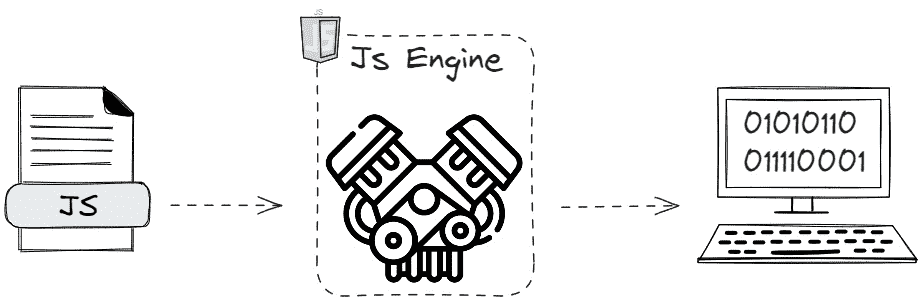

图 3.1：JavaScript 翻译过程

让我们在接下来的几个小节中深入探讨 JavaScript 引擎。

### 调用栈和内存堆

JavaScript 引擎由多个元素组成，其中两个是 **调用栈** 和 **内存堆** （*图 3.2*）。

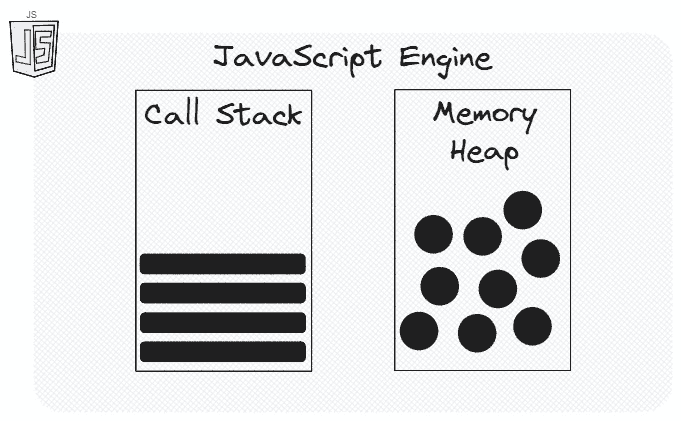

图 3.2：调用栈和内存堆

当我们运行我们的 JavaScript 应用程序时，代码是在调用栈中执行的。把它想象成代码可以按给定顺序遍历的一系列步骤。另一方面，堆是关于数据存储的。它是无结构的内存，用于存储对象。

### JavaScript 翻译过程

**翻译器** 是一个可以将人类可读的源代码翻译成机器可读指令的程序。它有两个主要部分。第一部分是 **编译器**。在编译过程中，程序将整个代码一次性转换成机器代码。第二部分是 **解释器**。在解释过程中，解释器遍历源代码并逐行执行，将其转换成机器指令。几年前，JavaScript 一直是一种纯解释语言，但幸运的是，一些现代 JavaScript 引擎以混合模式进行翻译。现代 JavaScript 引擎结合了解释和 JIT 编译，其中解释器逐行运行代码，而编译器将频繁使用的代码转换成机器代码以优化性能。例如，V8 引擎结合了编译器和解释器，这被称为 **即时** （**JIT**） 编译过程。

解释器在启动和运行方面速度很快。无需将源代码转换为另一种语言，这意味着没有编译步骤。对于立即执行等选项，解释器比编译器更合适。这里的主要问题是，如果你反复运行相同的代码（比如，相同的 JavaScript 函数），它可能会变得非常慢。解释器不会对你的代码进行任何优化。这时编译器就派上用场了。它比解释器花费更多的时间，因为它将你的代码转换为另一种语言，但它很聪明，当它再次看到相同的代码时，它会优化它以避免再次解释。

在翻译方面，JavaScript 结合了解释器和编译器的优势。

经典的编译意味着机器代码存储在一个可移植的文件中，并且可以随时执行，但对于即时编译器（JIT compiler）来说，情况略有不同。机器代码应该在编译结束时尽快执行。

让我们尝试理解在 Google 的 V8 引擎上如何工作 JavaScript 特定的 JIT。作为一个 JavaScript 运行时，Node.js 也依赖于 V8 引擎，理解其内部结构将极大地帮助我们从 Node.js 的角度来看。

当你执行用 JavaScript 编写的源代码时，JavaScript 引擎会解析它。*解析器*是 JavaScript 引擎的一个子元素，它接收你的源代码并输出标记。这就是 JavaScript 引擎理解是否存在错误的方式。它充当**词法分析器**，最终输出称为**抽象语法树**（**AST**）。要见证 AST 的美丽，你只需导航到 AST 浏览器([`astexplorer.net/`](https://astexplorer.net/))，输入任何 JavaScript 代码，并查看解析过程。

AST 是引擎特定的数据结构，它通过将你的 JavaScript 代码的每一行分解成语言可理解的部分来生成。引擎使用它来生成机器代码。然后 AST 被*解释器*接收并转换为字节码。

**字节码**是一组特殊的指令集合，其与机器代码大致相似，但作为包装器并抽象化我们免受机器代码复杂性的影响。V8 的默认解释器称为**Ignition**，输出字节码；另一方面，编译器**Turbofan**将此字节码优化为高效的机器代码

Turbofan 也充当即时编译器。在解释器和编译器之间，有一个*分析器*，它分析解释过程（Ignition）并将需要优化的代码转发给编译器（Turbofan）。（见*图 3**.3*.）

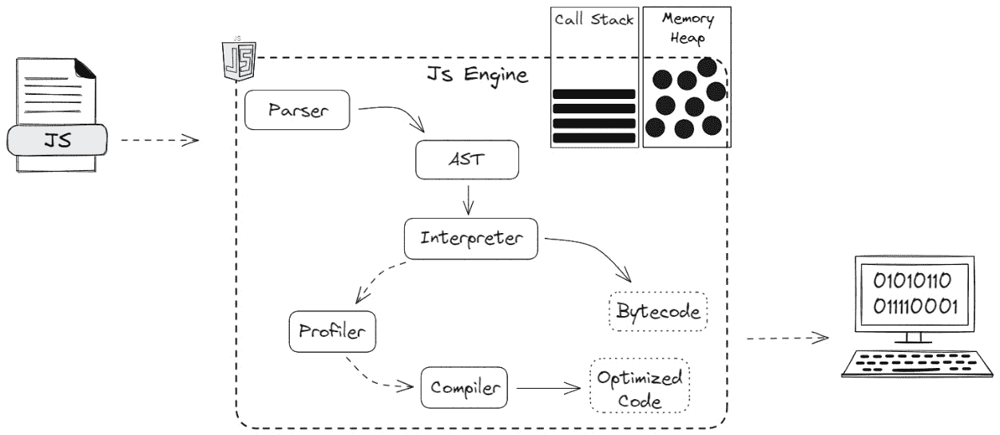

图 3.3：JavaScript 引擎内部结构

好吧，但你可能想知道为什么我们需要理解 JavaScript 引擎底层的操作。实际上，这实际上会帮助你编写更好、更快的代码，并使用优化的微服务。这种知识将帮助你编写优化友好的代码。JavaScript 引擎并不总是能够应用优化，在某些情况下，它取决于你的编写风格。你可能会编写一些可能难以优化你的 JavaScript 引擎的代码。这就是为什么始终理解内部结构是更好的选择。例如，使用 `delete`、`evals`、`arguments` 和 `with` 关键字以及诸如 *hidden classes* 和 *inline caching* 这样的机制可能会减慢代码优化。这些概念超出了我们这本书的范围，但你可以通过查看开源 JavaScript 教程和文档来了解它们。

我们接下来需要讨论的是 JavaScript 的单线程特性，相信我，当我们深入研究线程细节时，事情会变得很有趣。

### JavaScript 中的线程

正如我们之前提到的，JavaScript 是一种单线程、阻塞、同步的编程语言，它只有一个调用栈。JavaScript 是“单线程”的，但并不一定是“阻塞”的。它默认是同步的，但可以使用回调、承诺和 async/await 来处理异步代码执行。但这究竟意味着什么，为什么我们需要理解它呢？好吧，大多数编程语言都默认支持多线程。这意味着在给定时间内可以运行多个独立的操作。但是，当涉及到 JavaScript 时，事情就有些不同了。对于 JavaScript 来说，在给定时间内只能运行一组指令，这在多线程的世界中是一个大问题，尤其是对于长时间运行的任务。幸运的是，当你处理 JavaScript 时，你不仅处理 JavaScript 引擎，还处理一个叫做**JavaScript 运行时**的东西。

## JavaScript 运行时

浏览器本质上是一个 JavaScript 引擎的包装器和运行时。运行时的责任是为给定上下文提供**额外**的支持，以实现所有必需的功能。在这里，在浏览器中，上下文是基于网络的交互式应用程序。Node.js 也是一个基于谷歌 V8 引擎的运行时。引擎可以帮助你扩展原生 JavaScript 引擎的功能，并给它们添加异步特性。这些功能在浏览器中统称为**Web API**。要查看基于浏览器的、重要的 Web API，请按照以下步骤操作：

1.  打开您喜欢的浏览器（在我们的例子中，是谷歌 Chrome）。

1.  右键点击并选择**检查**。

1.  转到 `window`。

1.  按 *Enter*。

你也可以在*图 3.4*中看到这一点：

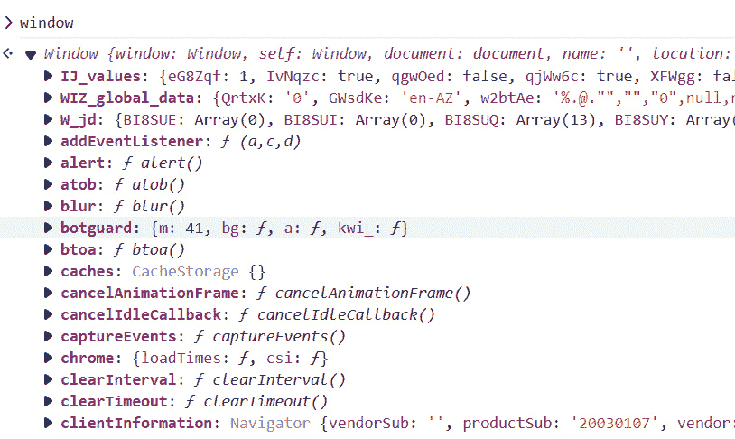

图 3.4：窗口全局对象

你可以看到的 `window` 对象的元素（其属性和方法）除了你的 JavaScript 引擎外，还内置在你使用的浏览器中。浏览器具有适用于所有浏览器的近似相似的 Web API。大多数核心 Web API 都被设计为标准化，以便网站可以在不同的浏览器中以类似的方式运行。然而，在实现或功能方面，浏览器之间可能存在细微的差异，并且某些 API 可能仅针对特定浏览器。大多数流行的 API 函数，如 `fetch`、`setTimeout`、`setInterval` 和 `document`，都是这个称为 `window` 的大 API 的一部分。这意味着它们不是原生 JavaScript 函数，而是在给定上下文中为我们提供的基于引擎的函数。Web API 为我们的 JavaScript 代码添加了异步行为。

当你编写具有这些功能（`fetch`、`document`等）的代码时，JavaScript 引擎会将它们转发到 Web API。Web API 使用低级语言编写（在大多数情况下是 C/C++），执行后，你提供的回调，即给定指令中提供的回调，将被添加到**回调队列**中。所有原生 JavaScript 函数都将直接在调用栈中执行，但非原生指令需要首先在 Web API 中执行，执行的结果，作为一个回调，将被添加到回调队列（**图 3.5**.5）。

此外，还有**事件循环**。事件循环的职责仅仅是检查调用栈，并且只有在调用栈为空时才将回调队列元素推入其中。

为了确保我们提到的所有术语都得到很好的理解，让我们考虑一个简单的例子。看看**图 3.5**：

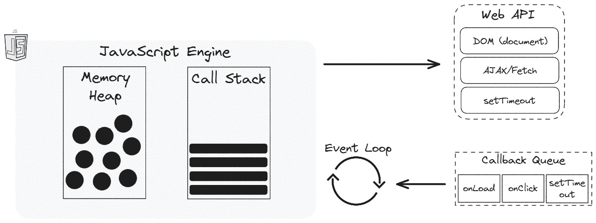

图 3.5: 带有回调队列的 JavaScript 事件循环

打开你喜欢的网络浏览器，在页面右键单击，选择书籍 GitHub 存储库中的 `Ch03/js` 文件夹中的 `event_loop.js`：

```js
function print(message) {
    console.log(message);
}
setTimeout(() => {
print("Message from Timeout");
}, 0);
print("Message 1");
print("Message 2");
```

在我们的代码中，你可能会期望首先看到 `setTimeout` 的消息，然后按照给定的顺序看到其他消息。因为我们已经将 `setTimeout` 的值指定为 `0`，它应该立即执行我们的代码。但输出是不同的，正如我们在**图 3.6**中看到的那样。

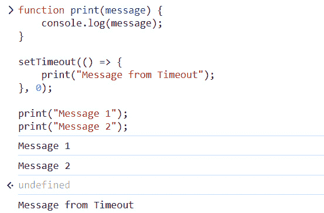

图 3.6: 调用栈在最后执行队列项

如你所猜，如果执行的函数是非原生的，这意味着它是一个基于 Web API 的函数，那么 JavaScript 引擎会将它转发到 Web API，并在执行后，将其回调添加到回调队列中。同时，`setTimeout` 将是一个非阻塞的异步操作，这就是为什么我们首先看到 `print` 函数的结果。

因此，无论你将`setTimeout`的第二个参数设置为`0`还是更多，它都会通过我们解释的管道。事件循环将检查调用栈是否为空，当两个`print`函数都完成后，调用栈确实变为空，因此我们只能在事件循环将其推入调用栈后才能看到`setTimeout`的结果。

现在让我们更详细地谈谈 JavaScript 的异步特性。

## 基于回调的异步 JavaScript

`setTimeout`或`setInterval`，你通常依赖于回调。

回调是必不可少的，但有时它们的用法会使你的代码更难以理解，更难以维护，尤其是在异步代码方面。为了证明这一点，请访问`callback_hell.html`并在任何浏览器中运行它。（你可以在书籍 GitHub 仓库的`Ch03`文件夹中找到`callback_hell.html`。为了简化，所有 GitHub 仓库引用将只包含路径，即`Ch03``/callback_hell.html`。）

该文件包含基于回调的多个异步操作，我们称之为*回调地狱*。

```js
addScript("js/app.js", (script, error) => {
        if (error) {
          addErrorMessage("main", error.message);
        } else {
          setTimeout(() => {
            let message = execute();
            addSuccessMessage("main", message);
            setTimeout(() => {
              message = "operation completed successfully";
              addSuccessMessage("main", message);
              setTimeout(() => {
                message = "ready for another execution";
                addSuccessMessage("main", message);
              }, 2000);
            }, 3000);
          }, 4000);
        }
      });
```

下面是这个脚本做了什么：

1.  动态地将提供的脚本添加到 HTML 文件的头部。

1.  运行属于该脚本的功能（在我们的例子中，它是一个`execute`函数）。

1.  在三秒后运行`操作完成成功`的消息。

1.  在前一条消息运行三秒后，它将`准备进行另一次执行`的消息输出到控制台。如果加载的文件不存在，则错误消息将被打印为输出。

如你所见，代码难以阅读、理解和维护，这主要是因为它的嵌套。在软件开发中，*维护*指的是保持软件正常、安全并更新到最新状态的持续过程。如果你有更多操作要做，可能会更复杂。

## 承诺的方式

虽然回调仍然是 JavaScript 的主要部分，但由于它们在可读性、错误处理和代码可维护性方面提供的优势，承诺（promises）是现代 JavaScript 开发中处理异步操作的首选方式。

**承诺**（Promises）是在 2015 年发布的**ECMAScript 6**（**ES6**）规范中添加到 JavaScript 中的，这使得在 JavaScript 中处理异步操作从回调地狱中解脱出来，现在我们有了异步编程的干净且更易于管理的途径。我们在 Node.js 开发中积极使用承诺，因此理解和正确使用它们至关重要。

要创建一个承诺（promise），我们使用一个`Promise`对象。它有一个单一的回调参数，称为`executor`。当承诺（promise）成功构建时，它会自动运行。`executor`由两个回调组成：

+   `resolve`: 我们使用这个来通知用户操作成功

+   `reject`: 我们使用这个来表示出了问题

当承诺（promise）完成时，它应该调用其中一个函数，要么是`resolve`（值）要么是`reject`（错误）。

Promise 最初处于`pending`状态。如果发生`resolve`，它将移动到`fulfilled`状态；否则（如果被拒绝），状态将移动到`rejected`。

Promise 的结果最初是`undefined`。如果执行`resolve`，它将存储`value`；否则（如果被拒绝），它将存储`error`。

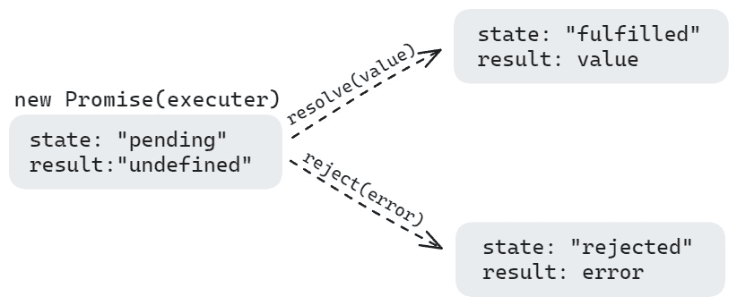

图 3.7：Promise 状态和结果

如果你只想提供一个执行路径，那么只使用`resolve`或`reject`作为`executor`是完全正常的。

让我们尝试使用 Promise 在**图 3.7**中实现回调示例。

文件：`Ch03``/js/promise_chaining.js`

```js
addPromisifiedScript ("js/app.js")
        .then(() =>
            new Promise((resolve) => {
              setTimeout(() => {
                let message = execute();
                addSuccessMessage("main", message);
                resolve();
              }, 4000);
            })
        )
        .then(() =>
            new Promise((resolve) => {
              setTimeout(() => {
                let message = "operation completed successfully";
                addSuccessMessage("main", message);
                resolve();
              }, 3000);
            })
        )
        .then(() =>
            new Promise((resolve) => {
              setTimeout(() => {
                let message = "ready for another execution";
                addSuccessMessage("main", message);
                resolve();
              }, 2000);
            })
        )
        .catch((error) => addErrorMessage("main", error.message));
```

现在，我们不再使用嵌套回调，而是使用 Promise 链。那么，为什么你应该选择 Promise 而不是回调？考虑以下优点：

+   多亏了它们的线性语法，Promise 帮助我们使代码更容易理解

+   我们有`.catch()`，它提供了一个集中处理错误的方式

+   Promises 允许你以更可读的方式将多个异步操作链接在一起

+   `a``sync`/`await`建立在 Promise 之上，并提供了一种更同步的方式来编写异步代码（我们将在本章中学习`async`/`await`）

那么如何使基于 Promise 的代码更易读呢？

文件：`Ch03``/js/promise.js`

```js
function delay(ms) {
        return new Promise((resolve) => setTimeout(resolve, ms));
      }
      addPromisifiedScript("js/app.js")
        .then(() => delay(4000))
        .then(() => {
          let message = execute();
          addSuccessMessage("main", message);
        })
        .then(() => delay(3000))
        .then(() => {
          let message = "operation completed successfully";
          addSuccessMessage("main", message);
        })
        .then(() => delay(2000))
        .then(() => {
          let message = "ready for another execution";
          addSuccessMessage("main", message);
        })
        .catch((error) => addErrorMessage("main", error.message));
```

如你所见，添加一个简单的延迟函数可以使我们的代码更易读，而不是使用嵌套回调。

Promise 充当生产者。如果你想处理 Promise 的响应，你需要注册一个消费者。这种注册主要是通过使用`.then`指令完成的。这是一个 Promise 的延续，它获取前一个 Promise 的结果。这个指令可以处理响应（成功和失败）。

查看这里的代码，了解我们如何处理成功和错误情况。当`addPromisifiedScript`操作成功时，代码的`resolve`部分将被触发；否则，将触发`reject`：

```js
addPromisifiedScript("js/app.js").then(
        (resolve) => {},//success continuation
        (reject) => {}//error handling
      );
```

我们通常只使用`.then()`与`resolve`模式。如果你想有一个集中处理错误的方式，最好使用`.catch()`，它相当于应用`.``then(null,reject=> {})`。

你可以设置一个 Promise 来处理在线图书订单（一个异步操作）。你可能收到订单的确认电子邮件（一个已解决的 Promise）或遇到错误（一个被拒绝的 Promise），但无论如何，你仍然完成了与书店网站的交互（`finally`块）。你可以在`finally`块中放置代码，在 Promise 完成后进行清理，无论输赢。这可能是关闭屏幕上的加载轮，关闭不再需要的连接，或任何其他无论结果如何都需要发生的事情。

## Promise API

使用`new`关键字实例化 Promise 对象并不是使用它的唯一方式。Promise API 有几个实用的静态方法，我们可以在实践中使用。让我们在以下小节中看看它们。

### Promise.all()

如果你需要并行执行多个承诺，并且需要等待它们全部准备好，那么`Promise.all()`可能是一个不错的选择。如果所有承诺都成功解析，它将返回一个结果数组；如果任何一个承诺失败，它将立即拒绝。

在 GitHub 章节仓库中打开`github_avatars.html`，并通过双击运行它：

```js
const usernames = ["TuralSuleymani", "rasulhsn"];
      const url = "https://api.github.com/users/";
      let requests = usernames.map((name) => fetch(url.concat(name)));
      Promise.all(requests)
        .then((responses) => Promise.all(responses.map((r) => 
          r.json())))
        .then((gitusers) =>
          gitusers.forEach((user) => createAvatar(user.avatar_url))
        );
```

`Promise.all()`等待所有承诺并行执行并准备好，然后返回多个承诺。

在我们的例子中，我们在两种场景中使用它：

+   从 GitHub 并行获取数据（*第 25 行*）

+   从所有承诺中获取 JavaScriptON 数据（*第 27 行*）

对于`Promise.all()`，我们等待所有承诺成功执行。如果即使有一个承诺失败（没有成功），`Promise.all()`也会立即停止并完全放弃。它会忘记列表中的所有其他承诺，并完全忽略它们的结果。

我们刚才看到的代码应该将两个 GitHub 用户的头像作为图像渲染到`.html`文件中。

假设你有一系列任务要运行，比如从互联网上获取东西。如果一个任务失败，其他任务可能仍然继续进行。但`Promise.all()`将不再关心它们。它们最终可能完成，但它们的结果不会被使用。（`Ch03``/js/promiseAPI.js`包含所有展示的 Promise API 示例。）

以下示例代码显示`Promise.all`接受多个承诺作为数组：

```js
Promise.all([
    new Promise((resolve, reject) => setTimeout(() => resolve("success 
      resolve"), 500)),
    new Promise((resolve, reject) => setTimeout(() => reject(new 
      Error("Something went wrong!!")), 1000)),
    new Promise((resolve, reject) => setTimeout(() => resolve("another 
      success resolve"), 1500))
  ])
  .then((success) => console.log(success))
  .catch(alert); // Error: Something went wrong!!
```

`Promise.all()`不会尝试停止其他任务，因为一旦承诺开始，就无法取消它们。

### Promise.allSettled()

与`Promise.all()`不同，`Promise.allSettled()`更有耐心。即使有一个承诺失败，它也会等待所有承诺完成后再给你结果。

想象一个类似场景的任务。这次，`Promise.allSettled()`将等待所有任务完成，无论其中一个是否失败。

最后，它将给出所有任务的报告，告诉你每个任务是成功（`成功解析`）还是失败（`出了点问题!!`）：

```js
Promise.allSettled([
    new Promise((resolve, reject) => setTimeout(() => resolve("success 
      resolve"), 500)),
    new Promise((resolve, reject) => setTimeout(() => reject(new 
      Error("Something went wrong!!")), 1000)),
    new Promise((resolve, reject) => setTimeout(() => resolve("another 
      success resolve"), 1500))
  ])
  .then(results => {
    // 'results' is an array containing information about each promise (resolved or rejected)
    console.log(results);
  });
```

这样，你可以全面了解所有任务的情况，即使有些失败了。

### Promise.race()

`Promise.race()`就像是一系列承诺之间的比赛。你向它提供一串承诺，它等待第一个承诺要么成功要么失败。

无论是哪个承诺先完成（赢得比赛），其结果（成功或错误值）都将成为`Promise.race()`的结果。其余的承诺将被完全忽略，无论它们最终是否成功或失败：

```js
Promise.race([
    new Promise((resolve, reject) => setTimeout(() => resolve("success 
      resolve"), 2500)),
    new Promise((resolve, reject) => setTimeout(() => reject(new 
      Error("Something went wrong!!")), 1000)),
    new Promise((resolve, reject) => setTimeout(() => resolve("another 
      success resolve"), 3500))
  ])
  .then(result => {
    console.log(result);
  }).catch((err)=>console.log('Error detected', err));
```

当你使用`Promise.race`时，需要小心以下原因：

+   当你只需要从最快的承诺中获取结果时，这很有用

+   一旦一个承诺完成，它就停止监听其他承诺

+   它从获胜的承诺返回结果（成功值或错误）

### Promise.any()

`Promise.any()`等待任何一个承诺成功，不一定是第一个承诺。

一旦某个承诺成功解决，`Promise.any` 立即停止等待其他承诺，并返回成功值。

然而，如果列表中的所有承诺最终都失败了（被拒绝），`Promise.any` 本身会以一个特殊错误 `AggregateError` 拒绝。这个错误包含了所有单个承诺失败的原因：

```js
Promise.any([
    new Promise((resolve, reject) => setTimeout(() => resolve("success 
      resolve"), 2500)),
    new Promise((resolve, reject) => setTimeout(() => reject(new 
      Error("Something went wrong!!")), 1000)),
    new Promise((resolve, reject) => setTimeout(() => resolve("another 
      success resolve"), 3500))
  ])
  .then(result => {
    console.log(result);
  }).catch((err) => console.log('Error detected', err));//will not be executed
```

我们还有 `Promise.resolve()` 和 `Promise.reject()`，但由于 `async`/`await` 关键字，它们很少被使用。

## JavaScript 中的 Async/await

承诺非常流行，以至于有一个特殊的语法来处理它们。这个组合在章节的仓库中的 `async_await.js` 文件中被称为 `async`/`await` 关键字。

你可以为任何函数添加 `async` 关键字，甚至是一个简单的函数。但为什么要在你的函数之前使用 `async` 关键字呢？嗯，`async` 关键字是一种语法糖，它帮助我们将函数包装成一个承诺。看看这个函数：

```js
async function sayHello() {
    return "hello user";
}
```

这与这个完全一样：

```js
function sayHello() {
   return Promise.resolve("hello user");
}
```

函数的异步版本在幕后将生成一个承诺（*图 3**.7*）。这意味着使用这种语法，你可以向该函数添加续集，如 `.then()`、`.finally()` 和 `.catch()`。它只是一个基于承诺的函数。

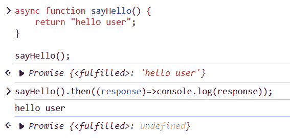

图 3.8：异步函数基于承诺

因此，异步的责任是确保函数始终返回一个承诺。但这还不是全部。这对关键字中还有一个叫做 `await` 的关键字。如果你需要等待你的承诺解决，那么你就可以使用这个关键字。比如说我们有一个简单的 `delayedMessage()` 函数，它返回与提供的参数完全相同的信息，但有一些延迟：

```js
function delayedMessage(msg) {
    return new Promise((resolve)=> {
        setTimeout(() => {
            resolve(msg);
        }, 3000);
    });
}
```

与通过链式调用（使用 `.then`）获取数据不同，你可以简单地应用同步编程技术。这意味着只需等待函数返回数据，获取数据，然后继续：

```js
let message = await delayedMessage("hello");//wait here for the Promise to be settled
```

这很简单。所以，而不是使用 `then`、`catch` 和 `finally`，你可以仅使用基于 async 的语法与基于承诺的函数交互。简单来说，await 只是一种更优雅地处理承诺的方式。

这里是一个使用承诺从多个 URL 获取数据的简单示例：

文件：`Ch03``/js/getdata_promise.js`

```js
const url = "https://jsonplaceholder.typicode.com";
const paths = ["/posts","/comments"];
let promises = Promise.all(paths.map(path=> fetch(url.concat(path))));
promises.then(responses=> Promise.all(responses.map(t => t.json())))
.then(data=> {
    data.forEach(element => {
        console.log(element);
    });
})
```

在我们前面的例子中，我们使用承诺从 JavaScript `onplaceholder` URL 的 `/posts` 和 `/comments` 获取数据。

使用 async/await，我们可以简化它，如下所示：

文件：`Ch03``/js/getdata_async.js`

```js
const url = "https://jsonplaceholder.typicode.com";
const paths = ["/posts","/comments"];
let getData = async function() {
    const responses = await Promise.all( paths.map(path=>fetch(url
      .concat(path))));
    constJavaScriptons = await Promise.all( responses
      .map(response=>response.json()));
   JavaScriptons.forEach(element => {
        console.log(element);
    });
}
getData();
```

而不是每次都使用 `.then()`，我们现在能够使用基于同步编程的语法。

你可能想知道如何处理这段代码中的异常？如果我们可以自由地不使用 `.catch()`，那么我们如何能够捕获异常呢？这里的答案也是非常简单的：只需使用 `try..catch`。

我们已经足够多地讨论了承诺。现在是时候看看 JavaScript 内部是如何处理承诺的了。

## 微任务队列

我们已经讨论了 promises 和 async/await。现在是讨论相关主题 `PromiseJobs` 的确切时机——参见 *图 3.8*。为了更好地管理 JavaScript 中的异步任务，ECMA 标准添加了这个内部队列。在调用栈方面，它具有与回调队列相似的行为，因为这些任务的执行只有在调用栈中没有其他运行时才可能。

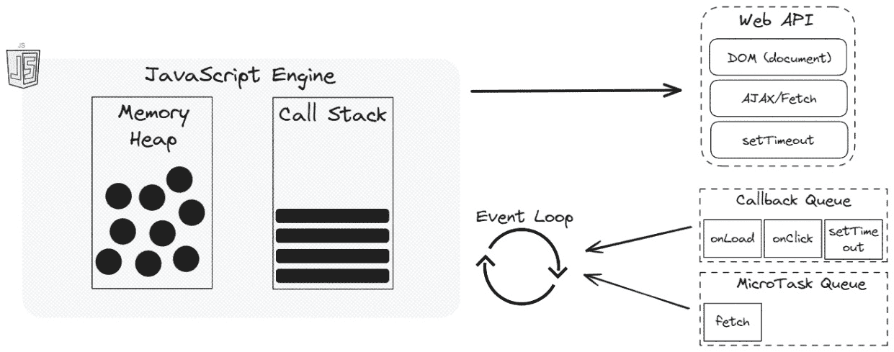

图 3.9：微任务队列

因此，当给定的 promise 准备就绪时，续集，如 `then`/`catch`/`finally` 处理程序，会被放入队列中。当调用栈为空时，JavaScript 引擎将按照 **先进先出**（**FIFO**）的顺序执行这些任务。

这里有一个简单的示例 (`Ch03``/js/microtasks.js`):

```js
let promise = Promise.resolve();
promise.then(() => console.log("planning to see this message first"));
console.log("but this message will be seen first");
```

输出的顺序可以在 *图 3.10* 中看到。

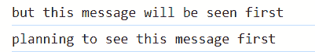

图 3.10：前述代码的输出

因为，当 JavaScript 引擎检测到 promise 时，它会将 `.then()` 移动到微任务队列中。这是一个异步操作，所以我们直接切换到下一行。只有在调用栈为空时，才能执行 promise。

当然，我们讨论的主题并不是你需要与 Node.js 一起工作的所有主题列表。我们跳过了一些简单和中级主题，只涵盖了我们认为可能在你使用 Node.js 时有所帮助的一些重要主题。JavaScript 技能是必不可少的，你需要了解其语法。拥有更好的 JavaScript 技能将在你学习本书的过程中起到指导作用。

# Node.js 基础知识

Node.js 不是一个独立的编程语言。它是 Google 的 V8 引擎上的一个运行时环境。这意味着 Node.js 的创建者只是将 V8 引擎从浏览器中提取出来，并将其放入另一个运行时环境中。Node.js 是 V8 引擎的包装器，通过添加网络、I/O API 和其他操作来扩展它。Node.js 的一个关键方面是其非阻塞 I/O 模型。这意味着 Node.js 可以在不被缓慢操作阻塞的情况下同时处理多个请求。在这种情况下，事件循环和回调队列变得更加重要。

Node.js 在底层有不同的依赖，但对我们来说最有趣的一个是**Libuv**。Libuv 为处理某些任务提供了一个线程池，默认情况下有四个线程，但可以根据应用程序的要求进行配置。这是提供基于 I/O 的非阻塞操作的主要魔法。它是用 C 语言编写的，提供了一个基于事件的异步 I/O 模型。可以使用线程池执行阻塞操作以分配 CPU 负载。默认情况下，我们在 Libuv 中有四个线程可以使用。对于基于网络的异步操作，Libuv 依赖于操作系统本身，但对于某些其他异步函数，例如从文件中读取，Libuv 依赖于其线程池。线程池的概念允许我们在单独的线程中执行一些重要操作，而不会阻塞其他操作。

Node.js 主要关注异步 I/O，并旨在最小化阻塞操作。线程池主要用于那些无法由操作系统高效异步处理的任务，例如需要大量处理的密集计算或文件系统操作。

就像在浏览器中一样，当涉及到 Node.js 的异步特性时，我们有不同的队列可以使用。一般概念是相同的。它们都使用基于事件循环的模型，但 Node.js 有一些更多的队列。

事件循环是在你的 Node.js 应用程序运行期间持续运行的机制。它负责处理不同的异步事件。事件循环利用队列来组织这些事件，确保它们按正确的顺序处理。事件循环由六个不同的队列组成。

事件循环利用几个队列来管理不同类型的异步操作（**图 3.9**）。这些队列确保任务按照特定顺序处理，如下所示：

+   `setTimeout`和`setInterval`函数。这些回调在指定延迟后或定期执行。（技术上，它是一个用于高效调度的最小堆。）

+   `fs`和`http`模块。事件循环在 I/O 操作完成时处理这些回调。

+   `setImmediate`。这些回调被视为高优先级，并在下一次循环迭代之前执行。

+   **关闭队列**：这个队列包含在异步资源关闭时运行的函数，确保适当的清理。

+   `process.nextTick`。这些也是高优先级，并在当前操作完成后立即执行。

+   **Promise 队列**：这个队列包含与解析或拒绝承诺相关的回调。这些回调在事件循环执行过程中遇到已解析或已拒绝的承诺时被处理。

需要注意的是，前四个队列（定时器、I/O、检查和关闭回调）由 Libuv 管理。微任务队列（`nextTick`和`Promise`）是独立的，但仍在确定事件循环中回调执行顺序方面发挥着关键作用。

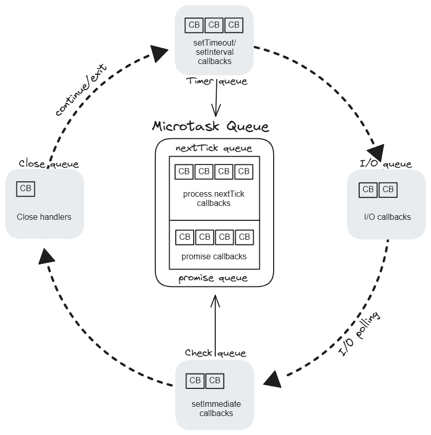

图 3.11：Node.js 队列

让我们讨论一下队列的优先级顺序。首先，重要的是要理解用户编写的同步 JavaScript 代码在这些队列中具有最高优先级。这仅仅意味着，只有当调用栈为空时，这些队列元素才会被执行。然而，这六个队列的顺序又是什么呢？我们现在将更详细地讨论它们：

+   `nextTick`队列，首先执行这些任务，然后是`promise`队列中的任何回调。

+   `setTimeout`和`setInterval`。

    在计时器队列之后，事件循环将再次检查微任务队列。首先，将执行`nextTick`队列，然后执行`promise`队列。

+   **I/O 回调**：接下来，事件循环处理 I/O 队列中的回调。这些代表异步操作，如文件 I/O 或网络请求，它们已经完成。

+   **再次检查微任务**：在处理 I/O 之后，事件循环再次检查微任务。这确保了在那些操作期间创建的任何微任务都能立即执行。

+   `setImmediate`：然后事件循环执行检查队列中的回调，该队列包含使用`setImmediate`计划的功能。这些被认为是高优先级任务，并在下一次循环迭代中先于其他回调执行。

    在检查队列之后，事件循环将再次检查微任务队列。首先，将执行`nextTick`队列，然后执行`promise`队列。

+   **关闭回调**：最后，事件循环处理与关闭异步资源相关的回调，确保适当的清理。

    再次检查微任务队列，如果存在回调则执行。

+   **循环中的微任务**：只要还有等待被邀请的回调，事件循环就会继续进行。一旦每个人都轮换过，并且没有剩下任何要做的，它就会优雅地退出舞台。

如您可能注意到的，微任务在事件循环中被检查多次。这确保了在执行其他回调期间创建的任何微任务都能立即得到处理。这优先处理了使用`nextTick`和`promise`解析计划的任务，保持了事件循环的响应性。

# 概述

本章是关于 JavaScript 和 Node.js 内部机制的。

首先，我们开始讨论 JavaScript 内部机制。主要目的是理解 JavaScript 引擎和 JavaScript 运行时。JavaScript 是一种单线程语言，但它具有异步特性，我们能够使用回调和 promises 来实现它。在异步编程中，由于 promises 的出现，回调现在有点过时了。我们还讨论了 Promise API，并学习了许多有趣的功能。

Promises 的流行给 JavaScript 带来了其他有趣的功能：async/await。通过示例，我们试图展示它们如何使我们的代码更易于阅读、理解和更接近同步代码。

对于承诺（promises），JavaScript 引擎管道中有一个特殊的队列，称为微任务队列。

然后，我们围绕 Node.js 进行了讨论，了解到它也是一个运行时环境，并使用 JavaScript 引擎来读取和翻译 JavaScript 代码。它将 JavaScript 推向了另一个层次，使用 Node.js，我们可以构建实时应用、微服务、Web API、流式应用、命令行工具等等。

内部来说，Node.js 严重依赖于 Libuv，并提供了大量的功能，这些功能大多可以归类为异步 I/O 和线程池。Libuv 为 Node.js 的异步编程模型提供了核心功能，使其在处理大量并发连接和 I/O 操作时既高效又可扩展。

本章的最后讨论是关于 Node.js 队列和事件循环。Node.js 中有几个队列，它们有特殊的顺序，我们需要理解这些顺序来构建更有效的应用。

在下一章中，我们将讨论在编写任何代码之前你需要了解的堆栈开发技术。
