# 栈开发技术

了解要使用哪些工具和应用程序可以显著加快您的开发过程。这就是为什么我们需要在编写代码之前首先准备我们的开发环境。开发环境应该让您感到舒适，并在学习编写微服务的过程中为您提供帮助。

这就像建造一栋房子。选择合适的工具可以加快进程并节省时间。当然，拥有合适的工具并不意味着你一定会成功，但选择正确的工具失败总比因为工具选择不当而失败要好。

本章重点介绍安装所需的工具。编程语言和框架也是我们构建微服务的工具。以某种形式或另一种形式，我们在编写软件时使用的所有东西都是我们的工具。现在安装我们计划使用的所有工具没有意义，但至少理解如何安装其中大部分工具将帮助我们更快地进入编码阶段。

我们还将查看本书中计划使用的一些 Node.js 框架。理解它们对于快速和轻松的开发至关重要。

在本章中，我们将介绍以下主题：

+   Node.js 及其安装

+   Node.js 框架

+   选择合适的 IDE

+   理解和安装 Docker

+   理解和安装 Apache Kafka

+   理解和安装 Git

+   安装 Postman

+   安装 MongoDB

# 技术要求

要跟随本章内容，您只需要选择一个浏览器以及互联网连接。关于我们计划使用的其他工具，我们将在本章中学习如何安装它们。

# Node.js 及其安装

正如我们在上一章中学到的，Node.js 是建立在 Google 的 V8 引擎之上的运行时环境。您可以使用它构建各种应用程序：

+   **Web 应用程序**：Node.js 是构建 Web 应用程序后端和前端的热门选择。其基于 JavaScript 的环境使得开发者能够轻松地在两个方向上工作。

+   **实时应用程序**：Node.js 的事件驱动架构和非阻塞 I/O 模型使其非常适合构建实时应用程序，如聊天应用、协作工具和流媒体服务。这些应用程序需要用户和服务器之间持续的通信，而 Node.js 可以高效地处理这一点。

+   **单页应用程序**（**SPAs**）：SPAs 是一种网页应用程序，它加载单个 HTML 页面，并使用 JavaScript 动态更新内容。可以使用 Node.js 来构建后端 API，为 SPAs 的客户端代码提供数据。

+   **API 驱动的应用程序**：许多现代应用程序依赖于 **应用程序编程接口**（**APIs**）来访问其他服务的数据和功能。由于 Node.js 能够高效地处理大量并发请求，因此它是构建这些 API 的绝佳选择。

+   **微服务**：由于 Node.js 具有模块化和异步能力，非常适合构建微服务。

+   **命令行工具**：Node.js 可以用来创建命令行工具，以自动化任务或与其他系统交互。

+   **桌面应用程序**：虽然不太常见，但 Node.js 也可以使用 Electron 等框架来构建桌面应用程序。

当然，这并不是完整的列表，但它为你提供了一个很好的概念，即可以用 Node.js 构建的广泛的应用程序范围。

学习某些技术或语言通常从安装所需的工具开始。Node.js 也是如此。那么，让我们深入了解其安装过程。

## 安装 Windows 版本的 Node.js

你可能会感到惊讶，但我非常喜欢微软及其产品。这意味着我使用的是 Windows **操作系统**（**OS**）。所有类型的安装都将主要使用*Windows OS*进行解释，但我将提供相关的链接，以帮助非 Windows 用户达到相同的进度水平。

当从官方网站（[www.nodejs.org](http://www.nodejs.org)）安装 Node.js 时，它会自动检测你的操作系统并提供安装的确切说明。

我们还有不同的安装 Node.js 的方式，即使是对于同一操作系统。最受欢迎的是预构建安装程序和通过包管理器安装。

让我们按照以下分步说明来安装 Node.js：

1.  访问 [www.nodejs.org/en/download](http://www.nodejs.org/en/download)。在我的情况下，我将使用基于 Windows 的说明。

1.  选择**预构建安装程序**。

1.  在标签页中，选择要运行的 Node.js 的所需版本，包括操作系统和 CPU 架构（*图 4.1*）。

    你可能想知道应该选择 Node.js 的哪个版本——**LTS**还是**当前**版本？答案是简单的：

    +   对于长期使用，需要保持稳定并协同工作的情况，**LTS**版本是一个安全的选择。这是一个可靠的选项。

    +   另一方面，**当前**版本拥有所有最新的功能和特性，这对于想要尝试新功能的程序员来说非常棒。

    对于我们的代码示例，LTS 版本就足够了。选择它并继续。

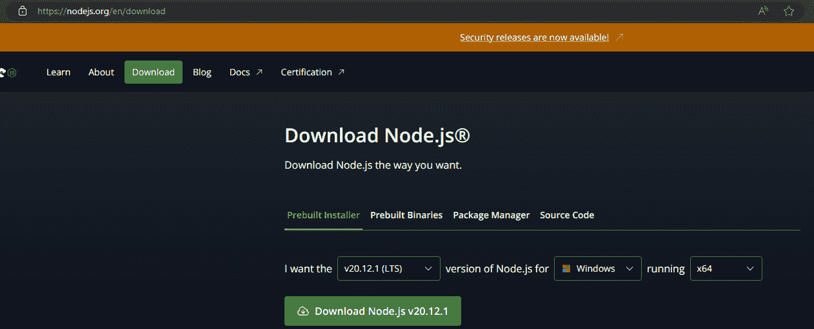

图 4.1：Node.js 安装页面

这些相同的说明也适用于*非 Windows*用户。你需要选择你的适当操作系统及其平台，然后点击绿色的**下载 Node.js** **v<版本号>**按钮。根据所选版本，按钮上的版本将自动更新。我们将在下一节深入探讨这个安装过程。

1.  在安装过程中，只需接受许可协议并按照向导的说明进行，无需进行任何自定义设置配置。在安装过程中间，向导将要求你选择应用程序在编译本地模块时的行为。最好选择如(*图 4.2*)所示的复选框：

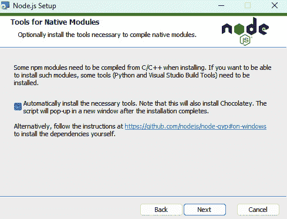

图 4.2：Node.js 的“原生模块工具”窗口

如果你选择 **自动安装** 复选框（*图 4.2*），它将安装额外的工具，如 Chocolatey、Python 和 Visual Studio Build Tools。

1.  安装完成后，只需按下 *Win* + *R* 组合键，然后在打开的窗口中输入 `node`：

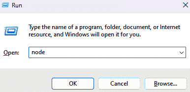

图 4.3：运行命令的输入窗口

1.  输入 `node` 后，按 *Enter* 键。你应该会看到以下应用程序：

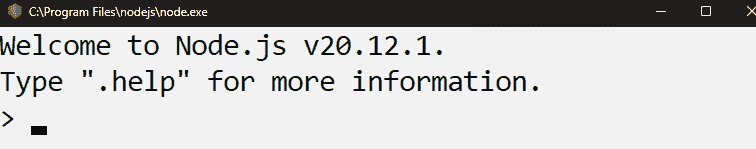

图 4.4：Node 命令行

在 *图 4.4* 中显示的窗口是一个 **读取-评估-打印循环**（**REPL**），它作为一个编程语言环境，类似于控制台窗口（*图 4.5*）。它接受用户输入的单个表达式，处理它，然后在控制台中显示结果。这是一个快速实验基本 JavaScript 代码的好方法。

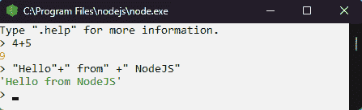

图 4.5：Node.js REPL

现在，让我们继续讨论在 macOS 和 Linux 上安装 Node.js 的讨论。

## 为 macOS 和 Linux 安装 Node.js

对于 macOS 和 Linux 用户来说，最简单的方法之一是使用基于包管理器的安装。选择你的操作系统，然后转到 **包管理器** 部分。在 **使用** 部分，你可以选择活动管理工具（*NVM*、*Brew*、*Chocolatey* 或 *Docker*）并遵循该窗口中提供的说明（*图 4.6*）：

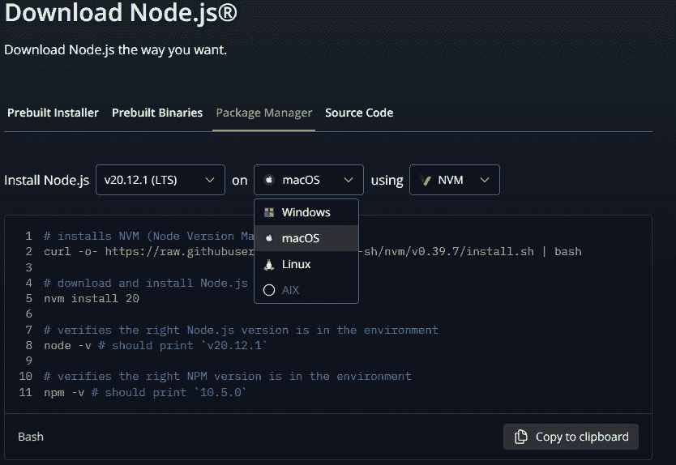

图 4.6：不同操作系统的 Node.js 安装

如果你想使用 NVM 下载适用于 Linux 发行版的 Node.js，应遵循此处提供的说明：

```js
# installs NVM (Node Version Manager)
curl -o- https://raw.githubusercontent.com/nvm-sh/nvm/v0.39.7/install.sh | bash
# download and install Node.js
nvm install 20
# verifies the right Node.js version is in the environment
node -v # should print `v20.12.1`
# verifies the right NPM version is in the environment
npm -v # should print `10.5.0`
```

请注意，在阅读本书时，Node.js 的版本可能会有所不同。对于更详细的安装说明，请阅读 Node.js 的官方页面。

虽然 Node.js 是我们开发微服务时的主要工具，但在整个学习过程中，我们也会使用一些 Node.js 的框架来简化我们的工作。本书中我们将使用最流行的两个框架，即 *NestJS* 和 *Express.js*。

# Node.js 框架

Node.js 有很多有趣的框架。我们将使用 *NestJS* 和 *Express.js*（我们将在稍后详细介绍这些框架）但当然，更多的框架依赖于 Node.js，并且在一本书中不可能使用所有这些框架，即使可能，这样做也没有太多意义。

首先，Node.js 不是一个框架，而是一个在浏览器外执行 JavaScript 代码的运行时环境。一些开发者称之为框架，但这并不准确。我们需要理解框架这个术语，才能判断某物是否是框架。在编程中，**框架**基本上是一个预先构建的结构，作为创建软件应用的基础。它就像一个你可以根据特定需求定制的蓝图，而不是从头开始。框架提供了用于常见功能的预写代码，例如处理用户输入、数据库交互或安全性。这些组件作为构建块，你可以利用它们来节省时间和精力。

框架通常有定义好的代码组织方式，这确保了一致性，并使其他开发者更容易理解和维护代码库。

框架的一个关键方面是**控制反转**。不是你的代码调用框架，而是在特定的点上框架调用你的代码。这允许框架管理应用程序的整体流程。

有了这些信息，你可以知道 Node.js 不是一个框架。它只是一个运行时环境，但我们有建立在 Node.js 之上的框架。最受欢迎的包括 *NestJS*、*Express.js*、*MeteorJS* 和 *SailsJS*。顺便说一句——许多流行的框架，如 *Sails*、*NestJS*、*Kraken*、*poet* 和 *Item API*，都是建立在 Express.js 之上的。如前所述，我们将使用 NestJS 和 Express.js，让我们来仔细看看它们。

## Express.js

**Express.js** 简化了网络开发过程。通过有效地使用 Express.js，你可以为用户创建动态和交互式的网络体验。由于 Express.js 轻量级，它是创建需要在高流量下表现良好的网络应用的绝佳选择。Express.js 的一个关键特性是它处理不同路由的能力，这些路由本质上是用户访问你网络应用特定部分所走的路径。

将 Node.js 想象成构建块和工具，就像砖块和灰浆。Express.js 就像预制墙体和管道——它为你提供了一个结构化的方式来组装这些块，以更快地创建网络应用。仅使用 Node.js 构建复杂网络应用可能会变得混乱。Express.js 提供了一个框架，这样你可以将代码组织成路由、中间件和视图，使其更易于维护和他人理解。

虽然你可以用 Node.js 从头开始构建一切，但 Express.js 提供了内置的功能来处理路由、处理 HTTP 请求和响应以及创建 API，为你节省时间和精力。

Express.js 是一个流行的框架，拥有庞大的开发者社区。这意味着你可以访问大量的资源、教程和额外的库，以简化开发。尽管有其他 Node.js 框架可供选择，但由于其简单性、灵活性和庞大的社区支持，Express.js 仍然是一个不错的选择。

## NestJS

**NestJS** 是一个建立在 Node.js 之上的框架，专门用于构建健壮和可扩展的服务器端应用程序。

NestJS 为你的应用程序强制执行一个清晰和有序的架构。这使得复杂项目更容易管理和维护，特别是对于开发者团队。它与 TypeScript 无缝集成，TypeScript 是 JavaScript 的超集，它为代码添加了静态类型，提高了代码可靠性并减少了错误。它还促进了模块化方法，即将你的应用程序分解成更小、可重用的组件。这使得你的代码库更有组织，并且随着应用程序的增长更容易进行扩展。

注意

另一个好消息是，如果你熟悉 *Angular*，一个 NestJS 借用了许多概念的流行的前端框架，这将使 Angular 开发者更容易学习和使用。

NestJS 超越了基本的 Web 应用程序。你可以使用这个框架构建 RESTful API、GraphQL API、WebSocket 应用程序，甚至命令行界面。

它还利用了 **依赖注入**，这是一种管理应用程序不同部分之间依赖关系的强大技术。这促进了松散耦合，并使你的代码更容易进行测试。

简而言之，NestJS 在 Node.js 的基础上提供了一个结构化和功能丰富的工具包，使你能够高效地构建可扩展和可维护的服务器端应用程序。

## 在 Express.js 和 Node.js 之间做出选择

这本书不是关于 Node.js 框架的，我们的目标也不是提供关于它们的完整信息。然而，了解这两者之间的基本差异将有助于我们有一个更广泛的理解。让我们概述一些这些框架适合的情况。有了这种理解，你将能够做出更明智的决定，并为你的项目选择正确的框架：

+   **在以下情况下使用 Express.js**：

    +   如果你的项目是小型的或中等规模的。对于更简单的 Web 应用程序或 API，Express.js 的轻量级和灵活特性可能非常理想。

    +   如果你优先考虑灵活性。Express.js 提供了对你的应用程序结构的更多控制，允许你根据具体需求进行定制。

    +   如果你熟悉 JavaScript。如果你对原生 JavaScript 感到舒适，Express.js 的学习曲线会更加平缓。

+   **在以下情况下使用 NestJS**：

    +   如果你的项目很大或很复杂。NestJS 的结构化架构和功能对于管理和维护由多个开发者参与的大型应用程序非常有用。

    +   如果你重视可扩展性，NestJS 的模块化设计使得随着功能和复杂性的增长，你的应用程序更容易进行扩展。

    +   如果你需要内置功能，NestJS 提供了诸如依赖注入和 TypeScript 支持等开箱即用的功能，这提高了代码的可维护性和可靠性。

    +   如果你的团队熟悉 Angular。如果你的开发者有 Angular 的经验，NestJS 的类似结构可以减轻学习曲线。

在安装 Node.js 之后，我们需要为开发准备我们的**集成开发环境**（**IDE**）。

# 选择合适的 IDE

选择合适的 IDE 可能有助于你快速开发。对于 Node.js 开发，尤其是为了跟随我们的代码示例，我们没有对 IDE 有严格的要求。你可以使用你喜欢的文本编辑器或操作系统内置的文本编辑器。选择合适的 IDE 是一种口味和功能偏好的选择。IDE 可以帮助你在语法高亮、自动完成和重构，并且可以轻松地与重要库进行交互。你可以使用不同的 IDE，例如*Visual Studio Code*、*Eclipse Che*、*Sublime Text*、*WebStorm*和*IntelliJ IDEA*。

我们更喜欢 Visual Studio Code，因为它免费、易于使用、可以通过扩展进行扩展、跨平台兼容、易于配置，并支持多种编程语言。

让我们安装 Visual Studio Code。要安装它，只需遵循以下说明：

1.  前往[`code.visualstudio.com/download`](https://code.visualstudio.com/download)。

1.  点击你的操作系统版本，等待下载完成。

1.  点击你下载的文件，并按照默认说明进行操作。

随着你学习微服务开发，你会熟悉经典的应用程序安装过程。因此，我们没有提供详细的截图，也不会在安装细节上花费太多时间。更多信息，你可以在 Google 上简单地搜索相关应用程序安装说明。

Visual Studio Code 为所有需求提供了丰富的扩展库（*图 4.7*）。你可以下载任何你想要的东西来帮助你快速开发、重构、突出显示你的代码等等：

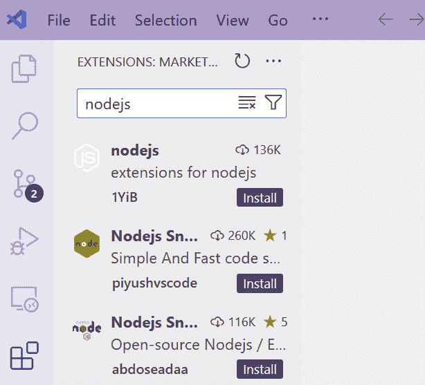

图 4.7：Visual Studio Code 的扩展部分

安装完我们的集成开发环境（IDE）后，是时候安装 Docker 了。它是一个必备的工具，尤其是在如今微服务应用开发中。我们将在开发中积极使用 Docker，所以让我们深入了解一下。

# 理解和安装 Docker

在安装 Docker 之前，我们需要了解它的价值和目的。

**Docker**就像是你软件的运输集装箱。它将你的应用程序运行所需的一切——代码、库和设置——打包在一起，并将它们捆绑在一起。这确保了你的应用程序可以在任何操作系统上无任何问题地运行。它保证了如果应用程序在本地运行良好，那么它将在全球范围内运行。

Docker 确保您的应用程序每次都以您构建的方式运行。不再因为不同的计算机配置而出现惊喜。

Docker 中的主要概念是镜像和容器。**容器**轻量级且启动速度快，使得测试和开发周期更加顺畅。您可以轻松地将 Docker 容器发送到任何环境，无论是基于云的还是不是，并且可以确信它将正常工作。容器共享底层操作系统，因此您可以在单台机器上运行更多应用程序，而不会使其过载。

在 Docker 的世界里，**镜像**就像 Docker 容器的蓝图。它是一组指令，指定了容器内部需要什么，包括应用程序运行所需的软件、库和配置。您只需构建一次镜像，就可以用它来创建许多容器，节省您的时间和精力。镜像可以轻松共享和下载，允许您在安装了 Docker 的任何机器上运行您的应用程序。镜像的一个优点是，使用相同镜像的每个人都会得到相同的环境，减少了惊喜并确保了应用程序行为的可靠性。

如果您不想将某些应用程序永久安装在您的计算机上，并且在开发完成后轻松地移除它们，那么最好不是直接安装它们，而是使用 Docker 进行安装。

最后，Docker 简化了构建、运输和运行应用程序的过程。它就像是一个软件的通用盒子，确保它无论在哪里运行都能完美运行。

理论已经足够了——让我们深入了解 Docker 的安装过程。

您几乎可以在所有流行的操作系统上安装 Docker，例如 Windows、Linux 和 Mac。它可能对您的操作系统有特定的要求，您可以通过导航到[`docs.docker.com/engine/install/`](https://docs.docker.com/engine/install/)来了解这些要求。然后，您可以选择您的操作系统进行安装。

注意，需求可能因操作系统的内部版本而异。在**系统需求**部分，您将看到基于所选操作系统内部版本的先决条件（*图 4.8*）。例如，对于 Windows，我们有**WSL 2 后端**和**Hyper-V 后端以及 Windows 容器**的系统需求：

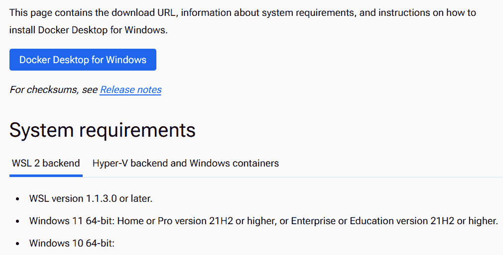

图 4.8：Docker 的系统需求部分

如果您的操作系统满足提供的系统需求，您将能够安装 Docker 桌面（*图 4.8*）。对于 Windows，建议使用**WSL 2**而不是**Hyper-V**。

安装过程简单直接，不需要任何额外的配置：

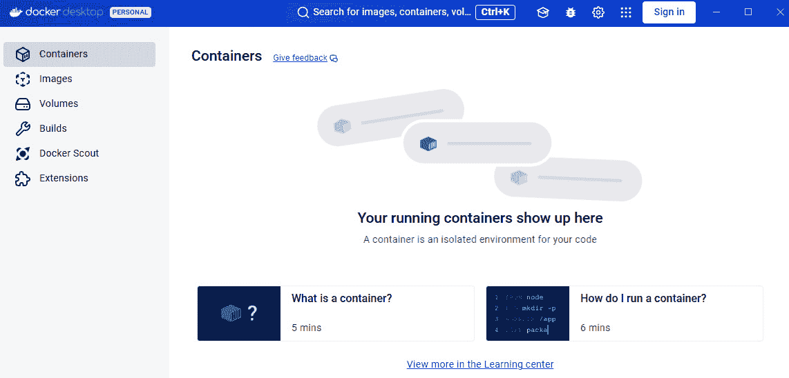

图 4.9：Docker 桌面

Docker 不是我们在构建微服务时需要使用的唯一强大工具。我们还有另一个优秀的工具，它可以帮助我们在微服务之间进行实时通信：Apache Kafka。

# 理解和安装 Apache Kafka

**Apache Kafka** 是一个开源平台，用于处理实时数据流。最初设计为一个消息队列，它已经发展成为一个强大的数据流和事件驱动架构构建系统。微服务之间的通信至关重要，这正是 Kafka 发挥其优势的地方。

Kafka 本身是一个庞大的概念，需要另一本书来详细阐述。在这本书中，我们将提供足够的信息，以便我们能够将其集成并用于我们的微服务。如需更详细的信息，您可以在 Udemy 平台上跟随我的 *Apache Kafka for Distributed Systems* 课程（[`www.udemy.com/course/apache-kafka-for-distributed-systems/`](https://www.udemy.com/course/apache-kafka-for-distributed-systems/)）。

Kafka 使用 **发布-订阅** 消息模型。服务作为生产者，将事件发布到 Kafka 内部的特定通道，称为 **主题**。其他服务作为消费者，订阅相关主题并异步接收这些事件。

这种方法巧妙地将服务彼此解耦。生产者不需要等待消费者可用，消费者可以按自己的节奏处理事件。这提高了可扩展性和灵活性。

Kafka 还充当缓冲区，存储事件直到消费者准备好。这实现了异步处理，防止了瓶颈并提高了整体系统的响应速度。

Kafka 是为可靠性而构建的。它会在多个节点之间复制数据，确保即使服务器出现故障，消息也不会丢失。这增强了微服务架构中的容错能力。

重要的是要知道 Kafka 可以水平扩展。您可以轻松地添加更多节点来处理不断增长的数据量，而不会影响现有服务。这完美地适应了微服务的动态特性。

如前所述，Kafka 的一个关键特性是它处理实时数据流的能力。这对于需要迅速响应事件的微服务来说非常有价值，例如在欺诈检测或股票交易应用中。

Kafka 可以灵活地与编程语言相关联，并与各种编程语言无缝集成，使其能够适应不同的微服务环境。

**Kafka Streams**，Kafka 内部的一个强大 API，使您能够在 Kafka 集群内部对数据流进行实时计算和转换。这种流处理能力为微服务架构增添了显著的价值。

简而言之，通过集成 Apache Kafka，微服务开发从增加的可扩展性、弹性和敏捷性中受益。它促进了松散耦合的事件驱动方法，使微服务能够有效地进行通信和响应变化。这转化为更稳健、适应性强和高性能的应用程序架构。

Apache Kafka 的安装因操作系统而异，您需要根据每个操作系统进行一些额外的配置。

此外，除了 Apache Kafka，我们还可能使用 Zookeeper 和 Kafka UI。从 Apache Kafka `v4` 开始，您将不再需要 Zookeeper。然而，此功能仍在开发中，因此了解它也很有意义。Zookeeper 承担多个职责，并在协调器中扮演着关键角色。

Kafka 本身是一个基于 CLI 的工具，因此如果您想以图形方式查看内容，则需要额外的工具，例如 Kafka UI、偏移量探索器等。

但我有好消息要告诉您。如果您已安装 Docker，则无需深入了解安装过程。我们可以创建一个 `docker-compose` 文件来组合所需的工具并一起安装。您可以逐个下载文件，但 `docker-compose` 帮助您创建一个特殊的 YAML 文件，您可以在其中定义所有工具和应用程序依赖项并一起安装。以下是我们的 `docker-compose` 文件内容：

```js
services:
  zookeeper:
    image: bitnami/zookeeper:3.8
    ports:
      - "2181:2181"
    volumes:
      - zookeeper_data:/bitnami
    environment:
      ALLOW_ANONYMOUS_LOGIN: "yes"
  kafka1:
    image: bitnami/kafka:3.6
    ports:
      - "9092:9092"
    volumes:
      - kafka_data1:/bitnami
    environment:
      KAFKA_CFG_ZOOKEEPER_CONNECT: zookeeper:2181
      KAFKA_CFG_LISTENERS: "PLAINTEXT://:9092"  # Use only
        one listener
      KAFKA_CFG_ADVERTISED_LISTENERS:
        "PLAINTEXT://kafka1:9092"
    depends_on:
      - zookeeper
  kafka-ui:
    image: provectuslabs/kafka-ui:latest
    ports:
      - 9100:8080
    environment:
      KAFKA_CLUSTERS_0_NAME: local
      KAFKA_CLUSTERS_0_BOOTSTRAPSERVERS: kafka1:9092
      KAFKA_CLUSTERS_0_ZOOKEEPER: zookeeper:2181
      KAFKA_CLUSTERS_0_JMXPORT: 9997
    depends_on:
      - kafka1
volumes:
  zookeeper_data:
    driver: local
  kafka_data1:
    driver: local
```

要安装 Apache Kafka，您需要遵循以下说明：

+   打开 Docker Desktop。

+   前往 `Ch04``/docker-compose.yml` 并将其下载到您的计算机上。

+   从文件夹中打开命令行并输入 `docker-compose` `up -d`。

Docker 应该开始收集镜像并根据这些镜像创建容器（*图 4**.10*）：

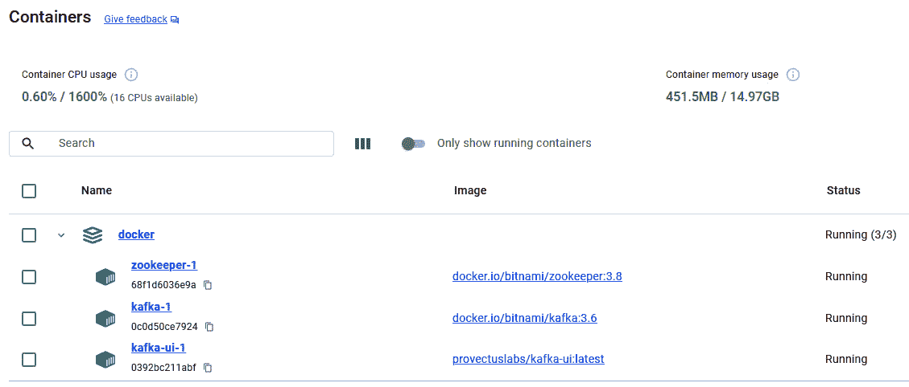

图 4.10：运行中的 Docker 容器

现在，我们已经准备好向前迈进，了解如何安装 Git，这是开发者工具箱中的必备工具。

# 理解和安装 Git

Git 是一种强大的 **版本控制系统**（**VCS**），用于软件开发。想象它就像你代码的时间机器。它跟踪你对项目所做的每一个更改，就像一本详细的日志簿。

使用 Git，您可以轻松地回滚到代码的先前版本，本质上撤销了任何错误。

它使协作变得容易。与团队一起工作？Git 允许每个人无缝协作。每个团队成员都可以在自己的项目部分工作，Git 帮助他们平滑地合并更改，避免冲突。

它还记录了所有更改的详细历史，让您可以确切地看到所做的修改以及由谁进行的。这对于跟踪进度和理解项目的发展历程至关重要。

Git 是我们在日常开发过程中使用的重要工具之一。您可以为任何流行的操作系统安装 Git，尤其是 Linux、Windows 和 Mac：

+   要获取关于 *Linux* 的更详细说明，请访问 [`git-scm.com/download/linux`](https://git-scm.com/download/linux)。在那里，您可以找到基于 Linux 发行版的 Git 安装程序。

+   与其他流行工具一样，我们在 *macOS* 上安装 Git 有多种选择。请访问 [`git-scm.com/download/mac`](https://git-scm.com/download/mac) 了解更多信息。

+   对于 *Windows*，我更喜欢使用 **Git for Windows** 工具。你可以从 [`gitforwindows.org/`](https://gitforwindows.org/) 下载它。此应用程序提供 Git Bash 和 Git GUI 功能（*图 4.11*）。你可以在整个开发过程中使用它们：

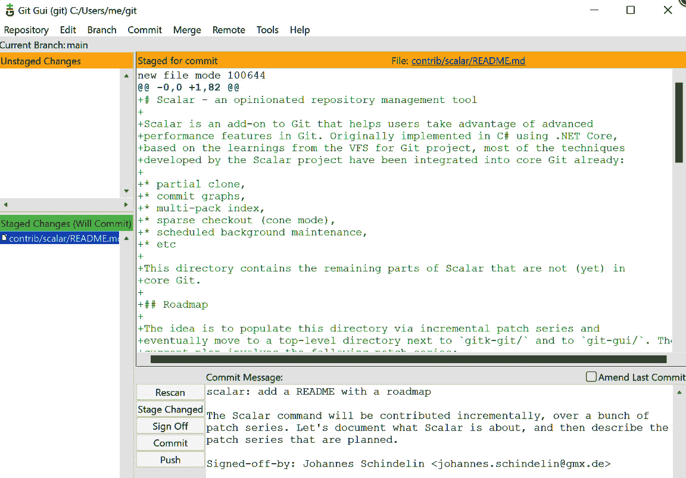

图 4.11：Git for Windows

我们还需要安装另一个工具。让我们继续我们的 Postman 安装之旅。

# 安装 Postman

本章我们将介绍的最后一种工具是 Postman。我们将构建许多 API，并且我们需要一些工具来快速轻松地测试它们。这是一个帮助开发者与 API 交互和测试的工具。

这是 Postman 帮助你做的事情：

+   **构建 API**：你可以使用 Postman 的工具设计和规划你的 API。

+   **测试 API**：发送请求（例如请求信息）并查看 API 的响应（你得到的信息）。这有助于确保 API 按预期工作。

+   **与 API 交互**：Postman 允许你轻松地向 API 发送不同类型的请求并查看结果。这就像拥有 API 的遥控器。

这是你可以安装它的方法：

1.  访问 [`www.postman.com/downloads/`](https://www.postman.com/downloads/)。

1.  点击你的操作系统名称并下载相关文件。

1.  安装它。

安装 Postman 后，打开它。此时，你可以在 URL 部分插入任何 URL。在那里，你还可以为该 URL 选择 HTTP 方法（`GET`、`POST`、`PUT` 等）并发送请求（*图 4.12*）：

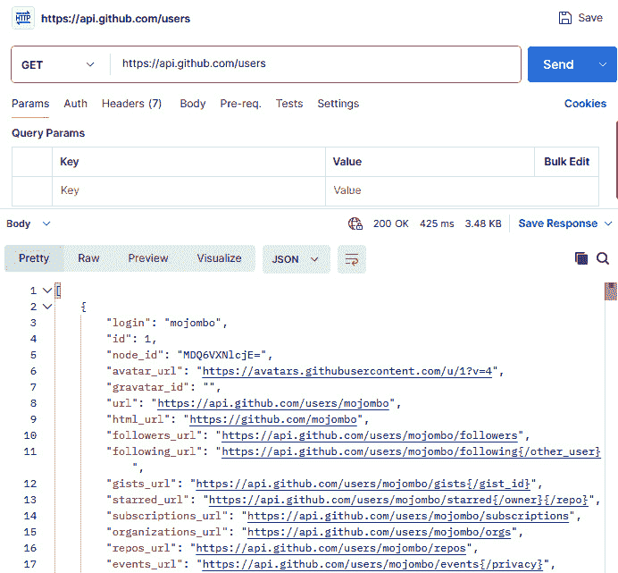

图 4.12：Postman 概览

因此，让我们继续本章的最后一个工具：MongoDB。

# 安装 MongoDB

MongoDB 是一个流行的 NoSQL 数据库。我们在开发微服务时会使用它，未来当你构建微服务时，它可能也是一个不错的选择。

你可以考虑 MongoDB 的以下特性：

+   **面向文档**：与传统的基于行和列的表格存储数据的数据库不同，MongoDB 使用灵活的类似 JSON 的文档来存储数据。这使得表示复杂的数据结构变得更容易。

+   **可扩展性**：MongoDB 通过水平扩展可以处理大量数据集和高流量应用程序。它是通过向数据库集群添加更多服务器来实现的。

+   **灵活的模式**：MongoDB 允许灵活的模式设计。集合内的文档可以有不同的结构。这对于存储不适合整齐的表格结构的数据库很有用。

+   **跨平台**：MongoDB 在各种操作系统上运行，包括 Windows、Linux 和 macOS。

+   **开源**：MongoDB 的核心服务器是开源的，并且免费使用，同时提供多种商业许可证，以提供额外的功能和支持。

要安装 MongoDB 服务器，只需导航到 [`www.mongodb.com/docs/manual/installation/`](https://www.mongodb.com/docs/manual/installation/) 并选择您的平台。在撰写本文时，您可以在 Linux、macOS、Windows 和 Docker 上安装它。MongoDB 有两个可用的版本：社区版和企业版。为了实验和测试，社区版将足够使用。

另一个用于与 MongoDB 交互的有用产品是 MongoDB Compass 应用程序。您可以在 [`www.mongodb.com/try/download/compass`](https://www.mongodb.com/try/download/compass) 找到它，并且它是免费的。您可以为不同的平台安装它：

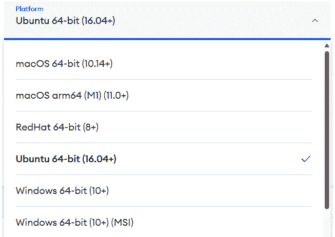

图 4.13：MongoDB Compass 支持不同的平台

MongoDB Compass 是一个免费、**图形用户界面**（**GUI**）工具，专门设计用于与 MongoDB 数据库交互。它本质上充当一个用户友好的客户端应用程序，简化了管理和处理您的数据。

您可以使用它进行以下目的：

+   **可视化数据**：Compass 允许您浏览集合，以清晰和有组织的格式查看文档，并探索您数据的结构。

+   **查询**：您可以直接在 Compass 中编写和执行查询，以过滤和从您的 MongoDB 数据库中检索特定数据。

+   **构建复杂查询**：Compass 提供了一个可视化界面来构建聚合管道，这些是转换和分析您数据的强大工具。

+   **CRUD 操作**：Compass 允许您轻松

+   **在您的集合中创建、读取、更新和删除**（**CRUD**）文档。

+   **模式分析**：Compass 通过提供模式可视化来帮助您理解您数据内部的结构和关系。

+   **索引优化**：Compass 可以推荐并协助在您的集合上创建索引以优化查询性能。

+   **连接管理**：Compass 允许您连接到各种 MongoDB 部署，包括本地服务器、云实例和容器。

总体而言，MongoDB Compass 提供了一种用户友好且直观的方式来与您的 MongoDB 数据库交互。它是数据库管理员、开发人员以及任何需要探索、分析和管理其 MongoDB 数据的人的有价值工具。

# 摘要

拥有一个准备良好的开发环境对于顺利和高效的软件开发过程至关重要。通过事先安装必要的工具和程序，您可以消除在开发过程中寻找它们的需要，节省宝贵的时间。一个配置好的环境确保了一致的工作流程。您确切地知道您的文件在哪里，如何运行它们以及要使用哪些命令。这减少了认知负荷，让您能够专注于编码。

在整个项目中使用相同的工具有助于保持代码风格和一致性。这使得代码更容易阅读、理解和维护，无论是对于您自己还是其他人。

当团队中的每个人都使用相同的开发环境时，协作变得更加顺畅。他们可以轻松地共享代码、解决问题，并理解彼此的工作。

在本章中，我们讨论了在开始我们的开发之旅之前需要安装的工具。当然，我们还没有安装所有工具，但主要工具都在这里。我们将在未来的章节中根据需要介绍额外的工具，确保安装过程简单明了。

如果你在这里，那么恭喜你！从下一章开始，我们将深入探讨微服务开发的实践细节。

# 第二部分：构建和管理微服务

在本部分，我们将深入探讨使用 JavaScript 构建微服务的实际方面。我们将从创建一个基本的 CRUD（创建、读取/检索、更新、删除）微服务开始，然后继续探讨更高级的概念，例如服务之间的同步和异步通信。我们还将涵盖实时数据流，这对于创建响应性和动态的应用程序至关重要。

本部分包含以下章节：

+   *第五章*，*基本的 CRUD 微服务*

+   *第六章*，*同步微服务*

+   *第七章*，*异步微服务*

+   *第八章*，*使用微服务的实时数据流*
