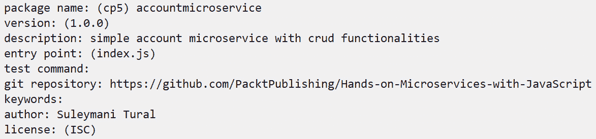
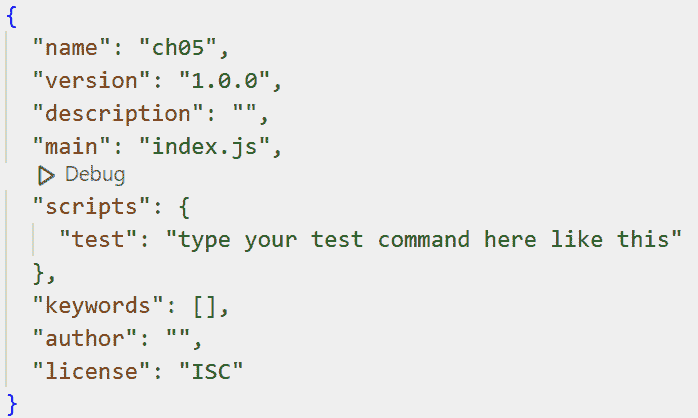
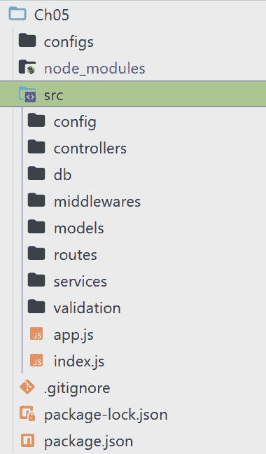

# 5

# 基本 CRUD 微服务

我们前面的章节证明了微服务开发不仅仅是关于实现。你需要至少清楚地了解与其他方法相比（如我们在前几章中看到的单体和面向服务的），使用微服务的优缺点，并且你需要对你构建微服务时想要应用的技术有一个基本的理解。

将你所有的理论知识应用到实践中也不是一件容易的事情。本章将帮助我们应用微服务到实践中，并且是迈向现实世界微服务实施的一步。在本章中，我们计划为后续的实践章节提供一个坚实的基础。

在你的项目中实施微服务方法意味着你大部分时间都在处理一个复杂的企业领域，你的微服务的概念边界要求你实现这部分复杂逻辑的一部分。这表明微服务开发不仅仅是**创建**、**检索/读取**、**更新**、**删除**（**CRUD**），而且需要对微服务应用程序结构有一个基本的了解，本章是一个良好的起点。

我们将探讨以下主题：

+   理解业务需求

+   开发基本微服务的工具

+   准备我们的第一个项目

+   定义我们微服务的内部架构

+   实践账户微服务开发

+   运行和测试我们的第一个微服务

让我们开始吧！

# 技术需求

要开发和测试我们的第一个微服务，我们需要以下工具：

+   选择你喜欢的 IDE（我们更喜欢 Visual Studio Code）

+   Postman

+   MongoDB

+   选择你喜欢的浏览器

建议您从[`github.com/PacktPublishing/Hands-on-Microservices-with-JavaScript`](https://github.com/PacktPublishing/Hands-on-Microservices-with-JavaScript)文件夹下载本书的 GitHub 仓库，以便轻松跟随我们的代码片段。

# 理解业务需求

在你用 JavaScript 构建微服务之前，清楚地了解你的服务需要做什么非常重要。然后，根据你的项目需求，你可以选择合适的工具来帮助你创建这些微服务。

团队不仅仅由开发者组成。在构建具有商业价值的应用程序时，业务领域的人也是团队不可或缺的一部分。在软件开发中，最终和主要的产品是代码，它应该反映真实的业务。应用大家都能使用的领域语言将使你的代码成为宝贵的真相来源，而这只有在业务和开发者之间没有翻译的情况下才可能实现。开发这种类型微服务最流行的方法是用大家都能说的同一种语言，这种方法被称为**领域驱动设计**（**DDD**）。团队中的每个人都应该使用描述给定边界的业务的语言。这被称为**通用语言**（**UL**）。使用 UL，团队中的每个人都会说同一种语言，这种语言将反映在你的代码中。这意味着业务帮助你设计，开发者帮助业务有更清晰的理解。

在我们的学习过程中，我们会提到一些来自领域驱动设计（DDD）的想法，尽管这不是一本 DDD 书籍。请参考 Vaugh Vernon 的《实现领域驱动设计》（Implementing Domain-Driven Design）和 Eric Evans 的《领域驱动设计：软件核心的复杂性处理》（Domain-Driven Design: Tackling Complexity in the Heart of Software）以了解更多信息。

这本书不是关于分析和收集业务需求的。外面确实有很好的资源专注于这个话题。为了使事情简单化并减少理论性，我们将从提炼出的具有明确边界的业务需求开始。

我们将构建一个需要以下*核心功能*的账户构建微服务：

+   创建账户

+   更新账户

+   获取所有账户信息

+   根据给定的 ID 获取账户

+   删除未使用的账户

然后，我们还有以下以下*非功能性*要求：

+   **可伸缩性**：随着越来越多的人使用，微服务应该能够处理越来越多的请求。

+   **性能**：微服务应该快速响应用户请求，以保持用户满意。

+   **弹性**：微服务应该能够从问题中恢复过来，并保持正常工作。

+   **易于测试**：微服务应该简单易测试，以确保其正确工作。

+   **无状态**：微服务不应该依赖于记住与用户的过去交互，而应该将任何重要信息存储在数据库中。

+   **易于更新**：微服务应该简单易用，并在需要时进行更新。当然，通常你会有比这些更多的非功能性要求。然而，为了入门，这些应该已经足够了。

# 开发基本微服务所需的工具

开发应用程序不仅仅是编码过程。在本章中，为了开发我们的微服务，我们还需要选择 Node.js 框架并在我们的数据库中存储信息：

+   **数据库**：我们需要将信息存储在某个地方。最好是保持服务本身简单，并将信息存储在单独的数据库中：

    对于这项服务，我们将使用 *MongoDB*，这是一个与传统 SQL 数据库工作方式不同的流行数据库。MongoDB 是使用 Node.js 技术构建 Web 服务的流行选择。

    它旨在处理用户主要读取信息的情况，并且可以高效地存储大量数据。MongoDB 可以通过添加更多服务器轻松扩展。

+   **Node.js 框架**：您可以使用 Node.js 构建一个功能齐全的微服务，但这需要一些时间和大量的代码行。如今，大多数开发者使用 Node.js 框架来快速构建服务，同时代码行数最少。Node.js 本身是一个低级环境。框架为您提供了预定义的结构和组织，使得随着项目的发展，代码更容易管理和维护。它们通常内置了常见的功能，如 *路由*（处理不同的 URL 请求）、*模板*（生成网页内容）和数据库交互。这可以节省您自己编写这些部分的时间。

    流行的 Node.js 框架拥有庞大的开发者社区。这意味着如果您遇到问题，可以在线访问丰富的资源、教程和解决方案。还有更多熟悉该框架的开发者，可以用于潜在的协作。

    框架可以通过提供既定的编码实践和功能来防止常见攻击，从而帮助减轻安全漏洞。

对于本章，我们将使用 *Express.js*，这是构建微服务中最受欢迎的 Node.js 框架之一。

# 准备我们的第一个项目

本章的重点是创建一个提供真正简单 CRUD 操作的微服务。因此，它将主要关注领域。这就是为什么我们从数据库开始构建应用程序。

要跟随我们的示例，请打开本书 GitHub 仓库中的`Ch05`文件夹，并使用您喜欢的文本编辑器打开它。

*知道路径和走过路径是不同的*。

我们希望您不仅下载并探索仓库，还尝试与我们一起编写一些代码。这将帮助您获得宝贵的实践经验。

## 理解包的概念

构建软件并不意味着您应该从头开始实现一切，这一事实并不取决于编程语言。它也适用于 Node.js 开发。我们始终应该关注解决业务问题，并使这个过程快速、简单、安全、可靠。几乎每种流行的编程语言都提供了一组库。在 Node.js 中，这些被称为 **包**。Node.js 开发通常从包配置开始。

当你安装 Node.js 时，你将自动安装 `npm`，这是一个优秀且可靠的开发资源。例如，如果你需要为你的应用程序进行验证，你不需要从头开始构建一切。为什么不使用已经在流行库中实现过的流行实践呢？我们通常只自己构建业务特定的功能。其他相关功能，如连接数据库、验证、安全、日志记录等，可以作为包安装并重用。

这就是如何与 `npm` 交互并配置它的方法：

1.  打开你喜欢的文本编辑器（我们使用 Visual Studio Code）。

1.  创建一个文件夹（在我们的例子中，是 `Ch05`）。

1.  使用你的终端导航到该文件夹（使用 `cd folder_name` 命令导航到你的空文件夹——即使用 `cd Ch05`）。

1.  输入 `npm init` 并遵循提供的说明（*图 5.1*）：



图 5.1：创建 package.json 文件

1.  按 *Enter* 生成 **配置** **包** (*package.json*)。

1.  到目前为止，我们在项目中有一个特殊的文件叫做 `package.json`，包含以下 JSON 内容：

    ```js
    {
      "name": "accountmicroservice",
      "version": "1.0.0",
      "description": "simple account microservice with crud functionalities",
      "main": "index.js",
      "scripts": {
        "test": "echo \"Error: no test specified\" && exit 1"
      },
      "repository": {
        "type": "git",
        "url": "git+https://github.com/PacktPublishing/Hands-on-
                 Microservices-with-JavaScript.git"
      },
      "author": "Suleymani Tural",
      "license": "ISC",
      "bugs": {
        "url": "https://github.com/PacktPublishing/Hands-on-
                 Microservices-with-JavaScript/issues"
      },
      "homepage": "https://github.com/PacktPublishing/Hands-on-
                    Microservices-with-JavaScript#readme"
    }
    ```

1.  对于学习目的，也可以使用 `npm init -y` 命令代替 `npm init`，因为它会为你生成一个最小的 `package.json` 文件以便你开始使用（*图 5.2*）。生成后，你可以手动更新任何你想要的行：



图 5.2：生成的 package.json 文件

让我们更深入地了解 `package.json` 文件。

## 理解 package.json 文件

`package.json` 文件是 Node.js 项目中的一个重要组成部分。它就像一个项目清单，存储有关你的项目的关键信息。

让我们总结一下 `package.json` 文件在我们 Node.js 项目中的作用：

+   它列出了你的项目为了运行所依赖的所有外部模块（依赖项）。

+   除了名称外，它还使用语义版本控制来指定所需的版本，以确保所有参与项目的人都使用兼容的依赖项版本。

+   它作为项目元数据（如项目的名称、版本、描述、许可证和作者信息）的中心位置（见 *图 5.2*）。

+   你可以在 `package.json` 文件中定义自定义脚本来自动化项目中的重复性任务。这些脚本可以从启动开发服务器到运行测试或构建项目以部署做任何事情。

+   如果你计划将你的项目作为可重用的包发布供他人使用，`package.json` 就变得更加重要。它为包管理器（如 `npm`）提供了理解如何有效安装和使用你的项目所必需的信息。

简而言之，`package.json` 使你的项目井然有序，确保依赖项的一致性，并简化了开发者之间的协作。

## 理解 index.js 文件

在本章中，你将遇到名为 `index.js` 的文件。这些文件扮演着几个重要的角色。

按照惯例，`index.js` 作为我们的 Node.js 应用的入口点。当我们使用 node 运行应用时，`index.js` 文件是应用执行开始的起点。

在 `index.js` 中，你可以通常找到使用所需语句导入必要模块和库的代码，以配置你的应用（例如，设置 Web 服务器和连接到数据库）并定义应用的主逻辑或事件监听器。

这些文件也可以用于在项目中进行命名空间和组织。考虑一个包含多个具有相关功能的 JavaScript 文件的文件夹。该文件夹中的 `index.js` 文件可以作为导入这些相关文件和从这些文件中重新导出特定函数或类的中心点，使得它们可以通过单个导入语句在文件夹外部访问。

注意

需要注意的是，`index.js` 只是一种惯例，并非严格的要求。你可以将入口点文件命名为不同的名称（例如，`app.js` 或 `main.js`）。只要你在使用 node 运行应用时指定了正确的文件名，它就会正常工作。

总结来说，`index.js` 文件在 Node.js 项目中充当一个常见的入口点，以及一种在文件夹内组织代码的方式。它们提供了一种干净且一致的方法来构建应用起点和管理相关功能。

## 安装所需的包

单独来看，`package.json` 不包含我们计划默认使用的任何必需包。它只是启动时的模板。以下是本章我们将使用的包及其安装命令列表：

+   Express (`npm install express`)

+   Joi (`npm install joi`)

+   mongoose (`npm install mongoose`)

+   dotenv (`npm install dotenv –save`)

下面是 `package.json` 文件中的依赖项和 `devDependencies` 的样子：

```js
"dependencies": {
    "dotenv": "¹⁶.4.5",
    "express": "⁴.19.2",
    "joi": "¹⁷.12.3",
    "mongoose": "⁸.3.2"
  }
```

你可能已经意识到，当我们安装第一个包时，node 会自动生成另一个名为 `package-lock.json` 的文件。让我们总结一下它的作用：

它作为一个锁文件，指定了安装的包及其依赖的确切版本。这保证了无论谁安装项目或在哪里安装，都将使用相同的版本集，从而确保行为的一致性。

通过锁定版本，`package-lock.json` 允许开发者精确地重现项目环境。这对于维护稳定性和避免在部署期间或不同开发机器上出现意外问题至关重要。

当在团队中共享或在 `package-lock.json` 中使用时，确保所有相关人员都在使用相同的依赖项。这简化了协作并自动化了可靠的构建。

它与 `package.json` 一起工作。虽然 `package.json` 指定了所需的依赖项及其版本范围，但 `package-lock.json` 确定了安装过程中使用的确切版本。

总体而言，`package-lock.json` 对于在安装和团队工作流程中维护一致的、可重复的 Node.js 项目环境非常重要。

你可能已经注意到我们还有一个额外的文件夹：`node_modules`。在 Node.js 项目中，`node_modules` 文件夹是一个特殊的目录，用于存储项目依赖的所有第三方库。这些库提供了预先编写的代码，用于实现你不需要从头开始构建的功能，从而节省时间和精力。

Node.js 项目通常依赖于来自各种来源的外部代码。`node_modules` 文件夹将所有这些依赖项组织在一个地方。每个项目都可以有自己的依赖项集合，以满足其特定需求。这样，不同的项目可以使用同一库的不同版本，而不会发生冲突。

到目前为止，我们已经为我们的应用程序构建了一个初始框架。因此，现在是时候开始实际开发过程了。

# 定义我们微服务的内部架构

想象一下，经过仔细分析后，我们决定有一个专门负责处理账户信息的特殊微服务，我们称之为 *账户微服务*。我们的账户包括一个 *ID*、*账户名称*、*账户类型*、*账户状态* 和 *账户号码*。为了跟踪更改，我们将添加 `createdAt` 和 `updatedAt` 字段。

微服务方法已应用于我们的整个项目，现在我们拥有多个服务。然而，我们具体微服务的内部设计取决于需求，并且由团队决定应用哪种架构模式。软件开发中最受欢迎和经典的架构模式之一是 **模型-视图-控制器**（**MVC**）。为了使事情简单易懂，我们将将其应用于我们的微服务设计。

## MVC 架构模式

MVC 架构模式由于其强调关注点的分离，是结构化 Node.js API 的流行选择。

它具有以下主要组件：

+   **模型**：

    +   表示 API 的数据层。

    +   封装数据访问逻辑并与数据库（例如 MongoDB、MySQL 等）交互。

    +   处理数据持久性和检索。

+   **视图**（在 Node.js API 中不直接使用）：

    +   传统上处理 Web 应用程序中的 UI 呈现。

    +   不直接适用于 Node.js API，因为它们以数据为中心。

    +   注意，*视图* 的概念可以扩展到表示 API 的响应格式（JSON、XML）。

+   `GET`、`POST`、`PUT` 和 `DELETE`）。

+   与模型交互以根据请求获取或操作数据。

+   准备以所需格式（JSON、XML）的数据响应。

+   向客户端返回响应。

但为什么使用 MVC 对 Node.js API 有益？

+   **关注点分离**：通过划分功能使代码更有组织和易于维护。

+   **提高可测试性**：每个层（模型、视图和控制器）都可以独立测试。

+   **灵活性**：更容易修改或更新 API 的特定部分，而不会影响其他部分。

+   **可扩展性**：通过添加更多控制器或模型更容易扩展应用程序。

现在我们已经对 MVC 有了足够的理论知识，是时候将其应用于实践了。

## 将 MVC 集成到我们的 Node.js 项目中

虽然 Node.js 没有内置的 MVC 框架，但像*Express.js*这样的流行 Web 框架可以用来实现该模式。Express.js 处理路由（将 URL 映射到控制器）并简化请求-响应处理。

您通常会使用为模型和控制器分别创建的单独文件夹来结构化项目。

我们将使用*N 层架构*来结构化我们的代码。这种架构之所以受欢迎，是因为它促进了关注点的分离，使应用程序更加模块化、易于维护和可扩展。

由于我们没有复杂的需求，因此从它开始是一个很好的起点。在您的 Node.js Express 项目中同时使用 MVC 和 N 层架构可以导致一个结构良好且易于维护的 API。以下是一些您可能会遇到的一些常见层：

+   表示层（UI 或 API）

+   业务逻辑层（核心应用程序逻辑）

+   数据访问层（与数据库的交互）

模型，代表数据和其逻辑，与数据访问层的责任相一致。`services`文件夹中的脚本将存储我们的业务逻辑。控制器，它处理请求并操作数据，不应包含任何业务逻辑。相反，它应该作为一个桥梁，将用户的请求转发到业务逻辑层。

现在我们已经为我们的应用程序定义了一个通用的架构，我们准备专注于实现细节。从下一节开始，我们将实现第一个微服务的功能行为。

# 实践开发账户微服务

要从头开始，让我们创建一个名为`src`的文件夹。我们计划在这个文件夹下组织我们的主要应用程序结构。这将是一个以数据为中心的应用程序，因此最好从数据库部分开始开发。

最后，我们计划为我们的应用程序构建以下项目结构：



图 5.3：最终项目结构

为了轻松跟随，别忘了从我们的仓库下载源代码。

## 实现我们的数据访问功能

我们总是将数据存储在某个地方。最常用的数据存储是数据库。我们计划实现的数据访问依赖于 MongoDB，并使我们免于使用 SQL 查询数据库的困难。它就像使用数组或列表，但在底层，它与数据库交互。

要开始创建我们的账户微服务，请执行以下操作：

在 `src` 下创建一个 `db` 文件夹。

1.  将 `index.js` 文件添加到 `db` 文件夹中。

1.  首先，我们需要处理数据库通信过程。这就是为什么我们的当前文件 (`index.js`) 将提供连接和断开连接的功能：

    ```js
    const db = require('mongoose');
    let mongoUrl;
    async function connect({ mongo: { url } }) {
        mongoUrl = url;
        try {
            await db.connect(mongoUrl);
        } catch (err) {
            setTimeout(connect, 8000);
        }
    }
    const dbConnection = db.connection;
    function disconnect() {
        dbConnection.removeAllListeners();
        return db.disconnect();
    }
    module.exports = {
        connect,
        disconnect,
    };
    ```

    我们已经提到了 `mongoose` 包。为了使用这样的包，我们有 `required` 命令。Node.js 会自动处理 `node_modules` 文件夹中的包，无需指定任何相对或完整路径。

    在这里，我们实现了两个主要功能。它们主要作为现有功能的包装器：

    +   `connect` 函数尝试连接到指定的数据库。如果出现错误，我们将在 `8` 秒后再次尝试连接到数据库。这取决于你如何配置，但在不成功操作后进行连接尝试是有意义的。

    +   `disconnect` 函数处理断开连接的情况。在这里，我们通过 `db.disconnect()` 手动移除我们数据库的所有监听器。

    Node.js 有一个基于文件的模块方法。这意味着每个文件本身都可以被视为一个模块，其他模块可以使用它来构建更复杂的模块。你可以通过使用 `exports` 来使模块的一些功能对其他人可用。你应该只提供以下适当封装的所需函数。如果你的某些函数被同一模块中的其他函数使用，并且它们不是模块合同的一部分，那么最好不要在 `exports` 列表中指定它们。在我们的例子中，我们有两个函数 – `connect` 和 `disconnect` – 我们提供外部使用，以便其他模块使用。

## 实现 MVC 中的 M

在我们的项目中，模型的责任是充当数据访问层。这一层涵盖了主要操作，如 `INSERT`、`UPDATE`、`SELECT` 和 `DELETE`。我们在 `src/models` 文件夹下有 `account.js`；这就是所有数据库相关功能所在的地方。下面是这个文件的样子：

```js
const mongoose = require('mongoose');
const { Schema } = mongoose;
const AccountSchema = new Schema(
    {
        name: {
            type: String,
            required: true,
        },
        number: {
            type: String,
            required: true,
        },
        type: {
            type: String,
            enum: ['root', 'sub'],
            default: 'root',
        },
        status: {
            type: String,
            enum: ['new', 'active', 'inactive', 'blocked'],
            default: 'new',
        },
        createdAt: {
            type: Date,
            default: Date.now,
        },
        updatedAt: Date,
    },
    { optimisticConcurrency: true },
);
module.exports = mongoose.model('account', AccountSchema);
```

让我们逐步分析这段代码：

+   `const mongoose = require('mongoose');`: 这一行导入了 Mongoose 库，该库用于在 Node.js 中与 MongoDB 数据库交互。

+   `const { Schema } = mongoose;`: 这一行使用解构从 `mongoose` 对象中提取 `Schema` 类。这使得代码更加简洁，更容易阅读。

+   `new Schema({ ... })`: 这一行创建了一个新的 Mongoose 架构对象。作为参数传递的对象定义了将在 MongoDB 数据库的账户集合中存储的文档的结构。在大括号 `{}` 内，你定义了集合中每个文档的属性（字段）。以下是每个属性的分解：

    +   `name`:

        +   `type: String`: 这指定了 `name` 属性应该是一个字符串。

        +   `required: true`: 这使得 `name` 属性是必需的。没有名称值的文档无法保存。

    +   `number`: 与 `name` 类似，但也是必需的。

    +   `type`:

        +   `type: String:` `status`属性是一个字符串。

        +   `enum: ['new', 'active', 'inactive', 'blocked']`：类似于`type`，这定义了状态允许值的列表：`'new'`、`'active'`、`'inactive'`或`'blocked'`。

        +   `default: 'new'`：如果没有指定状态，它将默认为`'new'`。

    +   `createdAt`：

        +   `type: Date`: 此属性存储文档创建的日期和时间，使用当前时间（`Date.now`）。

    +   `updatedAt`：

        +   `type: Date:` 此属性旨在存储文档最后更新的日期和时间。然而，它在此处并未显式设置默认值。你很可能需要在应用程序逻辑中手动更新此字段。

    +   `{ optimisticConcurrency: true }`：此选项用于乐观并发控制，这是一种帮助防止更新期间数据不一致的机制（[`mongoosejs.com/docs/guide.html#optimisticConcurrency`](https://mongoosejs.com/docs/guide.html#optimisticConcurrency)）。

+   `module.exports = mongoose.model('account', AccountSchema);`：这一行创建了一个基于你定义的`AccountSchema`的 Mongoose 模型，名为`account`。该模型作为与 MongoDB 数据库中的`account`文档交互的蓝图。通过导出模型，你使它在 Node.js 应用程序的其他部分可用。

简而言之，这段代码为在 MongoDB 集合中存储账户信息设置了一个 Mongoose 模式。它定义了诸如`name`、`number`、`type`、`status`、`创建时间`和`最后更新时间`等属性，并具有验证规则和默认值。然后，代码导出一个模型，允许你在数据库中创建、读取、更新和删除账户文档。

## 存储配置

我们需要将应用程序相关的配置存储在某个地方。对于当前情况，我们需要 MongoDB 的 URL 和端口信息。直接将此信息硬编码到代码中并不是一个好主意，因为这会影响可维护性、可重用性和可扩展性。相反，我们更倾向于将其存储在一个单独的文件中。这就是为什么我们安装了`dotenv`包。

Node.js 中的`dotenv`包帮助你管理项目中的环境变量。它提供了一种将配置设置（如 API 密钥或数据库凭据）存储在代码之外，在`.env`文件中的方法。这通过将敏感数据从代码库中排除来提高安全性。

为什么使用`dotenv`？

+   **安全性**：它将敏感数据从代码库中排除，降低了意外暴露的风险

+   **关注点分离**：它将配置与代码分离，使你的代码更干净且易于管理

+   为不同环境（开发、测试和生产）创建具有特定配置的`.env`文件

`.env` 文件本身不应包含在版本控制系统（如 Git）中，以避免提交敏感信息。我们可以创建一个包含占位符值的 `.env.example` 文件，以指导开发者如何设置他们的环境变量。然而，对于这本书，我们将以原样将 `.env` 文件包含在我们的 Git 仓库中，以方便学习过程。

我们在 `Ch05` 文件夹下有一个 `configs` 文件夹。它是一个根级文件夹，包含一个无名的 `.env` 文件。以下是其内容：

```js
PORT=3001
MONGODB_URL=mongodb://localhost:27017/account-microservice
```

我们需要根据我们查看的配置进行验证和创建配置对象。这就是为什么我们需要在 `src` 文件夹下创建一个名为 `config` 的额外文件夹。所以，让我们创建 `config.js` 并包含以下内容：

```js
const dotenv = require('dotenv');
const Joi = require('joi');
const envVarsSchema = Joi.object()
    .keys({
        PORT: Joi.number().default(3000),
        MONGODB_URL: Joi.string().required().description('Mongo DB url')
    })
    .unknown();
function createConfig(configPath) {
    dotenv.config({ path: configPath });
    const { value: envVars, error } = envVarsSchema
        .prefs({ errors: { label: 'key' } })
        .validate(process.env);
    if (error) {
        throw new Error(`Config validation error: ${error.message}`);
    }
    return {
        port: envVars.PORT,
        mongo: {
            url: envVars.MONGODB_URL,
        }
    };
}
module.exports = {
    createConfig,
};
```

使用 `createConfig` 函数，我们能够读取和构建配置对象。

有很多包可以用于数据验证。我们更喜欢使用 Joi，因为它受欢迎且易于使用。Joi 是一个流行的开源包，它提供了一种声明式的方式来定义数据模式并对这些模式进行验证。

它允许你创建代表应用程序输入（请求体、查询参数等）预期结构和数据类型的 JavaScript 对象。

它为常见的字符串、数字、数组和对象等数据类型提供了一系列验证规则。你可以定义存在性、格式、长度等规则。

它与 Express.js 中间件无缝集成，允许你在路由处理程序中直接验证数据。

通过将验证逻辑从你的路由处理程序中分离出来，你的代码变得更干净、更容易理解。

总体而言，Joi 是构建健壮和安全的 Node.js 应用程序的有价值工具。通过结合 Joi 进行数据验证，你可以确保你的应用程序接收干净、可靠的数据，从而带来更稳定和安全的开发体验。

我们将在我们的应用程序入口点 (`src/index.js`) 中使用它。

## 实现业务层

业务层是 N 层架构的核心。它负责应用程序的核心功能，并实现了管理应用程序操作的具体业务规则。它将用户请求转换为基于业务规则的动作和决策。它还确定如何处理、验证和操作数据以满足这些请求。此外，它作为表示层（用户界面）和数据访问层（数据库）之间的中介。它从表示层接收数据请求，从数据访问层检索必要的数据，然后在返回处理后的数据之前应用业务逻辑。

通过将业务逻辑与表示层和数据访问层分离，业务层促进了松散耦合和可重用性。这使得应用程序更容易维护、测试和修改，因为业务需求不断变化。

我们在`src`下有一个`services`文件夹，用于物理定位服务功能。在`account.js`中，我们主要拥有五个函数来覆盖与 CRUD 相关的主要操作：`getAccountById`、`getAllAccounts`、`createAccount`、`deleteAccountById`和`updateAccountById`。让我们看看前四个：

```js
const Account = require('../models/account');
//get account info by id
function getAccountById(id) {
    return Account.findById(id);
}
//get all account information
function getAllAccounts() {
    return Account.find({});
}
//create account based on name,number,type and status
function createAccount(name, number, type, status) {
    return Account.create({ number, name, type, status });
}
//delete account by account id
async function deleteAccountById(id) {
    const deletedAccount = await Account.findByIdAndDelete(id);
    if(deletedAccount)
     return true;
     else
     return false;
 }
```

前四个函数很容易理解。使用`require`，我们从模型中导入我们的账户。然后，我们用业务函数包装我们的数据访问操作。这个模块中最大的函数是`updateAccountById`。让我们仔细看看：

```js
//'new', 'active', 'inactive', 'blocked'
const availableAccountStatusesForUpdate = {
    new: ['active', 'blocked'],
    active: ['inactive', 'blocked'],
    inactive: ['active'],
    blocked: ['active'],
};
//'root', 'sub'
const availableAccountTypesForUpdate = {
    root: ['sub'],
    sub: ['root'],
};
const NO_VALID_DATA_TO_UPDATE = 0;
const INVALID_STATUS_CODE = 1;
const INVALID_TYPE_CODE = 2;
const INVALID_ACCOUNT = 3;
const INVALID_STATE_TRANSITION = 4;
const INVALID_TYPE_TRANSITION = 5;
async function updateAccountById(id, { name, number, type, status }) {
    if (!name && !number && !type && !status) {
        return { error: 'provide at least one valid data to be 
          updated', code: NO_VALID_DATA_TO_UPDATE };
    }
    if (status && !(status in availableAccountStatusesForUpdate)) {
        return { error: 'invalid status for account', code: INVALID_
          STATUS_CODE };
    }
    if (type && !(type in availableAccountTypesForUpdate)) {
        return { error: 'invalid type for account', code: INVALID_
          TYPE_CODE };
    }
    const account = await Account.findById(id);
    if (!account) {
        return { error: 'account not found', code: INVALID_ACCOUNT };
    }
    //check for available status and transition
    if (status) {
    const allowedStatuses = 
        availableAccountStatusesForUpdate[
            account.status];
        if (!allowedStatuses.includes(status)) {
            return {
                error: `cannot update status from '${account.status}' 
                  to '${status}'`,
                code: INVALID_STATE_TRANSITION,
            };
        }
    }
    //check for available type and transition
    if (type) {
        const allowedTypes = availableAccountTypesForUpdate[account
          .type];
        if (!allowedTypes.includes(type)) {
            return {
                error: `cannot update type from '${account.type}' to 
                  '${type}'`,
                code: INVALID_TYPE_TRANSITION,
            };
        }
    }
    account.status = status ?? account.status;
    account.type = type ?? account.type;
    account.name = name ?? account.name;
    account.number = number ?? account.number;
    account.updatedAt = Date.now();
    await account.save();
    return account;
}
```

最后，我们需要导出所需的代码块，以便其他服务可以使用：

```js
module.exports = {
    getAccountById,
    getAllAccounts,
    createAccount,
    updateAccountById,
    deleteAccountById,
    errorCodes: {
        NO_VALID_DATA_TO_UPDATE,
        INVALID_STATUS_CODE,
        INVALID_TYPE_CODE,
        INVALID_ACCOUNT,
        INVALID_STATE_TRANSITION,
        INVALID_TYPE_TRANSITION,
    },
};
```

在更新我们的账户信息之前，我们有以下检查：

+   只有当提供一个字段时才允许更新发生。

+   如果提供了无效的状态代码，则返回错误。

+   如果提供了无效的类型，则返回错误。

+   如果给定 ID 的账户不存在，我们需要返回错误。

我们有一些规则来更新状态。首先，`availableAccountStatusesForUpdate`描述了规则：如果状态是`new`，则可以更新为`active`或`blocked`。对于`active`，可以更新为`inactive`和`blocked`。如果状态是`inactive`，则只允许更新为`active`。`blocked`状态只能过渡到`active`。

这些并不是你可以实现的所有可能的验证，但它们展示了你可以如何应用检查逻辑来更新功能。最终，我们公开带有错误代码的函数供上层使用。

## 实现控制器

在使用 MVC 模式的 Node.js 项目中，控制器充当中枢神经系统，处理用户请求并协调应用程序的响应。它是用户请求的第一个接触点。它解释 URL、HTTP 方法（`GET`、`POST`等）以及请求中包含的任何参数。控制器本质上不实现业务逻辑；相反，它根据请求指导应用程序的流程。它可能需要与模型交互以检索或操作数据，或者它可能在继续之前执行一些基本的验证或处理。

控制器与模型交互以获取满足用户请求所需的数据。这可能涉及从数据库中获取数据、执行计算或模型层中定义的任何其他操作。

一旦控制器有了数据或处理了请求，它就会选择适当的视图来渲染经典 UI 应用程序的响应。它也可能准备数据，以便它可以被视图消费，例如将其格式化为特定的模板。在我们的情况下，我们没有完整的 UI，我们的数据 JSON 表示充当我们的 UI。

最后，控制器生成响应并发送给用户。这可能是一个 HTML 页面，API 的 JSON 数据，或任何适合请求的格式。

从本质上讲，控制器充当中间人，管理用户（通过视图）和数据层（通过模型）之间的通信流程。它保持视图和模型分离，促进更干净的代码和更易于维护。

为了在我们的项目中实现控制器机制，我们需要在 `src` 文件夹下创建一个名为 `controllers` 的文件夹，并添加一个名为 `account.js` 的新 JavaScript 文件：

```js
const accountService = require('../services/account');
const getAccounts = async (req, res) => {
    const result = await accountService.getAllAccounts();
    res.status(200).json({ success: true, account: result.map(x => 
      mapToResponse(x)) });
};
const createAccount = async (req, res) => {
    const { name, number, type, status } = req.body;
    const result = await accountService.createAccount(name, number, 
      type, status);
    res.status(201).json({
        success: true,
        Account: mapToResponse(result),
    });
};
const deleteAccountById = async (req, res) => {
    const isDeleted = await accountService.deleteAccountById(req
      .params.id);
    if(isDeleted)
     res.status(204).json({
         success: true
     });
     else
     res.status(400).json({ success: false, message: 'No valid data to 
       delete' });
 };
```

实现检索（get）、创建和删除账户时事情很简单。然而，当我们更新账户信息时，我们应该考虑一些额外的因素：

首先，`getAccounts` 调用 `getallAcccounts` 服务函数并返回 `200` 响应。

然后，`createAccount` 调用服务中同名函数并返回 `201`，这意味着资源已被创建。

最后，`deleteAccountById` 调用服务中同名函数并返回 `204`，这意味着无内容的成功。如果删除操作失败，它将返回 `400` 状态码。

接下来，让我们看看更新实现：

```js
const updateAccountById = async (req, res) => {
    const result = await accountService.updateAccountById(
      req.params.id, req.body);
    if (result.error) {
        switch (result.code) {
            case accountService.errorCodes.NO_VALID_DATA_TO_UPDATE:
                res.status(400).json({ success: false, message: 
                  result.error });
                return;
            case accountService.errorCodes.INVALID_STATUS_CODE:
                res.status(400).json({ success: false, message: 
                  'invalid status' });
                return;
            case accountService.errorCodes.INVALID_TYPE_CODE:
                res.status(400).json({ success: false, message: 
                  'invalid type' });
                return;
            case accountService.errorCodes.INVALID_ACCOUNT:
                res.status(404).json({ success: false, message: 
                  'Account not found' });
                return;
            case accountService.errorCodes.INVALID_STATE_TRANSITION:
                res.status(400).json({ success: false, message: 
                  result.error });
                return;
            case accountService.errorCodes.INVALID_TYPE_TRANSITION:
                res.status(400).json({ success: false, message: 
                  result.error });
                return;
            default:
                res.status(500).json({ success: false, message: 
                  'internal server error' });
                return;
        }
    }
    res.status(200).json({
        success: true,
        Account: mapToResponse(result),
    });
};
```

在这里，`updateAccountById` 有几行额外的代码。根据导出的错误代码，它准备不同的 HTTP 状态码。如果提供的数据有效，它将返回 `200` 成功代码。

我们还有一个名为 `mapToResponse` 的简单函数。在 Node.js 中，`mapToResponse` 作为工具函数，用于将账户对象转换或映射到特定的格式或结构，这适合作为响应发送，通常在 API 中。下面是这个函数的样子：

```js
function mapToResponse(account) {
    const {
        id, name, number, type, status,
    } = account;
    return {
        id,
        name,
        number,
        type,
        status
    };
}
module.exports = {
    getAccountById,
    getAccounts,
    createAccount,
    deleteAccountById,
    updateAccountById,
};
```

我们唯一未导出的 `private` 函数是 `mapToResponse`。正如您所知，用户可能不需要检索整个账户数据结构。使用此函数，我们只将所需的字段作为响应返回给用户。

最后一部分代码是通过 ID 检索账户 (`getAccountById`)：

```js
const accountService = require('../services/account');
const getAccountById = async (req, res) => {
    const result = await accountService.getAccountById(req.params.id);
    if (result) {
        res.status(200).json({ success: true, account:
          mapToResponse(result) });
    } else {
        res.status(404).json({ success: false, message: 'Account not 
          found' });
    }
};
```

在这里，`getAccountById` 将查询重定向到适当的服务，并根据服务的响应返回成功或未找到的消息。

最后，为了在路由过程中使用主控制器函数，我们必须导出它们。

## 为您的 API 进行简单的数据验证

未经验证的数据可能导致意外行为、错误和安全漏洞。验证有助于确保从用户或外部来源接收到的数据符合您的应用程序的期望。

恶意用户可能会尝试将无效或意外的数据注入到您的应用程序中。验证通过拒绝不符合定义规则的数据来帮助防止这些攻击。

通过提前定义验证规则，您可以在开发早期阶段捕获错误，减少调试时间并提高代码的可维护性。

让我们在 `src` 下创建一个名为 `account.js` 的验证文件夹，其中包含以下代码行：

```js
const Joi = require('joi');
const objectId = Joi.string().regex(/^[0-9a-fA-F]{24}$/);
const getAccountById = {
  params: Joi.object().keys({
    id: objectId.required(),
  }),
};
const deleteAccountById = {
  params: Joi.object().keys({
    id: objectId.required(),
  }),
};
const createAccount = {
  body: Joi.object().keys({
    name: Joi.string().required(),
    number: Joi.string().required(),
    status: Joi.string().valid('new', 'active', 'completed', 
      'cancelled').optional(),
    type: Joi.string().valid('root', 'sub').optional(),
  }),
};
```

让我们更仔细地看看代码：

+   安装完 `Joi` 包后，只需在 `require` 命令中指定它即可。

+   正则表达式定义了一个验证 ID 的规则。我们将使用此 ID 进行`GET`、`PUT`和`DELETE`操作。

+   `const createAccount = { ... }`: 这行代码声明了一个名为`createAccount`的常量变量，并将其赋值为一个对象字面量。此对象将包含创建账户的验证模式。

+   `body`: 此属性名指定验证模式适用于请求体（通常，在`POST`请求的体中发送的数据）。

+   `Joi.object()`: 这将创建一个 Joi 对象模式，用于验证请求体的结构（特定属性的必要性）。

+   `.keys({ ... })`: 这定义了请求体中预期存在的属性集及其相应的验证规则。

+   `name: Joi.string().required()`: 这验证了名为`name`的属性的必要性，并确保它是一个字符串值。`.required()`部分使其成为必填项。

+   `number: Joi.string().required()`: 与`name`类似，这验证了一个名为`number`的必需字符串属性。

+   `status: Joi.string().valid('new', 'active', 'completed', 'cancelled').optional()`: 这验证了一个名为`status`的可选字符串属性。`.valid()`方法限制了允许的值为`'new'`、`'active'`、`'completed'`和`'cancelled'`。

+   `type: Joi.string().valid('root', 'sub').optional()`: 与`status`类似，这验证了一个名为`type`的可选字符串属性，其允许的值为`'root'`和`'sub'`。

+   通常，前面的代码确保创建账户的请求必须包含以下属性：

    +   `name`: 必需的字符串值

    +   `number`: 必需的字符串值

    +   `status`: 可选的字符串值，可以是`'new'`、`'active'`、`'completed'`或`'cancelled'`

    +   `type`: 可选的字符串值，可以是`'root'`或`'sub'`

通过使用此模式，您可以确保接收到的创建账户数据符合预期的格式，并防止意外或无效的数据进入您的应用程序：

```js
const updateAccountById = {
  params: Joi.object().keys({
    id: objectId.required(),
  }),
  body: Joi.object().keys({
    name: Joi.string().required(),
    number: Joi.string().required(),
    status: Joi.string().valid('new', 'active', 'completed', 
      'cancelled').optional(),
    type: Joi.string().valid('root', 'sub').optional(),
  }),
};
module.exports = {
  getAccountById,
  createAccount,
  deleteAccountById,
  updateAccountById,
};
```

`updateAccountById`对象指定参数必须包括一个`id`参数，该参数是必需的，并且必须是一个有效的对象 ID。请求的`body`部分必须包含`name`和`number`字段，这两个字段都是必需的字符串，并且可选的`status`字段只能为指定的值之一（`'new'`、`'active'`、`'completed'`或`'cancelled'`），以及一个`type`字段，可以是`'root'`或`'sub'`。此验证确保传入的更新账户请求符合预期的格式和数据类型。最后，为了使用这些规则，我们需要使用`module.exports`导出它们。

我们还有一个与数据验证相关的模块，位于`src`文件夹下的`middleware`文件夹中。`validate.js`文件包含以下内容：

```js
const Joi = require('joi');
function take(object, keys) {
    return Object.assign({}, ...keys
        .filter(key => object.hasOwnProperty(key))
        .map(key => ({ [key]: object[key] })));
}
function validate(schema) {
    return (req, res, next) => {
        // Extract relevant parts of the schema based on request type
        const selectedSchema = take(schema, ['params', 'query', 
          'body']);
        const objectToValidate = take(req, 
          Object.keys(selectedSchema));
        // Perform Joi validation with improved error handling
        const { error, value } = Joi.compile(selectedSchema)
            .prefs({ errors: { label: 'key' }, abortEarly: false })
            .validate(objectToValidate);
        if (error) {
            const errorMsg = error.details.map(d => d.message).join(', 
              ');
            return res.status(400).json({ success: false, message: 
              errorMsg });
        }
        // Attach validated data to the request object
        Object.assign(req, value);
        next();
    };
}
```

如果存在错误，中间件使用 `error.details.map(...)` 提取单个错误消息，并将它们合并成一个以逗号分隔的字符串（`errorMessage`）。然后发送一个包含错误消息的 JSON 格式的 `400 Bad Request` 响应。

如果验证通过（`!error`），则使用 `Object.assign` 将从 Joi 获得的验证数据（值）附加到 `req` 对象上。这使得验证数据在后续的路由处理器中易于访问。

此中间件充当你的路由守门人，确保传入的请求符合提供的验证模式。

## 实现路由

**路由** 是使用 Node.js 和 Express 构建网络应用程序的基本方面。它本质上将传入的 HTTP 请求定向到应用程序中的适当处理器。

路由允许你定义 URL（端点）和处理它们的代码之间的清晰分离。这促进了模块化，并使你的代码库更易于阅读和管理。

它还允许你为特定 URL 定义针对每个 HTTP 方法的特定处理器。这允许你适当地处理获取数据（`GET`）、提交数据（`POST`）、更新数据（`PUT`）或删除数据（`DELETE`）的请求。

通过定义映射到资源和相应 HTTP 方法的路由，你可以建立一个结构良好且可预测的 API，其他应用程序可以与之交互。

随着你的应用程序的发展，路由可以帮助你轻松地添加新功能和功能。

你可以为新功能创建单独的路由处理器，保持你的代码库有组织且可扩展。

路由还允许你将相关的路由分组，促进代码在应用程序不同部分的复用。

简而言之，路由就像是你应用程序的交通控制器，根据它们的 URL 和 HTTP 方法将传入的请求定向到指定的目的地（处理器）。这保持了你的代码的组织性和可维护性，并使你能够构建健壮且可扩展的 Web 应用程序和 API。

我们在 `src` 文件夹下有一个 `routes` 文件夹，其中定义了我们应用程序的所有路由规则。目前，这是我们的第一个版本，所以 `v1` 文件夹表示我们 API 的第一个版本。**版本控制**允许你在保持与现有客户端兼容性的同时引入更改。

让我们将 `accounts` 文件夹和 `index.js` 文件添加到我们的 `v1` 文件夹中，并定义我们的路由规则。

文件的完整路径将是 `src/routers/v1/accounts/index.js`：

```js
const { Router } = require('express');
const accountController = require('../../../controllers/account');
const accountValidation = require('../../../validation/account');
const validate = require('../../../middlewares/validate');
const router = Router();
router.get('/', accountController.getAccounts);
router.get('/:id',
  validate(accountValidation.getAccountById),
  accountController.getAccountById);
router.post('/',
  validate(accountValidation.createAccount),
  accountController.createAccount);
router.put('/:id',
  validate(accountValidation.updateAccountById),
  accountController.updateAccountById);
router.delete('/:id',
  validate(accountValidation.deleteAccountById),
  accountController.deleteAccountById);
module.exports = router;
```

Express.js 提供了路由功能。使用它，我们定义了以下内容：

+   用户可以使用 `/accounts/:id` 通过 ID *获取* 一个账户

+   用户可以通过向 `/accounts` 发送 `POST` 请求来 *创建* 一个新账户

+   用户可以通过向 `/accounts/:id` 发送 `PUT` 请求来 *更新* 一个账户

+   用户可以通过向 `/accounts/:id` 发送 `DELETE` 请求来 *删除* 一个账户

验证中间件确保请求在到达处理实际账户管理逻辑的控制函数之前符合预期的格式。

如你所猜，我们没有任何指示符来表示我们的路由需要使用 `/accounts` 前缀。

我们还需要一个 JavaScript 文件来处理这个问题。让我们在 `routes/v1` 文件夹下创建一个名为 `index.js` 的文件，并使用以下实现：

```js
const { Router } = require('express');
const accountRouter = require('./accounts');
const router = Router();
router.use('/accounts', accountRouter);
module.exports = router;
module.exports = router;
```

现在，我们将能够使用 `/accounts` 前缀导航到我们的资源。

## 构建我们的 Web 应用程序

现在，是时候使用 Express.js 框架为 Node.js 应用程序定义基本结构了。

让我们在 `src` 文件夹下创建一个名为 `app.js` 的文件，并使用以下代码结构：

```js
const express = require('express');
const v1 = require('./routes/v1');
const app = express();
// service
app.use(express.json());
// V1 API
app.use('/v1', v1);
module.exports = app;
```

这段代码片段定义了构建我们 Web 应用程序的基本结构：

+   `const express = require('express');`：这一行导入 Express.js 框架，提供了构建 Web 服务器和处理 HTTP 请求和响应的功能。

+   `const v1 = require('./routes/v1');`：这一行导入一个名为 `v1.js` 的模块，该模块位于名为 `routes/v1` 的文件夹中。该模块定义了应用程序 API 第 1 版的路由（URL 路径）。

+   `const app = express();`：这一行使用 `express()` 函数创建 Express 应用程序的实例。这个 `app` 对象将用于定义路由和中间件，以及处理应用程序逻辑。

+   `.use(express.json())`：这一行将一个中间件函数注册到 Express 应用程序中。`express.json()` 中间件解析请求体中的 JSON 数据，使其在路由处理程序中可用。

+   `.use('/v1', v1);`：这一行对于路由至关重要。它将导入的 `v1` 模块中定义的路由挂载到应用程序的 `/v1` 路径上。任何以 `/v1` 开头的 URL 请求都将由 `v1` 模块中的函数处理。

+   `module.exports = app;`：这一行导出 `app` 对象，这是你的 Express 应用程序的核心。这允许项目中的其他模块导入和使用这个应用程序实例。

实质上，这段代码创建了一个 Express 应用程序，配置了用于处理 JSON 的中间件，挂载了用于 API 第 1 版的单独模块中的路由，并使应用程序实例可供项目其他部分导入和使用。

## 结合所有元素

我们应用程序的最终步骤是将所有内容组合在一起，就像使用乐高积木一样。这个乐高积木将是一个可运行的主体应用程序，它将帮助我们实现应用程序元素之间的通信。

让我们在 `src` 文件夹下创建一个包含以下代码的 `index.js` 文件：

```js
const path = require('path');
const db = require('./db');
const app = require('./app');
const { createConfig } = require('./config/config');
async function execute() {
    const configPath = path.join(__dirname, '../configs/.env');
    const appConfig = createConfig(configPath);
    await db.connect(appConfig);
    const server = app.listen(appConfig.port, () => {
        console.log('account service started', { port: appConfig.port 
          });
    });
    const closeServer = () => {
        if (server) {
            server.close(() => {
                console.log('server closed');
                process.exit(1);
            });
        } else {
            process.exit(1);
        }
    };
    const unexpectedError = (error) => {
        console.log('unhandled error', { error });
        closeServer();
    };
    process.on('uncaughtException', unexpectedError);
    process.on('unhandledRejection', unexpectedError);
}
execute();
```

这段 Node.js 代码定义了一个名为 `execute` 的异步函数，它作为应用程序的入口点。以下是其功能分解：

+   `const path = require('path');`：导入 `path` 模块以操作文件路径。

+   `const db = require('./db');`: 导入`db`模块，可能包含连接和与数据库交互的函数

+   `const app = require('./app');`: 导入主应用程序模块，可能包含 Express 应用程序实例和应用程序逻辑

+   `const { createConfig } = require('./config/config');`: 从`config/config.js`模块导入`createConfig`函数，可能负责创建应用程序配置

+   `async function execute() { ... }`: 定义一个名为`execute`的异步函数，当脚本启动时执行*   `const configPath = path.join(__dirname, '../configs/.env');`: 使用`path`模块构建到配置文件（可能是一个`.env`文件）的绝对路径，该文件位于当前脚本位置的上两个目录中*   `const appConfig = createConfig(configPath);`: 使用配置文件路径调用导入的`createConfig`函数，可能用于读取和解析配置设置*   `await db.connect(appConfig);`: 尝试使用`db`模块和加载的配置（`appConfig`）对象连接到数据库。此行是异步的，因此函数在继续之前等待连接建立*   `const server = app.listen(appConfig.port, ...);`: 调用导入的`app`对象上的方法（可能是`listen`），该对象可能是 Express 应用程序。这将在配置中指定的端口上启动服务器（`appConfig.port`）。当服务器成功启动时，回调函数记录一条消息*   `const closeServer = () => { ... }`: 定义一个名为`closeServer`的箭头函数，用于优雅地关闭服务器。它检查服务器对象是否存在，然后调用其`close`方法。`close`的回调函数在服务器关闭时记录一条消息并退出进程，退出代码为`1`.*   `const unexpectedError = (error) => { ... }`: 定义一个名为`unexpectedErrorHandler`的箭头函数，用于处理未捕获的错误或未处理的承诺拒绝。它记录错误消息。它调用`closeServer`函数以优雅地关闭服务器*   `process.on('uncaughtException', unexpectedError);`: 将`unexpectedErrorHandler`函数附加到`process`对象的`uncaughtException`事件。这确保了任何在`async`函数或承诺链之外抛出的错误都被捕获和处理*   `process.on('unhandledRejection', unexpectedError);`: 将`unexpectedErrorHandler`函数附加到`process`对象的`unhandledRejection`事件。这确保了任何来自承诺的未处理拒绝都被捕获和处理*   `execute();`: 调用`execute`函数以启动应用程序。由于`execute`是异步的，整个应用程序启动过程变为异步，确保在应用程序继续之前数据库连接和服务器启动已完成。

总结来说，此代码设置了应用程序配置，连接到数据库，启动服务器，并实现了健壮且优雅的启动和关闭过程。

# 运行和测试我们的第一个微服务

我们在本章中不会编写任何单元或集成测试。在*第十一章*中，我们将深入了解这些主题的细节。对于本章，我们将通过 Postman 进行手动测试。要运行我们的应用程序，请按照以下步骤操作：

1.  从我们的 GitHub 仓库下载`Ch05`。

1.  通过 Visual Studio Code 打开项目（`Ch05`）。

1.  前往**终端** | **新建终端**。

1.  从`Ch05`文件夹运行`npm install`命令以加载所需的包。

1.  切换到`src`目录（使用`cd src`命令）。

1.  运行`node index.js`命令。在运行此命令之前，Mongo 应该已经安装。查看*第四章*以获取有关 Mongo 安装过程的更多信息。

1.  打开 Postman。

在接下来的几个小节中，我们将逐一测试我们的端点。

## 创建一个新账户

要创建一个新账户，请按照以下步骤操作：

1.  在 Postman 中创建一个新标签页。

1.  从**HTTP 动词**中选择`POST`。

1.  在**URL**部分输入`localhost:3001/v1/accounts`。

1.  前往`raw`并将`Text`更改为`JSON`。将以下 JSON 添加到文本区域：

    ```js
    {
        "name":"AccName1",
        "number":"Ac21345",
        "type":"root",
        "status":"new"
    }
    ```

1.  点击**发送**按钮以发送请求。您将从端点获得以下响应：

    ```js
    {
        "success": true,
        "Account": {
            "id": "662c081370bd2ba6b5f04e94",
            "name": "AccName1",
            "number": "Ac21345",
            "type": "root",
            "status": "new"
        }
    }
    ```

现在，让我们通过 ID 获取账户。

## 通过 ID 获取账户

要获取具有给定 ID 的账户，请按照以下步骤操作：

1.  在 Postman 中创建一个新标签页。

1.  从**HTTP 动词**中选择`GET`。

1.  在`662c081370bd2ba6b5f04e94`中输入`localhost:3001/v1/accounts/`。

1.  点击**发送**按钮以发送请求。您将从端点获得以下响应：

    ```js
    {
        "success": true,
        "account": {
            "id": "662c081370bd2ba6b5f04e94",
            "name": "AccName1",
            "number": "Ac21345",
            "type": "root",
            "status": "new"
        }
    }
    ```

现在，让我们学习如何更新我们现有的账户。

## 通过 ID 更新账户

要更新指定的账户，请按照以下步骤操作：

1.  在 Postman 中创建一个新标签页。

1.  从**HTTP 动词**中选择`PUT`。

1.  在 URL 部分输入`localhost:3001/v1/accounts/{accountID}`。

1.  前往`raw`并将`Text`更改为`JSON`。将以下 JSON 添加到文本区域：

    ```js
    {
        "name":"updated account",
        "number":"AE33333"
    }
    ```

1.  点击**发送**按钮以发送请求。您将从端点获得以下响应：

    ```js
    {
        "success": true,
        "Account": {
            "id": "662c081370bd2ba6b5f04e94",
            "name": "updated account",
            "number": "AE33333",
            "type": "root",
            "status": "new"
        }
    }
    ```

对于大多数 API，我们通常希望检索所有数据。接下来，我们将学习如何获取所有账户信息。

## 获取所有账户

要检索所有账户，请按照以下步骤操作：

1.  在 Postman 中创建一个新标签页。

1.  从**HTTP 动词**中选择`GET`。

1.  在**URL**部分输入`localhost:3001/v1/accounts`。

1.  点击**发送**按钮以发送请求。您将从端点获得以下响应：

    ```js
    {
        "success": true,
        "account": [
            {
                "id": "662c081370bd2ba6b5f04e94",
                "name": "updated account",
                "number": "AE33333",
                "type": "root",
                "status": "new"
            }
        ]
    }
    ```

最终端点涉及删除账户。让我们检查一下。

## 通过 ID 删除账户

最后，要按其 ID 删除已存在的账户，请按照以下步骤操作：

1.  在 Postman 中创建一个新标签页。

1.  从**HTTP 动词**中选择`DELETE`。

1.  在**URL**部分输入`localhost:3001/v1/accounts/{accountID}`。提供有效的**accountID**值以删除记录。

1.  点击端点返回的`204 no-content`响应。

这样，我们就为账户有了完全功能的 CRUD 端点。我们可能没有复杂的企业案例，但本章的目的是向您展示如何为您的微服务实现端点。

# 摘要

在本章中，我们创建了我们的第一个微服务。这是我们关于创建微服务的第一个实践章节。为此，对您的需求有清晰的理解很重要。我们提供了简单的需求，以便我们的第一个微服务更容易理解和跟随。在那里，我们学习了如何设置我们的项目。我们讨论了开发我们的第一个微服务所需的工具；在开始每个微服务开发过程之前，我们需要定义我们计划使用的工具和技术。我们还使用 MVC 和 N 层架构创建了我们的内部结构。这些是最受欢迎的选择，因此，在您的第一个开发项目中使用它们是您学习流行技术的绝佳机会。本章的实践方面涵盖了创建模型、业务逻辑和控制器。在那里，我们学习了使用 JOI 包进行验证的基本知识。应用程序需要一个单独的文件来存储配置，因此我们使用了`dotenv`包。我们还学习了路由，这对于我们希望访问我们的功能来说很重要。然后，我们使用 Express.js 集成了路由。

最后，我们学习了如何使用 Postman 检查我们的功能。在接下来的章节中，我们将深入探讨第二个微服务的开发，重点关注微服务之间的同步通信。我们将为事务微服务引入一个新的堆栈，使用 NestJS、Prisma 和 Axios 等工具，以展示 JavaScript 在微服务开发中的多功能性。
