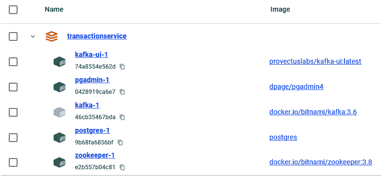
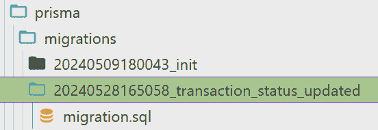
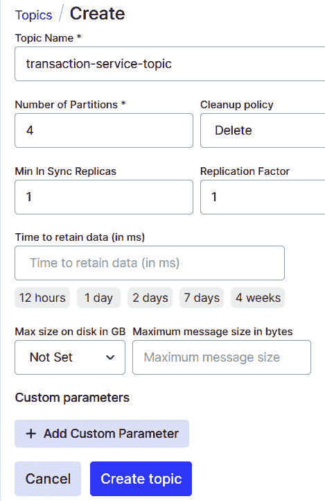
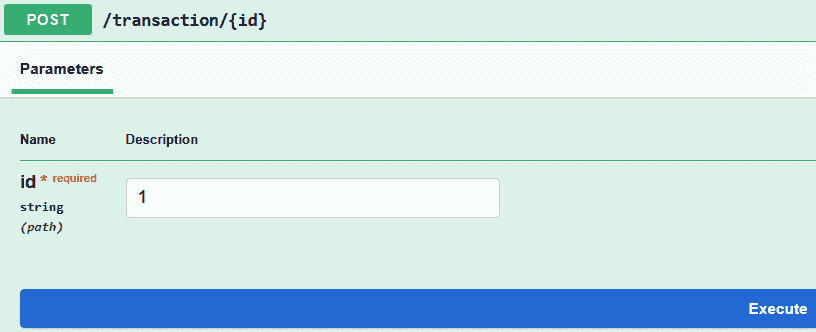
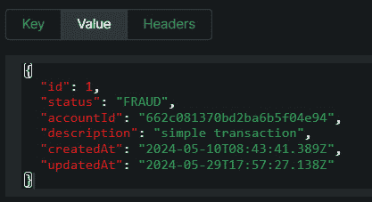

# 7

# 异步微服务

微服务被设计成独立和自包含的。明确定义的通信协议和 API 确保这些服务在没有依赖彼此内部工作的情况下进行交互。定义微服务之间的适当通信对于良好的微服务架构至关重要。

在本章中，我们计划讨论和学习另一个重要的通信机制：微服务之间的异步通信。

本章涵盖了以下主题：

+   理解需求

+   探索异步通信

+   实现异步事务微服务

+   适应账户服务的新需求

+   测试我们的微服务

让我们深入探讨！

# 技术要求

为了跟随本章内容，您需要一个 IDE（我们更喜欢 Visual Studio Code）、Postman、Docker 以及您选择的浏览器。

建议您从[`github.com/PacktPublishing/Hands-on-Microservices-with-JavaScript`](https://github.com/PacktPublishing/Hands-on-Microservices-with-JavaScript)下载仓库，并打开`Ch07`文件夹，以便轻松地跟随代码片段。

# 理解需求

到目前为止，我们已经开发了两个简单的微服务，对于当前章节，我们计划扩展我们的事务微服务以满足以下需求：

+   每个事务都应该支持以下状态：`CREATED`、`FAILED`、`APPROVED`、`DECLINED`和`FRAUD`。

+   事务服务现在应该有一个新的方法，将给定事务的状态更改为`FRAUD`。它将更新事务的状态为`FRAUD`并产生关于事务的消息。

+   账户服务将消费此消息，并在三次欺诈尝试后，账户服务应读取并暂停/阻止指定的账户。

我们计划在微服务之间使用异步通信，任何其他微服务都可能使用此消息进行内部目的。您可以查看*第二章*以获取有关微服务之间异步通信的更多信息。

# 探索异步通信

您可以使用各种模式和技术在微服务之间实现异步通信，每种都适合不同的用例和需求。以下是一些常见的例子：

+   **消息代理**：消息代理通过允许微服务发布和订阅消息来促进异步通信。流行的消息代理包括**RabbitMQ**，它支持多种消息协议和模式，如发布/订阅和路由，以及为高吞吐量和容错性事件流设计的**Apache Kafka**——这是实时数据处理的最佳选择之一。一个消息代理的例子是一个生产服务向队列或主题发送消息，而消费者服务订阅队列或主题并处理消息。

+   **事件流平台**: 事件流平台捕获和处理事件流。这些平台对于实时分析和数据管道构建特别有用。流行的事件流平台包括常被用作消息代理和事件流平台的**Apache Kafka**，以及用于大规模实时数据处理的托管服务**Amazon Kinesis**。以下是一个例子：生产服务向 Kafka 主题发出事件，消费者服务从主题中消费事件并对它们做出反应。

+   **发布-订阅模式**: 在发布/订阅模式中，消息被发布到一个主题，多个订阅者可以异步地消费这些消息。使用发布/订阅模式的流行服务包括完全托管的实时消息服务**Google Pub/Sub**，以及允许向多个订阅者发布消息的**AWS Simple Notification Service**（**SNS**）。例如，发布者服务将事件发布到主题，而订阅者服务接收通知并处理事件。

+   **任务队列**: 任务队列用于异步地将任务分配给工作服务。这对于从主服务中卸载重或耗时的任务非常有用。一些流行的任务队列包括基于分布式消息传递的异步任务队列/作业队列**Celery**，以及完全托管的**Amazon Simple Queue Service**（**SQS**），这是一个完全托管的消息队列服务。以下是任务队列的工作原理：生产服务创建一个任务并将其放入队列，然后工作服务从队列中提取任务并处理它。

+   **事件驱动架构**: 在事件驱动架构中，服务通过事件进行通信。当一个服务发生显著事件时，它会发出一个其他服务可以监听并对其做出反应的事件。在事件驱动架构中，事件源服务发布一个事件，事件监听服务对事件做出反应并执行它们的逻辑。

+   **WebSockets**: WebSockets 允许在单个 TCP 连接上建立全双工通信通道，这对于实时应用程序（如聊天应用或实时更新）非常有用。以下是一个例子：服务器通过 WebSockets 向客户端推送更新，客户端实时接收更新并对其做出反应。

+   **服务器发送事件**（**SSE**）：SSE 是一种服务器推送技术，允许服务器在建立初始客户端连接后向客户端推送实时更新。以下是一个例子：服务器通过 HTTP 连接向客户端发送事件，客户端监听传入的消息并处理它们。

+   **支持流式传输的 gRPC**: gRPC 支持双向流，允许客户端和服务器使用单个连接发送一系列消息。gRPC 的工作方式是这样的：客户端和服务器可以作为单个 RPC 调用的部分，持续交换消息流。

对于本章，我们将积极使用 Apache Kafka，这是一个开源、高性能的事件流平台。由于其能够实现强大且可扩展的事件驱动架构，它成为微服务之间异步通信的流行选择。虽然我们已经讨论了如何通过 Docker 运行服务，但本章将专注于在 Docker 上托管 Apache Kafka。

让我们快速看一下 Apache Kafka 解决的问题：

+   **通信复杂性**：在微服务环境中，你有多个来源（每个 API 都充当来源）和多个目标（每个 API 可以有多个来源写入）。来源和目标可扩展的事实总是伴随着通信问题。在这种情况下，问题是我们应该解决由来源和目标产生的复杂性，而不是专注于业务需求实现。现在你有多个来源和目标，这可能会产生以下问题：

    +   每个目标都需要不同的协议进行通信。

    +   每个目标都有自己的数据格式来处理。

    +   每个不同的目标都需要维护和支持。

    简单来说，假设你有一个微服务应用，每个服务都有自己的目标。除此之外，每个服务还可以有多个来源，并且服务可以使用公共来源。Apache Kafka 帮助你避免微服务之间的复杂通信。

+   **通信复杂性重复**：每当开发类似系统时，我们必须一次又一次地重写这样的通信过程。让我们想象一下，我们正在处理几个不同的项目。尽管这些项目的领域不同，尽管它们在抽象层面上解决不同的问题，但这些项目的共同点是通信复杂性。这意味着我们在重复自己，每次都试图解决相同的问题。

+   **容错性**：系统应该能够在各种类型的故障（如硬件故障、网络问题或软件崩溃）存在的情况下继续运行并提供可靠的数据处理和消息传递。

+   **高性能**：在大多数情况下，这种通信问题（来源-目标）会导致应用程序性能下降。无论应用程序中目标数和来源数的动态变化如何，程序都应该始终支持高性能属性。

+   **可伸缩性**：系统应该能够水平扩展来源和目标。水平扩展，也称为扩展，是软件设计中通过添加更多机器（节点）来增加系统容量的技术。

+   **实时通信**：可能的目标和来源通信属性之一是实时通信。根据用例，系统应允许来源和目标之间进行实时数据交换。

+   **日志和数据聚合**：这是将日志和数据组合并处理的能力。日志和数据聚合在现代软件中发挥着至关重要的作用，通过集中和组织来自各种来源的信息，使其更容易分析、故障排除和优化应用程序。

+   **数据转换和处理**：目标与源之间的通信不仅限于数据交换，信息还应基于转换的可能性。

现在让我们谈谈我们需要用于实现我们的微服务的基础设施。

# 实现异步事务微服务

我们将使用我们在*第六章*中实现的相同事务微服务，但会进行一些额外的更改，以帮助我们为其添加异步行为。首先，我们应该准备我们的基础设施。以下是它将包含的内容：

+   **Apache Kafka**：用于在微服务之间创建松散耦合。

+   **Kafka UI**：这是一个用于管理 Apache Kafka 集群的 Web 应用程序。它为 Kafka 提供了一个**图形用户界面**（GUI），而不是传统的**命令行界面**（CLI），这使得许多用户与 Kafka 交互变得更加容易。

+   **Zookeeper**：这是一款开源软件，作为大型分布式系统的中央协调器。将其想象为交响乐队的指挥，保持一切同步。

+   **PostgreSQL**：用于存储数据。

+   **PgAdmin**：一个用于直观查看数据库元素的图形工具。

我们在根目录（`Ch07/transactionservice`）中有一个`docker-compose.yml`文件。

此`docker-compose`文件定义了一个多服务设置，用于 PostgreSQL 数据库、一个用于管理数据库的 PgAdmin 实例以及一个带有 Zookeeper 协调器的 Kafka 消息系统。服务通过一个自定义 Docker 网络`my-app-network`连接，该网络使容器间通信成为可能。对于 Kafka，确保已配置正确的网络设置以避免连接问题，特别是在多网络设置中，可能需要`advertised.listeners`以同时支持内部和外部地址。PostgreSQL 服务将其数据存储在名为`postgres_data`的命名卷中，而`PgAdmin`依赖于 PostgreSQL 处于运行状态。Kafka 和 Zookeeper 服务已设置为消息代理，Kafka UI 提供管理和监控，依赖于 Zookeeper 来维护分布式系统配置。

导航到根目录并运行`docker-compose up -d`命令以启动基础设施。

这是成功运行后的样子（*图 7.1*）。



图 7.1：Docker 基础设施

在成功运行我们的 Docker 基础设施后，我们就可以切换到源代码来实现我们的需求。

首先，我们需要更新我们的交易服务以支持额外的状态。打开位于`prisma/migrations`文件夹下的`schema.prisma`文件，并将`enum`更改为以下内容：

```js
enum Status {
  CREATED
  FAILED
  APPROVED
  DECLINED
  FRAUD
}
```

正如我们已经知道的，Prisma 的一个职责是隔离我们与数据库内部，并在这内部提供一种独特、更易于理解的编程语言。这就是为什么我们有`.prisma`扩展，要将它映射到真实的 SQL，我们需要运行迁移。我们已经了解了迁移步骤及其对您开发的影响（有关更详细的信息，请参阅*第六章*），因此在本章中，我们只提供确切命令而不作解释：

```js
npx prisma migrate dev --name transaction-status-updated
```

运行命令后，您应该得到一个额外的文件夹，其中包含`migration.sql`文件，文件夹名称是生成日期和您从命令中提供的名称的组合（*图 7**.2*）。



图 7.2：新生成的状态迁移上下文

我们计划添加到交易服务的主要功能是欺诈功能。如果交易不是失败的，则此方法应将交易状态更改为`FRAUD`。更新状态后，它应向代理（在这种情况下为 Apache Kafka）发布一条消息。

## Kafka 在 NestJS 中的入门

正如我们在*第六章*中学到的，NestJS 有很多有用的包可以与不同的技术一起使用。您不需要编写任何这些包就可以将它们集成到您的项目中。这也适用于 Apache Kafka。我们不需要从头开始开发一个单独的包；只需运行以下命令来安装所需的包：

```js
npm install @nestjs/microservices kafkajs
```

安装成功后，您将在`package.json`文件中看到额外的更改。NestJS 有一个特殊的模式组合来配置服务。这就是为什么我们首先需要创建我们的`kafka`模块。正如我们已经学到的，没有必要手动创建此文件。您只需运行以下命令：

```js
nest generate module kafka
```

它应该生成一个名为`kafka`的文件夹，其中包含`kafka.module.ts`文件。此模块应将`KafkaService`作为其提供元素，但我们没有 Kafka 服务。运行以下命令将生成`kafka.service.ts`和`kafka.service.spec.ts`文件：

```js
nest generate service kafka
```

我们不需要在`kafka.service.spec.ts`上工作，是否删除它取决于您。这些文件是自动生成的测试文件，我们不会为本章运行任何测试。为了使事情尽可能简单，我们将其删除。运行最后一个命令后，您应该意识到`kafka.module.ts`也被自动更新了。以下是它的样子：

```js
import { Module } from '@nestjs/common';
import { KafkaService } from './kafka.service';
import { ConfigModule } from '@nestjs/config';
@Module({
  imports: [ConfigModule],
  providers: [KafkaService],
})
export class KafkaModule {}
```

由于其极简的行数，`kafka.module.ts`中的代码简单易懂。稍后我们还将讨论`nestjs/config`包。我们将在`kafka.service.ts`文件中实现主要功能。打开您的`kafka.service.ts`文件，并将其替换为以下代码行：

```js
import { Injectable, OnModuleInit, OnModuleDestroy } from 
  '@nestjs/common';
import { ConfigService } from '@nestjs/config';
import { Kafka, Producer } from 'kafkajs';
@Injectable()
export class KafkaService implements OnModuleInit, OnModuleDestroy {
  private readonly producer: Producer;
  private readonly topic: string;
  constructor(private readonly configService: ConfigService) {
    const clientId = this.configService.get<
      string>('KAFKA_CLIENT_ID');
    const brokers = this.configService.get<string>('KAFKA_BROKERS')
      .split(',');
    this.topic = this.configService.get<string>('KAFKA_TOPIC');
    const kafka = new Kafka({ clientId, brokers });
    this.producer = kafka.producer({ retry: { retries: 3 }
      });
  }
  async onModuleInit(): Promise<void> {
    await this.producer.connect();
  }
  async onModuleDestroy(): Promise<void> {
    await this.producer.disconnect();
  }
  async send(value: any, key?: string): Promise<void> {
    const messages = [{ key, value: JSON.stringify(value)
      }];
    await this.producer.send({ topic: this.topic, messages
      });
  }
}
```

现在我们来理解我们刚才做了什么：

+   `Injectable`: 这表示该类可注入到其他服务中。

+   `OnModuleInit` 和 `OnModuleDestroy`: 这些是初始化和清理的生命周期钩子。

+   `ConfigService`: 这提供了访问环境变量和配置的权限。

+   `Kafka` 和 `Producer`: 这些是来自`kafkajs`库的类。

+   `@Injectable()`: 这使得`KafkaService`可注入。

+   `implements OnModuleInit` 和 `OnModuleDestroy`: 这实现了生命周期钩子。

+   `producer`: Kafka `producer`实例用于发送消息。

+   `topic`: 这是预配置的用于消息传递的 Kafka 主题（从环境变量中获取）。

+   `configService`: 这是用于访问配置的注入实例。

+   类的构造函数从环境变量中获取 Kafka 配置值：

    +   `KAFKA_CLIENT_ID`: 这是您应用程序的客户端 ID。

    +   `KAFKA_BROKERS`: 这是一个以逗号分隔的 Kafka 代理地址列表。

    +   `KAFKA_TOPIC`: 这是发送消息的 Kafka 主题。

    +   `const kafka = new Kafka({ clientId, brokers });`: 这使用配置创建了一个 Kafka 客户端。

    +   `this.producer = kafka.producer({ retry: { retries: 3 } })`: 这创建了一个具有消息可靠性重试配置的生产者实例（默认设置为重试三次）。

    +   `onModuleInit`: 这在 NestJS 模块初始化时连接 Kafka 生产者，确保生产者准备好发送消息。

    +   `onModuleDestroy`: 这在 NestJS 模块被销毁时断开 Kafka 生产者连接，释放资源。

    +   `send`: 这接受一个要发送的值（任何类型）和一个可选的键（字符串）用于消息标识。它构建一个带有键和值（序列化为 JSON）的消息对象，并使用生产者将消息发送到预配置的主题。

敏感信息不应直接存储在`kafka.service.ts`中。对于本章，请在本地将配置设置存储在`.env`文件中。然而，请避免将此文件提交到版本控制。对于生产部署，考虑使用安全的保险库服务，如 AWS Secrets Manager 或 Azure Key Vault，以安全地管理敏感配置。从前面的代码中，很明显我们将在`.env`文件中存储我们的三个主要 Kafka 配置。打开您的`.env`文件，并在文件末尾添加以下行：

```js
#KAFKA Configuration
KAFKA_CLIENT_ID=transaction-service
KAFKA_BROKERS=localhost:29092
KAFKA_TOPIC=transaction-service-topic
```

我们已经使用 `.env` 文件来配置 `postgresql` (*第六章*)，但为了本章，我们需要指定一个可以读取 .`env` 文件的机制。另一个 NestJS 包，名为 `config`，将帮助我们处理这个问题。让我们使用以下命令安装它：

```js
npm install @nestjs/config
```

就这些了。我们已经将包导入到 `kafka.service.js` 中以使用它。现在是我们讨论 Kafka 知识要点的时候了。当我们生产或消费消息时，我们需要与 Apache Kafka 交互，在使用 Kafka 之前，你需要了解一些 Kafka 的基础知识。

## Kafka 中的集群和代理

在生产中，一个 Kafka 集群通常由多个代理组成，每个代理存储和管理分配给主题的分区。Kafka 使用 ZooKeeper（或较新版本中的 KRaft）来协调代理元数据并确保集群中分区分布的一致性。**代理**与**Kafka 服务器**同义。每个代理都是一个服务器。代理的目的是服务数据。

无论它是否是物理的，最终，一个代理应该像服务器一样运行。虽然从技术上讲，在集群中只有一个代理是可能的，但这通常只用于测试或自学目的。

集群的目的包括以下内容：

+   使用多个代理并行处理多个请求

+   提供高吞吐量

+   确保可伸缩性

Kafka 集群中的每个代理也是一个引导服务器，包含有关所有其他代理、主题和分区的元数据。当消费者加入消费者组时，Kafka 的组协调器使用范围或轮询等分配策略来分配分区，确保均匀分布并平衡消费者之间的负载。这意味着当你连接到一个代理时，你自动连接到整个集群。在大多数情况下，一个好的起点是拥有三个代理。Apache Kafka 中的三个代理在容错性和效率之间提供了平衡。有了三个代理，Kafka 可以在多个节点之间复制数据，即使一个代理失败也能确保高可用性。它还允许三个副本因子，这使得系统在发生代理故障时不会丢失数据，同时避免了管理过多代理的开销。然而，在高负载系统中，你可能会拥有数百个代理。

根据主题的配置，作为存储类型的代理由多个 **分区** 组成。当我们创建一个主题时，我们定义该主题下的分区数量。作为分布式系统，Kafka 使用最佳算法将这些分区分配给代理。

让我们考虑一个有三个代理的 Kafka 集群。当创建一个名为 `tracking_accounts` 的主题并具有三个分区时，Kafka 将尝试将分区分配给三个代理。在最佳情况下，这将导致每个代理一个分区。当然，这取决于各种因素，包括负载均衡。你不需要干预；作为 **分布式框架** 的 Kafka 自动管理所有这些内部操作。

如果你有三个分区和四个代理，Kafka 将尝试将它们分配，每个代理分配一个分区，留下一个代理没有分区。但为什么创建比分区数量更多的代理呢？当你遇到代理宕机的问题时，这个值就变得明显了。众所周知，Kafka 最重要的属性之一是其容错性。当一个代理失败时，Kafka 会自动使用其他代理进行恢复。另一个重要的问题是生产者和消费者如何知道与哪个代理通信来读取和写入数据。

答案很简单。由于 Kafka 代理也充当 **引导服务器**，它们拥有关于其他服务器所有必要的信息。

例如，考虑任何生产者。在生产数据之前，生产者向任何代理（无论哪个代理——即使是最近的代理也可以）发送一个后台请求，以检索元数据信息。这些元数据包含有关其他代理、它们的主题、分区和领导者分区的所有相关细节（我们将在未来的讨论中介绍）。

使用这些元数据，生产者知道应该将数据发送给哪个代理。我们称这个过程为 **Kafka** **代理发现**。

## Apache Kafka 中的主题和分区概念

Kafka 生产者的责任是生产数据。另一方面，Kafka 消费者是你消息的客户端。Kafka 集群充当生产者和消费者的隔离器和 *存储*。在生产数据之前，Kafka 代理需要临时存储来保存数据。这些存储容器被称为 **主题**。

主题是一个数据流，它作为分区上的逻辑隔离器。

从用户的角度来看，主题很重要，因为在读取/写入数据时，我们主要指的是主题而不是分区。（当然，在生产和消费过程中定义分区时，必须指定主题名称，但在一般情况下，可以在不直接指定分区的情况下生产和消费数据。）主题概念帮助我们普通人与 Kafka 交互，而不用担心内部存储机制。每个主题都应该有一个唯一的名称，因为主题的识别过程是通过它们的名称来完成的。你可以创建尽可能多的主题，或者根据你的业务需求创建。

在生产系统中，主题不是只能存在于一个代理中的东西。相反，通过使用分区，主题分散到各个代理。这意味着，通过使用分区，一个主题存在于多个代理中。这有助于 Kafka 构建一个容错、可扩展和分布式系统。

主题是持久的，这意味着它们中的数据被持久化到磁盘上。这使得 Kafka 成为需要可靠存储和处理数据流的应用程序的良好选择。

但分区又是如何工作的呢？在底层，Kafka 使用分区来存储数据。生产环境中的每个主题都由多个分区组成。Kafka 使用主题概念主要出于两个目的：

+   为了将分区分组在一个盒子下存储“一个业务点”数据

+   为了帮助用户与 Kafka 交互，无需担心其内部结构

Kafka 使用分区来实现并行性和可扩展性。这意味着多个生产者和消费者可以同时处理同一个主题，数据在集群中的代理之间均匀分布。

那么，为什么我们需要分区的概念，如果我们已经有了主题呢？嗯，通过使用分区，Kafka 实现了分布式数据存储和**同步副本**（ISR）的概念。分区帮助我们分配主题并实现容错系统。

每个分区都通过其 ID 来识别。每个主题可以拥有你想要的/业务所需的任意数量的分区。在生产环境中，在创建主题时定义分区数量非常重要——否则，系统将使用分区数量的默认配置。这意味着，如果没有定义分区数量，系统将自动为每个主题创建分区数量。分区数量应与业务需求相一致；例如，一个主题可能需要四十个分区，而另一个可能需要两百个。

你可以将分区视为一个具有堆栈算法的集合。每个分区都是一个数组，它们的索引被称为**偏移量**。分区具有动态的偏移量计数，并且没有固定的大小。分区是动态可扩展的，它们的大小可以在同一个主题内变化。分区中的每个信息单元称为消息。消费者可以以堆叠的方式读取数据。

Kafka 分区使用轮询算法分配到 Kafka 代理。这意味着集群中的每个代理尽可能被分配相同数量的分区。

但是，将分区分配到 Kafka 代理的过程也取决于以下因素：

+   **分区数量**：当你创建一个 Kafka 主题时，你应该指定它可以拥有的分区数量。这个数字决定了可以与主题一起工作的并行消费者或生产者的数量。分区数量应根据预期的负载和所需的并行级别来选择。

+   **代理分配**：分配通常以平衡的方式进行，以确保分区在代理之间均匀分布，但它可以受到分区分配策略的影响。

+   **分区分配策略**：Kafka 提供了不同的分区分配策略，主要由消费者组协调器控制。

+   **副本因子**：Kafka 通过在多个代理之间复制数据来确保容错性。每个分区都有一个指定的副本因子，它决定了维护的数据副本数量。

简而言之，我们需要在 Kafka 中使用分区，因为它们是并行和分布的核心单元，并帮助 Kafka 横向扩展和分布数据。它们还实现了高吞吐量和容错性，并充当内部存储机制。

值得注意的是，一旦创建了一个具有特定分区数的主题，就不再适当更改该主题的分区数。相反，您需要创建一个新的主题，并具有所需数量的分区，如果需要，迁移数据。Apache Kafka 本身是一个庞大的概念，如果您想了解更多，可以查看我在 Udemy 上的 *Apache Kafka for Distributed Systems* 课程（[`www.udemy.com/course/apache-kafka-for-distributed-systems/`](https://www.udemy.com/course/apache-kafka-for-distributed-systems/)）。

## 配置 Apache Kafka

我们讨论了 Apache Kafka 的理论方面，现在是时候将其付诸实践了。您可以使用 Kafka CLI 与 Kafka 交互，但我们已经安装了 Kafka UI 以简化我们的工作，避免处理命令行的复杂性。

我们的 `.env` 文件定义了一个名为 `transaction-topic` 的主题，要创建它，请按照以下步骤操作：

1.  打开 Docker Desktop。确保本章所有服务都在运行。

1.  打开您喜欢的浏览器，导航到 `http://localhost:9100/`。

1.  从左侧的仪表板中选择 **主题**。

1.  点击右上角的 **添加主题** 按钮，并填写输入（*图 7**.3*）。



图 7.3：在 Apache Kafka 中为代理创建主题

创建成功后，您将在 **主题** 列表中看到您的主题。

到目前为止，我们已经配置了 Apache Kafka 的主题，并使用 `kafka.module.ts` 创建了 `kafka.service.ts`。我们计划在交易中实现欺诈功能，因此我们需要更改另外三个文件（`transaction.controller.ts`、`transaction.module.ts` 和 `transaction.service.ts`）以集成我们的新欺诈功能。

## 为事务微服务添加异步特性

我们需要做的是将配置读取和 Kafka 功能集成到事务服务中。`transaction.module.ts` 的最终版本将看起来像这样：

```js
import { Module } from '@nestjs/common';
import { TransactionService } from './transaction.service';
import { TransactionController } from './transaction.controller';
import { PrismaModule } from '../prisma/prisma.module';
import { HttpModule } from '@nestjs/axios';
import { KafkaService } from 'src/kafka/kafka.service';
import { ConfigService } from '@nestjs/config';
@Module({
  imports: [PrismaModule,HttpModule],
  controllers: [TransactionController],
  providers:
    [TransactionService,KafkaService,ConfigService],
})
export class TransactionModule {}
```

我们刚刚添加了 `KafkaService` 和 `ConfigService`。我们计划将 `KafkaService` 注入到 `transaction.service.ts` 文件中，并且它依赖于 `ConfigService`。这就是为什么我们需要将 `KafkaService` 和 `ConfigService` 都添加到 `providers` 列表中的原因。

让我们切换到 `transaction.service.ts` 文件本身。文件修改后的版本如下所示：

```js
import { Injectable } from "@nestjs/common";
import { CreateTransactionDto } from "./dto/create-transaction.dto";
import { PrismaService } from "src/prisma/prisma.service";
import { HttpService } from "@nestjs/axios";
import { AccountApiResponse } from "./dto/account.dto";
import { KafkaService } from "src/kafka/kafka.service";
@Injectable()
export class TransactionService {
  constructor(
    private readonly prisma: PrismaService,
    private readonly httpService: HttpService,
    private readonly kafkaService: KafkaService
  ) {}
  async create(createTransactionDto: CreateTransactionDto)
  {
    //same as Chapter 6
  }
  findAll() {
    //same as Chapter 6
  }
  findOne(id: number) {
    //same as Chapter 6
  }
 //newly added functionality
    async fraud(id: number) {
    const transaction = await this.findOne(id);
    if (transaction.status !== "FRAUD" &&
      transaction.status !== "FAILED") {
        const newTransaction =
          this.prisma.transaction.update({
            where: { id },
            data: { status: "FRAUD" },
          });
          this.kafkaService.send(transaction, null);
          return newTransaction;
        } else throw new Error("Transaction is not in a valid status");
  }
```

如您可能已经注意到的，我们注入了 `KafkaService`，并且事务还有一个名为 `fraud` 的额外功能。

这个名为 `fraud` 的异步函数旨在处理将交易标记为欺诈。它获取交易详情，验证其当前状态，如果有效则将其更新为 `FRAUD`，可能发送通知，并返回更新的交易对象。该函数以 `id: number` 作为输入，表示要标记为欺诈的唯一标识符的交易。函数开始时使用 `await` `this.findOne(id)` 异步从数据库检索交易数据。然后它使用严格不等号运算符 (`!==`) 检查交易当前的状态既不是 `FRAUD` 也不是 `FAILED`。这确保函数不会再次尝试标记已经欺诈或失败的交易。如果状态不符合标准，将抛出一个错误，错误信息为 `Transaction is not in a valid status`，以防止意外行为。假设状态检查通过（即交易尚未欺诈或失败），代码将继续更新交易数据。它使用 Prisma 库 (`this.prisma.transaction.update`) 来修改交易记录。`where` 属性指定更新应针对具有提供的 ID 的特定交易。

`data` 属性定义了要进行的更改。在这种情况下，它将事务的 `status` 属性设置为 `FRAUD`。

函数中包含行 `this.kafkaService.send(transaction, null)`。这表明使用了 Kafka 消息代理来广播有关欺诈交易的通告。第二个参数是一个键。消息键是您可以在 Apache Kafka 中与消息一起包含的可选元素。它在系统内部消息的路由和处理中扮演着重要角色。消息键主要用于在主题内分区消息。Kafka 主题进一步分为分区，作为分布式数据的存储单元。通过包含一个键，您可以影响消息被发送到哪个分区。

最后，如果状态检查通过并且更新成功，该函数将返回 `newTransaction` 对象。此对象包含更新的交易详情，包括新设置的 `FRAUD` 状态。

从本质上讲，此函数提供了一个机制，用于根据当前状态标记交易为欺诈，并通过 Kafka 发送通知。

最后一个元素是控制器。在交易控制器中，我们有一个新的端点，具有以下行为：

```js
 @Post(':id')
  fraud(@Param(‹id›) id: string) {
    return this.transactionService.fraud(+id);
  }
```

要一起测试所有内容，您应该执行以下操作：

1.  从根目录（`Ch07``/transactionservice` 文件夹）运行 `npm run start:dev`。

1.  导航到 `localhost:3000/api`。

我们已经默认迁移了交易。您可以使用它们的 ID 来测试我们新创建的 API，或者您可以从头创建一个交易并测试它。让我们测试我们的一个种子交易。我将使用 `id = 1` 的交易 (*图 7**.4*).



图 7.4：执行欺诈端点

在成功执行欺诈端点后，我们将得到以下响应：

```js
{
  "id": 1,
  "status": "FRAUD",
  "accountId": "662c081370bd2ba6b5f04e94",
  "description": "simple transaction",
  "createdAt": "2024-05-10T08:43:41.389Z",
  "updatedAt": "2024-05-29T17:47:07.233Z"
}
```

现在让我们打开 Apache Kafka 并检查我们的消息。从您喜欢的浏览器中打开 `localhost:9100`，然后转到 `transaction-service-topic` 并从 **消息** 选项卡中选择 **值** 部分 (*图 7**.5*):



图 7.5：Apache Kafka 中的成功消息

太好了！我们能够向 Apache Kafka 发送消息，现在我们需要以某种方式接收并处理这条消息。从源（对我们来说是 Apache Kafka）读取消息称为消费过程，而读取器是消费者。

# 适应新的账户服务需求

账户服务是我们需要为给定上下文实现的主要消费者。首先，我们需要能够与 Apache Kafka 交互。只需复制已经实现的账户微服务并继续在该服务上工作。导航到 `Ch07/accountService` 并运行以下命令来安装 `kafkajs` 包：

```js
npm install kafkajs
```

现在我们需要开发一个单独的模块来与 Apache Kafka 一起工作。Apache Kafka 有其变量（代理、主题等），这就是为什么我们使用与交易服务相同的 `.env` 文件。在 `accountService` 文件夹下，我们有 `configs/.env`，并添加了以下配置项：

```js
#KAFKA Configuration
KAFKA_CLIENT_ID=account-service
KAFKA_BROKERS=localhost:29092
KAFKA_TOPIC=transaction-service-topic
KAFKA_GROUP_ID=account-group
```

要读取 `.env` 文件，我们使用位于 `src/config` 下的特殊配置，并称为 `config.js`。但我们需要向该文件添加必要的更改以支持新的键值对。以下是 `config.js` 的最终版本：

```js
const dotenv = require('dotenv');
const Joi = require('joi');
const envVarsSchema = Joi.object()
    .keys({
        PORT: Joi.number().default(3000),
        MONGODB_URL:
          Joi.string().required().description('Mongo DB url'),
        KAFKA_CLIENT_ID: Joi.string().required(),
        KAFKA_BROKERS: Joi.string().required(),
        KAFKA_TOPIC: Joi.string().required(),
        KAFKA_GROUP_ID: Joi.string().required()
    })
    .unknown();
function createConfig(configPath) {
    dotenv.config({ path: configPath });
    const { value: envVars, error } = envVarsSchema
        .prefs({ errors: { label: ‹key› } })
        .validate(process.env);
    if (error) {
        throw new Error(`Config validation error:
          ${error.message}`);
    }
    return {
        port: envVars.PORT,
        mongo: {
            url: envVars.MONGODB_URL,
        },
        kafka: {
            clientID: envVars.KAFKA_CLIENT_ID,
            brokers: envVars.KAFKA_BROKERS,
            topic: envVars.KAFKA_TOPIC,
            groupId: envVars.KAFKA_GROUP_ID,
        }
    };
}
module.exports = {
    createConfig,
};
```

我们只是添加了额外的行来支持 `.``env` 文件中新添加的 `config` 元素。

到目前为止，我们添加了配置读取机制和 Kafka 包。现在是时候开发一个 Kafka 模块来与 Apache Kafka 交互了。

在 `src` 文件夹中，创建一个名为 `modules` 的新文件夹，并添加一个名为 `kafkamodule.js` 的新文件。这个新的“适应需求”模块应该具有以下实现：

```js
const { Kafka } = require('kafkajs');
const Account = require('../models/account');
const path = require('path');
const { createConfig } = require('../config/config')
const configPath = path.join(__dirname, '../../configs/.env');
const appConfig = createConfig(configPath);
const kafka = new Kafka({
    clientId: appConfig.kafka.clientId,
    brokers: [appConfig.kafka.brokers],
});
const consumer = kafka.consumer({ groupId:
  appConfig.kafka.groupId });
const consumerModule = async () => {
    await consumer.connect();
    await consumer.subscribe({ topic: appConfig.kafka.topic });
    await consumer.run({
      eachMessage: async ({ topic, partition, message }) =>
      {
        const transaction =
          JSON.parse(message.value.toString());
        const accountId = transaction.accountId;
        try {
              const blockedAccount =
                await Account.findOne({ accountId, status:
                { $ne: 'blocked' } });
              if (!blockedAccount) {
                const updatedAccount =
                  await Account.findOneAndUpdate(
                        { _id: accountId },
                        { $inc: { count: 1 } },
                        { new: true }
                    );
                  if (updatedAccount.count === 3)
                    await Account.findOneAndUpdate(
                            { _id: accountId },
                            { status: 'blocked' },
                            { new: true }
                   );
                }
                else
                    console.log(`not a valid accountId ${accountId}`);
            }
            catch (error) {
                console.log(error);
            }
        },
    });
};
module.exports = consumerModule;
```

我们需要以下元素来使账户微服务能够与交易服务通信：

+   `Kafka`: 用于从 Kafka 消费消息

+   `Account`: 用于与数据库交互

+   `path`: 用于指定读取配置文件的路径

+   `createConfig`: 用于检索 Kafka 配置

让我们一步一步地查看代码，了解它做了什么：

+   `const configPath = path.join(__dirname, '../../configs/.env');`：这一行构建到`.env`配置文件的路径，该文件位于当前目录向上两个目录，然后在`configs`目录中。

+   `const appConfig = createConfig(configPath);`：这一行调用`createConfig`函数，并将`configPath`作为参数。`createConfig`函数读取配置文件，并将配置设置作为对象返回（`appConfig`）。

+   以下行使用`KafkaJS`库创建 Kafka 客户端的实例。它使用`clientId`和从`appConfig`对象获取的经纪人列表配置客户端。

    ```js
    const kafka = new Kafka({
        clientId: appConfig.kafka.clientId,
        brokers: [appConfig.kafka.brokers],
    });
    ```

+   `const consumer = kafka.consumer({ groupId: appConfig.kafka.groupId });`：这一行创建一个新的 Kafka 消费者实例，指定从`appConfig`对象获取的`groupId`。`groupId`用于管理 Kafka 中的消费者组协调。

+   我们在`consumerModule`函数内部实现了我们模块的主要功能。这个函数连接到 Kafka 并订阅给定的主题。

+   `await consumer.connect();`：这一行将 Kafka 消费者连接到 Kafka 经纪人。

+   `await consumer.subscribe({ topic: appConfig.kafka.topic });`：这一行将消费者订阅到指定的 Kafka 主题，该主题从`appConfig`对象获取。

+   `Consumer.run`启动消费者以监听订阅的 Kafka 主题的消息。它为每个消息定义了一个异步处理函数，该函数处理每个消费的消息。该函数接受一个具有`topic`、`partition`和`message`属性的对象。对于每条消息，它解析检索到的消息并提取账户 ID。真正的业务规则从这里开始。首先，我们检查给定的账户 ID 是否存在于我们的数据库中，并且它没有被阻止。如果账户 ID 存在，那么我们应该更新这个账户，增加其计数。如果增加的计数是`3`，那么状态将被更新为`blocked`。

其余的代码行都很直接。

要使用`kafkamodule.js`文件的功能，我们需要将其导入到`app.js`中并调用它。以下是`app.js`的样貌：

```js
const express = require('express');
const v1 = require('./routes/v1');
const consumerModule = require('./modules/kafkamodule');
const app = express();
consumerModule();
// service
app.use(express.json());
// V1 API
app.use('/v1', v1);
module.exports = app;
```

嗯，正如你可能猜到的，我们遗漏了一个重要的信息。是的——它是一个新创建的`count`。为了跟踪欺诈操作，我们需要在*账户模式*中添加一个名为`count`的新项。打开`models/account.js`，并将以下行添加到你的模式中：

```js
count: {
            type: Number,
            default: 0, // Optional:(defaults to 0)
        },
```

我们不需要更改账户服务和账户控制器来使用我们新的`count :{}`。这是一个实现细节，用户不应该能够直接与此列交互。一切准备就绪，我们可以测试我们的服务。

之前，我们在没有 Docker Compose 的情况下运行账户微服务，但现在我们为它添加了一个 `docker-compose.yml` 文件（`Ch07/accountservice/docker-compose.yml`）。事务服务已经有一个自己的 `docker-compose.yml` 文件，用于托管 Kafka。为了一起测试这两个服务，我们必须从 `accountservice` 和 `transactionservice` 目录运行 `docker-compose.yml` 文件。

# 一起测试我们的微服务

我们应该一起运行事务和账户微服务来测试生产和消费过程。首先，让我们从账户微服务开始。如前所述，不要忘记运行两个服务的 `docker-compose.yml` 文件。

要测试新更新的账户，请按照以下步骤操作：

1.  从终端导航到 `Ch07/accountservice/src`。

1.  使用命令行中的 `node index.js` 命令运行账户服务。

1.  打开 Postman，从新标签页粘贴服务 URL（对我们来说它是 `http://localhost:3001/v1/accounts`），对于 HTTP 方法，选择 `POST`。选择 **Body** | **raw**，将 **Text** 更改为 **JSON**，并粘贴以下内容：

    ```js
    {
        "name":"AccName1",
        "number":"Ac12345",
        "type":"root",
        "status":"new"
    }
    ```

    你应该得到以下响应：

    ```js
    {
        "success": true,
        "Account": {
            "id":{your_account_id}, //for the given request, it is  "6658ae5284432e40604018d5" for us
            "name": "AccName1",
            "number": "Ac12345",
            "type": "root",
            "status": "new"
        }
    }
    ```

在我们的数据库中，它看起来是这样的：

```js
{
  "_id": {
    "$oid": "6658ae5284432e40604018d5"
  },
  "name": "AccName1",
  "number": "Ac12345",
  "type": "root",
  "status": "new",
  …………………
}
```

根据账户微服务中的内容，目前一切正常。我们的主要触发器，生产者，是事务微服务。让我们生产一条消息，看看账户微服务是否可以消费这条消息。我们仍然需要账户服务与事务微服务并行运行，这就是为什么我们需要打开一个新的终端来运行事务微服务：

1.  打开一个新的终端并导航到 `Ch07/transactionservice`。

1.  运行 `npm run start:dev` 以启动事务微服务。

1.  导航到 `http://localhost:3000/api/` 并选择 `POST /transaction/`.

1.  将以下 JSON 粘贴以创建一个新的交易：

    ```js
    {
      "accountId": "6658ae5284432e40604018d5",
      "description": "Optional transaction description"
    }
    ```

    你应该使用账户微服务创建的账户 ID。你将得到以下响应：

    ```js
    {
      "id": {your_id},//it is '37' for us but in your case, it may have a different value
      "status": "CREATED",
      "accountId": "6658ae5284432e40604018d5",
      "description": "Optional transaction description",
    ………………
    37 for us) to the POST /transaction/Id API. It is a fraud endpoint. The response will be like the following:

    ```

    {

    "id": 37,

    "status": "FRAUD",

    "accountId": "6658ae5284432e40604018d5",

    "description": "可选的事务描述",

    ……..

    }

    ```js

    Before executing the fraud endpoint, make sure that the Docker infrastructure is running. After running a fraud request, the account microservice should read and update the data. Running the same account ID in a fraud context three times should block the account itself in the account microservice:

    ```

    {

    ….

    "type": "root",

    "status": "blocked",

    "count": 3,

    ………

    }

    ```js

    ```

通过理解异步通信技术，你可以自信地将它应用到你的项目中。

# 摘要

在本章中，我们通过学习定义微服务之间适当通信的重要性开始了我们的旅程。我们主要使用两种主要的通信形式：异步和同步。选择其中一种总是基于上下文的选择——上下文是王。然后，我们讨论了异步通信的优点。实现异步通信有多种方式，我们讨论了大多数流行的选择。任何事物都有代价，集成微服务架构也不例外。它带来了许多额外的复杂性，我们需要考虑其中之一就是异步通信。

我们讨论了 Apache Kafka，它帮助我们克服了存在的问题。我们学习了诸如集群、代理、主题、消息和分区等基本概念。我们的实际例子涵盖了两个主要的微服务。事务服务是我们的生产者，它产生消息，而账户微服务是一个消费者，它消费那个消息。当然，还有很多子主题，例如重构、异常处理、测试和部署等，我们还没有涉及，接下来的章节将详细讨论这些内容。
