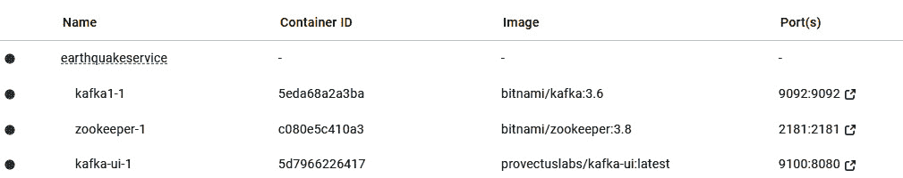
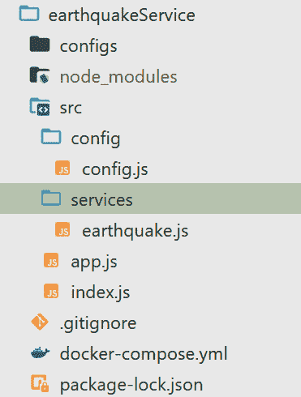
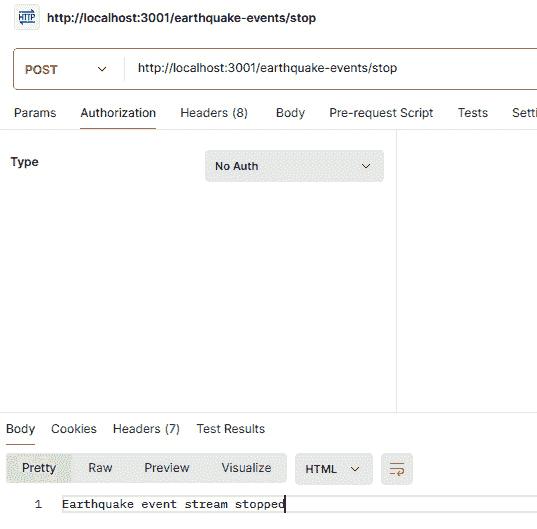
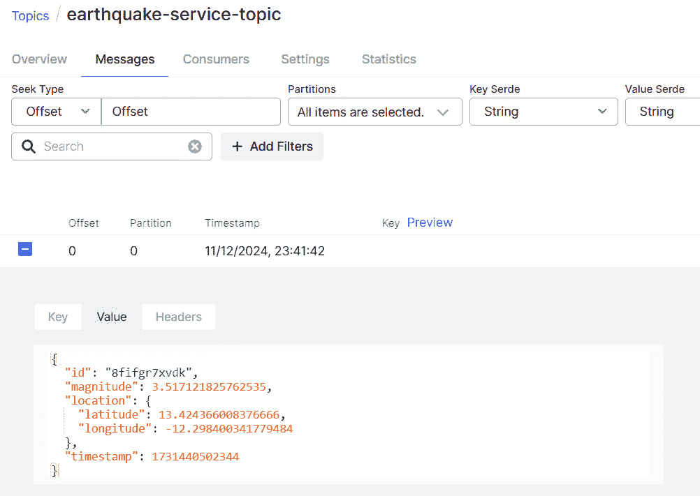
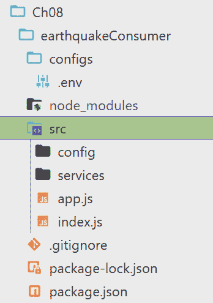

# 使用微服务进行实时数据流处理

某些微服务应用程序，如金融交易平台和叫车服务，需要以最小延迟产生和消费事件。由于实时数据流能够基于最新数据提供即时、连续的洞察和响应，其在现代软件开发中变得越来越重要。这种实时数据使用在金融、医疗保健和物流等行业尤为重要，在这些行业中，数据处理延迟可能导致重大损失甚至危及生命。

依赖于实时数据的应用程序可以提供更响应和互动的用户体验。例如，社交媒体平台、在线游戏和体育直播都依赖于实时数据来保持用户参与并提供无缝体验。

本章全部关于使用微服务进行实时流处理。我们的目的是了解在处理微服务时何时以及如何建立此类通信。

本章涵盖以下内容：

+   什么是实时流处理？

+   开始使用地震流 API

+   实现地震流消费者

# 技术要求

要跟随本章内容，您需要一个 IDE（我们推荐 Visual Studio Code）、Postman、Docker 以及您选择的浏览器。

建议您从[`github.com/PacktPublishing/Hands-on-Microservices-with-JavaScript`](https://github.com/PacktPublishing/Hands-on-Microservices-with-JavaScript)下载我们的仓库，并打开`Ch08`文件夹，以便轻松跟随代码片段。

# 什么是实时流处理？

**实时流处理**是一种数据处理范式，其中数据在创建时即被连续生成、传输和处理，延迟最小。与定期收集和批量处理大量数据或批次的批量处理不同，实时流处理侧重于数据的即时和连续流动，从而实现即时分析和响应。这就像观看直播流而不是等待视频完全下载一样。

在我们继续前进之前，让我们看看实时流处理的一些关键特性：

+   **连续数据流**：实时流处理就像来自不同地方的信息永不停止的流动。这些信息可能来自传感器、在线使用物品的人、买卖货币，如比特币等。

+   **低延迟**：实时流处理的主要目标是使信息从创建到使用之间的延迟尽可能短。

+   **事件驱动处理**：实时流处理通过跟踪事件的发生来工作，例如事物的创建或变化。每个事件都是单独处理或在小批量中处理的，这样系统就可以立即对新情况做出反应。

+   **可扩展性**：实时流系统可以处理不同数量和速度的信息，根据接收到的信息量的大小进行扩展或缩小。

+   **容错性**：为确保持续运行，实时流系统集成了容错机制，如数据复制和从故障中自动恢复。正如我们在前面的章节中提到的，这是 Apache Kafka 的重要属性之一，我们计划在本章中也使用它。

+   **数据一致性**：在实时流中维护数据一致性很重要，尤其是在处理涉及多个分布式组件时。采用如**精确一次处理**和**幂等性**等技术来确保准确性。精确一次处理确保即使在失败或重试的情况下，每条消息也只被处理一次，从而防止重复。由于我们大多数章节都使用 Apache Kafka，你可以在其中轻松配置幂等性和精确一次行为。

现代应用中实时数据的重要性不容忽视。在当今以数据驱动的世界中，能够处理和利用生成数据的能力提供了显著的竞争优势。

## 为什么实时数据是必不可少的

以下是为什么实时数据对于大多数现代应用来说是必不可少的几个关键原因：

+   **增强决策能力**：实时数据可以通过以下方式增强应用程序的决策能力：

    +   **即时洞察**：实时数据提供即时洞察，使企业能够快速做出明智的决策。这在股票交易等动态环境中尤为重要，因为市场状况可能会迅速变化。

    +   **主动问题解决**：通过持续监控数据，组织可以在问题升级之前识别并解决它们，减少停机时间并提高运营效率。

+   **改进的用户体验**：实时数据使应用程序能够通过增强交互性和响应性，并根据个人偏好定制内容，提供更动态和个性化的用户体验。

+   **运营效率**：组织可以通过使用实时数据显著提高效率，这既可以实现实时监控，也可以实现流程的自动化，有助于简化运营并降低成本。

+   **竞争优势**：利用实时数据通过提高灵活性和促进创新，为业务提供独特的优势，使他们能够迅速响应市场变化并创造尖端的产品和服务。

+   **增加收入**：利用实时数据通过优化的营销策略和动态欺诈检测，使企业能够增强其收入流，确保更有效的客户参与和财务安全。

+   **增强安全性**：实时数据通过实现连续监控和异常检测来加强安全性，使组织能够快速识别和应对潜在的威胁和系统异常。

+   **可扩展性和灵活性**：实时数据系统提供了高效处理大量数据的能力，同时保持适应性，确保即使在数据负载和要求波动时也能保持最佳性能。

+   **客户满意度**：实时数据通过提供即时支持和即时反馈来提高客户满意度，使企业能够迅速解决关注点并持续改进其产品和服务。

实时流允许数据在生成时进行处理，提供即时的洞察和响应。这种连续的数据流动，结合低延迟和事件驱动处理，在金融、医疗保健和物流等行业至关重要。实时决策的能力、提升用户体验和改善运营效率为企业提供了竞争优势，促进了创新，增加了收入，同时确保了系统的可扩展性、容错性和增强的安全性。

## 理解使用案例

在本章的开头，我简要提到了实时数据的使用可以对某些行业产生惊人的影响。因此，在设计微服务时理解实时数据的使用案例至关重要。让我们来看看这些案例：

+   **金融服务**：实时数据在这一行业中扮演着关键角色，它使算法股票交易能够做出毫秒级的决策，并支持持续的风险管理，以确保合规并减轻潜在的金融威胁。

+   **医疗保健**：实时数据通过实现连续的患者监测以进行及时干预，并通过实时视频咨询和数据共享来增强远程医疗，改善患者护理和可及性。

+   **零售与电子商务**：实时数据通过优化库存管理以防止短缺，并启用动态定价策略，这些策略能够根据需求和竞争对手的活动进行调整，从而增强零售和电子商务的运营。

+   **交通运输与物流**：实时数据通过优化路线规划和配送时间，优化车队管理，同时实时交通数据增强交通管理，减少拥堵并提高整体流动性。

+   **电信**：实时数据通过确保持续的性能监控以优化服务质量，同时通过快速解决网络问题来改善客户体验。

最后，我们可以肯定地说，实时数据是现代应用的基础，推动决策能力、用户体验、操作效率和竞争优势的提升。通过利用实时数据，组织可以创新、适应并在快速变化的数字领域中蓬勃发展。

## 实时流式传输与微服务之间的关系

现在我们已经了解了什么是实时数据以及为什么它是必要的，是时候了解实时流式传输与微服务之间的关系了。实时流式传输与微服务的结合是一种共生关系，它扩展了现代软件架构的力量、生产力和可扩展性。现在，作为服务的系统，由于这种集成，变得更加反应灵敏、更加适应性强，运行速度也更快。让我们尝试了解实时流式传输和微服务是如何相互配合的：

+   **解耦和可扩展性**：实时流式传输通过促进松散耦合和独立扩展，补充了微服务，允许服务异步通信并根据需求高效扩展。

+   **灵活性和敏捷性**：实时流式传输与微服务的结合增强了灵活性和敏捷性，使服务能够持续进化，并为需要即时洞察和快速迭代的实时数据处理应用提供支持。

+   **弹性和容错性**：将实时流式传输与微服务集成，通过将故障隔离到单个服务并确保数据持久性，增强了弹性和容错性，即使在服务中断的情况下，也能实现无缝恢复和持续运行。

+   **实时通信**：实时流式传输通过启用事件驱动架构和立即数据传播，增强了微服务内部的通信，允许服务异步交互并快速响应事件，从而实现更响应和同步的系统。

+   **操作效率**：将实时流式传输与微服务相结合，通过优化资源利用和简化数据管道，提高了操作效率，允许持续数据流动并减少传统批量处理方法的复杂性。

+   **增强的监控和分析**：将实时流式传输与微服务集成，可以实现实时监控和分析，提供对服务性能的即时可见性，并提供可操作见解，允许主动管理和动态优化服务。

实时流和微服务之间的协同作用为构建响应迅速、可扩展和高效的系统提供了一个强大的框架。通过利用这两种范例的优势，组织可以创建能够处理动态工作负载、提供实时洞察并交付卓越用户体验的应用程序。这种组合在需要快速数据处理和即时反应以成功的环境中尤其强大。

## 我们将开发的微服务

为了使我们的学习过程更加互动和易于理解，我们将开发两个简单的微服务。第一个微服务将充当流的生产者，该微服务的领域是地震。一个提供关于地震实时信息的 API 可以出于几个原因而变得有价值：

+   **应急响应**：对于需要评估地震造成的损害并迅速部署资源的应急响应人员来说，实时数据可能至关重要。API 将提供关于地震的位置、震级和深度的信息，这有助于响应人员优先考虑可能受影响最大的地区。

+   **公众意识**：API 可以用于公众意识，创建向受影响地区的人们发送警报的应用程序。这有助于人们在必要时寻找避难所或疏散。

+   **研究**：研究人员可以使用 API 跟踪地震活动并提高他们对地震模式的理解。这些数据可以用于开发更好的地震预测模型并改进建筑规范。

+   **新闻和媒体**：新闻机构可以使用 API 获取关于地震活动的实时更新，这有助于他们报道最新进展。

除了这些，此类 API 还有商业应用。例如，保险公司可以使用它来评估潜在的风险和损失，或者工程公司可以使用它来设计抗震结构。

当然，在构建此类生产 API 时，我们需要选择一个可靠的地震数据来源；但为了展示实时数据流的目的和实现，我们的 API 将充当事实来源。

从数据格式角度来看，我们应该选择一个易于使用且易于与其他应用程序集成的数据格式。常见的格式包括 JSON 和 XML。我们的选择是 JSON。

通过提供有价值且及时的数据，您的地震 API 可以成为各种用户的有用工具。

第二个微服务将成为数据的消费者。在我们学习的过程中，我们已经使用不同的包和框架实现了微服务，几乎包含了完整的骨架。对于当前章节，我们的重点是流处理，而不是从头开始构建应用程序骨架。我们的重点不在于实现任何架构。如果你想添加额外的功能并使其成为一个完全自包含的架构应用程序，可以参考前面的章节。

# 开始使用地震流式 API

在我们的 GitHub 仓库中，`Ch08` 文件夹下有两个子文件夹：`earthquakeService`，地震流式 API，和 `earthquakeConsumer`，消费者 API。正如我们之前提到的，我们的主要重点是实现流处理。为了使本章更专注于主题，我们没有为这个 API 实现详细的设计。消费者 API 也是如此。

最好的做法是跟随我们从头开始创建所有内容。

`earthquakeService` 有以下依赖项：

```js
"dependencies": {
    "dotenv": "¹⁶.4.5",
    "express": "⁴.19.2",
    "joi": "¹⁷.13.1",
    "node-rdkafka": "³.0.1"
  }
```

首先，你需要生成一个包含所有依赖项的 `package.json` 文件。要创建该文件，请运行 `npm init` 并遵循终端中的提示。在 `package.json` 创建完成后，运行 `npm install 'your_required_package_names'` 模板命令逐个安装包。例如，要安装 `express` 包，只需运行 `npm install express`，然后按 *Enter*。我们已经讨论过 `package.json` 和包安装过程。你可以查看前面的章节以获取更多信息。虽然我们在当前章节中重复使用了上一章的一些微服务，但我们还将使用对我们来说全新的 `node-rdkafka` 包。

`node-rdkafka` 是一个 Node.js 库，它为原生的 librdkafka 库提供了一个包装器，使得与 Apache Kafka 进行高效数据流通信成为可能。它利用 `librdkafka` 的强大功能，以高效的方式与 Kafka 通信，并处理诸如平衡写入和管理代理等复杂性，使得 Kafka 交互对开发者来说更加容易。

你可以使用 `npm` 安装 `node-rdkafka`：

```js
npm install node-rdkafka
```

这并不是用于流处理的唯一包，根据你个人的喜好，你可以选择任何其他包。`node-rdkafka` 包支持非常简单的流写入和读取过程，这就是为什么我们选择在本章中用于学习目的。

注意

你应该始终尝试在生产应用程序中使用官方包。使用官方包有助于保持你的应用程序安全，因为可信的开发者管理它们，并且它们经常被检查。它们也更加可靠，因为它们经过测试、更新，并且有良好的支持，这对于生产中的应用程序来说非常重要。

我们使用 Apache Kafka 作为流平台。因此，你需要确保 Apache Kafka 正在运行。和之前一样，我们计划使用 `docker-compose.yml` 文件，该文件应该已经启动并运行 Apache Kafka。本例中的 `docker-compose.yml` 文件将只包含 Kafka 所需的服务，排除不必要的组件（如 PostgreSQL）以减少资源使用。当然，你可以从之前章节中使用的包含 Apache Kafka 的 `docker-compose.yml` 文件运行，但额外的服务将占用你电脑上更多的资源。

这里是我们的 `docker-compose.yml` 文件：

```js
services:
  zookeeper:
    image: bitnami/zookeeper:3.8
    ports:
      - "2181:2181"
    volumes:
      - zookeeper_data:/bitnami
    environment:
      ALLOW_ANONYMOUS_LOGIN: "yes"
  kafka1:
    image: bitnami/kafka:3.6
    volumes:
      - kafka_data1:/bitnami
    environment:
      KAFKA_CFG_ZOOKEEPER_CONNECT: zookeeper:2181
      KAFKA_CFG_LISTENERS: INTERNAL://:9092,EXTERNAL://0.0.0.0:29092
      KAFKA_CFG_ADVERTISED_LISTENERS: INTERNAL://kafka1:9092,EXTERNAL://localhost:29092
      KAFKA_CFG_LISTENER_SECURITY_PROTOCOL_MAP: INTERNAL:PLAINTEXT,EXTERNAL:PLAINTEXT
      KAFKA_CFG_INTER_BROKER_LISTENER_NAME: INTERNAL
      KAFKA_CFG_AUTO_CREATE_TOPICS_ENABLE: 'true'
      ALLOW_PLAINTEXT_LISTENER: 'yes'
    ports:
      - "9092:9092"
      - "29092:29092"
    depends_on:
      - zookeeper

  kafka-ui:
    image: provectuslabs/kafka-ui:latest
    ports:
      - 9100:8080
    environment:
      KAFKA_CLUSTERS_0_NAME: local
      KAFKA_CLUSTERS_0_BOOTSTRAPSERVERS: kafka1:9092
      KAFKA_CLUSTERS_0_ZOOKEEPER: zookeeper:2181
    depends_on:
      - kafka1
volumes:
  zookeeper_data:
    driver: local
  kafka_data1:
    driver: local
```

在此配置中，我们定义了 `INTERNAL` 和 `EXTERNAL` 监听器以区分 Docker 网络内的连接（`INTERNAL://kafka1:9092`）和来自 Docker 网络外部的连接，例如你的本地机器（`EXTERNAL://localhost:29092`）。这种分离确保 Docker 网络内的服务可以使用内部地址，而外部客户端（如运行在主机上的 Node.js 应用程序）可以使用外部端口连接。通过这样做，Kafka 可以正确地向不同的客户端广告正确的地址，避免因监听器配置不匹配而导致的连接问题。

此文件包含 Apache Kafka、Kafka UI 和 ZooKeeper。只需检查我们的根文件夹（`Ch08/earthquakeService`）以找到并运行它。要运行 `docker-compose.yml` 文件，首先启动 Docker Desktop，确保它正在运行，然后按照以下步骤操作：

1.  从仓库中拉取并打开 `Ch08`。

1.  从 Visual Studio Code（或你喜欢的任何文本编辑器）打开项目并导航到 `Ch08`。

1.  如果你使用 Visual Studio Code，则从 **菜单** 中选择 **终端** | **新建终端**；否则，使用命令行导航到根目录。

1.  从终端运行 `docker-compose up -d` 命令（*图 8**.1*）。



图 8.1：运行 docker-compose.yml 文件后的 Docker Desktop

要连接到 Apache Kafka，我们需要将所需的配置存储在单独的文件中。这就是为什么我们使用 `dotenv` 包来读取配置信息。在根目录下（`Ch08/earthquake`）创建一个 `configs` 文件夹并添加一个 `.env` 文件。

注意

`config` 和 `configs` 文件夹是分开的，用于不同的目的。请确保使用正确的文件夹以避免混淆。我们将 `.env` 文件存储在 `configs` 文件夹下。另一方面，我们将 `config.js` 文件存储在 `config` 文件夹下，该文件使用 `dotenv` 包加载环境变量，使用 `Joi` 进行验证，并为基于 Kafka 的微服务返回一个配置对象，如果验证失败则抛出错误。

这就是 `configs/.env` 文件应该看起来像的：

```js
PORT=3001
#KAFKA Configuration
KAFKA_CLIENT_ID=earthquake-service
KAFKA_BROKERS=localhost:29092
KAFKA_TOPIC=earthquake-service-topic
```

我们有 Kafka 配置，如客户端 ID、代理和主题名称以及端口信息。正如我们之前所学的，所有应用程序源代码都位于 `src` 文件夹下。在 `configs` 文件夹同一级别创建 `src` 文件夹（*图 8**.2*）。



图 8.2：earthquakeService 的一般结构

我们在 `.env` 文件中存储配置信息，但我们需要在 `config` 上添加一个读取和验证机制。为了实现正确的读取和验证，我们需要在 `src/configc` 文件夹下创建一个 `configs.js` 文件。它看起来是这样的：

```js
const dotenv = require('dotenv');
const Joi = require('joi');
const envVarsSchema = Joi.object()
    .keys({
        PORT: Joi.number().default(3000),
        KAFKA_CLIENT_ID: Joi.string().required(),
        KAFKA_BROKERS: Joi.string().required(),
        KAFKA_TOPIC: Joi.string().required()
    })
    .unknown();
function createConfig(configPath) {
    dotenv.config({ path: configPath });
    const { value: envVars, error } = envVarsSchema
        .prefs({ errors: { label: 'key' } })
        .validate(process.env);
    if (error) {
        throw new Error(`Config validation error:
          ${error.message}`);
    }
    return {
        port: envVars.PORT,
        kafka: {
            clientID: envVars.KAFKA_CLIENT_ID,
            brokers: envVars.KAFKA_BROKERS,
            topic: envVars.KAFKA_TOPIC
        }
    };
}
module.exports = {
    createConfig,
};
```

我们使用与账户微服务相同的 `config` 读取和验证机制。我们已经在 *第七章* 中解释了此文件。

我们的 `services` 文件夹负责存储服务文件。为了实现实时流功能，我们需要在 `services` 文件夹下创建一个名为 `earthquake.js` 的新文件。它看起来是这样的：

```js
const Kafka = require('node-rdkafka');
const { createConfig } = require('../config/config');
const path = require('path');
class EarthquakeEventProducer {
constructor() {
        this.intervalId = null;
    }
    #generateEarthquakeEvent() {
        return {
            id: Math.random().toString(36).substring(2,
              15),
            magnitude: Math.random() * 9, // Random magnitude between 0 and 9
            location: {
                latitude: Math.random() * 180 - 90, // Random latitude between -90 and 90
                longitude: Math.random() * 360 - 180, // Random longitude between -180 and 180
            },
            timestamp: Date.now(),
        };
    }
……..
```

此代码定义了一个名为 `EarthquakeEventProducer` 的类，该类模拟生成并将地震事件数据发布到 Kafka 主题。让我们来分析一下代码的各个元素：

+   `require('node-rdkafka')`: 导入 `node-rdkafka` 库以与 Kafka 集群交互。

+   `require('../config/config')`: 导入一个函数（可能来自 `../config/config.js`），该函数从文件中读取配置设置。

+   `require('path')`: 导入 `path` 模块以进行文件路径操作。

+   `The EarthquakeEventProducer class`: 此类处理地震事件生成和发布。

+   `#generateEarthquakeEvent()`: 这个私有方法生成一个具有以下属性的模拟地震事件对象：

    +   `id`: 一个随机唯一的标识符字符串。

    +   `magnitude`: 表示地震强度的介于 `0` 和 `9` 之间的随机浮点数

    +   `location`: 包含以下内容的对象：

    +   `latitude`: 一个介于 `-90` 和 `90` 之间的随机浮点数，表示纬度。

    +   `longitude`: 一个介于 `-180` 和 `180` 之间的随机浮点数，表示经度。

    +   `timestamp`: 当前时间戳（毫秒）。

这里是如何指定我们的主方法 `runEarthquake` 的：

```js
    async runEarthquake() {
        const configPath = path.join(__dirname,
          '../../configs/.env');
        const appConfig = createConfig(configPath);
        // Returns a new writable stream
        const stream = Kafka.Producer.createWriteStream({
            'metadata.broker.list':
              appConfig.kafka.brokers,
            'client.id': appConfig.kafka.clientID
        }, {}, {
            topic: appConfig.kafka.topic
        });
        // To make our stream durable we listen to this event
        stream.on('error', (err) => {
            console.error('Error in our kafka stream');
            console.error(err);
        });
       this.intervalId  = setInterval(async () => {
            const event =
              await this.#generateEarthquakeEvent();
            // Writes a message to the stream
            const queuedSuccess = stream.write(Buffer.from(
              JSON.stringify(event)));
            if (queuedSuccess) {
                console.log('The message has been queued!');
            } else {
                // If the stream's queue is full
                console.log('Too many messages in queue already');
            }
        }, 100);
    }
```

让我们在这里分解这段代码：

+   `runEarthquake()`: 这个异步方法负责设置 Kafka 生产者和发布地震事件。

+   `configPath`: 使用 `path.join` 构建配置文件的路径。

+   `appConfig`: 使用导入的 `createConfig` 函数从文件中读取配置。

+   `stream`: 使用 `Kafka.Producer.createWriteStream` 创建一个 Kafka 生产者写入流。配置包括以下内容：

    +   `'metadata.broker.list'`: 从配置中获取的 Kafka 代理地址的逗号分隔列表

    +   `'client.id'`: 从配置中为这个生产者客户端提供的唯一标识符

    +   `Topic`: 应该接收流数据的确切主题

+   `stream.on('error')`: 这为 Kafka 流中的错误附加了一个事件监听器。它将错误消息记录到控制台。

+   `setInterval`: 这设置了一个间隔计时器，每 100 毫秒（可调整）生成和发布事件。在间隔回调中是以下内容：

    +   `event`: 使用 `#generateEarthquakeEvent` 生成一个新的地震事件对象

    +   `stream.write`: 尝试将事件数据（使用 `JSON.stringify` 转换为缓冲区）写入 Kafka 流

    +   `queuedSuccess`: 检查 `stream.write` 的返回值：

        +   `true`: 表示消息成功排队。将成功消息记录到控制台。

        +   `false`: 表示流的队列已满。将关于超出队列容量的消息记录到控制台。

为了停止我们的地震服务，我们需要清除间隔：

```js
stopEarthquake() {
        if (this.intervalId) {
            clearInterval(this.intervalId);
            this.intervalId = null;
            console.log('Earthquake event stream stopped.');
        } else {
            console.log('No running earthquake event stream to stop.');
        }
    }
module.exports = EarthquakeEventProducer;
```

`stopEarthquake()` 方法通过检查是否存在正在运行的间隔（由 `this.intervalId` 的存在表示）来停止正在进行的地震事件流。如果存在间隔，它使用 `clearInterval()` 停止事件生成并将 `this.intervalId` 重置为 `null` 以指示流已停止。当流停止时，记录一条成功消息。如果没有正在运行的间隔（即 `this.intervalId` 为 `null`），它记录一条消息说没有活动流可以停止。这确保了该函数只能停止现有流，而不会尝试停止不存在的流。

最后，此代码模拟地震事件生成，并定期将这些事件发布到 Kafka 主题，展示了带有错误处理和日志记录的基本 Kafka 生产者使用。

我们计划通过 API 启动流式传输，但为了使事情尽可能简单，我们使用了一个不需要我们创建控制器的最小 API 方法。这种行为在 `app.js` 文件中实现。以下是该文件：

```js
const express = require('express');
const EarthquakeEventProducer = require('./services/earthquake');
const app = express();
const earthquakeProducer = new EarthquakeEventProducer();
// Function to run streaming
app.post('/earthquake-events/start', async (req, res) => {
    earthquakeProducer.runEarthquake();
    res.status(200).send('Earthquake event stream started');
});
// Stop the earthquake event stream
app.post('/earthquake-events/stop', (req, res) => {
    earthquakeProducer.stopEarthquake();
    res.status(200).send('Earthquake event stream stopped');
});
module.exports = app;
```

代码使用 Express.js 定义了两个 API 端点以启动和停止地震事件流。`/earthquake-events/start` 端点从 `EarthquakeEventProducer` 类触发 `runEarthquake()` 函数，启动事件流，并返回成功消息。`/earthquake-events/stop` 端点调用 `stopEarthquake()` 函数停止事件流，并也返回成功消息。`earthquakeProducer` 对象是 `EarthquakeEventProducer` 类的实例，它管理事件流操作。最后，Express 应用程序被导出以在其他应用程序的部分中使用。这种设置允许外部客户端，如 Postman，通过 API 调用来控制 Kafka 事件流。

在 Express.js 应用程序中，根目录中的 `index.js` 文件通常作为服务器的入口点。它充当配置和启动 Express 应用的中心枢纽。以下是我们的 `index.js` 文件：

```js
const path = require('path');
const app = require('./app');
const { createConfig } = require('./config/config');
async function execute() {
    const configPath = path.join(__dirname, '../configs/.env');
    const appConfig = createConfig(configPath);
    const server = app.listen(appConfig.port, () => {
        console.log('earthquake service started',
          { port: appConfig.port });
    });
    const closeServer = () => {
        if (server) {
            server.close(() => {
                console.log('server closed');
                process.exit(1);
            });
        } else {
            process.exit(1);
        }
    };
    const unexpectedError = (error) => {
        console.log('unhandled error', { error });
        closeServer();
    };
    process.on('uncaughtException', unexpectedError);
    process.on('unhandledRejection', unexpectedError);
}
execute();
```

我们在 `index.js` 文件中有以下功能：

+   导入 Express 应用(`app.js`)和配置函数(`config.js`)。

+   使用`createConfig`从文件中读取配置。

+   使用配置的端口通过`app.listen`启动服务器并记录一条消息。

+   定义函数以优雅地关闭服务器和处理意外错误。

+   为未捕获的异常和未处理的承诺拒绝附加事件监听器，调用错误处理函数。

+   最后，调用`execute`函数以启动所有操作。

我们已经实现了`earthquakeService`；现在是时候测试它了。以下是您可以这样做的方法：

1.  如果您正在使用 Visual Studio Code，请从菜单中选择**终端** | **新终端**。

1.  导航到`src`文件夹。

1.  运行`node index.js`命令：

    ```js
    PS C:\packtGit\Hands-on-Microservices-with-JavaScript\Ch08\earthquakeService\src> node index.js
    Debugger listening on ws://127.0.0.1:61042/876d7d9e-3292-482a-b011-e6c2d66e7615
    For help, see: https://nodejs.org/en/docs/inspector
    Debugger attached.
    http://localhost:3001/earthquake-events/start.
    ```

1.  要停止流，打开 Postman 并向`http://localhost:3001/earthquake-events/stop`发送 POST 请求（*图 8.3*）。



图 8.3：停止事件流

主题应自动创建一些事件（*图 8.4*）。



图 8.4：Apache Kafka 事件流后

我们已经实现了流式 API。现在是时候消费数据了。

# 实现地震流消费者

如果没有消费者来消费数据，生产就变得没有价值。我们的第二个微服务，称为`earthquakeConsumer`，将从 Apache Kafka 中消费数据。它与我们的流式 API 具有相似的代码结构（*图 8.5*）。



图 8.5：地震消费者 API 结构

让我们从`configs`文件夹开始。正如我们在第*第五章*中的第一个微服务中一样，文件夹内有一个`.env`文件。这个文件夹的职责是存储相关配置。以下是它的样子：

```js
PORT=3002
#KAFKA Configuration
KAFKA_CLIENT_ID=earthquake-consumer-service
KAFKA_BROKERS=localhost:29092
KAFKA_TOPIC=earthquake-service-topic
KAFKA_GROUP_ID=earthquake-consumer-group
```

我们引入了一个额外的配置，`KAFKA_GROUP_ID`，它用于标识消费者组，允许 Kafka 在消费者之间平衡分区分配。它是一个字符串属性，用于标识一组消费者实例，并作为将消费者粘合在一起以进行协作消费的粘合剂。

Kafka 自动将主题分区分配给同一组中的消费者，允许并行处理，同时确保组内每次只有一个消费者消费一个分区。如果组中的消费者失败，Kafka 将其分区重新分配给剩余的活跃消费者，确保消息处理不间断。通过适当的配置，消费者组可以实现一次且仅一次的交付语义，保证每条消息只被一个消费者恰好处理一次。当与 Kafka 消费者组一起工作时，了解它们如何管理消息消费和跨多个消费者的工作负载分配是至关重要的。以下是在配置和利用消费者组进行高效消息处理时需要记住的关键点：

+   在组内，一次只有一个消费者可以处理一个分区。

+   不同组 ID 的消费者将主题视为独立的流，并且不共享工作负载。

+   总是考虑使用有意义的组 ID 来提高集群管理和监控。

为了读取和验证此配置，我们使用与流 API 相同的机制。我们有 `src/config/config.js`。它使用额外的 `KAFKA_GROUP_ID` 读取和验证我们的配置。

主要功能已在 `src/service/earthquake.js` 文件中实现。以下是我们的流消费过程：

```js
const Kafka = require('node-rdkafka');
const { createConfig } = require('../config/config');
const path = require('path');
class EarthquakeEventConsumer {
    constructor() {
        const configPath = path.join(__dirname,
          '../../configs/.env');
        this.appConfig = createConfig(configPath);
        // Create the Kafka consumer stream here (once)
        this.stream =
          Kafka.KafkaConsumer.createReadStream({
            'metadata.broker.list':
              this.appConfig.kafka.brokers,
            'group.id': this.appConfig.kafka.groupID,
            'socket.keepalive.enable': true,
            'enable.auto.commit': false
        }, {}, {
            topics: this.appConfig.kafka.topic,
            waitInterval: 0,
            objectMode: false
        });
    }
    async consumeData() {
        // Now use the pre-created stream for data consumption
        this.stream.on('data', (message) => {
            console.log('Got message');
            console.log(JSON.parse(message));
        });
    }
}
module.exports = EarthquakeEventConsumer;
```

此代码定义了一个名为 `EarthquakeEventConsumer` 的类，它作为包含地震事件数据的 Kafka 主题消息的消费者。以下是代码的分解：

+   `node-rdkafka` 中的 `Kafka`: 这个库提供了与 Kafka 交互作为消费者或生产者的功能。

+   `createConfig` 从 `../config/config`: 这从另一个文件（`config/config.js`）导入了一个函数，用于读取配置详细信息。

+   `path`: 这是一个内置的 Node.js 模块，用于操作文件路径。

+   `EarthquakeEventConsumer`: 这个类负责消费地震事件数据。

+   `constructor()`: 这是一个特殊的方法，在创建 `EarthquakeEventConsumer` 的新实例时被调用。

+   `configPath`: 这构建了指向包含 Kafka 连接详细信息（如代理和组 ID）的配置文件（如 `.env` 文件）的路径。

+   `appConfig`: 这调用从另一个文件导入的 `createConfig` 函数，从 `.env` 文件中读取配置详细信息，并将其存储在 `this.appConfig` 中。这使得配置在整个对象的生命周期内可访问。

+   `this.stream`: 这一行是关键部分。它使用 `Kafka.KafkaConsumer.createReadStream` 来创建一个用于从 Kafka 读取消息的流。以下是传递给 `createReadStream` 的选项所执行的操作：

    +   `'metadata.broker.list'`: 这指定了要连接的 Kafka 代理列表，从存储在 `this.appConfig` 中的配置中获得。

    +   `'group.id'`: 这设置消费者组 ID，也来自配置。同一组中的消费者将在彼此之间共享主题的消息。

    +   `'socket.keepalive.enable'`: 这启用了与代理保持连接活跃的机制。

    +   `'enable.auto.commit'`: 这设置为 `true` 以启用自动提交偏移量。

    +   `topics`: 这指定了要消费的 Kafka 主题名称，从配置中获得（在这种情况下可能是 `librdtesting-01`）。

    +   `waitInterval`: 这设置为 `0`，表示如果没有可用的消息，则尝试接收消息之间没有等待时间。

    +   `objectMode`: 这设置为 `false`，意味着从流中接收到的消息将是原始缓冲区，而不是 JavaScript 对象。

    关键的是，这个流创建只在构造函数中发生一次，确保效率。

+   `async consumeData()`: 这是一个异步方法，用于启动数据消费过程。

+   `.on('data', ...)`: 这设置了一个监听器，用于监听由预先创建的流 (`this.stream`) 发出的数据事件。回调函数在每次收到新消息时执行，记录已收到消息，并解析 JSON 编码的数据以进行进一步处理。回调函数记录一条消息，表明已收到新消息。然后它使用 `JSON.parse` 解析原始消息缓冲区（假设它是 JSON 编码的数据），并将解析后的数据记录下来。

+   `module.exports = EarthquakeEventConsumer`: 这行代码导出 `EarthquakeEventConsumer` 类，以便在应用程序的其他部分使用。

总结来说，代码定义了一个连接到 Kafka、订阅特定主题并监听传入地震事件数据的消费者。然后它解析 JSON 编码的消息并将它们记录到控制台。这里的改进之处在于在构造函数中只创建一次 Kafka 消费者流，使代码更高效。

要运行服务，我们有 `app.js` 和 `index.js`，它们的结构与我们流式 API 的结构相同。

我们现在已经实现了 `earthquakeConsumer`，现在是时候对其进行测试了：

1.  如果您使用 Visual Studio Code，从菜单中选择 **终端** | **新终端**。

1.  导航到 `src` 文件夹 (`Ch08/earthquakeConsumer/src`).

1.  运行 `node index.js` 命令。

注意

您不需要每次想要启动应用程序时都手动导航到 `src` 文件夹并运行 `node index.js`。相反，您可以通过在 `package.json` 文件中配置脚本来自动化此过程。只需将以下内容添加到 `package.json` 的 `scripts` 部分：

`{`

`“``scripts”: {`

`“start”: “``node src/index.js”`

`}`

`}`

1.  一旦设置好，您可以通过简单地运行以下命令从项目的根目录启动应用程序：

    ```js
    npm start
    ```

    这将自动启动应用程序，每次运行代码时都能节省您的时间和精力。当使用 Node.js 运行地震消费者服务时，以下输出确认服务已成功启动并准备就绪：

    ```js
    PS C:\packtGit\Hands-on-Microservices-with-JavaScript\Ch08\earthquakeConsumer> npm start
    Debugger listening on ws://127.0.0.1:62120/3f477ceb-6d5a-4d84-a98a-8f6185f8f11d
    For help, see: https://nodejs.org/en/docs/inspector
    Debugger attached.
    > earthquakeconsumer@1.0.0 start
    > node src/index.js
    Debugger listening on ws://127.0.0.1:62125/d84e3d2b-6be1-4a3f-8ba3-2bca4d1fe710
    For help, see: https://nodejs.org/en/docs/inspector
    Debugger attached.
    earthquakeService streaming API to start the streaming process.
    ```

1.  前往 Postman 并点击 **发送**。

1.  虽然 `earthquakeService` 流式 API 打印 **“消息已入队！”**，但我们的消费者 API 将打印出如以下所示的消费数据：

    ```js
    Got message
    {
      id: 's0iwb737f2',
      magnitude: 6.473388041641288,
      location: { latitude: -26.569165455403734, longitude: -167.263244317978 },
      timestamp: 1725611270994
    }
    Got message
    {
      id: 'agmk58tick6',
      magnitude: 1.9469044303512526,
      location: { latitude: -19.102647524780792, longitude: 58.15282259841075 },
      timestamp: 1725611271106
    }
    ```

您可以给这些服务添加一些额外的逻辑，但这应该足以尽可能简单地演示流式处理。

# 摘要

本章探讨了微服务架构中实时数据流的概念。我们使用地震数据流服务的例子来说明微服务如何高效地处理连续的信息流。

与存储大量数据不同，生产者服务以连续流的形式发布数据，允许在新的数据点到达时立即进行处理和分析。这种方法对于需要立即处理和分析的实时场景非常有用。

在这种情况下，另一个微服务充当消费者。它订阅由第一个服务产生的地震数据流。当新数据到达时，消费者微服务会实时接收并处理它。

消费者微服务可以根据地震数据执行各种操作。它可能会触发警报、更新仪表板，或与其他服务集成以进行进一步分析和响应。

使用微服务进行实时数据流提供了一种强大的方法来处理连续的信息流。在*第九章*中，您将学习如何通过身份验证、授权和 API 保护来保护微服务，同时实施日志记录和监控工具以主动检测和解决潜在问题。

# 第三部分：保护、测试和部署微服务

在本最后一部分，我们将重点关注保护、测试和部署微服务的关键方面。我们将学习如何通过实现身份验证、授权和监控工具来确保您的微服务安全可靠。本节还涵盖了构建 CI/CD 流水线的过程，这对于自动化微服务的部署至关重要，并以将我们的微服务部署到生产环境的策略结束。

本部分包含以下章节：

+   *第九章*, *保护微服务*

+   *第十章*, *监控微服务*

+   *第十一章*, *微服务架构*

+   *第十二章*, *测试微服务*

+   *第十三章*, *为您的微服务构建 CI/CD 流水线*
