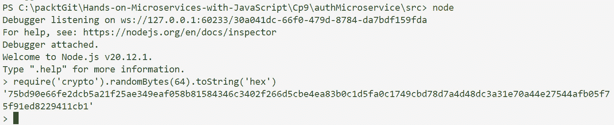
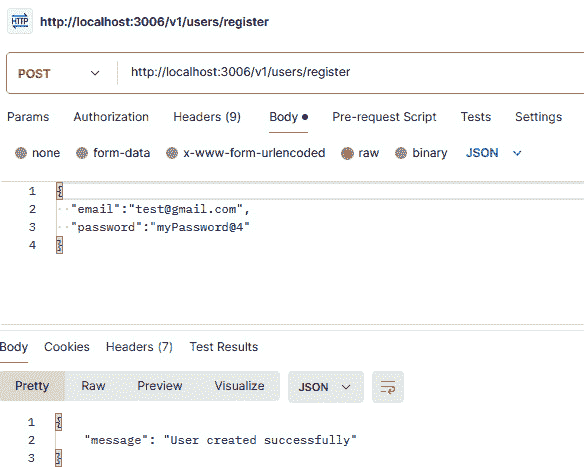
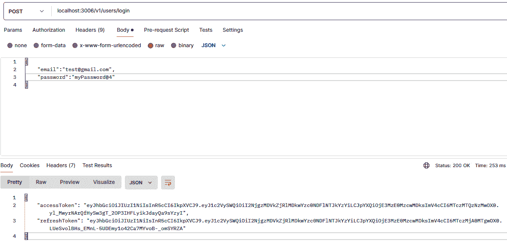
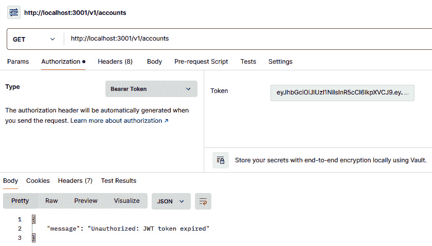
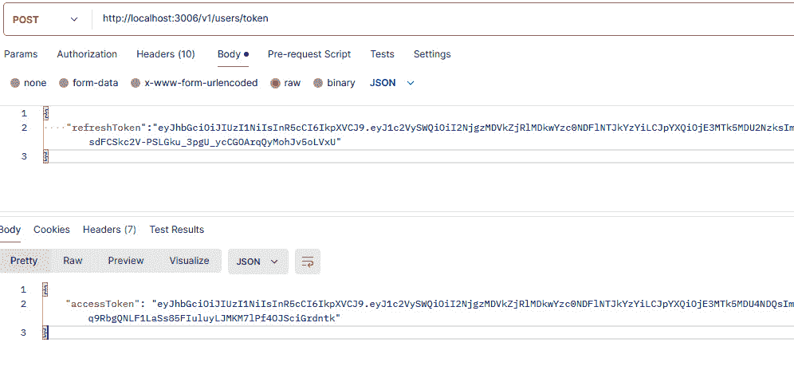
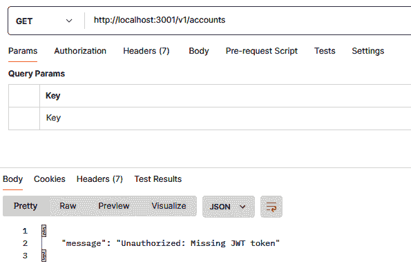
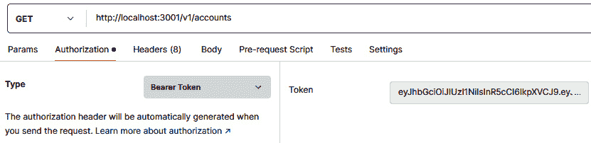
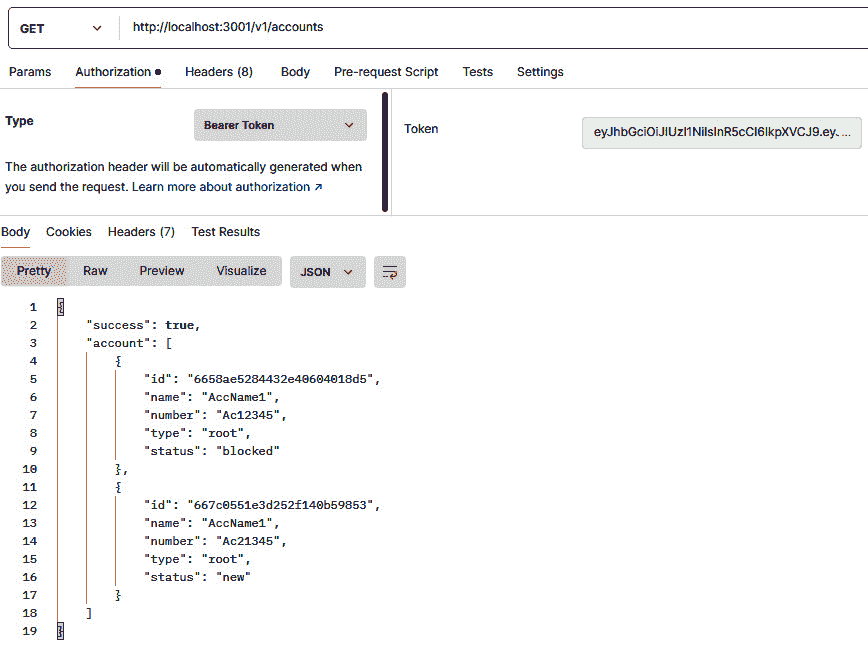

# 保护微服务

在当今的数字世界中，许多应用程序是由较小的、独立的服务共同构建而成的。这些*微服务*提供了灵活性和可扩展性，但保持它们的安全至关重要。想象一下，微服务就像繁忙街道上的一家小商店。您希望确保只有授权的客户可以进入（身份验证）并且只有那些有权限的人可以访问特定区域（授权）。同样，您会加密敏感信息，如信用卡详情（数据加密）。通过不断监控可疑活动并保持商店更新（打补丁），您可以保持一个安全且安全的购物体验。本章将指导您使用类似实用的策略来保护您的微服务，并介绍更多内容！

本章涵盖以下主题：

+   微服务中的安全、身份验证和授权

+   开始使用 JSON Web Tokens

+   实现身份验证微服务

# 技术要求

要跟随本章内容，您需要安装一个 IDE（我们更喜欢 Visual Studio Code）、Postman、Docker 以及您选择的浏览器。

最好从[`github.com/PacktPublishing/Hands-on-Microservices-with-JavaScript/tree/main/Ch09`](https://github.com/PacktPublishing/Hands-on-Microservices-with-JavaScript/tree/main/Ch09)下载我们的存储库，以便轻松跟随我们的代码片段。

# 微服务中的安全、身份验证和授权

在微服务架构中，由于系统的分布式特性，确保强大的安全性、身份验证和授权至关重要。正确实施这些机制可以保护微服务免受未经授权的访问，确保整个系统中的数据完整性和机密性。

## 理解安全性

在微服务中，**安全**指的是用于保护系统组件、数据和通信通道免受未经授权访问、违规和攻击的措施和实践。它包括对每个服务进行单独的安全保护，以及服务之间的交互，确保数据在传输和静止状态下都是安全的。微服务中的安全通常包括加密、身份验证、授权和监控等机制，以保护系统免受漏洞的侵害。

微服务虽然提供了灵活性和可扩展性的优势，但也引入了独特的安全挑战。与具有单一攻击面的单体应用不同，微服务创建了一个具有许多潜在攻击入口点的分布式系统。这就是为什么与单体应用相比，安全性变得更加重要。一个微服务的安全漏洞可以迅速危及整个系统。在我们部署服务之前，我们应该在我们的微服务上提供一个经过充分测试且完全功能的安全层。

## 探索身份验证

**身份验证**是一个验证用户或服务身份的过程，它在确保微服务应用程序安全中起着关键作用。在一个拥有众多访问点的分布式系统世界中，身份验证确保只有授权用户和服务可以与您的微服务交互。

但为什么身份验证在微服务中很有价值呢？让我们在这里回答这个问题：

+   **增强安全性**：微服务创建了一个分布式攻击面。强大的身份验证充当守门人，防止未经授权的访问和潜在的违规行为。

+   **细粒度控制**：身份验证允许您为不同的用户和服务定义访问级别。这确保了只有授权实体可以在每个微服务内执行特定操作。

+   **增强信任**：通过实施强身份验证，您与依赖您的微服务的用户和外部系统建立信任。他们可以确信他们的数据是安全的。

+   **微服务通信安全**：身份验证确保了微服务之间的通信安全。这阻止了未经授权的服务冒充合法服务并访问敏感数据。

由于 Node.js 的包，应用身份验证并不困难，但在开始应用之前，您应该考虑一些微服务和身份验证挑战。我们将在本节中讨论其中的两个。

首个挑战是选择一个**集中式**或**分布式**的身份验证服务。决定采用集中式身份验证服务或将其嵌入到每个微服务中可能是一个挑战。在简单性和潜在的瓶颈之间存在着权衡。让我们在这里看看这两种类型的服务：

+   集中式身份验证服务，也称为**身份提供者**（**IdP**），是一个受信任的第三方系统，它管理着跨多个应用程序或微服务的用户身份验证过程。而不是每个微服务独立处理身份验证，IdP 承担这一责任，提供一致、安全和简化的身份验证机制。

+   分布式身份验证服务涉及每个微服务独立管理其自身的身份验证过程。与集中式系统不同，其中单个身份提供者（IdP）处理身份验证，分布式服务允许每个微服务拥有自己的嵌入式身份验证逻辑，为每个服务提供更大的自主性和灵活性，但同时也引入了维护一致性的复杂性。

在选择集中式和分布式身份验证之间，考虑因素如应用复杂性、可扩展性需求、安全容忍度和开发资源，因为集中式 IdP 简化了安全执行但增加了复杂性，而分布式选项需要每个微服务更多的开发工作。

如果您无法选择其中之一，那么一种*混合*方法可能更适合您的案例。在某些情况下，混合方法可能是一个不错的选择。中央身份提供者（IdP）可以处理用户身份验证并颁发令牌，而各个微服务可以独立验证这些令牌。这种方法在安全、灵活性和弹性之间提供了平衡。正如我们之前提到的，没有一种适合所有情况的解决方案。评估您的具体需求，并选择与您的安全目标和开发需求最佳匹配的方法。

第二个挑战可能是会话管理。传统的会话管理技术可能不适合微服务的无状态特性。**JSON Web Tokens**（**JWTs**）等替代方案通常更受欢迎。我们将在本章后面更详细地讨论 JWTs。

## 定义授权

在微服务中，**授权**至关重要，原因有几个，主要关注安全、资源管理和合规性。它确保只有具有适当权限的用户或服务才能访问或对特定资源或数据进行操作。这防止了未经授权的访问和潜在的滥用。通过*执行*严格的访问控制，潜在的攻击面被最小化。未经授权的用户被限制访问系统的敏感部分，从而降低了数据泄露和其他恶意活动的风险。

微服务通常处理广泛的职能和数据。授权允许对谁可以访问哪些服务以及他们可以执行哪些操作进行细粒度控制，确保资源得到适当使用。通过*定义*明确的访问控制，资源分配和利用更加高效，防止未经授权的资源消耗，这可能会降低系统性能。

在微服务架构中，每个微服务都被设计来执行特定的功能。授权确保每个服务只能访问它所需的数据和操作，促进了最小权限原则。这最小化了潜在的安全风险，并有助于保持一个安全、高效的系统。

通过在所有服务中统一定义和执行访问策略，集中式授权管理可以进一步简化此过程。这种方法简化了访问控制的维护和更新，使得确保微服务生态系统的一致性变得更加容易。

实施授权有多种方式，例如**基于角色的访问控制**（**RBAC**）、**基于属性的访问控制**（**ABAC**）和**基于策略的访问控制**（**PBAC**）。虽然这些内容超出了本书的范围，但通过采用适当的方法，您可以确保您的系统安全策略既强大又适应您的具体需求。

## 授权的最佳实践

最佳实践对于确保在微服务中管理访问控制和授权的稳健性、一致性和效率至关重要。让我们在这里看看一些这些最佳实践：

+   **最小权限原则**: 只授予用户或服务完成工作所需的权限，这有助于减少未经授权访问的机会。

+   **集中式授权管理**: 使用单一系统来管理所有微服务中谁可以访问什么，使其更容易维护并确保安全性。

+   **• 定期审计和审查**: 定期检查和审查谁有权访问什么，以确保一切安全且保持最新。

+   **预留访问**: 根据角色设置权限，确保用户和服务只能访问与其职责相匹配的内容。

+   **令牌过期和撤销**: 使用快速过期的令牌，并在需要时有一种取消它们的方法，以降低令牌被泄露的风险。

我们深入探讨了授权在微服务中的关键重要性及其在维护安全、资源管理和合规性中的作用。现在，让我们区分授权和认证。

## 认证与授权的区别

在微服务架构中，授权在确保资源和数据访问安全方面发挥着关键作用。在深入细节之前，我们需要了解并区分术语**认证**和**授权**。认证验证试图访问系统的用户或服务的身份。它通常涉及检查凭证，如用户名和密码、API 密钥或授权服务器发行的令牌。这类似于在建筑物的入口处检查您的身份证。

另一方面，授权确定经过验证的用户或服务可以在系统中执行哪些操作。它涉及根据用户角色、权限或与请求关联的属性执行预定义规则。这类似于一旦您被验证可以进入建筑物（认证），您的访问卡就决定了您可以进入哪些楼层或区域（授权）。

下面是认证和授权之间的关键区别：

+   **目标**: 认证回答“你是谁？”，而授权回答“你能做什么？”。

+   **时间**: 认证通常首先发生，然后是对特定操作的授权检查。

+   **重点**: 认证处理身份验证，而授权侧重于访问控制。

**微服务和授权**:

在单体系统中，授权通常是集中的。但微服务，由于其分布式特性，需要一种更分布式的授权方法。以下是一些常见的策略：

**• 服务级授权**: 每个微服务管理其资源和数据的授权。

**• API 网关**: 一个中央 API 网关可以在将请求路由到单个服务之前处理授权检查。

**• 专用授权服务**：一个独立的服务管理授权策略并在所有微服务中强制执行

应该选择哪一个？嗯，选择正确的方法取决于诸如系统复杂性、安全要求和可扩展性需求等因素。正如我们之前提到的，让我们一起来了解 JWT。JWT 在分布式系统中广泛用于身份验证和授权目的，如微服务，因为它是无状态的，这意味着服务器不需要存储会话数据。

# 开始使用 JWT

真实世界不断变化，程序需要能够适应处理不同的情况。程序元素也会被评估。你 10 年前使用的技巧可能现在不再有效。

几年前，我们曾经使用过**基于会话的授权**，它简单、流行、易于理解且易于适应。它仍然是一个讨论的话题，但我们更倾向于使用更安全的不同类型的身份验证技术。在切换到 JWT 之前，讨论基于会话的授权是有帮助的。

在这种类型的身份验证中，你输入用户名和密码。服务器检查你的凭据是否有效。如果有效，服务器会创建一个带有唯一标识符（会话 ID）的会话。这个会话 ID 可能会被存储在你的浏览器上的 cookie 中。在会话期间对网站的每次请求，你的浏览器都会将会话 ID 发送回服务器。服务器检查会话 ID，如果有效，则授予访问权限，允许你保持登录状态。会话在一段时间的不活动后（例如，30 分钟）或当你登出时过期。这会使会话 ID 无效。

另一方面，**基于令牌的身份验证**与基于会话的身份验证相比具有几个优势。你的会话依赖于服务器存储有关每个活跃用户的信息。对于拥有大量用户的程序，这可能会变得负担沉重。存储在客户端的令牌减轻了服务器上的这种压力。

第二个重要的区别是，基于会话的身份验证要求服务器为每个用户维护会话数据。基于令牌的身份验证是无状态的，这意味着服务器只验证令牌本身，而不引用任何存储的用户数据。这简化了服务器架构并可能提高性能。

从安全角度来看，令牌可以自包含，包括诸如过期时间和用户角色等信息。这减少了依赖于容易受到盗窃的 cookie 的依赖。此外，令牌可以被配置为短寿命，以最小化被破坏的机会。

令牌的另一个重要特性是灵活性。令牌，如 JWT，可以嵌入除用户身份之外的其他数据。这允许对访问进行更细粒度的控制，并简化授权过程。令牌还可以用于不同服务之间的 API 调用，而会话通常与特定的 Web 应用程序相关联。JWT 是一种紧凑、URL 安全的表示声明的方式，用于在双方之间传输。它通常用于授权目的。JWT 由三部分组成：头部、有效载荷和签名。这些部分由点（`.`）分隔，并以 Base64 URL 格式编码。

**头部**通常由两部分组成：令牌类型（JWT）和正在使用的签名算法，例如*HMAC*-*SHA256*或*RSA*。下面是一个头部的示例：

```js
{
  "alg": "HS256",
  "typ": "JWT"
}
```

**有效载荷**包含声明。**声明**是关于实体（通常是用户）及其附加数据的陈述。有三种类型的声明：

+   `iss`（发行者），`exp`（过期时间），`sub`（主题）和`aud`（受众）。

+   **公共声明**：用户可以定义的自定义声明。它们应该是具有抗碰撞性的名称，例如使用 URI 或命名空间以避免冲突。

+   **私有声明**：创建自定义声明以在同意使用它们的各方之间共享信息。

下面是一个有效载荷的示例：

```js
{
  "sub": "1234567890",
  "name": "David West",
  "admin": true,
  "iat": 1516239022
}
```

最后一个元素是**签名**。要创建签名部分，您需要取编码后的头部、编码后的有效载荷、一个密钥以及头部中指定的算法。签名用于验证 JWT 的发送者是否为它所声称的人，并确保消息在传输过程中未被更改。

例如，如果您使用*HMAC-SHA256*算法，签名将按以下方式创建：

```js
HMACSHA256(
  base64UrlEncode(header) + "." +
  base64UrlEncode(payload),
  secret)
```

算法的输出是三个由点连接的 Base64-URL 字符串，可以在 HTML 和 HTTP 环境中轻松传递。

下面是一个*HMAC-SHA256*输出的示例：

```js
eyJhbGciOiJIUzI1NiIsInR5cCI6IkpXVCJ9.eyJzdWIiOiIxMjM0NTY3ODkwIiwibm FtZSI6IkpvaG4gRG9lIiwiYWRtaW4iOnRydWUsImlhdCI6MTUxNjIzOTAyMn0.SflKxw RJSMeKKF2QT4fwpMeJf36POk6yJV_adQssw5c
```

现在我们已经了解了 JWT 的各个组成部分，让我们通过前面的示例来看看它在身份验证中的工作原理。用户使用其凭据登录。服务器验证凭据并颁发一个使用密钥签名的 JWT。客户端（通常是浏览器）将 JWT（通常在本地存储或 cookie 中）存储起来。

客户端在后续请求的`Authorization`头中发送 JWT 以访问受保护资源：

```js
Authorization: Bearer <token>
```

然后，它进行令牌验证，其中服务器验证令牌的签名并检查其有效性（过期时间、发行者等）。如果令牌有效，服务器将处理请求。在继续之前，重要的是要注意 JWTs 是无状态的、紧凑的且自包含的，这使得它们在不需要服务器端会话存储的情况下安全地传输用户信息非常有效。当使用 JWTs 时，确保密钥安全，始终通过 HTTPS 传输令牌，并使用短期令牌以及定期刷新来降低安全风险。现在我们知道 JWTs 是处理现代网络应用程序中认证和授权的一种强大且灵活的方式，它提供了安全和便利。

现在我们已经讲解了理论部分，接下来让我们进入实践环节，一起实现认证微服务。

# 实现认证微服务

在微服务开发中，为认证和授权（通常称为 Auth 服务）开发一个独立的微服务是一种常见的做法。以下是它的价值所在：

+   **集中式安全管理**：拥有一个专门的 Auth 服务允许我们在一个地方管理认证和授权逻辑。这简化了更新和安全审计，并确保所有微服务之间的一致性规则。

+   **可伸缩性**：Auth 服务可以根据其负载独立扩展，与其他具有不同资源需求的微服务分开。

+   **可重用性**：Auth 服务可以被所有其他微服务重用，减少代码重复并促进一致性。

+   **提高可维护性**：将认证逻辑隔离出来，使得维护和更新系统的安全方面变得更加容易。

+   **关注点分离**：将认证和授权从其他微服务中解耦，使它们的职责更加集中，促进代码的整洁性和更好的可维护性。

+   **灵活性**：专门的 Auth 服务可以被设计成支持不同的认证流程（例如 OAuth、JWT）和授权策略（例如 RBAC），为你的微服务架构提供一个灵活的基础。

让我们一起实现我们的 Auth 微服务。我们将使用之前所做的方式，通过 ExpressJS 开发我们的新微服务。大部分事情都是相同的。你应该在你的电脑上任何你想创建的位置打开/创建一个新的文件夹，并输入 `npm init -y` 来初始化我们的项目。在整个开发过程中，我们将使用以下库：`bcryptjs`、`dotenv`、`express`、`joi`、`jsonwebtoken` 和 `mongoose`。

注意

`npm init -y` 命令不会自动在 `package.json` 中生成脚本部分。你需要手动添加它以简化应用程序的运行。

让我们浏览一下我们的 `package.json` 文件：

+   `bcryptjs`: 这个库提供了安全的密码散列和比较功能。它允许您在数据库中安全地存储密码，并验证用户登录尝试与散列密码。

+   `dotenv`: 这个库帮助您从`.env`文件中加载环境变量。这是一种安全地存储敏感信息（如 API 密钥、数据库凭据和您的 JWT 密钥）的方法，将它们从代码中排除。

+   `express`: 这是一个流行的 Node.js 网络框架，它帮助您构建 Web 应用程序和 API。它提供了一种结构化的方法来处理请求、路由、中间件和响应。

+   `joi`: 这个库为进入您应用程序的数据提供模式验证。您可以为请求体定义验证规则，并确保接收到的数据符合您期望的格式和结构，从而提高数据完整性并防止潜在错误。

+   `jsonwebtoken` (JWT): 这个库帮助您处理 JWT。它允许您生成用于身份验证的令牌，以安全且可验证的格式包含用户信息。您可以使用 JWT 在您的微服务中授权用户访问受保护资源。

+   `mongoose`: 这是一个 Node.js 中 MongoDB 的**对象数据建模（ODM**）库。它通过将您的应用程序数据模型映射到 MongoDB 文档，提供了一个方便的方式来与 MongoDB 数据库交互。它简化了数据操作和检索。

我们需要一个安全的方式来存储用户信息，数据库通常用于此目的。`mongoose`包将帮助我们与数据库交互。为了连接和断开与数据库的连接，在`src/db`文件夹下创建一个名为`index.js`的新文件，其内容与*第五章*中的内容相同。

在`src/models`文件夹下，创建一个名为`user.js`的新文件，包含以下代码块：

```js
const mongoose = require('mongoose');
const bcrypt = require('bcryptjs');
const userSchema = new mongoose.Schema({
    email: {
        type: String,
        required: true,
        unique: true
    },
    password: {
        type: String,
        required: true
    }
});
// Hash password before saving
userSchema.pre('save', async function (next) {
    if (this.isModified('password')) {
        const salt = await bcrypt.genSalt(10);
        this.password = await bcrypt.hash(this.password, salt);
    }
    next();
});
module.exports = mongoose.model('User', userSchema);
```

您可以扩展此模式以包含更多信息，但为了演示身份验证和授权，我们只需要这些字段。

我们已经在之前的章节中讨论了`mongoose`，这就是为什么我们将跳过已知细节。这里唯一的新逻辑是与散列密码一起工作。当我们通过 API 创建用户时，我们将提供一个电子邮件和密码。出于安全原因，我们需要在将密码存储到数据库之前对其进行散列。

以`userSchema.pre("…")`开始的代码是一个`mongoose`中间件函数，它在用户文档保存到数据库之前执行。这个中间件确保我们的数据库中永远不会以纯文本形式存储密码。在保存之前，它会安全地散列密码，使得从存储的散列中恢复原始密码在计算上是不切实际的。

现在，我们需要提供一个与数据库交互的服务层。为了简单起见，您可以跳过这一层，但为了提供一个完整的画面，我们将包括它。在`src/services`文件夹下，创建一个名为`user.js`的新文件，包含以下代码块：

```js
const User = require('../models/user');
const createUser = async (userData) => {
    const user = new User(userData);
    await user.save();
    return user;
};
const getUserById = async (userId) => {
    return await User.findById(userId);
};
const getUserByEmail = async (email) => {
    return await User.findOne({ email: email });
};
// ... Add methods for other user operations (e.g., update, delete)
module.exports = { createUser, getUserById, getUserByEmail };
```

为了简化，我们没有实现完整的 CRUD 操作。为了演示我们的功能，我们只需要其中的一些，例如 `create` 和 `get user`。

现在，让我们切换到我们的控制器，看看我们如何创建一个用户。在 `src/controllers` 文件夹下，创建一个名为 `user.js` 的新文件，并包含以下代码块：

```js
const userService = require('../services/user');
const bcrypt = require('bcryptjs');
const jwt = require('jsonwebtoken');
const path = require('path');
const { createConfig } = require('../config/config');
// Register a new user
const createUser = async (req, res) => {
    try {
        const { email, password } = req.body;
        const existingUser = await userService.getUserByEmail(email);
        if (existingUser) {
            return res.status(400).json({ message: 'Email already 
              exists' });
        }
        const user = await userService.createUser({ email, password 
          });
        res.status(201).json({ message: 'User created successfully', 
          user: user });
    } catch (error) {
        console.error(error);
        res.status(500).json({ message: 'Server error' });
    }
};
```

此代码片段定义了一个名为 `createUser` 的异步函数，用于处理 Node.js 应用程序中的用户注册。以下是详细信息：

+   `const createUser = async (req, res) => { ... }`：这定义了一个名为 `createUser` 的异步函数，它接受两个参数，`req`（请求对象）和 `res`（响应对象）。

+   `const { email, password } = req.body;`：这从请求体（`req.body`）中提取了 `email` 和 `password` 属性。这些属性假设由客户端在注册请求中发送。

+   `const existingUser = await userService.getUserByEmail(email);`：这调用 `userService` 中的一个函数（用于检查是否已存在提供电子邮件的用户。它等待结果（`existingUser`）。

+   `if (existingUser) { ... }`：如果 `existingUser` 不是 `null`（表示存在具有该电子邮件的用户），则返回一个包含表示电子邮件冲突的消息的 `400 Bad Request` 响应。

+   `const user = await userService.createUser({ email, password });`：如果电子邮件是唯一的，它调用 `userService` 中的另一个函数（可能是用于用户创建的函数），传递一个包含提取的电子邮件和密码的对象。它等待结果（`user`），这是新创建的用户文档。

+   `.status(201).json({ message: 'User created successfully', user: user });`：如果用户创建成功，它发送一个包含消息和新生成的用户对象（`user`）的 `201 Created` 响应。

+   一个 `try...catch` 块：这将核心逻辑包裹在一个 `try`-`catch` 块中，以处理注册过程中可能出现的任何潜在错误。

+   `res.status(500).json({ message: 'Server error' });`：在出现任何错误的情况下，它发送一个通用的 `500 Internal Server Error` 响应。

+   `createUser`：此函数为我们应用程序中的用户注册提供了一个基本结构。它检查电子邮件冲突，将用户创建逻辑委托给单独的服务，并使用适当的响应处理成功和错误情况。

但创建用户还不够。我们需要实现登录/登录功能。在同一个文件中，我们有以下代码用于登录：

```js
const loginUser = async (req, res) => {
    try {
        const { email, password } = req.body;
        // Fetch user by email
        const user = await userService.getUserByEmail(email);
        if (!user) {
            return res.status(401).json({ message: 'Invalid email or 
              password' }); // Use 401 for unauthorized
        }
        // Compare password hashes securely using bcrypt
        const isMatch = await bcrypt.compare(password, user.password);
        if (!isMatch) {
            return res.status(401).json({ message: 'Invalid email or 
              password' });
        }
        const configPath = path.join(__dirname, '../../configs/.env');
        const appConfig = createConfig(configPath);
        const payload = { userId: user._id }; // Include only essential user data
        const jwtSecret = appConfig.jwt.access_token; // Replace with your secret from an environment variable
        const accessToken = await jwt.sign(payload, jwtSecret, { 
          expiresIn: '1h' }); // Set appropriate expiration time
        // Send successful login response
        res.status(200).json({ accessToken: accessToken });
    } catch (error) {
        console.error(error);
        res.status(500).json({ message: 'Server error' });
    }
};
```

代码定义了一个名为 `loginUser` 的异步函数，该函数用于处理 Express.js 应用程序中的用户登录。以下是它的功能分解：

+   `const loginUser = async (req, res) => { ... }`：这定义了一个名为 `loginUser` 的异步函数，它接受两个参数，`req`（请求对象）和 `res`（响应对象）。

+   `const { email, password } = req.body;`：这从请求体（`req.body`）中提取了 `email` 和 `password` 属性。这些属性假设由客户端在登录请求中发送。

+   `const user = await userService.getUserByEmail(email);`：这调用 `userService`（可能是另一个模块）中的函数来获取具有提供的电子邮件的用户。它等待结果（`user`）。

+   `if (!user) { ... }`：如果 `user` 是 `null`（表示没有找到具有该电子邮件的用户），则返回一个包含表示凭据无效的消息的 `401 未授权` 响应。

+   `const isMatch = await bcrypt.compare(password, user.password);`：这使用 `bcrypt.compare` 将提供的密码与从获取的用户文档（`user.password`）中存储的散列密码进行比较。它等待结果（`isMatch`），这是一个布尔值，指示密码是否匹配。

+   `if (!isMatch) { ... }`：如果 `isMatch` 是 `false`（表示密码不匹配），则返回一个包含表示凭据无效的消息的 `401 未授权` 响应。

+   `const configPath = path.join(__dirname, '../../configs/.env');`：这构建了环境变量文件的路径（假设它位于当前文件上方四个文件夹处）。

+   `const appConfig = createConfig(configPath);`：这调用一个函数来读取和解析 `.env` 文件中的环境变量。

+   `const payload = { userId: user._id };`：这为 JWT 创建一个包含用户 ID 的有效载荷对象。这里只包含必要用户数据。

+   `const jwtSecret = appConfig.jwt.access_token;`：这从解析后的环境配置中检索 JWT 访问令牌秘密。

+   `const accessToken = await jwt.sign(payload, jwtSecret, { expiresIn: '1h' });`：这使用 `jsonwebtoken` 使用有效载荷、密钥和一小时过期时间（`expiresIn: '1h'`）来对 JWT 进行签名。它等待生成的令牌（`accessToken`）。

+   `res.status(200).json({ accessToken: accessToken });`：如果登录成功，它发送一个包含生成的 `accessToken` 的 `200 OK` 响应体。

总体而言，登录函数使用 JWT 认证提供了一个安全的登录流程。它获取用户、验证凭据、使用秘密密钥生成 JWT，并将其发送回客户端以进行后续的授权访问。

为了拥有一个完全功能的登录功能，我们需要提供秘密访问令牌。在 JWT 中，秘密访问令牌在确保令牌的完整性和真实性方面起着至关重要的作用。当创建 JWT 时，使用秘密访问令牌通过加密散列算法（例如 HMAC-SHA256）对头部和有效载荷（包含用户信息）进行签名。这个秘密密钥就像一个只有签发 JWT 的服务器和验证它的方才知道的密码。当客户端在授权头中发送 JWT 以访问受保护资源时，服务器接收该令牌。

服务器使用相同的秘密访问令牌来验证接收到的 JWT 的签名。此验证过程确保以下内容：

+   该令牌在传输过程中未被篡改。

+   该令牌确实是由一个可信的来源（知道秘密的服务器）签发的。

如果秘密访问令牌被泄露（例如，泄露或被盗），任何拥有秘密的人都可以伪造看起来有效的 JWT，可能冒充合法用户并获取对资源的未授权访问。因此，秘密访问令牌对于维护基于 JWT 的认证的安全性至关重要。永远不要在代码或应用程序内部存储秘密访问令牌。使用环境变量或专门的秘密管理服务来保持其机密性。为您的秘密访问令牌选择一个密码学上强大的随机字符串（理想情况下，至少 256 位），使其难以猜测或破解。考虑定期轮换您的秘密访问令牌以减轻潜在泄露的影响。通过遵循这些实践，您可以在应用程序中利用 JWT 的益处进行安全的认证，同时最大限度地减少与秘密访问令牌相关的风险。

在实现访问令牌时，请注意不要生成长期有效的访问令牌。长期有效的访问令牌存在安全风险，因为如果被盗，它们允许攻击者长时间访问，并且撤销它们是困难的。相比之下，刷新令牌通过允许发行短期访问令牌提供更好的安全性，限制了潜在的损害。它们还允许更细粒度的控制，因为泄露的令牌可以单独列入黑名单，而不会影响其他令牌，减少了频繁认证的需求并降低了服务器负载。

刷新令牌在用户便利性（避免频繁登录）和安全之间提供了一个良好的平衡。尽管与访问令牌相比，它们的过期时间更长，但它们的使用仅限于获取新的、短期有效的访问令牌。

在实施我们的刷新令牌之前，考虑为访问令牌提供有限的时间，因为短期访问令牌在泄露的情况下减少了滥用的风险，最小化了攻击者的机会窗口。在这个例子中，我们将它设置为`5`分钟。五分钟后，给定的访问令牌将过期，我们应该将刷新令牌发送到新的端点以获取新的短期访问令牌。首先，让我们修改我们的登录端点以返回刷新令牌：

```js
const jwtRefreshTokenSecret = appConfig.jwt.refresh_token;
        const accessToken = await jwt.sign(payload, jwtSecret, { expiresIn: '5m' }); // Set appropriate expiration time
        const refreshToken = await jwt.sign(payload, jwtRefreshTokenSecret, { expiresIn: '7d' });
        // Send successful login response
        res.status(200).json({ accessToken: accessToken, refreshToken: refreshToken });
```

我们使用相同的方法来获取两个令牌。对于刷新令牌，我们设置一个稍长的周期，例如七天。我们将创建一个新的端点来返回新的访问令牌，这就是为什么我们需要在我们的控制器中添加新的功能：

```js
const getAccessTokenbyRefreshToken = async (req, res) => {
    try {
        const refreshToken = req.body.refreshToken;
        if (!refreshToken) {
            return res.status(400).json({ message: 'Missing refresh 
              token' });
        }
        const configPath = path.join(__dirname, '../../configs/.env');
        const appConfig = createConfig(configPath);
        const refreshTokenSecret = appConfig.jwt.refresh_token;
        // Verify the refresh token
        jwt.verify(refreshToken, refreshTokenSecret, (err, decoded) => 
          {
            if (err) {
                return res.status(401).json({ message: 'Invalid 
                  refresh token' });
            }
            const userId = decoded.userId;
            // Generate a new access token
            const newAccessTokenPayload = { userId };
            const newAccessToken = jwt.sign(newAccessTokenPayload,
              appConfig.jwt.access_token,
              { expiresIn: '5m' });
            res.status(200).json({ accessToken: newAccessToken });
        });
    } catch (error) {
        console.error(error);
        res.status(500).json({ message: 'Server error' });
    }
};
```

此功能允许用户通过提供刷新令牌（类似于备用钥匙）来获取新的访问令牌（访问资源的密钥）。它使用密钥检查刷新令牌是否有效。如果有效，它可以生成一个新的、短期有效的访问令牌（默认过期时间为 5 分钟）供用户使用。这样，用户不需要频繁登录，但仍然可以通过短期访问令牌保持安全性。

存储刷新令牌的最佳实践涉及安全性和用户便利性之间的平衡。以下是你需要了解的内容：

+   由于 JavaScript 的可访问性和通过 XSS 攻击的潜在盗窃，刷新令牌不应存储在浏览器 cookie 中。

+   如果使用 cookie，请选择带有`Secure`标志设置的`HttpOnly` cookie。这阻止 JavaScript 访问并减轻 XSS 攻击。然而，这种方法有局限性（例如，在跨站上下文中，不是所有浏览器都支持）。

+   另一方面，本地存储是一个可行的选项，但实施安全措施，如静态和传输中的加密，以保护令牌在泄露时。评估提供安全本地存储机制的库或框架。

+   在某些场景中，你可能考虑将刷新令牌存储在服务器端（例如，数据库）以增加安全性或集中管理。然而，这并不总是必要的，并且会增加复杂性。

+   虽然刷新令牌的过期时间比访问令牌长（例如，几天或几周），但应避免过长的持续时间，以最大限度地减少泄露时的潜在损害。

+   实施一种机制，在一段时间的不活跃期（例如，一周）或用户登出后，将刷新令牌列入黑名单。这阻止攻击者无限期地使用被盗令牌。

+   考虑刷新令牌轮换。当使用刷新令牌颁发新的访问令牌时，生成一个新的刷新令牌并存储它。这减少了单个刷新令牌在较长时间内被泄露的风险。

+   如果性能和快速访问是首要任务，考虑使用 Redis 的速度和自动处理过期时间。然而，如果需要，解决潜在的持久性问题。

+   如果数据持久性和与现有数据库的集成至关重要，可以将刷新令牌存储在数据库中作为选项。然而，与 Redis 相比，评估潜在的性能影响。

要访问我们新的控制器功能，为它提供一个路由。打开`routes/v1/users/index.js`文件并添加以下行：

```js
router.post('/token', validate(loginSchema),userController.getAccessTokenbyRefreshToken);
```

就这些了。现在我们有了注册、登录和检索新访问令牌的端点。

我们将秘密令牌和刷新令牌存储在`.env`文件中。在`src`文件夹同一级别创建一个`configs`文件夹，并添加一个包含以下内容的`.env`文件：

```js
PORT=3006
MONGODB_URL=mongodb://localhost:27017/auth-microservice #provide your MONGO_URL
SECRET_ACCESS_TOKEN={YOUR_SECRET_KEY}
SECRET_REFRESH_TOKEN={YOUR_REFRESH_TOKEN}
```

为了生成刷新和秘密令牌，执行以下操作：

1.  打开终端并输入`node`。

1.  在给定的输入窗口中，输入`require('crypto').randomBytes(64).toString('hex')`。

以下图示展示了你可以多么容易地完成它：



图 9.1：生成秘密令牌

每次调用最后一个命令时，你都会得到一个不同的生成结果。只需复制该值并将其粘贴到`.env`文件中，与`SECRET_ACCESS_TOKEN`配对。尝试第二次使用相同的注释以获取一个完全不同的值，并将其粘贴为`SECRET_REFRESH_TOKEN`。刷新令牌和秘密令牌必须具有不同的值。

如您所知，我们有一个 `src/config` 文件夹，其中包含 `config.js`，它可以以编程方式读取 `.env` 文件。我们向其中添加了读取令牌的功能。

下面是这个样子：

```js
const dotenv = require('dotenv');
const Joi = require('joi');
const envVarsSchema = Joi.object()
    .keys({
        PORT: Joi.number().default(3006),
        MONGODB_URL: Joi.string().required().description('Mongo DB url'),
        SECRET_ACCESS_TOKEN: Joi.string().hex().required(),
        SECRET_REFRESH_TOKEN: Joi.string().hex().required(),
    })
    .unknown();
function createConfig(configPath) {
    dotenv.config({ path: configPath });
    const { value: envVars, error } = envVarsSchema
        .prefs({ errors: { label: 'key' } })
        .validate(process.env);
    if (error) {
        throw new Error(`Config validation error: ${error.message}`);
    }
    return {
        port: envVars.PORT,
        mongo: {
            url: envVars.MONGODB_URL,
        },
        jwt: {
            access_token: envVars.SECRET_ACCESS_TOKEN,
            refresh_token: envVars.SECRET_REFRESH_TOKEN
        }
    };
}
module.exports = {
    createConfig,
};
```

此代码提供了一个名为 `jwt` 的对象，用于访问刷新和密钥令牌。

如您所猜测，我们尚未直接验证用户提供的数据。我们需要验证数据，这就是为什么我们计划使用与账户微服务相同的结构。在 `src/middlewares` 文件夹下，我们有相同的 `validate.js` 文件来验证我们的模式。这就是我们没有在每个端点实施验证的主要原因。现在是时候为电子邮件和密码验证提供规则了。在 `src/validation` 文件夹下创建 `user.js`，并包含以下代码块：

```js
const Joi = require('joi');
const loginSchema = Joi.object({
    body: Joi.object().keys({
        email: Joi.string()
            .required()
            .error(errors => {
                if (errors[0].code === 'any.required') {
                    return new Error('Email is required');
                }
                if (errors[0].code === 'string.email') {
                    return new Error('Invalid email format');
                }
                return errors;
            }),
        password: Joi.string()
            .min(6) // Minimum password length
            .required()
            .error(errors => {
                if (errors[0].code === 'any.required') {
                    return new Error('Password is required');
                }
                if (errors[0].code === 'string.min') {
                    return new Error('Password must be at least 6 characters long');
                }
                return errors;
            })
    })
});
module.exports = { loginSchema };
```

此代码片段使用 `Joi` 定义了一个针对应用程序中登录请求的特定验证模式。它专注于请求体，确保它包含一个有效的电子邮件地址和密码，该密码满足最小长度要求（在本例中定义为六个字符）。该模式还提供了关于缺失或无效电子邮件和密码的详细自定义错误消息，通过引导用户到正确的凭据格式来改善用户体验。通过实施此验证，您可以防止格式错误的登录请求到达后端逻辑，并增强应用程序的整体安全性。

我们可以直接在我们的控制器中提供路由，但我们将遵循我们在实现账户微服务之前所遵循的相同约定。因此，在 `routes/v1/users` 文件夹下，创建一个包含以下内容的 `index.js` 文件：

```js
const { Router } = require('express');
const userController = require('../../../controllers/user');
const { loginSchema } = require('../../../validation/user');
const validate = require('../../../middlewares/validate');
const router = Router();
router.post('/register', validate(loginSchema), userController.createUser);
router.post('/login', validate(loginSchema), userController.loginUser);
module.exports = router;
```

代码定义了两个端点。一个用于注册（`/register`），另一个用于登录（`/login`）功能。`routes/v1` 文件夹还包含一个包含以下内容的 `index.js` 文件：

```js
const { Router } = require('express');
const userRouter = require('./users');
const router = Router();
router.use('/users', userRouter);
module.exports = router;
```

如您所见，我们使用了我们在账户微服务中使用的相同代码。我们只是将路由更改为 `users`。现在，用户可以使用 `v1/user/{endpoint_name}` 访问我们的端点。我们微服务的最后元素是 `app.js` 和根 `index.js` 文件，它们与我们的已实现的账户微服务相同。

让我们测试我们的身份验证微服务的端点。从终端运行 `npm start`，并准备我们的 `POST` 请求来创建用户：

1.  打开 Postman 应用程序。

1.  创建一个新的 Postman 请求窗口。

1.  将 **GET** 改为 **POST**。

1.  提供端点 URL（对我们来说它是 `http://localhost:3006/v1/users/register`）。

1.  前往 **Body**，选择 **raw**，然后选择 **JSON**。

1.  提供一个有效载荷并点击 **Send**（*图 9**.2*）。



图 9.2：成功的注册

用户已准备好。现在，我们可以获取 JWT。以下是获取 JWT 的步骤：

1.  创建一个新的 Postman 请求窗口。

1.  将 **GET** 改为 **POST**。

1.  提供端点 URL（对我们来说它是 `http://localhost:3006/v1/users/login`）。

1.  前往 **Body**，选择 **raw**，然后选择 **JSON**。

1.  提供有效载荷并点击 **发送**（*图 9**.3*）。



图 9.3：成功登录

生成的访问令牌将在给定的时间段内过期（*图 9**.4*）。过期后，我们不需要提供电子邮件和密码来获取新的访问令牌。我们可以简单地使用刷新令牌来刷新并获取新的访问令牌。



图 9.4：关于过期令牌的消息

但如果你想要基于刷新令牌的新访问令牌呢？这很简单。下面是如何做的：

1.  在 Postman 的新窗口中，将请求类型设置为 `v1/users/token` 端点。

1.  打开 **正文** 部分，提供刷新令牌。点击 **发送** 按钮（*图 9**.5*）。



图 9.5：基于刷新令牌获取新的访问令牌

现在，你可以使用这个访问令牌来访问我们的账户微服务资源。嗯，就是这样。现在是时候在我们的账户微服务中测试 JWT 了。

## 集成基于令牌的认证到账户微服务

我们迄今为止实现的微服务还没有认证和授权功能。作为作业，你可以开始将它们集成进去，为了学习目的，我们将为账户微服务实现 JWT。打开我们迄今为止开发的账户微服务。为了使用来自 Auth 微服务的相同访问令牌，账户微服务应该使用相同的密钥令牌。打开 `configs/.env` 文件并添加以下行：

```js
SECRET_ACCESS_TOKEN={USE_THE_SAME_TOKEN_YOU_USED_IN_AUTH_MICROSERVICE}
```

打开 `config/config.js` 文件，按照以下步骤修改以读取密钥令牌配置字段：

```js
const dotenv = require('dotenv');
const Joi = require('joi');
const envVarsSchema = Joi.object()
    .keys({
        ....
        SECRET_ACCESS_TOKEN: Joi.string().hex().required(),
       .....
    })
    .unknown();
function createConfig(configPath) {
    .............
    return {
        ..............
        jwt: {
            access_token: envVars.SECRET_ACCESS_TOKEN
        }
    };
}
module.exports = {
    createConfig,
};
```

我们需要添加到账户微服务的唯一真正功能是一个用于验证我们的令牌的中间件。

在 `src/middlewares` 文件夹下，创建一个名为 `verify.js` 的文件，内容如下：

```js
const jwt = require('jsonwebtoken');
const path = require('path');
const { createConfig } = require('../config/config');
const verifyJWT = (req, res, next) => {
    const authHeader = req.headers.authorization;
    // Check for presence and format of Authorization header
    if (!authHeader || !authHeader.startsWith('Bearer ')) {
      return res.status(401).json({
        message: 'Unauthorized: Missing JWT token',});
    }
    const token = authHeader.split(' ')[1];
    const configPath = path.join(__dirname, '../../configs/.env');
    const appConfig = createConfig(configPath);
    // Verify the JWT token
    jwt.verify(token, appConfig.jwt.access_token, (err, decoded) => {
      if (err) {
        // Handle JWT verification errors
        if (err.name === 'JsonWebTokenError') {
          return res.status(401).json({
            message: 'Unauthorized: Invalid JWT token format',
          });
        } else if (err.name === 'TokenExpiredError') {
            return res.status(401).json({
              message: 'Unauthorized: JWT token expired',
            });
          } else {
              // Handle other errors (e.g., signature verification failure)
              console.error('JWT verification error:', err);
              return res.status(500).json({
                message: 'Internal Server Error',});
          }
      }
      // Attach decoded user information to the request object
      req.user = decoded;
      next(); // Allow the request to proceed
    });
};
module.exports = verifyJWT;
```

这段代码定义了一个名为 `verifyJWT` 的中间件函数，用于 Express.js 应用程序。它处理传入请求的 JWT 验证。它检查请求中是否存在授权头，并且以 `Bearer` 开头。如果没有，它将返回一个 `401 未授权` 响应，表明缺少 JWT。

如果头部存在并且格式正确，它将从授权头中提取 JWT 本身。我们的中间件构建了包含 JWT 密钥的环境变量文件的路径。它调用一个函数（可能来自一个单独的 `config` 模块）来读取和解析配置。

然后，我们使用 `jsonwebtoken.verify()` 函数来验证从配置中检索到的密钥密钥提取的令牌。如果验证失败（`err`），它将检查错误类型：

+   `JsonWebTokenError`：表示无效的令牌格式，返回带有特定信息的 `401`

+   `TokenExpiredError`：表示令牌已过期，返回带有特定信息的 `401`

+   其他错误（例如签名验证失败）被记录，并出于安全原因发送通用的 `500 内部服务器错误` 响应。

如果验证成功（`!err`），它将 JWT 中解码的用户信息附加到 `req.user` 对象中，以便在您的应用程序逻辑中进行进一步访问。

最后，它调用 `next()` 以允许请求继续到预期的路由处理程序。

总体而言，这个中间件充当守门人，确保只有具有有效 JWTs 的请求才能访问您应用程序中的受保护资源。

为了使用我们的中间件，我们在 `app.js` 文件中导入它并使用它：

```js
const express = require('express');
const v1 = require('./routes/v1');
const consumerModule = require('./modules/kafkamodule');
const morganMiddleware = require('./middlewares/morganmiddleware');
const jwtVerifyMiddleware = require('./middlewares/verify');
const app = express();
app.use(jwtVerifyMiddleware);
app.use(morganMiddleware);
consumerModule();
app.use(express.json());
// V1 API
app.use('/v1', v1);
module.exports = app;
```

代码导入我们的中间件并使用它。现在，让我们运行账户微服务并尝试获取所有账户信息。执行以下操作：

1.  导航到 `Ch09/accountservice` 文件夹。

1.  为了正确运行账户微服务，您还需要从根目录运行 `docker-compose` 文件，使用 `docker-compose up -``d` 命令。

1.  执行完两个 `docker-compose` 设置后，通过运行 `npm start` 命令启动账户微服务。

1.  打开 Postman 并向 `v1/accounts` 发送一个 `GET` 请求（在我们的例子中，它是 `http://localhost:3001/v1/accounts`）。

1.  您将收到一个关于未授权请求的消息（*图 9**.6*）。



图 9.6: 未授权访问

1.  现在，运行我们的身份验证微服务，并按照我们在身份验证微服务中提到的步骤操作以获取访问令牌（*图 9**.3*）。对于对账户微服务的相同查询，只需从 Postman 中打开 **授权** 部分，将授权类型更改为 **Bearer Token**，并将从身份验证服务中获得的令牌粘贴到输入框中（*图 9**.7*）。



图 9.7: 访问账户微服务

1.  按下 **发送** 按钮，我们就可以开始了：



图 9.8: 获取账户微服务资源

如果您正确地遵循了步骤，现在您应该能够检索账户数据。在下一章中，我们将深入了解可观察性，并探讨如何使用 ELK 堆栈来实现它。

# 摘要

本章探讨了身份验证、授权的基本安全概念及其在保护微服务中的作用。我们阐明了验证用户身份（身份验证）和确定访问权限（授权）对于系统安全性的重要性。

为了实现这一点，我们实现了一个专门的微服务来颁发访问令牌（JWTs）和刷新令牌。JWTs 授予临时访问权限，而刷新令牌允许用户在不重新输入凭据的情况下获取新的访问令牌。一个实际演示展示了该微服务如何与另一个微服务，即账户微服务交互。

在我们接下来的章节中，我们将探讨微服务的监控及其在微服务架构中的重要性。我们将在账户微服务中实现日志记录功能，并将其与**Elasticsearch、Logstash 和 Kibana**（**ELK**）堆栈集成。这将建立一个集中式日志系统，实现高效的日志收集、分析和可视化。
