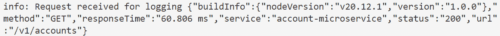
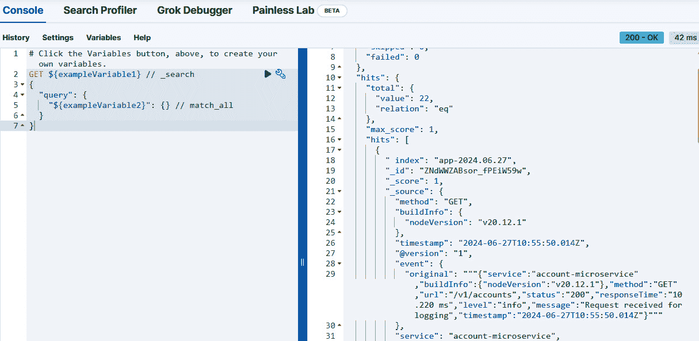

# 监控微服务

**微服务**已成为构建可扩展和灵活应用程序的核心架构方法，但确保它们的健康和性能与它们的功能一样重要。没有适当的可见性，在如此分布式的系统中识别问题就像在海绵中寻找针一样。想象一下，将监控和日志记录视为在繁忙城市的不同部分放置摄像头和传感器，其中每个微服务都是一个商店。这些工具帮助您观察系统如何运行，捕捉关键事件，并检测任何异常行为。通过建立强大的日志和监控实践，您可以快速定位问题，并确保微服务平稳运行。

本章涵盖了以下主题：

+   可观察性的重要性

+   日志记录简介

+   使用**Elasticsearch、Logstash 和 Kibana**（**ELK**）堆栈进行集中式日志记录

# 技术要求

为了跟随本章内容，我们需要安装一个 IDE（我们更喜欢 Visual Studio Code），Postman，Docker 以及您选择的浏览器。

我们建议您从[`github.com/PacktPublishing/Hands-on-Microservices-with-JavaScript/tree/main/Ch10`](https://github.com/PacktPublishing/Hands-on-Microservices-with-JavaScript/tree/main/Ch10)下载我们的存储库，以便轻松跟随我们的代码片段。

# 可观察性的重要性

在软件的世界里，尤其是在微服务领域，**可观察性**至关重要。它通过分析其输出，使我们能够深入了解系统的工作方式。可观察性是监控和理解系统的重要概念。它指的是通过检查系统的输出而获得系统内部工作情况洞察的能力。让我们尝试理解其构建块：

+   **日志**：日志是系统内部发生事件的详细记录。它们提供了发生事件的记录，包括错误、警告和信息性消息。日志可以通过显示系统活动的逐步记录来帮助识别和诊断问题。

+   **指标**：指标是表示系统性能和行为数值。它们可以包括 CPU 使用率、内存消耗、请求速率和错误率等数据。指标提供了系统健康和性能的定量度量。

+   **警报**：当指标达到特定阈值时，会触发警报。它们用于实时通知管理员或操作员潜在问题或异常行为，以便快速响应问题。

+   **跟踪**：跟踪提供了对系统请求流程的详细视图。它们显示了请求如何从一个组件移动到另一个组件，突出了系统不同部分之间的交互和依赖关系。跟踪有助于理解请求的路径，并识别瓶颈或故障点。

可观察性通过使用日志、指标、警报和跟踪来帮助理解系统内部正在发生的事情。日志提供了事件的详细记录，指标提供了性能的数值数据，警报通知潜在问题，而跟踪显示了请求的流程。这些输出共同提供了一个系统的全面视图，有助于监控、故障排除和优化性能。

现在我们已经介绍了概念，让我们深入探讨微服务日志记录的世界。

# 日志记录简介

你有没有开过仪表盘损坏的汽车？速度表可能卡住，燃油表可能不可靠，警告灯可能神秘地闪烁。如果没有关于发动机运行状况的明确信息，就很难诊断问题或确保安全行驶。

在软件的世界里，尤其是在使用微服务构建的复杂系统中，日志记录扮演着类似的角色。**日志**是系统内部事件和活动的详细记录。

当你在构建微服务时，仅仅考虑业务实现是不够的。微服务本质上很复杂，有许多独立的服务相互交互。日志记录有助于理解单个服务的表现并定位特定服务中的问题。当事情出错时，日志提供了审计跟踪以诊断和修复问题。它们有助于识别错误、丢失的请求或性能瓶颈。每个微服务应用程序都应该有一个适当的日志记录机制。

日志记录微服务对于诊断至关重要，但它也带来了挑战，例如处理不同机器和语言之间的分布式日志的大量数据，这使得聚合和解释它们变得更加困难。此外，遗漏关键细节和确保日志中的敏感信息安全存储增加了有效管理日志的复杂性。

通过理解这些挑战，我们可以实施有效的日志记录策略，让我们的微服务团队保持沟通，并确保系统平稳运行。

## 日志级别和节点库

在实际示例之前，我们需要了解一些与日志记录相关的基础知识，其中之一就是**日志级别**。不同的日志级别用于对日志消息的严重性或重要性进行分类。

**错误日志**捕获需要立即关注的严重问题，例如崩溃或系统故障，而**警告日志**则突出可能需要调查的潜在问题。**信息日志**跟踪一般系统操作，**调试日志**提供详细的诊断信息，而**跟踪日志**提供最细粒度的日志记录，用于跟踪执行流程。

当然，您不需要从头开始实现日志算法。Node.js 的一个优点是它为我们提供了一系列酷炫的库供我们使用。当我们构建我们的微服务时，我们有不同的流行日志库可以集成和使用。当您记录微服务时，您可以使用 `winston`、`pino`、`morgan`（Express.js 的日志中间件）、`bunyan`、`log4js` 等等。我们将在本章中集成 `winston` 和 `morgan` 作为日志库，但选择其中一个取决于您。

## 日志格式

在 Node.js 微服务中，日志格式可以分为非结构化日志、结构化日志和半结构化日志。以下是每种日志的解释：

+   **非结构化日志**：非结构化日志涉及编写纯文本日志消息。这种格式简单直接，但可能更难通过程序解析和分析。以下是一个展示非结构化日志的示例：

    ```js
    const logger = console;
    logger.log('Server started on port 3000');
    logger.error('Database connection failed: connection
      timeout');
    logger.info('User login successful: userId=12345');
    ```

+   `.csv`、`.xml` 或其他格式，但最常用的格式是 JSON。这种方法使得通过程序搜索、过滤和分析日志变得更加容易。以下是一个展示结构化日志的示例：

    ```js
    {
      "level": "error",
      "time": "2024-06-26T12:34:57.890Z",
      "service": "my-microservice",
      "buildInfo": {
        "nodeVersion": "v16.13.0",
        "commitHash": "abc123def456"
      },
      "msg": "Failed to connect to database",
      "eventId": "evt-2000",
      "correlationId": "corr-67890",
      "stack": "Error: Connection timeout\n    at Object.<anonymous> (/path/to/your/file.js:15:19)\n    at Module._compile (internal/modules/cjs/loader.js:999:30)\n    at Module.load (internal/modules/cjs/loader.js:985:32)\n    at Function.Module._load (internal/modules/cjs/loader.js:878:14)\n    at Function.executeUserEntryPoint [as runMain] (internal/modules/run_main.js:71:12)\n    at internal/main/run_main_module.js:17:47",
      "source": {
        "file": "/path/to/your/file.js",
        "line": 15,
        "function": "logError"
      }
    }
    ```

+   **半结构化日志**：它结合了非结构化和结构化日志的元素。它通常涉及在纯文本日志中的一致模式或分隔符，这使得它们比完全非结构化的日志更容易解析，但不如完全结构化的日志健壮。

我们探讨了日志在微服务中的重要性，以及其挑战，并讨论了不同的日志级别、流行的 Node.js 日志库以及如何为您的微服务选择正确的日志格式。现在，让我们来看看日志的最佳实践。

## 日志的最佳实践

有效的日志可以帮助您理解系统行为、诊断问题和监控性能。以下是 Node.js 微服务日志的一些基本最佳实践：

+   **使用结构化日志格式**：确保日志是结构化的（例如，JSON），以便日志管理工具可以轻松解析和搜索。这有助于更有效地进行日志分析和过滤。

+   **包含上下文信息**：通过时间戳、服务名称、关联 ID 和用户信息等上下文信息丰富日志，以便在微服务之间进行更好的跟踪和关联。

+   **在适当的级别记录日志**：应用合适的日志级别（错误、警告、信息、调试、跟踪），根据严重性对日志消息进行分类，这有助于根据相关性过滤日志和进行故障排除。

+   **避免记录敏感信息**：在记录之前，确保敏感数据（如密码和个人详细信息）被删除或屏蔽，以保持安全和合规性。

+   **集中日志**：使用如 ELK 堆栈或基于云的日志服务之类的工具，在集中位置聚合所有微服务的日志，以实现简化的监控、分析和警报。

这些实践将帮助您确保您的日志记录既高效又安全，可扩展，从而更容易监控系统行为，诊断问题，并维护整体性能。

## 在您的微服务中实现日志记录

由于 Node.js 的包，实现日志记录实际上非常简单。在本节中，我们将使用`winston`和`morgan`来演示在微服务中日志记录的使用。让我们将日志支持集成到我们之前开发的`Account`微服务中。为了跟随本章内容，请访问我们的 GitHub 仓库，并使用您喜欢的 IDE 下载源代码和`Ch10`。我们计划将监控功能集成到我们在*第九章*中实现的微服务中。您只需复制`Ch09`文件夹并开始工作即可。

要在账户微服务中安装`winston`和`morgan`库，请从`accountservice`文件夹运行以下命令：

```js
npm install -E winston morgan
```

现在，我们的`package.json`文件应该包含适当的版本以使用这些库。让我们首先尝试使用`winston`进行日志记录。在`src/log`文件夹下创建一个名为`logger.js`的文件，并包含以下内容：

```js
const winston = require('winston');
const logger = winston.createLogger({
    level: process.env.LOG_LEVEL || 'info',
    defaultMeta: {
        service: "account-microservice",
        buildInfo: {
            version: '1.0.0',
            nodeVersion: process.version
        }
    },
    transports:
        [new winston.transports.Console({
            format: winston.format.combine(
                winston.format.colorize(),
                winston.format.simple()
            )
        }),
        new winston.transports.File({
            format: winston.format.combine(
                winston.format.json(),
                winston.format.timestamp()
            ),
            filename: 'combined.log'
        }),
        new winston.transports.File({
            format: winston.format.combine(
                winston.format.json(),
                winston.format.timestamp()
            ),
            filename: 'error.log',
            level: 'error'
        })
        ]
});
module.exports = {
    logger
};
```

此代码定义了 Node.js 中名为`account-microservice`的应用程序的`winston`日志记录器。让我们一步一步地分解代码：

+   `const winston = require('winston');`: 这行代码导入了`winston`库，这是一个流行的 Node.js 日志框架。

+   `const logger = winston.createLogger({...});`: 这行代码创建了一个新的`winston`日志记录器实例，并将其存储在`logger`常量中。大括号（`{}`）包含日志记录器的配置选项。

+   `level: process.env.LOG_LEVEL || 'info'`: 这设置了将被捕获的日志的最小严重级别。它首先检查`LOG_LEVEL`环境变量。如果没有设置，则默认为`'info'`级别。存在诸如`'error'`、`'warn'`、`'info'`、`'debug'`等级别，其中`'error'`是最严重的。

+   `defaultMeta`: 这定义了将被附加到每个日志消息的附加信息。这里，它包括服务名称（`account-microservice`）和构建信息（版本和`nodeVersion`）。

+   `transports`: 这配置了日志消息将被发送到何处。这里，它是一个定义了三个传输的数组：

    +   `winston.transports.Console`: 这将日志发送到控制台（通常是您的终端）

+   `format: winston.format.combine(...)`: 这定义了当日志消息发送到控制台时将如何格式化。它组合了两个格式化程序：

    +   `winston.format.colorize()`: 这为控制台输出添加颜色，以便更好地阅读。

    +   `winston.format.simple()`: 这以简单的文本格式格式化消息。

+   `winston.transports.File({ filename: 'combined.log' })`: 这将所有日志（基于级别设置）发送到名为`combined.log`的文件中。

+   `format: winston.format.combine(...)`: 与控制台类似，它组合了格式化程序：

    +   `winston.format.json()`: 这会将消息格式化为 JSON 对象，以便机器更容易解析。

    +   `winston.format.timestamp()`: 这会给每个日志消息添加时间戳。

+   `winston.transports.File({ filename: 'error.log', level: 'error' })`: 这只会将错误级别的日志发送到名为`error.log`的单独文件。它使用相同的格式化程序（`json`和`timestamp`）。

+   `module.exports =[];:` 这行代码使得创建的日志记录器（`logger`）可以在应用的其它部分导入和使用。

总结来说，这段代码为我们的应用设置了一个全面的日志系统。它将消息记录到控制台和文件中，根据严重程度进行不同的格式化和过滤。这使我们能够轻松监控应用行为，调试问题，并分析日志以获得更深入的见解。

让我们将日志集成到`accountController`中，看看结果。这里是一个简化的版本：

```js
const accountService = require('../services/account');
const { logger } = require('../log/logger');
const getAccountById = async (req, res) => {
    logger.info('getAccountById method called', { accountId: req.params.id });
….
```

当你调用负责执行`getAccountById`方法的端点时，你将在终端看到一个日志消息和一个`combined.log`文件。我们还把日志集成到我们应用的`index.js`中，以查看应用运行是否一切正常：

```js
{
  "buildInfo": {
    "nodeVersion": "v20.12.1",
    "version": "1.0.0"
  },
  "level": "info",
  "message": "account service started",
  "port": 3001,
  "service": "account-microservice"
}
{
  "accountId": "6658ae5284432e40604018d5",
  "buildInfo": {
    "nodeVersion": "v20.12.1",
    "version": "1.0.0"
  },
  "level": "info",
  "message": "getAccountById method called",
  "service": "account-microservice"
}
```

如果你有任何错误，你将在终端看到错误消息，并且它将自动添加到`error.log`文件中。

在 Node.js 中，尤其是在使用 Express.js 构建 Web 应用时，`morgan`包是一个流行的工具，用于简化 HTTP 请求日志记录。它自动捕获并记录有关应用接收到的请求的信息。

这里是为什么你可能需要使用它的原因：

+   `morgan`通过自动捕获诸如请求方法、URL、状态码、响应时间等信息来消除这一点。这节省了开发时间并确保了日志记录的一致性。

+   `morgan`提供了关于你的应用如何处理请求的宝贵见解。这对于调试目的至关重要，可以帮助你识别应用请求处理中的潜在问题或性能瓶颈。

+   **监控应用流量**：通过审查日志，你可以更好地了解应用流量模式。这对于监控整体应用健康、识别使用趋势以及就扩展或资源分配做出明智决策非常有用。

+   (`combined`, `common`, 和 `dev`)，它们针对不同级别的细节。你也可以创建自定义格式来捕获与你的应用需求相关的特定数据点。

我们已经安装了`morgan`包，现在是时候使用它了。我们通常将其用作中间件，以下是如何实现自己的`morgan`中间件的步骤。在`src/middlewares`文件夹下创建一个名为`morganmiddleware.js`的新文件。将以下内容复制粘贴到其中：

```js
const fs = require('fs');
const path = require('path');
const morgan = require('morgan');
const { logger } = require('../log/logger-logstash');
const morganFormat = JSON.stringify({
    method: ':method',
    url: ':url',
    status: ':status',
    responseTime: ':response-time ms',});
// Path to the combined.log file
const logFilePath = path.join(__dirname,
  '../../combined.log');
// Create a write stream for the log file
const logFileStream = fs.createWriteStream(logFilePath,
  { flags: 'a' });
// Custom message handler function for logging
function messageHandler(message) {
    const parsedMessage = JSON.parse(message.trim());
    // Write log to logstash
    logger.info('Request received for logging',
      parsedMessage);
    // Also write the log to combined.log file
    logFileStream.write(`${message}\n`);
}
// Create morgan middleware with custom format and stream
const morganMiddleware = morgan(morganFormat, {
    stream: {
        write: messageHandler,
    },
});
module.exports = morganMiddleware;
```

此代码定义了一个用于使用 `morgan` 库以 JSON 格式记录 HTTP 请求的自定义中间件函数。该代码定义了一个使用 `morgan` 中间件在 Node.js 应用程序中记录 HTTP 请求的日志机制。它将日志记录与 `combined.log` 文件和 Logstash 服务器集成，以进行外部日志管理。

`morganFormat` 是一个自定义格式，它记录每个请求的 HTTP 方法、URL、状态码和响应时间等详细信息。然后，这些日志由自定义的 `messageHandler` 函数处理。

在 `messageHandler` 中，传入的日志消息被解析为一个 JSON 字符串到对象。然后，解析后的日志通过 `logger.info` 函数发送到 Logstash，该函数是从 `logger-logstash` 模块导入的。同时，原始的日志消息也被写入一个名为 `combined.log` 的本地文件。这是通过使用 Node.js 的 `fs` 模块创建一个写入流到文件来完成的，它将每个新的日志追加到文件中。

最后，使用 `morgan` 函数创建了自定义的 `morganMiddleware`，日志流被定向到 `messageHandler`。然后，这个中间件被导出，以便在其他应用程序部分用于日志记录目的。

此设置确保 HTTP 请求日志既记录在本地文件中，也发送到外部 Logstash 服务进行进一步处理。

我们已经完成了中间件功能，现在是时候应用它了。打开 `app.js`，这是我们配置中间件流程的地方，并进行以下更改：

```js
const morganMiddleware = require('./morganmiddleware');
const app = express();
app.use(morganMiddleware);
```

在中间件流程中的所有其他内容之前，我们需要使用 `morganMiddleware`，现在你可以通过 `winston` 移除之前所做的日志记录函数。运行应用程序并调用你想要的任何端点。在运行账户微服务之前，确保 Docker 正在运行，并使用适当的 `docker-compose` 文件。别忘了运行两个 `docker-compose` 文件（`accountservice/docker-compose.yml` 和 `accountservice/elk-stack/docker-compose.yml`）。

这是日志记录的终端输出：



图 10.1：日志的终端输出

检查 `combined.log` 文件和终端窗口以查看日志。

在下一节中，我们将介绍集中式日志记录。

# 使用 Elasticsearch、Logstash 和 Kibana (ELK) 堆栈进行集中式日志记录

在微服务架构中，应用程序被分解为独立、松散耦合的服务，**集中式日志记录**对于有效的监控和故障排除变得至关重要。我们有充分的理由使用它：

+   **分散的日志**：通常，日志会散布在各个微型应用程序中。想象一下在它们之间寻找问题——就像在杂乱的房子里找一只丢失的袜子一样！

+   **一次性查看所有内容**：集中式日志记录将所有日志集中在一个地方，就像把所有的袜子都放在篮子里一样。这样，你可以轻松地看到一切是如何工作的，以及是否有任何部分引起麻烦。

+   **更快地解决问题**：所有日志都在一个地方，就像有一个超级放大镜来查找问题。您可以快速搜索日志以查看发生了什么，节省您的时间和挫败感。

+   **关注细节**：集中式日志记录通常与监控工具一起工作，就像有一个袜子的仪表板。这使您能够看到一切的表现如何，并识别任何缓慢的区域。

+   **日志管理变得简单**：将所有内容集中在一起使得管理日志变得更加简单。就像有一个专门的袜子抽屉！可以使用工具来保持事物有序，删除旧日志，并遵循您需要遵循的任何规则。

通过使用集中式日志记录，您将获得一个强大的工具来监控您的微服务，更快地解决问题，并保持一切运行顺畅。

在构建微服务时，我们有多种不同的选项来实现集中式日志记录，其中之一就是 ELK 堆栈。

**ELK 堆栈**是一套强大的工具，用于集中式日志记录、实时搜索和数据分析。以下是每个组件的简要概述：

+   **Elasticsearch**：这是一个分布式搜索和分析引擎。我们使用它来快速存储、搜索和分析大量数据，几乎实时。Elasticsearch 建立在 Apache Lucene 之上，并为与您的数据交互提供了一个 RESTful 接口。

+   **Logstash**：这是一个服务器端数据处理管道，可以同时从多个来源摄取数据，对其进行转换，然后将它发送到您选择的*stash*，例如 Elasticsearch。它可以处理各种数据格式，并提供丰富的插件来执行不同的转换和增强。

+   **Kibana**：这是一个用于分析并可视化存储在 Elasticsearch 中的数据的数据可视化和探索工具。它提供了一个用户友好的界面，用于创建仪表板和执行高级数据分析。

但它们是如何协同工作的呢？好吧，Logstash 从各种来源（例如，服务器日志、应用程序日志、网络日志）收集和处理日志数据，并将其转发到 Elasticsearch。Elasticsearch 索引并存储数据，使其几乎实时可搜索。Kibana 连接到 Elasticsearch，并提供查询、可视化和分析数据的工具，使用户能够创建自定义仪表板和报告。

使用 ELK 堆栈有多个好处：

+   **可扩展性**：ELK 堆栈可以水平扩展，允许您处理大量日志数据。

+   **实时洞察**：Elasticsearch 的实时搜索功能提供了对数据的即时洞察。

+   **灵活性**：Logstash 从各种来源和格式摄取数据的能力使其非常灵活。

+   **可视化**：Kibana 丰富的可视化选项使您能够创建用于监控和分析的交互式仪表板。

+   **开源**：ELK 堆栈是开源的，拥有庞大的社区和丰富的插件和扩展。

和往常一样，我们更喜欢通过 Docker 安装工具，这也适用于 ELK 堆栈。转到 `Ch10/accountservice/elk-stack` 文件夹，并使用 `docker-compose up -d` 命令运行 `docker-compose.yml` 文件。我们不会深入探讨 `docker-compose` 的细节，因为我们已经在之前的章节中介绍过了。简单来说，我们在给定的 `docker-compose.yml` 文件中安装了 Elasticsearch、Logstash 和 Kibana。

## Logstash 的简要介绍

我们可以使用 Logstash 收集和转换日志。我们能够从多个不同的来源获取输入，例如其他应用程序生成的日志、纯文本或网络。对于日志摄取，我们有不同的方法可以遵循：

+   **直接传输**: 我们可以将我们的应用程序配置为直接向 Elasticsearch 发送数据。是的，这是一个选项，但不是一种理想的日志摄取方式。

+   **将日志写入文件**: 正如我们在微服务中实现的那样，实现此类类型的日志记录是更可取的，因为其他应用程序，如作为独立进程的 Logstash，将能够读取、解析并将数据转发到 Elasticsearch。这需要更多的配置，但它是更健壮且更可取的生产日志记录方式。

Logstash 配置通常写入配置文件（例如，`logstash.conf`）。此文件由三个主要部分组成：`input`、`filter` 和 `output`。每个部分定义了数据处理管道的不同方面。以下是每个部分的分解和示例配置：

+   `input` 部分定义了 Logstash 应从何处收集数据。这可能是文件、syslog、**传输控制协议**（**TCP**）/ **用户数据报协议**（**UDP**）端口或其他各种来源。

+   `filter` 部分用于处理和转换数据。过滤器可以解析、丰富和修改日志数据。常见的过滤器包括用于模式匹配的 `grok`、用于修改字段的 `mutate` 和用于解析日期/时间信息的 `date`。

+   `output` 部分指定了处理后的数据应发送到何处。这可能是 Elasticsearch、文件、消息队列或其他目的地。

要查看详细说明的实际操作，只需打开 `logstash.conf` 文件：

```js
input {
  tcp {
    port => 5000
  }
}
filter {
  json {
    source => "message"
  }
}
output {
  elasticsearch {
    hosts => ["elasticsearch:9200"]
    index => "app-%{+YYYY.MM.dd}"
  }
  stdout { }
}
```

让我们深入了解给定配置的细节：

+   `tcp { port => 5000 }`: 此部分定义了一个 `input` 插件，它监听端口 `5000` 上通过 TCP 套接字传入的数据。任何发送到该端口的日志或事件都将被 Logstash 摄取。

+   `json { source => "message" }`：此 `filter` 插件解析传入的数据，假设其格式为 JSON，并从名为 `message` 的字段中提取值。这个字段很可能是实际日志内容所在的位置。通过将其解析为 JSON，Logstash 可以理解数据的结构，并在后续处理步骤中使其更容易处理。*   `elasticsearch { hosts => ["elasticsearch:9200"], index => "app-%{+YYYY.MM.dd}" }`：此 `output` 插件将处理后的数据发送到 Elasticsearch，这是一个针对处理大量日志数据进行了优化的搜索和分析引擎。主机选项指定了 Elasticsearch 实例的位置（可能运行在名为 `elasticsearch` 的机器上，默认端口为 `9200`）。*   `index` 选项定义了一个动态索引命名模式。每天的日志将存储在名为 `app-YYYY.MM.dd` 的单独索引中（其中 `YYYY` 代表年份，`MM` 代表月份，`dd` 代表日期）。这种模式有助于高效的日志管理，并允许你轻松地搜索特定日期的日志。*   `stdout { }`：此 `output` 插件简单地将处理后的数据打印到控制台（标准输出），用于调试或监控目的。空的大括号 (`{}`) 表示标准输出的默认配置。

此 Logstash 配置从 TCP 源摄取数据，解析 JSON 格式的日志，然后将它们发送到 Elasticsearch 进行存储和分析。为有序日志管理创建每日索引。`stdout` 插件提供了一种在开发或故障排除期间查看处理数据的方法。

让我们将日志集成到我们的账户微服务中。在 `accountmicroservice/src/log` 文件夹下创建一个名为 `logger-logstash.js` 的新文件，内容如下：

```js
const winston = require('winston');
const LogstashTransport = require('winston-logstash
  /lib/winston-logstash-latest.js');
const serviceName = 'account-microservice'
const logstashTransport = new LogstashTransport({
    host: 'localhost',
    port: 5000
})
const logger = winston.createLogger({
    level: 'info',
    format: winston.format.combine(winston
      .format.timestamp(), winston.format.json()),
    defaultMeta: {
        service: serviceName,
        buildInfo: {
            nodeVersion: process.version
        }
    },
    transports: [
        new winston.transports.Console({
            format: winston.format.combine(
                winston.format.colorize(),
                winston.format.simple()
            )
        }),
        logstashTransport
    ]
})
module.exports = {
    logger
};
```

我们已经讨论了 `winston` 配置，这里唯一的新内容是 `logstashTransport`。我们添加了两个 `transports` 通道：一个用于终端的控制台，另一个用于将日志发送到 `logstash`。要使用给定的文件与 `morgan` 一起使用，只需将 `morganmiddleware.js` 的记录器更改为以下内容：

```js
const { logger } = require('./log/logger-logstash');
```

现在，运行我们的应用程序并访问 `http://localhost:5601`；这是我们使用的 Kibana。从左侧菜单中，找到 **管理** | **开发工具**。点击 **执行** 按钮，你将看到日志的总值（*图 10.2*.2*）



图 10.2：从 Kibana 获取日志

现在，我们的日志正在流入 ELK 堆栈。你可以将 Elasticsearch 视为一个具有数据仓库功能的搜索和分析引擎。

## 对 Elasticsearch 的简要介绍

**Elasticsearch** 是一个为速度和可扩展性而构建的强大搜索引擎。在其核心，它是一个分布式系统，旨在几乎实时地存储、搜索和分析大量数据。它是面向文档的，并使用 JSON。

让我们更深入地了解 Elasticsearch 的关键属性：

+   **分布式**：Elasticsearch 可以在集群中的多个节点（服务器）上存储数据。这种分布允许以下操作：

    +   **容错性**：如果一个节点失败，其他节点可以处理请求，保持您的搜索服务正常运行。

    +   **横向扩展**：随着您的数据量或搜索流量的增长，您可以轻松地向集群添加更多节点。

+   **可扩展性**：如前所述，Elasticsearch 在横向扩展方面表现出色。您可以向集群添加更多节点来处理不断增长的数据和搜索需求。这种可扩展性使其适用于大型数据集和高搜索量。

+   **搜索和分析**：Elasticsearch 专注于全文搜索，它分析您文档的整个文本内容。这使得您能够在数据中搜索关键词、短语，甚至概念。它还提供了强大的分析功能。您可以聚合数据，识别趋势，并从搜索结果中获得洞察。

+   **灵活的搜索**：Elasticsearch 提供了广泛的查询选项。您可以搜索特定术语，根据各种标准过滤结果，并执行复杂的聚合。这种灵活性允许您根据特定需求定制搜索，并从数据中挖掘有价值的信息。

+   **搜索速度**：由于其分布式架构和高效的索引技术，Elasticsearch 提供了快速的搜索结果。这对于用户期望对其查询立即做出响应的应用程序至关重要。

在本节中，我们简要概述了 Elasticsearch，重点关注使其成为搜索和数据分析强大工具的核心属性。

## 对 Kibana 的简要介绍

**Kibana** 是我们 ELK 堆栈中的最后一项。它是数据存储和搜索功能的可视化层，补充了 Elasticsearch 的数据存储和搜索能力。它是一个开源平台，充当您 Elasticsearch 数据的窗口，让您能够通过清晰的可视化来探索、分析和理解它。

Kibana 有以下有趣的潜力：

+   **可视化强大**：Kibana 允许您创建包含各种图表、图形和地图的交互式仪表板。这种视觉表示将原始数据转化为易于消化的洞察。

+   **数据探索**：Kibana 提供了在 Elasticsearch 中探索、搜索和过滤数据的工具。您可以深入了解特定细节，并揭示隐藏的模式。

+   **共享洞察**：创建的仪表板可以与他人共享，促进协作并推动数据驱动的决策。

选择 Kibana 用于微服务有以下几个令人信服的理由：

+   **无缝集成**：作为 ELK 堆栈（Elasticsearch、Logstash 和 Kibana）的一部分，Kibana 与 Elasticsearch 无缝集成。这种紧密集成简化了在 Elasticsearch 中可视化存储数据的流程。

+   **实时洞察**：Kibana 允许您几乎实时地可视化数据，在数据流进来时提供有价值的见解。这对于需要立即对变化做出响应的应用程序至关重要。

+   **自定义选项**：Kibana 提供了广泛的可视化自定义选项。您可以根据自己的特定需求定制仪表板，并有效地向您的受众传达见解。

+   **开源和免费**：作为开源软件，Kibana 可以免费使用，并提供了一个充满活力的社区以支持和发展。

微服务架构涉及多个独立服务协同工作。Kibana 在此环境中表现出色，原因有以下几点：

+   **监控性能**：在 Kibana 仪表板上可视化微服务的关键指标，以监控其健康和性能。这有助于识别瓶颈并确保平稳运行。

+   **日志分析**：在 Kibana 中集中和分析来自所有微服务的日志。这种统一的视图简化了故障排除和定位系统中的错误。

+   **应用洞察**：通过在 Kibana 中可视化使用模式和趋势，了解用户如何与您的微服务互动。这些数据可以指导开发工作并改善用户体验。

学习 ELK 堆栈，深入了解 Elasticsearch 查询和与 Kibana 相关的主题，例如自定义仪表板，以及与指标一起工作，这些都超出了本书的范围，这就是为什么我们只通过一个简单的介绍来结束本章。

# 摘要

本章深入探讨了微服务架构中监控和日志记录的关键方面，强调了可观察性在维护分布式系统健康和性能中的重要性。我们首先解释了可观察性如何通过日志、指标、警报和跟踪等关键组件提供对系统行为的深入洞察。

然后，我们将重点转向微服务中日志记录的重要性，这对于捕获系统事件的详细记录、识别性能瓶颈和实时诊断问题至关重要。我们探讨了不同的日志级别——错误、警告、信息、调试和跟踪——并讨论了它们如何根据严重程度对日志消息进行分类，从而提高故障排除效率。此外，本章还涵盖了 Node.js 中流行的日志库，如 `winston` 和 `morgan`。

在理论基础上，我们通过将 `winston` 和 `morgan` 集成到账户微服务中，展示了如何在现实场景中实现日志记录。

本章接着转向集中式日志记录，介绍了强大的 ELK 堆栈。我们解释了 Logstash 如何收集和处理日志数据，Elasticsearch 如何存储和索引数据以进行实时搜索，以及 Kibana 如何通过交互式仪表板可视化信息。通过整合这些工具，我们建立了一个集中式日志系统，简化了日志收集、分析和可视化。

在下一章中，我们将探讨如何有效地使用流行的微服务架构元素来管理多个微服务。你将了解如何使用 API 网关，它作为一个单一入口点来管理请求并将它们引导到正确的服务，以及通过 CQRS 和事件溯源这两种重要方法来组织系统内的数据和操作，这些方法有助于处理复杂的数据流。到结束时，你将清楚地理解以高效且易于维护的方式构建和连接服务的方法。
