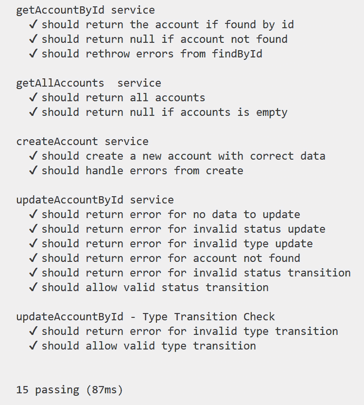
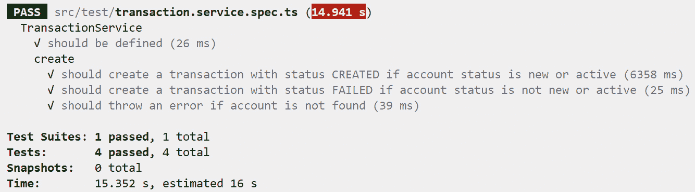
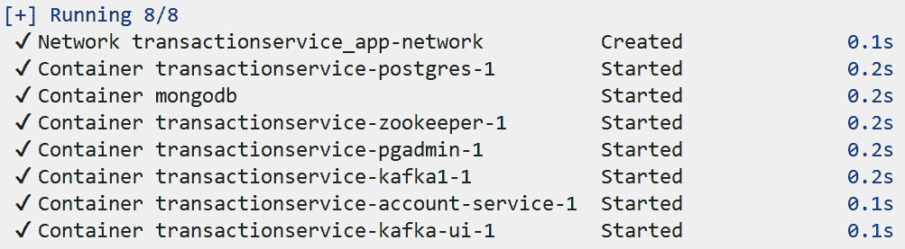

# 12

# 测试微服务

测试是**软件开发生命周期（SDLC**）中的一个关键阶段，对于确保软件满足所需标准并按预期运行至关重要。测试可以检测开发过程中引入的错误。它验证软件是否正确且高效地执行其预期功能，并确保软件满足用户需求和规格。通过应用测试，我们可以降低软件故障或故障的风险。

在本章中，我们将讨论微服务内部软件测试的不同策略。到本章结束时，您将了解如何为您的微服务编写单元和集成测试，无论是独立还是与其他微服务集成。

我们将涵盖以下主题：

+   理解微服务架构中的测试

+   理解和实现单元测试

+   为账户微服务实现单元测试

+   为事务微服务编写单元测试

+   在单元测试中比较模拟、存根和间谍

+   理解和实现集成测试

# 技术要求

要实现我们的测试，我们需要以下内容：

+   您选择的 IDE（我们更喜欢 Visual Studio Code）。

+   本书可在[`github.com/PacktPublishing/Hands-on-Microservices-with-JavaScript`](https://github.com/PacktPublishing/Hands-on-Microservices-with-JavaScript)的 GitHub 仓库中下载。打开`Ch12`文件夹，以便您可以轻松地跟随。

# 理解微服务架构中的测试

微服务架构将应用程序划分为更小、松散耦合的服务，每个服务负责特定的业务功能。这种方法提供了许多好处，例如提高了可扩展性和灵活性。然而，它也引入了复杂性，尤其是在测试方面。全面的测试对于确保这些独立服务正确且协同工作至关重要。让我们尝试理解在微服务架构中测试的重要性：

+   在微服务架构中使用测试的第一个原因是确保**功能**。每个服务在微服务架构中执行一个独特的功能，并且是独立开发的。测试确保每个服务正确执行其预期功能。我们主要使用单元和功能测试来实现这一目标：

    +   **单元测试**关注服务内的单个组件，验证每个函数是否按预期工作。这有助于我们在开发早期阶段捕捉到错误。

    +   另一方面，**功能测试**确保服务整体满足其功能要求。这涉及到测试服务的端点，并确保它们返回预期的结果。

+   在微服务中使用测试的第二个原因是保持**互操作性**。微服务必须相互通信才能作为一个整体应用运行。确保服务之间无缝的互操作性至关重要。为此，我们主要关注集成和契约测试：

    +   **集成测试**关注服务之间的交互，验证数据交换和通信协议是否正确实现。

    +   **契约测试**确保服务遵守定义的 API 或契约。当不同团队独立开发服务时，这尤其重要，因为它有助于保持一致的通信标准。

+   第三个原因是**性能**保证。性能测试确保服务在各种负载条件下高效运行，这对于维护良好的用户体验至关重要。我们可以通过负载测试和压力测试来实现这一目标：

    +   **负载测试**评估服务处理预期负载水平的能力。这有助于识别性能瓶颈并确保服务能够处理实际使用情况。

    +   **压力测试**检查服务在极端条件下的表现，如高流量或资源短缺。这有助于了解服务的断裂点和弹性。

+   测试对于**安全性**验证也很重要。在微服务架构中，安全性是一个关键问题，因为每个服务都可能处理敏感数据，必须保护其免受漏洞的侵害。我们可以使用安全测试和渗透测试来实现我们的目标：

    +   **安全测试**识别漏洞并确保服务能够保护敏感数据。这包括测试常见的安全问题，如 SQL 注入、**跨站脚本攻击**（**XSS**）和身份验证缺陷。

    +   **渗透测试**模拟攻击以识别潜在的安全漏洞。这有助于主动保护服务免受现实世界威胁。

+   微服务需要可靠和稳定，尤其是在更新或变更期间。测试确保服务在长时间内保持**可靠**。

    +   **回归测试**确保新的更改或更新不会引入新的错误或破坏现有功能。这对于在每次部署后维护服务可靠性至关重要。

    +   **混沌工程**涉及故意引入系统故障以测试其弹性。这有助于我们了解服务如何应对意外问题并提高整体稳定性。

在整体理解测试之后，让我们继续探讨单元测试。

# 理解单元测试

**单元测试**是一种软件测试技术，当你想要确保软件的各个单元或组件在隔离状态下被测试时最为重要。单元测试的目的是验证每个软件单元是否按预期执行。

它是软件开发的重要方面，尤其是在微服务架构中。Node.js 以其异步和事件驱动的特性，为单元测试带来了独特的挑战和机遇。在这种情况下，单元测试涉及测试 Node.js 应用程序中的单个函数、方法或类。让我们来谈谈单元测试对微服务的重要性：

+   **它确保了代码质量**：单元测试有助于在开发周期早期识别错误，确保代码单元按预期工作。这在微服务中尤为重要，因为服务被设计成小、独立和模块化。

+   **它促进了重构**：拥有全面的单元测试套件，开发者可以自信地重构代码，知道任何更改都将通过测试得到验证。这对于随着时间的推移维护和改进代码库至关重要。

+   **它支持持续集成/持续部署（CI/CD）**：单元测试是 CI/CD 管道的组成部分。它们对代码更改提供即时反馈，使快速迭代和稳定部署成为可能。

+   **更好的文档**：良好的单元测试充当代码的文档。它们展示了各个单元预期如何表现，使得新开发者更容易理解代码库。

让我们来看看在 Node.js 微服务中进行单元测试的一些好处：

+   **提高了可靠性**：单元测试确保每个微服务按预期行为，减少了运行时错误的可能性，并提高了整体系统的可靠性。

+   **更快的开发周期**：自动化的单元测试通过允许开发者快速识别和修复问题，从而加速开发过程。这在微服务中尤其有益，因为服务是独立开发和部署的。

+   **减少了调试时间**：有了单元测试，可以快速检测和隔离错误，从而减少调试时间。

+   **增加了对代码更改的信心**：单元测试为开发者提供了一个安全网，使他们有信心进行更改和添加新功能，而不会破坏现有功能。

在 Node.js 微服务中进行单元测试增强了可靠性，通过早期捕捉问题来加速开发，减少调试时间，并提高开发者对在不破坏功能的情况下进行代码更改的信心。现在，让我们专注于编写单元测试所需的单元测试包。

## 介绍单元测试包

在编写任何代码行之前，我们需要准备我们的环境。更准确地说，我们需要安装编写单元测试所需的包。

Chai、Mocha 和 Sinon 是 Node.js 应用程序（包括微服务）中常用的库，用于测试。这些库各自扮演着特定的角色，并且它们通常协同工作，提供全面的测试框架。

### 介绍 Mocha

首先，让我们谈谈 **Mocha**。Mocha 是一个功能丰富的 JavaScript 测试框架，在 Node.js 上运行，使异步测试变得简单和有趣。它提供了一个测试环境，您可以定义测试并运行它们。

它具有以下特性：

+   `describe` 和 `it` 块。

+   **支持异步测试**：它支持同步和异步测试。

+   `before`, `after`, `beforeEach`, 和 `afterEach` 用于设置和清理测试条件。

+   **可扩展性**：可以通过各种插件和报告器扩展以自定义测试设置。

您可以使用 `npm install --save-dev mocha` 命令来安装它。

### 介绍 Chai

**Chai** 是一个流行的断言库，常与 Node.js 一起使用，通常与 Mocha 等测试框架结合使用。它提供了多种接口和风格来编写测试，使其灵活且易于使用。

它支持不同的断言风格，其中我们将探讨两种：

+   第一种也是最常用的风格是 `expect` 和 `should` 接口。它们用于编写表达性和可读性的断言。这种风格允许使用自然语言断言，使测试更容易理解。

+   第二种风格是 `assert` 接口，用于编写传统的单元测试断言。这种风格更传统和直接，适合熟悉 xUnit 框架的开发者。

我们可以使用 `npm install --save-dev chai` 命令来安装它。

虽然 Chai 有很多特性，但让我们了解其中三个最相关的特性。我们将首先查看其 `chai-as-promised` 用于承诺断言和 `chai-http` 用于 HTTP 断言的第一个特性。第二个关键特性是 **可扩展性**。Chai 可以通过其插件 API 扩展以创建自定义断言。这允许开发者将特定领域的语言添加到他们的测试中。另一方面，Chai 有一个名为可读和表达性语法的酷特性。Chai 的 BDD 风格断言旨在易于阅读和表达，这使得测试更容易编写和理解。最后，Chai 还 **集成** 与 Mocha 无缝，为编写和运行测试提供了强大的组合。

### 介绍 Sinon

**Sinon** 是另一个强大的 JavaScript 测试库，特别适用于创建间谍（spies）、存根（stubs）和模拟（mocks）以控制和监控函数的行为。它在单元测试中非常有价值，可以隔离被测试的代码与其依赖项，确保测试专注于正在测试的特定功能。

在我们学习如何实现单元测试之前，让我们看看 Sinon 的关键特性：

+   **间谍（Spies）**：跟踪和监控函数的行为。

+   **存根（Stubs）**：用预定义的行为替换函数。

+   **模拟（Mocks）**：创建具有行为预期的假对象。

+   **伪造（Fakes）**：将间谍和存根的行为组合起来以简化使用场景。

+   **计时器（Timers）**：在测试中控制和模拟时间的流逝。

+   使用`XMLHttpRequest`和 Fetch API 来测试 AJAX 请求。

我们可以使用`npm install --save-dev sinon`命令来安装它。Sinon 可以模拟函数、HTTP 请求等，使其非常适合单元测试。

Node.js 中的其他包

除了`Chai`，我们还有其他流行的断言库，如`Jest`。**Jest**拥有自己的断言库，它与`Jest`完全集成并优化了使用体验。

在实现单元测试时，我们还需要模拟和存根库。在单元测试中，模拟和存根用于通过模拟依赖项的行为来隔离正在测试的代码单元。这允许您测试特定单元的功能，而无需依赖于外部组件，如数据库、网络服务或其他模块。

除了`Sinon`，我们还使用`Testdouble`，这是一个用于 JavaScript 的最小、独立的测试替身库。您可以使用`npm install --save-dev testdouble`命令来安装它。Testdouble 提供了创建、使用和验证 JavaScript 中测试替身（test doubles）的工具。

## 在单元测试中我们应该测试什么？

在我们的项目中实施单元测试之前，我们需要回答一个简单的问题：我们应该单元测试什么？让我们来看看：

+   **业务逻辑**：这是测试中最关键的部分。业务逻辑包括规定数据如何转换、操作和控制的规则和操作。它确保应用程序在各种条件下都能正确运行。

+   **边界情况**：测试应用程序的边界和限制。这包括检查应用程序如何处理意外、极端或无效的输入。

+   **错误处理**：确保应用程序能够正确响应错误条件，例如无效输入或操作失败。

+   **状态转换**：如果应用程序涉及状态变化（例如状态更新），请确保这些转换按预期发生。

+   **返回值**：验证函数对于给定的输入返回正确的值。

+   **依赖和交互**：虽然单元测试理想情况下应该独立测试一个单元，但模拟依赖项并验证组件之间的交互对于确保它们正确协作非常重要。

现在我们知道了应该测试什么，是时候实施单元测试，以便我们能在实践中看到它的效果。

# 实施账户微服务的单元测试

本书 GitHub 仓库的`Ch12`文件夹中可以找到*第七章*的源代码。本章将演示如何测试不同的微服务。我们将从账户微服务开始。

在与`src`文件夹同一级别的位置创建一个新的文件夹，并将其命名为`tests`。我们在这里的主要重点是测试`src/services/account.js`文件。它包含应用程序中实现的主要逻辑和所需业务规则。

接下来，在`tests`文件夹下创建一个名为`accountservice.test.mjs`的文件。为什么使用`.mjs`扩展名？这个扩展名在 Node.js 项目中用于指示一个 JavaScript 文件应该被视为`import`和`export`语法。通过使用`.mjs`，Node.js 可以明确地确定该文件应该被视为 ES 模块，即使它与具有`.js`扩展名的`CommonJS`文件共存。这避免了混淆和潜在冲突，尤其是在使用两种模块系统的项目中。使用`.mjs`使开发人员和工具明确知道该文件是 ES 模块，帮助他们避免错误和配置错误。

简而言之，在 Node.js 项目中使用`.mjs`扩展名有助于将 ES 模块与 CommonJS 模块分开。这确保 Node.js 正确处理它们，并保持您的代码与现代 JavaScript 标准兼容。通过使用`.mjs`，您可以简化模块设置，并使您的代码更具未来性，因为 JavaScript 仍在不断发展。

我们计划为`account.js`文件实现单元测试，该文件位于`src /` `services`文件夹中。

在这个服务中，我们有许多函数。首先，让我们考虑对`getAccountById`函数的一些单元测试。这是原始函数：

```js
function getAccountById(id) {
    return Account.findById(id);
}
```

从实现的角度来看，我们还没有实现有效的异常处理。我们直接从数据库层抛出相同的异常到 API 层。通常，最好在最低层（数据库层）或最高层（API 层）处理异常。*低层*应主要关注在出现意外条件时检测和抛出异常。这保持了关注点的清晰分离，并防止低层暴露实现细节。一些异常，如数据库连接失败或文件读写错误，可能需要在最低层立即处理，以防止数据损坏或资源泄露。例如，如果文件写入操作由于磁盘已满而失败，在此级别处理异常可以防止进一步的问题。如果异常是预期的，并且可以在低层处理而无需暴露内部细节，那么这样做是合理的。在最高层集中处理错误可以提供跨应用程序的一致错误管理。

首先，让我们安装所需的包。为此，运行`npm install --save-dev mocha chai sinon`命令。安装完成后，我们将在`package.json`文件中的`devDependencies`部分看到以下内容：

```js
"devDependencies": {
    "chai": "⁵.1.1",
    "mocha": "¹⁰.7.0",
    «sinon": "¹⁸.0.0"
  }
```

现在，是时候导入必要的包和功能了：

```js
import * as chai from 'chai';
import sinon from 'sinon';
const expect = chai.expect;
import * as accountService from '../src/services/account.js';
import account from '../src/models/account.js'
const { errorCodes } = accountService.default;
```

我们应该在账户服务中测试什么？需要测试的第一个函数是`getAccountById`。我们应该检查如果给定的账户存在于我们的数据库中，该函数是否会返回确切的账户信息。这是我们的第一个测试用例：

```js
describe('getAccountById service', () => {
    let findByIdStub;
    beforeEach(() => {
        findByIdStub = sinon.stub(account, 'findById');
    });
    afterEach(async () => {
        await findByIdStub.restore();
    });
    it('should return the account if found by id', async () => {
        const expectedAccountId = '12345';
        const expectedAccount = { name: 'Test Account', 
          number: '123-456-7890' };
        findByIdStub.withArgs(expectedAccountId)
          .resolves(expectedAccount);
        const account = await accountService
          .getAccountById(expectedAccountId);
        expect(account).to.deep.equal(expectedAccount);
        expect(findByIdStub.calledOnceWith(expectedAccountId))
          .to.be.true;
    });
});
```

好吧，这个代码一开始看起来可能有点复杂，但本节提供的详细解释将帮助你轻松理解它。

在 Mocha 中，`describe`和`it`块是编写和组织测试的基本结构。

`describe`块用于分组相关的测试用例。它有助于将测试组织成逻辑部分，使它们更容易阅读和理解。它通常用于分组与特定功能或函数相关的测试。`describe`块有两个参数：

+   `description`：一个描述测试组的字符串。这个描述将出现在测试的输出中。

+   `function`：一个包含测试用例（使用 it 块）和任何设置/清理逻辑的回调函数。

`it`块用于定义单个测试用例。每个`it`块代表一个执行特定断言或断言集的单个测试。

你可以嵌套`describe`块来为你的测试创建层次结构，使其更容易组织和理解复杂的测试套件。以下是一个例子：

```js
describe('Math operations', function() {
  describe('Addition', function() {
    it('should add two numbers correctly', function() {
      expect(1 + 1).to.equal(2);
    });
  });
  describe('Subtraction', function() {
    it('should subtract two numbers correctly', function()
    {
      expect(2 - 1).to.equal(1);
    });
  });
});
```

在实践中，你通常使用`describe`来按功能或被测试的代码单元分组测试，并使用`it`来定义你期望从该代码中得到的特定行为。

让我们回到我们的例子。我们的代码片段描述了一个名为`getAccountById`的服务函数的单元测试。该测试使用名为`Sinon`的模拟库来模拟账户模块中名为`findById`的函数的行为。

简而言之，这个测试检查`getAccountById`服务函数是否能够通过`findById`函数正确地通过 ID 检索账户。它确保当找到 ID 时，服务返回预期的账户数据。

这里是对我们第一个单元测试逐行解释：

+   *第 1 行*声明了一个名为`getAccountById service`的测试套件。传递给`describe`的函数将包含与`getAccountById service`相关的测试用例。

+   *第 2 行*声明了`findByIdStub`变量，稍后将用于存储由 Sinon 创建的存根。

+   *第 3 行*设置了一个函数，在`describe`块内的每个测试用例之前运行。

+   在第 4 行的`beforeEach`函数中，`Sinon`为`account`模型的`findById`方法创建了一个存根。这个存根将替换原始的`findById`方法，使我们能够在测试期间控制其行为。

+   *第 7 行*设置了一个函数，在`describe`块内的每个测试用例之后运行。

+   在第 8 行的`afterEach`函数中，对`findByIdStub`调用了`restore`方法。这恢复了账户模型的原始`findById`方法，确保存根不会影响其他测试。

+   *第 11 行*声明了一个带有描述`should return the account if found by id`的测试用例。传递给它的函数包含测试逻辑。

+   *第 12 行*声明了一个常量`expectedAccountId`，并将其值设置为`'12345'`。这是将用于搜索账户的 ID。

+   *第 13 行* 声明了一个常量，`expectedAccount`，并将其赋值为一个模拟的账户对象。这是 `findById` 模拟方法将返回的账户。

+   *第 14 行* 设置 `findByIdStub`，当使用 `expectedAccountId` 调用时，返回 `expectedAccount`（通过返回一个解析到 `expectedAccount` 的承诺）。这模拟了在数据库中查找账户的行为。

+   *第 15 行* 调用 `getAccountById` 服务函数，使用 `expectedAccountId` 并等待其结果。结果被赋值给 `account` 变量。

+   *第 16 行* 断言服务函数返回的账户与 `expectedAccount` 深度相等。深度相等检查对象的所有属性是否相等。

+   *第 17 行* 断言 `findByIdStub` 被恰好一次使用 `expectedAccountId` 调用。这验证了服务函数尝试通过正确的 ID 查找账户。

在同一个 `describe` 块内，以下是接下来的几个单元测试：

```js
describe('getAccountById service', () => {
    .........
    .........
    it('should return null if account not found', async () => {
        const expectedAccountId = '54321';
        findByIdStub.withArgs(expectedAccountId).resolves(null);
        const account = await accountService
          .getAccountById(expectedAccountId);
        expect(account).to.be.null;
        expect(findByIdStub.calledOnceWith(expectedAccountId))
          .to.be.true;
    });
    it('should rethrow errors from findById', async () => {
        const expectedAccountId = '98765';
        const expectedError = new Error('Database error');
        findByIdStub.withArgs(expectedAccountId)
          .rejects(expectedError);
        try {
            await accountService.getAccountById(expectedAccountId);
        } catch (error) {
            expect(error).to.equal(expectedError);
            expect(findByIdStub.calledOnceWith(expectedAccountId))
              .to.be.true;
        }  }); });
```

在这个单元测试套件中，为 `getAccountById` 服务定义了两个测试用例：

+   第一个测试用例，命名为 `should return null if account not found`，设置了一个场景，其中 ID 为 `'54321'` 的账户不存在。在这里，`findByIdStub` 被配置为当使用此 ID 调用时返回 `null`。然后测试调用 `getAccountById` 使用 `'54321'` 并期望结果为 `null`。它还验证 `findByIdStub` 被恰好一次使用 `'54321'` 调用。

+   第二个测试用例，命名为 `should rethrow errors from findById`，测试了当 `findById` 方法抛出错误时的行为。在这里，`findByIdStub` 被设置为当使用 ID `'98765'` 调用时抛出 `Database error`。测试调用 `getAccountById` 并期望调用抛出相同的错误。这通过 try-catch 块进行验证，检查捕获的错误是否等于预期的错误。此外，它还验证 `findByIdStub` 被恰好一次使用 `'98765'` 调用。这些测试确保 `getAccountById` 服务正确处理账户未找到和数据库访问期间发生错误的情况。请记住，重新抛出错误应包括有意义的手动处理，例如记录或向错误添加更多上下文。

除了 `updateAccountById` 之外的其他测试遵循大约相同的测试风格。在给定的服务中，最复杂的实现存在于 `updateAccountById` 函数中。请参阅 *第五章* 了解更多关于 `Account` 微服务和其业务案例的信息。

我们应该覆盖我们在原始功能中实现的所有业务规则。以下是更新账户时需要覆盖的第一个条件：

```js
async function updateAccountById(id, { name, number, type, status }) {
    if (!name && !number && !type && !status) {
        return { error: 'provide at least one valid data to be updated', code: NO_VALID_DATA_TO_UPDATE };
    }
  ........
}
```

此函数通过要求至少提供一条有效信息（名称、编号、类型或状态）来确保账户更新是有意义的。如果没有提供任何信息，它将返回一个错误，以强制执行避免无效更新的业务规则。

这是单元测试片段：

```js
describe('updateAccountById service', () => {
    let findByIdStub, saveStub;
    beforeEach(() => {
        findByIdStub = sinon.stub(account, 'findById');
        saveStub = sinon.stub(account.prototype, 'save');
    });
    afterEach(async () => {
        await findByIdStub.restore();
        await saveStub.restore();
    });
    it('should return error for no data to update', async () => {
        const id = '12345';
        const updateData = {};
        const result = await accountService.updateAccountById(id, 
          updateData);
        expect(result).to.deep.equal({
            error: 'provide at least one valid data to be updated',
            code: errorCodes.NO_VALID_DATA_TO_UPDATE,
        });
           expect(findByIdStub.calledOnceWith(id)).to.be.false;
        expect(saveStub.calledOnce).to.be.false;
    });
    ......
    ....... });
```

上述代码片段描述了一个名为`updateAccountById`的服务函数的单元测试。这个函数负责根据给定的 ID 和更新数据更新账户。测试使用`Sinon`来替代账户模块中`findById`和`save`方法的行为。

在每个测试用例之前，为`findById`和`save`方法建立`Sinon`存根，以实现可控的测试场景。在每个测试之后，这些存根都会恢复到它们原始的状态。

特定的测试用例专注于验证没有提供更新数据时的错误处理过程。它构建了一个账户 ID 和一个空的更新对象。随后，它使用这些参数调用`updateAccountById`服务，并捕获返回的结果。

测试随后断言返回的结果是一个包含特定错误消息和代码的错误对象，表明缺少有效的更新数据。为了确保正确的行为，它进一步验证了`findById`和`save`方法都没有被调用，因为在这种情况下不需要检索或更新账户。

简而言之，这个单元测试保证了`updateAccountById`服务正确处理没有提供更新数据的情况，返回适当的错误响应而不执行不必要的操作。

`updateAccountById`函数中的下一部分逻辑定义如下：

```js
async function updateAccountById(id, { name, number, type, status }) {
 ......
 if (status && !(status in availableAccountStatusesForUpdate)) {
        return { error: 'invalid status for account', code: INVALID_STATUS_CODE };   }
  ......
}
```

上述代码片段表明，如果状态不是由业务规则定义的允许状态之一，它将返回一个错误消息，防止使用无效或不支持的状态进行更新。这确保了只有可接受的状态更改被做出，保持业务一致性和数据完整性。

下面的单元测试验证了对无效状态更新的错误处理：

```js
it('should return error for invalid status update', async () => {
        const id = '12345';
        const updateData = { status: 'invalid_status' };
        const result = await accountService.updateAccountById(id, 
          updateData);
        expect(result).to.deep.equal({
            error: 'invalid status for account',
            code: errorCodes.INVALID_STATUS_CODE,
        });
        expect(findByIdStub.calledOnceWith(id)).to.be.false;
        expect(saveStub.calledOnce).to.be.false;
    });
```

上述单元测试验证了`updateAccountById`服务中对无效状态更新的错误处理。它模拟了一个使用无效状态的更新。当服务遇到这个无效输入时，测试期望一个包含特定详细信息的错误对象。为了隔离测试，存根防止了数据库交互。通过断言正确的错误，测试确保服务在面对错误数据时表现如预期。

使用我们在前面的单元测试中实施的方法，我们可以测试我们服务的所有可能情况。为了更完整的实现，请查看本书的 GitHub 仓库以及本章的相关文件夹。

要运行单元测试，从命令行导航到根文件夹（对我们来说，这是`Ch12`/`accountservice`文件夹），并运行以下命令：

```js
npx mocha .\tests\accountservice.tests.mjs
```

这是结果：



图 12.1：测试运行结果

通过这样，我们已经展示了如何为 Express.js 项目编写测试。对于 Nest.js 应用程序，相同的单元测试逻辑也是一样的。你可以轻松地将上述想法应用到你的 Nest.js 应用程序中。

# 为事务微服务编写单元测试

现在，我们将展示如何轻松地为你的 Nest.js 应用程序编写单元测试。在这本书的 GitHub 仓库中，在`Ch12`文件夹中，我们有与*第七章*中实现相同的交易服务。

打开`transaction.service.spec.ts`文件，该文件位于`src/test`文件夹中。它包含所有必要的测试，帮助我们了解如何编写单元测试。如果你想从头开始实现所有内容，只需在`src`文件夹内创建一个名为`test`的文件夹。

首先，我们需要安装所需的包来实现我们项目的单元测试。要为`transaction.service.js`编写单元测试，我们需要安装`@nestjs/testing`包。以下是操作步骤：

```js
npm install --save-dev jest @nestjs/testing
```

安装完成后，创建一个名为`transaction.service.spec.ts`的文件。首先，我们需要导入所需的引用：

```js
import { Test, TestingModule } from '@nest.js/testing';
import { TransactionService } from '../transaction/transaction.service';
import { PrismaService } from '../prisma/prisma.service';
import { HttpService } from '@nest.js/axios';
import { KafkaService } from '../kafka/kafka.service';
import { CreateTransactionDto } from '../transaction/dto/create-transaction.dto';
```

前面的代码导入了测试所需的必要服务：`TransactionService`处理事务逻辑，`PrismaService`与数据库交互，`HttpService`处理外部 HTTP 请求，`KafkaService`执行消息处理，`CreateTransactionDto`定义了事务数据结构。`Test`和`TestingModule`导入来自 Nest.js 测试模块，用于为`TransactionService`创建测试环境。

下面是一个简单的单元测试示例：

```js
describe('TransactionService', () => {
  let service: TransactionService;
  let prismaService: PrismaService;
  let httpService: HttpService;
  let kafkaService: KafkaService;
  beforeEach(async () => {
    const module: TestingModule = await Test.createTestingModule({
      providers: [
        TransactionService,
        {
          provide: PrismaService,
          useValue: {
            transaction: {
              create: jest.fn(),
              findMany: jest.fn(),
              findUnique: jest.fn(),
              update: jest.fn(),
            },
          },
        },
        {
          provide: HttpService,
          useValue: {
            axiosRef: {
              get: jest.fn(),
            },
          },
        },
        {
          provide: KafkaService,
          useValue: {
            send: jest.fn(),
          },
        },
      ],
    }).compile();
```

我们已经了解了`describe`块及其在单元测试中的作用。前面的代码片段为`TransactionService`建立了一个测试环境。它首先导入必要的模块和服务：`TransactionService`、用于数据库交互的`PrismaService`、用于外部请求的`HttpService`、用于消息处理的`KafkaService`以及用于数据传输的`CreateTransactionDto`。

一个`describe`块封装了`TransactionService`的测试。在内部，声明变量以保存服务的实例。`beforeEach`块使用`Test.createTestingModule`设置测试模块。它为`PrismaService`、`HttpService`和`KafkaService`提供模拟实现，以在测试期间隔离`TransactionService`。`PrismaService`模拟包括`create`、`findMany`、`findUnique`和`update`等方法来模拟数据库操作。如果你打开`transaction.service.ts`，你会意识到我们使用这些方法来实现事务服务的功能。同样，`HttpService`和`KafkaService`模拟使用 Jest 的`jest.fn()`来模仿它们各自的功能。这种设置允许在不依赖实际外部依赖的情况下对`TransactionService`进行受控测试。

在这里，`jest.fn()`是由 Jest，一个流行的 JavaScript 测试框架提供的函数，用于创建模拟函数。模拟函数本质上是一个占位函数，可以在测试期间用来替换真实函数。在单元测试中使用此类功能有很多好处和价值。以下是使用`jest.fn()`的好处：

+   **隔离性**：它允许我们通过用模拟函数替换依赖项来隔离你正在测试的组件或函数。这有助于我们专注于代码的特定行为，而不会受到外部因素的影响。

+   **可验证性**：我们可以断言模拟函数被调用的次数、调用参数以及返回值。这有助于验证代码的正确行为。

+   **自定义实现**：我们可以使用模拟实现来定义模拟函数的行为，以控制其返回值或操作。

通过使用`jest.fn()`，我们可以有效地测试不同的场景和边缘情况，而无需依赖于模拟函数的实际实现：

```js
    service = module.get<TransactionService>(TransactionService);
    prismaService = module.get<PrismaService>(PrismaService);
    httpService = module.get<HttpService>(HttpService);
    kafkaService = module.get<KafkaService>(KafkaService);
```

使用`module.get`方法来访问在`TestingModule`设置中定义的提供者。它接受服务类作为参数，并返回该服务的实例。通过为每个服务（`TransactionService`、`PrismaService`、`HttpService`和`KafkaService`）调用`module.get`，代码获取了这些服务的引用，然后可以用于测试目的。

这些服务实例通常在测试用例中使用，以与被测试的系统交互并验证其行为。

首先，让我们从一个简单的测试用例开始：

```js
 it(‹should be defined', () => {
    expect(service).toBeDefined();
  });
```

此代码片段定义了一个基本的测试用例，以确保服务实例被正确注入。

`it('should be defined', () => { ... })`块创建了一个描述为`should be defined`的测试用例。在这个块内部，`expect(service).toBeDefined();`断言检查`service`变量是否有定义的值。这是一个基本的测试，用于验证依赖注入过程是否成功提供了一个`TransactionService`的实例。如果服务是`null`或`undefined`，则测试将失败。

实质上，这个测试用例作为一个理智检查，以确保在继续进行更复杂的测试场景之前，测试环境已经正确设置。现在，让我们切换到测试事务创建过程：

```js
describe('create', () => {
    it('should create a transaction with status CREATED if account status is new or active', async () => {
      const createTransactionDto: CreateTransactionDto = {
        accountId: '1',
        description: 'Test transaction',
      };
      const accountApiResponse = {
        data: {
          account: {
            id: '1',
            status: 'active',
          },
        },
      };
      jest.spyOn(httpService.axiosRef, 'get').mockResolvedValue(accountApiResponse);
      jest.spyOn(prismaService.transaction, 'create').mockResolvedValue({
        id: 1,
        accountId: '1',
        description: 'Test transaction',
        status: 'CREATED',
        createdAt: new Date(),
        updatedAt: new Date(),
      });
      const result = await service.create(createTransactionDto);
      expect(result).toEqual(expect.objectContaining({
        id: 1,
        accountId: '1',
        description: 'Test transaction',
        status: 'CREATED',
      }));
      expect(httpService.axiosRef.get).toHaveBeenCalledWith('http://localhost:3001/v1/accounts/1');
      expect(prismaService.transaction.create).toHaveBeenCalledWith({
        data: {
          accountId: '1',
          description: 'Test transaction',
          status: 'CREATED',
        }, }); });
```

此测试用例旨在验证在特定条件下`TransactionService`的`create`方法。

它首先定义了一个测试场景，其中账户状态可以是`new`或`active`。使用必要的数据创建了一个`CreateTransactionDto`对象。为了模拟外部依赖，使用`jest.spyOn`来模拟`httpService`和`prismaService`。

在这里，`jest.spyOn`是 Jest 中的一个函数，用于在现有函数上创建一个间谍。与创建新模拟函数的`jest.fn()`不同，`jest.spyOn`将现有函数包装起来以跟踪调用并可能修改其行为。

我们可以使用`jest.spyOn`来观察特定函数在代码中的使用情况，而不会改变其原始实现。它还记录有关函数调用信息，如参数、返回值和调用次数。这对于验证我们代码不同部分之间的交互非常有用。

虽然是可选的，但我们也可以更改被监视函数的行为。当我们想要控制特定测试用例的函数输出时，这很有帮助。测试完成后，我们可以恢复原始函数的行为。

`httpService.axiosRef.get`方法被模拟以返回一个具有`active`状态的成功的账户响应。`prismaService.transaction.create`方法也被模拟以返回一个具有`CREATE`状态的已创建交易。

然后调用`service.create`方法，并使用准备好的`createTransactionDto`对象。测试断言返回的结果与预期的交易数据匹配，表明创建成功。此外，它还验证了`httpService.axiosRef.get`是否以正确的 URL 调用以获取账户信息，以及`prismaService.transaction.create`是否以正确的数据调用以持久化交易。

本质上，这个测试用例确保`create`方法正确地与`httpService`交互以获取账户详情，根据账户状态确定交易状态，并通过`prismaService`使用预期数据将交易持久化到数据库。通过模拟依赖项，测试隔离了`create`方法的逻辑并验证了其行为，而不依赖于外部系统。

现在应该很容易理解我们已经在`transaction.service.spec.ts`文件内部实现的其余单元测试。

在实现单元测试时，你可能会听到很多关于模拟、存根和间谍的内容。作为我们关于单元测试的最后一个主题，让我们探索和理解它们的职责。

要运行所有测试，你只需运行`npm test`命令（*图 12**.2*）。

可能存在测试无法正确运行的情况。为了解决这个问题，请参考本书的 GitHub 仓库，并确保`package-lock.json`文件与仓库中指定的包版本匹配：



图 12.2：运行事务测试

如前所述，我们可以使用各种构建块进行测试，例如模拟（mocks）、存根（stubs）和间谍（spies）。让我们尝试理解和区分它们。

# 在单元测试中比较模拟、存根和间谍

我们将在本节中比较单元测试中的模拟、存根和间谍（spy），因为它们是在测试期间隔离和模拟组件行为的关键工具。了解它们之间的差异将帮助我们选择正确的方法，有效地测试系统中的各种交互和功能。

## 模拟

**模拟**是一个模拟对象，用于在单元测试中替换真实的依赖项。它旨在模仿原始对象的行为，但对其动作有完全的控制。为什么？这种隔离允许我们专注于审查代码，而无需依赖外部因素。

我们可以为模拟对象定义确切的返回值、异常或动作序列。这使我们能够测试各种场景和边缘情况。模拟可以记录交互，使我们能够验证方法是否以正确的参数、正确的顺序和预期的频率被调用。通过用模拟替换真实依赖项，我们可以创建一个受控的环境，防止意外的副作用，并确保测试的可靠性。

让我们来看看使用模拟的好处：

+   **提高测试焦点**：模拟帮助你集中精力测试代码的逻辑，而不会被外部组件的复杂性所分散。

+   **更快的测试执行**：由于模拟不涉及真实交互（如数据库调用或网络请求），测试运行速度显著提高

+   **增加测试覆盖率**：模拟允许你测试可能难以或在真实环境中无法复制的不同场景和边缘情况。

+   **增强代码可靠性**：通过在隔离状态下彻底测试代码，你可以在开发早期阶段识别并修复潜在的问题。

接下来，我们将探讨存根。

## 存根

另一方面，**存根**是组件的简化实现，用于在测试中替换真实组件。它为测试期间发出的调用提供预制的答案，专注于测试用例所需的特定行为。

存根只包含测试所需的必要逻辑，并返回预定的值或异常。它通常不验证交互或期望。这很好，但你在什么情况下可以使用它们？

+   当你需要通过提供受控的响应来隔离被测试的单元时。

+   当依赖项的行为对测试用例不是关键时。

+   当你想要通过避免复杂逻辑来加快测试执行速度时。

虽然存根和模拟都用于在测试中替换真实组件，但它们之间存在一个关键区别。存根专注于提供预定义的响应，并不验证交互，而模拟允许更复杂的行为，包括期望和验证交互。

在许多情况下，存根（stub）可以满足基本的测试需求，但随着测试要求的日益复杂，模拟（mock）提供了更大的灵活性和控制力。

## 间谍

**间谍**是围绕现有对象或函数的包装器，它记录有关其使用情况的信息。与存根和模拟不同，它们替换原始对象，间谍观察真实对象的行為。

这里是间谍的一些关键特性：

+   **包装真实对象**：间谍可以围绕现有对象或函数创建。

+   **记录交互**：它们跟踪方法调用、参数和返回值。

+   **验证行为**：间谍用于确保方法被正确调用，并且使用预期的参数。

你可以在以下情况下使用间谍：

+   当你想验证特定方法是否以某些参数被调用时。

+   当你需要检查方法调用的顺序时。

+   当你想观察函数的副作用而不控制其行为时。

虽然间谍和模拟都可以验证交互，但有一个关键的区别——间谍观察真实对象的行為，而模拟用模拟对象替换真实对象。

此外，存根提供预定义的响应，而不验证交互。模拟替换对象，允许复杂的行為和验证。另一方面，间谍观察真实对象的行為而不对其进行修改。

# 理解和实现集成测试

**集成测试**是稳健测试策略的重要组成部分，关注应用程序不同部分之间的交互。与隔离单个组件的单元测试不同，集成测试评估这些组件作为一个整体系统如何协同工作。

在 Express.js 的上下文中，集成测试确保路由、控制器、模型和数据库无缝交互。它们验证数据在这些组件之间正确流动，并且应用程序产生预期的结果。

为什么集成测试是必需的？它们有助于防止集成问题，这些问题通常很复杂且难以调试。通过测试组件之间的交互，你可以在开发周期早期捕捉到潜在的问题，从而降低生产中出现意外行为的风险。

集成测试不是单元测试的替代品。单元测试关注单个函数和模块的正确性，而集成测试验证这些组件如何协同工作。全面的测试策略应包括单元和集成测试。

通过投入时间编写有效的集成测试，你可以显著提高你的 Express.js 应用程序的质量和可靠性。它们有助于防止集成问题，增加对你代码库的信心，并最终提供更好的用户体验。

Node.js 微服务的集成测试专注于验证不同组件或服务之间的交互。它确保这些组件无缝协同工作以产生预期的结果。

集成测试可以在开发早期捕捉到问题，减少生产故障。通过编写全面的集成测试，您可以鼓励更好的代码设计和可维护性。成功的集成测试增强了系统整体可靠性的信心。

在我们继续之前，让我们了解微服务集成测试的关键方面：

+   **测试边界**：集成测试主要关注微服务之间的接口。它们验证数据交换、合同遵守和错误处理。

+   **依赖管理**：有效管理依赖是至关重要的。您可能需要使用模拟、存根或测试替身来隔离组件以进行测试。

+   **数据一致性**：集成测试应验证不同服务之间的数据完整性。这包括测试数据转换、一致性检查和错误处理。

+   **性能考虑**：集成测试可以帮助识别性能瓶颈和可扩展性问题。

话虽如此，了解何时使用集成测试也同样重要。让我们看看您会在这里使用集成测试的实例：

+   **API 交互**：测试不同的微服务如何通过 API 进行通信，验证请求/响应格式、错误处理和身份验证。

+   **数据库交互**：确保数据在多个服务中正确存储、检索和更新。

+   **消息队列**：验证异步通信模式中的消息投递、处理和错误处理。

+   **外部系统**：测试与外部系统（如支付网关、电子邮件服务或第三方 API）的交互。

简而言之，Node.js 微服务中的集成测试验证了不同的组件或服务是否正确交互，确保了无缝的功能，并防止了生产中的复杂问题。现在，让我们为事务微服务实现集成测试。

本小节的目的在于向您展示如何为您的 Node.js 服务实现集成测试，特别是对于 Nest.js。集成测试的一般思想适用于所有类型的应用程序，无论您是否使用 Express.js 或其他框架。

和往常一样，我们需要安装所需的包来为我们的项目编写集成测试。转到`Ch12/transactionservice`并运行以下命令来安装`jest`和`supertest`包：

```js
npm install --save-dev jest @types/jest supertest @nestjs/testing
```

我们已经讨论了`jest`包。`supertest`包是一个用于测试 HTTP 服务器的高级抽象。它使得向您的 Nest.js 应用程序发送 HTTP 请求并检查响应变得容易，从而模拟现实世界的客户端行为。

Nest.js 与 Jest 和 Supertest 都有出色的集成，使得设置和运行集成测试变得简单。你可以测试 Nest.js 应用程序的各个方面，包括控制器、服务和数据库交互。集成测试可以包含在 CI/CD 管道中，以便在开发早期阶段捕捉到问题。

进入根文件夹（`Ch12/transactionservice`）并创建一个名为 `jest.config.js` 的文件，内容如下：

```js
// jest.config.js
module.exports = {
    moduleFileExtensions: [
        'js',
        'json',
        'ts',
    ],
    rootDir: 'src',
    testRegex: '.*\\.spec\\.ts$',
    transform: {
        '^.+\\.(t|j)s$': 'ts-jest',
    },
    collectCoverageFrom: [
        '**/*.(t|j)s',
    ],
    coverageDirectory: '../coverage',
    testEnvironment: 'node',
    globalSetup: './test/global-setup.js',
    globalTeardown: './test/global-teardown.js',
};
```

让我们在这里分解一下代码：

+   `jest.config.js` 文件是一个自定义 Jest 行为的配置文件。这个特定的配置指定了 Jest 应该查找 TypeScript、JavaScript 和 JSON 文件（`moduleFileExtensions`）。它将项目根目录设置为 `src`，定义测试文件为以 `.spec.ts` 结尾的文件，并使用 `ts-jest` 处理 TypeScript 文件。配置还启用了代码覆盖率报告到 `../coverage`，将测试环境设置为 Node.js，并在所有测试之前执行 `global-setup.js`，在所有测试之后执行 `global-teardown.js`。

+   接下来，我们在 Jest 配置中有了 `globalSetup` 和 `globalTeardown`，分别用于在整个测试套件运行之前和之后执行代码。

+   然后，`globalSetup` 在所有测试之前运行一次。它非常适合设置测试所需的数据库、服务器或其他外部依赖资源。

+   最后，`globalTeardown` 在所有测试完成后运行一次。它用于清理在 `globalSetup` 中创建的资源，例如关闭数据库连接或停止服务器。

在提供的配置中，这些操作的脚本位于 `./test/global-setup.js` 和 `./test/global-teardown.js` 文件中。然而，我们还没有这些文件。所以，让我们创建它们。进入 `test` 文件夹并创建这两个文件。

这里是我们的 `global-setup` 文件：

```js
const { execSync } = require('child_process');
module.exports = async () => {
    console.log('Starting Docker Compose...');
    execSync('docker-compose -f docker-compose.tests.yml up 
      --build -d', { stdio: 'inherit' });
    // You might need to add a delay here to give services time to initialize
    await new Promise(resolve => setTimeout(resolve, 15000)); };
```

这个全局设置脚本初始化一个用于测试的 Docker Compose 环境。它首先记录一条消息，然后使用指定的 `docker-compose.tests.yml` 文件执行 `docker-compose up --build -d` 命令。最后，它引入了十五秒的延迟，以便在测试执行开始之前给服务足够的时间启动。

这里是 `global-teardown` 文件：

```js
const { execSync } = require('child_process');
module.exports = async () => {
    console.log(‹Stopping Docker Compose...›);
    execSync('docker-compose -f docker-compose.tests.yml down', 
      { stdio: 'inherit' });
};
```

这个 `global-teardown` 脚本终止 Docker Compose 环境。它记录一条消息指示过程，然后使用指定的 `docker-compose.tests.yml` 文件执行 `docker-compose down` 命令，以停止所有正在运行的容器并删除网络。

我们从 Docker 文件中运行所有依赖服务，这就是为什么在 `Ch12/transactionservice` 下有一个名为 `docker-compose.tests.yml` 的特殊文件。查看这本书的 GitHub 仓库以获取 `docker-compose.tests.yml` 文件的源代码。

这个 Docker Compose 文件定义了一个用于微服务应用的多个容器环境。它包括用于 PostgreSQL 数据库的服务、用于数据库管理的`PgAdmin`、MongoDB、Zookeeper、Kafka 以及一个 Kafka UI。文件还定义了一个由本地`Dockerfile`文件构建的账户服务，并配置了其对 MongoDB 和 Kafka 的依赖。每个服务都指定了环境变量、端口、卷和网络配置。在这里，`app-network`用于容器之间的内部通信。

当为 Nest.js 应用编写集成测试时，我们通常会创建一个测试配置文件。这个配置文件指定了测试环境所需的配置值，例如数据库连接、API 密钥或其他敏感信息。你可以为测试目的设置内存或临时数据库，以隔离测试数据并防止与生产数据冲突。这也有助于我们配置模拟库或框架，以便我们可以用测试替身替换真实的外部服务，提高测试隔离性和性能。我们主要定义测试框架或库（如 Jest 或 Supertest）的配置选项，以自定义其集成测试的行为。通过在单独的文件中集中测试特定的配置，你可以增强代码组织、可维护性和可重用性。这也有助于防止敏感信息意外提交到主代码库。查看`Ch12/transactionservice/test-configuration.ts`文件以获取更多内容。

我们的测试配置文件为集成测试设置了一个 Nest.js 测试模块。它导入数据库连接（`TypeOrm`）、微服务（`ClientsModule`）和目标模块（`TransactionModule`）所需的必要模块。它还使用环境变量或默认值配置了一个 PostgreSQL 数据库，并建立了一个 Kafka 客户端。最后，`testConfiguration`函数编译测试模块，并将其返回以供集成测试使用。

如果你还没有安装它，别忘了运行以下命令以确保你的测试配置可以正常运行：

```js
npm install --save @nestjs/microservices @nestjs/testing @nestjs/typeorm
```

在这里，`@nestjs/typeorm`是一个包，它无缝地将流行的**对象关系映射器**（**ORM**）`TypeORM`与 Nest.js 框架集成。它提供了一个方便的方式来在 Nest.js 应用中与关系型数据库（如 PostgreSQL、MySQL、SQLite 等）交互。

你必须将你的数据库表定义为 TypeScript 类（*实体*）。在这里，`TypeORM`处理你的代码与数据库模式之间的映射。它支持诸如仓库、迁移、事务等功能，使数据库操作高效且可靠。

现在，是时候为事务微服务编写我们的简单集成测试了。`transaction.controller.spec.ts`文件位于`Ch12/transactionservice/src/test`下，并包含以下内容：

```js
import { INestApplication } from '@nest.js/common';
import { testConfiguration } from '../test/test-configuration';
import * as request from 'supertest';
describe('AppController (e2e)', () => {
  let app: INestApplication;
  beforeAll(async () => {
    const moduleFixture = await testConfiguration();
    app = moduleFixture.createNestApplication();
    await app.init();
  });
  afterAll(async () => {
    await app.close();
  });
  it('/transactions (POST) should create a transaction', async () => {
    const createTransactionDto = {
      accountId: '6658ae5284432e40604018d5', // UUID
      description: 'Test transaction',
    };
    return request(app.getHttpServer())
      .post('/transaction')
      .send(createTransactionDto)
      .expect(400);
  }, 10000); });
```

此测试导入测试和 HTTP 请求所需的模块。`beforeAll`钩子通过使用`testConfiguration`函数创建 Nest.js 应用程序来设置测试环境，而`afterAll`钩子通过关闭应用程序来进行清理。测试用例侧重于创建事务。它使用示例数据构建事务 DTO，并向`/transaction`端点发送`POST`请求。预期的响应状态是`400`（*Bad Request*），表示请求中存在错误。测试设置了`10000`毫秒（`10`秒）的超时。此测试用例验证了事务创建端点的基本功能，并为进一步的测试场景提供了基础。

要运行您的测试，只需执行`npm run test`命令。在执行任何集成测试之前，请确保 Docker 正在运行：



图 12.3：Docker 服务

当使用 Docker 化的账户微服务运行集成测试时，主要挑战是确保每个测试的一致数据状态。这涉及到以下操作：

+   **数据准备**：在每次测试之前创建必要的账户或记录。

+   **数据清理**：在每次测试后删除测试数据，以防止数据污染。

+   **数据库隔离**：确保测试数据不会干扰其他测试或环境。

为了处理这些挑战，我们可以使用多种解决方案：

+   使用`typeorm`和`sequelize`为您的账户数据库创建迁移脚本：

    +   使用`globalSetup`或`beforeEach`钩子向数据库中填充测试数据。

    +   使用`globalTeardown`或`afterEach`钩子来清理数据库。

+   **Docker 卷**：为您的账户微服务的数据库定义一个 Docker 卷：

    +   **挂载卷**：将卷挂载到容器中，以在测试运行之间持久化数据。

    +   **截断或删除数据**：在每次测试之前，截断或删除数据库的内容以确保干净的状态。

+   **测试容器**：对于复杂场景，使用专门的容器进行测试数据的准备和清理：

    +   **使用 Docker Compose 进行编排**：使用 Docker Compose 来管理测试容器和账户微服务之间的关系。

+   **内存数据库**：对于更简单的场景，使用如 SQLite 之类的内存数据库进行测试：

    +   **优点**：更快地启动，隔离，无需数据迁移。

有了这些，我们就到了本章的结尾！让我们回顾一下我们学到了什么。

# 摘要

在本章中，我们深入探讨了测试在微服务架构中的关键作用。在之前对微服务创建的探索基础上，我们强调了严格测试对于确保代码质量和可靠性的重要性。我们介绍了单元测试和集成测试的概念，解释了它们的独特目的和好处。

为了巩固我们的理解，我们对账户和交易微服务都实现了单元测试。这些测试验证了单个代码单元在隔离状态下的正确行为。此外，我们还探讨了模拟、存根和间谍的细微差别，展示了它们在测试期间隔离组件的实用性。

为了评估不同微服务之间的交互，我们引入了集成测试。通过将单元测试与集成测试相结合，我们为我们的微服务建立了一个稳健的测试策略。

在下一章中，我们将深入探讨 CI/CD 管道的实际实施。我们将探讨如何利用 GitHub Actions 自动化工作流程并简化微服务的部署，特别是关注部署到 Azure 云。你将学习如何构建一个完全自动化的管道，确保你的应用程序在部署时始终保持一致，并且需要最少的手动干预。
