# 第十三章：为您的微服务构建 CI/CD 管道

**持续集成**（**CI**）和**持续交付/部署**（**CD**）是现代软件开发中的基本实践，构成了高效 DevOps 工作流程的骨干。它们共同自动化并简化了集成代码更改、测试和部署应用程序的过程，确保软件始终处于可部署状态。

对于现代软件开发人员来说，至少理解和掌握构建管道以及与不同自动化系统协作的基本技能是一个现代软件开发的要求。

本章是关于理解和应用 CI/CD 到您的微服务中。培养这些基本的 DevOps 技能将帮助您与现代化开发实践保持一致。

我们将涵盖以下主题：

+   CI/CD 流程的基本要素

+   使用 Azure 云进行协作

+   使用 GitHub Actions 进行协作

+   构建管道

您不需要任何 CI/CD 的先前经验来覆盖和理解本章内容。

# CI/CD 流程的基本要素

CI 和 CD 是 Node.js 微服务开发中的基本实践，用于简化开发和发布流程。CI 自动将代码更改集成到主分支，确保每个更新都通过自动化测试进行测试和验证。这减少了集成问题的风险，并有助于保持代码质量。

在 CD 管道中，CI 的每个成功构建都会自动部署到生产或预发布环境中。这种自动化显著缩短了开发和发布之间的时间，使团队能够快速迭代功能和解决问题。

## 理解 CI

CI 是将代码更改频繁集成到共享仓库的实践。这个过程通常是自动化的，代码每天被合并和测试多次。CI 的主要目标是尽早检测集成问题，减少错误到达生产环境的可能性，并确保新代码始终与现有代码库兼容。

作为开发者，我们频繁地将代码更改（通常每天几次）提交到共享仓库。这减少了冲突和集成问题的可能性。当我们有如 CI 这样的自动化系统时，每次提交后都会触发一个自动构建过程。代码被编译，并解决必要的依赖项。这确保代码库始终处于可构建状态。成功的构建表明代码库处于健康状态，可以继续到下一步，例如测试。

自动测试在构建过程之后执行。这些测试可以包括单元测试、集成测试，有时甚至包括端到端测试。目标是尽早捕捉到开发周期中的任何错误或问题。如果构建或测试失败，开发者会立即收到反馈。这允许他们在问题变得更大之前快速解决问题。

每次提交新的代码更改时，都会触发一个自动构建过程。此过程编译代码，解决依赖关系，并在必要时打包应用程序。

CI 鼓励使用单个共享仓库，该仓库作为项目的*单一事实来源*。此仓库包含代码库的最新和稳定版本，确保所有团队成员都从相同的基础工作。这种做法特别有助于在团队中保持一致性。

现在，让我们尝试涵盖 CI 的好处：

+   **早期错误检测**：通过频繁集成代码更改并运行每次集成时的自动化测试，持续集成（CI）使团队能够在开发过程中早期发现错误和问题。这种早期检测减少了修复错误的成本和复杂性。

+   **减少集成冲突**：频繁集成代码更改意味着冲突可以快速检测和解决。

+   **加快开发周期**：自动化构建和测试通过消除手动测试和构建过程的需求，为开发者节省时间。这导致开发周期加快，新功能和错误修复的交付更快。

+   **提高代码质量**：作为 CI 一部分的自动化测试确保只有通过预定义测试集的代码才能集成到主线中。这提高了代码库的整体质量和稳定性。

+   **增强协作**：CI 通过简化代码集成和共享，鼓励团队成员之间的协作。这促进了透明度和代码库集体所有权的文化。

+   **持续反馈**：持续的反馈循环为开发者提供有关其更改影响的信息。这有助于保持高代码质量，并减少调试和故障排除所花费的时间。

CI 工作流程帮助团队早期捕捉错误，减少集成挑战，并改善团队成员之间的协作。通过自动化测试和构建的过程，CI 确保代码库保持稳定，并准备好进一步的开发或部署，促进更快和更可靠的发布周期。以下是它是如何工作的：

1.  **开发者进行更改**：第一步是进行更改。开发者在其本地机器上编写新代码或修改现有代码。一旦更改完成，他们将更改提交到**版本控制系统**（**VCS**），例如 Git。

1.  **代码推送到仓库**：开发者将提交的更改推送到共享仓库。这触发了 CI 过程。

1.  **CI 服务器检测更改**：CI 服务器（例如 Jenkins、Travis CI、CircleCI 或 GitHub Actions）监控仓库以查找新更改。当检测到更改时，CI 服务器自动触发构建过程。

1.  **构建是自动化的**：CI 服务器拉取最新代码并启动构建过程。这包括编译代码、解决依赖关系以及在必要时创建构建工件。Maven、Gradle 和 Ant 等工具用于自动化构建过程、管理依赖关系和编译代码。

1.  **测试是自动化的**：在构建成功后，CI 服务器运行自动化测试。这些测试可以包括单元测试、集成测试和项目特定的其他类型测试。如果测试通过，CI 过程将继续。如果任何测试失败，过程将停止，开发者将被通知失败情况。JUnit、NUnit、Mocha、Jest 和 Selenium 是用于编写和执行自动化测试的测试框架示例。

1.  **向开发者提供反馈**：CI 服务器向开发者提供反馈，通常通过通知或网页界面。如果构建或测试失败，反馈将包括关于失败详情的信息，帮助开发者快速识别和修复问题。

1.  **更改合并到主线**：一旦构建和测试通过，更改将合并到存储库的主线或 master 分支。这个分支始终代表代码的最新稳定版本。

1.  **构建被部署**：在某些情况下，成功的构建可能会自动部署到预发布环境以进行进一步测试。这可能是持续交付（CD）管道的一部分。

持续集成（CI）工作流程旨在自动化代码更改的集成，确保在合并到主线之前，新更新能够快速测试和验证。通过遵循这一结构化流程，团队可以早期发现问题，减少集成困难，并更高效地交付高质量代码。

几种工具和平台在软件开发生命周期中实施持续集成（CI）方面发挥着重要作用。这些工具确保代码集成、构建和测试过程自动化且高效。如 Git 和 Subversion 等版本控制系统（VCS）管理和跟踪代码库中的更改，而如 Jenkins 和 GitHub Actions 等 CI 服务器自动化构建和测试过程。构建工具如 Maven 和 Gradle 处理依赖关系和编译，而测试框架如 Mocha 和 Jest 使自动化测试成为可能，确保开发过程中的每个阶段代码质量。

## 理解持续交付（CD）

持续交付（CD）是一种软件开发实践，它使团队能够在更短、更频繁的周期内开发和发布软件，确保可以自信地随时部署。作为持续集成（CI）的演变，CD 不仅强调构建和测试代码，还强调自动化部署过程到生产环境，从而实现更快、更可靠的发布。

这里是持续交付（CD）的核心原则：

+   **自动化测试**：每个更改都经过自动化测试过程，以确保其适用于生产环境。

+   **自动化部署**：部署过程是自动化的，这减少了与手动部署相关的风险和错误。

+   **增量更新**：软件以小而可管理的块形式发布，而不是大型的单体更新。

+   **环境一致性**：测试、预生产和生产环境保持尽可能相似，以避免部署过程中出现意外问题。

+   **持续反馈**：从生产环境持续监控和获取反馈，可以快速检测和解决问题。

那很好，但我们如何将其应用到我们的 Node.js 微服务中呢？将 CD 应用于 Node.js 微服务架构涉及几个步骤。

## 将 CI/CD 集成到微服务中

将 CI/CD 集成到微服务中确保了独立服务的无缝、自动化部署和测试，从而实现更快的开发周期和一致、可靠的更新。这种方法通过简化分布式微服务架构的发布流程，增强了可扩展性和敏捷性。以下是我们在 Node.js 微服务中如何集成它的方法：

1.  首先，您需要设置 CI。您可以使用 CI 工具，如 **GitHub Actions**、**Jenkins** 或其他工具来自动化构建、测试和打包您的 Node.js 微服务的流程。确保您的 CI 管道在每次提交时都运行单元测试、集成测试和静态代码分析。

1.  使用 Docker 对每个 Node.js 微服务进行容器化。这确保了服务在不同环境中的一致运行。为每个微服务定义一个 Dockerfile，以指定依赖项、环境变量和启动命令。

1.  下一步是为每个微服务编写自动化测试，包括单元测试、集成测试和端到端测试。使用测试框架，如 **Mocha**、**Jest** 或 **Supertest** 来编写和运行您的测试。

1.  最后，确保您的 CI 管道在每次代码更改时都运行这些测试。

1.  第二个巨大的步骤是设置 CD 管道。扩展您的 CI 管道以自动将微服务部署到预生产环境。这可以使用之前提到的工具，如 GitHub Actions、Jenkins 或其他工具来完成。使用部署工具，如 **Kubernetes**、**Docker Swarm** 或 **AWS ECS**（弹性容器服务）来管理预生产和生产环境中的容器。

1.  通过定义将 Docker 镜像推送到容器注册库（如 Docker Hub 或 AWS ECR）并更新预生产环境中的服务的脚本来自动化部署流程。

1.  确保您的本地、测试、预生产和生产环境尽可能相似。这减少了环境特定错误的可能性。

1.  为了管理每个环境的不同配置，别忘了使用环境变量。

1.  使用 Prometheus、Grafana、ELK Stack 或 Datadog 等工具对您的微服务进行监控和日志记录。设置警报以通知您的团队生产环境中出现的任何问题。

1.  使用诸如金丝雀发布或蓝绿部署等部署策略，以最小化部署微服务新版本时的风险。这允许你在将新版本推广到整个用户群之前，用一小部分用户测试新版本。

1.  监控生产中服务的性能和日志。从用户那里收集反馈，并在部署导致问题时自动回滚。

1.  持续迭代你的流程和工具以改进你的持续交付（CD）管道。通过遵循这些步骤，你可以在 Node.js 微服务开发过程中有效地实施 CD，从而实现更快、更安全、更可靠的部署。

CI 和 CD 是现代软件开发中紧密相关的概念，但它们关注软件开发生命周期的不同阶段。以下是它们之间的区别。

持续集成（CI）的主要焦点是将多个开发者的代码更改集成到一个共享仓库中，每天多次。它还通过早期捕捉集成问题来确保代码始终处于可部署状态。因此，CI 管道侧重于集成和测试代码。它包括代码检查、单元测试、集成测试，有时还包括代码覆盖率报告。

另一方面，持续部署（CD）建立在 CI 的基础上，通过自动化代码更改的交付到各种环境（如预发布和生产环境），在它们通过 CI 管道后。CD 的主要目标是确保代码始终准备好发布到生产环境，并且发布可以频繁且可靠地进行。CD 管道扩展了 CI 管道，包括将代码部署到各种环境的步骤。这可能包括部署脚本、环境配置和自动回滚机制。

从本质上讲，CI 是基础，CD 则扩展了它以涵盖部署方面，允许持续向最终用户提供新功能和更新。

# 使用 Azure 云服务

**云**指的是托管在互联网上的远程服务器网络，用于存储、管理和处理数据，而不是依赖于本地服务器或个人计算机。它允许企业和个人从世界任何地方按需访问计算资源，如存储、计算能力、数据库等。 

Azure 是微软的云计算平台，提供包括虚拟机、数据库、AI 工具等多种服务。它使开发者和企业能够通过微软管理的全球数据中心网络构建、部署和管理应用程序。Azure 提供灵活性、可扩展性和成本效益，使其适用于从小型初创企业到大型企业的一切。

使用 **Azure 云** 提供了几个优势，包括与微软生态系统的无缝集成、高可用性和强大的安全功能。它还支持混合云环境，允许企业将他们的本地基础设施与云连接起来。Azure 的全球存在确保了低延迟并符合区域法规。此外，它还提供高级分析、人工智能和机器学习服务，使企业能够在数字时代创新并保持竞争力。

为了使我们的示例尽可能简单，我们将从 *第五章* 中的 `Account` 微服务开始。我们将首先获取我们示例所需的全部资源。

我们的 `Account` 服务将数据存储在 Postgres 数据库中。我们将部署我们的应用程序到 Azure，但您可以使用任何您想要的云基础设施。

首先，我们需要创建一个 **Azure 资源组** 来部署我们的应用程序。我们可以通过以下步骤来完成：

1.  首先，让我们创建一个用于在 Azure 中存储数据的 Postgres 资源。如果您尚未注册，请访问 [`portal.azure.com`](http://portal.azure.com) 并注册以获取免费账户。使用免费订阅，您可以获得 200 美元的免费信用额度用于 Azure 产品和服务，以及十二个月的流行免费服务。

1.  下一步是使用 Azure 门户设置 Azure 资源并创建一个资源组：

    1.  登录到 Azure 门户。

    1.  在左侧边栏中，选择 **资源组**。

    1.  点击 **创建**。

    1.  填写必要的详细信息，例如订阅、资源组名称和区域，然后点击 **审查 + 创建**（*图 13**.1*）：

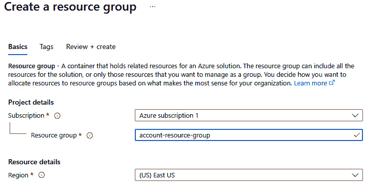

图 13.1：在 Azure 中创建资源组

1.  下一步是创建一个应用服务计划：

    1.  在 Azure 门户中，在搜索栏中搜索 `App Service plans` 并选择顶部结果。

    1.  点击 **创建**。

    1.  选择您的订阅，选择您刚刚创建的资源组，并为您的应用服务计划输入一个名称。

    1.  在 **操作系统** 下，选择 **Linux**。

    1.  选择定价层（例如，**B1** 基本计划）。

    1.  点击 **审查 + 创建**。

    在 Azure 中创建应用服务计划是部署使用 Azure App Services 的 Web 应用、API 和其他工作负载时的一个重要步骤。应用服务计划定义了支持您的 Web 应用、API 或函数应用的底层基础设施。它决定了您的应用程序如何托管，包括它使用的 CPU（处理能力）、内存（RAM）、存储（磁盘空间）和网络容量。

    通过创建应用服务计划，您指定了运行应用程序所需的资源和容量，确保它具有处理预期负载所需的能力。它通过以下两个选项直接影响在 Azure 中运行应用程序的成本：

    +   **定价层**：您选择的计划决定了定价层，这会影响基于分配的资源成本。Azure 提供各种定价层，从小型应用的免费和共享层到高性能、生产级应用的 premium 层。

    +   **扩展选项**：应用服务计划还定义了您的应用的扩展选项。您可以根据应用的需求进行扩展（增加实例的大小）或扩展（增加实例的数量）。不同的定价层提供不同的扩展能力。

    *图 13*.2*展示了如何在 Azure 中创建应用服务计划：

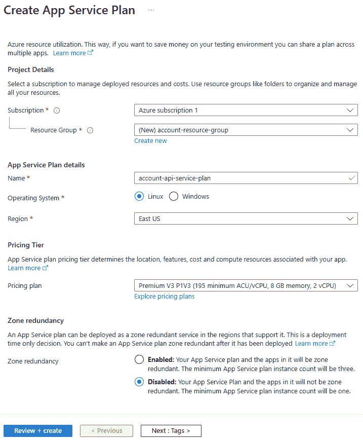

图 13.2：在 Azure 中创建应用服务计划

1.  下一步是创建一个 Web 应用：

    1.  在 Azure 门户中，搜索`App Services`并选择最上面的结果。

    1.  点击**创建**并选择**Web 应用**。

    1.  选择您的订阅，选择您的资源组，并为您的 Web 应用输入一个名称。确保您为您的 Web 应用选择了一个唯一的名称。

    1.  对于**发布**，选择**代码**。

    1.  对于**运行时堆栈**，选择**Node 20 LTS**。（选择您认为最适合您需求的节点版本）。

    1.  对于**操作系统**，选择**Linux**。

    1.  在**区域**下，选择离您或您的用户最近的位置。

    1.  在**应用服务计划**下，选择您之前创建的计划。

    1.  点击**审查 + 创建**然后**创建**。见*图 13*.3*：

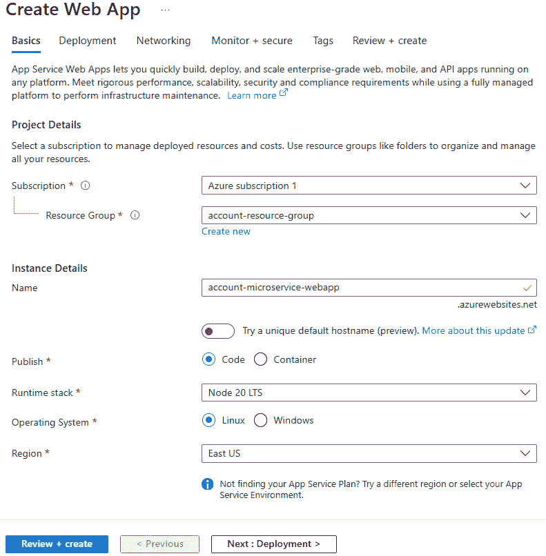

图 13.3：在 Azure 中创建一个 Web 应用

1.  接下来，为 MongoDB API 创建一个 Azure Cosmos DB：

    1.  在 Azure 门户中，搜索`Azure Cosmos DB`并选择**创建**。

    1.  Azure 会要求您选择资源类型，这将是一个请求的**单元数据库账户**或**vCore 集群**。vCore 集群是微软推荐的一种资源。

    1.  在**API**下，选择**Azure Cosmos DB** **用于 MongoDB**。

    1.  输入您的**订阅**、**资源组**、**账户名称**和其他必要详情。

    1.  点击**审查 + 创建**然后**创建**：

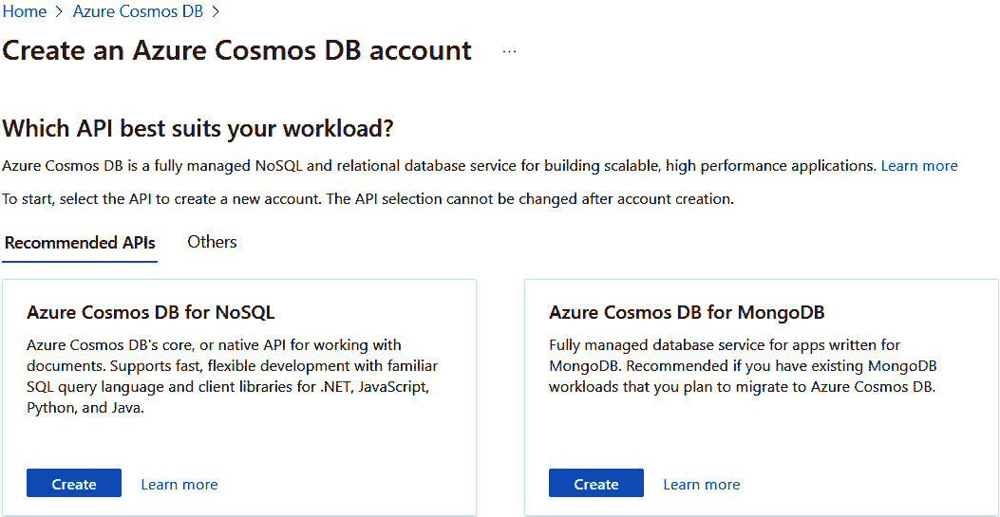

图 13.4：选择 Azure Cosmos DB 用于 MongoDB

您可以在以下图中看到 Azure Cosmos DB 账户创建页面：

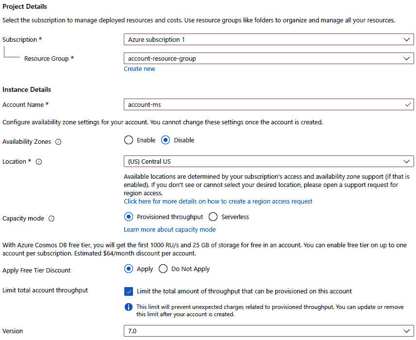

图 13.5：Azure Cosmos DB 账户创建页面

1.  最后，让我们获取一个 MongoDB 连接字符串：

    1.  一旦创建了 Cosmos DB 账户，转到**概览**页面。

    1.  在**设置**部分下点击**连接字符串**。

    1.  点击眼睛图标。

    1.  复制**主** **连接字符串**：

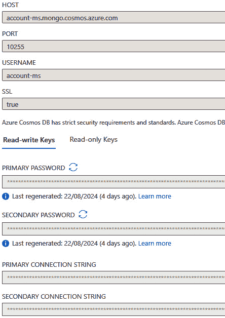

图 13.6：Azure 中的连接字符串页面

我们已经完成了资源的获取。现在是配置的时候了。

1.  现在，让我们配置 Azure Web 应用以使用 MongoDB。为此，导航到您的 Web 应用：

    1.  在 Azure 门户中，转到`MONGODB_URL`和**值**（粘贴您之前复制的 MongoDB 连接字符串）。

    1.  点击**确定**然后**保存**。

最后，是时候准备您的 Node.js 应用程序了。确保您的 Node.js 应用程序已设置好，可以从环境变量中读取 MongoDB 连接字符串。以下是实现此目的的步骤：

1.  前往`src/config/config.js`文件，并按照如下方式修改`createConfig`函数：

    ```js
     function createConfig(configPath) {
            dotenv.config({ path: configPath });
            const { value: envVars, error } = envVarsSchema
                .prefs({ errors: { label: 'key' } })
                .validate({
                    PORT: process.env.PORT || dotenv
                          .config({ path: configPath })
                          .parsed.PORT,
                    MONGODB_URL: process.env.MONGODB_URL
                          || dotenv.config({
                          path: configPath }).parsed
                          .MONGODB_URL
                });
            if (error) {
                throw new Error(`Config validation error:
                  ${error.message}`);
            }
            return {
                port: envVars.PORT,
                mongo: {
                    url: envVars.MONGODB_URL,
                } }; }
    ```

1.  当我们运行我们的 Node.js 应用程序时，它将自动连接到一个端口号等于`3001`（取决于您在`.env`文件中编码的内容）。我们默认更新了`.env`文件以使用`PORT=443`。它看起来是这样的：

    ```js
    PORT=443
    MONGODB_URL=mongodb://localhost:27017/account-microservice
    ```

1.  我们还对`src/index.js`文件进行了少量更改，以支持`winston`库并使用进程中的端口：

    ```js
    async function execute() {
        logger.info('preparing account service ...');
        const configPath = path.join(__dirname,
          '../configs/.env');
        const appConfig = createConfig(configPath);
        logger.info({configPath:configPath});
        await db.connect(appConfig);
        const port = process.env.PORT || appConfig.port;
        const server = app.listen(port, () => {
            logger.info('account service started',
            { port: port });
        });
        const closeServer = () => {
            if (server) {
                server.close(() => {
                    logger.error('server closed');
                    process.exit(1);
                });
            } else {
                process.exit(1);
            }  };
    ```

    如您所猜，对于前两个示例，我们使用了`process.env`。在 Node.js 应用程序中使用`process.env.PORT`和`process.env.MONGODB_URL`是管理特定于环境的配置的最佳实践。

    Node.js 应用程序通常需要在不同的环境中运行（开发、测试、预发布、生产），每个环境都有自己的配置集。使用环境变量允许您根据环境自定义行为，而无需更改代码。现在，让我们更详细地看看我们代码中使用的环境变量：

    +   `process.env.PORT`用于定义 Node.js 应用程序将监听传入请求的端口号。通过使用端口号的环境变量，您可以轻松地在不同的端口上运行应用程序，具体取决于环境。例如，在开发环境中，您可能希望它在端口`3000`上运行，而在生产中，应用程序可能需要在一个由托管提供商（例如 Azure、Heroku）分配的端口上运行。云提供商通常为应用程序分配动态端口。通过使用`process.env.PORT`，您的应用程序可以适应在运行时分配的任何端口。

    +   另一方面，`process.env.MONGODB_URL`用于定义您的 MongoDB 数据库的连接字符串。将敏感信息，如数据库连接字符串存储在环境变量中，可以防止它们出现在源代码中，这是一种安全最佳实践。这可以防止在 VCSs（例如 Git）中意外泄露。不同的环境可能使用不同的数据库或数据库服务器。例如，开发环境可能使用本地 MongoDB 实例，而生产可能使用 MongoDB Atlas 等托管 MongoDB 服务。通过使用`process.env.MONGODB_URL`，您可以轻松地在这些之间切换，而无需更改代码。

1.  部署成功后，Azure 应该运行您的应用程序。这就是为什么您需要更新`package.json`文件以包含`start`脚本，如下所示：

    ```js
    "scripts": {
        "start": "node src/index.js",
       ...other commands }
    ```

但关于包安装过程呢？正如您所知，我们不发布 `node_modules`，但它应该位于服务器上以正确运行您的应用程序。要处理 node 模块安装并从 `package.json` 执行启动命令，您可以按照以下步骤操作：

1.  从 Azure 门户转到**应用服务**。

1.  选择您的 Web 应用程序。

1.  导航到**设置**。

1.  选择**配置**。

1.  前往**常规设置**。

1.  转到 `npm install && npm start`：

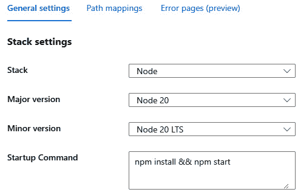

图 13.7：Azure Web 应用的启动命令

当然，这并不是运行 Node.js 应用程序的唯一正确方式，但在这个例子中，这已经足够了。

现在，一切准备就绪。我们可以使用 GitHub Actions 实现我们的管道。

# 使用 GitHub Actions

**GitHub Actions**是 GitHub 的一个强大功能，允许您直接在 GitHub 仓库中自动化、自定义和执行软件开发工作流程。它旨在帮助您从 GitHub 构建、测试和部署代码。GitHub Actions 是一个帮助您在软件开发生命周期内自动执行任务的工具。在我们的案例中，我们将创建一个工作流程，每当您向主分支推送更改时，它将自动将您的 Node.js 微服务部署到 Azure。

首先，如果您还没有，请创建一个账户。账户创建后，创建一个将存储您的源代码的仓库。接下来，让我们看看 GitHub Actions 的一些关键特性：

+   **工作流程自动化**：GitHub Actions 使您能够在仓库中发生特定事件时自动执行任务，例如运行测试、构建应用程序、部署到云服务等（例如，向分支推送、拉取请求或创建问题）。您还可以使用 GitHub Actions 在您的代码上运行 linting 工具或静态分析，确保代码质量标准得到维护。

+   在您的仓库的 `.github/workflows/` 目录中。这些文件描述了您想要运行的自动化流程。

+   **事件驱动**：动作可以由各种 GitHub 事件触发，例如推送、拉取请求、问题创建或按计划执行。这种灵活性允许您创建精细调整到您开发流程的工作流程。

+   **内置的 CI/CD**：GitHub Actions 提供了内置的持续集成和持续部署支持。您可以使用它在每个提交后自动测试您的代码并将其部署到生产环境或 AWS、Azure 或 Heroku 等云服务。

+   **可重用动作**：您可以重用社区创建的动作或在不同项目间共享您自己的动作。GitHub 有一个市场，您可以在其中找到用于设置语言、部署到云服务等各种任务的动作。

+   **秘密管理**：您可以在工作流程中安全地管理和使用敏感信息，如 API 密钥、令牌和其他凭证，而无需在代码中暴露它们。

+   **调度任务**：您可以使用 GitHub Actions 按计划运行脚本或维护任务，例如夜间构建或数据库备份。

GitHub Actions 与其他 GitHub 功能无缝集成，例如 *问题*、*拉取请求*和*包*，这使得创建涵盖整个开发生命周期的流程变得容易。

现在让我们看看 GitHub Actions 中的密钥。

## 理解密钥

**GitHub Actions 中的密钥**是加密的环境变量，您在您的流程中使用它们。它们被安全地存储，可以在您的流程中访问，而不会暴露敏感信息。

要安全地将您的 Azure 凭据（如发布配置文件）传递给 GitHub Actions，您需要将它们作为**密钥**添加。以下是您可以这样做的方法：

1.  前往 Azure 门户并导航到您的网络应用。

1.  在网络应用的**概览**页面，寻找**获取发布配置文件**按钮并下载发布配置文件文件。它是一个包含 GitHub Actions 工作流程将用于部署应用的凭据的 XML 文件。别忘了将您的 Azure 网络应用的**设置-配置**选项卡中的**平台设置**进行更改。

1.  一旦您这样做，您将能够下载发布配置文件（*图 13**.8*）。

1.  现在转到 `<web_app_name>.PublishSettings`（在我们的例子中是 `account-microservice-webapp.PublishSettings`）。

向 GitHub Actions 提供 Azure 发布配置文件对于自动化将您的应用程序部署到 Azure 是必不可少的。发布配置文件包含 GitHub Actions 用于验证和授权部署到您的 Azure 资源的凭据。这确保只有授权进程可以部署您的应用程序。

它还包括将您的应用程序部署到特定 Azure App Service 或其他资源的所有必要设置。它简化了配置，避免了在您的流程中手动定义所有部署细节。

在 GitHub Actions 中使用发布配置文件允许您在 GitHub 仓库中安全地存储和管理凭据作为密钥。这可以防止在您的流程文件中暴露敏感信息。以下是下载发布配置文件的平台设置应如何看起来：

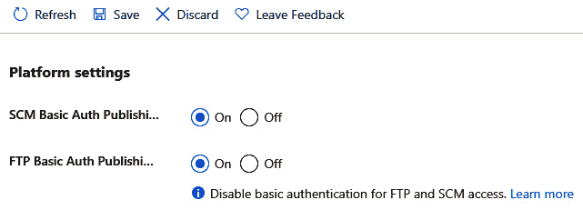

图 13.8：下载发布配置文件的平台设置

让我们在 GitHub 中创建密钥：

1.  前往您的 GitHub 仓库。

1.  导航到**设置** | **密钥** | **动作**。

1.  添加以下密钥：

    +   `AZURE_WEBAPP_PUBLISH_PROFILE`：Azure 发布配置文件的全部内容（*图 13.9*）。

    +   `MONGODB_URL`：在此阶段，您应该粘贴您之前复制的 MongoDB 连接字符串。如果您还没有检索它，请在继续之前现在就做。以下是我们可以这样做的方法：

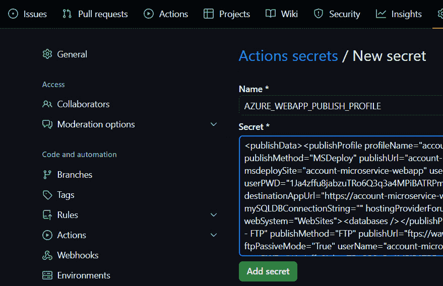

图 13.9：添加 Azure 网络应用的发布配置文件

使用 Secrets 是至关重要的，因为它可以防止敏感数据在您的仓库代码或日志中暴露。只有授权的工作流程可以访问这些秘密。

我们现在已将所有秘密信息提供给 GitHub，因此让我们专注于使用 GitHub Actions 构建一个简单的 pipeline。

## 构建 pipeline

虽然 GitHub Actions 在其文档中并未明确使用 **pipeline** 一词，但 pipeline 是一个更广泛的概念，它代表了代码从开发到生产的整个过程序列。在许多 CI/CD 工具中，pipeline 通常由多个阶段（如构建、测试和部署）组成，这些阶段按照特定的顺序执行。

仓库的 `.github/workflows/` 目录。工作流程由事件触发，例如仓库的推送、拉取请求或计划事件。每个工作流程可以有多个并行或顺序执行的作业，每个作业可以有多个执行命令或操作的步骤。

工作流程是在 `.yml` 文件中定义的。以下是我们的定义方式：

1.  要创建此文件，您应该打开您的网页浏览器并访问您的 GitHub 仓库。在您的仓库内，点击 **添加文件** 按钮，然后选择 **创建** **新文件**。

1.  将文件命名为 `.github/workflows/azure-deploy.yml`。这将创建必要的目录结构和文件。提交 `azure-deploy.yml` 文件并将其推送到您的 GitHub 仓库。

1.  `azure-deploy.yml` 文件由多个步骤组成。要查看更完整的示例，请检查我们的 GitHub 仓库（`Ch13/.github/workflows/azure-deploy.yml`）。以下是我们的第一步：

    ```js
    name: CI/CD Pipeline
    on:
      push:
        branches:
          - main  # The workflow will trigger on pushes to the main branch
    ```

    GitHub Actions 工作流程文件，命名为 `CI/CD Pipeline`，被设置为在仓库的 `main` 分支有推送时自动触发。这意味着任何提交并推送到 `main` 分支的更改都将激活定义的工作流程。`on: push:` 部分指定了启动工作流程的事件——在这种情况下，是推送到 `main` 分支的事件。这种设置通常用于 CI/CD，确保 `main` 分支的更新自动通过工作流程中定义的构建、测试和部署过程。

1.  让我们继续讨论工作流程文件中的下一行：

    ```js
    jobs:
      security-scan:
        name: Run Security Scan
        runs-on: ubuntu-latest
        steps:
        - name: Checkout code
          uses: actions/checkout@v3
        - name: Set up Node.js
          uses: actions/setup-node@v3
          with:
            node-version: '20'
        - name: Install dependencies
          run: npm install
        - name: Run npm audit
          run: npm audit --audit-level=high
    ```

    此部分 GitHub Actions 工作流程定义了一个名为 `security-scan` 的作业，该作业负责对您的代码库进行安全扫描。该作业将在由 `runs-on: ubuntu-latest` 指定的最新版本的 Ubuntu 上执行。

    在此作业中，概述了几个步骤。第一步是 `Checkout code`，使用 `actions/checkout@v3` 动作将代码库的代码克隆到工作流程环境中。接下来，`Set up Node.js` 步骤使用 `actions/setup-node@v3` 动作在环境中设置 Node.js 版本 20。环境准备就绪后，`Install dependencies` 步骤运行 `npm install` 以安装所有必需的 Node.js 包。最后，`Run npm audit` 步骤执行 `npm audit --audit-level=high` 命令，该命令检查已安装包中的安全漏洞，重点关注严重级别高的漏洞。此作业确保在 CI/CD 管道中扫描应用程序以查找关键安全问题。

1.  以下 GitHub Actions 工作流程的代码定义了一个名为 `check-dependencies` 的作业，该作业旨在检查项目中是否有任何依赖项过时。该作业将在最新版本的 Ubuntu 上运行，如 `runs-on: ubuntu-latest` 所示：

    ```js
    check-dependencies:
        name: Check Dependencies
        runs-on: ubuntu-latest
        needs: security-scan
        steps:
        - name: Checkout code
          uses: actions/checkout@v3
        - name: Install dependencies
          run: npm install
        - name: Check for outdated dependencies
          run: npm outdated
    ```

    `needs: security-scan` 行指定了此作业只有在 `security-scan` 作业成功完成后才会运行。这在这两个作业之间创建了一个依赖关系，确保在检查过时的依赖项之前，安全扫描必须通过。

    作业包含几个步骤。首先，`Checkout code` 步骤使用 `actions/checkout@v3` 动作将代码库的代码克隆到环境中。然后，`Install dependencies` 步骤运行 `npm install` 以安装项目所需的所有 Node.js 包。最后，`Check for outdated dependencies` 步骤运行 `npm outdated`，列出任何有新版本可用的依赖项。此作业通过确保您了解可能需要更新的任何过时包，帮助维护项目的健康状态。

1.  以下 GitHub Actions 工作流程的部分定义了一个名为 `test` 的作业，该作业负责在代码库上运行测试。该作业在最新版本的 Ubuntu 上运行，如 `runs-on: ubuntu-latest` 所指定：

    ```js
    test:
        name: Run Tests
        runs-on: ubuntu-latest
        needs: check-dependencies
        steps:
        - name: Checkout code
          uses: actions/checkout@v3
        - name: Set up Node.js
          uses: actions/setup-node@v3
          with:
            node-version: '20'
        - name: Install dependencies
          run: npm install
        - name: Run tests
          run: npm test
    ```

    `needs: check-dependencies` 行表示此作业只有在 `check-dependencies` 作业成功完成后才会启动。这确保在运行测试之前，所有依赖项都是最新的，这对于确保测试过程的一致性和可靠性非常重要。

    作业由几个步骤组成。首先，`Checkout code` 步骤使用 `actions/checkout@v3` 动作将代码库的代码克隆到工作流程环境中。然后，`Set up Node.js` 步骤使用 `actions/setup-node@v3` 动作在环境中配置 Node.js 版本 20。接着，`Install dependencies` 步骤运行 `npm install` 以安装项目所需的所有包。最后，`Run tests` 步骤执行 `npm test` 命令，该命令运行项目中定义的测试套件。此作业确保在代码合并或部署之前，在受控环境中测试代码，以捕获任何问题。

1.  工作流程的以下部分负责在测试完成后将您的应用程序部署到 Azure 网站应用程序。作业在 GitHub Actions 提供的基于 Ubuntu 的虚拟机上运行。在部署之前，工作流程会检出您代码的最新版本，以确保包含最新的更改：

    ```js
    deploy:
       name: Deploy to Azure Web App
       runs-on: ubuntu-latest
       needs: test  # Run this job after testing succeeds
       steps:
       - name: Checkout code
         uses: actions/checkout@v3
       - name: Clean up unnecessary files
         run: |
           rm -rf .git
           rm -rf .github
           rm -rf _actions
           rm -rf _PipelineMapping
           rm -rf _temp
       - name: Deploy to Azure Web App
         uses: azure/webapps-deploy@v3
         with:
           app-name: 'account-microservice-webapp'  # Matches the "msdeploySite" in your publish profile
           publish-profile: ${{ secrets.AZURE_WEBAPP_PUBLISH_PROFILE }}  # Ensure this secret contains the publish profile XML content
           package: ${{ github.workspace }}
    ```

1.  在部署准备过程中，工作流程会清理不必要的文件和目录，例如 `.git` 文件夹（包含存储库的 Git 历史）、`.github` 文件夹（用于 GitHub 特定配置）以及部署应用程序中不需要的其他临时或内部文件夹。这种清理有助于减少部署包的大小，并消除应用程序运行不需要的任何文件。

1.  最后，工作流程使用 `azure/webapps-deploy@v3` 动作将应用程序部署到指定的 Azure 网站应用程序。`app-name` 配置设置为与 Azure 发布配置文件中的站点名称匹配，而 `publish-profile` 机密包含必要的凭据。要部署的包设置为整个工作区，确保部署的是清理后的代码。

一旦您推送了更改，GitHub Actions 将自动触发工作流程。在您的 GitHub 仓库的 **操作** 选项卡中监控部署过程：

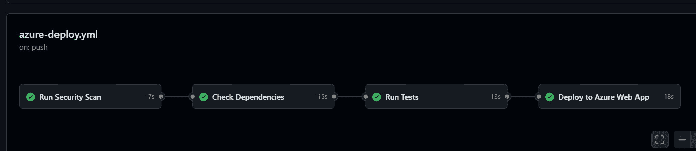

图 13.10：GitHub Actions 工作流程

这是成功部署日志的示例：

```js
{
  id: '77ef5e3e-161d-4b4c-afb2-e44d537ec921',
   *******
  is_temp: false,
  is_readonly: true,
  url: 'https://account-microservice-webapp.scm.azurewebsites.net/api/deployments/77ef5e3e-161d-4b4c-afb2-e44d537ec921',
  log_url: 'https://account-microservice-webapp.scm.azurewebsites.net/api/deployments/77ef5e3e-161d-4b4c-afb2-e44d537ec921/log',
  site_name: 'account-microservice-webapp',
  build_summary: { errors: [], warnings: [] }}
Deploy logs can be viewed at https://account-microservice-webapp.scm.azurewebsites.net/api/deployments/77ef5e3e-161d-4b4c-afb2-e44d537ec921/log
Successfully deployed web package to App Service.
App Service Application URL: https://account-microservice-webapp.azurewebsites.net
```

一旦部署成功，您可以使用简单的 FTPS 连接检查已部署的文件。要使用 FTP 客户端连接到您的服务器，您可以使用您想要的任何 FTP 客户端工具。我们使用 FileZilla，它是免费且易于使用的。您可以从 [`filezilla-project.org/`](https://filezilla-project.org/) 下载它。

要找到您的服务器的 FTP 凭据，请按照以下步骤操作：

1.  前往 Azure 门户。

1.  选择 **应用服务**。

1.  找到您的网站应用程序。

1.  前往 **部署** | **部署中心**

1.  选择 **FTPS 凭据** 选项卡。参见 *图 13.11*：

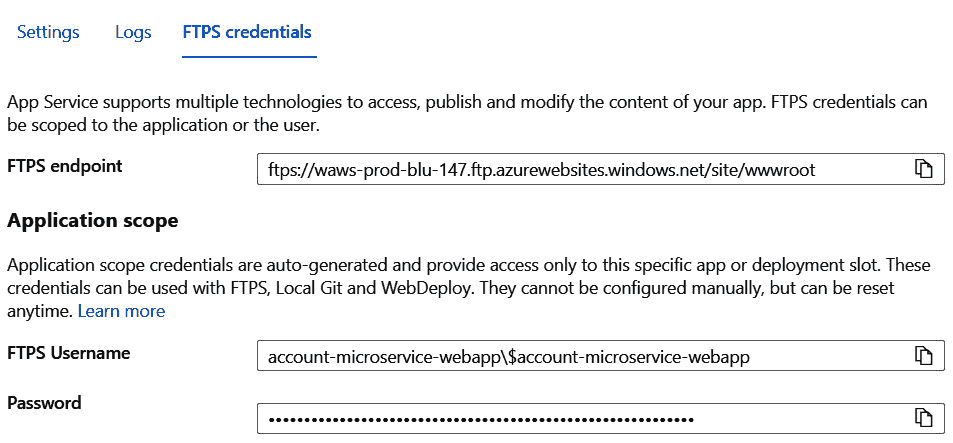

图 13.11：Azure 网站应用程序的 FTPS 凭据选项卡

现在，您可以使用这些凭据连接到服务器。以下是连接并导航到 `wwwroot` 文件夹后的样子：

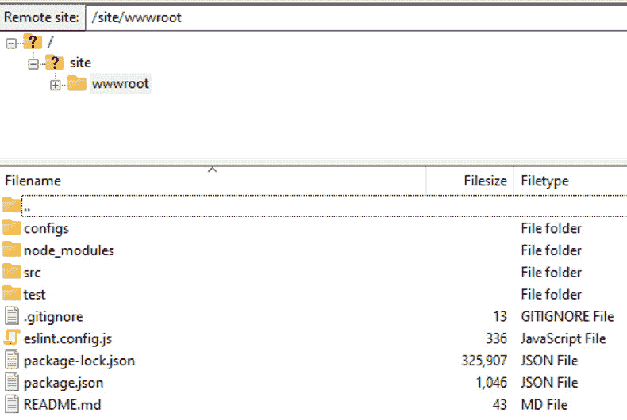

图 13.12：已部署存储库的 FTP 视图

现在，我们已经准备好测试事情是否正常工作。正如您可能猜到的，在调查 Account 微服务的源代码后，我们在 `app.js` 中添加了一个简单的中间件：

```js
..............
// Define a route for the welcome page
app.get('/welcome', (req, res) => {
    res.send('<h1>Welcome to Express.js Application!</h1>');
});
..............
```

只需前往 Azure 门户，选择您的网站应用程序，然后在 **概览** 选项卡中，您将找到默认域名：

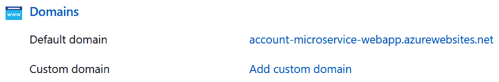

图 13.13：Azure 网站应用程序的域名选项卡

打开任何浏览器，将 `<Default_domain>/welcome` 作为 URL 输入：

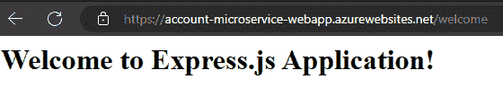

图 13.14：已部署 Node.js 应用程序的欢迎页面

要测试是否可以连接到 MongoDB 并创建账户信息，请按照以下步骤操作：

1.  打开 Postman。

1.  点击**+**按钮创建新标签页。

1.  选择 `<default_domain>/v1/accounts` 模板（对我们来说，它是 `https://account-microservice-webapp.azurewebsites.net/v1/accounts`）。

1.  进入**正文**部分并选择**raw** | **Json**。

1.  将您的有效负载粘贴以创建账户，然后点击**发送**。

这是我们看到的样子：

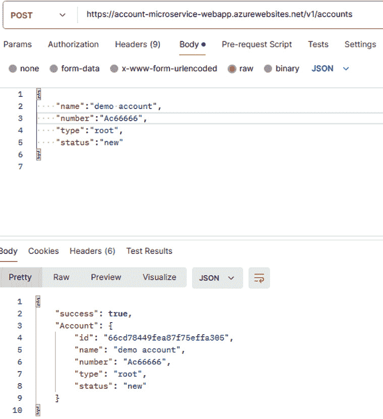

图 13.15：使用 Postman 创建账户

要测试是否可以检索账户信息，请按照以下步骤操作：

1.  打开 Postman。

1.  点击**+**按钮创建新标签页。

1.  选择 `<default_domain>/v1/accounts` 模板（对我们来说，它是 `https://account-microservice-webapp.azurewebsites.net/v1/accounts`）。

1.  点击**发送**。

这是我们看到的样子：

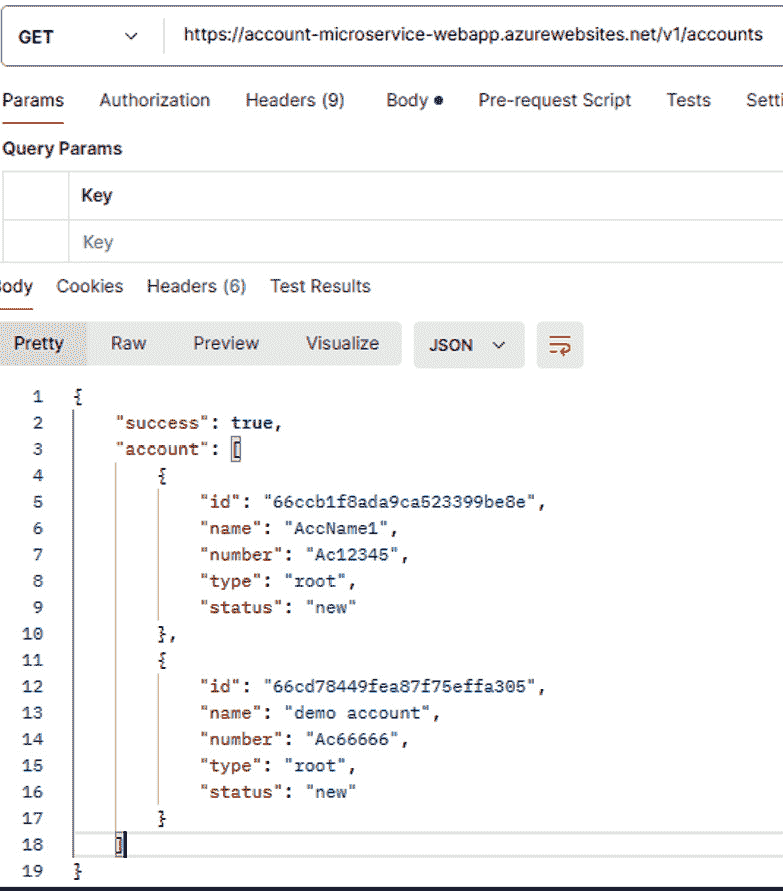

图 13.16：检索账户信息

在本节中，我们探讨了将应用程序部署到 Azure 并测试其功能的过程。我们介绍了如何使用 Postman 验证一切是否按预期工作，确保您的应用程序已准备好投入生产环境。现在，您已经对如何在云中部署和验证微服务有了坚实的理解。

# 摘要

在本章中，我们全面探索了 CI/CD 流程，强调了它们在现代软件开发中的关键作用。我们首先理解了 CI 和 CD 的基础知识以及它们如何简化代码更改的集成和部署过程。

我们的旅程继续深入探讨与 Azure Cloud 一起工作，我们讨论了如何利用其强大的基础设施来部署和管理应用程序。然后我们深入研究了 GitHub Actions，这是一个强大的自动化工作流程的工具，使我们能够高效地构建、测试和部署我们的代码。

本章的大部分内容都致力于构建 CI/CD 管道。我们介绍了创建无缝和自动化管道所需的步骤，确保我们的应用程序始终处于就绪状态，以便部署。

在本书中，我们涵盖了您开始使用 JavaScript 构建微服务所需的一切。从设计基本结构到部署和监控服务，每一章都为您提供了实用的步骤和知识，帮助您创建灵活高效的应用程序。现在，您已经准备好使用微服务承担真实项目，这可以使您的系统更容易扩展、更新和管理。

然而，请记住微服务并非万能良药。最佳设计取决于许多因素，包括您项目的规模、团队结构和业务需求。随着您继续学习和实践，保持好奇心，并牢记技术总是在变化。享受您在微服务世界中的旅程吧！

继续前行，愿您终身编码。直到我们再次相遇。
