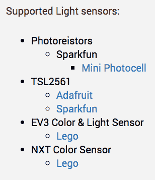
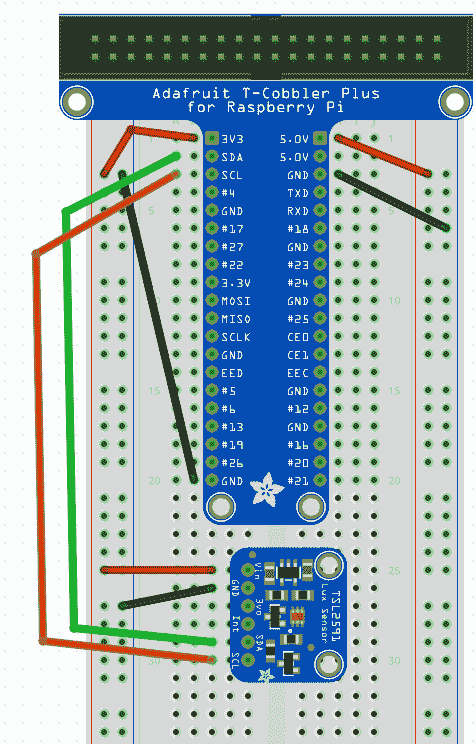
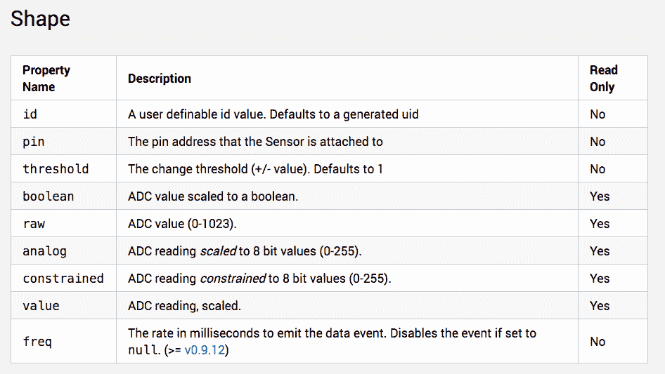
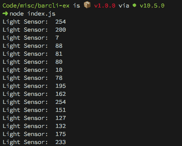
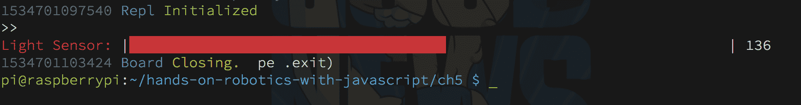
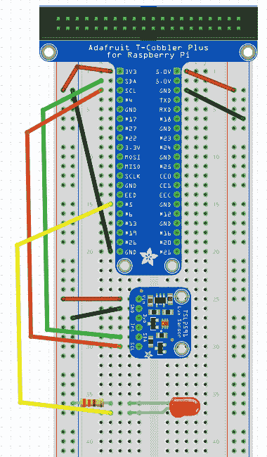
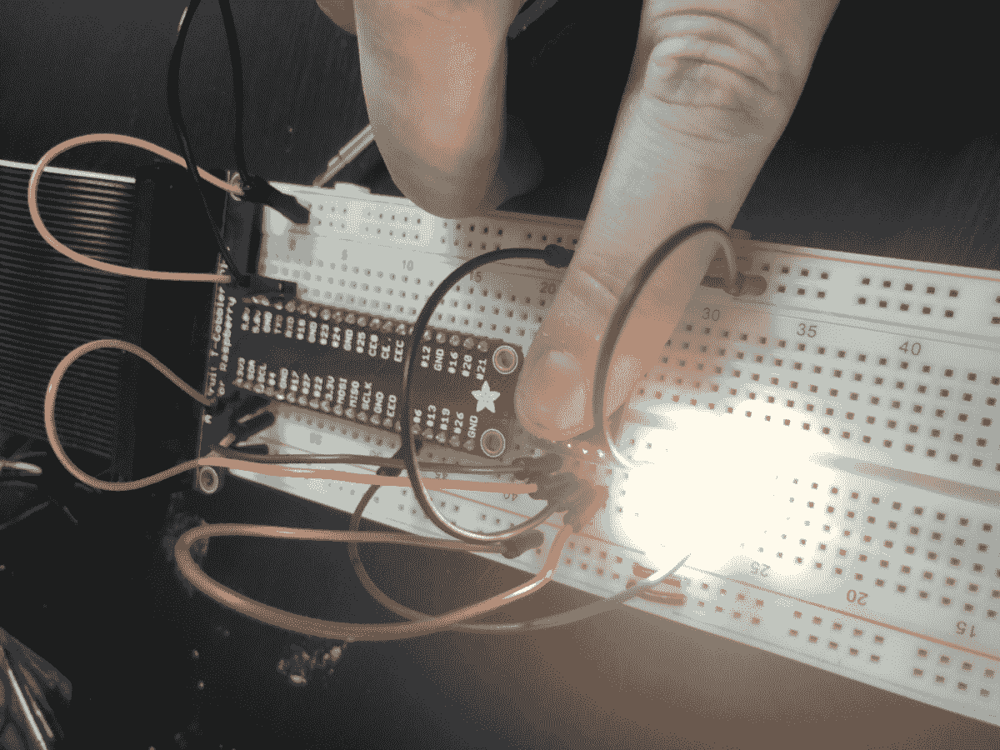
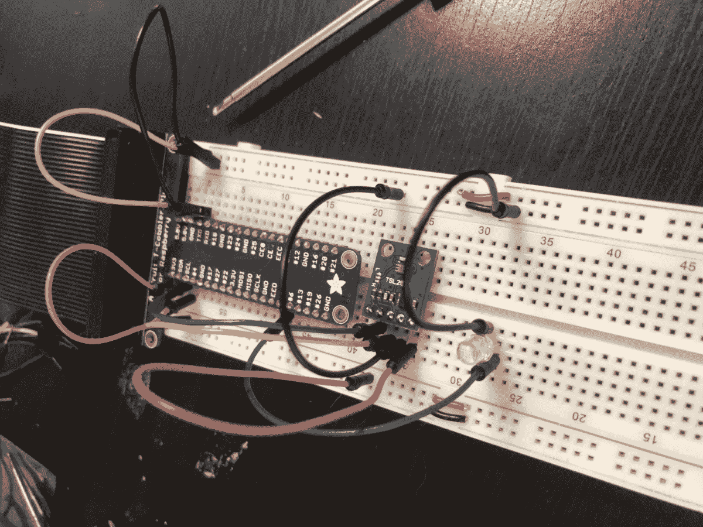

# 使用光传感器创建夜灯

在本章中，我们将探讨即使没有 Pi 内置的模拟输入引脚，我们仍然可以使用 Johnny-Five 和 Raspberry Pi 使用模拟传感器的方法。我们将利用这些知识来构建一个夜灯，该夜灯根据房间内的环境光打开和关闭 LED。

本章将涵盖以下主题：

+   使用 Pi 的模拟传感器

+   环境光传感器

+   创建我们的夜灯

# 技术要求

对于这个项目，您需要一个任何颜色的普通 LED 和一个 TSL2561 光传感器，可在 Adafruit([`www.adafruit.com/product/439`](https://www.adafruit.com/product/439))和其他许多供应商处购买。

本章的代码可在[`github.com/PacktPublishing/Hands-On-Robotics-with-JavaScript/tree/master/Chapter05`](https://github.com/PacktPublishing/Hands-On-Robotics-with-JavaScript/tree/master/Chapter05)找到。

# 使用 Pi 的模拟传感器

我们在第三章中讨论了 Pi 上多路 PWM 输出引脚的缺乏，*构建**交互式 RGB LED 项目*，但我们尚未完全解决的问题是与输入相关的问题。数字输入，如按钮和开关，对于 Pi 来说很简单，任何数字输出引脚也可以用作数字输入引脚。但对于需要超过两种状态的事物，比如检测光、温度、湿度、距离或其他我们想要测量的任何事物，怎么办呢？答案在于使用多年来开发的专用通信协议，这些协议允许数字引脚通信模拟信息。

# 为您的 Pi 项目寻找合适的传感器

当您在寻找 Raspberry Pi 项目的传感器时，您需要确保您使用的任何模拟传感器都有数字接口。最常见的是 I²C 和 SPI，我们将讨论如何判断您的传感器是否有（或没有！）以及该设备是否可以与 Johnny-Five 一起使用。

# I2C 设备

I²C 设备需要两个额外的引脚才能与电源和地线引脚一起工作——一个 SDA（数据）引脚和一个 SCL（时钟）引脚。这些引脚如何使用的细节超出了本书的范围（有关更多信息，请参阅*进一步阅读*部分），但要知道，只要设备有不同的 I²C 地址，您就可以将多个设备连接到相同的 SDA 和 SCL 引脚。地址是一个两位十六进制数，对于几乎所有 I²C 设备来说都很容易找到，在某些情况下，地址可以在设备上物理配置。

对于本章的项目，我们将使用 TSL2561，它可以配置两个不同的地址。现在我们将使用默认的 0x39（在 Adafruit 型号上）。

# SPI

SPI 设备很快就会变得复杂，您需要五个引脚：电源、地、微控制器到传感器数据（MOSI）、传感器到微控制器数据（MISO）和芯片选择线。虽然一组 SPI 引脚上的多个设备可以共享 MISO 和 MOSI 引脚，但每个设备都需要自己的芯片选择引脚，这样微控制器就可以向它想要通信的设备发出信号。

# 如何确定您的传感器是否与 Johnny-Five 兼容

要查看您在 Johnny-Five 中关注的传感器是否已有驱动程序，最好的方法是检查 Johnny-Five 网站的文档。找到传感器类型，并了解传感器使用的是哪种芯片（例如，我们的光传感器使用的是 TSL2561）。然后，在传感器的 API 页面顶部，几乎总是有一个支持的控制器和芯片列表。如果您的传感器上的芯片编号与列表中的某个编号匹配，则它已经与 Johnny-Five 兼容：只需记住，尽管模拟传感器与 Johnny-Five 兼容，但它们不会与 Pi 一起工作，因为 Pi 没有自己的模拟输入引脚。

例如，以下是支持的光传感器控制器和芯片列表，您可以在列表中看到 **TSL2561**，所以我们准备好开始构建我们的项目：



# 环境光传感器

要开始我们的夜灯项目，我们将首先连接我们的 TSL2561 I²C 光传感器，并确保通过将其打印到命令行来获取良好的数据读取。

# 连接传感器

为了连接我们的光传感器，我们需要知道 Pi 的 SDA 和 SCL 引脚是哪些。对于 Pi 3 和 3 B+，SDA 是 P1-P3，SCL 是 P1-P5；这些通常也标有 **SDA** 和 **SCL**。为了使传感器工作，我们需要电源引脚；这个传感器不耐受 5V，所以我们需要使用 3.3V 电源引脚。我们可以将传感器的 GND 连接到任何地线引脚。

传感器上的 SDA 和 SCL 引脚需要分别连接到 Pi 上的 SDA 和 SCL 引脚。最后，您的光传感器应该按照以下图示连接：



现在我们已经连接了传感器，是时候考虑如何使用 Johnny-Five 和其他 Node.js 模块打印数据，以确保它正在运行。

# 编写程序读取数据并将其打印到命令行

Johnny-Five 中的传感器对象事件与按钮事件不同，因为，嗯，传感器与按钮不同！让我们看看它们之间的差异以及如何从我们的光传感器获取所需的数据。

# Johnny-Five 传感器事件

我们将从传感器看到的两个主要事件是 `data` 和 `change`。唯一的真正区别在于名称：`data` 事件在每次检索数据时都会触发，而 `change` 事件在数据变化时触发。我倾向于在构建基于传感器的项目时使用 `change`，除非我明确地需要记录随时间变化的数据。

你可以在传感器对象的构造函数中配置数据收集的时间间隔，以及数据变化必须通过的阈值才能触发`change`事件。

# 在事件处理器中处理传感器数据

当你从传感器接收数据时，它将被附加到 JavaScript 的`this`对象上，因此当你为事件处理器创建回调时，不要使用箭头语法，因为这样你会失去 Johnny-Five 在 JavaScript 的`this`对象上设置的绑定。

这里是一个 Johnny-Five 传感器上`change`事件的通用数据处理器示例：

```js
let mySensor = new five.Sensor('PIN_NUMBER')

mySensor.on('change', function() {
  console.log(this.value) // logs a value between 0-255 to the console
})
```

既然我们已经确定了如何获取数据，让我们谈谈数据将是什么样子以及我们如何可以操作它。

# 使用和格式化 Johnny-Five 传感器数据

在 Johnny-Five 中接收传感器发送的数据有很多种方法，正如以下截图所示的文档所示：



布尔值、原始值、模拟值、约束值和值可能会让你有很多要处理的数据。每个值的意义在前面的图中都有展示，然而请注意，默认值与模拟值相同的原因：一个介于`0`和`255`之间的缩放读取值。这与可用的传感器种类、数据的粒度变化以及使用缩放以确保你只需要记住一个数字范围有很大关系，无论你使用多少个传感器。

# 使用.scaleTo()和.fscaleTo()来微调测量值

如果你想要对你的传感器施加一个任意的比例（比如`0` – `100`表示百分比），Johnny-Five API 中内置了一些选项：`.scaleTo()`和`.fscaleTo()`。这些选项会将传感器的原始值缩放到你传入的最小值和最大值：

```js
sensor.on('change', function(){
  // this.value will reflect a scaling from 0-1023 to 0-100   console.log(this.scaleTo([0, 100])); // prints an integer
  console.log(this.fscaleTo([0, 100])); // prints a float
})
```

既然我们已经知道如何处理数据，让我们开始创建代码来将光传感器值打印到命令行。这将允许我们调整变化阈值设置，并确定我们应该使用哪个光传感器值作为指示器来打开和关闭我们的 LED。

# 将传感器数据打印到命令行

要将传感器数据打印到命令行，我们将使用`print-light-sensor.js`中的代码：

```js
const five = require('johnny-five')
const RaspiIO = require('raspi-io')

let board = new five.Board({
  io: new RaspiIO()
})

board.on('ready', () => {
  let lightSensor = new five.Light({
    controller: 'TSL2561'
  })

  lightSensor.on('change', function() {
    console.log(this.value)
  })
})
```

运行时的输出应该看起来像这样，数字在覆盖或照射传感器时会有所变化：



这很好，但有点难以理解。接下来，我们将添加`npm`模块`barcli`来显示一个漂亮的条形图，使我们能够实时理解我们看到的数据。

# 使用 barcli 使数据更容易观察

那个数据流可能很难处理！让我们看看如何利用 Node.js 的强大功能使这个过程更容易观察。

在你的`project`文件夹中运行：

```js
npm i --save barcli
```

要安装`barcli`，这是一个在终端中创建条形图的库。

阅读关于`barcli`的文档（见*进一步阅读*），我们需要导入`barcli`，使用我们需要的设置构造一个`barcli`对象，然后告诉何时更新以及使用什么数据。

# 导入 barcli 并构建我们的 barcli 图表

要导入`barcli`，在你的`print-light-sensor.js`文件顶部，在其他的`require()`语句之后，添加：

```js
const Barcli = require('barcli')
```

然后，在`board.on('ready')`处理程序中，我们将添加条形图构造函数：

```js
let lightGraph = new Barcli({
  label: 'Light Sensor',
  range: [0, 255]
})
```

# 获取条形图更新

从`lightSensor.on('change')`处理程序中删除`console.log()`行，并用以下内容替换：

```js
lightGraph.update(this.value)
```

然后你就可以开始了！将`project`文件夹移动到 Pi 上，在 Pi 的 SSH 会话中导航到该文件夹，并运行：

```js
npm i
```

为了确保`barcli`在 Pi 上正确安装，运行以下命令：

```js
sudo node light-sensor-barcli.js
```

你现在应该看到一个条形图，如下所示，当你在传感器上照射光线或遮住传感器时，它会改变：



现在，对于我们的夜灯项目，你需要找到一个用于控制 LED 开关的光传感器值；`barcli`通过使该值更容易看到，使这个过程变得容易得多。

一旦你找到了适合你的值（我选择了`25`），我们就准备好构建我们的夜灯了。

# 创建我们的夜灯

既然我们知道我们的光传感器工作正常，我们可以添加一个 LED 并创建我们的夜灯。

# 连接 LED

使用一个 330K 欧姆电阻将你的 LED 的短腿连接到地轨，并将长腿连接到 GPIO #5，也称为 P1-29：



# 编码这个项目

在与本章其他文件相同的文件夹中创建一个文件，并将`print-light-sensor-readings.js`的内容复制到其中。

在`board.on('ready')`处理程序的开始处，添加我们的 LED 构造函数：

```js
let light = new five.Led('P1-29')
```

在`lightSensor.on('change')`函数中，将`console.log`语句替换为将 LED 开关的逻辑：

```js
if(this.value <= 25) {
  light.on()
} else {
  light.off()
}
```

我们已经准备好了运行！将文件夹加载到你的 Pi 上，在 Pi 的 SSH 会话中导航到该文件夹，并运行：

```js
sudo node night-light.js
```

当你用大拇指遮住光传感器时，LED 应该亮起，如下面的图片所示：



当你移开你的大拇指（在一个明亮的环境中），LED 将关闭，如下面的图片所示：



就这样，你已经成功编码并构建了你的夜灯！

# 摘要

在本章中，我们学习了关于模拟传感器和树莓派模拟输入的限制。我们学习了允许我们在树莓派项目中收集模拟数据的数字接口。我们使用这些知识来设置一个光传感器，使用`barcli`的条形图来找到一个好的阈值，使 LED 开关。最后，我们将所有这些结合起来，构建了一个在黑暗中照亮并在光亮时关闭的夜灯。

# 问题

1.  什么是模拟输入传感器？

1.  为什么模拟输入传感器不能直接与树莓派接口？

1.  列出两种我们可以与 Pi 一起使用来收集模拟数据的数字接口。

1.  除了电源和地线之外，I²C 传感器需要哪两个引脚才能运行？

1.  列出传感器对象可以触发的事件。

1.  为什么`barcli`在处理变化中的传感器数据时很有帮助？

# 进一步阅读

+   **关于模拟输入的更多信息**：[`learn.sparkfun.com/tutorials/analog-to-digital-conversion`](https://learn.sparkfun.com/tutorials/analog-to-digital-conversion)

+   **关于 SPI 的更多信息**：[`learn.sparkfun.com/tutorials/serial-peripheral-interface-spi`](https://learn.sparkfun.com/tutorials/serial-peripheral-interface-spi)

+   **关于 I²C 的更多信息**：[`learn.sparkfun.com/tutorials/i2c`](https://learn.sparkfun.com/tutorials/i2c)

+   **关于在 Pi 上使用 SPI 和 I²C 的更多信息**：[`learn.sparkfun.com/tutorials/raspberry-pi-spi-and-i2c-tutorial`](https://learn.sparkfun.com/tutorials/raspberry-pi-spi-and-i2c-tutorial)
