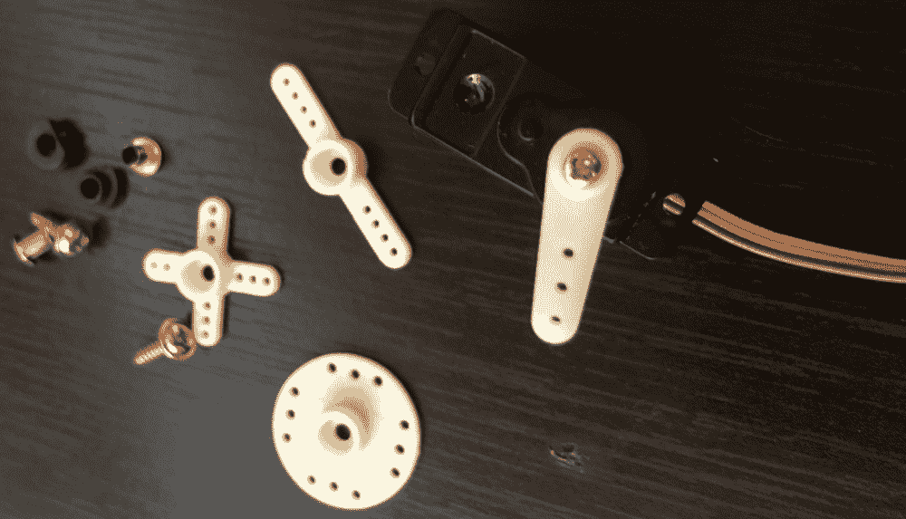
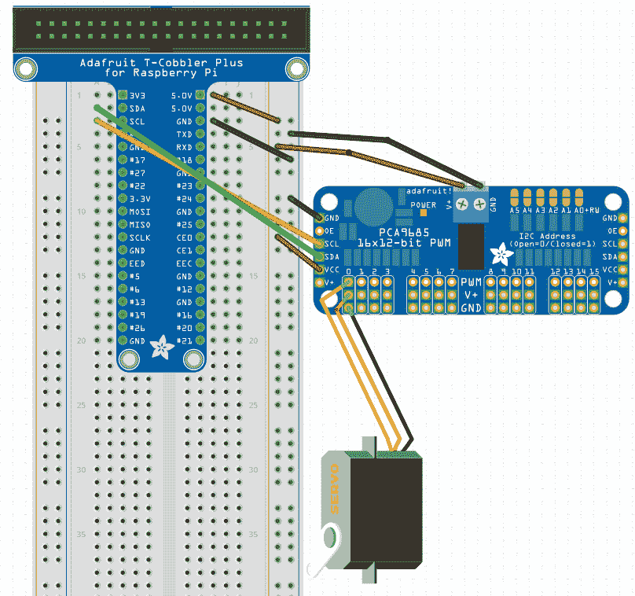
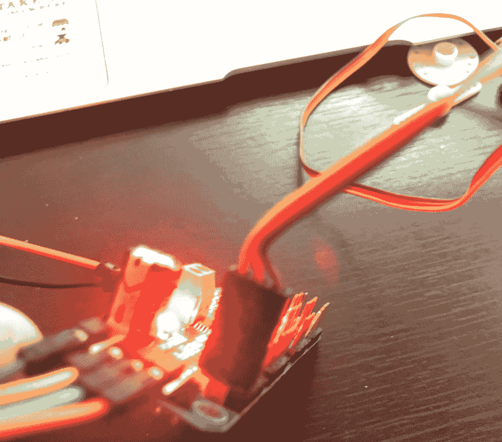
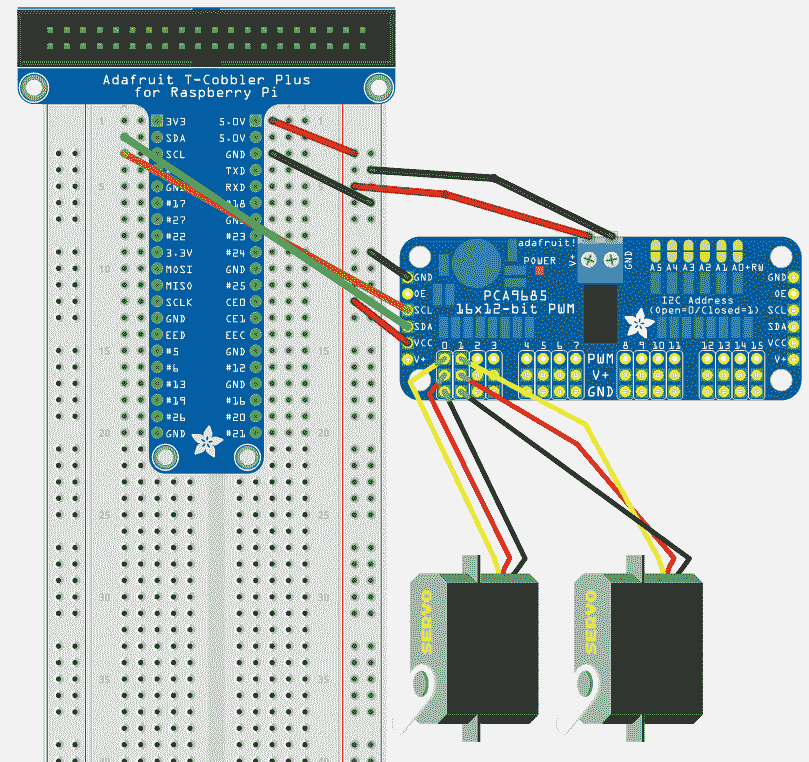
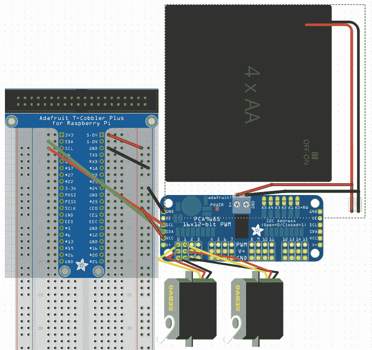
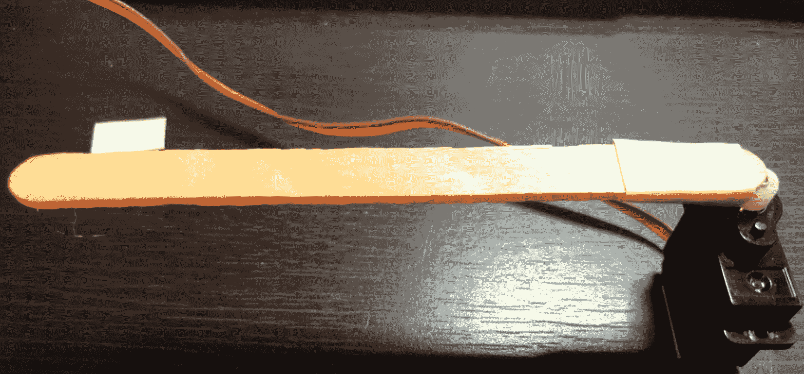
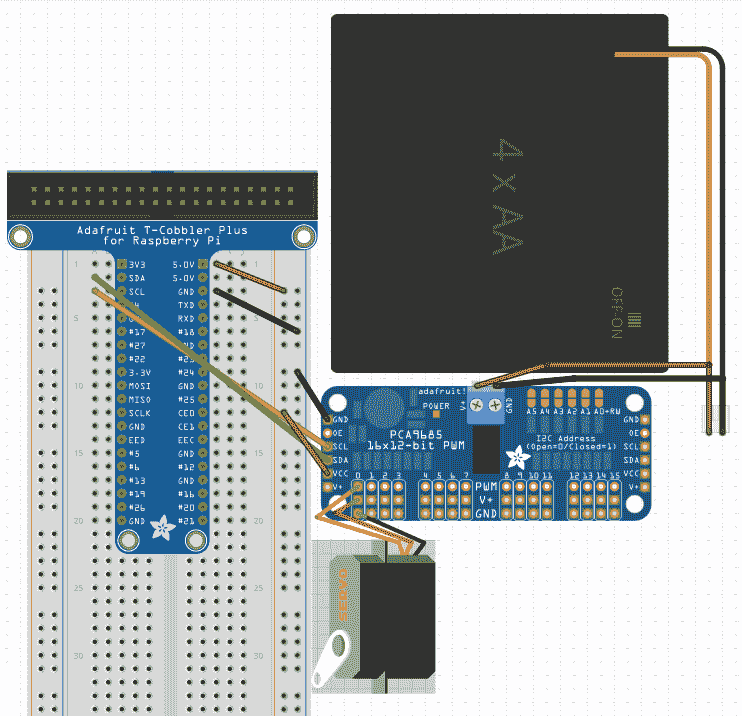

# 使用伺服电机进行测量运动

现在我们已经了解了电机，让我们看看一种更精确的方法来为我们的项目添加运动：伺服电机。我们将深入了解如何连接一个伺服电机，然后是另一个，以及如何编写单个伺服电机和多个伺服电机的代码。

本章将涵盖以下主题：

+   电机和伺服电机的区别

+   使用 Johnny-Five 使伺服电机工作

+   项目 – 两个伺服电机和 REPL

+   项目 – 连续伺服电机

# 技术要求

你需要你的 Pi、Cobbler、PWM 帽、2 个业余伺服电机，以及来自第六章，*使用电机移动你的项目*的 AA 电池组。你还需要一个连续伺服电机。最后，你需要你的光传感器。可选但很有帮助的是一根冰棍或其他小棍和一些胶带，将我们的伺服电机变成一个仪表。

本章的代码可在以下位置找到：[`github.com/PacktPublishing/Hands-On-Robotics-with-JavaScript/tree/master/Chapter07`](https://github.com/PacktPublishing/Hands-On-Robotics-with-JavaScript/tree/master/Chapter07)。

# 电机和伺服电机的区别

平均的业余伺服电机看起来像这样：



同时展示的还有常见的配件：一些不同的臂和安装螺丝/垫圈。电线端头终止于一个坚固的三孔插座：非常适合连接到我们的 PWM 帽。

我们在上一章中使用的电机有一些非常基本的不同之处，在我们开始伺服电机项目之前，我们应该探索它们。

# 计算后的运动

与我们在上一章中处理的电机不同，你可以使用伺服电机进行精确和计算后的运动。在常规伺服电机上命名一个介于 0 到 180 度之间的角度，它就会移动。电机（不包括本书中未涉及的步进电机）无法进行这些精确的运动。所以，如果你想要让轮子移动，而且你不在乎精确的运动，可以使用电机。当你想要让需要与其他关节精确移动的肢体关节移动时，是时候使用伺服电机了。

# 常规伺服电机与连续伺服电机的区别

有两种伺服电机，它们看起来非常相似。另一种被称为连续伺服电机。它们的工作方式与 Johnny-Five 中的常规伺服电机非常相似，正如你在*servo.continuous*的文档中可以看到的，该文档与伺服电机文档在同一页上。主要区别在于，常规伺服电机只能旋转 180 度，而连续伺服电机可以旋转满 360 度，并且可以无限期地继续在同一方向上旋转。有些人喜欢使用这些电机来移动他们的车辆项目中的轮子，这完全没问题！

# 为伺服电机和电机供电

这就是伺服电机和电机非常相似的地方：虽然一个伺服电机通常比电机消耗的功率要少，但许多项目使用的伺服电机比电机要多，这可能会对你的树莓派造成压力。如果你添加了很多伺服电机，你将需要为 PWM 帽提供外部电源；许多人使用 3-4 节 AA 电池组。我建议使用我们在第六章，*使用电机移动你的项目*中使用的电机电源。

从树莓派供电你的伺服电机可能会有你意想不到的后果--如果你在运行伺服电机代码时遇到内存泄漏问题，那可能是因为你从树莓派中拉取了过多的电源！

通常，如果你在运行伺服电机代码时遇到奇怪的问题，请确保你的伺服电机由外部电源充足供电。

# 让伺服电机与 Johnny-Five 一起工作

要让伺服电机与 Johnny-Five 一起工作，我们将查看 Johnny-Five 伺服对象，讨论如何将伺服电机连接到我们的 PWM 帽，并编写我们的第一段代码，让伺服电机来回摆动。

# Johnny-Five 伺服对象

在 Johnny-Five 文档的 API 部分查看伺服电机页面，我们首先会查找构造函数。因为我们仍在使用 PCA9685 PWM 帽，所以我们的构造函数将看起来像这样：

```js
let servo = new five.Servo({
  controller: "PCA9685",
  pin: 0 
});

```

至于移动伺服电机，文档中描述了几种移动伺服电机的方法。第一种移动可以是到一个固定位置：

```js
servo.to(degree)
servo.min()
servo.max()
servo.home() 
servo.center()
```

或者，另一种方法是来回摆动，要么尽可能远地来回摆动，要么在某个范围内：

```js
servo.sweep() // goes 0-180 and back, then repeats
servo.sweep(minDegree, maxDegree) // goes min to max and back, then repeats
```

你也可以停止一个正在移动的伺服电机：

```js
servo.stop()
```

现在我们已经很好地掌握了在 Johnny-Five 中编写伺服电机代码，让我们连接一个伺服电机并测试我们的新知识。

# 将伺服电机连接到我们的 PWM 帽

将伺服电机连接到 PWM 帽相对简单；你需要将伺服电机的 3 针插座对齐到你想用的引脚列。你还需要将屏蔽罩的电源线连接到第六章，*使用电机移动你的项目*中的 AA 电池组。



我发现找出哪个引脚是地线，然后确保该插座位于底部，有助于解决这个问题。伺服电机上的地线通常是黑色或棕色。然后，将插座对齐并滑动到第一列的引脚上（引脚 0）。



我们已经连接了伺服电机并为其 PWM 帽供电，所以让我们编写一段代码来控制伺服电机。

# 编写你的第一个伺服电机摆动代码

在一个名为`single-servo.js`的文件中，我们将设置我们的板，然后是我们的伺服电机，当它准备好时，告诉它来回摆动：

```js
const Raspi = require('raspi-io')
const five = require('johnny-five')

const board = new five.Board({
 io: new Raspi()
})

board.on('ready', () => {
 let servo = new five.Servo({
 controller: "PCA9685",
 pin: 0
 })

 servo.sweep()
})
```

将文件移动到树莓派上的单独文件夹中，在 Pi SSH 会话中导航到该文件夹，并运行以下命令：

```js
npm init -y
npm i --save johnny-five raspi-io
sudo node single-servo.js
```

你应该看到伺服电机来回移动。太棒了！现在，是时候使用 Johnny-Five 伺服对象和命令行 REPL 来控制两个伺服电机了。

# 项目 – 两个伺服电机和 REPL

现在我们有一个伺服正在运行，我们将连接第二个伺服，并使用 REPL 来探索 Johnny-Five 伺服对象，该对象旨在帮助同时控制多个伺服。

首先，让我们连接第二个伺服。

# 连接第二个伺服

拿起第二个伺服，找出哪一边是地线，将那个放在下面，然后将三针插座滑过第二列（引脚 1）的引脚：



现在我们已经连接了第二个伺服，让我们开始编写我们的 Johnny-Five 伺服对象代码！

# 使用 Johnny-Five 伺服对象

Johnny-Five 伺服对象旨在帮助你在项目中以有意义的方式分组伺服，例如六足机器人，每个都包含多个伺服。

你可以通过几种不同的方式创建一个 `Servos` 对象；我们将使用的方法是传递一个由构造的 `servo` 对象组成的数组：

```js
let servos = new five.Servos([servoOne, servoTwo])
```

这就是魔法发生的地方——现在我们的 `servo` 对象被分组在 `Servos` 对象中，我们可以独立地控制它们，也可以作为一个组来控制：

```js
servoOne.to(0) // Sets servoOne to 0 degrees
servoTwo.to(180) // Sets servoTwo to 180 degrees
servos.center() // Sets both servos to 90 degrees
```

并且 *所有伺服对象函数都可在 Servos 对象上使用。*

让我们把这段代码添加到我们的代码中。

# 将 Servos 对象添加到我们的代码中

在与 `single-servo.js` 相同的文件夹中创建一个新文件，命名为 `servos-repl.js`，并将 `single-servo.js` 的内容复制到其中。

然后，在 `board.on('ready')` 处理程序中，将 `servo` 重命名为 `servoOne`，并在 PWM 帽的 `1` 号引脚上添加 `servoTwo` 的构造函数：

```js
let servoOne = new five.Servo({
  controller: "PCA9685",
  pin: 0
})

let servoTwo = new five.Servo({
  controller: "PCA9685",
  pin: 1
})
```

然后，我们将构造一个包含 `servoOne` 和 `servoTwo` 的 `Servos` 对象：

```js
let servos = new five.Servos([servoOne, servoTwo])
```

现在我们已经编写了伺服的代码，让我们添加 Johnny-Five REPL 功能，这样我们就可以从命令行控制我们的伺服。

# 添加 REPL 功能

首先，从 `servos-repl.js` 中删除 `servo.sweep()` 行，因为它现在会导致错误。相反，将以下代码放在 Pi 上，这将允许我们从命令行访问我们的两个伺服和伺服组对象：

```js
board.repl.inject({
  servoOne,
  servoTwo,
  servos
})
```

现在我们准备好玩我们的伺服了！

# 在命令行中玩我们的伺服

将文件夹加载到 Pi 上，在 Pi SSH 会话中导航到该文件夹，并运行以下命令：

```js
sudo node servos-repl.js
```

一旦看到 `Board Initialized`，REPL 就准备好接受命令了。先试试这些：

```js
servoOne.to(0) 
servoTwo.to(180)
servos.center()
```

使用 Johnny-Five 的伺服文档查看您可以从命令行尝试的其他有趣的事情！

# 项目 - 使用伺服的光量计

让我们构建一个项目，其中我们的伺服作为光量计，根据光传感器的读数在 0 到 180 度之间扫描。

# 添加光传感器

首先，我们需要将光传感器连接到板上。记住，只要 I²C 设备有不同的地址（TSL2591 在 0x29，PWM 帽在 0x40），它们就可以共享一个 SDA 和 SCL 引脚。



现在我们已经连接了传感器，我们将承担（可选的）任务，修改我们的伺服，使其看起来更像一个仪表。

# 将伺服变成仪表

拿起伺服机构臂，将臂的中心朝向你移动，尽可能向左移动（0 度）。*不要用力过猛，否则你会损坏齿轮.* 然后，用胶带将棍子粘到伺服机构臂上，使其看起来更长。然后，你可以将其粘到桌子上或墙上，仪表指向左边。你可以在下面的图中看到我的尝试：



现在我们已经将光传感器连接好，并将仪表组合在一起，让我们编写我们的光量表代码。

# 编码项目

在你的`project`文件夹中创建一个名为`light-meter.js`的新文件。设置你的正常脚手架：引入 Johnny-Five 和 Raspi-IO，设置`Board`对象，并创建`board.on('ready')`处理程序：

```js
const Raspi = require('raspi-io')
const five = require('johnny-five')

const board = new five.Board({
  io: new Raspi()
})

board.on('ready', () => {
})
```

在`board.on('ready')`处理程序内部，构建你的`Servo`和`Light`对象：

```js
let servo = new five.Servo({
  controller: "PCA9685",
  pin: 0
})

let lightSensor = new five.Light({
  controller: 'TLS2561'
})
```

然后，我们需要构建一个`lightSensor.on('change')`处理程序。我们将使用`Sensor.scaleTo([min, max])`将光传感器的 0-255 输入缩放到`servo`的`0`-`180`输出：

```js
lightSensor.on('change', function(){
  servo.to(this.scaleTo([0, 180]))
})
```

就是这样！让我们把它放到树莓派上，看看它的运行情况。

# 运行和使用我们的光量表

将你的`project`文件夹加载到树莓派上，在树莓派的 SSH 会话中导航到该文件夹，并运行以下命令：

```js
sudo node light-sensor.js
```

然后，覆盖光传感器，或者向其照射光线——伺服机构应该相应地来回移动。

现在我们已经探讨了伺服机构作为数据通信手段以及创建运动的手段，让我们来看看连续伺服机构。

# 项目 – 连续伺服机构

连续伺服机构有点像电动机与普通伺服机构的结合：你失去了像普通伺服机构那样到达特定角度的能力，但你可以在瞬间停止，而不是像许多电动机那样滑行到停止。你可以告诉连续伺服机构以不同的速度顺时针或逆时针移动，你也可以让它停止。

让我们连接一个连续伺服机构，并通过 Johnny-Five REPL 来玩转它的功能。

# 连接伺服机构

连接方式上唯一的区别是连续伺服机构与普通伺服机构的外观不同，因为几乎所有连续伺服机构都有一个圆盘而不是臂。而且大多数都有红色、白色和黑色的电源、信号和地线，分别对应。



（Fritzing 没有连续伺服机构对象，所以我们将将就使用。）

# 连续伺服机构构造函数和方法

连续伺服机构的构造函数类似于 RGB LED 的构造函数，因为它属于`Servo`对象的一个属性。否则，它看起来与我们的 PWM 帽上的`Servo`构造函数非常相似：

```js
let continuousServo = new five.Servo.Continuous({
  controller: "PCA9685",
  pin: 0
})
```

我们可以使用三种方法与连续伺服机构一起使用：

```js
Servo.Continuous.cw([speed of 0-1]) // turns the servo clockwise
Servo.Continuous.ccw([speed of 0-1]) // turns the servo counter-clockwise
Servo.Continuous.stop() // stops the servo
```

现在我们知道了如何使用它，并且已经将其连接好，让我们编写一个快速程序，让我们可以在 REPL 中玩转我们的连续伺服机构。

# 使用连续伺服机构与 REPL 交互

在你的`project`文件夹中创建一个名为`continuous-servo-repl.js`的文件，并从你通常的设置开始：

```js
const Raspi = require('raspi-io')
const five = require('johnny-five')

const board = new five.Board({
  io: new Raspi()
})

board.on('ready', () => {
})
```

然后，在我们的`board.on('ready')`处理程序中，构造`Servo.Continuous`对象：

```js
let continuousServo = new five.Servo.Continuous({
  controller: "PCA9685",
  pin: 0
})
```

最后，在构造函数之后，将连续伺服电机注入到 REPL 中，这样我们就可以使用它了：

```js
board.repl.inject({
  continuousServo
})
```

现在我们可以加载它并尝试一下！

# 在 REPL 中玩连续伺服电机

将你的`project`文件夹加载到 Pi 上，在 Pi 的 SSH 会话中导航到该文件夹，并运行以下命令：

```js
sudo node continuous-servo-repl.js
```

一旦你看到`Board Initialized`，你就可以通过在 Johnny-Five REPL 中输入命令来尝试控制连续伺服电机：

```js
continuousServo.cw(1) // see how fast it can go!
continuousServo.ccw(.5) // it changes directions near-instantaneously!
continuousServo.stop() // and stops very quickly, too!
```

正是因为能够快速改变方向和停止的能力，有些人更倾向于使用连续伺服电机而不是电机来为轮式机器人提供动力——总是有选择总是好的。

# 摘要

在本章中，我们学习了伺服电机与电机的区别，以及定期伺服电机和连续伺服电机的区别。我们还学习了 Johnny-Five 伺服对象的构造函数及其功能。接下来，我们构建了一个项目，教我们如何使用伺服对象分组伺服电机，并通过 REPL 从 Pi 的命令行控制它们。然后，我们构建了一个项目，展示了伺服电机通过构建光电池传递信息以及通过创建运动的能力。最后，我们更多地了解了连续伺服电机，并与之互动。

# 问题

1.  伺服电机和电机的区别是什么？

1.  定期伺服电机和连续伺服电机的区别是什么？

1.  为什么伺服电机需要外部电源？

1.  你会在什么情况下使用伺服电机而不是电机？

1.  伺服对象有哪些好处？
