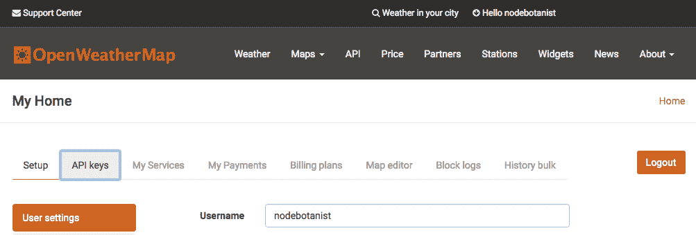
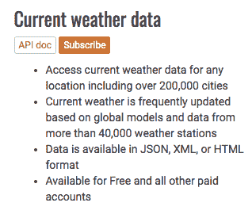
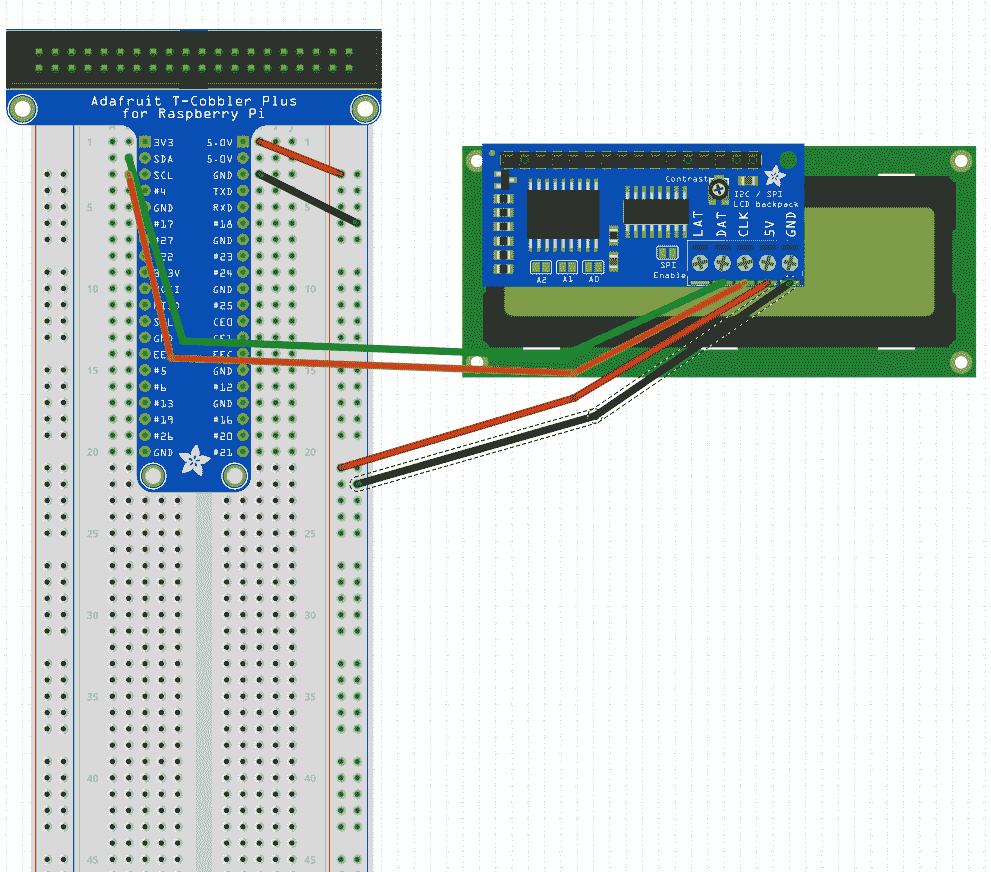
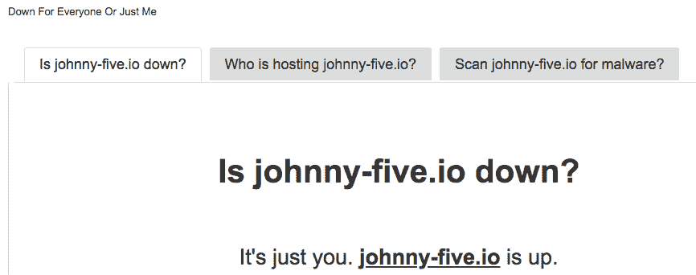
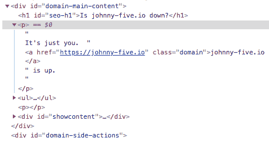
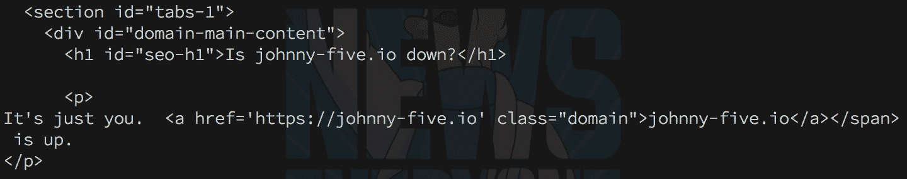

# 获取你需要的信息

我们让我们的 Pi 发现其周围环境，并通过各种方式显示数据。我们甚至赋予了它们移动的能力！但是，还有大量的数据需要收集，有时你想要的数据无法在本地收集。这就是互联网和使更多数据免费可用的倡议发挥作用的地方。在本章中，我们将探讨如何将你的 Pi 连接到互联网并获取天气信息，以便创建天气仪表板。

本章将涵盖以下主题：

+   为什么要把你的 NodeBots 连接到互联网？

+   使用 OpenWeatherMap 在我们的 Pi 上获取天气数据

+   使用 LCD 构建天气仪表板

+   使用 Pi 爬取网站上的数据

# 技术要求

对于这个项目，你将需要你的 Pi 和一个带有 I²C 接口的 LCD 字符显示。你可以从 Adafruit 购买并焊接一个 LCD ([`www.adafruit.com/product/198`](https://www.adafruit.com/product/198)) 和背包 ([`www.adafruit.com/product/292`](https://www.adafruit.com/product/292))，或者通过 SainSmart ([`www.amazon.in/SainSmart-Serial-Module-Shield-Arduino/dp/B00AE0FRDQ/`](https://www.amazon.in/SainSmart-Serial-Module-Shield-Arduino/dp/B00AE0FRDQ/)) 购买预构建模块。

你还想要确保你的 Pi 可以通过互联网访问外部世界，正如我们在第一章，*设置你的开发环境*中设置的那样。

本章的代码可在以下位置找到：[`github.com/PacktPublishing/Hands-On-Robotics-with-JavaScript/tree/master/Chapter09`](https://github.com/PacktPublishing/Hands-On-Robotics-with-JavaScript/tree/master/Chapter09)。

# 为什么要把你的 NodeBots 连接到互联网？

虽然传感器可以提供本地数据，但有时你希望显示来自远方或连接到其他设备上的传感器的数据。这正是我们可以真正利用 Node.js 和 npm 包来为我们的 Raspberry Pi 项目带来便利的地方。

# 使用 npm 模块的力量

在第二章，*创建你的第一个 Johnny-Five 项目*中，我们使用了 `color npm` 模块来管理颜色。我们使用了 `barcli` 模块将传感器数据放入条形图中。现在是时候使用请求 `npm` 模块为我们从网站上检索数据了！这允许我们简化使用 C 编写的微控制器开发，无需每次都手动创建 HTTP 请求，并且能够使用异步调用。

对于那些不熟悉请求模块的人来说，我们将使用它来执行类似于这样的 HTTP GET 请求：

```js
const request = require('request')

request.get(url, (err, response, body) => {
  console.log(body)
})
```

我们给 `request.get()` 调用一个 URL 和一个回调，该回调接收一个错误（希望是 null），一个响应对象，以及一个体，它方便地从完整的请求对象（可能非常大且复杂）中提取出来。

# 使用你收集的数据

你可以使用从互联网收集的数据进行许多不同的项目：

+   我在实验室里有一串可以由 Twitch 实时聊天控制的灯光

+   你可以在本地项目中比较来自远方的信息

+   你可以使用随机数据！马尔可夫链和其他半随机数据可以用于有趣的项目

以下是一些你将想要了解的，将进入你的数据收集项目：

+   这是一个 REST API 吗？我会得到 JSON 数据还是需要解析？

+   这是在抓取 HTTP 网站吗？我将如何解析出我正在寻找的 HTML 数据？（注意：如果你要抓取的网站经常更改，这可能会变得很棘手，也可能很脆弱。）

+   我需要 API 密钥或 JSON Web 令牌（JWT）来进行身份验证吗？

# 一些需要注意的事项

在你的 Pi 项目上进行互联网数据收集时，以下是一些需要注意的事项：

+   Wi-Fi 消耗的电量很多，所以如果你的项目是使用电池运行的，你需要注意功耗。

+   使用你的机器人力量做好事，不要构建有害的项目，收集他们不应该收集的信息，或者有其他可疑的目的！

+   在 Pi 上解析大量的 JSON 或 HTML 响应可能需要一段时间，所以如果你的项目运行得有点慢，请查看你得到的内容。

# 使用 OpenWeatherMap 在我们的 Pi 上获取天气数据

我们将为此构建一个天气机器人，虽然我们可以使用温度传感器，但这只会告诉我们室内的情况，而我们通常在出门前想看看外面的天气。因此，我们将使用 OpenWeatherMap API 来获取数据并在字符 LCD 上显示；但让我们先从获取 API 到 Pi 的数据开始，然后再开始跑。

# 获取 OpenWeatherMap API 密钥

首先，你需要在[`openweathermap.org/`](https://openweathermap.org/)注册一个账户，并生成一个 API 密钥。然后，点击页面左上角的用户名，并从顶部出现的标签中选择 API Keys：



在此页面上生成一个 API 密钥并保持标签页打开；我们将在下一节中使用它来获取所需的信息。

接下来，在另一个标签页中打开 API 链接；你将在这个页面上看到主要的 API 功能调用。我们要找的就在顶部 – 当前天气数据。



点击 API 文档按钮，我们将确定需要向哪个 URL 发起请求。在撰写本文时，URL 如下：

```js
http://api.openweathermap.org/data/2.5/weather?q=[city]&appid=[your API key]
```

如果你用你的城市和 API 密钥填写浏览器中的该 URL，你应该会看到如下内容：

```js
{"coord":{"lon":-97.74,"lat":30.27},"weather":[{"id":800,"main":"Clear","description":"clear sky","icon":"01n"}],"base":"stations","main":{"temp":305.59,"pressure":1016,"humidity":46,"temp_min":304.15,"temp_max":307.15},"visibility":16093,"wind":{"speed":3.6,"deg":170,"gust":8.2},"clouds":{"all":1},"dt":1534470960,"sys":{"type":1,"id":2558,"message":0.0037,"country":"US","sunrise":1534507156,"sunset":1534554612},"id":4671654,"name":"Austin","cod":200} 
```

如果这些温度看起来有点高（即使是对于德克萨斯州的奥斯汀来说），那是因为它们是以开尔文为单位的。在我们的项目中，我们将通过设置 URL 中的单位参数为`metric`来获取摄氏度，或者为`imperial`获取华氏度。

现在我们已经准备好在`npm`请求模块中编写代码，并将数据传输到我们的 Pi 上。

# 正在发送请求

让我们编写一个基本的程序，不使用 Johnny-Five，在添加 LCD 之前在我们的 Pi 上收集数据。在你的 Pi 上的一个文件中，或者准备好移动到 Pi 上的文件，命名为`weather-test.js`：

```js
const request = require('request')

setInterval(() => {
  request({
    url: 'http://api.openweathermap.org/data/2.5/weather',
    qs: {
      q: [your city],
      appid: [your API key],
      units: ['metric' or 'imperial']
    },
    json: true // returns the parsed json body for us
  }, (err, resp, body) => {
    console.log(body)
  })
}, 60000)
```

# 解析响应

控制台打印出的 JSON 对象看起来大致如此（格式化以便于阅读）：

```js
{
  "coord":{"lon":-97.74,"lat":30.27},
  "weather":[
    {"id":800,"main":"Clear","description":"clear sky",
       "icon":"01n"}
  ],
  "base":"stations",
  "main":{
    "temp":305.59,
    "pressure":1016,
    "humidity":46,
    "temp_min":304.15,
    "temp_max":307.15
  },
  "visibility":16093,
  "wind":{
    "speed":3.6,
    "deg":170,
    "gust":8.2
  },
  "clouds":{"all":1},
  "dt":1534470960,
  "sys":{
    "type":1,
    "id":2558,
    "message":0.0037,
    "country":"US",
    "sunrise":1534507156,
    "sunset":1534554612
  },
  "id":4671654,
  "name":"Austin",
  "cod":200
} 
```

那是大量的天气数据！幸运的是，因为`npm`模块请求在选项中传递了`json`: true 属性，它假设返回的任何内容都是 JSON，并为你解析它，所以你可以立即访问数据属性：

```js
let longitude = body.coords.lon // -97.74
let conditions = weather.condition // 'clear sky'
let currentTemp = main.temp // 305.59 degrees Kelvin
```

# 使用 LCD 构建天气仪表盘

现在我们有了天气数据，是时候将字符 LCD 连接到我们的 Pi 上，并使用它来显示天气数据了。我们将探索 Johnny-Five LCD 对象，将其连接到 Pi，并使用 Johnny-Five 和`npm`请求模块将它们全部编码在一起。

# 将 LCD 添加到 Pi 上

参考以下图解进行连接：



请记住，带有 I²C 接口的背板位于 LCD 的背面；我在图中将其向前移动，以便帮助你看到与 Pi 的连接。

# LCD 对象

让我们看看 Johnny-Five 文档中的 LCD 对象，以便了解如何在我们的天气仪表盘代码中构建和使用我们的 LCD。

# 构建我们的 LCD

通常，没有 I2C 的 LCD 最多可以占用八个引脚！这很多，我喜欢在我的机器人项目中使用尽可能少的线（以后更容易调试）。有了我们的背板，我们只需要两个电源引脚和两个 I2C 引脚。但这也意味着我们需要找到我们的控制器——如果你使用的是 Adafruit 背板，那么我们的控制器就是`PCF8574`；如果你购买了另一个背板，请确保它使用 PCF8574x 芯片之一！

我们还需要 LCD 的行和列字符大小——大多数是 2 行 16 列，但你可能使用了 4 行 20 列的字符模型。在任一情况下，使用适用于你连接到背板的 LCD 的任何大小。

考虑到所有这些，我们的构造函数应该看起来像这样：

```js
let LCD = new five.LCD({
 controller: "PCF8574",
 rows: 2,
 cols: 14
});
```

现在我们已经构建了 LCD，让我们看看我们需要设置什么，以及如何在屏幕上显示字符！

# 设置 LCD

我们需要做的第一件事是打开背光：

```js
LCD.on()
```

然后，我们想要让闪烁的光标消失：

```js
LCD.noBlink()
```

现在，我们准备好学习如何移动光标、打印语句和清空 LCD。

# 打印到 LCD 并清空 LCD

在打印之前，我们想要确保 LCD 被清空：

```js
LCD.clear()
```

并且光标位于起始位置（行 0，列 0）：

```js
LCD.home()
```

接下来，我们可以打印到 LCD：

```js
LCD.print("Hello, World!")
```

注意，你还可以将 LCD 函数链接在一起，因为 Johnny-Five 从每个对象函数返回 LCD 对象：

```js
LCD.clear(),home(),print('Hello World!')
```

现在，我们已经拥有了开始制作我们的仪表盘所需的一切！

# 将所有这些编码在一起

我们需要将本章学到的知识整合起来。首先，在你的`project`文件夹中创建一个名为`weather-dashboard.js`的文件，并设置你的 Johnny-Five、Raspi-IO 和 request 库，构建你的`Board`对象，并创建`board.on('ready')`处理程序：

```js
const Raspi = require('raspi-io')
const five = require('johnny-five')
const request = require('request')

const board = new five.Board({
 io: new Raspi()
})

board.on('ready', () => {
})
```

然后，在`board.on('ready')`处理程序内部，构建和设置我们的 LCD：

```js
let LCD = new Five.LCD({
  controller: 'PCF8574'
}) 

LCD.noBlink()
LCD.on()
```

然后，我们将创建一个获取天气数据的函数，并将其设置为每分钟一次的间隔：

```js
function getWeather() {
  request({
    url: 'http://api.openweathermap.org/data/2.5/weather',
    qs: {
      q: [your city],
      appid: [your API key],
      units: ['metric' or 'imperial'],
      json: true
    }
  }, (err, resp, body) => {

  })
}

setInterval(getWeather, 60000)
```

在请求回调中，我们将清除并写入 LCD：

```js
LCD.clear()
LCD.home().print('Temp: ' + body.main.temp + ' Deg [F or C]')
LCD.setCursor(0, 1).print(body.weather.description)
```

最后，在开始时调用`getWeather()`函数，以防止项目在显示任何内容之前需要整整一分钟：

```js
getWeather()
```

一旦你将全部代码整合完毕，将`project`文件夹加载到我们的 Pi 上，在 Pi 的 SSH 会话中导航到该文件夹，并运行以下命令：

```js
npm i
sudo node weather-dashboard.js
```

你应该能看到你输入的城市温度和条件出现在 LCD 上，并且它们应该每分钟刷新一次。

现在我们已经看到了一个项目，其中 Pi 从整洁的 JSON REST API 中获取数据，让我们尝试从更复杂的数据源获取数据：HTML 抓取。

# 项目 – 使用 Pi 从网站抓取数据

HTML 抓取是指向网页发起请求以获取 HTML 本身的过程，以便从中解析出数据。我们将构建一个机器人，通过抓取[`downforeveryoneorjustme.com/`](https://downforeveryoneorjustme.com/)，一个告诉你网站是否宕机的网站，来显示`johnny-five.io`是否正常运行。

对于这个项目，你不需要更改天气仪表板的布线设置，我们当前所需的硬件就足够了。

# 从 downforeveryoneorjustme.com 抓取 johnny-five.io

首先，访问[`downforeveryoneorjustme.com/`](https://downforeveryoneorjustme.com/)并在 URL 输入框中输入`johnny-five.io`，然后按*Enter*。你应该会到达[`downforeveryoneorjustme.com/johnny-five.io`](https://downforeveryoneorjustme.com/johnny-five.io)，希望你会看到一个相当简单的页面，如下所示：



现在为了准备我们的网络抓取代码，我们需要知道我们要查找的 HTML 元素以及 URL。右键点击“只是你”并选择“检查”（或你浏览器上的任何变体。在 Chrome 中，你会看到如下内容）：



这就是网络抓取的一个风险：有时候没有太多东西可以用来找到你的元素。我们最接近的是 ID 为`domain-main-content`的 div 的第一个段落（`p`标签）。我们将想要查看它是否包含字符串`It's just you.`，以确定`johnny-five.io`是否正常运行。

现在我们有了 URL 和预期的元素以及解析标准，让我们通过将 HTML 引入 Johnny-Five 项目来开始编码。

# 发起 HTTP 请求

在你的`project`文件夹中创建一个名为`scraper-j5-alert.js`的新文件。从正常的库开始，构建`Board`，并设置`board.on('ready')`处理程序。别忘了包含`npm`模块的请求：

```js
const Raspi = require('raspi-io')
const five = require('johnny-five')
const request = require('request')

const board = new five.Board({
  io: new Raspi()
})

board.on('ready', () => {
})

```

然后，在你的`board.on('ready')`处理程序内部，构建并设置你的 LCD 对象：

```js
let LCD = new Five.LCD({
 controller: 'PCF8574'
}) 

LCD.noBlink()
LCD.on()
```

然后，我们将创建一个函数来获取来自[`downforeveryoneorjustme.com/johnny-five.io`](https://downforeveryoneorjustme.com/johnny-five.io)的 HTML，并将其放置在五分钟间隔上。最后，我们调用它，这样我们就不必等待五分钟才能得到第一个结果：

```js
function isJohnnyFiveDown() {
  request('https://downforeveryoneorjustme.com/johnny-five.io',
    (err, resp, body) {
      console.log(body)
    })
}

setInterval(isJohnnyFiveDown, 300000)
isJohnnyFiveDown()
```

将`project`文件夹加载到你的树莓派上，在树莓派的 SSH 会话中导航到该文件夹，并运行以下命令：

```js
sudo node scraper-j5-alert.js
```

你可能几秒钟后会在控制台看到类似的内容（我只是截图了一小部分）：



但我们如何从那个巨大的字符串中获取信息？正则表达式？请，不要，不是那些。幸运的是，正如 Stilwell 定律（见第二章，*创建你的第一个 Johnny-Five 项目*）所述，如果你能想到功能，那么在`npm`上就有一个相应的包。在这种情况下，我们有 cheerio 模块，它允许我们使用 JQuery 风格的 API 解析和查询 HTML 字符串。

# 使用 Cheerio 获取我们想要的元素

在你的`project`文件夹中，运行以下命令：

```js
npm i --save cheerio
```

Cheerio 的基本用法是通过调用来解析文本：

```js
const cheerio = require('cheerio')
const $ = cheerio.load(htmlText)
```

然后，使用`$`变量进行查询，就像使用 JQuery 一样（如果你从未使用过 JQuery，请参阅*进一步阅读*以获取有关选择元素的优秀入门指南）：

```js
let divWithIDHello = $('#hello')
let helloDivText = divWithIDHello.text()
```

# 解析 HTML 并显示结果

这就是我们需要的，用于抓取 HTML 并获取状态。在`scraper-alert-j5.js`内部，我们将添加 cheerio 的`require()`调用到文件的顶部，与其他调用一起：

```js
const cheerio = require('cheerio')
```

然后，我们将修改在请求完成抓取 HTML 时触发的回调。我们将添加 cheerio 调用以加载文本，并查找 ID 为`domain-main-content`的 div 的第一个`p`子元素，并提取其文本。然后，我们将检查该文本是否包含`It's just you.`，并将其写入 LCD：

```js
function isJohnnyFiveDown() {
  request('https://downforeveryoneorjustme.com/johnny-five.io',
    (err, resp, body) => {
      let $ = cheerio.load(body)
      let statusText = $('#domain-main-content p')[0].text()
      LCD.clear()
      LCD.home()
      LCD.print('johnny-five.io')
      LCD.cursor(0, 1)
      // make sure to use " to surround the string!
      if(statusText.contains("It's just you.")){ 
        LCD.print('is up!')
      } else {
        LCD.print('is down (possibly)!')
      }
  })
}
```

我们已经准备好加载并运行它！将你的项目加载到树莓派上，在树莓派的 SSH 会话中导航到该文件夹，并运行以下命令：

```js
npm i
sudo node scraper-alert-j5.js
```

你应该在 LCD 上看到 Johnny-Five 是否启动！

你可能已经注意到我在下线条件中加入了`可能`这个词。这是因为，正如我之前提到的，HTML 抓取非常脆弱。如果他们将`It's just you.`改为`It is just you.`，我们的代码就会崩溃！所以我喜欢提醒 LCD 观众，它可能不一定真的下线。这再次是为什么，如果你能找到，最好从 API 获取数据的原因。但有时没有真正的选择。

# 摘要

在本章中，我们使用 I²C LCD 屏幕、npm 模块知识和 REST API 构建了一个天气仪表板，并利用了 Node.js 和树莓派的力量。你可以利用这些技能继续构建许多新的项目；如果你可以从互联网上获取信息，你可以在 Johnny-Five 和树莓派项目中使用它。

# 问题

1.  为什么树莓派非常适合需要远程数据的项目？

1.  在从树莓派发送常规网络请求时，需要考虑哪些因素？

1.  为什么我们可以链式调用 LCD 对象，例如`LCD.clear().home()`？

1.  为什么我们使用 I2C 背板与我们的 LCD 一起使用？

1.  如果不使用背板，我们需要更多组件来使用 LCD 吗？

1.  `LCD.on()`是否打开了整个 LCD？如果不是，它做什么？

# 进一步阅读

+   **request npm 模块页面**: [`www.npmjs.com/package/request`](https://www.npmjs.com/package/request)

+   **完整的 OpenWetherMap API**: [`openweathermap.org/api`](https://openweathermap.org/api)

+   **Johnny-Five LCD 文档**: [`johnny-five.io/api/lcd/`](http://johnny-five.io/api/lcd/)

+   **cheerio npm 模块页面**: [`www.npmjs.com/package/cheerio`](https://www.npmjs.com/package/cheerio)

+   **JQuery '选择元素'教程**: [`learn.jquery.com/using-jquery-core/selecting-elements/`](https://learn.jquery.com/using-jquery-core/selecting-elements/)
