# 第十章：使用 MQTT 与互联网上的事物通信

物联网设备可以通过多种方式通信，其中一些方式已经成为了标准。我们将探讨物联网设备通信的几种方式，然后深入探讨一个标准，MQTT。然后我们将构建一个小项目，使我们能够通过 AdafruitIO 查看和发送 MQTT 事件，AdafruitIO 是一个提供在线 MQTT 代理服务的平台。

本章将涵盖以下主题：

+   物联网设备通信

+   MQTT - 一个物联网发布/订阅协议

+   在树莓派上使用 AdafruitIO 设置 MQTT

+   项目 - 添加 LCD 和按钮以查看和显示 MQTT 事件

+   项目 - 使用 IFTTT 的社交媒体通知机器人

# 技术要求

对于这个项目，你需要将你的 LCD 连接到你的树莓派上（参见第九章，*获取所需信息*），一个按钮和一个 10K 欧姆电阻作为硬件。

对于其他工具，你需要在[`adafruit.io`](https://adafruit.io)创建一个免费账户。你还需要一个 IFTTT 账户（也是免费的）来完成最终项目。

本章的代码位于[`github.com/PacktPublishing/Hands-On-Robotics-with-JavaScript/tree/master/Chapter10`](https://github.com/PacktPublishing/Hands-On-Robotics-with-JavaScript/tree/master/Chapter10)。

# 物联网设备通信

正如我们在第九章，*获取所需信息*中看到的，我们的树莓派可以使用 HTTP 请求从互联网上获取信息。但如果我们想实时将数据发送到树莓派呢？如果我们想一组设备相互聊天，根据需要来回发送数据呢？让我们看看使用 Web 技术可以如何实现这一点。

# 长轮询

长轮询涉及在特定间隔通过 HTTP 请求获取信息。如果这听起来很熟悉，那是因为这正是我们在第九章的天气仪表板项目中做的；我们每 60 秒轮询一次 OpenWeather API。当没有其他选择时，这种方法是最好的；一些 REST API 没有保持连接开启或建立双向通信的方法，在这些情况下，长轮询是最佳选择。

但现在有更新的方法来建立可以保持开启的双向连接，包括 WebSocket。

# WebSocket

WebSocket 是一个强大的工具，它允许我们建立一个保持开启的双向数据连接，直到你关闭它（除非出现错误或连接丢失）。你可以实时地来回发送消息，而不需要每次都设置一个新的连接。它还允许服务器在与你的树莓派通信时无需询问，这对于实时数据来说是非常好的。

虽然 WebSockets 功能强大，但有一些方法可以针对物联网项目微调此连接。同时，保持一个开放的套接字并保持发送或接收的数据组织起来可能也很困难。考虑到这一点，我们将讨论 MQTT。

# MQTT - 一个物联网发布/订阅协议

**消息队列遥测传输**（**MQTT**）协议（通常发音为**mosquitto**）是为低带宽、高延迟环境设计的协议，这使得它非常适合物联网项目，尤其是那些在有限硬件上运行的项目。它不仅用于机器之间的通信：一些项目使用它来发送用于存储的数据。

让我们看看 MQTT 是如何工作的，以及它是如何为我们的项目实现发布/订阅设置的。

# MQTT 的基本知识

让我们先概述几个术语，然后将它们联系起来，以定义 MQTT 作为一个概念：

+   **MQTT 消息**: MQTT 消息由主题和消息组成。主题是客户端订阅的，他们通常读取消息以获取数据。

+   **MQTT 客户端**: MQTT 客户端连接到 MQTT 代理，一旦连接到代理，就可以订阅和发布主题。

+   **MQTT 代理**: MQTT 代理负责处理客户端连接，并在客户端在某个主题上发布消息时，将消息传递给所有订阅该主题的客户端。它还可以向主题发布消息，这些消息将发送给所有订阅的客户端。

在我们的项目中，我们将设置 Pi 作为 MQTT 客户端，将其连接到 AdafruitIO 的代理，并发布代理将发送给客户端（我们的 Pi）的消息，并接收它发布的消息。

# 在 Pi 上使用 AdafruitIO 设置 MQTT

为了设置 MQTT，我们需要一个代理。虽然 Pi 本身可以充当代理（参见“进一步阅读”部分），但我们不需要在 Pi 上使用代理功能。我们可以使用 AdafruitIO 创建一个代理，我们可以在 Pi 上订阅主题。

# 创建账户和数据源

首先，我们将前往[`io.adafruit.com/`](https://io.adafruit.com/)并创建一个免费账户。然后，你将被带到仪表板：

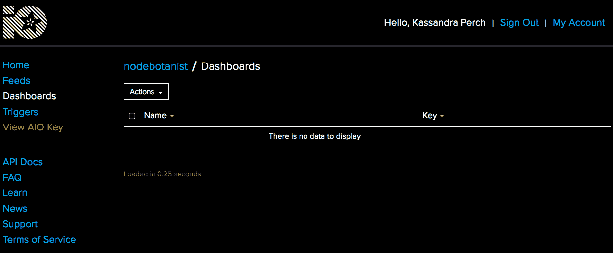

我们需要设置一个数据源并获取我们的 AIO 密钥，以便在 Pi 上开始设置。要设置数据源，请选择左侧菜单中的“数据源”。然后，点击左上角的“操作”按钮：

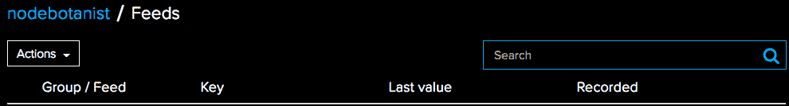

接下来，从下拉菜单中选择“创建新数据源”。给你的数据源命名（我将其命名为`hands-on-robotics-with-js`，以便于记住我创建它的目的）。然后，你将被带到新数据源的页面：

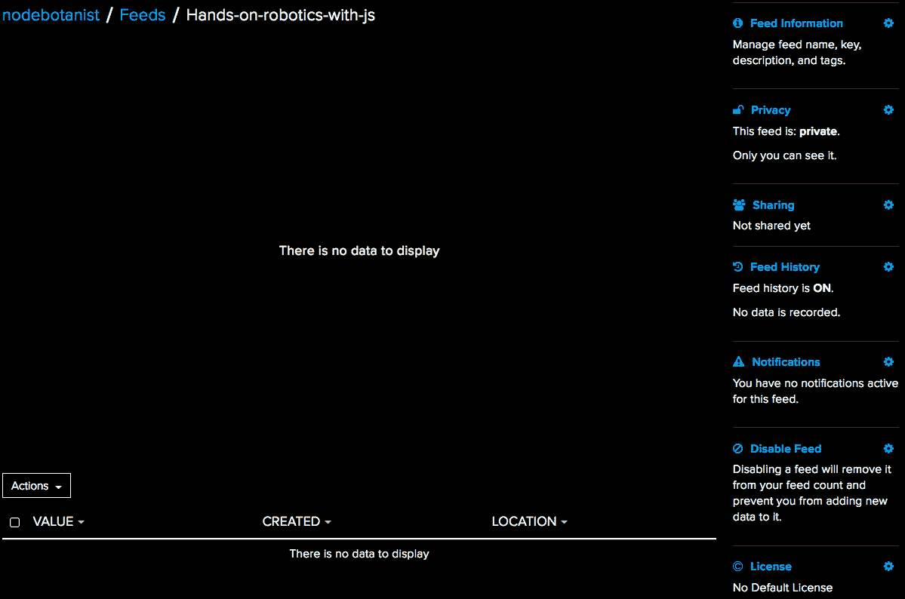

现在我们已经创建了我们的数据源，我们可以获取所有需要将 Pi 连接到它的信息。首先，让我们获取用于 MQTT 模块的 Feed 密钥。点击右侧的“Feed 信息”，并复制 MQTT ID 下的值，将其放置在容易获取的地方。然后，关闭“Feed 信息”窗口。

接下来，在左侧菜单中点击“查看 AIO 密钥”。复制活动密钥并将其放置在容易访问的地方。

在我们继续之前，先澄清一些术语：您注意到的以 ID 命名的 MQTT 资源将是我们客户端（树莓派）发送到我们的代理（AdafruitIO）的消息的主题，反之亦然。

我们现在拥有了连接我们的树莓派到 AdafruitIO 代理所需的一切。

# 使用 mqtt npm 模块订阅资源

为此项目创建一个 `project` 文件夹，以便将其传输到树莓派。在文件夹内，运行以下命令：

```js
> npm init -y
> npm i --save mqtt dotenv
```

这将安装 `mqtt npm` 模块，这将简化我们的 MQTT 连接，以及 `dotenv` 模块，它允许您在单独的文件中使用环境变量（非常适合确保您不会将 AIO 密钥提交到 GitHub）！

# `mqtt` 模块

`mqtt` 模块允许我们构建一个 MQTT 客户端对象：

```js
const client = mqtt.connect(url, {options})
```

我们将通过 `options` 对象将 AdafruitIO URL、我们的用户名和 AIO 密钥传递给此方法。

在 MQTT 客户端对象上可用的几个事件处理器（见 *进一步阅读*），但在这个项目中我们将使用以下处理器：

```js
client.on('connect', () => {})
client.on('message', (topic, message) => {})
```

最后，我们希望能够从我们的客户端向代理发布消息：

```js
client.publish(topic, message)
```

# `dotenv` 模块

`dotenv` 模块使得配置您不想提交到 GitHub 的环境变量变得简单。您将其加载到您的 Node.js 应用程序中：

```js
const dotenv = require('dotenv').config()
```

这将在 Node.js 文件所在的同一目录中加载一个 `.env` 文件，其格式如下：

```js
KEY=value
```

然后它可以通过 `process.env` 全局变量在您的应用程序中访问：

```js
let key = process.env.KEY // 'value'
```

现在我们对所使用的库和服务有了更多的了解，让我们设置一个测试连接程序！

# 测试我们的连接

要测试我们的连接，我们将让树莓派连接到 AdafruitIO 代理，订阅我们的新资源，并发布一条消息。当我们在 AdafruitIO 网站上的资源仪表板中看到我们的消息已被接收时，我们就知道它成功了。

要做到这一点，我们需要配置 `mqtt` 客户端，为客户端设置一个 `connect` 处理器，并使用该处理器来订阅和发布我们的消息。在您之前设置的文件夹中，创建一个名为 `mqtt-test.js` 的文件，并写入以下代码：

```js
const dotenv = require('dotenv').config()
const mqtt = require('mqtt')

const client = mqtt.connect(
  process.env.ADAFRUIT_IO_URL,
  {
    username: process.env.ADAFRUIT_IO_USERNAME,
    password: process.env.ADAFRUIT_IO_KEY,
    port: process.env.ADAFRUIT_IO_PORT
  }
)

client.on('connect', () => {
  console.log('Connected to AdafruitIO')
  client.subscribe(process.env.ADAFRUIT_IO_FEED, () => {
    client.publish(process.env.ADAFRUIT_IO_FEED, 'Hello from the Pi!')
  })
})
```

然后，在同一个文件夹中，创建一个名为 `.env` 的文件（确保它以点开头！），并在其中放置以下内容：

```js
ADAFRUIT_IO_URL=
ADAFRUIT_IO_USERNAME=[the username you signed up for AdafruitIO with]
ADAFRUIT_IO_KEY=[your AIO Key from earlier]
ADAFRUIT_IO_PORT=
ADAFRUIT_IO_FEED=[The feed info from earlier]
```

然后，将文件夹传输到树莓派上。在树莓派会话中，导航到该文件夹并运行以下命令：

```js
npm i
```

之前的命令将确保所有模块都正确安装在树莓派上。然后，使用以下命令：

```js
node mqtt-test.js
```

现在，转到您的 AdafruitIO 资源仪表板。您应该在那里看到一个消息：

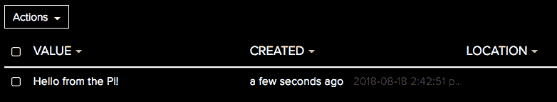

现在我们知道我们可以将树莓派连接到 AdafruitIO，让我们添加一个 LCD 来查看传入的消息，以及一个按钮来生成传出消息！

# 项目 – 添加 LCD 和按钮以查看和发送 MQTT 事件

我们可以使用 AdafruitIO 仪表板将消息发布到我们的 MQTT 馈送，因此我们将使用 LCD 来显示我们发送的内容。我们还将连接一个按钮，当按下时将发送 MQTT 消息。

# 连接所有部件

首先，我们将我们的 LCD 连接到 I2C 引脚，并将按钮连接到 GPIO #5，也称为 P1-29：

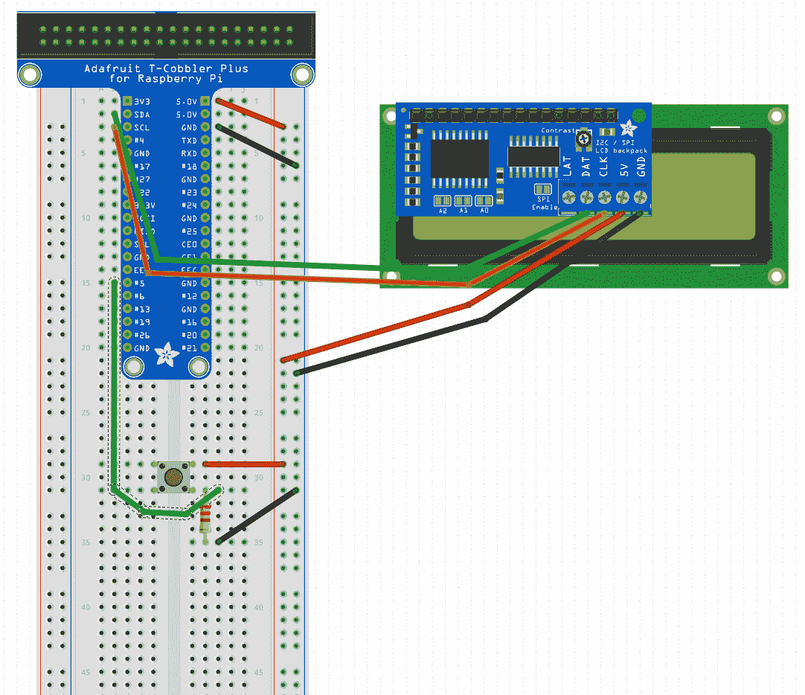

# 将所有代码整合在一起

在同一文件夹中的文件中创建 `mqtt-button-lcd.js`。放入常用的 Johnny-Five 和 Raspi-IO 构造函数，并在板就绪处理程序中：

然后，从 `mqtt-test.js` 中添加 AdafruitIO 的 MQTT 连接客户端构造函数。我们还将在这里设置我们的 LCD 和按钮对象：

```js
let LCD = new five.LCD({
  controller: "PCF8574",
  rows: 2,
  cols: 16
})
let button = new five.Button('P1-29')

```

之后，我们就准备好编写在按钮按下时发送消息，以及在 LCD 上打印接收到的消息的代码：

```js
client.on('connect', () => {
  console.log('Connected to AdafruitIO')
  client.subscribe(process.env.ADAFRUIT_IO_FEED, () => {
    client.publish(process.env.ADAFRUIT_IO_FEED, 'Hello from the Pi!')

    button.on('press', () => {
      client.publish(process.env.ADAFRUIT_IO_FEED, 'Button pressed!')
    })

    client.on('message', (topic, message) => {
      LCD.clear().home().print(topic).setCursor(1,0).print(message)
    })
  })
})
```

现在，将文件夹移动到 Pi 上，进入 Pi 会话，导航到文件夹，运行以下命令：

```js
npm i --save johnny-five raspi-io
```

然后，运行程序（务必使用 `sudo`！）

```js
sudo node mqtt-lcd-button.js
```

现在，按下按钮，你应该会在 AdafruitIO 馈送仪表板上看到消息弹出：

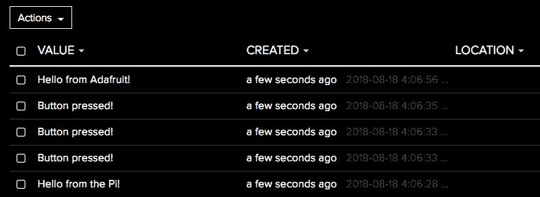

以及你的 LCD（记住，MQTT 事件会发布给所有人，包括发布它们的客户端，如果它们已订阅的话！）

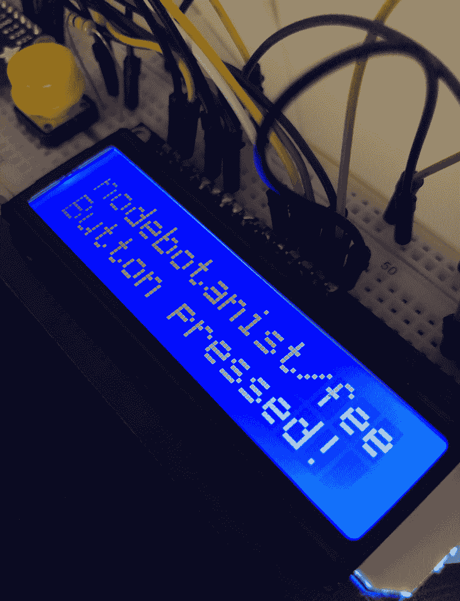

当我们在这里时，点击“操作”，然后添加数据，在数据框中输入“来自 Adafruit 的问候！”并点击创建。它应该会显示在你的 LCD 上：

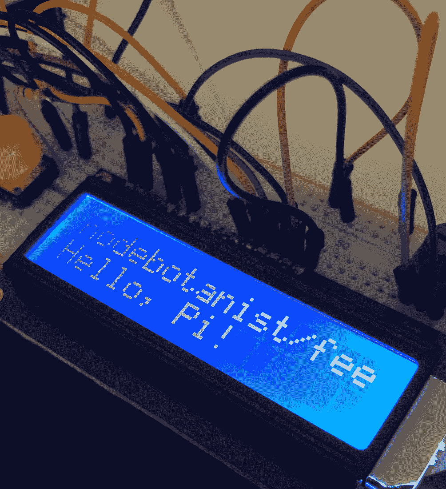

现在你已经拥有了通过 MQTT 与互联网通信的机器人！

# 项目 – 使用 IFTTT 的社交媒体通知机器人

在浏览器中打开很多标签页，并点击每个标签以查看通知，可能会很麻烦。幸运的是，我们可以轻松构建一个项目，从多个来源收集通知，创建一个在 LCD 上通知我们的机器人。我们还将了解更多关于 If This, Then That (IFTTT) 及其插件，它将允许我们将事件路由到 Adafruit IO 以及我们的 Pi。

# 开始使用 IFTTT

IFTTT 是创建图形公式（称为 applet）的一种方式，它由一个触发器（例如社交媒体事件）和一个动作（例如将数据发送到 AdafruitIO）组成。我们将通过将 AdafruitIO 和我们的社交媒体账户链接到 IFTTT，并创建 Applet 将社交媒体通知数据发送到 AdafruitIO。

首先，在 [`ifttt.com/`](https://ifttt.com/) 上登录或创建一个账户，然后我们将开始链接我们的账户。

# 将 IFTTT 连接到 Adafruit

要链接你的 AdafruitIO 账户，点击右上角的用户名，选择服务，然后选择页面底部的所有服务链接。然后，在搜索栏中输入 `Adafruit`，并点击标记为 Adafruit 的黑色框，应该会带你到这里：

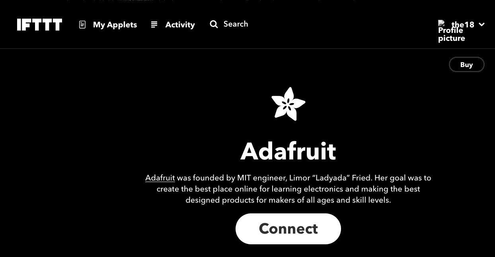

然后，点击连接并输入你的 AdafruitIO 凭据。你希望从任何社交媒体网络接收通知，也应该这样做。我添加了`Twitter`和`Twitch.tv`账户。

现在我们已经将账户链接，我们应该退回到 Adafruit.IO 并添加我们的社交媒体账户的 feed，这样我们就可以在创建我们的 IFTTT applet 时选择它们。

# 在 AdafruitIO 中设置社交媒体 MQTT 消息的 feed

在你的 AdafruitIO 仪表板上，你应该为每个你希望你的机器人通知你的社交媒体服务创建一个 feed（这对应于一个 MQTT 主题）。当构建包含多个机器人监听事件的复杂 MQTT 系统时，拥有清晰且粒度化的主题非常重要。

我通过在 AdafruitIO 仪表板的 Feeds 页面选择操作并点击创建新组来为这些 feed 创建了一个组：

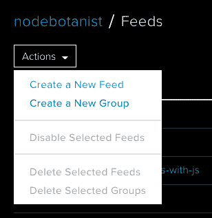

我将其命名为`Social-Media-Bot`。一旦你完成创建组，点击组名进入该组的仪表板，它应该还没有 feed。点击操作并从下拉菜单中选择创建新 feed。然后，输入你将使用的社交媒体服务的名称作为 feed 的名称。对于你希望使用的任何社交媒体服务重复此操作。

AdafruitIO Feed Group 还充当了一个方便的命名空间工具。Social-Media-Bot 组中的 twitter feed 变成了 Social-Media-Bot.twitter。如果你有多个包含 Twitter 数据 feed 的项目，这将非常有用。

现在我们已经将社交媒体账户链接到 IFTTT，并且 AdafruitIO feed 已经准备好接收数据，让我们创建一些 IFTTT Applets 来收集社交媒体通知。

# 创建我们的 IFTTT Applets

在 IFTTT 主页上，你通过在右上角选择你的用户名并选择新 Applet 来创建一个新的 applet：

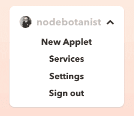

你将看到 IFTTT Applet 公式：

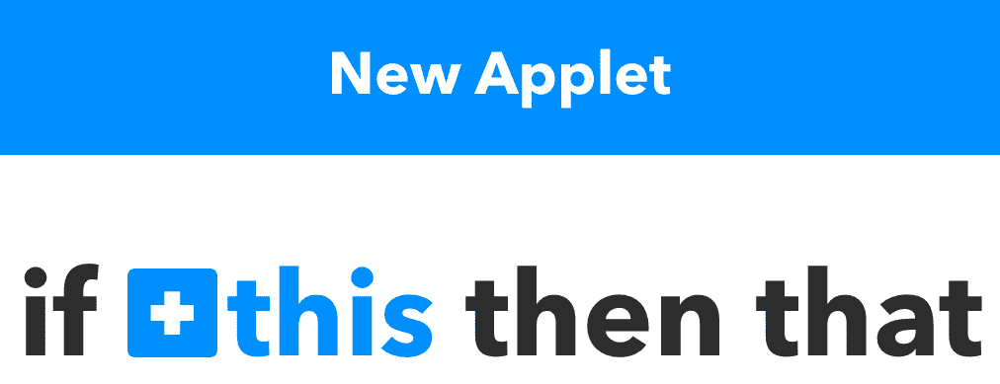

点击+this 链接，进入你可以用来触发你的 IFTTT applet 的服务列表。在搜索栏中填写你希望使用的社交媒体服务的名称，并选择它。

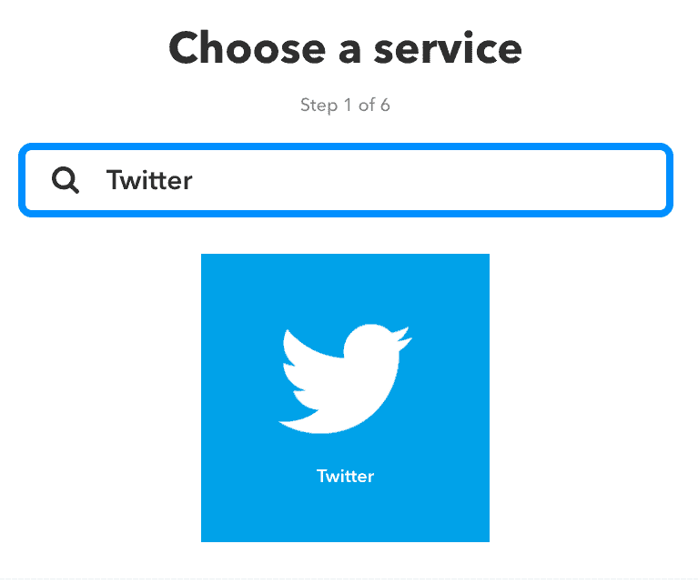

你将看到该服务可能触发的列表。选择你希望被通知的触发器（我从有人关注我的 twitter 账户开始）。一旦你点击触发器，你将返回到公式页面，+this 将被替换为你用作触发器的社交媒体网站的 logo。然后，点击+that 创建我们的操作。


你将被带到类似页面以选择用于操作的服务。搜索`AdafruitIO`并选择它。你将被要求填写有关你希望发送到哪个 AdafruitIO feed 的信息，以及你希望发送的消息：

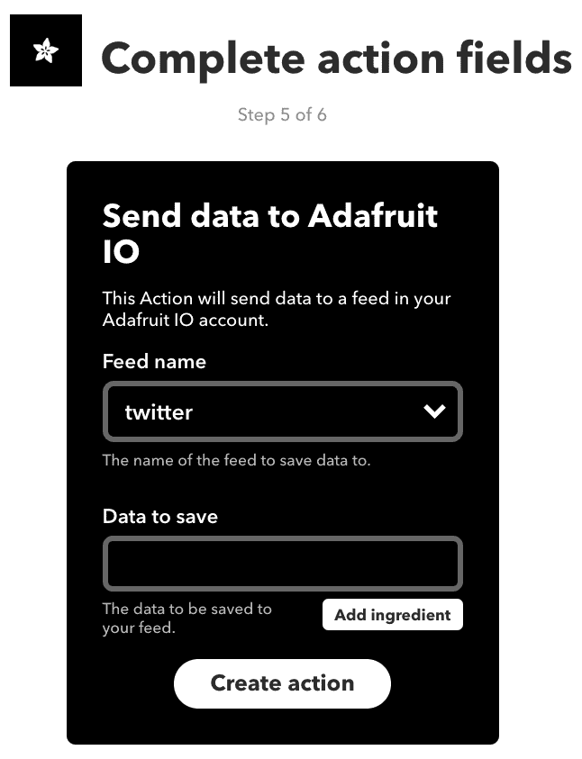

选择与触发此小程序的社交媒体网站匹配的源名称。在要保存的数据中，你可以输入我们可以在 LCD 上显示的消息。你还可以点击添加成分按钮来添加社交媒体事件本身的信息：

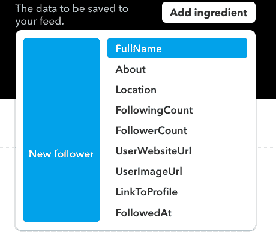

我选择了 FullName，最终收到了消息`{{FullName}}在 Twitter 上关注了你`！

对第一个社交媒体网站的其他触发器和其他社交媒体网站及其触发器重复此操作。

现在，我们的 IFTTT Applets 正在向 AdafruitIO 发送数据，我们可以开始为我们的机器人布线和编码。

# 连接我们的项目

对于这个项目，你只需要 LCD；如果你为上一个项目连接了按钮，你可以将其移除：

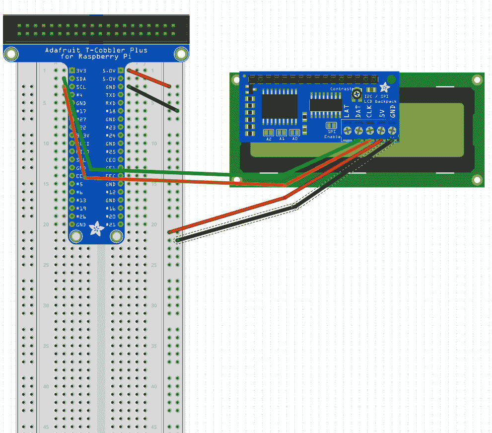

# 将我们的社交媒体通知编码到 LCD 上显示

在你的`project`文件夹中创建一个名为`social-media-bot.js`的文件，并将`mqtt-button-lcd`的内容复制进去。我们将修改此文件以创建我们的社交媒体机器人。

首先，删除所有关于按钮变量和`Button`对象的引用，因为我们不会使用它们。

接下来，我们需要获取我们将要订阅的源（主题）的名称。为此，点击 AdafruitIO 源页面中你想用于此机器人的每个源。然后在页面右侧，点击源信息并复制 MQTT by key 字段：

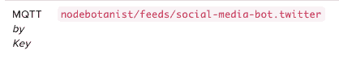

然后，在`client.on('connect')`处理程序中，我们将订阅多个主题，并且不使用回调功能。然后，我们将添加一个`client.on('message')`处理程序来在 LCD 显示器上显示来自 IFTTT 的消息：

```js
client.on('connect', () => {
  console.log('Connected to AdafruitIO')
  client.subscribe('nodebotanist/feeds/social-media-bot.twitter')
  client.subscribe('nodebotanist/feeds/social-media-bot.twitch')
  client.on('message', (topic, message) => {
    LCD.clear()
    LCD.home()
    LCD.autoscroll()
    LCD.print(message)
  })
})
```

现在，我们已经订阅了新的源并将其设置为打印到 LCD，我们可以运行它！

# 运行你的社交媒体机器人

运行以下命令以查看输出：

```js
sudo node social-media-bot.js
```

很快，当你收到社交媒体通知时，你应该会在你的 LCD 上看到一个消息弹出。

# 摘要

在本章中，我们讨论了几种互联网连接设备之间相互通信的方式。我们深入探讨了 MQTT 协议，并讨论了其 Pub/Sub 接口和抽象使其成为我们 Pi 上的项目的一个很好的选择。然后，我们构建了一个使用按钮与外界通信的机器人，并通过 AdafruitIO 仪表板和 IFTTT 让外界与之通信。最后，我们使用 AdafruitIO 集成到 IFTTT 中构建了一个社交媒体通知机器人。

# 问题

1.  有哪些两种方式物联网设备与互联网接口，但不是特定于物联网的？

1.  MQTT 代表什么？

1.  MQTT 客户端能做什么？

1.  MQTT 代理能做什么？

1.  为什么我们的 Pi 会收到它发布到 AdafruitIO 的消息？

# 进一步阅读

+   **关于 MQTT 的优秀教程**：[`www.pubnub.com/blog/what-is-mqtt-use-cases/`](https://www.pubnub.com/blog/what-is-mqtt-use-cases/)

+   **MQTT 协议官方站点**：[`mqtt.org/`](http://mqtt.org/)

+   **AdafruitIO 教程**: [`learn.adafruit.com/category/adafruit-io`](https://learn.adafruit.com/category/adafruit-io)

+   **npm 上的 mqtt 模块页面**: [`www.npmjs.com/package/mqtt`](https://www.npmjs.com/package/mqtt)
