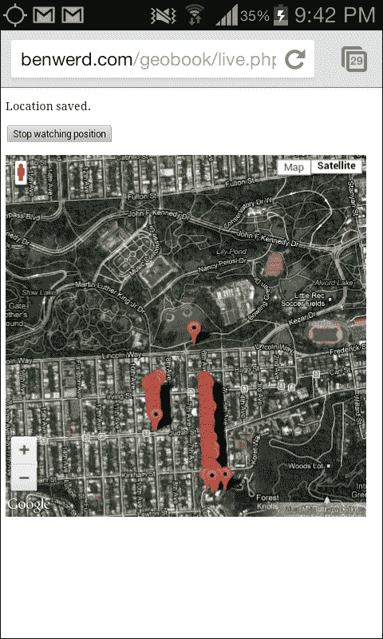

# 第一章。Instant HTML5 Geolocation How-to

欢迎阅读 *Instant HTML 5 Geolocation How-to*。本指南将帮助您快速、轻松地使任何网络应用了解用户的地理位置。您将学习如何将用户的地理位置进行映射，将其与流行的地图平台集成，并随时间跟踪用户。在这个过程中，您将创建一个简单的应用程序，该应用程序生成一个包含您选择的路径和点的 KML 文件（这些路径和点可以随后导入到谷歌地图中）。

iPhone 改变了我们使用网络的方式。它是第一个将网络浏览作为主要功能的移动设备。突然之间，有了像 iPhone 这样的手机和移动数据，网络可以放在您的口袋里，无论您走到哪里。通过 HTML5 和 API，网络应用可以真正地具有上下文敏感性；它们可以知道您在哪里，如果需要它们相应地做出反应。

地理定位 API 不是 HTML5 的一部分，而是一个 JavaScript API 标准。然而，它作为现代网络开发工具包的重要部分，与不断发展的 HTML5 规范并列。

# 理解地理定位 API（简单）

地理定位 API 的核心是一系列简单的 JavaScript 调用，用于检索用户位置的以下方面：

+   纬度和经度

+   高度

+   纬度和经度的准确性

+   高度信息的准确性

+   航向

+   速度

值得注意的是，由于上述技术能力方面的差异，即使地理定位 API 运行得完美无缺，这些值也不一定总是可用。例如，笔记本电脑不知道它的高度。这是因为它以不同的方式确定位置，例如，与具有 GPS 访问权限的手机相比。这些差异将在下一节中讨论。

## 如何实现...

网络可以从不同类型的硬件访问，例如台式电脑、笔记本电脑、平板电脑、手机和嵌入式系统。

### 注意

**万维网联盟**（**W3C**）以这种方式最终确定规范，使得网络继续支持这些平台中的每一个。您的操作系统、互联网服务提供商、设备类型和位置都不应该有任何影响；网络是普遍的。

所有这些意味着网络可能是人类文明史上最重要的出版媒介——一个任何人都可以发布和消费的媒介。然而，由于每个设备都有略微不同的功能，每个功能可能对每个用户都有略微不同的特性。例如，在 HTML5 中，一些网络浏览器可以播放某些视频格式，而其他网络浏览器可以播放其他视频格式。在地理定位 API 中，这些变化与位置的计算方式有关，因此也影响了其准确性。

这就是地理定位 API 从用户角度的工作方式。您可以通过访问我的演示[`benwerd.com/lab/geo.php`](http://benwerd.com/lab/geo.php)来看到它的实际效果。

1.  访问需要位置信息的应用程序或网站。

1.  应用程序尝试使用地理位置 API 确定您的位置。

1.  浏览器会询问您是否希望向应用程序透露您的位置。

1.  如果您同意分享您的位置，您的位置将使用可用的硬件和软件确定，并发送到应用程序。

1.  如果您不同意分享您的位置，则不会向应用程序发送任何位置信息，并且会通知应用程序不会发送位置信息。

如果您的应用程序需要使用地理位置 API，则：

+   您想根据用户的位置调整应用程序的功能

+   您想根据用户的位置调整网站内容或重定向用户

+   您想让用户能够跟踪其随时间变化的位置

如果您的应用程序无法使用地理位置 API，则：

+   您想在不经用户明确同意的情况下跟踪用户

+   您需要实时、极其准确的位置信息

我们将在下一节中讨论原因。

## 工作原理...

请求信息是保护用户隐私的重要步骤。地理位置 API 规范明确指出：“用户代理不得在用户明确同意之前向网站发送位置信息。”遗憾的是，用户的位置通常可以通过其他方式确定，例如 IP 地理位置或通过应用程序之间的数据共享，但这些与地理位置 API 无关，我们在此不讨论它们。

这是在我的 MacBook Pro 上使用家庭宽带互联网连接并使用 Google Chrome 进行位置请求时的样子：


注意主网页内容上方的彩带。页面的全部内容都已发送到浏览器；一旦发送了位置信息，JavaScript 可以更改页面内容（例如，使用 jQuery 框架），通过回调将内容提交到其他地方，或者将浏览器转发到另一个页面。

这是在 Android Chrome 浏览器中的样子：


您可以通过访问[`benwerd.com/lab/geo.php`](http://benwerd.com/lab/geo.php)来测试您浏览器的地理位置功能。

这是在我的 MacBook Pro 上使用有线互联网连接并使用 Google Chrome 时的样子：


您可以看到，尽管我的纬度和经度计算得相当准确，但我的海拔、航向和速度细节不可用。这是因为这些细节是通过**GPS**（**全球定位系统**）技术确定的，而我的笔记本电脑没有这项功能。相反，我的网络浏览器需要根据各种环境因素猜测我的位置。

这是我的手机上 Android Chrome 浏览器中的相同地理位置 API 测试的样子：


你可能会惊讶地看到，尽管在具有硬件 GPS 支持的手机上已经确定了高度、航向和速度信息，但我的这些信息仍然没有出现。实际上，这是因为（如果你使用默认的地理定位 API 配置）Android 上的 Chrome 会首先尝试使用 WiFi 位置，如果可用，然后再求助于相对耗电（但更准确）的 GPS 位置。

下面是测试页面在 iPad 上的样子：


因为 iPad 确实使用了 GPS 数据来确定我的位置，所以可以获取到海拔信息。然而，我没有移动，所以没有速度或航向信息。

只有纬度、经度和精度是保证存在的。其他字段完全取决于用户的设备、移动和位置上下文。

当 GPS 不可用时，浏览器将使用称为三角测量的过程来确定位置。

### 注意

三角测量考虑环境因素，如可用的无线网络及其相对信号强度、与手机塔的接近程度以及当前网络 IP 地址，并将它们与已知位置的远程数据库中的环境因素进行匹配。对于大多数浏览器，这个数据库实际上是由 Google 运行的，但一些提供商使用 Skyhook Wireless 的解决方案，还有其他一些。例如，Apple 为其产品维护自己的数据库，这些数据库可能来自消费者 iPhone 和 iPad 的使用情况，可能是通过众包收集的。数据库信息也可能来自特殊车辆，例如那些用于 Google StreetView 照片拍摄的车辆，以及其他众包技术。需要注意的是，在这些情况下，用户的地理位置信息被发送到了第三方，并且返回的位置将仅与服务的数据库一样好。如何确定位置不是地理定位 API 规范的一部分；你需要知道的是，会返回一些位置信息。

## 还有更多...

除了 Opera Mini 之外，所有桌面和移动平台上的现代浏览器都支持地理定位 API。大多数浏览器已经支持了足够长的时间，你应该可以在你的 Web 应用程序中放心使用该 API。

+   从版本 9.0 开始（2010 年 3 月 14 日）的 Microsoft Internet Explorer 浏览器

+   从版本 3.5 开始（2009 年 6 月 30 日）的 Mozilla Firefox 浏览器

+   从版本 5.0 开始（2010 年 5 月 25 日）的 Google Chrome 浏览器

+   从版本 2.1 开始（2010 年 1 月）的 Android 浏览器

+   从版本 5.1 开始（2011 年 7 月 20 日）的桌面版 Apple Safari 浏览器

+   从版本 3.2 开始（2010 年 4 月 3 日）的 iOS 版 Apple Safari 浏览器

+   从版本 10.6 开始（2010 年 7 月 1 日）的 Opera 浏览器

+   从版本 7.0 开始（2011 年 5 月）的黑莓浏览器

(来源：[CanIUse.com](http://CanIUse.com))

值得注意的是，由于 Microsoft Internet Explorer 9.0 是第一个不支持 Windows XP 的版本，因此仍然存在一个重要的企业用户群——使用 Windows XP 操作系统的 Internet Explorer 用户——他们无法使用基于地理位置 API 的应用程序。在撰写本文时，这代表了全球所有网络用户的 24%，根据[theie8countdown.com](http://theie8countdown.com)。出于这个原因以及许多其他原因，包括它们自己的安全，让我们希望他们很快升级。

Opera Mini 不支持也意味着许多手机用户，尤其是在发展中国家或功能手机用户，无法使用地理位置 API。这种情况可能会很快改变，因为开源移动操作系统如 Android 和 Firefox OS 正在那些市场获得影响力。

### 更多资源

这里有一些相关的资源供进一步研究：

+   **我能否使用地理位置定位**：支持地理位置 API 的浏览器最新列表（[`caniuse.com/#feat=geolocation`](http://caniuse.com/#feat=geolocation)）

+   **地理位置 API 规范**：[`dev.w3.org/geo/api/spec-source.html`](http://dev.w3.org/geo/api/spec-source.html)

# 设置应用程序（简单）

在本节中，我们将学习我们需要哪些服务器软件来支持地理位置 API，我们需要哪些服务器软件来支持本书中将要构建的应用程序，以及如何设置您的服务器软件以支持该应用程序。

在这本书中，我们将构建一个简单的应用程序，该应用程序创建用户移动的**KML**（**Keyhole Markup Language**）馈送，可以导入到 Google Maps 和 Google Earth 等地图应用程序中。为了做到这一点，我们需要捕获用户的地理位置坐标，将它们保存到数据库中，然后将保存的坐标导出到数据馈送中。

## 准备工作

需要支持的核心操作有四个：

+   显示包含地理位置 API 代码的页面

+   捕获用户的地理位置

+   存储用户的位置

+   以 KML（**Keyhole Markup Language**）格式显示用户的位置历史记录

为了本书的目的，我们将依次支持它们：

+   Apache Web 服务器

+   使用 jQuery 的客户端 JavaScript（地理位置 API 本身在服务器端不需要支持；我们将使用 jQuery 来简化 AJAX 查询和页面内容的操作）

+   MySQL 数据库和 PHP 脚本语言

+   一个用 PHP 编写的简单馈送脚本

注意，您可以使用任何网络浏览器、任何网络脚本语言和几乎任何数据库来执行这些任务。我希望这里的示例足够通用，以便您可以将它们翻译成您选择的任何语言和服务器软件。例如，如果您不喜欢 PHP，这些示例应该相对容易翻译成 Ruby 或 Python。

我们将假设您正在运行 Apache Web 服务器的一个最新版本，并已配置为允许使用 PHP 5.3 或更高版本进行脚本编写。

## 如何做到这一点...

在您的网络服务器上的新位置创建以下文件：

+   `index.php`: 检索用户位置的主页面

+   `callback.php`: 我们将在幕后调用的代码，以保存用户的位置

+   `feed.php`: 将回显 KML 源脚本的脚本

+   `lib.php`: 一个通用文件，用于处理数据库连接和任何其他配置

+   `live.php`: 一个主页面版本，它持续检索用户的位置

+   `livepath.php`: 一个主页面版本，它持续检索用户的位置并显示其路径

为此示例创建一个新的 MySQL 数据库表（如果你喜欢，也可以创建一个新的数据库来存放它）。这将存储我们检索到的地理位置坐标，包括时间戳和用户的标识符。

我们可以以多种方式存储位置信息。地理坐标以经度和纬度返回；地球表面上相对于本初子午线的东西角度，以及相对于赤道的南北角度。回想一下*理解地理定位 API（简单）*配方中的示例数据，角度被返回到 14 位小数。我们能够存储这些数字越精确，我们就能越精确地检索用户的位置。

在本教程的目的上，我们将把坐标存储为一系列浮点数。这是因为我们不会对地理数据进行任何比较；我们只是存储和检索它。

那么，我们需要的只是带有所需精度的十进制点纬度和经度，以及用户的整数标识符和另一个时间戳标识符。由于我们将通过用户和时间戳进行搜索，为每个这些字段维护一个索引是个好主意。

我们将把我们的数据库表命名为`points`：

```js
--
Table structure for table 'points'
--

CREATE TABLE IF NOT EXISTS 'points' (
'id' int(11) NOT NULL AUTO_INCREMENT COMMENT 'Our primary index field',
'latitude' float NOT NULL COMMENT 'Our latitude coordinate',
'longitude' float NOT NULL COMMENT 'Our longitude coordinate',
'user_id' int(11) NOT NULL COMMENT 'The unique ID of the user',
'time' int(11) NOT NULL COMMENT 'The UNIX timestamp of the time when the point was recorded',
PRIMARY KEY ('id'),
KEY 'user_id' ('user_id'),
KEY 'time' ('time')
) ENGINE=InnoDB;
```

### 小贴士

**下载示例代码**

您可以从您在[`www.PacktPub.com`](http://www.PacktPub.com)的账户中下载您购买的所有 Packt 书籍的示例代码文件。如果您在其他地方购买了这本书，您可以访问[`www.PacktPub.com/support`](http://www.PacktPub.com/support)并注册以直接将文件通过电子邮件发送给您。

注意，我还包括了数据库中每行的唯一标识符，以便以后方便访问。

## 还有更多...

地理数据的一个问题是它很容易存储大量的数据，如果不小心，这可能会导致数据库变慢——尤其是如果你做了很多邻近度查询，例如，发现位于某个位置一定半径内的存储地理点。这个功能背后的数学虽然不是特别复杂，但总体上可能会变得昂贵。

MySQL 有一个空间支持扩展，它允许您使用优化的地理引擎存储、检索和比较基于空间的扩展。它使用 OpenGIS 项目的一个标准集来存储地理数据集。它通常默认安装，对于更复杂的地理感知应用程序来说，了解它是有价值的。

# 获取用户的位置（中级）

在本节中，我们将检测地理位置支持，使用地理位置 API 获取用户的坐标（如果可能的话），通过我们的 PHP 回调将坐标保存到 MySQL 中，并处理可能发生的任何错误。

## 准备工作

确保您已在前一节中设置了所需的文件：`index.php`用于提供主页面，`callback.php`用作我们的回调，以及`feed.php`用作我们的 KML 源。在本节中，我们将专注于`index.php`和`callback.php`。

## 如何操作...

执行以下步骤以获取用户的位置：

1.  首先，按照此处讨论的内容设置`lib.php`。这个文件将处理系统中所有组件对数据库的连接。

1.  在页面顶部填写您自己的数据库详细信息。请注意，为了简单起见，我使用了内置的 MySQL 函数。对于一个完整的 PHP 应用程序，我建议使用内置的 PDO 库。

    ```js
    <?php

    $server = '';		    // Enter your database server here
    $username = '';		    // Enter your database username here
    $password = '';		    // Enter your database password here
    $database = '';	    // Enter your database name here

    // Connect to the database

    if (mysql_connect(
      $server,
      $username,
      $password
    )) {
      mysql_select_db(
        $database
      );
    } else {
      header($_SERVER['SERVER_PROTOCOL'] . 
      ' 500 Internal Server Error', true, 500);
      echo "Could not connect to the database.";
      exit;
    }
    ```

1.  然后，设置`callback.php`。这个脚本将通过 HTTP `POST`请求从我们的位置检测页面接收经纬度数据，并将其保存到我们的数据库中：

    ```js
    <?php
    // Load our common library file, and fail if it isn't present
    require_once('lib.php');

    // Check for the existence of longitude and latitude in our POST request
    // variables; if they're present, continue attempting to save
    if (isset($_POST['longitude']) && isset($_POST['latitude'])) {
      // Cast variables to float 
      (never accept unsanitized input!)
      $longitude = (float) $_POST['longitude'];
      $latitude = (float) $_POST['latitude'];
      // For now, let's hard-code the user identifier to "1" - 
      we can
      // use PHP sessions and authentication to set this 
      differently later
      // on
      $user = 1;
      // Set the timestamp from the current system time
      $time = time();
      // Put our query together:
      $query = "insert into points set 'longitude' = 
      {$longitude}, 
      'latitude' = {$latitude},
      'user_id' = {$user},
      'time' = {$time}";
      // Run the query, and return an error if it fails
      if (!($result = mysql_query($query))) {
        header($_SERVER['SERVER_PROTOCOL'] . 
        ' 500 Internal Server Error', true, 500);
        echo "Could not save point.";
        exit;
      }

    }
    ```

1.  最后，设置`index.php`。这是用户直接访问的页面：

    ```js
    <!doctype html>
    <html>
      <head>
        <title>
          Location detector
        </title>

        <!-- We're using jQuery to simplify our JavaScript DOM-
        handling code -->
        <script src="//code.jquery.com/
        jquery-1.9.1.min.js"></script>

        <script language="javascript">

          // This function is called when the Geolocation API 
          successfully
          // retrieves the user's location
          function savePosition(point) {

            // Send the retrieved coordinates to 
            callback.php via a POST
            // request, and then set the page content to 
            "Location saved"
            // once this process is complete 
            (or "We couldn't save your
            // location" if it failed for some reason)
            $.ajax({
              url: 'callback.php',
              type: 'POST',
              data:   {
                latitude: point.coords.latitude,
                longitude: point.coords.longitude
              },
              statusCode: {
                500: function() {
                  $('#locationpane').html
                  ('<p>We couldn\'t save your location.</p>');
                }
              }
            }).done(function() {
              $('#locationpane').html
              ('<p>Location saved.</p>');
            }).fail(function() {
              $('#locationpane').html
              ('<p>We couldn\'t save your location.</p>');
            });

          }

          // This function is called when there is a problem 
          retrieving
          // the user's location (but the Geolocation API is 
          supported in
          // his or her browser)
          function errorPosition(error) {
            switch(error.code) {

            // Error code 1: permission to access the user's 
            location
            // was denied
            case 1: $('#locationpane').html
            ('<p>No location was retrieved.</p>');
            break;

            // Error code 2: the user's location could not be 
            determined
            case 2: $('#locationpane').html
            ('<p>We couldn\'t find you.</p>');
            break;

            // Error code 3: the Geolocation API timed out
            case 3: $('#locationpane').html
            ('<p>We took too long 
            trying to find your location.</p>');
            break;

          }
        }

        </script>

      </head>
      <body>

        <div id="locationpane">

          <p>
            Waiting for location ...
          </p>

        </div>

        <!-- We're including the Geolocation API code at the 
        bottom of the page
        so that page content will have loaded first -->
        <script language="javascript">

          // First, check if geolocation support is available
          if (navigator.geolocation) {

            // If it is, attempt to get the current position. 
            Instantiate
            // the savePosition function if the operation was 
            successful, or
            // errorPosition if it was not.
            navigator.geolocation.getCurrentPosition
            (savePosition, errorPosition);

          } else {

            // If the browser doesn't support the Geolocation 
            API, tell the user.
            $('#locationpane').html
            ('<p>No geolocation support is available.</p>');

          }

        </script>

      </body>
    </html>
    ```

## 它是如何工作的...

在`index.php`中有两个大的 JavaScript 块，它们一起与地理位置 API 交互。在页面主体中，我们包含了一个简单的`div`元素，其 ID 为`locationpane`，我们将用它来向用户提供反馈。每次我们提供反馈时，我们都会通过更改`locationpane`的 HTML 内容来包含一个包含不同信息的段落。

在页面头部，有两个函数：`savePosition`和`errorPosition`。当确定位置时，Geolocation API 将调用`savePosition`，当确定位置时发生错误时，将调用`errorPosition`。

`savePosition`接受一个`Position`对象作为其第一个参数。它具有以下属性：

+   `coords`: 封装位置坐标的对象，它反过来包含以下属性：

    +   `latitude`: 这是用户以度为单位表示的纬度。这是一个双精度值。

    +   `longitude`: 这是用户以度为单位表示的经度。这是一个双精度值。

    +   `accuracy`: 这是误差范围，以米为单位。这可以是一个双精度值或空值。

    +   `altitude`: 这是相对于地球数学定义表面的米数。这可以是一个双精度值或空值。

    +   `altitudeAccuracy`: 这是高度误差范围，以米为单位。这可以是双精度值或空值。

    +   `heading`: 这是以度为单位指定的，相对于真北顺时针方向。这可以是一个双精度值或 null 值。

    +   `speed`: 这是每秒米数。这可以是一个双精度值或 null 值。

+   `timestamp`（`DOMTimeStamp`）：这是获取位置的时间戳。

注意，在某些系统中的某些上下文中，在请求时可能无法确定位置；相反，将返回一个缓存版本。这就是为什么时间戳很重要的原因。然而，我们在这里将忽略它。

`savePosition`使用 jQuery 的 AJAX 函数从`coords`对象中获取纬度和经度，并将其发送到`callback.php`。然后它检查 HTTP 响应代码；如果`callback.php`返回了错误代码 500，它告诉用户他的/她的位置无法保存。（更多内容稍后介绍。）

同时，如果使用地理位置 API 确定用户的位置时出现错误，将调用`errorPosition`。它接受一个`PositionError`对象作为其参数，该对象具有以下属性：

+   `code`（短）：一个数字错误代码

+   `message`（DOM 字符串）：一个内部错误消息

与输出消息不同，这不是针对最终用户的，`errorPosition`会查看错误代码以确定向用户提供哪种反馈：

+   错误代码 1：用户拒绝应用程序跟踪他/她的位置

+   错误代码 2：无法确定用户的位置

+   错误代码 3：地理位置 API 超时

页面底部是实际运行地理位置 API 的代码。

在访问 JavaScript API 函数之前，检查当前浏览器是否支持地理位置 API 非常重要。为此，你可以简单地检查`navigator.geolocation`对象是否存在：

```js
if (navigator.geolocation) { /* The Geolocation API is supported */ }
```

如果没有错误，我们应该给用户反馈来解释他的/她的位置无法确定。我们还可以尝试使用服务器端技术（如 IP 地理位置）来检索用户的位置，但这不太准确，并且超出了本书的范围。

一旦我们确定，我们可以使用地理位置 API，我们可以调用`navigator.geolocation.getCurrentPosition`，并将成功和失败函数作为其参数引用：

```js
navigator.geolocation.getCurrentPosition(savePosition, errorPosition);
```

值得注意的是，还有一个可选的第三个参数，它接受一个`PositionOptions`对象。这可能包含以下属性：

+   `enableHighAccuracy`: 这是一个布尔值。它启用高精度模式（默认：关闭）。

+   `timeout`: 这是一个布尔值。这是 API 超时的阈值（以毫秒为单位；默认无限制）。

+   maximumAge: 这是一个长值。这是我们接受的缓存位置的最大年龄，以毫秒为单位（默认：0）。

如果我们启用高精度模式，带有 GPS 单元的移动设备将尝试使用它来获取最佳可能的位置信息（如果它们的拥有者允许的话）；否则，它们可能会默认使用三角测量法来确定位置。然而，由于并非所有设备都有这些单元，并且 GPS 信号并不总是可用，因此请求高精度当前位置更有可能失败。

当启用高精度时，位置检测不会自动回退到标准方法，但如果你愿意，你可以自己实现这一点。首先，调用 `getCurrentPosition` 并将 `highAccuracy` 设置为 `true`，同时引用一个新的错误处理函数：

```js
navigator.geolocation.getCurrentPosition(savePosition, highAccuracyErrorPosition, {enableHighAccuracy: true});
```

所有这个新的错误处理器 `highAccuracyErrorPosition` 做的事情就是调用 `getCurrentPosition` 并将 `highAccuracy` 设置为 `false`：

```js
function highAccuracyErrorPosition(error) {

navigator.geolocation.getCurrentPosition(savePosition, errorPosition, {enableHighAccuracy: false});

}
```

结果是，浏览器会尝试使用高精度位置检测，如果由于某些原因不可用，则会回退到标准方法。如果用户拒绝授权位置信息，这一行为将一直被尊重。

回调脚本 `callback.php` 首先从 `lib.php` 加载数据库功能并确保它可以连接。如果由于某些原因连接失败，它将返回 HTTP 错误 500（内部服务器错误），这会告诉 `index.php` 显示一个错误给用户，如前所述。

如果 `callback.php` 成功连接到数据库，它将清理输入变量 `latitude` 和 `longitude`。确保两者都被转换为浮点变量非常重要，以最大限度地减少 SQL 注入攻击的风险。脚本还会检索当前的 UNIX 纪元时间戳（表示自 1970 年 1 月 1 日 00:00 以来经过的秒数）。

脚本使得能够为无限数量的用户存储位置信息。然而，由于认证和用户处理不在此书的范围之内，我们硬编码了用户的唯一 ID 为 `1`。例如，如果你有一个独立的 MySQL 用户表，你会将此值设置为当前登录用户的 ID。此 ID 将在登录时保存在当前的浏览器会话中。`callback.php` 将使用会话中保存的版本，而不是通过 `GET` 或 `POST` 变量显式发送给它，以防止第三方恶意将位置信息保存到用户的账户中。

最后，`callback.php` 尝试使用上一节中创建的 MySQL 表的标准 MySQL 插入调用将此数据保存到数据库中：

```js
$query =    "insert into points set 'longitude' = {$longitude}, 
    'latitude' = {$latitude},
    'user_id' = {$user},
    'time' = {$time}";
```

再次强调，如果发生错误，脚本将返回一个 HTTP 500 错误，这样 `index.php` 上的 JavaScript 就可以用一种友好的方式通知用户。

否则，我们可以合理地假设数据已被保存在我们的 MySQL 表中。因为我们保存了时间戳信息，并且因为我们还在同一行中保存了用户的唯一 ID，所以我们可以轻松地按时间顺序检索任何单个用户的位置。

PHP 的默认 HTTP 响应代码是 `200: OK`。这告诉 `index.php` 中的 jQuery 调用定位数据已成功保存，没有任何问题。反过来，`index.php` 会通知用户他的/她的位置已保存。

# 使用 Google Maps API 显示用户的位置（中级）

现在我们已经编写了保存用户特定时间位置的代码，我们需要考虑如何展示它。在本节中，我们将使用 Google Maps API 展示用户当前的位置，以及我们为该用户保存的最近位置。

Google Maps API 是世界上最受欢迎的在线地图 API，这就是为什么我们将使用它进行本教程。其他地图 API 也是可用的，包括来自 Microsoft Bing、Nokia 以及开源的 OpenStreetMap 项目。我选择 Google Maps API 的决定并不反映这些其他 API 的质量，您将需要根据它们的优点和适用性仔细选择它们用于您的项目。我在本节末尾包括了这些项目的链接，以及 Google Maps API 文档的链接。

在撰写本文时，使用 Google Maps API 对非营利性网站是免费的。商业网站每天限制为 25,000 次地图加载。超过这个限制，您需要通过直接联系 Google 获取 Google Maps API for Business 许可证。

在本教程中，我们将使用 Google Maps API v3。

## 如何做到这一点...

让我们先检索所有之前保存的点。

1.  首先，按照以下方式修改 `lib.php`。回想一下，这是一个连接到数据库的脚本文件，以便保存点。我们现在扩展其功能，包括一个辅助函数，用于检索特定用户的先前保存的所有点。

    ```js
    <?php

    $server = '';		    // Enter your database server here
    $username = '';		    // Enter your database username here
    $password = '';		    // Enter your database password here
    $database = '';	    // Enter your database name here

    // Connect to the database server, and then select $database as the database
    if (mysql_connect	(
      $server,
      $username,
      $password
    )) {
      mysql_select_db(
        $database
      );
    } else {
      header($_SERVER['SERVER_PROTOCOL'] . 
      ' 500 Internal Server Error', true, 500);
      echo "Could not connect to the database.";
      exit;
    }

    /**
    Retrieve all the stored locations in the database
    @return array
    */
    function getPreviousLocations($user_id) {

      // Initialize the array that we'll return
      $points = array();

      // It's always important to validate input, 
      and particularly when
      // we're using it in the context of a database query. 
      Here we make
      // sure $user_id is an integer.
      $user_id = (int) $user_id;

      // SQL query to simply return all points from our 
      database - over time
      // you may wish to add a limit clause
      $query = "select 'latitude', 'longitude', 'time' from 
      'points' where user_id = $user_id order by 'time' desc";

      // If we have points in the database, add them to the 
      $points array
      if ($result = mysql_query($query)) {
        while ($row = mysql_fetch_object($result)) {
          $points[] = $row;
        }
      } else {
      echo mysql_error();
    }
    // Finally, return the $points array
    return $points;

    }
    ```

1.  然后，扩展 `index.php` 以加载 Google Maps API，检索任何之前的点，并在地图上显示这些先前位置点和当前位置：

    ```js
    <?php 

    // Load our common library file, and fail if it isn't present
    require_once('lib.php');

    ?>
    <!doctype html>
    <html>
      <head>
        <title>
          Location detector
        </title>

        <!-- We're using jQuery to simplify our JavaScript 
        DOM-handling code -->
        <script type="text/javascript" 
        src="img/"></script>

          <!-- We're using the Google Maps API v3; 
          note that we need to tell
          Google we're using a sensor for geolocation -->
          <script type="text/javascript" 
          src="//maps.googleapis.com/maps/api/js?v=3.
          exp&sensor=true"></script>

          <script type="text/javascript">

            // This function is called when the Geolocation API 
            successfully
            // retrieves the user's location
            function savePosition(point) {

              // Save the current latitude and longitude as 
              properties
              // on the window object
              window.latitude = point.coords.latitude;
              window.longitude = point.coords.longitude;

              // Send the retrieved coordinates to callback.php 
              via a POST
              // request, and then set the page content to 
              "Location saved"
              // once this process is complete 
              (or "We couldn't save your
              // location" if it failed for some reason)
              $.ajax({
                url: 'callback.php',
                type: 'POST',
                data:   {
                  latitude: window.latitude,
                  longitude: window.longitude
                },
                statusCode: {
                  500: function() {
                  $('#location_pane').html
                  ('<p>We couldn\'t save your location.</p>');
                }
              }

            }).done(function() {
              // Let the user know the location's been 
              saved to the database
              $('#location_pane').html
              ('<p>Location saved.</p>');

              // Center the map on the user's current location
              var currentLocation = 
              new google.maps.LatLng(window.latitude, 
              window.longitude);
              window.googleMap.setCenter(currentLocation);

              // Create a marker at the user's current location
              var marker = new google.maps.Marker({
                position: currentLocation,
                map: window.googleMap,
                title: 'Current location'
              });
            }).fail(function() {
            $('#location_pane').html
            ('<p>We couldn\'t save your location.</p>');
          });

        }

        // This function is called when there is a problem 
        retrieving
        // the user's location (but the Geolocation API is 
        supported in
        // his or her browser)
        function errorPosition(error) {
          switch(error.code) {

          // Error code 1: permission to access the user's 
          location
          // was denied
          case 1: $('#location_pane').html('<p>No location was 
          retrieved.</p>');
          break;

          // Error code 2: the user's location could not be 
          determined
          case 2: $('#location_pane').html
          ('<p>We couldn\'t find 
          you.</p>');
          break;

          // Error code 3: the Geolocation API timed out
          case 3: $('#location_pane').html
          ('<p>We took too long trying to find your 
          location.</p>');
          break;

        }
      }

      // This function is called when there is a problem 
      retrieving
      // The high-accuracy position. Instead of failing 
      outright, it
      // attempts to retrieve the low-accuracy position, 
      telling the
      // getCurrentPosition function to call errorPosition if 
      there is
      // an error this time.
      function highAccuracyErrorPosition(error) {

        navigator.geolocation.getCurrentPosition(savePosition, 
        errorPosition, {enableHighAccuracy: false});

        }

        </script>

        </head>
        <body>

          <div id="location_pane">

            <p>
              Waiting for location ...
            </p>

          </div>
          <div id="map_pane" style="width: 500px; 
          height: 500px"></div>

          <!-- We're including the Geolocation API code at the 
          bottom of the page
          so that page content will have loaded first -->
          <script language="javascript">

          // Set initial viewing options for the map
          var mapOptions = {
            zoom: 15,
            mapTypeId: google.maps.MapTypeId.HYBRID
          };

          // Initialize the map as a googleMap property on 
          the window object
          window.googleMap = 
          new google.maps.Map
          (document.getElementById('map_pane'), mapOptions);

          // Load any previous points into a JSON array, 
          which itself is written
          // to the page using PHP. We're hardcoding the user 
          ID to 1, as in
          // callback.php.
          var jsonPoints = 
          <?=json_encode(getPreviousLocations(1));?>;

          // If jsonPoints isn't empty, 
          iterate through and create new map points
          // for each geolocation point
          if (jsonPoints.length > 0) {
            window.points = new Array();
            jsonPoints.forEach(function(point) {
              window.points.push(new google.maps.Marker({
                position: new google.maps.LatLng
                (point.latitude, point.longitude),
                map: window.googleMap
              }))
            });
          }

          // First, check if geolocation support is available
          if (navigator.geolocation) {

            // If it is, attempt to get the current position. 
            Instantiate
            // the savePosition function if the operation was 
            successful, or
            // errorPosition if it was not.
            navigator.geolocation.getCurrentPosition
            (savePosition, highAccuracyErrorPosition, 
            {enableHighAccuracy: true});

          } else {

            // If the browser doesn't support 
            the Geolocation API, tell the user.
            $('#location_pane').html
            ('<p>No geolocation support is available.</p>');

          }

        </script>

      </body>
    </html>
    ```

## 它是如何工作的...

为了显示我们的位置数据，我们将使用存储在 `lib.php` 中的 MySQL 函数检索现有的地图点。我们还将使用 Google 的托管 JavaScript 库加载 Google Maps API，并使用以下 Google Maps 对象：

+   `Map`: Google 地图本身

+   `Marker`: Google 地图上的一个单独的点

+   `LatLng`: 表示一对纬度和经度坐标的对象

我们必须对 `index.php` 进行三个主要的结构性更改。首先，我们必须确保加载 `lib.php`。这将使我们能够访问数据库以及我们将添加到该库的新函数。

到目前为止，我们只存储了地理位置数据；我们根本还没有向用户展示过。然而，因为我们已经将其保存到数据库中，所以我们潜在地拥有一个丰富的位置数据历史，我们可以检索这些数据——按用户和时间组织。一个新的函数 `getPreviousLocations($user_id)` 通过简单的 MySQL 查询调用返回这些数据，按时间顺序排列：

```js
$query = "select 'latitude', 'longitude', 'time' from 'points' where user_id = $user_id order by 'time' asc";
```

请记住，在本教程的目的上，我们始终将`$user_id`设置为`1`。一个更复杂的应用程序将用当前浏览器会话中的用户标识符或另一个位置的标识符来替换。

通过在`index.php`的顶部包含`lib.php`，我们可以确保从数据库中可靠地访问这些信息：

```js
<?php 
// Load our common library file, and fail if it isn't present
require_once('lib.php');
?>
```

另一个新增加的是 Google 为 Google Maps API 提供的 JavaScript 库。请注意，通过省略 URI 方案（`http:`或`https:`），我们可以确保浏览器将使用正确的方案，无论您的页面是通过标准 HTTP 连接还是安全 HTTP 连接访问。这被放置在`index.php`中的 HTML `<head>`标签内：

```js
<script type="text/javascript" src="img/js?v=3.exp&sensor=true"></script>
```

最后，我们还需要在页面上有一个地方来显示我们的地图。为此，我们创建一个新的、空的`div`元素，并为其分配一个唯一的 ID（在这里我使用了`map_pane`）。Google Maps API 将在稍后填充这个完整的地图。

现在我们已经设置了页面的框架，我们可以开始配置地图。我们在页面底部的 JavaScript 块中这样做：

```js
// Set initial viewing options for the map
var mapOptions = {
  zoom: 15,
  mapTypeId: google.maps.MapTypeId.HYBRID
};
```

Google Maps 的缩放级别从`0`开始，在那里您可以查看整个地球。理论上，缩放级别是无限的，但在实践中，对于大多数地图，最大级别是`19`。将缩放级别设置为`15`；这足够接近，可以精确地查看您的位置，但同时也足够缩小，可以看到周围的大量区域。

您有几种不同的地图类型可供选择：

+   `google.maps.MapTypeId.ROADMAP`：街道地图视图

+   `google.maps.MapTypeId.SATELLITE`：地球的卫星视图

+   `google.maps.MapTypeId.HYBRID`：在卫星视图上叠加的街道地图项

+   `google.maps.MapTypeId.TERRAIN`：没有道路标记等的地形信息

目前，将`mapTypeId`设置为`googlemaps.MapTypeId.HYBRID`。

接下来，使用您刚刚定义的选项和`map_pane` DOM 元素初始化`Map`对象。这足以在`map_pane` div 中显示地图。我们将将其保存到`window.googleMap`全局变量中，这将非常有用。

```js
window.googleMap = new google.maps.Map(document.getElementById('map_pane'), mapOptions);
```

然而，我们很可能已经有了要显示的一些位置信息。这就是我们的 PHP 函数`getPreviousLocations($user_id)`变得有用的地方。请记住，它返回一个包含纬度、经度和时间的数据库行对象的数组。

JavaScript 是一种前端语言，在浏览器中解释；PHP 是一种服务器端语言，在浏览器接收到任何 HTML 之前解释。它们不能直接相互接口。因此，我们需要一种预处理坐标数组的方法，使其可由 JavaScript 读取。JSON 非常适合这项任务。

幸运的是，PHP 提供了一个非常简单的函数来将 PHP 变量编码为`JSON`格式：`json_encode`。我们只需将此函数应用于`getPreviousLocations($user_id)`的结果。记住，我们在`$user_id`的位置硬编码了值`1`，我们的混合 JavaScript/PHP 代码如下所示：

```js
var jsonPoints = <?=json_encode(getPreviousLocations(1));?>;
```

如果数据库中只有一个位置点，它可能如下所示：

```js
var jsonPoints = [{"latitude":"37.7595","longitude":"-122.463","time":"1362975429"}];
```

换句话说，`jsonPoints` 在 JavaScript 中被视为一个 JavaScript 对象数组。我们可以简单地检查数组是否非空，并使用 `Array.forEach` 方法遍历任何元素：

```js
if (jsonPoints.length > 0) {
  window.points = new Array();
  jsonPoints.forEach(function(point) {
    window.points.push(new google.maps.Marker({
      position: new google.maps.LatLng(point.latitude, 
      point.longitude),
      map: window.googleMap
    }))
  });
}  
```

我们将 `window.points` 建立为一个全局 JavaScript 数组，包含标记对象（Marker objects），这些对象用于在 Google Maps API 中表示单个地理点。在实例化时，标记对象被赋予一个位置，即包含纬度和经度的经纬度对象（LatLng object），以及将显示它们的 Google 地图的引用。（我们可以简单地提供我们之前为该目的创建的 `window.googleMap` 变量。）

一旦之前保存的地理点被写入地图，我们必须确保新检测到的位置，如果它已被成功获取，也被添加。

之前，我们在位置成功处理后向屏幕发送了一条消息——“位置已保存”——现在，我们还需要将其绘制到地图上。

首先，我们创建一个新的经纬度对象（LatLng object），包含新保存位置的纬度和经度：

```js
var currentLocation = new google.maps.LatLng(window.latitude, window.longitude);
```

接下来，我们可以使用地图对象的 `setCenter` 方法将其置于地图中心：

```js
window.googleMap.setCenter(currentLocation);
```

最后，我们创建一个新的标记对象（Marker object），包含一个简单的标题、新创建的经纬度对象（LatLng object）以及对我们地图的引用：

```js
var marker = new google.maps.Marker({
  position: currentLocation,
  map: window.googleMap,
  title: 'Current location'
});
```

位置在地图上以图钉的形式显示，与之前保存的位置并列。


## 参见

+   **谷歌地图 API**：[`developers.google.com/maps/`](https://developers.google.com/maps/)

+   **微软必应地图 API**：[`www.microsoft.com/maps/developers/web.aspx`](http://www.microsoft.com/maps/developers/web.aspx)

+   **诺基亚 Here API**：[`developer.here.com/`](http://developer.here.com/)

+   **OpenStreetMap**：[`www.openstreetmap.org/`](http://www.openstreetmap.org/)

+   **CloudMade**：[`cloudmade.com/`](http://cloudmade.com/)

# 使用 KML 馈送显示用户的位置（中级）

**Keyhole 标记语言（KML）**是一种基于 XML 的标记语言，适用于定义地理数据。与 GeoRSS 一样，它是 Google Maps 支持的两个主要基于 XML 的标准之一。它最初是为与 Google Earth 一起使用而开发的，当时被称为**Keyhole Earth Viewer**，直到 Google 收购它。由于多个应用程序支持 KML 文件，因此它是轻松导出地理数据的好方法。

## 准备工作

执行以下步骤：

1.  确保您已安装最新的 PHP 版本。

1.  检查 PHP 5 的 DOM 扩展是否已安装。具体来说，这将使用 XML 的 `DOMDocument` 类。对于大多数 PHP 5 的安装，这将默认安装，但值得检查，因为并非所有安装都相同。您可以在[`php.net/manual/en/book.dom.php`](http://php.net/manual/en/book.dom.php)上阅读有关 DOM 扩展的信息。

1.  您可能还希望安装 Google Earth 以测试您的 KML 馈送。Google Earth 的网站在本节末尾列出。

## 如何操作…

执行以下步骤以使用 KML 馈送显示用户的位置：

1.  按照以下方式设置 `feed.php`。这将使用我们在 *使用 Google Maps API 显示用户位置（中级）* 菜谱中创建的 `getPreviousLocations($user_id)` 函数检索位置项。使用 PHP DOM 扩展，它将创建一个 Keyhole 标记语言（KML）的 XML 馈送，该馈送将编码每个保存点的位置和时间戳。

    ```js
    <?php 

    // Load our common library file, and fail if it isn't present
    require_once('lib.php');

    // PHP's date function requires that the timezone is set. As I'm located on
    // America's west coast, I'm setting this to America/Los_Angeles. You can
    // also set this in your php.ini.
    date_default_timezone_set('America/Los_Angeles');

    // Create a new XML file using PHP's DOM extension.
    $feed = new DOMDocument('1.0','UTF-8');
    $feed->formatOutput = true;

    // Create a root node for the XML document.
    $rootNode = $feed->appendChild($feed->createElementNS('http://earth.google.com/kml/2.2', 'kml'));

    // Create a document node inside the root node.
    $documentNode = $rootNode->appendChild($feed->createElement('Document'));
    $documentNameNode = $documentNode->appendChild($feed->createElement('name','Location detector feed'));

    // Attempt to retrieve previous map points - and if they exist, iterate
    // through them. Note that we're hardcoding $user_id to 1; in more complex
    // implementations with user management, we might get $user_id from the
    // current user session.
    if ($points = getPreviousLocations(1)) {
      foreach($points as $point) {
        // Each place is stored inside a Placemark tag
        $placeNode = $documentNode->appendChild
        ($feed->createElement('Placemark'));
        // We're going to use the timestamp of the saved 
        // location as its title
        $nameNode = $placeNode->appendChild
        ($feed->createElement('name',date('r',$point->time)));
        // The actual coordinates are stored inside a Point tag
        $pointNode = $placeNode->appendChild
        ($feed->createElement('Point'));
        // Note that KML coordinates are longitude 
        // then latitude!
        $coordinatesNode = $pointNode->appendChild
        ($feed->createElement('coordinates',
        $point->longitude . ',' . $point->latitude));
        // Each place also has an actual TimeStamp tag
        $timeNode = $placeNode->appendChild
        ($feed->createElement('TimeStamp', date('c',$point->time)));
      }
    }

    // Make sure browsers know to render the feed as XML
    header('Content-type: text/xml');

    // Write the feed content to the page
    echo $feed->saveXML();
    ```

1.  确保在您的浏览器中生成的馈送看起来像这样：

1.  如果您的馈送对公共互联网可访问，通过将其 URL 输入 Google Maps 搜索栏来测试它：

1.  在浏览器中查看馈送时，选择 **文件** | **保存**，并以 `.kml` 结尾的文件名保存。

1.  您将能够在 Google Earth 中打开生成的 KML 文件。如果您已安装 Google Earth，通过双击文件来测试馈送。

## 它是如何工作的…

手动编码基于 XML 的文件，或者使用静态模板来这样做并不是一个好主意。有各种工具和库可用，PHP 5 中引入的 DOM 扩展是开始的一个简单方法。

我们的 KML 文件由一个 Document 节点组成，它反过来包含一系列 Placemark 节点。我们在这里可以包含大量数据，但我们的最小可行 KML 文件将在每个 Placemark 中列出名称、时间戳和地理点信息。这些分别包含在 name、TimeStamp 和 Point 节点中。Point 节点反过来包含一个坐标节点，该节点列出点的地理坐标。请注意，KML 坐标首先列出纬度，然后是逗号，然后是经度。不应使用空格。

地标可以包含多个点，以及一系列其他地理元素，但为了本例的目的，我们将坚持每个地标一个点。

时间戳以 ISO 8601 格式列出。2013 年 3 月 11 日太平洋时间晚上 7:30 的时间戳将如下所示：

```js
Mon, 11 Mar 2013 19:30:00 -0700
```

通过实例化一个 DOMDocument 对象，指定 XML 版本 1.0 和 UTF-8 字符集，在 PHP 中创建一个新的 XML 文件：

```js
$feed = new DOMDocument('1.0','UTF-8');
```

通过包含 KML 命名空间并建立根节点来将其定义为 KML 文件：

```js
$rootNode = $feed->appendChild($feed->createElementNS('http://earth.google.com/kml/2.2', 'kml'));
```

通过使用 `appendChild` 方法将新子节点添加到 DOMDocument 中；在它们内部使用 `createElement` 创建元素。现在您有了根节点，您可以添加 Document 节点：

```js
$documentNode = $rootNode->appendChild($feed->createElement('Document'));
```

使用我们之前创建的 `getPreviousLocations` 函数，我们可以嵌套一系列具有前述代码行中描述的功能的 Placemark 节点，使用更多的 `appendChild` 和 `createElement` 调用。完整的代码在 `feed.php` 中供您查阅。

所有你的数据现在都已加载到源中。剩下的就是将其写入浏览器。首先，你必须通过设置适当的 HTTP 头来告诉它这是一个 XML 文件：

```js
header('Content-type: text/xml');
```

最后，然后，你可以将其写入浏览器：

```js
echo $feed->saveXML();
```

这就是创建一个完全功能的 KML 源所需的所有内容。KML 规范中还有更多内容，包括如何样式化地图点以及可以在整个源中包含的以及其他信息，以及每个单独的 Placemark。本节末尾包含了一个 KML 规范的链接。

由于 Google Maps 原生支持 KML，一旦你的系统在网络上运行，你只需将你的`feed.php`文件的 URL 粘贴到 Google Maps 搜索框中，你的地理点就会显示出来。

此外，你可以选择将你的 KML 文件加载到你在`index.php`中创建的地图中。这和将你的 KML 文件的地址输入到 Google Maps 搜索栏中的效果相同，但是在你自己的应用程序中嵌入的地图上。

你可能记得我们创建了一个全局变量，称为`window.googleMap`，引用地图。直接在其下方，你可以创建一个`KmlLayer`对象，如下所示：

```js
window.kmlLayer = new google.maps.KmlLayer('http://your/kml/feed.php');
window.kmlLayer.setMap(window.googleMap);
```

当然，`http://your/kml/feed.php`必须替换为你的源 URL。

## 参见

+   **Keyhole Markup Language 规范**：[`developers.google.com/kml/`](https://developers.google.com/kml/)

# 跟踪和更新用户的地理位置（中级）

当页面加载时记录单个地理位置是有用的，但在某些情况下，你可能希望持续记录用户的地理位置。Geolocation API 提供了两个处理此用例的函数——`watchPosition`和`clearWatch`——在本节中，我们将使用它们来修改我们的应用程序，以便在用户移动时自动重新保存用户的地理位置。

## 准备工作

本节不需要任何 PHP 编程；所有修改都在前端，使用 JavaScript 完成。然而，请确保你有兼容的设备，带有 GPS 接收器和可用的移动数据来测试你的代码。大多数现代智能手机都足够使用；我们在三星 Galaxy S2 上的 Chrome 浏览器和 iPhone 5 上的 Safari 浏览器上进行了测试。

## 如何做到这一点...

执行以下步骤以跟踪和更新用户的地理位置：

1.  复制`index.php`，并将其保存为`live.php`。我们将对其进行修改，以使用`watchPosition`并保存多个地图点，如下所示：

    ```js
    <?php 
    // Load our common library file, and fail if it isn't present
    require_once('lib.php');

    ?>
    <!doctype html>
    <html>
    <head>
    <title>
    Continuous location detector
    </title>

    <script type="text/javascript" src="img/"></script>
      <script type="text/javascript" 
      src="//maps.googleapis.com/maps/api/
      js?v=3.exp&sensor=true"></script>

    <script language="javascript">
    ```

    当 Geolocation API 成功检索用户位置时，会调用此函数。请注意，我们现在正在将我们的地图点保存到数组中：

    ```js
    function savePosition(point) {

      // Save the current latitude and longitude as properties
      // on the window object
      window.latitude = point.coords.latitude;
      window.longitude = point.coords.longitude;

      // Send the retrieved coordinates to 
      callback.php via a POST
      // request, and then set the page 
      content to "Location saved"
      // once this process is complete 
      (or "We couldn't save your
      // location" if it failed for some reason)
      $.ajax({
        url: 'callback.php',
        type: 'POST',
        data:   {
          latitude: window.latitude,
          longitude: window.longitude
        },
        statusCode: {
          500: function() {
            $('#location_pane').html
            ('<p>We couldn\'t save your location.</p>');
          }
        }
      }).done(function() {
      // Let the user know the location's 
      been saved to the database
      $('#location_pane').html('<p>Location saved.</p>');
      // Center the map on the user's current location
      var currentLocation = new 
      google.maps.LatLng(window.latitude, window.longitude);
      window.googleMap.setCenter(currentLocation);
      // Create a marker at the user's current 
      location and save it
      // to our array of map points
      window.geopath.push(new google.maps.LatLng(window.latitude, window.longitude));
    }).fail(function() {
    $('#location_pane').html('<p>We couldn\'t save your location.</p>');
    });
    }
    ```

    当检索用户位置时出现问题时（但 Geolocation API 在他的/她的浏览器中受支持）会调用此函数：

    ```js
    function errorPosition(error) {
      switch(error.code) {
        // Error code 1: permission to access the user's 
        location
        // was denied
        case 1: $('#location_pane').html('<p>No location was 
        retrieved.</p>');
        break;
        // Error code 2: the user's location could not be 
        determined
        case 2: $('#location_pane').html('<p>We couldn\'t find 
        you.</p>');
        break;
        // Error code 3: the Geolocation API timed out
        case 3: $('#location_pane').html('<p>We took too long 
        trying to find your location.</p>');
        break;
      }
    }
    ```

1.  最后，添加一个函数以防止自动更新用户位置：

    ```js
    function stopWatching() {
      if (navigator.geolocation) {
        navigator.geolocation.clearWatch
        (window.watchLocationID);
        $('#watchingButton').hide();
      }
    }
    ```

    接下来，我们转向页面的主体，添加一个新的“停止监视”按钮：

    ```js
    </script>
    </head>
      <body>
        <div id="location_pane">
        <p>
          Waiting for location ...
        </p>
        </div>
        <p>
          <button onclick="stopWatching()" 
          id="watchingButton">Stop watching position</button>
        </p>
          <div id="map_pane" style="width: 500px; 
          height: 500px"></div>
          <!-- We're including the Geolocation API code 
          at the bottom of the page
          so that page content will have loaded first -->
          <script language="javascript">
          // Set initial viewing options for the map
          var mapOptions = {
            zoom: 15,
            mapTypeId: google.maps.MapTypeId.HYBRID
          };

          // Initialize the map as a googleMap property 
          on the window object
          window.googleMap = new 
          google.maps.Map(document.getElementById('map_pane'), 
          mapOptions);
          // Load any previous points into a JSON array, 
          which itself is written
          // to the page using PHP. We're hardcoding 
          the user ID to 1, as in
          // callback.php.
          var jsonPoints = 
          <?=json_encode(getPreviousLocations(1));?>;
          window.polyLine = new google.maps.Polyline({
          strokeColor: '#ff0000',
          strokeOpacity: 1.0,
          strokeWeight: 3
        });
          window.polyLine.setMap(window.googleMap);
          window.geopath = window.polyLine.getPath();

          // If jsonPoints isn't empty, iterate through and 
          create new map points
          // for each geolocation point
          if (jsonPoints.length > 0) {
            jsonPoints.forEach(function(point) {
              window.geopath.push(new google.maps.LatLng
              (point.latitude, point.longitude))
            });
          }
          // First, check if geolocation support is available
          if (navigator.geolocation) {
            // If Geolocation API support is available:
            // Attempt to get the current position, and 
            // watch the user's location; 
            instantiate the savePosition 
            // function if the location was saved, 
            or errorPosition if 
            // it was not. Note that we don't ever want 
            low-accuracy
            // location measurements in this context.
            window.watchLocationID = 
            navigator.geolocation.watchPosition(savePosition, 
            errorPosition, {enableHighAccuracy: true});
          } else {
            // If the browser doesn't support the 
            Geolocation API, tell the user.
            $('#location_pane').html
            ('<p>No geolocation support is available.</p>');
          }
        </script>
      </body>
    </html>
    ```

## 它是如何工作的...

地理位置 API 的`watchPosition`方法与我们之前使用的`getCurrentPosition`方法具有非常相似的语法。其参数是相同的：

+   在成功时调用的回调函数

+   在失败时调用的回调函数

+   选项数组

可用的选项，反过来，也是相同的：

+   `enableHighAccuracy`：这是一个布尔值，它启用高精度模式（默认：关闭）。

+   超时：这是一个长值。它是 API 超时的阈值（以毫秒为单位；默认无限制）。

+   maximumAge：这是一个长值。它是我们接受的缓存位置的最大年龄，以毫秒为单位（默认：0）。

然而，它不是发起对用户位置的单一检查，而是建立一个“监视”，当设备检测到用户移动时，将根据适当的情况加载回调函数。因为需要引用监视过程，`watchPosition`返回一个标识符。

当方法被调用时，会获得标识符，如下所示：

```js
window.watchLocationID = navigator.geolocation.watchPosition(savePosition, errorPosition, {enableHighAccuracy: true});
```

注意，我们使用了`enableHighAccuracy`选项，而不会回退到较低精度的位置方法。这是因为在你持续获取位置的情况下，低质量的数据将没有用。因为设备会回退到通过环境因素估计位置，你的数据集中可能会包含明显错误的数据，有时距离用户的实际位置数百米或更远，这使得跟踪用户的路径更加困难。如果找不到 GPS 信号，最好是失败。

有时，用户可能希望关闭跟踪，同时保持在页面上。为此，我们创建了一个简单的按钮。这将触发`clearWatch`方法，该方法将监视过程 ID 作为单个参数，如下所示：

```js
navigator.geolocation.clearWatch(window.watchLocationID);
```

在我们的实现中，我们使用 jQuery 的`hide()`方法隐藏了按钮，一旦它被按下。

最后，我们的`savePosition`函数，在成功接收到新位置时被调用，必须显示新位置。

在我们之前的实现中，我们只是为新的标记对象创建了一个变量来显示一个单独的点。然而，我们也创建了一个`window.points`数组来保存从数据库重新加载的标记对象。为了显示用户移动时显示的全部点集，我们还需要在数组中添加每个新创建的标记。

要做到这一点，我们只需按照以下方式将新的标记对象推送到数组中：

```js
window.points.push(new google.maps.Marker({
  position: currentLocation,
  map: window.googleMap,
  title: 'Detected location'
}));
```

然而，一系列单独的点不一定是最好的显示数据的方式。

## 还有更多...

不幸的是，在撰写这本书的时候，没有方法可以防止移动设备关闭屏幕和 GPS 单元。考虑以下我从旧金山内日落区散步时的截图：



与地图可能显示的相反，这是一次连续的步行——我并没有突然跳过两个街区！然而，当我手持设备并确保其屏幕在街道上不会变黑（如你所见，这里显示的垂直线所示）时，在其他街道上，我选择将设备放入口袋，就像一个普通用户一样。当屏幕变黑时，GPS 接收器会自动关闭，以节省电量。因此，在这段旅程的这些部分没有保存任何位置点。

我们可以通过用连续线替换地图上的单个点来进一步增强我们的应用程序。这也有助于平滑数据集中的任何间隙。

为了实现这一点，我们需要替换使用 Google Maps API 在地图上设置点的代码部分。Google 提供了另一个元素，`PolyLines`，它允许你任意地向连续线添加坐标。我已经将完整的代码作为 `livepath.php` 包含在内。

在我们设置地图的页面部分，在加载 `jsonPoints` JSON 数组之后，我们需要创建一条多边形线。我们将使其为鲜艳的红色（HTML 颜色 `#ff0000`），这样我们就可以很容易地看到它：

```js
window.polyLine = new google.maps.Polyline({
  strokeColor: '#ff0000',
  strokeOpacity: 1.0,
  strokeWeight: 3
});
```

现在，我们将它附加到现有的地图上。`window.polyLine` 将是存储多边形的全局变量：

```js
window.polyLine.setMap(window.googleMap);
```

最后，我们将 `window.geopath` 建立为构成多边形的点数组。我们也将其保存为全局变量，以便方便使用。你很快就会明白原因。

```js
window.geopath = window.polyLine.getPath();
```

现在，让我们将之前保存的点数组的 JSON 载入其中：

```js
// If jsonPoints isn't empty, iterate through and create new map 
// points for each geolocation point
if (jsonPoints.length > 0) {
  jsonPoints.forEach(function(point) {
    window.geopath.push(new google.maps.LatLng
    (
      point.latitude, point.longitude
    ))
  });
}
```

最后，回想一下页面顶部的 AJAX `done()` 函数，它在新位置成功处理后被调用。我们可以用一条简单的线替换这个函数中的 Google Maps 代码，以将最新的坐标添加到我们的 `PolyLine`：

```js
// Create a marker at the user's current location and save it
// to our array of map points
window.geopath.push(new google.maps.LatLng(window.latitude, window.longitude));
```

现在，每当检测到新的位置时，它将被添加到线上，而不是作为新的、单独的点添加到地图上。

地理位置 API 是任何现代网络开发者工具箱中的重要补充。与其他新 API、HTML 5 本身以及新一代的移动设备一起，网络不仅允许你构建高质量的网络应用程序；它还允许你构建以前从未创造过的新类型的环境感知应用程序。祝您构建愉快。
