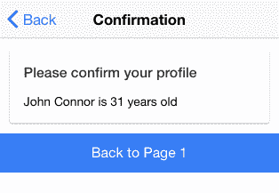

# 使用 Angular 构建块扩展 Ionic

在本章中，我们将介绍与创建自定义组件、指令和过滤器相关的以下任务，使用 Angular：

+   创建自定义披萨订购组件

+   创建自定义用户名输入指令

+   创建自定义管道

+   创建一个用于向多个页面提供数据的共享服务

+   将现有页面作为 HTML 元素重用

# 简介

大多数 Ionic 的内置功能实际上是预构建的组件。在本节中，你将学习如何使用包含 Ionic 组件的 HTML 模板创建自己的自定义组件。

组件实际上定义了 Angular。组件不过是一个具有自我描述功能的类。例如，`<ul>`是一个你已经熟悉的组件。以前，你使用了各种 Ionic 组件，如`<ion-list>`和`<ion-item>`。组件是一个装饰器（即`@Component`），用于向类添加元数据以描述以下内容：

+   **选择器**：这是要在 DOM 中使用的名称（例如，

    `<my-component>`)

+   **模板或 templateUrl**：这指的是组件的渲染方式

+   **指令**：这指的是你计划在内部使用的指令依赖项列表

    组件

+   **提供者**：这是你计划在内部使用的提供者（即服务）列表

    组件

当然，还有许多其他选项，但前面的四个选项是最常见的。

# 创建自定义披萨订购组件

在本节中，你将构建一个应用程序来演示具有其私有变量和模板的自定义组件。观察以下披萨订购组件的截图：


用户不会注意到哪个区域是页面的一部分，而不是一个自包含的组件。你这里的自定义组件是唯一一个列表正在“监听”素食者复选框的区域：


# 准备工作

此应用程序示例可以在浏览器或物理设备上运行。

# 如何做到这一点...

执行以下说明：

1.  使用`blank`模板创建一个新的`MyComponent`应用程序，如图所示，然后进入`MyComponent`文件夹：

```js
$ ionic start MyComponent blank 
$ cd MyComponent 
```

1.  打开`./src/pages/home/home.html`文件，将其内容替换为以下代码：

```js
<ion-header>
  <ion-navbar>
    <ion-title>
      Pizza App
    </ion-title>
  </ion-navbar>
</ion-header>

<ion-content padding>
  <ion-card>
    <ion-card-header>
      App Homepage
    </ion-card-header>
    <ion-card-content>
      Please start to order your pizza now!
    </ion-card-content>
  </ion-card>
  <my-component></my-component>
</ion-content>
```

这是包含`<my-component>`的根页面，它将在稍后定义。

1.  打开`./app/pages/home/home.ts`文件进行全局编辑，以下代码：

```js
import { Component } from '@angular/core';
import { NavController } from 'ionic-angular';

@Component({
  selector: 'page-home',
  templateUrl: 'home.html'
})
export class HomePage {

  constructor(public navCtrl: NavController) {

  }

}
```

你只需将`MyComponent`声明为依赖项。组件基本上只是一个具有自我描述功能的类（假设你熟悉 Angular 1 的指令概念）。

1.  现在，让我们首先创建一个指令，然后创建组件，如下所示代码所示：

```js
    $ mkdir ./src/components
```

1.  在你刚刚创建的`components`目录中创建一个`foo.ts`文件，如下所示：

```js
import { Component } from '@angular/core';

@Component({
  selector: 'my-component',
  templateUrl: 'foo.html'
})
export class MyComponent {
  public data: any = {myToggle: true};

  constructor() {}
  isClicked(val) {
    console.log('Vegetarian: ' + val);
  }

}
```

1.  在`./src/components`文件夹中创建`foo.html`，如下所示：

```js
<ion-list>
  <ion-item>
    <ion-label>Vegetarian</ion-label>
    <ion-toggle (click)="isClicked(data.myToggle)" [(ngModel)]="data.myToggle"></ion-toggle>
  </ion-item>
  <ion-card *ngIf="data.myToggle">
    <ion-card-header>
      I only eat vegetarian foods
    </ion-card-header>

    <ion-list>
      <button ion-item>
        Mushroom
      </button>
      <button ion-item>
        Spinach
      </button>
      <button ion-item>
        Red Peppers
      </button>
    </ion-list>

  </ion-card>

  <ion-card *ngIf="!data.myToggle">
    <ion-card-header>
      I love meat
    </ion-card-header>
    <ion-list>
      <button ion-item>
        Beef
      </button>
      <button ion-item>
        Chicken
      </button>
      <button ion-item>
        Sausage
      </button>

    </ion-list>
  </ion-card>

</ion-list>
```

1.  修改`./src/app/app.module.ts`，如图所示，以便你可以声明`MyComponent`。观察以下代码：

```js
import { BrowserModule } from '@angular/platform-browser';
import { ErrorHandler, NgModule } from '@angular/core';
import { IonicApp, IonicErrorHandler, IonicModule } from 'ionic-angular';
import { SplashScreen } from '@ionic-native/splash-screen';
import { StatusBar } from '@ionic-native/status-bar';

import { MyApp } from './app.component';
import { HomePage } from '../pages/home/home';
import { MyComponent } from '../components/foo/foo';

@NgModule({
  declarations: [
    MyApp,
    HomePage,
    MyComponent
  ],
  imports: [
    BrowserModule,
    IonicModule.forRoot(MyApp)
  ],
  bootstrap: [IonicApp],
  entryComponents: [
    MyApp,
    HomePage,
    MyComponent
  ],
  providers: [
    StatusBar,
    SplashScreen,
    {provide: ErrorHandler, useClass: IonicErrorHandler}
  ]
})
export class AppModule {}
```

1.  打开你的终端，使用以下命令运行应用：

```js
    $ ionic serve
```

# 它是如何工作的...

你可能会想知道为什么需要创建一个组件来切换披萨配料选项列表。答案是，这只是一个演示，说明你可以如何使用组件来模块化你的应用。你完成的关键步骤如下：

+   你创建了一个自定义组件，名为`<my-component>`，可以在任何地方使用，包括在你的应用外部。

+   组件内的数据是完全私有的。这意味着没有人在不调用组件类中的方法的情况下可以访问它。

+   你可以在组件内部添加或更改行为，而不会影响组件外部的其他区域。

要创建一个组件，你需要确保从 Angular 本身（而不是从 Ionic）导入`@Component`装饰器，如下所示：

```js
import { Component } from '@angular/core'; 

@Component({ 
  selector: 'my-component', 
  templateUrl: 'foo.html' 
})
```

在你的`component`模板中，所有内容都是局部于`component`类内部的。因此，你可以使用`click`绑定点击事件，如下面的代码所示：

```js
  <ion-item> 
    <ion-label>Vegetarian</ion-label> 
    <ion-toggle (click)="isClicked(data.myToggle)" 
     [(ngModel)]="data.myToggle"></ion-toggle> 
  </ion-item> 
```

就像在 Angular 1 中一样，你需要使用`[(ngModel)]`来声明你想要`data.myToggle`作为你的模型。`[(..)]`部分是为了告诉 Angular 2 这是一个双向绑定。

有两个披萨配料列表。第一个列表如下：

```js
  <ion-card *ngIf="data.myToggle"> 
    <ion-card-header> 
      I only eat vegetarian foods 
    </ion-card-header> 

    <ion-list> 
      <button ion-item> 
        Mushroom 
      </button> 
      <button ion-item> 
        Spinach 
      </button> 
      <button ion-item> 
        Red Peppers 
      </button> 
    </ion-list> 
  </ion-card> 
```

第二个披萨配料列表如下所示：

```js
  <ion-card *ngIf="!data.myToggle"> 
    <ion-card-header> 
      I love meat 
    </ion-card-header> 

    <ion-list> 
      <button ion-item> 
        Beef 
      </button> 
      <button ion-item> 
        Chicken 
      </button> 
      <button ion-item> 
        Sausage 
      </button> 
    </ion-list> 
  </ion-card> 
```

要根据`data.myToggle`模型切换每个列表的可见性，你可以使用`*ngIf`，它与 Angular 1 中的`ng-if`非常相似。

# 参见

要了解更多关于 Angular 文档中组件的信息，你可以访问[`angular.io/docs/ts/latest/guide/architecture.html#!#component`](https://angular.io/docs/ts/latest/guide/architecture)。

# 创建自定义用户名输入指令

由于你在前一节中已经完成了创建组件的过程，你可能想知道组件和指令之间的区别是什么。如果你有一些 Angular 1 的经验，你可能注意到它没有组件的定义。从 Angular 2 开始，有以下三种类型的指令：

| **类型** | **描述** |
| --- | --- |
| 组件 | 它们有一个与组件关联的模板和类（即`ion-input`） |
| 结构指令 | 它在它所在的范围内改变 DOM 结构（即`*ngIf`或`*ngFor`） |
| 属性指令 | 它通过拦截其显示或事件来改变当前 DOM 的外观 |

你可能在一个指令中同时具有结构和属性特征。在本节中，你将学习如何创建一个属性指令，它可以防止在用户名中输入某些字符，并通过切换其可见性显示另一个 DOM 节点（即显示“你正在输入用户名”）。观察以下应用的截图：


GO 按钮只是为了美观，你不需要为它编写任何代码。

# 准备工作

此应用示例可以在浏览器或物理设备上运行。

# 如何操作...

仔细观察以下说明：

1.  使用`blank`模板创建一个新的`MyIonicInputDirective`应用，如下所示，并进入`MyIonicInputDirective`文件夹：

```js
$ ionic start MyIonicInputDirective blank
$ cd MyIonicInputDirective
```

1.  打开`./src/app/pages/home/home.html`文件，并用以下代码替换内容：

```js
<ion-header>
  <ion-navbar color="danger">
    <ion-title>
      Login
    </ion-title>
  </ion-navbar>
</ion-header>

<ion-content padding>
  <ion-list>
    <ion-item>
      <ion-input type="text" placeholder="Username" [(ngModel)]="username" [myIonicInput]="myStyles"></ion-input>
    </ion-item>
    <ion-item>
      <ion-input type="password" placeholder="Password"></ion-input>
    </ion-item>
  </ion-list>
  <p *ngIf="myStyles.showUsername" class="hint">
    You are typing username
  </p>
  <ion-fab bottom center>
    <button ion-fab>GO</button>
  </ion-fab>
</ion-content>
```

如前所述，GO 按钮只是 Ionic 新浮动按钮功能的一个示例。你所需要做的只是包含`bottom`和`center`来定位它。这些实际上是属性指令的好例子。

1.  在前一步骤所在的文件夹中打开`home.ts`，进行编辑并插入以下代码：

```js
import { Component } from '@angular/core';
import { NavController } from 'ionic-angular';

@Component({
  selector: 'page-home',
  templateUrl: 'home.html'
})
export class HomePage {
  private myStyles = { showUsername: false };
  constructor(public navCtrl: NavController) {

  }
}
```

1.  创建`./src/directives`文件夹，如下所示：

```js
$ mkdir ./src/directives
```

1.  在`directives`文件夹中创建`my-ionic-input.ts`文件，并复制以下代码：

```js
import { Directive, Input, ElementRef, OnInit } from '@angular/core';
@Directive({
  selector: '[myIonicInput]', // Attribute selector
  host: {
    '(mouseenter)': 'onMouseEnter()',
    '(mouseleave)': 'onMouseLeave()'
    // '(keypress)': 'onKeyPress'
  }
})
export class MyIonicInputDirective {
  @Input('myIonicInput') myStyles: any;
  constructor(private el: ElementRef) {
    el.nativeElement.onkeypress = function(e) {
      console.log(e);
      if ('~!@#$%^&*()-='.includes(String.fromCharCode(e.keyCode))) {
        e.preventDefault();
        return;
      }
    }
  }

  ngOnInit() {
    console.log(this.myStyles);
  }

  onMouseEnter() {
    this.myStyles.showUsername = true;
  }
  onMouseLeave(e) {
    this.myStyles.showUsername = false;
  }

  // onKeyPress will not work with ion-input directly
  // because the actual input element is a child of ion-input
  // onKeyPress() {
  // console.log("onKeyPress");
  // }
}
```

1.  打开并编辑`./src/app/app.module.ts`以声明你的新指令，如下所示：

```js
import { BrowserModule } from '@angular/platform-browser';
import { ErrorHandler, NgModule } from '@angular/core';
import { IonicApp, IonicErrorHandler, IonicModule } from 'ionic-angular';
import { SplashScreen } from '@ionic-native/splash-screen';
import { StatusBar } from '@ionic-native/status-bar';

import { MyApp } from './app.component';
import { HomePage } from '../pages/home/home';
import { MyIonicInputDirective } from '../directives/my-ionic-input';

@NgModule({
  declarations: [
    MyApp,
    HomePage,
    MyIonicInputDirective
  ],
  imports: [
    BrowserModule,
    IonicModule.forRoot(MyApp)
  ],
  bootstrap: [IonicApp],
  entryComponents: [
    MyApp,
    HomePage
  ],
  providers: [
    StatusBar,
    SplashScreen,
    {provide: ErrorHandler, useClass: IonicErrorHandler}
  ]
})
export class AppModule {}
```

1.  前往你的终端并运行应用，如下所示：

```js
$ ionic serve
```

# 它是如何工作的...

`homepage`模板（`home.html`）非常典型，使用了`ion-list`和`ion-item`，它们包含了你的输入元素。然而，有两件重要的事情需要注意。首先，在`ion-input`组件中有一个名为`myIonicInput`的属性。观察以下代码：

```js
<ion-item > 
  <ion-input type="text" placeholder="Username" 
   [(ngModel)]="username" [myIonicInput]="myStyles"></ion-input> 
</ion-item> 
```

其次，`myStyles`对象现在用于切换`<p>`元素的可见性，

如下所示：

```js
<p *ngIf="myStyles.showUsername" class="hint"> 
  You are typing username 
</p> 
```

这个`myStyles`对象实际上是你`home.ts`文件中`HomePage`类的一个`private`变量，如下所示：

```js
export class HomePage { 
  private myStyles: Object = {showUsername: false}; 
}
```

使用 TypeScript，你可以将一个类型（即一个对象）赋给一个变量，并设置一个默认值。你也许还会注意到，`MyIonicInputDirective`应该被声明以便将其注入到模板指令中。

要创建一个基本的指令，你必须至少导入`Directive`和`ElementRef`以操作 DOM。然而，由于这个`Directive`有输入（即`myStyles`），你应在`my-ionic-input.ts`中导入`Input`，如下所示：

```js
import {Directive, ElementRef, Input} from '@angular/core'; 
```

在你的指令中，有`selector`和`host`元数据，如下所示：

```js
@Directive({ 
  selector: '[myIonicInput]', 
  host: { 
    '(mouseenter)': 'onMouseEnter()', 
    '(mouseleave)': 'onMouseLeave()' 
    // '(keypress)': 'onKeyPress' 
  } 
}) 
```

`myIonicInput`选择器将从 DOM 中查询，并触发该 DOM 节点的*动作*。对于 DOM 上的事件检测，你必须将事件名称映射到`class`方法。例如，`mouseenter`事件将触发指令类`MyIonicInputDirective`中的`onMouseEnter()`方法的调用。

现在，让我们更仔细地看看指令的类：

```js
export class MyIonicInputDirective { 
  @Input('myIonicInput') myStyles: any; 

  constructor(private el: ElementRef) {  
    el.nativeElement.onkeypress = function(e) { 
      console.log(e); 

      if ('~!@#$%^&*()-
       ='.includes(String.fromCharCode(e.keyCode))) { 
        e.preventDefault(); 
        return; 
      } 
    } 
  } 
  onMouseEnter() {  
    this.myStyles.showUsername = true; 
  } 

  onMouseLeave(e) { 
    this.myStyles.showUsername = false;  
  } 

  // onKeyPress will not work with ion-input directly because the 
   actual input element is a child of ion-input   
  // onKeyPress() {
  //   console.log("onKeyPress"); 
  // } 
} 
```

`@Input`装饰器用于声明你将从模板中引入一个变量。这就是为什么你必须有`[myIonicInput]="myStyles"`的原因。否则，`myStyles`将只是一个字符串，而不是指向`HomePage`类中`myStyles`对象的表达式。

这里还有一个值得注意的有趣之处是 `constructor` 中的代码。`ElementRef` 指向你放置属性指令的相同 DOM。你想要使用 `el.nativeElement.onkeypress` 来修改键盘的行为，以便不允许特殊字符。如果用户输入了特殊字符，它将触发 `e.preventDefault()` 而不会发生任何事情。键盘事件基本上被丢弃。你可能想知道为什么我们不能直接使用 `keypress` 事件并将其映射到 `onKeyPress`，这被故意注释掉了。原因是你在 `ion-input` 上放置了 `myIonicInput` 指令。但实际上 `<input>` DOM 只是 `ion-input` 的子元素。因此，如果你在父 `ion-input` 上监听 `keypress` 事件，你将无法绑定它。

`onMouseEnter` 和 `onMouseLeave` 方法是自我解释的，因为它们只是切换 `myStyles.showUsername` 变量。再次强调，这个 `myStyles` 对象只是对 `HomePage` 中的 `myStyles` 的引用。因此，如果你在这里更改变量，它也会在主页级别上更改。

# 参见

+   关于 Angular 2 指令的更多信息，你可以参考官方文档：[`angular.io/docs/ts/latest/guide/attribute-directives.html`](https://angular.io/docs/ts/latest/guide/attribute-directives.html)

+   由于这是 TypeScript 首次出现的地方，查看手册以获取更多细节可能会有所帮助：[`www.typescriptlang.org/docs/tutorial.html`](http://www.typescriptlang.org/docs/tutorial.html)

# 创建自定义管道

管道也是 Angular 的一个特性，并不特定于 Ionic。如果你熟悉 Angular 1，那么一个 *pipe* 与一个 *filter* 完全相同。你可能想要使用管道的主要原因是在视图中以不同的格式显示数据。你不想在组件中更改实际值。这使得事情变得非常方便，因为你不需要在代码中决定具体的格式，同时在视图层保持灵活性。以下是一些有用的内置管道列表（来自 [`angular.io/docs/ts/latest/api/#!?apiFilter=pipe`](https://angular.io/docs/ts/latest/api/#!?apiFilter=pipe)）：

+   `AsyncPipe`

+   `DatePipe`

+   `NumberPipe`

+   `SlicePipe`

+   `DecimalPipe`

+   `JsonPipe`

+   `PercentPipe`

+   `UpperCasePipe`

+   `LowerCasePipe`

+   `CurrencyPipe`

+   `ReplacePipe`

在本节中，你将学习如何使用 `@Pipe` 装饰器创建一个自定义管道。以下是该应用的截图：


虽然应用界面非常简单，但本例的目的是向你展示如何创建一个管道来提取对象数据。

# 准备工作

没有必要在物理设备上进行测试，因为 Angular 管道在网页浏览器中运行得很好。

# 如何做到这一点...

仔细阅读以下说明：

1.  使用 `blank` 模板创建一个新的 `CustomPipe` 应用，如图所示，然后转到 `CustomPipe` 文件夹：

```js
$ ionic start CustomPipe blank
$ cd CustomPipe 
```

1.  打开 `./src/pages/home/home.html` 文件，并使用以下代码修改内容：

```js
<ion-header>
  <ion-navbar>
    <ion-title>
      User
    </ion-title>
  </ion-navbar>
</ion-header>
<ion-content padding>
  <h4>Unformatted Value</h4>
  <ion-card>
    <ion-card-header>
      <code>user</code>
    </ion-card-header>
    <ion-card-content>
      {{ user | json }}
    </ion-card-content>
  </ion-card>
  <h4>Formatted Value</h4>
  <ion-list>
    <ion-item>
      <ion-label fixed>First Name</ion-label>
      <ion-note item-right>{{ user | userExtract : "firstname" }}</ion-note>
    </ion-item>
    <ion-item>
      <ion-label fixed>Last Name</ion-label>
      <ion-note item-right>{{ user | userExtract : "lastname" }}</ion-note>
    </ion-item>
    <ion-item>
      <ion-label fixed>Age</ion-label>
      <ion-note item-right>{{ user | userExtract : "age" }}
      </ion-note>
    </ion-item>
  </ion-list>
</ion-content>
```

你可以快速看到模板使用了 `userExtract` 管道来渲染正确的信息。

1.  然后，将 `./src/pages/home/home.ts` 的内容替换为以下代码：

```js
import { Component } from '@angular/core';
import { NavController } from 'ionic-angular';

@Component({
  selector: 'page-home',
  templateUrl: 'home.html'
})
export class HomePage {

  private user: any;
  constructor(public navCtrl: NavController) {
    this.user = {
      name: 'John Connor',
      birthyear: 1985
    };

    console.log(this.user);
  }

}
```

你还没有 `custom-pipe.ts` 文件，所以你需要先创建它。

1.  使用以下命令创建 `./src/utils` 文件夹：

```js
$ mkdir ./utils/utils  
```

你可以给这个文件夹起任何名字。然而，由于管道有时被认为是 *工具* 函数，让我们称它为 `utils`。

1.  在 `utils` 文件夹中创建 `custom-pipe.ts` 文件，并复制以下代码：

```js
import { Pipe, PipeTransform } from '@angular/core';

@Pipe({ name: 'userExtract' })
export class UserExtractPipe implements PipeTransform {
    transform(value: any, arg): any {
        let newVal: any;
        if (arg == "firstname") {
            newVal = value.name ? value.name.split(' ')[0] : '';
        } else if (arg == "lastname") {
            newVal = value.name ? value.name.split(' ').splice(-
                1) : '';
        } else if (arg == "age") {
            var currentTime = new Date();
            newVal = value.birthyear ? currentTime.getFullYear()
                - value.birthyear : 0;
        }
        return newVal;
    }
}
```

1.  通过替换以下代码将 `UserExtractPipe` 添加到 `./src/app/app.module.ts`：

```js
import { BrowserModule } from '@angular/platform-browser';
import { ErrorHandler, NgModule } from '@angular/core';
import { IonicApp, IonicErrorHandler, IonicModule } from 'ionic-angular';
import { SplashScreen } from '@ionic-native/splash-screen';
import { StatusBar } from '@ionic-native/status-bar';

import { MyApp } from './app.component';
import { HomePage } from '../pages/home/home';
import { UserExtractPipe } from '../utils/custom-pipe';

@NgModule({
  declarations: [
    MyApp,
    HomePage,
    UserExtractPipe
  ],
  imports: [
    BrowserModule,
    IonicModule.forRoot(MyApp)
  ],
  bootstrap: [IonicApp],
  entryComponents: [
    MyApp,
    HomePage
  ],
  providers: [
    StatusBar,
    SplashScreen,
    {provide: ErrorHandler, useClass: IonicErrorHandler}
  ]
})
export class AppModule {}
```

1.  打开终端并运行应用程序，如下所示：

```js
$ ionic serve
```

# 它是如何工作的...

你可以在视图中使用 Angular 管道来简单地转换或转换任何值到期望的值。你对管道的结构没有任何限制。Angular 会自动检测模板中的 `|` 符号，并将它前面的值转换为输入。要创建一个管道，你必须导入装饰器并提供一个名称（参见 `custom-pipe.ts`），如下所示：

```js
import { Pipe, PipeTransform } from '@angular/core'; 

@Pipe({name: 'userExtract'}) 
```

来自模板的输入是以下 `value` 参数：

```js
transform(value: any, arg) : any { 
```

`transform` 方法返回的值将是视图的输出，如下面的代码所示：

```js
return newVal; 
```

在这个例子中，你正在为管道处理提供一个参数，如下面的代码所示：

```js
    if (arg == "firstname") { 

      newVal = value.name ? value.name.split(' ')[0] : ''; 

    } else if (arg == "lastname") { 

      newVal = value.name ? value.name.split(' ').splice(-1) : ''; 

    } else if (arg == "age") { 
      var currentTime = new Date(); 

      newVal = value.birthyear ? currentTime.getFullYear() - 
       value.birthyear : 0; 
    } 
```

例如，这是 `home.html` 模板中的内容：

```js
    <ion-item> 
      <ion-label fixed>First Name</ion-label> 
      <ion-note item-right>{{ user | userExtract : "firstname" 
       }}</ion-note> 
    </ion-item> 
```

每个参数都放在冒号（`:`）之后。然后，在你的 `@Pipe` 类中，你可以使用 `arg` 来引用它。其余的代码非常简单，如前所述。观察以下内容：

+   如果是 `firstname`，取第一个单词

+   如果是 `lastname`，取最后一个单词

+   如果是 `age`，从出生年份减去当前年份

当然，你可能会有更复杂的管道场景。然而，总体建议是在视图中保持简单，以确保渲染性能。如果你需要进行大量处理，最好将其作为一个单独的变量来处理。

# 参见

要了解更多关于 Angular 管道的知识，你可以查看官方文档[`angular.io/docs/ts/latest/guide/pipes.html`](https://angular.io/docs/ts/latest/guide/pipes.html)

# 创建一个共享服务以向多个页面提供数据

当你开发一个涉及大量页面和与后端通信的应用程序时，你需要有一种跨页面和组件进行通信的方式。例如，你可能有一个服务从后端请求用户数据并将其存储在公共本地服务中。然后，你需要提供一个让用户更新他们的用户数据并实时看到更新的方法。当用户导航到不同的页面时，相同的信息也会被拉取并渲染，而不需要多次访问后端。这是一个非常常见的场景，需要使用 Angular 中的 `@Injectable` 装饰器。

观察你将构建的应用的以下截图：


用户可以填写表格并实时查看更新。然后，他们可以转到下一页（转到第 2 页）并查看以下截图：



本页使用与前一页相同的`service`，并引用相同的日期，带有姓名和年龄。在本节中，你将学习以下主题：

+   使用`@Injectable`创建服务

+   在多个页面间共享服务

+   在服务内部使用 getter 和 setter 检测变化

# 准备工作

此应用示例可以在浏览器或物理设备上运行。

# 如何操作...

观察以下说明：

1.  使用如下所示的`blank`模板创建一个新的`SharedService`应用，并转到`SharedService`文件夹：

```js
$ ionic start SharedService blank
$ cd SharedService
```

1.  由于你有两个页面和一个为两者共用的服务，你需要在目录中进行一些更改。让我们首先修改`./src/app/app.component.ts`文件，以便`rootPage`指向`Page1`：

```js
import { Component } from '@angular/core';
import { Platform } from 'ionic-angular';
import { StatusBar } from '@ionic-native/status-bar';
import { SplashScreen } from '@ionic-native/splash-screen';

import { Page1 } from '../pages/page1/page1';

@Component({
  templateUrl: 'app.html'
})
export class MyApp {
  rootPage:any = Page1;

  constructor(platform: Platform, statusBar: StatusBar, splashScreen: SplashScreen) {
    platform.ready().then(() => {
      // Okay, so the platform is ready and our plugins are available.
      // Here you can do any higher level native things you might need.
      statusBar.styleDefault();
      splashScreen.hide();
    });
  }
}
```

1.  创建`./src/pages/page1`，如下所示：

```js
$ mkdir ./src/pages/page1
```

1.  在`page1`文件夹中创建你的第一个模板`page1.html`，如下所示：

```js
<ion-header>
    <ion-navbar>
        <ion-title>
            Profile
        </ion-title>
    </ion-navbar>
</ion-header>

<ion-content>
    <ion-card>
        <ion-card-header>
            What you are entering
        </ion-card-header>
        <ion-card-content>
            <ion-badge item-right>Name</ion-badge> {{ user.name }}
            <br><br>
            <ion-badge item-right>Age</ion-badge> {{ user.age }}
        </ion-card-content>
    </ion-card>
    <ion-list>
        <ion-item>
            <ion-label fixed>Name</ion-label>
            <ion-input type="text" [(ngModel)]="user.name">
        </ion-input>
        </ion-item>
        <ion-item>
            <ion-label fixed>Password</ion-label>
            <ion-input type="number" [(ngModel)]="user.age">
        </ion-input>
        </ion-item>
    </ion-list>
    <button ion-button full block (click)="goToPage2()">Go to Page 2</button>
</ion-content>
```

1.  在`page1`文件夹中创建`page1.ts`，如下所示：

```js
import { Component } from '@angular/core';
import { NavController } from 'ionic-angular';
import { UserService } from '../../services/user';
import { Page2 } from '../page2/page2';
@Component({
    selector: 'page-one',
    templateUrl: 'page1.html'
})
export class Page1 {
    private user: any;
    private nav: any;
    constructor(public navCtrl: NavController, user:
        UserService, nav: NavController) {
        console.log(user.name);
        this.user = user;
        this.nav = nav;
    }
    goToPage2() {
        this.nav.push(Page2);
    }
}
```

文件扩展名是`.ts`，而不是`.js`，因为你将使用一些 TypeScript 特定的功能，例如 getter 和 setter。

1.  类似地，使用以下命令创建`page2`文件夹：

```js
$ mkdir ./src/pages/page1 
```

1.  在`page2`文件夹中同样添加`page2.html`模板，如下所示：

```js
<ion-header>
  <ion-navbar>
    <ion-title>
      Confirmation
    </ion-title>
  </ion-navbar>
</ion-header>

<ion-content class="home">
  <ion-card>
    <ion-card-header>
      Please confirm your profile
    </ion-card-header>
    <ion-card-content>
      {{ user.name }} is {{ user.age }} years old
    </ion-card-content>
  </ion-card>
  <button ion-button full block (click)="goToPage1()">Back to Page 1</button>
</ion-content>
```

这是你的第二页，带有相同的`name`和`age`信息。

1.  在`page2`文件夹中创建`page2.ts`，如下所示：

```js
import { Component } from '@angular/core';
import { NavController } from 'ionic-angular';
import { UserService } from '../../services/user';
import { Page1 } from '../page1/page1';
@Component({
  selector: 'page-two',
  templateUrl: 'page2.html'
})
export class Page2 {
  private user: any;
  private nav: any;
  constructor(public navCtrl: NavController, user:
    UserService, nav: NavController) {
    console.log(user.name);
    this.user = user;
    this.nav = nav;
  }
  goToPage1() {
    this.nav.push(Page1);
  }
}
```

1.  使用以下命令创建`services`文件夹：

```js
$ mkdir ./src/services
```

1.  将`UserService`放入`services`文件夹中的`user.ts`文件，如下所示：

```js
import { Injectable } from '@angular/core';
@Injectable()
export class UserService {
    private _name: string;
    private _age: number;
    constructor() {
        this._name = 'John Connor';
        this._age = 31;
    }
    get name() {
        return this._name;
    }
    set name(newVal) {
        console.log('Set name = ' + newVal);
        this._name = newVal;
    }
    get age() {
        return this._age;
    }
    set age(newVal) {
        console.log('Set age = ' + newVal);
        this._age = newVal;
    }
}
```

1.  打开并编辑`./src/app/app.module.ts`，以便你可以将`UserService`作为全局提供者注入，并声明`Page1`和`Page2`：

```js
import { BrowserModule } from '@angular/platform-browser';
import { ErrorHandler, NgModule } from '@angular/core';
import { IonicApp, IonicErrorHandler, IonicModule } from 'ionic-angular';
import { SplashScreen } from '@ionic-native/splash-screen';
import { StatusBar } from '@ionic-native/status-bar';

import { MyApp } from './app.component';
;
import { Page1 } from '../pages/page1/page1';
import { Page2 } from '../pages/page2/page2';
import { UserService } from '../services/user';

@NgModule({
  declarations: [
    MyApp,
    Page1,
    Page2
  ],
  imports: [
    BrowserModule,
    IonicModule.forRoot(MyApp)
  ],
  bootstrap: [IonicApp],
  entryComponents: [
    MyApp,
    Page1,
    Page2
  ],
  providers: [
    StatusBar,
    SplashScreen,
    UserService,
    {provide: ErrorHandler, useClass: IonicErrorHandler}
  ]
})
export class AppModule {}
```

1.  确认你的文件夹结构看起来像以下截图：


1.  在你的终端中运行以下命令来运行应用：

```js
$ ionic serve
```

你可以从`page 1`移动到`page 2`，然后再返回，数据将在页面间持久化。

# 它是如何工作的...

通常，如果你想在多个页面间使用一个通用服务，你必须在其最高级别注入它。在这个例子中，你将`UserService`作为依赖项放在`app.module.ts`的开始处，如下所示：

```js
providers: [UserService] 
```

之后，应用内的其他页面可以开始使用这个通用服务，而无需重新注入。主要原因在于，每次你注入一个服务或类时，它都会实例化一个新的对象，这最终会清除内存中所有现有的数据。如果你想数据在页面间持久化，它应该位于父应用中，以避免重新注入。

要在每一页使用`UserService`，你只需导入它，如下所示：

```js
import { UserService } from '../../services/user'; 
```

引入服务的方法是在构造函数（`page1.ts`）中放置引用，

如下所示：

```js
  constructor(user: UserService, nav: NavController) { 
    console.log(user.name); 
    this.user = user; 
    this.nav = nav; 
  } 
```

这会将 `UserService` 引用传递到页面的本地私有变量（在这种情况下，`this.user`）。

从模板的角度来看，使用 `{{ user.name }}` 和 `{{ user.age }}` 注入数据之间没有区别。

现在，让我们看看 `UserService`：

```js
import {Injectable} from '@angular/core'; 

@Injectable() 
export class UserService { 
  private _name: string; 
  private _age: number; 

  constructor() { 
    this._name = 'John Connor'; 
    this._age = 31; 
  } 

  get name() { 
    return this._name; 
  } 

  set name(newVal) { 
    console.log('Set name = ' + newVal); 
    this._name = newVal; 
  } 

  get age() { 
    return this._age; 
  } 

  set age(newVal) { 
    console.log('Set age = ' + newVal); 
    this._age = newVal; 
  } 
}
```

实际上，这里有几个事情在进行。首先，你需要从

`@angular/core`。

不要忘记在 `@Injectable()` 中使用括号。

其次，如果你想使用获取器和设置器，你需要创建单独的变量，称为 `_name` 和 `_age`，来存储数据。然后，你可以使用 get/set 方法在其他页面访问或设置这个公共类中的变量时进行额外的处理。如果你从“页面 1”更改 `name` 或 `age`，你可以在控制台中看到以下日志：


这个特性非常有用，因为你可以用它来替代 `watch` 或 `observable`。如果你还记得 Angular 1，你必须使用 `$scope.$watch` 来实现类似的功能。

# 参考以下内容

+   想了解更多关于 Angular 2 服务的相关信息，请访问官方文档：[`angular.io/docs/ts/latest/tutorial/toh-pt4.html`](https://angular.io/docs/ts/latest/tutorial/toh-pt4.html)

+   你可以在 [`angular.io/docs/ts/latest/cookbook/component-communication.html`](https://angular.io/docs/ts/latest/cookbook/component-communication.html) 上找到关于许多组件通信技术的详细说明。

# 重复使用现有的页面作为 HTML 元素

到目前为止，我们已经使用了 Ionic 页面和 Ionic 的导航系统。在这个示例中，我们将扩展现有的页面，以便我们可以将其用作应用程序中的 HTML 元素/组件。以下是应用程序的第一个页面：


当你点击“显示联系页面”时，它会显示包含上一页信息的联系页面，如下面的截图所示：


我们将重新利用这个联系页面作为应用程序中的 HTML 元素。

# 准备工作

在这个示例中，我们使用 Web 功能，因此我们只需要一个 Web 浏览器来运行应用程序。

# 如何做到这一点...

按照以下说明操作：

1.  使用 `blank` 模板创建一个新的应用程序 `PageComponent`，如下面的代码块所示，并进入 `PageComponent` 文件夹：

```js
$ ionic start PageComponent blank $ cd PageComponent
```

1.  打开 `./src/app/pages/home/home.html` 文件，并用以下代码替换其内容：

```js
<ion-header>
  <ion-navbar>
    <ion-title>
      Ionic Blank
    </ion-title>
  </ion-navbar>
</ion-header>

<ion-content padding>
  <ion-list>
        <ion-item>
          <ion-label fixed>Name</ion-label>
          <ion-input type="text" value="" [(ngModel)]="user.name">
        </ion-input>
        </ion-item>

        <ion-item>
          <ion-label fixed>Email</ion-label>
          <ion-input type="text" [(ngModel)]="user.email">
        </ion-input>
        </ion-item>

        <ion-item>
          <ion-label fixed>Phone</ion-label>
          <ion-input type="text" [(ngModel)]="user.phone">
        </ion-input>
        </ion-item>

        <ion-item>
          <ion-label fixed>Website</ion-label>
          <ion-input type="text" [(ngModel)]="user.website">
        </ion-input>
        </ion-item>

      </ion-list>

      <button full ion-button (click)="toggleContact()">
      TOGGLE CONTACT COMPONENT</button>
      <button full ion-button (click)="openContact()">SHOW CONTACT PAGE</button>

      <page-contact [userInput]="user" *ngIf="showContact">
      </page-contact>

</ion-content>
```

1.  打开 `./src/pages/home/home.ts` 文件，并用以下内容替换其内容：

```js
import { Component } from '@angular/core';
import { NavController } from 'ionic-angular';
import { ContactPage } from "../contact/contact";
@Component({
 selector: 'page-home',
 templateUrl: 'home.html'
})
export class HomePage {
 user:any = {};
 showContact:Boolean = false;
 constructor(public navCtrl: NavController) {}

 openContact() {
   this.navCtrl.push(ContactPage, { user: this.user });
 }
 toggleContact() {
   this.showContact = !this.showContact;
 }
}
```

1.  现在创建一个文件夹，`./src/pages/contact`，然后在文件夹中创建 `contact.html` 并添加以下内容：

```js
<ion-header *ngIf="!userInput">
    <ion-navbar>
        <ion-title>
            Contact Page
        </ion-title>
    </ion-navbar>
</ion-header>

<ion-content>
    <ion-card>
        <ion-card-header>
            User Contact
        </ion-card-header>
        <ion-card-content>
            <ion-grid>
                <ion-row>
                    <ion-col>Name</ion-col>
                    <ion-col>{{user.name}}</ion-col>
                </ion-row>

                <ion-row>
                    <ion-col>Email</ion-col>
                    <ion-col>{{user.email}}</ion-col>
                </ion-row>

                <ion-row>
                    <ion-col>Phone</ion-col>
                    <ion-col>{{user.phone}}</ion-col>
                </ion-row>

                <ion-row>
                    <ion-col>Website</ion-col>
                    <ion-col>{{user.website}}</ion-col>
                </ion-row>
            </ion-grid>
        </ion-card-content>
    </ion-card>

</ion-content>
```

1.  在同一个文件夹中，创建一个名为 `contact.ts` 的文件，并将其内容添加如下：

```js
import { Component, Input, OnChanges } from '@angular/core';
import { NavController, NavParams } from 'ionic-angular';

@Component({
  selector: 'page-contact',
  templateUrl: 'contact.html'
})
export class ContactPage {
  user:any = {};
  @Input() userInput;
  constructor(public navCtrl: NavController, private params:NavParams) {
      this.user = params.get('user');
  }

  ngOnChanges() {
    if(this.userInput) {
        this.user = this.userInput;
    }
  }
}
```

1.  现在打开 `./src/app/app.modules.ts` 并在 `NgModule` 的 `declarations` 和 `entryComponents` 列表中添加 `ContactPage`，如下面的代码所示：

```js
import { BrowserModule } from '@angular/platform-browser';
import { ErrorHandler, NgModule } from '@angular/core';
import { IonicApp, IonicErrorHandler, IonicModule } from 'ionic-angular';
import { SplashScreen } from '@ionic-native/splash-screen';
import { StatusBar } from '@ionic-native/status-bar';

import { MyApp } from './app.component';
import { HomePage } from '../pages/home/home';
import { ContactPage } from '../pages/contact/contact';

@NgModule({
  declarations: [
    MyApp,
    HomePage,
    ContactPage
  ],
  imports: [
    BrowserModule,
    IonicModule.forRoot(MyApp)
  ],
  bootstrap: [IonicApp],
  entryComponents: [
    MyApp,
    HomePage,
    ContactPage
  ],
  providers: [
    StatusBar,
    SplashScreen,
    {provide: ErrorHandler, useClass: IonicErrorHandler}
  ]
})
export class AppModule {}
```

1.  现在转到终端，使用以下命令运行应用程序：

```js
$ ionic serve
```

# 它是如何工作的...

我们已经在导航中使用了多个 Ionic 页面，所以我们知道 push/pop 导航是如何工作的。让我们更仔细地看看我们是如何定义 Ionic 页面的，如下所示：

```js
@Component({
 selector: 'page-contact',
 templateUrl: 'contact.html'
})
export class ContactPage {}
```

你可以看到，Ionic 页面实际上是一个 Angular 组件，我们已经知道我们可以使用它们的 `selector` 将组件用作 HTML 元素。在上面的例子中，页面的选择器是 `page-contact`。所以从技术上讲，我们可以使用选择器在 HTML 中。但如果我们的页面正在使用 `NavParams` 从上一页获取数据，这就会成为一个问题。让我们看看 `ContactPage` 的构造函数，如下面的代码块所示：

```js
 constructor(public navCtrl: NavController, private params:NavParams) {
     this.user = params.get('user');
 }
```

在代码中，我们使用 Ionic 的导航从上一页获取用户信息。因此，如果我们想将此组件作为 HTML 元素使用，我们需要以某种方式将此数据传递给组件。

这就是 `@Input` 装饰器特别有用之处。`@Input` 装饰器允许我们将数据作为输入传递给 `component`。因此，我们有一个 `@Input() userInput` 作为组件的输入。这个 `userInput` 的值与前面代码中显示的 `NavParams` 中的用户相同。唯一的区别是，当我们使用页面组件作为 HTML 元素时，`userInput` 将会有值，而 `params.get('user')` 将会有值，当我们通过导航控制器使用此组件时。

以下是该应用程序的第一页：


当用户在输入字段中输入信息然后点击“显示联系人页面”时，它会打开 `ContactPage`，如下面的截图所示：


需要注意的是，当我们将 Ionic 页面作为其他页面中的 HTML 组件使用时，可能不希望显示页面的标题栏。如果你查看 `contact.html`**，你会看到当我们将其用作 HTML 组件时，我们会隐藏页面的标题，如下所示：

```js
<ion-header *ngIf="!userInput">
    <ion-navbar>
        <ion-title>
            Contact Page
        </ion-title>
    </ion-navbar>;
</ion-header>
```

因此，我们的意思是，只有当 `userInput` 为空时才显示标题。这个 `userInput` 是通过 `@Input` 传入的，正如章节中描述的那样。所以，如果你查看 `home.html` 文件，你将在其中添加以下代码以在 `HomePage` 内显示 `ContactPage`：

```js
<page-contact [userInput]="user" *ngIf="showContact">
</page-contact>
```

当我们点击“切换联系人组件”时，它会在 `HomePage` 内显示相同的 `Contact Page`，如下面的截图所示：


# 参见

+   更多关于 Angular 组件的信息请参阅 [`angular.io/api/core/Component`](https://angular.io/api/core/Component)。

+   Angular 组件有生命周期和与之相关的事件。我们可以连接到任何生命周期事件，如销毁或初始化。更多关于生命周期钩子的信息请参阅 [`angular.io/guide/lifecycle-hooks`](https://angular.io/guide/lifecycle-hooks)。
