# 验证表单和执行 HTTP 请求

在本章中，我们将涵盖与创建表单输入验证、模拟 API 调用和使用 Stripe 的支付页面相关的以下任务：

+   创建具有输入验证的复杂表单

+   在 Ionic 中创建响应式表单

+   通过使用静态 JSON 文件模拟的 API 获取数据

+   与 Stripe 集成进行在线支付

# 简介

所有移动应用程序都需要获取用户输入并将其发送到后端服务器。一个简单的例子是填写表单，如用户注册表或联系表。在发送到后端之前，信息将与一组规则进行验证。此外，还有许多其他场景，信息是基于用户在应用程序中的行为捕获的，例如他们在某个页面上的触摸或停留时间。无论如何，你都会遇到许多发送和检索数据的情况。

本章将涵盖以下三个基本示例：

+   如何验证用户输入，例如文本、数字以及必填与非必填，并将数据传递到另一页面

+   如何在没有实际后端的情况下渲染数据

+   如何使用 Stripe 处理支付

所有这些实际上在 Angular 2 中都是原生可用的。然而，由于 Angular 2 在处理数据和与后端服务器交互方面与 Angular 1 相比有很多变化，因此详细讨论这些主题是值得的。

# 创建具有输入验证的复杂表单

在本节中，你将构建一个应用程序来演示使用 `ngForm` 和 `ngControl` 进行表单验证。以下是表单的截图：

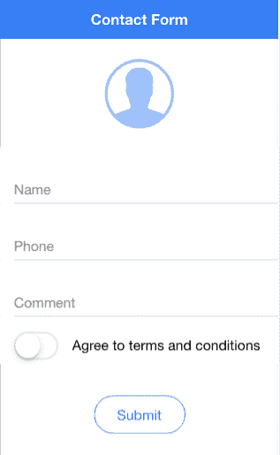

如果用户尝试提交而没有提供有效信息，表单将显示以下错误：

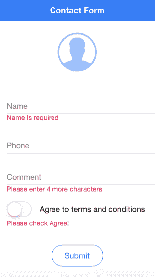

基本上，姓名字段是必需的。电话字段是数字类型，但为可选。评论字段是必需的，用户必须输入至少四个字符。当然，这只是为了演示输入长度。最后，用户必须通过切换输入同意条款和条件。

验证成功后，用户将被带到第二个屏幕，其中包含上一个屏幕的摘要，如下面的截图所示：

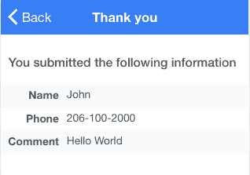

# 准备工作

此应用程序示例可以在浏览器或物理设备上运行。然而，你可以选择将物理设备连接到验证电话字段的数字键盘。

# 如何做到这一点...

1.  按照示例，使用 `blank` 模板创建一个新的 `MyFormValidation` 应用程序，然后进入 `MyFormValidation` 文件夹：

```js
$ ionic start MyFormValidation blank
$ cd MyFormValidation
```

1.  打开 `./src/app/app.module.ts` 文件，并将其内容替换为以下代码：

```js
import { BrowserModule } from '@angular/platform-browser';
import { ErrorHandler, NgModule } from '@angular/core';
import { IonicApp, IonicErrorHandler, IonicModule } from 'ionic-angular';
import { SplashScreen } from '@ionic-native/splash-screen';
import { StatusBar } from '@ionic-native/status-bar';

import { MyApp } from './app.component';
import { HomePage } from '../pages/home/home';
import { ThankyouPage } from '../pages/thankyou/thankyou';
import { MyFormService } from '../services/myform';

@NgModule({
  declarations: [
    MyApp,
    HomePage,
    ThankyouPage
  ],
  imports: [
    BrowserModule,
    IonicModule.forRoot(MyApp)
  ],
  bootstrap: [IonicApp],
  entryComponents: [
    MyApp,
    HomePage,
    ThankyouPage
  ],
  providers: [
    StatusBar,
    SplashScreen,
    MyFormService,
    {provide: ErrorHandler, useClass: IonicErrorHandler}
  ]
})
export class AppModule {}
```

你可能会意识到应用程序中有一个共同的服务要使用，这里称为 `MyFormService`。此示例还有一个第二页，称为 `ThankyouPage`。

1.  现在，让我们首先创建一个目录来创建服务，如下所示：

```js
$ mkdir ./src/services
```

1.  在你刚刚创建的组件目录中创建 `myform.ts` 文件，

    如下所示：

```js
import { Injectable } from '@angular/core';

@Injectable()
export class MyFormService {
    public name: string = '';
    public phone: number;
    public comment: string = '';
}
```

这个例子将服务组件保持简单，以供演示目的。

1.  打开并编辑 `./src/pages/home/home.html` 模板，如下所示：

```js
<ion-header>
  <ion-navbar color="primary">
    <ion-title>
      Contact Form
    </ion-title>
  </ion-navbar>
</ion-header>

<ion-content>
  <p class="center">
    <ion-icon class="large lighter" primary name="contact"></ion-icon>
  </p>

  <form #f="ngForm" novalidate (ngSubmit)="onSubmit(f)">
    <ion-list>
      <ion-item>
        <ion-label floating>Name</ion-label>
        <ion-input type="text" name="name" required 
        [(ngModel)]="data.name"></ion-input>
      </ion-item>
      <div [hidden]="f.controls.name && (f.controls.name.valid || 
      (f.controls.name.pristine && !isSubmitted))" class="note danger">
        Name is required
      </div>

      <ion-item>
        <ion-label floating>Phone</ion-label>
        <ion-input type="tel" name="phone" [(ngModel)]="data.phone">
      </ion-input>
      </ion-item>

      <ion-item>
        <ion-label floating>Comment</ion-label>
        <ion-input type="text" required minlength=4 name="comment" 
        [(ngModel)]="data.comment">
        </ion-input>
      </ion-item>
      <div *ngIf="(isSubmitted && f.controls.comment && 
      f.controls.comment.pristine) || ((f.controls.comment) && 
      (f.controls.comment.dirty && f.controls.comment.errors))" class="note 
      danger">
        Please enter {{ 4 - (f.controls.comment.errors.minlength ? 
        f.controls.comment.errors.minlength.actualLength : 0) }} more
        characters
      </div>
      <ion-item class="tos">
        <ion-toggle item-left [(ngModel)]="data.tos" name="tos" 
        type="button" (click)="noSubmit($event)"></ion-toggle>
        <ion-label item-right>Agree to terms and conditions
        </ion-label>
      </ion-item>
      <div [hidden]="(!isSubmitted) || (f.controls.tos && data.tos)" 
       class="note danger">
        Please check Agree!
      </div>
    </ion-list>
    <div class="center">
      <button ion-button type="submit" round outline>Submit</button>
    </div>
  </form>
</ion-content>
```

这可能是表单验证过程中最复杂的一部分，因为有很多地方你必须嵌入输入的验证逻辑。

1.  打开并替换 `./src/pages/home/home.scss` 文件的内容，如下所示：

```js
page-home {
    .center {
        text-align: center;
    }
    ion-icon.large {
        font-size: 7em;
    }
    ion-icon.lighter {
        opacity: 0.5;
    }
    ion-list > .item:first-child {
        border-top: 0;
    }
    ion-list > .item:last-child, ion-list > ion-itemsliding:last-child .item 
   {
        border-bottom: 0;
    }
    .tos {
        padding-top: 10px;
        ion-toggle {
            padding-left: 0px;
        }
        .item-inner {
            border-bottom: 0;
        }
    }
    .item ion-toggle {
        padding-left: 0;
    }
    .note.danger {
        padding-left: 16px;
        color: #d14;
    }
}
```

1.  打开 `./src/pages/home/home.ts` 文件进行编辑，如下所示：

```js
import { Component } from '@angular/core';
import { NavController } from 'ionic-angular';
import { ThankyouPage } from '../thankyou/thankyou';
import { MyFormService } from '../../services/myform';

@Component({
  selector: 'page-home',
  templateUrl: 'home.html'
})
export class HomePage {
  private data: any;
  private isSubmitted: Boolean = false;
  constructor(public nav: NavController, private formData:
    MyFormService) {
    this.nav = nav;
    this.formData = formData;
    this.data = {
      name: '',
      phone: '',
      comment: '',
      tos: false
    }
  }
  onSubmit(myForm) {
    this.isSubmitted = true;
    console.log('onSubmit');
    console.log(myForm);
    if ((myForm.valid) && (myForm.value.tos)) {
      this.formData.name = this.data.name;
      this.formData.phone = this.data.phone;
      this.formData.comment = this.data.comment;
      this.nav.push(ThankyouPage);
    }
  }
  noSubmit(e) {
    e.preventDefault();
  }
}
```

你可能会注意到 JavaScript 部分中并没有太多的验证代码。这意味着模板处理了大部分验证。还有一个用于 `thankyou` 页面的 `import` 命令，你将不得不在下一步创建它。

1.  现在，让我们创建 `thankyou` 文件夹，如下所示：

```js
$ mkdir ./src/pages/thankyou 
```

1.  在你刚刚创建的 `Component` 目录中创建一个 `thankyou.ts` 文件，如图所示：

```js
import { Component } from '@angular/core';
import { MyFormService } from '../../services/myform';
@Component({
    selector: 'page-thankyou',
    templateUrl: 'thankyou.html'
})
export class ThankyouPage {
    constructor(private formData: MyFormService) {
        this.formData = formData;
    }
}
```

这个页面只是渲染 `MyFormService` 服务的数据，所以你可以让它非常简单。

1.  在 `./src/pages/thankyou` 文件夹中创建 `thankyou.html`，如图所示：

```js
<ion-header>
    <ion-navbar color="secondary">
        <ion-title>
            Thank You
        </ion-title>
    </ion-navbar>
</ion-header>
<ion-content>
    <h6 class="padding">
        You submitted the following information
    </h6>
    <div class="my-table">
        <ion-row>
            <ion-col width-25 class="my-label">Name</ion-col>
            <ion-col width-75>{{ formData.name }}</ion-col>
        </ion-row>
        <ion-row>
            <ion-col width-25 class="my-label">Phone</ion-col>
            <ion-col width-75>{{ formData.phone }}</ion-col>
        </ion-row>
        <ion-row>
            <ion-col width-25 class="my-label">Comment</ion-col>
            <ion-col width-75>{{ formData.comment }}</ion-col>
        </ion-row>
    </div>
</ion-content>
```

1.  在 `./src/pages/thankyou` 文件夹中创建 `thankyou.scss`，如下所示：

```js
page-thankyou {
    h6.padding {
        color: #4C555A;
        padding: 10px;
    }
    .my-label {
        text-align: right;
        font-weight: bold;
    }
    .my-table {
        ion-row {
            color: #4C555A;
            padding: 0;
            height: 30px;
        }
        ion-row + ion-row {
            margin-top: 0;
        }
        ion-row:nth-child(odd) ion-col {
            background: #F9FAFB;
        }
    }
}
```

1.  前往你的终端，使用以下命令运行应用程序：

```js
$ ionic serve
```

# 它是如何工作的...

让我们从包含大部分验证代码的 `home.html` 文件开始。如果你看看这个页面的结构，它非常典型。你有一个 `<ion-navbar>`，里面有一个 `<ion-title>`。`<form>` 元素必须位于 `<ion-content>` 区域内。

使用 `<form>` 元素是 Angular 验证的一个要求。否则，将没有 `submit` 事件，你无法捕获每个输入的错误。

`form` 具有以下属性：

```js
<form #f="ngForm" novalidate (ngSubmit)="onSubmit(f)"> 
```

要即时分配一个局部变量，你使用 `#` 符号。这意味着你希望 `f` 变量引用 `ngForm`，这是 Angular 自动创建的。这是一个包含与当前表单相关的所有内容的特殊对象。建议使用 `novalidate` 来绕过默认的 HTML5 验证，因为你正在使用 Angular 进行验证。否则，`form` 将会冲突。`(ngSubmit)` 几乎是一个事件，当 `type=submit` 的 `button` 被触摸或点击时，会触发 `onSubmit(f)` 函数。当你提交表单时，它将传递 `f` 变量，这样你就可以在 `onSubmit` 方法中处理该对象内部的对象。

`form` 模板仅由 `<ion-list>` 和 `<ion-item>` 组成。你只需要知道如何验证每个输入并显示错误。让我们以 `Name` 字段作为第一个例子。这是 `Name` 的 `<ion-input>`：

```js
<ion-input type="text" name="name" required [(ngModel)]="data.name"></ion-input> 
```

下面的错误显示如下：

```js
<div [hidden]="f.controls.name && (f.controls.name.valid || (f.controls.name.pristine && !isSubmitted))" class="note danger"> 
  Name is required 
</div>
```

为了验证，你必须将 `name` 分配给一个局部变量名。这是为了在其他地方使用 `f.controls.name` 来引用该输入。回想一下，`f` 变量已经被声明为 `ngForm` 对象。以下是 `ngForm` 的结构视图：

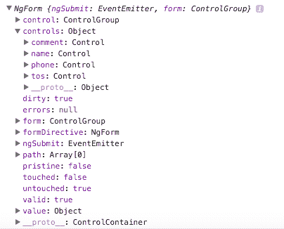

你可以通过 Chrome 开发者控制台查看这一点，因为代码在提交表单时实际上会给出这个输出。

当以下任一条件成立时，错误信息`Name is required`将被隐藏：

+   表单尚未提交。否则，人们在输入任何内容之前就会立即看到错误信息。这不是一个好的用户体验。为了检查这一点，你必须使用一个临时的布尔值，称为`isSubmitted`。`f.controls.name.pristine`变量表示输入尚未被修改。其相反的是`f.controls.name.dirty`。

+   `f.controls.name.valid`变量为`true`。然而，你不能立即检查这一点，因为如果输入为空，`name`对象尚不存在。这就是为什么在检查`valid`布尔值之前需要检查`f.controls.name`的存在。

没有必要检查电话要求；因此，你只需要分配`name`和一个模型，如下所示：

```js
<ion-input type="tel" name="phone" [(ngModel)]="data.phone"></ion-input> 
```

对于`comment`字段，你需要使用`required`和`minlength=4`进行验证，如下所示：

```js
<ion-input type="text" required minlength=4 name="comment" [(ngModel)]="data.comment"></ion-input> 
```

你可能会认为`required`是不必要的，因为如果长度为零，Angular 将触发一个错误标志。然而，这并不正确。当用户在输入框中没有输入任何内容时，输入将没有长度，因为变量不存在。这就是为什么你需要检查这两种情况。

对于`comment`字段的错误信息非常有趣，因为它显示了用户需要输入的字符数，如下面的代码所示：

```js
<div *ngIf="(isSubmitted && f.controls.comment && 
 f.controls.comment.pristine) || ((f.controls.comment) && 
 (f.controls.comment.dirty && f.controls.comment.errors))" 
 class="note danger"> Please enter {{ 4 - (f.controls.comment.errors.minlength 
 ? 
 f.controls.comment.errors.minlength.actualLength : 0) }} more 
 characters 
</div> 
```

这里的主要思想是，你只想在表单提交且通过`f.controls.comment.pristine`保持原始状态时显示这个`div`。这意味着用户在表单中未输入任何内容。你同样希望在表单被修改且有错误通过`f.controls.comment.errors`显示消息。如果你检查控制台，你可以在`f.controls.comment.errors`对象下看到许多详细的错误列表。为了告诉用户他们还剩下多少字符可以输入，你必须首先检查`f.controls.comment.errors.minlength`，因为如果该变量不存在，则没有错误或`comment`输入为空。如果你不检查这一点，你将在稍后得到解析错误。

在你的`home.ts`文件中，`onSubmit`方法必须将`isSubmitted`布尔值切换为`true`，如下面的代码片段所示：

```js
onSubmit(myForm) { 
  this.isSubmitted = true; 
  console.log('onSubmit'); 
  console.log(myForm); 

  if ((myForm.valid) && (myForm.value.tos)) { 
    this.formData.name = this.data.name; 
    this.formData.phone = this.data.phone; 
    this.formData.comment = this.data.comment; 
    this.nav.push(ThankyouPage); 
  } 
} 
```

然后，你必须对`myForm.valid`和`myForm.value.tos`进行一般性检查。你可能想知道为什么我们在这里检查`tos`而不是在模板内进行验证。原因是由于在 Angular 中没有验证切换按钮的意义，因为它不能被`required`，所以你必须在自定义验证中确保它在表单中为`true`。这意味着用户已经检查了同意条款和条件的切换按钮。

参考 W3 网站，在 [`www.w3.org/TR/2011/WD-html5-20110525/the-button-element.html`](https://www.w3.org/TR/2011/WD-html5-20110525/the-button-element.html) ，了解 `button` 元素的默认行为。

`thankyou` 页面非常直观，因为你只需通过从 `MyFormService` 服务获取数据来在模板中解析 `formData` 对象。

# 参见

查看以下链接以获取更多信息：

+   关于 Angular 2 文档中 `form` 的更多信息，你可以访问 [`angular.io/docs/ts/latest/guide/forms.html`](https://angular.io/docs/ts/latest/guide/forms.html) 和 [`angular.io/docs/ts/latest/api/forms/index/NgForm-directive.html`](https://angular.io/docs/ts/latest/api/forms/index/NgForm-directive.html)。

+   ionic 文档有一个专门针对 Ionic 输入组件的页面，位于 [`ionicframework.com/docs/v2/resources/forms/`](https://ionicframework.com/docs/v2/resources/forms/)

+   它还列出了你可以用于验证或键盘强制的 HTML5 输入类型，你可以在 [`ionicframework.com/html5-input-types/`](http://ionicframework.com/html5-input-types/) 找到。

# 在 Ionic 中创建响应式表单

在上一个示例中，我们已经创建了一个具有验证的复杂表单。如果你仔细观察，我们已经在模板文件中使用了 angular 验证，特别是在 `home.html` 中。这类表单被称为模板驱动表单，其中大部分工作都是在模板端完成的。这与我们在 AngularJS 中所做的是非常相似的。

在 Angular 中还有另一种类型的表单，称为响应式表单。区别在于，在响应式表单中，我们在组件类中使用了验证和其他配置，而不是在模板中。以下是从 Angular 文档中的定义：

“使用 *reactive* 表单，你在组件类中创建一个 Angular 表单控件对象的树，并将它们绑定到组件模板中的原生表单控件元素。”

我们将创建一个注册表单，其外观如下：

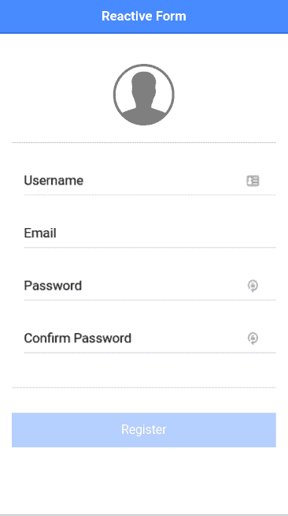

# 准备工作

由于我们正在使用表单，我们只需要一个网络浏览器来运行这个食谱。

# 如何操作...

1.  打开终端（或命令提示符）并创建一个基于 `blank` 模板的新应用，命名为 `ReactiveForm`，然后按照以下步骤进入文件夹：

```js
$ ionic start ReactiveForm blank
$ cd ReactiveForm
```

1.  打开 `home.html` 并将其替换为以下内容：

```js
<ion-header>
<ion-navbar color="primary">
<ion-title>
Reactive Form
</ion-title>
</ion-navbar>
</ion-header>

<ion-content padding>
<p class="center">
<ion-icon class="large lighter" primary name="contact"></ion-icon>
</p> 
<form [formGroup]="registerForm" (ngSubmit)="onSubmit()" novalidate>
<ion-list>
<ion-item>
<ion-label floating>Username</ion-label>
<ion-input type="text" formControlName="username"></ion-input>
</ion-item>
<ion-item>
<ion-label floating>Email</ion-label>
<ion-input type="email" formControlName="email"></ion-input>
</ion-item>

<ion-item>
<ion-label floating>Password</ion-label>
<ion-input type="password" formControlName="pass"></ion-input>
</ion-item>

<ion-item>
<ion-label floating>Confirm Password</ion-label>
<ion-input type="password" formControlName="repass"></ion-input>
</ion-item>

<ion-item text-wrap class="error">
<div *ngIf="registerForm.controls['username'].dirty && registerForm.controls['username'].invalid">
Username should at least have 10 Characters.
</div>
<div *ngIf="registerForm.controls['email'].dirty && registerForm.controls['email'].invalid">
Email is incorrect.
</div>
<div *ngIf="registerForm.controls['pass'].dirty && registerForm.controls['pass'].invalid">
Password should be 8 Character long.
</div>
<div *ngIf="registerForm.controls['repass'].dirty && registerForm.controls['repass'].invalid">
Choose same password in confirm password field.
</div>
</ion-item>
</ion-list>
<button ion-button full type="submit" [disabled]="registerForm.invalid">Register</button>
</form>

</ion-content>
```

1.  打开 `home.scss` 文件并将其内容替换为以下内容：

```js
page-home {
 .center {
 text-align: center;
 }
 ion-icon.large {
 font-size: 7em;
 }
 ion-icon.lighter {
 opacity: 0.5;
 }
 .error {
 color: red;
 }
}
```

1.  打开 `home.ts` 文件并将其内容替换为以下内容：

```js
import { Component } from '@angular/core';
import { FormBuilder, FormGroup, Validators } from '@angular/forms';
import { NavController, AlertController } from 'ionic-angular';
import { confirmPassword } from "../../app/confirmPassword";

@Component({
  selector: 'page-home',
  templateUrl: 'home.html'
})
export class HomePage {
  registerForm:FormGroup;

  constructor(public navCtrl: NavController, private fb:FormBuilder, 
    private alertCtrl: AlertController) {
    this.registerForm = this.fb.group({
      username: ['', [Validators.required, Validators.minLength(10)]],
      email: ['', [Validators.required, Validators.email]],
      pass: ['', [Validators.required, Validators.minLength(8)]],
      repass: ['', [Validators.required, Validators.minLength(8)]],
    }, {
      validator: confirmPassword('pass', 'repass')
    });
  }

  onSubmit() {
    this.alertCtrl.create({
      title: 'Your inputs are:',
      message: JSON.stringify(this.registerForm.value),
      buttons: ['Dismiss']
    })
    .present();
    console.log(this.registerForm);
  }

}
```

由于在我们的示例中，我们有一个包含密码和确认密码字段的注册表单，我们将创建一个自定义验证器以确保这两个字段都有一些值。

1.  在 `/app` 文件夹中创建一个名为 `confirmPassword.ts` 的文件。然后在其内部添加以下内容：

```js
import { FormGroup } from '@angular/forms';

export function confirmPassword(passwordKey: string, passwordConfirmationKey: string) {
    return (group: FormGroup) => {
      let passwordInput = group.controls[passwordKey],
          passwordConfirmationInput = 
          group.controls[passwordConfirmationKey];
      if (passwordInput.value !== passwordConfirmationInput.value) {
        return passwordConfirmationInput.setErrors({notEquivalent: true})
      }
      else {
          return passwordConfirmationInput.setErrors(null);
      }
    }
  }
```

1.  确保你的 `app.module.ts` 包含以下内容：

```js
import { BrowserModule } from '@angular/platform-browser';
import { ErrorHandler, NgModule } from '@angular/core';
import { IonicApp, IonicErrorHandler, IonicModule } from 'ionic-angular';
import { SplashScreen } from '@ionic-native/splash-screen';
import { StatusBar } from '@ionic-native/status-bar';

import { MyApp } from './app.component';
import { HomePage } from '../pages/home/home';

@NgModule({
  declarations: [
    MyApp,
    HomePage
  ],
  imports: [
    BrowserModule,
    IonicModule.forRoot(MyApp)
  ],
  bootstrap: [IonicApp],
  entryComponents: [
    MyApp,
    HomePage
  ],
  providers: [
    StatusBar,
    SplashScreen,
    {provide: ErrorHandler, useClass: IonicErrorHandler}
  ]
})
export class AppModule {}
```

1.  打开终端并运行以下命令：

```js
$ ionic serve
```

# 它是如何工作的...

由于这个配方使用了响应式表单，让我们首先看看 `home.ts`，它初始化并设置我们的表单。

在 `HomePage` 类中，我们有 `registerForm:FormGroup` 属性，这是 `FormControl` 的集合。每个 `FormControl` 都绑定到模板中的原生 `FormControl`。为了创建 `FormGroup`，我们可以做如下操作：

```js
this.myForm = new FormGroup({
 first: new FormControl('Nancy', Validators.minLength(2)),
 last: new FormControl('Drew'),
});
```

在前面的例子中，我们创建了一个名为 `myForm` 的 `FormGroup`。`FormGroup` 构造函数接受一个对象作为输入，这是 `FormControl` 的集合。这个对象中的每个键都指向模板中的某个原生 `FormControl`。键值对中的值是一个 `FormControl` 对象。`FormControl` 构造函数接受初始值和一个验证器或验证器数组作为输入。模板看起来可能如下所示：

```js
<form formGroup="myForm" novalidate>
 <input type="text" formControlName="first"/>
 <input type="text" formControlName="last" />
</form>
```

在这里，`formControlName` 设置为 `FormControl` 的键；例如，`first`。`formGroup` 设置为组的名称；在这个例子中，它是 `myForm`。

然而，如果我们有嵌套的 `FormGroup`，这个方法就会变得复杂。为了简化这个过程，Angular 通过 `FormBuilder` 提供了一个更好的 API。`FormBuilder` 是一个类，它允许我们通过一个非常好的 API 创建 `FormGroup`。看看这个例子：

```js
this.registerForm = this.fb.group({
 username: ['', [Validators.required, Validators.minLength(10)]],
 email: ['', [Validators.required, Validators.email]],
 pass: ['', [Validators.required, Validators.minLength(8)]],
 repass: ['', [Validators.required, Validators.minLength(8)]],
 }, {
 validator: confirmPassword('pass', 'repass')
});
```

`this.fb` 是 `FormBuilder` 的一个实例，并且有一个 `group` 方法来创建 `FormGroup`。它接受一个包含键值对的对象。键与 `formControlName` 一起使用，以绑定到模板中的原生元素，而值是一个数组，包含原生元素的初始值和验证器列表。例如，`username` 有 `required` 和 `minLength(10)` 验证器；同样，其他字段也有验证。你可能注意到这里没有 `FormControl` 构造函数。这是 `FormBuilder` 提供的抽象。

你也可以将组级验证器作为第二个输入传递给 `FormBuilder` 的 `group` 方法。在先前的例子中，我们使用了一个自定义的 `confirmPassword` 验证器，输入为 `pass` 和 `repass`。这些是第一个对象中的键，并指向输入字段；验证器确保它们相等。

我们的自定义验证器是在 `confirmPassword.ts` 文件中创建的，如下所示：

```js
export function confirmPassword(passwordKey: string, passwordConfirmationKey: string) {
 return (group: FormGroup) => {
     let passwordInput = group.controls[passwordKey],
     passwordConfirmationInput = group.controls[passwordConfirmationKey];
     if (passwordInput.value !== passwordConfirmationInput.value) {
         return passwordConfirmationInput.setErrors({notEquivalent: true})
     }
     else {
         return passwordConfirmationInput.setErrors(null);
     }
 }
}
```

这是一个只接受两个字符串类型参数的函数。这两个参数是我们想要比较的两个字段的名称。它比较两个字段中的值，并根据需要设置 `repass`（即确认密码）字段的验证。

在 `home.html` 中，我们有如下外观的表单元素：

```js
<form [formGroup]="registerForm" (ngSubmit)="onSubmit()" novalidate>
```

`[formGroup]` 设置为 `registerForm`，当用户点击提交按钮时，它会触发 `onSubmit` 方法。

每个输入都配置如下：

```js
 <ion-item>
   <ion-label floating>Username</ion-label>
   <ion-input type="text" formControlName="username"></ion-input>
 </ion-item>
```

我们还展示了错误消息，因为我们使用了表单验证器。以下是显示验证错误消息的方式。我们检查字段是否为 `dirty` 或 `invalid`，然后显示相应的错误。`formName.controls['controlName']` 是获取控制器的语法。在这里，`formName` 是 `formGroup` 的名称，而 `controlName` 是控制器的名称：

```js
<ion-item text-wrap class="error">
 <div *ngIf="registerForm.controls['username'].dirty && registerForm.controls['username'].invalid">
 Username should at least have 10 Characters.
 </div>
 <div *ngIf="registerForm.controls['email'].dirty && registerForm.controls['email'].invalid">
 Email is incorrect.
 </div>
 <div *ngIf="registerForm.controls['pass'].dirty && registerForm.controls['pass'].invalid">
 Password should be 8 Character long.
 </div>
 <div *ngIf="registerForm.controls['repass'].dirty && registerForm.controls['repass'].invalid">
 Choose same password in confirm password field.
 </div>
 </ion-item>
```

错误看起来像这样：

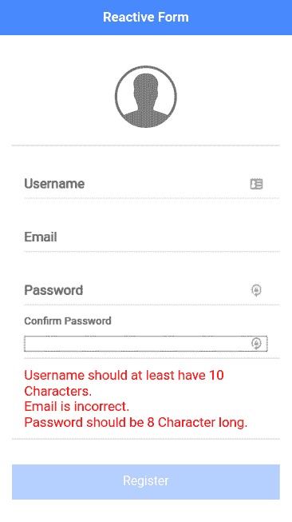

最后，我们有了注册按钮，其代码如下：

```js
<button ion-button full type="submit" [disabled]="registerForm.invalid">Register</button>
```

当表单无效时，我们禁用按钮。当用户点击它时，它会调用 `onSubmit` 方法，并显示一个包含用户输入的警告框，如下面的代码所示：

```js
onSubmit() {
 this.alertCtrl.create({
     title: 'Your inputs are:',
     message: JSON.stringify(this.registerForm.value),
     buttons: ['Dismiss']
 })
 .present();
  console.log(this.registerForm);
 }
```

警告消息看起来如下所示：

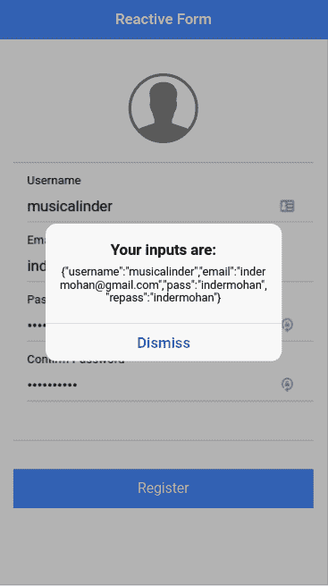

# 参见

+   想要了解更多关于响应式表单的信息，请访问 Angular 的响应式表单指南，链接为 [`angular.io/guide/reactive-forms`](https://angular.io/guide/reactive-forms)

+   托德·莫托（Todd Moto）撰写了一篇关于响应式表单的优秀文章，链接为 [`toddmotto.com/angular-2-forms-reactive`](https://toddmotto.com/angular-2-forms-reactive)

# 通过使用静态 JSON 文件模拟 API 获取数据

作为前端和应用程序开发者，你通常在一个团队中工作，其中另一个人负责后端 API。然而，在开发前端时，并不总是有可能有后端可用。在最终后端 API 准备好的情况下，你必须模拟后端。

在这个菜谱中，你将学习如何使用 `HttpClient` 服务调用 REST API。API 端点将只是位于你本地机器上的静态 JSON。你还将学习如何利用占位符图像来满足设计要求。应用将显示图像源列表和描述，如下面的截图所示：

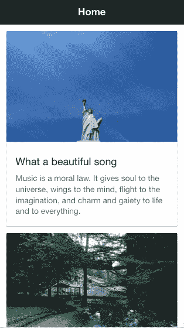

# 准备工作

这个应用示例可以在浏览器或物理设备上运行。然而，模拟的后端服务器必须在你的本地计算机上运行。

# 如何做到这一点...

1.  首先，让我们快速创建一个模拟的后端服务器。你必须安装 `http-server`

    对于以下内容：

```js
$ sudo npm install -g http-server
```

1.  创建一个文件夹来存储你的 `.json` 文件。让我们称它为 `MockRest`，如下所示：

```js
$ mkdir MockRest
$ cd MockRest
```

1.  创建 `test.json` 文件，并填写以下内容作为 REST 响应：

```js
[ 
  { 
    "title": "What a beautiful song", 
    "category": "objects", 
    "description": "Music is a moral law. It gives soul to the universe, wings to the mind, flight to the imagination, and charm and gaiety to life and to everything." 
  }, 
  { 
    "title": "The world we live in", 
    "category": "nature", 
    "description": "Look deep into nature, and then you will understand everything better." 
  }, 
  { 
    "title": "Life experiences", 
    "category": "people", 
    "description": "People who know little are usually great talkers, while 
    men who know much say little." 
  } 
]
```

基本上，每次你发送 REST 请求时，你应该收到前面的内容作为响应。随着你的后端开发者更新 REST 响应，你总是可以相应地更改 `test.json` 文件的内容。

1.  通过在 `MockRest` 文件夹中的终端调用 `http-server` 来启动你的后端服务器，如下所示：

```js
$ http-server --cors=Access-Control-Allow-Origin

```

前往您的浏览器并访问`http://localhost:8080/test.json`以验证您是否可以看到 JSON 内容。如果不行，您可能与其他 Web 服务器存在端口冲突。您需要确保没有其他应用程序正在使用端口`8080`。在完成您的后端后，打开另一个终端窗口，使用`blank`模板创建一个新的`MyRestBackend`应用程序，并进入`MyRestBackend`文件夹，如下所示：

```js
$ ionic start MyRestbackend blank
$ cd MyRestbackend
```

您不得停止后端服务器或在`MockRest`文件夹内创建 Ionic 项目。它们是两个独立的项目文件夹

1.  打开`home.html`文件，并用以下代码替换内容：

```js
<ion-header>
  <ion-navbar>
    <ion-title>
      Home
    </ion-title>
  </ion-navbar>
</ion-header>

<ion-content padding>
  <ion-card #myCard *ngFor="let item of quotes.data">
    
    <ion-card-content>
      <ion-card-title>
        {{ item.title }}
      </ion-card-title>
      <p>
        {{ item.description }}
      </p>
    </ion-card-content>
  </ion-card>
</ion-content>
```

此示例使用来自[`source.unsplash.com/`](https://source.unsplash.com/)的免费照片，因为您可以轻松查询以获取满足您需求的随机照片。

1.  打开`home.ts`并使用以下代码进行编辑：

```js
import { Component } from '@angular/core';
import { NavController } from 'ionic-angular';
import { QuoteService } from '../../services/quote';

@Component({
  selector: 'page-home',
  templateUrl: 'home.html'
})
export class HomePage {
  constructor(public navCtrl: NavController, public quotes:QuoteService) {
    this.quotes = quotes;
    this.quotes.getQuotes();
  }
}
```

您尚未创建`QuoteService`服务。然而，您可能知道这个服务将使用`getQuotes()`方法调用模拟后端服务器以获取 JSON 内容。

1.  对样式表`home.scss`进行以下小修改：

```js
page-home {
    ion-card {
        img {
            background-color: #f4f4f4;
        }
    }
}
```

1.  使用以下命令创建`./src/services`文件夹：

```js
$ mkdir ./src/services
```

1.  在`services`文件夹中创建`quote.ts`文件，并复制以下代码：

```js
import { Injectable } from '@angular/core';
import { HttpClient } from '@angular/common/http';
@Injectable()
export class QuoteService {
    private http: any;
    public data: any;
    constructor(http: HttpClient) {
        this.http = http;
    }
    getQuotes() {
        this.http.get("http://localhost:8080/test.json")
            .subscribe(res => {
                this.data = res;
                console.log(this.data, this.http);
            }, error => {
                console.log(error);
            });
    }
}
```

1.  打开并编辑`./src/app/app.module.ts`以声明`QuoteService`，如下所示：

```js
import { BrowserModule } from '@angular/platform-browser';
import { ErrorHandler, NgModule } from '@angular/core';
import { HttpClientModule } from '@angular/common/http';
import { IonicApp, IonicErrorHandler, IonicModule } from 'ionic-angular';
import { SplashScreen } from '@ionic-native/splash-screen';
import { StatusBar } from '@ionic-native/status-bar';

import { MyApp } from './app.component';
import { HomePage } from '../pages/home/home';
import { QuoteService } from '../services/quote'
@NgModule({
  declarations: [
    MyApp,
    HomePage
  ],
  imports: [
    BrowserModule,
    HttpClientModule,
    IonicModule.forRoot(MyApp)
  ],
  bootstrap: [IonicApp],
  entryComponents: [
    MyApp,
    HomePage
  ],
  providers: [
    StatusBar,
    SplashScreen,
    QuoteService,
    {provide: ErrorHandler, useClass: IonicErrorHandler}
  ]
})
export class AppModule {}
```

1.  前往您的终端并运行应用程序，如图所示：

```js
$ ionic serve 
```

1.  您会注意到页面为空，控制台显示以下错误：

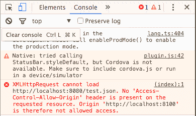

这意味着您的浏览器（在这种情况下，Chrome）不允许从`http://localhost:8100`调用 REST API 到`http://localhost:8080`。您需要安装允许控制允许源（**CORS**）插件，例如[`chrome.google.com/webstore/detail/allow-control-allow-origi/nlfbmbojpeacfghkpbjhddihlkkiljbi?hl=en`](https://chrome.google.com/webstore/detail/allow-control-allow-origi/nlfbmbojpeacfghkpbjhddihlkkiljbi?hl=en)，用于 Chrome。之后，打开 CORS，如图所示：

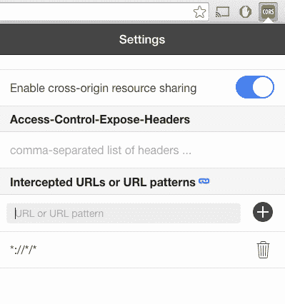

刷新您的浏览器以查看更新后的应用程序。

# 它是如何工作的...

您的模拟后端简单地返回当前`MockRest`文件夹中的任何文件。随着您从后端开发者那里获得更多样本响应，您可以将其复制到该文件夹中，以提供额外的后端端点。

本节不提供如何处理 POST 请求和复杂场景的示例，其中响应取决于请求参数。由于它们不是生产代码，您可能希望将处理临时情况的代码保持尽可能简单。建议为每个 POST 请求返回相同的内容。

让我们看看`quote.ts`文件，因为它是发起`Http`请求的主要地方。首先，您需要导入`Injectable`和`Http`，您可以按照以下方式操作：

```js
import {Injectable} from '@angular/core'; 
import {Http} from '@angular/http';
```

`@Injectable` 装饰器用于允许其他页面和组件将 `QuoteService` 作为依赖项使用。`Http` 服务（或类）由 Angular（而非 Ionic）提供，这与 Angular 1 中的 `$http` 提供者类似。然而，`Http` 将返回一个 **可观察** 对象，以便您可以 *订阅* 它。以下所示 `getQuotes()` 方法是此文件最重要的部分：

```js
  getQuotes() { 
    this.http.get("http://localhost:8080/test.json") 
      .subscribe(res => { 
        this.data = res.json(); 
        console.log(this.data); 
      }, error => { 
        console.log(error); 
      }); 
  } 
```

`this.http` 对象必须从构造函数中注入。然后，它将通过 `this.http.get()` 触发 GET 请求，就像 `$http` 提供者一样。然而，在 Angular 2 中没有 `.then()` 函数；您必须 `订阅` 对象。ES6 的新特性是箭头函数，正如您通过 `res => {}` 看到的。这与其他语言的 lambda 函数类似（例如 Python）。您不需要声明函数的名称，也不必每次都键入 `function`。此外，它自动传递参数（在这种情况下是 `res`）和函数内部的 `this` 上下文。

您可以在 TypeScript 文档中了解更多关于箭头函数的信息，请访问 [`www.typescriptlang.org/docs/handbook/functions.html`](https://www.typescriptlang.org/docs/handbook/functions.html)。

您的模拟后端的 REST 响应将被分配给 `QuoteService` 服务的 `this.data`，如下所示：

```js
this.data = JSON.parse(res._body); 
```

如果您查看浏览器控制台，它将类似于以下截图：

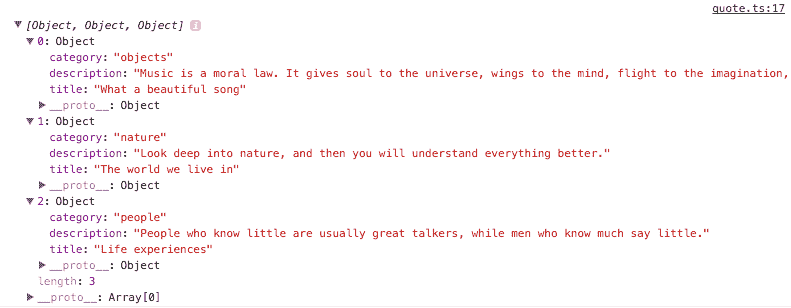

在 `home.html` 模板中，另一个不错的技巧是在图片下载和渲染时显示灰色占位符，而不是将内容向下推，如下面的代码片段所示：

```js
<ion-card #myCard *ngFor="let item of quotes.data"> 
     
```

以下截图显示了在照片加载之前的快速示例：

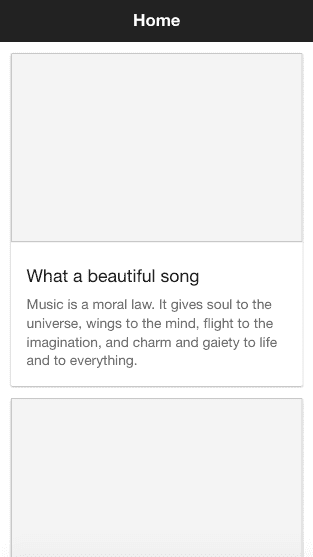

为了让 `` 标签具有确切的大小，您必须使用 `[height]="myCard.clientWidth * 390 / 600"` 进行高度计算。这是因为照片的大小是 600 x 390。`myCard` 对象是从 `ion-card` 创建的本地对象。这个 `myCard` 对象将能够访问 `ion-card` DOM 的所有属性，包括通过 `clientWidth` 的宽度。您可能已经注意到，这完全是纯 JavaScript，与 Ionic 或 Angular 本身无关。

# 参见

关于 Angular `Http` 提供者的更多信息，您可以访问官方文档 [`angular.io/docs/ts/latest/api/http/index/HttpModule-class.html`](https://angular.io/docs/ts/latest/api/http/index/HttpModule-class.html)。

# 与 Stripe 集成进行在线支付

在本节中，您将学习如何与真实的后端服务集成以进行支付流程。赚取收入是创建应用的重要方面。虽然有许多其他收集支付的方法，但 Stripe 是一个常见的支付系统，并且可以很好地与 Ionic 集成。此外，您不需要提供高级别的安全性和合规性（即 PCI），因为您不会存储信用卡信息。

您的应用不会通过真实支付方式处理，因为您可以使用 Stripe 的公共测试密钥。应用将要求输入一些字段以创建令牌。观察以下应用截图：

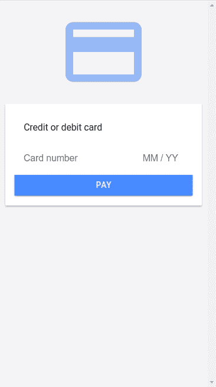

如果您点击支付按钮，它将带您进入下一个屏幕，在那里您将获得支付令牌，如下面的截图所示：

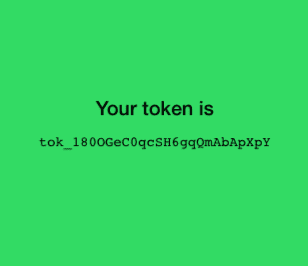

实际上，您的后端调用 Stripe 进行授权和处理交易的步骤还有额外的步骤。然而，这不在本节范围内。Stripe 文档在 Node.js 方面有一个很好的教程页面，网址为[`stripe.com/docs/api/node#authentication`](https://stripe.com/docs/api/node#authentication)。

# 准备工作

没有必要在物理设备上进行测试，因为 Ionic 和 Stripe 在网页浏览器中运行得很好。

# 如何操作...

1.  如果您没有 Stripe 账户，您需要在[`stripe.com.`](https://stripe.com)上注册。

1.  登录并转到[`dashboard.stripe.com/account/apikeys`](https://dashboard.stripe.com/account/apikeys)。

1.  将以下显示的发布密钥复制到某个地方，因为您稍后需要将其用于 JavaScript 代码：


1.  现在，回到终端，使用`blank`模板创建一个新的`StripePayment`应用，如下所示，并进入`StripePayment`文件夹：

```js
$ ionic start StripePayment blank
$ cd StripePayment
```

1.  打开`./src/index.html`文件，并在`<body>`标签中插入以下所示行：

```js
<script type="text/javascript" 
src="img/"></script>
```

这是为了在您的应用中全局加载`Stripe`对象。这不是 Angular 推荐的方法，因为组件内部使用的任何内容都必须通过`import`指令导入。然而，在撰写本书时，angular-stripe 对 Angular 不可用。因此，没有正确执行此操作的方法。前面的方法将完全正常工作。

1.  打开`./src/pages/home/home.html`文件，并使用以下代码修改内容：

```js
<ion-content class="gray-bg">
  <p class="center">
    <ion-icon class="icon-large" name="card"></ion-icon>
  </p>
  <ion-card>
    <ion-card-content>
      <ion-card-header>
        Credit or debit card
      </ion-card-header>
        <ion-item>
          <div #cardElement>
            <!-- a Stripe Element will be inserted here. -->
          </div>
        </ion-item>
        <button ion-button full (click)="onSubmit()">Pay</button>
    </ion-card-content>
  </ion-card>
</ion-content>
```

Stripe 只需要信用卡号、CVC 和到期日期来创建用于收费的令牌。客户姓名和地址是可选的；因此，您不需要在此处包含它们。

1.  然后，将`./src/pages/home/home.ts`的内容替换为以下代码：

```js
import { Component, ViewChild } from '@angular/core';
import { NavController } from 'ionic-angular';
import { ThankyouPage } from '../thankyou/thankyou'
declare var Stripe: any;
@Component({
  selector: 'page-home',
  templateUrl: 'home.html'
})
export class HomePage {
  private token: string = '';
  private card:any;
  private elements:any;
  private stripe:any;
  @ViewChild('cardElement') cardElement;
  constructor(public nav: NavController) {
    this.nav = nav;
    this.stripe = Stripe('YOUR STRIPE PUBLIC KEY HERE');
    this.elements = this.stripe.elements();
  }

  ngOnInit() { 
    const style = {
      base: {
        fontSize: '16px',
        lineHeight: '24px',
        marginBottom: '10px'
      },
    };
    this.card = this.elements.create('card', {style});
    this.card.mount(this.cardElement.nativeElement);
  }
  onSubmit() {
    this.stripe.createToken(this.card)
    .then((data) => {
      this.stripeResponseHandler(data);
    });
  }

  stripeResponseHandler(response) {
    if (response.error) {
      // Show the errors on the form
      console.log('error');
      console.log(response.error.message);
    } else {
      // response contains id and card, which contains additional card   
      //details
      this.token = response.token.id;
      // Insert the token into the form so it gets submitted to the server
      console.log('success');
      console.log('Sending token param:');
      console.log(this.token);
      this.nav.push(ThankyouPage, { token: this.token });
    }
  }
}
```

您需要在此处更改您的`Test Publishable Key`，将`Stripe`构造函数中的`YOUR STRIPE PUBLIC KEY HERE`替换为您之前复制的自己的密钥。

1.  使用以下代码编辑`./src/pages/home/home.scss`：

```js
.page-home {
    .center {
        text-align: center;
    }
    .gray-bg {
        background-color: #f4f4f7;
    }
    .icon-large {
        font-size: 150px;
        color: #387ef5;
        opacity: 0.5;
    }
}
```

1.  通过创建一个名为 `./src/pages/thankyou` 的新文件夹来创建显示令牌 ID 的 `thankyou` 页面，如图所示：

```js
$ mkdir ./src/pages/thankyou
```

1.  在 `thankyou` 文件夹中创建 `thankyou.html` 文件并复制以下代码：

```js
<ion-content class="green-bg"> 
  <h4 class="center"> 
    Your token is 
  </h4> 
  <p class="center"> 
    <code> 
      {{ token }} 
    </code> 
  </p> 
</ion-content> 
```

在现实中，没有必要向用户显示令牌 ID。这只是一个示例，用于获取令牌 ID 以进行收费。

1.  在 `thankyou` 文件夹中创建 `thankyou.ts` 文件并复制以下代码：

```js
import { Component } from '@angular/core'; 
import { NavController, NavParams } from 'ionic-angular'; 

@Component({ 
  selector: 'thank-you', 
  templateUrl: 'thankyou.html' 
}) 
export class ThankyouPage { 
  private token: string = ''; 

  constructor(public nav: NavController, public params: 
   NavParams) { 
    this.token = this.params.get('token'); 
    console.log('Getting token param:'); 
    console.log(this.token); 
  } 

} 
```

1.  创建 `thankyou.scss` 文件，使用以下代码修改主题：

```js
thank-you {
    .green-bg {
        color: black;
        background-color: #32db64;
    }
    h4.center {
        padding-top: 150px;
    }
    .center {
        text-align: center;
    }
}
```

1.  打开并编辑 `./src/app/app.module.ts` 声明 `ThankyouPage` 如下：

```js
import { NgModule } from '@angular/core'; 
import { IonicApp, IonicModule } from 'ionic-angular'; 
import { MyApp } from './app.component'; 
import { HomePage } from '../pages/home/home'; 
import { ThankyouPage } from '../pages/thankyou/thankyou' 

@NgModule({ 
  declarations: [ 
    MyApp, 
    HomePage, 
    ThankyouPage 
  ], 
  imports: [ 
    IonicModule.forRoot(MyApp) 
  ], 
  bootstrap: [IonicApp], 
  entryComponents: [ 
    MyApp, 
    HomePage, 
    ThankyouPage 
  ], 
  providers: [] 
}) 
export class AppModule {} 
```

1.  前往你的终端并运行应用：

```js
$ ionic serve
```

1.  为了测试目的，你可以使用 `4242424242424242` 作为信用卡号，`123` 作为 `cvc`，以及 `12/2017` 作为到期日期。

# 它是如何工作的...

这是 Stripe 收费流程：

1.  用户填写支付表单并点击提交按钮。

1.  前端（你的 Ionic 应用）将使用 `Stripe` 对象调用 API 并发送所有支付信息。

1.  Stripe 将返回一个令牌 ID，这基本上是一种确认一切正确并且你现在可以收费的方式。

1.  前端将使用令牌 ID 发送到其后端（不包含信用卡信息）以授权收费。

1.  后端将调用另一个 Stripe API 来表示“我现在要收费”。此时，Stripe 将向后端返回 `success` 事件。

1.  然后，后端将 `success` 事件返回到前端。

1.  前端应该渲染一个新页面，例如 `thankyou` 页面。

如前所述，本章不会涵盖此应用的后端部分，因为它不关注 Ionic。你可以使用任何语言构建后端，例如 Node.js、PHP 或 Python。

让我们看看 `home.ts`，因为 Stripe API 处理的大部分内容都位于此处。首先，你需要进行一个 `declare`，如图所示，因为 `Stripe` 是一个全局对象，它被包含在 `index.html` 中：

```js
declare var Stripe: any; 
```

如果你没有进行 `declare`，应用仍然可以运行，但你将收到 TypeScript 的错误。

我们正在使用 Stripe Elements，这是一个预构建的支付 UI 元素集。当我们的 `home.ts` 页面加载时，我们使用 `ngOnInit` LikeCycle 钩子初始化我们的支付表单。看看以下代码，在 `ngOnInit` 中：

```js
 this.card = this.elements.create('card', {style});
 this.card.mount(this.cardElement.nativeElement);
```

我们创建了一个具有给定样式的 Stripe 元素卡，然后使用 `this.card.mount` 将该卡挂载到模板内的 HTML 元素上。

如果你查看 `home.html`，你会看到类似以下的内容：

```js
<div #cardElement>
 <!-- a Stripe Element will be inserted here. -->
</div>
```

我们在 `home.html` 中创建了一个 `div`，并使用 `#cardElement` 本地变量，然后在 `home.ts` 中使用 `@ViewChild` 装饰器获取它，并将其上的 `Stripe Element` UI 挂载。挂载意味着创建用于卡号、到期日期和 CVV 的输入字段。`Stripe Element` 还自带其自身的验证和错误信息。

当用户提交表单时，将触发以下方法：

```js
 onSubmit() {
    this.stripe.createToken(this.card)
    .then((data) => {
      this.stripeResponseHandler(data);
    });
  }
```

当你调用`Stripe.card.createToken`时，Stripe 对象将在后台触发一个 API 调用到[`stripe.com/`](https://stripe.com/)，该调用包含用户通过表单填写的信息。这个功能是通过你在`home.html`中的以下代码实现的：

```js
<button type="button" ion-button bottom block 
 (click)="onSubmit()">Pay</button>
```

一旦 Stripe 返回你的令牌 ID，它将调用`this.stripeResponseHandler(response)`函数：

```js
   stripeResponseHandler(response) {
    if (response.error) {
      // Show the errors on the form
      console.log('error');
      console.log(response.error.message);
    } else {
      // response contains id and card, which contains additional card details
      this.token = response.token.id;
      // Insert the token into the form so it gets submitted to the server
      console.log('success');
      console.log('Sending token param:');
      console.log(this.token);
      this.nav.push(ThankyouPage, { token: this.token });
    }
  }
```

`response.token.id`将包含来自 Stripe 的令牌 ID。否则，你可以使用`response.error.message`来处理错误。在这个例子中，因为它只将令牌 ID 传递到下一页，所以你可以简单地作为参数发送它：`{token: this.token}`：

```js
this.nav.push(ThankyouPage, {token: this.token}); 
```

在你的`thankyou.ts`文件中，你可以使用以下代码访问参数`token`：

```js
this.params.get('token');
```

# 参见：

+   要了解更多的 Stripe API 信息，你可以查看官方文档[`stripe.com/docs/stripe.js`](https://stripe.com/docs/stripe.js)。

+   要了解更多关于 Stripe 元素的信息，你可以查看[`stripe.com/elements`](https://stripe.com/elements)。

+   你可以在[`stripe.com/docs/examples`](https://stripe.com/docs/examples)找到更多其他语言的示例进行实验。
