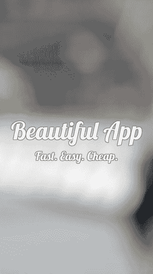
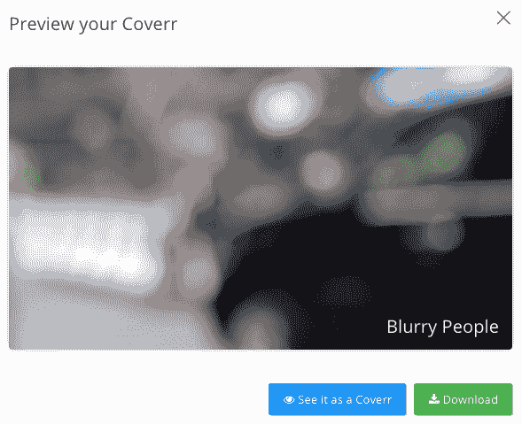
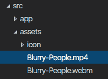
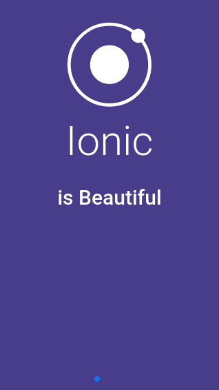
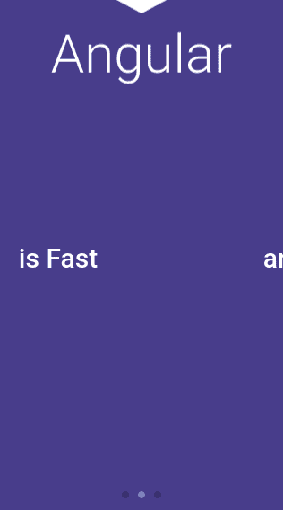
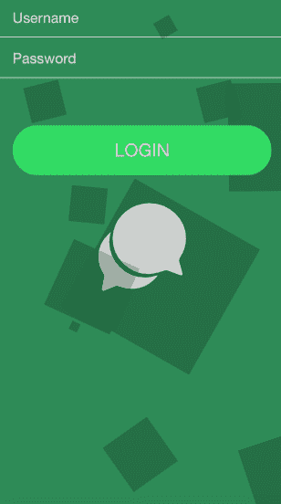

# 添加动画

在本章中，我们将介绍与添加动画和交互相关的以下任务：

+   将全屏内联视频嵌入为背景

+   使用 `Dynamics.js` 创建基于物理的动画

+   通过将手势绑定到动画状态来动画化幻灯片组件

+   为登录页面添加背景 CSS 动画

# 简介

用户体验对于用户的初始吸引力至关重要。当您的早期采用者第一次使用应用程序时，他们会有更好的印象，这会建立信任并增加留存率。应用程序动画也将为用户提供交互式反馈，以便他们知道该做什么或可以根据非常温和的视觉提示采取行动。

原生的应用程序曾经因为动画性能而优于基于网络的混合应用程序。然而，像 Ionic 和 Angular 这样的框架在近年来在性能上缩小了差距。由于许多前端开发人员熟悉 JavaScript 和 CSS，因此网络动画也更容易学习和编码。

在本章中，您将学习如何使用视频和 CSS 进行基本动画。然后，您将开始利用基于物理的动画来创建有趣的交互。此外，您甚至可以逐帧绑定手势，以便在滑动事件期间动画立即发生。

# 将全屏内联视频嵌入为背景

现在，有许多应用程序利用视频作为介绍屏幕的动画背景。这使得应用程序更加有趣和富有创意。用户会感觉到他们受到了应用程序的欢迎。这种策略对于给新用户留下深刻印象并鼓励他们回来是非常好的。

本节将教您如何添加在背景中自动播放的视频：



您还将学习如何使用 `animate.css` 为应用程序标题文本添加自定义动画。

# 准备工作

此应用程序示例可以在浏览器或物理设备上运行。然而，将您的物理设备连接以验证动画在后台正确播放是可选的。

# 如何操作...

以下是在背景中添加自动播放视频的说明：

1.  使用 `blank` 模板创建一个新的 `VideoIntro` 应用程序，如下所示，并导航到 `VideoIntro` 文件夹：

```js
$ ionic start VideoIntro blank
$ cd VideoIntro
```

1.  此时，您需要准备好您的视频。然而，对于这个例子，让我们从不需要许可证的公共网站上下载一个免费的视频。导航到 [`www.coverr.co`](http://www.coverr.co)。

1.  您可以下载任何视频。此应用程序的示例使用 `Blurry-People.mp4` 片段。将其下载到您的计算机：



1.  将视频保存在 `./src/assets/`：



1.  打开 `./src/index.html` 文件，并将内容替换为以下代码：

```js
<!DOCTYPE html> 
<html lang="en" dir="ltr"> 
<head> 
  <meta charset="UTF-8"> 
  <title>Ionic App</title> 
  <meta name="viewport" content="width=device-width, 
   initial-scale=1.0, minimum-scale=1.0, maximum-scale=1.0,
   user-scalable=no"> 
  <meta name="format-detection" content="telephone=no"> 
  <meta name="msapplication-tap-highlight" content="no"> 

  <link rel="icon" type="image/x-icon" 
   href="assets/icon/favicon.ico"> 
  <link rel="manifest" href="manifest.json"> 
  <meta name="theme-color" content="#4e8ef7"> 

  <!-- Google Fonts --> 
  <link href='https://fonts.googleapis.com/css?family=Lobster'
 rel='stylesheet' type='text/css'> 

  <!-- cordova.js required for cordova apps --> 
  <script src="img/cordova.js"></script> 

  <!-- un-comment this code to enable service worker 
  <script> 
    if ('serviceWorker' in navigator) { 
      navigator.serviceWorker.register('service-worker.js') 
        .then(() => console.log('service worker installed')) 
        .catch(err => console.log('Error', err)); 
    } 
  </script>--> 

  <link href="build/main.css" rel="stylesheet"> 
  <link rel="stylesheet"
   href="https://cdnjs.cloudflare.com/ajax/libs/
   animate.css/3.5.2/animate.min.css"> 

</head> 
<body> 

  <!-- Ionic's root component and where the app will 
   load --> 
  <ion-app></ion-app> 

  <!-- The polyfills js is generated during the build
   process --> 
  <script src="img/polyfills.js"></script> 

  <!-- The bundle js is generated during the build 
   process --> 
  <script src="img/main.js"></script> 

</body> 
</html> 
```

基本上，与原始 `index.html` 文件的主要区别在于您想要

以包含标题文本的`Google Lobster`字体和`animate.css`

用于动画。

1.  对于`main`模板，你可以修改`./src/pages/home.html`文件，并用以下代码替换它：

```js
<ion-content class="home"> 
  <div class="fullscreen-bg"> 
    <video class="fullscreen-bg__video" autoplay loop 
     muted webkit-playsinline><source src="img/Blurry-People.mp4" 
       type='video/mp4; codecs="h.264"'><source src="img/>       People.webm" 
       type="video/webm"> 
    </video> 
  </div> 
  <div class="center animated zoomIn"> 
    <h1>Beautiful App</h1> 
    <h2>Fast. Easy. Cheap.</h2> 
  </div> 
</ion-content> 
```

这个页面只有两个重要项目：视频和带有副标题的标题。

1.  使用以下代码在同一文件夹中打开并编辑`./src/pages/home/home.scss`文件：

```js
page-home {
    .home {
        font-family: 'Lobster', cursive;
        color: white;
        text-shadow: 1px 0 0 gray, -1px 0 0 gray, 0 1px 0 gray, 0 -1px 0 gray, 1px 1px gray, -1px -1px 0 gray, 1px -1px 0 gray, -1px 1px 0 gray;
        h1 {
            font-size: 5rem;
        }
    }
    .fullscreen-bg {
        position: fixed;
        top: 0;
        right: 0;
        bottom: 0;
        left: 0;
        overflow: hidden;
        z-index: -100;
    }
    .fullscreen-bg__video {
        position: absolute;
        top: 0;
        left: 0;
        height: 100%;
    }
    .center {
        top: 50%;
        transform: translateY(-50%);
        position: absolute !important;
        text-align: center;
        width: 100%;
    }
}
```

所有动画都是使用 CSS 完成的；因此，你不需要为 JavaScript 文件编写任何代码。

1.  打开`config.xml`文件，并在`<widget>`标签内添加以下行：

```js
<preference name="AllowInlineMediaPlayback" value="true"/> 
```

1.  前往你的终端，使用以下命令运行应用程序：

```js
$ ionic serve
```

# 它是如何工作的...

让我们从`home.html`文件开始，因为这是唯一添加了动画的页面：

```js
<video class="fullscreen-bg__video" autoplay loop muted 
 webkit-playsinline>  <source src="img/Blurry-People.mp4" 
   type='video/mp4; codecs="h.264"' > 
  <source src="img/Blurry-People.webm" type="video/webm"> 
</video> 
```

前面的标签只是一个典型的 HTML5 `<video>`标签。然而，有一个新的属性，称为`webkit-playsinline`。这意味着你希望视频在 HTML 页面上播放，而不是全屏播放并显示播放控制。原因是你想让这个视频在后台播放，同时你可以对上面的文本进行动画处理。这就是为什么你需要通过在`config.xml`中设置`AllowInlineMediaPlayback`来启用这个功能的原因。

这个模板中的第二项是你的标题和副标题，如下所示：

```js
<div class="center animated zoomIn"> 
  <h1>Beautiful App</h1> 
  <h2>Fast. Easy. Cheap.</h2> 
</div> 
```

注意，这里包含了`animated`和`zoomIn`类。这些是`animate.css`启动所必需的类。如果你现在运行应用程序，你会看到文本从较小的尺寸开始逐渐放大（即缩放效果）。

`home.scss`文件很重要，因为它包含大量的动画逻辑。让我们首先看看标题文本：

```js
.home { 
  font-family: 'Lobster', cursive; 
  color: white; 
  text-shadow: 1px 0 0 gray, -1px 0 0 gray, 0 1px 0 gray,
   0 -1px 0 gray, 1px 1px gray, -1px -1px 0 gray, 1px -1px 
   0 gray, -1px 1px 0 gray; 

  h1 { 
    font-size: 5rem; 
  } 

} 
```

这里有一个有趣的事情是使用了`text-shadow`属性。这是因为你想要在文本周围创建一个细的边框线，这样你的白色文本就可以在浅色背景上容易被看到。

要将视频设置为全屏，你需要给它一个负的索引，这样它就会位于其他层之下。此外，高度必须是 100%，如下所示：

```js
.fullscreen-bg { 
  position: fixed; 
  top: 0; 
  right: 0; 
  bottom: 0; 
  left: 0; 
  overflow: hidden; 
  z-index: -100; 
} 

.fullscreen-bg__video { 
  position: absolute; 
  top: 0; 
  left: 0; 
  height: 100%; 
} 
```

最后，为了使文本垂直居中，你必须创建以下类：

```js
.center { 
  top: 50%; 
  transform: translateY(-50%); 
  position: absolute !important; 
  text-align: center; 
  width:100%; 
} 
```

`center`类强制元素顶部为`50%`，然后推 Y 位置`-50%`以重置中间区域`<div>`标签的垂直中心点。你很少需要自定义这样的类；因此，保留`center`类以备将来使用是个好主意。

# 使用 Dynamics.js 创建基于物理的动画

使用基于物理的动画可以使您的应用程序更加互动和生动，这有助于吸引和保留更多用户。有许多方法可以将物理添加到组件动画中。例如，您甚至可以使用 CSS 的`animation-timing`函数来添加属性值，如`ease-in`、`ease-out`或`cubic-bezier`。然而，使用基于 JavaScript 的现有物理动画更容易且更好。`Dynamics.js`是那些带有实用工具和性能的 JavaScript 库之一。实际上，使用原生的 CSS 物理特性并不是一个好的做法，因为它在移动设备上会带来每秒帧数的惩罚。

应用程序将显示一个弹跳按钮，可以显示和隐藏顶部引用框，如下所示；它也使用了物理动画：

# 准备就绪

此应用程序示例可以在浏览器或物理设备上运行。然而，建议您通过物理设备运行应用程序以测试性能。

# 如何操作...

以下是指令：

1.  打开一个终端窗口，使用`blank`模板创建一个新的`SpinningButton`应用程序，并导航到`SpinningButton`文件夹：

```js
$ ionic start SpinningButton blank
$ cd SpinningButton
```

1.  使用以下命令使用`npm`安装`dynamics.js`：

```js
npm install dynamics.js --save
```

1.  打开并编辑`./src/pages/home/home.html`文件，用以下内容替换内容：

```js
<ion-content class="home">
  <div class="my-card" #myCard>
    <h1>QUOTE</h1>
    <p class="body">Always remember that you are absolutely unique. 
     Just like everyone else.</p>
    <p class="name">Margaret Mead</p>
  </div>
</ion-content>
<ion-fab center bottom>
  <button ion-fab #thisEl (click)="animateMe(thisEl)">
    <ion-icon name="mic"></ion-icon>
  </button>
</ion-fab>
```

在此应用程序中不需要有标题导航，因为它将只是一个

单页。

1.  打开`home.ts`文件，在步骤 2 所在的文件夹中使用以下代码进行编辑：

```js
import { Component, ViewChild } from '@angular/core';
import { NavController } from 'ionic-angular';
import * as dynamics from 'dynamics.js';

@Component({
  selector: 'page-home',
  templateUrl: 'home.html'
})
export class HomePage {
  private isAnimating: Boolean = false;
  private isQuoteShown: Boolean = false;
  @ViewChild('myCard') myCard;
  constructor(public navCtrl: NavController) {

  }
  animateMe(el) {
    if (!this.isAnimating) {
      this.isAnimating = true;
      dynamics.animate(el._elementRef.nativeElement, {
        translateY: -50
      }, {
          type: dynamics.bounce,
          duration: 1300,
          complete: () => {
            console.log('Done animating button.');
            this.isAnimating = false;
          }
        });
      if (!this.isQuoteShown) {
        dynamics.animate(this.myCard.nativeElement, {
          translateY: 0
        }, {
            type: dynamics.spring,
            duration: 1300,
            complete: () => {
              console.log('Done animating drop down.');
              this.isAnimating = false;
            }
          });
        this.isQuoteShown = true;
      } else {
        dynamics.animate(this.myCard.nativeElement, {
          translateY: -150
        }, {
            type: dynamics.easeOut,
            duration: 900,
            friction: 50,
            complete: () => {
              console.log('Done animating drop down.');
              this.isAnimating = false;
            }
          });
        this.isQuoteShown = false;
      }
    }
  }

}
```

注意，您必须使用 ES6 导入语法导入`dynamics`。

1.  修改`home.scss`样式表，如下所示：

```js
page-home {
      ion-content.home {
        background-color: #ecf0f1;
      }

      .my-card {
        color: white;
        transform: translate(0,-150px);
        background: #9b59b6;
        height: 150px;
        padding: 10px;
        h1 {
          font-size: 4rem;
          font-weight: 100;
          margin: 0;
        }

        p {
          color: white;
        }

        p.body {
          font-size: 16px;
          line-height: 1.5em;
          margin-bottom: 0;
          margin-top: 5px;
        }

        p.name {
          font-size: 14px;
          font-weight: bold;
          text-align: right;
          margin-top: 5px;
        }
      }
}
```

1.  导航到您的终端，并使用以下命令运行应用程序：

```js
$ ionic serve
```

# 它是如何工作的...

此应用程序中物理动画背后的主要概念是来自`Dynamics.js`库的`dynamics.animate`方法。让我们从模板中的按钮开始，如下所示：

```js
<ion-fab center bottom> 
  <button ion-fab #thisEl (click)="animateMe(thisEl)"> 
    <ion-icon name="mic"></ion-icon> 
  </button> 
</ion-fab> 
```

上述代码中提到的按钮是可以点击以通过调用`animateMe()`方法创建良好弹跳效果的浮动按钮。

要了解更多关于 Ionic 浮动按钮的信息，您可以参考 Ionic 文档[`ionicframework.com/docs/components/#floating-action-buttons`](http://ionicframework.com/docs/components/#floating-action-buttons)。

这里的简单逻辑如下：

+   如果按钮有动画，`isAnimating`必须为`True`。一旦为`True`，任何额外的点击都不会触发动画，因为我们不希望物理效果多次触发。

+   如果顶部引用栏显示，`isQuoteShown`必须为`True`。否则，它将调用不同的动画来隐藏它。

您可以向`dynamics.animate`方法传递许多选项。例如，按钮将使用`dynamics.bounce`作为类型；因此，每次点击都会上下弹跳。您还可以指定应用于动画过程的持续时间。动画完成后，它将在`complete`函数中触发回调，如图所示：

```js
dynamics.animate(el._elementRef.nativeElement, { 
  translateY: -50 
}, { 
  type: dynamics.bounce, 
  duration: 1300, 
  complete: () => { 
    console.log('Done animating button.'); 
    this.isAnimating = false;   
  } 
}); 
```

需要记住的一个重要事项是 `Dynamics.js` 必须引用 DOM JavaScript 对象本身，而不是 DOM 节点或 Ionic 对象。这就是为什么你必须使用 `el._elementRef.nativeElement` 来指向原生元素对象。

对于引用框，它会在模板中创建一个名为 `myCard` 的局部变量，如下所示：

```js
<div class="my-card" #myCard> 
  <h1>QUOTE</h1> 
  <p class="body">Always remember that you are absolutely unique.
   Just like everyone else.</p> 
  <p class="name">Margaret Mead</p> 
</div> 
```

你必须像下面这样使用 `ViewChild` 装饰器来引用这个变量，这样 `@Page` 就知道将其作为依赖项包含：

```js
@ViewChild('myCard') myCard; 
```

# 参见

如果你想要了解更多关于原生 CSS 基于物理的动画，请访问 [`developer.mozilla.org/en-US/docs/Web/CSS/animation-timing-function`](https://developer.mozilla.org/en-US/docs/Web/CSS/animation-timing-function)。

# 通过绑定手势到动画状态来动画化幻灯片组件

从用户那里获得 *哇* 体验的另一种方式是拥有看起来很棒的介绍幻灯片。一个典型的应用会有三到五张幻灯片来描述应用的功能以及它将如何造福用户。今天，许多应用甚至添加了视频或交互式屏幕，以便用户可以感受到应用可能的工作方式。这样的交互式动画需要一些内部开发来将触摸手势绑定到动画状态。基于特定状态的动画非常困难，因为你真的需要获取粒度化的手势数据。另一方面，在状态的开头或结尾进行动画要容易得多。例如，你可以在幻灯片完全显示在屏幕上之后，通过左滑来动画化幻灯片内的对象。然而，这种动画效果并不像在触摸移动过程中绑定动画那样有趣或吸引人。

在本节中你将构建的应用将包含三个幻灯片，当你左右滑动时它们会进行动画：



你将看到幻灯片之间的淡入和淡出动画效果；当从第二张幻灯片向左滑动时，下面的 Angular 标志也会向上移动：



# 准备工作

由于动画是通过 HTML 和 JavaScript 完成的，因此不需要在物理设备上测试应用。然而，建议你在设备上测试应用以评估动画性能。

# 如何做到这一点...

以下是指令：

1.  使用 `blank` 模板创建一个新的 `SliderAnimation` 应用，如下所示，并进入 `SliderAnimation` 文件夹：

```js
$ ionic start SliderAnimation blank
$ cd SliderAnimation
```

1.  打开 `./src/pages/home/home.html` 文件，并使用以下代码修改其内容：

```js
<ion-content class="home">
  <div class="slides-float">
    <div class="slide-float" #slidefloat1>
      <ion-icon name="ios-ionic"></ion-icon>
      <h1>Ionic</h1>
    </div>
    <div class="slide-float" #slidefloat2>
      <ion-icon name="logo-angular"></ion-icon>
      <h1>Angular</h1>
    </div>
    <div class="slide-float" #slidefloat3>
      <ion-icon name="logo-javascript"></ion-icon>
      <h1>Both</h1>
    </div>
  </div>
  <ion-slides #myslides pager (ionSlideDrag)="onMove()">
    <ion-slide>
      <h2>is Beautiful</h2>
    </ion-slide>
    <ion-slide>
      <h2>is Fast</h2>
    </ion-slide>
    <ion-slide>
      <h2>are Awesome</h2>
    </ion-slide>
  </ion-slides>
</ion-content>
```

上述模板主要使用 `<ion-slides>` 标签。然而，有一些层浮在 `<ion-slide>` 标签之上，以便分别对它们进行动画：

1.  然后，将 `./src/pages/home/home.ts` 的内容替换为以下代码：

```js
import { Component, ViewChild } from '@angular/core';
import { NavController } from 'ionic-angular';

@Component({
  selector: 'page-home',
  templateUrl: 'home.html'
})
export class HomePage {

  @ViewChild('myslides') myslides;
  @ViewChild('slidefloat1') slidefloat1;
  @ViewChild('slidefloat2') slidefloat2;
  @ViewChild('slidefloat3') slidefloat3;
  private rAf: any;
  private bindOnProgress: boolean = false;
  constructor(public navCtrl: NavController) {

    this.rAf = (function () {
      return (window as any).requestAnimationFrame || (window as
        any).webkitRequestAnimationFrame || (window as
          any).mozRequestAnimationFrame ||
        function (callback) {
          window.setTimeout(callback, 1000 / 60);
        };
    })();
  }

  onMove() {
    if (!this.bindOnProgress) {
      this.bindOnProgress = true;

      this.myslides.ionSlideProgress
      .subscribe(progress => {
        // (0, 1) - (0.25, 0) ==> (0-1)/(0.25-0) => -1/0.25 * x + 1
        let firstQuarter = () => {
          let slidefloat1Opacity = -1 / 0.25 * progress + 1;
          console.log('slidefloat1Opacity: ' + slidefloat1Opacity);
          this.slidefloat1.nativeElement.style.opacity = slidefloat1Opacity;
          this.slidefloat2.nativeElement.style.opacity = 0;
        }
        // (0.25, 0) - (0.5, 1) ==> (1-0)/(0.5-0.25) => 1 / 0.25 * x - 1 = 4 
        * x - 1
        let secondQuarter = () => {
          let slidefloat2Opacity = 4 * progress - 1;
          console.log('slidefloat2Opacity: ' + slidefloat2Opacity);
          this.slidefloat2.nativeElement.style.opacity = slidefloat2Opacity;
          this.slidefloat2.nativeElement.style.transform = 'translateY(0px)';
          this.slidefloat1.nativeElement.style.opacity = 0;
        }
        // (0.5, 0) - (0.75, -250) ==> (-250-0)/(0.75-0.5) = -250 / 0.25 => 
       -1000 * x + 500
        let thirdQuarter = () => {
          let slidefloat2transform = -1000 * progress +500;
          console.log('slidefloat2transform: ' + slidefloat2transform);
          this.slidefloat2.nativeElement.style.transform = 'translateY(' + 
        slidefloat2transform + 'px)';
          this.slidefloat3.nativeElement.style.opacity = 0;
        }
        // (0.75, 0) - (1, 1) ==> (1-0)/(1-0.75) => 1/0.25 * x - 0.75 * 4 = 4 
        * x - 3
        let fourthQuarter = () => {
          let slidefloat3Opacity = 4 * progress - 3;
          console.log('slidefloat3Opacity: ' + slidefloat3Opacity);
          this.slidefloat3.nativeElement.style.opacity = slidefloat3Opacity;
          this.slidefloat2.nativeElement.style.transform = 
        'translateY(-250px)';
        }

        // Animate per quarter of the total 3 slides
        if (progress <= 0.25) {
          this.rAf(firstQuarter);
        } else if ((progress > 0.25) && (progress <= 0.5)) {
          this.rAf(secondQuarter);
        } else if ((progress > 0.5) && (progress <= 0.75)) {
          this.rAf(thirdQuarter);
        } else if ((progress > 0.75) && (progress <= 1)) {
          this.rAf(fourthQuarter);
        }
      });
    }
  }

}
```

注意，注释用于计算每个对象的动画公式。

1.  使用以下代码编辑 `./app/pages/home/home.scss`：

```js
page-home {
    .slides-float {
        .slide-float {
            top: 0;
            position: fixed;
            width: 100%;
            margin-top: 20px;
            opacity: 0;
        }
    }
    .home {
        background-color: DarkSlateBlue;
        h2 {
            font-size: 3rem;
        }
        ion-slide {
            color: white;
            background-color: transparent;
        }
        .slides-float {
            color: white;
            text-align: center;
            :first-child {
                opacity: 1;
            }
        }
        .slide-float {
            ion-icon {
                font-size: 150px;
            }
            h1 {
                font-weight: lighter;
                font-size: 60px;
                margin-top: 0;
            }
        }
    }
}
```

1.  打开你的终端，并使用以下命令运行应用：

```js
$ ionic serve
```

# 它是如何工作的...

以下是对动画的一般过程：

+   由于有三个幻灯片，用户必须滑动两次才能到达末尾。这意味着第一次滑动将在 50% 的进度。

+   当用户滑动到 25% 时，Ionic 标志将淡出。

+   当用户滑动到 50% 时，Angular 标志将淡入以显示第二个幻灯片。

+   当用户滑动到 75% 时，Angular 标志将向上移动以消失，而不是淡出。

+   最后，在最后 75% 到 100% 的过程中，JavaScript 标志将淡入。

您可能已经注意到，淡入或移动的量将取决于进度百分比。因此，如果您稍微左右滑动，您可以直接看到动画对手势的反应。模板中有两层。如上图所示，*浮动*的静态层必须位于顶部，并且无论当前显示的幻灯片是什么，它都必须保持在同一位置：

```js
  <div class="slides-float"> 

    <div class="slide-float" #slidefloat1> 
      <ion-icon name="ios-ionic"></ion-icon>  
      <h1>Ionic</h1> 
    </div> 

    <div class="slide-float" #slidefloat2> 
      <ion-icon name="logo-angular"></ion-icon>  
      <h1>Angular</h1> 
    </div> 

    <div class="slide-float" #slidefloat3> 
      <ion-icon name="logo-javascript"></ion-icon>  
      <h1>Both</h1> 
    </div> 

  </div> 
```

底层是您典型的 `<ion-slides>`：

```js
   <ion-slides #myslides pager (ionSlideDrag)="onMove()">
    <ion-slide>
      <h2>is Beautiful</h2>
    </ion-slide>
    <ion-slide>
      <h2>is Fast</h2>
    </ion-slide>
    <ion-slide>
      <h2>are Awesome</h2>
    </ion-slide>
  </ion-slides>
```

当您滑动时，实际上是在移动 `<ion-slide>`。然而，它也会触发 `onMove()` 方法，因为您将其与 `move` 事件绑定。`onMove()` 方法将访问浮动 `<div>` 层中的 `#slidefloat1`、`#slidefloat2` 和 `#slidefloat3`。`home.ts` 文件是您必须对这些单个浮动幻灯片进行动画的地方。

在 `home.ts` 文件中，您需要声明几个变量。您将需要能够访问 `<ion-slides>` 对象，以便调用 *原生* 的 `Swiper` 方法：

```js
  @ViewChild('myslides') myslides; 
```

根据 Ionic 文档，`<ion-slides>` 对象是基于 `Swiper` 库编写的；您可以在 [`ionicframework.com/docs/v2/api/components/slides/Slides/`](http://ionicframework.com/docs/v2/api/components/slides/Slides/) 找到更多信息。

您需要原生地将其与滑动事件绑定，以便获取正确的进度数据。

以下三个变量是访问每个浮动幻灯片所必需的：

```js
@ViewChild('slidefloat1') slidefloat1; 
@ViewChild('slidefloat2') slidefloat2; 
@ViewChild('slidefloat3') slidefloat3; 
```

您需要利用 `requestAnimationFrame`，如下所示，以获得最佳动画性能：

```js
private rAf: any; 
```

否则，用户在滑动过程中会感觉到 *颠簸* 的运动，因为您的动画不是 60 FPS。

最后，您只需要绑定一次滑动事件；因此，有必要有一个布尔切换来检测绑定事件：

```js
private bindOnProgress: boolean = false; 
```

以下代码显示了如何创建一个 `requestAnimationFrame` 对象来调用稍后要渲染的任何函数：

```js
this.rAf = (function(){ 
  return  (window as any).requestAnimationFrame || (window as 
   any).webkitRequestAnimationFrame || (window as 
   any).mozRequestAnimationFrame || 
    function( callback ){ 
      window.setTimeout(callback, 1000 / 60); 
    }; 
})(); 
```

`onMove()` 方法是放置所有动画逻辑的地方，它必须订阅 `ionSlideProgress` 可观察对象，如下所示：

```js
 this.myslides.ionSlideProgress
 .subscribe(progress => {
        ...
 });
```

首先，让我们看一下 `onMove()` 函数底部的代码，如下所示：

```js
if (progress <= 0.25) {  
  this.rAf(firstQuarter); 
} else if ((progress > 0.25) && (progress <= 0.5 )) { 
  this.rAf(secondQuarter); 
} else if ((progress > 0.5) && (progress <= 0.75 )) { 
  this.rAf(thirdQuarter); 
} else if ((progress > 0.75) && (progress <= 1 )) { 
  this.rAf(fourthQuarter); 
} 
```

基本上，你将想要有四个四分之一（或部分）的动画。当你从幻灯片 1 滑动到幻灯片 2 时，它将触发 `firstQuarter` 和 `secondQuarter` 方法。也就是说，你希望在过程结束时淡出第一个浮动幻灯片并淡入第二个浮动幻灯片。这个概念与 `thirdQuarter` 和 `fourthQuarter` 方法类似。请注意，你不想直接调用该方法，而是只需将函数引用传递给 `this.rAf` 中的函数，以便渲染引擎管理帧率。否则，渲染的函数可能会阻塞 UI 中的其他进程，导致运动不流畅。

对于每个四分之一，你只需要更改 `style` 属性，给定一个已知的 **progress 值**，如下所示：

```js
let firstQuarter = () => { 
  let slidefloat1Opacity = -1/0.25 * progress + 1; 
  console.log('slidefloat1Opacity: ' + slidefloat1Opacity); 
  this.slidefloat1.nativeElement.style.opacity =  
   slidefloat1Opacity; 
  this.slidefloat2.nativeElement.style.opacity = 0; 
} 
```

在这里使用箭头函数很重要，这样你才能访问 `this` 上下文。你必须调用 `this.slidefloat2.nativeElement` 来获取到 `<div>` DOM 对象。实际上，编写你自己的 `math` 函数来计算在滑动过程中使用进度值的位置或透明度完全取决于你。在这个例子中，`slidefloat1Opacity` 变量仅基于 `progress` 输入值的线性函数。

`secondQuarter` 遵循相同的做法。然而，`thirdQuarter` 使用 `transform` 属性而不是 `opacity`，如下所示：

```js
let thirdQuarter = () => { 
  let slidefloat2transform = -1000 * progress + 500; 
  console.log('slidefloat2transform: ' + slidefloat2transform); 
  this.slidefloat2.nativeElement.style.transform = 'translateY(' + 
   slidefloat2transform + 'px)'; 
  this.slidefloat3.nativeElement.style.opacity = 0; 
} 
```

有许多方法可以使 DOM 对象改变其位置。然而，最好利用 `transform` 属性而不是使用 `left` 和 `top` 属性。你希望达到最高的每秒帧数。在 `thirdQuarter` 方法中，你的 `slidefloat2transform` 将被计算，并且它将使用 `translateY()` 更新一个新的 Y 位置。

注意，你必须使用 `this.bindOnProgress` 来禁用另一个事件绑定到 `onProgress`，因为对于每次滑动，它都会继续添加更多的事件。

# 参见

+   要了解更多关于 `requestAnimationFrame` 的信息，你可以查看官方文档 [`developer.mozilla.org/en-US/docs/Web/API/window/requestAnimationFrame`](https://developer.mozilla.org/en-US/docs/Web/API/window/requestAnimationFrame)。

+   Swiper API 位于 [`idangero.us/swiper/api/`](http://idangero.us/swiper/api/)。

+   ionic 在 [`ionicframework.com/docs/components/#slides`](http://ionicframework.com/docs/v2/components/#slides) 提供了官方的使用示例。

+   ionic 还在 [`ionicframework.com/docs/api/components/slides/Slides/`](http://ionicframework.com/docs/api/components/slides/Slides/) 提供了有限的幻灯片 API。

# 在登录页面添加背景 CSS 动画

动画也可以完全使用 CSS 完成。在许多情况下，你可能会在网上遇到一些有趣的演示，并希望将 CSS-only 代码用于动画。如果动画对用户体验不是那么关键，你只需使用它来为应用添加额外的效果。CSS 动画很棒，因为你不需要编写 JavaScript 代码来管理动画，只需让浏览器处理它即可。

在本节中，你将构建一个应用，在登录页面的背景中显示一些漂浮的方块，如下所示：



# 准备工作

由于 CSS 动画在 Ionic 应用中运行良好，无需在物理设备上测试。

# 如何操作...

以下是指令：

1.  使用`blank`模板创建一个新的`BubbleLogin`应用，如下所示，并导航到`BubbleLogin`文件夹：

```js
$ ionic start BubbleLogin blank
$ cd BubbleLogin
```

1.  打开`./src/pages/home/home.html`文件，并使用以下代码修改内容：

```js
<ion-content #myContent class="home">
  <ul class="bg-bubbles">
    <li></li>
    <li></li>
    <li></li>
    <li></li>
    <li></li>
    <li></li>
    <li></li>
    <li></li>
    <li></li>
    <li></li>
  </ul>
  <ion-list>
    <ion-item>
      <ion-label>Username</ion-label>
      <ion-input type="text"></ion-input>
    </ion-item>
    <ion-item class="input-password">
      <ion-label>Password</ion-label>
      <ion-input type="password"></ion-input>
    </ion-item>
  </ion-list>
  <div padding>
    <button ion-button block round color="secondary">LOGIN</ button>
  </div>
  <p class="logo">
    <ion-icon name="ios-chatbubbles"></ion-icon>
  </p>
</ion-content>
```

`bg-bubbles`类将一个`<li>`列表转换为漂浮的方块片段。

1.  使用以下代码编辑`./src/pages/home/home.scss`：

```js
page-home {
    .home {
        background-color: SeaGreen;
        .logo {
            margin: 0;
            color: white;
            font-size: 100px;
            text-align: center;
        }
        scroll-content {
            overflow-y: hidden;
        }
        .item {
            background-color: transparent;
        }
        .item-input ion-label, .item-select ion-label, input.text-  
       input {
            color: white;
        }
        ion-list > .item:first-child {
            border-top: 0;
            border-bottom: 1px solid white;
        }
        ion-list > .item:first-child .item-inner {
            margin-right: 8px;
        }
        ion-list .item-inner {
            border-bottom: 0;
        }
        .input-password {
            border-bottom: 1px solid white!important;
            item-inner {
                border-bottom: 1px solid white;
                margin-right: 8px;
            }
        }
    }
    .bg-bubbles {
        position: absolute;
        top: 0;
        left: 0;
        width: 100%;
        height: 100%;
        z-index: 0;
        li {
            position: absolute;
            list-style: none;
            display: block;
            width: 40px;
            height: 40px;
            background-color: black;
            opacity: 0.2;
            bottom: -160px;
            -webkit-animation: square 25s infinite;
            animation: square 25s infinite;
            -webkit-transition-timing-function: linear;
            transition-timing-function: linear;
            &:nth-child(1) {
                left: 10%;
            }
            &:nth-child(2) {
                left: 20%;
                width: 80px;
                height: 80px;
                animation-delay: 2s;
                animation-duration: 17s;
            }
            &:nth-child(3) {
                left: 25%;
                animation-delay: 4s;
            }
            &:nth-child(4) {
                left: 40%;
                width: 60px;
                height: 60px;
                animation-duration: 22s;
                background-color: black;
            }
            &:nth-child(5) {
                left: 70%;
            }
            &:nth-child(6) {
                left: 80%;
                width: 120px;
                height: 120px;
                animation-delay: 3s;
                background-color: black;
            }
            &:nth-child(7) {
                left: 32%;
                width: 160px;
                height: 160px;
                animation-delay: 7s;
            }
            &:nth-child(8) {
                left: 55%;
                width: 20px;
                height: 20px;
                animation-delay: 15s;
                animation-duration: 40s;
            }
            &:nth-child(9) {
                left: 25%;
                width: 10px;
                height: 10px;
                animation-delay: 2s;
                animation-duration: 40s;
                background-color: black;
            }
            &:nth-child(10) {
                left: 90%;
                width: 160px;
                height: 160px;
                animation-delay: 11s;
            }
        }
    }
    @-webkit-keyframes square {
        0% {
            transform: translateY(0);
        }
        100% {
            transform: translateY(-700px) rotate(600deg);
        }
    }
    @keyframes square {
        0% {
            transform: translateY(0);
        }
        100% {
            transform: translateY(-700px) rotate(600deg);
        }
    }
}
```

1.  打开终端，使用以下命令运行应用：

```js
$ ionic serve
```

# 它是如何工作的...

由于这个应用不使用 JavaScript 进行动画，你不需要在`home.ts`中做任何修改。

CSS 将通过以下代码无限驱动动画：

```js
animation: square 25s infinite; 
transition-timing-function: linear; 
```

你还将使用`square`关键帧中的两个点：

```js
@keyframes square { 
  0%   { transform: translateY(0); } 
  100% { transform: translateY(-700px) rotate(600deg); } 
} 
```

因此，对于`0%`到`100%`的循环，它将在持续时间内垂直移动`700`像素并旋转`600`度。

每个方块具有不同的大小和速度的原因是你可以根据`<li>`标签进一步自定义 CSS。考虑以下示例：

```js
    &:nth-child(2) { 
      left: 20%; 

      width: 80px; 
      height: 80px; 

      animation-delay: 2s; 
      animation-duration: 17s; 
    } 
```

由于这个动画不会生成随机数量的方块对象，并且对象数量有限，你可以在 CSS 中为每个`<li>`标签编写自定义代码。

注意，你必须将动画设置为`z-index: 0`，因为它将保持在其他层之上，例如表单和按钮。

# 参见

要了解更多关于 CSS 关键帧的信息，你可以查看 Mozilla 文档，网址为[`developer.mozilla.org/en-US/docs/Web/CSS/@keyframes`](https://developer.mozilla.org/en-US/docs/Web/CSS/@keyframes)。
