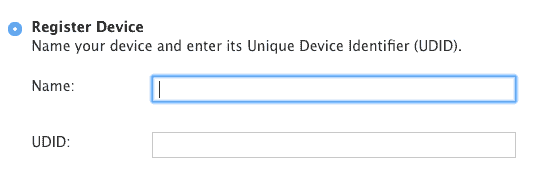
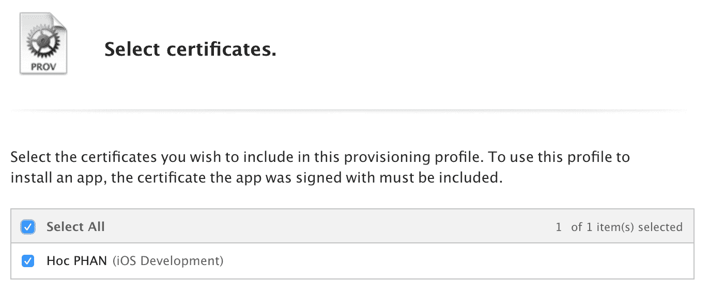
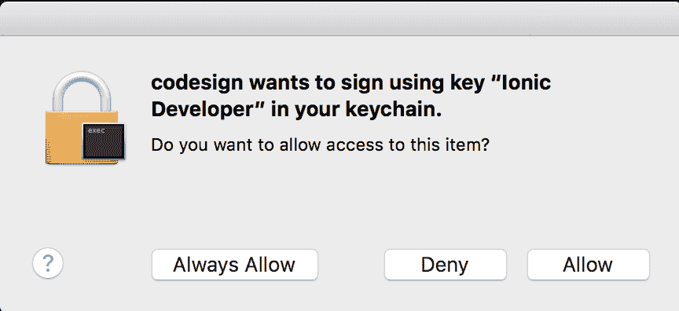

# 用户身份验证和推送通知

在本章中，我们将涵盖与身份验证用户、注册和接收推送通知消息相关的以下任务：

+   使用 Auth0 注册和验证用户

+   构建一个 iOS 应用以接收推送通知

+   构建一个 Android 应用以接收推送通知

# 简介

跟踪和吸引用户是您应用增长的关键功能。这意味着您应该能够注册和验证用户。一旦用户开始使用应用，您还需要对用户进行细分，以便您可以定制他们的互动。然后，您可以发送推送通知来鼓励用户重新访问应用。

您的项目需要使用以下两个组件：

+   **Auth0**：Auth0 是一个基于云的身份验证服务。整个想法是将您应用的认证委托给 Auth0。Auth0 支持许多框架，包括 Ionic2+，并且支持许多用于身份验证的社会提供者，如 Google 和 Facebook。更重要的是，他们拥有优秀的文档。

+   **OneSignal**：OneSignal 是一个服务，允许我们向 iOS 和 Android 发送推送通知。实际上，它支持其他平台，如 Windows、Web 推送通知、Amazon Fire 等。最好的部分是，通常我们为添加推送通知需要不同的代码。但由于 Cordova 和 OneSignal 的抽象 API，我们只需为两个平台编写一次推送通知代码。

# 使用 Auth0 注册和验证用户

**Auth0**可以提供开箱即用的用户管理和身份验证功能。Auth0 支持许多提供者。以下是 Auth0 支持的某些著名提供者：

+   电子邮件/密码

+   Facebook

+   Google

+   Twitter

+   Instagram

+   LinkedIn

+   GitHub

根据应用的不同，您可能不需要使用所有这些身份验证方法。例如，对于专注于职业人士的应用，使用 LinkedIn 身份验证可能更有意义，以缩小符合应用用户画像的受众范围。

在本章中，我们将尽可能简化身份验证概念。您将学习如何执行以下操作：

+   注册新用户

+   用户登录和登出

+   显示用户的个人资料信息

# 准备工作

您需要设备来测试应用，因为我们使用 Cordova 插件进行身份验证，这需要设备或模拟器来运行应用。

# 如何操作...

我们将有两种方法：

+   在 Auth0 仪表板中创建应用

+   编写我们的 Ionic 应用

# 在 Auth0 仪表板中创建我们的应用

在本节中，我们将学习如何在 Auth0 仪表板中创建应用。请按照以下步骤操作：

1.  前往[`auth0.com`](https://auth0.com)并创建账户。

1.  创建账户后，它将打开 Auth0 仪表板。有一个“新建应用”按钮。点击它，将打开以下对话框为你的客户端选择一个名称，并将客户端类型选择为 Native。

1.  现在，在侧边菜单仪表板中，点击“应用”并选择你创建的应用。你将看到以下页面：

    在应用中稍后需要域名和客户端 ID，所以请将它们保存在某个地方。

1.  在同一页面上，在“允许的回调 URL”输入中添加 `YOUR_PACKAGE_ID://YOUR_DOMAIN/cordova/YOUR_PACKAGE_ID/callback`。将 `YOUR_PACKAGE_ID` 替换为你的应用包 ID，`*YOUR_DOMAIN*` 是你在上一步中保存的域名。

1.  此外，在“允许的来源（CORS）”输入中添加 `file://`。

使用最新的 Ionic，他们默认使用 WKWebView 插件，该插件从本地 Web 服务器 [`localhost:8080`](https://localhost:8080) 为应用提供服务。因此，你也需要在“允许的来源（CORS）”部分中添加它。如果你不打算使用 WKWebView，则无需添加。

1.  点击“保存更改”。

# 让我们开始编码

既然我们已经在 Auth0 仪表板中创建了我们的应用，现在是时候为其编写代码了。请按照以下步骤操作：

1.  现在，使用 `blank` 模板创建一个新的 `MySimpleAuth` 应用，如下所示，并进入 `MySimpleAuth` 文件夹：

```js
$ ionic start MySimpleAuth blank $ cd MySimpleAuth
```

1.  安装 `auth0.js` 和 `auth0/cordova` npm 包，这些包是 Auth0 认证所必需的：

```js
$ npm install auth0-js @auth0/cordova --save
```

1.  我们还需要安装以下 `Cordova` 插件：

```js
$ ionic cordova plugin add cordova-plugin-safariviewcontroller

$ ionic cordova plugin add cordova-plugin-customurlscheme --variable URL_SCHEME={YOUR_PACKAGE_ID} --variable ANDROID_SCHEME={YOUR_PACKAGE_ID} --variable ANDROID_HOST={YOUR_DOMAIN} --variable ANDROID_PATHPREFIX=/cordova/{YOUR_PACKAGE_ID}/callback 
```

你应该将 `{YOUR_PACKAGE_ID}` 替换为你的应用包 ID，并将 `{YOUR_DOMAIN}` 替换为你在第三步中保存的 Auth0 域名。

1.  你还必须在 `config.xml` 中添加以下行：

```js
<preference name="AndroidLaunchMode" value="singleTask" />
```

1.  在 `./src/providers/auth/auth.ts` 创建一个文件，并使用以下代码：

```js
import { Injectable, NgZone } from '@angular/core';
import { Observable, Subscription } from 'rxjs';

import Auth0Cordova from '@auth0/cordova';
import Auth0 from 'auth0-js';

const auth0Config = {
  // needed for auth0
  clientID: 'sIQavE9jev8VXOTQkeb2Cn62m9s9faLN',

  // needed for auth0cordova
  clientId: 'sIQavE9jev8VXOTQkeb2Cn62m9s9faLN',
  domain: 'imtest.auth0.com',
  callbackURL: location.href,
  packageIdentifier: 'io.ionic.imtest'
};

@Injectable()
export class AuthProvider {
  auth0 = new Auth0.WebAuth(auth0Config);
  accessToken: string;
  idToken: string;
  user: any;

  constructor(public zone: NgZone) {
    this.user = this.getStorageVariable('profile');
    this.idToken = this.getStorageVariable('id_token');
  }

  private getStorageVariable(name) {
    return JSON.parse(window.localStorage.getItem(name));
  }

  private setStorageVariable(name, data) {
    window.localStorage.setItem(name, JSON.stringify(data));
  }

  private setIdToken(token) {
    this.idToken = token;
    this.setStorageVariable('id_token', token);
  }

  private setAccessToken(token) {
    this.accessToken = token;
    this.setStorageVariable('access_token', token);
  }

  public isAuthenticated() {
    const expiresAt = JSON.parse(localStorage.getItem('expires_at'));
    return Date.now() < expiresAt;
  }

  public login() {
    const client = new Auth0Cordova(auth0Config);

    const options = {
      scope: 'openid profile offline_access'
    };

    client.authorize(options, (err, authResult) => {
      if(err) {
        throw err;
      }

      this.setIdToken(authResult.idToken);
      this.setAccessToken(authResult.accessToken);

      const expiresAt = JSON.stringify((authResult.expiresIn * 1000) 
      + 
      new Date().getTime());
      this.setStorageVariable('expires_at', expiresAt);

      this.auth0.client.userInfo(this.accessToken, (err, profile)=> 
      {
        if(err) {
          throw err;
        }

        profile.user_metadata = profile.user_metadata || {};
        this.setStorageVariable('profile', profile);
        this.zone.run(() => {
          this.user = profile;
        });
      });
    });
  }

  public logout() {
    window.localStorage.removeItem('profile');
    window.localStorage.removeItem('access_token');
    window.localStorage.removeItem('id_token');
    window.localStorage.removeItem('expires_at');

    this.idToken = null;
    this.accessToken = null;
    this.user = null;
  }

}
```

确保在 `auth.ts` 中的 `auth0Config` 使用你自己的 `clientID`、`domain` 和 `packageIdentifier` 值。

1.  打开并编辑 `./src/app/app.module.ts`，使用以下代码：

```js
import { BrowserModule } from '@angular/platform-browser';
import { ErrorHandler, NgModule } from '@angular/core';
import { IonicApp, IonicErrorHandler, IonicModule } from 'ionic-angular';
import { SplashScreen } from '@ionic-native/splash-screen';
import { StatusBar } from '@ionic-native/status-bar';

import { MyApp } from './app.component';
import { HomePage } from '../pages/home/home';
import { AuthProvider } from '../providers/auth/auth';

@NgModule({
  declarations: [
    MyApp,
    HomePage
  ],
  imports: [
    BrowserModule,
    IonicModule.forRoot(MyApp)
  ],
  bootstrap: [IonicApp],
  entryComponents: [
    MyApp,
    HomePage
  ],
  providers: [
    StatusBar,
    SplashScreen,
    {provide: ErrorHandler, useClass: IonicErrorHandler},
    AuthProvider
  ]
})
export class AppModule {}
```

1.  编辑并替换 `./src/pages/home/home.html` 为以下代码：

```js
<ion-header>
  <ion-navbar>
    <ion-title>
      Home Page
    </ion-title>
  </ion-navbar>
</ion-header>

<ion-content padding>
    <div *ngIf="!auth.isAuthenticated()">
        <button ion-button block color="primary" (click)="auth.login()">Log In</button>
    </div>

    <div *ngIf="auth.isAuthenticated()">
      <ion-card>
        
        <ion-card-content>
          <ion-card-title>{{ auth.user.name }}</ion-card-title>
        </ion-card-content>
      </ion-card>
      <button ion-button block color="primary" 
      (click)="auth.logout()">Logout</button>
    </div>
</ion-content>
```

这些只是基本的 `login` 和 `logout` 模板。所有内容都在一个页面上，以保持简单。

1.  打开并编辑 `./src/pages/home/home.ts`，使用以下代码：

```js
import { Component } from '@angular/core';
import { NavController } from 'ionic-angular';
import { AuthProvider } from '../../providers/auth/auth';

@Component({
  selector: 'page-home',
  templateUrl: 'home.html'
})
export class HomePage {

  constructor(public navCtrl: NavController, public auth: AuthProvider) {

  }

}
```

1.  然后在设备上使用以下 CLI 命令运行此命令：

```js
$ ionic cordova run android
```

# 工作原理

在深入代码之前，有一些事情我们需要了解。

Auth0 使用**JWT**（**JSON Web Token**），这是一种通过 JSON 在双方之间共享信息的紧凑方式。简单来说，当用户认证成功后，Auth0 会发送 JWT 给我们，其中包含有关用户的信息，并允许用户访问受保护的路线/URL。Auth0 会发送一个`access_token`，这是访问受保护路线所必需的，它还会发送一个`id_token`，其中包含用户的个人资料信息，如用户名、个人资料图片等。这两个令牌都有短暂的生存期，然后它们会过期。但是，除了这些，Auth0 还会发送一个`refresh_token`，它有一个较长的有效期，可以用来获取新的`id_token`和`access_token`。

我们在我们的应用中配置了回调 URL。这是 Auth0 在认证后重定向用户的 URL。回调 URL 包括应用的包 ID，这就是为什么在安装插件时我们需要提到它。我们还需要在**CORS**（**跨源资源共享**）中添加`file://`，因为 Ionic 应用会从`file://`源发起 HTTP 请求。

如果您正在使用 Ionic 的 WKWebView。它会在应用内部运行一个本地 web 服务器。因此，您必须在 Auth0 仪表板中将 http://localhost:8080 列入 CORS 白名单。

大部分工作都在`AuthService`中。AuthService 允许我们登录/登出。它使用`auth0.js`和`auth0/cordova`库进行认证。首先，我们创建了一个`auth0Config`对象。这个对象看起来如下所示：

```js
const auth0Config = {   
    clientID: ''  
    clientId: '',   
    domain: '',   
    callbackURL: location.href,   
    packageIdentifier: '' 
};
```

+   在前面的代码中，您可以看到`clientID`和`clientId`具有相同的值。这就是我们之前保存的值。前者由`auth0.js`使用，后者由`auth0/cordova`使用。

+   `domain`也是我们用于认证的**Auth0 域**。我们在创建 Auth0 仪表板上的应用时已经保存了它。

+   `callbackURL`将始终是`location.href`。

+   `packageIdentifier`是您应用的包 ID，与您的`config.xml`中相同。

然后，我们将这个配置传递给`Auth0.WebAuth`构造函数和`Auth0Cordova`构造函数。

在`login`函数中，我们通过调用 Auth0Cordova 的`authorize`函数来启动认证。需要注意的是，我们将带有`scope`键的`option`对象作为参数传递给`authorize`函数。这个`scope`键告诉 Auth0 在认证完成后返回某些数据，如电子邮件和配置文件。我们还传递了一个回调函数作为第二个参数，该函数在认证完成后触发。当启动认证时，Auth0Cordova 打开操作系统浏览器并将我们重定向到我们的 Auth0 域。在这里，用户可以登录和注册。默认情况下，应用已配置为电子邮件/密码认证。但您也可以启用 Google、Facebook 和 GitHub 认证，它们也会与电子邮件/密码认证一起出现。当用户认证成功后，浏览器通过**自定义 URL 方案**将我们重定向到我们的应用。然后，我们在**localStorage**中存储`idToken`和`accessToken`，并使用`auth0.client.userInfo`函数获取配置文件信息。然后在登录方法中，我们也将这些信息保存到**localStorage**中。

在`logout`函数中，我们只是从 localStorage 中删除`idToken`、`accessToken`、令牌过期信息和配置文件数据，并重置 AuthService 类。

在`home.html`中，当用户未认证时，我们显示一个登录按钮；当用户认证后，我们显示用户的配置文件图片和用户名，以及 LOGOUT 按钮。这些在`home.ts`中的`login`和`logout`方法分别调用`AuthService`的登录和注销函数。

这是用户未认证时我们的应用看起来是这样的：


当用户点击时，它打开一个用于认证用户的网页。它看起来如下：


这是用户认证后我们的应用看起来是这样的：


# 还有更多...

您可以使用 Auth0 来保护您的自定义后端，并使用`angular2-jwt`库在 Ionic 应用中访问后端。请参阅[`github.com/auth0/angular2-jwt`](https://github.com/auth0/angular2-jwt)。

# 构建 iOS 应用以接收推送通知

**推送通知**是一个重要的功能，可以频繁地吸引用户，尤其是在用户没有使用应用的时候。许多人下载了应用，但只打开了几次。如果您向他们发送推送通知消息，这将鼓励他们打开应用参与新的活动。如果您必须从头开始构建一切，实现推送通知非常复杂；然而，OneSignal 使它变得非常简单。推送通知提供者是一个可以与**苹果推送通知服务（APNs**）或谷歌的**Firebase 云消息（FCM**）通信的服务器。您可以使用现有的开源软件设置自己的提供者服务器，但您必须单独维护此服务器并跟上 APN API 的潜在变化。

在本节中，您将学习以下内容：

+   为 iOS 推送通知设置 OneSignal

+   配置 iOS 应用、证书（应用和推送）以及配置文件

+   编写代码以接收推送通知

# 准备工作

为了测试通知消息，需要有一个可用的物理 iOS 设备。

您还必须注册**苹果开发者计划（ADP**），以便访问[`developer.apple.com`](https://developer.apple.com)和[`itunesconnect.apple.com`](https://itunesconnect.apple.com)，因为这些网站将需要经过批准的账户。

此外，您还需要拥有苹果 Mac 和已安装的 Xcode。

# 如何操作

您需要设备来查看推送通知。我们将分多步进行：

+   创建苹果签名证书

+   添加设备和创建配置文件

+   为 OneSignal 仪表板创建推送证书

+   在 OneSignal 仪表板中配置应用

+   编写应用程序代码

# 让我们创建一个苹果签名证书

按照说明创建苹果签名证书：

1.  访问**苹果开发者**网站[`developer.apple.com`](https://developer.apple.com)并使用您的凭据登录。

1.  点击**证书、标识符和配置文件**，如图所示：

    

1.  选择您要针对的正确设备平台。在本例中，它将是 iOS、tvOS、watchOS，如下面的截图所示：

1.  导航到**标识符** | **应用 ID**以创建应用 ID，如图所示：


1.  点击屏幕右上角的加号（**+**），如图所示：


1.  填写表格以注册您的应用 ID。`名称`字段可以是任何内容。您可以为您的项目（即`MyiOSPush`）提供名称以保持简单，如图所示：


1.  在这里您需要正确完成的重要部分是**包标识符**，因为它必须与`./config.xml`文件或 Xcode 中的包标识符匹配，如图所示：


1.  要启用推送通知，您需要在以下页面上的**推送通知**服务上勾选：


1.  选择**注册**，如图所示：


1.  选择**完成**以完成创建应用 ID 的步骤，如下所示：


1.  要开始创建证书，您需要在您的 Mac OSX 上使用**钥匙串访问**生成证书签名请求文件。在左上角菜单中导航到钥匙串访问，然后导航到证书助手 | 从证书颁发机构请求证书...，如图所示：


1.  输入您的用户电子邮件地址和通用名称。留空 CA 电子邮件地址字段并勾选保存到磁盘，如图所示：

1.  保存您的`CertificateSigningRequest.certSigningRequest`文件，如下所示：

1.  导航到**苹果开发者**网站，然后导航到证书 | 所有，如图所示：

1.  在右上角点击加号（**+**）按钮以开始创建证书，

    如下所示：

1.  现在，您只需按照网站上的步骤填写必要的信息。在此示例中，您将选择开发版本而不是生产版本，如图所示：

1.  点击继续按钮，操作如下：

1.  点击如图所示的“选择文件...”按钮，上传您之前保存的签名请求文件：

1.  点击如图所示的继续按钮，以继续操作：

1.  点击下载按钮以下载您的 iOS 开发证书文件：

1.  点击您下载的`.cer`文件，如图所示，以便将其导入钥匙串访问：

非常重要的是要记住，您必须在 Mac 上安装签名证书，因为当您构建应用时，它将用于签名应用。只需双击下载的`.cer`文件即可安装它。

# 添加设备和创建配置文件

1.  如果您需要将应用推送到特定设备，您必须注册该设备。转到设备 | 所有设备：

1.  点击加号（**+**）按钮：

1.  为设备提供一个 UDID 并保存以注册设备。观察以下截图:

1.  你需要一个配置文件。导航到配置文件 | 所有：

1.  点击加号（**+**）按钮:

1.  选择 iOS 应用开发作为你的配置文件，因为此示例仅针对开发版本：

1.  点击继续按钮：


1.  在下拉菜单中选择正确的应用程序标识符，并保存以完成配置文件创建:


1.  点击继续按钮：


1.  选择你之前创建的 iOS 开发证书，如图所示：



1.  如上图所示，选择至少一个你想要安装应用程序进行测试的设备：


1.  为你的配置文件提供一个**配置文件名称**，如图所示:

1.  点击下载按钮以下载配置文件文件（即 `MyiOSPush_Provisioning_Profile.mobileprovision`）:

    

1.  点击你刚刚下载的 `MyiOSPush_Provisioning_Profile.mobileprovision`，以便将其导入到 Xcode 中:

此步骤非常重要，因为如果你没有将其导入到 Xcode 中，你的应用程序将无法成功构建。如果你的应用程序因为无效的配置文件而无法构建，最好在开发者控制台中检查配置文件的状态。

# 创建推送证书

按照步骤为 iOS 应用程序创建推送证书：

1.  要启用推送通知功能，你必须请求推送证书，这与应用程序证书不同。选择你之前创建的应用程序标识符（即 `MyiOSPush`）:

1.  点击页面底部的编辑按钮:

推送通知必须显示可配置状态。否则，你的应用程序将无法使用推送通知。

1.  在 **推送通知 | 开发 SSL 证书**部分下点击创建证书...按钮:


1.  你将被带到新页面以创建你的 CSR 文件。点击继续按钮：


1.  点击选择文件...按钮：


1.  定位你之前创建的 `CertificateSigningRequest.certSigningRequest` 文件：


您必须上传与应用证书相同的 `.certSigningRequest` 文件。否则，您的应用将无法接收推送通知，调试起来非常困难。

1.  点击继续按钮：


1.  点击下载按钮下载证书文件。您可以将其命名为 `aps_certificate.cer` 以避免覆盖之前的 `.cer` 文件：


1.  下载完 `.cer` 文件后，您需要点击它将其导入到 **钥匙串访问**：


1.  在钥匙串访问中找到新的推送服务证书并选择它，如图所示：


1.  右键单击证书并选择导出：

    

1.  给它一个新的名称以避免覆盖应用证书。这个过程基本上是将 `.cer` 文件转换为 `.p12` 文件用于 OneSignal：


1.  为此 `.p12` 文件提供密码以保护它：

对于 OneSignal，`.p12` 文件的密码不是必需的，但出于最佳安全考虑，最好保护它。

# 现在，让我们配置 OneSignal

按照以下步骤配置 OneSignal 以发送推送通知：

1.  访问 [`onesignal.com`](https://onesignal.com) 并创建一个账户。

1.  在仪表板中，点击“添加新应用”。您将看到以下对话框：


1.  填入您想要的名称并点击创建。它将打开以下对话框：


1.  选择 **Apple iOS** 并点击下一步。您将看到以下内容：


1.  选择上传可选沙盒证书并上传您之前创建的 **推送证书** 的 `.p12` 文件。同时，填写 `.p12` 文件的密码。然后点击保存。

1.  现在在顶部主菜单中，点击“密钥与 ID”。您将看到 OneSignal 应用 ID，如下所示：

    

将 OneSignal 应用 ID 记录下来；我们需要这个信息来配置我们的应用。

# 让我们开始编码

按照以下步骤创建示例应用：

1.  现在，使用 `blank` 模板创建一个新的 `MyiOSPush` 应用，如图所示，并转到 `MyiOSPush` 文件夹：

```js
$ ionic start MyiOSPush blank
$ cd MyiOSPush
```

1.  安装 Cordova 插件和 **Ionic Native** 包装器以支持 **OneSignal**：

```js
$ ionic cordova plugin add onesignal-cordova-plugin
$ npm install --save @ionic-native/onesignal
```

我们需要将此 `ionic-native` 插件添加到 `app.module.ts`。

1.  我们还需要安装 `cocoapods`。转到 **终端**，并按照以下方式安装：

```js
sudo gem install cocoapods
pod repo update
```

1.  使用以下内容打开并编辑 `./src/app/app.module.ts`：

```js
import { BrowserModule } from '@angular/platform-browser';
import { ErrorHandler, NgModule } from '@angular/core';
import { IonicApp, IonicErrorHandler, IonicModule } from 'ionic-angular';
import { SplashScreen } from '@ionic-native/splash-screen';
import { StatusBar } from '@ionic-native/status-bar';
import { OneSignal } from '@ionic-native/onesignal';

import { MyApp } from './app.component';
import { HomePage } from '../pages/home/home';

@NgModule({
  declarations: [
    MyApp,
    HomePage
  ],
  imports: [
    BrowserModule,
    IonicModule.forRoot(MyApp)
  ],
  bootstrap: [IonicApp],
  entryComponents: [
    MyApp,
    HomePage
  ],
  providers: [
    StatusBar,
    SplashScreen,
    OneSignal,
    {provide: ErrorHandler, useClass: IonicErrorHandler}
  ]
})
export class AppModule {}
```

1.  您需要修改主页代码以接收通知消息。打开并编辑 `./src/pages/home/home.html` 并粘贴给定的代码：

```js
<ion-header>
  <ion-navbar>
    <ion-title>
      Push Notification
    </ion-title>
  </ion-navbar>
</ion-header>

<ion-content padding>
  <h2 class="big-square" *ngIf="!this.messages.length">
    You have no message
  </h2>
  <h3 class="sub-title" *ngIf="!!this.messages.length">
    Your messages
  </h3>
  <ion-card *ngFor="let msg of messages">
    <ion-card-header>
      {{ msg.title }}
    </ion-card-header>
    <ion-card-content>
      {{ msg.text }}
    </ion-card-content>
  </ion-card>
</ion-content>
```

1.  将同一文件夹中的 `home.ts` 文件的内容替换为以下代码：

```js
import { Component, ChangeDetectorRef } from '@angular/core';
import { NavController, Platform } from 'ionic-angular';
import { OneSignal } from '@ionic-native/onesignal';

@Component({
  selector: 'page-home',
  templateUrl: 'home.html'
})
export class HomePage {
  public messages = [];
  public clicked: Boolean = false;
  constructor(public navCtrl: NavController, public oneSignal: OneSignal, platform: Platform, private changeDetector: ChangeDetectorRef) {
    platform.ready().then(() => {
      this.oneSignalConfig();
    });
  }

  oneSignalConfig() {
    this.oneSignal.startInit("94218e7a-2307-41fa-9bc3-20783b4cde9a");

    this.oneSignal.handleNotificationReceived().subscribe((value:any) => {
      let msg = value.payload;
      this.messages.push({
        title: msg.title,
        text: msg.body
      });
      this.changeDetector.detectChanges();
    });
    this.oneSignal.endInit();
  }
}
```

在 `startInit` 函数中，您必须传递您自己的 **OneSignal 应用 ID**，这是您之前创建的。

1.  将 `/home` 文件夹中的 `home.scss` 替换为给定的代码：

```js
page-home {
    .center {
        text-align: center;
    }
    h2.big-square {
        text-align: center;
        padding: 50px;
        color: #D91E18;
        background: #F9BF3B;
    }
    h3.sub-title {
        text-align: center;
        padding: 10px;
        color: #446CB3;
        background: #E4F1FE;
    }
    ion-card ion-card-header {
        padding: 10px 16px;
        background: #F9690E;
        color: white;
    }
    ion-card ion-card-header + ion-card-content,
    ion-card .item + ion-card-content {
        padding-top: 16px;
    }
}
```

1.  通过 USB 连接将您的物理 iPhone 连接到 Mac。

1.  确保您位于应用文件夹中，并按照以下步骤为 iOS 平台构建应用：

```js
$ ionic cordova run ios 
```

1.  操作系统将提示允许 codesign 使用 iOS 开发者证书进行签名。您必须接受此提示以允许访问，以便构建应用并将其上传到设备：



1.  验证应用是否在设备上成功运行。在此阶段，您已经完成了推送通知的设置和编码。下一步是通过 **OneSignal 控制台**发送推送通知。以下是说明：

1.  在 OneSignal 中选择您的应用后，您将看到以下侧边菜单：


1.  点击 **新建消息**。您将看到一个如下所示的屏幕：


1.  选择 **发送给所有人**，因为在这个阶段只有您会使用这个应用。然后点击 **下一步**。将出现以下页面：

1.  输入您的标题和消息。

1.  在顶部菜单中，您将看到以下链接。此时，我们处于 **消息**：

1.  如果您想进行一些配置和调度，您可以在以下部分进行。否则，您可以跳转到 **确认** 链接，您将在页面右上角看到以下按钮：

1.  只需点击 **发送消息**，OneSignal 就会将您的推送通知发送出去。

# 它是如何工作的

为了理解整个流程是如何工作的，让我们总结一下您所做的工作，如下所示：

通过以下步骤设置您的 Apple 开发者账户：

+   创建应用 ID

+   创建应用证书（在通过 Keychain Access 本地创建签名请求之后）

+   创建配置文件

+   创建推送证书

设置您的 OneSignal 应用

现在，让我们专注于编码部分本身，以了解它是如何工作的。

在 `NgModul` 中，我们在 providers 数组中添加了一个 **Ionic Native** 包装器用于 OneSignal。

然后，在 `home.ts` 中，我们在构造函数中通过调用 `oneSignalConfig()` 函数初始化 OneSignal。在 `oneSignalConfig()` 函数中，我们调用了 `startInit` 函数，该函数启动了推送通知注册过程。我们必须向此函数传递一个 OneSignal 应用 ID。然后，我们订阅了 `handleNotificationReceived` 可观察对象。每当用户收到通知时，它都会被触发。在其中，我们将每个接收到的推送通知推入 `this.messages` 数组，然后使用 `endInit` 函数停止初始化过程，如下面的代码所示：

```js
 oneSignalConfig() {
    this.oneSignal.startInit("94218e7a-2307-41fa-9bc3-20783b4cde9a");

    this.oneSignal.handleNotificationReceived().subscribe((value:any) => {
      let msg = value.payload;
      this.messages.push({
        title: msg.title,
        text: msg.body
      });
      this.changeDetector.detectChanges();
    });
    this.oneSignal.endInit();
  }
```

调用变更检测器的`detectChanges`函数非常重要，否则由于这个过程超出了 Angular 的变更检测范围，UI 将不会更新。

在`home.html`模板中，消息将通过`messages`对象显示，如下面的代码所示：

```js
<ion-card *ngFor="let msg of messages"> 
  <ion-card-header> 
    {{ msg.title }} 
  </ion-card-header> 
  <ion-card-content> 
    {{ msg.text }} 
  </ion-card-content> 
</ion-card>
```

在这里，每个`message`项都有`title`和`text`字段。

如果用户没有打开应用，你将看到通知出现在通知区域。

这就是应用在 iPhone 上的样子：


# 还有更多...

关于 APNs 的更多信息，您可以访问官方文档[`developer.apple.com/library/content/documentation/NetworkingInternet/Conceptual/RemoteNotificationsPG/APNSOverview.html`](https://developer.apple.com/library/content/documentation/NetworkingInternet/Conceptual/RemoteNotificationsPG/APNSOverview.html)。

关于 OneSignal 设置的更多信息，请查看[`onesignal.com/ionic`](https://onesignal.com/ionic)。

# 构建一个用于接收推送通知的 Android 应用

推送通知在 Google 上与 iOS 的工作方式相同；然而，您将不会使用 Apple 通知服务，而是通过 FCM 服务器进行操作，这是**Google Cloud Messaging**（**GCM**）的新替代品。但是 OneSignal 抽象了这个过程，因此您不需要使用不同的 API 进行编码。您将使用与 iOS 应用相同的推送对象。

关于 FCM 和 GCM 之间差异的更多信息，请访问[`firebase.google.com/support/faq`](https://firebase.google.com/support/faq)的常见问题解答。

在本节中，您将学习以下内容：

+   设置 OneSignal 以接收 Android 推送通知

+   配置 Firebase 项目以使用推送 API

+   编写代码以在 Android 上接收推送通知

您将使用与 iOS 推送通知示例相同的代码库。主要区别在于在您的 Firebase 和 OneSignal 账户中设置的过程。

# 准备工作

您可以使用 Android 模拟器测试 Android 推送通知。因此，您不需要有物理 Android 设备。

为了获得访问权限，您还必须在[`console.firebase.google.com`](https://console.firebase.google.com)注册 Firebase。

除了您当前的设置外，您还需要安装**Android Studio**。

1.  观察以下截图：

[链接](https://software.intel.com/en-us/android/articles/installation-instructions-for-intel-hardware-accelerated-execution-manager-windows)

1.  Android SDK 工具、构建工具、平台工具和英特尔**硬件加速执行管理器**（**HAXM**）([`software.intel.com/en-us/android/articles/installation-instructions-for-intel-hardware-accelerated-execution-manager-windows`](https://software.intel.com/en-us/android/articles/installation-instructions-for-intel-hardware-accelerated-execution-manager-windows))。观察以下截图：


1.  至少已创建一个**Android 虚拟设备**（**AVD**）（使用**`$ android avd`**命令行打开 AVD 管理器）。观察以下截图：


# 如何操作

首先，我们将在 Firebase 控制台中配置推送通知，然后我们将编写示例应用。

# 配置 Firebase 以推送通知

这里是配置 Firebase 控制台的说明：

1.  您需要一个 Firebase 项目编号和一个 Firebase 服务器 ID 以接收推送通知。首先，让我们登录到 Firebase 控制台[`console.firebase.google.com`](https://console.firebase.google.com)。

1.  点击**创建新项目**按钮，并填写项目名称（即`MyAndroidPush`）：


1.  在左侧导航菜单中导航到**增长 | 通知**：


1.  选择 Android 图标：


FCM 服务也支持 iOS 应用。因此，您可能可以在 iOS 和 Android 项目中都使用 FCM。

1.  在表格中提供**包名**。您可以从应用项目的`./config.xml`中复制并粘贴包名：


1.  选择**继续**，并将 JSON 文件保存到某个位置。您不需要在 Ionic 项目中使用此 JSON 文件：


1.  点击**完成**按钮以完成通知服务的设置：

1.  现在，您将需要服务器密钥和发送者 ID。导航到左上角的齿轮图标，并选择项目设置菜单项：

1.  选择**云消息**选项卡：

    . 

1.  复制**服务器密钥**和发送者 ID（如果使用 GCM，则与项目 ID 相同）：

# 配置 OneSignal

这里是配置 OneSignal 的说明：

1.  在您的**OneSignal 仪表板**中，打开之前创建的 iOS 应用，然后点击**应用设置**。您将看到以下页面：


1.  点击与**Google Android 平台**平行的**配置**按钮。您将看到以下对话框：


1.  将**服务器 API 密钥**和**项目编号**（也称为**发送者 ID**）输入到相应的字段中，然后点击**保存**。

# 让我们开始编码

下面是创建示例应用的说明：

1.  使用`blank`模板创建一个新的`MyAndroidPush`应用，如下所示，然后进入`MyAndroidPush`文件夹：

```js
$ ionic start MyAndroidPush blank
$ cd MyAndroidPush
```

1.  安装 Cordova 插件和 OneSignal 的 Ionic 原生包装器：

```js
$ ionic cordova plugin add onesignal-cordova-plugin
$ npm install --save @ionic-native/onesignal
```

1.  使用以下内容打开并编辑`./src/app/app.module.ts`：

```js
import { BrowserModule } from '@angular/platform-browser';
import { ErrorHandler, NgModule } from '@angular/core';
import { IonicApp, IonicErrorHandler, IonicModule } from 'ionic-angular';
import { SplashScreen } from '@ionic-native/splash-screen';
import { StatusBar } from '@ionic-native/status-bar';
import { OneSignal } from '@ionic-native/onesignal';

import { MyApp } from './app.component';
import { HomePage } from '../pages/home/home';

@NgModule({
  declarations: [
    MyApp,
    HomePage
  ],
  imports: [
    BrowserModule,
    IonicModule.forRoot(MyApp)
  ],
  bootstrap: [IonicApp],
  entryComponents: [
    MyApp,
    HomePage
  ],
  providers: [
    StatusBar,
    SplashScreen,
    OneSignal,
    {provide: ErrorHandler, useClass: IonicErrorHandler}
  ]
})
export class AppModule {}
```

1.  你的主页代码与 iOS 推送示例非常相似。打开并编辑`./src/pages/home/home.html`，并粘贴以下代码：

```js
<ion-header>
  <ion-navbar>
    <ion-title>
      Push Notification
    </ion-title>
  </ion-navbar>
</ion-header>

<ion-content padding>
  <h2 class="big-square" *ngIf="!this.messages.length">
    You have no message
  </h2>
  <h3 class="sub-title" *ngIf="!!this.messages.length">
    Your messages
  </h3>
  <ion-card *ngFor="let msg of messages">
    <ion-card-header>
      {{ msg.title }}
    </ion-card-header>
    <ion-card-content>
      {{ msg.text }}
    </ion-card-content>
  </ion-card>
</ion-content>
```

1.  将同一文件夹中的`home.ts`文件的内容替换为以下代码：

```js
import { Component, ChangeDetectorRef } from '@angular/core';
import { NavController, Platform } from 'ionic-angular';
import { OneSignal } from '@ionic-native/onesignal';

@Component({
  selector: 'page-home',
  templateUrl: 'home.html'
})
export class HomePage {
  public messages = [];
  public clicked: Boolean = false;
  constructor(public navCtrl: NavController, public oneSignal: OneSignal, platform: Platform, private changeDetector: ChangeDetectorRef) {
    platform.ready().then(() => {
      this.oneSignalConfig();
    });
  }

  oneSignalConfig() {
    this.oneSignal.startInit("94218e7a-2307-41fa-9bc3-20783b4cde9a", "539293856976");
    this.oneSignal.handleNotificationReceived().subscribe((value:any) => {
      // do something when notification is received
      let msg = value.payload;
      this.messages.push({
        title: msg.title,
        text: msg.body
      });
      this.changeDetector.detectChanges();
    });
    this.oneSignal.endInit();
  }
} 
```

如果你注意到了，对于 Android，`startInit`的调用有两个参数而不是一个参数。第一个参数是**OneSignal App ID**，第二个参数是**Google 项目编号/发送者 ID**。

1.  将`home.scss`替换为以下代码，同样在`/home`文件夹中：

```js
page-home {
 .center {
     text-align: center;
 }
 h2.big-square {
     text-align: center;
     padding: 50px;
     color: #D91E18;
     background: #F9BF3B;
 }
 h3.sub-title {
     text-align: center;
     padding: 10px;
     color: #446CB3;
     background: #E4F1FE;
 }
 ion-card ion-card-header {
     padding: 10px 16px;
     background: #F9690E;
     color: white;
 }
 ion-card ion-card-header + ion-card-content,
 ion-card .item + ion-card-content {
     padding-top: 16px;
 }
}
```

1.  确保你处于应用文件夹中，并按照以下方式为 Android 平台构建：

```js
$ ionic cordova run android
```

发送推送通知的过程与 iOS 完全相同。

# 它是如何工作的

这个过程几乎与 iOS 相同。原因是 OneSignal 为我们抽象了很多东西。不同之处在于，它现在不是向 APNS 发送推送通知请求，而是向 Google 的 FCM 服务器发送推送通知请求。然后，它将推送通知转发到实际设备。

你将在 Android 手机上看到如下通知：


默认情况下，它将使用应用图标作为通知图标，但你可以为 Android 自定义它。查看[`documentation.onesignal.com/docs/customize-notification-icons`](https://documentation.onesignal.com/docs/customize-notification-icons)。在 iOS 上，你不能自定义图标。

当你打开应用时，你将看到如下通知：


# 还有更多...

关于**Firebase 通知**服务的更多信息，你可以访问官方文档[`firebase.google.com/docs/cloud-messaging/`](https://firebase.google.com/docs/cloud-messaging/)。
