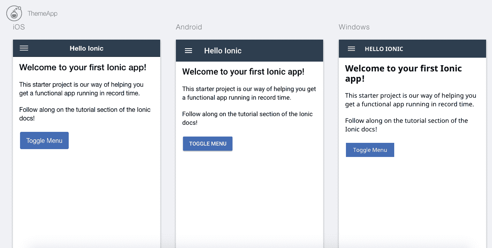
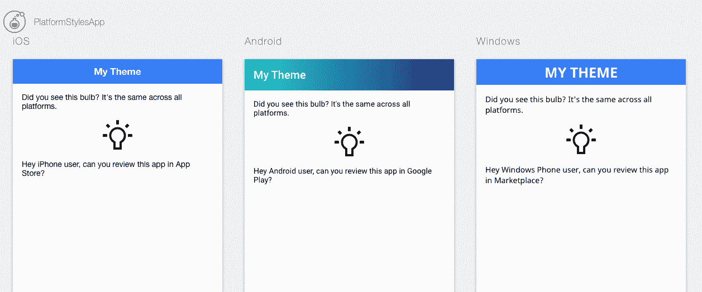
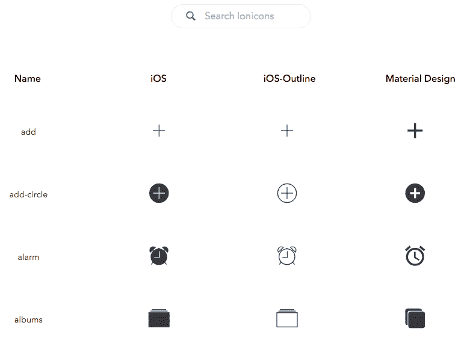
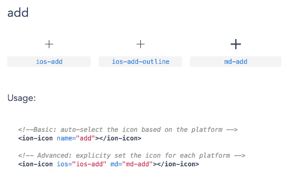
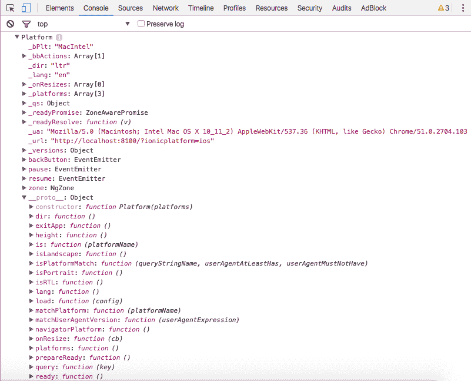

# 应用主题

在本章中，我们将介绍与应用主题自定义相关的以下任务：

+   查看和调试特定平台的主题

+   根据平台自定义主题

# 简介

虽然 Ionic 自带一些默认主题，但你可能还想进一步自定义应用的外观和感觉。有以下几种方法：

+   在 Sass 文件中更改样式表

+   在 JavaScript 中检测特定平台的数据类型（iOS、Android、Windows）并应用自定义类或 AngularJS 条件

上述两种方法中的任何一种都应该有效，但强烈建议在构建应用之前，在 Sass 文件中应用自定义，以实现最佳渲染性能。

# 查看和调试特定平台的主题

开发应用时最大的挑战之一是确保每个平台都有期望的外观和感觉。具体来说，你希望编写一次代码和主题，就能在所有平台上正常工作。另一个挑战是每天都要确定工作流程，从编写代码并在浏览器中预览到将应用部署到设备进行测试。你希望尽量减少不必要的步骤。如果你必须为每个移动平台独立重建应用并测试，这无疑是非常困难的。

Ionic CLI 提供了无缝集成，以改善你的工作流程，确保你可以提前 *捕捉* 到每个平台的所有问题。你可以在同一个浏览器窗口中快速查看各种平台的应用。这个功能非常强大，因为现在你可以对每个屏幕进行并排比较，并具有特定的交互。如果你想调试 JavaScript 代码，你可以使用在浏览器中一直使用的相同网页开发者工具。这种能力将为你节省大量时间，而不是等待将应用推送到物理设备，如果你的应用变得更大，这可能需要几分钟。

在这个示例中，你将学习如何使用 Sass 变量快速修改主题。然后，你将运行应用并检查不同平台的 UI 一致性。

# 准备工作

没有必要在物理设备上测试主题，因为 Ionic 可以在浏览器中渲染 iOS、Android 和 Windows Phone。

# 如何操作...

下面是操作步骤：

1.  使用如图所示的 `tutorial` 模板创建一个新的应用，然后进入文件夹：

```js
$ ionic start ThemeApp tutorial
$ cd ThemeApp
```

在 Ionic 1 中，你需要设置 Sass 依赖项，因为 Ionic 使用了大量的外部库。然而，Ionic 没有这样的要求，因为所有依赖项都是在创建项目时添加的。

1.  打开 `.../src/theme/variable.scss` 文件，并用以下命令替换 `$colors` 变量：

```js
    $colors: (
      primary:    #2C3E50, // #387ef5,
      clear:      white,
      secondary:  #446CB3, // #32db64,
      danger:     #96281B, // #f53d3d,
      light:      #BDC3C7, // #f4f4f4,
      dark:       #6C7A89, // #222,
      favorite:   #16A085 // #69BB7B
    );
```

默认颜色代码可以像前面代码中那样注释掉。

1.  打开 `app.html` 文件，并将 `clear` 属性添加到以下代码块中：

```js
  <ion-toolbar clear> 
    <ion-title>Pages</ion-title> 
  </ion-toolbar> 
```

1.  打开 `./src/pages/hello-ionic/hello-ionic.html` 文件，并用给定的代码替换其内容：

```js
<ion-header> 
  <ion-navbar color="primary"> 
    <button ion-button menuToggle> 
      <ion-icon name="menu"></ion-icon> 
    </button> 
    <ion-title>Hello Ionic</ion-title> 
  </ion-navbar> 
</ion-header> 

<ion-content padding class="getting-started"> 

  <h3>Welcome to your first Ionic app!</h3> 

  <p> 
    This starter project is our way of helping you get a functional app running in record time. 
  </p> 
  <p> 
    Follow along on the tutorial section of the Ionic docs! 
  </p> 
  <p> 
    <button ion-button color="secondary" menuToggle>Toggle Menu</button> 
  </p> 

</ion-content> 

```

1.  在浏览器中测试运行应用，你应该能看到一个屏幕，如下所示：

```js
$ ionic serve -l
```

`-l`（lima）命令表示为所有三个平台渲染应用。



# 它是如何工作的...

Ionic 使得为不同平台开发和使用测试主题变得非常容易。你的典型流程是首先修改 `variables.scss` 中的主题变量。你不应该直接修改任何 `.css` 文件。此外，Ionic 项目现在确保你不会意外地编辑错误的核心理念文件，因为这些核心文件不再位于应用文件夹位置。

要更新默认颜色，你只需修改 `variables.scss` 中的颜色代码即可。你甚至可以添加更多颜色名称，例如 `clear: white`，Ionic 会自动处理其余部分。这意味着 `clear` 关键字可以作为值到颜色的属性在任何接受颜色属性的 Ionic 元素上使用。以下是一些示例：

```js
<ion-navbar color="primary"> 
<button ion-button color="secondary" menuToggle> 
<ion-toolbar color="clear"> 
```

Ionic CLI 是一个非常有用的工具，可以帮助你在不同平台上调试主题。要获取有关如何使用 Ionic CLI 的帮助，你可以在控制台中输入以下命令行：

```js
$ ionic -h
```

这将列出所有可用的选项供你选择。在 `serve` 选项下，你应该熟悉一些重要功能，如下所示：

| **参数** | **描述** |
| --- | --- |
| `--consolelogs | -c` | 将应用控制台日志打印到 Ionic CLI |
| `--serverlogs | -s` | 将开发服务器日志打印到 Ionic CLI |
| `--browser | -w` | 指定要使用的浏览器（Safari、Firefox 和 Chrome） |
| `--browseroption | -o` | 指定要打开的路径（`/#/tab/dash`） |
| `--lab | -l` | 在多个屏幕尺寸和平台类型上测试你的应用 |

# 还有更多...

你可以通过访问 Matheus Cruz Rocha 的克隆存储库来获取更多调色板：[`github.com/innovieco/ionic-flat-colors`](https://github.com/innovieco/ionic-flat-colors)。

# 根据平台定制主题

每个移动平台供应商都有自己的设计指南。本节将介绍一个典型的开发、查看、调试和针对 iOS、Android 和 Windows 手机应用主题的不同工作流程的示例。在传统开发（使用本地语言或其他混合应用解决方案）中，你必须为每个平台维护单独的存储库以定制主题。从长远来看，这可能会非常低效。

Ionic 有许多内置功能来支持基于检测到的平台进行主题更改。通过为每个平台分离 Sass 变量，它使得操作非常方便。这将消除许多不必要的定制。作为开发者，你更愿意专注于应用体验而不是花时间管理平台。

本节中的示例涵盖了使用 Sass 和 JavaScript 的两种可能的定制。以下截图显示了具有不同标题栏颜色和文本的 iOS、Android 和 Windows 应用：



# 准备工作

没有必要在物理设备上测试主题，因为 Ionic 可以在浏览器中渲染所有三个平台。

# 如何做到这一点...

这里是说明：

1.  使用 `blank` 模板创建一个新应用，并进入项目文件夹：

```js
$ ionic start PlatformStylesApp blank
$ cd PlatformStylesApp
```

1.  打开 `./src/app/app.module.ts` 文件，将整个主体替换为

    以下：

```js
import { NgModule } from '@angular/core'; 
import { IonicApp, IonicModule } from 'ionic-angular'; 
import { MyApp } from './app.component'; 
import { HomePage } from '../pages/home/home'; 

@NgModule({ 
  declarations: [ 
    MyApp, 
    HomePage 
  ], 
  imports: [ 
    IonicModule.forRoot(MyApp, { 
      backButtonText: 'Go Back', 
      iconMode: 'md', 
      modalEnter: 'modal-slide-in', 
      modalLeave: 'modal-slide-out', 
      tabbarPlacement: 'bottom', 
      pageTransition: 'ios', 
    }) 
  ], 
  bootstrap: [IonicApp], 
  entryComponents: [ 
    MyApp, 
    HomePage 
  ], 
  providers: [] 
}) 
export class AppModule {} 
```

这个例子扩展了 Ionic Bootstrap 的使用，现在将进行讨论。

1.  打开 `./src/pages/home/home.ts` 并将代码替换为以下：

```js
import { Component } from '@angular/core';
import { Platform } from 'ionic-angular';
import { NavController } from 'ionic-angular';
@Component({
  selector: 'page-home',
  templateUrl: 'home.html'
})
export class HomePage {
  platform: any;
  isIOS: Boolean;
  isAndroid: Boolean;
  isWP: Boolean;
  constructor(private navController: NavController, platform:
    Platform) {
    this.platform = platform;
    this.isIOS = this.platform.is('ios');
    this.isAndroid = this.platform.is('android');
    this.isWP = this.platform.is('windows');
    console.log(this.platform);
  }
}
```

1.  打开 `./src/pages/home/home.html` 文件，将模板更改为：

```js
<ion-header>
  <ion-navbar primary [ngClass]="{'large-center-title': isWP}">
    <ion-title>
      My Theme
    </ion-title>
  </ion-navbar>
</ion-header>
<ion-content padding>
  Did you see this bulb? It's the same across all platforms.
  <p class="center">
    <ion-icon class="large-icon" name="bulb"></ion-icon>
  </p>
  <p *ngIf="isIOS">
    Hey iPhone user, can you review this app in App Store?
  </p>
  <p *ngIf="isAndroid">
    Hey Android user, can you review this app in Google Play?
  </p>
  <p *ngIf="isWP">
    Hey Windows Phone user, can you review this app in Marketplace?
  </p>
</ion-content>
```

这是应用唯一的模板，但它的 UI 将根据检测到的平台而有所不同。

1.  将 `./src/pages/home/home.scss` 替换为以下样式表：

```js
page-home {
    .large-icon {
        font-size: 60px;
    }
    .center {
        text-align: center;
    }
    .header .toolbar[primary] .toolbar-background {
        background: #1A2980;
        background: -webkit-linear-gradient(right, #1A2980, 
        #26D0CE);
        background: -o-linear-gradient(right, #1A2980, #26D0CE);
        background: linear-gradient(to left, #1A2980, #26D0CE);
    }
    .large-center-title {
        text-align: center;
        .toolbar-title {
            font-size: 25px;
        }
    }
}
```

没有必要更改全局变量。因此，你只需修改一个页面的样式。目的是展示为每个平台定制的功能。

1.  使用以下命令在浏览器中测试运行应用：

```js
$ ionic serve -l
```

# 它是如何工作的...

Ionic 自动创建了平台特定的父类，并将它们放在 `<body>` 标签中。iOS 应用将包含 `.ios` 类。Android 应用将包含 `.md` 类。因此，对于样式表定制，你可以利用这些现有的类来改变应用的外观和感觉。

ionic 文档在 [`ionicframework.com/docs/v2/theming/platform-specific-styles/`](http://ionicframework.com/docs/v2/theming/platform-specific-styles/) 列出了所有平台模式和配置属性。

| **平台** | **模式** | **详情** |
| --- | --- | --- |
| iPhone/iPad/iPad | ios | iOS 样式用于所有苹果产品 |
| Android | md | md 代表 **Material Design**，因为这是 Android 设备的默认设计 |
| Windows Phone | wp | 在 Cordova 或 Electron 内的任何 Windows 设备上查看都使用 Windows 样式 |
| 核心 | md | 对于所有其他平台，默认为 Material Design |

首先，让我们看看来自 Ionic Angular 的 Ionic Bootstrap 类。你在 `app.module.ts` 文件中声明了它：

```js
IonicModule.forRoot(MyApp, { 
    backButtonText: 'Go Back', 
    iconMode: 'md', 
    modalEnter: 'modal-slide-in', 
    modalLeave: 'modal-slide-out', 
    tabbarPlacement: 'bottom', 
    pageTransition: 'ios', 
}) 
```

这条语句基本上指示应用使用 `MyApp` 对象进行引导。第二个参数是你可以注入自定义配置属性的地方。所有配置属性列表在 [`ionicframework.com/docs/v2/api/config/Config/`](http://ionicframework.com/docs/v2/api/config/Config/)。

这里要指出的一点是 `iconMode`。在 Ionic 中，每个平台的图标都大不相同。整个 Ionicons 集现在都根据平台名称分开。根据 Ionic 的文档页面，有三个平台，分别是 [`ionicframework.com/docs/v2/ionicons/`](http://ionicframework.com/docs/v2/ionicons/)。

你甚至可以使用搜索 Ionicons 按钮，如下所示搜索图标名称：



注意，你不需要担心为哪个平台选择哪个图标。尽管在这个例子中，代码强制你为所有三个平台选择 iOS 图标，但你只需使用图标名称，让 Ionic 决定使用哪个图标：



例如，当你指定图标名称为 `"add"` 时，如果用户正在使用 Android，Ionic 将使用 `"md-add"`，如下所示：

```js
<ion-icon name="add"> 
</ion-icon> 
```

有几种方式可以根据平台为主题化你的应用。首先，你可以在 `HomePage` 类中添加变量来检测当前的平台，如下所示：

```js
export class HomePage { 
  platform: any; 
  isIOS: Boolean; 
  isAndroid: Boolean; 
  isWP: Boolean; 

  constructor(private navController: NavController, platform: Platform) { 
    this.platform = platform; 
    this.isIOS = this.platform.is('ios'); 
    this.isAndroid = this.platform.is('android'); 
    this.isWP = this.platform.is('windows'); 
    console.log(this.platform); 
  } 
}
```

`this.platform = platform` 是 Ionic 提供的。如果你在运行应用时打开浏览器控制台，你可以检查 `platform` 对象：



这个 `platform` 对象包含大量的信息。这类似于 Ionic 1 中的 `ionic.platform`。然而，它已经进行了重大重构。

通过将平台变量提供给视图，你可以使用它来通过 `ngIf` 隐藏或显示特定的 DOM。建议使用 `ngIf` 而不是 `ngShow`，因为 `ngShow` 可能会立即显示和隐藏元素，从而产生 *闪烁* 效果。以下是与使用这些平台变量相关的模板中的代码：

```js
  <p *ngIf="isIOS"> 
    Hey iPhone user, can you review this app in App Store?  
  </p> 
  <p *ngIf="isAndroid"> 
    Hey Android user, can you review this app in Google Play?  
  </p> 
  <p *ngIf="isWP"> 
    Hey Windows Phone user, can you review this app in Marketplace?  
  </p> 
```

最后，你可以直接使用平台类来更改主题。考虑以下示例：

```js
.header-md .toolbar[primary] .toolbar-background { 
  background: #1A2980;
  background: -webkit-linear-gradient(right, #1A2980, #26D0CE); 
  background: -o-linear-gradient(right, #1A2980, #26D0CE); 
  background: linear-gradient(to left, #1A2980, #26D0CE);
} 
```

这意味着，每当它是材料设计模式（`.md` 类）时，你将用自己的样式覆盖这些类。前面的例子展示了一个有趣的 CSS 渐变，它在移动设备上工作得非常好。

# 还有更多...

进一步的设备信息可以通过 `Platform` 类获得。你甚至可以在 [`ionicframework.com/docs/v2/api/platform/Platform/`](http://ionicframework.com/docs/v2/api/platform/Platform/) 检测到 iPad 设备。
