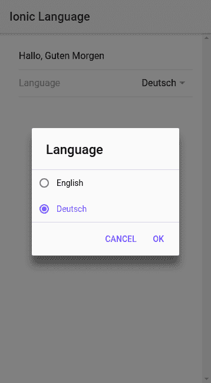
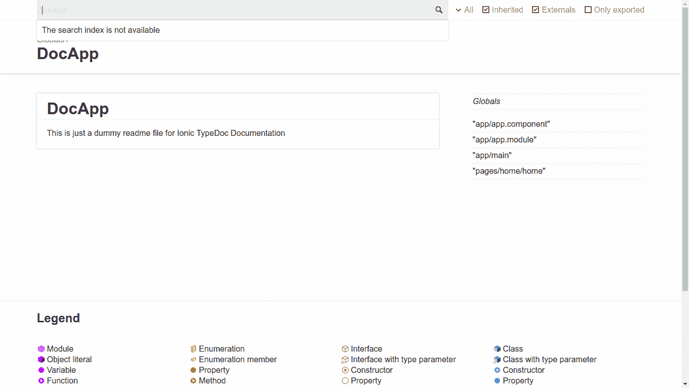

# 第九章：高级主题

在本章中，我们将涵盖一些高级主题，如下所示：

+   在 Ionic 中懒加载页面

+   使用 `ngx-translate` 进行国际化（i18n）

+   为 Ionic 应用程序创建文档

# 简介

在本章中，我们将探讨一些与 Ionic 应用程序相关的高级主题，例如为了性能而懒加载页面、深度链接 Ionic 页面，以及添加多语言功能和为 Ionic 应用程序创建文档。

# Ionic 中的懒加载

随着时间的推移，Web 应用程序变得越来越庞大和复杂。现在我们有了 Photoshop 的 Web 版本，甚至还有更多复杂的 Web 应用程序。Web 并不是为了这些类型的应用程序而设计的。如果你的应用程序非常大，并且在第一次加载时加载了整个应用程序，那么你的应用程序可能性能不佳。如果你只能加载特定页面/视图所需的 JavaScript 部分，那会怎么样？这就是懒加载的用武之地。懒加载是仅加载用户想要看到的应用程序部分的过程。你可以懒加载的不仅仅是 JavaScript，还可以是 CSS。

在 Angular 中，你可以通过路由配置进行懒加载。然而，Ionic 没有 Angular 路由或路由配置。在本教程中，你将学习如何在 Ionic 中进行懒加载。

# 准备中

你可以在浏览器中测试你的应用程序，因为懒加载不依赖于设备。

# 如何实现...

以下是为懒加载的说明：

1.  使用 `blank` 模板创建一个新的应用程序 `LazyLoading` 并导航到懒加载文件夹，如下所示：

```js
$ ionic start LazyLoading blank
$ cd LazyLoading
```

1.  在 `/src/pages/home` 文件夹内创建一个名为 `home.module.ts` 的新文件，并将以下内容添加到其中：

```js
import { NgModule } from "@angular/core";
import { IonicPageModule } from "ionic-angular";
import { HomePage } from "./home";
@NgModule({
 declarations: [HomePage],
 imports: [IonicPageModule.forChild(HomePage)]
})
export class HomePageModule {}
```

1.  将 `IonicPage` 装饰器添加到 HomePage 组件中，如下所示：

```js
import { Component } from "@angular/core";
import { NavController, IonicPage } from "ionic-angular";

@IonicPage()
@Component({
  selector: "page-home",
  templateUrl: "home.html"
})
export class HomePage {
  constructor(public navCtrl: NavController) {}
}
```

1.  创建一个 `/src/pages/second/second.ts` 文件，并添加以下内容：

```js
import { Component } from "@angular/core";
import { IonicPage, NavController, NavParams } from "ionic-angular";

@IonicPage()
@Component({
  selector: "page-second",
  templateUrl: "second.html"
})
export class SecondPage {
  constructor(public navCtrl: NavController, public navParams: NavParams) {}
}
```

1.  创建一个 `/src/pages/second/second.html` 文件，并添加以下内容：

```js
<ion-header>
  <ion-navbar>
    <ion-title>Second</ion-title>
  </ion-navbar>
</ion-header>

<ion-content padding>
</ion-content>
```

1.  创建一个 `/src/pages/second/second.module.ts` 文件，并添加以下内容：

```js
import { NgModule } from '@angular/core';
import { IonicPageModule } from 'ionic-angular';
import { SecondPage } from './second';

@NgModule({
  declarations: [
    SecondPage,
  ],
  imports: [
    IonicPageModule.forChild(SecondPage),
  ],
})
export class SecondPageModule {}
```

1.  打开 `/src/app/app.component.ts` 并按照以下方式更新 `rootPage` 的值：

```js
rootPage: any = "HomePage";
```

1.  打开 `/src/app/app.module.ts` 并按照以下方式更新它：

```js
import { BrowserModule } from "@angular/platform-browser";
import { ErrorHandler, NgModule } from "@angular/core";
import { IonicApp, IonicErrorHandler, IonicModule } from "ionic-angular";
import { SplashScreen } from "@ionic-native/splash-screen";
import { StatusBar } from "@ionic-native/status-bar";

import { MyApp } from "./app.component";

@NgModule({
  declarations: [MyApp],
  imports: [BrowserModule, IonicModule.forRoot(MyApp)],
  bootstrap: [IonicApp],
  entryComponents: [MyApp],
  providers: [
    StatusBar,
    SplashScreen,
    { provide: ErrorHandler, useClass: IonicErrorHandler }
  ]
})
export class AppModule {}
```

1.  现在，使用以下命令运行应用程序：

```js
$ ionic serve
```

# 它是如何工作的...

懒加载的想法与其他任何类型的技术相同。然而，Ionic 的实现与 Angular 的懒加载相比非常不同。

首先，你需要为想要懒加载的 Ionic 页面创建一个功能模块。在我们的例子中，我们创建了 `home.module.ts`。它看起来如下所示：

```js
import { NgModule } from "@angular/core";
import { IonicPageModule } from "ionic-angular";
import { HomePage } from "./home";
@NgModule({
 declarations: [HomePage],
 imports: [IonicPageModule.forChild(HomePage)]
})
export class HomePageModule {}
```

这是一个功能模块，其中声明数组包含 `HomePage`，我们在导入数组中使用 `IonicPageModule.forChild` 方法，并将 `HomePage` 作为输入，以便我们可以在 `HomePage` 内部访问 `Ionic`。

其次，我们需要在 `home.ts` 中使用 `IonicPage` 装饰器装饰我们的 `HomePage` 类，如下所示：

```js
...
import { IonicPage } from 'ionic-angular';

@IonicPage()
@Component({..})
export class HomePage {}
```

最后，我们需要将 `HomePage` 替换为引号中的 `'HomePage'` 以实现懒加载。例如，每次我们想要将 `HomePage` 推送到导航堆栈时，我们会调用 `push` 函数，如下所示：

`navCtrl.push('HomePage');` 而不是：`navCtrl.push(HomePage);`

此外，我们还需要删除对懒加载页面的任何导入。因此，我们不得不从 `app.module.ts` 中删除对 `HomePage` 的引用。

# 更多...

当你为 Ionic 应用程序配置懒加载时，你也在添加一个额外的功能，即通过 URL 访问页面。结合深度链接 Cordova 插件和这个功能，你可以轻松地为 Ionic 应用程序实现深度链接——把这看作是一个练习。

你可以在 [`github.com/BranchMetrics/cordova-ionic-phonegap-branch-deep-linking`](https://github.com/BranchMetrics/cordova-ionic-phonegap-branch-deep-linking) 找到深度链接插件的链接。

# 参考以下内容

在此博客文章中了解更多关于懒加载的信息：[`webpack.js.org/guides/lazy-loading/`](https://webpack.js.org/guides/lazy-loading/)。

# 使用 ngx-translate 进行国际化 (i18n)

将英语作为应用程序的主要语言是好的。然而，很可能有不知道英语的人会使用你的应用程序。为应用程序提供多种语言是好的。这被称为应用程序的国际化。在本部分中，我们将使用 Angular 的 `ngx-translate` 库来实现 Ionic 应用程序的多语言功能。

这就是应用程序的外观：



# 准备工作

你可以在浏览器中运行此应用程序。

# 如何操作...

以下是如何操作的说明：

1.  使用 `blank` 模板创建一个新的 `TranslateApp` 并进入文件夹，如下所示：

```js
$ ionic start TranslateApp blank
$ cd TranslateApp
```

1.  按照以下方式安装 `ngx-translate/core` 和 `ngx-translate/http-loader`：

```js
npm install @ngx-translate/core @ngx-translate/http-loader --save
```

1.  在 `/src/assets/i18n` 文件夹内创建 `en.json` 文件并添加以下内容：

```js
{
  "Hello": "Hello",
  "Good Morning": "Good Morning"
}
```

1.  在 `/src/assets/i18n` 文件夹内创建 `de.json` 文件并添加以下内容：

```js
{
  "Hello": "Hallo",
  "Good Morning": "Guten Morgen"
}
```

1.  打开 `/src/pages/home/home.html` 并按照以下方式更新：

```js
<ion-header>
  <ion-navbar>
    <ion-title>
      Ionic Language
    </ion-title>
  </ion-navbar>
</ion-header>

<ion-content padding>
  <ion-item>
    {{'Hello' | translate }}, {{ 'Good Morning' | translate }}
  </ion-item>
  <ion-item>
    <ion-label>Language</ion-label>
    <ion-select [(ngModel)]="language" (ionChange)="setLang()">
      <ion-option value="en">English</ion-option>
      <ion-option value="de">Deutsch</ion-option>
    </ion-select>
  </ion-item>
</ion-content>
```

1.  打开 `/src/pages/home/home.ts` 并按照以下方式更新：

```js
import { Component } from "@angular/core";
import { NavController } from "ionic-angular";
import { TranslateService } from "@ngx-translate/core";

@Component({
  selector: "page-home",
  templateUrl: "home.html"
})
export class HomePage {
  language: string = "en";
  constructor(
    public navCtrl: NavController,
    private translate: TranslateService
  ) {
    translate.setDefaultLang("en");
    translate.use("en");
  }

  setLang() {
    console.log(this.language);
    this.translate.use(this.language);
  }
}
```

1.  在 `/src/app` 文件夹内打开 `app.module.ts` 并按照以下方式更新：

```js
import { BrowserModule } from "@angular/platform-browser";
import { ErrorHandler, NgModule } from "@angular/core";
import { IonicApp, IonicErrorHandler, IonicModule } from "ionic-angular";
import { SplashScreen } from "@ionic-native/splash-screen";
import { StatusBar } from "@ionic-native/status-bar";

import { MyApp } from "./app.component";
import { HomePage } from "../pages/home/home";

import { TranslateModule, TranslateLoader } from "@ngx-translate/core";
import { TranslateHttpLoader } from "@ngx-translate/http-loader";
import { HttpClientModule, HttpClient } from "@angular/common/http";

export function HttpLoaderFactory(http: HttpClient) {
  return new TranslateHttpLoader(http);
}

@NgModule({
  declarations: [MyApp, HomePage],
  imports: [
    BrowserModule,
    HttpClientModule,
    TranslateModule.forRoot({
      loader: {
        provide: TranslateLoader,
        useFactory: HttpLoaderFactory,
        deps: [HttpClient]
      }
    }),
    IonicModule.forRoot(MyApp)
  ],
  bootstrap: [IonicApp],
  entryComponents: [MyApp, HomePage],
  providers: [
    StatusBar,
    SplashScreen,
    { provide: ErrorHandler, useClass: IonicErrorHandler }
  ]
})
export class AppModule {}
```

1.  按照以下方式运行应用程序：

```js
$ ionic serve
```

# 它是如何工作的...

在此示例中，我们使用 `ngx-translate` 进行国际化。这是一个相当简单的过程。基本思想是我们为想要在应用程序中支持的所有语言创建一个 `JSON` 文件。例如，`en.json` 用于英语，`de.json` 用于德语。在 JSON 文件中，我们有键和值。值是我们想要在应用程序中显示的翻译文本，而键是我们将要放入应用程序中的内容。

同样重要的是，我们需要为多种语言使用相同的键，并根据翻译使用不同的值。看看以下两个 JSON 文件：

`en.json`:

```js
{
  "Hello": "Hello",
  "Good Morning": "Good Morning"
}
```

`de.json`:

```js

{
  "Hello": "Hallo",
  "Good Morning": "Guten Morgen"
}
```

这两个文件都有两个键值对，键相同但值不同。

现在，在我们的模板中，我们使用这两个键：

```js
 {{'Hello' | translate }}, {{ 'Good Morning' | translate }}
```

我们使用 Angular 插值并在这里添加带有引号的键，以及来自 `ngx-translate` 库的 `translate` 管道。基本上，它根据所选语言将 `key` 转换为正确的 `value`。

要更改语言，我们使用来自 `ngx-translate` 的 `TranslateService`。它有 `setDefault` 方法来设置默认语言，以及 `use` 方法来切换语言。所以，在我们的 `home.html` 中，当用户使用 `ion-select` 切换语言时，我们调用我们的 `setLang` 函数，该函数底层调用 TranslateService 的 `use` 方法，并传入适当的语言代码，如 *en* 或 *de*。

最后，我们还需要在 `app.module.ts` 中配置 `ngx-translate`。我们需要在应用的根 `NgModule` 中导入 `TranslateModule.forRoot()`。我们还得配置 `TranslateModule` 的加载器。在这里，我们使用 `TranslateHttpLoader` 从 `/assets/i18n/[lang].json` 加载翻译，其中 lang code 是字母语言代码，例如 `en` 代表英语。

重要的是要注意，为了使用 **AOT**（**提前编译**），我们需要使用工厂函数，如下所示：

```js
export function HttpLoaderFactory(http: HttpClient) {
  return new TranslateHttpLoader(http);
}
```

因此，配置如下所示：

```js
  TranslateModule.forRoot({
      loader: {
        provide: TranslateLoader,
        useFactory: HttpLoaderFactory,
        deps: [HttpClient]
      }
  })
```

# 参考信息

查看关于 `ngx-translate` 的文档，请访问 [`github.com/ngx-translate/core`](https://github.com/ngx-translate/core)。

# 创建 Ionic 应用的文档

到目前为止，我们已经添加了一些针对应用用户的功能和特性。在这个配方中，我们将添加从源代码生成文档的能力，使用 TSDocs、Gulp 和 Ionic CLI Hooks。文档是开发者体验的一个重要方面。我个人认为，它应该是 Ionic 的默认部分。

这就是文档将呈现的样子：



# 准备工作

你可以在浏览器中运行此操作。

# 如何操作...

以下是如何创建示例应用的说明：

1.  使用 `blank` 模板创建一个新的 `DocApp` 并在文件夹内导航，如下所示：

```js
$ ionic start DocApp blank
$ cd DocApp
```

1.  安装以下 `npm` 开发依赖以使用 `typedoc`：

```js
$ npm install --save-dev gulp gulp-connect gulp-typedoc typedoc
```

1.  在应用的 `root` 目录中创建 `gulpfile.js` 并添加以下内容：

```js
var gulp = require("gulp");
var connect = require("gulp-connect");
var typedoc = require("gulp-typedoc");
var config = {
  root: "docs/"
};

gulp.task("typedoc", function() {
  return gulp.src(["src/**/*.ts"]).pipe(
    typedoc({
      module: "commonjs",
      target: "es6",
      experimentalDecorators: true,
      out: config.root,
      name: "DocApp",
      readme: "./README.md"
    })
  );
});

gulp.task("serve:docs", ["typedoc"], function() {
  connect.server({
    root: config.root,
    livereload: true
  });
});
```

1.  打开 `/src/pages/home/home.ts` 并按照以下方式更新：

```js
import { Component } from "@angular/core";
import { NavController } from "ionic-angular";

@Component({
  selector: "page-home",
  templateUrl: "home.html"
})
export class HomePage {
  constructor(public navCtrl: NavController) {}

  /**
   * Following is the way you write documentation
   *
   * @param username Username of the user
   * @returns It returns a string value
   */
  dummyFunction(username: string) {
    return username;
  }
}
```

1.  运行应用，如下所示：

```js
$ gulp serve:docs
```

# 它是如何工作的...

我们正在使用 `TypeDoc`，这是一个用于 TypeScript 应用的文档生成器。它使用 TSDoc 注释，与流行的 JSDoc 非常相似。所有的魔法工作都是在 `gulpfile.js` 中完成的。

首先，我们有一个 typedoc 任务。基本上，它使用 `gulp.src(["src/**/*.ts"])` 选取所有 TypeScript 源文件并将其管道传输到 typedoc。然后，typedoc 根据文件中的类结构和 TSDoc 注释生成文档。你可以从他们的网站 [`typedoc.org`](http://typedoc.org) 了解有关 TypeDoc 的配置信息。基本上，这里我们正在配置站点标题、文档位置以及其他一些事情。

如果你查看 `home.ts` 文件内部，我们有一个 `dummyFunction`，其看起来如下：

```js
 /**
   * Following is the way you write documentation
   *
   * @param username Username of the user
   * @returns It returns a string value
   */
  dummyFunction(username: string) {
    return username;
  }
```

函数之前的注释是 TSDoc 注释。它们具有特定的结构，我们需要学习和掌握，借助这些注释我们可以生成有意义的文档。

最后，我们在终端中运行一个 gulp 任务，`gulp serve:docs`，它使用浏览器中的网络服务器生成并提供服务文档。

# 参见

+   你也可以让它与 Ionic CLI 一起工作，在用 Ionic serve 提供应用服务的同时生成文档。查看 [`ionicframework.com/docs/cli/configuring.html#hooks`](https://ionicframework.com/docs/cli/configuring.html#hooks) 中的 Ionic CLI Hooks。

+   在 [`github.com/Microsoft/tsdoc`](https://github.com/Microsoft/tsdoc) 了解更多关于 TSDoc 的信息。
