# 为不同平台发布 App

在本章中，我们将涵盖与发布和确保 app 未来兼容性相关的以下任务：

+   为确保应用未来兼容性添加版本控制

+   为 iOS 构建和发布 app

+   为 Android 构建和发布 app

# 简介

在过去，构建和成功发布一个 app 非常繁琐。然而，如今互联网上有大量的文档和非官方指南，几乎可以解决你可能遇到的所有问题。此外，Ionic 还自带 CLI 来协助这个过程。本章将指导你以高级别了解 app 构建和发布步骤。你将学习以下内容：

+   为确保应用未来兼容性添加版本控制

+   将你的 app 发布到 App Store 或 Google Play

本章的目的是提供一些查找思路和一些注意事项。苹果和谷歌不断更新他们的平台和流程；因此，步骤可能随着时间的推移而有所不同。

# 为确保应用未来兼容性添加版本控制

通常情况下，你可能不会考虑跟踪特定用户的 app 版本。然而，随着用户数量和发布版本的增多，你很快就会面临更新问题和兼容性问题。例如，一个用户可能运行的是你 app 的旧版本，但你现在所有的后端 API 都期望从新版本中获取新的参数。因此，你可能需要考虑一种策略来本地检测 app 版本，以便通知用户更新需求。这在你后端针对特定 app 版本进行不同处理时也非常有用。

你将要构建的 app 非常简单。它将检测当前版本并将信息存储在服务中。这是 app 的截图：

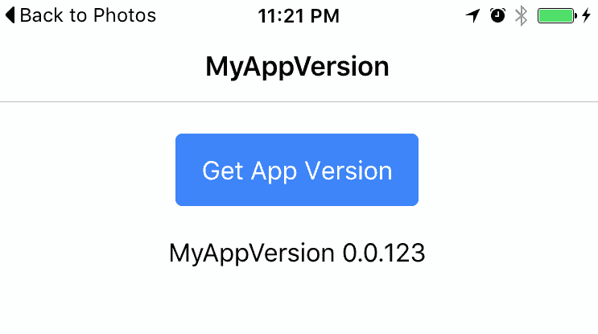

# 准备工作

以下 app 示例必须在物理设备或模拟器上运行。

# 如何操作...

查看以下说明：

1.  使用`blank`模板创建一个新的`MyAppVersion` app，如下所示，并导航到`MyAppVersion`文件夹：

```js
$ ionic start MyAppVersion blank 
$ cd MyAppVersion
```

1.  安装`app-version`插件：

```js
$ ionic cordova plugin add cordova-plugin-app-version
$ npm install --save @ionic-native/app-version
```

1.  通过更改版本号来编辑`./config.xml`，如下所示：

```js
<widget id="com.ionicframework.myappversion637242" version="0.0.123"  >
```

注意，你的`widget id`可能与这里提到的不同。你只需要更改版本号。在这种情况下，是`0.0.123`版本。

1.  在`app`文件夹内创建`services`文件夹，如下所示：

```js
$ mkdir ./src/services
```

1.  在`services`文件夹中创建`myenv.ts`文件，并包含以下代码：

```js
import { Injectable } from "@angular/core";
import { AppVersion } from "@ionic-native/app-version";

@Injectable()
export class MyEnv {
  constructor(private appVersion: AppVersion) {}

  getAppVersion() {
    return this.appVersion.getVersionCode();
  }
}
```

这是此 app 的唯一服务。在实际项目中，你可能需要多个服务，因为其中一些将需要直接与你的后端通信。

1.  打开并编辑你的`/src/app/app.module.ts`，如下所示：

```js
import { BrowserModule } from "@angular/platform-browser";
import { ErrorHandler, NgModule } from "@angular/core";
import { IonicApp, IonicErrorHandler, IonicModule } from "ionic-angular";
import { SplashScreen } from "@ionic-native/splash-screen";
import { StatusBar } from "@ionic-native/status-bar";
import { AppVersion } from "@ionic-native/app-version";
import { MyEnv } from "../services/myenv";

import { MyApp } from "./app.component";
import { HomePage } from "../pages/home/home";

@NgModule({
  declarations: [MyApp, HomePage],
  imports: [BrowserModule, IonicModule.forRoot(MyApp)],
  bootstrap: [IonicApp],
  entryComponents: [MyApp, HomePage],
  providers: [
    StatusBar,
    SplashScreen,
    AppVersion,
    MyEnv,
    { provide: ErrorHandler, useClass: IonicErrorHandler }
  ]
})
export class AppModule {}
```

在此文件中的主要修改是注入`AppVersion`和`MyEnv`提供者以供整个 app 使用。

1.  打开并替换`./src/pages/home/home.html`，使用以下代码：

```js
<ion-header>
  <ion-navbar>
    <ion-title>
      MyAppVersion
    </ion-title>
  </ion-navbar>
</ion-header>

<ion-content padding class="center home">
  <button ion-button (click)="getVersion()">Get App Version</button>
  <p class="large" *ngIf="ver">
    MyAppVersion {{ ver }}
  </p>
</ion-content>
```

1.  打开并替换`./src/pages/home/home.ts`，使用以下代码：

```js
import { Component } from "@angular/core";
import { NavController } from "ionic-angular";
import { MyEnv } from "../../services/myenv";

@Component({
  selector: "page-home",
  templateUrl: "home.html"
})
export class HomePage {
  public ver: string;

  constructor(private navCtrl: NavController, public myEnv: MyEnv) {}

  getVersion() {
    console.log(this.myEnv.getAppVersion());
    this.myEnv.getAppVersion().then(data => (this.ver = data));
  }
}
```

1.  在同一文件夹中打开并编辑 `home.scss`：

```js
page-home {
  .home {
    p.large {
      font-size: 16px;
    }
  }

  ion-content {
    &.center {
      text-align: center;
    }
  }
}
```

1.  前往你的终端并运行应用。如果你想在物理设备上运行应用，请输入以下命令：

```js
$ ionic cordova run ios
```

对于 Android，请输入以下命令：

```js
$ ionic cordova run android
```

# 它是如何工作的...

简而言之，`AppVersion` 插件负责所有 *繁重的工作*。使用 JavaScript，Ionic 应用无法找出其当前代码的版本。你可能认为使用本地存储或 cookie 是一种替代方案，但用户也可以手动删除该存储。为了有一个永久的解决方案，应该使用 `AppVersion` 插件，因为它可以读取你的 `config.xml` 文件并为你获取版本。

最佳实践是为所有环境变量创建一个单独的服务。这就是为什么你应该有一个名为 `MyEnv` 的服务。此外，你应该在 *应用级别* 注入 `MyEnv` 作为提供者，因为你只想实例化它一次，而不是每次创建新组件时都进行实例化。查看以下代码：

```js
providers: [MyEnv] 
```

由于所有 `AppVersion` 方法都是基于 `promise` 的，你应该将整个对象作为 `promise` 返回。让我们看看你的 `myenv.ts` 文件中的 `getAppVersion()` 方法：

```js
  getAppVersion() { 
    return this.appVersion.getVersionCode(); 
  }
```

然后，在你的页面文件中，例如 `home.ts`，你应该按照以下示例调用 `getAppVersion` 方法，并使用 `.then()` 方法获取以下结果：

```js
  getVersion() { 
    console.log(this.myEnv.getAppVersion()); 
    this.myEnv.getAppVersion().then((data) => this.ver = data); 
  } 
```

如果你打开控制台来检查 `promise` 对象，你会看到它包含你的应用版本值和 `.then()` 方法。查看以下截图：


关于 `AppVersion` 插件的更多信息，你可能想参考官方 AppVersion 文档，网址为 [`github.com/whiteoctober/cordova-plugin-app-version`](https://github.com/whiteoctober/cordova-plugin-app-version)。

# 构建 iOS 应用并发布

如果你没有提前做好准备，发布到 App Store 可能会是一个令人沮丧的过程。在本节中，我们将逐步介绍在 Apple 开发者中心、iTunes Connect 和你的本地 Xcode 项目中正确配置所有内容的步骤。

# 准备工作

为了访问 [`developer.apple.com/macos/touch-bar/`](https://developer.apple.com/macos/touch-bar/) 和 [`itunesconnect.apple.com`](https://itunesconnect.apple.com)，你必须注册 Apple 开发者计划，因为那些网站将需要经过批准的账户。

此外，你还应该有以下内容：

+   macOS

+   Xcode

# 如何操作...

以下是为确保一切配置正确的说明：

1.  确保你处于应用文件夹中，然后构建 iOS 平台：

```js
$ ionic cordova build ios
```

前往 `/platforms/ios` 文件夹，并在 Xcode 中打开 `.xcodeproj` 文件。查看以下截图：


1.  导航到“通用”选项卡，如以下截图所示，以确保你拥有所有正确的信息，特别是包标识符和版本。如有需要，进行更改并保存：


1.  访问苹果开发者网站，点击“证书、标识符和配置文件”，如图所示：


1.  选择您要针对的正确设备平台；在这种情况下，将是 iOS、tvOS、watchOS：

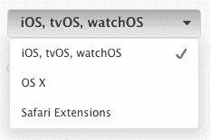

1.  对于 iOS 应用，您需要证书、应用 ID、测试设备和配置文件。要从证书开始，导航到“证书 | 所有”，如下所示：


1.  点击以下截图所示的加号（+）按钮：


1.  您必须按照网站上的步骤填写必要的信息，如图所示：

1.  完成表单后，您可以保存 CSR 文件并将其导入到 Mac 的密钥链访问中。

1.  按照以下步骤导航到“标识符 | 应用 ID”以创建应用 ID：

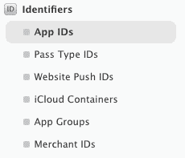

1.  点击屏幕右上角的加号按钮，如下所示：


1.  填写以下截图所示的应用 ID 注册表单：

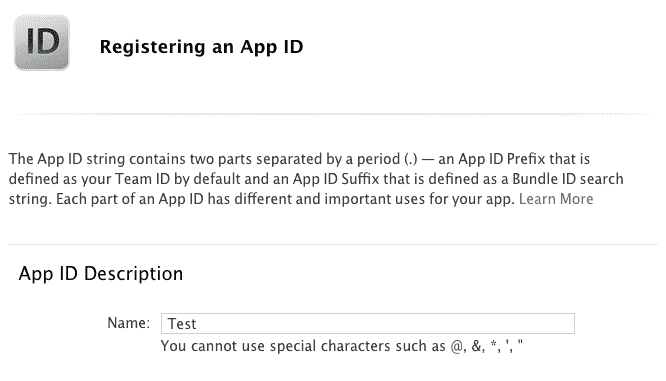

1.  在这里，您需要正确完成的重要部分是包标识符，如图所示，因为它必须与 Xcode 中的包标识符匹配：

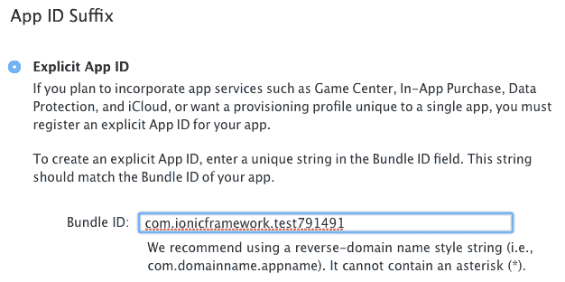

1.  如果您的应用需要推送通知或其他应用服务，您需要在以下页面上检查这些服务：

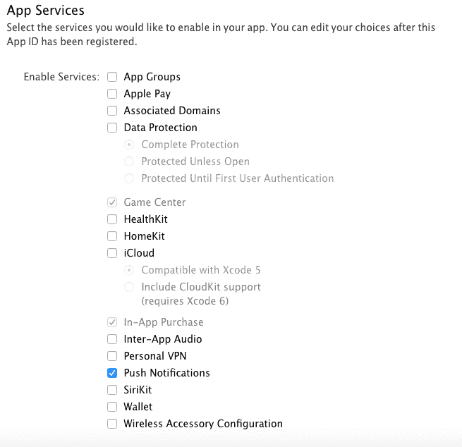

1.  如果您需要将应用推送到特定设备，您必须注册该设备。导航到“设备 | 所有”，如图所示：

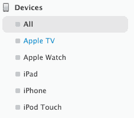

1.  点击加号按钮，如图所示：


1.  提供以下设备的 UDID 并保存，以注册设备：


1.  最后，如果您还没有配置文件，您将需要一个配置文件。通常，Xcode 会自动创建一个。但是，您可以按照以下步骤创建自己的配置文件：导航到“配置文件 | 所有”，如图所示：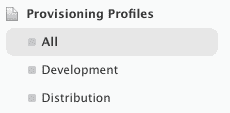

1.  点击以下截图所示的加号按钮：


1.  选择“应用商店”作为您的配置文件，如图所示：

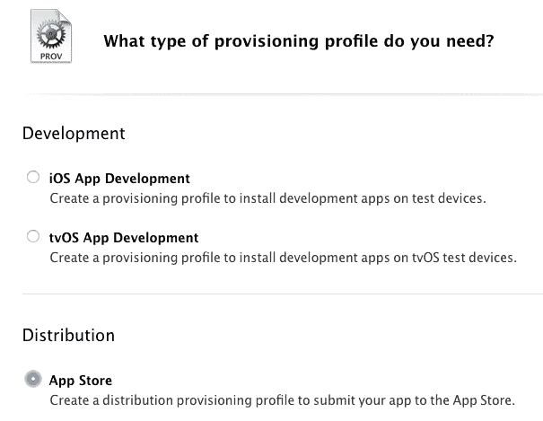

1.  从下拉菜单中选择正确的应用 ID 并保存，以完成配置文件创建，如下所示：

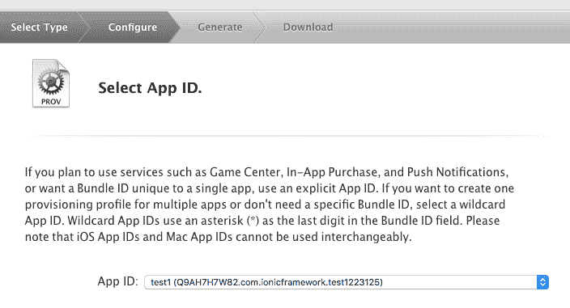

1.  访问 [`itunesconnect.apple.com`](https://itunesconnect.apple.com) 上的 iTunes Connect，并点击“我的应用”按钮，如下所示：


1.  选择加号 (+) 图标，然后选择新建应用，如下所示：


1.  填写表格，并确保您选择了您应用的正确 Bundle ID：


1.  提供有关应用的额外步骤，例如截图、图标和地址。如果您只想测试应用，您可以最初提供一些占位符信息，稍后再回来编辑。

    准备您的开发者账号和 iTunes Connect 账号就到这里。

    现在，打开 Xcode 并选择 iOS 设备作为存档目标，否则存档功能将不会开启。在您可以将应用提交到 App Store 之前，您需要存档您的应用！

1.  如上图所示，在顶部菜单导航到产品 | 存档：

    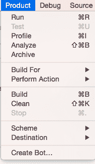

1.  存档过程完成后，选择提交到 App Store 以完成发布过程。

1.  要发布，请选择提交 Beta 应用审核。您可能还想浏览其他标签，例如定价和内购，以配置您自己的要求。

# 它是如何工作的...

显然，本节并没有涵盖发布过程中的所有细节。一般来说，您只需确保在提交到 App Store 之前，在物理设备（通过 USB 或 *TestFlight*）上彻底测试您的应用。

如果由于某种原因，存档功能无法构建，您可以手动前往您本地的 Xcode 文件夹，删除该特定临时存档应用以清除缓存，如下所示：

```js
~/Library/Developer/Xcode/Archives 
```

# 还有更多...

+   *TestFlight* 是一个独立的话题。*TestFlight* 的好处是您不需要苹果批准您的应用就可以在物理设备上进行测试和开发。更多关于 *TestFlight* 的信息请见 [`developer.apple.com/library/content/documentation/LanguagesUtilities/Conceptual/iTunesConnect_Guide/Chapters/BetaTestingTheApp.html.`](https://developer.apple.com/library/content/documentation/LanguagesUtilities/Conceptual/iTunesConnect_Guide/Chapters/BetaTestingTheApp.html)

+   测试 Ionic 应用还有另一种方法，那就是使用 Ionic 的 DevApp。它允许您在无需编译的情况下在 iOS 和 Android 上测试 Ionic 应用。您已在手机上安装了 Ionic Devapp，并在工作站中在终端运行 `ionic serve -c`。更多详情请见 [`ionicframework.com/docs/pro/devapp/`](https://ionicframework.com/docs/pro/devapp/)。

# 构建 Android 应用并进行发布

构建 Android 应用并进行发布比 iOS 更直接，因为您只需与命令行接口来构建 .apk 文件并将其上传到 Google Play 开发者控制台。

Ionic 框架文档也为此提供了很好的说明页面，请见 [`ionicframework.com/docs/guide/publishing.html`](http://ionicframework.com/docs/guide/publishing.html)。

# 准备工作

要求是你必须准备好你的 Google 开发者账户，然后登录到[`play.google.com/apps/publish.`](https://play.google.com/apps/publish)

你的本地环境也应该有正确的 SDK 和`keytool`、`jarsigner`和`zipalign`命令行，针对该特定版本。

# 如何操作...

以下是指令：

1.  进入你的应用文件夹，使用以下命令为 Android 构建：

```js
 $ ionic cordova build --release android
```

1.  你会在`/platforms/android/build/outputs/apk`文件夹中注意到`android-release-unsigned.apk`。在终端中转到该文件夹：

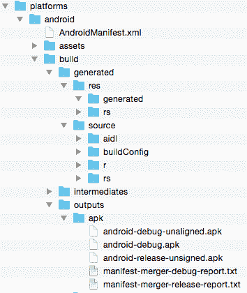

1.  如果这是你第一次创建此应用，你必须有一个`keystore`文件。此文件用于在发布时识别你的应用。如果你丢失了它，你以后将无法更新你的应用。要创建`keystore`文件，请输入以下命令行，并确保它与 SDK 的`keytool`版本相同：

```js
$ keytool -genkey -v -keystore my-release-key.keystore -alias alias_name -keyalg RSA -keysize 2048 -validity 10000 
```

1.  一旦你在命令行中填写了信息，请将此文件复制到某个安全的地方，因为你稍后还需要它。

1.  下一步是使用该文件来**签名**你的应用，以便它将创建一个 Google Play 允许用户安装的新`.apk`文件：

```js
$ jarsigner -verbose -sigalg SHA1withRSA -digestalg SHA1 -keystore my-release-key.keystore HelloWorld-release-unsigned.apk alias_name 
```

1.  在上传最终的`.apk`之前，你必须使用`zipalign`打包它，如下所示：

```js
$ zipalign -v 4 HelloWorld-release-unsigned.apk HelloWorld.ap
```

你需要确保`zipalign`在`PATH`中，或者你必须指定绝对路径。应用名称可以是任何你喜欢的，或者你可以使用本章中创建的相同名称。

1.  登录到 Google 开发者控制台，然后点击创建应用程序按钮，如下所示：


1.  在打开的弹出窗口中填写应用程序的标题，然后点击下面的创建按钮，如图所示：

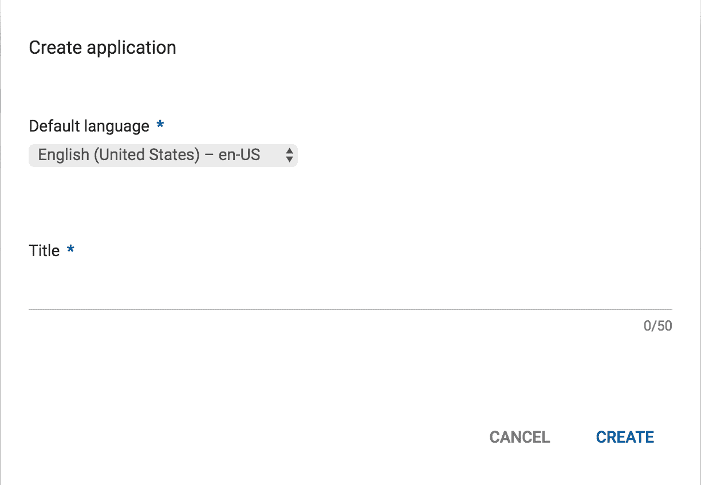

1.  使用左侧菜单填写你的应用所需的商店列表和其他信息：

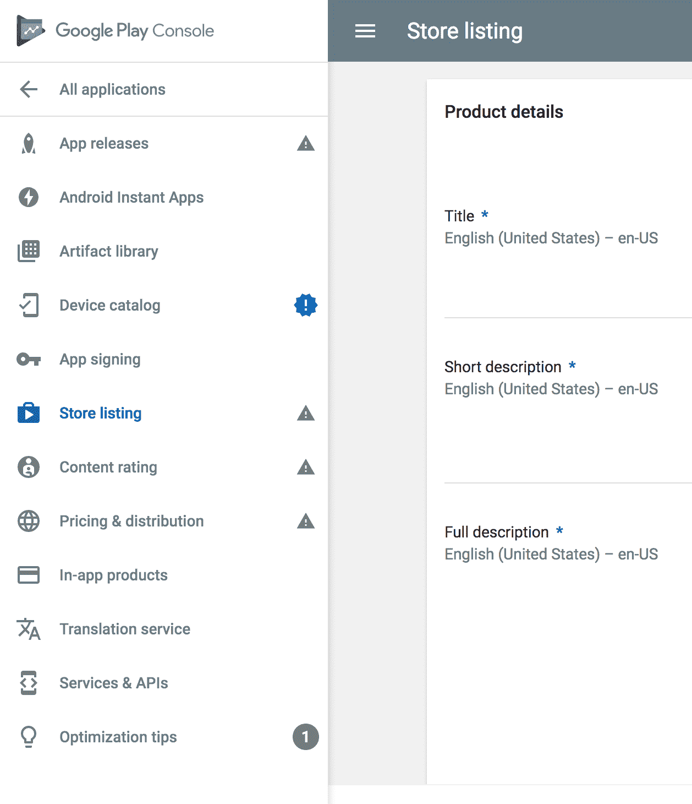

1.  现在，你已经准备好上传你的`.apk`文件。你需要做的第一件事是进行 Beta 测试：

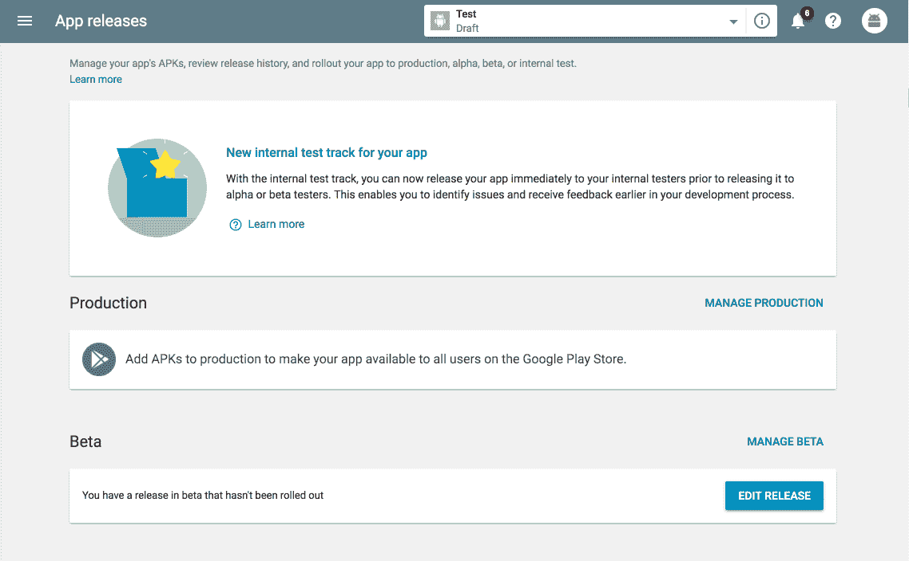

1.  一旦你完成了 Beta 测试，你可以按照开发者控制台的说明将应用推送到生产环境。

如果你在发布应用时遇到任何问题，查看仪表板右上角的“为什么我无法发布？”链接可能会有所帮助。Google 将指导你完成必须完成或修复的特定步骤。

# 它是如何工作的...

本节不涵盖其他 Android 市场，如 Amazon 应用商店，因为每个市场都有不同的流程。然而，共同的想法是，你需要完全构建`.apk`的未签名版本，使用现有的或新的`keystore`文件进行签名，最后使用`zipalign`准备上传。

在[`support.google.com/googleplay/android-developer/answer/113469?hl=en`](https://support.google.com/googleplay/android-developer/answer/113469?hl=en)了解更多关于上传应用程序以发布的信息
