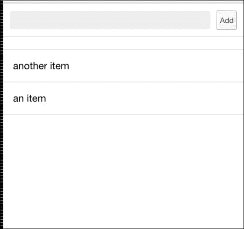
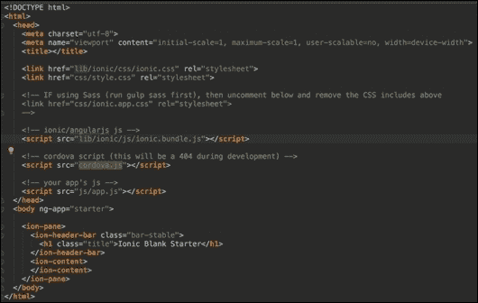
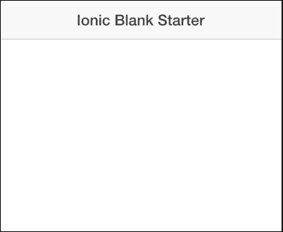
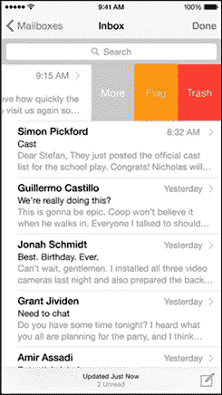
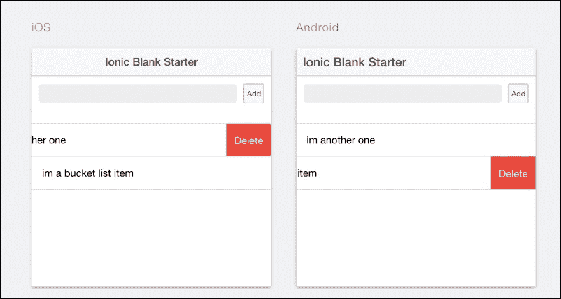
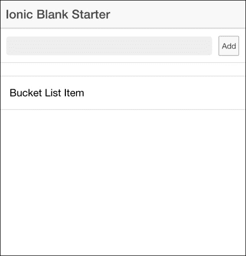
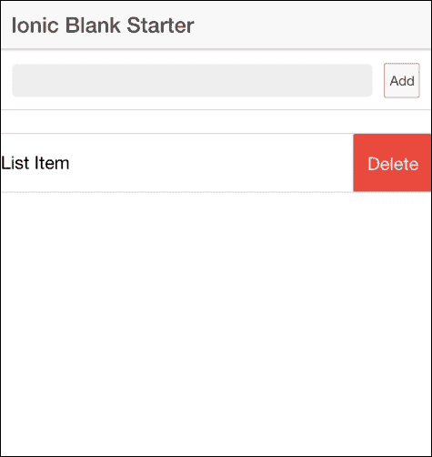

# 第四章。Ionic 组件

在本章中，我们将学习如何使用一些更复杂的 Ionic 组件和控制。我们将使用一些更高级的内置 Ionic 列表组件来创建我们在第二章中创建的待办事项应用程序的更高级版本，即*待办事项应用程序*。我们将把这个更高级的待办事项应用程序称为`Bucket-List`应用程序。这个应用程序背后的想法是，它将允许我们输入我们一生中想要尝试的所有有趣的事情。因此，我们可以输入我们想要参观的地方的名字，我们想要做的活动的名字，等等。

# 创建一个新的待办事项列表应用程序

在第二章的*待办事项应用程序*中，我们使用 Ionic 空白模板创建了一个简单的待办事项列表应用程序。我们能够使这个应用程序工作，是因为我们允许我们向我们的待办事项列表应用程序中添加条目。我们将使用 Ionic 空白模板创建一个新的待办事项列表应用程序，以便我们将新的、更高级的组件添加到我们全新的 BucketList 应用程序中。让我们按照以下步骤创建这个新的空白应用程序。我们将把我们的新应用程序称为`Bucket-List`，以便与我们在第二章中创建的*待办事项应用程序*区分开来。

1.  要创建`Bucket-List`应用程序，请在你的电脑上打开一个终端窗口，并通过运行以下命令导航到你的电脑的`Desktop`文件夹：

    ```js
    cd Desktop

    ```

1.  在导航到你的电脑的`Desktop`文件夹后，运行以下命令以基于 Ionic 空白模板创建`Bucket-List`应用程序：

    ```js
    ionic start Bucket-List blank

    ```

1.  这个命令将创建一个名为`Bucket-List`的新空白 Ionic 应用程序。当这个命令运行完成后，通过在命令行中运行以下命令导航到你的应用程序项目：

    ```js
    cd Bucket-List 

    ```

现在你已经成功完成了创建你的`Bucket-List`应用程序的过程，我们可以通过添加功能来开始开发这个应用程序。

## Bucket-List 应用程序概述

为了理解我们试图构建的内容，请仔细查看以下截图。我们的目标是创建一个最终应用程序，它与我们以下截图中的内容非常相似：



### 拆分应用程序

构建 Ionic 应用程序的一个好方法是分步骤进行。对于我们的`Bucket-List`应用程序，我们可以首先开发用户界面，然后编写代码以使其工作。我们的用户界面将包含一个输入框，用于将新项目输入到我们的 bucket 列表中。其次，我们必须为`Bucket-List`条目列表设计 UI。

## 设计 UI

设计 UI 涉及两个主要实现：

+   实现输入框

+   实现离子`ion-list`元素

我们将逐一查看。

### 实现输入框

我们将要实现的第一件事是一个输入框。这个输入框是用户将在`Bucket-List`应用程序中输入他们希望添加的有趣项目的表单。这将是一个带有一些离子 CSS 样式应用的 HTML textarea 输入框，以使其看起来更符合移动设备的外观和感觉。输入框旁边还将有一个带有标签**添加**的按钮。这个按钮就是我们输入一些文本后想要它出现在我们列表中的按钮。执行以下步骤：

1.  打开你之前在最喜欢的文本编辑器中创建的`Bucket-List`应用程序。

1.  现在，打开你项目`www`文件夹中的`index.html`文件。你会看到一个屏幕，其外观与我们下面的截图非常相似：

你可以看到，这个样板代码已经包含了一些自定义离子元素的代码，就像我们在第二章“待办事项应用程序”中看到的那样，所有这些元素都以`ion`为前缀。请密切关注`<ion-content>`元素！这个元素包含我们应用程序的各个部分或内容区域。我们将在这个元素之间放置我们`Bucket-List`应用程序的所有标记。

让我们从放置我们应用程序的输入框代码开始。我在下面的代码块中提供了我们输入框的代码。你需要在你的`index.html`文件中的`<ion-content>`元素内放置此代码：

```js
<div class="list">

<div class="item item-input-inset">
<label class="item-input-wrapper">
<input type="text">
</label>
<button class="button button-small">
      Add
</button>
</div>

</div>
```

上述代码是显示输入框和按钮的 HTML 代码，正如我们之前所描述的那样。如果你仔细查看标记，你会看到一些元素包含一些类。这些类是作为离子 CSS 的一部分可用的自定义离子类。离子 CSS 附带了许多实用的类和功能，但就目前而言，只需知道这些类是离子 CSS 的一部分即可。

如果你使用`ionic serve`方法在浏览器中运行你的应用程序，你应该能看到与我下面截图非常相似的东西。在终端窗口中输入以下命令以使用`ionic serve`方法运行你的应用程序。确保你从项目的根目录运行它：

```js
ionic serve

```

你应该能够看到带有按钮放置在其右侧的输入框。



### 实现离子列表应用程序

开发我们的`Bucket-List`应用的下一步是实现`ion-list`应用。我们将使用一个名为`ion-list`的内置组件。`ion-list`元素是一个用于创建和渲染列表的组件。它有很多酷炫的功能，允许我们渲染具有侧选项的复杂列表。请看以下截图，展示了 iOS 移动设备上的邮件应用，展示了我们可以使用`ion-list`实现的功能列表：



如上图所示，我们可以使用`ion-list`实现的最明显功能之一是在我们滑动列表项时显示选项。它还具有其他功能，例如删除项目或重新排列它们的能力。

#### 在我们的 Bucket-List 应用中使用 ion-list

对于我们的`Bucket-List`应用，我们将旨在使用`<ion-list>`组件来渲染通过输入框输入的每个项目。此外，我们希望能够通过从左侧滑动来删除列表中的每个项目，从而显示一个可点击的删除按钮。以下截图展示了我们旨在实现的内容以及涉及的项目：



##### ion-list 组件

我们将首先实现`<ion-list>`组件的代码。以下代码是`<ion-list>`的代码。您需要复制此代码并将其放置在您已经实现的输入框代码下方：

```js
<ion-list>

</ion-list>
```

这是创建我们的`<ion-list>`组件所需的最顶层组件。`<ion-list>`组件有一些属性，允许我们执行一些更复杂的实现。我们不会探索这些属性，但值得知道它们确实存在。

下一步是实现`<ion-list>`组件的子项。`<ion-list>`组件中的每个项目都称为`<ion-item>`。

##### ion-item

如前一小节中简要提到的`<ion-list>`组件，`<ion-list>`中的每个项目被称为`<ion-item>`。在`<ion-item>`内部，我们将放置我们想要每个列表项渲染的代码。它也是我们使用 Angular 的`ng-repeat`功能的地方。对于我们的应用，我们只想渲染每个`Bucket-List`项目的名称。这意味着我们可以将每个`Bucket-List`项目视为一个`<ion-item>`。

目前，我们只是在实现中添加一些占位文本，以展示`Bucket-List`项目将如何潜在地看起来。以下代码块是我们应用中代表`Bucket-List`项目的`<ion-item>`的实现：

```js
<ion-item>
<h2>Bucket List Item</h2>
</ion-item>
```

这是我们的`<ion-item>`的一个示例表示。如果您仍然通过`ionic serve`技术在浏览器中运行您的应用，您应该能够看到渲染的`<ion-item>`，就像以下截图所示：



现在，随着这个实现的完成，我们还需要做一件事来完成`Bucket-List`应用程序用户界面的实现。剩下的一件事是删除功能。记得从我们的初始实现计划中，我们希望用户能够滑动列表中的每个项目，并揭示一个**删除**按钮。幸运的是，`<ion-item>`组件有一个叫做`<ion-option>`的整洁功能。

###### ion-option-button

`<ion-option-button>`组件位于`<ion-item>`组件内部，作为其子组件。它的唯一目的是允许我们定义按钮，当用户从每个`<ion-item>`组件的右侧滑动时，我们可以揭示这些按钮，就像我们在原始示例截图中的实现一样。为了开始这个实现，复制以下代码并将其粘贴到您的`<ion-item>`组件标记的结束标签之前：

```js
<ion-option-button class="button-assertive">
     Delete
</ion-option-button>
```

如果您查看前面的代码，您可以看到`<ion-option-button>`有一个类属性`button-assertive`。这也是另一个 Ionic 类，它被用来在 Ionic 按钮上默认定义一个红色按钮。Ionic 有一些内置的类，可以轻松地为元素添加颜色。我们将在本书的后面讨论这个功能，但现在只需知道这个功能即可。

到目前为止，您的`<ion-item>`组件的最终代码应该看起来与我以下代码块中的内容相似。

```js
<ion-item>

<h2>Bucket List Item</h2>

<ion-option-button class="button-assertive">
         Delete
</ion-option-button>

</ion-item>
```

您的`<ion-content>`组件的最终代码应该与以下代码块中的内容非常相似：

```js
<ion-content>
<div class="list">
<div class="item item-input-inset">
<label class="item-input-wrapper">
<input type="text">
</label>
<button class="button button-small">
              Add
</button>
</div>
</div>

<ion-list>
<ion-item>

<h2>Bucket List Item</h2>

<ion-option-button class="button-assertive">
              Delete
</ion-option-button>

</ion-item>
</ion-list>

</ion-content>
```

通过这样，我们已经完成了使用`<ion-list>`组件实现我们的`Bucket-List`应用程序用户界面的实现。如果您仍然通过`ionic serve`技术在浏览器中运行应用程序，请尝试从左侧滑动应用程序中的示例列表项。当您这样做时，您应该能够看到一个**删除**按钮。请参阅以下截图以获取指导：



完成这一步后，我们就完全完成了应用程序的用户界面。现在，是我们开始通过关注我们将要编写的 Angular 代码来连接应用程序的时候了，以确保我们的应用程序按我们的预期工作。

## 为我们的 Bucket-List 应用程序编写 Angular 代码

在我们开始之前，让我们回顾一下我们想要实现的行为，以便我们的应用程序能够按我们的预期工作。

### 编写我们的输入框代码

我们首先希望能够在稍后输入一些文本到我们的输入框中。在输入文本后，我们希望点击**添加**按钮，并将此文本输入到一个数组中，该数组包含所有我们的`Bucket-List`项目。为了开始这个第一步，我们创建我们的 Angular 控制器，它将包含我们应用程序的所有逻辑。

#### 创建控制器

在您最喜欢的 IDE 中打开应用程序的`app.js`文件。此文件位于`js`文件夹中，该文件夹位于应用程序的`www`文件夹中。

```js
www/js/app.js
```

应该已经有一个名为`starter`的文件夹，其中包含与我以下代码块中相似的代码：

```js
angular.module('starter', ['ionic'])

.run(function($ionicPlatform) {
  $ionicPlatform.ready(function() {
    // Hide the accessory bar by default (remove this to show the accessory bar above the keyboard
    // for form inputs)
if(window.cordova&&window.cordova.plugins.Keyboard) {
cordova.plugins.Keyboard.hideKeyboardAccessoryBar(true);
    }
    if(window.StatusBar) {
StatusBar.styleDefault();
    }
  });
})
```

首先，我们将在声明模块之后创建一个名为`BucketListController`的控制器。如果你操作正确，你应该有与以下代码相似的代码：

```js
angular.module('starter', ['ionic'])

    .controller('BucketListController', function ($scope) {

    })

.run(function($ionicPlatform) {
      $ionicPlatform.ready(function() {
        // Hide the accessory bar by default (remove this to show the accessory bar above the keyboard
        // for form inputs)
if(window.cordova&&window.cordova.plugins.Keyboard) {
cordova.plugins.Keyboard.hideKeyboardAccessoryBar(true);
        }
        if(window.StatusBar) {
StatusBar.styleDefault();
        }
      });
    })
```

完成此操作后，我们现在已经完成了创建名为`BucketLisController`的控制器的过程。这个控制器将包含我们应用的所有逻辑。

#### 创建输入框模型

我们需要创建一个与输入框绑定的模型。这个模型将是一个对象形式，它将保存由我们在输入框中输入的文本所代表的数据。我们将把这个模型称为`bucketListItem`。为了创建这个模型，只需在之前创建的`BucketListController`中输入以下代码：

```js
$scope.bucketListItem = {
title : ''
};
```

上述代码初始化了我们的`bucketListItem`模型。这个模型有一个名为`title`的属性，它将保存我们在输入框中输入的文本，在每一个时间点。

#### 创建待办事项列表项的数组

我们应用的目标是有一个“待办事项列表”项的列表。当我们输入这些项目到输入框中时，它们需要存储在一个数组中。我们将创建这个数组，我们将简单地称它为`bucketListItems`。这个数组是我们将在 Angular 的`ng-repeat`属性中使用来迭代和渲染在视图中的。为了创建我们的“待办事项列表”项的数组，只需将一个名为`bucketListItems`的数组附加到你的控制器中的`$scope`变量上。以下代码展示了这一步骤：

```js
$scope.bucketListItems = [];
```

#### 实现添加按钮的代码

为了确保我们能够通过输入添加项目到我们的“待办事项列表”应用中，我们需要编写一个函数形式的代码来实现**添加**按钮。这个按钮负责两件事。首先，它将确保我们输入框中的当前文本被添加到输出框数组中的“待办事项列表”项。其次，它还将清理模型，以确保点击按钮后，输入框为下一个项目清理干净。

下面的代码表示了我们的**添加**按钮的实现：

```js
$scope.addBucketListItem = function () {
   //Add Current Bucket List Item To The Front Of Our Bucket List Items Array
   $scope.bucketListItems.unshift($scope.bucketListItem);
   //Clear Current Bucket List For Next Entry
   $scope.bucketListItem = {
      title: ''
   };
};
```

从上述代码中你可以看到，我们创建了一个名为`addBucketListItem`的函数，并将其附加到我们的控制器中的`$scope`变量上，以便在视图中使用。在我们的函数中，我们首先将`bucketListItem`变量的当前值添加到我们的`bucketListItems`数组中。其次，我们清理`bucketListItem`变量，以确保它为下一次输入做好准备。

现在，你可以在你的控制器中实现上述代码。

#### 实现删除按钮

我们代码的最后一部分是实现 `<ion-option-button>` 的 **删除** 按钮。记住，我们希望这个按钮能够删除它所属的项。以下代码展示了 **删除** 按钮的实现：

```js
$scope.deleteBucketListItem = function (index) {
$scope.bucketListItems.splice(index, 1);
};
```

上一段代码简单地展示了我们如何创建一个名为 `deleteBucketListItem` 的函数。这个函数接受要删除的当前项的索引作为参数。然后它使用这个索引从包含所有 `Bucket-List` 项的 `bucketListItems` 数组中移除相应元素。

完成这些后，我们基本上完成了应用程序的代码部分。您的最终控制器应该看起来与我以下代码块中的类似：

```js
controller('BucketListController', function ($scope) {
      $scope.bucketListItem = {
        title : ''
      };

      $scope.bucketListItems = [];

      $scope.addBucketListItem = function () {
        //Add Current Bucket List Item To The Front Of Our Bucket List Items Array
        $scope.bucketListItems.unshift($scope.bucketListItem);
        //Clear Current Bucket List For Next Entry
        $scope.bucketListItem = {
          title: ''
        };
      };

      $scope.deleteBucketListItem = function (index) {
        $scope.bucketListItems.splice(index, 1);
      };

    })
```

在我们继续测试应用程序之前，我们还有一个最后的步骤要完成。我们需要将我们刚刚创建的所有代码与之前实现的 UI 连接起来，以便它们可以一起工作。

### 连接所有

控制器准备就绪后，我们现在必须继续将所有代码连接到 UI 上，以便它们能够和谐地一起工作。

#### 绑定控制器

我们需要做的第一件事是将我们创建的控制器连接起来。最简单、最直接的方法是使用 Angular 的 `ng-controller` 属性指令来指定我们的控制器。在我们的例子中，我们将把控制器连接到应用的 `<ion-content>` 上。再次打开你应用的 `index.html` 文件。找到页面的 `<ion-content>` 标签的起始部分，并指定一个带有控制器名称的 `ng-controller` 属性。

您的代码应与以下代码非常相似：

```js
<ion-content ng-controller="BucketListController">
```

这段代码只是告诉 Angular 我们希望在 `<ion-content>` 元素的范围内使用 `BucketListController`。这意味着在这个控制器范围内定义的所有方法和属性现在都对 `<ion-content>` 元素及其所有子元素可用。

#### 绑定输入框模型

下一步是确保我们在控制器中创建的 `bucketListItem` 变量与视图中的输入框数据绑定。Angular 也有一个简单但很棒的属性指令来完成这个任务，称为 `ng-model`。我们只需为 `ng-model` 提供一个与我们要数据绑定的对象或变量匹配的值。在我们的例子中，我们想要将 `bucketListItem` 变量的标题属性从控制器中数据绑定到输入框。再次提供以下代码供您方便使用：

```js
<input type="text" ng-model="bucketListItem.title">
```

我们刚刚添加的代码片段告诉 Angular 将此变量绑定到这个输入框。因此，每当视图中的输入值发生变化时，我们控制器中的值与视图中的值相同，反之亦然。

#### 连接添加按钮

**添加** 按钮是我们实现中的下一个步骤。对于这个按钮，我们只需要告诉它在每次点击时运行我们的 `addBucketListItem` 函数。Angular 再次提供了一个辅助指令来完成这个任务，即 `ng-click` 指令。`ng-click` 指令类似于经典的 Java `onClick` 事件监听器，你提供给它一个函数，每次连接的元素被点击时都会运行。以下代码演示了如何使用 `ng-click` 指令连接我们的 **添加** 按钮：

```js
<button class="button button-small" ng-click="addBucketListItem()">
    Add
</button>
```

上述代码实现简单地确保当 **添加** 按钮被点击时，`addBucketListener` 函数将按照预期行为运行。

#### 绑定 ion-item

我们连接的最后部分是将我们的 `bucketListItems` 数组连接到我们的 `Ion-Item` 元素上，同时将 `ion-option-button` 元素绑定到我们的 `deleteBucketListItem()` 函数。

##### 使用 ng-repeat 渲染列表

目前我们有一个包含一个硬编码的 `ion-item` 的示例实现。然而，我们希望有一个更动态的解决方案，其中自动将 `bucketListItems` 数组中的每个项目渲染为 `ion-item`。为此实现，我们将使用 Angular 中最重要的功能之一，即 `ng-repeat`。`ng-repeat` Angular 指令允许我们动态重复一个数组。

目前，你的代码看起来类似于以下内容：

```js
<ion-item>

<h2>Bucket List Item</h2>

<ion-option-button class="button-assertive">
        Delete
</ion-option-button>

</ion-item>
```

我们将改变这个实现，使用 Angular 的 `ng-repeat` 指令。以下代码展示了如何实现这一点：

```js
<ion-item ng-repeat="item in bucketListItems">

<h2>{{item.title}}</h2>

<ion-option-button class="button-assertive">
        Delete
</ion-option-button>

</ion-item>
```

上述代码现在使用了 Angular 的 `ng-repeat` 属性。这段代码告诉 Angular 重复 `bucketListItems` 数组，并将每个项目的标题绑定到一个 HTML `<h2>` 元素上。

##### 连接 ion-option-button 元素

如果我们不告诉它这样做，`ion-option-button` 元素仍然保持原样，不会执行任何操作。对于这个元素，我们只需要提供一个函数，当它被点击时执行，就像我们对 **添加** 按钮所做的那样。为此，我们将再次使用 `ng-click` 指令，但这次我们将它指向控制器中的 `deleteBucketListItem()` 函数。以下代码展示了我们如何实现这一点：

```js
<ion-option-button class="button-assertive" ng-click="deleteBucketListItem($index)">
     Delete
</ion-option-button>
```

从上述代码中，你会注意到一个奇怪的东西，`$index` 被特别传递给我们的 `deleteBucketListItem` 函数作为参数。这个变量是一个魔法变量，Angular 的 `ng-repeat` 指令向我们暴露。它代表 `ng-repeat` 正在渲染的当前元素的索引。有了这个索引，我们可以了解应该从我们的桶单项目数组中删除哪个特定元素，并删除正确的元素。

在你的 `index.html` 文件中的最终 `<ion-content>` 应该与我以下代码块中的内容非常相似：

```js
<ion-content ng-controller="BucketListController">

<div class="list">
<div class="item item-input-inset">
<label class="item-input-wrapper">
<input type="text" ng-model="bucketListItem.title">
</label>
<button class="button button-small" ng-click="addBucketListItem()">
              Add
</button>
</div>
</div>

<ion-list>

<ion-item ng-repeat="item in bucketListItems">
<h2>{{item.title}}</h2>

<ion-option-button class="button-assertive" ng-click="deleteBucketListItem($index)">
              Delete
</ion-option-button>

</ion-item>

</ion-list>

</ion-content>
```

## 测试我们的桶单应用

我们已经完成了应用程序的实现，现在是时候看到它在实际中的应用了。确保您通过 `ionic serve` 技术在浏览器中运行您的应用程序，并进行测试。尝试在您的 `Bucket-List` 应用程序中输入一些内容，如跳伞、水上摩托等。您应该会看到，每次您输入一个条目并点击 **添加**，该条目就会出现在列表中，输入框也会清空，以便您进行下一次输入。此外，请确保通过从左侧滑动一个条目来测试删除选项，以显示 **删除** 按钮，并点击它以查看条目消失。

# 摘要

在本章中，我们从头开始使用 Ionic 空模板创建我们的 `Bucket-List` 应用程序。我们还学习了如何使用 Ionic 的 `<ion-list>` 组件及其子元素。我们编写了一些 Angular 代码来连接所有组件并使其运行。`<ion-list>` 组件是一个非常强大的组件，尽管本章的任务可能看起来比前几章复杂一些，但 `<ion-list>` 组件仍然让我们能够实现更多强大的功能。有关 `<ion-list>` 的更多信息，请访问本书附录中提供的链接，以了解更多复杂的功能。

在下一章中，我们将学习如何使用 Ionic 创建侧边菜单应用程序的一些非常有趣的内容。我们还将构建自己的旅游应用程序，并首次使用 Angular 的 `$HTTP` 服务进行 AJAX 调用。
