# 第五章 伦敦旅游应用

在上一章中，我们创建了一个名为“Bucket-List”的应用，它使我们能够创建一个我们一生中想要做的事情的列表。在本章中，我们将创建一个新的应用，称为“伦敦旅游”应用。这是一个将显示英国伦敦市顶级旅游景点的应用。我们将使用一种名为侧边菜单模板的新类型的 Ionic 模板来构建这个应用。我们还将使用 Angular 的`$http`服务通过 Ajax 查询我们的数据。

# 伦敦旅游应用的简介

伦敦是英格兰最大的城市，它是一个广为人知、吸引世界各地游客的城市。这个城市非常现代化，但它有许多历史和非历史性的旅游景点。由于这些景点数量众多，挑选出最佳游览地点可能会有些困难。这正是伦敦旅游应用背后的整个理念，因为它将为用户提供五个精选的目的地，游客在访问伦敦时可以实际参观。这些目的地将存储在我们项目中的一个 JSON 文件中，我们将通过 AJAX 查询并填充。

## 创建伦敦旅游应用

为了开始创建我们的应用的过程，我们将首先创建一个全新的 Ionic 应用。到目前为止，在这本书中，我们已经学会了使用空白模板创建新的 Ionic 应用。对于我们将要构建的应用，我们将使用一种新的 Ionic 模板来创建应用。我们将使用侧边菜单模板来创建我们的伦敦旅游应用。

### 侧边菜单应用设计

你可能不熟悉侧边菜单模板的样子。实际上，移动应用中的侧边菜单设计在移动应用开发中非常常见。它涉及到能够从移动应用的左侧或右侧边缘滑动以显示更多选项，通常是更多的菜单选项：

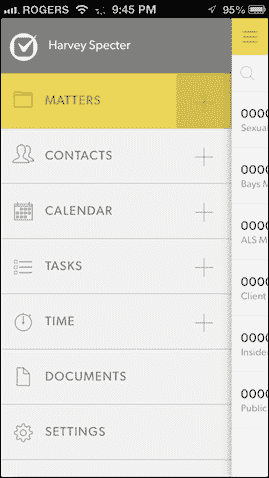

侧边菜单设计技术是在许多环境中使用的，无论是在移动端还是网页上。通常，你会看到一个图标位于右上角或左上角，表明你可以滑动或点击该图标以显示额外的菜单选项。这个图标通常被称为汉堡菜单图标。

事实上，Ionic 框架内置了一个侧边菜单模板，它会自动为我们创建一个带有一些有用样板代码的侧边菜单应用。我们将使用这个模板来创建我们的伦敦旅游应用。

### 使用 Ionic 侧边菜单模板

为了开始开发我们的伦敦旅游应用，我们将首先使用 Ionic CLI 创建应用。你可以通过在终端窗口中运行以下命令来完成此操作：

### 注意

我们将把我们的应用名称从伦敦旅游应用缩短为 LTA，以便更容易输入。

```js
ionic start LTA sidemenu

```

此命令将创建一个名为 LTA 的新 Ionic 应用，并使用默认的 Ionic 侧边菜单模板。

### 查看 LTA 侧边菜单应用的实际运行情况

一旦你的 LTA 应用创建完成，你只需在终端中将目录切换到 app，然后使用 `ionic serve` 技巧在你的电脑上运行它。你可以通过运行以下命令来完成：

+   切换到 app 目录：

    ```js
    cd LTA

    ```

+   使用 `ionic serve` 技巧运行：

    ```js
    ionic serve

    ```

    ### 小贴士

    记住使用 Chrome 并使用之前章节中教授的 Chrome 模拟工具来模拟你选择的设备。

你应该会看到一个类似于以下截图的屏幕：

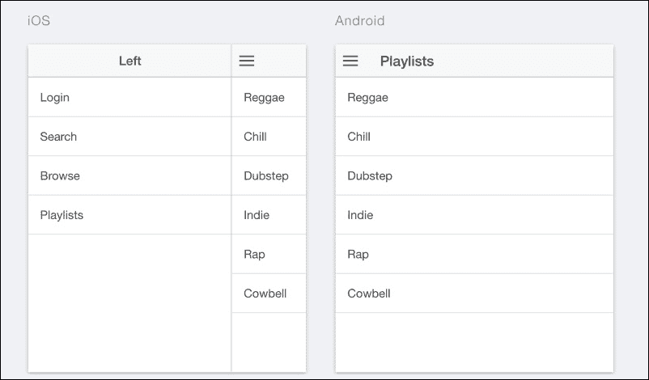

如前一个截图所示，我们刚刚创建的侧边菜单应用包含一些预渲染的内容。

### 探索 LTA 侧边菜单应用的代码

现在，我们将查看基于侧边菜单模板的 LTA 应用的代码：

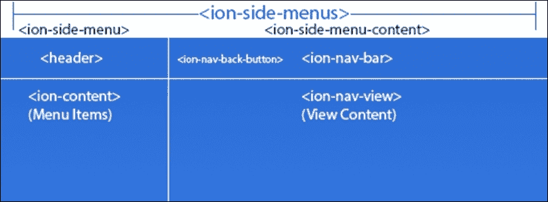

现在，我需要你启动你在最喜欢的 IDE 中创建的 LTA 项目。你首先会注意到的是你已经从之前的章节中熟悉的文件夹结构。

#### index.html 文件

现在，关注 `www` 文件夹并打开 `index.html` 文件。查看这个文件应该会显示类似于以下截图的内容：

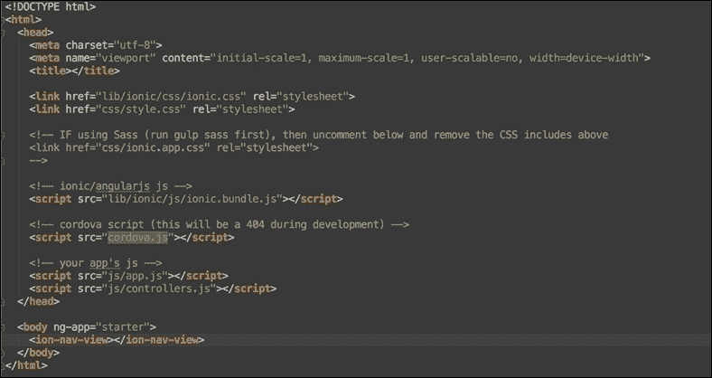

### 小贴士

要从根目录导航到这个文件，请导航到 `www/index.html`。

查看这个文件将展示一些我们在本书之前的项目中看到的内容。例如，你可以看到一些指向 Ionic `styles` 和 `script` 文件的 CSS 和 JS 引用。你还会从 `body` 标签中看到，一个名为 `starter` 的 Angular 模块正在使用 `ng-app` 属性被实例化。

仔细关注 `<body>` 标签内的 `<ion-nav-view>` 标签。这是一个用于指定整个应用注入到的视图的 Ionic 元素。它类似于 Angular 的 `ng-view` 功能，但具有更强大的功能。它还自动为我们处理 Ionic 应用内的导航。你不需要再过多关注这部分代码，只需记住 `<ion-nav-view>` 是所有内容注入的地方，并且像是一个包装器，用于我们应用的内容。

#### menu.html 文件

我们将要探索的下一个文件是 `menu.html` 文件。这个文件可能是目前最重要的文件，因为它包含了我们应用侧边菜单部分的大部分生成代码。要查看这个文件，导航到 `www` 文件夹下的 `templates` 文件夹中的 `menu.html` 文件。路径如下：`www/templates/menu.html`。

如果你已经成功完成，你应该会看到一个与以下截图非常相似的文件：

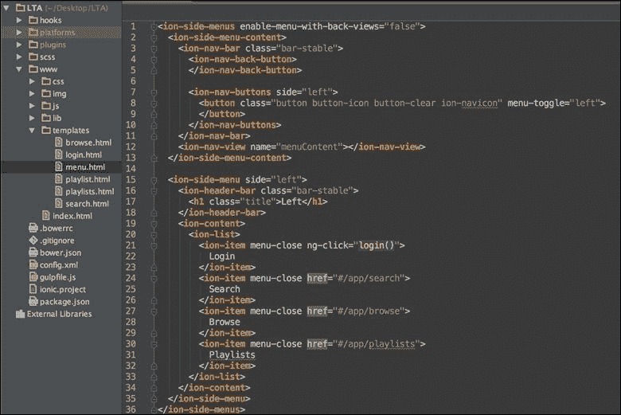

##### <ion-side-menus> 元素

你首先应该注意到的就是 `<ion-side-menus>` 元素。把这个元素想象成一个任何侧边菜单应用的容器。它允许我们通过 `<ion-side-menu-content>` 元素指定主内容区域，也允许我们通过 `<ion-side-menu>` 元素指定侧菜单。在 `<ion-side-menus>` 元素内可以指定多个侧菜单，并且我们有能力指定菜单是放置在左侧、右侧，甚至是两侧。有很多酷炫且强大的控制功能，是 `<ion-side-menus>` 元素让我们能够利用来控制其包含的项目。现在，我们将专注于尝试了解更多关于与 `<ion-side-menus>` 元素一起工作的子元素。这些是 `<ion-side-menu-content>` 和 `<ion-side-menu>` 元素。

##### `<ion-side-menu-content>` 元素

这个元素是存放主内容区域或应用可见部分的地方：

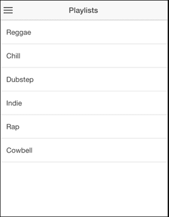

在上一张截图，即我们 LTA 应用视图的截图中，你所看到的部分是 `<ion-side-menu-content>` 的代表。让我们更仔细地查看 `<ion-side-menu-content>` 的代码，以了解它实际上是怎样详细工作的：

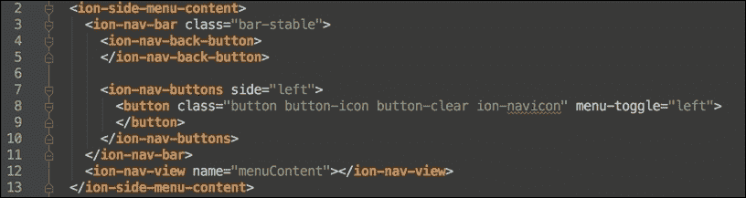

在 `<ion-side-menu-content>` 内，你可以看到两个直接子元素。

首先，你可以看到 `<ion-nav-bar>` 元素，它用于构建主内容区域的导航按钮，其子元素为 `<ion-nav-buttons>`。例如，在这些 `<ion-nav-buttons>` 元素中，你可以看到第 8-9 行上的一个导航按钮，其 `menu-toggle` 属性值为 `left`。这简单地说，当这个按钮被点击时，左侧菜单应该被触发。记住，在一个侧边菜单应用中，最多可以有两侧菜单，一侧在左侧，一侧在右侧。

第二个直接子元素是上一张截图中的第 12 行的 `<ion-nav-view>` 元素。我们之前在查看 `index.html` 文件时讨论过这个相同的元素。这个元素是实际内容注入的占位符。这个特定的 `<ion-nav-view>` 元素有一个 `name` 属性，其值为 `menuContent`。这个属性很重要，因为它被用作值来唯一标识 `<ion-nav-view>`。

说到这里，我们已经简要地触及了 `<ion-side-menu-content>` 元素及其主要功能。始终将这个元素视为存放侧边菜单应用主内容区域的元素。

##### `<ion-side-menu>` 元素

`<ion-side-menu>` 元素是我们用来指定应用程序侧菜单的元素。就像 `<ion-side-menu-content>` 元素一样，它作为 `<ion-side-menus>` 元素的直接子元素存在。在 `<ion-side-menus>` 元素内部最多可以有两个 `<ion-side-menu>` 元素，每个侧边只能有一个。让我们更仔细地看看我们 LTA 应用程序中 `<ion-side-menu>` 的代码。

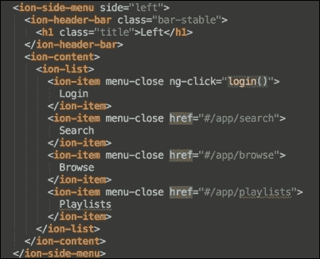

上一张截图来自我们的 `menu.html` 文件，展示了 LTA 应用程序中 `<ionic-side-menu>` 的代码。如果你仔细看，你会注意到我们的 `<ion-side-menu>` 元素的打开标签有一个值为 `left` 的 `side` 属性。这基本上意味着我们想要这个特定的侧菜单位于左侧。记住，我们可以在应用程序中最多有两个侧菜单，一个可以放在左侧，另一个可以放在右侧，但两个侧菜单不能放在同一侧。我们还可以看到这个 `<ion-side-menu>` 有两个直接子元素。这些子元素是 `<ion-header-bar>` 和 `<ion-content>`。`<ion-header-bar>` 是一个用于构建侧菜单头部的元素。如果你看看我们侧菜单的下一张截图，你应该能看到它的表示：

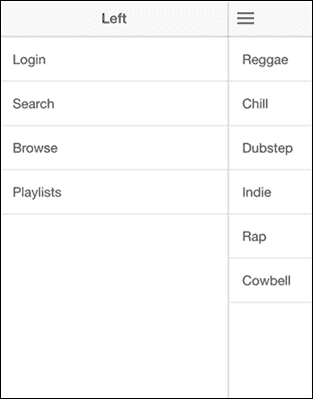

从上一张截图，你可以看到标题为 `LEFT` 的头部，正如代码中的 `<h1>` 元素所反映的那样。

从代码中我们可以看到的第二个子元素是 `<ion-content>` 元素。把这个元素想象成位于侧菜单头部下方的内容区域。基本上，这包括头部以下的所有内容。`<ion-content>` 可以包含我们想要的任何 HTML 代码，但在这个例子中，它包含 `<ion-list>`，这是我们用来从 第四章 “Ionic 组件”构建 Bucket-List 应用程序的部分。你还可以在运行我们的应用程序时的截图上看到这段代码的反映。

话虽如此，你可以看到我们已经简要地了解了 `<ion-side-menu>` 元素包含的内容以及 Ionic 侧菜单模板是如何工作的。下一步，我们将真正着手构建我们的 LTA 应用程序。

### 开发 LTA 应用程序

现在我们已经掌握了如何编写我们的 LTA 侧菜单应用程序的代码。记住，我们应用程序的目的是在我们的应用程序中列出一些我们最喜欢的旅游目的地。在正常情况下，我们会从真实的 API 中查询这些数据。但为了简化，我们将通过向一个充当真实数据库的本地 JSON 文件发送请求来模拟这个 API 请求，这个数据库包含我们所需的信息。

#### 本地 JSON 数据库

如前所述，我们将创建一个 JSON 文件，它将像现实生活中的 API 一样包含我们的目的地。这个本地文件将包含伦敦的五个顶级旅游目的地。我们首先需要做的是创建这个文件。

##### 创建本地 JSON 数据库文件

如果你还没有打开你的 LTA 应用程序，请确保你在你喜欢的 IDE 中打开它。现在，前往你的项目`www`文件夹中创建一个名为`sites.json`的新 JSON 文件。确保文件以`.json`扩展名命名，以便它被解析为 JSON 文件。你的目录结构应该类似于以下截图所示：

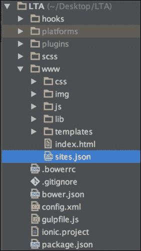

完成这些后，你已经成功创建了一个代表你的旅游地点数据库的本地 JSON 文件。

##### 填充 JSON 文件

现在我们将用一些数据填充 JSON 文件。这些数据将是伦敦城市中五个顶级旅游景点的数据。以下是一个表示我们本地 JSON 数据库内容的 JSON 数组。你应该将以下代码块的全部内容复制到你的`sites.json`文件中：

```js
[
  {
"id":"1",
"name":"London Eye",
"description":"Shows you a great view of the city"
  },
  {
"id":"2",
"name":"The Shard",
"description":"Highest building in London"
  },
  {
"id":"3",
"name":"Oxford Circus",
"description":"The place to shop in London"
  },
  {
"id":"4",
"name":"Buckingham Palace",
"description":"The Queen lives here"
  }
]
```

上一段代码是一个 JSON 数组，它表示伦敦的四个顶级目的地作为 JSON 对象。每个代表一个地点的对象有三个属性。这些属性包括：

+   **ID**：该地点的唯一标识符。

+   **名称**：旅游景点的名称。

+   **描述**：关于该地点的一些小信息。

到目前为止，我们已经成功完成了我们 JSON 本地数据库的创建。下一步是看看我们如何实际渲染这些项并查询数据库。

#### 设计视图

我们已经创建了我们的应用程序，并且我们有应用程序的数据。在我们查询数据之前，我们首先需要设计数据在渲染时的外观。为此，我们将求助于我们的老朋友`<ion-list>`。我们将使用`<ion-list>`来渲染来自我们的 JSON 数据库的旅游景点的列表。

目前如果我们运行我们的应用程序，我们看到的第一个页面是播放列表应用程序，如以下截图所示：

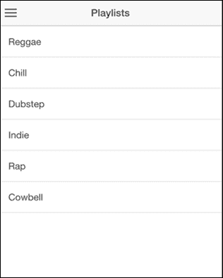

这是因为默认情况下，页面是通过 Angular 在`app.js`文件中指定的，作为我们应用的根页面。我们将保持简单，并更改这个播放列表页面的内容，并在其上设计我们的 LTA 应用程序的视图。从你的 LTA 项目文件夹中，导航到`www`文件夹，然后查看`templates`文件夹。在`templates`文件夹中，有一个`playlists.html`文件。这是包含前面截图所示播放列表页面代码的文件。打开这个文件，你应该会看到一些代码，与以下截图中的代码非常相似：

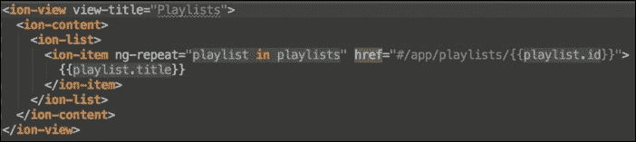

### 小贴士

你 LTA 项目根目录下的`playlists.html`文件将有一个路径`www/templates/playlists.html`。

我们在这里首先想要做的是更改视图标题的名称。目前，从之前的截图看到的视图标题是`Playlists`。这是由`<ion-view>`元素的`view-title`属性指定的。这个`view-title`属性当前具有值`Playlists`。将其更改为`London Sites`。这是为了确保标题反映了我们应用的使命，即展示伦敦顶级旅游景点。

我们需要做的第二件事是编辑`<ion-list>`的代码。将`<ion-list>`代码替换为以下代码块中提供的代码：

```js
<ion-list>
<ion-item ng-repeat="site in sites">
        {{site.name}}
</ion-item>
</ion-list>
```

如果你已经正确完成，你的代码现在应该非常接近以下截图中的内容：

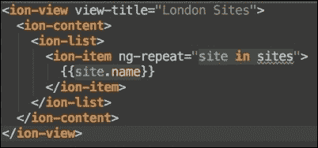

完成这些后，我们现在已经完成了设计 UI 的过程。下一步是将我们的数据连接到我们的视图中。

##### 连接数据

之前，我们创建了一个`sites.json`文件，它代表了我们的数据库。我们将对这个文件进行实际的 Ajax 调用以检索其数据并在我们的应用中提供。为了实现这一点，我们首先需要编写检索数据的代码。

##### 使用 $http 服务检索数据

为了检索数据，我们需要向`sites.json`文件发起一个 Ajax 调用。为此，Angular 提供了一个名为`$http`的出色服务。这是一个提供通过 Ajax 向本地和远程资源发起调用功能的服务。要开始使用`$http`服务编写代码，我们首先需要访问与我们的视图关联的控制器。默认情况下，当你基于侧边菜单模板创建一个 Ionic 应用时，视图会有一个控制器与之关联。为了找出哪个控制器与我们的`playlist.html`文件关联，我们需要查看我们的应用中的`app.js`文件以发现这一点。

你可以通过导航到项目的`www`文件夹，然后查看其中的`js`文件夹来找到`app.js`文件。你应该能看到`app.js`文件。打开它。在打开这个`app.js`文件后，查找看起来与以下截图相似的代码部分：

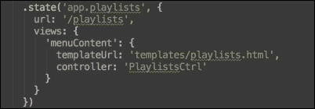

上一张截图中的代码代表了`playlist.html`文件的州定义。请仔细关注上一张截图中的代码部分，其中定义了控制器，你会看到那里指定的控制器名为`PlaylistsCtrl`。这是我们`playlist.html`文件连接的 Angular 控制器的名称。

下一步是进入这个`PlaylistsCtrl`控制器，并编写代码来检索我们的数据。默认情况下，控制器包含在可以找到与我们的`app.js`文件相同的`js`文件夹中的`controller.js`文件中。

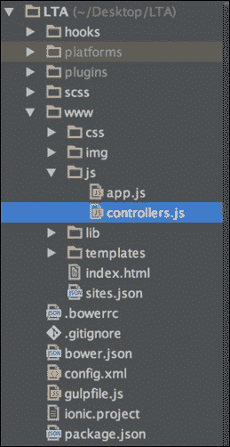

打开`controller.js`文件，寻找与我下面截图相似的代码片段：

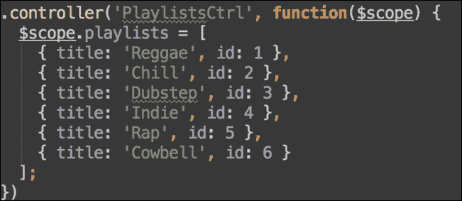

前面的代码块代表了`PlaylistsCtrl`的控制器定义。我们首先需要做的是清除控制器内的所有代码。基本上，我们需要删除控制器内找到的所有代码。如果你已经正确地完成了这个步骤，你的控制器现在应该看起来和下面的截图相似：

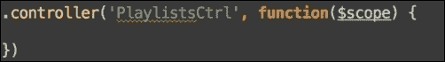

完成这个步骤后，我们现在可以开始创建使用 Angular `$http`服务查询我们的本地 JSON 数据库的代码。为了实现这一点，我们首先需要将我们的`$http`服务的依赖项添加到控制器中。这一步非常重要，如果我们没有正确地添加这个依赖项，我们的应用将无法加载。为此，只需将`$http`作为控制器定义匿名函数部分的第二个参数添加即可。如果你已经正确地完成了这个步骤，你应该会看到与我下面截图相似的内容：

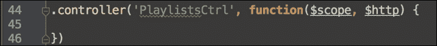

完成这个步骤后，我们现在可以开始编写代码，从我们的本地数据库中获取数据。要开始这个过程，只需将以下代码写入你的控制器中：

```js
$scope.sites = [];
$http.get('/sites.json')
.then(function (response) {
    $scope.sites = response.data;
});
```

如果你已经正确地完成了这个步骤，你的代码应该非常接近下面的截图：

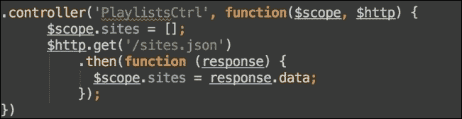

在这一点上，我将解释这段代码的作用。我们首先简单地将变量`sites`初始化为一个数组到`$scope`。在使用 Angular `$scope`变量之前总是初始化它们是一个好习惯。接下来，我们尝试使用简写的`$http.get()`方法进行 Ajax `get`请求。这个`$http.get`方法返回一个 promise，所以我们通过使用 Angular 的 promise 处理`.then()`方法来处理这个 promise。在 promise 处理函数中，你可以看到我们首先设置 promise 响应的数据属性（`response.data`）。这个 promise 响应的数据属性（`response.data`）是包含任何返回数据的属性，在我们的例子中是`sites.json`文件中的数据。

### 注意

可能有一点让人困惑的是，对于`$http.get()`函数的第一个参数，它接受 API 的 URL 或我们想要消费的文件，我们提供了以下相对路径`'/sites.json'`。你可能想知道为什么我们没有正确地给出相对于`controller.js`文件的路径。这是因为当使用 Angular 时，所有路径都是从根`index.html`文件引用的。在我们的例子中，`sites.json`和`index.html`文件都在`www`目录下的同一目录中，这就是为什么我们没有`'../sites.json'`路径，而是有`'/sites.json'`路径。

完成所有这些后，我们已经完成了创建我们的 LTA 应用程序的过程。现在剩下的只是运行应用程序。继续使用从第一章，“初探 Ionic”中学到的 `ionic serve` 技巧来运行这个应用程序。确保您从 LTA 应用程序项目的根目录运行此命令。

如果您操作正确，您应该会看到以下截图所示的我们的旅游目的地列表：

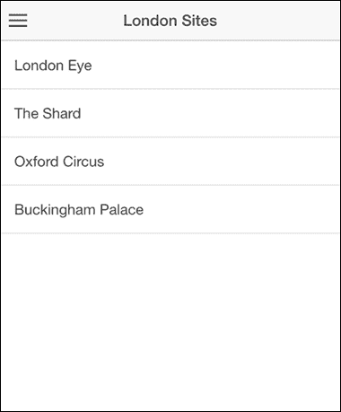

# 摘要

在本章中，我们学习了如何根据侧边菜单模板创建 Ionic 应用程序。我们利用这一知识创建了我们的伦敦旅游应用程序。我们还查看了一个 Ionic 侧边菜单模板的代码，并了解了侧边菜单应用程序的构建块元素。我们通过使用 Angular 的 `$http` 服务通过 Ajax 查询一些数据并渲染我们的旅游目的地来总结。

在下一章中，我们将扩展我们现有的应用程序，并使用一些更复杂的 Ionic 组件来做一些真正酷的事情。
