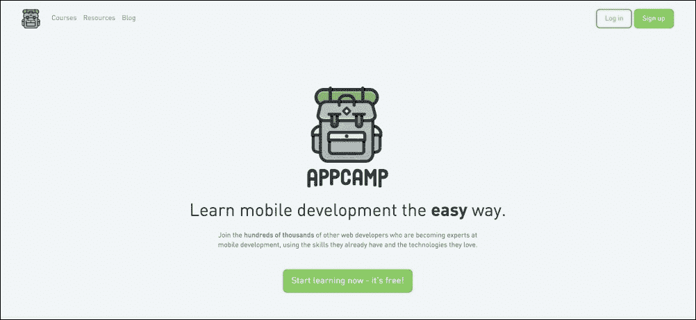
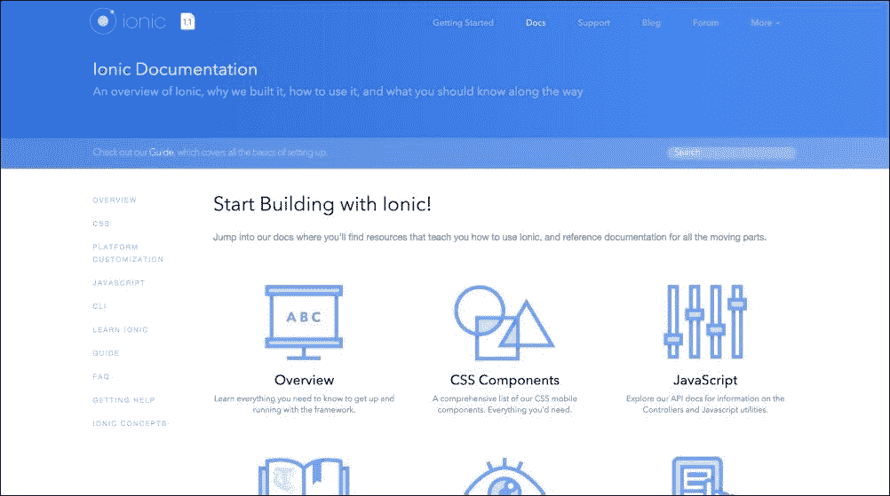
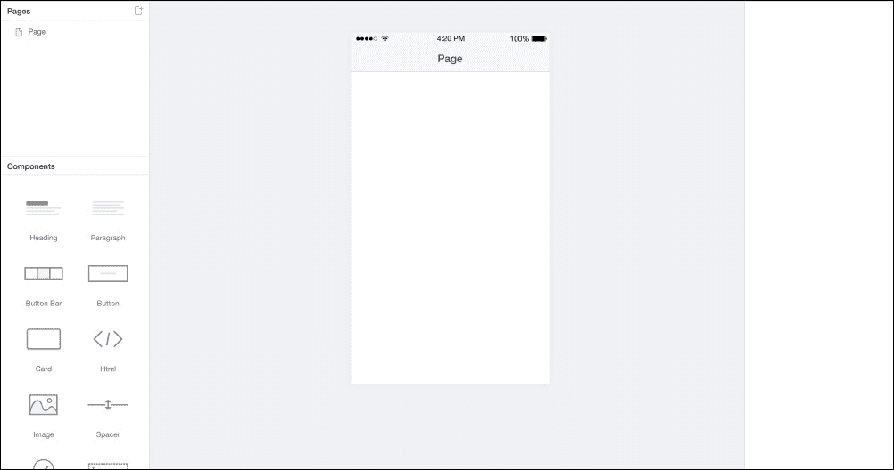
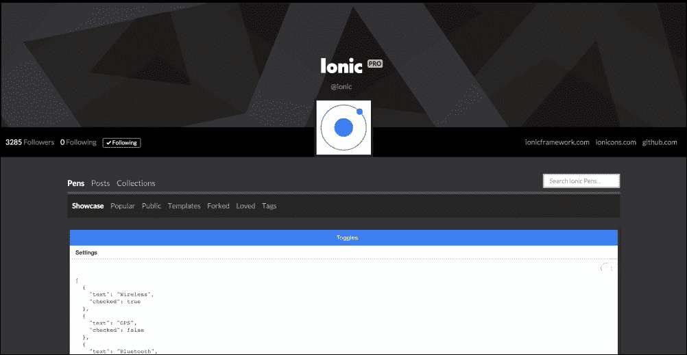
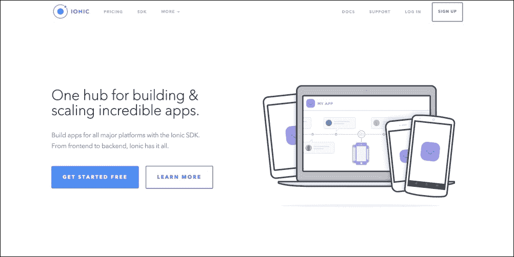
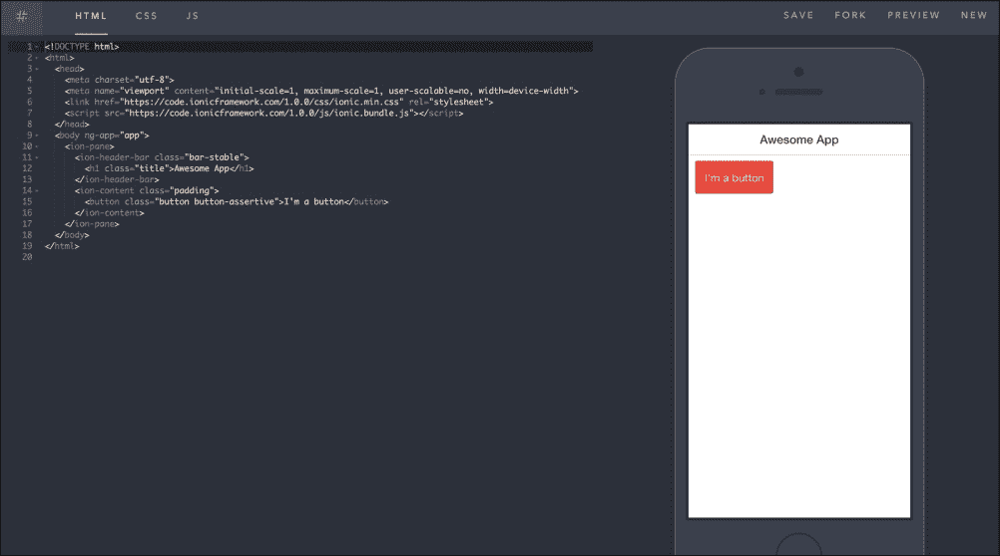

# 第十章。汇总

在本章中，我们将概述一些关于 Ionic 我们尚未涉及的重要内容，这些内容可能对你非常有用。你还将学习一些关于 Ionic 的有用技巧，并发现一些关于如何更好地使用 Ionic 开发优秀应用的精彩技巧。

# Ionic 的未公开特性

尽管在这本书中我们讨论了许多精彩的主题，但还有很多出色的特性我们没有涉及，因为它们超出了本书的范围。我们主要关注了 Ionic 的核心特性，例如如何设置 Ionic。然后我们学习了如何使用空白、侧边菜单和标签模板来创建 Ionic 应用。我们还学习了如何通过 `ionic serve` 技术使用 Chrome 浏览器测试我们的 Ionic 应用。

在本书的这一部分，我将列举一些对你来说非常有用的东西，这将帮助你更好地掌握 Ionic。

## Appcamp.IO

[Appcamp.IO](http://Appcamp.IO) 是由一些 Ionic 员工创建的免费网站。这是一个你可以去学习一些技巧和窍门的地方，这些技巧和窍门将帮助你提高 Ionic 开发技能。

[Appcamp.IO](http://Appcamp.IO) 上的内容非常适合初学者，并且在某些方面与本书的哲学相一致。

## Ionic 文档

Ionic 文档页面几乎可以称为关于 Ionic 的一切的圣经。Ionic 的文档非常完善，你想要使用的任何特性都有示例代码和使用说明。你可以通过 [`www.ionicframework.com/docs`](http://www.ionicframework.com/docs) 访问 Ionic 文档：

## Ionic 创建者

这是 Ionic 为那些想要设计第一个应用或编码技能有限的人构建的拖放工具。它最伟大的特性是，你可以通过拖放设计任何 Ionic 元素，并在浏览器中测试，代码可以提取为现成的应用程序。这对那些不知道如何编码的设计师来说是个好消息，因为他们可以快速使用 Ionic 创建者的可视化拖放功能来设计他们的应用，并将代码传递给经验丰富的开发者。你可以访问 [`creator.ionic.io`](https://creator.ionic.io) 的 Ionic 创建者网站。

## Ionic 代码笔

有时候，即使你已经访问了 Ionic 某个组件的文档，你仍然可能想看到一个真实的代码示例。或者你可能想尝试重现一个错误以向他人展示。这正是 Ionic 代码笔网站大放异彩的地方。这是一个你可以找到一些真正出色的不同特性实现的地方，代码可供你学习。这也是向那些能够看到并帮助你解决问题的人展示错误的最佳方式。

你可以访问 [`codepen.io/ionic`](http://codepen.io/ionic) 的 Ionic 代码笔网站。

## Ionic.IO

Ionic.IO 平台是一套完整的优质工具集，它使您能够为您的 Ionic 应用程序添加出色的服务。使用 Ionic.IO，您可以添加诸如 **推送通知**、**分析** 以及在云端构建应用商店应用的特性。此外，还有 Ionic 部署功能，它允许您在不重新提交到应用商店的情况下实时更新您的应用程序。

在撰写本书时，Ionic.IO 工具都处于测试版，尽管在撰写时它们是免费的，但 Ionic 已宣布它们将在未来成为付费服务。这是您应该密切关注的事情，因为您可能需要使用到 Ionic.IO 平台提供的一些服务。

您可以访问 [`www.ionic.io`](http://www.ionic.io) 的 Ionic.IO 平台。

## 离子沙盒

离子沙盒是一个非常新颖且实用的工具，可以快速启动一个想法。这是一个简单地将代码生成并直接在浏览器中显示结果的好方法。我个人认为这个工具在教育领域非常有用，因为它使得仅使用浏览器就能轻松创建 Ionic 应用程序。

如果您发现自己需要快速展示/演示某物，且附近有电脑，那么请确保尝试使用离子沙盒。

您可以访问 [`play.ionic.io/`](http://play.ionic.io/) 的离子沙盒。

## 离子社区

离子之所以非常成功的主要原因之一是它拥有一个强大的活跃社区。从社交媒体和聚会团体到开源活动家，Ionic 从世界各地的人们那里获得了广泛的支持。这意味着，如果您遇到任何问题，您永远不会离帮助太远。考虑到这一点，以下是一些您可能想要关注的社区元素链接：

+   **离子论坛**：离子论坛真的是一个很好的地方，可以表达您的困扰或找到共同问题的解决方案。这里有多个活跃的成员和用户，他们通过评论和帮助他人找到解决方案为论坛做出贡献，并获得激励徽章。您可以通过 [`forum.ionicframework.com`](http://forum.ionicframework.com) 访问此论坛。

+   **离子 Slack 频道**：这个频道有超过 4000 人在 24/7 以及多个国家活跃。这是一个结识人们、寻找工作、寻求帮助、雇佣某人或仅仅表达自己的好地方。要加入离子 Slack 频道，只需免费请求一个邀请 [`ionicworldwide.herokuapp.com`](http://ionicworldwide.herokuapp.com)。

+   **Twitter**：当谈到寻找有关 Ionic 的最新和最优秀的内容时，Twitter 是最活跃的社会媒体平台。如果您使用 Twitter，可以关注 `@ionicframework` 以获取更多信息及更新。

+   **The Ionic 博客**: Ionic 非常积极地撰写关于使用 Ionic 的各种主题的博客文章。其中一些文章可能是关于关键更新、鼓舞人心的故事，甚至是新产品或新功能的公告。你可以在[`blog.ionic.io`](http://blog.ionic.io)找到 Ionic 博客。

+   **Ionic 聚会小组**: 在世界各地，有成百上千的聚会小组自主举办活动和聚会。这是当地人民为了在他们所在的地区推广 Ionic 意识而做出的社区努力，你几乎可以保证在你的附近城市会有一个。如果你没有，请随意开始你自己的本地聚会。你可以在[`blog.ionic.io/ionic-worldwide`](http://blog.ionic.io/ionic-worldwide)找到所有聚会的列表。

Ionic 的社区是其快速发展的主要原因，你应该确信信任这个社区以满足任何需求。作为备注，请确保使用你在本书中学到的技能来真正努力提高你的 Ionic 技能并构建一些优秀的移动应用程序。记住，没有什么是太简单而不能变得伟大，也没有什么是太伟大而难以构建的。

# 有用资源

以下是一些有用的链接，这些网站和资源将帮助你在学习更多关于 Ionic 的过程中更进一步：

+   **The Ionic** **框架**: [`www.ionicframework.com`](http://www.ionicframework.com)

+   **The Ionic** **GitHub**: [`www.github.com/driftyco/ionic`](http://www.github.com/driftyco/ionic)

+   **AngularJS**: [`www.angularjs.org`](http://www.angularjs.org)

+   **Ionic stack overflow**: [`stackoverflow.com/questions/tagged/ionic-framework`](http://stackoverflow.com/questions/tagged/ionic-framework)

+   **Firebase**: [`www.firebase.com`](http://www.firebase.com)

+   **NodeJS**: [`www.nodejs.org`](http://www.nodejs.org)

+   **Bower**: [`www.bower.io`](http://www.bower.io)

+   **Gulp**: [`www.gulpjs.com`](http://www.gulpjs.com)

+   **Cordova**: [`cordova.apache.org`](https://cordova.apache.org)

+   **Ionic 市场**: [`market.ionic.io`](https://market.ionic.io)

+   **ngCordova**: [`ngcordova.com`](http://ngcordova.com)

+   **离子职位**: [`jobs.ionic.io`](http://jobs.ionic.io)

+   **Ionic 展示**: [`showcase.ionicframework.com`](http://showcase.ionicframework.com)

+   **Ionic lab**: [`lab.ionic.io`](http://lab.ionic.io)

# 摘要

本章是对 Ionic 及其所有功能的总结。我希望你现在将知道如何为你的移动应用程序构建丰富的功能，并在 Ionic 的帮助下拥有类似原生的特性。
