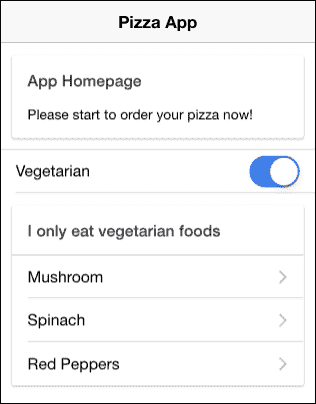
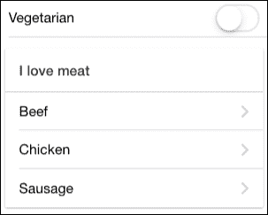
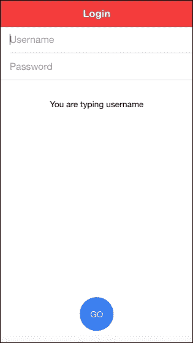
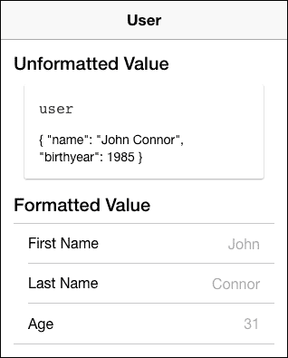
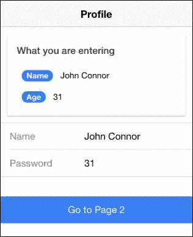
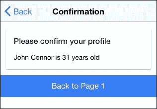
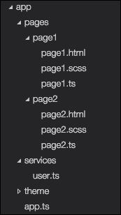
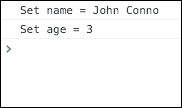

# 第三章：使用 Angular 2 构建块扩展 Ionic 2

在本章中，我们将介绍与创建自定义组件、指令和过滤器相关的以下任务：

+   创建自定义披萨订购组件

+   创建自定义用户名输入指令

+   创建自定义管道

+   创建一个共享服务以向多个页面提供数据

# 简介

大多数 Ionic 的内置功能实际上是预构建的组件。在本节中，你将学习如何使用 `html` 模板创建自己的自定义组件，其中包含 Ionic 组件。

组件实际上定义了 Angular 2。组件不过是一个具有自我描述特征的类。例如，`<ul>` 是你已熟悉的组件。之前，你使用了各种 Ionic 组件，如 `<ion-list>` 和 `<ion-item>`。组件是一个装饰器（即 `@Component`），用于向类添加元数据以描述以下内容：

+   **选择器**：这是要在 DOM 中使用的名称（例如，`<my-component>`）

+   **模板或 templateUrl**：这指的是组件的渲染方式

+   **指令**：这指的是你计划在组件内部使用的指令依赖项列表

+   **提供者**：这是你计划在组件内部使用的提供者（即服务）列表

当然，还有许多其他选项，但前面的四个选项是最常见的。

# 创建自定义披萨订购组件

在本节中，你将构建一个应用来演示具有私有变量和模板的自定义组件。观察以下披萨订购组件的截图：



用户不会注意到哪个区域是页面的一部分，而不是一个独立的组件。你自定义的组件是列表唯一一个正在监听 **素食** 复选框的区域：



## 准备工作

此应用示例可以在浏览器或物理设备上运行。

## 如何操作...

执行以下说明：

1.  使用如下所示的 `blank` 模板创建一个新的 `MyComponent` 应用，并进入 `MyComponent` 文件夹：

    ```js
    $ ionic start MyComponent blank --v2
    $ cd MyComponent

    ```

1.  打开 `./app/pages/home/home.html` 文件，并用以下代码替换内容：

    ```js
    <ion-header>
      <ion-navbar>
        <ion-title>
          Pizza App
        </ion-title>
      </ion-navbar>
    </ion-header>

    <ion-content padding>
      <ion-card>
        <ion-card-header>
          App Homepage
        </ion-card-header>
        <ion-card-content>
          Please start to order your pizza now!
        </ion-card-content>
      </ion-card>

      <my-component></my-component>
    </ion-content>
    ```

    这是你的根页面，包含 `<my-component>`，稍后将会定义。

1.  打开 `./app/pages/home/home.ts` 文件进行全局编辑，以下代码：

    ```js
    import { Component } from '@angular/core';
    import { NavController } from 'ionic-angular';
    import { MyComponent } from '../../components/foo';

    @Component({
      selector: 'page-home',
      templateUrl: 'home.html'
    })
    export class HomePage {

      constructor(public navCtrl: NavController) {

      }

    }
    ```

    你只需将 `MyComponent` 声明为依赖项即可。如果你熟悉 Angular 1 的指令概念，组件基本上就是一个带有模板的指令。

1.  现在，让我们通过首先创建一个指令来创建组件，如下面的代码所示：

    ```js
    $ mkdir ./src/components

    ```

1.  在你刚刚创建的 `components` 目录中创建一个 `foo.ts` 文件，如下所示：

    ```js
    import { Component } from '@angular/core';

    @Component({
      selector: 'my-component',
      templateUrl: 'foo.html'
    })
    export class MyComponent {
      public data: any = {myToggle: true};

      constructor() {
      }

      isClicked(val) {
        console.log('Vegetarian: ' + val);
      }

    }
    ```

1.  在 `./src/components` 文件夹中创建 `foo.html`，如下所示：

    ```js
    <ion-list>
      <ion-item>
        <ion-label>Vegetarian</ion-label>
        <ion-toggle (click)="isClicked(data.myToggle)" [(ngModel)]="data.myToggle"></ion-toggle>
      </ion-item>

      <ion-card *ngIf="data.myToggle">
        <ion-card-header>
          I only eat vegetarian foods
        </ion-card-header>

        <ion-list>
          <button ion-item>
            Mushroom
          </button>
          <button ion-item>
            Spinach
          </button>
          <button ion-item>
            Red Peppers
          </button>
        </ion-list>
      </ion-card>

      <ion-card *ngIf="!data.myToggle">
        <ion-card-header>
          I love meat
        </ion-card-header>

        <ion-list>
          <button ion-item>
            Beef
          </button>
          <button ion-item>
            Chicken
          </button>
          <button ion-item>
            Sausage
          </button>
        </ion-list>
      </ion-card>

    </ion-list>
    ```

1.  修改`./src/app/app.module.ts`，如图所示，以便你可以声明`MyComponent`。观察以下代码：

    ```js
    import { NgModule } from '@angular/core';
    import { IonicApp, IonicModule } from 'ionic-angular';
    import { MyApp } from './app.component';
    import { HomePage } from '../pages/home/home';
    import { MyComponent } from '../components/foo';

    @NgModule({
      declarations: [
        MyApp,
        HomePage,
        MyComponent
      ],
      imports: [
        IonicModule.forRoot(MyApp)
      ],
      bootstrap: [IonicApp],
      entryComponents: [
        MyApp,
        HomePage,
        MyComponent
      ],
      providers: []
    })
    export class AppModule {}
    ```

1.  打开你的终端，使用以下命令运行应用程序：

    ```js
    $ ionic serve

    ```

## 它是如何工作的…

你可能会想知道为什么需要创建一个组件来切换一个列表（披萨配料选项列表）。答案是，这只是一个演示，说明你可以如何使用组件来模块化你的应用程序。你完成的关键步骤如下：

+   你创建了一个自定义组件，称为`<my-component>`，它可以在任何地方使用，包括在你的应用程序外部。

+   组件内部的数据是完全私有的。这意味着没有其他人可以访问它，除非在组件的类中调用一个方法。

+   你可以在组件内部添加或更改行为，而不会影响组件外部其他区域。

创建一个组件时，你需要确保从 Angular 2 本身（而不是从 Ionic 2）导入`decorator`，如下所示：

```js
import { Component } from '@angular/core';

@Component({
  selector: 'my-component',
  templateUrl: 'foo.html'
})
```

在你的组件模板中，一切都是局部的，即组件类内部的内容。因此，你可以使用`click`绑定点击事件，如下面的代码所示：

```js
  <ion-item>
    <ion-label>Vegetarian</ion-label>
    <ion-toggle (click)="isClicked(data.myToggle)" [(ngModel)]="data.myToggle"></ion-toggle>
  </ion-item>
```

就像 Angular 1 一样，你需要使用`[(ngModel)]`来声明你想要`data.myToggle`作为你的模型。`[(..)]`部分是为了告诉 Angular 2 这是一个双向绑定。

有两种披萨配料列表。第一个列表如下：

```js
  <ion-card *ngIf="data.myToggle">
    <ion-card-header>
      I only eat vegetarian foods
    </ion-card-header>

    <ion-list>
      <button ion-item>
        Mushroom
      </button>
      <button ion-item>
        Spinach
      </button>
      <button ion-item>
        Red Peppers
      </button>
    </ion-list>
  </ion-card>
```

第二个披萨配料列表如下所示：

```js
  <ion-card *ngIf="!data.myToggle">
    <ion-card-header>
      I love meat
    </ion-card-header>

    <ion-list>
      <button ion-item>
        Beef
      </button>
      <button ion-item>
        Chicken
      </button>
      <button ion-item>
        Sausage
      </button>
    </ion-list>
  </ion-card>
```

要根据`data.myToggle`模型切换每个列表的可见性，你可以使用`*ngIf`，它与 Angular 1 中的`ng-if`非常相似。

## 参见

+   关于 Angular 2 文档中组件的更多信息，你可以访问[`angular.io/docs/ts/latest/guide/architecture.html`](https://angular.io/docs/ts/latest/guide/architecture.html)。

# 创建自定义用户名输入指令

由于你在前一节中已经完成了创建组件的过程，你可能想知道组件和指令之间的区别是什么。如果你有一些 Angular 1 的经验，你可能注意到它没有组件的定义。从 Angular 2 开始，有以下三种类型的指令：

| 类型 | 描述 |
| --- | --- |
| 组件 | 它们有一个与组件关联的模板和类（即`ion-input`） |
| 结构性指令 | 它们改变其作用域内的 DOM 结构（即`*ngIf`或`*ngFor`） |
| 属性指令 | 它们通过拦截其显示或事件来改变当前 DOM 的外观 |

在同一个指令中，你可能会有结构和属性特性的混合。在本节中，你将学习如何创建一个属性指令，它可以防止在**用户名**中输入某些字符，并通过切换其可见性来显示另一个 DOM 节点（显示**您正在输入用户名**）。观察以下应用程序的截图：



**GO**按钮只是为了美观，你不需要为它编写任何代码。

## 准备工作

这个应用示例可以在浏览器或物理设备上运行。

## 如何做到这一点...

注意以下说明：

1.  使用`blank`模板创建一个新的`MyIonicInputDirective`应用，如下所示，并进入`MyIonicInputDirective`文件夹：

    ```js
    $ ionic start MyIonicInputDirective blank --v2
    $ cd MyIonicInputDirective

    ```

1.  打开`./src/app/pages/home/home.html`文件，并用以下代码替换内容：

    ```js
    <ion-header>
      <ion-navbar color="danger">
        <ion-title>
          Login
        </ion-title>
      </ion-navbar>
    </ion-header>

    <ion-content padding>
      <ion-list>

        <ion-item >
          <ion-input type="text" placeholder="Username" [(ngModel)]="username"[myIonicInput]="myStyles"></ion-input>
        </ion-item>

        <ion-item>
          <ion-input type="password" placeholder="Password"></ion-input>
        </ion-item>

      </ion-list>
      <p *ngIf="myStyles.showUsername" class="hint">
        You are typing username
      </p>

      <ion-fab bottom center>
        <button ion-fab>GO</button>
      </ion-fab>
    </ion-content>
    ```

    如前所述，**GO**按钮只是 Ionic 2 中新的浮动按钮功能的一个示例。你只需要包含`bottom`和`center`来定位它。这些实际上是属性指令的好例子。

1.  在前一步骤所在的文件夹中打开`home.ts`，编辑并插入以下代码：

    ```js
    import { Component } from '@angular/core';
    import { NavController } from 'ionic-angular';

    @Component({
      selector: 'page-home',
      templateUrl: 'home.html'
    })
    export class HomePage {
      private myStyles: Object = {showUsername: false};

      constructor(public navCtrl: NavController) {
      }

    }
    ```

1.  创建`./src/directives`文件夹，如下命令所示：

    ```js
    $ mkdir ./src/directives

    ```

1.  在`directives`文件夹中创建`my-ionic-input.ts`文件，并复制以下代码：

    ```js
    import {Directive, ElementRef, Input} from '@angular/core';

    @Directive({
      selector: '[myIonicInput]',
      host: {
        '(mouseenter)': 'onMouseEnter()',
        '(mouseleave)': 'onMouseLeave()'
        // '(keypress)': 'onKeyPress'
      }
    })
    export class MyIonicInputDirective {
      @Input('myIonicInput') myStyles: any;

      constructor(private el: ElementRef) { 
        el.nativeElement.onkeypress = function(e) {
          console.log(e);

          if ('~!@#$%^&*()-='.includes(String.fromCharCode(e.keyCode))) {
            e.preventDefault();
            return;
          }
        }
      }
      onMouseEnter() { 
        this.myStyles.showUsername = true;
      }

      onMouseLeave(e) { 
        this.myStyles.showUsername = false; 
      }

      // onKeyPress will not work with ion-input directly because the actual input element is a child of ion-input  
      // onKeyPress() { 
      //   console.log("onKeyPress");
      // }
    }
    ```

1.  打开并编辑`./src/app/app.module.ts`以声明你的新指令，如下所示：

    ```js
    import { NgModule } from '@angular/core';
    import { IonicApp, IonicModule } from 'ionic-angular';
    import { MyApp } from './app.component';
    import { HomePage } from '../pages/home/home';
    import { MyIonicInputDirective } from '../directives/my-ionic-input';

    @NgModule({
      declarations: [
        MyApp,
        HomePage,
        MyIonicInputDirective
      ],
      imports: [
        IonicModule.forRoot(MyApp)
      ],
      bootstrap: [IonicApp],
      entryComponents: [
        MyApp,
        HomePage
      ],
      providers: []
    })
    export class AppModule {}
    ```

1.  进入你的终端并运行应用，如下所示：

    ```js
    $ ionic serve

    ```

## 它是如何工作的…

主页模板（`home.html`）非常典型，包含`ion-list`和`ion-item`，它们包含你的输入元素。然而，有两个重要的事情需要注意。首先，在`ion-input`组件中有一个属性，称为`myIonicInput`。观察以下代码：

```js
<ion-item >
  <ion-input type="text" placeholder="Username" [(ngModel)]="username" [myIonicInput]="myStyles"></ion-input>
</ion-item>
```

第二，`myStyles`对象现在用于切换`<p>`元素的可见性，如下所示：

```js
<p *ngIf="myStyles.showUsername" class="hint">
  You are typing username
</p>
```

这个`myStyles`对象实际上是在`home.ts`文件中你的`HomePage`类的`private`变量中，如下所示：

```js
export class HomePage {
  private myStyles: Object = {showUsername: false};
}
```

使用 TypeScript，你可以将一个类型（即对象）分配给一个具有默认值的变量。你还可以注意，`MyIonicInputDirective`应该声明为依赖项以注入到模板指令中。

要创建一个基本的指令，你必须至少导入`Directive`和`ElementRef`以操作 DOM。然而，由于这个`Directive`有输入（即`myStyles`），你应在`my-ionic-input.ts`中导入`Input`，如下面的代码所示：

```js
import {Directive, ElementRef, Input} from '@angular/core';
```

你的指令中有`selector`和`host`元数据，如下所示：

```js
@Directive({
  selector: '[myIonicInput]',
  host: {
    '(mouseenter)': 'onMouseEnter()',
    '(mouseleave)': 'onMouseLeave()'
    // '(keypress)': 'onKeyPress'
  }
})
```

`myIonicInput`选择器将从 DOM 中查询，并触发该 DOM 节点的*动作*。对于 DOM 上的事件检测，你必须将事件名称映射到类方法。例如，`mouseenter`事件将触发指令类`MyIonicInputDirective`中的`onMouseEnter()`方法的调用。

现在，让我们更仔细地看看指令的类：

```js
export class MyIonicInputDirective {
  @Input('myIonicInput') myStyles: any;

  constructor(private el: ElementRef) { 
    el.nativeElement.onkeypress = function(e) {
      console.log(e);

      if ('~!@#$%^&*()-='.includes(String.fromCharCode(e.keyCode))) {
        e.preventDefault();
        return;
      }
    }
  }
  onMouseEnter() { 
    this.myStyles.showUsername = true;
  }

  onMouseLeave(e) { 
    this.myStyles.showUsername = false; 
  }

  // onKeyPress will not work with ion-input directly because the actual input element is a child of ion-input  
  // onKeyPress() { 
  //   console.log("onKeyPress");
  // }
}
```

`@Input` 装饰器用于声明您将从模板中引入一个变量。这也是为什么您必须在 `[myIonicInput]="myStyles"` 中使用方括号的原因。否则，`myStyles` 将只是一个字符串，而不是指向 `HomePage` 类中 `myStyles` 对象的表达式。在这里需要注意的另一件有趣的事情是 `constructor` 中的代码。`ElementRef` 指向您放置属性指令的相同 DOM。您想通过 `el.nativeElement.onkeypress` 修改键盘的行为，以便不允许特殊字符。如果用户输入特殊字符，它将触发 `e.preventDefault()`，并且不会发生任何事情。键盘事件基本上被丢弃。您可能会想知道为什么我们不能直接使用 `keypress` 事件并将其映射到 `onKeyPress`，这已经被故意注释掉了。原因是您将 `myIonicInput` 指令放置在 `ion-input` 之上。但实际上，`<input>` DOM 只是 `ion-input` 的一个子元素。因此，如果您在父 `ion-input` 上监听 `keypress` 事件，您将无法绑定它。

`onMouseEnter` 和 `onMouseLeave` 方法非常直观，因为它们只是切换 `myStyles.showUsername` 变量。再次强调，这个 `myStyles` 对象只是指向 `HomePage` 的 `myStyles` 的一个引用。因此，如果您在这里更改变量，它也会在主页级别上更改。

## 参见

+   关于 Angular 2 指令的更多信息，您可以参考官方文档 [`angular.io/docs/ts/latest/guide/attribute-directives.html`](https://angular.io/docs/ts/latest/guide/attribute-directives.html)

+   由于这是 TypeScript 首次出现的章节，因此查看 [`www.typescriptlang.org/docs/tutorial.html`](http://www.typescriptlang.org/docs/tutorial.html) 手册可能会有所帮助，以获取更多详细信息

# 创建自定义管道

管道也是 Angular 2 的一个特性，并不特定于 Ionic。如果您熟悉 Angular 1，那么 *管道* 与 *过滤器* 完全相同。您可能想要使用管道的主要原因是在视图中以不同的格式显示数据。您不希望更改组件中的实际值。这使得事情变得非常方便，因为您不需要在代码中决定具体的格式，同时在视图层留下灵活性。以下是一些有用的内置管道列表（来自 [`angular.io/docs/ts/latest/api/#!?apiFilter=pipe`](https://angular.io/docs/ts/latest/api/#!?apiFilter=pipe)）：

+   AsyncPipe

+   DatePipe

+   NumberPipe

+   SlicePipe

+   DecimalPipe

+   JsonPipe

+   PercentPipe

+   UpperCasePipe

+   LowerCasePipe

+   CurrencyPipe

+   ReplacePipe

在本节中，您将学习如何使用 `@Pipe` 装饰器创建自定义管道。以下是该应用的截图：



虽然应用界面非常简单，但这个例子是为了向您展示如何创建一个管道来提取对象数据。

## 准备工作

没有必要在物理设备上进行测试，因为 Angular 2 管道在浏览器中运行得很好。

## 如何操作...

观察以下说明：

1.  使用`blank`模板创建一个新的`CustomPipe`应用，如下所示，并进入`CustomPipe`文件夹：

    ```js
    $ ionic start CustomPipe blank --v2
    $ cd CustomPipe

    ```

1.  打开`./src/pages/home/home.html`文件并使用以下代码修改内容：

    ```js
    <ion-header>
      <ion-navbar>
        <ion-title>
          User
        </ion-title>
      </ion-navbar>
    </ion-header>

    <ion-content padding>

      <h4>Unformatted Value</h4>
      <ion-card>

        <ion-card-header>
          <code>user</code>
        </ion-card-header>

        <ion-card-content>
          {{ user | json }}
        </ion-card-content>

      </ion-card>

      <h4>Formatted Value</h4>
      <ion-list>

        <ion-item>
          <ion-label fixed>First Name</ion-label>
          <ion-note item-right>{{ user | userExtract : "firstname" }}</ion-note>
        </ion-item>

        <ion-item>
          <ion-label fixed>Last Name</ion-label>
          <ion-note item-right>{{ user | userExtract : "lastname" }}</ion-note>
        </ion-item>

        <ion-item>
          <ion-label fixed>Age</ion-label>
          <ion-note item-right>{{ user | userExtract : "age" }}</ion-note>
        </ion-item>

      </ion-list>
    </ion-content>
    ```

    你可以快速看到模板使用了`userExtract`管道来渲染正确的信息。

1.  然后，将`./src/pages/home/home.ts`文件的内容替换为以下代码：

    ```js
    import { Component } from '@angular/core';
    import { NavController } from 'ionic-angular';

    @Component({
      selector: 'page-home',
      templateUrl: 'home.html'
    })
    export class HomePage {
      private user: any;

      constructor(public navCtrl: NavController) {
        this.user = {
          name: 'John Connor',
          birthyear: 1985
        }
      }

    }
    ```

    你还没有`custom-pipe.ts`文件，所以，你需要创建它。

1.  使用以下命令创建`./src/utils`文件夹：

    ```js
    $ mkdir ./utils/utils

    ```

    你可以给这个文件夹起任何名字。然而，由于有时管道被认为是*实用*函数，让我们称它为`utils`。

1.  在`utils`文件夹中创建`custom-pipe.ts`文件并复制以下代码：

    ```js
    import { Pipe, PipeTransform } from '@angular/core';

    @Pipe({name: 'userExtract'})
    export class UserExtractPipe implements PipeTransform {
      transform(value: any, arg) : any {
        let newVal: any;
        if (arg == "firstname") {

          newVal = value.name ? value.name.split(' ')[0] : '';

        } else if (arg == "lastname") {

          newVal = value.name ? value.name.split(' ').splice(-1) : '';

        } else if (arg == "age") {
          var currentTime = new Date();

          newVal = value.birthyear ? currentTime.getFullYear() - value.birthyear : 0;
        }

        return newVal;
      }
    }
    ```

1.  将`UserExtractPipe`添加到`./src/app/app.module.ts`中，并用以下代码替换：

    ```js
    import { NgModule } from '@angular/core';
    import { IonicApp, IonicModule } from 'ionic-angular';
    import { MyApp } from './app.component';
    import { HomePage } from '../pages/home/home';
    import { UserExtractPipe } from '../utils/custom-pipe'

    @NgModule({
      declarations: [
        MyApp,
        HomePage,
        UserExtractPipe
      ],
      imports: [
        IonicModule.forRoot(MyApp)
      ],
      bootstrap: [IonicApp],
      entryComponents: [
        MyApp,
        HomePage
      ],
      providers: []
    })
    export class AppModule {}
    ```

1.  打开你的终端并运行应用，如下所示：

    ```js
    $ ionic serve

    ```

## 它是如何工作的…

你可以在视图中使用 Angular 2 管道简单地转换或转换任何值到所需值。你对管道的结构没有限制。Angular 2 会自动检测模板中的`|`符号，并将它前面的值转换为输入。要创建一个管道，你必须导入装饰器并提供一个名称（见`custom-pipe.ts`），如下所示：

```js
import { Pipe, PipeTransform } from '@angular/core';

@Pipe({name: 'userExtract'})
```

模板输入是以下`value`参数：

```js
transform(value: any, arg) : any {
```

`transform`方法返回的值将是传递给视图的输出，如下面的代码所示：

```js
return newVal;
```

在这个例子中，你正在为管道处理取一个参数，如下面的代码所示：

```js
    if (arg == "firstname") {

      newVal = value.name ? value.name.split(' ')[0] : '';

    } else if (arg == "lastname") {

      newVal = value.name ? value.name.split(' ').splice(-1) : '';

    } else if (arg == "age") {
      var currentTime = new Date();

      newVal = value.birthyear ? currentTime.getFullYear() - value.birthyear : 0;
    }
```

例如，这是`home.html`模板中的内容：

```js
    <ion-item>
      <ion-label fixed>First Name</ion-label>
      <ion-note item-right>{{ user | userExtract : "firstname" }}</ion-note>
    </ion-item>
```

每个参数都放在冒号（`:`）后面。然后，在你的`@Pipe`类中，你可以使用`arg`来引用它。其余的代码就像前面章节中展示的那样非常简单。观察以下内容

+   如果是`firstname`，取空格分隔后的第一个单词

+   如果是`lastname`，取最后一个单词

+   如果是`age`，从出生年份减去当前年份

当然，你可能会有更复杂的管道场景。然而，总体建议是在视图中保持简单，以确保渲染性能。如果你需要进行大量处理，最好将其作为一个单独的变量来处理。

## 参见

+   要了解更多关于 Angular 2 管道的信息，你可以查看官方文档[`angular.io/docs/ts/latest/guide/pipes.html`](https://angular.io/docs/ts/latest/guide/pipes.html)

# 创建一个共享服务以向多个页面提供数据

当您开发涉及大量页面和与后端通信的应用程序时，您需要有一种跨页面和组件进行通信的方式。例如，您可能有一个服务从后端请求用户数据并将其存储在公共本地服务中。然后，您需要提供一个让用户更新其用户数据并实时查看更新的方法。当用户导航到不同的页面时，相同的信息将被拉取并渲染，而无需多次访问后端。这是一个非常常见的场景，需要使用 Angular 2 中的 `@Injectable` 装饰器。

观察您将要构建的应用程序的以下截图：



用户可以填写表单并实时查看其上方的更新。然后，他们可以转到下一页（**转到页面 2**）并查看以下截图：



此页面使用与前一页相同的服务，并引用了具有相同名称和年龄的相同日期。您将在本节学习以下主题：

+   使用 `@Injectable` 创建服务

+   在多个页面间共享服务

+   在服务内部使用获取器和设置器检测更改

## 准备工作

此应用程序示例可以在浏览器或物理设备上运行。

## 如何操作...

仔细观察以下说明：

1.  按照示例，使用 `blank` 模板创建一个新的 `SharedService` 应用程序，然后进入 `SharedService` 文件夹：

    ```js
    $ ionic start SharedService blank --v2
    $ cd SharedService

    ```

1.  由于您有两个页面和一个适用于两者的公共服务，您需要在目录中进行一些更改。让我们首先修改 `./src/app/app.component.ts` 文件，以便 `rootPage` 指向 `Page1`：

    ```js
    import { Component } from '@angular/core';
    import { Platform } from 'ionic-angular';
    import { StatusBar, Splashscreen } from 'ionic-native';
    import { Page1 } from '../pages/page1/page1';

    @Component({
      template: `<ion-nav [root]="rootPage"></ion-nav>`
    })
    export class MyApp {
      rootPage = Page1;

      constructor(platform: Platform) {
        platform.ready().then(() => {
          // Okay, so the platform is ready and our plugins are available.
          // Here you can do any higher level native things you might need.
          StatusBar.styleDefault();
          Splashscreen.hide();
        });
      }
    }
    ```

1.  创建 `./src/pages/page1`，如下所示：

    ```js
    $ mkdir ./src/pages/page1

    ```

1.  在 `page1` 文件夹中创建您的第一个模板 `page1.html`，如下所示：

    ```js
    <ion-header>
      <ion-navbar>
        <ion-title>
          Profile
        </ion-title>
      </ion-navbar>
    </ion-header>

    <ion-content>
      <ion-card>
        <ion-card-header>
          What you are entering
        </ion-card-header>
        <ion-card-content>
          <ion-badge item-right>Name</ion-badge> {{ user.name }}
          <br><br>
          <ion-badge item-right>Age</ion-badge> {{ user.age }}
        </ion-card-content>
      </ion-card>
      <ion-list>

        <ion-item>
          <ion-label fixed>Name</ion-label>
          <ion-input type="text" [(ngModel)]="user.name"></ion-input>
        </ion-item>

        <ion-item>
          <ion-label fixed>Password</ion-label>
          <ion-input type="number" [(ngModel)]="user.age"></ion-input>
        </ion-item>

      </ion-list>

      <button ion-button full block (click)="goToPage2()">Go to Page 2</button>

    </ion-content>
    ```

1.  在 `page1` 文件夹中创建 `page1.ts`，如下所示：

    ```js
    import { Component } from '@angular/core';
    import { NavController } from 'ionic-angular';
    import { UserService } from '../../services/user';
    import { Page2 } from '../page2/page2';

    @Component({
      selector: 'page-one',
      templateUrl: 'page1.html'
    })
    export class Page1 {
      private user: any;
      private nav: any;

      constructor(public navCtrl: NavController, user: UserService, nav: NavController) {
        console.log(user.name);
        this.user = user;
        this.nav = nav;
      }

      goToPage2(){
        this.nav.push(Page2);
      }
    }
    ```

    ### 小贴士

    文件扩展名是 `.ts`，而不是 `.js`，因为您将使用一些 TypeScript 特定功能，例如获取器和设置器。

1.  类似地，使用以下命令创建 `page2` 文件夹：

    ```js
    $ mkdir ./src/pages/page1

    ```

1.  在 `page2` 文件夹中同样添加 `page2.html` 模板，如下所示：

    ```js
    <ion-header>
      <ion-navbar>
        <ion-title>
          Confirmation
        </ion-title>
      </ion-navbar>
    </ion-header>

    <ion-content class="home">
      <ion-card>
        <ion-card-header>
          Please confirm your profile
        </ion-card-header>
        <ion-card-content>
          {{ user.name }} is {{ user.age }} years old
        </ion-card-content>
      </ion-card>

      <button ion-button full block (click)="goToPage1()">Back to Page 1</button>
    </ion-content>
    ```

    这是您的第二个页面，具有相同的 `name` 和 `age` 信息。

1.  在 `page2` 文件夹中创建 `page2.ts`，如下所示：

    ```js
    import { Component } from '@angular/core';
    import { NavController } from 'ionic-angular';
    import { UserService } from '../../services/user';
    import { Page1 } from '../page1/page1';

    @Component({
      selector: 'page-two',
      templateUrl: 'page2.html'
    })
    export class Page2 {
      private user: any;
      private nav: any;

      constructor(public navCtrl: NavController, user: UserService, nav: NavController) {
        console.log(user.name);
        this.user = user;
        this.nav = nav;
      }

      goToPage1(){
        this.nav.push(Page1);
      }
    }
    ```

1.  使用以下命令创建 `services` 文件夹：

    ```js
    $ mkdir ./src/services

    ```

1.  在 `services` 文件夹中的 `user.ts` 文件中放置 `UserService`，如下所示：

    ```js
    import {Injectable} from '@angular/core';

    @Injectable()
    export class UserService {
      private _name: string;
      private _age: number;

      constructor() {
        this._name = 'John Connor';
        this._age = 31;
      }

      get name() {
        return this._name;
      }

      set name(newVal) {
        console.log('Set name = ' + newVal);
        this._name = newVal;
      }

      get age() {
        return this._age;
      }

      set age(newVal) {
        console.log('Set age = ' + newVal);
        this._age = newVal;
      }
    }
    ```

1.  打开并编辑 `./src/app/app.module.ts`，以便您可以注入 `UserService` 作为全局提供者：

    ```js
    import { NgModule } from '@angular/core';
    import { IonicApp, IonicModule } from 'ionic-angular';
    import { MyApp } from './app.component';
    import { Page1 } from '../pages/page1/page1';
    import { Page2 } from '../pages/page2/page2';
    import { UserService } from '../services/user';

    @NgModule({
      declarations: [
        MyApp,
        Page1,
        Page2
      ],
      imports: [
        IonicModule.forRoot(MyApp)
      ],
      bootstrap: [IonicApp],
      entryComponents: [
        MyApp,
        Page1,
        Page2
      ],
      providers: [UserService]
    })
    export class AppModule {}
    ```

1.  验证您的文件夹结构如下截图所示：

1.  进入您的终端，并按照以下命令运行应用程序：

    ```js
    $ ionic serve

    ```

您可以从 `页面 1` 切换到 `页面 2`，然后再切回来，数据将在页面间持续存在。

## 它是如何工作的…

通常，如果你想跨多个页面使用一个通用服务，你必须在其最高级别注入它。在这个例子中，你将 `UserService` 作为依赖项放在 `app.module.ts` 的开始处，如下所示：

```js
providers: [UserService]
```

之后，应用中的其他页面可以开始使用这个通用服务，而无需重新注入。主要原因在于，每次注入服务或类时，它都会实例化一个新的对象，这最终会清除内存中所有现有的数据。如果你想跨页面保持数据持久，它应该位于父应用中，以避免重新注入。

要在每一页使用 `UserService`，你只需要导入它，如下面的代码所示：

```js
import { UserService } from '../../services/user';
```

将服务“引入”的方法是将引用放在构造函数（page1.ts）中，如下所示：

```js
  constructor(user: UserService, nav: NavController) {
    console.log(user.name);
    this.user = user;
    this.nav = nav;
  }
```

这会将 `UserService` 引用传递到页面的本地私有变量（在本例中为 `this.user`）。

从模板的角度来看，使用 `{{ user.name }}` 和 `{{ user.age }}` 注入数据之间没有区别。

现在，让我们看看 `UserService`：

```js
import {Injectable} from '@angular/core';

@Injectable()
export class UserService {
  private _name: string;
  private _age: number;

  constructor() {
    this._name = 'John Connor';
    this._age = 31;
  }

  get name() {
    return this._name;
  }

  set name(newVal) {
    console.log('Set name = ' + newVal);
    this._name = newVal;
  }

  get age() {
    return this._age;
  }

  set age(newVal) {
    console.log('Set age = ' + newVal);
    this._age = newVal;
  }
}
```

实际上，这里有几个事情在进行。首先，你需要从 `@angular/core` 中导入 `Injectable`。

### 小贴士

不要忘记在 `@Injectable()` 中使用括号。

其次，如果你想使用获取器和设置器，你需要创建单独的变量，称为 `_name` 和 `_age`，来存储数据。然后，你可以使用 get/set 方法在页面访问或设置此通用类中的变量时进行额外的处理。如果你从“页面 1”更改 `name` 或 `age`，你可以在控制台中看到以下日志：



这个功能非常有用，因为你可以用它来替代 `watch` 或 `observable`。如果你还记得 Angular 1，你必须使用 `$scope.$watch` 来实现类似的功能。

## 相关内容

+   更多关于 Angular 2 服务的详细信息，请访问官方文档：[`angular.io/docs/ts/latest/tutorial/toh-pt4.html`](https://angular.io/docs/ts/latest/tutorial/toh-pt4.html)

+   你可以在 [`angular.io/docs/ts/latest/cookbook/component-communication.html`](https://angular.io/docs/ts/latest/cookbook/component-communication.html) 上找到关于组件通信的许多技术的好指导。
